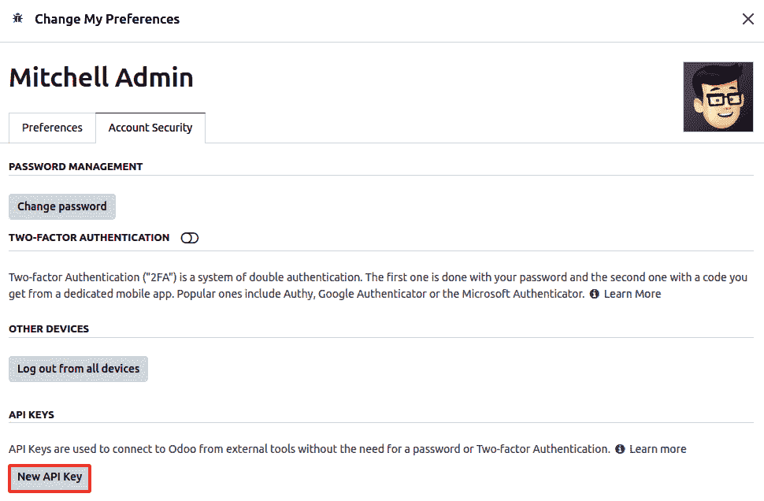
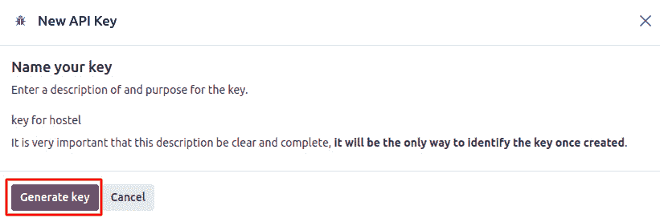
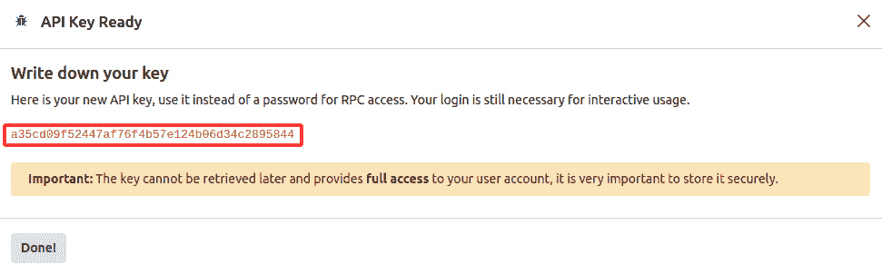

# 20

# Odoo 中的远程过程调用

Odoo 服务器支持 **远程过程调用**（**RPC**），这意味着您可以从外部应用程序连接 Odoo 实例。例如，如果您想在用 Java 编写的 Fan Android 应用程序中显示发货订单的状态，您可以通过 RPC 从 Odoo 获取发货状态。使用 Odoo RPC API，您可以在数据库上执行任何 CRUD 操作。Odoo RPC 不仅限于 CRUD 操作；您还可以调用任何模型的公共方法。当然，您需要适当的访问权限来执行这些操作，因为 RPC 尊重您在数据库中定义的所有访问权限和记录规则。因此，它非常安全，因为 RPC 尊重所有访问权限和记录规则。Odoo RPC 不依赖于平台，因此您可以在任何平台上使用它，包括 Odoo.sh、在线或自托管平台。Odoo RPC 可以与任何编程语言一起使用，因此您可以将 Odoo 集成到任何外部应用程序中。

Odoo 提供两种类型的 RPC API：XML-RPC 和 JSON-RPC。在本章中，我们将学习如何从外部程序使用这些 RPC。最后，您将学习如何通过 OCA 的 `odoorpc` 库使用 Odoo RPC。

在本章中，我们将介绍以下食谱：

+   使用 XML-RPC 登录/连接 Odoo

+   使用 XML-RPC 搜索/读取记录

+   使用 XML-RPC 创建/更新/删除记录

+   使用 XML-RPC 调用方法

+   使用 JSON-RPC 登录/连接 Odoo

+   使用 JSON-RPC 获取/搜索记录

+   使用 JSON-RPC 创建/更新/删除记录

+   使用 JSON-RPC 调用方法

+   OCA odoorpc 库

+   生成 API 密钥

# 技术要求

在本章中，我们将使用我们在 *第十九章* 中创建的 `my_hostel` 模块，*使用 Odoo.sh 进行管理、部署和测试*。您可以在 GitHub 仓库中找到相同的初始 `my_hostel` 模块：[`github.com/PacktPublishing/Odoo-17-Development-Cookbook-Fifth-Edition/tree/main/Chapter20`](https://github.com/PacktPublishing/Odoo-17-Development-Cookbook-Fifth-Edition/tree/main/Chapter20)。

在这里，我们不会介绍一种新的语言，因为您可能不熟悉它。我们将继续使用 Python 来访问 RPC API。如果您想使用其他语言，也可以，因为相同的程序可以在任何语言中应用以访问 RPC。

要通过 RPC 连接 Odoo，您需要一个正在运行的 Odoo 实例来连接。在本章中，我们将假设您有一个运行在 `http://localhost:8017` 的 Odoo 服务器，您调用了 `cookbook_17e` 数据库，并在其中安装了 `my_hostel` 模块。请注意，您可以通过 RPC 连接到任何有效的 IP 或域名。

# 使用 XML-RPC 登录/连接 Odoo

在这个食谱中，我们将通过 RPC 执行用户身份验证，以检查提供的凭据（服务器 _url、db_name、username 和 password）是否有效。

## 准备工作

要通过 RPC 连接到 Odoo 实例，您需要一个正在运行的 Odoo 实例来连接。我们将假设您在 `http://localhost:8017` 上运行了 Odoo 服务器，并且您已安装了 `my_hostel` 模块。

## 如何操作...

执行以下步骤以通过 RPC 进行用户身份验证：

1.  添加 `odoo_authenticate.py` 文件。您可以将此文件放在任何您想要的位置，因为 RPC 程序将独立工作。

1.  将以下代码添加到文件中：

    ```py
    from xmlrpc import client
    server_url = 'http://localhost:8017'
    db_name = 'cookbook_17e'
    username = 'admin'
    password = 'admin'
    common = client.ServerProxy('%s/xmlrpc/2/common' % server_url)
    user_id = common.authenticate(db_name, username, password, {})
    if user_id:
        print("Success: User id is", user_id)
    else:
        print("Failed: wrong credentials")
    ```

1.  使用以下命令从终端运行以下 Python 脚本：

    ```py
    python3 odoo_authenticate.py
    ```

如果您提供了有效的登录名和密码，它将打印一个包含用户 ID 的成功消息。

## 它是如何工作的...

在这个菜谱中，我们使用了 Python 的 `xmlrpc` 库通过 XML-RPC 访问 Odoo 实例。这是一个标准的 Python 库，您不需要安装任何其他东西来使用它。

对于身份验证，Odoo 在 `/xmlrpc/2/common` 端点上提供 XML-RPC。此端点用于元方法，不需要身份验证。`authentication()` 方法本身是一个公开方法，因此可以公开调用。`authentication()` 方法接受四个参数——数据库名称、用户名、密码和用户代理环境。用户代理环境是一个必填参数，但如果您不想传递用户代理参数，至少传递一个空字典。

当您使用所有有效参数执行 `authenticate()` 方法时，它将对 Odoo 服务器进行调用并执行身份验证。如果提供的登录 ID 和密码正确，它将返回用户 ID。如果用户不存在或密码不正确，它将返回 `False`。

在通过 RPC 访问任何数据之前，您需要使用 `authenticate()` 方法。这是因为使用错误的凭证访问数据将生成错误。

重要提示

Odoo 的在线实例（`*.odoo.com`）使用 OAuth 身份验证，因此实例上不设置本地密码。要在这些实例上使用 XML-RPC，您需要从实例的 **设置** | **用户** | **用户** 菜单手动设置用户的密码。

此外，用于访问数据的方法需要用户 ID 而不是用户名，因此需要 `authenticate()` 方法来获取用户的 ID。

## 更多内容...

`/xmlrpc/2/common` 端点提供了一种额外的方法：`version()`。您可以在没有凭证的情况下调用此方法。它将返回 Odoo 实例的版本信息。以下是一个 `version()` 方法使用的示例：

```py
from xmlrpc import client
server_url = 'http://localhost:8017'
common = client.ServerProxy('%s/xmlrpc/2/common' % server_url)
version_info = common.version()
print(version_info)
```

前面的程序将生成以下输出：

```py
$ python3 version_info.py
{'server_version': '17.0+e', 'server_version_info': [17, 0, 0, 'final', 0, 'e'], 'server_serie': '17.0', 'protocol_version': 1}
```

此程序将根据您的服务器打印版本信息。

# 使用 XML-RPC 搜索/读取记录

在本菜谱中，我们将了解如何通过 RPC 从 Odoo 实例获取数据。用户可以访问大部分数据，除了那些受安全访问控制和记录规则限制的数据。RPC 可以用在许多情况下，例如收集数据进行分析、一次性操作大量数据或获取数据以在其他软件/系统中显示。可能性无穷无尽，你可以在需要时随时使用 RPC。

## 准备中

我们将创建一个 Python 程序来从 `hostel.room` 模型获取房间数据。确保你已经安装了 `my_hostel` 模块，并且服务器正在 `http://localhost:8017` 上运行。

## 如何操作...

执行以下步骤通过 RPC 获取房间信息：

1.  添加 `rooms_data.py` 文件。你可以将此文件放置在任何你想要的位置，因为 RPC 程序将独立工作。

1.  将以下代码添加到文件中：

    ```py
    from xmlrpc import client
    # room data with search method
    server_url = 'http://localhost:8017'
    db_name = 'cookbook_17e'
    username = 'admin'
    password = 'admin'
    common = client.ServerProxy('%s/xmlrpc/2/common' % server_url)
    user_id = common.authenticate(db_name, username, password, {})
    models = client.ServerProxy('%s/xmlrpc/2/object' % server_url)
    if user_id:
        search_domain = [['name', 'ilike', 'Standard']]
        rooms_ids = models.execute_kw(db_name, user_id, password,
            'hostel.room', 'search',
            [search_domain],
            {'limit': 5})
        print('Rooms ids found:', rooms_ids)
        rooms_data = models.execute_kw(db_name, user_id, password,
            'hostel.room', 'read',
            [rooms_ids, ['name', 'room_no']])
        print("Rooms data:", rooms_data)
    else:
        print('Wrong credentials')
    ```

1.  使用以下命令从终端运行 Python 脚本：

    ```py
    python3 rooms_data.py
    ```

前一个程序将获取房间数据并给出以下输出：

```py
$ python3 rooms_data.py
Rooms ids found: [1, 2, 3, 4, 5]
Rooms data: [{'id': 1, 'name': '8th Standard', 'room_no': '1'}, {'id': 2, 'name': '9th Standard', 'room_no': '2'}, {'id': 3, 'name': '10th Standard', 'room_no': '3'}, {'id': 4, 'name': '11th Standard', 'room_no': '4'}, {'id': 5, 'name': '12th Standard', 'room_no': '5'}]
```

之前截图中的输出是基于我的数据库中的数据。你的 Odoo 实例中的数据可能不同，因此输出也将不同。

## 它是如何工作的...

为了访问房间数据，你首先必须进行身份验证。在程序开始时，我们像在之前的 *通过 XML-RPC 登录/连接 Odoo* 菜谱中做的那样进行了身份验证。如果你提供了有效的凭证，`authentication()` 方法将返回用户记录的 `id`。我们将使用此用户 ID 来获取房间数据。

`/xmlrpc/2/object` 端点用于数据库操作。在我们的菜谱中，我们使用了 `object` 端点来获取房间数据。与 `/xmlrpc/2/common` 端点不同，此端点没有凭证将无法工作。使用此端点，你可以通过 `execute_kw()` 方法访问任何模型的公共方法。`execute_kw()` 接受以下参数：

+   数据库名称

+   用户 ID（我们从 `authenticate()` 方法中获取）

+   密码

+   模型名称，例如，`res.partner` 或 `hostel.room`

+   方法名称，例如，`search`、`read` 或 `create`

+   位置参数数组

+   关键字参数的字典（可选）

在我们的例子中，我们想要获取房间信息。这可以通过 `search()` 和 `read()` 的组合来完成。房间信息存储在 `hostel.room` 模型中，所以在 `execute_kw()` 中，我们使用 `hostel.room` 作为模型名称，`search` 作为方法名称。这将调用 ORM 的 `search` 方法并返回记录 ID。这里唯一的区别是 ORM 的 `search` 方法返回一个记录集，而此搜索方法返回一个 ID 列表。

在`execute_kw()`中，你可以为提供的方法传递参数和关键字参数。`search()`方法接受一个域作为位置参数，因此我们传递了一个域来过滤房间。`search`方法还有其他可选的关键字参数，如`limit`、`offset`、`count`和`order`，我们使用了`limit`参数来获取仅五条记录。这将返回包含名称中包含`Standard`字符串的房间 ID 的列表。

然而，我们需要从数据库中获取房间数据。我们将使用`read`方法来完成这项任务。`read`方法接受一个 ID 列表和字段列表来完成任务。在*步骤 3*的末尾，我们使用了从`search`方法接收到的房间 ID 列表，然后使用房间 ID 来获取房间的`name`和`room_no`。这将返回包含房间信息的字典列表。

重要提示

注意，在`execute_kw()`中传递的参数和关键字参数基于传递的方法。你可以通过`execute_kw()`使用任何公共 ORM 方法。你只需要给方法一个名称，有效的参数和关键字参数。这些参数将被传递到 ORM 中的方法。

## 还有更多...

通过`search()`和`read()`方法的组合获取的数据稍微有些耗时，因为它将进行两次调用。`search_read`是获取数据的另一种方法。你可以通过单个调用搜索和获取数据。以下是使用`search_read()`获取房间数据的替代方法。

重要提示

`read`和`search_read`方法即使在未请求`id`字段的情况下也会返回`id`字段。此外，对于`many2one`字段，你将得到一个由`id`和显示名称组成的数组。例如，`create_uid` `many2one`字段将返回如下数据：`[07, '``Deepak ahir']`。

它将返回与上一个示例相同的输出：

```py
from xmlrpc import client
# room data with search_read method
server_url = 'http://localhost:8017'
db_name = 'cookbook_17e'
username = 'admin'
password = 'admin'
common = client.ServerProxy('%s/xmlrpc/2/common' % server_url)
user_id = common.authenticate(db_name, username, password, {})
models = client.ServerProxy('%s/xmlrpc/2/object' % server_url)
if user_id:
    search_domain = [['name', 'ilike', 'Standard']]
    rooms_ids = models.execute_kw(db_name, user_id, password,
        'hostel.room', 'search_read',
        [search_domain, ['name', 'room_no']],
        {'limit': 5})
    print('Rooms data:', rooms_ids)
else:
    print('Wrong credentials')
```

`search_read`方法显著提高了性能，因为你可以在一个 RPC 调用中获取结果，所以使用`search_read`方法而不是`search`和`read`方法的组合。

# 使用 XML-RPC 创建/更新/删除记录

在上一个菜谱中，我们看到了如何通过 RPC 搜索和读取数据。在这个菜谱中，我们将通过 RPC 执行剩余的**CRUD**操作，这些操作包括**创建**、**更新**（写入）和**删除**（解除链接）。

## 准备工作

我们将创建一个 Python 程序，在`hostel.room`模型中`create`、`write`和`unlink`数据。确保你已经安装了`my_hostel`模块，并且服务器正在`http://localhost:8017`上运行。

## 如何做到这一点...

执行以下步骤通过 RPC 创建、写入和更新房间信息：

1.  添加`rooms_operation.py`文件。你可以将此文件放在任何你想要的位置，因为 RPC 程序将独立工作。

1.  将以下代码添加到`rooms_operation.py`文件中：

    ```py
    from xmlrpc import client
    server_url = 'http://localhost:8017'
    db_name = 'cookbook_17e'
    username = 'admin'
    password = 'admin'
    common = client.ServerProxy('%s/xmlrpc/2/common' % server_url)
    user_id = common.authenticate(db_name, username, password, {})
    models = client.ServerProxy('%s/xmlrpc/2/object' % server_url)
    if user_id:
        # create new room records.
        create_data = [
            {'name': 'Room 1', 'room_no': '101'},
            {'name': 'Room 3', 'room_no': '102'},
            {'name': 'Room 5', 'room_no': '103'},
            {'name': 'Room 7', 'room_no': '104'}
        ]
        rooms_ids = models.execute_kw(db_name, user_id, password,
            'hostel.room', 'create',
            [create_data])
        print("Rooms created:", rooms_ids)
        # Write in existing room record
        room_to_write = rooms_ids[1]  # We will use ids of recently created rooms
        write_data = {'name': 'Room 2'}
        written = models.execute_kw(db_name, user_id, password,
            'hostel.room', 'write',
            [room_to_write, write_data])
        print("Rooms written", written)
        # Delete the room record
        rooms_to_delete = rooms_ids[2:]
        deleted = models.execute_kw(db_name, user_id, password,
            'hostel.room', 'unlink',
            [rooms_to_delete])
        print('Rooms unlinked:', deleted)
    else:
        print('Wrong credentials')
    ```

1.  使用给定的命令在终端中运行 Python 脚本：

    ```py
    python3 rooms_operation.py
    ```

上述程序将创建四个房间记录。在房间记录中更新数据并随后删除两个记录将给出以下输出（创建的 ID 可能因数据库而异）： 

```py
$ python3 rooms_operation.py
Rooms created: [6, 7, 8, 9]
Rooms written True
Rooms unlinked: True
```

`write`和`unlink`方法在操作成功时返回`True`。这意味着如果你收到`True`响应，假设记录已成功更新或删除。

## 它是如何工作的...

在这个菜谱中，我们通过 XML-RPC 执行了`create`、`write`和`delete`操作。此操作也使用了`/xmlrpc/2/`对象端点和`execute_kw()`方法。

`create()`方法支持在单个调用中创建多个记录。在*步骤 2*中，我们首先创建了一个包含房间信息的字典。然后，我们使用房间的字典通过 XML-RPC 创建新的房间记录。创建新记录的 XML-RPC 调用需要两个参数：`create`方法名称和房间数据。这将创建`hostel.room`模型中的四个房间记录。在 ORM 中，当你创建记录时，它返回创建的记录集，但如果创建记录的 RPC，这将返回一个 ID 列表。

`write`方法的工作方式与`create`方法类似。在`write`方法中，你需要传递一个记录 ID 列表和要写入的字段值。在我们的例子中，我们更新了第一部分创建的房间名称。这将把第二个房间的名称从`Room 3`更新为`Room 2`。在这里，我们只为一个房间传递了一个`id`，但如果你想在一个调用中更新多个记录，你可以传递一个 ID 列表。

在程序的第三部分，我们删除了第一部分创建的两个房间。你可以使用`unlink`方法和记录 ID 列表来删除记录。

程序执行成功后，你将在数据库中找到两个房间记录，如图*图 20**.3*所示。在程序中，我们创建了四个记录，但我们还删除了两个，所以你只能在数据库中找到两个新记录。

## 还有更多...

当你通过 RPC 执行 CRUD 操作时，如果你没有权限执行该操作，可能会产生错误。使用`check_access_rights`方法，你可以检查用户是否有执行特定操作的适当访问权限。`check_access_rights`方法根据用户的访问权限返回`True`或`False`值。以下是一个示例，显示用户是否有创建房间记录的权限：

```py
from xmlrpc import client
server_url = 'http://localhost:8017'
db_name = 'cookbook_17e'
username = 'admin'
password = 'admin'
common = client.ServerProxy('%s/xmlrpc/2/common' % server_url)
user_id = common.authenticate(db_name, username, password, {})
models = client.ServerProxy('%s/xmlrpc/2/object' % server_url)
if user_id:
    has_access = models.execute_kw(db_name, user_id, password,
        'hostel.room', 'check_access_rights',
        ['create'], {'raise_exception': False})
    print('Has create access on room:', has_access)
else:
    print('Wrong credentials')
# Output: Has create access on room: True
```

当你通过 RPC 执行复杂操作时，可以在执行操作之前使用`check_access_rights`方法来确保你有适当的访问权限。

# 使用 XML-RPC 调用方法

使用 Odoo，RPC API 不仅限于 CRUD 操作；你还可以调用业务方法。在这个菜谱中，我们将调用`make_available`方法来更改房间的状态。

## 准备工作

我们将创建一个 Python 程序来在`hostel.room`模型上调用`make_available`。确保你已经安装了`my_hostel`模块，并且服务器正在`http://localhost:8017`上运行。

## 如何做到这一点...

执行以下步骤通过 RPC 创建、写入和更新房间信息：

1.  添加`rooms_method.py`文件。你可以将此文件放在任何你想要的位置，因为 RPC 程序将独立工作。

1.  将以下代码添加到文件中：

    ```py
    from xmlrpc import client
    server_url = 'http://localhost:8017'
    db_name = 'cookbook_17e'
    username = 'admin'
    password = 'admin'
    common = client.ServerProxy('%s/xmlrpc/2/common' % server_url)
    user_id = common.authenticate(db_name, username, password, {})
    models = client.ServerProxy('%s/xmlrpc/2/object' % server_url)
    if user_id:
        # Create room with state draft
        room_id = models.execute_kw(db_name, user_id, password,
            'hostel.room', 'create',
            [{
                'name': 'New Room',
                'room_no': '35',
                'state': 'draft'
            }])
        # Call make_available method on new room
        models.execute_kw(db_name, user_id, password,
            'hostel.room', 'make_available',
            [[room_id]])
        # check room status after method call
        room_data = models.execute_kw(db_name, user_id, password,
            'hostel.room', 'read',
            [[room_id], ['name', 'state']])
        print('Room state after method call:', room_data[0]['state'])
    else:
        print('Wrong credentials')
    ```

1.  使用以下命令在终端中运行 Python 脚本：

    ```py
    python3 rooms_method.py
    ```

前面的程序将使用`draft`创建一个房间，然后我们将通过调用`make_available`方法来更改房间状态。之后，我们将获取房间数据以检查房间状态，这将生成以下输出：

```py
$ python3 rooms_method.py
Room state after method call: available
```

此食谱的程序将创建一个新的房间记录并通过调用`model`方法来更改房间状态。到程序结束时，我们已经读取了房间记录并打印了更新的状态。

## 它是如何工作的...

你可以从 RPC 调用任何模型方法。这有助于你在不遇到任何副作用的情况下执行业务逻辑。例如，你从 RPC 创建了销售订单，然后调用了`sale.order`方法的`action_confirm`方法。这相当于在销售订单表单上点击**确认**按钮。

你可以调用模型的任何公共方法，但不能从 RPC 调用私有方法。以`_`开头的方法称为私有方法，例如`_get_share_url()`和`_get_data()`。

使用这些方法是安全的，因为它们通过 ORM 执行并遵循所有安全规则。如果方法访问未经授权的记录，它将生成错误。

在我们的示例中，我们创建了一个状态为`draft`的房间。然后，我们进行了另一个 RPC 调用以调用`make_available`方法，这将更改房间状态为`available`。最后，我们进行了另一个 RPC 调用以检查房间状态。这将显示房间状态已更改为**可用**，如*图 20**.4*所示。

在内部不返回任何内容的方法默认返回`None`。此类方法不能从 RPC 使用。因此，如果你想从 RPC 使用你的方法，至少添加返回`True`的语句。

## 更多内容...

如果从方法中生成异常，事务中执行的所有操作将自动回滚到初始状态。这仅适用于单个事务（单个 RPC 调用）。例如，假设你向服务器发出两个 RPC 调用，第二个调用期间生成了异常。这将回滚第二个 RPC 调用期间执行的操作。第一个 RPC 调用执行的操作不会回滚。因此，你希望通过 RPC 执行复杂操作。建议通过在模型中创建方法来在一个 RPC 调用中执行此操作。

# 通过 JSON-RPC 登录/连接 Odoo

Odoo 提供了一种类型的 RPC API：JSON-RPC。正如其名所示，JSON-RPC 使用 JSON 格式，并使用 `jsonrpc` 2.0 规范。在这个菜谱中，我们将看到如何使用 JSON-RPC 登录。Odoo 网页客户端本身使用 JSON-RPC 从服务器获取数据。

## 准备工作

在这个菜谱中，我们将通过 JSON-RPC 进行用户认证，以检查提供的凭据是否有效。请确保您已安装了 `my_hostel` 模块，并且服务器正在 `http://localhost:8017` 上运行。

## 如何做...

执行以下步骤以通过 RPC 进行用户认证：

1.  添加 `jsonrpc_authenticate.py` 文件。你可以把这个文件放在你想要的地方，因为 RPC 程序将独立工作。

1.  将以下代码添加到文件中：

    ```py
    import json
    import random
    import requests
    server_url = 'http://localhost:8017'
    db_name = 'cookbook_17e'
    username = 'admin'
    password = 'admin'
    json_endpoint = "%s/jsonrpc" % server_url
    headers = {"Content-Type": "application/json"}
    def get_json_payload(service, method, *args):
        return json.dumps({
            "jsonrpc": "2.0",
            "method": 'call',
            "params": {
                "service": service,
                "method": method,
                "args": args
            },
            "id": random.randint(0, 1000000000),
        })
    payload = get_json_payload("common", "login", db_name, username, password)
    response = requests.post(json_endpoint, data=payload, headers=headers)
    user_id = response.json()['result']
    if user_id:
        print("Success: User id is", user_id)
    else:
        print("Failed: wrong credentials")
    ```

1.  使用以下命令从终端运行 Python 脚本：

    ```py
    python3 jsonrpc_authenticate.py
    ```

当你运行前面的程序，并且你已经传递了有效的登录名和密码时，程序将打印一条包含用户 `id` 的成功消息，如下所示：

```py
$ python3 jsonrpc_authentication.py
Success: User id is 2
```

JSON 认证的工作方式与 XML-RPC 类似，但它返回 JSON 格式的结果。

## 它是如何工作的...

JSON-RPC 使用 JSON 格式通过 `/jsonrpc` 端点与服务器进行通信。在我们的示例中，我们使用了 Python 的 requests 包来发送 `POST` 请求，但如果你愿意，你也可以使用其他包，例如 `urllib`。

JSON-RPC 只接受 `get_json_payload()` 方法格式化的负载。这个方法将以有效的 JSON-RPC 2.0 格式准备负载。这个方法接受要调用的 `service` 名称和 `method`，其余参数将放在 `*args` 中。我们将在所有后续菜谱中使用这个方法。JSON-RPC 接受 JSON 格式的请求，并且只有当请求包含 `{"Content-Type": "application/json"}` 头信息时，这些请求才会被接受。请求的结果将以 JSON 格式返回。

与 XML-RPC 类似，所有公共方法，包括登录，都属于公共服务。因此，我们将 `common` 作为服务，将 `login` 作为方法来准备 JSON 负载。登录方法需要一些额外的参数，所以我们传递了数据库名、用户名和密码。然后，我们使用负载和头信息向 JSON 端点发送 `POST` 请求。如果你提供了正确的用户名和密码，该方法将返回用户 ID。响应将以 JSON 格式返回，你将在 `result` 键中获取结果。

重要提示

注意，在这个菜谱中创建的 `get_json_payload()` 方法用于从示例中移除重复的代码。这不是强制性的，所以请随意应用您自己的修改。

## 还有更多...

与 XML-RPC 类似，JSON-RPC 也提供了版本方法。这个版本的方法属于公共服务，并且可以公开访问。你可以不提供登录信息就获取版本信息。以下是一个示例，展示了如何获取 Odoo 服务器的版本信息：

```py
import json
import random
import requests
server_url = 'http://localhost:8017'
db_name = 'cookbook_17e'
username = 'admin'
password = 'admin'
json_endpoint = "%s/jsonrpc" % server_url
headers = {"Content-Type": "application/json"}
def get_json_payload(service, method, *args):
    return json.dumps({
        "jsonrpc": "2.0",
        "method": 'call',
        "params": {
            "service": service,
            "method": method,
            "args": args
        },
        "id": random.randint(0, 1000000000),
    })
payload = get_json_payload("common", "version")
response = requests.post(json_endpoint, data=payload, headers=headers)
print(response.json())
```

这个程序将显示以下输出：

```py
$ python3 jsonrpc_version_info.py
{'jsonrpc': '2.0', 'id': 361274992, 'result': {'server_version': '17.0+e', 'server_version_info': [17, 0, 0, 'final', 0, 'e'], 'server_serie': '17.0', 'protocol_version': 1}}
```

这个程序将根据你的服务器打印版本信息。

# 使用 JSON-RPC 获取/搜索记录

在上一个菜谱中，我们看到了如何通过 JSON-RPC 进行身份验证。在这个菜谱中，我们将看到如何使用 JSON-RPC 从 Odoo 实例中获取数据。

## 准备工作

在这个菜谱中，我们将使用 JSON-RPC 获取房间信息。确保你已经安装了`my_hostel`模块，并且服务器正在`http://localhost:8017`上运行。

## 如何操作...

执行以下步骤以从`hostel.room`模型获取房间数据：

1.  添加`jsonrpc_fetch_data.py`文件。你可以将此文件放在任何你想要的位置，因为 RPC 程序将独立工作。

1.  将以下代码添加到文件中：

    ```py
    # place authentication and get_json_payload methods (see first jsonrpc recipe)
    if user_id:
        # search for the room's ids
        search_domain = [['name', 'ilike', 'Standard']]
        payload = get_json_payload("object", "execute_kw",
            db_name, user_id, password,
            'hostel.room', 'search', [search_domain], {'limit': 5})
        res = requests.post(json_endpoint, data=payload, headers=headers).json()
        print('Search Result:', res)  # ids will be in result keys
        # read data for rooms ids
        payload = get_json_payload("object", "execute_kw",
            db_name, user_id, password,
            'hostel.room', 'read', [res['result'], ['name', 'room_no']])
        res = requests.post(json_endpoint, data=payload, headers=headers).json()
        print('Rooms data:', res)
    else:
        print("Failed: wrong credentials")
    ```

1.  使用以下命令从终端运行 Python 脚本：

    ```py
    python3 json_fetch_data.py
    ```

前面的程序将给出以下输出。第一个 RPC 调用将打印房间 ID，第二个将打印房间 ID 的信息：

```py
$ python3 json_fetch_data.py
Search Result: {'jsonrpc': '2.0', 'id': 19247199, 'result': [1, 2, 3, 4, 5]}
Rooms data: {'jsonrpc': '2.0', 'id': 357582271, 'result': [{'id': 1, 'name': '8th Standard', 'room_no': '1'}, {'id': 2, 'name': '9th Standard', 'room_no': '2'}, {'id': 3, 'name': '10th Standard', 'room_no': '3'}, {'id': 4, 'name': '11th Standard', 'room_no': '4'}, {'id': 5, 'name': '12th Standard', 'room_no': '5'}]}
```

前面的截图显示的输出基于我的数据库中的数据。你的 Odoo 实例中的数据可能不同，因此输出也将不同。

## 工作原理...

在*使用 JSON-RPC 登录/连接 Odoo*的菜谱中，我们看到了你可以验证`username`和`password`。如果登录信息正确，RPC 调用将返回`user_id`。然后你可以使用这个`user_id`来获取模型的数据。像 XML-RPC 一样，我们需要使用`search`和`read`的组合来从模型获取数据。为了获取数据，我们使用`object`作为服务，`execute_kw()`作为方法。`execute_kw()`与我们在 XML-RPC 中用于数据的方法相同，因此它接受以下相同的参数：

+   数据库名称

+   用户 ID（我们从`authenticate()`方法中获取）

+   密码

+   模型名称，例如，`res.partner`或`hostel.room`

+   方法名称，例如，`search`、`read`或`create`

+   位置参数数组（`args`）

+   关键字参数字典（`optional`）（`kwargs`）

在我们的示例中，我们首先调用了`search`方法。`execute_kw()`方法通常将强制参数作为位置参数，将可选参数作为关键字参数。在`search`方法中，`domain`是一个强制参数，所以我们将其放入列表中，并将`optional`参数限制作为`keyword`参数（字典）。你将得到一个 JSON 格式的响应，在这个菜谱中，`search()`方法 RPC 的响应将在`result`键中包含房间 ID。

在*步骤 2*中，我们使用`read`方法进行了 RPC 调用。为了读取房间信息，我们传递了两个位置参数：房间 ID 列表和要获取的字段列表。这个 RPC 调用将以 JSON 格式返回房间信息，你可以使用`result`键访问它。

重要提示

与`execute_kw()`方法相比，你可以使用`execute`作为方法。这个方法不支持关键字参数，因此如果你想传递一些可选参数，你需要传递所有中间参数。

## 更多...

与 XML-RPC 类似，您可以使用`search_read()`方法代替`search()`和`read()`方法组合，因为它稍微耗时一些。请看以下代码：

```py
# place authentication and get_json_payload methods (see first jsonrpc recipe)
if user_id:
    # search for the room's ids
    search_domain = [['name', 'ilike', 'Standard']]
    payload = get_json_payload("object", "execute_kw",
        db_name, user_id, password,
        'hostel.room', 'search_read', [search_domain, ['name', 'room_no']], {'limit': 5})
    res = requests.post(json_endpoint, data=payload, headers=headers).json()
    print('Rooms data:', res)
else:
    print("Failed: wrong credentials")
```

代码片段是使用`search_read()`获取房间数据的另一种方式。它将返回与上一个示例相同的输出。

# 使用 JSON-RPC 创建/更新/删除记录

在上一个菜谱中，我们探讨了如何通过 JSON-RPC 搜索和读取数据。在本菜谱中，我们将通过 RPC 执行剩余的**CRUD**操作：**创建**、**更新**（写入）和**删除**（解除链接）。

## 准备工作

我们将创建一个 Python 程序来在`hostel.room`模型中`create`、`write`和`unlink`数据。请确保您已安装`my_hostel`模块，并且服务器正在`http://localhost:8017`上运行。

## 如何操作...

执行以下步骤通过 RPC 创建、写入和解除链接房间信息：

1.  添加`jsonrpc_operation.py`文件。您可以将此文件放在任何您想要的位置，因为 RPC 程序将独立工作。

1.  将以下代码添加到文件中：

    ```py
    # place authentication and get_json_payload method (see last recipe for more)
    if user_id:
        # creates the room's records
        create_data = [
            {'name': 'Room 1', 'room_no': '201'},
            {'name': 'Room 3', 'room_no': '202'},
            {'name': 'Room 5', 'room_no': '205'},
            {'name': 'Room 7', 'room_no': '207'}
        ]
        payload = get_json_payload("object", "execute_kw", db_name, user_id, password, 'hostel.room', 'create', [create_data])
        res = requests.post(json_endpoint, data=payload, headers=headers).json()
        print("Rooms created:", res)
        rooms_ids = res['result']
        # Write in existing room record
        room_to_write = rooms_ids[1]  # We will use ids of recently created rooms
        write_data = {'name': 'Room 2'}
        payload = get_json_payload("object", "execute_kw", db_name, user_id, password, 'hostel.room', 'write', [room_to_write, write_data])
        res = requests.post(json_endpoint, data=payload, headers=headers).json()
        print("Rooms written:", res)
        # Delete in existing room record
        room_to_unlink = rooms_ids[2:]  # We will use ids of recently created rooms
        payload = get_json_payload("object", "execute_kw", db_name, user_id, password, 'hostel.room', 'unlink', [room_to_unlink])
        res = requests.post(json_endpoint, data=payload, headers=headers).json()
        print("Rooms deleted:", res)
    else:
        print("Failed: wrong credentials")
    ```

1.  使用以下命令从终端运行 Python 脚本：

    ```py
    python3 jsonrpc_operation.py
    ```

上述程序将创建四个房间。写一个房间并删除两个房间将给出以下输出（创建的 ID 可能因数据库的不同而不同）：

```py
$ python3 jsonrpc_operation.py
Rooms created: {'jsonrpc': '2.0', 'id': 837186761, 'result': [43, 44, 45, 46]}
Rooms written: {'jsonrpc': '2.0', 'id': 317256710, 'result': True}
Rooms deleted: {'jsonrpc': '2.0', 'id': 978974378, 'result': True}
```

`write`和`unlink`方法在操作成功时返回`True`。这意味着如果您收到`True`响应，则假设记录已成功更新或删除。

## 工作原理...

`execute_kw()`用于`create`、`update`和`delete`操作。从 Odoo 版本 12 开始，`create`方法支持创建多个记录。因此，我们准备了包含四个房间信息的数据字典。然后，我们使用`hostel.room`作为模型名称和`create`作为方法名称进行了 JSON-RPC 调用。这将创建数据库中的四个房间记录，并返回包含这些新创建房间 ID 的 JSON 响应。在下一个 RPC 调用中，我们想要使用这些 ID 来执行`update`和`delete`操作的 RPC 调用，因此我们将其分配给`rooms_ids`变量。

重要提示

当您尝试创建不提供所需字段值的记录时，JSON-RPC 和 XML-RPC 都会生成错误，所以请确保您已将所有必需字段添加到`create`值中。

在下一个 RPC 调用中，我们使用了`write`方法来更新现有记录。`write`方法接受两个位置参数；要更新的记录和要写入的值。在我们的例子中，我们通过使用创建的房间 ID 的第二个 ID 来更新房间的名称。这将把第二个房间的名称从`Room 3`改为`Room 2`。

然后，我们进行了最后一个 RPC 调用以删除两个房间记录。为此，我们使用了`unlink`方法。`unlink`方法只接受一个参数，即您想要删除的记录 ID。此 RPC 调用将删除最后两个房间。

## 还有更多...

与 XML-RPC 类似，您可以在 JSON-RPC 中使用 `check_access_rights` 方法来检查您是否有执行操作的访问权限。此方法需要两个参数：模型名称和操作名称。在以下示例中，我们检查对 `hostel.room` 模型的 `create` 操作的访问权限：

```py
# place authentication and get_json_payload method (see last recipe for more)
if user_id:
    payload = get_json_payload("object", "execute_kw",
        db_name, user_id, password,
        'hostel.room', 'check_access_rights', ['create'])
    res = requests.post(json_endpoint, data=payload, headers=headers).json()
    print("Has create access:", res['result'])
else:
    print("Failed: wrong credentials")
```

此程序将生成以下输出：

```py
$ python3 jsonrpc_access_rights.py
Has create access: True
```

当您通过 RPC 执行复杂操作时，在执行操作之前使用 `check_access_rights` 方法可以确保您有适当的访问权限。

# 使用 JSON-RPC 调用方法

在本菜谱中，我们将学习如何通过 JSON-RPC 调用模型的自定义方法。我们将通过调用 `make_available()` 方法来更改房间的状态。

## 准备工作

我们将创建一个 Python 程序来在 `hostel.room` 模型上调用 `make_available`。请确保您已安装 `my_hostel` 模块，并且服务器正在 `http://localhost:8017` 上运行。

## 如何操作...

执行以下步骤以通过 RPC 创建、写入和更新房间信息：

1.  添加 `jsonrpc_method.py` 文件。您可以将此文件放在任何您想要的位置，因为 RPC 程序将独立工作。

1.  将以下代码添加到文件中：

    ```py
    # place authentication and get_json_payload method (see last recipe for more)
    ```

```py
if user_id:
    # Create the room record in draft state
    payload = get_json_payload("object", "execute_kw",
        db_name, user_id, password,
        'hostel.room', 'create', [{
            'name': 'Room 1',
            'room_no': '101',
            'state': 'draft'
        }])
    res = requests.post(json_endpoint, data=payload, headers=headers).json()
    print("Room created with id:", res['result'])
    room_id = res['result']
    # Change the room state by calling make_available method
    payload = get_json_payload("object", "execute_kw",
        db_name, user_id, password,
        'hostel.room', 'make_available', [room_id])
    res = requests.post(json_endpoint, data=payload, headers=headers).json()
    # Check the room status after method call
    payload = get_json_payload("object", "execute_kw",
        db_name, user_id, password,
        'hostel.room', 'read', [room_id, ['name', 'state']])
    res = requests.post(json_endpoint, data=payload, headers=headers).json()
    print("Room state after the method call:", res['result'])
else:
    print("Failed: wrong credentials")
```

3. 使用以下命令在终端中运行 Python 脚本：

```py
draft and then we will change the room state by calling the make_available method. After that, we will fetch the room data to check the room’s status, which will generate the following output:

```

$ python3 jsonrpc_method.py

创建的房间 ID：53

方法调用后的房间状态：[{'id': 53, 'name': 'Room 1', 'state': 'available'}]

```py

			The program of this recipe will create a new room record and change the state of the room by calling the model method. By the end of the program, we will have read the room record and printed the updated state.
			How it works...
			`execute_kw()` is capable of calling any public method of the model. As we saw in the *Calling methods through XML-RPC* recipe, public methods are those that have names that don’t start with `_` (underscore). Methods that start with `_` are private, and you cannot invoke them from JSON-RPC.
			In our example, we created a room with a state of `draft`. Then, we made one more RPC call to invoke the `make_available` method, which will change the room’s state to `available`. Finally, we made one more RPC call to check the state of the room. This will show that the room’s state has changed to **Available**, as seen in *Figure 20**.10*.
			Methods that do not return anything internally return `None` by default. Such methods cannot be used from RPC. Consequently, if you want to use your method from RPC, at least add the return `True` statement.
			The OCA odoorpc library
			The `odoorpc`. This is available at [`github.com/OCA/odoorpc`](https://github.com/OCA/odoorpc). The `odoorpc` library provides a user-friendly syntax from which to access Odoo data through RPC. It provides a similar a syntax similar to that of the server. In this recipe, we will see how you can use the `odoorpc` library to perform operations through RPC.
			Getting ready
			The `odoorpc` library is registered on the Python package (`PyPI`) index. In order to use the library, you need to install it using the following command. You can use this in a separate virtual environment if you want:

```

pip install OdooRPC

```py

			In this recipe, we will perform some basic operations using the `odoorpc` library. We will use the `hostel.room` model to perform these operations. Make sure you have installed the `my_hostel` module and that the server is running on `http://localhost:8017`.
			How to do it...
			Perform the following steps to create, write, and update a room’s information through RPC:

				1.  Add the `odoorpc_hostel.py` file. You can place this file anywhere you want because the RPC program will work independently.
				2.  Add the following code to the file:

    ```

    import odoorpc

    db_name = 'cookbook_17e'

    user_name = 'admin'

    password = 'admin'

    # 准备与服务器建立连接

    odoo = odoorpc.ODOO('localhost', port=8017)

    odoo.login(db_name, user_name, password)  # 登录

    # 用户信息

    user = odoo.env.user

    print(user.name)             # 连接用户的名称

    print(user.company_id.name)  # 用户的公司的名称

    print(user.email)            # 用户的电子邮件

    RoomModel = odoo.env['hostel.room']

    search_domain = [['name', 'ilike', 'Standard']]

    rooms_ids = RoomModel.search(search_domain, limit=5)

    for room in RoomModel.browse(rooms_ids):

    print(room.name, room.room_no)

    # 创建房间并更新状态

    room_id = RoomModel.create({

    'name': '测试房间',

    'room_no': '103',

    'state': 'draft'

    })

    room = RoomModel.browse(room_id)

    print("Room state before make_available:", room.state)

    room.make_available()

    room = RoomModel.browse(room_id)

    print("Room state after make_available:", room.state)

    ```py

    				3.  Run the Python script from the Terminal with the following command:

    ```

    python3 odoorpc_hostel.py

    ```py

			The program will do the authentication, print user information, and perform an operation in the `hostel.room` model. It will generate the following output:

```

$ python3 odoorpc_hostel.py

米切尔管理员

Packt 出版

admin@yourcompany.example.com

8 年级 1 班

9 年级 2 班

10 年级 3 班

11 年级 4 班

12 年级 5 班

可用前的房间状态：草稿

可用后的房间状态：可用

```py

			The preceding output is the result of several RPC calls. We have fetched user info, some room info, and we have changed the state of the room.
			How it works...
			After installing the `odoorpc` library, you can start using it straight away. To do so, you will need to import the `odoorpc` package and then we will create the object of the `ODOO` class by passing the server URL and port. This will make the `/version_info` call to the server to check the connection. To log in, you need to use the `login()` method of the object. Here, you need to pass the `database` `name`, `username`, and `password`.
			Upon successful login, you can access the user information at `odoo.env.user`. `odoorpc` provides a user-friendly version of RPC, so you can use this user object exactly like the record set in the server. In our example, we accessed the name, email, and company name from this user object.
			If you want to access the model registry, you can use the `odoo.env` object. You can call any model method on the model. Under the hood, the `odoorpc` library uses `jsonrpc`, so you can’t invoke any private model method name that starts with an `_`. In our example, we accessed the `hostel.room` model from the registry. After that, we called the `search` method with the `domain` and `limit` parameters. This will return the IDs of the rooms. By passing the room IDs to the `browse()` method, you can generate a record set for the `hostel.room` model.
			By the end of the program, we will have created a new room and changed the room’s state by calling the `make_available()` method. If you look closely at the syntax of the program, you will see that it uses the same syntax as the server.
			There’s more...
			Although it provides a user-friendly syntax like the server, you can use the library just like the normal RPC syntax. To do so, you need to use the `odoo.execute` method with the model name, method name, and arguments. Here is an example of reading some room information in the raw RPC syntax:

```

import odoorpc

db_name = 'cookbook_17e'

user_name = 'admin'

password = 'admin'

# 准备与服务器建立连接

odoo = odoorpc.ODOO('localhost', port=8017)

odoo.login(db_name, user_name, password)  # 登录

rooms_info = odoo.execute('hostel.room', 'search_read',

[['name', 'ilike', 'Standard']])

print(rooms_info)

```py

			See also
			There are several other implementations of RPC libraries for Odoo, as follows:

				*   [`github.com/akretion/ooor`](https://github.com/akretion/ooor)
				*   [`github.com/OCA/odoorpc`](https://github.com/OCA/odoorpc)
				*   [`github.com/odoo/openerp-client-lib`](https://github.com/odoo/openerp-client-lib)
				*   [`pythonhosted.org/OdooRPC`](http://pythonhosted.org/OdooRPC)
				*   [`github.com/abhishek-jaiswal/php-openerp-lib`](https://github.com/abhishek-jaiswal/php-openerp-lib)

			Generating API keys
			Odoo v17 has built-in support for the **two-factor authentication** (**2FA**) feature. 2FA is an extra layer of security for user accounts and users need to enter a password and time-based code. If you have enabled 2FA, then you won’t be able to use RPC by entering your user ID and password. To fix this, you will need to generate an API key for the user. In this recipe, we will see how you can generate API keys.
			How to do it...
			Perform the following steps to generate an API key for RPC:

				1.  Open user preferences and open the **Account** **Security** tab.
				2.  Click on the **New API** **Key** button:

			

			Figure 20.1 – Generating a new API key

				1.  It will open a popup, as in the following screenshot. Enter the API key name and click on the **Generate** **key** button:

			

			Figure 20.2 – Naming your key

				1.  This will generate the API key and show it in a new popup. Note down the API key because you will need this again:

			

			Figure 20.3 – Noting the generated API key
			Once the API key is generated, you can start using the API key for RPC in the same way as the normal password.
			How it works…
			Using API keys is straightforward. However, there are a few things that you need to take care of. The API keys are generated per user, and if you want to utilize RPC for multiple users, you will need to generate an API key for each user. Additionally, the API key for a user will have the same access rights as the user would have, so if someone gains access to the key, they can perform all the operations that the user can. So, you need to keep the API key secret.
			Important note
			When you generate the API key, it is displayed only once. You need to note down the key. If you lose it, there is no way to get it back. In such cases, you would need to delete the API key and generate a new one.
			Using the API key is very simple. During RPC calls, you just need to use the API key instead of the user password. You will be able to call RPC even if 2FA is activated.

```
