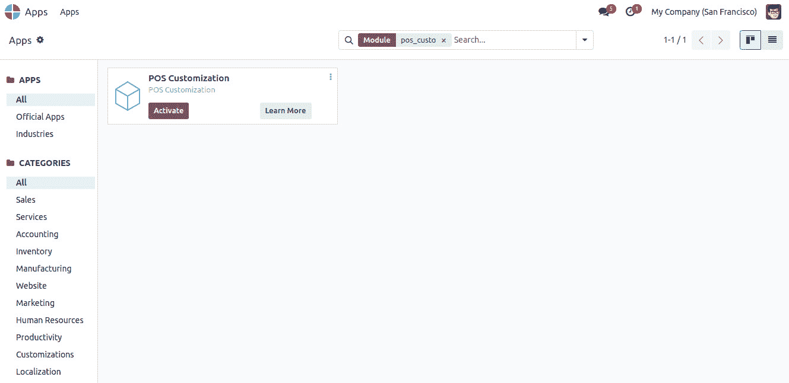
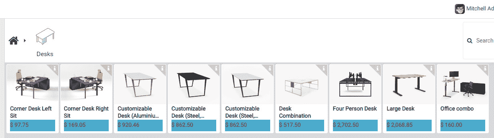
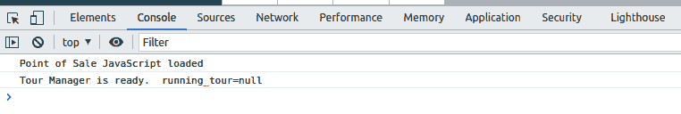
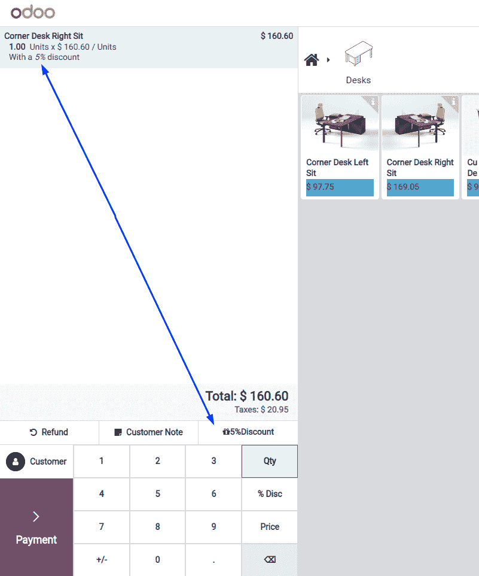
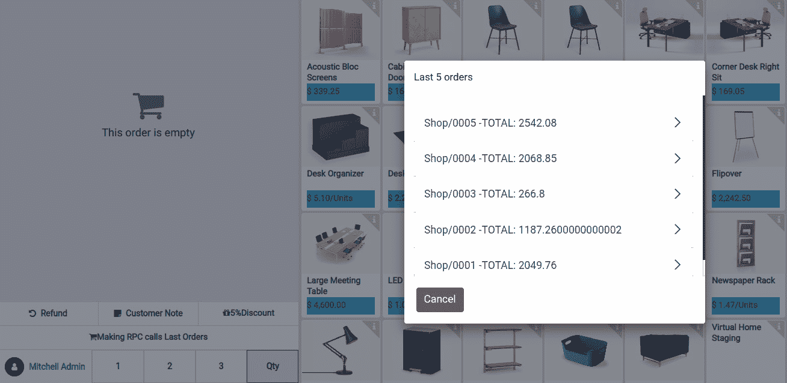
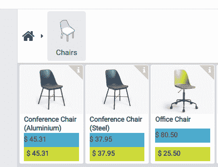
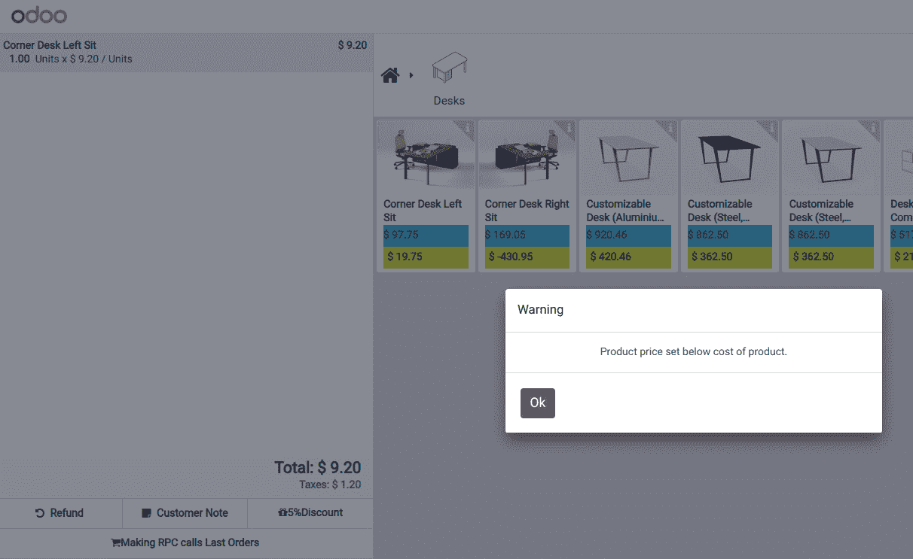
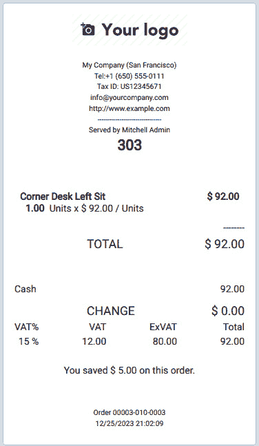

# 第二十二章：销售点

销售点（Point of Sale）是一个完全集成的应用程序，它允许您使用任何设备在线或离线销售产品。它还会自动记录您库存中的产品移动，提供实时统计数据，并跨所有商店进行合并。在本章中，我们将了解如何修改销售点应用程序。

在本章中，我们将涵盖以下主题：

+   添加自定义 JavaScript/SCSS 文件

+   向键盘添加动作按钮

+   执行 RPC 调用

+   修改销售点屏幕 UI

+   修改现有业务逻辑

+   修改客户

注意

销售点应用程序主要使用 JavaScript 编写。本章假设您具备基本的 JavaScript 知识。本章还使用了 OWL 框架，如果您不熟悉这些 JavaScript 术语，请参阅*第十六章*，*Odoo Web 库（OWL）*。

在本章中，我们将使用一个名为`point_of_sale_customization`的附加模块。由于我们将在销售点应用程序中进行定制，因此`point_of_sale_customization`模块将依赖于`point_of_sale`模块。为了快速开始，我们已经准备了一个初始的`point_of_sale_customization`模块，您可以从本书的 GitHub 仓库中的`Chapter22/00_initial_module/point_of_sale_customization`目录中获取它。

# 技术要求

本章中使用的所有代码都可以从以下 GitHub 仓库下载：[`github.com/PacktPublishing/Odoo-17-Development-Cookbook-Fifth-Edition/tree/main/Chapter22`](https://github.com/PacktPublishing/Odoo-17-Development-Cookbook-Fifth-Edition/tree/main/Chapter22)。

# 添加自定义 JavaScript/SCSS 文件

销售点应用程序使用不同的资产包来管理 JavaScript 和样式表文件。在本食谱中，我们将学习如何将**SCSS**和**JavaScript**文件添加到销售点资产包中。

## 准备工作

首先，我们将加载一个 SCSS 样式表和一个 JavaScript 文件到销售点应用程序中。

## 如何做到这一点...

要将资产加载到销售点应用程序中，请按照以下步骤操作：

1.  在`point_of_sale_customization/static/src/scss/point_of_sale_customization.scss`中添加一个新的 SCSS 文件，并插入以下代码：

    ```py
    .pos .pos-content {
        .price-tag {
            background: #00abcd;
            width: 100%;
            right: 0;
            left: 0;
            top:0;
        }
    }
    ```

1.  在`point_of_sale_customization/static/src/js/point_of_sale_customization.js`中添加一个 JavaScript 文件，并添加以下内容：

    ```py
    /** @odoo-module */
    console.log("Point Of Sale Javascript Loaded");
    ```

1.  在`point_of_sale assets`中注册这些 JavaScript 和 SCSS 文件。

    ```py
    'assets': {
          'point_of_sale._assets_pos': [
    'point_of_sale_customization/static/src/scss/point_of_sale_customization.scss',
    'point_of_sale_customization/static/src/js/point_of_sale_customization.js'
        ],
    },
    ```

1.  安装`point_of_sale_customization`模块。



图 22.1 – 安装 POS 定制模块

要查看您的更改效果，请从**销售点 |** **仪表板**菜单启动新会话。

## 它是如何工作的…

到目前为止，我们已经将一个 JavaScript 文件和一个 SCSS 文件加载到销售点应用程序中。

在*步骤 1*中，我们更改了产品卡片定价标签的背景颜色。安装`point_of_sale_customization`模块后，您将能够看到定价标签的变化：



图 22.2 – 更新的价格标签

在*步骤 2*中，我们添加了 JavaScript 文件。在其中，我们向控制台添加了日志。为了看到消息，您需要打开浏览器开发者工具。在**控制台**标签页中，您将看到以下日志。这表明您的 JavaScript 文件已成功加载。目前，我们只向 JavaScript 文件中添加了日志，但在未来的菜谱中，我们将添加更多内容：



图 22.3 – JavaScript 已加载（控制台中的日志）

在*步骤 3*中，我们添加了 JavaScript 文件和 SCSS 文件，如下所示：

```py
'assets': {
    'point_of_sale._assets_pos': [
         'js,scss path'
    ],
}
```

## 更多内容...

Odoo 还为餐厅提供了销售点解决方案的附加模块。请注意，这个销售点餐厅模块只是销售点应用程序的扩展。如果您想在餐厅模块中进行定制，您需要将您的 JavaScript 和 SCSS 文件添加到相同的`point_of_sale._assets_pos`资产包中。

# 添加操作按钮到键盘

如前所述，销售点应用程序的设计使其能够离线工作。正因为如此，销售点应用程序的代码结构与剩余的 Odoo 应用程序不同。销售点应用程序的代码库主要使用 JavaScript 编写，并为定制提供了不同的实用工具。在此阶段，我们将使用这样一个实用工具，并在键盘面板顶部创建一个操作按钮。

## 准备工作

在这里，我们将使用在*添加自定义 JavaScript/SCSS 文件*菜谱中创建的`point_of_sale_customization`模块。我们将在键盘面板顶部添加一个按钮。此按钮将是一个将折扣应用于订单行的快捷方式。

## 如何操作...

按照以下步骤将 5%折扣操作按钮添加到销售点应用程序的键盘面板：

1.  将以下代码添加到`/static/src/js/point_of_sale_customization.js`文件中，这将定义操作按钮：

    ```py
    /** @odoo-module */
    import { Component } from "@odoo/owl";
    import { ProductScreen } from "@point_of_sale/app/screens/product_screen/product_screen";
    import { usePos } from "@point_of_sale/app/store/pos_hook";
    export class PosDiscountButton extends Component {
        static template = "PosDiscountButton";
        setup() {
            this.pos = usePos();
        }
        async onClick() {
            const order = this.pos.get_order();
            if (order.selected_orderline) {
                order.selected_orderline.set_discount(5);
            }
        }
    }
    ProductScreen.addControlButton({
        component: PosDiscountButton,
        condition: function () {
            return true;
        }
    });
    ```

1.  将按钮的 QWeb 模板添加到`/static/src/xml/point_of_sale_customization.xml`文件中：

    ```py
    <?xml version="1.0" encoding="UTF-8"?>
    <templates id="template" xml:space="preserve">
       <t t-name="PosDiscountButton">
           <span class="control-button btn btn-light rounded-0 fw-bolder"
                 t-on-click="() => this.onClick()">
               <i class="fa fa-gift"></i>
               <span>5%</span>
               <span>Discount</span>
           </span>
       </t>
    </templates>
    ```

1.  在`point_of_sale_customization/static/src/scss/point_of_sale_customization.scss`中添加一个新的 SCSS 文件，并插入以下代码：

    ```py
    .pos .pos-content {
        .price-tag {
            background: #00abcd;
            width: 100%;
            right: 0;
            left: 0;
            top:0;
        }
    }
    ```

1.  按照以下方式在清单文件中注册 QWeb 模板：

    ```py
    'assets': {
           'point_of_sale._assets_pos': [
               'point_of_sale_customization/static/src/scss/point_of_sale_customization.scss',
               'point_of_sale_customization/static/src/xml/point_of_sale_customization.xml',
               'point_of_sale_customization/static/src/js/point_of_sale_customization.js'
           ],
       },
    ```

1.  更新`point_of_sale_customization`模块以应用更改。之后，您将能够在计算器上方看到**5%折扣**按钮：



图 22.4 – 折扣按钮

点击此按钮后，折扣将应用于所选订单行。

## 它是如何工作的...

在 Odoo v17 中，基于 Odoo 销售点应用程序的代码完全使用 OWL 框架重写。您可以在*第十六章*，*Odoo Web 库（OWL）*中了解更多关于 OWL 框架的信息。

要在销售点应用程序中创建动作按钮，您需要*扩展*`Component`。现在，`Component`在`@odoo/owl`命名空间中定义，因此要在您的代码中使用它，您需要导入它。

在*步骤 1*中，我们从`@odoo/owl`中导入了`Component`。然后，我们通过扩展`Component`创建了`PosDiscountButton`。在*步骤 1*中，我们还从`@point_of_sale/app/screens/product_screen/product_screen`导入了`ProductScreen`，以及从`@point_of_sale/app/store/pos_hook`导入了`usePos`。

现在，`ProductScreen`通过`addControlButton`方法被用来在销售点屏幕上添加一个按钮。

`Component`提供了一些内置工具，可以访问有用的信息，例如订单详情和销售点配置。您可以通过`this.pos = usePos()`变量来访问它。

在我们的示例中，我们通过`this.pos.get_order()`方法访问了当前订单信息。然后，我们使用`set_discount()`方法设置了 5%的折扣。

在*步骤 2*和*步骤 3*中，我们添加了 OWL 模板，该模板将在销售点键盘上渲染。如果您想了解更多信息，请参阅*第十六章*，*Odoo Web 库（OWL）*。

## 还有更多...

`addControlButton()`方法支持一个额外的参数，即`condition`。此参数用于根据某些条件隐藏/显示按钮。此参数的值是一个返回布尔值的函数。根据返回值，销售点系统将隐藏或显示按钮。

以下是一个更详细的示例：

```py
ProductScreen.addControlButton({
   component: PosDiscountButton,
   condition: function () {
       return true;
   },
});
```

# 进行 RPC 调用

虽然销售点应用程序可以离线工作，但仍有可能向服务器发出 RPC 调用。RPC 调用可用于任何操作；您可以使用它进行 CRUD 操作，或在服务器上执行操作。

现在，我们将进行 RPC 调用以获取关于客户最后五笔订单的信息。

## 准备工作

现在，我们将使用为键盘配方中的**添加动作**按钮创建的`point_of_sale_customization`模块。我们将定义动作按钮。当用户点击动作按钮时，我们将发出 RPC 调用以获取订单信息并在弹出窗口中显示它。

## 如何做到这一点...

按照以下步骤显示所选客户的最后五笔订单：

1.  将以下代码添加到`/static/src/js/point_of_sale_customization.js`文件中；这将添加一个新动作按钮，当用户点击按钮时，将获取并显示最后五笔订单的信息：

    ```py
    /** @odoo-module */
    import { Component } from "@odoo/owl";
    import { ErrorPopup } from "@point_of_sale/app/errors/popups/error_popup";
    import { ProductScreen } from "@point_of_sale/app/screens/product_screen/product_screen";
    import { SelectionPopup } from "@point_of_sale/app/utils/input_popups/selection_popup";
    import { usePos } from "@point_of_sale/app/store/pos_hook";
    import { useService } from "@web/core/utils/hooks";
    import { sprintf } from "@web/core/utils/strings";
    export class PosLastOrderButton extends Component {
       static template = "PosLastOrderButton";
       setup() {
           this.pos = usePos();
           this.popup = useService("popup");
       }
    }
    ProductScreen.addControlButton({
       component: PosLastOrderButton,
       condition: function () {
           return true;
       },
    });
    ```

1.  将`onClick`函数添加到`PosLastOrders`组件中，以管理按钮点击：

    ```py
    export class PosLastOrderButton extends Component {
        static template = "PosLastOrderButton";
        setup() {
            this.pos = usePos();
            this.popup = useService("popup");
        }
        async onClick() {
            var self = this;
            const order = this.pos.get_order();
            const client = order.get_partner();
            if (client) {
                var domain = [['partner_id', '=', client.id]];
                const orders = await this.pos.orm.call(
                    "pos.order",
                    "search_read",
                    [],
                    {
                        domain: domain,
                        fields: ['name', 'amount_total'],
                        limit:5
                    }
                );
                if (orders.length > 0) {
                    var order_list = orders.map((o) => {
                        return { 'label': sprintf("%s -TOTAL: %s", o.name, o.amount_total) };
                    });
                    await this.popup.add(SelectionPopup, {
                        title: 'Last 5 orders',
                        list: order_list
                    });
                } else {
                    await this.popup.add(ErrorPopup, {
                        body: "No previous orders found"
                    });
                }
            } else {
                await this.popup.add(ErrorPopup, {
                    body: "No previous orders found"
                });
            }
        }
    }
    ```

1.  将按钮的 QWeb 模板添加到`/static/src/xml/point_of_sale_customization.xml`文件中：

    ```py
    <t t-name="PosLastOrderButton">
           <span class="control-button btn btn-light rounded-0 fw-bolder"
                 t-on-click="() => this.onClick()">
               <i class="fa fa-shopping-cart"></i>Making RPC calls
               <span></span>
               <span>Last Orders</span>
           </span>
       </t>
    ```

1.  更新`point_of_sale_customization`模块以应用更改。之后，你将能够在键盘面板上方看到**最后订单**按钮。当点击此按钮时，将显示一个包含订单信息的弹出窗口：



图 22.5 – 客户的最后五笔订单

如果没有找到以前的订单，将显示警告信息而不是订单列表。

## 它是如何工作的...

在*步骤 1*中，我们创建了操作按钮。如果你想了解更多关于操作按钮的信息，请参阅本章中的*将操作按钮添加到键盘*配方。

在深入了解技术细节之前，让我们了解我们希望通过此操作按钮实现什么。一旦点击，我们希望显示所选客户的最后五笔订单的信息。将有一些情况是未选择客户，或者客户没有以前的订单。在这种情况下，我们希望显示一个带有适当信息的弹出窗口。RPC 实用工具可通过组件的`this.pos.orm.call`属性使用。

在*步骤 2*中，我们添加了点击处理函数。点击操作按钮时，将调用点击处理函数。此函数将调用服务器上的 RPC 以获取订单信息。

我们使用了`this.pos.orm.call()`方法来进行 RPC 调用。

然后，我们使用了`search_read`方法通过 RPC 获取数据。我们传递了客户域以过滤订单。我们还传递了`limit`关键字参数以获取仅五个订单。`this.pos.orm.call()`是一个异步方法，返回一个`Promise`对象，因此要处理结果，你可以使用`await`关键字。

注意

RPC 调用在离线模式下不起作用。如果你有一个良好的互联网连接并且不经常使用离线模式，你可以使用 RPC。

虽然 Odoo 销售点应用程序可以在离线模式下工作，但一些操作，如创建或更新客户，需要互联网连接，因为这些功能使用 RPC 进行内部调用。

我们在弹出窗口中显示了以前的订单信息。我们使用了`SelectionPopup`，它用于显示可选择的列表；我们用它来显示最后五笔订单。我们还使用了`ErrorPopup`来在未选择客户或找不到以前的订单时显示警告信息。

在*步骤 3*中，我们为操作按钮添加了 QWeb 模板。销售点应用程序将渲染此模板以显示操作按钮。

## 还有更多...

还有许多其他的弹出工具。例如，`NumberPopup`用于从用户那里获取数字输入。请参阅`@point_of_sale/app/utils/input_popups/number_popup`目录中的文件，以查看所有这些工具。`NumberPopup`模块可能是一个自定义组件或用于处理 POS 应用程序中数字输入弹出的实用函数。根据上下文，此模块可能负责以用户友好的方式显示弹出对话框输入数值数据，例如在零售系统中输入数量或价格。使用以下代码打开数字弹出窗口：

```py
import { NumberPopup } from "@point_of_sale/app/utils/input_popups/number_popup";
this.popup.add(NumberPopup, { title: ("Set the new quantity")});
```

# 修改销售点屏幕 UI

销售点应用程序的 UI 是用 OWL QWeb 模板编写的。在本教程中，我们将学习如何修改销售点应用程序中的 UI 元素。

## 准备工作

在这个教程中，我们将使用在*制作 RPC 调用*教程中创建的`point_of_sale_customization`模块。我们将修改产品卡片的 UI 并显示每个产品的利润率。

## 如何操作...

按照以下步骤在产品卡片上显示利润率：

1.  将以下代码添加到`/models/pos_session.py`文件中，以获取产品的实际价格额外字段：

    ```py
    from odoo import models
    class PosSession(models.Model):
        _inherit = 'pos.session'
        def _loader_params_product_product(self):
            result = super()._loader_params_product_product()
      result['search_params']['fields'].append('standard_price')
            return result
    ```

1.  将以下代码添加到`/static/src/xml/point_of_sale_customization.xml`中，以显示具有利润率的产品卡片：

    ```py
    <t t-name="ProductsWidget"
    t-inherit="point_of_sale.ProductsWidget"
           t-inherit-mode="extension">
           <xpath expr="//ProductCard" position="attributes">
               <attribute name="standard_price">
                   pos.env.utils.formatCurrency(product.get_display_price() - product.standard_price)
               </attribute>
           </xpath>
       </t>
       <t t-name="ProductCard" t-inherit="point_of_sale.ProductCard"
           t-inherit-mode="extension">
           <xpath expr="//span[hasclass('price-tag')]" position="after">
               <span t-if="props.standard_price"
                     class="sale_margin py-1 fw-bolder">
                   <t t-esc="props.standard_price"/>
               </span>
           </xpath>
       </t>
    ```

1.  添加以下样式表来设置利润率文本的样式：

    ```py
        .sale_margin {
        line-height: 21px;
        background: #CDDC39;
        padding: 0px 5px;
    }
    ```

1.  更新`point_of_sale_customization`模块以应用更改。之后，您将能够在产品卡片上看到利润率：



图 22.6 – 产品的利润率

如果没有设置产品的成本，则产品卡片将不会显示利润率，因此请确保您设置了产品成本。

## 它是如何工作的...

在这个教程中，我们希望使用`standard_price`字段作为产品的采购成本。这个字段在销售点应用程序中默认不加载。

在*步骤 1*中，我们为`product.product`模型添加了`standard_price`字段。在此之后，产品数据将多出一个字段 – `standard_price`。

在*步骤 2*中，我们扩展了默认的产品卡片模板。您需要使用`t-inherit`属性来扩展现有的**QWeb**模板。

然后，您需要使用 XPath 来选择要执行操作的元素。如果您想了解更多关于 XPath 的信息，请参阅*第九章*，*后端视图*中的*更改现有视图 – 视图继承*教程。

要获取产品销售价格，我们使用了从父 OWL 组件发送的`product`属性。然后，我们通过使用产品价格和产品成本来计算利润率。如果您想了解更多信息，请参阅*第十六章*，*Odoo Web 库（OWL）*。

在*步骤 3*中，我们添加了样式表来修改边距元素的定位。这将给边距元素添加一个背景色，并将其放置在价格药丸下方。

# 修改现有业务逻辑

在之前的食谱中，我们看到了如何通过 RPC 获取数据以及如何修改销售点应用的用户界面。在这个食谱中，我们将看到如何修改或扩展现有的业务逻辑。

## 准备工作

在这个食谱中，我们将使用在*修改销售点屏幕 UI*食谱中创建的`point_of_sale_customization`模块，在那里我们获取了产品的购买价格并显示了产品利润。现在，在这个食谱中，我们将向用户显示一个警告，如果他们以低于产品利润的价格出售产品。

## 如何做到这一点...

销售点应用的业务逻辑大部分是用 JavaScript 编写的，所以我们只需对其进行修改即可实现本食谱的目标。将以下代码添加到`/static/src/js/point_of_sale_customization.js`以在用户以低于购买价格出售产品时显示警告：

```py
/** @odoo-module */
import { ErrorPopup } from "@point_of_sale/app/errors/popups/error_popup";
import { ProductScreen } from "@point_of_sale/app/screens/product_screen/product_screen";
import { patch } from "@web/core/utils/patch";
patch(ProductScreen.prototype, {
   _setValue(val) {
       super._setValue(val);
       const orderline = this.currentOrder.get_selected_orderline();
       if (orderline && orderline.product.standard_price) {
           var price_unit = orderline.get_unit_price() * (1.0 - (orderline.get_discount() / 100.0));
           if (orderline.product.standard_price > price_unit) {
               this.popup.add(ErrorPopup, {
                   title: 'Warning',
                   body: 'Product price set below cost of product.'
               });
           }
       }
   }
});
```

更新`point_of_sale_customization`模块以应用更改。更新后，以这种方式在订单行中添加折扣，使产品价格低于购买价格。将出现一个包含以下警告的弹出窗口：



图 22.7– 大折扣的警告

注意，当你将产品价格设置低于实际成本时，会显示一个警告，并且每次你采取行动时（例如，当你更改产品订单的数量时），它都会继续弹出。

## 它是如何工作的...

销售点组件注册提供了一个`extend`方法来修改现有函数。内部，它通过猴子补丁实际组件定义。

在我们的示例中，我们修改了`_setValue()`方法。每当用户更改订单行时，`ProductScreen`的`_setValue()`方法就会被调用。我们希望如果用户将产品价格设置低于产品成本时显示一个警告。因此，我们定义了一个新的`_setValue()`方法并调用了`super`方法；这将确保用户执行的所有操作都会被应用。在调用`super`方法之后，我们编写了我们的逻辑，该逻辑检查产品销售价格是否高于产品的实际成本。如果不是，我们就会向用户显示一个警告。

注意

如果使用不当，`super`可能会破坏某些东西。如果该方法是从几个文件中继承的，你必须调用`super`方法；否则，它将跳过后续继承中的逻辑。这有时会导致内部数据状态损坏。

我们在调用默认实现（`super`）之后放置了我们的业务逻辑。如果你想在默认实现之前编写业务逻辑，你可以通过将`super`调用移到函数末尾来实现。

# 修改客户收据

当您定制销售点应用程序时，客户通常会要求修改客户收据。在本配方中，您将学习如何修改客户收据。

## 准备工作

在本配方中，我们将使用在*修改现有业务逻辑*配方中创建的`point_of_sale_customization`模块。我们将向销售点收据添加一行，以显示客户在订单中节省了多少钱。

## 如何操作...

按照以下步骤修改销售点应用程序中的客户收据：

1.  将以下代码添加到`/static/src/js/point_of_sale_customization.js`文件中。这将向收据环境添加额外的数据：

    ```py
    /** @odoo-module */
    import { Order } from "@point_of_sale/app/store/models";
    import { patch } from "@web/core/utils/patch";
    patch(Order.prototype, {
       saved_amount(){
           const order = this;
           return order.orderlines.reduce((rem, line) => {
               var diffrence = (line.product.lst_price * line.quantity) - line.get_base_price();
               return rem + diffrence;
           }, 0);
       },
       export_for_printing() {
           const json = super.export_for_printing(...arguments);
           var savedAmount = this.saved_amount();
           if (savedAmount > 0) {
               json.saved_amount = this.env.utils.formatCurrency(savedAmount);
           }
           return json;
       }
    })
    ```

1.  将以下代码添加到`/static/src/xml/point_of_sale_customization.xml`文件中。这将扩展默认的收据模板并添加我们的定制：

    ```py
    <t t-name="OrderReceipt"
          t-inherit="point_of_sale.OrderReceipt"
          t-inherit-mode="extension">
           <xpath expr="//div[hasclass('pos-receipt')]//div[hasclass('before-footer')]" position="before">
               <div style="text-align:center;" t-if="props.data.saved_amount">
                   <br/>
                   <div >
                       You saved
                       <t t-esc="props.data.saved_amount"/>
                       on this order.
                   </div>
               </div>
           </xpath>
       </t>
    ```

更新`point_of_sale_customization`模块以应用更改。之后，添加一个带有折扣的产品并检查收据；您将在收据中看到一行额外的内容：



图 22.8 – 更新的收据

如果金额为零或负数，收据将不会显示**节省金额**屏幕。

## 它是如何工作的...

本配方中没有任何新内容。我们只是通过使用之前的配方更新了收据。

在*步骤 1*中，我们覆盖了`export_for_printing()`函数以向收据环境发送更多数据。从`export_for_printing()`方法发送的任何内容都将可在收据的 QWeb 模板中使用。我们比较了产品的基准价格与收据中的产品价格，以计算客户节省了多少钱。我们通过`saved_amount`键将此数据发送到收据环境。

在*步骤 2*中，我们修改了收据的默认 QWeb 模板。实际收据的模板名称是`OrderReceipt`，因此我们将其用作`t-inherit`属性的值。在*步骤 1*中，我们已经发送了修改收据所需的信息。在 QWeb 模板中，我们在`props.data.saved_amount`键中获取保存的金额，所以我们只需在页脚之前添加一个额外的`<div>`元素。这将打印出收据中的节省金额。如果您想了解更多关于覆盖的信息，请参阅*修改销售点屏幕* *UI* 烹饪配方。
