# 第二十三章：在 Odoo 中管理电子邮件

电子邮件集成是 Odoo 最突出的功能。您可以直接从 Odoo 用户界面发送和接收电子邮件。您甚至可以管理业务文档上的电子邮件线程，例如潜在客户、销售订单和项目。在本章中，我们将探讨一些处理 Odoo 中电子邮件的重要方法。

在这里，我们将涵盖以下食谱：

+   配置入站和出站电子邮件服务器

+   管理文档上的聊天

+   管理文档上的活动

+   使用 Jinja 模板发送电子邮件

+   使用 QWeb 模板发送电子邮件

+   管理电子邮件别名

+   在聊天中记录用户更改

+   发送周期性摘要电子邮件

# 技术要求

本章中使用的所有代码都可以从[`github.com/PacktPublishing/Odoo-17-Development-Cookbook-Fifth-Edition/tree/main/Chapter23`](https://github.com/PacktPublishing/Odoo-17-Development-Cookbook-Fifth-Edition/tree/main/Chapter23)下载。

# 配置入站和出站电子邮件服务器

在您开始在 Odoo 中发送和接收电子邮件之前，您需要配置入站和出站电子邮件服务器。在本食谱中，您将学习如何在 Odoo 中配置电子邮件服务器。

## 准备工作

本食谱不需要开发，但您将需要电子邮件服务器信息，例如服务器 URL、端口、服务器类型、用户名和密码。我们将使用这些信息来配置电子邮件服务器。

注意

如果您使用**Odoo Online**或**Odoo.sh**，您不需要配置电子邮件服务器。您可以在这些平台上发送和接收电子邮件，而无需任何复杂的配置。本食谱是为本地 Odoo 实例准备的。

## 如何操作...

配置入站和出站电子邮件服务器涉及一些步骤，这些步骤对于入站和出站服务器是通用的，还有一些步骤是针对每种服务器独特的。因此，首先，我们将查看通用配置步骤，然后我们将分别配置入站和出站电子邮件服务器。以下是为入站和出站电子邮件服务器所需的步骤：

1.  打开**常规设置**表单菜单，在**设置** | **常规设置**。

1.  前往**讨论**部分，并在**别名域名**内部。这将显示以下选项：

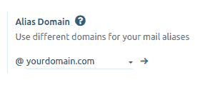

图 23.1 – 设置别名域名

1.  在**别名域名**字段中，输入您的电子邮件服务器正在运行的域名。然后，保存配置。

### 配置入站电子邮件服务器

执行以下步骤以配置入站电子邮件服务器：

1.  打开**常规设置**并点击技术 | 电子邮件下的**入站电子邮件服务器**链接。这将重定向到入站电子邮件服务器的列表视图。

1.  点击**创建**按钮，这将打开以下表单视图。输入您的入站电子邮件服务器的详细信息（有关每个字段的解释，请参阅*如何操作…*部分）：

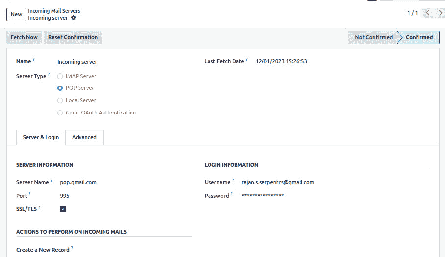

图 23.2 – 配置入站邮件服务器

1.  点击**测试 & 确认**按钮以验证您的配置。如果您错误地配置了入站邮件服务器，它将显示错误消息。

### 配置出站邮件服务器

按照以下步骤配置出站邮件服务器：

1.  打开**常规设置**并启用**自定义邮件服务器**选项，然后点击**出站邮件服务器**链接。这将带您到出站邮件服务器的列表视图。

1.  点击**创建**，这将打开以下表单视图。输入您的出站邮件服务器的详细信息（有关每个字段的说明，请参阅*如何工作…*部分）：

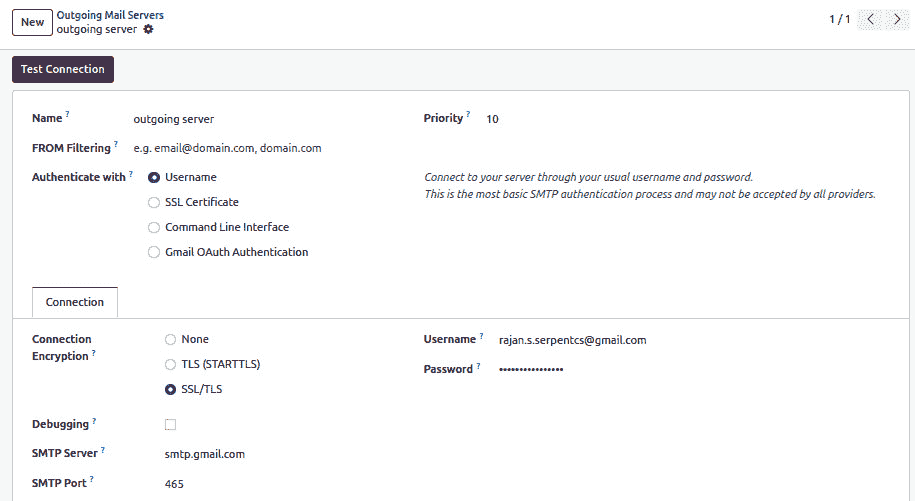

图 23.3 – 配置出站邮件服务器

1.  在屏幕底部点击**测试连接**以验证您的配置。如果您错误地配置了出站邮件服务器，它将显示错误消息。

即使您已正确配置，出站邮件服务器也会显示错误对话框。在错误对话框正文中寻找**连接测试成功**消息。这意味着您的出站服务器已正确配置。

## 它是如何工作的...

本食谱中给出的步骤是自我解释的，不需要进一步解释。但是，出站邮件和入站邮件记录有多个字段，让我们看看它们的目的。

以下是为配置入站邮件服务器使用的字段列表：

+   **名称**：服务器的名称，有助于您在配置了多个入站邮件服务器时识别特定的入站邮件服务器。

+   **服务器类型**：在此处，您需要从三个选项中选择：**POP 服务器**、**IMAP 服务器**和**本地服务器**。此字段的值将基于您的电子邮件服务提供商。

+   **服务器名称**：运行服务的服务器域名。

+   **端口**：服务器运行的端口号。

+   **SSL/TLS**：如果您正在使用 SSL/TLS 加密，请勾选此字段。

+   **用户名**：您正在获取邮件的电子邮件地址。

+   **密码**：提供的电子邮件地址的密码。

+   **激活**：此字段用于启用或禁用入站邮件服务器。

+   **保留附件**：如果您不想管理入站邮件的附件，请关闭此选项。

+   **保留原始**：如果您想保留原始邮件及其前一个邮件，请启用此选项。

以下是为配置出站邮件服务器使用的字段列表：

+   **名称**：服务器的名称，有助于您在配置了多个入站邮件服务器时识别特定的入站邮件服务器。

+   **优先级**：此字段用于定义出站邮件服务器的优先级。数字越小，优先级越高，因此具有较低优先级数字的邮件服务器将被使用最多。

+   **SMTP 服务器**：运行服务的服务器域名。

+   **SMTP 端口**：服务器运行的端口号。

+   **连接加密**：用于发送电子邮件的安全类型。

+   **用户名**：用于发送电子邮件的电子邮件账户。

+   **密码**：提供的电子邮件账户的密码。

+   **激活**：此字段用于启用或禁用出站电子邮件服务器。

## 还有更多...

默认情况下，每 5 分钟检索一次传入的电子邮件。如果您想更改此间隔，请按照以下步骤操作：

1.  激活开发者模式。

1.  在**设置** | **技术** | **自动化** | **计划任务**中打开**计划任务**。

1.  搜索并打开名为**邮件**：**Fetchmail 服务**的计划任务。

1.  使用标记为**执行间隔**的字段更改间隔。

# 管理文档上的聊天

在本配方中，您将学习如何管理文档上的聊天，并将通信线程添加到记录中。

## 准备工作

对于本配方，我们将重用*第八章*中的`my_hostel`模块，*高级服务器端开发技术*。您可以从 GitHub 仓库中该宿舍房间的`Chapter23/ 00_initial_module`目录中获取模块的初始副本。在本配方中，我们将向`hostel.student`模型添加聊天。

## 如何做到这一点...

按照以下步骤在`hostel.student`模型的记录中添加聊天：

1.  在`__manifest__.py`文件中添加`mail`模块依赖项：

    ```py
    ...
    'depends': ['mail'],
    ...
    ```

1.  在`hostel.student`模型的 Python 定义中继承`mail.thread`：

    ```py
    class HostelStudent(models.Model):
       _name = "hostel.student"
       _description = "Hostel Student Information"
       _inherit = ['mail.thread']
    ...
    ```

1.  在`hostel.student`模型的表单视图中添加聊天小部件：

    ```py
    ...
    </sheet>
                       <div class="oe_chatter">
                           <field name="message_follower_ids" widget="mail_followers"/>
                           <field name="message_ids" widget="mail_thread"/>
                       </div>
                   </form>
    ...
    ```

1.  安装`my_hostel`模块以查看实际效果：

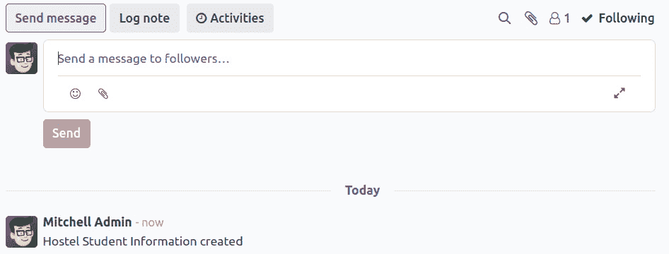

图 23.4 – 宿舍学生表单视图上的聊天

如前一个屏幕截图所示，安装模块后，您将在表单视图中看到聊天内容。

## 它是如何工作的...

为了在任何模型上启用聊天，您首先需要安装`mail`模块。这是因为启用聊天或邮件功能所需的所有代码都是`mail`模块的一部分。这就是为什么在*步骤 1*中，我们在`my_hostel`模块的清单文件中添加了`mail`模块依赖项。这将自动在您安装`my_hostel`模块时安装`mail`模块。

操作聊天所需字段和方法是`mail.thread`模型的一部分。`mail.thread`模型是一个抽象模型，仅用于继承目的。在*步骤 2*中，我们在`hostel.student`模型中继承了`mail.thread`模型。这将向`hostel.student`模型添加所有必要的字段和方法，以实现聊天功能。如果您不知道模型继承是如何工作的，请参阅*第四章*中的*使用抽象模型实现可重用模型功能*配方，*应用模型*。

在*步骤 1*和*步骤 2*中，我们添加了聊天所需的所有字段和方法。对于聊天来说，唯一剩下的事情是在表单视图中添加用户界面。在*步骤 3*中，我们添加了消息线程和关注者小部件。你可能想知道`message_follower_ids`和`message_ids`字段。这些字段没有在`hostel.student`模型定义中添加，但它们是通过继承从`mail.thread`模型添加的。

## 更多内容...

当你在聊天中发布消息时，会向关注者发送电子邮件。如果你注意到这个食谱的例子，学生的房间不是记录的关注者，所以他们不会收到消息。如果你想向学生发送电子邮件通知，你需要将他们添加到学生列表中。你可以从用户界面手动添加关注者，但如果你想自动添加，可以使用`message_subscribe()`方法。看看下面的代码——当我们分配宿舍房间时，给定的代码将自动将学生添加到关注者列表中：

```py
   @api.model
   def create(self, values):
       result = super().create(values)
       partner_id = self.env['res.partner'].create({
           'name': result.name,
           'email': result.email
       })
       result.message_subscribe(partner_ids=[partner_id.id])
       return result
```

同样，如果你想从列表中删除关注者，可以使用`message_unsubscribe()`方法。

# 管理文档上的活动

当使用聊天时，你也可以添加活动。这些用于规划你在记录上的操作。它类似于每个记录的待办事项列表。在这个食谱中，你将学习如何在任何模型上启用活动。

## 准备工作

对于这个食谱，我们将使用之前食谱中的`my_hostel`模块，*在文档上管理聊天*。我们将向`hostel.student`模型添加活动。

## 如何操作...

按照以下步骤将活动添加到`hostel.student`模型中：

1.  在`hostel.student`模型的 Python 定义中继承`mail.activity.mixin`：

    ```py
    class HostelStudent(models.Model):
       _name = "hostel.student"
       _description = "Hostel Student Information"
       _inherit = ['mail.thread', 'mail.activity.mixin']
    ...
    ```

1.  在`hostel.student`模型的聊天中添加`mail_activity`小部件：

    ```py
    ...
    <div class="oe_chatter">
                           <field name="message_follower_ids" 
                           widget="mail_followers"/>
                           <field name="activity_ids" widget="mail_
                           activity"/>
                           <field name="message_ids" widget="mail_
                           thread"/>
                       </div>
    ...
    ```

1.  更新`my_hostel`模块以应用更改。这将显示聊天活动：

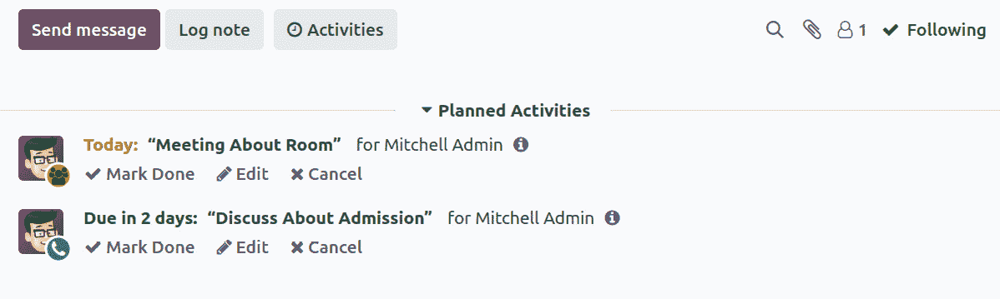

图 23.5 – 宿舍学生表单视图上的活动管理器

这就是用户将能够管理不同的聊天活动。请注意，由一个用户安排的活动对其他所有用户也是可见的。

## 它是如何工作的...

活动是`mail`模块的一部分，并且你可以选择在聊天中启用它们。为了在记录上启用活动，你需要继承`mail.activity.mixin`。类似于`mail.thread`模型，`mail.activity.mixin`也是一个抽象模型。继承`mail.activity.mixin`将在模块中添加所有必要的字段和方法。这些方法和字段用于管理记录上的活动。在*步骤 1*中，我们将`mail.activity.mixin`添加到`hostel.student`模型中。因此，`hostel.student`的继承将获得管理活动所需的所有方法和字段。

在 *步骤 2* 中，我们在表单视图中添加了 `mail_activity` 小部件。这将显示管理活动的 UI。通过继承，在 `hostel.student` 模型中添加了 `activity_ids` 字段。

活动可以是不同类型的。默认情况下，你可以创建具有 `Email`、`Call`、`Meeting` 和 `To-Do` 等类型的活动。如果你想添加自己的活动类型，可以在开发者模式下转到 **设置** | **技术** | **讨论** | **活动类型** 来实现。

## 更多内容...

如果你想自动安排活动，可以使用 `mail.activity.mixin` 模型的 `activity_schedule()` 方法。这将创建一个在指定退宿日期的活动。你可以使用 `activity_schedule()` 方法手动安排活动，如下所示：

```py
@api.model
   def create(self, values):
       result = super(HostelStudent, self).create(values)
       if result.discharge_date:
           result.activity_schedule('mail.mail_activity_data_call',
                               date_deadline=result.discharge_date)
       return result
    return res
```

在此示例中，每当有人退宿时，将为学生安排一个呼叫活动。活动的截止日期将被设置为宿舍的退宿日期，以便校长可以在那天给学生打电话。

# 使用 Jinja 模板发送电子邮件

Odoo 支持通过 Jinja 模板创建动态电子邮件。Jinja 是一个基于文本的模板引擎，用于生成动态 HTML 内容。在本食谱中，我们将创建一个 Jinja 电子邮件模板，然后使用它发送电子邮件。

## 准备工作

对于这个食谱，我们将使用之前食谱中提到的 `my_hostel` 模块，即 *管理文档上的活动*。我们将添加 Jinja 模板来向学生发送电子邮件，通知他们宿舍的录取情况。

## 如何操作...

按照以下步骤向学生发送提醒电子邮件：

1.  创建一个名为 `my_hostel/data/mail_template.xml` 的新文件，并添加电子邮件模板：

    ```py
    <?xml version="1.0" encoding="utf-8"?>
    <odoo noupdate="1">
       <record id="assign_room_to_student" model="mail.template">
           <field name="name">Assign Room To Student</field>
           <field name="model_id" ref="my_hostel.model_hostel_student"/>
           <field name="email_from">{{ (object.room_id.create_uid.email) }}</field>
           <field name="email_to">{{ (object.email) }}</field>
           <field name="subject">Assign Room</field>
           <field name="body_html" type="html">
               <div style="margin: 0px; padding: 0px;">
                   <p style="margin: 0px; padding: 0px; font-size: 13px;">
                       Dear <t t-out="object.name"></t>,
                       <br/><br/>
                       <p>You have been assigned hostel
                           <b><t t-out="object.hostel_id.name"></t></b> and room no <t t-out="object.room_id.room_no"></t>.
                       <br/>
                       Your admission date in a hostel is <b style="color:red;"><t t-out="format_date(object.admission_date)"></t>.</b>
                       </p>
                       <br/>
                       <p>Best regards,
                       <br/><t t-out="object.hostel_id.name"></t></p>
                   </p>
               </div>
           </field>
       </record>
    </odoo>
    ```

1.  在清单文件中注册模板文件：

    ```py
    ...
    "data": [
           "security/hostel_security.xml",
           "security/ir.model.access.csv",
           "data/categ_data.xml",
           "data/mail_template.xml",
           "views/hostel.xml",
           "views/hostel_room.xml",
           "views/hostel_amenities.xml",
           "views/hostel_student.xml",
           "views/hostel_categ.xml",
           "views/hostel_room_category_view.xml",
       ],
    ...
    ```

1.  添加 `hostel.student` 模型以发送电子邮件：

    ```py
    ...
    <header>
        <button name="send_mail_assign_room"
                string="Send Email For Assign Room"
                type="object"/>
        <button name="action_assign_room"
                string="Assign Room"
                type="object"
                class="btn-primary"/>
        <field name="status" widget="statusbar" options="{'clickable':           '1'}"/>
    </header>
    ...
    ```

1.  将 `send_mail_assign_room()` 方法添加到 `hostel.student` 模型：

    ```py
    ...
    def send_mail_assign_room(self):
          self.message_post_with_source('my_hostel.assign_room_to_student')
    ```

更新 `my_hostel` 模块以应用更改。这将添加一个 `hostel.student` 模型。当他们点击按钮时，关注者将收到以下消息：

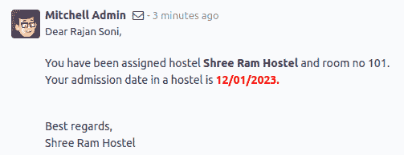

图 23.6 – 通过 Jinja 模板发送的电子邮件

本食谱中所示的过程在你想要通过电子邮件向客户发送更新时很有用。由于 Jinja 模板，你可以根据单个记录动态发送电子邮件。

## 工作原理...

在 *步骤 1* 中，我们使用 Jinja 创建了一个电子邮件模板。Jinja 模板帮助我们根据记录数据生成动态电子邮件。电子邮件模板存储在 `mail.template` 模型中。让我们看看你需要传递的字段列表，以便创建一个 Jinja 电子邮件模板：

+   `name`：用于识别特定模板的模板名称。

+   `email_from`：此字段的值将是发送此电子邮件的电子邮件地址。

+   `email_to`：此字段的值将是收件人的电子邮件地址。

+   `email_cc`：此字段的值将用于发送电子邮件副本的电子邮件地址。

+   `subject`: 此字段包含电子邮件的主题。

+   `model_id`: 此字段包含模型的引用。电子邮件模板将使用此模型的数据进行渲染。

+   `body_html`: 此字段将包含电子邮件模板的主体。它是一个 Jinja 模板，因此您可以使用变量、循环、条件等。如果您想了解更多关于 Jinja 模板的信息，请访问[`jinja.pocoo.org/docs/2.10/`](http://jinja.pocoo.org/docs/2.10/)。通常，我们在`CDATA`标签中包装内容，这样主体中的内容就被视为字符数据，而不是标记。

+   `auto_delete`: 这是一个布尔字段，在发送电子邮件后删除电子邮件。此字段的默认值为`False`。

+   `lang`: 此字段用于将电子邮件模板翻译成另一种语言。

+   `scheduled_date`: 此字段用于安排未来的电子邮件。

信息

您可以在`email_form`、`email_to`、`email_cc`、`subject`、`scheduled_date`和`lang`字段中使用`${}`。这有助于您动态设置值。看看我们配方中的*步骤 1*——我们使用了`{{ (object.email) }}`来动态设置`email_to`字段。

如果您仔细查看`body_html`字段的内容，您会注意到我们使用了`<t t-out="object.name">`。在这里，对象是`hostel.student`模型的记录集。在渲染过程中，`<t t-out="object.hostel_id.name"></t>`将被替换为宿舍名称。以及`object`，一些其他辅助函数和变量也被传递到渲染上下文中。以下是传递给渲染上下文的辅助函数列表：

+   `object`: 此变量将包含模型的记录集，该记录集由模板中的`model_id`字段设置

+   `format_date`: 这是用于格式化日期时间对象的方法的引用

+   `format_datetime`: 这是用于将 UTC 日期和时间转换为另一个时区的日期和时间的方法的引用

+   `format_amount`: 这是用于将`float`转换为带有货币符号的字符串的方法的引用

+   `format_duration`: 此方法用于将`float`转换为`time`——例如，将 1.5 转换为 01:30

+   `user`: 这将是当前用户的记录集

+   `ctx`: 这将包含环境上下文的字典

备注

如果您想查看模板列表，请激活开发者模式，并打开**设置** | **技术** | **电子邮件** | **模板**菜单。模板的表单视图还提供了一个按钮来预览渲染的模板。

在*步骤 2*中，我们在清单文件中注册了模板文件。

在*步骤 3*中，我们在表单视图中添加了一个按钮来调用`send_mail_assign_room()`方法，该方法将电子邮件发送给关注者。

在 *步骤 4* 中，我们添加了 `send_mail_assign_room()` 方法，该方法将在点击按钮时被调用。`message_post_with_source()` 方法用于发送电子邮件。`message_post_with_source()` 方法通过 `mail.thread` 继承在模型中。要发送电子邮件，您只需将模板 ID 作为参数传递。

## 更多...

`message_post_with_source()` 方法用于使用 Jinja 模板发送电子邮件。如果您只想发送纯文本电子邮件，可以使用 `message_post()` 方法：

```py
self.message_post(body="Your hostel admission process is completed.")
```

上述代码将添加一个 `subtype_id` 参数。

# 使用 QWeb 模板发送电子邮件

在前面的菜谱中，我们学习了如何使用 Jinja 模板发送电子邮件。在这个菜谱中，我们将看到另一种发送动态电子邮件的方法。我们将借助 QWeb 模板发送电子邮件。

## 准备工作

对于本菜谱，我们将使用前一个菜谱 *使用 Jinja 模板发送电子邮件* 中的 `my_hostel` 模块。我们将使用 QWeb 模板向学生发送电子邮件，告知他们在宿舍的入学已完成。

## 如何操作...

按照以下步骤向学生发送提醒电子邮件：

1.  将 QWeb 模板添加到 `my_hostel/data/mail_template.xml` 文件中：

    ```py
       <template id="assign_room_to_student_qweb">
           <p>Dear <span t-field="object.name"/>,</p>
           <br/>
           <p>You have been assigned hostel
               <b>
                   <span t-field="object.hostel_id.name"/>
               </b> and room no <span t-field="object.room_id.room_no"/>.
               <br/>
               Your admission date in a hostel is
               <b style="color:red;">
                   <span t-field="object.admission_date"/>.
               </b>
           </p>
           <br/>
           <p>Best regards,
               <br/>
               <span t-field="object.hostel_id.name"/>
           </p>
       </template>
    ```

1.  添加 `hostel.student` 模型以发送电子邮件：

    ```py
    ...
    <header>
         <button name="send_mail_assign_room"
                 string="Send Email For Assign Room"
                 type="object"/>
         <button name="send_mail_assign_room_qweb"
                 string="Send Email For Assign Room (QWeb)"
                 type="object"/>
         <button name="action_assign_room"
                 string="Assign Room"
                 type="object"
                 class="btn-primary"/>
         <field name="status" widget="statusbar" 
         options="{'clickable': '1'}"/>
    </header>
    ...
    ```

1.  在 `hostel.student` 模型中添加 `send_mail_assign_room_qweb()` 方法：

    ```py
    ...
    def send_mail_assign_room_qweb(self):
      self.message_post_with_source('my_hostel.assign_room_to_student_qweb')
    ```

1.  更新 `my_hostel` 模块以应用更改。这将添加一个 `hostel.student` 模型。当按钮被点击时，关注者将收到如下消息：

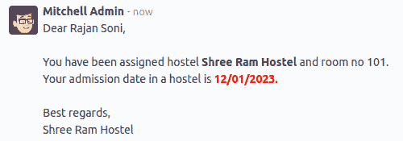

图 23.7 – 通过 QWeb 模板发送的电子邮件

本菜谱中显示的程序与前面的菜谱 *使用 Jinja 模板发送电子邮件* 的工作方式完全相同。唯一的区别是模板类型，因为本菜谱使用 QWeb 模板。

## 它是如何工作的...

在 *步骤 1* 中，我们创建了一个具有 `send_mail_assign_room_qweb` ID 的 QWeb 模板。如果您查看模板，您会看到我们不再使用 `format_date()` 数据字段方法了。这是因为 QWeb 渲染引擎会自动处理这一点，并基于用户的语言显示日期。出于同样的原因，您不需要使用 `format_amount()` 方法来显示货币符号。QWeb 渲染引擎将自动处理这一点。如果您想了解更多关于 QWeb 模板的信息，请参考 *第十四章* 中的 *创建或修改模板* 菜谱，*CMS* *网站开发*。

在 *步骤 2* 中，我们在表单视图中添加了一个按钮，用于调用 `send_mail_assign_room_qweb()` 方法，该方法将电子邮件发送给关注者。

在 *步骤 3* 中，我们添加了 `send_mail_assign_room_qweb()` 方法，该方法将由按钮点击触发。`message_post_with_source()` 方法用于发送电子邮件。`message_post_with_source()` 方法通过 `mail.thread` 继承在模型中继承。要发送电子邮件，只需将 Web 模板的 XML ID 作为参数传递即可。

使用 QWeb 模板发送电子邮件与上一个配方中的操作完全相同，但 QWeb 电子邮件模板和 Jinja 电子邮件模板之间存在一些细微的差异。以下是两个模板的快速比较：

+   在电子邮件模板中发送额外参数没有简单的方法。您必须使用 `object` 变量中的记录集来获取动态数据。另一方面，使用 QWeb 电子邮件模板，您可以通过 `values` 参数在渲染上下文中传递额外值：

    ```py
    self.message_post_with_source('my_hostel.assign_room_to_student_qweb',
                                       values={'extra_data': 'test'})
    ```

+   要管理日期格式、时区和带有货币符号的金额，在 Jinja 模板中，您必须使用 `format_date`、`format_tz` 和 `format_amount` 函数，而在 QWeb 模板中，这是自动管理的。

+   在 Jinja 中无法修改其他模块的现有模板，而在 QWeb 模板中，您可以通过继承来修改电子邮件模板。如果您想了解更多关于 QWeb 继承的信息，请参阅 *第十四章* 中的 *创建或修改模板* 配方，*CMS* *网站开发*。

+   您可以直接从消息编辑器中选择并使用 Jinja 模板。在以下屏幕截图中的右下角下拉菜单用于选择 Jinja 模板：

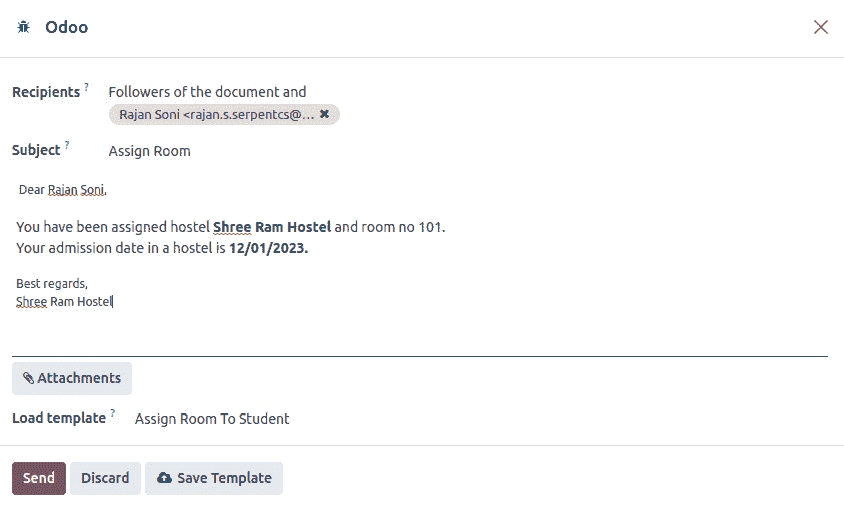

图 23.8 – 模板选择选项

+   使用 QWeb，直接从消息编辑器中选择模板不是一个选项。

## 更多内容...

所有方法（`message_post` 和 `message_post_with_source`）都尊重用户的偏好。如果用户从用户偏好中更改通知管理选项，用户将不会收到电子邮件；相反，他们将在 Odoo 的 UI 中收到通知。对于客户也是如此；如果客户选择退出电子邮件，他们将不会通过电子邮件收到任何更新。

此外，Odoo 消息线程遵循一个称为 `subtype_id` 的概念，在 `message_post_*` 方法中根据子类型发送电子邮件。通常，用户将从 **关注** 按钮的下拉菜单中管理他们的子类型。假设用户已将子类型设置为以下内容：

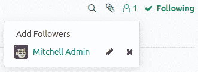

图 23.9 – 编辑子类型选项

根据用户的偏好，用户将只为 **讨论** 消息接收电子邮件。

# 管理电子邮件别名

电子邮件别名是 Odoo 中用于通过传入电子邮件创建记录的功能。电子邮件别名的最简单例子是销售团队。您只需向 `sale@yourdomain.com` 发送电子邮件，Odoo 就会在销售团队中为 `crm.lead` 创建一个新的记录。在这个配方中，我们将创建一个电子邮件别名来创建宿舍学生记录。

## 准备工作

对于这个配方，我们将使用前一个配方中的 `my_hostel` 模块，即 *使用 QWeb 模板发送电子邮件*。我们将使用 `hostelstudent@yourdomain.com` 电子邮件地址创建我们的电子邮件别名。如果您向此电子邮件地址发送主题包含书籍名称的电子邮件，将在 `hostel.student` 模型中创建一个记录。

## 如何操作...

按以下步骤为 `hostel.student` 模型添加电子邮件别名：

1.  在 `my_hostel/data/mail_template.xml` 文件中添加电子邮件别名数据：

    ```py
    <record id="mail_alias_room_assign" model="mail.alias">
           <field name="alias_name">room</field>
           <field name="alias_model_id" ref="model_hostel_student"/>
           <field name="alias_contact">partners</field>
       </record>
    ```

1.  在 `my_hostel/models/hostel_student.py` 文件中添加以下导入：

    ```py
    import re
    from odoo.tools import email_split, email_escape_char
    ```

1.  在 `hostel.student` 模型中覆盖 `message_new()` 方法：

    ```py
       @api.model
       def message_new(self, msg_dict, custom_values=None):
           self = self.with_context(default_user_id=False)
           if custom_values is None:
               custom_values = {}
           custom_values['name'] = re.match(r"(.+?)\s*<(.+?)>", msg_dict.get('from')).group(1)
           custom_values['email'] = email_escape_char(email_split(msg_dict.get('from'))[0])
           return super(HostelStudent, self).message_new(msg_dict, custom_values)
    ```

更新 `my_hostel` 模块以应用更改。然后，向 `hostelstudent@yourdomain.com` 发送电子邮件。这将创建一个新的 `hostel.student` 记录，并如下所示显示：

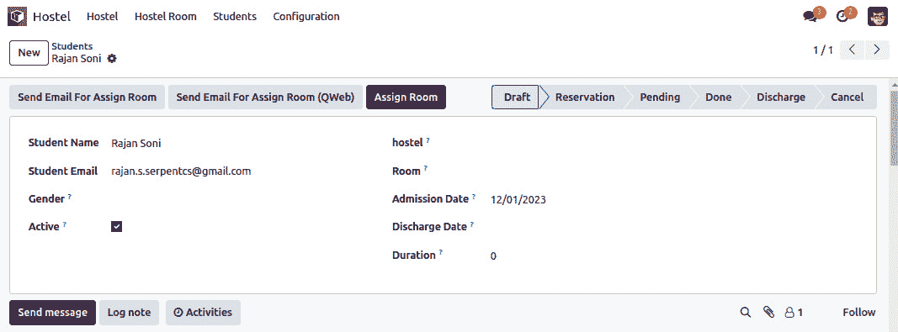

图 23.10 – 通过电子邮件生成的记录

每次您向 `hostelstudent@yourdomain.com` 发送电子邮件时，Odoo 都会生成一个新的学生记录。

## 它是如何工作的...

在 *步骤 1* 中，我们创建了一个 `mail.alias` 记录。此别名将处理 `hostelstudent@yourdomain.com` 电子邮件地址。当您向此地址发送电子邮件时，Odoo 将在 `hostel.student` 模型中创建一个新的记录。如果您想查看系统中活跃的别名列表，请打开 **设置** | **技术** | **电子邮件** | **别名**。以下是可用于配置别名的字段列表：

+   `alias_name`: 此字段包含电子邮件地址的本地部分；例如，在 `hostelstudent@yourdomain.com` 中的 `hostelstudent` 部分是电子邮件地址的本地部分。

+   `alias_model_id`: 应为传入的电子邮件创建记录的模型引用。

+   `alias_contact`: 此字段包含别名的安全偏好设置。可能的选项有 `everyone`、`partners`、`followers` 和 `employees`。

+   `alias_defaults`: 当收到一封新邮件时，其记录会在别名指定的模型中创建。如果您想在记录中设置默认值，请以字典的形式在此字段中给出这些值。

在 *步骤 2* 中，我们添加了必要的导入。在 *步骤 3* 中，我们覆盖了 `message_new()` 方法。当在别名电子邮件地址上收到新邮件时，会自动调用此方法。此方法将接受两个参数：

+   `msg_dict`: 此参数将是包含接收到的电子邮件信息的字典。它包含有关电子邮件的信息，例如发件人的电子邮件地址、收件人的电子邮件地址、电子邮件主题和电子邮件正文。

+   `custom_values`：这是一个用于创建新记录的自定义值。这是你在别名记录上使用`alias_defaults`字段设置的相同值。

在我们的配方中，我们覆盖了`message_new()`方法，并通过正则表达式从电子邮件中获取名称。然后，我们通过在*步骤 2*中导入的工具获取发送者的电子邮件地址。我们使用发送者的电子邮件地址来创建学生记录。然后，我们使用这两个值更新`custom_values`：`name`和`email`。我们将更新的`custom_values`数据传递给`super()`方法，该方法使用给定的`name`和`email`值创建一个新的`hostel.student`记录。这就是当你向别名发送电子邮件时创建记录的方式。

## 还有更多...

一些商业模式有这样一个要求，即每个记录都需要一个单独的别名。例如，销售团队模式为每个团队提供单独的别名，如印度团队的`sale-in@example.com`和比利时团队的`sale-be@example.com`。如果你想在你的模型中管理这样的别名，你可以使用`mail.alias.mixin`。为了在你的模型中使用它，你需要继承这个 mixin：

```py
class Team(models.Model):
    _name = 'crm.team'
    _inherit = ['mail.alias.mixin', 'mail.thread']
```

继承 mixin 后，你需要将`alias_name`字段添加到表单视图中，以便最终用户可以自己添加别名。

# 在聊天记录中记录用户更改

Odoo 框架提供了一个内置功能来在聊天记录中记录字段更改。在这个配方中，我们将启用一些字段的日志记录，以便当它们发生变化时，Odoo 将在聊天记录中添加日志。

## 准备工作

对于这个配方，我们将使用之前配方中的`my_hostel`模块，即*管理电子邮件别名*。在这个配方中，我们将记录`hostel.student`模型中几个字段的更改。

## 如何做到这一点...

修改字段的定义，以便在更改它们时启用日志记录。这在下述代码片段中显示：

```py
class HostelStudent(models.Model):
   _name = "hostel.student"
   _description = "Hostel Student Information"
   _inherit = ['mail.thread', 'mail.activity.mixin']
   name = fields.Char("Student Name")
   email = fields.Char("Student Email")
   gender = fields.Selection([("male", "Male"),
       ("female", "Female"), ("other", "Other")],
       string="Gender", help="Student gender")
   active = fields.Boolean("Active", default=True,
       help="Activate/Deactivate hostel record")
   hostel_id = fields.Many2one("hostel.hostel", "hostel", help="Name of hostel")
   room_id = fields.Many2one("hostel.room", "Room",
       help="Select hostel room")
   status = fields.Selection([("draft", "Draft"),
       ("reservation", "Reservation"), ("pending", "Pending"),
       ("paid", "Done"),("discharge", "Discharge"), ("cancel", "Cancel")],
       string="Status", copy=False, default="draft",
       help="State of the student hostel")
   admission_date = fields.Date("Admission Date",
       help="Date of admission in hostel",
       default=fields.Datetime.today,
       tracking=True)
   discharge_date = fields.Date("Discharge Date",
       help="Date on which student discharge",
       tracking=True)
   duration = fields.Integer("Duration", compute="_compute_check_duration", inverse="_inverse_duration",
                              help="Enter duration of living")
```

更新`my_hostel`模块以应用更改。在`hostel.student`模型中创建一个新记录，更改字段，然后入住和退宿宿舍。如果你检查聊天记录，你会看到以下日志：


图 23.11 – 聊天记录中的更改日志

每当你更改`state`、`admission_date`或`discharge_date`时，你将在聊天记录中看到一条新的日志。这将帮助你看到记录的完整历史。

## 它是如何工作的...

通过在字段上添加`tracking=True`属性，你可以为该字段启用日志记录。当你设置`tracking=True`属性时，Odoo 会在你更新字段值时在聊天记录中添加日志。如果你在多个记录上启用跟踪，并且想在跟踪值中提供一个序列，你也可以在跟踪参数中传递一个数字，例如：`tracking=20`。当你传递`tracking=True`时，将使用默认序列，即`100`。

在我们的食谱中，我们在`state`、`admission_date`和`discharge_date`字段上添加了`tracking=True`。这意味着当您更新`admission_date`、`discharge_date`或`state`字段的值时，Odoo 将记录更改。请查看*如何做…*部分中的截图；我们只更改了`admission_date`和`discharge_date`字段。

注意，`track_visibility`功能仅在您的模型继承`mail.thread`模型时才有效，因为与代码相关的聊天和日志是`mail.thread`模型的一部分。

# 发送周期性摘要电子邮件

Odoo 框架内置了对发送周期性摘要电子邮件的支持。通过摘要电子邮件，您可以发送包含业务关键绩效指标（KPIs）信息的电子邮件。在本食谱中，我们将发送宿舍房间数据给校长（或任何其他授权人员）。

## 准备工作

对于本食谱，我们将使用之前食谱中的`my_hostel`模块，即*在聊天中记录用户更改*。

## 如何做…

按照以下步骤生成房间租金记录的摘要电子邮件：

1.  继承`digest.digest`模型并添加 KPI 字段：

    ```py
    class Digest(models.Model):
       _inherit = 'digest.digest'
       kpi_room_rent = fields.Boolean('Room Rent')
       kpi_room_rent_value = fields.Integer(compute='_compute_kpi_room_rent_value')
       def _compute_kpi_room_rent_value(self):
           for record in self:
               start, end, company = record._get_kpi_compute_parameters()
               record.kpi_room_rent_value = self.env['hostel.room'].search_count([
                   ('create_date', '>=', start),
                   ('create_date', '<', end)
               ])
    ```

1.  继承`digest.digest`模型的表单视图并添加 KPI 字段：

    ```py
    <?xml version='1.0' encoding='utf-8'?>
    <odoo>
       <record id="digest_digest_view_form" model="ir.ui.view">
           <field name="name">digest.digest.view.form.inherit.hostel</field>
           <field name="model">digest.digest</field>
           <field name="inherit_id" ref="digest.digest_digest_view_form"/>
           <field name="arch" type="xml">
               <xpath expr="//group[@name='kpi_general']" position="after">
                   <group name="kpi_hostel" string="Hostel">
                       <field name="kpi_room_rent"/>
                   </group>
               </xpath>
           </field>
       </record>
    </odoo>
    ```

更新模块以应用更改。一旦更新了模块，启用开发者模式并打开**设置** | **技术** | **电子邮件** | **摘要电子邮件**，如图所示：

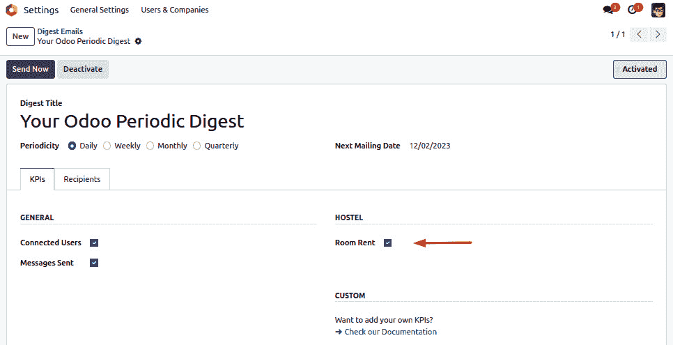

图 23.12 – 启用房间租金数据的摘要电子邮件

一旦启用此功能并且您已订阅摘要电子邮件，您将开始接收摘要电子邮件。

## 它是如何工作的…

为了构建定制的摘要电子邮件，您需要两个字段。第一个字段将是一个`Boolean`字段，用于启用和禁用 KPI，而第二个字段将是一个`compute`字段，将被调用以获取 KPI 值。我们在*步骤 1*中创建了这两个字段。如果您检查`compute`字段的定义，它使用`_get_kpi_compute_parameters`方法。此方法返回三个参数：一个开始日期、一个结束日期和公司记录。您可以使用这些参数为您 KPI 生成一个值。我们返回了特定时间段内租出的房间数量。如果您的 KPI 是跨站点的，那么您可以使用`company`参数。

在*步骤 2*中，我们在摘要表单视图中添加了一个字段。此字段用于启用/禁用摘要电子邮件。当您启用它时，您将开始接收摘要电子邮件：


图 23.13 – 房间租金记录的摘要电子邮件

启用开发者模式，然后打开**设置** | **技术** | **电子邮件** | **摘要电子邮件**。在这里，您可以配置摘要电子邮件的收件人并设置摘要电子邮件的周期性。您还可以从这里启用/禁用摘要电子邮件。
