# 24

# 管理 IoT Box

Odoo 提供对物联网（IoT）的支持。物联网是一个设备/传感器的网络，它们通过互联网交换数据。通过将此类设备与系统连接，您可以使用它们。例如，通过将打印机与 Odoo 连接，您可以直接将 PDF 报告发送到打印机。Odoo 使用一种称为 **IoT Box** 的硬件设备，用于连接打印机、卡尺、支付设备、脚踏开关等设备。在本章中，您将学习如何设置和配置 IoT Box。在此，我们将介绍以下食谱：

+   为树莓派刷写 IoT Box 图像

+   将 IoT Box 连接到网络

+   将 IoT Box 添加到 Odoo

+   加载驱动程序和列出连接的设备

+   从设备获取输入

+   通过 SSH 访问 IoT Box

+   配置销售点（POS）

+   直接将 PDF 报告发送到打印机

注意，本章的目标是安装和配置 IoT Box。开发硬件驱动程序超出了本书的范围。如果您想深入了解 IoT Box，请探索企业版中的 `iot` 模块。

# 技术要求

IoT Box 是基于 **Raspberry Pi** 的设备。本章中的食谱基于可从 [`www.raspberrypi.org/products/raspberry-pi-3-model-b-plus/`](https://www.raspberrypi.org/products/raspberry-pi-3-model-b-plus/) 获取的 **Raspberry Pi 3 Model B+**。IoT Box 是企业版的一部分，因此您需要使用企业版来遵循本章中的食谱。

本章中使用的所有代码均可从以下 GitHub 仓库下载：[`github.com/PacktPublishing/Odoo-17-Development-Cookbook-Fifth-Edition/tree/main/Chapter24`](https://github.com/PacktPublishing/Odoo-17-Development-Cookbook-Fifth-Edition/tree/main/Chapter24)。

# 为树莓派刷写 IoT Box 图像

在本食谱中，您将学习如何使用 IoT Box 的映像刷写 microSD 卡。请注意，此食谱仅适用于已购买 **空白树莓派** 的用户。如果您已从 Odoo 购买了官方 IoT Box，则可以跳过此食谱，因为它已预装了 IoT Box 图像。

## 准备工作

树莓派 3 Model B+ 使用 microSD 卡，因此我们在此食谱中使用了 microSD 卡。您需要将 microSD 卡连接到您的计算机。

## 如何操作…

执行以下步骤将 IoT Box 图像安装到您的 SD 卡中：

1.  将 microSD 卡插入您的计算机（如果您的计算机没有专用插槽，请使用适配器）。

1.  从 Odoo 的夜间构建中下载 IoT Box 图像。该图像可在 [`nightly.odoo.com/master/iotbox/`](https://nightly.odoo.com/master/iotbox/) 获取。

1.  在您的计算机上下载并安装 **balenaEtcher**。您可以从 [`www.balena.io/etcher/`](https://www.balena.io/etcher/) 下载此软件。

1.  打开 balenaEtcher，选择 IoT Box 图像（我们使用的是 IoT Box 图像的版本 23.09），然后选择将您的 microSD 卡进行闪存。您将看到以下屏幕：

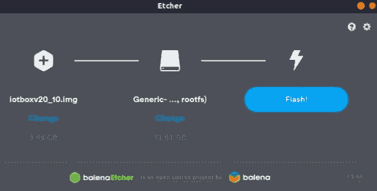

图 24.1 – 使用 IoT Box 图像闪存 SD 卡

1.  点击 **Flash!** 按钮，等待过程完成。

1.  取出 microSD 卡并将其放入 Raspberry Pi。

执行这些步骤后，您的 microSD 卡应该已经加载了 IoT Box 图像，并准备好在 IoT Box 中使用。

## 它是如何工作的...

在这个菜谱中，我们在 microSD 卡上安装了 IoT Box 图像。在第二步中，我们从 Odoo 夜间构建中下载了 IoT Box 图像。在夜间构建页面上，您可以找到不同版本的 IoT Box 图像。您需要从 Odoo 夜间构建中选择最新版本。在撰写本书时，我们使用了最新版本，即 `iotboxv23_11.zip`。Odoo IoT Box 图像是基于 Raspbian Stretch Lite 操作系统的，该镜像包含了与 Odoo 实例集成所需的库和模块。

在 *步骤 3* 中，我们下载了 balenaEtcher 工具来闪存 microSD 卡。

注意

在这个菜谱中，我们使用 balenaEtcher 闪存 microSD 卡，但您可以使用任何其他工具来闪存 microSD 卡。

在 *步骤 4* 中，我们使用 IoT Box 图像闪存了 microSD 卡。请注意，这个过程可能需要几分钟。完成过程后，microSD 卡将准备好使用。

如果您想验证图像是否成功闪存，请执行以下步骤：

1.  将 microSD 卡安装到 Raspberry Pi 上。

1.  将其连接到电源，并通过 HDMI 线缆（在实际使用中，外部显示器不是必需的；我们在这里只是用于验证目的）连接外部显示器。

1.  操作系统将启动并显示以下页面：


图 24.2 – IoT Box 屏幕

如果您不使用显示器，只需将 IoT Box 连接到电源，过一段时间后，您将看到 IoT Box 的 Wi-Fi 网络。

## 更多...

在 Odoo 的早期版本中，PosBox 用于 POS 应用。IoT Box 支持所有 PosBox 的功能，因此如果您使用的是 Odoo 的社区版，并且想集成设备，您可以使用相同的 IoT Box 图像连接不同设备的 Odoo 实例。有关更多信息，请参阅 *配置 POS* 菜谱。

# 将 IoT Box 连接到网络

IoT Box 通过网络与 Odoo 实例通信。连接 IoT Box 是一个关键步骤，如果您在这里出错，您可能会在连接 IoT Box 与 Odoo 时遇到错误。

## 准备工作

将带有 IoT Box 图像的 microSD 卡安装到 Raspberry Pi 上，然后连接 Raspberry Pi 到电源。

## 如何操作...

Raspberry Pi 3 Model B+ 支持两种网络连接类型——**以太网** **和 Wi-Fi**。

通过以太网连接物联网盒很简单；您只需将您的物联网盒用**RJ45 以太网线**连接，物联网盒就准备好使用了。通过 Wi-Fi 连接物联网盒比较复杂，因为您可能没有连接显示屏。按照以下步骤通过 Wi-Fi 连接物联网盒：

1.  将物联网盒连接到电源（如果以太网线已插入物联网盒，请将其拔出并重新启动物联网盒）。

1.  打开您的计算机并连接到名为`IoTBox`的 Wi-Fi 网络，如下面的截图所示（不需要密码）：


图 24.3 – 物联网盒 Wi-Fi 网络

1.  连接到 Wi-Fi 网络后，您将看到一个弹出窗口，显示物联网盒主页，如下面的截图所示（如果不起作用，请在浏览器中打开盒子的 IP 地址）：

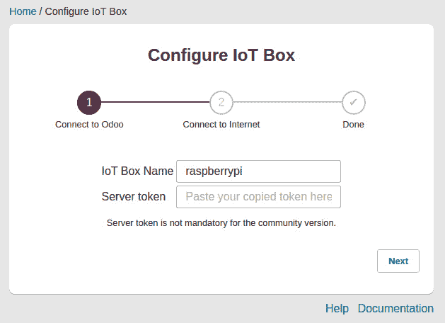

图 24.4 – 连接到物联网盒

1.  设置**物联网盒名称**并保持**服务器令牌**为空，然后点击**下一步**。这将带您到一个页面，您可以查看 Wi-Fi 网络的列表：

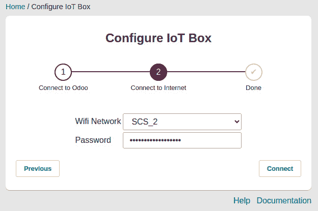

图 24.5 – 连接到 Wi-Fi

注意

如果您使用的是企业版并且希望立即将物联网盒与 Odoo 连接，您可以使用服务器令牌。您可以从您的 Odoo 实例中获取服务器令牌；有关更多信息，请参阅下一道菜谱。

1.  选择您想要连接的 Wi-Fi 网络，并填写**密码**字段。完成此操作后，点击**连接**按钮。如果您输入了正确的信息，您将被重定向到最后一个页面：


图 24.6 – 确认页面

执行这些步骤后，您的物联网盒已连接到网络，并准备好与 Odoo 实例集成。

## 它是如何工作的...

通过以太网将 Odoo 实例连接到物联网盒很简单；只需将您的物联网盒用 RJ45 以太网线连接，物联网盒就准备好使用了。当您想要通过 Wi-Fi 连接物联网盒时，这会变得复杂，因为物联网盒没有显示屏或 GUI。您没有界面可以输入您的 Wi-Fi 网络密码。因此，解决这个问题的方法是断开您的物联网盒与以太网线的连接（如果已连接）并重新启动它。在这种情况下，物联网盒将创建自己的 Wi-Fi 热点，命名为`IoTBox`或类似名称，如*步骤 2*所示。您需要将 Wi-Fi 连接到名为`IoTBox`的名称；幸运的是，它不需要密码。一旦连接到`IoTBox` Wi-Fi，您将看到一个弹出窗口，如*步骤 3*所示。在这里，您可以给您的物联网盒起一个类似`装配线物联网盒`的名字。目前保持服务器令牌为空；我们将在*将物联网盒添加到 Odoo*菜谱中了解更多。然后，点击**下一步**按钮。

点击**下一步**按钮后，您将看到一个 Wi-Fi 网络列表，如图*步骤 4*所示。在此，您可以连接物联网盒子到您的 Wi-Fi 网络。请确保您选择了正确的网络。您需要将物联网盒子连接到将要使用 Odoo 实例的计算机相同的 Wi-Fi 网络。物联网盒子和 Odoo 实例在**局域网**（**LAN**）内进行通信。这意味着如果两者连接到不同的网络，它们将无法通信，因此物联网将无法工作。

选择正确的 Wi-Fi 网络后，点击**连接**。然后，物联网盒子将关闭其热点并重新连接到您配置的 Wi-Fi 网络。就这样——物联网盒子已准备好使用。

# 将物联网盒子添加到 Odoo

我们的物联网盒子已连接到本地网络，并准备好与 Odoo 一起使用。在本菜谱中，我们将连接物联网盒子与 Odoo 实例。

## 准备工作

确保物联网盒子已开启，并且您已将物联网盒子连接到与运行 Odoo 实例的计算机相同的 Wi-Fi 网络。

有几件事情您需要注意；否则，物联网盒子将不会被添加到 Odoo 中：

+   如果您在本地实例中测试物联网盒子，您需要使用`http://192.168.*.*:8069`（您的本地 IP）而不是`http://localhost:8069`。如果您使用 localhost，物联网盒子将不会被添加到您的 Odoo 实例中。

+   您需要将物联网盒子连接到与运行 Odoo 实例的计算机相同的 Wi-Fi/Ethernet 网络。否则，物联网盒子将不会被添加到您的 Odoo 实例中。

+   如果您的 Odoo 实例运行在多个数据库上，物联网盒子将不会自动连接到 Odoo 实例。使用`--db-filter`选项来避免此问题。

## 如何操作...

为了将物联网盒子与 Odoo 连接，首先您需要在您的 Odoo 实例上安装`iot`模块：

1.  要这样做，请转到**应用**菜单并搜索**物联网**模块。该模块看起来像这样。激活模块，我们就可以开始了：


图 24.7 – 安装`iot`模块

1.  安装`iot`模块后，您可以将您的实例与物联网盒子连接。然后，通过点击**物联网**菜单手动将物联网盒子与 Odoo 实例连接。

1.  在控制面板上点击**连接**按钮。这将显示以下弹出窗口。复制**令牌**值：

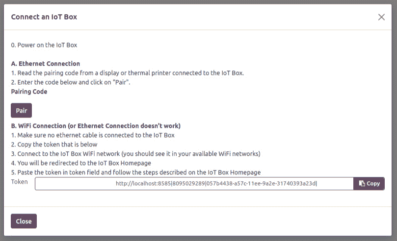

图 24.8 – 连接物联网盒子与 Odoo 的对话框

1.  使用端口`8069`打开物联网盒子的 IP。这将显示物联网盒子的主页。在**名称**部分点击**配置**按钮：

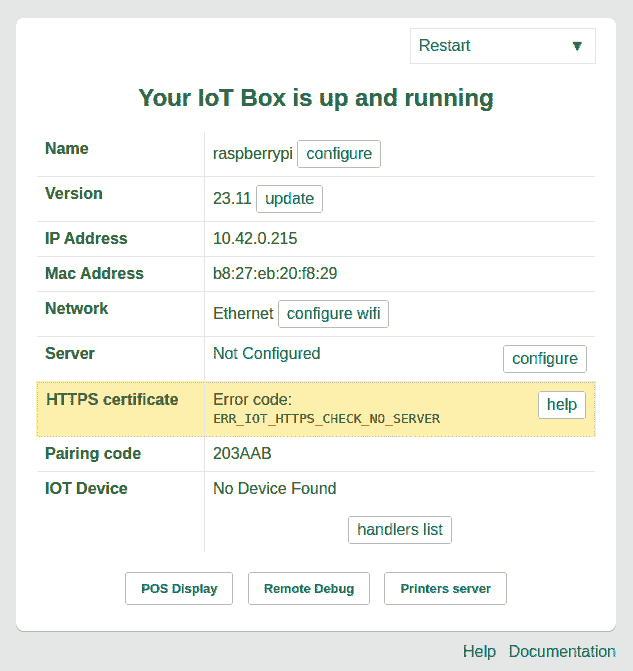

图 24.9 – 物联网盒子主页

1.  设置**物联网盒子名称**设置并粘贴服务器令牌。然后，点击**连接**按钮。这将开始配置物联网盒子。等待过程完成：

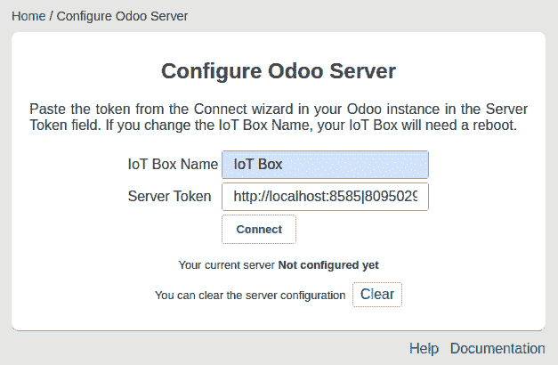

图 24.10 – IoT Box 主页

1.  在你的 Odoo 实例中检查**IoT**菜单。你将找到一个新的 IoT Box：


图 24.11 – 成功连接 IoT Box

## 它是如何工作的...

将 IoT Box 与 Odoo 连接很重要。这样，Odoo 将知道 IoT Box 的 IP 地址。Odoo 将使用该 IP 地址与连接到该设备的设备进行通信。这还将确保在多个 IoT Box 的情况下，Odoo 与正确的 IoT Box 进行通信。其余的都是直截了当的。

如果你想在 Wi-Fi 配置期间将 IoT Box 添加到 Odoo 实例，这是可以做到的。在*连接 IoT Box 与网络*菜谱中，我们保留了**服务器令牌**字段为空。你只需要在这一步添加服务器令牌：

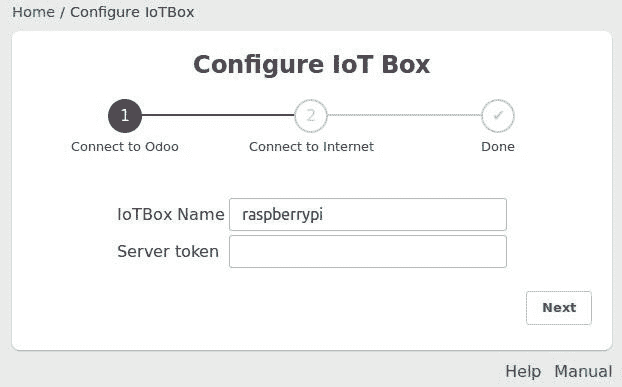

图 24.12 – 在 Wi-Fi 配置期间添加服务器令牌

注意

在使用 IoT Box 时，请避免使用 DHCP 网络。这是因为 IoT Box 的网络配置是基于 IP 地址添加的。如果你使用 DHCP 网络，那么 IP 地址将被动态分配。因此，你的 IoT Box 可能会因为新的 IP 地址而停止响应。为了避免这个问题，你可以将 IoT Box 的 MAC 地址映射到固定的 IP 地址。

### 使用配对码连接 IoT Box

连接 IoT Box 还有另一种替代方法，即通过`<IoTBOX IP>:8069/point_of_sale/display`。一旦你打开 POS 客户端显示，你将能够看到以下配对码：

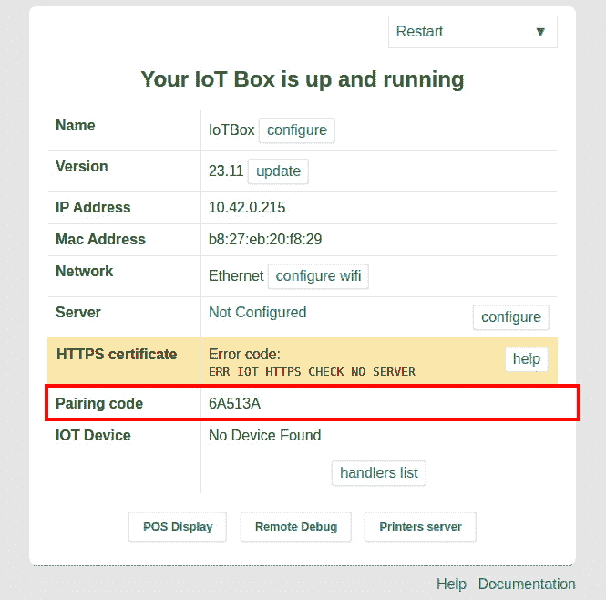

图 24.13 – IoT Box 的配对码

然后，你只需在你的 Odoo 实例的 IoT Box 连接对话框中使用配对码。

注意

如果你没有连接到互联网，配对码将不会显示。

在前面的屏幕截图中，我们看到了如何获取 POS 客户端显示的配对码。但是，如果你有一个以太网连接和打印机，你可以在没有显示的情况下获取配对码。你只需要将 IoT Box 与以太网和打印机连接。一旦 IoT Box 启动，它将打印带有配对码的收据。然后，你只需在你的 Odoo 实例的 IoT Box 连接对话框中使用配对码。

## 更多信息...

如果你想要将现有的 IoT Box 连接到任何其他 Odoo 实例，你需要清除配置。你可以通过 IoT Box 的 Odoo 服务器配置页面上的**清除**按钮清除 IoT Box 配置：

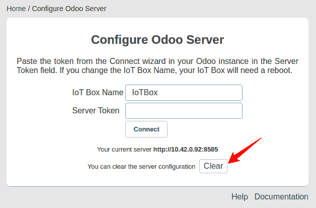

图 24.14 – 清除 IoT Box 配置

# 加载驱动程序和列出连接的设备

IoT Box 不仅限于企业版。您可以使用它就像社区版中的 PosBox 一样。设备的集成是企业版的一部分，因此 IoT Box 映像不包含设备驱动程序；您需要手动加载它们。通常，如果您使用企业 Odoo 实例连接 IoT Box，IoT Box 会自动加载设备驱动程序接口。但有时，您可能有一些自定义驱动程序或未正确加载的驱动程序。在这种情况下，您可以手动加载驱动程序。在本菜谱中，我们将了解如何加载驱动程序并获取连接设备列表。

## 准备工作

确保 IoT Box 已开启，并且您已将其连接到与运行 Odoo 实例的计算机相同的 Wi-Fi 网络。

## 如何操作...

执行以下步骤将设备驱动程序加载到 IoT Box 中：

1.  打开 IoT Box 主页并点击底部的**处理程序列表**按钮：

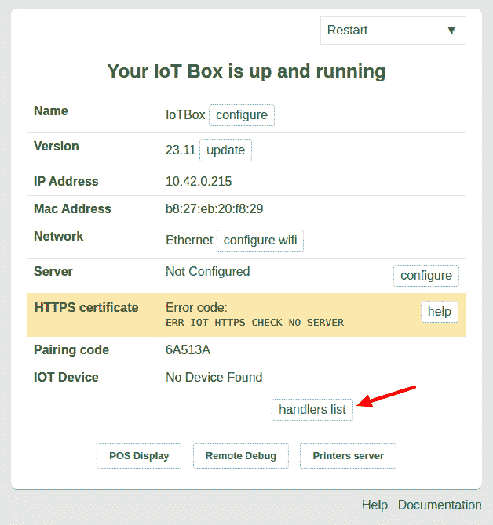

图 24.15 – 处理程序列表按钮

1.  **处理程序列表**按钮会将您重定向到**处理程序列表**页面，在那里您将找到**加载处理程序**按钮。点击该按钮以加载驱动程序：


图 24.16 – 驱动程序列表

1.  返回到**IoT Box**主页。在这里，您将看到连接设备的列表：


图 24.17 – 连接设备

执行这些步骤后，IoT Box 将准备好您指定的设备，您就可以开始在您的应用程序中使用这些设备了。

## 它是如何工作的...

您可以从 IoT Box 的主页加载驱动程序。您可以使用底部的**加载处理程序**按钮来完成此操作。请注意，这仅适用于您的 IoT Box 使用企业版与 Odoo 实例连接。加载驱动程序后，您将能够在 IoT Box 主页上看到设备列表。您还可以通过**IoT** | **设备**菜单在 Odoo 实例中查看连接设备列表。在这个菜单中，您将看到每个 IoT Box 的连接设备列表：

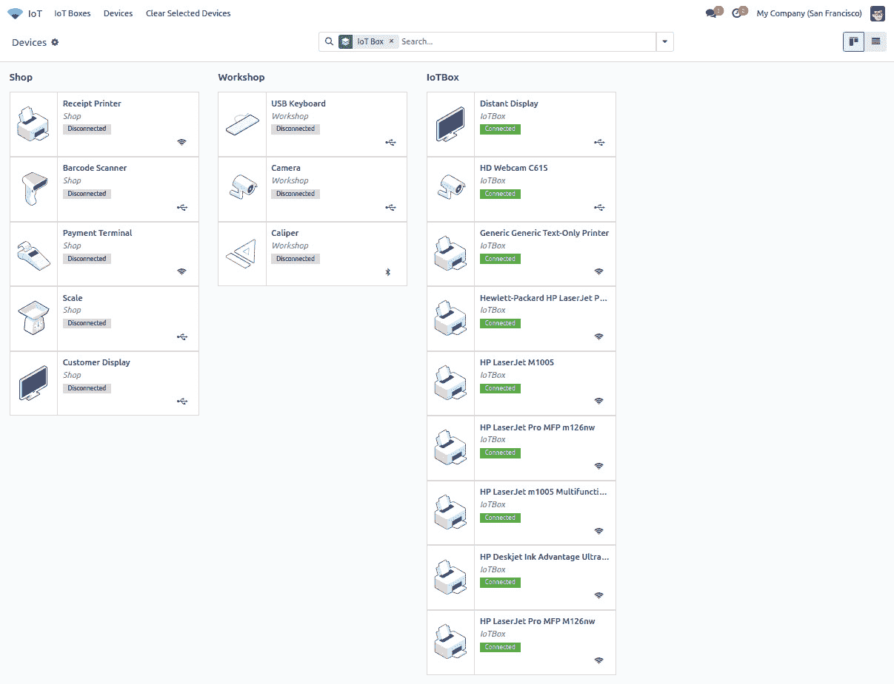

图 24.18 – 连接设备列表

目前，IoT Box 支持一些硬件设备，例如摄像头、脚踏开关、打印机和卡尺。可以在此处找到 Odoo 推荐设备列表：[`www.odoo.com/page/iot-hardware`](https://www.odoo.com/page/iot-hardware)。如果您的设备不受支持，您可以支付驱动程序开发费用。

# 从设备获取输入

IoT Box 仅支持有限的设备。目前，这些硬件设备已集成到制造应用程序中。但如果您愿意，您可以将支持的设备集成到您的模块中。在本菜谱中，我们将通过我们的 IoT Box 从摄像头捕获图片。

## 准备工作

我们将使用来自*第二十三章*，“在 Odoo 中管理电子邮件”中“在聊天中记录用户更改”食谱的`my_hostel`模块。在这个食谱中，我们将添加一个新字段来捕捉和存储当借阅者归还书籍时的图像。确保 IoT Box 已开启，并且你已经连接了一个支持的视频设备。

## 如何操作……

执行以下步骤，使用带有 IoT Box 的摄像头捕捉图片：

1.  在清单文件中添加一个依赖项：

    ```py
    'depends': ['base', 'quality_iot'],
    ```

1.  在`hostel.student`模型中添加新字段：

    ```py
    test_type_id = fields.Many2one('quality.point.test_type', 'Test Type',help="Defines the type of the quality control point.",
    required=True, default=_get_default_test_type_id)
    test_type = fields.Char(related='test_type_id.technical_name', readonly=True)
    device_id = fields.Many2one('iot.device', string='IoT Device', domain="[('type', '=', 'camera')]")
    ip = fields.Char(related="device_id.iot_id.ip")
    identifier = fields.Char(related='device_id.identifier')
    picture = fields.Binary()
    ```

1.  将这些字段添加到`hostel.student`模型的表单视图中：

    ```py
    <group>
        <field name="test_type_id" invisible="1"/>
        <field name="test_type" invisible="1"/>
        <field name="ip" invisible="0"/>
        <field name="identifier" invisible="0"/>
        <field name="device_id" required="1"/>
        <field name="picture" widget="iot_picture"
              options="{'ip_field': 'ip', 'identifier': 'identifier'}"/>
        <field name="name"/>
        <field name="gender"/>
        <field name="active"/>
    </group>
    ```

1.  更新`my_hostel`模块以应用更改。更新后，你将有一个按钮来捕捉图像：

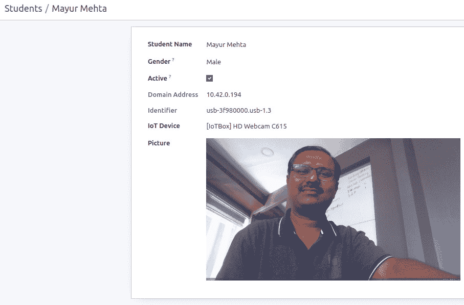

图 24.19 – 通过 IoT 捕捉图像

注意，如果网络摄像头未连接到 IoT Box 或驱动程序未在 IoT Box 中加载，则按钮将不会捕捉图像。

## 它是如何工作的……

在*步骤 1*中，我们在清单文件中添加了对`quality_iot`模块的依赖。`quality_iot`模块是企业版的一部分，包含一个小部件，允许你通过 IoT Box 请求摄像头的图像。这将安装`stock`模块，但为了简化，我们将使用`quality_iot`作为依赖。如果你不想使用这个依赖项，你可以创建自己的字段小部件。请参考*第十五章*“Web 客户端开发”中的“创建自定义小部件”食谱，了解更多关于小部件的信息。

在*步骤 2*中，我们添加了捕捉摄像头图像所需字段。要捕捉图像，我们需要两样东西：IoT Box 的设备标识符和 IP 地址。我们希望给用户选择摄像头的选项，因此添加了一个`device_id`字段。用户将选择一个摄像头来捕捉图像，并根据所选的摄像头设备，我们从相关字段中提取 IP 和设备标识符信息。基于这些字段，Odoo 将知道在多个 IoT Box 的情况下在哪里捕捉图像。我们还添加了一个二进制字段`picture`来保存图像。

在*步骤 3*中，我们在表单视图中添加了字段。请注意，我们在`picture`字段上使用了`iot_picture`小部件。我们将`ip`和`identifier`字段作为不可见字段添加，因为我们不想向用户显示它们；相反，我们想在`picture`字段选项中使用它们。这个小部件将在表单视图中添加按钮；点击按钮后，Odoo 将向 IoT Box 发出请求以捕捉图像。IoT Box 将返回图像数据作为响应。此响应将被保存在`picture`二进制字段中。

## 还有更多……

IoT Box 支持蓝牙卡尺。如果你想在你的模块中进行测量，你可以使用`iot_measure`小部件在 Odoo 中获取它们。注意，与`iot_picture`一样，这里你也需要在表单视图中添加不可见的`ip`和`identifier`字段：

```py
<field name="measure" widget="iot_measure"
           options="{'ip_field': 'ip', 'identifier': 'identifier'}"/>
```

这将使用从物联网卡尺捕获的数据填充`measure`字段。

# 通过 SSH 访问物联网盒子

物联网盒子运行在 Raspbian 操作系统上，并且可以通过 SSH 访问物联网盒子。在本教程中，我们将学习如何通过 SSH 访问物联网盒子。

## 准备工作

确保物联网盒子已开启，并且您已将物联网盒子连接到与运行 Odoo 实例的计算机相同的 Wi-Fi 网络。

## 如何操作…

为了通过 SSH 连接物联网盒子，您需要物联网盒子的 IP 地址。您可以在其表单视图中看到此 IP 地址。例如，在本教程中，我们将使用`192.168.43.6`作为物联网盒子的 IP 地址，因此请将其替换为您自己的 IP 地址。执行以下步骤通过 SSH 访问物联网盒子：

1.  打开终端并执行以下命令：

    ```py
    $ ssh pi@192.168.43.6
    raspberry as the password.
    ```

1.  如果您添加了正确的密码，您就可以访问 shell。执行以下命令以查看目录：

    ```py
    total 24
    -rw-r--r-- 1 root root    6 Oct 26 08:12 iotbox_version
    drwxr-xr-x 5 pi   pi   4096 Oct 23 09:05 odoo
    -rw-r--r-- 1 pi   pi     36 Nov 15 13:10 odoo-db-uuid.conf
    -rw-r--r-- 1 pi   pi      0 Nov 15 13:10 odoo-enterprise-code.conf
    -rw-r--r-- 1 pi   pi     26 Nov 15 13:10 odoo-remote-server.conf
    -rw-r--r-- 1 pi   pi     11 Nov 15 13:10 token
    -rw-r--r-- 1 pi   pi     26 Aug 20 12:03 wifi_network.txt
    ```

由于您有 SSH 访问权限，您可以探索物联网盒子的完整文件系统。

## 它是如何工作的…

我们使用用户名`Pi`和密码`raspberry`通过 SSH 访问物联网盒子。当您想调试物联网盒子中的问题时会使用 SSH 连接。SSH 不需要任何解释，但让我们看看 Odoo 在物联网盒子中的工作方式。

以下是一些可能帮助您调试问题的信息：

+   物联网盒子内部运行一些 Odoo 模块。这些模块的名称通常以`hw_`开头，并在社区版中可用。您可以在`/home/pi/odoo/addon`目录中找到所有模块。

+   如果您想查看 Odoo 服务器日志，您可以从`/var/log/odoo/odoo-server.log`文件中访问它。

+   Odoo 通过名为`odoo`的服务运行；您可以使用以下命令启动、停止或重启服务：

    +   `sudo service` `odoo start/restart/stop`

+   客户通常通过断开电源来关闭物联网盒子。这意味着在这种情况下，物联网盒子操作系统无法正确关闭。为了避免系统损坏，物联网盒子的文件系统是只读的。

## 更多内容…

注意，物联网盒子仅连接到本地机器。因此，您无法直接从远程位置（通过互联网）访问 shell。如果您想远程访问物联网盒子，可以将`ngrok`认证令牌密钥粘贴到物联网盒子的远程调试页面，如图所示。这将启用物联网盒子的 TCP 隧道，以便您可以从任何地方通过 SSH 连接物联网盒子。有关`ngrok`的更多信息，请访问[`ngrok.com/`](https://ngrok.com/):

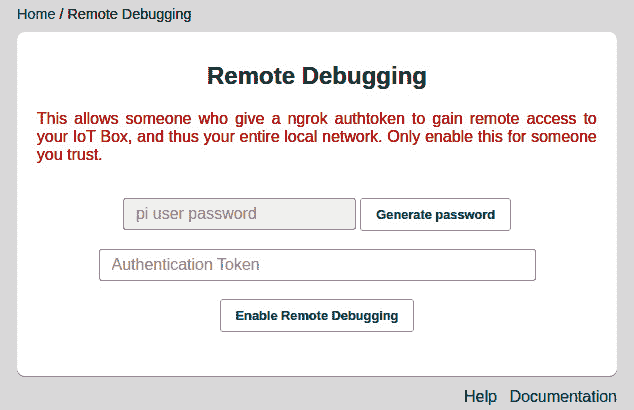

图 24.20 – 使用 ngrok 令牌进行调试

一旦您添加了令牌，您将能够从远程位置访问物联网盒子。

# 配置 POS

物联网盒子与 POS 应用程序配合使用。在本教程中，我们将学习如何为 POS 应用程序配置物联网盒子。

## 准备工作

确保物联网盒已开启，并且您已将物联网盒连接到与运行 Odoo 实例的计算机相同的 Wi-Fi 网络。另外，如果尚未安装，请安装 POS 应用程序。

## 如何操作…

执行以下步骤以配置 POS 应用程序的物联网盒：

1.  打开 POS 应用程序，并从 POS 会话下拉菜单中打开**设置**：


图 24.21 – POS 会话设置

1.  点击**编辑**按钮，然后点击**物联网盒**复选框。这将启用更多选项：

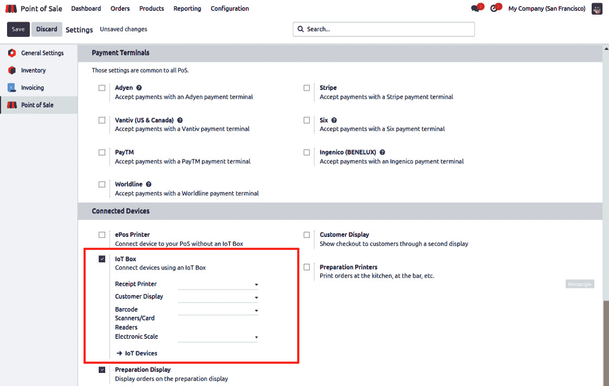

图 24.22 – 选择物联网设备

1.  选择您在 POS 会话中想要使用的设备。如果您将要使用硬件，例如条形码扫描仪，请选择相关设备。

1.  通过点击控制面板中的**保存**按钮保存更改。

配置完成后，您将能够在 POS 应用程序中使用物联网盒。

## 它是如何工作的…

物联网盒可以与 PosBox 等 POS 应用程序一起使用。为了在 POS 应用程序中使用物联网盒，您必须将物联网盒连接到 Odoo 实例。如果您不知道如何连接物联网盒，请遵循*将物联网盒添加到 Odoo*食谱。一旦您将物联网盒连接到 Odoo，您将能够在 POS 应用程序中选择物联网盒，如图*步骤 2*所示。

在这里，您可以选择在 POS 会话中想要使用的硬件。保存更改后，如果您打开 POS 会话，您将能够在 POS 中使用启用的硬件。如果您在设置中启用了特定的硬件，但该硬件未连接到物联网盒，您将在顶部栏看到以下警告：


图 24.23 – 物联网盒连接问题

您可以点击这些警告尝试重新连接。

## 更多内容…

POS 应用程序是社区版的一部分。如果您正在使用社区版，那么在 POS 设置中，您将看到**物联网盒 IP 地址**字段而不是**物联网盒**选择项：


图 24.24 – 社区版中的物联网盒设置

如果您想在社区版中集成硬件，您需要在字段中使用物联网盒的 IP 地址。

# 直接将 PDF 报告发送到打印机

物联网盒默认运行**通用 UNIX 打印系统**（**CUPS**）服务器。CUPS 是一种允许计算机充当打印服务器的打印系统。您可以在[`www.cups.org/`](https://www.cups.org/)上了解更多信息。因此，由于物联网盒内部运行 CUPS，您可以使用物联网盒连接网络打印机。在本食谱中，我们将了解如何直接从 Odoo 打印 PDF 报告。

## 准备工作

确保物联网盒已开启，并且您已将物联网盒与 Odoo 连接。

## 如何操作…

按照以下步骤直接从 Odoo 打印报告：

1.  通过 IP 地址打开物联网盒主页。

1.  点击底部的**打印机服务器**按钮。

1.  这将打开 CUPS 配置主页。在这里配置您的打印机。

1.  一旦您配置了打印机，您将能够在物联网设备列表中看到打印机。激活开发者模式并打开**设置**| **技术** | **操作** | **报告**。

1.  搜索您想要打印的报告，打开表单视图，并在**物联网设备**字段中选择打印机，如图下所示：

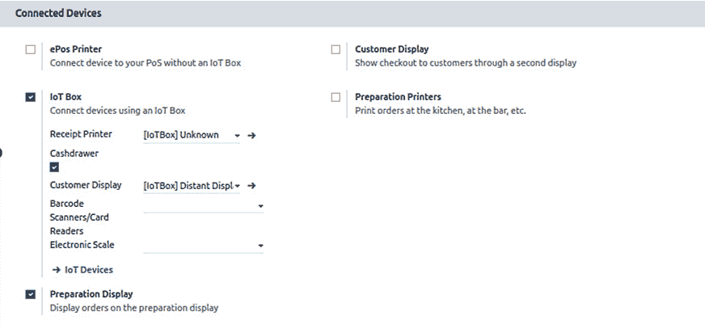

图 24.25 – 选择物联网设备的选项

完成此配置后，报告 PDF 将直接发送到打印机。

## 它是如何工作的……

在配置方面，这个菜谱很简单，但有一些事情您应该知道。物联网盒使用 CUPS 服务器打印报告。您可以在`http://<IoT Box IP>:631`访问 CUPS 主页。

使用 CUPS，您可以添加/删除打印机。在 CUPS 的主页上，您将能够看到所有帮助您连接不同类型打印机的文档。一旦您配置了打印机，您将在物联网设备列表中找到您的打印机。然后，您可以在报告记录中选择此物联网设备（打印机）。通常，当您在 Odoo 中打印报告时，它会下载报告的 PDF。但完成此配置后，Odoo 将直接将 PDF 报告发送到所选打印机。请注意，只有记录中在物联网设备字段设置了打印机的报告才会发送到打印机。
