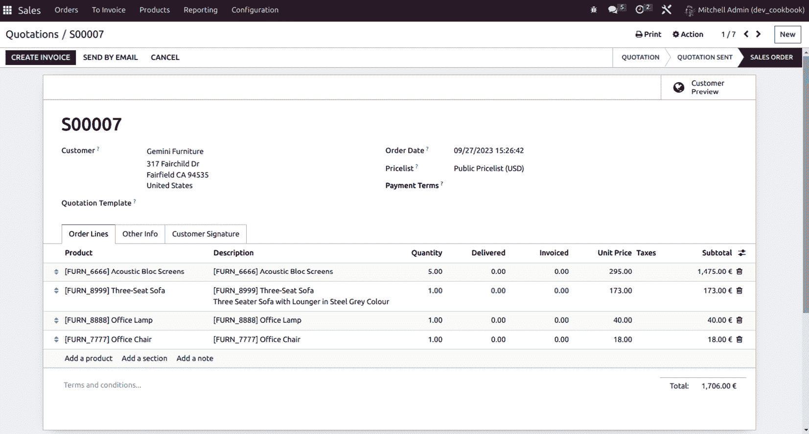

# 25

# Web Studio

Odoo Web Studio 是 Odoo 企业版独有的功能。它是一个工具箱，让您能够直接从用户界面中定制 Odoo 用户界面及其报告，无需任何代码，例如通过将组件拖放到视图中。用户可以直接从用户界面创建或定制报告。

Odoo Web Studio 是一个可视化开发工具，允许用户在 Odoo **企业资源计划**（**ERP**）平台上定制和创建应用程序。使用 Odoo Web Studio，用户可以在无需广泛编程或编码技能的情况下设计、修改和扩展其 Odoo 应用程序的各个方面。它提供了一个拖放界面，使得不同技术水平的用户都能使用。

Odoo Web Studio 通过提供一个用户友好的环境来创建模块、定制报告、自动化等，使用户能够完全控制他们的 Odoo ERP 系统。它是寻求适应和优化其 Odoo 应用以满足其独特需求和偏好的企业的宝贵工具。因此，Odoo Web Studio 是一个强大的工具，使用户能够轻松地在 Odoo ERP 系统中创建和定制应用程序。无论您是在构建新模块、定制现有模块还是设计报告，Odoo Web Studio 都提供了一个用户友好且直观的界面，以简化这些流程。

以下是 Odoo Web Studio 的关键功能和能力：

+   **视觉定制**：Odoo Web Studio 提供了一个可视化界面，允许用户定制其应用程序的布局、字段和表单。您可以修改现有模块或创建全新的模块。

+   **数据模型编辑器**：用户可以在其应用程序中定义新的数据模型、字段以及对象之间的关系。这有助于根据特定的业务需求定制数据库结构。

+   **工作流配置**：工作流自动化是 ERP 系统的一个关键方面。通过 Web Studio，用户可以设计和配置工作流、自动化规则和触发器，以简化业务流程。

+   **报告和仪表板**：用户可以设计自定义报告和仪表板，以可视化数据并深入了解他们的业务运营。

+   **移动响应性**：Odoo Web Studio 应用程序设计为响应式，这意味着它们可以适应不同的屏幕尺寸和设备，包括智能手机和平板电脑。

+   **无代码或低代码**：虽然一定程度的技能知识可能有所帮助，但 Odoo Web Studio 设计为用户友好且易于访问，无需广泛的编码技能。这使得业务用户能够进行更改并适应其特定需求。

+   **实时协作**：多个用户可以同时设计和修改应用程序。

+   **集成**：Odoo Web Studio 应用程序可以与其他 Odoo 模块和外部系统集成，以确保无缝的数据流和连接性。

在本章中，我们将介绍以下菜谱：

+   安装 Odoo Web Studio

+   从新建应用开始

+   建议功能

+   组件

+   字段属性

+   视图

+   创建新应用

+   自定义现有应用

+   内置函数

+   报表

# 安装 Odoo Web Studio

在本菜谱中，您将学习如何安装 Odoo Web Studio。

使用管理员或超级用户凭据登录您的 Odoo 实例。在 Odoo 界面中，转到**应用**模块。这是您可以安装或激活新模块和功能的地方：

1.  前往**应用**。

1.  搜索`Web Studio`。

1.  点击**安装**。

安装后，您应该在您的 Odoo 实例中看到一个名为**工作室**的新菜单项或部分。点击它以访问 Odoo Web Studio：


图 25.1 – Studio 按钮的截图

一旦您进入 Odoo Web Studio，您就可以开始自定义您的 Odoo 应用程序，设计工作流程，创建报告，并使用提供的视觉工具和界面进行其他修改。通过点击图标，激活了工作室自定义模式。

## 从新建应用开始

在 Odoo Web Studio 中，您通常首先创建一个新应用。可以将应用视为模块或您 ERP 系统的一部分。点击**创建**或**新建**按钮开始：

1.  前往**应用**菜单屏幕。

1.  点击**自定义**图标。

1.  点击**新建应用**按钮开始创建新应用：


图 25.2 – 新建应用创建屏幕的截图

1.  点击**新建应用**后，您将看到以下内容：


图 25.3 – 点击新建应用后您将看到的内容

点击**下一步**。从这里，您可以定义您模块的名称并更改您模块的标志。您可以上传自定义标志或自定义标志的图标、图标颜色和标志背景：


图 25.4 – 创建新应用

为您的应用选择一个名称。您可以通过选择内置图标中的任何一个来自定义图标。您还将有机会根据您的企业品牌修改背景颜色和图标颜色。在添加模块名称后，点击**>**按钮。此时，您可以添加您第一个菜单的名称。在这里，您必须构建一个新的菜单，因此您可以随意命名。一旦完成，您可以选择您希望创建的模型类型。如果您是从头创建应用，请选择**新建模型**。否则，选择**现有模型**：


图 25.5 – 创建您的第一个菜单

完成此操作后，点击**>**按钮。您的应用将准备好进行下一级别的自定义。

# 建议功能

Odoo Web Studio 是一个强大的工具，允许用户在不需进行大量编码的情况下自定义和扩展他们的 Odoo 应用。根据您的业务需求，当使用 Odoo Web Studio 时，您可以利用以下建议的功能和功能：


图 25.6 – 建议功能

一旦您点击**创建您的应用**按钮，您将看到以下屏幕。在这里，您可以添加组件和新字段，以及修改或重用现有的模型字段。您只需拖放字段即可：


图 25.7 – 模型组件

# 组件

Odoo Web Studio 提供了一套组件，您可以使用它们在 Odoo ERP 系统中创建和自定义模块。这些组件使您能够在无需大量编码的情况下设计数据模型、用户界面、工作流程和报告。以下是 Odoo Web Studio 中可用的关键组件和功能：

+   **数据模型设计器**：此组件允许您创建和修改数据模型，定义字段，指定数据类型，设置默认值，并建立对象之间的关系。您可以为存储与您的业务流程相关的数据创建自定义对象。

+   **表单构建器**：表单构建器组件允许您设计和自定义用于数据输入和显示的表单。您可以将字段拖放到表单上，排列它们，并设置字段属性，如标签、帮助文本和验证规则。

+   **工作流程编辑器**：使用工作流程编辑器组件，您可以设计自定义工作流程来自动化业务流程。您可以定义触发器、动作和转换，允许您模拟数据在应用程序中的移动以及每个阶段应该发生什么。

+   **报告设计器**：报告设计器组件允许您创建自定义报告和仪表板。您可以设计报告模板，添加图表、表格和图形以可视化数据，并生成可打印或数字报告。

+   **菜单编辑器**：菜单编辑器组件允许您创建和修改 Odoo 模块内的菜单和导航结构。您可以定义针对不同用户角色的菜单，并将它们组织起来以方便访问应用程序的各个部分。

+   **视图和小部件**：您可以使用视图和小部件自定义数据的显示方式。Odoo Web Studio 提供各种视图类型，如列表视图、表单视图和看板视图，您可以根据需要配置它们。

+   **动作和触发器**：动作和触发器允许您定义在特定事件或用户操作发生时应该发生什么。例如，您可以设置动作以发送电子邮件通知、更新记录或触发特定的工作流程。

+   **访问控制**：Odoo Web Studio 允许您为不同的用户角色设置权限和访问权限。您可以控制谁可以查看、编辑或删除记录，以及访问模块中的特定功能。

+   **本地化支持**：根据区域或行业特定要求自定义您的模块，包括税则、语言和会计标准。

+   **数据导入和导出**：启用数据导入和导出功能，以促进数据迁移和与外部系统的集成。

+   **计划操作**：您可以基于计划自动执行任务和操作，例如数据备份或自动电子邮件通知。

+   **集成工具**：Odoo Web Studio 提供工具，使您可以将自定义模块与其他 Odoo 模块或外部系统集成，确保无缝的数据交换和同步。

这是一个带有**描述**字段的默认列表视图：


图 25.8 – 默认列表视图

# 字段属性

在 Odoo Web Studio 中，当在数据模型中创建或自定义字段时，您有多种选项来配置和自定义这些字段以满足您的业务需求。以下是在使用 Odoo Web Studio 创建新字段时可用的一些常见选项：

+   **字段名称**：为您的字段提供一个描述性的名称，反映它将存储的数据类型。

+   **字段类型**：选择适合您字段的适当数据类型。Odoo 提供广泛的数据类型，包括文本、整数、浮点数、日期、日期时间、选择、多对一（与其他记录的关系）等。

+   **必填字段**：您可以设置字段为必填，这意味着在创建或编辑记录时，用户必须为此字段提供值。

+   **默认值**：为字段设置默认值。在创建新记录时，此值将预先填充。

+   **只读**：在此，您可以设置字段为只读，这样用户就不能编辑它。这对于一旦设置就不应修改的字段很有用。

+   **帮助文本**：添加一些帮助文本或描述，以提供有关字段或用户说明的附加信息。

+   **占位符文本**：对于文本或字符字段，您可以指定一个占位符文本，该文本将出现在输入字段中以指导用户。

+   **验证约束**：在此，您可以设置验证约束，例如字符限制、数字范围或文本字段的模式。

+   **计算和默认函数**：您可以定义计算函数，根据其他字段或条件计算字段的值。默认函数允许您设置动态默认值。

+   **依赖关系**：在此，您可以定义字段依赖关系，这些依赖关系基于其他字段的值确定字段何时可见或必填。

+   **选择值**：对于选择字段，指定用户可以选择的值列表。这通常用于下拉菜单等字段。

+   **域过滤器**：根据某些条件应用域过滤器，以限制许多一对一或多对多字段的可选值。

+   **高级选项**：Odoo Web Studio 还提供了一些高级选项，例如设置相关字段、指定更改动作或设置访问权限。

+   **组和访问权限**：配置哪些用户组可以查看或编辑此字段。您可以根据用户角色定义不同的访问权限。

+   **计算字段**：创建基于记录中其他字段的计算字段，以显示计算值。这些字段不存储数据，而是动态计算值。

+   **小部件**：选择不同的小部件来控制字段的显示方式，例如文本、选择、日期或颜色选择器小部件。

+   **依赖于**：定义字段依赖关系，指示哪些其他字段影响此字段的可见性或行为。

+   **相关字段**：创建相关字段以显示相关记录的信息。例如，您可以通过创建相关字段在发票上显示客户的姓名。

+   **不可见或隐藏字段**：使字段不可见或隐藏，以控制它们在表单中的可见性。

+   **附件字段**：配置字段以允许添加附件或上传文档或文件。

下面的截图显示了新字段：


图 25.9 – 新字段

下面是现有字段的截图：


图 25.10 – 现有字段

# 视图

在 Odoo Web Studio 中，视图是设计自定义模块用户界面的基本组件。视图决定了数据在 Odoo 应用程序中的显示和交互方式。在 Odoo Web Studio 中，你可以使用几种类型的视图来创建和自定义模块的用户界面：


图 25.11 – 视图

让我们看看一些常用的视图类型。

## 表单视图

表单视图允许用户查看和编辑单个记录。您可以通过添加、删除或重新排列字段来自定义表单视图的布局。此视图通常用于详细记录编辑：


图 25.12 – 表单视图

在 Odoo Web Studio 中，表单视图是设计自定义模块用户界面的关键组件。表单视图允许用户在应用程序中查看和编辑单个记录：


图 25.13 – 表单视图字段

我们可以使用前面截图中的字段创建表单视图。只需将字段拖放到表单视图中，即可创建我们想要显示的新字段：


图 25.14 – 表单视图的字段详情

这些是字段属性：


图 25.15 – 表单视图的字段属性

在这里，我们可以看到特定字段的视图选项：


图 25.16 – 各种表单视图字段视图选项

让我们看看表单视图的一些重要属性：

+   **视图继承**：在 Odoo Web Studio 中，您可以处理视图继承。这允许您基于现有的表单视图创建新的表单视图，并对它进行特定的修改或添加。这可以在创建类似视图时节省您的时间。

+   **依赖关系**：您可以在表单视图中配置字段依赖关系。例如，您可以根据其他字段中输入的值使某些字段可见或必填。

+   **验证规则**：表单视图可以设置验证规则以确保数据准确性。您可以对字段定义约束以控制输入数据。

+   **保存和测试**：当您对表单视图的设计满意时，保存您的更改。要测试表单视图，请转到使用该视图的应用或模块，创建或编辑记录，并观察您的表单视图如何显示和运行。

+   **自定义操作**：您还可以将自定义操作链接到表单视图中的按钮，使用户在交互记录时执行特定操作。

## 列表视图

列表视图以表格格式显示记录，这使得浏览和搜索多个记录变得容易。您可以通过选择要显示的字段、设置排序选项和添加筛选条件来自定义列表视图：


图 25.17 – 列表视图

当您在列表视图中点击一列时，您可以编辑该字段的属性。用户可以设置以下字段属性：

+   **不可见**

+   **必填**

+   **只读**

+   **可选**

+   **标签**

+   **小部件**

+   **默认值**

+   **限制可见性到** **组**：


图 25.18 – 列表视图属性

在 Odoo Web Studio 中，列表视图是设计自定义模块用户界面的重要组件。以下是您如何在 Odoo Web Studio 中处理列表视图的方法：

1.  **创建新的列表视图**：要创建新的列表视图，点击**创建**按钮。给它一个反映其在模块中用途或功能的名称。

1.  **设计列表视图**：一旦创建了列表视图，您就可以开始设计它。

1.  **选择必要的字段**：通过将它们从**字段**部分拖放到列表视图画布中，选择您想在列表视图中显示的字段。您可以按列排列这些字段。

1.  **列属性**：点击每一列以访问其属性。您可以为每个列设置标签、格式化选项和排序行为。

1.  **排序和分组**：配置在列表视图中记录的排序和分组方式。

1.  **筛选条件**：添加筛选条件以根据特定条件限制在列表视图中显示的记录。

### 列表视图设置

点击列表视图本身以访问其设置。您可以配置各种方面，包括以下内容：

+   **访问权限**：定义哪些用户角色可以查看或访问此列表视图。

+   **高级选项**：指定列表视图在特定情况下应该是可见的、不可见的还是只读的。

+   **组**：为不同的用户组设置权限和访问权限。

+   **视图继承**：类似于表单视图，您还可以为列表视图处理视图继承。这允许您根据现有视图创建新的列表视图，并进行特定的修改或添加。

+   **搜索和筛选**：列表视图通常包括搜索和筛选功能，允许用户根据各种标准快速查找记录。

+   **分组和总计**：您可以在列表视图中根据特定字段启用记录的分组。此外，您还可以显示数值字段的总计和子总计。

+   **批量操作**：列表视图通常包括批量操作，允许用户同时对多个选定的记录执行操作，例如删除、存档或更新记录。

+   **列可见性**：用户通常可以自定义列表视图中列的可见性，根据他们的偏好显示或隐藏特定的列。

+   **排序和分页**：配置记录在列表视图中的排序和显示方式，包括升序或降序和分页选项。

## 看板视图

看板视图将记录可视化为卡片或瓷砖，因此它们通常用于管理任务或工作流程。您可以通过定义列和卡片的内容和外观来自定义看板视图：


图 25.19 – 看板视图

在 Odoo Web Studio 中，看板视图是设计将记录可视化为卡片或瓷砖的用户界面的有用组件。这些通常用于管理任务、工作流程或项目阶段。看板视图允许用户轻松跟踪记录在不同阶段中的进度。让我们学习如何在 Odoo Web Studio 中与看板视图一起工作。

### 访问看板视图

按照以下步骤操作：

1.  要创建或自定义看板视图，请转到您 Odoo 实例中的**工作室**模块。

1.  点击您想要创建或修改看板视图的应用程序或模块。

1.  在左侧侧边栏中，您将找到一个**视图**部分，其中包含**看板视图**。点击**看板视图**以查看现有的看板视图或创建一个新的视图。

### 创建新的看板视图

要创建新的看板视图，请点击**创建**按钮。为看板视图提供一个名称，反映其在模块中的目的或功能。

### 设计看板视图

创建看板视图后，您可以开始设计它：

+   **定义列**：看板视图被组织成列，代表不同的阶段或类别。定义您工作流程所需的列。

+   **添加卡片**：将字段从**字段**部分拖放到看板视图中，以定义应在每个卡片上显示哪些信息。

+   **配置卡片属性**：点击每个卡片以访问其属性。您可以为每个卡片设置标签、格式化选项和排序行为。

### 看板视图设置

点击看板视图本身以访问其设置。您可以配置各种方面，包括以下内容：

+   **访问权限**：定义哪些用户角色可以查看或访问此看板视图

+   **高级选项**：指定看板视图在特定情况下应该是可见的、不可见的还是只读的

+   **分组**：为不同的用户组设置权限和访问权限

### 视图继承

与其他视图类型一样，您可以为看板视图使用视图继承。这允许您基于现有视图创建新的看板视图，并进行特定的修改或添加。

### 记录移动和操作

在看板视图中，记录通常可以从一列移动到另一列，以表示进度。您可以配置在记录移动或对卡片执行特定操作时发生的操作或触发器。

### 过滤和搜索

看板视图通常包括过滤和搜索功能，以帮助用户根据各种标准查找和组织卡片。

### 卡片颜色

您可以使用颜色编码来突出显示需要关注或具有特定属性的卡片或记录。

### 自定义操作

与其他视图一样，您可以在看板视图中将自定义操作链接到按钮或卡片交互。

## 日历视图

日历视图以日历格式显示具有日期字段的记录，这使得它适合调度和事件管理应用程序：


图 25.20 – 日历视图

在 Odoo Web Studio 中，日历视图是一个组件，允许您以日历格式展示与日期相关的记录。这种视图特别适用于涉及调度、事件、预约或任何可以与日期和时间关联的数据的应用程序。让我们学习如何在 Odoo Web Studio 中处理日历视图。

### 访问日历视图

按照以下步骤操作：

1.  要创建或自定义日历视图，请转到您的 Odoo 实例中的**Studio**模块。

1.  点击您想要创建或修改日历视图的应用程序或模块。

1.  在左侧侧边栏中，您将找到一个**视图**部分，其中包含**日历视图**。点击**日历视图**以查看现有的日历视图或创建一个新的视图。

### 创建新的日历视图

要创建新的日历视图，请点击**创建**按钮。为日历视图提供一个名称，以反映其在模块中的目的或功能。

### 设计日历视图

一旦您创建了日历视图，您就可以开始设计它：

+   **定义事件**：日历视图通常表示与特定日期和时间相关的事件或记录。您可以选择数据模型中的哪些字段将在日历中显示，例如事件标题、开始和结束日期、描述等。

+   **自定义事件外观**：您可以根据日历中事件显示的方式进行配置，包括颜色、文本标签和工具提示。

### 日历视图设置

单击日历视图本身以访问其设置。您可以配置各种方面，包括以下内容：

+   **访问权限**：定义哪些用户角色可以查看或访问此日历视图

+   **高级选项**：指定在特定情况下日历视图应该是可见的、不可见的还是只读的

+   **组别**：为不同的用户组设置权限和访问权限

### 视图继承

与其他视图类型类似，您可以为日历视图使用视图继承。这允许您根据现有视图创建新的日历视图，并进行特定的修改或添加。

### 拖放交互

用户通常可以通过拖放事件来与日历交互，以重新安排或修改它们。

### 过滤和搜索

日历视图通常包括过滤和搜索功能，以帮助用户根据各种标准（如日期范围或事件类型）查找和组织事件。

### 事件详情

在日历视图中单击事件通常会显示有关事件的详细信息，使用户能够查看或编辑事件详情。

### 自定义操作

与其他视图一样，您可以将自定义操作链接到日历视图中的按钮或事件交互。

## 图形视图

图形视图允许您创建条形图、折线图和饼图，以根据所选字段可视化数据。这对于数据分析与报告很有用：


图 25.21 –图形视图

## 交叉视图

交叉视图提供了一种交互式分析数据的方法，通过根据所选字段汇总和总结记录。用户可以创建自定义报告并执行即席分析：


图 25.22 –交叉视图

## 搜索视图

搜索视图允许用户根据指定标准过滤记录。您可以通过定义搜索过滤器和过滤器组来自定义搜索视图：


图 25.23 –搜索视图

## 甘特视图

甘特视图用于项目管理并显示时间线上的任务或事件。用户可以使用此视图查看和管理项目进度：


图 25.24 –甘特视图

## 资源视图

资源视图用于资源管理和显示资源（例如，员工和机器）及其随时间的变化情况。

### 地图视图

地图视图在地图上显示带有地理信息的记录，使其适用于基于位置的应用程序。

### 活动视图

活动视图显示了与记录相关的活动时间线，帮助用户跟踪交互和历史记录：


# 构建新应用

在 Odoo Web Studio 中创建新应用涉及一系列步骤，以根据您的特定业务需求设计和配置数据模型、用户界面和功能。在此，我们将介绍您需要遵循的一般步骤来使用 Odoo Web Studio 构建新应用。

## 定义数据模型

在 Odoo Web Studio 中，您可以定义您应用程序的数据模型。这包括创建自定义对象（数据库表）以存储您的数据。

使用可视化界面添加字段、指定数据类型、设置默认值以及创建对象之间的关系：


图 25.26 – 定义数据模型

一旦您点击**新建模型**按钮，下一步就是指定模型的名称：


图 25.27 – 指定模型的名称

完成此操作后，您必须选择该模型的功能，然后点击**创建** **您的应用**：


图 25.28 – 选择模型功能

到此为止，我们将有不同的选项来自定义应用：


图 25.29 – 各种模型选项

## 定义通用视图

如在*视图*菜谱中所述，我们必须通过点击**VIEWS**按钮来选择模型的视图：


图 25.30 – 视图选项

根据您的需求选择您希望使用的视图，并根据您的需求和功能添加字段。这些可以从左侧边栏中选择。

## 定义字段和组件

在表单视图中，我们可以从**组件**部分添加**选项卡**和**列**：


图 25.31 – 组件选项

一旦您将表单视图中的选项卡添加为**一对多**字段，您就可以编辑列表和表单视图，以及**一对多**字段本身：


图 25.32 – 选项卡选项

我们还可以根据字段类型设置**小部件**、**域**、**限制对组的可见性**、**上下文**等详细信息：


图 25.33 – 字段属性

### 文本（字符）

在 Odoo Web Studio 中，文本字段是一种常见的字段类型，用于存储和显示文本信息。文本字段功能多样，可以用来捕获各种类型的文本数据，如名称、描述、评论和笔记。

### 多行文本（文本）

在 Odoo Web Studio 中，多行文本字段允许用户输入和显示跨越多行或段落的文本。此类字段在需要捕获较长的描述、注释、笔记或任何超出单行文本的文本形式时非常有用。

### 整数（整数）

在 Odoo Web Studio 中，整数字段用于存储和显示整数（整数）值。整数字段常用于各种目的，例如计数、量化或捕获不需要小数点的数值数据。

### 小数（float）

在 Odoo Web Studio 中，小数字段用于存储和显示带有小数点或分数的数值。小数字段用途广泛，可以用于捕获和存储需要小数位精度数据。

### HTML（html）

在 Odoo Web Studio 中，HTML 字段允许您在记录中存储和显示 HTML 格式的文本。此类字段在需要包含丰富文本、格式化描述或多媒体内容的应用程序中特别有用。

### 货币（monetary）

在 Odoo Web Studio 中，货币字段用于存储和显示货币值，例如货币金额。货币字段对于涉及财务交易、会计或需要处理与货币相关的数据的任何场景至关重要。

### 日期（date）

在 Odoo Web Studio 中，日期字段用于存储和显示日期值。日期字段对于涉及跟踪事件、安排和记录与各种记录相关的日期的应用程序至关重要。

### 日期和时间（datetime）

在 Odoo Web Studio 中，日期和时间字段用于存储和显示日期和时间值。此字段对于必须记录具有精确时间戳的事件、预约或交易的应用程序特别有用。

### 复选框（Boolean）

在 Odoo Web Studio 中，复选框字段用于捕获二进制或布尔值，这些值代表两种状态：选中（true）或未选中（false）。复选框字段常用于记录对问题或条件的肯定/否定、开启/关闭或真/假响应。

### 选择（selection）

在 Odoo Web Studio 中，选择字段用于向用户提供一个预定义的选项列表，用户可以从中选择单个值。此类字段常用于需要捕获具有有限选择集的分类或离散数据的情况。

### 文件（binary）

在 Odoo Web Studio 中，文件字段用于允许用户上传和存储文件，例如文档、图片、电子表格或任何其他类型的数字文件，在记录中。文件字段通常用于需要将文件与特定记录关联的情况，例如发票、合同或产品图片。

### 行（one2many）

在 Odoo Web Studio 中，行字段，也称为一对多字段，用于通过建立一对一多关系来在两个模型（数据库表）之间创建关系。它允许您将一个模型中的多个记录与另一个模型中的单个记录关联起来。行字段通常用于需要链接相关记录的场景，例如发票中的订单行或项目中的任务。

### 一对多（one2many）

在 Odoo Web Studio 中，一对多字段用于在两个模型（数据库表）之间建立一对一多关系，允许您将一个模型中的多个记录与另一个模型中的单个记录关联起来。一对多字段通常用于需要链接相关记录的场景，例如发票中的订单行、项目中的任务或销售订单中的产品。

### 多对一（many2one）

在 Odoo Web Studio 中，多对一字段用于在两个模型（数据库表）之间建立多对一关系，允许您将一个模型中的单个记录与另一个模型中的多个记录关联起来。多对一字段通常用于需要将记录链接到父记录或参考记录的场景，例如将产品链接到类别或将任务链接到项目。

### 多对多（many2many）

在 Odoo Web Studio 中，多对多字段用于在两个模型（数据库表）之间建立多对多关系，允许您将一个模型中的多个记录与另一个模型中的多个记录关联起来。多对多字段通常用于需要将多个记录相互链接的场景，例如用多个类别标记产品或将员工与多个技能关联起来。

### 图像（二进制）

在 Odoo Web Studio 中，图像字段用于允许用户在记录中上传和显示图像。图像字段通常用于需要将图像与特定记录关联的场景，例如产品图像、个人资料图片或与营销材料相关的图像。

### 标签（多对多）

在 Odoo Web Studio 中，标签字段用于允许用户为记录分配一个或多个标签或标签。标签是简短描述性标签，有助于根据特定标准或属性对记录进行分类和组织。标签字段通常用于需要实现灵活且用户驱动的分类系统的场景，例如用产品类别标记产品或用项目阶段标记任务。

### 优先级（选择）

在 Odoo Web Studio 中，优先级字段通常是一个选择字段，用于表示记录或任务的优先级或重要性级别。优先级字段通常用于项目管理、任务跟踪和问题跟踪等应用程序中，以帮助用户和团队优先处理工作。

### 签名（二进制）

在 Odoo Web Studio 中，签名字段允许用户在记录中捕获和存储数字签名。签名字段通常用于需要收集和验证签名作为工作流程或审批过程一部分的场景，例如签署文件、合同或交货确认。

### 相关字段（related）

在 Odoo Web Studio 中，相关字段是一种强大的字段类型，允许您在当前记录的表单视图中显示相关记录的数据，而无需在两个记录之间创建物理数据库链接。它通常用于您想显示与当前记录相关的另一个模型（数据库表）的信息时。

### 定义字段的计算方法

在 Odoo Web Studio 中，您可以使用 Python 方法定义计算字段，根据其他字段或数据动态计算其值。计算字段在您想在记录中显示计算或派生值时非常有用。

要定义字段的计算方法，您需要在与您的自定义模块关联的 Odoo 模型类中编写 Python 代码。让我们看看如何定义计算方法的基本示例。

### 使用代码定义计算方法

在这个例子中，我们创建了一个名为 `computed_field` 的计算字段，其值基于 `field1` 和 `field2` 计算。`@api.depends` 装饰器指定了当这些字段的值发生变化时触发计算的字段：

```py
from odoo import models, fields, api
class YourModelName(models.Model):
    _name = 'your.module.name'
    _description = 'Your Module Description'
    # Define the fields used in the computation
    field1 = fields.Float('Field 1')
    field2 = fields.Float('Field 2')
    # Define the computed field
    computed_field = fields.Float('Computed Field', compute='_compute_computed_field')
    # Define the compute method
    @api.depends('field1', 'field2')
    def _compute_computed_field(self):
        for record in self:
            # Perform the computation and assign the result to the computed field
            record.computed_field = record.field1 + record.field2
```

让我们看看如何使用 Odoo Web Studio 添加计算字段。

在这里，我们可以查看一个小型计算字段，用于计算销售订单行的总额。



图 25.34 – 销售订单

如以下截图所示，我们使用 Odoo Web Studio 添加了一个计算字段（**总金额**）：


图 25.35 – 添加总金额浮点字段以编写计算方法的截图

点击 **更多** 按钮以查看字段的全部属性：


图 25.36 – 更多

完成此操作后，您将在 **高级属性** 下的 **依赖项** 和 **计算** 选项中看到：


图 25.37 – 高级属性区域

在 Odoo 中，计算字段是一种不存储在数据库中，而是基于其他字段或数据动态计算的字段。计算字段用于在您的记录中显示计算或派生值。它们在您需要对数据库记录中的字段执行计算或应用业务逻辑时特别有用。

只定义了以下预定义变量：

+   self（要计算的记录集）

+   datetime（Python 模块）

+   dateutil（Python 模块）

+   time（Python 模块）

其他功能可以通过 self 访问，例如 **self.env**。

因此，添加一些字段依赖关系，并在 **计算** 框中编写 Python 代码：


图 25.38 – 计算方法的代码

现在计算方法计算字段值并将它们存储在**总计**字段中：


图 25.39 – 总字段中的计算方法

## 添加按钮

在 Odoo Web Studio 中，您可以在自定义视图中添加按钮以触发 Odoo 应用程序中的特定操作或函数。按钮通常用于启动流程、验证数据或执行自定义操作。

要在视图中添加按钮，请点击 XML 部分并通过代码添加新按钮。请注意，按钮必须是动作类型按钮：


图 25.40 – 可以通过代码添加/修改任何内容的 XML 部分

一旦我们点击**XML**，编辑器将打开，以便我们可以通过代码进行修改或添加：


图 25.41 – 使用 XML 编辑器通过代码添加/修改任何内容

### 添加智能按钮

在 Odoo Web Studio 中，智能按钮是一个动态 UI 元素，显示汇总信息并提供快速访问相关记录。智能按钮通常用于显示相关记录的计数，例如与特定记录关联的订单、任务或潜在客户的数量，并允许用户通过单次点击导航到这些相关记录。

将鼠标光标悬停在右上角；一个**+**号将变得可见。您可以使用它来添加智能按钮：


图 25.42 – 添加智能按钮

一旦您点击**+**号，将打开一个名为**添加按钮**的新窗口。在这里，您可以添加标签并选择智能按钮的图标：


图 25.43 – 添加按钮选项

### 添加状态栏和过滤器

在 Odoo Web Studio 中，您可以创建和自定义状态栏和过滤器以增强用户体验并改进自定义视图的导航。状态栏通常显示有关当前记录或上下文的关键信息，而过滤器允许用户细化在列表或搜索视图中显示的记录：


图 25.44 – 添加管道状态栏

一旦您点击**添加管道状态栏**按钮，将打开一个窗口，您可以在其中添加状态栏选项：


图 25.45 – 状态栏属性

一旦您编辑并添加了状态栏的字段属性，点击**确认**。状态栏现在将在您的视图中可见：


图 25.46 – 添加的状态栏

## 过滤器

在 Odoo Web Studio 中，您可以通过创建和自定义过滤器来允许用户在列表视图和搜索视图中细化并过滤记录。过滤器在帮助用户在大量数据集中找到特定信息方面非常有价值：


图 25.47 – 过滤规则

以下截图显示了您必须根据需要配置的常见过滤规则。您还可以根据过滤规则自定义域：


图 25.48 – 添加新的过滤规则

## 编辑菜单

在 Odoo Web Studio 中，您可以通过添加、编辑或删除菜单项来自定义您的 Odoo 应用程序的菜单结构。这些菜单项允许用户访问应用程序的不同部分，如模块、视图和操作：


图 25.49 – 编辑菜单

一旦您点击**编辑菜单**按钮，将打开一个窗口，您可以在其中编辑菜单项：


图 25.50 – 编辑菜单项

点击您想要编辑的菜单项的**编辑**图标。在这里，您可以编辑以下内容：

+   **名称**：更改菜单项的显示名称。

+   **操作**：修改与菜单项关联的操作。操作定义了用户点击菜单项时会发生什么。您可以将特定的视图、操作或函数与菜单项关联。

+   **父菜单**：指定菜单项应出现的父菜单。这控制了菜单结构的层次和组织。

+   **可见性**：根据用户角色、组或条件定义菜单项的可见性。

+   **图标**：可选地，添加一个图标来表示菜单项。

+   **顺序**：调整菜单项在其父菜单中出现的顺序。

+   **访问权限**：配置菜单项的访问权限和权限，指定哪些用户角色可以查看或访问它。

# 自定义现有应用

在 Odoo Web Studio 中自定义现有应用涉及对应用的功能、视图和数据结构进行修改，以便与您的特定业务需求相一致。本食谱将涵盖您必须遵循的通用步骤，以在 Odoo Web Studio 中自定义现有应用：

注意

自定义现有应用通常需要开发者级别的访问权限或使用 Odoo Web Studio 进行简单的自定义。确保您拥有必要的权限和访问权限。


图 25.51 – 自定义现有应用

## 选择现有应用进行自定义

从主仪表板或菜单中选择您想要自定义的应用或模块。这可以是 Odoo 中的任何现有应用。在这里，您有多种选择：

+   **自定义视图**：使用 Odoo Web Studio 自定义应用的视图。您可以修改现有视图或创建新的视图以按您希望的方式显示数据。您可以在表单视图、列表视图、看板视图等中添加或删除字段、更改它们的标签和调整它们的位置。

+   **添加或修改字段**：向应用的数据模型添加新字段或修改现有字段。您可以使用 Odoo Web Studio 定义字段类型、标签、默认值和其他字段属性。

+   **创建或编辑操作**：定义应用的操作和工作流程。操作确定当用户执行特定操作（如点击按钮或菜单项）时会发生什么。您可以创建自定义操作或修改现有操作。

+   **添加按钮和菜单项**：通过添加按钮、菜单项和链接到应用的各个部分来自定义应用的菜单结构。这使用户能够轻松地在不同的视图和功能之间导航。

+   **配置访问权限**：为应用的视图、模型和操作设置访问权限和权限。定义谁可以查看、编辑或删除数据以及访问应用中的特定功能。

+   **实现业务逻辑**：使用 Odoo Web Studio 通过定义计算字段、服务器操作和其他规则来自定义实现业务逻辑，从而自动化应用内的流程和计算。

+   **添加自定义报告**：如有需要，使用 Odoo 的报表工具创建自定义报告和文档。定义报告模板和布局以生成诸如发票、采购订单和销售报价等文档。

# 内置函数

Odoo Web Studio 提供了一套内置功能和工具，允许用户在不需广泛编程或开发技能的情况下自定义、扩展和增强他们的 Odoo 应用。这些内置功能旨在简化应用自定义并赋予用户根据其特定业务需求调整 Odoo 实例的能力。

## 导入模块

一旦点击**导入**链接，将弹出一个窗口，您可以在其中上传模块的 ZIP 文件：


图 25.52 – 导入/导出选项截图

这就是**导入模块**选项的外观：


图 25.53 – 导入模块

上传您的**模块文件 (.zip**)并检查**强制初始化**。即使已安装，强制初始化模式也会更新‘noupdate == 1’记录：


图 25.54 – 成功导入模块

您上传模块文件并点击**导入**后，将得到一条消息，表明模块已成功导入：


图 25.55 – 导入的模块

前往**应用**列表并搜索**Studio**自定义模块。

## 导出模块

要从 Odoo 数据库导出模块，您必须安装 Odoo Studio 模块，然后在数据库中对其进行自定义。如果我们从 Odoo Web Studio 进行任何自定义，数据库中将创建一个新的模块：


图 25.56 – 导出选项

一旦点击**导出**链接，它将下载 Studio 自定义模块。您还可以将此模块导入到其他 Odoo 数据库中。

## 搜索视图

在 Odoo Web Studio 中，您可以自定义搜索视图，以调整用户在特定模块或应用程序中搜索和筛选记录的方式。搜索视图允许用户细化他们的搜索标准，使其更容易找到特定记录：


图 25.57 – 搜索过滤器

点击 Studio 图标，然后**视图**。选择**搜索**视图：


图 25.58 – 搜索视图

点击**搜索**视图后，将打开以下屏幕。在这里，您可以修改或添加搜索过滤器：


图 25.59 – 搜索视图过滤器

## 自动化

Odoo 提供自动化功能，以帮助简化业务流程并减少手动任务。这些自动化功能旨在使用户能够更容易地在他们的 Odoo 应用程序中配置和自定义自动化操作。

### 自动化操作

Odoo Studio 允许用户创建基于预定义条件或事件的自动化操作，这些操作可以触发特定任务。这些操作可以与各种 Odoo 模块相关联，包括创建记录、发送电子邮件、更新字段等操作。用户可以定义触发这些操作的条件，并指定条件满足时应发生什么。

### 计划中的操作

用户可以安排自动化操作在特定时间或间隔运行。这对于发送自动化提醒、生成报告或执行数据维护任务等任务非常有用。计划中的操作可以配置为每天、每周、每月或按自定义计划执行。

### 邮件自动化

Odoo Studio 允许用户自动化电子邮件通知和通信。用户可以为订单确认、发票生成或满足特定条件等事件设置自动化电子邮件触发器。电子邮件模板可以自定义以包含来自 Odoo 记录的动态数据。

### 服务器操作

服务器操作允许用户定义自定义 Python 代码或服务器端逻辑，这些代码或逻辑可以作为自动化操作的一部分执行。这为需要自定义编程的复杂自动化任务提供了高级定制选项：


图 25.60 – 自动化

一旦点击**自动化**链接，将出现以下屏幕。在这里，您可以添加新的自动化操作：


图 25.61 – 添加新的自动化

在执行自动化操作时，您可以选择多个选项：

+   **执行** **Python 代码**

+   **创建** **新记录**

+   **更新** **记录**

+   **执行** **多个操作**

+   **发送电子邮件**

+   **添加关注者**

+   **创建** **下一个活动**

+   **发送短信** **文本消息**

在这里，从**待执行操作**下拉菜单中选择**执行 Python 代码**来运行 Python 代码：


图 25.62 – 待执行操作

# 报告

在 Odoo Web Studio 中，您可以自定义报告的布局、内容和外观，以便它们满足您的业务需求。报告自定义允许您创建专业和品牌化的文档，例如发票、采购订单、报价等。

导航到 Odoo 中的**Studio**模块以访问报告自定义功能。

选择您想要自定义报告的应用程序或模块。通常，报告与特定模块相关联，例如**销售**、**采购**、**库存**或**会计**：


图 25.63 – 报告菜单

一旦您点击**报告**菜单，就会出现一个屏幕，您可以在其中选择现有模型报告或创建新报告：


图 25.64 – 报告

点击**创建**以为模型创建新的报告：


图 25.65 – 选择报告类型

Odoo Web Studio 允许您创建外部报告，也称为自定义报告，以便您可以在 Odoo 提供的标准内置报告之外生成文档和报告。外部报告可以高度自定义以满足特定的业务需求。

## 外部报告

这就是**外部**报告模板的外观：


图 25.66 – 一个外部报告模板

## 内部报告

要在 Odoo 中创建不带页眉和页脚的 PDF 报告，请选择**内部**报告模板：


图 25.67 – 内部报告模板

## 空白报告

要在 Odoo 中创建不带任何预定义结构的 PDF 报告，请选择**空白**报告模板：


图 25.68 – 一个空白报告模板

在 Odoo Web Studio 中，您可以根据布局、内容和外观自定义现有报告，以满足您的特定业务需求。这种自定义允许您调整 Odoo 提供的标准报告，以便它们与您的公司品牌和展示要求相匹配：


图 25.69 – 报价/订单销售报告

此外，还有一个**XML**编辑器选项，您可以通过代码设计报告的复杂部分：


图 25.70 – XML 选项

因此，点击**XML**通过代码自定义报告的设计：


图 25.71 – XML 编辑器

从选择中选取不同的报告模板：


图 25.72 – XML 编辑器 – 选择不同的报告

所有新创建的报告都将显示在**报告**下：


图 25.73 – 创建报告的截图

注意，您现在有**打印**报告的选项：


图 25.74 – 打印选项

## 模块

要从 Odoo 数据库导出模块，您必须安装 Odoo Studio 模块，然后开始自定义数据库。如果我们从工作室模块进行任何自定义，数据库中将创建一个新的模块：


图 25.75 – 导出模块

一旦点击**导出**链接，工作室自定义模块将被下载。您还可以将此模块导入到其他 Odoo 数据库中。

## 搜索视图

在 Odoo Web Studio 中，您可以自定义搜索视图，以调整用户在特定模块或应用程序中搜索和筛选记录的方式。搜索视图允许用户细化搜索条件，使其更容易找到特定记录：


图 25.76 – 搜索过滤器

点击**工作室**图标，然后**视图**。完成此操作后，选择**搜索**视图：


图 25.77 – 搜索视图

点击**搜索**视图后，将打开以下屏幕。在这里，您可以修改或添加搜索过滤器：


图 25.78 – 搜索视图过滤器

## 自动化

Odoo 提供自动化功能，以帮助简化业务流程并减少手动任务。这些自动化功能旨在使用户能够更容易地在他们的 Odoo 应用程序中配置和自定义自动化操作。

### 自动操作

Odoo Studio 允许用户创建基于预定义条件或事件的自动化操作，以触发特定任务。这些操作可以与各种 Odoo 模块相关联，包括创建记录、发送电子邮件、更新字段等操作。用户可以定义触发这些操作的条件，并指定条件满足时应发生什么。

### 定时操作

用户可以安排自动化操作在特定时间或间隔运行。这对于发送自动化提醒、生成报告或执行数据维护任务等任务很有用。定时操作可以配置为每天、每周、每月或按自定义计划执行。

### 邮件自动化

Odoo Studio 允许用户自动化电子邮件通知和通讯。用户可以为诸如订单确认、发票生成或满足特定条件等情况设置自动化的电子邮件触发器。电子邮件模板可以自定义，以包含来自 Odoo 记录的动态数据。

### 服务器操作

服务器操作允许用户定义自定义 Python 代码或服务器端逻辑，这些代码或逻辑可以作为自动化操作的一部分执行。这为需要自定义编程的复杂自动化任务提供了高级定制选项。


图 25.79 – 自动化截图

一旦点击自动化链接，它将打开屏幕以添加新的自动化操作。


图 25.80 – 添加新自动化截图

有多种选项可以进行自动化操作。

+   执行 Python 代码

+   创建新记录

+   更新记录

+   执行多个操作

+   发送电子邮件

+   添加关注者

+   创建下一活动

+   发送短信文本消息


图 25.81 – 要执行的操作截图
