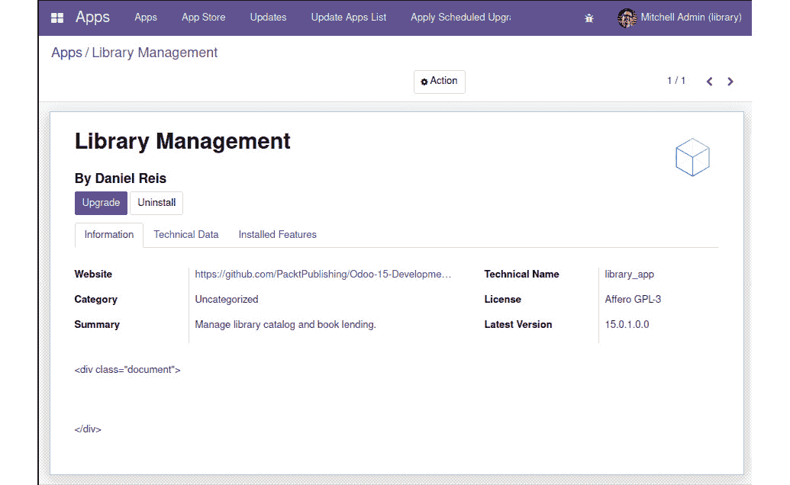
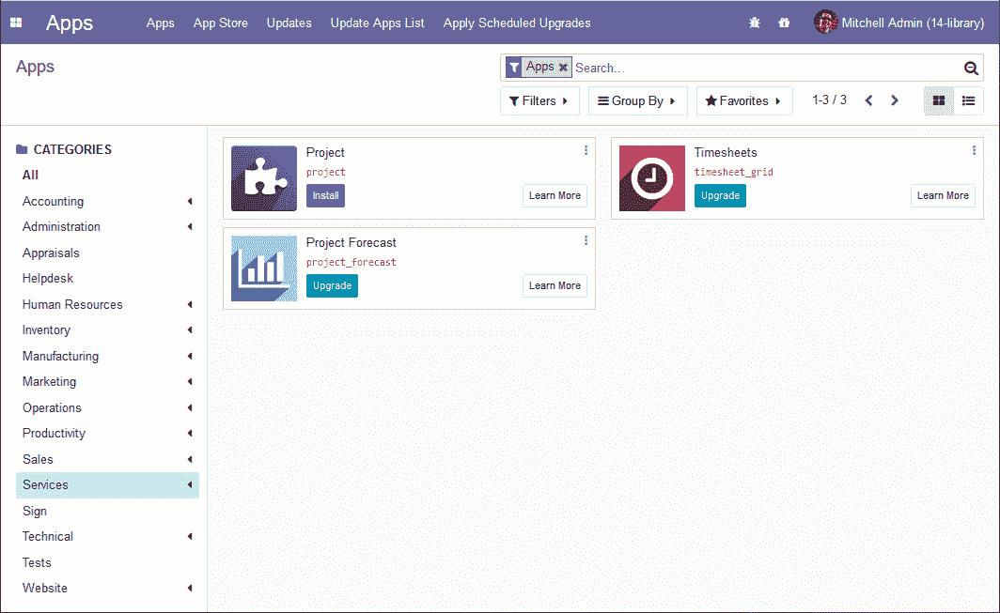
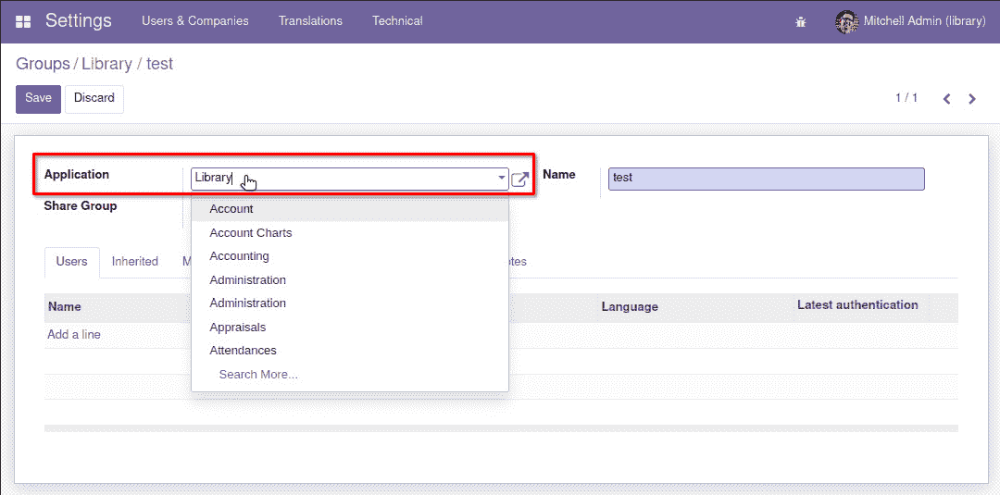
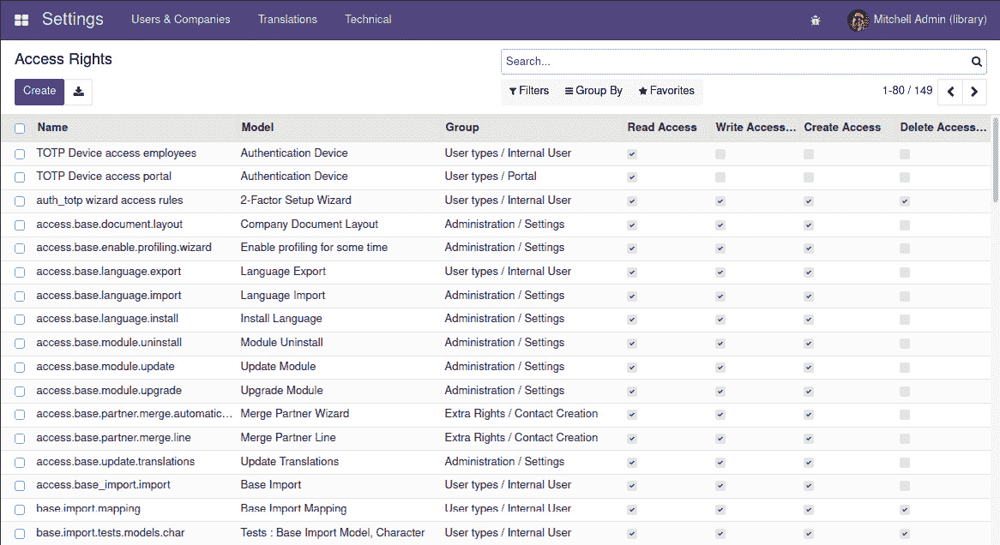
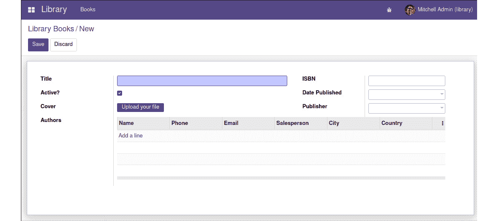
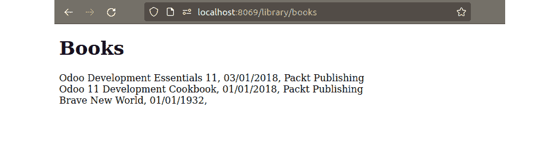

# 第一章：*第三章*：您的第一个 Odoo 应用程序

在 Odoo 中进行开发通常意味着创建我们自己的模块。在本章中，我们将创建我们的第一个 Odoo 应用程序，学习使其对 Odoo 可用所需的步骤，并安装它。

我们将通过学习开发工作流程的基础知识开始，我们将创建并安装一个新的模块，并在开发迭代过程中应用我们做出的更改。

Odoo 遵循类似于**模型-视图-控制器**（**MVC**）的架构，我们将遍历不同的层来实现一个库应用程序。

在本章中，我们将涵盖以下主题：

+   库项目的概述

+   第 1 步 – 创建新的`addon`模块

+   第 2 步 – 创建新应用程序

+   第 3 步 – 添加自动化测试

+   第 4 步 – 实现模型层

+   第 5 步 – 设置访问安全

+   第 6 步 – 实现后端视图层

+   第 7 步 – 实现业务逻辑层

+   第 8 步 – 实现网站**用户界面**（**UI**）

采用这种方法，您将能够逐步了解构成应用程序的基本构建块，并体验从头开始构建 Odoo 模块的迭代过程。

# 技术要求

本章要求您已安装 Odoo 服务器，并能够从命令行启动它以执行安装模块或运行测试等操作。如果您没有可用的 Odoo 开发环境，请确保您已审查*第二章*，*准备开发环境*。

在本章中，我们将从一张白纸开始创建我们的第一个 Odoo 应用程序，因此我们不需要任何额外的代码来开始。

本章的代码可以在本书的 GitHub 仓库中找到，网址为[`github.com/PacktPublishing/Odoo-15-Development-Essentials`](https://github.com/PacktPublishing/Odoo-15-Development-Essentials)，在`ch03`目录下。

# 库项目的概述

我们将使用学习项目来更好地探索本章中解释的主题，并看到它们在实际中的应用。我们将创建一个新的 Odoo 应用程序来管理图书库。我们将在这个项目中使用所有后续章节，其中每个章节都是一个迭代，向应用程序添加功能。在这里，我们将创建图书馆应用程序的第一个迭代。

我们将实现的第一项功能将是图书目录。目录使我们能够记录图书馆中的书籍及其相关细节。我们还希望通过一个公开网站提供这个目录，以便可以看到可用的书籍。

图书馆书籍应具有以下数据：

+   标题

+   作者

+   出版社

+   发布日期

+   封面图片

+   **国际标准书号**（**ISBN**），带有校验位验证

+   激活标志，指示应在网站上公开可用的书籍

对于 Odoo 基础应用来说，图书馆应用将有两个用户组，图书馆用户和图书馆管理员。预期用户级别能够执行所有日常操作，而管理员级别则预期能够额外编辑应用配置。

对于图书目录功能，我们将继续编辑图书记录作为管理员保留的功能。以下应适用：

+   图书馆管理员应该能够编辑书籍。

+   图书馆用户和通过网站使用的公共用户应该只能查看书籍。

这个简单的项目将使我们能够涵盖构建 Odoo 应用所涉及的所有主要组件。第一步是创建一个模块目录，该目录将托管我们应用的代码和组件。

# 第一步 – 创建新的插件模块

插件模块是一个包含实现某些 Odoo 功能的文件的目录。它可以添加新功能或修改现有功能。插件模块目录必须包含一个名为`__manifest__.py`的清单文件或描述文件。

一些模块插件被作为**应用**。应用是 Odoo 中功能区域的顶级模块，我们期望我们的模块在顶级**应用**菜单中有所体现。基础 Odoo 中的应用示例包括**CRM**、**项目**和**HR**。非应用**模块插件**预期将依赖于一个应用，向其添加或扩展功能。

如果新模块为 Odoo 添加了新的或主要的功能，它可能应该是一个应用。如果模块只是对现有应用进行了更改，它可能应该是一个常规的插件模块。

要开发新模块，我们将执行以下操作：

1.  确保我们将工作的目录位于 Odoo 服务器插件路径中。

1.  创建模块的目录，包含清单文件。

1.  如果我们打算分发模块，请选择模块的许可证。

1.  添加模块描述。

1.  可选地，添加一个图标以代表该模块。

在此之后，我们可以安装该模块以确认它对 Odoo 服务器可用并且安装正确。

## 准备插件路径

**插件模块**是一个包含 Odoo**清单文件**的目录，提供了诸如新应用或现有应用的附加功能等特性。**插件目录**包含多个插件模块。**插件路径**是 Odoo 配置的一部分，列出了 Odoo 服务器将查找可用插件的目录列表。

默认情况下，插件路径包括与 Odoo 捆绑的基础应用，位于`odoo/addons`目录中，以及提供核心功能的基础模块，位于`odoo/odoo/addons`目录中。插件路径通常修改为添加一个或多个我们想要使用的自定义开发和社区模块的目录。

图书馆项目将由几个模块组成。这样做是一个好习惯，因为它促进了更小、更专注的模块，有助于降低复杂性。我们将为项目的模块创建一个插件目录。

如果遵循了 *第二章*，*准备开发环境*，的说明，Odoo 服务器代码应在 `~/work15/odoo/`。自定义插件模块应保存在它们自己的目录中，与 Odoo 代码分开。

对于图书馆，我们将创建一个 `~/work15/library` 目录，并将其包含在插件路径中。我们可以通过直接编辑配置文件或使用 Odoo **命令行界面**（**CLI**）来完成此操作。以下是后者的操作方法：

```py
$ mkdir ~/work15/library
$ source ~/work15/env15/bin/activate
(env15) $ odoo \
--addons-path="~/work15/library,~/work15/odoo/addons" \
-d library -c ~/work15/library.conf --save --stop
```

目前，Odoo 命令将返回如下错误：`odoo: error: option --addons-path: no such directory: '/home/daniel/work15/library'`。这是因为该目录仍然是空的，Odoo 无法在其中找到任何插件模块。一旦创建了第一个图书馆应用程序模块的骨架，我们就不会遇到这个问题。

这里是对 Odoo 命令中使用的选项的解释：

+   `--addons-path` 选项用于设置用于 Odoo 模块的所有目录列表。

+   `--d` 或 `--database` 选项用于设置要使用的数据库名称。如果数据库不存在，它将被创建，并使用 Odoo 的基本数据库模式进行初始化。

+   `--c` 或 `--config` 选项用于设置要使用的配置文件。

+   与 `-c` 选项一起使用的 `--save` 选项将保存配置文件中使用的选项。

+   `--stop` 选项，即 `--stop-after-init`，在所有操作完成后停止 Odoo 服务器，并返回到命令行。

如果使用了相对路径作为插件路径选项，Odoo 将在将其存储到配置文件之前将它们转换为绝对路径。

Odoo 15 的变化

创建的配置文件将使用默认配置作为模板。在 Linux 系统中，默认配置文件是位于 `~/.odoorc` 的文件。

Odoo 的 `scaffold` 命令提供了一种快速创建新模块骨架的方法。我们可以用它来填充 `library` 插件目录，使其包含一个有效的模块。要构建 `library_app` 模块目录，请执行以下代码：

```py
(env15) $ odoo scaffold library_app ~/work15/library
```

`scaffold` 命令期望两个参数——模块目录名称和创建它的路径。有关 `scaffold` 命令的更多详细信息，请运行 `odoo scaffold --help`。

现在，我们可以重试命令以保存配置文件，包括 `~/work15/library/` 插件目录，并且它现在应该可以成功运行。

启动序列的第一条日志消息总结了正在使用的设置。它们包括一个标识正在使用的配置文件的 `INFO ? odoo: Using configuration file at...` 行和一个列出正在考虑的插件目录的 `INFO ? odoo: addons paths: [...]` 行。在调试 Odoo 为什么无法发现您的自定义模块时，这些都是首先要检查的事项。

## 创建模块目录

在上一节之后，我们现在应该有`~/work15/library`目录用于我们的 Odoo 模块，并且已经将其包含在 Odoo 插件路径中，以便 Odoo 服务器能够找到其中的模块。

在上一节中，我们也使用了 Odoo `scaffold`命令来自动创建新`library_app`模块目录的骨架结构，其中已经放置了基本结构。记住`scaffold`命令，它看起来像这样：`odoo scaffold <module> <addons-directory>`。创建的模块目录看起来像这样：

```py
library_app/
├── __init__.py
├── __manifest__.py
├── controllers
│   ├── __init__.py
│   └── controllers.py
├── demo
│   └── demo.xml
├── models
│   ├── __init__.py
│   └── models.py
├── security
│   └── ir.model.access.csv
└── views
    ├── templates.xml
    └── views.xml
```

模块目录名是其技术名称。在这种情况下，我们使用了`library_app`。技术名称必须是一个有效的 Python **标识符**（**ID**）——它应该以字母开头，并且只能包含字母、数字和下划线字符。

它包含几个子目录，用于模块的不同组件。这种子目录结构不是必需的，但它是一个广泛使用的约定。

一个有效的 Odoo `插件`模块目录必须包含一个`__manifest__.py`描述文件。它还需要是 Python 可导入的，因此它还必须有一个`__init__.py`文件。这两个文件是我们首先在目录树中看到的。

小贴士

在较旧的 Odoo 版本中，模块描述文件被命名为`__openerp__.py`。这个文件名仍然被支持，但已弃用。

描述文件包含一个 Python 字典，其中包含描述模块的属性。scaffold 自动生成的描述文件应该类似于以下内容：

```py
{
    'name': "library_app",
    'summary': """
        Short (1 phrase/line) summary of the module's 
        purpose, used as subtitle on modules listing or 
        apps.openerp.com""",
    'description': """
        Long description of module's purpose
    """,
    'author': "My Company",
    'website': "http://www.yourcompany.com",
    # Categories can be used to filter modules in modules 
    # listing
    # Check https://github.com/odoo/odoo/blob/15.0/
    #   odoo/addons/base/data/ir_module_category_data.xml
    # for the full list
    'category': 'Uncategorized',
    'version': '0.1',
    # any module necessary for this one to work correctly
    'depends': ['base'],
    # always loaded
    'data': [
        # 'security/ir.model.access.csv',
        'views/views.xml',
        'views/templates.xml',
    ],
    # only loaded in demonstration mode
    'demo': [
        'demo/demo.xml',
    ],
}
```

下一节将更详细地讨论描述文件。

`__init__.py`模块文件应该触发导入所有模块的 Python 文件。更具体地说，它应该导入模块顶层的 Python 文件，并导入也包含 Python 文件的子目录。同样，这些子目录中的每一个也应该包含一个`__init__.py`文件，导入该子目录中的 Python 资源。

这是`scaffold`命令生成的顶级`__init__.py`文件：

```py
from . import controllers
from . import models
```

在顶级没有 Python 文件，有两个包含 Python 文件的子目录，`controllers`和`models`。查看模块树，我们可以看到这两个目录包含 Python 文件和各自的`__init__.py`文件。

## 创建描述文件

`scaffold`命令准备了一个描述文件，可以用作指南，或者我们可以从一个空文件创建描述文件。

描述文件应该是一个有效的 Python 文件，包含一个字典。没有可能的字典键是必需的，因此空字典`{}`将是文件的有效内容。在实践中，我们至少想要提供一些关于模块的基本描述，声明作者身份，并选择一个分发许可。

以下是一个良好的起点：

```py
{
    "name": "Library Management",
    "summary": "Manage library catalog and book lending.",
    "author": "Daniel Reis",
    "license": "AGPL-3",
    "website": "https://github.com/PacktPublishing"
               "/Odoo-15-Development-Essentials",
    "version": "15.0.1.0.0",
    "depends": ["base"],
    "application": True,
}
```

这里使用的键提供了在应用表单主选项卡中展示的所有数据，如下面的截图所示：



图 3.1 – 图书馆管理模块应用表单

我们使用了以下键：

+   `name`: 模块的标题。

+   `summary`: 模块目的的一行总结。

+   `author`: 版权作者的姓名。它是一个字符串，但可以包含以逗号分隔的姓名列表。

+   `license`: 这标识了作者允许模块以何种许可进行分发。`AGPL-3` 和 `LGPL-3` 是流行的开源选择。通过 Odoo Apps Store 销售的专有模块通常使用 `OPL-1` Odoo 专有许可。许可将在本章后面更详细地讨论。

+   `website`: 获取有关模块更多信息的一个 **统一资源定位符** (**URL**)。这可以帮助人们找到更多文档或问题跟踪器来提交错误和建议。

+   `version`: 模块的版本。它应遵循语义版本控制规则（详情见 [`semver.org/`](http://semver.org/)）。使用 Odoo 版本在我们模块版本之前是一个好习惯，因为它有助于识别模块针对的 Odoo 版本。例如，为 Odoo 15.0 构建的 `1.0.0` 模块应携带版本 `15.0.1.0.0`。

+   `depends`: 依赖的插件模块列表。安装此模块将触发这些依赖项的安装。如果模块没有特定的依赖项，通常的做法是让它依赖于 `base` 模块，但这不是必需的。

+   `application`: 一个标志，声明模块是否应作为应用在应用列表中突出显示。大多数扩展模块，为现有应用程序添加功能，将此设置为 `False`。图书馆管理模块是一个新应用，所以我们使用了 `True`。

依赖项列表需要小心处理。我们应该确保在这里明确设置所有依赖项；否则，模块可能在干净的数据库安装中由于缺少依赖项而无法安装，或者在 Odoo 启动序列中，如果其他必需的模块偶然晚于我们的模块加载，可能会出现加载错误。这两种情况都可能发生在在其他机器上部署你的工作时，并且可能需要花费时间来识别和解决。

在 *图 3.1* 中看到的 `<div class="document">` 行是用于长模块描述的，现在为空。添加描述将在后面的 *添加描述* 部分讨论。

这些其他描述符键也可用，但使用较少：

+   `installable`: 指示此模块是否可用于安装。默认值是 `True`，所以我们不需要明确设置它。如果出于某种原因需要禁用它但仍然保留其文件在插件目录中，则可以将其设置为 `False`。

+   `auto_install`: 这可以设置为 `True`，并用于 **粘合** 模块。一旦所有依赖项安装完毕，就会触发粘合模块的安装。例如，这可以用于在两个应用程序都安装在同一实例中时自动提供连接两个应用程序的功能。

## 设置模块类别

模块被分组到类别中，代表它们相关的功能区域。这些类别用于分组插件模块，以及安全组。

如果插件没有设置类别，将分配**未分类**值。目前，这是图书馆应用的类别。

我们可以在 Odoo 的**应用**菜单中看到几个类别，在左侧面板上。在那里，我们可以看到可以用于我们的模块的类别，如下面的屏幕截图所示：



图 3.2 – 带有类别窗格的应用列表

类别可以有层次结构——例如，**项目**应用属于**服务/项目**类别。

如果在插件模块中使用了一个不存在的类别，Odoo 将自动创建它并使其可用。我们将利用这一点为图书馆应用创建一个新的类别：**服务/图书馆**。

修改`__manifest__.py`文件，以便添加一个`category`键：

```py
    "category": "Services/Library", 
```

类别对于组织安全组也很重要，并且要在**可扩展标记语言**（**XML**）数据文件中引用它们，我们需要使用相应的 XML ID。

分配给模块类别的 XML ID 是从`base.module_category_`前缀加上类别名称自动生成的。例如，对于`base.module_category_services_library`。

我们可以通过导航到相应的表单视图，然后在开发者菜单中使用**查看元数据**选项来确认应用类别的 XML ID。

没有应用类别的菜单项，但可以从安全**组**表单访问类别表单，如下所示：

1.  打开**设置** | **用户** | **组**菜单选项，创建一个新的测试记录。

1.  从**应用**字段下拉列表中选择一个选项，并保存。这个过程在下面的屏幕截图中展示：

    图 3.3 – 应用选择列表，在用户组表单中

1.  点击**应用**链接以打开所选类别的对应详情表单。

1.  在类别表单中，在开发者菜单中选择**查看元数据**选项，以查看分配给它的 XML ID。

1.  如果你不再需要测试组，你可以选择删除它。

或者，可以在 Odoo 源代码中找到内置类别列表及其 XML ID。GitHub URL 如下：[`github.com/odoo/odoo/blob/15.0/odoo/addons/base/data/ir_module_category_data.xml`](https://github.com/odoo/odoo/blob/15.0/odoo/addons/base/data/ir_module_category_data.xml).

## 选择许可证

为你的作品选择一个许可证非常重要，你应该仔细考虑哪个选项最适合你，以及它的含义。

软件代码受版权法保护，保留作者使用或修改作品的权利。这通常意味着你个人或你所在的公司。为了使其他方能够安全地使用作品，他们必须与代码作者签订许可协议。

如果你希望你的代码可以自由获取，它需要携带一个许可证，说明其他人可以对你的代码做什么。不同的许可证将规定不同的条款。

Odoo 模块最常用的许可证是 **GNU's Not Unix** （**GNU**） **Lesser General Public License** （**LGPL-3**） 和 **Affero General Public License** （**AGPL-3**）。两者都允许你自由分发和修改作品，只要作者得到认可，并且派生作品在相同的许可证条件下分发。

AGPL 是一种强大的开源许可证，要求使用该代码的在线服务必须将源代码与用户共享。这种许可证在社区中很受欢迎，因为它强制派生作品也必须在 AGPL 条件下分发。因此，开源代码不能被纳入封闭的商业解决方案中，原始作者可以从其他人的改进中受益。

LGPL 比 AGPL 更为宽松，也允许进行商业修改，无需共享相应的源代码。这种许可证通常用于网页和系统集成组件，其中解决方案可能包含在私人许可证下或与 AGPL 不兼容的条款下的组件。

你可以在这里了解更多关于 GNU 许可证的信息：[`www.gnu.org/licenses/`](https://www.gnu.org/licenses/)。

虽然你可以出售 GPL 许可证的软件，但由于该许可证允许人们自由复制和分发代码，这并不是一个流行的商业模式。因此，Odoo 应用商店中出售的许多模块更喜欢使用专有许可证。为此，Odoo 提出了 Odoo 专有许可证 `OPL-1`。

关于 Odoo 许可证的更多详细信息，请参阅 [`www.odoo.com/documentation/user/legal/licenses/licenses.html`](https://www.odoo.com/documentation/user/legal/licenses/licenses.html)。

## 添加描述

描述是一段长文本，用于介绍模块功能。描述文本支持 **reStructuredText** （**RST**） 格式，以生成丰富的文本文档。

你可以在这里了解更多关于 RST 的信息：[`docutils.sourceforge.io/rst.html`](https://docutils.sourceforge.io/rst.html)。页面包括一个值得书签的快速参考链接：[`docutils.sourceforge.io/docs/user/rst/quickstart.html`](https://docutils.sourceforge.io/docs/user/rst/quickstart.html)。

这里是一个 RST 文档的简短示例：

```py
Title
=====
Subtitle
--------
This is *emphasis*, rendered in italics.
This is **strong emphasis**, rendered in bold.
This is a bullet list:
- Item one.
- Item two.
```

添加描述的一种方法是在模块清单中使用 `description` 键。由于描述文本很可能会跨越多行，最好使用三引号 `"""`，这是 Python 中的多行字符串语法。

在 GitHub 等网站上发布的源代码应包含一个 README 文件，以便访客可以轻松找到模块的介绍。因此，而不是使用`description`清单密钥，Odoo 模块可以有一个`README.rst`或`README.md`文件用于相同的目的。此文件应放置在模块目录的根目录中，与`__manifest__.py`文件并列。

另一个选择是提供一个位于`static/description/`模块子目录中的`index.html` HTML 文件。页面资源，如图像和**层叠样式表**（**CSS**），也应位于同一目录。

注意

对于将`application`密钥设置为`True`的模块，仅使用`index.html`描述，并忽略描述密钥。

## 添加图标

模块可以可选地有一个代表它们的图标。在创建新应用的情况下，这一点尤为重要，因为应用预期将在**应用**菜单中有一个图标。

要添加图标，我们需要在模块中添加一个`static/description/icon.png`文件，其中包含要使用的图标。

对于图书馆应用项目，我们将重用`library_app/static/description`目录中的一个图标。

从命令行，我们会运行以下命令：

```py
$ cd ~/work15/library/library_app
$ mkdir -p ./static/description
$ cp ~/work15/odoo/addons/note/static/description/\
icon.png ./static/description/
```

## 安装新模块

我们现在有一个最小的`addon`模块。它还没有实现任何功能，但我们可以安装它以确认它到目前为止运行正常。

要安装一个新的模块，我们应该使用 `-d` 和 `-i` 选项启动服务器。`-d` 或 `--database` 选项确保我们正在使用正确的 Odoo 数据库。`-i` 或 `--init` 选项接受一个由逗号分隔的模块列表，用于安装。

Odoo 11 中的变化

当安装新模块时，Odoo 会自动从当前配置的插件路径中更新可用模块的列表。在 Odoo 10 之前并非如此，那时在安装新的插件模块之前需要手动更新模块列表。模块列表在 Web 客户端中更新，从**应用**列表中的菜单选项。

对于本章中较早准备好的 Odoo 环境，并且已经激活了 Python 虚拟环境，以下命令安装了`library_app`模块：

```py
(env15)$ odoo -c ~/work15/library.conf -d library -i \
library_app
```

我们添加了 `-d` 库选项以确保为安装选择正确的数据库。可能的情况是，此选项已在配置文件中定义，因此是多余的。即使如此，最好还是谨慎行事，并在命令中明确声明要安装的数据库。

小贴士

仔细关注服务器日志消息以确认模块已被正确找到并安装。你应该看到一个`odoo.addons.base.models.ir_module: ALLOW access to module.button_install`消息，没有警告。

为了使模块安装成为可能，模块所在的 `addons` 目录应该为 Odoo 服务器所知。这可以通过停止和启动 Odoo 服务器，查看 Odoo 启动序列期间打印的 `odoo: addons paths:` 日志消息来确认。

如果找不到模块，通常是因为插件路径不正确。通过仔细检查正在使用的插件路径来双重确认这一点。

## 升级模块

开发模块是一个迭代过程，对源文件所做的更改然后将应用于 Odoo。

这可以通过 **图形用户界面**（**GUI**）完成，通过在 **应用** 列表中查找模块并点击 **升级** 按钮来实现。这将重新加载数据文件，应用所做的更改，并更新数据库模式定义。然而，当更改仅限于 Python 逻辑时，升级可能不足以完成。可能需要重启 Odoo 服务器以重新加载更改后的 Python 代码。当模块更改涉及数据文件和 Python 逻辑时，可能需要执行这两个操作。

总结来说，以下适用：

+   当修改模型或其字段时，需要升级以应用数据库模式更改。

+   当更改 Python 代码的逻辑时，需要重启以重新加载代码文件。

+   当更改 XML 或 **逗号分隔值**（**CSV**）文件时，需要升级以重新应用文件中的数据。

为了避免将代码更改应用于 Odoo 相关的任何混淆或挫败感，最简单的解决方案是在代码更改完成后，使用模块 `upgrade` 命令重启 Odoo 服务。

在运行服务器实例的终端中，使用 *Ctrl* + *C* 停止它。然后，启动服务器并使用以下命令升级 `library_app` 模块：

```py
(env15)$ odoo -c ~/work15/library.conf -d library \
-u library_app
```

`-u` 选项，长格式中的 `--update`，需要 `-d` 选项，并接受一个以逗号分隔的模块更新列表。例如，我们可以使用 `-u library_app,mail`。当一个模块被更新时，所有依赖它的已安装模块也会被更新。

按下上箭头键将显示之前使用的命令。所以，大多数时候，当你重复此操作时，你会发现自己使用 *Ctrl* + *C*、上箭头和 *Enter* 键的组合。

在最近的 Odoo 版本中，提供了 `--dev=all` 开发者友好模式，自动化了这个工作流程。当使用此选项时，数据文件更改将立即对正在运行的 Odoo 服务可用，Python 代码更改将触发 Odoo 代码重新加载。有关此选项的更多详细信息，请参阅 *第二章* 的 *使用服务器开发选项* 部分，*准备开发环境*。

我们现在有一个模块目录，准备托管实现应用的组件。由于这是一个应用，而不是添加功能的纯技术模块，我们将首先添加一些应用预期的基本组件。

# 第 2 步 – 创建新应用

一些 Odoo 模块创建新的应用，而另一些则添加功能或修改现有应用。虽然涉及的技术组件大致相同，但一个应用应包括一些特征元素。由于图书馆模块是一个新应用，我们应该在我们的模块中包含它们。

一个应用应该具备以下功能：

+   一个图标，用于在应用列表中展示

+   一个顶级菜单项，所有应用菜单项都将放置于此之下

+   为应用设置安全组，以便它只能对需要它的用户启用，并且在此处设置访问安全。

应用图标是模块的`static/description/`子目录中的一个`icon.png`文件。这已经在*添加图标*部分中完成。

接下来，我们将处理应用的高级菜单。

## 添加顶级菜单项

由于我们正在创建一个新应用，它应该有一个主菜单项。在**社区版**（**Community Edition** **(CE)**）中，这显示为右上角下拉菜单中的一个新条目。在**企业版**（**Enterprise Edition** **(EE)**）中，它显示为**应用切换器**主菜单中的一个附加图标。

菜单项是通过 XML 数据文件添加的视图组件。要定义一个菜单项，创建一个`views/library_menu.xml`文件，内容如下：

```py
<odoo> 
  <!-- Library App Menu -->
  <menuitem id="menu_library" name="Library" /> 
</odoo> 
```

UI，包括菜单选项和操作，是数据库存储的记录，由 Web 客户端实时读取和解释。

所述文件描述了要加载到 Odoo 数据库中的记录。《<menuitem>`元素是在`ir.ui.menu`模型上写入记录的指令，其中 Odoo 菜单项被存储。

`id`属性也称为`menu_library` XML ID。

这里添加的菜单项非常简单，只使用了一个属性：`name`。还有其他可用的属性我们没有在这里使用。我们将在本章的*实现后端视图层*部分中了解更多关于它们的信息。

图书馆模块尚不了解这个新的 XML 数据文件。为了使其被识别并加载到 Odoo 实例中，需要在清单文件的`data`属性中声明。编辑`__manifest__.py`文件字典以添加此键，如下所示：

```py
    "data": [
        "views/library_menu.xml",
    ],
```

`data`清单键是模块在安装或升级时需要加载的数据文件的列表。文件路径相对于清单文件所在的模块根目录。

要将这些菜单配置加载到我们的 Odoo 数据库中，我们需要升级模块。在此阶段这样做不会产生任何可见效果。此菜单项还没有可操作的子菜单，因此不会显示。一旦我们添加子菜单和相应的访问权限，它将变得可见。

小贴士

菜单树中的项目只有在存在可见的子菜单项时才会显示。打开视图的较低级菜单项只有在用户有权访问相应的模型时才会可见。

## 添加安全组

在常规用户可以使用功能之前，必须授予他们访问权限。在 Odoo 中，这是通过使用安全**组**来完成的。访问权限授予给安全组，用户被分配到安全组。

Odoo 应用通常提供两个组，用于两个级别的访问，如下所示：

+   用户访问级别，用于执行日常操作的用户

+   管理员访问级别，具有对所有功能（包括配置）的完全访问权限

图书馆应用将具有这两个安全组。我们将在下一部分进行工作。

与安全相关的文件通常保存在一个`security/`模块子目录中，因此我们应该为这些定义创建一个`security/library_security.xml`文件。

安全组按照用于附加模块的相同类别组织。要将一个类别分配给安全组，我们应该找到相应的 XML ID。关于如何找到这个 XML ID，在本章的*设置模块类别*部分已经讨论过。在那里，我们可以了解到`base.module_category_services_library`的 XML ID。

接下来，我们将添加图书馆用户安全组。它属于`module_library_category`，并且将继承内部用户安全权限，在此基础上构建。如果我们打开该组的表单并使用开发者菜单`base.group_user`。

现在，向`security/library_security.xml`文件添加以下 XML：

```py
<odoo>
  <data>
    <!-- Library User Group -->
    <record id="library_group_user" model="res.groups">
      <field name="name">User</field>
      <field name="category_id" 
             ref="base.module_category_services_library "/>
      <field name="implied_ids" 
             eval="[(4, ref('base.group_user'))]"/>
    </record>
  </data>
</odoo>
```

我们在这里有很多事情要做，所以让我们慢慢地逐一查看这里的每个元素。这个 XML 正在向`res.groups`模型添加一条记录。这条记录有三个字段的值，如下所示：

+   `name`是组标题。这是一个简单的字符串值。

+   `category_id`是相关的应用程序。它是一个关系字段，因此使用`ref`属性将其链接到之前创建的类别，使用其 XML ID。

+   `implied_ids`是一个一对多关系字段，包含将也适用于属于此组的用户的组列表。多对多字段使用在*第五章*中详细说明的特殊语法，*导入、导出和模块数据*。在这种情况下，我们使用代码`4`来添加对现有内部用户 XML ID，`base.group_user`的链接。

    Odoo 12 中的变化

    **用户**表单有一个**用户类型**部分，仅在开发者模式启用时可见。它允许我们在互斥选项之间进行选择——**内部用户**、**门户**（外部用户，如客户）和**公共**（网站匿名访客）。这是为了避免在之前的 Odoo 版本中发现的配置错误，其中内部用户可能会意外地包含在**门户**或**公共**组中，从而实际上减少了他们的访问权限。

接下来，我们将创建一个管理组。它应该给我们用户组的所有权限，以及一些保留给管理员的额外访问权限。因此，我们希望它从`library_group_user`库用户继承。

编辑`security/library_security.xml`文件，在`<odoo>`元素内添加以下 XML：

```py
    <!-- Library Manager Group -->
    <record id="library_group_manager" model="res.groups">
      <field name="name">Manager</field>
      <field name="category_id" 
             ref="base.module_category_services_library "/>
      <field name="implied_ids" 
             eval="[(4, ref('library_group_user'))]"/>
      <field name="users" 
             eval="[(4, ref('base.user_root')),
                    (4, ref('base.user_admin'))]"/>
    </record>
```

这里，我们同样看到了`name`、`category_id`和`implied_ids`字段，就像之前一样。`implied_ids`字段被设置为与**图书馆**用户组的链接，以继承其权限。

这也在`users`字段上设置了值。这个组被分配给了管理员（`admin`）和 Odoobot 用户。

Odoo 12 的变化

自 Odoo 12 以来，我们有一个系统根用户，它不会显示在用户列表中，并在需要权限提升时（`sudo`）由框架内部使用。`admin` 用户可以用来登录服务器，并且应该能够访问所有功能，但与系统根用户一样，它绕过了访问安全。在 Odoo 11 版本之前，`admin` 用户也是内部根超级用户。

我们还需要在清单文件中添加这个额外的 XML 数据文件：

```py
    "data": [
        "security/library_security.xml",
        "views/library_menu.xml",
    ], 
```

注意，`library_security.xml`文件是在`library_menu.xml`之前添加的。由于引用只能使用已定义的 ID，所以加载数据文件的顺序很重要。通常，菜单项会引用安全组，因此，在菜单和视图定义之前添加安全定义是一种良好的实践。

下一步是添加定义应用模型的 Python 代码。但在那之前，我们将添加一些测试用例，遵循**测试驱动开发**（**TDD**）的方法。

# 第 3 步 – 添加自动化测试

编程最佳实践包括为你的代码编写自动化测试。这对于像 Python 这样的动态语言来说尤为重要——由于没有编译步骤，你无法确定在解释器运行代码之前是否存在语法错误。一个好的编辑器可以帮助我们提前检测到一些这些问题，但它不能像自动化测试那样帮助我们确保代码按预期执行。

TDD 方法指出，我们应该先编写测试，检查它们是否失败，然后开发代码，最终应该通过这些测试。受这种方法的启发，我们现在将在添加实际功能之前添加我们的模块测试。

Odoo 支持基于 Python 内置的`unittest`库的自动化测试。在这里，我们将简要介绍自动化测试，更详细的解释可以在*第八章*中找到，*业务逻辑 – 支持业务流程*。

Odoo 12 的变化

直到 Odoo 11，测试也可以使用**YAML Ain't Markup Language**（**YAML**）数据文件来描述。在 Odoo 12 中，YAML 数据文件支持被移除，因此这种测试方式不再可用。

测试需要满足一些要求，以便测试运行器能够找到并执行它们，如下所述：

1.  测试被放置在`tests/`子目录中。与常规模块 Python 代码不同，这个目录不需要被导入到顶级`__init__.py`文件中。测试运行引擎将在模块中查找这些测试目录，然后运行它们。

1.  测试代码文件应该以 `test_` 开头，并从 `tests/__init__.py` 中导入。测试代码将位于从 `odoo.tests.common` 导入的 Odoo 框架中可用的几个测试对象之一派生的类中。最常用的测试类是 `TransactionCase`。测试对象使用 `setUp()` 方法来初始化测试用例所需的数据。

1.  每个测试用例都是一个以 `test_` 开头名称的方法。对于 `TrasactionCase` 测试对象，每个测试都是一个独立的交易，在开始前运行设置步骤，并在结束时回滚。因此，下一个步骤将看不到前一个测试所做的更改。

    小贴士

    测试可以使用演示数据来简化设置阶段，但这不是一种好做法，因为在这种情况下，测试用例只能在安装了演示数据的数据库中运行。如果所有测试数据都在测试设置中准备，那么测试可以在任何数据库中运行，包括空数据库或生产数据库的副本。

我们计划我们的应用程序有一个 `library.book` 模型。让我们添加一个简单的测试来确认新书是否正确创建。

## 添加测试用例

我们将添加一个简单的测试来检查书籍的创建。为此，我们需要添加一些设置数据并添加一个测试用例。测试用例将仅确认 `active` 字段具有预期的默认值，即 `True`。

要完成这个任务，请按照以下步骤操作：

1.  添加一个包含以下代码的 `tests/__init__.py` 文件：

    ```py
    from . import test_book
    ```

1.  然后，添加实际的测试代码，可在 `tests/test_book.py` 文件中找到，如下所示：

    ```py
    from odoo.tests.common import TransactionCase 
    class TestBook(TransactionCase): 
        def setUp(self, *args, **kwargs):
            super().setUp(*args, **kwargs)
            self.Book = self.env["library.book"]
            self.book1 = self.Book.create({
                "name": "Odoo Development Essentials",
                "isbn": "879-1-78439-279-6"})
        def test_book_create(self): 
            "New Books are active by default" 
            self.assertEqual(
                self.book1.active, True
            )
    ```

    `setUp()` 函数获取 `Book` 模型对象的指针，并使用它来创建一本新书。

`test_book_create` 测试用例添加了一个简单的测试用例，检查创建的书籍 `active` 字段是否具有预期的默认值。在测试用例中而不是在设置方法中创建书籍是有意义的。我们选择不这样做的原因是我们还想使用这本书进行其他测试用例，而在设置中创建它避免了代码的重复。

## 运行测试

在安装或升级模块时，通过使用 `--test-enable` 选项启动服务器来运行测试，如下所示：

```py
(env15) $ odoo -c ~/work15/library.conf -u library_app \
--test-enable
```

Odoo 服务器将在升级的模块中查找 `tests/` 子目录，并运行它们。在这个阶段，预期测试将抛出错误，因此你应该在服务器日志中看到与测试相关的 `ERROR` 消息。这将在我们向模块添加书籍模型后改变。

现在，我们应该添加对业务逻辑的测试。理想情况下，我们希望每一行代码至少有一个测试用例覆盖。

## 测试业务逻辑

我们计划对有效的 ISBN 进行逻辑检查。因此，我们将添加一个测试用例来检查该方法是否正确验证了第一版 *Odoo 开发基础* 书籍的 ISBN。检查将通过一个 `_check_isbn()` 方法实现，返回 `True` 或 `False`。

在 `tests/test_book.py` 中，在 `test_create()` 方法之后添加几行代码，如下所示：

```py
    def test_check_isbn(self): 
        "Check valid ISBN" 
        self.assertTrue(self.book1._check_isbn) 
```

建议为每个要检查的操作编写不同的测试用例。记住，当使用`TransactionCase`测试时，每个测试都将独立于其他测试运行，并且在一个测试用例中创建或更改的数据将在测试结束时回滚。

注意，如果我们现在运行测试，它们应该失败，因为测试的功能尚未实现。

## 测试访问安全性

也可以检查访问安全性，以确认用户是否被授予正确的权限。

默认情况下，测试使用 Odoo 内部用户`__system__`执行，它绕过了访问安全性。因此，我们需要更改运行测试的用户，以检查是否已为他们提供了正确的访问安全性。这是通过修改执行环境`self.env`，将`user`属性设置为我们要用其运行测试的用户来完成的。

我们可以修改我们的测试以考虑这一点。编辑`tests/test_book.py`文件以添加一个`setUp`方法，如下所示：

```py
def setUp(self, *args, **kwargs):
    super().setUp(*args, **kwargs)
    user_admin = self.env.ref("base.user_admin")
    self.env = self.env(user=user_admin)
    self.Book = self.env["library.book"]
    self.book_ode = self.Book.create({
        "name": "Odoo Development Essentials",
        "isbn": "879-1-78439-279-6"})
```

我们在`setUp`方法中添加了两行。第一行使用其 XML ID 查找`admin`用户记录，第二行修改了用于运行测试的环境`self.env`，将活动用户更改为`admin`用户。

对于我们已编写的测试，不需要进一步更改。它们将以相同的方式运行，但现在使用`admin`用户，因为环境已修改。

图书馆应用程序现在有几个基本测试，但它们失败了。接下来，我们应该添加实现功能的代码，以便测试通过。

# 第 4 步 - 实现模型层

模型描述和存储业务对象数据，例如**客户关系管理**（**CRM**）机会、销售订单或合作伙伴（客户、供应商等）。**模型**描述了一个**字段**列表，也可以附加特定的业务逻辑。

模型数据结构和附加的业务逻辑使用从 Odoo 模板类派生的对象类用 Python 代码描述。一个模型映射到一个数据库表，Odoo 框架负责所有数据库交互，包括保持数据库结构与对象同步，以及将所有事务转换为数据库指令。负责这一功能的框架组件是**对象关系映射**（**ORM**）组件。

我们的应用程序将用于管理图书馆，我们需要一个用于图书目录的模型。

## 创建数据模型

遵循 Odoo 开发指南，模型对应的 Python 文件应放置在`models`子目录中，并且每个模型应该有一个文件。因此，我们将在`library_app`模块中创建一个`models/library_book.py`文件。

小贴士

Odoo 官方编码指南可以在[`www.odoo.com/documentation/15.0/reference/guidelines.html`](http://www.odoo.com/documentation/15.0/reference/guidelines.html)找到。另一个相关的编码标准文档是**Odoo 社区协会**（**OCA**）的编码指南，可以在 https://odoo-community.org/page/contributing 找到。

第一件事是确保我们的模块使用`models/`目录。这意味着当 Odoo 加载模块时，Python 应该导入它。为此，编辑模块的主要`__init__.py`文件，使其包含以下行：

```py
from . import models
```

类似地，`models/`子目录应该包含一个`__init__.py`文件，用于导入要使用的代码文件。添加一个包含以下代码的`models/__init__.py`文件：

```py
from . import library_book
```

接下来，我们可以创建一个包含以下内容的`models/library_book.py`文件：

```py
from odoo import fields, models
class Book(models.Model):
    _name = "library.book"
    _description = "Book"
    name = fields.Char("Title", required=True)
    isbn = fields.Char("ISBN")
    active = fields.Boolean("Active?", default=True)
    date_published = fields.Date()
    image = fields.Binary("Cover")
    publisher_id = fields.Many2one("res.partner", 
      string="Publisher")
    author_ids = fields.Many2many("res.partner", 
      string="Authors")
```

第一行是 Python 代码`import`语句，用于使`models`和`fields` Odoo 核心对象可用。

第二行声明了新的`library.book`模型。这是一个从`models.Model`派生的 Python 类。

下面的行是缩进的。Python 代码块由缩进级别定义，这意味着这些下一行是`Book`类定义的一部分。类名使用驼峰式命名法，这是 Python 的常用约定。实际使用的 Python 类名对 Odoo 框架来说并不重要。与 Odoo 相关的模型 ID 是下一行中声明的`_name`属性。

接下来的两行以下划线开头，并声明了一些 Odoo 类属性。`_name`属性定义了模型名称，使用点（`.`）来分隔它们的键词。

提示

模型 ID 使用点分隔的单词。其余所有内容使用下划线（`_`），例如插件模块名称、XML ID、表名称等。

然后，我们有`_description`模型属性。这是模型记录的显示名称，可以在某些用户消息中用来引用记录。这不是强制性的，但如果缺失，服务器日志中会显示警告信息。

最后七行声明了模型字段。我们可以看到最常用字段类型的示例。对于标量值，我们可以看到使用了`Char`、`Boolean`、`Date`和`Binary`字段类型。对于关系字段，我们可以看到`Many2one`和`Many2many`。

`name`字段用于数据记录标题——在这种情况下，是书名。

`active`字段用于活动记录。默认情况下，只显示活动记录，非活动记录会自动隐藏。这在主数据模型中很有用，可以隐藏不再使用但出于历史原因需要保留在数据库中的记录。

提示

`name`和`active`是特殊的字段名称。默认情况下，Odoo 框架会对它们进行特殊处理。`name`字段默认用于记录显示名称，即当从其他模型引用记录时显示的文本。`active`字段用于从 UI 中过滤掉非活动记录。

`publisher_id`是本例中的`res.partner`合作伙伴模型。它用于引用出版公司。对于多对一字段名称的约定是以`_id`结尾。

`author_ids`是`res.partner`合作伙伴模型。在数据库级别，这些数据实际上并没有存储在表字段中，而是在一个辅助表中存储，该表是自动创建的，用于存储两个表中的记录之间的关系。对于多对多字段名称的约定是以`_ids`结尾。

这两种关系都是书和合作伙伴模型之间的关系。合作伙伴模型内置在 Odoo 框架中，是存储人员、公司和地址的地方。我们正在使用它来存储我们的出版商和作者。

现在，我们通过升级图书馆应用程序模块在 Odoo 中使这些更改生效。同样，这是我们可以运行的命令来更新`library`数据库上的`library_app`模块：

```py
(env15)$ odoo -c ~/work15/library.conf -d library \
-u library_app
```

目前还没有菜单项可以访问书籍模型。这些将在本章后面添加。尽管如此，为了检查新创建的模型并确认它已在数据库中正确创建，我们可以使用`library.book`模型并点击它以查看其定义，如图下截图所示：

![图 3.4 – 技术菜单中的 library.book 模型视图

![img/Figure_3.4_B16119_B16119.jpg]

图 3.4 – 技术菜单中的 library.book 模型视图

我们应该能够看到列出的模型，并确认它包含我们在 Python 文件中定义的字段。如果您看不到这些，请尝试再次重启服务器并升级模块，并密切注意服务器日志，寻找加载图书馆应用程序的消息以及任何报告 Odoo 数据库问题的警告。

在`library.book`字段列表中，我们可以看到一些我们没有声明的额外字段。这些是 Odoo 自动添加到每个模型中的特殊字段。如下所示：

+   `id`是每个记录的唯一数字数据库 ID。

+   `create_date`和`create_uid`是记录创建的时间戳和创建记录的用户。

+   `display_name`为记录提供文本表示——例如，当它在其他记录中引用时。它是一个计算字段，默认情况下，如果可用，仅使用`name`字段中的文本。

+   `write_date`和`write_uid`是记录的最后修改时间戳和执行该更新的用户。

+   `__last_update`是一个不存储在数据库中的计算字段，用于并发检查。

书籍模型现在已在数据库中创建，但尚未对用户可用。我们需要一个菜单项来实现这一点，但这还不够。为了使菜单项可见，用户首先需要被授予对新模型的访问权限。

# 第 5 步 – 设置访问安全

`library.book`模型已在数据库中创建，但您可能已经注意到，当它被加载时，它会将此警告消息打印到服务器日志：

```py
 The model library.book has no access rules, consider adding one. 
```

消息非常明确——新的模型没有访问规则，因此目前任何人还不能使用它。之前，我们为这个应用程序创建了安全组，我们现在需要给他们提供对应用程序模型的访问权限。

Odoo 12 中的更改

`admin`用户遵循访问安全规则，就像任何其他用户一样，除了类似 root 的内部超级用户。在它可以使用之前，我们需要授予它对新模型的访问权限。在 Odoo 11 之前，这种情况并不存在。在这些早期的 Odoo 版本中，`admin`用户也是内部超级用户，并绕过了访问安全规则。这意味着新创建的模型自动对其可用并可使用。

## 添加访问控制安全

要了解添加访问规则到模型所需的信息，在 Web 客户端，导航到**设置** | **技术** | **安全** | **访问权限**，如图下所示：

![图 3.5 – 技术菜单中的访问权限列表]



图 3.5 – 技术菜单中的访问权限列表

这些访问权限也被称为**访问控制列表**或**ACL**。在之前的屏幕截图中，我们可以看到一些模型的 ACL。它表示对于安全组，在记录上允许执行哪些类型的操作：读取、写入、创建和删除。

Odoo 14 中的更改

临时模型，用于交互式向导，现在也需要为用户组提供访问权限。在之前的 Odoo 版本中，情况并非如此，用户默认可以访问这些模型。建议授予读取、写入和创建权限，不授予删除/解除链接权限（CSV 文件上的`1,1,1,0`）。

对于图书馆应用程序，我们将授予图书馆用户读取、写入和创建书籍记录的访问权限，并授予图书馆管理员完全访问权限，包括删除记录。

这些数据可以由模块数据文件提供，将记录加载到`ir.model.access`模型中。CSV 数据文件的名称必须与我们加载数据的模型 ID 匹配。

因此，我们应该添加`security/ir.model.access.csv`文件，内容如下：

```py
id,name,model_id:id,group_id:id,perm_read,perm_write,perm_create,perm_unlink
access_book_user,BookUser,model_library_book,library_group_user,1,1,1,0
access_book_manager,BookManager,model_library_book,library_group_manager,1,1,1,1
```

文件的第一行包含字段名。这些是我们 CSV 文件中提供的列：

+   `id`是记录的外部 ID（也称为 XML ID）。在我们的模块中应该是唯一的。

+   `name`是一个描述性标题。它具有信息性，并且建议它是唯一的。

+   `model_id`是我们赋予访问权限的模型的 XML ID。模型由 ORM 自动生成 XML ID；对于`library.book`，ID 是`model_library_book`。

+   `group_id`标识要赋予权限的安全组。我们授予了在之前创建的安全组：`library_group_user`和`library_group_manager`的访问权限。

+   `perm_...`字段授予对`read`、`write`、`create`或`unlink`（删除）操作的访问权限。我们使用`1`表示`yes`/`true`，使用`0`表示`no`/`false`。

我们不要忘记在`__manifest__.py`文件中的`data`键中引用这个新文件。它应该看起来像这样：

```py
    "data": [
        "security/library_security.xml",
        "security/ir.model.access.csv",
        "views/library_menu.xml",
    ],
```

如前所述，升级模块以使这些更改在 Odoo 数据库中生效。警告信息应该已经消失。

到目前为止，书籍模型是可用的，并且应该对 `admin` 用户可访问。因此，我们的第一个测试应该通过。现在让我们运行它，如下所示：

```py
(env15) $ odoo -c ~/work15/library.conf -u library_app --test-enable
```

我们应该看到一个测试通过，一个测试失败。

ACL **访问权限** 选项在模型级别授予权限，但 Odoo 还支持行级访问安全，通过 **记录规则**。此功能将在下一节中解释。

## 行级访问规则

记录规则定义了限制安全组可以访问的记录的过滤器。例如，销售人员可能只能看到他们自己的报价，或者会计用户可能只能看到他们被授予访问权限的公司会计分录。

为了展示这个功能，我们将限制图书馆用户不能查看非活动书籍。默认情况下，这些书籍是隐藏的，但如果我们使用 `active` 等于 `True` 的条件过滤记录，它们仍然可以访问。

`ir.rule` 模型。

需要在此概述的记录规则定义字段：

+   `name`：一个独特的标题，最好是唯一的。

+   `model_id`：规则应用的模型的引用。

+   `groups`：规则应用的权限组的引用。此字段是可选的，如果没有设置，则被视为全局规则（`global` 字段自动设置为 `True`）。全局规则的行为不同——它们施加的限制是非全局规则无法覆盖的。它使用特定的语法来写入多对多字段。

+   `domain_force`：用于访问限制的域过滤器，使用 Odoo 中用于过滤表达式的元组列表语法。

要向图书馆应用添加记录规则，编辑 `security/library_security.xml` 文件，在 `</odoo>` 最终标签之前添加第二个 `<data>` 部分，如下所示：

```py
  <data noupdate="1">
    <record id="book_user_rule" model="ir.rule">
      <field name="name">Library Book User Access</field>
      <field name="model_id" ref="model_library_book"/>
      <field name="domain_force">
        [('active', '=', True)]
      </field>
      <field name="groups" eval="[(4, 
        ref('library_group_user'))]"/>
    </record>
  </data>
```

记录规则位于 `<data noupdate="1">` 元素内，这意味着这些记录将在模块安装时创建，但在模块更新时不会被重写。目的是允许稍后对这些规则进行自定义，而不会存在自定义更改因模块升级而风险增加。

小贴士

在开发过程中，`noupdate="1"` 数据部分可能会造成不便，因为后续的修复和更改在模块升级时不会更新。有两种方法可以解决这个问题。一种是在开发期间暂时使用 `noupdate="0"`，完成开发后将其更改为最终的 `noupdate="1"`。第二种方法是在不升级的情况下重新安装模块。这在命令行中是可能的，使用 `-i` 而不是 `-u` 在已安装的模块上。

`groups`字段是多对多关系，并使用用于多对多字段的特殊语法。它是一个元组列表，其中每个元组是一个命令。在这种情况下，使用了`(4, x)`命令，代码`4`表示下一个引用的记录要追加到值中。引用的记录是`library_group_user`，图书馆用户组。多对多字段的写法在*第六章*中更详细地讨论，*模型 – 结构化应用程序数据*。

域表达式也使用特殊的语法，包含一个三元组列表，每个三元组指定一个过滤条件。域过滤语法在*第七章*中解释，*记录集 — 与模型数据交互*。

现在用户可以访问书籍模型，我们可以继续添加 UI，从菜单项开始。

# 第 6 步 – 实现后端视图层

视图层描述了 UI。视图使用 XML 定义，该 XML 由 Web 客户端框架用于动态生成数据感知的 HTML 视图。

**菜单项**可以执行**窗口动作**以渲染**视图**。例如，**用户**菜单项处理一个名为**用户**的窗口动作，进而渲染一个**视图**组合，包括**列表**和**表单**。

可用几种视图类型。最常用的三种视图是**列表**（有时由于历史原因称为**树**），**表单**和位于右上角搜索框中的**搜索**选项。

在接下来的几节中，我们将逐步改进，并需要频繁地升级模块以使它们可用，或者我们可以使用`--dev=all`服务器选项，这使我们免于在开发时进行模块升级。使用它，视图定义直接从 XML 文件中读取，所做的更改立即对 Odoo 可用，无需进行模块升级。在*第二章*中，*准备开发环境*，提供了关于`--dev`服务器选项的更多详细信息。

小贴士

如果模块升级因 XML 错误而失败，不要慌张！仔细阅读服务器日志中的错误消息。它应该指向问题所在之处。如果你感到困惑，只需注释掉最后编辑的 XML 部分或从`__manifest__.py`中删除 XML 文件，然后重复升级。然后服务器应该正确启动。

遵循 Odoo 开发指南，UI 的 XML 文件应位于`views/`子目录中。

让我们开始为我们的待办事项应用创建 UI。

## 添加菜单项

图书馆应用现在有了存储书籍数据的模型，我们希望它在 UI 上可用。首先要做的事情是添加相应的菜单选项。

编辑`views/library_menu.xml`文件，并添加窗口动作和书籍模型菜单项的记录，如下所示：

```py
  <!-- Action to open the Book list --> 
  <record id="action_library_book" model=
    "ir.actions.act_window">
    <field name="name">Library Books</field>
    <field name="res_model">library.book</field>
    <field name="view_mode">tree,form</field>
  </record>
  <!-- Menu item to open the Book list -->
  <menuitem id="menu_library_book" 
    name="Books" 
    parent="menu_library"
    action="action_library_book"
  />
```

此数据文件描述了两个要添加到 Odoo 中的记录，如下所示：

+   `<record>`元素定义了一个客户端窗口动作，以启用`tree`和`form`视图的顺序打开`library.book`模型。

+   `Books`的`<menuitem>`，运行之前定义的`action_library_book`动作。

现在升级图书馆应用将使这些更改可用。可能需要刷新浏览器页面才能看到新的菜单项。一旦完成，Odoo 中的**图书馆**顶级菜单应该可用，并具有**书籍**子菜单选项。

尽管我们尚未定义我们的 UI 视图，Odoo 提供了自动生成的视图，使我们能够立即开始浏览和编辑数据。

点击**图书馆** | **书籍**菜单项将显示基本列表视图，点击**创建**按钮将显示如下表单：



图 3.6 – 图书馆书籍自动生成的表单视图

Odoo 为我们提供了自动生成的视图，但它们并不那么出色。我们可能需要自己动手创建视图，从书籍表单视图开始。

## 创建表单视图

视图是存储在数据库中的数据记录，在`ir.ui.view`模型中。因此，我们需要添加一个数据文件，其中包含一个`<record>`元素来描述视图。

将此新的`views/book_view.xml`文件添加到定义表单视图：

```py
<odoo> 
  <record id="view_form_book" model="ir.ui.view"> 
    <field name="name">Book Form</field> 
    <field name="model">library.book</field> 
    <field name="arch" type="xml"> 
      <form string="Book">
        <group>
          <field name="name" /> 
          <field name="author_ids" 
            widget="many2many_tags" /> 
          <field name="publisher_id" /> 
          <field name="date_published" /> 
          <field name="isbn" /> 
          <field name="active" /> 
          <field name="image" widget="image" /> 
        </group> 
      </form> 
    </field> 
  </record> 
</odoo> 
```

`ir.ui.view`记录有一个记录`id`字段，它定义了一个 XML ID，可以供其他记录引用。视图记录为三个字段设置值：`name`、`model`和`arch`。

该视图是`library.book`模型，命名为`Book Form`。名称仅用于信息目的。它不必是唯一的，但它应该允许你轻松识别它所引用的记录。实际上，名称可以完全省略；在这种情况下，它将自动从模型名称和视图类型生成。

最重要的字段是`arch`，因为它包含实际的视图定义，这需要更仔细的检查。

视图定义的第一个元素是`<form>`标签。它声明了我们正在定义的视图类型以及应该包含在其内的剩余元素。

接下来，我们使用`<group>`元素在表单内定义部分，这些部分可以包含`<field>`元素或其他元素，包括嵌套的组元素。一个组添加了一个带有两列的不可见网格，对于字段来说非常合适，因为默认情况下，它们占用两列，一列用于标签文本，另一列用于输入字段。

我们简单的表单包含一个单独的`<group>`元素，并在其中为要展示的每个字段添加了一个`<field>`元素。字段自动使用适当的默认小部件，例如日期字段使用日期选择小部件。在某些情况下，我们可能想使用特定的小部件，添加`widget`属性。这就是`author_ids`使用小部件以标签列表的形式显示作者，以及`image`字段使用处理图像的适当小部件的情况。视图元素的详细解释见*第十章*，*后端视图 - 设计用户界面*。

记得将这个新文件添加到清单文件中的`data`键；否则，我们的模块将不知道它，并且它不会被加载。以下是您需要执行此操作的代码：

```py
    "data": [
        "security/library_security.xml",
        "security/ir.model.access.csv", 
        "views/book_view.xml",
        "views/library_menu.xml",
    ], 
```

视图通常位于安全文件之后，菜单文件之前。

记住，为了将更改加载到我们的 Odoo 数据库中，需要模块升级。要在 Web 客户端看到更改，需要重新加载表单。可以再次点击打开它的菜单选项，或者重新加载浏览器页面（在大多数浏览器中为*F5*）。

## 商业文档表单视图

前一节提供了一个基本表单视图，但我们可以对其进行一些改进。对于文档模型，Odoo 有一个模仿纸张页面的展示风格。此表单包含两个顶部元素：一个`<header>`元素，用于包含操作按钮，以及一个`<sheet>`元素，用于包含数据字段。

我们可以使用这个，并使用上一节中定义的基本`<form>`元素来修改它：

```py
<form> 
  <header> 
    <!-- Buttons will go here --> 
  </header> 
  <sheet> 
    <!-- Content goes here: --> 
    <group>
      <field name="name" /> 
      <field name="author_ids" widget="many2many_tags" /> 
      <field name="publisher_id" /> 
      <field name="date_published" /> 
      <field name="isbn" /> 
      <field name="active" /> 
      <field name="image" widget="image" /> 
    </group> 
  </sheet> 
</form> 
```

表单可以包含按钮，用于执行操作。这些按钮可以运行窗口动作，通常打开另一个表单，或者运行 Python 类方法。按钮可以放置在顶部的`<header>`部分内，或者表单内的任何位置。让我们看看如何。

## 添加操作按钮

我们将在页眉中展示一个按钮，用于检查书籍 ISBN 是否有效。这个功能的代码将位于我们命名为`button_check_isbn()`的书籍模型的方法中。

我们还没有添加方法，但我们可以先在表单中添加相应的按钮，如下所示：

```py
<header> 
  <button name="button_check_isbn" type="object" 
          string="Check ISBN" /> 
</header> 
```

按钮的基本属性如下列出：

+   `string`：按钮上显示的 UI 文本

+   `type`：它执行的动作类型，`object`或`action`。

+   `name`：这是运行动作的 ID。对于`object`，`type`是方法名称；对于`action`，这是动作记录 ID。

+   `class`：这是一个可选属性，用于应用 CSS 样式，就像常规 HTML 一样。

## 使用组来组织表单

`<group>`标签允许我们组织表单内容。一个`<group>`元素创建一个包含两列的不可见网格。添加到其中的字段元素将垂直堆叠，因为每个字段占用两个单元格——一个用于标签，另一个用于输入框。在`<group>`元素内部添加两个`<group>`元素将创建一个包含字段两列的布局。

我们将使用这个来组织书籍表单。我们将更改`<sheet>`内容以匹配以下内容：

```py
<sheet> 
  <group name="group_top"> 
    <group name="group_left"> 
      <field name="name" />
      <field name="author_ids" widget="many2many_tags" />
      <field name="publisher_id" />
      <field name="date_published" />
    </group> 
    <group name="group_right"> 
      <field name="isbn" /> 
      <field name="active" /> 
      <field name="image" widget="image" />
    </group> 
  </group> 
</sheet>
```

使用的`<group>`元素具有一个`name`属性，为它们分配一个 ID。这不是必需的，但建议这样做，因为它使得它们更容易被扩展视图引用。

## 完整的表单视图

到目前为止，书籍表单视图的 XML 定义应该看起来像这样：

```py
<form> 
  <header> 
    <button name="check_isbn" type="object" 
      string="Check ISBN" /> 
  </header> 
  <sheet> 
    <group name="group_top"> 
      <group name="group_left"> 
        <field name="name" />
        <field name="author_ids" widget="many2many_tags" />
        <field name="publisher_id" />
        <field name="date_published" />
      </group> 
      <group name="group_right"> 
        <field name="isbn" /> 
        <field name="active" /> 
        <field name="image" widget="image" />
      </group> 
    </group> 
  </sheet> 
</form> 
```

动作按钮目前不起作用，因为我们还需要添加它们的企业逻辑。这将在本章的后面完成。

## 添加列表和搜索视图

列表视图使用`<tree>`视图类型定义。它们的结构相当简单。`<tree>`顶级元素应包含作为列呈现的字段。

我们可以将以下`<tree>`视图定义添加到`book_view.xml`中：

```py
<record id="view_tree_book" model="ir.ui.view"> 
  <field name="name">Book List</field> 
  <field name="model">library.book</field> 
  <field name="arch" type="xml"> 
    <tree> 
      <field name="name"/> 
      <field name="author_ids" widget="many2many_tags" />
      <field name="publisher_id"/> 
      <field name="date_published"/>
    </tree> 
  </field> 
</record> 
```

这定义了一个包含四个列的列表：`name`、`author_ids`、`publisher_id`和`date_published`。

在列表的右上角，Odoo 显示一个搜索框。它搜索的字段和可用的过滤器由一个`<search>`视图定义。

如前所述，我们将将其添加到`book_view.xml`中，如下所示：

```py
<record id="view_search_book" model="ir.ui.view"> 
  <field name="name">Book Filters</field> 
  <field name="model">library.book</field> 
  <field name="arch" type="xml"> 
    <search> 
      <field name="publisher_id"/> 
      <filter name="filter_inactive"
              string="Inactive" 
              domain="[('active','=',True)]"/>
      <filter name="filter_active"
              string="Active"
              domain="[('active','=',False)]"/> 
    </search> 
  </field> 
</record> 
```

这个搜索视图正在使用两个不同的元素，`<field>`和`<filter>`。

`<field>`元素定义了当用户在搜索框中键入时自动搜索的字段。我们添加了`publisher_id`以自动显示出版商字段的搜索结果。《filter>`元素添加了预定义的过滤器条件，这些条件可以通过用户点击切换。过滤器条件使用 Odoo 域过滤器语法。域过滤器在*第十章*中更详细地介绍，*后端视图——设计用户界面*。

Odoo 12 中的更改

`<filter>`元素现在需要有一个`name="..."`属性，唯一标识每个过滤器定义。如果它缺失，XML 验证将失败，模块将无法安装或升级。

现在我们已经将图书馆应用程序的基本组件放好了——模型和视图层。接下来，我们添加业务逻辑层，添加将使**检查 ISBN**按钮工作的代码。

# 第 7 步 – 实现业务逻辑层

业务逻辑层支持应用程序的业务规则，例如验证和自动化。我们现在将为`library.book`模型添加逻辑。

## 添加业务逻辑

现代 ISBN 有 13 位数字，最后一位是计算自前 12 位的校验位。如果`digits`包含前 12 位数字，这段 Python 代码将返回相应的校验位：

```py
ponderations = [1, 3] * 6
terms = [a * b for a, b in zip(digits, ponderations)]
remain = sum(terms) % 10 
check = 10 - remain if remain != 0 else 0
return digits[-1]
```

前面的代码，经过一些调整，将成为我们验证函数的核心。它应该是`class Book(...)`对象中的一个方法。我们将添加一个方法来检查记录的 ISBN，并返回`True`或`False`，如下所示：

```py
    def _check_isbn(self):
        self.ensure_one()
        digits = [int(x) for x in self.isbn if x.isdigit()]
        if len(digits) == 13:
            ponderations = [1, 3] * 6
            terms = [a * b for a, b in zip(digits[:12], 
              ponderations)]
            remain = sum(terms) % 10 
            check = 10 - remain if remain != 0 else 0
            return digits[-1] == check
```

注意，这个方法不能直接从**表单**按钮使用，因为它不提供任何关于结果的可视提示。接下来，我们将添加第二个方法。

Odoo 13 中的更改

`@api.multi`装饰器已从 Odoo **应用程序编程接口**（**API**）中移除，无法使用。请注意，对于之前的 Odoo 版本，此装饰器是可用的，但不是必需的。添加或不添加它会产生完全相同的效果。

为了向用户报告验证问题，我们将使用 Odoo 的`ValidationError`异常，因此首先要做的是通过导入使其可用。编辑`models/library_book.py`Python 文件，在文件顶部添加以下内容，如下所示：

```py
from odoo.exceptions import ValidationError
```

接下来，仍然在`models/library_book.py`文件中，向`Book`类添加以下代码：

```py
def button_check_isbn(self): 
    for book in self:
        if not book.isbn:
            raise ValidationError("Please provide an ISBN 
              for %s" % book.name)
        if book.isbn and not book._check_isbn():
            raise ValidationError("%s ISBN is invalid" % 
              book.isbn) 
    return True 
```

在这里，`self`代表一个记录集，我们可以遍历每个记录并对每个执行检查。

此方法用于`self`以表示单个记录，并且不需要使用`for`循环。实际上，我们使用`_check_isbn()`辅助方法做了类似的事情。如果您选择这样做，建议在方法开始时添加`self.ensure_one()`，以便在`self`不是单个记录的情况下尽早失败。

但我们选择使用`for`循环来支持多个记录，使我们的代码能够在将来需要时执行批量验证。

代码遍历所有选定的书籍任务记录，并对每个记录，如果书籍 ISBN 有值，它会检查其是否有效。如果不是，则会向用户发出警告信息。

`Model`方法不需要返回任何内容，但我们至少应该让它返回一个`True`值。原因是并非所有客户端的 XML-**远程过程调用**（**RPC**）协议实现都支持 None/Null 值，当方法返回此类值时可能会引发错误。

这是个升级模块并再次运行测试的好时机，添加`--test-enable`选项以确认测试现在正在通过。您也可以尝试实时操作，进入书籍表单并尝试带有正确和错误 ISBN 的按钮。

图书馆应用具有我们想要在其第一次迭代中添加的所有后端功能，我们在多个层（模型、视图和业务逻辑）中实现了 Odoo 组件。但 Odoo 还支持创建面向外部的 Web 页面。在下一节中，我们将创建我们的第一个 Odoo 网站页面。

# 第 8 步 – 实现网站 UI

Odoo 还提供了一个 Web 开发框架，用于开发与后端应用紧密集成的网站功能。我们将通过创建一个简单的网页来显示图书馆中活跃的书籍列表来迈出第一步。

图书目录页面将在`http://my-server/library/books`地址响应网络请求，因此`/library/books`是我们想要实现的 URL 端点。

Web `http.Controller`派生类。该方法通过`@http.route`控制器绑定到一个或多个 URL 端点。当访问这些 URL 端点中的任何一个时，控制器代码将执行并返回要向用户展示的 HTML。HTML 渲染通常使用 QWeb 模板引擎完成。

## 添加端点控制器

控制器的代码预期应位于 `/controllers` 子目录中。要添加控制器，首先编辑 `library_app/__init__.py` 文件，使其也能导入 `controllers` 子目录，如下所示：

```py
from . import models
from . import controllers
```

然后，添加一个 `library_app/controllers/__init__.py` 文件，以便这个目录可以被 Python 导入，并添加一个导入语句到其中，用于我们将实现控制器的 `main.py` Python 文件，如下所示：

```py
from . import main 
```

现在，添加控制器的实际文件 `library_app/controllers/main.py`，以下面的代码：

```py
from odoo import http
class Books(http.Controller):
    @http.route("/library/books")
    def list(self, **kwargs):
        Book = http.request.env["library.book"]
        books = Book.search([])
        return http.request.render(
            "library_app.book_list_template",
            {"book"': books}
        )
```

第一行导入 `odoo.http` 模块，这是提供网络相关功能的框架核心组件。接下来，我们创建一个控制器对象类，它从 `http.Controller` 派生。

我们为类及其方法选择的特定 ID 名称并不重要。`@http.route` 装饰器很重要，因为它声明了要绑定的 URL 端点——在这种情况下是 `/books`。目前，网页正在使用默认的访问控制并需要用户登录。

在控制器方法内部，我们可以使用 `http.request.env` 访问运行环境。我们用它来获取目录中所有活跃书籍的记录集。

最后一步是使用 `http.request.render()` 处理 `library_app.index_template` QWeb 模板并生成输出 HTML。我们可以通过字典将值提供给模板，并且这是用来传递 `books` 记录集的。

如果我们现在重新启动 Odoo 服务器以重新加载 Python 代码并尝试访问 `/library/books` URL，我们应该在服务器日志中看到一个错误消息：`ValueError: 外部 ID 在系统中未找到：library_app.book_list_template`。这是预期的，因为我们还没有定义该模板。那应该是我们的下一步。

## 添加 QWeb 模板

QWeb 模板也与其他 Odoo 视图一起存储，对应的数据文件通常存储在 `/views` 子目录中。让我们添加 `views/book_list_template.xml` 文件，如下所示：

```py
<odoo>
<template id="book_list_template" name="Book List">
  <div id="wrap" class="container">
    <h1>Books</h1>
      <t t-foreach="books" t-as="book">
        <div class="row">
          <span t-field="book.name" />,
          <span t-field="book.date_published" />,
          <span t-field="book.publisher_id" />
        </div>
      </t>
  </div>
</template>
</odoo>
```

`<template>` 元素声明了一个 QWeb 模板。实际上，它是一个 `ir.ui.view` 记录的快捷方式，这是模板存储的基本模型。该模板包含要使用的 HTML 并使用 QWeb 特定的标签和属性。

`t-foreach` 属性用于遍历由控制器通过 `http.request.render()` 调用提供给模板的 `books` 变量中的项目。`t-field` 属性负责正确渲染 Odoo 记录字段的内容。

QWeb 模板数据文件需要在模块清单中声明，就像任何其他 XML 数据文件一样，以便它被加载并可供使用。因此，应该编辑 `__manifest__.py` 文件以添加它，如下所示：

```py
    "data": [
        "security/library_security.xml",
        "security/ir.model.access.csv", 
        "views/book_view.xml",
        "views/library_menu.xml",
        "views/book_list_template.xml",
    ], 
```

在清单中声明 XML 文件并执行模块升级后，网页应该可以正常工作。使用有效的 Odoo 登录打开`http://<my-server>:8069/library/books` URL 应该会显示一个可用的书籍简单列表，如图下截图所示：



图 3.7 – 包含书籍列表的网页

这是对 Odoo 网页功能的简要概述。这些功能在*第十三章*，*创建 Web 和门户前端功能*中进行了更深入的讨论。

# 快速参考

大多数组件在其他章节中进行了更详细的讨论，并在那里提供了快速参考，如下所示：

+   *第二章*, *准备开发环境*, 用于 CLI `install` 和 `upgrade` 模块

+   *第五章*, *导入、导出和模块数据*, 用于创建 XML 和 CSV 数据文件

+   *第六章*, *模型 – 应用数据结构化*, 用于模型层，定义模型和字段

+   *第七章*, *记录集 – 模型数据操作*, 用于域过滤语法和记录集操作

+   *第八章*, *业务逻辑 – 支持业务流程*, 用于 Python 方法业务逻辑

+   *第十章*, *后端视图 – 设计用户界面*, 用于视图，包括窗口操作、菜单项、表单、列表和搜索

+   *第十三章*, *创建 Web 和门户前端功能*, 用于 Web 控制器和 QWeb 语法

其他地方没有进一步解释的是访问安全，我们在此为这些组件提供快速参考。

## 访问安全

内部系统模型在此列出：

+   `res.groups`: `name`, `implied_ids`, `users`

+   `res.users`: `name`, `groups_id`

+   `ir.model.access`: `name`, `model_id`, `group_id`, `perm_read`, `perm_write`, `perm_create`, `perm_unlink`

+   `ir.access.rule`: `name`, `model_id`, `groups`, `domain_force`

最相关的安全组 XML ID 在此列出：

+   `base.group_user`: **内部用户**—任何后端用户

+   `base.group_system`: **设置**—管理员属于此组

+   `base.group_no_one`: **技术特性**，通常用于使功能对用户不可见

+   `base.group_public`: **公共**，用于使功能对 Web 匿名用户可访问

Odoo 提供的默认用户 XML ID 在此列出：

+   `base.user_root`: 根系统超级用户，也称为`OdooBot`。

+   `base.user_admin`: 默认用户，默认命名为`Administrator`。

+   `base.default_user`: 用于新后端用户的模板。它是一个模板，且处于非活动状态，但可以被复制以创建新用户。

+   `base.default_public user`：用于创建新门户用户的模板。

# 摘要

我们从头开始创建了一个新模块，涵盖了模块中涉及的基本组件——模型、访问安全、菜单、三种基本视图类型（表单、列表和搜索）以及模型方法中的业务逻辑。我们还学习了如何使用 Web 控制器和 QWeb 模板创建网页。

在这个过程中，我们熟悉了模块开发过程，这包括模块升级和应用服务器重启，以便在 Odoo 中逐步实施变更。

总是记住，当添加模型字段时，需要进行升级。当更改 Python 代码，包括清单文件时，需要重启。当更改 XML 或 CSV 文件时，也需要进行升级；此外，如有疑问，请同时进行：重启服务器并升级模块。

我们已经了解了创建新 Odoo 应用的基本要素和步骤。但在大多数情况下，我们的模块将扩展现有应用以添加功能。这就是我们在下一章将要学习的内容。

进一步阅读

这里所展示的所有 Odoo 特定主题将在本书剩余章节中做更深入的探讨。

官方文档提供了一些相关的资源，这些资源可以作为良好的补充阅读材料，如下所示：

+   *构建模块*教程：[`www.odoo.com/documentation/15.0/howtos/backend.html`](https://www.odoo.com/documentation/15.0/howtos/backend.html)

+   *Odoo 指南*提供了一组代码约定和模块开发的指导原则：[`www.odoo.com/documentation/15.0/reference/guidelines.html`](https://www.odoo.com/documentation/15.0/reference/guidelines.html)

+   *Odoo 社区协会指南*提供了 Odoo 开发最佳实践的宝贵资源：[`odoo-community.org/page/contributing`](https://odoo-community.org/page/contributing)

学习 Python 对于 Odoo 开发很重要。*Packt*目录中有一些好的 Python 书籍，例如*Learn Python Programming – Second Edition*：[`www.packtpub.com/application-development/learn-python-programming-second-edition`](https://www.packtpub.com/application-development/learn-python-programming-second-edition)。
