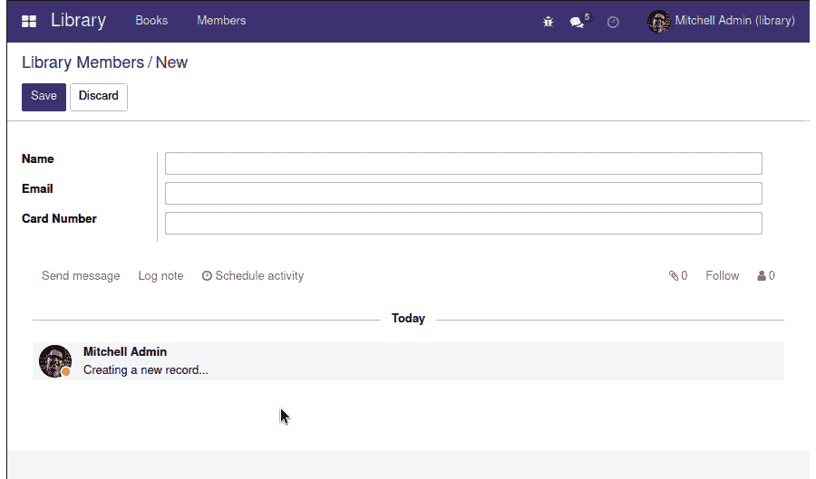
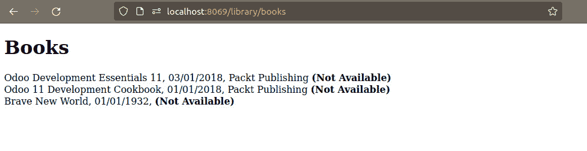

# *第四章*：扩展模块

Odoo 最强大的功能之一是能够在不直接接触扩展模块的代码的情况下添加功能。这允许进行干净的特性扩展，这些扩展在它们自己的代码组件中是隔离的。扩展模块可以通过继承机制实现，这些机制作为现有对象上的修改层工作。这些修改可以在每个级别发生——包括模型、视图和业务逻辑级别。我们不会直接修改现有的模块，而是通过在现有模块上添加一个包含预期修改的层来创建一个新的模块。

上一章引导我们从头开始创建一个新应用。在本章中，我们将学习如何创建扩展现有应用或模块的模块，并使用现有的核心或社区功能。

为了实现这一点，我们将涵盖以下主题：

+   学习项目 – 扩展图书馆应用

+   向现有模型添加新字段

+   使用经典就地扩展扩展模型

+   更多的模型继承机制

+   扩展视图和数据

+   扩展网页

到本章结束时，你应该能够创建扩展现有应用的 Odoo 模块。你将能够向任何几个应用组件添加修改：模型、视图、业务逻辑代码、网页控制器和网页模板。

# 技术要求

对于本章，你需要一个可以从终端会话中控制的 Odoo 服务器。

本章中的代码依赖于我们在*第三章*，*您的第一个 Odoo 应用*中创建的代码。你应该在你的附加组件路径中拥有那段代码，并且有一个安装了`library_app`模块的数据库。

本章将`library_member`附加模块添加到我们的项目中。相应的代码可以在本书的 GitHub 仓库中找到，[`github.com/PacktPublishing/Odoo-15-Development-Essentials`](https://github.com/PacktPublishing/Odoo-15-Development-Essentials)，在`ch04`目录下。

# 学习项目 – 扩展图书馆应用

在*第三章*，*您的第一个 Odoo 应用*中，我们为`library_member`创建了初始模块。

这些是我们必须提供的功能：

+   图书馆书籍可以是可借阅的，也可以不是。这项信息应该在书籍表单和网站目录页面上显示。

+   一些图书馆成员主数据，包括图书馆卡号，以及个人数据，如姓名、地址和电子邮件。

+   我们希望向成员提供在借阅表上可用的消息和社交功能，包括计划活动小部件，以实现更好的协作。

之后，我们计划引入一个允许成员从图书馆借阅书籍的功能，但这个功能目前不在我们的范围内。这将在接下来的几章中逐步实现。

## 书籍

以下是我们必须引入到书籍中的技术变更总结：

+   添加一个“是否可用？”字段。目前，它将由人工管理，但以后可以自动化。

+   扩展 ISBN 验证逻辑以也支持旧的 10 位数字 ISBN 格式。

+   扩展网络目录页面以识别不可用的书籍，并允许用户仅过滤可用的书籍。

## 会员

以下是必须引入到图书馆会员中的技术变更总结：

+   添加一个新的模型来存储个人的姓名、卡号和联系信息，例如电子邮件和地址。

+   添加社交讨论和计划活动功能。

要开始工作在这个扩展模块上，我们应该在`library_app`旁边创建`library_member`目录，并添加两个文件——一个空的`__init__.py`文件和一个包含以下内容的`__manifest__.py`文件：

```py
{
    "name": "Library Members",
    "license": "AGPL-3",
    "description": "Manage members borrowing books.",
    "author": "Daniel Reis",
    "depends": ["library_app"],
    "application": False,
}
```

现在，我们准备好开始工作在功能上了。我们的首要任务是一个频繁且简单的请求——向现有模型添加新字段。这恰好是介绍 Odoo 继承机制的好方法。

# 向现有模型添加新字段

我们的首要任务是向书籍模型添加`is_available`布尔字段。目前，这将是一个简单的可编辑字段，但稍后我们可以想象将其改为自动，基于已借出和归还的书籍。

要扩展现有的模型，我们必须使用具有`_inherit`属性的 Python 类，以标识正在扩展的模型。新类继承父 Odoo 模型的所有功能，我们只需要声明要引入的修改。我们可以将这种继承视为获取现有模型的引用并在其上进行原地更改。

## 通过原地模型扩展添加新字段

通过使用 Odoo 特定的继承机制，通过 Python 类扩展模型，该机制通过`_inherit`类属性声明。这个`_inherit`类属性标识了要扩展的模型。声明的调用捕获了继承的 Odoo 模型的所有功能，并准备好声明要引入的修改。

编码风格指南建议为每个模型创建一个 Python 文件，因此我们将添加一个`library_member/models/library_book.py`文件，该文件扩展原始模型。让我们先添加所需的`__init__.py`代码文件，以便该文件包含在模块中：

1.  添加`library_member/__init__.py`文件，使`models`子目录中的代码可知：

    ```py
    from . import models
    ```

1.  添加`library_member/models/__init__.py`文件，导入该子目录中使用的代码文件：

    ```py
    from . import library_book
    ```

1.  通过扩展`library.book`模型创建`library_member/models/library_book.py`文件：

    ```py
    from odoo import fields, models

    class Book(models.Model): 
        _inherit = "library.book" 
        is_available = fields.Boolean("Is Available?")
    ```

在这里，我们使用了`_inherit`类属性来声明要扩展的模型。请注意，我们没有使用任何其他类属性，甚至没有使用`_name`。这不是必需的，除非我们想要对它们进行更改。

小贴士

`_name` 是模型标识符；如果我们尝试更改它会发生什么？这是允许的，这样做会创建一个新的模型，它是继承模型的副本。这被称为 **原型继承**，将在本章的 *使用原型继承复制模型* 部分中进一步讨论。

我们可以将其视为获取一个位于中央注册表中的模型定义的引用，并对其进行原地更改。这可以包括添加字段、修改现有字段、修改模型类属性或添加具有新业务逻辑的方法。

要将新的模型字段添加到数据库表中，我们必须安装附加模块。如果一切按预期进行，当我们转到 `library.book` 模型时，新添加的字段应该是可见的。

## 向表单视图添加字段

表单、列表和搜索视图是使用 XML 数据结构定义的。要扩展视图，我们需要一种修改 XML 的方法。这意味着定位 XML 元素，然后在那些点进行修改。

继承视图的 XML 数据记录与常规视图的类似，但有一个额外的 `inherit_id` 属性，用于引用要扩展的视图。

我们将扩展书籍视图以添加 `is_available` 字段。

我们需要做的第一件事是找到要扩展的视图的 XML ID。我们可以通过在 `library_app.view_form_book` 中查找视图来找到它。

当我们到达那里时，我们还应该定位要插入更改的 XML 元素。我们将选择在 `ISBN` 字段之后添加 `Is Available?` 字段。要使用的元素通常可以通过其 `name` 属性来识别。在这种情况下，它是 `<field name="isbn" />`。

当将 XML 文件添加到扩展 `Partner` 视图时，`views/book_view.xml`，它应该具有以下内容：

```py
<odoo>
  <record id="view_form_book_extend" model="ir.ui.view">
    <field name="name">Book: add Is Available? 
      field</field>
    <field name="model">library.book</field>
    <field name="inherit_id" ref=
      "library_app.view_form_book"/>
    <field name="arch" type="xml">
      <field name="isbn" position="after">
        <field name="is_available" />
      </field>
    </field>
  </record>
</odoo>
```

在前面的代码中，突出显示了继承特定的元素。`inherit_id` 记录字段标识了要扩展的视图，同时使用 `ref` 属性来引用其外部标识符。

`arch` 字段包含声明要使用的扩展点的元素，即具有 `name="isbn"` 的 `<field>` 元素，以及要添加的新元素的位置，在这种情况下是 `position="after"`。在扩展元素内部，我们有要添加的 XML，在这种情况下是 `is_available` 字段。

创建此扩展后，书籍表单将看起来如下：

![Figure 4.1 – The book form with the "Is Available?" field added

![Figure 4.1 – The book form with the "Is Available?" field added

图 4.1 – 添加了 "Is Available?" 字段的书籍表单

我们刚刚了解了继承的基本知识，并为模型和视图层添加了新的字段。接下来，我们将学习更多关于我们使用的模型扩展方法；即，经典继承。

# 使用经典原地扩展扩展模型

我们可以将经典模型继承视为原地扩展。当声明具有 `_inherit` 属性的 Python 类时，它将获得对应模型定义的引用，然后向其中添加扩展。模型定义存储在 Odoo 模型注册表中，我们可以对其进行进一步修改。

现在，让我们学习如何使用它来处理频繁的扩展用例：修改现有字段的属性和扩展 Python 方法以添加或修改业务逻辑。

## 逐步修改现有字段

当我们扩展模型时，现有字段可以逐步修改。这意味着我们只需要定义要更改或添加的字段属性。

我们将对在 `library_app` 模块中创建的书籍字段进行两项更改：

+   在 `isbn` 字段上，添加一个帮助工具提示，说明我们支持 10 位和 13 位 ISBN，后者将在下一节中实现。

+   在 `publisher_id` 字段上，添加数据库索引以提高搜索效率。

我们应该编辑 `library_member/models/library_book.py` 文件，并将以下行添加到 `library.book` 模型中：

```py
# class Book(models.Model): 
    isbn = fields.Char(help="Use a valid ISBN-13 or 
      ISBN-10.")
    publisher_id = fields.Many2one(index=True)
```

这修改了具有指定属性的字段，而未明确提及的所有其他属性保持不变。

一旦我们升级模块，转到书籍表单并将鼠标指针悬停在 ISBN 字段上，将显示添加到字段的工具提示消息。`index=True` 的影响较难察觉，但可以在字段定义中看到，这可以通过选择 **开发者工具** 菜单中的 **查看字段** 选项或从 **设置** | **技术** | **数据库结构** | **模型** 菜单访问：

![Figure 4.2 – The Publisher field with the index enabled]

![img/Figure_4.2_B16119.jpg]

图 4.2 – 启用索引的出版商字段

## 扩展 Python 方法以添加功能到业务逻辑

编码在 Python 方法中的业务逻辑也可以扩展。为此，Odoo 使用 Python 对象继承机制来扩展继承类的行为。

作为实际示例，我们将扩展图书馆书籍 ISBN 验证逻辑。基础图书馆应用程序提供的逻辑验证现代 13 位 ISBN。但一些较老的标题可能带有 10 位 ISBN。`_check_isbn()` 方法应该扩展以验证这些情况。

通过添加以下代码来编辑 `library_member/models/library_book.py` 文件：

```py
# class Book(models.Model):
    def _check_isbn(self):
        self.ensure_one()
        digits = [int(x) for x in self.isbn if x.isdigit()]
        if len(digits) == 10:
            ponderators = [1, 2, 3, 4, 5, 6, 7, 8, 9]
            total = sum(
                a * b for a, b in zip(digits[:9], 
                ponderators)
            )
            check = total % 11
            return digits[-1] == check
        else:
            return super()._check_isbn()
```

要扩展一个方法，在继承的类中，我们定义一个具有相同名称的方法 – `_check_isbn()`，在这种情况下。此方法应该在某个点上使用 `super()` 来调用在父类中实现的相关方法。在这个例子中，所使用的特定代码是 `super()._check_isbn()`。

在此方法扩展中，我们在调用`super()`之前添加了我们的逻辑，运行父类代码。它检查 ISBN 是否为 10 位长。如果是这样，将执行添加的 ISBN-10 验证逻辑。否则，它将回退到原始 ISBN 检查逻辑，处理 13 位的情况。

我们可以尝试这样做，或者更好的方法是编写一个测试用例。以下是一个 10 位 ISBN 的示例：威廉·戈尔丁的《蝇王》原始 ISBN 为 0-571-05686-5。

Odoo 11 中的变更

在 Odoo 11 中，所使用的 Python 版本从*2.7*更改为*3.5*或更高版本。Python 3 有破坏性变更，并且与 Python 2 不完全兼容。特别是，Python 3 中`super()`语法被简化了。对于之前使用 Python 2 的 Odoo 版本，`super()`需要两个参数——类名和`self`；例如，`super(Book, self)._check_isbn()`。

经典继承是最常用的扩展机制。但 Odoo 提供了其他情况下有用的附加扩展方法。我们将在下一部分探讨这些方法。

# 更多模型继承机制

上一节讨论了**经典继承**，这可以被视为一种*原地扩展*。这是最常用的方法，但 Odoo 框架还支持一些其他情况下有用的扩展机制。

这些是委派继承、原型继承和混入的使用：

+   `User`记录嵌入一个`Partner`记录，因此`User`记录具有所有可用于`Partner`记录的字段，再加上特定于`User`记录的字段。它通过`_inherits`属性使用。

+   使用`_inherit`指定要复制的模型和`_name`属性指定新模型的标识符。

+   由`mail`附加模块提供的`mail.thread`模型。它实现了 Odoo 中多个模型中可用的聊天和消息功能，例如*合作伙伴*和*销售报价*。从`Models.abstract`而不是`Models.model`构建了一个`mixin`类，并使用`_inherit`。

接下来的几节将更详细地探讨这些可能性。

## 使用委派继承嵌入模型

**委派继承**允许我们重用数据结构，而无需在数据库中进行重复。它将委派模型的一个实例嵌入到继承模型中。

注意

为了在技术上精确，委派继承不是真正的对象继承；相反，它是对象组合，其中某些对象特性被委派给或由第二个对象提供。

关于委派，请注意以下内容：

+   创建新的模型记录也会创建和链接一个委派模型记录。

+   在继承模型中不存在的委派模型字段在读写操作中可用，表现得像相关计算字段。

例如，对于用户模型，每个记录都包含一个合作伙伴记录，因此你将在合作伙伴上找到的字段将可用，再加上一些特定于用户的字段。

对于图书馆项目，我们希望添加一个**图书馆成员**模型。成员将能够借阅书籍并拥有用于借阅的图书馆卡。成员主数据应包括卡号，以及一些个人信息，如电子邮件和地址。合作伙伴模型已经支持联系和地址信息，因此最好重用它，而不是复制数据结构。

要使用委托继承将合作伙伴字段添加到图书馆成员模型中，请按照以下步骤操作：

1.  将用于实现继承的 Python 文件导入。通过添加以下高亮行编辑`library_member/model/__init__.py`：

    ```py
    from . import library_book
    from . import library_member
    ```

1.  接下来，添加描述新图书馆成员模型的 Python 文件，`library_member/models/library_member.py`，其中包含以下代码：

    ```py
    from odoo import fields, models
    class Member(models.Model): 
        _name = "library.member"
        _description = "Library Member"
        card_number = fields.Char()
        partner_id = fields.Many2one(
            "res.partner",
    library.member model embeds the inherited model, res.partner, so that when a new Member record is created, a related Partner is automatically created and referenced in the partner_id field.Through the delegation mechanism, all the fields of the embedded model are automatically made available as if they were fields of the parent model fields. In this case, the Library Member model has all of the Partner fields available for use, such as `name`, `address`, and `email`, plus the ones specific to members, such as `card_number`. Behind the scenes, the Partner fields are stored in the linked Partner record, and no data structure duplication occurs.Delegation inheritance works only at the data level, not at the logic level. No methods from the inherited model are inherited. They are still accessible using the `partner_id.open_parent()` runs the `open_parent()` method of the embedded Partner record.There is an alternative syntax for delegation inheritance that's available through the `_inherits` model attribute. It comes from the pre-Odoo 8 old API, and it is still widely used. The Library Model example with the same effect as earlier looks like this:

    ```

    from odoo import fields, models

    class Member(models.Model):

    _name = "library.member"

    _description = "Library Member"

    _inherits = {"res.partner": "partner_id"}

    card_number = fields.Char()

    partner_id = fields.Many2one(

    "res.partner",

    ondelete="cascade",

    required=True)

    ```py

    To finish adding this new model, a few additional steps are needed – add the security ACLs, a menu item, and some view3.
    ```

1.  要添加安全 ACL，创建包含以下内容的`library_member/security/ir.model.access.csv`文件：

    ```py
    id,name,model_id:id,group_id:id,perm_read,perm_write,perm_create,perm_unlink
    access_member_user,Member User Access,model_library_member,library_app.library_group_user,1,1,1,0
    access_member_manager,Member Manager Access,model_library_member,library_app.library_group_manager,1,1,1,4
    ```

1.  要添加菜单项，创建包含以下代码的`library_member/views/library_menu.xml`文件：

    ```py
    <odoo>
        <act_window id="action_library_member"
          name="Library Members"
          res_model="library.member"
          view_mode="tree,form" />
        <menuitem id="menu_library_member"
          name="Members"
          action="action_library_member"
          parent="library_app.menu_library" />
    </odoo5
    ```

1.  要添加视图，创建包含以下代码的`library_member/views/member_view.xml`文件：

    ```py
    <odoo>
      <record id="view_form_member" model="ir.ui.view">
        <field name="name">Library Member Form 
          View</field>
        <field name="model">library.member</field>
        <field name="arch" type="xml">
          <form>
            <group>
              <field name="name" />
              <field name="email" />
              <field name="card_number" />
            </group>
          </form>
        </field>
      </record>
      <record id="view_tree_member" model="ir.ui.view">
        <field name="name">Library Member List 
          View</field>
        <field name="model">library.member</field>
        <field name="arch" type="xml">
          <tree>
              <field name="name" />
              <field name="card_number" />
          </tree>
        </field>
      </record>
    </odoo6
    ```

1.  最后，我们应该编辑清单以声明这三个新文件：

    ```py
    "data": [
        "security/ir.model.access.csv",
        "views/book_view.xml",
        "views/member_view.xml",
        "views/library_menu.xml",
    ],
    ```

如果一切输入正确，在模块升级后，我们应该能够使用新的图书馆成员模型。

## 复制具有原型继承的模型

经典继承使用`_inherit`属性来扩展模型。由于没有修改`_name`属性，它实际上在同一个模型上执行原地修改。

如果同时修改了`_name`属性和`_inherit`，我们将得到一个新的模型，它是继承模型的副本。然后，这个新模型可以添加一些特定于它的功能，而不会添加到父模型中。复制的模型独立于父模型，其修改不会影响父模型。它有自己的数据库表和数据。官方文档称这为**原型继承**。

实际上，使用`_inherit`复制模型的好处很少。相反，首选委托继承，因为它重用数据结构而不复制它们。

当我们使用多父类继承时，事情变得更有趣。为此，`_inherit`将是一个模型名称列表，而不是单个名称。

这可以用来将多个模型混合到一个模型中。它允许我们有一个模型提出要重复使用的功能。这种模式通常与抽象混合类一起使用。这将在下一节中详细讨论。

## 使用混合类重用模型功能

使用模型名称列表设置`_inherit`属性将继承那些模型的功能。大多数情况下，这是为了利用混入类。

一个没有在数据库中实际表示的`models.AbstractModel`，而不是`models.Model`。

Odoo 标准插件提出了几个有用的混入类。在代码中搜索`models.AbstractModel`将揭示它们。值得注意的是，可能是最广泛使用的两个混入类，这些混入类由 Discuss 应用（`mail`插件模块）提供：

+   `mail.thread`混入类为消息板（也称为**聊天**）提供功能，这在许多文档表单的底部或右侧都可以找到，包括有关消息和通知的逻辑。

+   `mail.activity.mixin`混入类提供**活动**，这些活动也通过聊天讨论小部件公开，用于定义和计划待办任务。

    Odoo 11 的变化

    **活动**混入类是 Odoo 11 中引入的新功能，在早期版本中不可用。

聊天和活动是广泛使用的功能，在下一节中，我们将花一点时间演示如何添加它们。

## 向模型添加消息聊天和活动

现在我们将向**图书馆成员**模型添加消息聊天和活动混入类。这是添加它们的所需步骤：

1.  将依赖项添加到提供混入模型的插件模块；即`mail`。

1.  继承`mail.thread`和`mail.activity.mixin`混入类。

1.  向`Form`视图添加字段。

让我们详细检查前面的步骤：

1.  要将依赖项添加到`mail`插件，编辑`__manifest__.py`文件：

    ```py
        "depends": ["library_app", "mail"], 
    ```

1.  要继承混入类，编辑`library_member/models/library_member.py`文件，添加以下高亮文本：

    ```py
    class Member(models.Model): 
        _name = "library.member"
        _description = "Library Member"
        _inherits = {"res.partner": "partner_id"}
    _inherit = ["library.member", "mail.thread", "mail.activity.mixin"].
    ```

1.  最后，我们必须将相关字段添加到`Library Member Form`。通过添加以下高亮代码编辑`library_member/views/member_view.xml`文件：

    ```py
      <record id="view_form_member" model="ir.ui.view">
        <field name="name">Library Member Form 
          View</field>
        <field name="model">library.member</field>
        <field name="arch" type="xml">
          <form>
            <group>
              <field name="name" />
              <field name="email" />
              <field name="card_number" />
            </group>
            <!-- mail mixin fields -->
            <div class="oe_chatter">
                <field name="message_follower_ids"
                       widget="mail_followers"/>
                <field name="activity_ids"
                       widget="mail_activity"/>
                <field name="message_ids"
                       widget="mail_thread"/>
    </div>
          </form>
        </field>
      </record>
    ```

如我们所见，`mail`模块不仅为关注者、活动和消息提供字段，还提供特定的 Web 客户端小部件，所有这些都在这里被使用。

一旦模块升级，**图书馆成员**表单应该看起来像这样：



图 4.3 – 图书馆成员表单视图

注意，混入类本身不会对访问安全造成任何变化，包括记录规则。在某些情况下，已经存在记录规则，限制了每个用户可访问的记录。例如，如果我们想用户只能查看他们是关注者的记录，必须显式添加该记录规则。

`mail.thread`模型包含一个用于列出关注者`message_partner_ids`的字段。为了实现关注者的访问规则，需要添加`[('message_partner_ids', 'in', [user.partner_id.id])]`。

通过这些，我们已经看到了如何在模型和逻辑层扩展模块。下一步是扩展视图，以反映在模型层所做的更改。

# 扩展视图和数据

视图和其他数据组件也可以通过扩展模块进行修改。对于视图，通常的情况是添加功能。视图的表示结构是用 XML 定义的。要扩展此 XML，我们必须找到要扩展的节点，然后声明在那里执行的操作，例如插入额外的 XML 元素。

其他数据元素代表写入数据库的记录。扩展模块可以写入它们以更改某些值。

## 扩展视图

视图是用 XML 定义的，并存储在架构字段 `arch` 中。要扩展视图，我们必须找到扩展将发生的位置的节点，然后执行预期的更改，例如添加 XML 元素。

Odoo 提供了一种简化的表示法，通过使用我们想要匹配的 XML 标签——例如 `<field>` ——以及一个或多个具有匹配功能的独特属性，如 `name`，来扩展 XML。然后，我们必须添加 `position` 属性来声明要进行的修改类型。

恢复我们在本章前面使用的示例，要在 `isbn` 字段之后添加额外内容，我们可以使用以下代码：

```py
      <field name="isbn" position="after">
        <!-- Changed content goes here -->
      </field>
```

任何 XML 元素和属性都可以用来选择作为扩展点的节点，除了 `string` 属性。字符串属性的值在视图生成期间被转换为用户的活跃语言，因此它们不能可靠地用作节点选择器。

要执行扩展操作是通过 `position` 属性声明的。允许执行以下几种操作：

+   `inside`（默认）：在所选节点内追加内容。节点应该是容器，例如 `<group>` 或 `<page>`。

+   `after`：在所选节点之后添加内容。

+   `before`：在所选节点之前添加内容。

+   `replace`：替换所选节点。如果它与空内容一起使用，则删除该元素。自 Odoo 10 以来，它还允许您使用内容中的 `$0` 来包装元素，以表示被替换的元素；例如，`<field name="name" position="replace"><h1>$0</h1></field>`。

+   `attributes`：修改匹配元素的属性值。内容应包含一个或多个 `<attribute name="attr-name">value<attribute>` 元素，例如 `<attribute name="invisible">True</attribute>`。如果没有主体使用，例如 `<attribute name="invisible"/>`，则从所选元素中删除该属性。

    小贴士

    虽然 `position="replace"` 允许我们删除 XML 元素，但应避免使用。它可能会因为使用被删除节点作为扩展点来添加其他元素的模块而损坏。作为替代方案，考虑保留该元素并使其不可见。

## 将 XML 节点移动到不同的位置

除了`attributes`操作外，前面的定位器可以与具有`position="move"`的子元素组合。其效果是将子定位器目标节点移动到父定位器目标位置。

Odoo 12 中的更改

`position="move"`子定位器是 Odoo 12 中的新功能，在之前的版本中不可用。

以下是将`my_field`从当前位置移动到`target_field`之后位置的示例：

```py
<field name="target_field" position="after">
    <field name="my_field" position="move"/>
</field>
```

其他视图类型，如列表和搜索视图，也有`arch`字段，并且可以像表单视图一样进行扩展。

## 使用 XPath 选择 XML 扩展点

在某些情况下，我们可能没有具有唯一值的属性可以用来作为 XML 节点选择器。当要选择的元素没有`name`属性时，这种情况可能发生，例如对于`<group>`、`<notebook>`或`<page>`视图元素。另一种情况是当有多个元素具有相同的`name`属性时，例如在 Kanban QWeb 视图中，相同的字段可以在同一个 XML 模板中包含多次。

对于这些情况，我们需要一种更复杂的方法来定位要扩展的 XML 元素。作为 XML，**XPath 表达式**是定位元素的自然方式。

例如，以我们在上一章中定义的书籍表单视图为例，定位`<field name="isbn">`元素的 XPath 表达式是`//field[@name]='isbn'`。这个表达式找到具有`name`属性等于`isbn`的`<field>`元素。

之前章节中创建的书籍表单视图扩展的 XPath 等价表达式如下：

```py
<xpath expr="//field[@name='isbn']" position="after">
    <field name="is_available" />
</xpath>
```

更多关于支持的 XPath 语法的详细信息可以在官方 Python 文档中找到：[`docs.python.org/3/library/xml.etree.elementtree.html#supported-xpath-syntax`](https://docs.python.org/3/library/xml.etree.elementtree.html#supported-xpath-syntax)。

如果 XPath 表达式匹配多个元素，则只有第一个元素将被选为目标进行扩展。因此，应该尽可能使用唯一的属性使其尽可能具体。使用`name`属性是确保我们找到作为扩展点的元素的最简单方法。因此，在我们的创建的视图的 XML 元素中拥有这些唯一的标识符非常重要。

## 修改现有数据

常规数据记录也可以被*扩展*，在实践中，这意味着覆盖现有值。为此，我们只需要识别要写入的记录以及要更新的字段和值。由于我们不是像视图那样修改 XML `arch`结构，所以不需要 XPath 表达式。

`<record id="x" model="y">`数据加载元素在模型`y`上执行插入或更新操作：如果记录`x`不存在，则创建它；否则，更新/覆盖它。

可以使用`<module>.<identifier>`全局标识符访问其他模块中的记录，因此一个模块可以更新由另一个模块创建的记录。

小贴士

点号（`.`）被保留用于分隔模块名称和对象标识符。因此，它不能用于标识符名称。相反，使用下划线（`_`）字符。

例如，我们将把用户安全组的名称改为`Librarian`。要修改的记录是在`library_app`模块中创建的，具有`library_app.library_group_user`标识符。

要做到这一点，我们将添加`library_member/security/library_security.xml`文件，以及以下代码：

```py
<odoo>
  <!-- Modify Group name -->
<record id="library_app.library_group_user" 
model="res.groups"> 
    <field name="name">Librarian</field>
  </record>
</odoo>
```

注意，我们使用了`<record>`元素，只写入`name`字段。你可以将这视为在这个字段上的写操作。

小贴士

当使用`<record>`元素时，我们可以选择我们想要写入的字段，但对于快捷元素，如`<menuitem>`和`<act_window>`，则不是这样。这些元素需要提供所有属性，缺少任何一个都会将相应的字段设置为空值。然而，你可以使用`<record>`来设置通过快捷元素创建的字段的值。

不要忘记将`library_member/security/library_security.xml`文件添加到清单文件的`data`键中。完成此操作并升级模块后，我们应该在用户组中看到名称更改。

扩展视图允许你在后端表示层引入修改。但同样也可以在前端 Web 表示层进行。这就是我们将在下一节中讨论的内容。

# 扩展 Web 页面

可扩展性是 Odoo 框架的关键设计选择，Odoo Web 组件也不例外。因此，Odoo Web 控制器和模板也可以扩展。

我们在上一章*第三章*，*您的第一个 Odoo 应用程序*中创建的图书馆应用程序提供了一个需要改进的图书目录页面。

我们将扩展它以利用图书馆成员模块添加的图书可用性信息：

+   在控制器方面，我们将添加对查询字符串参数的支持，以仅过滤可用的图书；即`/library/books?available=1`。

+   在模板方面，我们将指定不可用的图书。

让我们开始扩展 Web 控制器。

## 扩展 Web 控制器

**Web 控制器**负责处理 Web 请求并将页面渲染为响应。它们应该专注于表示逻辑，而不是处理业务逻辑，这些逻辑应该被整合到模型方法中。

支持额外的参数甚至 URL 路由是 Web 表示特定的，并且适合 Web 控制器处理。

这里将扩展`/library/books`端点以支持查询字符串参数`available=1`，我们将使用它来过滤图书目录，以便只显示可用的标题。

要扩展现有的控制器，我们需要导入创建它的原始对象，基于它声明一个 Python 类，然后实现包含额外逻辑的类方法。

扩展控制器的代码应该添加到`library_member/controllers/main.py`文件中，如下所示：

```py
from odoo import http 
from odoo.addons.library_app.controllers.main import Books 
class BooksExtended(Books):
    @http.route()
    def list(self, **kwargs):
        response = super().list(**kwargs)
        if kwargs.get("available"):
            all_books = response.qcontext["books"]
            available_books = all_books.filtered(
              "is_available")
            response.qcontext["books"] = available_books
        return response
```

添加控制器代码的步骤如下：

1.  添加`library_member/controllers/main.py`文件，确保它包含前面的代码。

1.  通过将控制器的子目录添加到`library_member/__init__.py`文件中，使这个新的 Python 文件为模块所知：

    ```py
    from . import models
    from . import controllers
    ```

1.  添加`library_member/controllers/__init__.py`文件，并包含以下代码行：

    ```py
    from . import main 
    ```

1.  在此之后，访问`http://localhost:8069/library/books?available=1`应该只会显示`Is Available?`字段被勾选的书籍。

现在，让我们回顾控制器扩展代码，以了解它是如何工作的。

要扩展的控制器`Books`最初是由`library_app`模块在`controllers/main.py`文件中声明的。因此，要获取对其的引用，我们需要导入`odoo.addons.library_app.controllers.main`。

这与模型不同，我们有一个中央注册表可用，我们可以从中获取对任何模型类的引用，例如`self.env['library.book']`，而无需知道实现它的特定文件。我们没有为控制器提供这样的注册表，我们需要知道实现控制器的模块和文件才能扩展它。

然后，基于原始的`Books`类声明了`BooksExtended`类。用于此类的标识符名称并不重要。它被用作引用原始类并扩展它的工具。

接下来，我们（重新）定义要扩展的控制器方法，在本例中是`list()`方法。它至少需要用简单的`@http.route()`进行装饰，以保持其路由活跃。如果这样使用，没有参数，它将保留父类定义的路由。但我们也可以向这个`@http.route()`装饰器添加参数，以替换和重新定义类的路由。

`list()`方法有一个`**kwargs`参数，它捕获`kwargs`字典中的所有参数。这些是在 URL 中给出的参数，例如`?available=1`。

小贴士

使用一个`**kwargs`参数来遍历所有给定的参数不是必需的，但它使我们的 URL 对意外的 URL 参数具有容错性。如果我们选择指定特定的参数，如果设置了不同的参数，当尝试调用相应的控制器时，页面将立即失败并返回一个**内部错误**。

`list()`方法的代码首先使用`super()`调用相应的父类方法。这返回由父方法计算出的`Response`对象，包括属性和要渲染的模板`template`以及渲染时使用的上下文`qcontext`。但 HTML 尚未生成。这只有在控制器运行完成后才会发生。因此，在最终渲染之前，可以更改`Response`的属性。

此方法检查 `kwargs` 中 `available` 键的非空值。如果找到，则过滤掉不可用的书籍，并使用此记录集更新 `qcontext`。因此，当控制器处理完成后，将使用更新后的书籍记录集渲染 HTML，这将仅包括可用的书籍。

## 扩展 QWeb 模板

网页模板是 XML 文档，就像其他 Odoo 视图类型一样，可以使用选择器表达式，就像我们对其他视图类型（如表单）所做的那样。QWeb 模板通常更复杂，因为它们包含更多的 HTML 元素，所以大多数时候需要更通用的 `XPath` 表达式。

要修改网页的实际呈现方式，我们应该扩展正在使用的 QWeb 模板。作为一个例子，我们将扩展 `library_app.book_list_template` 以添加关于不可用书籍的视觉信息。

QWeb 扩展是一个使用额外的 `inherit_id` 属性来标识要扩展的 QWeb 模板的 `<template>` 元素。在这种情况下是 `library_app.book_list_template`。

按照以下步骤操作：

1.  将 `library_member/views/book_list_template.xml` 文件以及以下代码添加进去：

    ```py
    <odoo>
      <template id="book_list_extended"
                name="Extended Book List"
                inherit_id=
                  "library_app.book_list_template">
    xpath notation. Note that in this case, we could have also used the equivalent simplified notation; that is, <span t-field="book.publisher_id" position=after>.
    ```

1.  在插件清单中声明此额外数据文件；即 `library_member/__manifest__.py`：

    ```py
    "data": [
        "security/library_security.xml",
        "security/ir.model.access.csv",
        "views/book_view.xml",
        "views/member_view.xml",
        "views/library_menu.xml",
        "views/book_list_template.xml",
    ],
    ```

之后，访问 `http://localhost:8069/library/books` 应该会显示不可用书籍的额外（不可用）视觉信息。以下是网页将呈现的样子：



图 4.4 – 带有可用性信息的书籍列表网页

这完成了我们对如何扩展每种 Odoo 组件的审查，从数据模型到用户界面元素。

# 摘要

可扩展性是 Odoo 框架的关键特性。我们可以在 Odoo 中构建插件模块，这些模块可以在多个层上更改或添加功能，以实现 Odoo 中的功能。这样，我们的项目将能够以干净和模块化的方式重用和扩展第三方插件模块。

在模型层，我们使用 `_inherit` 模型属性来获取对现有模型的引用，然后对其进行原地修改。模型内的字段对象也支持增量定义，这样我们就可以*重新声明*一个现有字段，只需提供要更改的属性。

附加的模型继承机制允许您重用数据结构和业务逻辑。通过在多对一关系字段上的`delegate=True`属性（或旧式的`inherits`模型属性）激活的委托继承，使得相关模型的所有字段都可用，并重用其数据结构。原型继承，通过使用`_inherit`与附加模型，允许您从其他模型复制功能（数据结构定义和方法），并启用抽象混入类的使用，提供一系列可重用功能，例如文档讨论消息和关注者。

在视图层，视图结构使用 XML 定义，可以通过定位 XML 元素（使用 XPath 或 Odoo 简化的语法）并提供要添加的 XML 片段来进行扩展。由模块创建的其他数据记录也可以通过扩展模块通过简单地引用相应的完整 XML ID 并在目标字段上执行写操作来修改。

在业务逻辑层，可以通过与模型扩展和重新声明方法以扩展相同的方式添加扩展。在这些扩展中，使用`super()` Python 函数来调用继承方法的代码，并且我们的附加代码可以在那之前或之后运行。

对于前端网页，控制器中的表示逻辑可以以类似于模型方法的方式扩展，并且 Web 模板也是具有 XML 结构的视图，因此它们可以以与其他视图类型相同的方式进行扩展。

在下一章中，我们将更深入地探讨模型，并探索它们能为我们提供的一切。

# 进一步阅读

以下是一些指向官方文档的附加参考，这些文档可以提供有关模块扩展和继承机制的有用信息：

+   模型继承：[`www.odoo.com/documentation/15.0/developer/reference/backend/orm.html`](https://www.odoo.com/documentation/15.0/developer/reference/backend/orm.html)

+   视图继承：[`www.odoo.com/documentation/15.0/developer/reference/backend/views.html`](https://www.odoo.com/documentation/15.0/developer/reference/backend/views.html)

+   Web 控制器：[`www.odoo.com/documentation/15.0/developer/reference/backend/http.html`](https://www.odoo.com/documentation/15.0/developer/reference/backend/http.html)
