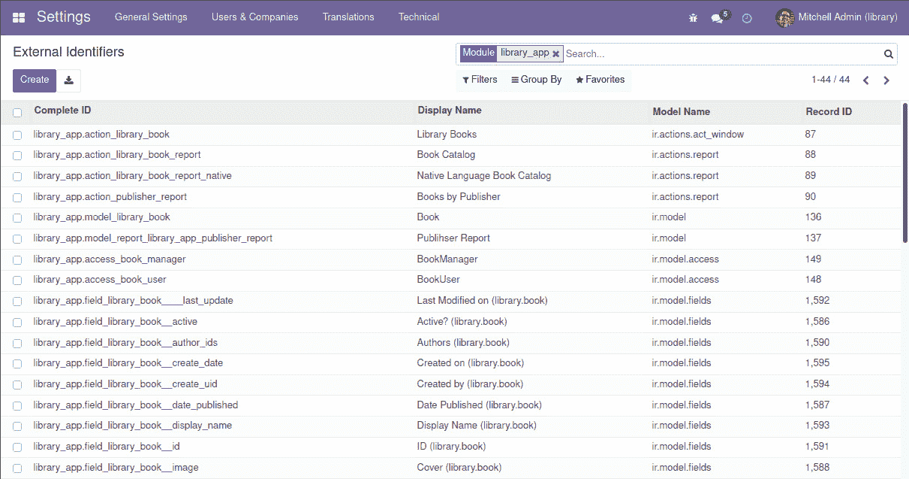
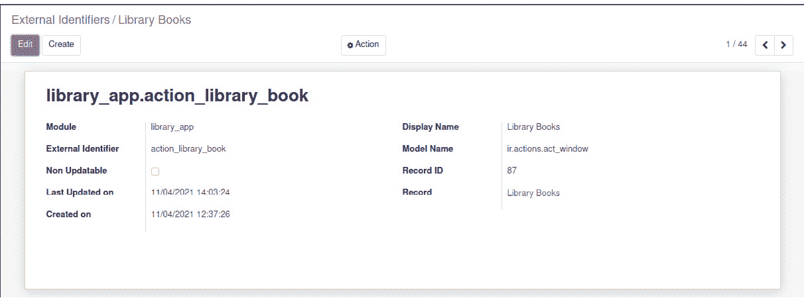
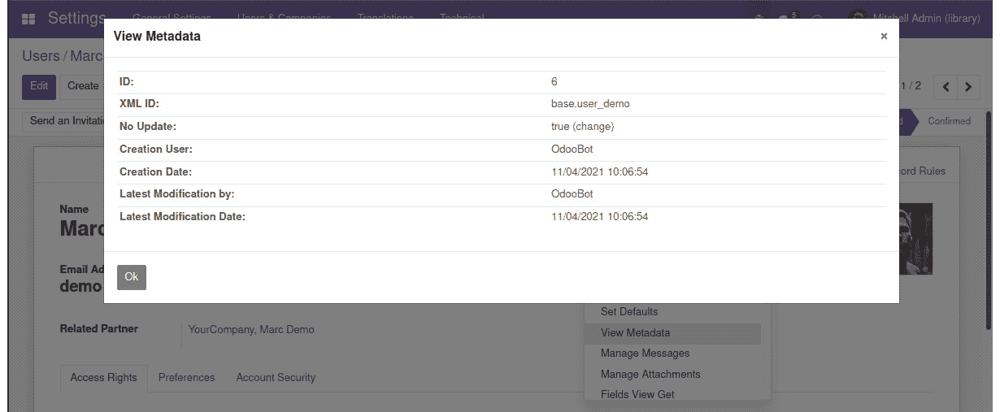
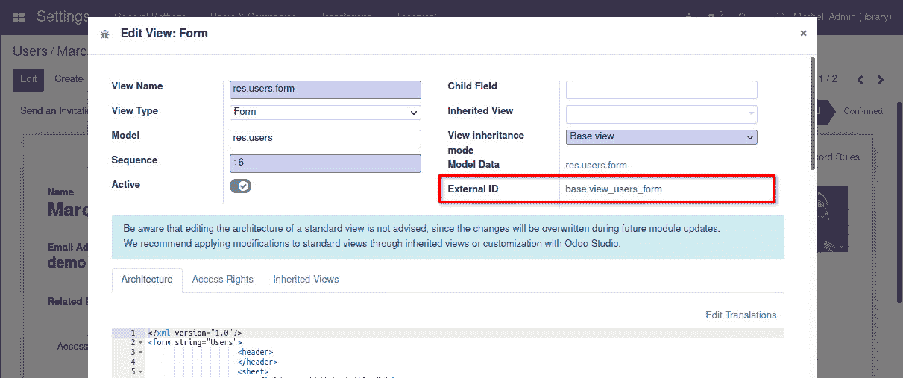
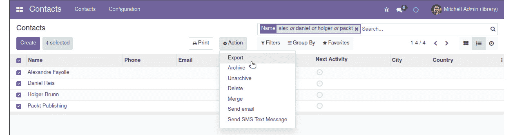
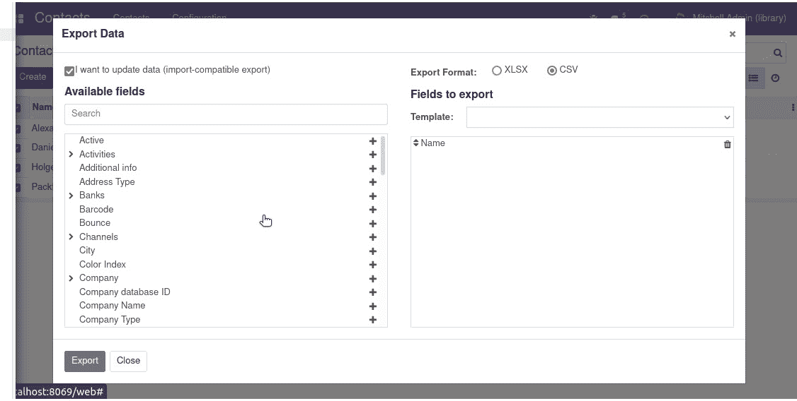
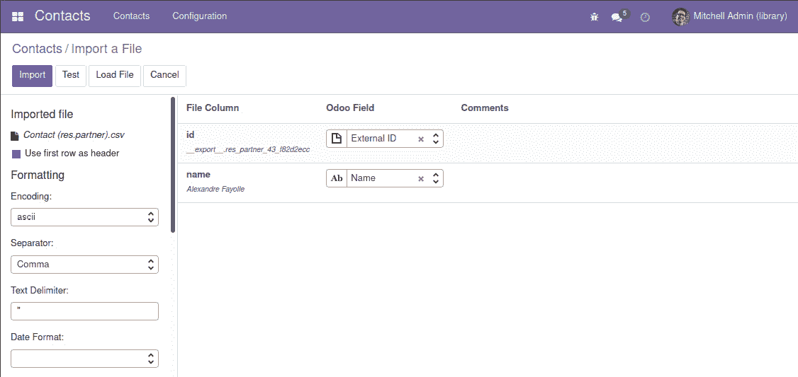
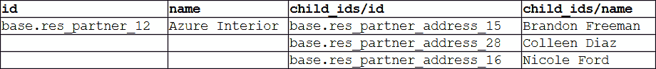

# *第五章*：导入、导出和模块数据

大多数 Odoo 模块定义，如**用户界面**和**安全规则**，是存储在特定**数据库表**中的数据记录。模块中找到的 XML 和 CSV 文件在 Odoo 应用程序运行时不会被使用。它们是加载这些定义到数据库表中的手段。

由于这个原因，Odoo 模块的一个重要部分是将数据表示在文件中，以便在模块安装时将其加载到数据库中。模块还可以包含初始数据和演示数据。数据文件允许我们将这些添加到我们的模块中。

此外，了解 Odoo 数据表示格式对于在项目实施过程中导出和导入业务数据也很重要。

本章将涵盖以下主题：

+   理解外部标识符的概念

+   导出和导入数据文件

+   使用 CSV 文件

+   添加模块数据

+   使用 XML 数据文件

到本章结束时，您将能够执行数据导出和导入操作，以将初始数据填充到数据库中，并自动在创建的模块中创建默认和演示数据。

# 技术要求

本章要求您运行一个 Odoo 服务器，并安装了图书馆应用程序的基础模块。

本章的代码可以在本书的 GitHub 仓库中找到，位于[`github.com/PacktPublishing/Odoo-15-Development-Essentials`](https://github.com/PacktPublishing/Odoo-15-Development-Essentials)的`ch05/`目录下。它包含了我们创建在*第三章*，“您的第一个 Odoo 应用程序”，中的`library_app`原始副本，以及为本章添加的额外文件。

# 理解外部标识符的概念

**外部标识符**，也称为**XML ID**，是一个*可读的字符串标识符*，在 Odoo 中唯一标识一个特定的记录。它们对于将数据加载到 Odoo 中非常重要，允许我们修改现有数据记录或在其他数据记录中引用它。

首先，我们将介绍外部标识符的工作原理以及如何检查它们。然后，我们将学习如何使用 Web 客户端查找特定数据记录的外部标识符，因为这在创建附加模块、扩展现有功能时经常需要。

## 外部标识符的工作原理

让我们先了解标识符是如何工作的。记录的实际数据库标识符是一个自动分配的顺序号，在模块安装过程中无法预先知道将分配给每个记录的 ID。外部标识符允许我们引用相关记录，而无需知道分配给它的实际数据库 ID。XML ID 为数据库 ID 提供了一个方便的别名，这样我们就可以在需要引用特定记录时使用它。

在 Odoo 模块数据文件中定义的记录使用*XML ID*。一个原因是避免在模块升级时创建重复记录。模块升级将再次将数据文件加载到数据库中。我们希望它能够检测它们之前存在的记录以便更新，而不是创建重复的记录。

使用 XML ID 的另一个原因是支持相互关联的数据：需要引用其他数据记录的数据记录。由于我们无法知道实际的数据库 ID，我们可以使用 XML ID，这样翻译将由**Odoo 框架**透明地处理。

Odoo 负责将外部标识符名称转换为分配给它们的实际数据库 ID。背后的机制相当简单：Odoo 保留一个表，其中包含命名外部标识符与其对应的数字数据库 ID 之间的映射：`ir.model.data`模型。

我们必须启用**开发者模式**才能有可用的菜单选项。检查你是否有右上角的*开发者模式*bug 图标，紧挨着用户头像图标。如果没有，你现在应该在**设置**顶菜单中启用它。请参阅*第一章*，*使用开发者模式快速入门*，获取更多详细信息。

我们可以使用`library_app`模块来检查现有的映射，我们会看到由我们创建的模块生成的外部标识符，如下面的截图所示：



图 5.1 – 由 library_app 模块生成的外部标识符

在这里，我们可以看到外部标识符有`library_app.action_library_book`。

外部标识符只需要在 Odoo 模块内部是唯一的，这样就没有两个模块因为意外选择相同的标识符名称而冲突的风险。全局唯一标识符是通过将模块名称与实际的外部标识符名称连接起来构建的。这就是你在**完整 ID**字段中可以看到的内容。

当在数据文件中使用外部标识符时，我们可以选择使用完整的标识符或仅使用外部标识符名称。通常，仅使用外部标识符名称更简单，但完整的标识符使我们能够引用来自其他模块的数据记录。在这样做的时候，请确保那些模块包含在模块依赖关系中，以确保那些记录在我们之前被加载。

在某些情况下，即使我们指的是同一模块中的 XML ID，也需要完整的 ID。

在列表顶部，我们可以看到 `library_app.action_library_book` 完整标识符。这是我们为该模块创建的菜单操作，它也在相应的菜单项中引用。点击它，我们将进入表单视图，其中包含其详细信息。在那里，我们可以看到 `library_app` 模块中的 `action_library_book` 外部标识符映射到 `ir.actions.act_window` 模型中的特定记录 ID，在这种情况下是 `87`。

通过点击记录的行，可以在表单视图中看到信息，如下面的屏幕截图所示：



图 5.2 – library_app.action_library_book 外部标识符的表单视图

除了提供一种让记录轻松引用其他记录的方法外，外部标识符还允许您在重复导入时避免数据重复。如果外部标识符已经存在，现有记录将被更新，从而避免创建一个新的、重复的记录。

## 查找外部标识符

当我们为我们自己的模块编写数据记录时，我们经常需要查找现有的外部标识符以供参考。因此，了解如何查找这些标识符是很重要的。

做这件事的一种方法是通过使用**设置** | **技术** | **序列与标识符** | **外部标识符**菜单，这在之前的*图 5.1*中已经展示过。我们也可以使用**开发者**菜单来做这件事。如您在*第一章*中回忆的那样，*使用开发者模式快速入门*，**开发者**菜单可以在**设置**仪表板的最右下角激活。

要查找数据记录的外部标识符，我们应该打开相应的表单视图，选择**开发者**菜单，然后选择**查看元数据**选项。这将显示包含记录的数据库 ID 和外部标识符（也称为 XML ID）的对话框。

例如，要查找 `demo` 用户 ID，我们应该导航到 `demo` 用户表单的用户表单视图，然后选择 `base.user_demo` 并确认数据库 ID 是 `6`：



图 5.3 – 查看元数据对话框窗口

要查找视图元素（如**表单**、**树**、**搜索**或**操作**）的外部标识符，**开发者**菜单也是一个很好的帮助来源。为此，我们可以使用适当的**编辑视图**选项打开包含相应视图详细信息的表单。在那里，我们将找到一个**外部 ID**字段，它提供了我们所需的信息。

例如，在下面的屏幕截图中，我们可以看到 `base.view_users_form`：



图 5.4 – 显示表单视图外部 ID 属性的编辑视图窗口

通过这些，我们已经了解了**外部 ID**及其如何用作别名来引用数据库记录。我们还探讨了查找在数据文件中引用记录所需的**XML ID**的几种方法。接下来，我们将学习如何创建这些**XML ID**将非常有用的数据文件。

# 导出和导入 CSV 数据文件

生成数据文件并了解文件应具有的结构的一个简单方法就是使用内置的导出功能。

通过生成的 CSV 文件，我们可以了解手动将数据导入系统所需的格式，编辑它们以执行批量更新，甚至使用它们来为我们的附加模块生成演示数据。

在本节中，我们将学习关于从 Odoo 用户界面导出和导入数据的基本知识。

## 导出数据

**数据导出**是任何列表视图中都有的标准功能。要使用它，我们必须通过选择最左侧的相应复选框来选择要导出的行，然后从列表顶部的**操作**按钮中选择**导出**选项。

首先，我们应该将几本 Odoo 书籍添加到`Odoo Development Essentials 11`和`Odoo 11 Development Cookbook`。

我们还需要安装**联系人**应用程序，这样我们就可以看到**合作伙伴**列表视图，并可以从那里导出这些记录。注意，联系卡片的默认视图是**看板**，因此我们需要切换到**列表**视图：



图 5.5 – 操作菜单中的导出选项

我们还可以在列标题中勾选复选框以选择所有符合当前搜索标准的可用记录。

**导出**选项将我们带到**导出数据**对话框表单，在那里我们可以选择导出什么以及如何导出。我们关心的是以允许我们稍后手动或作为附加模块的一部分导入文件的方式导出：



图 5.6 – 导出数据对话框窗口

在对话框表单的顶部，我们有两个可用的选择：

+   **我想更新数据（兼容导入的导出）**：启用此复选框，以便以格式友好的方式导出数据，以便稍后导入。

+   **导出格式**：您可以选择**CSV**或**XLSX**。我们将选择 CSV 文件，以便更好地了解原始导出格式，该格式仍然被任何电子表格应用程序所理解。

接下来，选择要导出的列。在这个例子中，通过仅选择**名称**字段，执行了一个非常简单的导出。通过点击**导出**按钮，将可导出一个导出数据文件。导出的 CSV 文件应如下所示：

```py
"id","name"
"__export__.res_partner_43_f82d2ecc","Alexandre Fayolle"
"__export__.res_partner_41_30a5bc3c","Daniel Reis"
"__export__.res_partner_44_6be5a130","Holger Brunn"
"__export__.res_partner_42_38b48275","Packt Publishing"
```

第一行包含**字段名称**，在导入过程中将用于自动将列映射到其目的地。

第一行有选定的`name`列，正如预期的那样。由于选择了导入兼容的导出选项，自动添加了一个初始 ID 列。

自动添加的`id`列分配了每个记录的外部 ID。这允许编辑导出的数据文件并在以后重新导入，以更新记录，而不是创建重复的记录。

缺失的外部标识符将自动使用`__export__`前缀生成，如前一个文件导出示例所示。

小贴士

由于自动生成的记录标识符，导出或导入功能可以用于批量编辑 Odoo 数据 – 将数据导出到 CSV，使用电子表格软件进行批量编辑，然后将其重新导入到 Odoo。

## 导入数据

一旦我们准备好格式正确的数据文件，我们希望将其导入到 Odoo 中。让我们学习如何通过网页客户端用户界面来完成这项操作。

首先，我们必须确保导入功能是**启用**的。它应该默认启用。如果不是，可以在**设置**应用中的**常规设置**菜单项下找到此选项。在**权限**部分，应勾选**导入导出**选项。

启用此选项后，列表视图搜索小部件将在**收藏**菜单中显示**导入记录**选项，位于**筛选器**和**分组依据**菜单旁边。

注意

负责提供此功能的`base_import`模块。

让我们尝试对我们的**联系人**或**合作伙伴**数据进行批量编辑。在电子表格或文本编辑器中打开我们刚刚下载的 CSV 文件，并更改一些值。我们还可以添加一些新行，将`id`列留空。

如我们之前提到的，第一列`id`为每一行提供唯一的标识符。这允许在将数据重新导入到 Odoo 时更新现有记录，而不是需要复制它们。如果我们编辑导出文件中的任何名称，则在导入文件时相应的记录将被更新。

对于已添加到 CSV 文件中的新行，我们可以选择提供我们选择的任何外部标识符，或者我们可以将`id`列留空。无论哪种方式，都会为它们创建一个新的记录。例如，我们添加了一条没有`id`且名称为`菲利普·K·迪克`的行以在数据库中创建：

```py
,Phillip K. Dick
```

保存这些更改到**CSV**文件后，点击**收藏**菜单中的**导入**选项。下一页允许我们上传数据文件。然后，将显示导入助手：



图 5.7 – 导入文件助手

在这里，我们应该选择 CSV 文件在磁盘上的位置，然后点击左上角的**测试**按钮，以检查其正确性。

由于要导入的文件基于 Odoo 导出，它很可能有效，并且列将自动映射到数据库中的正确目的地。根据用于编辑数据文件的程序，你可能需要调整分隔符和编码选项以获得最佳结果。

现在，点击 **导入**，然后你就会看到——修改和新记录应该已经被加载到 Odoo 中！

## CSV 数据文件中的相关记录

上一节中的示例相当简单，但一旦我们开始使用关系字段，将多个表中的记录链接起来，数据文件可能会变得更加复杂。

之前，我们处理了在 *Books* 中使用的 *Partner* 记录。现在，我们将探讨如何在 CSV 文件中表示这些合作伙伴在书籍数据中的引用。特别是，我们有一个多对一（或外键）关系用于出版社（`publisher_id` 字段）和一个多对多关系用于作者（`author_ids` 字段）。

在 CSV 文件标题行中，关系列应该在其名称后附加 `/id`。它将使用外部标识符引用相关记录。在我们的例子中，我们将使用相关合作伙伴的外部 ID 作为值，将书籍出版商加载到 `publisher_id/id` 字段中。

可以使用 `/.id` 来代替，这样我们就可以使用实际的数据库 ID（已经分配的真实数字标识符），但这通常不是我们需要的。除非你有充分的理由这样做，否则始终使用外部 ID 而不是数据库 ID。此外，请记住，数据库 ID 是特定于特定 Odoo 数据库的，所以，大多数情况下，如果导入到原始数据库之外的数据库，它可能无法正确工作。

多对多字段也可以通过 `CSV` 数据文件导入。这就像提供一个由逗号分隔的外部 ID 列表，并用双引号包围一样简单。例如，为了加载书籍作者，我们会有一个 `author_ids/id` 列，我们会使用合作伙伴的外部 ID 列表作为值来链接。以下是一个 CSV 文件中多对多字段示例：

```py
id, name, author_ids/id
book_odc11, "Odoo 11 Development Cookbook", "__export__.res_partner_43_f82d2ecc,__export__.res_partner_44_6be5a130"
```

一对多字段通常表示标题或行，或父或子关系，并且有特殊支持来导入这些类型的关联——对于同一父记录，我们可以有多个相关行。

这里，我们有一个 *Partners* 模型中一对一字段（多对一）的示例：一个公司合作伙伴可以有多个子联系人。如果我们从 *Partner* 模型导出数据并包括 **Contacts**/**Name** 字段，我们将看到可以用来导入此类数据的结构：



![图 5.8 – 数据文件示例导入多对多相关记录

`id`和`name`列用于父记录，而`child_ids`列用于子记录。注意，在第一个之后，父记录列在子记录中留空。

之前表示为 CSV 文件的表格如下所示：

```py
"id","name","child_ids/id","child_ids/name"
"base.res_partner_12","Azure Interior","base.res_partner_address_15","Brandon Freeman"
"","","base.res_partner_address_28","Colleen Diaz"
"","","base.res_partner_address_16","Nicole Ford"
```

在这里，我们可以看到前两列，`id`和`name`，在第一行中有值，在接下来的两行中为空。它们包含父记录的数据，即*联系人的公司*。

另外两列都以前缀`child_ids/`开头，并在所有三行中都有值。它们包含与父公司相关的联系人的数据。第一行包含公司和第一个联系人的数据，而随后的行包含子联系人列的数据。

# 添加模块数据

模块使用数据文件将它们的默认数据、演示数据、用户界面定义和其他配置加载到数据库中。为此，我们可以使用 CSV 和 XML 文件。

Odoo 12 中的更改

YAML 文件格式直到 Odoo 11 都受到支持，但在 Odoo 12 中被移除。不过，为了使用示例，您可以查看 Odoo 11 中的`l10n_be`官方模块，有关 YAML 格式的信息，您可以访问[`yaml.org/`](http://yaml.org/)。

模块使用的 CSV 文件与我们看到的用于导入功能的文件相同。在模块中使用时，文件名必须与将要加载数据的模型名称匹配。例如，用于将数据加载到`library.book`模型的 CSV 文件必须命名为`library.book.csv`。

数据 CSV 文件的一个常见用途是访问已加载到`ir.model.access`模型的安全定义。它们通常在`security/`子目录中使用 CSV 文件，命名为`ir.model.access.csv`。

## 演示数据

Odoo 附加模块可以安装演示数据，这样做被认为是良好的实践。这对于提供模块的使用示例和测试中要使用的数据集很有用。模块的演示数据使用`__manifest__.py`清单文件的`demo`属性声明。就像`data`属性一样，它是一个包含模块内部相应相对路径的文件名列表。

应该向`library.book`模块添加一些演示数据。一种简单的方法是使用已安装模块的开发数据库导出一些数据。

习惯上，将数据文件放在`data/`子目录中。我们应该将这些数据文件保存在`library_app`附加模块中，命名为`data/library.book.csv`。由于这些数据将属于我们的模块，我们应该编辑`id`值，以从由导出功能生成的标识符中删除`__export__`前缀。

例如，我们的`res.partner.csv`数据文件可能如下所示：

```py
id,name 
res_partner_alexandre,"Alexandre Fayolle" 
res_partner_daniel,"Daniel Reis" 
res_partner_holger,"Holger Brunn"
res_partner_packt,"Packt Publishing"
```

包含图书演示数据的`library.book.csv`数据文件如下所示：

```py
"id","name","date_published","publisher_id/id","author_ids/id"
library_book_ode11,"Odoo Development Essentials 11","2018-03-01",res_partner_packt,res_partner_daniel
library_book_odc11,"Odoo 11 Development Cookbook","2018-01-01",res_partner_packt,"res_partner_alexandre,res_partner_holger"
```

不要忘记将这些数据文件添加到 `__manifest__.py` 清单的 `demo` 属性中：

```py
"demo": [
    "data/res.partner.csv",
    "data/library.book.csv",
],
```

文件按声明的顺序加载。这很重要，因为文件中的记录不能引用尚未创建的其他记录。

下次模块更新时，只要安装了带有演示数据的模块，文件的内容就会被导入。

注意

虽然数据文件在模块升级时也会重新导入，但对于演示数据文件来说并非如此：这些文件仅在模块安装时导入。

当然，与普通的 CSV 文件相比，XML 文件可以用来加载或初始化数据，利用它们提供的额外功能。在下一节中，我们将讨论使用 XML 格式的数据文件。

# 使用 XML 数据文件

虽然 CSV 文件提供了一个简单且紧凑的格式来表示数据，但 XML 文件功能更强大，并提供了更多对加载过程的控制。例如，它们的文件名不需要与要加载的模型匹配。这是因为 XML 格式更加丰富，可以通过文件内的 XML 元素提供更多有关加载的信息。

我们在之前的章节中使用了 XML 数据文件。用户界面组件，如视图和菜单项，实际上是在系统模型中存储的记录。模块中的 XML 文件用于将这些记录加载到实例数据库中。

为了展示这一点，将在 `library_app` 模块中添加第二个数据文件，`data/book_demo.xml`，其内容如下：

```py
<?xml version="1.0"?>
<odoo noupdate="1">
  <!-- Data to load -->
  <record model="res.partner" id="res_partner_huxley"> 
    <field name="name">Aldous Huxley</field> 
  </record> 
  <record model="library.book" id="library_book_bnw">
    <field name="name">Brave New World</field>
    <field name="author_ids"
           eval="[(4, ref('res_partner_huxley'))]" />
    <field name="date_published">1932-01-01</field>
  </record>
</odoo>
```

与往常一样，新的数据文件必须在 `__manifest__.py` 文件中声明：

```py
"demo": [
    "data/res.partner.csv",
    "data/library.book.csv",
    "data/book_demo.xml",
],
```

与上一节中看到的 CSV 数据文件类似，此文件也将数据加载到 *图书馆书籍* 模型中。

XML 数据文件有一个 `<odoo>` 顶级元素，其中可以包含多个 `<record>` 元素，它们相当于 CSV 文件中的数据行。

注意

数据文件中的 `<odoo>` 顶级元素是在 9.0 版本中引入的，并取代了之前的 `<openerp>` 标签。顶级元素内的 `<data>` 部分仍然受支持，但现在它是可选的。实际上，现在 `<odoo>` 和 `<data>` 是等效的，因此我们可以使用任何一个作为我们的 XML 数据文件的顶级元素。

`<record>` 元素有两个强制属性，`model` 和 `id`，用于记录的外部标识符，并包含一个 `<field>` 标签，用于写入每个字段。

注意，字段名称中的斜杠表示法在这里不可用；我们无法使用 `<field name="publisher_id/id">`。相反，使用 `ref` 特殊属性来引用外部标识符。我们将在稍后讨论多对多关系字段的值。 

你可能已经注意到了 `<odoo>` 元素顶部的 `noupdate="1"` 属性。这阻止了数据记录在模块升级时被加载，因此对它们的任何后续编辑都不会丢失。

## noupdate 数据属性

当模块升级时，数据文件加载会重复，模块的记录会被重写。这意味着升级模块将覆盖可能对模块数据进行的任何手动更改。

小贴士

显然，如果视图被手动修改以添加快速自定义，这些更改将在下一个模块升级时丢失。为了避免这种情况，正确的方法是创建继承视图，以引入我们想要引入的更改。

此重写行为是默认的，但可以更改，以便某些数据仅在安装时导入，并在后续模块升级中忽略。这可以通过在`<odoo>`或`<data>`元素中使用`noupdate="1"`属性来完成。

这对于预期以后将进行自定义的初始配置数据很有用，因为这些手动进行的自定义将不会受到模块升级的影响。例如，它经常用于记录访问规则，允许它们适应特定实施的需求。

在同一个`XML`文件中可以有多个`<data>`部分。我们可以利用这一点来分离只导入一次的数据，使用`noupdate="1"`，以及可以在每次升级时重新导入的数据，使用`noupdate="0"`。`noupdate="0"`是默认值，因此如果我们愿意，可以省略它。请注意，我们需要有一个顶级 XML 元素，因此在这种情况下，我们将使用两个`<data>`部分。它们必须位于顶级`<odoo>`或`<data>`元素内。

小贴士

当我们开发模块时，`noupdate`属性可能会很棘手，因为对数据的后续更改将被忽略。一种解决方案是，而不是使用`-u`选项升级模块，使用`-i`选项重新安装它。使用命令行通过`-i`选项重新安装会忽略数据记录上的`noupdate`标志。

`noupdate`标志存储在每个记录的**外部标识符**信息中。可以直接使用**外部标识符**表单手动编辑它，该表单位于**技术**菜单中，通过使用**不可更新**复选框。

Odoo 12 中的更改

在**开发者菜单**中，当访问**查看元数据**时，对话框现在也会显示**无更新**标志的值，以及记录的**XML ID**。此外，可以通过点击来更改**无更新标志**。

## 在 XML 中定义记录

在一个`XML`数据文件中，每个`<record>`元素有两个基本属性，`id`和`model`，并包含`<field>`元素，为每一列分配值。`id`属性对应于记录的外部标识符，而`model`属性对应于目标模型。《field》元素有几种不同的方式来分配值。让我们详细看看它们。

### 直接设置字段值

`<field>`元素的`name`属性标识要写入的字段。

要写入的值是元素的内容：字段打开和关闭标签之间的文本。对于日期和日期时间，返回 `date` 或 `datetime` 对象的表达式 `eval` 属性将有效。返回 `"YYYY-mm-dd"` 和 `"YYYY-mm-dd HH:MM:SS"` 的字符串将被正确转换。对于布尔字段，`"0"` 和 `"False"` 值被转换为 `False`，任何其他非空值将被转换为 `True`。

Odoo 10 的变化

在 Odoo 10 中，从数据文件中读取布尔 `False` 值的方式已得到改进。在之前的版本中，任何非空值，包括 `"0"` 和 `"False"`，都被转换为 `True`。直到 Odoo 9，布尔值应使用 `eval` 属性设置，例如 `eval="False"`。

### 使用表达式设置值

设置字段值的另一种更详细的方法是使用 `eval` 属性。它评估一个 Python 表达式并将结果分配给字段。

表达式是在一个上下文中评估的，除了 Python 内置函数外，还有一些额外的标识符可用于构建要评估的表达式。

要处理日期，以下 Python 模块可用：`time`、`datetime`、`timedelta` 和 `relativedelta`。它们允许您计算日期值，这在演示和测试数据中经常使用，以便使用的日期接近模块安装日期。有关这些 Python 模块的更多信息，请参阅[`docs.python.org/3/library/datatypes.html`](https://docs.python.org/3/library/datatypes.html)中的文档。

例如，要将值设置为昨天，我们可以使用以下代码：

```py
<field name="date_published"
       eval="(datetime.now() + timedelta(-1))" />
```

评估上下文中还可用 `ref()` 函数，它用于将外部标识符转换为相应的数据库 ID。这可以用于设置关系字段的值。以下是一个示例：

```py
<field name="publisher_id" eval="ref('res_partner_packt')" />
```

此示例使用 `eval` 属性为 `publisher_id` 字段设置值。评估的表达式是使用特殊 `ref()` 函数的 Python 代码，该函数用于将 *XML ID* 转换为相应的数据库 ID。

### 在多对一关系字段上设置值

对于多对一关系字段，要写入的值是链接记录的数据库 ID。在 XML 文件中，我们通常知道记录的 *XML ID*，我们需要将其转换为实际的数据库 ID。

做这件事的一种方法是在 `eval` 属性中使用 `ref()` 函数，就像我们在上一节中做的那样。

一种更简单的方法是使用 `ref` 属性，该属性适用于 `<field>` 元素；例如：

```py
<field name="publisher_id" ref="res_partner_packt" />
```

此示例为 `publisher_id` 多对一字段设置值，引用具有 `res_partner_packt` *XML ID* 的数据库记录。

### 在多对多关系字段上设置值

对于一对一和多对多字段，期望的是一个相关 ID 的列表，而不是单个 ID。此外，可以执行多个操作 - 我们可能想要用新的列表替换当前的相关记录列表，或者向其中添加一些记录，甚至解除一些记录的链接。

为了支持对多对字段的写操作，我们可以在 `eval` 属性中使用特殊语法。要写入多对字段，我们可以使用一个 *三元组* 的 *列表*。每个 *三元组* 是一个 `write` 命令，根据第一个元素中使用的代码执行不同的操作。

要覆盖书籍作者列表，我们会使用以下代码：

```py
<field name="author_ids"
       eval="[(6, 0, 
              [ref('res_partner_alexandre'), 
               ref('res_partner_holger')] 
              )]"
/>
```

要将链接记录追加到书籍作者的当前列表中，我们会使用以下代码：

```py
<field name="author_ids" 
       eval="[(4, ref('res_partner_daniel'))]"
/>
```

上述示例是最常见的。在两种情况下，我们只使用了一个命令，但我们可以在外部列表中链式调用多个命令。`append (4)` 和 `replace (6)` 命令是最常用的。在 `append (4)` 的情况下，三元组的最后一个值未使用且不需要，因此可以省略，就像我们在前面的代码示例中所做的那样。

可用的完整 **多对写命令** 列表如下：

+   `(0, _, {'field': value})` 创建一个新记录并将其链接到当前记录。

+   `(1, id, {'field': value})` 更新已链接记录上的值。

+   `(2, id, _)` 删除与 id 相关的记录的链接。

+   `(3, id, _)` 删除与 id 相关的记录的链接，但不删除该记录。这通常是你用于在多对多字段上删除相关记录时使用的方法。

+   `(4, id, _)` 链接一个已存在的记录。这只能用于多对多字段。

+   `(5, _, _)` 删除所有链接，但不删除链接的记录。

+   `(6, _, [ids])` 用提供的列表替换了链接记录的列表。

在前面的列表中使用的 `_` 下划线符号表示无关的值，通常用 `0` 或 `False` 填充。

小贴士

可以安全地省略尾随的无关值。例如，`(4, id, _)` 可以用作 `(4, id)`。

在本节中，我们学习了如何使用 `<record>` 标签将记录加载到数据库中。作为替代，有一些快捷标签可以用作常规 `<record>` 标签的替代。下一节将向我们介绍这些标签。

## 常用模型的快捷方式

如果我们回顾到 *第三章*，*您的第一个 Odoo 应用程序*，我们将在 XML 文件中找到除了 `<record>` 之外的其他元素，例如 `<menuitem>`。

这些是常用模型的便捷快捷方式，与常规 `<record>` 元素相比，具有更紧凑的表示法。它们用于将数据加载到支持用户界面的基础模型中，这些将在 *第十章*，*后端视图 - 设计用户界面* 中更详细地探讨。

以下是可以用的快捷元素及其加载的数据对应的模型：

+   `<menuitem>` 用于菜单项模型，`ir.ui.menu`。

+   `<template>` 用于存储在 `ir.ui.view` 模型中的 *QWeb* 模板。

    Odoo 14 的变化

    Odoo 的早期版本曾经支持额外的快捷标签，但这些标签现在不再受支持。曾经有一个 `<act_window>` 用于窗口动作模型，`ir.actions.act_window`，以及一个 `<report>` 用于报告动作模型，`ir.actions.report.xml`。

重要的是要注意，当用于修改现有记录时，快捷元素会覆盖所有字段。这与 `<record>` 基本元素不同，后者只写入提供的字段。因此，对于需要修改用户界面元素特定字段的情况，我们应该使用 `<record>` 元素来操作。

## 在 XML 数据文件中使用其他操作

到目前为止，我们已经看到了如何使用 XML 文件添加或更新数据。但 XML 文件还允许您删除数据并执行任意模型方法。这对于更复杂的数据设置可能很有用。在接下来的章节中，我们将学习如何使用删除和函数调用 XML 功能。

### 删除记录

要删除数据记录，我们可以使用 `<delete>` 元素，并为其提供一个 ID 或搜索域以找到目标记录。

例如，使用搜索域查找要删除的记录如下所示：

```py
<delete
  model="res.partner"
  search="[('id','=',ref(
    'library_app.res_partner_daniel'))]"
/>
```

如果我们知道要删除的特定 ID，我们可以使用它与 `id` 属性一起。这是上一个示例的情况，因此也可以这样写：

```py
<delete model="res.partner" id="library_app.res_partner_daniel" />
```

这与上一个示例具有相同的效果。由于我们知道要查找的 ID，我们可以简单地使用 `id` 属性与 *XML ID* 一起，而不是使用带有域表达式的 `search` 属性。

### 调用模型方法

一个 `XML` 文件也可以通过 `<function>` 元素在其加载过程中执行任意方法。这可以用于设置演示和测试数据。

例如，Odoo 内置的 **笔记** 应用程序使用它来设置演示数据：

```py
<data noupdate="1"> 
<function  
   model="res.users"  
   name="_init_data_user_note_stages"
   eval="[]" />
</data>
```

这调用 `res.users` 模型的 `_init_data_user_note_stages` 方法，不传递任何参数。参数列表由 `eval` 属性提供，在这种情况下是一个空列表。

这就完成了我们使用 XML 数据文件所需了解的所有内容。我们提供了 `<data>` 元素和 `noupdate` 标志的概述。然后我们学习了如何使用 `<record>` 元素来加载数据记录，以及如何设置相关字段的值。我们还了解了记录快捷方式，例如 `<menuitem>` 和 `<template>`。最后，我们学习了如何使用 `<delete>` 和 `<function>` 元素删除记录和执行任意函数调用。

这样，我们应该准备好使用 XML 数据文件来满足我们项目可能需要的任何数据需求。

# 摘要

在本章中，我们学习了如何在文本文件中表示数据。这些可以用于手动将数据导入 Odoo 或将其包含在附加模块中作为默认或 *演示数据*。

到目前为止，我们应该能够从网络界面导出和导入 CSV 数据文件，并利用 *外部 ID* 来检测和更新数据库中已存在的记录。它们还可以用来对数据进行批量编辑，通过编辑并重新导入从 Odoo 导出的 CSV 文件。

我们还更详细地学习了 XML 数据文件的结构以及它们提供的所有功能。这些不仅包括字段上的设置值，还包括如删除记录和调用模型方法等操作。

在下一章中，我们将专注于如何使用 *记录* 来处理模型中包含的数据。这将为我们提供实施应用程序的业务逻辑和规则所必需的工具。

# 进一步阅读

官方的 Odoo 文档提供了关于数据文件的其他资源：[`www.odoo.com/documentation/15.0/developer/reference/backend/data.html`](https://www.odoo.com/documentation/15.0/developer/reference/backend/data.html)。
