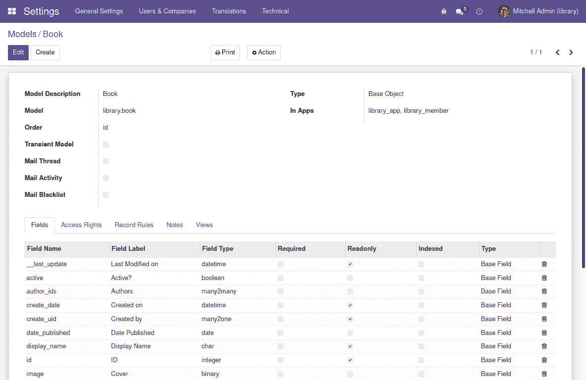

# *第六章*：模型 – 结构化应用程序数据

在本章中，我们将更多地了解模型层以及如何使用模型来设计支持应用程序的数据结构。我们将探讨可用的模型类型，何时应该使用它们，以及如何定义强制数据验证的约束。

模型由支持多种数据类型的数据字段组成，某些字段类型支持定义模型之间的关系。字段的高级使用涉及使用特定的业务逻辑自动计算值。

本章将涵盖以下主题：

+   学习项目 – 改进图书馆应用

+   创建模型

+   创建字段

+   模型之间的关系

+   计算字段

+   模型约束

+   Odoo 基础模型的概述

在这些主题中，您将学习如何为您的 Odoo 项目创建非平凡的数据结构。到本章结束时，您应该对所有相关功能有一个清晰的概述，这些功能对于结构化数据模型是必需的。

# 技术要求

本章基于我们在*第三章*，“您的第一个 Odoo 应用程序”中创建的代码。此代码可在本书 GitHub 存储库的`ch06/`目录中找到，网址为[`github.com/PacktPublishing/Odoo-15-Development-Essentials`](https://github.com/PacktPublishing/Odoo-15-Development-Essentials)。

应将其放在您的附加组件路径中。请确保您已安装`library_app`模块。

# 学习项目 – 改进图书馆应用

在*第三章*，“您的第一个 Odoo 应用程序”中，我们创建了`library_app`附加模块并实现了简单的`library.book`模型来表示图书目录。在本章中，我们将回顾该模块以丰富我们为每本书可以存储的数据。

我们将添加一个类别层次结构，用于使用以下结构进行图书分类：

+   **名称**：类别标题

+   **父类别**：它所属的父类别

+   **子类别**：作为父类的这些类别

+   **特色图书或作者**：代表此类别的选定图书或作者

将添加更多字段以展示 Odoo 字段可用的不同数据类型。我们还将使用模型约束在图书模型上实施一些验证：

+   标题和出版日期应该是唯一的。

+   输入的 ISBN 号应该是有效的。

我们将首先回顾 Odoo 模型，现在将更加深入，以了解我们可用的所有选项。

# 创建模型

模型是 Odoo 框架的核心。它们描述了应用程序数据结构，是应用程序服务器和数据库存储之间的桥梁。可以在模型周围实现业务逻辑以提供应用程序功能，并在其之上创建用户界面以提供用户体验。

在以下小节中，我们将了解模型的通用属性，这些属性用于影响其行为，以及我们可用的几种类型——**常规模型**、**临时模型**和**抽象模型**。

## 模型属性

模型类可以使用额外的属性来控制某些行为。这些是最常用的属性：

+   `_name`：这是我们创建的 Odoo 模型的内部标识符。在创建新模型时这是必需的。

+   `_description`：这是一个用户友好的标题，可以用来引用单个 `Model` 记录，例如 `Book`。这是可选的但推荐使用。如果没有设置，则在加载序列期间将显示服务器日志警告。

+   `_order`：这设置了在浏览模型记录或以列表视图显示时使用的默认排序。它是一个用作 SQL 排序子句的文本字符串，因此可以是那里可以使用的任何内容，尽管它具有智能行为并支持可翻译的和多对一字段名称。

我们的 `Book` 模型已经使用了 `_name` 和 `_description` 属性。以下代码添加了 `_order` 属性，以便默认按书名排序，然后按出版日期的逆序（从最新到最旧）排序：

```py
class Book(models.Model):
    _name = "library.book"
    _description = "Book"
    _order = "name, date_published desc"
```

还有一些更高级的属性在复杂情况下可能很有帮助：

+   `_rec_name`：这设置了用于记录显示名称的字段。默认情况下，它是 `name` 字段，这就是为什么我们通常选择这个特定的字段名称作为记录标题字段的原因。

+   `_table`：这是支持模型的数据库表名称。通常，它由 ORM 自动设置，ORM 将使用模型名称，并将点替换为下划线。然而，我们可以自由选择要使用的特定数据库表名称。

+   `_log_access=False`：这可以用来防止自动创建审计跟踪字段；即 `create_uid`、`create_date`、`write_uid` 和 `write_date`。

+   `_auto=False`：这防止了底层数据库表被自动创建。在这种情况下，我们应该使用 `init()` 方法来提供我们创建支持数据库对象（表或视图）的特定逻辑。这通常用于支持只读报告的视图。

例如，以下代码在 `library.book` 模型上设置了默认值：

```py
    _recname = "name"
    _table = "library_book"
    _log_access = True
    _auto = True
```

注意

此外，还有 `_inherit` 和 `_inherits` 属性，它们用于模块扩展。这些在 *第四章*，*扩展模块* 中有详细解释。

当使用 `_auto = False` 时，我们正在覆盖创建数据库对象的过程，因此我们应该提供相应的逻辑。这种应用的常见例子是基于数据库视图的模型，该视图收集了报告所需的所有数据。

下面是一个从 `sale` 核心模块中提取的示例，位于 `sale/report/sale_report.py` 文件中：

```py
    def init(self):
        tools.drop_view_if_exists(self.env.cr, self._table)
        self.env.cr.execute(
            "CREATE or REPLACE VIEW %s as (%s)"
            % (self._table, self._query())
        )  
```

前面的代码使用了`tools` Python 模块，需要使用`odoo import tools`来导入。

## 模型和 Python 类

Odoo 模型使用 Python 类。在前面的代码中，我们可以看到一个基于`models.Model`类的 Python 类`Book`，它被用来定义一个名为`library.book`的 Odoo 模型。

Odoo 模型存储在一个*中央注册表*中，通过*环境对象*可访问，通常使用`self.env`来访问。中央注册表保存了对所有可用模型的引用，并且可以使用类似字典的语法来访问它们。

例如，要在方法内部获取图书馆书籍模型的引用，我们可以使用`self.env["library.book"]`或`self.env.get(["library.book"])`。

如你所见，模型名称很重要，是访问模型注册表的关键。

模型名称必须是全局唯一的。因此，一个好的做法是将模块所属的应用程序的第一词作为模型名称的第一词。例如，对于`Library`应用程序，所有模型名称都应该以`library`为前缀。核心模块的其他示例包括`project`、`crm`或`sale`。

小贴士

模型名称应使用单数形式，如`library.book`，而不是`library.books`。约定是使用由点连接的单词列表。第一个单词应标识模型所属的主要应用程序，例如`library.book`或`library.book.category`。其他从官方插件中提取的示例包括`project.project`、`project.task`和`project.task.type`。

另一方面，Python 类的标识符仅限于它们声明的 Python 文件中，并且与 Odoo 框架无关。用于它们的标识符仅对该文件中的代码有意义，并且很少相关。Python 类标识符的约定是使用*驼峰式命名法*，遵循 PEP8 编码约定定义的标准。

有几种类型的模型可供使用。最常用的一种是`models.Model`类，用于持久数据库存储模型。接下来，我们将了解其他可用的模型类型。

## 临时模型和抽象模型

对于大多数 Odoo 模型，Python 类基于`models.Model`。这种类型的模型具有永久数据库持久性，这意味着为它们创建了数据库表，并且它们的记录存储在它们被显式删除之前。大多数时候，这正是你所需要的。

但在某些情况下，我们不需要永久数据库持久性，因此这两种其他模型类型可能很有用：

+   `models.TransientModel` 用于向导风格的用户交互。它们的数据仍然存储在数据库中，但预期是临时的。定期清理这些表中的旧数据。例如，**设置** | **翻译** | **导入翻译** 菜单选项打开一个对话框窗口，该窗口使用临时模型来存储用户选择并实现向导逻辑。将在 *第八章*，*业务逻辑 – 支持业务流程* 中讨论使用临时模型的示例。

+   `models.AbstractModel` 类没有附加数据存储。它们可以用作可重用的特征集，与其他模型一起使用 Odoo 的继承功能。例如，`mail.thread` 是之前提到的 `mail.thread` 示例中提供的抽象模型，在 *第四章*，*扩展模块* 中进行了讨论。

## 检查现有模型

通过用户界面可以检查由 Python 类创建的模型和字段。启用 **开发者模式**，通过 **设置** 顶部菜单，导航到 **技术** | **数据库结构** | **模型** 菜单项。在这里，您将找到数据库中所有可用的模型列表。

在列表中单击模型将打开一个表单，显示其详细信息，如下面的截图所示：



图 6.1 – 从技术菜单检查书籍模型

这是一个检查模型的好工具，因为它显示了不同模块所做的所有修改的结果。在表单的右上角，`library.book` 受 `library_app` 和 `library_member` 模块的影响。

小贴士

如 *第一章*，*使用开发者模式快速入门* 所见，**模型** 表单是可编辑的！可以从这里创建和修改模型、字段和视图。您可以使用此功能构建原型，这些原型将作为附加模块稍后实现。

在下方区域，我们有一些带有附加信息的标签页：

+   **字段** 列出了模型字段。

+   **访问权限** 列出了授予安全组的访问控制规则。

+   **记录规则** 列出了应用于记录的记录规则。

+   **说明** 是模型定义的 docstring。

+   **视图** 列出了模型的可用视图。

要找到模型的外部标识符或 XML ID，我们可以使用 `model_`。例如，由 `library_app` 模块创建的 `library.book` 模型生成的标识符是 `library_app.model_library_book`。这些 XML ID 通常用于定义安全 ACLs 的 CSV 文件。

我们现在熟悉了定义模型的可选方案。下一步是了解几个字段类型以及配置它们的选项。

# 创建字段

创建了新的模型后，下一步是向其中添加字段。Odoo 支持所有预期的基本数据类型，例如文本字符串、整数、浮点数、布尔值、日期和时间，以及图像或二进制数据。

让我们探索 Odoo 中可用的几种字段类型。

## 基本字段类型

我们将回到书籍模型，以展示可用的几种字段类型。

在 `library_app/models/library_book.py` 文件中，编辑 `Book` 类，将当前的字段定义替换为以下内容：

```py
class Book(models.Model):
    _name = "library.book"
    _description = "Book"
    # String fields:
    name = fields.Char("Title")
    isbn = fields.Char("ISBN")
    book_type = fields.Selection(
        [("paper","Paperback"),
         ("hard","Hardcover"),
         ("electronic","Electronic"),
         ("other", "Other")],
        "Type")
    notes = fields.Text("Internal Notes") 
    descr = fields.Html("Description") 
    # Numeric fields:
    copies = fields.Integer(default=1)
    avg_rating = fields.Float("Average Rating", (3, 2))
    price = fields.Monetary("Price", "currency_id") 
    # price helper
    currency_id = fields.Many2one("res.currency")  
    # Date and time fields:
    date_published = fields.Date()
    last_borrow_date = fields.Datetime(
        "Last Borrowed On",
         default=lambda self: fields.Datetime.now()) 
    # Other fields:
    active = fields.Boolean("Active?")
    image = fields.Binary("Cover") 
    # Relational Fields
    publisher_id = fields.Many2one(
        "res.partner", string="Publisher")
    author_ids = fields.Many2many(
        "res.partner", string="Authors")
```

这些是 Odoo 中可用的非关系型字段类型示例，以及每个字段预期的定位参数。接下来，我们将解释所有这些字段类型和选项。

小贴士

Python 函数可以有两种类型的参数：定位参数和关键字参数。

`fn(x, y)` 应该是类似于 `f(1, 2)` 的形式。

`f(x=1, y=2)`，或者甚至可以混合两种风格，例如 `f(1, y=2)`。

然而，请注意，定位参数必须在关键字参数之前，因此不允许 `f(x=1, 2)`。有关关键字参数的更多信息，请参阅 Python 官方文档 [`docs.python.org/3/tutorial/controlflow.html#keyword-arguments`](https://docs.python.org/3/tutorial/controlflow.html#keyword-arguments)。

作为一般规则，第一个定位参数是字段标题，它对应于 `string` 关键字参数。此规则的例外是 **Selection** 字段和所有关系型字段。

`string` 属性用作用户界面标签的默认文本。如果没有提供 `string` 属性，它将自动从字段名称生成，将下划线替换为空格，并将每个单词的首字母大写。例如，`date_published` 的默认标签是 **Date Published**。

作为参考，这是所有可用的非关系型字段类型列表，以及每个字段预期的定位参数：

+   `Char(string)` 是一个简单的文本字段。预期的唯一定位参数是字段标签。

+   `Text(string)` 是一个多行文本字段。唯一的定位参数也是字段标签。

+   `Selection(selection, string)` 是一个下拉选择列表。选择定位参数是一个 `[("value", "Description"),]` 的元组列表。对于每一对，第一个元素是存储在数据库中的值，第二个元素是在用户界面中展示的描述。扩展模块可以使用 `selection_add` 关键字参数向此列表添加选项。

+   `Html(string)` 被存储为文本字段，但具有针对 HTML 内容展示的用户界面特定处理。出于安全考虑，它默认被清理，但可以通过使用 `sanitize=False` 属性来覆盖此行为。

+   `Integer(string)` 用于整数数字，并期望一个字符串参数作为字段标签。

+   `Float(string, digits)` 存储浮点数，并有一个用于精度的第二个可选参数。这是一个 `(n, d)` 元组，其中 `n` 是总位数，`d` 是用于小数的位数。

+   `Monetary(string, currency_field)` 与 `float` 字段类似，但具有对货币值的特定处理。`currency_field` 第二个参数是货币字段名称。默认情况下，它设置为 `currency_field="currency_id"`。

+   `Date(string)` 和 `Datetime(string)` 字段用于日期和日期时间值。它们只期望标签文本作为位置参数。

+   `Boolean(string)` 存储真或假值，并为标签文本提供一个位置参数。

+   `Binary(string)` 存储二进制数据，包括图像，并期望字符串标签位置参数。

这些字段定义提供了通常使用的参数。请注意，没有必需的参数，Odoo 将为缺失的参数使用合理的默认值。

Odoo 12 的变化

`Date` 和 `Datetime` 字段现在在 ORM 中作为 Python 日期对象处理。在之前的版本中，它们被作为文本表示处理。因此，在操作时，需要显式转换为 Python 日期对象，之后还需要将其转换回文本字符串。

基于文本的字段，包括 `Char`、`Text` 和 `Html`，有几个特定的属性：

+   `size`（仅适用于 `Char` 字段）设置最大允许大小。除非有很好的理由，否则建议不要使用它；例如，一个允许的最大长度为的社会安全号码。

+   `translate=True` 使字段内容可翻译，为不同语言持有不同的值。

+   `trim` 默认设置为 `True` 并自动修剪周围的空白符，这是由网络客户端执行的。这可以通过将 `trim=False` 显式禁用。

    Odoo 12 的变化

    `trim` 字段属性是在 Odoo 12 中引入的。在之前的版本中，文本字段会连同空白符一起保存。

此外，我们还有可用的关系字段类型。这些将在本章的 *模型之间的关系* 部分中稍后解释。

然而，在我们到达那里之前，还有更多关于基本字段类型属性的知识需要了解，如下一节所述。

## 常见字段属性

到目前为止，我们已经查看了几种基本字段类型的基本位置参数。然而，还有更多属性可供我们使用。

以下关键字参数属性通常对所有字段类型都可用：

+   `string` 是字段的默认标签，用于用户界面。除了 `Selection` 和关系字段外，它作为第一个位置参数可用，因此大多数情况下不作为关键字参数使用。如果没有提供，它将自动从字段名称生成。

+   `default` 为字段设置默认值。它可以是固定值（例如，`active` 字段中的 `default=True`），或可调用的引用，无论是命名的函数引用还是 `lambda` 匿名函数。

+   `help` 提供了当用户将鼠标悬停在 UI 字段上时显示的工具提示文本。

+   `readonly=True` 使字段在用户界面中默认不可编辑。这不在 API 层面上强制执行：模型方法中的代码仍然可以写入它，视图定义可以覆盖此设置。这仅是一个用户界面设置。

+   `required=True` 使字段在用户界面中默认为必填项。这在数据库级别通过向数据库列添加 `NOT NULL` 约束来强制执行。

+   `index=True` 在字段上添加数据库索引，以加快搜索操作，但会牺牲磁盘空间使用和较慢的写入操作。

+   `copy=False` 在通过 `copy()` ORM 方法复制记录时忽略字段。字段值默认会复制，除了多对多关系字段，它们默认不会复制。

+   `deprecated=True` 将字段标记为已弃用。它仍然会按常规工作，但任何对其的访问都会将警告消息写入服务器日志。

+   `groups` 允许您限制字段的访问和可见性，仅限于某些组。它期望一个以逗号分隔的安全组 XML ID 列表；例如，`groups="base.group_user,base.group_system"`。

+   `states` 预期 UI 属性的字典映射值，这取决于 `state` 字段的值。可以使用的属性有 `readonly`、`required` 和 `invisible`；例如，`states={'done':[('readonly',True)]}`。

    小贴士

    注意，`states` 字段属性在视图中等同于 `attrs` 属性。此外，视图支持一个具有不同用途的 `states` 属性：它是一个逗号分隔的状态列表，其中视图元素应该是可见的。

下面是一个包含所有可用关键字参数的 `name` 字段示例：

```py
    name = fields.Char(
        "Title",
        default=None,
        help="Book cover title.",
        readonly=False,
        required=True,
        index=True,
        copy=False,
        deprecated=True,
        groups="",
        states={},
    )
```

以前的 Odoo 版本支持 `oldname="field"` 属性，当字段在新版本中重命名时使用。它使得在模块升级过程中，旧字段中的数据可以自动复制到新字段中。

Odoo 13 的变化

`oldname` 字段属性已被移除，不再可用。替代方案是使用迁移脚本。

上述字段属性是通用的，适用于所有字段类型。接下来，我们将学习如何在字段上设置默认值。

## 设置默认值

如我们之前提到的，`default` 属性可以有一个固定值或对函数的引用，以动态计算默认值。

对于简单的计算，我们可以使用 `lambda` 函数来避免创建命名方法函数的开销。以下是一个使用当前日期和时间计算默认值的常见示例：

```py
    last_borrow_date = fields.Datetime(
        "Last Borrowed On",
        default=lambda self: fields.Datetime.now(),
    )
```

`default` 值也可以是一个函数引用。这可以是一个名称引用或一个包含函数名称的字符串。

以下示例使用名称引用 `_default_last_borrow_date` 函数方法：

```py
    def _default_last_borrow_date(self):
        return fields.Datetime.now()
    last_borrow_date = fields.Datetime(
        "Last Borrowed On",
        default=_default_last_borrow_date,
    )
```

此示例执行相同的操作，但使用包含函数名称的字符串：

```py
    last_borrow_date = fields.Datetime(
        "Last Borrowed On",
        default="_default_last_borrow_date",
    ) 
    def _default_last_borrow_date(self):
        return fields.Datetime.now()
```

使用此方法，函数名称解析是在运行时延迟的，而不是在 Python 文件加载时。因此，在第二个示例中，我们可以引用代码中稍后声明的函数，而在第一个示例中，函数必须在函数声明之前声明。

然而，这里的通用代码约定是在字段定义之前定义默认值函数。支持静态代码分析的代码编辑器可以检测到输入错误，这也是首选第一种方法，即使用函数名称引用的另一个论据。

## 自动字段名称

一些字段名称是特殊的，要么是因为 ORM 为特殊目的保留了它们，要么是因为一些内置功能使用了某些默认字段名称。

`id` 字段被保留用于作为自动编号，唯一标识每条记录，并用作数据库的主键。它将自动添加到每个模型中。

除非设置了 `_log_access=False` 模型属性，否则以下字段将在新模型上自动创建：

+   `create_uid` 是创建记录的用户。

+   `create_date` 是记录创建的日期和时间。

+   `write_uid` 是用于记录最后修改用户。

+   `write_date` 是记录最后修改的日期和时间。

当在表单视图中查看时，这些字段的信息在 **开发者模式** 菜单中，然后点击 **查看元数据** 选项时在 Web 客户端可用。

前述字段名称对 Odoo 框架具有特殊意义。除此之外，还有一些字段名称被用作 Odoo 特性的默认值。下一节将描述它们。

## 保留字段名称

一些内置 API 功能默认期望特定的字段名称。这些被认为是保留字段名称，我们应该避免将它们用于预期之外的目的。

这些是保留字段：

+   `Char` 类型的 `name` 或 `x_name`：这些默认用作记录的显示名称。但可以通过设置 `_rec_name` 模型属性来使用不同的字段作为显示名称。非字符字段类型也已知适用于此，并且将强制进行数字到文本的转换。

+   `active` 或 `x_active` 的 `Boolean` 类型：这些允许您停用记录，使它们不可见。除非将 `{'active_test': False}` 键添加到环境上下文中，否则 `active=False` 的记录将自动排除在查询之外。它可以用作记录的 *存档* 或 *软删除* 功能。

+   `Selection` 类型的 `state`：这代表记录生命周期的基本状态。它允许使用 `states` 字段属性动态设置 `readonly`、`required` 或 `invisible` 属性；例如，`states={'draft': [('readonly', False)]}`。

+   `Many2one` 类型的 `parent_id`：这个字段用于定义树状层次结构，并允许在域表达式中使用 `child_of` 和 `parent_of` 操作符。用作 `parent_id` 的字段可以通过 `_parent_name` 模型属性设置为不同的字段。

+   `Char` 类型的 `parent_path`：这可以用于优化域表达式中 `child_of` 和 `parent_of` 操作符的使用。为了正确操作，使用 `add index=True` 以使用数据库索引。我们将在本章的 *层次关系* 部分讨论层次关系。

+   `Many2one` 类型的 `company_id`：这个字段用于标识记录所属的公司。空值表示该记录在公司之间共享。它通过 `_check_company` 函数用于公司数据一致性的内部检查。

    Odoo 14 的变化

    `x_active` 现在被视为与 `active` 字段等效，可以用于相同的效果。这是为了更好地支持使用**开发者模式**或**Odoo Studio**应用程序进行定制而引入的。

到目前为止，我们讨论了非关系型字段。但应用程序数据结构的大部分内容是关于描述实体之间的关系。现在让我们看看这一点。

# 模型之间的关系

非平凡的商务应用程序需要使用涉及的不同实体之间的关系。为此，我们需要使用关系型字段。

看一下 `Library` 应用程序，`Book` 模型有以下关系：

+   每本书可以有一个出版者，每个出版者也可以有许多本书。从书籍的角度来看，这是一个*多对一关系*。它在数据库中通过一个整数字段实现，持有相关出版者记录的 ID，以及一个数据库外键，强制引用完整性。

+   从出版者的角度来看，这是**一对多关系**，意味着每个出版者可以有许多本书。虽然这也在 Odoo 中是一个字段类型，但其数据库表示依赖于多对一关系。我们可以通过在书籍上运行查询并按出版者 ID 过滤来知道与出版者相关的书籍。

+   每本书可以有多个作者，每个作者也可以有多个书。这是一个**多对多关系**。反向关系也是一个多对多关系。在关系型数据库中，多对多关系通过辅助数据库表来表示。Odoo 将自动处理这一点，尽管如果我们想的话，我们可以对技术细节进行一些控制。

我们将在接下来的章节中探讨这些关系的每一个。

特殊情况是层次关系，其中模型中的记录与同一模型中的其他记录相关联。我们将通过介绍一个图书分类模型来解释这一点。

最后，Odoo 框架还支持灵活的关系，其中同一字段能够表示与几个不同模型的关系。这些被称为`Reference`字段。

## 多对一关系

一个`publisher_id`字段代表对图书出版商的引用——**合作伙伴**模型中的一个记录。

提醒一下，这是仅使用位置参数的出版字段定义：

```py
        publisher_id = fields.Many2one(
            "res.partner", "Publisher")
```

之前的`Many2one`字段定义使用了位置参数：

+   第一个位置参数是相关模型，对应于`comodel`关键字参数，在这种情况下是`res.partner`。

+   第二个位置参数是字段标签，对应于`string`关键字参数。对于其他关系字段来说并非如此，因此首选选项是始终使用`string`作为关键字参数。

多对一模型字段在数据库表中创建一个列，有一个外键指向相关表，并持有相关记录的数据库 ID。

可以使用关键字参数代替或补充位置参数。这些是多对一字段支持的关键字参数：

+   `ondelete`: 这定义了当相关记录被删除时会发生什么。可能的行为如下：

    `set null`（默认值）：当相关记录被删除时设置一个空值。

    `restricted`: 这将引发错误，防止删除。

    `cascade`: 当相关记录被删除时，这也会删除此记录。

+   `context`: 这是一个字典，包含对网络客户端视图有意义的用于在导航关系时携带信息的数据，例如设置默认值。这将在*第八章*中更详细地解释，*业务逻辑 – 支持业务流程*。

+   `domain`: 这是一个域表达式——用于过滤在关系字段上可供选择的记录的元组列表。有关更多详细信息，请参阅*第八章*，*业务逻辑 – 支持业务流程*。

+   `auto_join=True`: 这允许 ORM 在搜索使用此关系时使用 SQL 连接。如果使用，将绕过访问安全规则，用户可能能够访问安全规则不允许的相关记录，但 SQL 查询将运行得更快。

+   `delegate=True`: 这将创建与相关模型相关的委托继承。当使用时，必须设置`required=True`和`ondelete="cascade"`属性。有关委托继承的更多信息，请参阅*第四章*，*扩展模块*。

## 一对多反向关系

**一对多关系**是多对一关系的逆关系。它列出与该记录有关系的记录。

例如，在图书馆书籍模型中，`publisher_id`字段与合作伙伴模型之间存在多对一关系。这意味着合作伙伴模型可以与书籍模型存在一对多反向关系，列出每个合作伙伴出版的书籍。

在创建一对一关系字段之前，应将反向多对一字段添加到相关模型中。为此，创建`library_app/models/res_partner.py`文件，并包含以下代码：

```py
from odoo import fields, models
class Partner(models.Model):
    _inherit = "res.partner"
published_book_ids = fields.One2many(
        "library.book",
        "publisher_id",
        string="Published Books")
```

由于这是一个模块的新代码文件，它也必须添加到`library_app/models/__init__.py`文件中：

```py
from . import library_book
from . import res_partner
```

`One2many`字段期望三个位置参数：

+   相关模型，对应于`comodel_name`关键字参数

+   用于引用此记录的相关模型字段，对应于`inverse_name`关键字参数

+   字段标签，对应于`string`关键字参数

可用的附加关键字参数与多对一字段的相同：`context`、`domain`、`auto_join`和`ondelete`（在这里，这些作用于关系的**多**方）。

## 多对多关系

当两个实体之间都存在多对多关系时，使用**多对多关系**。以图书馆书籍为例，书籍和作者之间存在多对多关系：每本书可以有多个作者，每个作者也可以有多个书籍。

在书籍的一侧——即`library.book`模型——我们有以下内容：

```py
class Book(models.Model)
    _name = "library.book"
    author_ids = fields.Many2many(
        "res.partner",
        string="Authors")
```

在作者的一侧，我们可以有`res.partner`模型的反向关系：

```py
class Partner(models.Model): 
    _inherit = "res.partner"
    book_ids = fields.Many2many(
        "library.book",
        string="Authored Books")
```

`Many2many`最小签名期望一个位置参数用于相关模型——`comodel_name`关键字参数——并且建议也提供带有字段标签的`string`参数。

在数据库级别，多对多关系不会向现有表添加任何列。相反，自动创建一个特殊的关系表来存储记录之间的关系。这个特殊表只有两个 ID 字段，每个相关表都有一个外键。

默认情况下，关系表的名字是两个表名通过下划线连接，并在末尾附加`_rel`。在我们的书籍或作者关系的情况下，它应该命名为`library_book_res_partner_rel`。

在某些情况下，我们可能需要覆盖这些自动默认值。这种情况之一是当相关模型具有长名称时，自动生成的关联表名称过长，超过了 63 个字符的 PostgreSQL 限制。在这些情况下，我们需要手动选择关系表名称以符合表名大小限制。

另一个情况是我们需要在同一模型之间建立第二个多对多关系。在这些情况下，必须手动提供关系表名称，以避免与第一个关系已使用的表名称冲突。

有两种方法可以手动覆盖这些值：要么使用位置参数，要么使用关键字参数。

当使用位置参数进行字段定义时，字段定义看起来是这样的：

```py
# Book <-> Authors relation (using positional args)
author_ids = fields.Many2many( 
    "res.partner",
    "library_book_res_partner_rel",
    "a_id",
    "b_id",
    "Authors")
```

可以使用关键字参数代替，这可能会更易于阅读：

```py
# Book <-> Authors relation (using keyword args)
author_ids = fields.Many2many(
    comodel_name="res.partner", 
    relation="library_book_res_partner_rel",
    column1="a_id",
    column2="b_id",
    string="Authors")
```

这里使用了以下参数：

+   `comodel_name`是相关模型的名称。

+   `relation`是支持关系数据的数据库表名称。

+   `column1`是引用模型记录的列名。

+   `column2`是引用相关模型记录的列名。

+   `string`是用户界面中的字段标签。

与一对一关系字段类似，多对多字段也可以使用`context`、`domain`和`auto_join`关键字参数。

小贴士

在抽象模型上，不要使用多对多字段`column1`和`column2`属性。在 ORM 设计方面，抽象模型存在限制，当你强制设置关系列的名称时，它们将无法再干净地继承。

父子关系是一个值得详细研究的特殊情况。我们将在下一节中这样做。

## 层次关系

父子树关系使用与同一模型的多对一关系表示，其中每个记录都包含对其父记录的引用。反向的一对多关系表示记录的直接子项。

Odoo 提供了对这些层次数据结构的改进支持，使得`child_of`和`parent_of`运算符在域表达式中可用。只要模型有一个`parent_id`字段（或者模型有一个有效的`_parent_name`定义，设置一个用于此目的的替代字段名称），这些运算符都是可用的。

通过设置`_parent_store=True`模型属性并添加`parent_path`辅助字段，可以启用优化的层次树搜索。这个辅助字段存储有关层次树结构的额外信息，用于运行更快的查询。

Odoo 12 中的更改

`parent_path`层次辅助字段是在 Odoo 12 中引入的。之前的版本使用了`parent_left`和`parent_right`整数字段来达到相同的目的，但自 Odoo 12 起，这些字段已被弃用。

作为层次结构的示例，我们将在**图书馆**应用中添加一个分类树，用于对书籍进行分类。

让我们添加`library_app/models/library_book_category.py`文件，以及以下代码：

```py
from odoo import api, fields, models
class BookCategory(models.Model):
    _name = "library.book.category"
    _description = "Book Category"
    _parent_store = True
    name = fields.Char(translate=True, required=True)
    # Hierarchy fields
    parent_id = fields.Many2one(
        "library.book.category",
        "Parent Category",
        ondelete="restrict")
    parent_path = fields.Char(index=True)
    # Optional, but nice to have:
    child_ids = fields.One2many(
        "library.book.category",
"parent_id",
        "Subcategories")
```

这里，我们有一个基本的模型，包含一个`parent_id`字段来引用父记录。

为了实现更快的树搜索，我们添加了 `_parent_store=True` 模型属性。这样做时，必须也添加 `parent_path` 字段，并且它必须被索引。用于引用父记录的字段预期命名为 `parent_id`，但可以使用任何其他字段名，只要我们在 `_parent_name` 可选模型属性中声明即可。

添加一个字段以列出直接子项通常很方便。这是前述代码中显示的一对多反向关系。

为了让我们的模块使用之前的代码，请记住在 `library_app/models/__init__.py` 中添加对其文件的引用：

```py
from . import library_book_category
from . import library_book
from . import res_partner
```

注意，这些额外的操作会带来存储和执行时间上的惩罚，因此最好在您预期读取频率高于写入频率的情况下使用，例如在分类树的情况下。这仅在优化具有许多节点的深层层次结构时才是必要的；这可能会被用于小型或浅层层次结构。

## 使用引用字段实现灵活的关系

正规的关系字段只能引用一个固定的共同模型。`Reference` 字段类型没有这种限制，并支持灵活的关系，相同的字段可以引用来自不同目标模型的记录。

例如，我们将向图书分类模型添加一个 `Reference` 字段，以指示突出显示的图书或作者。此字段可以链接到图书或合作伙伴记录：

```py
    highlighted_id = fields.Reference(
        [("library.book", "Book"), ("res.partner",
           "Author")],
        "Category Highlight",
    )
```

字段定义类似于 `Selection` 字段，但在这里，选择列表包含可用于字段的模型。在用户界面中，用户将从可用列表中选择一个模型，然后从该模型中选择一个特定记录。

引用字段以字符字段的形式存储在数据库中，包含一个 `<model>,<id>` 字符串。

Odoo 12 的变化

以前的 Odoo 版本具有可引用的模型配置，可用于从 `Reference` 字段选择在 `Reference` 字段中使用的模型，通过在模型选择列表中添加 `odoo.addons.res.res_request.referenceable_models` 函数来实现。此功能已在 Odoo 12 中删除。

通过这些，我们已经看到了 Odoo 支持的字段类型。字段不仅可以存储用户提供的数据，还可以呈现计算值。下一节将介绍这一功能。

# 计算字段

字段可以由一个函数自动计算其值，而不是简单地读取数据库存储的值。计算字段就像常规字段一样声明，但具有额外的 `compute` 参数来定义用于计算的函数。

计算字段涉及编写一些业务逻辑。因此，为了充分利用这一功能，我们应该熟悉将在 *第八章* 中解释的主题，即 *业务逻辑 – 支持业务流程*。计算字段仍将在此处解释，但我们将尽可能保持业务逻辑简单。

作为示例，我们将向 `Books` 模型添加一个计算字段，显示出版商的国家。这将允许在表单视图中显示国家。

找到所需值的代码很简单：如果 `book` 代表一本书的记录，我们可以使用对象点符号通过 `book.publisher_id.country_id` 获取出版商的国家。

通过在 `library_app/models/library_book.py` 文件中添加以下代码来编辑书籍模型：

```py
    publisher_country_id = fields.Many2one(
        "res.country", string="Publisher Country",
        compute="_compute_publisher_country",
    )
    @api.depends("publisher_id.country_id")
    def _compute_publisher_country(self):
        for book in self:
book.publisher_country_id = 
              book.publisher_id.country_id
```

首先，此代码添加了 `publisher_country_id` 字段，并使用用于其计算的方法函数名称设置计算属性，即 `_compute_publisher_country`。

函数名称作为字符串参数传递给了字段，但它也可以作为可调用的引用（函数标识符，不带引号）传递。在这种情况下，我们需要确保在字段之前在 Python 文件中定义了该函数。

计算方法名称的编码约定是在计算字段名称后附加 `_compute_` 前缀。

`_compute_publisher_country` 方法接收一个 `self` 记录集，用于操作，并预期为这些记录设置计算字段值。代码应该在 `self` 记录集上迭代，以对每条记录进行操作。

计算值使用常规的赋值（写入）操作设置。在我们的例子中，计算相当简单：我们将其分配给当前书籍的 `publisher_id.country_id` 值。

小贴士

同样的计算方法可以用来计算两个或更多字段。在这种情况下，应该在计算字段的 `compute` 属性上使用该方法，计算方法应该为所有这些字段分配值。

计算函数必须始终为要计算的字段或字段分配一个值。如果你的计算方法有 `if` 条件，请确保所有运行路径都为计算字段分配值。如果遗漏了为某些计算字段分配值，计算方法将报错。

Odoo 13 的变化

Odoo 13 引入了 **可计算的写入字段**，旨在未来替代 **onchange** 机制。可计算的写入字段具有计算逻辑，由依赖关系的变化触发，并允许用户直接设置值。这个机制将与 **onchange** 一起在 *第八章* 中讨论，*业务逻辑 – 支持业务流程*。

`@api.depends` 装饰器用于指定计算所依赖的字段。ORM 使用它来知道何时触发计算以更新存储或缓存的值。接受一个或多个字段名作为参数，并可以使用点符号来跟踪字段关系。在这个例子中，当 `publisher_id.country_id` 发生变化时，应该重新计算 `publisher_country_id` 字段。

警告

忘记添加`@api.depends`装饰器到计算方法中，或者添加了但未能添加所有用于计算的依赖字段，将阻止计算字段在应该重新计算时进行计算。这可能导致难以识别的错误。

我们可以通过将`publisher_country_id`字段添加到书籍表单视图（在`library_app/views/library_book.xml`文件中）来查看我们工作的结果。确保在尝试使用 Web 客户端时，所选的出版商已设置国家。

## 在计算字段上进行搜索和写入

我们创建的计算字段可以读取，但不能搜索或写入。默认情况下，计算字段值在读取时立即计算，其值不存储在数据库中。这就是为什么它们不能像常规存储字段那样进行搜索。

一种绕过此限制的方法是将计算值存储在数据库中，通过添加`store = True`属性。当任何依赖项更改时，它们将重新计算。由于值现在已存储，它们可以像常规字段一样进行搜索，因此不需要搜索函数。

计算字段也支持搜索和写入操作，而无需存储在数据库中。这可以通过实现这些操作的专用函数以及`compute`函数来实现：

+   实现搜索逻辑的`search`函数

+   实现写入逻辑的`inverse`函数

使用这些，我们的计算字段声明将如下所示：

```py
    publisher_country_id = fields.Many2one(
        "res.country",
        string="Publisher Country",
        compute="_compute_publisher_country",
        inverse="_inverse_publisher_country",
        search="_search_publisher_country",
    )
```

要在计算字段上写入，我们必须实现值计算的*逆*逻辑。这就是为什么负责处理写入操作的功能被称为`inverse`。

在此示例中，设置`publisher_country_id`的值预计会更改出版商的国家。

注意，这也会更改所有此出版商的书籍中看到的值。常规访问控制适用于这些写入操作，因此此操作只有在当前用户还需要对合作伙伴模型进行写入访问时才会成功。

此逆函数实现使用设置在计算字段上的值来执行实际写入操作，以使此更改持久化：

```py
    def _inverse_publisher_country(self):
        for book in self:
            book.publisher_id.country_id = 
              book.publisher_country_id
```

原始值计算将`book.publisher_id.country_id`值复制到`book.publisher_country_id`字段。之前显示的逆实现执行相反的操作。它读取`book.publisher_country_id`上设置的值并将其写入`book.publisher_id.country_id`字段。

要启用计算字段的搜索操作，必须实现其`search`函数。`search`函数拦截在计算字段上操作的域表达式，然后使用仅包含常规存储字段的替代域表达式来替换它们。

在`publisher_country_id`示例中，实际搜索应该在链接的`publisher_id`合作伙伴记录的`country_id`字段上执行。以下是此转换的函数实现：

```py
    def _search_publisher_country(self, operator, value):
       return [
            ("publisher_id.country_id", operator, value)
        ]
"
```

当我们在模型上执行搜索时，会使用一个域表达式元组作为参数，给出操作符和域表达式中使用的值的详细信息。

当这个计算字段在域表达式条件中找到时，会触发 `search` 函数。它接收搜索的 `operator` 和 `value`，并期望将原始搜索元素转换为替代域搜索表达式。`country_id` 字段存储在相关合作伙伴模型中，因此我们的搜索实现只是修改了原始搜索表达式，使用 `publisher_id.country_id` 字段代替。

为了参考，域表达式将在*第八章*中更详细地解释，*业务逻辑 – 支持业务流程*。

## 相关字段

在上一节中我们实现的计算字段只是简单地将一个值从一个相关记录复制到模型的一个字段。这是一个常见的用例，当我们想要从一个相关记录中展示一个字段时就需要它。Odoo 框架为此提供了一个快捷方式：**相关字段**功能。

相关字段使属于相关模型的字段在模型中可用，并且可以通过点符号链访问。这使得它们在点符号无法使用的情况下也变得可用，例如 UI 表单视图。

要创建一个相关字段，必须声明一个所需类型的字段，并使用 `related` 属性，需要点符号字段链来达到目标相关字段。

可以使用 `related` 字段来达到与之前 `publisher_country_id` 计算字段示例相同的效果。

这里是另一种实现方式，现在使用 `related` 字段：

```py
    publisher_country_id = fields.Many2one(
        "res.country",
        string="Publisher Country",
        related="publisher_id.country_id",
    )
```

在幕后，相关字段只是计算字段，它们还方便地实现了 `search` 和 `inverse` 方法。因此，它们可以被搜索和写入。

默认情况下，相关字段是只读的，因此反向写操作将不可用。要启用它，设置 `readonly=False` 字段属性。

Odoo 12 的变化

在之前的 Odoo 版本中，相关字段默认是可写的，但已被证明这是一个危险的默认设置，因为它可能允许在不期望允许的情况下更改设置或主数据。因此，从 Odoo 12 开始，`related` 字段现在是默认只读的：`readonly=True`。

值得注意的是，`related` 字段也可以使用 `store=True` 在数据库中存储，就像任何其他计算字段一样。

有了这些，我们已经了解了 Odoo 字段支持的功能，包括计算字段。关于数据结构的一个重要元素是强制数据质量和完整性的约束。这就是下一节将要讨论的内容。

# 模型约束

通常，应用程序需要确保数据完整性并执行验证以确保数据完整和正确。

PostgreSQL 数据库管理器支持许多有用的验证，例如避免重复或检查值是否满足某些简单条件。Odoo 模型可以使用 PostgreSQL 约束功能来实现这一点。

一些检查需要更复杂的逻辑，并且最好用 Python 代码实现。对于这些情况，我们可以使用特定的模型方法来实现该 Python 约束逻辑。

让我们更深入地了解这两种可能性。

## SQL 模型约束

SQL 约束添加到数据库表定义中，并由 PostgreSQL 直接执行。它们使用 `_sql_constraints` 类属性声明。

它是一个元组列表，每个元组的格式为 `(name, sql, message)`：

+   `name` 是约束标识符名称。

+   `sql` 是 PostgreSQL 约束的语法。

+   `message` 是当约束未验证时向用户展示的错误信息。

最常用的 SQL 约束是 `UNIQUE` 约束，用于防止数据重复，以及 `CHECK` 约束，用于在数据上测试 SQL 表达式。

例如，我们将向 `Book` 模型添加两个约束：

+   确保存在具有相同标题和出版日期的重复书籍。

+   确保出版日期不是未来的日期。

通过添加以下代码来编辑 `library_app/models/library_book.py` 文件，这些代码实现了这两个约束。通常，这应该在字段声明部分的代码之后：

```py
    _sql_constraints = [
        ("library_book_name_date_uq",
         "UNIQUE (name, date_published)",
        "Title and publication date must be unique."),
        ("library_book_check_date",
         "CHECK (date_published <= current_date)",
         "Publication date must not be in the future."),
    ]
```

有关 PostgreSQL 约束语法的更多信息，请参阅官方文档：[`www.postgresql.org/docs/current/ddl-constraints.html`](https://www.postgresql.org/docs/current/ddl-constraints.html)。

## Python 模型约束

Python 约束可以使用任意代码来执行验证。验证函数应该用 `@api.constrains` 装饰，并包含在检查中涉及的字段列表。当这些字段中的任何一个被修改时，将触发验证，如果条件失败则应抛出异常——通常是 `ValidationError`。

在图书馆应用的情况下，一个明显的例子是防止插入错误的 ISBN。我们已经在 `_check_isbn()` 方法中有了检查 ISBN 是否正确的逻辑。我们可以在模型约束中使用这个逻辑来防止保存错误的数据。

通过前往文件顶部并添加以下 `import` 语句来编辑 `library_app/models/library_book.py` 文件：

```py
from odoo.exceptions import ValidationError
```

现在，在同一个文件中，向 `Book` 类添加以下代码：

```py
    @api.constrains("isbn")
    def _constrain_isbn_valid(self):
        for book in self:
            if book.isbn and not book._check_isbn():
                raise ValidationError(
                    "%s is an invalid ISBN" % book.isbn)
```

Python SQL 约束通常添加在包含字段声明的代码部分之前。

# Odoo 基础模型概述

在前面的章节中，我们有机会创建新的模型，例如 **Book** 模型，但我们还使用了 Odoo 基础模块提供的已存在的模型，例如 **Partner** 模型。在本节中，我们将对这些内置模型进行简要介绍。

Odoo 核心框架包括 `base` 扩展模块。它提供了 Odoo 应用程序运行所需的基本功能。它可以在 Odoo 仓库中找到，位于 `./odoo/addons/base` 子目录下。

标准扩展模块，它们提供了 Odoo 官方应用程序和功能，依赖于并构建在 `base` 模块之上。标准扩展模块可以在 Odoo 仓库中找到，位于 `./addons` 子目录下。

`base` 模块提供了两种类型的模型：

+   信息仓库，`ir.*`，模型

+   资源，`res.*`，模型

**信息仓库**模型用于存储 Odoo 框架所需的基本数据，如菜单、视图、模型和操作。我们在 **技术** 菜单中找到的数据通常存储在信息仓库模型中。

以下是一些相关示例：

+   `ir.actions.act_window` 用于 **窗口操作**

+   `ir.config_parameter` 用于全局配置选项

+   `ir.ui.menu` 用于 **菜单项**

+   `ir.ui.view` 用于 **视图**

+   `ir.model` 用于 **模型**

+   `ir.model.fields` 用于模型 **字段**

+   `ir.model.data` 用于 **XML ID**

**资源**模型存储了任何模块都可以使用的基本主数据。

这些是最重要的资源模型：

+   `res.partner` 用于商业伙伴，如客户和供应商，以及地址

+   `res.company` 用于公司数据

+   `res.country` 用于国家

+   `res.country.state` 用于国家内部的状态或地区

+   `res.currency` 用于货币

+   `res.groups` 用于应用程序安全组

+   `res.users` 用于应用程序用户

这应该提供了有用的背景信息，以帮助您了解这些模型的起源。

# 摘要

在本章中，我们学习了不同类型的模型，例如临时模型和抽象模型，以及为什么它们分别对用户界面向导和混入有用。其他相关的模型特性包括 Python 和 SQL 约束，这些可以用来防止数据输入错误。

我们还学习了可用的字段类型，以及它们支持的所有属性，以便尽可能准确地表示业务数据。我们还学习了关系字段，以及如何使用它们来创建应用程序中使用的不同实体之间的关系。

之后，我们了解到模型通常基于 `models.Model` 类，但我们也可以使用 `models.Abstract` 为可重用混入模型和 `models.Transient` 为向导或高级用户交互对话框。我们看到了可用的通用模型属性，例如 `_order` 用于默认排序顺序和 `_rec_name` 用于记录表示的默认字段。

模型中的字段定义了它们将存储的所有数据。我们还看到了可用的非关系字段类型及其支持的属性。我们还学习了多种关系字段类型——多对一、一对多和多对多——以及它们如何定义模型之间的关系，包括层次父子关系。

大多数领域将用户输入存储在数据库中，但字段可以通过 Python 代码自动计算值。我们看到了如何实现计算字段以及我们拥有的某些高级可能性，例如使它们可写和可搜索。

模型定义的一部分是约束，强制数据一致性，以及验证。这些可以使用 PostgreSQL 或 Python 代码实现。

现在我们已经创建了数据模型，我们应该用一些默认和演示数据来填充它。在下一章中，我们将学习如何使用数据文件通过我们的系统导出、导入和加载数据。

# 进一步阅读

模型的官方文档可以在[`www.odoo.com/documentation/15.0/developer/reference/backend/orm.html.`](https://www.odoo.com/documentation/15.0/developer/reference/backend/orm.html)找到。
