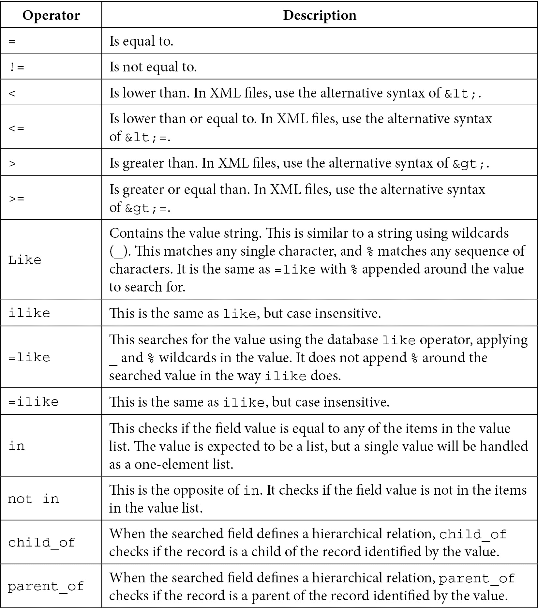

# *第七章*：记录集 – 与模型数据交互

在前面的章节中，我们概述了模型创建和将数据加载到模型中的过程。现在我们已经有了数据模型和一些可以操作的数据，是时候学习如何以编程方式与之交互了。

一个商业应用程序需要业务逻辑来计算数据、执行验证或自动化操作。**Odoo** 框架 API 为开发者提供了实现这种业务逻辑的工具。大多数情况下，这意味着查询、转换和写入数据。

Odoo 在底层数据库之上实现了一个 **对象关系映射**（**ORM**）层。ORM 对象提供了 **应用程序编程接口**（**API**），用于与数据交互。此 API 提供了执行环境和创建 **记录集**，这些是用于操作数据库中存储的数据的对象。

本章解释了如何使用执行环境和记录集，以便你拥有实现业务流程所需的所有工具。

在本章中，我们将涵盖以下主题：

+   使用 shell 命令交互式探索 ORM API

+   理解执行环境和上下文

+   使用记录集和域查询数据

+   访问记录集中的数据

+   向记录写入

+   与日期和时间交互

+   与记录集交互

+   事务和低级 SQL

到本章结束时，你应该能够使用 Odoo 代码执行所有这些操作，并且你也将准备好使用这些工具来实现你自己的业务流程。

# 技术要求

本章中的代码示例将在交互式 shell 中执行，不需要前几章中的任何代码。代码的副本可以在 `ch07/ch07_recorsets_code.py` 文件中找到。

# 使用 shell 命令

`shell` 命令选项。这些命令可以交互式执行，以更好地理解它们的工作方式。

要使用它，请在启动 Odoo 时添加 `shell` 命令以及我们通常在启动 Odoo 时使用的任何 Odoo 选项：

```py
(env15) $ odoo shell -c library.conf
```

这将在终端中启动通常的服务器启动序列，但不会启动一个监听请求的 HTTP 服务器，而是启动一个等待输入的 Python 提示符。

这个交互式命令接口模拟了在 `class` 方法内部找到的环境，在 `OdooBot` 超级用户下运行。`self` 变量可用，并设置为 `OdooBot` 超级用户记录对象。

例如，以下命令检查 `self` 记录集：

```py
>>> self
res.users(1,)
>>> self._name
'res.users'
>>> self.name
'OdooBot'
>>> self.login
'__system__'
```

之前的命令打印出以下内容：

+   `self` 变量包含一个 `res.users` 记录集，其中包含一个 `ID 1` 的记录。

+   检查 `self._name` 的记录集模型名称是 `res.users`，正如预期的那样。

+   记录字段 `name` 的值为 `OdooBot`。

+   记录字段 `login` 的值为 `__system__`。

    Odoo 12 的变化

    `ID 1` 超级用户从 `admin` 更改为内部的 `__system__` 用户。`admin` 用户现在是 `ID 2` 用户，不再是超级用户，尽管 Odoo 标准应用程序会小心地自动授予它对它们的完全访问权限。进行这种更改的主要原因是为了避免用户使用超级用户账户执行日常活动。这样做是危险的，因为这种更改绕过了所有访问规则，可能会导致不一致的数据，例如跨公司关系。现在它仅用于故障排除或非常具体的跨公司操作。

与 Python 一样，要退出提示符，请按 *Ctrl* + *D*。这将关闭服务器进程并返回到系统外壳提示符。

我们现在知道了如何启动 Odoo 壳会话。这对于我们探索 Odoo API 功能非常重要。因此，让我们使用它来探索执行环境。

# 执行环境

Odoo 记录集在 **环境** 上下文中操作，提供有关触发操作上下文的相关信息。例如，正在使用的数据库游标、当前 Odoo 用户等。

在模型方法内部运行的 Python 代码可以访问 `self` 记录集变量，并且可以通过 `self.env` 访问局部环境。服务器外壳环境也以类似方式提供 `self` 引用，就像在方法内部找到的那样。

在本节中，我们将了解执行环境提供的属性以及如何使用它们。

## 环境属性

正如我们所见，`self` 是一个记录集。记录集携带环境信息，例如浏览数据的用户和额外的上下文相关信息（例如，活动语言和时间区域）。

可以使用记录集的 `env` 属性访问当前环境，如下例所示：

```py
>>> self.env
<odoo.api.Environment object at 0x7f6882f7df40>
```

在 `self.env` 中的执行环境有以下属性可用：

+   `env.cr` 属性是正在使用的数据库游标。

+   `env.user` 属性是当前用户的记录。

+   `env.uid` 属性是会话用户的 ID。它与 `env.user.id` 相同。

+   `env.context` 属性是一个不可变的字典，包含会话上下文数据。

+   `env.company` 属性是活动公司。

+   `env.companies` 属性是用户允许的公司。

    Odoo 13 的变化

    `env.company` 和 `env.companies` 属性是在 Odoo 13 中引入的。在之前的版本中，此信息是通过使用 `env.user.company_id` 和 `env.user.company_ids` 从用户记录中读取的。

环境还提供了对所有已安装模型可用的注册表的访问权限。例如，`self.env["res.partner"]` 返回对 `partner` 模型的引用。然后我们可以使用 `search()` 或 `browse()` 在其上创建记录集：

```py
>>> self.env["res.partner"].search([("display_name", "like", "Azure")])
res.partner(14, 26, 33, 27)
```

在这个例子中，返回给`res.partner`模型的记录集包含三个记录，ID 分别为`14`、`26`、`33`和`27`。记录集不是按 ID 排序的，因为使用了对应模型的默认顺序。在合作伙伴模型的情况下，默认对象`_order`是`display_name`。

## 环境上下文

`context`对象是一个字典，携带会话数据，可以在客户端用户界面和服务器端 ORM 及业务逻辑中使用。

从客户端来看，它可以携带信息从一个视图传递到下一个视图——例如，在跟随链接或按钮后，上一个视图上活动的记录 ID——或者它可以为下一个视图提供默认值。

在服务器端，某些记录集字段值可以依赖于上下文提供的区域设置。特别是，`lang`键影响可翻译字段的值。

上下文还可以为服务器端代码提供信号。例如，当`active_test`键设置为`False`时，它会改变 ORM `search()`方法的行为，使其不对非活动记录应用自动过滤器，忽略`active`记录字段。

来自 Web 客户端的初始上下文看起来像这样：

```py
>>> self.env.context
{'lang': 'en_US', 'tz': 'Europe/Brussels'}
```

在这里，你可以看到带有用户语言的`lang`键和带有时区信息的`tz`。根据当前上下文，记录中的内容可能不同：

+   翻译字段可以根据活动的`lang`语言有不同的值。

+   日期时间字段在返回给客户端时，可以根据活动的`tz`时区显示不同的时间。

当从一个视图的链接或按钮打开视图时，Web 客户端将自动将一些键添加到上下文中，提供有关我们正在导航的记录的信息：

+   `active_model`是之前的模型名称。

+   `active_id`是用户定位的原始记录的 ID。

+   `active_ids`是在用户从列表视图导航时选择的 ID 列表。

向导助手经常使用这些键来找到他们预期要操作的记录。

可以使用具有这些特定前缀的键来使用上下文设置目标 Web 客户端视图的默认值并激活默认过滤器：

+   添加到字段名称的`default_`前缀为该字段设置默认值。例如，`{'default_user_id': uid}`将当前用户设置为默认值。

+   添加到过滤器名称的`default_search_`前缀将自动启用该过滤器。例如，`{'default_search_filter_my_tasks': 1}`激活名为`filter_my_books`的过滤器。

这些前缀经常用于`<field context="{...}">`元素中。

## 修改记录集执行环境和上下文

记录集执行上下文可以被修改以利用上一节中描述的行为，或者向调用该记录集的方法中添加信息。

可以通过以下方法修改环境和其上下文。这些方法中的每一个都返回一个新的记录集，以及一个带有修改后的环境的原始副本：

+   `<recordset>.with_context(<dictionary>)`方法用提供的字典中的上下文替换上下文。

+   `<recordset>.with_context(key=value, ...)`方法通过在它上设置提供的属性来修改上下文。

+   `<recordset>.sudo([flag=True])`方法启用或禁用超级用户模式，允许它绕过安全规则。上下文用户保持不变。

+   `<recordset>.with_user(<user>)`方法将用户修改为提供的用户，该用户可以是用户记录或 ID 号。

+   `<recordset>.with_company(<company>)`方法将公司修改为提供的公司，该公司可以是公司记录或 ID 号。

+   `<recordset>.with_env(<env>)`方法将记录集的完整环境修改为提供的环境。

    Odoo 13 中的更改

    `with_user()`和`with_company()`方法是在 Odoo 13 中引入的。为了切换用户，旧版本使用`sudo([<user>])`方法，该方法可以提供给特定用户以切换到超级用户上下文。为了切换公司，旧版本使用`with_context(force=company=<id>)`，设置一个在相关业务逻辑中检查的`context`键。

此外，环境对象提供了`env.ref()`函数，它接受一个带有外部标识符的字符串，并返回相应的记录，如下面的示例所示：

```py
>>> self.env.ref('base.user_root')
res.users(1,)
```

如果外部标识符不存在，将引发一个`ValueError`异常。

当在 Odoo 服务器中运行 Python 代码时，我们学习了更多关于执行环境的知识。下一步是与数据交互。在这种情况下，首先要学习的是如何查询数据和创建记录集，这将在下一节中讨论。

# 使用记录集和域查询数据

Odoo 业务逻辑需要从数据库中读取数据以执行基于它的操作。这是通过*记录集*完成的，它查询原始数据并将其暴露为我们可以操作的 Python 对象。

Odoo Python 通常在类方法中运行，其中`self`代表要处理的记录集。在某些情况下，我们需要为其他模型创建记录集。为此，我们应该获取模型的引用，然后查询它以创建记录集。

环境对象，通常可通过`self.env`访问，持有对所有可用模型的引用，并且可以使用类似字典的语法访问它们。例如，要获取`partner`模型的引用，请使用`self.env['res.partner']`或`self.env.get('res.partner')`。然后，可以使用此模型引用创建记录集，正如我们将在下面看到的那样。

## 创建记录集

`search()`方法接受一个域表达式，并返回一个与这些条件匹配的记录集。例如，`[('name', 'like', 'Azure')]`将返回所有包含`name`字段为`Azure`的记录。

如果模型有`active`特殊字段，则默认情况下，只有`active=True`的记录将被考虑。

以下关键字参数也可以使用：

+   `order`关键字是作为数据库查询中的`ORDER BY`子句使用的字符串。这通常是一个字段名的逗号分隔列表。每个字段名后面可以跟`DESC`关键字来表示降序。

+   `limit`关键字设置要检索的最大记录数。

+   `offset`关键字忽略前`n`个结果；它可以与`limit`一起使用，以每次查询记录块。

有时，我们只需要知道满足某些条件的记录数量。为此，我们可以使用`search_count()`，它以更有效的方式返回记录计数而不是记录集。

`browse()`方法接受一个 ID 列表或单个 ID，并返回包含这些记录的记录集。在已知我们想要的记录的 ID 的情况下，这可能是方便的。

例如，要获取所有显示名称中包含`Lumber`的合作伙伴记录，可以使用以下`search()`调用：

```py
>>> self.env['res.partner'].search([('display_name', 'like', 'Lumber')])
res.partner(15, 34)
```

在已知要查询的 ID 的情况下，使用`browse()`调用，如下例所示：

```py
>>> self.env['res.partner'].browse([15, 34]) 
res.partner(15, 34)
```

大多数情况下，ID 是未知的，所以`search()`方法比`browse()`方法使用得更频繁。

要充分利用`search()`，需要对域过滤器语法有良好的理解。因此，我们将在下一节中关注这一点。

## 域表达式

用于查询数据库的`WHERE`表达式。一个`('<field>', '<operator>', <value>)`元组。例如，以下是一个有效的域表达式，包含单个条件：`[('is_done', '=', False)]`。没有条件的域表达式也是允许的。这翻译为一个空列表（`[]`），结果是返回所有记录的查询。

实际上，域有两个可能的评估上下文：客户端，例如在*窗口操作*和 Web 客户端*视图中*，以及服务器端，例如在安全*记录规则*和模型方法 Python 代码中。在`<field>`和`<value>`元素中可以使用的内容可能取决于评估上下文。

接下来，我们将详细解释域条件中的每个元素：**字段**、**运算符**和**值**。

### 域条件的字段元素

第一个条件元素是一个字符串，包含正在过滤的字段名称。当在服务器端使用域表达式时，字段元素可以使用点符号来访问相关模型的值。例如，我们可以使用类似`'publisher_id.name'`的东西，甚至`'publisher_id.country_id.name'`。

在客户端，不允许使用点符号，只能使用简单的字段名。

小贴士

在需要客户端域表达式中的相关记录值，但点符号无法使用的情况下，解决方案是在模型中通过使用`related=`属性添加一个相关字段。这样，值就可以作为直接可访问的模型字段来访问。

### 域条件运算符元素

第二个条件元素是应用于被过滤字段的运算符。以下是允许的运算符列表：



这些运算符应用于第一个元素提供的字段，使用第三个元素提供的值。例如，`('shipping_address_id', 'child_of', partner_id)`检查评估上下文中的`partner_id`变量并读取其值。数据库在`shipping_address_id`字段上查询，选择那些地址是`partner_id`值中标识的地址的子地址的记录。

### 域条件值元素

第三个元素被评估为 Python 表达式。它可以使用字面值，如数字、布尔值、字符串或列表，并且可以使用评估上下文中可用的字段和标识符。

记录对象不是接受值。相反，应使用相应的 ID 值。例如，不要使用`[('user_id', '=', user)]` - 而应使用`[('user_id', '=', user)]`。

对于记录规则，评估上下文有以下名称可用：

+   `user`: 当前用户的记录（相当于`self.env.user`）。使用`user.id`获取相应的 ID。

+   `company_id`: 活动公司的记录 ID（相当于`self.env.company.id`）。

+   `company_ids`: 允许的公司 ID 列表（相当于`self.env.companies.ids`）。

+   `time`: Python 时间模块，提供日期和时间函数。官方参考可以在[`docs.python.org/3/library/time.html`](https://docs.python.org/3/library/time.html)找到。

    Odoo 13 中的变更

    自 Odoo 13 以来，`company_id`和`company_ids`上下文值可用于记录规则评估，并且不应再使用之前版本的方案，即使用`user.company_id.id`。例如，之前经常使用的`['|', ('company_id', '=', False), ('company_id', 'child_of', [user.company_id.id])]`域现在应写为`[('company_id', 'in', company_ids)]`。

### 在多对多字段上搜索

当搜索字段是*多对多*时，运算符应用于每个字段值，如果任何字段值匹配域条件，则评估的记录将包含在结果中。

`=`和`in`运算符的行为类似于*包含*操作。它们都检查字段值是否与搜索值列表中的任何值匹配。对称地，`!=`和`not in`运算符检查字段值是否与搜索值列表中的任何值都不匹配。

### 使用多个条件组合域表达式

域表达式是一系列项目，可以包含多个条件元组。默认情况下，这些条件将隐式地使用 AND 逻辑运算符组合。这意味着它将只返回满足所有条件的记录。

也可以使用显式逻辑操作符——例如，使用&符号（默认）进行 AND 操作，使用|符号进行 OR 操作。这些将在下一个两个项上操作，以递归方式工作。我们稍后会更详细地讨论这一点。

对于一个稍微正式的定义，域表达式使用前缀表示法，也称为**波兰表示法**（**PN**），其中操作符位于操作数之前。AND 和 OR 操作符是二元操作符，而 NOT 是一元操作符。

感叹号（`!`）代表 NOT 操作符，它作用于后续项。因此，它应该放在要取反的项之前。例如，`['!', ('is_done','=',True)]`表达式将过滤所有*未完成*的记录。

操作符项，例如（`!`）或（`|`），可以嵌套，允许定义`AND`/`OR`/`NOT`复杂条件。让我们用一个例子来说明这一点。

在服务器端记录规则中，我们可以找到类似于这个的域表达式：

```py
['|',
    ('message_follower_ids', 'in', [user.partner_id.id]),
    '|',
        ('user_id', '=', user.id),
        ('user_id', '=', False)
]
```

此域过滤所有记录，其中：

- 当前用户是关注者，或

- 当前用户是记录的责任人（user_id），或

- 记录没有设置责任用户。 

以下图显示了之前域表达式示例的抽象语法树表示：

![图 7.1 – 一个说明组合域表达式的图]

](img/Figure_7.1_B16119.jpg)

图 7.1 – 一个说明组合域表达式的图

第一个`|`（或`OR`）操作符作用于后续条件加上下一个条件的结果。下一个条件又是两个其他条件的并集——记录中用户 ID 设置为当前用户，或者用户 ID 未设置。

### 特殊域条件

对于需要始终为真或始终为假的表达式的场景，也支持一些特殊的域条件。

`(1, "=", 1)`条件代表一个*始终为真*的表达式。它可以用于记录规则，以赋予更高用户组对所有记录的访问权限，这些记录之前由较低用户组限制。例如，它用于`User: All Documents`组，以覆盖继承的`User: Own Documents only`组中的记录访问限制。有关此示例，请参阅 Odoo 源代码中的`addons/sales_team/security/sales_team_security.xml`。

`(0, "=", 1)`条件也得到支持，它代表一个*始终为假*的表达式。

## 按字段和聚合数据分组

有时，我们需要根据数据字段对记录进行分组。Odoo 可以使用`read_group()`方法来完成这项工作。该方法参数如下：

+   `domain`参数是一个包含域表达式以过滤要检索的记录的列表。

+   `fields`参数是一个字段名称列表，以及要应用的聚合函数，格式为`field:aggr`。聚合函数是允许使用`sum`、`avg`、`min`、`max`、`count`和`count_distinct`的函数。例如：`["subtotal:sum"]`。

+   `groupby`参数是一个包含要按其分组的字段名称的列表。

+   `limit`参数是一个可选的最大组数返回数。

+   `offset`参数是一个可选的数字，表示要跳过的记录数。

+   `orderby`参数是一个可选的字符串，包含要应用于结果的*排序*子句（类似于`search()`支持的）。

+   如果将`lazy`参数设置为`True`，则仅按第一个字段分组，并将剩余的分组字段添加到`__context`结果中。此参数默认为`True`，因此将其设置为`False`以立即应用所有*分组字段*。

下面是一个按国家分组伙伴记录并计算找到的不同州数量的示例：

```py
>>> self.env["res.partner"].read_group([("display_name", "like", "Azure")], fields=["state_id:count_distinct",], groupby=["country_id"], lazy=False)
[{'__count': 4, 'state_id': 1, 'country_id': (233, <odoo.tools.func.lazy object at 0x7f197b65fc00>), '__domain': ['&', ('country_id', '=', 233), ('display_name', 'like', 'Azure')]}]
```

这返回了一个包含单个组结果的列表，对应于`233`国家 ID。运行`self.env["res.country"].browse(233).name`，我们可以看到国家是`United Sates`。`__count`键显示在`233`国家 ID 中有`4`个合作伙伴，`state_id`对象显示了`count`不同的聚合结果：这些合作伙伴使用了`1`个不同的州。

我们现在知道了如何创建记录集。接下来，我们希望读取它们中的数据。在许多情况下，这是一个简单的操作，但对于某些字段类型，有一些需要注意的细节。下一节将帮助我们了解这些。

# 访问记录集中的数据

一旦我们有一个记录集，我们希望检查其中包含的数据。因此，在以下章节中，我们将探讨如何访问记录集中的数据。

我们可以获取称为*单例*的个别记录的字段值。关系字段具有特殊属性，我们可以使用点符号遍历链接的记录。最后，我们将讨论在需要处理日期和时间记录并将它们转换为不同格式时的一些考虑因素。

## 访问单个记录数据

当记录集中只有一个记录时，它被称为**单例**。单例仍然是记录集，可以在需要记录集的任何地方使用。

但与多元素记录集不同，单例可以使用点符号访问其字段，如下所示：

```py
>>> print(self.name)
OdooBot
```

在下一个示例中，我们可以看到相同的`self`单例记录集也表现得像一个记录集，我们可以迭代它。它只有一个记录，因此只打印出一个名称：

```py
>>> for rec in self: print(rec.name)
...
OdooBot
```

尝试在包含多个记录的记录集中访问字段值将导致错误，因此这可能在不确定是否正在处理单例记录集的情况下成为一个问题。

小贴士

虽然使用点符号访问字段在多个记录上不会工作，但可以通过将值映射到记录集来批量访问它们。这是通过使用`mapped()`完成的。例如，`rset.mapped("name")`返回一个包含`name`值的列表。

对于仅设计用于与单例一起工作的方法，我们可以在开始时使用`self.ensure_one()`进行检查。如果`self`不是一个单例，它将引发错误。

小贴士

`ensure_one()` 函数如果记录为空也会引发错误。要检查 `rset` 是否有一个或零个记录，你可以使用 `rset or rset.ensure_one()`。

空记录也是一个单例。这很方便，因为访问字段值将返回一个 `None` 值而不是引发错误。这也适用于关系字段，使用点符号访问相关记录不会引发错误。

因此，在实际操作中，在访问字段值之前没有必要检查空记录集。例如，而不是 `if record: print(record.name)`，我们可以安全地写出更简单的 `print(record.name)` 方法。也可以通过使用 `or` 条件提供一个空值的默认值：`print(record.name or '')`。

## 访问关系字段

如我们之前所见，模型可以有关系字段——**多对一**、**一对多**和**多对多**。这些字段类型具有记录集作为值。

在多对一字段的情况下，值可以是单例或空记录集。在这两种情况下，我们可以直接访问它们的字段值。例如，以下指令是正确且安全的：

```py
>>> self.company_id
res.company(1,)
>>> self.company_id.name
'YourCompany'
>>> self.company_id.currency_id
res.currency(1,)
>>> self.company_id.currency_id.name
'EUR'
```

空记录集方便地也表现得像一个单例，访问其字段不会返回错误，而是只返回 `False`。正因为如此，我们可以使用点符号来遍历记录，而不用担心空值引起的错误，如下所示：

```py
>>> self.company_id.parent_id
res.company()
>>> self.company_id.parent_id.name
False
```

## 访问日期和时间值

在记录集中，`date` 和 `datetime` 值被表示为原生的 Python 对象。例如，当我们查找 `admin` 用户的最后登录日期时：

```py
>>> self.browse(2).login_date
datetime.datetime(2021, 11, 2, 16, 47, 57, 327756)
```

由于 `date` 和 `datetime` 值是 Python 对象，它们具有适用于这些对象的所有操作功能。

Odoo 12 的变化

`date` 和 `datetime` 字段值现在表示为 Python 对象，与之前的 Odoo 版本不同，那时 `date` 和 `datetime` 值被表示为文本字符串。这些字段类型值仍然可以使用文本表示来设置，就像之前的 Odoo 版本一样。

日期和时间存储在数据库中为原生的 `datetime` 值，在记录集中看到的也是 UTC。当网络客户端向用户展示时，`datetime` 值会通过使用存储在上下文 `tz` 键中的当前会话时区设置进行转换，例如，`{'tz': 'Europe/Brussels'}`。这种转换是网络客户端的责任，因为服务器没有执行这种转换。

例如，布鲁塞尔（UTC+1）用户输入的 11:00 AM 日期时间值在数据库中存储为 10:00 AM UTC，并被纽约（UTC-4）用户看到为 06:00 AM。Odoo 服务器日志消息的时间戳使用 UTC 时间而不是本地服务器时间。

相反的转换——从会话时区到 UTC——也需要在将用户的 `datetime` 输入发送回服务器时由网络客户端完成。

小贴士

记住，数据库中存储并由服务器代码处理的数据日期和时间始终以协调世界时（UTC）表示。即使是服务器日志消息的时间戳也以 UTC 表示。

我们现在已经回顾了如何访问记录数据的细节。然而，我们的应用程序将为业务流程提供一些自动化，因此不可避免地我们还需要写入记录集。让我们在下一节中详细探讨这一点。

# 写入记录

我们有两种不同的方式来写入记录：使用对象风格的直接赋值或使用`write()`方法。`write()`方法是负责执行写入操作的低级方法，当使用外部 API 或加载 XML 记录时，它仍然被直接使用。对象风格的直接赋值后来被添加到 ORM 模型中。它实现了**活动记录**模式，可以在 Python 代码逻辑中使用。

Odoo 13 的变更

在 Odoo 13 中，ORM 模型引入了一种新的数据库写入方法，称为`flush()`方法，它将自动调用以一次性执行相应的数据库操作。

接下来，我们将探讨这两种方法及其差异。

## 使用对象风格的值赋值

记录集实现了**活动记录模式**。这意味着我们可以向它们分配值，这些更改将持久保存在数据库中。这是一种直观且方便的数据操作方式。

Odoo 13 的变更

从 Odoo 13 开始，支持向包含多个记录的记录集分配值。在 Odoo 12 之前，仅支持写入单个记录的值，并且必须使用`write()`方法来写入多个记录。

这里有一个例子：

```py
>>> root = self.env["res.users"].browse(1)
>>> print(root.name) 
System
>>> root.name = "Superuser"
>>> print(root.name) 
Superuser
```

当使用**活动记录**模式时，可以通过分配记录集来设置关系字段的值。

日期和时间字段可以分配 Python 原生对象或 Odoo 默认格式的字符串表示的值：

```py
>>> from datetime import date
>>> self.date = date(2020, 12, 1)
>>> self.date
datetime.date(2020, 12, 1)
>>> self.date = "2020-12-02"
>>> self.date
datetime.date(2020, 12, 2)
```

二进制字段应分配`base64`编码的值。例如，当从文件中读取原始二进制数据时，该值必须在分配给字段之前使用`base64.b64encode()`进行转换：

```py
>>> import base64
>>> blackdot_binary = b"\x89PNG\r\n\x1a\n\x00\x00\x00\rIHDR\x00\x00\x00\x01\x00\x00\x00\x01\x08\x04\x00\x00\x00\xb5\x1c\x0c\x02\x00\x00\x00\x0bIDATx\xdacd\xf8\x0f\x00\x01\x05\x01\x01'\x18\xe3f\x00\x00\x00\x00IEND\xaeB'\x82"
>>> self.image_1920 = base64.b64encode(blackdot_binary).decode("utf-8")
```

当在多对一字段上分配值时，分配的值必须是一个单一记录（即，一个**单例记录集**）。

对于多对多字段，值也可以使用记录集分配，用新的记录集替换（如果有的话）链接的记录列表。在这里，允许任何大小的记录集。

要在关系字段上设置空值，请使用`None`或`False`：

```py
>>> self.child_ids = None
>>> self.child_ids
res.partner()
```

要在分配的列表中追加或删除记录，请使用记录操作。

例如，想象一家公司记录还有一个相关的合作伙伴记录，用于存储地址详情。假设我们想将当前用户添加为公司子联系人的联系人。这可以通过以下方式完成：

```py
>>> mycompany_partner = self.company_id.partner_id
>>> myaddress = self.partner_id
>>> mycompany_partner.child_ids = mycompany_partner.child_ids | myaddress
```

在这里，管道运算符（`|`）被用来连接记录以获得更大的记录集。

紧凑的追加和赋值运算符（`|=`）可以用于达到相同的效果：

```py
>>> mycompany_partner.child_ids |= myaddress
```

本章后面的 *组合记录集* 部分提供了关于记录操作操作的更多详细信息。

## 使用 `write()` 方法

`write()` 方法也可以用于更新记录中的数据。它接受一个包含要分配的字段名称和值的字典。在某些情况下，例如字典首先准备，然后执行分配，它可能更方便。在 Odoo 的较旧版本（直到 Odoo 12）中，对于无法直接分配的情况，它也很有用。

`write()` 方法接收一个包含字段和要分配的值的字典，并使用这些值更新记录集：

```py
>>> Partner = self.env['res.partner']
>>> recs = Partner.search( [("name", "ilike", "Azure")])
>>> recs.write({"comment": "Hello!"})
True
```

日期和时间字段可以使用相应的 Python 对象的值或使用字符串文本表示来分配，就像使用对象样式赋值一样。

自 Odoo 13 以来，`write()` 可以使用记录集在单对一和多对多关系字段上设置值，就像使用对象样式赋值一样。

Odoo 13 的变化

`write()` 方法可以使用记录集在关系字段上分配值。在 Odoo 12 之前，多对一字段使用 ID 值设置，多对多字段使用特殊语法设置，例如，`(4, <id>, _)` 用于添加记录，`(6, 0, [<ids>])` 用于设置完整的记录列表。此语法在 *第五章* *导入、导出和模块数据* 中有更详细的讨论。

例如，假设我们有两个合作伙伴记录，`address1` 和 `address2`，我们想在 `self.child_ids` 字段上设置它们。

使用 `write()` 方法，我们会这样做：

```py
self.write({ 'child_ids': address1 | address2})
```

另一个选项（适用于 Odoo 13 之前的版本）如下：

```py
self.write({ 'child_ids': [(6, 0, [address1.id, address2.id])]})
```

`write()` 方法用于在现有记录上写入日期。但我们也需要创建和删除记录，我们将在下一节中讨论。

## 创建和删除记录

`create()` 和 `unlink()` 模型方法允许我们分别创建和删除现有记录。

`create()` 方法接受一个包含要创建的记录的字段和值的字典，使用与 `write()` 相同的语法。默认值会自动应用，正如本例所示：

```py
>>> Partner = self.env['res.partner']
>>> new = Partner.create({'name': 'ACME', 'is_company': True})
>>> print(new)
res.partner(59,)
```

`unlink()` 方法删除记录集中的记录，如下例所示：

```py
>>> rec = Partner.search([('name', '=', 'ACME')])
>>> rec.unlink()
2021-11-15 18:40:10,090 3756 INFO library odoo.models.unlink: User #1 deleted mail.message records with IDs: [20]
2021-11-15 18:40:10,146 3756 INFO library odoo.models.unlink: User #1 deleted res.partner records with IDs: [59]
2021-11-15 18:40:10,160 3756 INFO library odoo.models.unlink: User #1 deleted mail.followers records with IDs: [9]
True
```

`unlink()` 方法返回一个 `True` 值。此外，在 `delete` 操作期间，它会触发日志消息，通知相关记录的级联删除，例如聊天消息和关注者。

创建记录的另一种方法是复制现有的一个。为此，可以使用 `copy()` 模型方法。它接受一个可选的字典参数，其中包含在创建新记录时覆盖的值。

例如，要从 `demo` 用户创建一个新用户，我们可以使用以下方法：

```py
>>> demo = self.env.ref("base.user_demo")
>>> new = demo.copy({"name": "John", "login": "john@example.com"})
```

带有 `copy=False` 属性的字段不会自动复制。多对多关系字段默认禁用此标志，因此它们不会复制。

在前面的章节中，我们已经学习了如何在记录集中访问数据以及如何创建和写入记录集。然而，有一些字段类型值得更多关注。在下一节中，我们将讨论处理日期和时间字段的具体技术。

# 与日期和时间字段一起工作

在*访问记录集中的数据*部分，我们看到了如何从记录中读取日期和时间值。通常还需要执行日期计算以及将日期在它们的本地格式和字符串表示之间进行转换。在这里，我们将了解如何执行这些类型的操作。

Odoo 提供了一些有用的函数来创建新的日期和时间对象。

`odoo.fields.Date`对象提供以下辅助函数：

+   `fields.Date.today()`函数返回一个字符串，其中包含服务器期望的当前日期格式，使用 UTC 作为参考。这足以计算默认值。它可以直接在日期字段定义中使用`default=fields.Date.today`。

+   `fields.Date.context_today(record, timestamp=None)`函数返回一个字符串，其中包含会话上下文中的当前日期。时区值取自记录的上下文。可选的`timestamp`参数是一个`datetime`对象，如果提供，将使用它而不是当前时间。

`odoo.fields.Datetime`对象提供以下日期时间创建函数：

+   `fields.Datetime.now()`函数返回一个字符串，其中包含服务器期望的当前`datetime`格式，使用 UTC 作为参考。这足以计算默认值。它可以直接在`datetime`字段定义中使用`default=fields.Datetime.now`。

+   `fields.Datetime.context_timestamp(record, timestamp)`函数将一个无知的`datetime`值（没有时区）转换为时区感知的`datetime`值。时区是从记录的上下文中提取的，因此函数名为`context_timestamp`。

## 添加和减去时间

日期对象可以进行比较和减法，以找到两个日期之间的时间差。这个时间差是一个`timedelta`对象。`timedelta`对象可以添加到或从`date`和`datetime`对象中减去，执行日期算术。

这些对象由 Python 标准库`datetime`模块提供。以下是我们可以用它们进行的必要操作的示例：

```py
>>> from datetime import date
>>> date.today()
datetime.date(2021, 11, 3)
>>> from datetime import timedelta
>>> date(2021, 11, 3) + timedelta(days=7)
datetime.date(2021, 11, 10)
```

`date`、`datetime`和`timedelta`数据类型的完整参考可以在[`docs.python.org/3/library/datetime.html`](https://docs.python.org/3/library/datetime.html)找到。

`timedelta`对象支持周、天、小时、秒等。但它不支持年或月。

要使用月份或年来执行日期算术，我们应该使用`relativedelta`对象。以下是一个添加一年一个月的示例：

```py
>>> from dateutil.relativedelta import relativedelta
>>> date(2021, 11, 3) + relativedelta(years=1, months=1)
datetime.date(2022, 12, 3)
```

`relativedelta`对象支持高级日期算术，包括闰年和复活节计算。有关它的文档可以在[`dateutil.readthedocs.io`](https://dateutil.readthedocs.io)找到。

Odoo 还在 `odoo.tools.date_utils` 模块中提供了一些额外的函数：

+   `start_of(value, granularity)` 函数返回具有指定粒度的时间段的开始，这是一个字符串值，可以是 `year`、`quarter`、`month`、`week`、`day` 或 `hour`。

+   `end_of(value, granularity)` 函数返回具有指定粒度的时间段的结束。

+   `add(value, **kwargs)` 函数向给定值添加时间间隔。`**kwargs` 参数应由 `relativedelta` 对象使用来定义时间间隔。这些参数可以是 `years`、`months`、`weeks`、`days`、`hours`、`minutes` 等。

+   `subtract(value, **kwargs)` 函数从给定值中减去时间间隔。

这些实用函数也暴露在 `odoo.fields.Date` 和 `odoo.fields.Datetime` 对象中。

这里有一些使用先前函数的示例：

```py
>>> from odoo.tools import date_utils
>>> from datetime import datetime
>>> now = datetime(2020, 11, 3, 0, 0, 0)
>>> date_utils.start_of(now, 'week')
datetime.datetime(2020, 11, 2, 0, 0)
>>> date_utils.end_of(now, 'week')
datetime.datetime(2020, 11, 8, 23, 59, 59, 999999)
>>> today = date(2020, 11, 3)
>>> date_utils.add(today, months=2)
datetime.date(2021, 1, 3)
>>> date_utils.subtract(today, months=2)
datetime.date(2020, 9, 3)
```

## 将日期和时间对象转换为文本表示

有时会需要将 Python `date` 对象转换为文本表示。这可能需要，例如，准备用户消息或格式化数据以发送到另一个系统。

Odoo 字段对象提供辅助函数，用于将原生 Python 对象转换为字符串表示形式：

+   `fields.Date.to_string(value)` 函数将 `date` 对象转换为 Odoo 服务器期望的格式字符串。

+   `fields.Datetime.to_string(value)` 函数将 `datetime` 对象转换为 Odoo 服务器期望的格式字符串。

这些使用 Odoo 服务器预定义的默认值，这些默认值在以下常量中定义：

+   `odoo.tools.DEFAULT_SERVER_DATE_FORMAT`

+   `odoo.tools.DEFAULT_SERVER_DATETIME_FORMAT`

这些分别对应于 `%Y-%m-%d` 和 `%Y-%m-%d %H:%M:%S`。

`date.strftime` 和 `datetime.strftime` 函数接受一个格式字符串参数，可用于其他转换为文本。

例如，考虑以下内容：

```py
>>> from datetime import date
>>> date(2020, 11, 3).strftime("%d/%m/%Y")
'03/11/2020'
```

可用格式代码的更多详细信息可以在 [`docs.python.org/3/library/datetime.html#strftime-and-strptime-behavior`](https://docs.python.org/3/library/datetime.html#strftime-and-strptime-behavior) 找到。

## 转换表示为文本的日期和时间

有时日期以文本字符串的格式到达，需要将其转换为 Python `date` 或 `datetime` 对象。在 Odoo 11 之前，这通常是必需的，其中存储的日期被读取为文本表示。提供了一些工具来帮助将文本转换为原生数据类型，然后再将其转换回文本。

为了便于在格式之间进行转换，`fields.Date` 和 `fields.Datetime` 对象提供这些函数：

+   `fields.Date.to_date` 函数将字符串转换为 `date` 对象。

+   `fields.Datetime.to_datetime(value)` 函数将字符串转换为 `datetime` 对象。

`to_datetime` 函数的一个使用示例如下：

```py
>>> from odoo import fields
>>> fields.Datetime.to_datetime("2020-11-21 23:11:55")
datetime.datetime(2020, 11, 21, 23, 11, 55)
```

上述示例使用 Odoo 内部日期格式解析提供的字符串，并将其转换为 Python `datetime`对象。

对于其他日期和时间格式，可以使用`date`和`datetime`对象的`strptime`方法：

```py
>>> from datetime import datetime
>>> datetime.strptime("03/11/2020", "%d/%m/%Y")
datetime.datetime(2020, 11, 3, 0, 0)
```

在大多数情况下，文本表示的时间不会在 UTC 中，正如 Odoo 服务器所期望的那样。在将其存储在 Odoo 数据库之前，必须将时间转换为 UTC。

例如，如果用户位于欧洲/布鲁塞尔时区（UTC+1 小时），则`2020-12-01 00:30:00`的用户时间应存储为 UTC 的`2020-11-30 23:30:00`。以下是实现此功能的代码示例：

```py
>>> from datetime import datetime
>>> import pytz
>>> naive_date = datetime(2020, 12, 1, 0, 30, 0)
>>> client_tz = self.env.context["tz"]
>>> client_date = pytz.timezone(client_tz).localize(naive_date)
>>> utc_date = client_date.astimezone(pytz.utc)
>>> print(utc_date)
2020-11-30 23:30:00+00:00
```

此代码从上下文中获取用户时区名称，然后使用它将原始日期转换为时区感知的日期。最后一步是通过使用`astimezone(pytz.utc)`将客户端时区日期转换为 UTC 日期。

我们现在已经学习了在 Odoo 中处理日期和时间的具体技术。还有专门的技术用于处理记录集和存储在关系字段中的值，我们将在下一节中讨论这些技术。

# 与记录集一起工作

**记录集**是一组记录，Python 业务逻辑经常需要使用它们。可以在记录集上执行几种操作，例如映射和过滤。我们还可以通过添加或删除记录来组合新的记录集。其他常见操作包括检查记录集的内容，以检查特定记录是否存在，例如。

Odoo 10 的变化

自 Odoo 10 以来，记录集操作保留了记录顺序。这与之前的 Odoo 版本不同，在之前的版本中，记录集操作不保证保留记录顺序，尽管添加和切片保持了记录顺序。

## 记录集操作

记录集有一些可用的函数，可以执行对它们有用的操作，例如**排序**或**过滤记录**。

这些是支持的函数和属性：

+   `recordset.ids` 属性返回一个包含记录集元素 ID 的列表。

+   `recordset.ensure_one()` 函数检查它是否是单个记录（即单例）；如果不是，将引发`ValueError`异常。

+   `recordset.filtered(<函数或字符串>)` 函数返回一个过滤后的记录集，这是一个测试函数，用于过滤记录。参数也可以是一个包含点分隔的字段序列的字符串。评估为真值（truthy value）的记录将被选中。

+   `recordset.mapped(<函数或字符串>)` 函数返回一个值列表，并为每条记录返回一个值。参数也可以是一个包含点分隔的字段序列的字符串，用于评估以到达要返回的字段。在字段序列中，多对一关系是安全使用的。

+   `recordset.sorted(<function ot str>)` 函数返回具有特定元素顺序的记录集。该函数为每个记录返回一个值，这些值用于对记录集进行排序。参数可以是一个字符串，包含要排序的字段名称。请注意，不允许使用字段名称的点表示法序列。还有一个可选的 `reverse=True` 参数。

这里是这些函数的一些使用示例：

```py
>>> rs0 = self.env["res.partner"].search([("display_name", "like", "Azure")])
>>> len(rs0)  # how many records?
4
>>> rs0.filtered(lambda r: r.name.startswith("Nicole"))
res.partner(27,)
>>> rs0.filtered("is_company")
res.partner(14,)
>>> rs0.mapped("name")
['Azure Interior', 'Brandon Freeman', 'Colleen Diaz', 'Nicole Ford']
>>> rs0.sorted("name", reverse=True).mapped("name")
['Nicole Ford', 'Colleen Diaz', 'Brandon Freeman', 'Azure Interior']
>>> rs0.mapped(lambda r: (r.id, r.name))
[(14, 'Azure Interior'), (26, 'Brandon Freeman'), (33, 'Colleen Diaz'), (27, 'Nicole Ford')]
```

## 记录集的组合

记录集是不可变的，这意味着它们的值不能直接修改。相反，我们可以根据现有的记录集组合一个新的记录集。**切片表示法**，通常与 Python 列表一起使用，可以用于记录集以提取记录的子集。以下是一些示例：

+   `rs[0]` 和 `rs[-1]` 分别检索第一个元素和最后一个元素。

+   `rs[1:]` 结果是一个不包含第一个元素的记录集副本。

+   `rs[:1]` 返回记录集的第一个元素。

    小贴士

    为了安全地检索记录集的第一个元素，请使用 `rs[:1]` 而不是 `rs[0]`。后者如果 `rs` 为空，将导致错误，而前者在这种情况下将只返回一个空记录集。另一种选择是使用 `odoo.fields` 模块中的 `first()` 函数：`fields.first(rs)`。

记录集还支持以下集合操作：

+   `rs1 | rs2` 操作是一个**并集**集操作，结果是一个包含两个记录集中所有元素的记录集。这是一个类似集合的操作，不会导致重复元素。

+   例如，`self.env.user | self.env.user` 返回一个记录，例如 `res.users(1,)`。

+   `rs1 & rs2` 操作是一个**交集**集操作，结果是一个只包含两个记录集中都存在的元素的记录集。

+   `rs1 - rs2` 操作是一个**差集**操作，结果是一个不包含在 `rs2` 中的 `rs1` 元素的记录集。

    小贴士

    记录集也支持加法操作（`+`），但是应该避免使用。它与并集操作（`|`）的行为不同，并允许记录集中有重复的元素。然而，这很少是我们想要的。例如，`self.env.user + self.env.user` 返回两个记录，例如 `res.users(1, 1)`。

我们可以直接使用值赋值来使用这些操作，以获得更短的表示法：

+   `self.author_ids |= author1` 操作如果 `author1` 记录不在记录集中，则添加该记录。

+   `self.author_ids &= author1` 操作仅保留也存在于 `author1` 记录集中的记录。

+   `self.author_ids -= author1` 操作如果 `author1` 记录存在于记录集中，则删除该特定 `author1` 记录。

## 记录集累积

在某些情况下，我们希望遍历一些逻辑并累积循环每次迭代的记录。使用 ORM 累积记录集的方法是从一个空记录集开始，然后向其中添加记录。要获取一个空记录集，创建对模型的引用。例如，考虑以下内容：

```py
Partner = self.env["res.partner"]
recs = self.env["res.partner"]
for i in range(3):
    rec = Partner.create({"name": "Partner %s" % i})
    recs |= rec
```

之前的代码循环三次，在每次循环中，在将记录累积到 `recs` 记录集之前，都会创建一个新的合作伙伴记录。由于它是一个记录集，`recs` 变量可以在需要记录集的情况下使用，例如，将值分配给多对一字段。

然而，累积记录集不是时间效率高的操作，应该避免在循环中使用。原因在于 Odoo 记录集是不可变对象，对记录集的任何操作都意味着复制它以获取修改后的版本。当向记录集中追加记录时，原始记录集不会被修改。相反，会创建一个带有追加记录的它的副本。这种复制操作消耗时间，记录集越大，所需时间越长。

因此，应该考虑其他替代方案。对于前面的例子，我们可以在 Python 列表中累积所有记录的数据字典，然后通过单个 `create()` 调用创建所有记录。这是可能的，因为 `create()` 方法可以接受字典列表。

因此，循环可能看起来像这样：

```py
values = []
for i in range(3):
    value = {"name": "Partner %s" % i}
    values.append(value)
recs = self.env["res.partner"].create(values)
```

然而，这个解决方案并不适用于所有情况。另一种选择是使用 Python 列表来累积记录。Python 列表是可变对象，对于它们来说，追加元素是一个高效的操作。由于 Python 列表实际上不是记录集，因此这个选项不能用于需要记录集的地方，例如，对一个多对一字段进行赋值。

以下是将记录累积到 Python 列表的示例：

```py
Partner = self.env["res.partner"]
recs = []
for i in range(3):
    rec = Partner.create({"name": "Partner %s" % i})
    recs.append(new_rec)
```

之前的例子说明了在循环中可以使用的几种技术，用于从单个元素构建记录集。然而，有许多情况下循环不是严格必要的，`mapped()` 和 `filtered()` 等操作可以提供更有效的方法来实现目标。

## 记录集比较

有时候，我们需要比较记录集的内容以决定需要采取的进一步行动。记录集支持预期的比较操作。

要检查 `<rec>` 记录是否是 `<my_recordset>` 记录集中的元素，可以使用以下代码：

+   `<rec> in <my_recordset>`

+   `<rec> not in <my_recordset>`

记录集也可以进行比较，以检查一个是否包含在另一个中。要比较两个记录集，使用 `set1` 和 `set2`：

+   使用 `set1 <= set2` 和 `set1 < set2` 返回 `True`，如果 `set1` 中的所有元素也都在 `set2` 中。如果两个记录集具有相同的元素，`<` 操作符返回 `False`。

+   使用 `set1 >= set2` 和 `set1 > set2` 返回 `True`，如果 `set2` 中的所有元素也都在 `set1` 中。如果两个记录集具有相同的元素，`>` 操作符返回 `False`。

# 事务和低级 SQL

从客户端调用的 ORM 方法在*事务*中运行。事务确保在并发写入或失败的情况下正确性。在事务期间，使用的数据记录被锁定，保护它们免受其他并发事务的影响，并确保它们不会被意外更改。在发生故障的情况下，所有事务更改都会回滚，返回到初始状态。

事务支持由 PostgreSQL 数据库提供。当从客户端调用 ORM 方法时，会启动一个新的事务。如果在方法执行期间发生错误，所做的任何更改都会被撤销。如果方法执行完成后没有错误，则所做的更改会被提交，使其生效并对所有其他事务可见。

这会自动为我们处理，我们通常不需要担心。然而，在某些高级用例中，可能需要控制当前事务。

Odoo 13 的变化

自 Odoo 13 以来，数据库写入操作不是在方法运行时执行的。相反，它们累积在内存缓存中，实际的数据库写入被延迟到方法执行的末尾，这是通过在这一点上自动调用的`flush()`调用来完成的。

## 控制数据库事务

有一些情况下，控制事务可能是有用的，可以使用`self.env.cr`数据库游标来实现这一点。一个例子是遍历记录并对每个记录执行操作，我们希望跳过有操作错误的那些，而不影响其他记录。

为了这个，对象提供了以下：

+   `self.env.cr.commit()`提交事务的缓冲写入操作，使它们在数据库中生效。

+   `self.env.cr.rollback()`取消自上次提交以来的事务`write`操作，如果没有提交，则取消所有操作。

    小贴士

    Odoo `shell`会话模拟方法执行上下文。这意味着数据库写入不会在`self.env.cr.commit()`被调用之前执行。

## 执行原始 SQL

可以通过使用游标`execute()`方法直接在数据库中运行 SQL。这需要一个要运行的 SQL 语句的字符串和一个作为 SQL 参数值的第二个可选参数。

值参数可以是一个元组或一个字典。当使用元组时，参数被替换为`%s`，而当使用字典时，它们被替换为`%(<name>)s`。以下是两种方法的示例：

```py
>>> self.env.cr.execute("SELECT id, login FROM res_users WHERE login=%s OR id=%s", ("demo", 1))
>>> self.env.cr.execute("SELECT id, login FROM res_users WHERE login=%(login)s OR id=%(id)s", {"login": "demo", "id": 1})
```

之前的任何指令都会运行 SQL，替换参数并准备一个需要检索结果的游标。更多详情可以在`psycopg2`文档的[`www.psycopg.org/docs/usage.html#query-parameters`](https://www.psycopg.org/docs/usage.html#query-parameters)中找到。

注意！

使用 `cr.execute()` 时，我们不应直接通过连接参数来组合 SQL 查询。这样做是已知的，存在安全风险，可能会被 SQL 注入攻击利用。始终使用 `%s` 占位符与第二个参数一起传递值。

要获取结果，可以使用 `fetchall()` 函数，返回行的 `元组`：

```py
>>> self.env.cr.fetchall()
[(6, 'demo'), (1, '__system__')]
```

`dictfetchall()` 函数也可以用来检索记录作为字典：

```py
>>> self.env.cr.dictfetchall()
[{'id': 6, 'login': 'demo'}, {'id': 1, 'login': '__system__'}]
```

提示

`self.env.cr` 数据库游标对象是围绕 PostgreSQL 库 `psycopg2` 的 Odoo 特定包装器。这意味着 `psycopg2` 文档对于理解如何完全使用该对象是有帮助的：

[`www.psycopg.org/docs/cursor.html`](https://www.psycopg.org/docs/cursor.html)

还可以运行 `UPDATE` 和 `INSERT`。Odoo 环境依赖于数据缓存，当执行这些 DML 指令时，可能与数据库不一致。因此，在运行原始 DML 后，应使用 `self.env.cache.invalidate(fnames=None, ids=None)` 来使环境缓存失效。

`fnames` 是一个包含要使无效和刷新的字段名称的列表。如果没有提供，则所有字段都将使无效。

`ids` 是一个包含要使无效和刷新的记录 ID 的列表。如果没有提供，则所有记录都将使无效。

注意！

直接在数据库中执行 SQL 语句绕过了 ORM 验证和依赖，可能导致数据不一致。只有在你确定自己在做什么的情况下才应使用它。

# 摘要

在本章中，我们学习了如何使用模型数据来执行 **CRUD** 操作——即 **创建**、**读取**、**更新** 和 **删除** 数据——以及使用和操作 *记录集* 所需的所有技术。这为我们实现业务逻辑和自动化代码提供了所需的基础。

要实验 ORM API，我们使用了 Odoo 交互式外壳。我们在通过 `self.env` 访问的环境中运行我们的命令。该环境类似于模型方法中提供的环境，因此它是一个探索 Odoo API 的有用游乐场。

环境允许我们从任何作为记录集提供的 Odoo 模型中查询数据。我们学习了创建记录集的不同方法，然后是如何读取提供的数据，包括日期、二进制值和关系字段等特殊数据类型。

Odoo 的另一个基本功能是写回数据。在本章中，我们还学习了如何创建新记录、写入现有记录以及删除记录。

我们还通过使用 Python 内置工具和 Odoo 框架中包含的一些辅助函数，研究了如何处理日期和时间值。

记录集可以被操作以添加元素、过滤记录、重新排序或累积值，以及比较它们或检查特定记录的包含情况。在实现业务逻辑时，可能需要这些操作中的任何一个，本章介绍了实现所有这些操作的基本技术。

最后，在某些情况下，我们可能需要跳过使用 ORM 模型，并使用低级 SQL 操作直接访问数据库或对事务有更精细的控制。这些操作允许我们解决偶尔出现的 ORM 模型不是最佳工具的情况。

在掌握所有这些工具后，我们为下一章做好了准备，下一章我们将为我们的模型添加业务逻辑层，并实现使用 ORM API 来自动化操作的模式方法。

# 进一步阅读

官方 Odoo 文档中的记录集信息可以在[`www.odoo.com/documentation/15.0/developer/reference/backend/orm.html`](https://www.odoo.com/documentation/15.0/developer/reference/backend/orm.html)找到。
