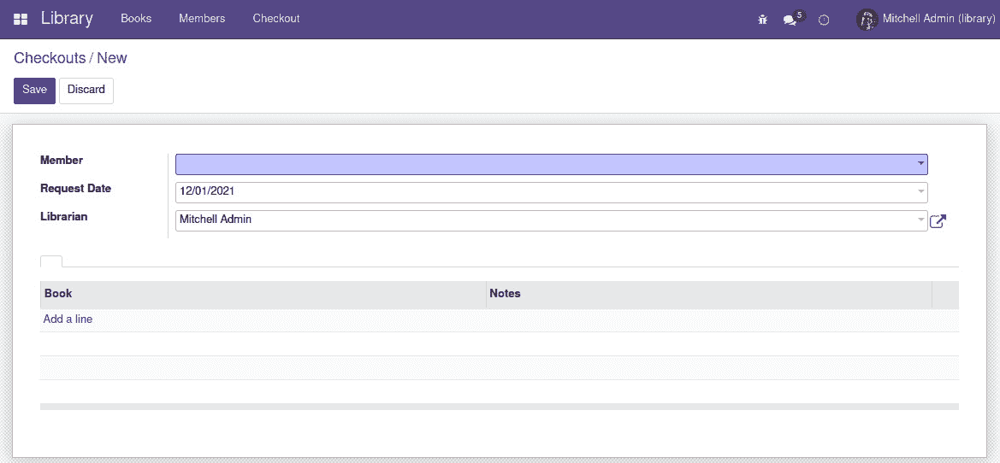
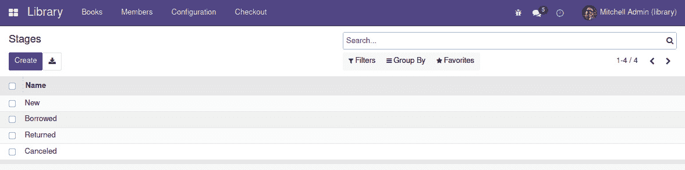
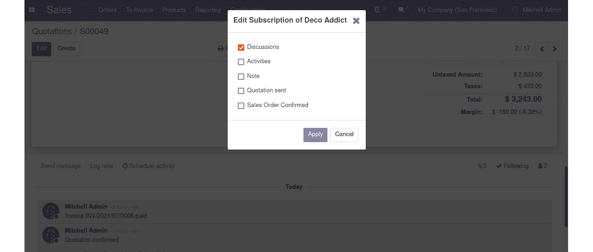
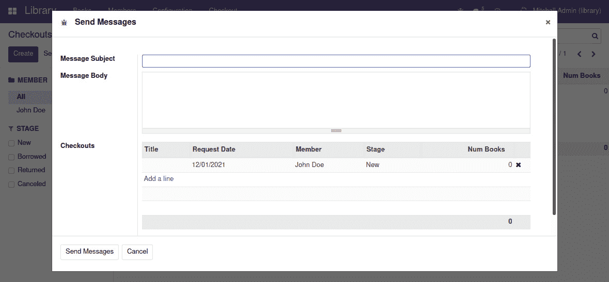

# 第六章：*第八章*：业务逻辑 - 支持业务流程

在前面的章节中，我们学习了如何使用模型来构建应用程序数据结构，然后如何使用 ORM API 和记录集探索和交互数据。

在本章中，我们将把这些内容结合起来实现应用程序中常见的业务逻辑模式。我们将了解业务逻辑可以触发的几种方式，以及一些常用的支持模式。我们还将了解重要的开发技术，如日志记录、调试和测试。

本章我们将讨论以下主题：

+   学习项目 - 书籍借阅模块

+   触发业务逻辑的方法

+   理解 ORM 方法装饰器用于记录集

+   探索有用的数据模型模式

+   使用 ORM 内置方法

+   添加 onchange 用户界面逻辑

+   消息和活动功能

+   创建向导

+   抛出异常

+   编写单元测试

+   使用日志消息

+   了解可用的开发者工具

到本章结束时，你应该对设计和实现业务逻辑自动化充满信心，并知道如何测试和调试你的代码。

# 技术要求

在本章中，我们将创建一个新的`library_checkout`附加模块。它依赖于我们在前几章中创建的`library_app`和`library_member`附加模块。

这些附加模块的代码可以在本书的 GitHub 仓库中找到，在[`github.com/PacktPublishing/Odoo-15-Development-Essentials-Fifth-Edition`](https://github.com/PacktPublishing/Odoo-15-Development-Essentials-Fifth-Edition)的`ch08`目录下。

这两个附加模块需要在 Odoo 附加模块路径中可用，以便它们可以被安装和使用。

# 学习项目 - 书籍借阅模块

图书馆应用程序的主数据结构已经就绪。现在，我们希望向我们的系统中添加交易。我们希望图书馆会员能够借阅书籍。这意味着我们应该跟踪书籍的可用性和归还情况。

每本书的借阅都有一个生命周期，从它们被创建的那一刻到书籍归还的那一刻。这是一个简单的流程，可以用看板（Kanban）板表示，其中几个阶段作为列呈现，来自左侧列的工作项被发送到右侧直到完成。

本章重点介绍支持此功能所需的数据模型和业务逻辑。

基本用户界面将在*第十章*，“后端视图 - 设计用户界面”中进行讨论，而看板视图将在*第十一章*，“看板视图和客户端 QWeb”中进行讨论。让我们快速了解一下数据模型。

## 准备数据模型

我们必须做的第一件事是为书籍借阅功能规划所需的数据模型。

**图书借阅**模型应具有以下字段：

+   **图书馆会员**借阅图书（必需）

+   **借阅日期**（默认为今天）

+   **负责人**（默认为当前用户）负责结账

+   **借阅条目**，请求的图书（一个或多个）

为了支持图书借阅生命周期，我们还将有以下内容：

+   **请求阶段**—草稿、开放、借出、归还或取消

+   **到期日期**，图书应归还的日期

+   **归还日期**，图书归还的日期

我们将首先创建新的`library_checkout`模块并实现图书馆借阅模型的初始版本。与前面的章节相比，这不会引入任何新内容，但将为构建本章相关功能提供基础。

## 创建模块

`library_checkout`模块需要创建，类似于我们在前面的章节中所做的那样。按照以下步骤进行操作：

1.  在与图书馆项目其他附加模块相同的目录中创建一个新的`library_checkout`目录。以下文件应添加到此目录。

1.  添加`__manifest__.py`文件并确保其包含以下内容：

    ```py
    { "name": "Library Book Checkout",
      "description": "Members can borrow books from the 
        library.",
      "author": "Daniel Reis",
      "depends": ["library_member"],
      "data": [
        "security/ir.model.access.csv",
        "views/library_menu.xml",
        "views/checkout_view.xml",
      ],
    }
    ```

1.  添加主`__init__.py`文件，包含以下代码行：

    ```py
    from . import models
    ```

1.  添加`models/__init__.py`文件，包含以下代码行：

    ```py
    from . import library_checkout
    ```

1.  添加模型定义文件，`models/library_checkout.py`，如下所示：

    ```py
    from odoo import fields, models
    class Checkout(models.Model):
        _name = "library.checkout"
        _description = "Checkout Request"
        member_id = fields.Many2one(
            "library.member",
            required=True,
        )
        user_id = fields.Many2one(
            "res.users",
            "Librarian",
            default=lambda s: s.env.user,
        )
        request_date = fields.Date(
            default=lambda s: fields.Date.today(),
        )
    ```

接下来，我们应该添加数据文件，包括访问规则、菜单项和一些基本视图，以便模块可以使用。

1.  将访问安全配置添加到`security/ir.model.access.csv`文件中：

    ```py
    id,name,model_id:id,group_id:id,perm_read,perm_write,perm_create,perm_unlink
    checkout_user,Checkout User,model_library_checkout,library_app.library_group_user,1,1,1,1
    ```

1.  接下来，需要添加`views/library_menu.xml`文件以实现菜单项：

    ```py
    <odoo>
      <record id="action_library_checkout" 
              model="ir.actions.act_window">
        <field name="name">Checkouts</field>
        <field name="res_model">library.checkout</field>
        <field name="view_mode">tree,form</field>
      </record>
      <menuitem id="menu_library_checkout"
                name="Checkout"
                action="action_library_checkout"
                parent="library_app.menu_library"
      />
    </odoo>
    ```

1.  视图在`views/checkout_view.xml`文件中实现：

    ```py
    <odoo>
      <record id="view_tree_checkout" model="ir.ui.view">
        <field name="name">Checkout Tree</field>
        <field name="model">library.checkout</field>
        <field name="arch" type="xml">
            <tree>
                <field name="request_date" />
                <field name="member_id" />
            </tree>
        </field>
      </record>
      <record id="view_form_checkout" model="ir.ui.view">
        <field name="name">Checkout Form</field>
        <field name="model">library.checkout</field>
        <field name="arch" type="xml">
          <form>
            <sheet>
              <group>
                <field name="member_id" />
                <field name="request_date" />
                <field name="user_id" />
              </group>
            </sheet>
          </form>
        </field>
      </record>
    </odoo>
    ```

现在模块包含上述文件后，可以在我们的开发数据库中安装：


图 8.1 – 初始图书馆借阅功能

现在，我们可以开始添加更多有趣的功能。

在整个项目中，我们将向不同位置添加业务逻辑片段，以展示 Odoo 提供的多种可能性。下一节将讨论这些选项。

# 探索触发业务逻辑的方法

一旦数据模型就绪，就需要业务逻辑来执行一些自动操作。业务逻辑可以由用户直接启动，例如通过按钮点击，或者当发生事件时自动触发，例如在记录上写入。

这部分业务逻辑将涉及对记录集的读取和写入。这些细节和技术在*第七章*，*记录集 – 与模型数据交互*中进行了讨论，我们提供了实际业务逻辑实现所需的工具。

下一个问题是如何触发业务逻辑。这取决于何时以及为什么应该触发业务逻辑。以下是几个选项的总结。

一些业务逻辑与模型字段定义紧密相关。以下是一些与模型定义相关的业务逻辑实例：

+   `@api.constrains`。

+   `@api.depends` 和分配给 `compute` 字段属性。

+   `@api.model` 和分配给 `default` 字段属性。

这种模型定义逻辑在第六章中进行了详细讨论，*模型 – 结构化应用程序数据*。一些示例可以在*数据模型模式*部分找到。*ORM 方法装饰器对记录集*部分提供了此处提到的几个 ORM 装饰器的回顾。

我们还有与业务工作流相关的 **model event-related business logic**，它可以附加到以下记录相关事件：

+   **创建、写入和解除链接**业务逻辑可以添加到这些事件，在无法使用其他更优雅的方法的情况下。

+   **Onchange** 逻辑可以应用于用户界面视图，以便我们有一些字段值会因其他字段的变化而改变。

对于直接由用户发起的操作，以下选项可用：

+   一个用于调用对象方法的 `button` 视图元素。按钮可以位于看板视图的表单或树中。

+   一个 `server` 动作，可以从菜单项或 `Action` 上下文菜单中访问。

+   一个用于打开向导表单的 `window` 动作，用户可以从其中收集输入，按钮将调用业务逻辑。这允许更丰富的用户交互。

这些技术将在本章中介绍。辅助方法通常会使用 API 装饰器，因此理解不同的可用装饰器很重要。为了清晰起见，下一节提供了它们的概述。

# 理解 ORM 方法装饰器对记录集的影响

方法定义可以由一个 `@` 开头，这将对它应用一个装饰器。这些装饰器为这些方法添加特定的行为，并且根据方法的目的，可以使用不同的装饰器。

## 计算字段和验证方法的装饰器

一些装饰器对验证逻辑和计算字段很有用。它们在此列出：

+   `@api.depends(fld1,...)` 用于计算字段函数，以确定应触发（重新）计算的更改。它必须在计算字段上设置值；否则，将显示错误。

+   `@api.constrains(fld1,...)` 用于模型验证函数，并在提到的任何字段发生变化时进行检查。它不应在数据中写入更改。如果检查失败，应引发异常。

这些内容在*第六章*中进行了详细讨论，*模型 – 结构化应用程序数据*。

另一组装饰器会影响 `self` 记录集的行为，并且当你实现其他类型的业务逻辑时是相关的。

## 影响 self 记录集的装饰器

默认情况下，方法预期作用于由 `self` 的第一个参数提供的记录集。方法代码通常会包含一个 `for` 语句，该语句遍历 `self` 记录集中的每个记录。

Odoo 14 的变化

`@api.multi` 装饰器在 Odoo 14 中已被移除。在之前的 Odoo 版本中，它被用来明确表示被装饰的方法期望在 `self` 参数中有一个记录集。这对于方法来说已经是默认行为，因此它的使用只是为了清晰。`@api.one` 装饰器自 Odoo 9 起已被弃用，并在 Odoo 14 中被移除。它为你处理记录循环，使得方法代码对每个记录只调用一次，并且 `self` 参数始终是一个单例。从 Odoo 14 开始，这两个装饰器都必须从代码中移除，因为它们不再被支持。

在某些情况下，方法预期在类级别上工作，而不是在特定记录上，表现得像 `@api.model`，在这种情况下，`self` 方法参数应该用作模型的引用；它不期望包含记录。

例如，`create()` 方法使用 `@api.model` – 它不期望输入记录，只期望一个值字典，该字典将被用来创建并返回一个记录。用于计算默认值的方法也应该使用 `@api.model` 装饰器。

在我们可以深入到业务逻辑实现之前，我们必须使数据模型更加深入，在这个过程中，提供一些常见数据模型模式的示例。

# 探索有用的数据模型模式

对于表示业务文档的模型，通常需要一些数据结构。这些可以在几个 Odoo 应用程序中看到，例如 **销售订单** 或 **发票**。

一个常见的模式是表头/行数据结构。它将用于结账请求，以便你可以有多个书籍。另一个模式是使用状态或阶段。这两个有区别，我们将在稍后讨论它们并提供一个参考实现。

最后，ORM API 提供了一些与用户界面相关的几个方法。这些方法也将在本节中讨论。

## 使用表头和行模型

表单视图的一个常见需求是拥有表头行数据结构。例如，销售订单包括几个订单项的行。在结账功能的案例中，一个结账请求可以有多个请求行，每个请求行对应一个借出的物品。

使用 Odoo，实现这一点很简单。需要一个表头行表视图的两种模型 – 一个用于文档表头，另一个用于文档行。行模型有一个多对一字段来标识它所属的表头，而表头模型有一个一对多字段列出该文档中的行。

`library_checkout`模块已经添加到结账模型中，因此现在我们想要添加行。按照以下步骤进行操作：

1.  编辑`models/library_checkout.py`文件，为结账行添加多对一字段：

    ```py
        line_ids = fields.One2many(
            "library.checkout.line",
            "checkout_id",
            string="Borrowed Books",
        )
    ```

1.  将新模型的文件添加到`models/__init__.py`中，如下所示：

    ```py
    from . import library_checkout
    from . import library_checkout_line
    ```

1.  接下来，添加声明结账行模型的 Python 文件，`models/library_checkout_line.py`，内容如下：

    ```py
    from odoo import api, exceptions, fields, models
    class CheckoutLine(models.Model):
        _name = "library.checkout.line"
        _description = "Checkout Request Line"
        checkout_id = fields.Many2one(
            "library.checkout",
            required=True,
        )
        book_id = fields.Many2one("library.book", 
          required=True)
        note = fields.Char("Notes")
    ```

1.  我们还必须添加访问安全配置。编辑`security/ir.model.access.csv`文件，并添加以下突出显示的行：

    ```py
    id,name,model_id:id,group_id:id,perm_read,perm_write,perm_create,perm_unlink
    checkout_user,Checkout User,model_library_checkout,library_app.library_group_user,1,1,1,1
    checkout_line_user,Checkout Line User,model_library_checkout,library_app.library_group_user,1,1,1,1
    ```

1.  接下来，我们想要将结账行添加到表单中。我们将将其添加为笔记本小部件的第一页。编辑`views/checkout_view.xml`文件，并在`</sheet>`元素之前添加以下代码：

    ```py
              <notebook>
                <page name="lines">
                  <field name="line_ids">
                    <tree editable="bottom">
                      <field name="book_id" />
                      <field name="note" />
                    </tree>
                  </field>
                </page>
              </notebook>
    ```

结账表单将如下所示：



图 8.2 – 带有笔记本小部件的结账表单

该行的多对一字段显示一个嵌套在父表单视图中的列表视图。默认情况下，Odoo 将查找用于渲染的列表视图定义，这对任何列表视图都是典型的。如果没有找到，将自动生成一个默认视图。

也可以在`<field>`内部声明特定的视图。我们在前面的代码中就是这样做的。在`line_ids`字段元素内部，有一个嵌套的`<tree>`视图定义，将用于此表单。

## 使用阶段和状态进行以文档为中心的工作流程

在 Odoo 中，我们可以实现以文档为中心的工作流程。我们所说的文档可以是销售订单、项目任务或人力资源申请人等。所有这些在创建到完成的过程中都应遵循一定的生命周期。每个工作项都记录在将经过一系列可能阶段的文档中，直到完成。

如果我们将这些阶段作为看板中的列，并将文档作为这些列中的项目，我们就会得到一个看板，提供所有进行中工作的快速视图。

实现这些进度步骤有两种方法 – **状态**和**阶段**：

+   `state`特殊字段名称，使其使用方便。关闭状态列表的缺点在于它不能轻易地容纳自定义流程步骤。

+   `stage_id`字段名称。可用的阶段列表容易修改，因为您可以删除、添加或重新排序它们。它的缺点是对于流程自动化来说不可靠。由于阶段列表可以更改，自动化规则不能依赖于特定的阶段 ID 或描述。

当我们设计数据模型时，我们需要决定是否应该使用阶段或状态。如果触发业务逻辑比配置流程步骤的能力更重要，则应优先选择状态；否则，阶段应该是首选选择。

如果您无法决定，有一种方法可以提供两种世界的最佳结合：我们可以使用阶段并将每个阶段映射到相应的状态。流程步骤的列表可以很容易地由用户进行配置，并且由于每个阶段都将与某些可靠的状态代码相关联，因此也可以自信地用于自动化业务逻辑。

这种结合的方法将被用于图书馆借阅功能。为了实现借阅阶段，我们将添加`library.checkout.stage`模型。描述阶段所需的字段如下：

+   **名称**，或标题。

+   **顺序**，用于对阶段列进行排序。

+   **折叠**，用于 Kanban 视图决定默认应该折叠哪些列。我们通常希望将此设置在非活动项列上，例如*完成*或*取消*。

+   **激活**，允许存档或不再使用的阶段，以防流程发生变化。

+   **状态**，一个封闭的选择列表，用于将每个阶段映射到固定状态。

为了实现前面的字段，我们应该开始添加**阶段**模型，包括模型定义、视图、菜单和访问安全：

1.  添加`models/library_checkout_stage.py`文件并确保它包含以下模型定义代码：

    ```py
    from odoo import fields, models
    class CheckoutStage(models.Model):
        _name = "library.checkout.stage"
        _description = "Checkout Stage"
        _order = "sequence"
        name = fields.Char()
        sequence = fields.Integer(default=10)
        fold = fields.Boolean()
        active = fields.Boolean(default=True)
        state = fields.Selection(
            [("new","Requested"),
             ("open","Borrowed"),
             ("done","Returned"),
             ("cancel", "Canceled")],
            default="new",
        )
    ```

    上述代码不应让您感到惊讶。阶段有一个逻辑顺序，因此它们呈现的顺序很重要。这通过`_order="sequence"`得到保证。我们还可以看到`state`字段将每个阶段映射到基本状态，这可以安全地用于业务逻辑。

1.  如同往常，新的代码文件必须添加到`models/__init__.py`文件中，该文件应如下所示：

    ```py
    from . import library_checkout_stage
    from . import library_checkout
    from . import library_checkout_line
    ```

1.  需要访问安全规则。阶段包含设置数据，并且只能通过`security/ir.model.access.csv`文件进行编辑：

    ```py
    id,name,model_id:id,group_id:id,perm_read,perm_write,perm_create,perm_unlink
    checkout_user,Checkout User,model_library_checkout,library_app.library_group_user,1,1,1,1
    checkout_line_user,Checkout Line
    User,model_library_checkout,library_app.library_group_user,1,1,1,1
    checkout_stage_user,Checkout Stage User,model_library_checkout_stage,library_app.library_group_user,1,0,0,0
    checkout_stage_manager,Checkout Stage Manager,model_library_checkout_stage,library_app.library_group_manager,1,1,1,1
    ```

1.  接下来，需要一个菜单项，用于导航到阶段的设置。由于`library_app`模块尚未提供，让我们编辑它以添加此功能。编辑`library_app/views/library_menu.xml`文件并添加以下 XML：

    ```py
      <menuitem id="menu_library_configuration"
                name="Configuration"
                parent="menu_library"
      />
    ```

1.  现在，在`library_checkout/views/library_menu.xml`文件中添加以下 XML：

    ```py
      <record id="action_library_stage" 
              model="ir.actions.act_window">
        <field name="name">Stages</field>
        <field name="res_model">
          library.checkout.stage</field>
        <field name="view_mode">tree,form</field>
      </record>
      <menuitem id="menu_library_stage"
                name="Stages"
                action="action_library_stage"
                parent=
                 "library_app.menu_library_configuration" 
      />
    ```

1.  我们需要一些阶段来工作，因此让我们向模块添加一些默认数据。创建`data/library_checkout_stage.xml`文件，并包含以下代码：

    ```py
    <odoo noupdate="1">
      <record id="stage_new" model=
        "library.checkout.stage">
          <field name="name">Draft</field>
          <field name="sequence">10</field>
          <field name="state">new</field>
      </record>
      <record id="stage_open" model=
        "library.checkout.stage">
          <field name="name">Borrowed</field>
          <field name="sequence">20</field>
          <field name="state">open</field>
      </record>
      <record id="stage_done" model=
        "library.checkout.stage">
          <field name="name">Completed</field>
          <field name="sequence">90</field>
          <field name="state">done</field>
      </record>
      <record id="stage_cancel" model=
        "library.checkout.stage">
          <field name="name">Canceled</field>
          <field name="sequence">95</field>
          <field name="state">cancel</field>
      </record>
    </odoo>
    ```

1.  在此生效之前，需要将其添加到`library_checkout/__manifest__.py`文件中，如下所示：

    ```py
      "data": [
        "security/ir.model.access.csv",
        "views/library_menu.xml",
        "views/checkout_view.xml",
        "data/library_checkout_stage.xml",
      ],
    ```

以下截图显示了预期的阶段列表视图：



图 8.3 – 阶段列表视图

这处理了添加阶段模型到`library_checkout`并允许用户配置它所需的所有组件。

## 向模型添加阶段工作流支持

接下来，应将阶段字段添加到图书馆借阅模型中。为了提供良好的用户体验，还应注意以下两点：

+   应分配的默认阶段应该是具有`new`状态的第一个。

+   当按阶段分组时，所有可用的阶段都应该存在，即使每个阶段都没有结账。

这些应该添加到`library_checkout/models/library_checkout.py`文件中的`Checkout`类。

查找默认阶段的函数应返回将用作默认值的记录：

```py
    @api.model
    def _default_stage_id(self):
        Stage = self.env["library.checkout.stage"]
        return Stage.search([("state", "=", "new")], 
          limit=1)
```

这返回阶段模型中的第一条记录。由于阶段模型按顺序排序，它将返回具有最低序列号的记录。

当我们按阶段分组时，我们希望看到所有可能的阶段，而不仅仅是具有结账记录的阶段。用于此的方法应返回用于分组的记录集。在这种情况下，返回所有活动阶段是合适的：

```py
    @api.model
    def _group_expand_stage_id(self, stages, domain, 
      order):
        return stages.search([], order=order)
```

最后，我们希望添加到结账模型的`stage_id`字段可以使用前面提到的`default`和`group_expand`属性的方法：

```py
    stage_id = fields.Many2one(
        "library.checkout.stage",
        default=_default_stage_id,
        group_expand="_group_expand_stage_id")
    state = fields.Selection(related="stage_id.state")
```

`stage_id`与阶段模型具有多对一的关系。默认值由`_default_stage_id`方法函数计算，`stage_id`上的 groupby 将使用`_group_expand_stage_id`方法函数的结果。

Odoo 10 的变化

`group_expand`字段属性是在 Odoo 10 中引入的，在之前的版本中不可用。

`group_expand`参数覆盖了字段上分组的方式。分组操作的默认行为是只看到正在使用的阶段；没有结账文档的阶段不会显示。但在`stage_id`字段的情况下，我们希望看到所有可用的阶段，即使其中一些没有任何项目。

`_group_expand_stage_id()`辅助函数返回分组操作应使用的分组记录列表。在这种情况下，它返回所有现有阶段，无论该阶段是否有图书馆结账。

注意

`group_expand`属性必须是一个包含方法名称的字符串。这与其他属性不同，例如`default`，它可以是要字符串或直接引用方法名称。

也添加了`state`字段。它只是使此模型中与阶段相关的`state`字段可用，以便可以在视图中使用。这将使用视图可用的特殊`state`支持。

## 支持用户界面的方法

以下方法主要用于网络客户端以渲染用户界面和执行基本交互：

+   `name_get()`计算`(ID, name)`元组，以及 ID。它是`display_name`值的默认计算，可以扩展以实现自定义显示表示，例如在记录名称旁边显示标识代码。

+   `name_search(name="", args=None, operator="ilike", limit=100)`在显示名称上执行搜索。当用户在关系字段中键入时用于视图，以生成包含与键入文本匹配的建议记录的列表。它返回`(ID, name)`元组的列表。

+   `name_create(name)`创建一个只接受名称作为输入的新记录。它在`on_create="quick_create"`的看板视图中使用，您只需提供其名称即可快速创建相关记录。它可以扩展以提供通过此功能创建的新记录的特定默认值。

+   `default_get([fields])`返回要创建的新记录的默认值，作为一个字典。默认值可能取决于变量，例如当前用户或会话上下文。这可以扩展以添加额外的默认值。

+   `fields_get()`用于描述模型的字段定义。

+   `fields_view_get()`由 Web 客户端用于检索 UI 视图的结构以进行渲染。它可以提供一个视图的 ID 作为参数，或者使用`view_type="form"`来指定我们想要的视图类型。例如，`self.fields_view_get(view_type="tree")`将返回用于渲染`self`模型的树视图 XML 架构。

这些内置 ORM 模型可以作为实现特定模型业务逻辑的扩展点。

下一个部分将讨论如何通过记录操作（如创建或写入记录）触发业务逻辑。

# 使用 ORM 内置方法

模型定义相关的方法可以执行许多操作，但某些业务逻辑无法通过它们实现，因此需要附加到 ORM 记录写操作上。

ORM 提供了执行**创建**、**读取**、**更新**和**删除**（**CRUD**）操作的方法，这些操作针对我们的模型数据。让我们探讨这些写操作以及如何扩展以支持自定义逻辑。

要读取数据，提供的主要方法是`search()`和`browse()`，如在第*第七章*中所述，*记录集 – 与模型数据交互*。

## 写入模型数据的方法

ORM 提供了三种基本写操作的方法，如下所示：

+   `<Model>.create(values)`在模型上创建一个新的记录。它返回创建的记录。`values`可以是一个字典或字典列表，用于批量创建记录。

+   `<Recordset>.write(values)`使用`values`字典更新记录集。它不返回任何内容。

+   `<Recordset>.unlink()`从数据库中删除记录。它不返回任何内容。

`values`参数是一个将字段名称映射到要写入的值的字典。这些方法除了`create()`方法外，都带有`@api.multi`装饰器，而`create()`方法则带有`@api.model`装饰器。

Odoo 12 的变化

在 Odoo 12 中引入了能够使用`create()`访问字典列表，而不是单个字典对象的能力。这也允许我们批量创建记录。这种能力是通过特殊的`@api.model_create_multi`装饰器支持的。

在某些情况下，这些方法需要扩展以在触发时运行一些特定的业务逻辑。这个业务逻辑可以在主方法操作执行前后运行。

### 扩展 create()的示例

让我们看看一个利用这个特性的例子。我们希望防止在`Borrowed`或`Returned`状态下直接创建新的出借记录。通常，验证应该在用`@api.constrains`装饰的特定方法中实现。但这个特定的情况与创建记录事件相关联，并且很难作为一个常规验证来实现。

编辑`library_checkout/models/library_checkout.py`文件并添加`create()`扩展方法：

```py
    @api.model 
    def create(self, vals):
        # Code before create: should use the 'vals' dict
        new_record = super().create(vals) 
        # Code after create: can use the 'new_record' 
        # created 
        if new_record.stage_id.state in ("open", "close"):
            raise exceptions.UserError(
                "State not allowed for new checkouts."
            )
        return new_record
```

新记录是通过`super().create()`调创建的。在此之前，新记录在业务逻辑中不可用 – 只能使用`values`字典，或者甚至可以更改它，以强制对即将创建的记录设置值。

`super().create()`之后的代码可以访问已创建的新记录，并可以使用记录功能，例如使用点符号链访问相关记录。前面的示例使用`new_record.stage_id.state`来访问与新记录阶段相对应的状态。状态不是用户可配置的，并提供了一组可靠的业务逻辑中使用的值。因此，我们可以查找`open`或`done`状态，并在发现任何这些状态时引发错误。

### 扩展 write()的示例

让我们看看另一个例子。`Checkout`模型应记录书籍被借阅的日期，即`Checkout Date`，以及它们被归还的日期，即`Close Date`。这不能使用计算字段来完成。相反，应扩展`write()`方法以检测出借状态的更改，并在适当的时候更新已记录的日期：当状态变为`open`或`close`时。

在我们实现这个逻辑之前，必须创建两个日期字段。编辑`library_checkout/models/library_checkout.py`文件并添加以下代码：

```py
    checkout_date = fields.Date(readonly=True)
    close_date = fields.Date(readonly=True)
```

当一条记录被修改时，当出借记录进入适当的状态时，应设置`checkout_date`和`close_date`字段。为此，我们将使用自定义的`write()`方法，如下所示：

```py
    def write(self, vals):
        # Code before write: 'self' has the old values 
        if "stage_id" in vals:
            Stage = self.env["library.checkout.stage"]
old_state = self.stage_id.state
new_state = 
              Stage.browse(vals["stage_id"]).state
if new_state != old_state and new_state == 
              "open":
                vals['checkout_date'] = fields.Date.today()
if new_state != old_state and new_state == 
               "done":
                vals['close_date'] = fields.Date.today()
        super().write(vals)
        # Code after write: can use 'self' with the updated 
        # values
        return True
```

在前面的示例中，扩展代码是在`super()`调用之前添加的；因此，*在*对`self`记录执行写操作之前。为了知道将要对该记录进行什么更改，我们可以检查`vals`参数。`vals`字典中的`stage_id`值是一个 ID 号，而不是一个记录，因此需要浏览以获取相应的记录，然后读取相应的`state`。

比较新旧状态以在适当的时候触发日期值的更新。尽可能的情况下，我们更喜欢在`super().write()`指令之前更改要写入的值，并修改`vals`字典，而不是直接设置字段值。我们将在下一节中看到原因。

### 扩展 write()的示例，设置字段值

之前的代码仅修改用于写入的值；它没有直接将值分配给模型字段。这样做是安全的，但在某些情况下可能不够。

在 `write()` 方法内部分配模型字段值会导致无限递归循环：赋值会再次触发写方法，然后重复赋值，触发另一个写调用。这将一直重复，直到 Python 返回递归错误。

有一种技术可以避免这种递归循环，使得 `write()` 方法能够在其记录字段上设置值。诀窍是在设置值之前在环境 `context` 中设置一个唯一的标记，并且仅在不存在该标记时运行设置值的代码。

一个例子将有助于使这一点更清楚。让我们重写前面的例子，以便在调用 `super()` 之后而不是之前执行更新：

```py
    def write(self, vals):
        # Code before write: 'self' has the old values 
        old_state = self.stage_id.state
        super().write(vals)
        # Code after write: can use 'self' with the updated 
        # values
        new_state = self.stage_id.state 
        if not self.env.context.get("_checkout_write"):
            if new_state != old_state and new_state == "open":
                self.with_context(
                  _checkout_write=True).write(
                    {"checkout_date": fields.Date.today()})
            if new_state != old_state and new_state == 
              "done":
                self.with_context(
                  _checkout_write=True).write(
                    {"close_date": fields.Date.today()})
        return True
```

使用这种技术，扩展代码由一个 `if` 语句保护，并且仅在上下文中找不到特定标记时才运行。此外，额外的 `self.write()` 操作使用 `with_context` 方法在执行写操作之前设置该标记。这种组合确保 `if` 语句中的自定义登录只运行一次，并且不会在进一步的 `write()` 调用中触发，从而避免无限循环。

### 何时扩展 create() 和 write() 方法

扩展 `create()` 或 `write()` 方法应仔细考虑。

在大多数情况下，必须在记录保存时执行某些验证，或者必须自动计算某些值。对于这些常见情况，这里列出了更好的选项：

+   对于基于其他字段自动计算的字段值，请使用计算字段。例如，当行值更改时，应计算一个标题总计。

+   对于非固定字段默认值，请使用函数作为默认字段值。它将被评估并用于分配默认值。

+   要在其他字段值更改时更改某些字段的值，请使用 `onchange` 方法，如果预期在用户界面中执行此操作，或者使用新的 `onchange` 方法，这仅在表单视图交互中起作用，而不是在直接写调用中，尽管计算可写字段在这两种情况下都起作用。*添加 onchange 用户界面逻辑*部分将提供更多关于此的信息。

+   对于验证，请使用 `constraint` 函数。这些函数在字段值更改时自动触发，如果验证条件失败，则预期会引发错误。

仍然存在一些情况，这些选项中的任何一个都无法工作，需要扩展 `create()` 或 `write()` 方法，例如当设置的默认值依赖于正在创建的记录的其他字段时。在这种情况下，默认值函数将不起作用，因为它无法访问新记录的其他字段值。

## 数据导入和导出方法

如在第 *5 章* 中讨论的，数据导入和导出（*Importing, Exporting, and Module Data*），也通过以下方法从 ORM API 中提供：

+   `load([fields], [data])` 用于导入数据，并在 Odoo 导入 CSV 或电子表格数据到 Odoo 时使用。第一个参数是要导入的字段列表，它直接映射到 CSV 的顶部行。第二个参数是记录列表，其中每个记录都是要解析和导入的字符串值列表。它直接映射到 CSV 数据的行和列，并实现了 CSV 数据导入的功能，如外部标识符支持。

+   `export_data([fields])` 由网络客户端的 `Export` 函数使用。它返回一个包含 `datas` 键的字典，其中包含数据；即，行列表。字段名称可以使用在 CSV 文件中使用的 `.id` 和 `/id` 后缀，数据格式与可导入的 CSV 文件兼容。

用户在编辑数据时，也可以在用户界面中实现自动化。我们将在下一节中了解这一点。

# 添加 `onchange` 用户界面逻辑

用户在编辑时，也可以更改网络客户端视图。这种机制被称为 `@api.onchange`，它们在用户界面视图触发时被触发，当用户在特定字段上编辑值时。

自 Odoo 13 以来，可以通过使用一种称为 **计算可写字段** 的特定计算字段形式来实现相同的效果。这种 ORM 改进旨在避免经典 `onchange` 机制的一些限制，从长远来看，它应该完全取代它。

## 经典的 `onchange` 方法

`onchange` 方法可以更改表单中的其他字段值，执行验证，向用户显示消息，或在相关字段中设置域过滤器，限制可用的选项。

`onchange` 方法是异步调用的，并返回数据，这些数据被网络客户端用于更新当前视图中的字段。

`onchange` 方法与触发字段相关联，这些字段作为 `@api.onchange("fld1", "fld2", ...)` 装饰器的参数传递。

注意

`api.onchange` 参数不支持点符号表示法；例如，`"partner_id.name"`。如果使用，它将被忽略。

在方法内部，`self` 参数是一个虚拟记录，它包含当前表单数据。它是虚拟的，因为它可以是一个新记录或更改记录，它仍在被编辑，尚未保存到数据库中。如果在这个 `self` 记录上设置了值，这些值将在用户界面表单上更改。请注意，它不会写入数据库记录；相反，它提供信息，以便您可以在 UI 表单中更改数据。

注意

`onchange` 方法有一些限制，如文档所述 [`www.odoo.com/documentation/15.0/developer/reference/backend/orm.html#odoo.api.onchange`](https://www.odoo.com/documentation/15.0/developer/reference/backend/orm.html#odoo.api.onchange)。计算可写字段可以用作 `onchange` 的功能齐全的替代品。有关更多信息，请参阅 *新的 `onchange`，使用计算可写字段* 部分。

不需要返回值，但可以返回一个`dict`结构，其中包含要在用户界面中显示的警告消息或要在表单字段上设置的域过滤器。

让我们用一个例子来说明。在结账表单上，当选择图书馆成员时，请求日期将被设置为`今天`。如果日期发生变化，将向用户显示一个警告消息，提醒他们这一点。

为了实现这一点，编辑`library_checkout/models/library_checkout.py`文件并添加以下方法：

```py
    @api.onchange("member_id")
    def onchange_member_id(self):
        today_date = fields.Date.today()
        if self.request_date != today_date:
            self.request_date = today_date
            return {
                "warning": {
                    "title": "Changed Request Date",
                    "message": "Request date changed to 
                      today!",
                }
            }
```

之前的`onchange`方法在用户界面上的`member_id`字段设置时触发。实际的方法名称并不重要，但惯例是它的名称以`onchange_`前缀开始。

在`onchange`方法内部，`self`代表一个包含所有当前在编辑的记录中已设置的字段的单个虚拟记录，并且我们可以与之交互。

方法代码检查当前的`request_date`是否需要更改。如果需要，则将`request_date`设置为今天，以便用户能在表单中看到这一变化。然后，返回一个非阻塞的警告信息给用户。

`onchange`方法不需要返回任何内容，但它们可以返回一个包含警告或域键的字典，如下所示：

+   警告键应该描述一个要在对话框窗口中显示的消息，例如`{"title": "消息标题", "message": "消息正文"}`。

+   域键可以设置或更改其他字段的域属性。这允许你构建更用户友好的界面；仅当此时有意义的选项才可用。域键的值看起来像`{"user_id": [("email", "!=", False)]}`。

## 新的`onchange`，包含计算可写字段

经典`onchange`机制在 Odoo 框架提供的用户体验中扮演着关键角色。然而，它有几个重要的限制。

其中之一是它从服务器端事件中独立工作。`onchange`仅在表单视图请求时播放，不会因为实际的`write()`值变化而调用。这迫使服务器端业务逻辑明确重新播放相关的`onchange`方法。

另一个限制是`onchange`附加到触发字段上，而不是受影响的更改字段上。在非平凡的情况下，这变得难以扩展，并使得追踪更改的来源变得困难。

为了解决这些问题，Odoo 框架扩展了计算字段的特性，使其也能处理`onchange`用例。我们将这种技术称为**计算可写字段**。经典`onchange`仍然被支持和使用，但预计将在未来的版本中被计算字段取代并成为弃用。

Odoo 13 中的更改

计算可写字段是在 Odoo 13 中引入的，并且适用于该版本及以后的版本。

计算可写字段分配了计算方法，必须存储，并且必须有**readonly=False**属性。

让我们使用这种技术来实现之前的 onchange。以下是`request_date`字段定义应该如何更改：

```py
    request_date = fields.Date(
        default=lambda s: fields.Date.today(),
        compute="_compute_request_date_onchange",
        store=True,
        readonly=False,
    )
```

这是一个常规的存储和可写字段，但它附加了一个可以在特定条件下触发的计算方法。例如，当`member_id`字段发生变化时，应该触发计算方法。

这是计算方法的代码，`_compute_request_date_onchange`：

```py
    @api.depends("member_id")
    def _compute_request_date_onchange(self):
        today_date = fields.Date.today()
        if self.request_date != today_date:
            self.request_date = today_date
            return {
                "warning": {
                    "title": "Changed Request Date",
                    "message": "Request date changed to 
                      today!",
                }
            }
```

`@api.depends`对于计算字段来说与往常一样工作，并声明了要监视其变化的字段。实际提供的字段列表与经典`@api.onchange`使用的相同。

方法代码可以非常类似于等效的 onchange 方法。在这个特定情况下，它们是相同的。请注意，计算字段并不保证在每次方法调用时都会设置一个值。这只有在满足某些条件时才会发生。在这种情况下，原始请求日期与今天的日期不同。这违反了常规的计算字段规则，但对于可计算的可写字段是允许的。

特别与业务流程相关的是发送电子邮件或通知用户的能力。下一节将讨论 Odoo 为此提供的功能。

# 消息和活动功能

Odoo 提供了全局消息和活动计划功能，所有这些功能都是由`mail`技术名称提供的。

消息功能是通过`mail.thread`模型添加的，并在表单视图中提供了一个消息小部件，也称为 C*hatter*。这个小部件允许你记录笔记或向其他人发送消息。它还保存了已发送消息的历史记录，并且也被自动过程用于记录进度跟踪消息。

同样的应用程序还通过`mail.activity.mixin`模型提供活动管理功能。可以将活动小部件添加到表单视图中，以便用户安排和跟踪活动的历史记录。

## 添加消息和活动功能

邮件模块提供了`mail.thread`抽象类，用于将消息功能添加到任何模型中，以及`mail.activity.mixin`，它为计划活动功能做同样的事情。在*第四章* *扩展模块*中，我们解释了如何使用从混合抽象类继承的方式来添加这些继承功能到模型中。

让我们通过必要的步骤来了解：

1.  通过编辑`library_checkout/__manifest__.py`文件中的`'depends'`键，将`mail`模块依赖项添加到`library_checkout`附加模块中，如下所示：

    ```py
      "depends": ["library_member", "mail"],
    ```

1.  要使`library.checkout`模型继承消息和活动抽象类，编辑`library_checkout/models/library_checkout.py`文件，如下所示：

    ```py
    class Checkout(models.Model): 
        _name = "library.checkout"
        _description = "Checkout Request"
        _inherit = ["mail.thread", "mail.activity.mixin"]
    ```

1.  要将消息和活动字段添加到结账表单视图中，编辑`library_checkout/`和`views/checkout_view.xml`文件：

    ```py
      <record id="view_form_checkout" model="ir.ui.view">
        <field name="name">Checkout Form</field>
        <field name="model">library.checkout</field>
        <field name="arch" type="xml">
          <form>
            <sheet>
              <group>
                <field name="member_id" />
                <field name="request_date" />
                <field name="user_id" />
              </group>
              <notebook>
                <page name="lines">
                  <field name="line_ids">
                    <tree editable="bottom">
                      <field name="book_id" />
                      <field name="note" />
                    </tree>
                  </field>
                </page>
              </notebook>
            </sheet>
            <div class="oe_chatter">
              <field name="message_follower_ids"
                     widget="mail_followers" />
              <field name="activity_ids"
                     widget="mail_activity"/>
              <field name="message_ids"
                     widget="mail_thread" />
    </div>
          </form>
        </field>
      </record>
    </odoo>
    ```

完成这些操作后，结账模型将具有消息和活动字段及其功能。

## 消息和活动字段和模型

消息和活动功能向继承`mail.thread`和`mail.activity.mixin`类的模型添加了新字段，以及所有这些功能的支持模型。这些都是已添加的基本数据结构。

`mail.thread`混合类使两个新字段可用：

+   `message_follower_ids`与`mail.followers`具有一对一关系，并存储应接收通知的消息跟随者。跟随者可以是合作伙伴或渠道。**合作伙伴**代表特定的人或组织。**渠道**不是一个特定的人，而是代表订阅列表。

+   `message_ids`与`mail.message`记录具有一对一关系，并列出记录的消息历史。

`mail.activity.mixin`混合类添加了以下新字段：

+   `activity_ids`与`mail.activity`具有一对一关系，并存储已完成或计划的活动。

## 消息子类型

消息可以分配一个**子类型**。子类型可以识别特定事件，例如任务的创建或关闭，并且对于微调应发送给谁的通知非常有用。

子类型存储在`mail.message.subtype`模型中，可以在**设置** | **技术** | **电子邮件** | **子类型**菜单中进行配置。

可用的基本消息子类型如下：

+   `mail.mt_comment` XML ID，用于通过消息小部件中的**发送消息**选项发送的消息。跟随者将收到有关此消息的通知。

+   `mail.mt_note` XML ID，用于使用**日志笔记**XML ID 创建的消息，这些消息不会发送通知。

+   `mail.mt_activities` XML ID，用于使用`安排活动`链接创建的消息。它不打算发送通知。

应用程序可以添加自己的子类型，这些子类型通常与相关事件相关联。例如，`报价已发送`和`销售订单已确认`。这些在消息历史中记录这些事件时，由应用程序的业务逻辑使用。

子类型允许您确定何时发送通知以及发送给谁。消息小部件右上角的跟随者菜单允许您添加或删除跟随者，以及选择他们将接收通知的特定子类型。以下截图显示了特定跟随者（在这种情况下为*Deco Addict*）的子类型选择表单：



图 8.4 – 选择活动消息子类型的跟随者小部件

子类型订阅标志可以手动编辑，其默认值在编辑**子类型**定义时配置，以检查**默认**字段。当它被设置时，新记录的跟随者将默认接收通知。

除了内置的子类型外，附加模块还会添加它们自己的子类型。子类型可以是全局的或针对特定模型。在后一种情况下，子类型的 `res_model` 字段标识了它应用的模型。

## 发布消息

模块业务逻辑可以利用消息系统向用户发送通知。

`message_post()` 方法用于发布消息。以下是一个示例：

```py
self.message_post("Hello!")
```

上述代码添加了一条简单的文本消息，但没有向关注者发送通知。这是因为，默认情况下，消息是通过使用 `subtype="mail.mt_note"` 参数发布的。

要使消息发送通知，应使用 `mail.mt_comment` 子类型，如下例所示：

```py
self.message_post(
    "Hello again!",
    subject="Hello",
    subtype='mail.mt_comment",
)
```

消息体是 HTML 格式，因此我们可以包括用于文本效果的标记，例如 `<b>` 用于粗体文本或 `<i>` 用于斜体。

消息体将出于安全原因进行清理，因此某些特定的 HTML 元素可能无法出现在最终消息中。

## 添加关注者

从业务逻辑角度来看，自动将关注者添加到文档中以便他们可以接收相应的通知也非常有用。有一些方法可以添加关注者，如下所示：

+   `message_subscribe(partner_ids=<list of int IDs>)` 添加合作伙伴

+   `message_subscribe(channel_ids=<list of int IDs>)` 添加渠道

+   `message_subscribe_users(user_ids=<list of int IDs>)` 添加用户

默认子类型将应用于每个订阅者。要强制用户订阅特定的子类型列表，您可以添加 `subtype_ids=<list of int IDs>` 属性，该属性列出了要启用订阅的特定子类型。如果使用此属性，它还将重置现有的关注者订阅的子类型到指定的子类型。

# 创建向导

**向导**是用户界面模式，为用户提供丰富的交互，通常用于为自动化流程提供输入。

例如，`checkout` 模块将为图书馆用户提供向借阅者群发电子邮件的向导。例如，他们可以选择最旧的借阅记录和借阅的书籍，并向他们发送消息，要求归还书籍。

用户首先访问借阅列表视图，选择要使用的借阅记录，然后从**操作**上下文菜单中选择**发送消息**选项。这将打开向导表单，允许他们编写消息主题和正文。点击**发送**按钮将向每个借阅所选借阅记录的人发送电子邮件。

## 向导模型

向导向用户显示表单视图，通常是一个对话框窗口，其中包含一些需要填写的字段和按钮来触发某些业务逻辑。然后，这些将被用于向导的逻辑。

这是通过使用与常规视图相同的模型/视图架构实现的，但支持模型基于`models.TransientModel`而不是`models.Model`。此类模型也有数据库表示，用于存储向导的状态。向导数据是临时的，以便向导完成其工作。一个计划任务会定期清理向导数据库表中的旧数据。

`library_checkout/wizard/library_checkout_massmessage.py`文件将创建用户交互所需的数据结构模型：要通知的借阅记录列表、消息主题和消息正文。

按照以下步骤将向导添加到`library_checkout`模块中：

1.  首先，编辑`library_checkout/__init__.py`文件，将代码导入到`wizard/`子目录中，如下所示：

    ```py
    from . import models
    from . import wizard
    ```

1.  添加`wizard/__init__.py`文件，包含以下代码行：

    ```py
    from . import checkout_mass_message
    ```

1.  然后，创建实际的`wizard/checkout_mass_message.py`文件，如下所示：

    ```py
    from odoo import api, exceptions, fields, models
    class CheckoutMassMessage(models.TransientModel): 
        _name = "library.checkout.massmessage"
        _description = "Send Message to Borrowers"
        checkout_ids = fields.Many2many(
            "library.checkout",
            string="Checkouts",
        )
        message_subject = fields.Char()
        message_body = fields.Html()
    ```

这样，我们就准备好了向导所需的基本数据结构。

注意，常规模型不应有使用瞬态模型的关联字段。

这意味着瞬态模型不应与常规模型有一对多关系。原因是瞬态模型上的一对多关系将要求常规模型与瞬态模型有反向多对一关系，这会导致自动清理瞬态记录时出现问题。

这种方法的替代方案是使用多对多关系。多对多关系存储在专用表中，并且当关系任一侧被删除时，该表中的行会自动删除。

## 向导的访问安全

正如常规模型一样，瞬态模型也需要定义访问安全规则。这可以通过与常规模块相同的方式进行，通常在`security/ir.model.access.csv`文件中完成。

Odoo 13 的变化

直到 Odoo 12，瞬态模型不需要访问安全规则。这在 Odoo 13 中发生了变化，因此现在瞬态模型需要访问规则，就像常规模型一样。

要为向导模型添加 ACL，编辑`security/ir.model.access.csv`文件并添加以下突出显示的行：

```py
id,name,model_id:id,group_id:id,perm_read,perm_write,perm_create,perm_unlink
checkout_user,Checkout User,model_library_checkout,library_app.library_group_user,1,1,1,1
checkout_line_user,Checkout Line
checkout_user,Checkout User,model_library_checkout,library_app.library_group_user,1,1,1,1
checkout_stage_user,Checkout Stage User,model_library_checkout_stage,library_app.library_group_user,1,0,0,0
checkout_stage_manager,Checkout Stage Manager,model_library_checkout_stage,library_app.library_group_manager,1,1,1,1
checkout_massmessage_user,Checkout Mass Message User,model_library_checkout_massmessage,library_app.library_group_user,1,1,1,1
```

只需添加一行即可为图书馆用户组添加完全访问权限；对于图书馆管理员组不需要特定的访问权限。

## 向导表单

向导表单视图的定义方式与常规模型相同，除了两个特定元素：

+   可以使用`<footer>`部分来替换操作按钮。

+   有一个`special="cancel"`按钮可以用来中断向导而不执行任何操作。

以下为`wizard/checkout_mass_message_wizard_view.xml`文件的内容：

```py
<odoo>
  <record id="view_form_checkout_message" 
    model="ir.ui.view">
    <field name="name">Library Checkout Mass Message 
      Wizard</field>
    <field name="model">
      library.checkout.massmessage</field>
    <field name="arch" type="xml">
      <form>
        <group>
          <field name="message_subject" />
          <field name="message_body" />
          <field name="checkout_ids" />
        </group>
        <footer>
          <button type="object"
            name="button_send"
            string="Send Messages" />
          <button special="cancel" 
            string="Cancel" 
            class="btn-secondary" />
        </footer>
      </form>
    </field>
  </record>
  <record id="action_checkout_message"
          model="ir.actions.act_window">
    <field name="name">Send Messages</field>
    <field name="res_model">
      library.checkout.massmessage</field>
    <field name="view_mode">form</field>
    <field name="binding_model_id"
           ref="model_library_checkout" />
    <field name="binding_view_types">form,list</field>
    <field name="target">new</field>
  </record>
</odoo>
```

之前的 XML 代码添加了两个数据记录——一个用于向导表单视图，另一个用于打开向导的操作。

`ir.actions.act_window` 窗口操作记录在 `binding_model_id` 字段值中可用。

记得将此文件添加到清单文件中：

```py
  "data": [
    "security/ir.model.access.csv",
    "wizard/checkout_mass_message_wizard_view.xml",
    "views/library_menu.xml",
    "views/checkout_view.xml",
    "data/library_checkout_stage.xml",
  ],
```

向导表单将如下所示：



图 8.5 – 发送消息向导表单

要打开向导，用户应在检查列表视图中选择一个或多个记录，并通过列表视图顶部的 **操作** 菜单选择 **发送消息** 选项。

## 向导业务逻辑

在这一点上，操作打开向导表单，但还不能对记录执行任何操作。首先，我们希望向导显示在检查列表视图中选择的记录列表。

当打开向导表单时，它显示一个空表单。它还不是一条记录；这只会发生在你点击一个调用方法的按钮时。

备注

当打开向导表单时，我们有一个空记录。`create()` 方法尚未被调用；这只会发生在我们按下按钮时。因此，它不能用来设置在向导表单中展示的初始值。

仍然可以通过在字段上设置默认值来在空表单上填充数据。`default_get()` 是一个 ORM API 方法，负责计算记录的默认值。它可以扩展以添加自定义逻辑，如下所示：

```py
    @api.model
    def default_get(self, field_names):
        defaults_dict = super().default_get(field_names)
        # Add values to the defaults_dict here
        return defaults_dict
```

前面的方法函数可以用来为 `checkout_ids` 字段添加默认值。但我们仍然需要知道如何访问原始列表视图中将要选择的记录列表。

当从客户端窗口导航到下一个窗口时，Web 客户端会在环境的 `context` 中存储一些关于原始视图的数据。这些数据如下：

+   `Active_model`，这是模型的官方名称

+   `Active_id`，这是表单活动记录的 ID 或从列表导航时的树视图的第一个记录

+   `active_ids`，这是一个包含所选记录的列表，如果你是从表单导航，则可能只有一个元素

+   `active_domain`，如果操作是从表单视图中触发的

在这种情况下，可以使用 `active_ids` 获取在列表视图中选择的记录 ID，并在 `checkout_ids` 字段上设置默认值。`default_get` 方法看起来是这样的：

```py
    @api.model
    def default_get(self, field_names):
        defaults_dict = super().default_get(field_names)
        checkout_ids = self.env.context["active_ids"]
        defaults_dict["checkout_ids"] = checkout_ids
        return defaults_dict
```

首先，使用 `super()` 调用框架的 `default_get()` 实现方法，该方法返回一个包含默认值的字典。然后，将 `checkout_id` 键添加到 `defaults_dict` 中，并从环境上下文中读取 `active_ids` 值。

这样一来，当打开向导表单时，`checkout_ids` 字段将自动填充已选择的记录。接下来，需要实现表单的 **发送消息** 按钮的逻辑。

在检查表单 XML 代码时，我们可以看到 `button_send` 是按钮调用的函数名称。它应该定义在 `wizard/checkout_mass_message.py` 文件中，如下面的代码所示：

```py
    def button_send(self):
        self.ensure_one()
        for checkout in self.checkout_ids:
            checkout.message_post(
                body=self.message_body,
                subject=self.message_subject,
                subtype='mail.mt_comment',
            )
        return True
```

该方法设计为与单个记录一起工作，如果 `self` 是一个记录集而不是单例，则不会正确工作。为了明确这一点，使用了 `self.ensure_one()`。

在这里，`self` 代表向导记录数据，它在按钮被按下时创建。它包含在向导表单上输入的数据。进行验证以确保用户提供了消息体文本。

访问 `checkout_id` 字段，并通过循环遍历其记录中的每一个。对于每个结账记录，使用 `mail.thread` API 发送消息。必须使用 `mail.mt_comment` 子类型来发送通知邮件给记录的跟踪者。消息的 `body` 和 `subject` 来自 `self` 记录字段。

对于方法来说，始终返回一些内容是一个好习惯——至少是 `True` 值。这样做的原因仅仅是因为一些 XML-RPC 客户端不支持 `None` 值。当一个 Python 函数没有明确的 `return` 语句时，它隐式地返回 `None` 值。在实践中，你可能不会意识到这个问题，因为网络客户端使用的是 JSON-RPC，而不是 XML-RPC，但遵循这个好习惯仍然很重要。

向导是我们业务逻辑工具箱中最复杂的工具，也是本章将要介绍的技术列表的结束。

业务逻辑还涉及在运行某些操作之前或之后测试是否满足正确的条件。下一节将解释如何在这种情况下触发异常。

# 抛出异常

有时候，输入不适合执行的任务，代码需要警告用户并使用错误消息中断程序的执行。这是通过抛出异常来完成的。Odoo 提供了在这些情况下应该使用的异常类。

最有用的 Odoo 异常如下：

```py
from odoo import exceptions
raise exceptions.ValidationError("Inconsistent data")
raise exceptions.UserError("Wrong input")
```

应该在 Python 代码中的验证中使用 `ValidationError` 异常，例如在 `@api.constrains` 装饰的方法中。

应该在所有其他情况下使用 `UserError` 异常，在这些情况下，某些操作不应该被允许，因为它违反了业务逻辑。

作为一般规则，在方法执行期间所做的所有数据操作都是在数据库事务中完成的，并在发生异常时回滚。这意味着，当抛出异常时，所有之前的数据更改都会被取消。

让我们看看使用向导的 `button_send` 方法的例子。如果我们仔细想想，如果没有选择任何结账文档，运行发送消息的逻辑就没有任何意义。同样，发送没有消息体的消息也没有意义。如果发生这些情况之一，我们应该警告用户。

要这样做，编辑 `button_send()` 方法并添加以下突出显示的代码：

```py
    def button_send(self):
        self.ensure_one()
        if not self.checkout_ids:
            raise exceptions.UserError(
                "No Checkouts were selected."
            )
        if not self.message_body:
            raise exceptions.UserError(
                "A message body is required"
            )
        for checkout in self.checkout_ids:
            checkout.message_post(
                body=self.message_body,
                subject=self.message_subject,
                subtype='mail.mt_comment',
            )
        return True
```

当您使用异常时，请确保在代码文件顶部添加了`from odoo import exceptions`指令。添加验证就像检查某些条件是否满足，如果没有满足则抛出异常一样简单。

下一节将讨论每个 Odoo 开发者都应该熟悉的开发工具。我们将从自动化测试开始。

# 编写单元测试

自动化测试通常被视为软件开发的最佳实践。它们不仅有助于确保代码正确实现，更重要的是，它们为未来的代码更改或重写提供了一个安全网。

在动态编程语言（如 Python）的情况下，没有编译步骤，语法错误可能被忽略。确保有测试代码覆盖率对于检测代码编写错误（如误拼的标识符名称）尤为重要。

这两个目标为测试编写提供了指导。一个目标应该是测试覆盖率——编写运行所有代码行的测试用例。

仅此一项通常就能在第二个目标上取得良好进展，即验证代码的正确性。这是因为，在完成代码覆盖率测试后，我们将有一个很好的起点来构建非平凡用例的附加测试用例。

Odoo 12 中的更改

在较早的 Odoo 版本中，测试也可以使用 YAML 数据文件来描述。随着 Odoo 12 的发布，YAML 数据文件引擎已被移除，此类文件不再受支持。有关它的最后一份文档可在 https://doc.odoo.com/v6.0/contribute/15_guidelines/coding_guidelines_testing/找到。

接下来，我们将学习如何向模块中添加单元测试并运行它们。

## 添加单元测试

附加模块测试必须添加到`tests/`子目录中。测试运行器将自动发现具有此特定名称的子目录中的测试，并且模块的顶级`__init__.py`文件不应导入它们。

要为在`library_checkout`附加模块中创建的向导逻辑添加测试，我们首先需要创建`tests/__init__.py`文件并将要使用的测试文件导入。在这种情况下，它应该包含以下代码行：

```py
from . import test_checkout_mass_message
```

然后，我们必须创建`tests/test_checkout_mass_message.py`文件并确保它具有单元测试代码的基本框架：

```py
from odoo import exceptions
from odoo.tests import common
class TestWizard(common.SingleTransactionCase):
    def setUp(self, *args, **kwargs):
        super(TestWizard, self).setUp(*args, **kwargs)
        # Add test setup code here... 
    def test_01_button_send(self):
        """Send button should create messages on
           Checkouts"""
        # Add test code
```

Odoo 提供了一些用于测试的类，如下所示：

+   `TransactionCase`为每个测试使用不同的事务，并在测试结束时自动回滚。

+   `SingleTransactionCase`在一个事务中运行所有测试，这些测试只在最后一个测试结束时回滚。这可以显著加快测试速度，但单个测试需要以兼容的方式编写。

这些测试类是围绕 Python 标准库中的`unittest`测试用例的包装器。有关更多详细信息，您可以参考官方文档：https://docs.python.org/3/library/unittest.html。

`setUp()`方法是在这里准备测试数据的地方，通常存储为类属性，以便在测试方法中使用。

测试作为类方法实现，例如在前面代码中的`test_01_button_send()`示例。测试用例方法名称必须以`test_`前缀开头。这就是允许测试运行器发现它们的原因。测试方法按测试函数名称的顺序运行。

当运行测试时，`docstring`方法会被打印到服务器日志中，并应用来提供正在执行的测试的简短描述。

## 运行测试

一旦编写了测试，就是时候运行它们了。为此，您必须升级或安装要测试的模块（`-I`或`-u`），并将`-test-enable`选项添加到 Odoo `server`命令中。

命令看起来像这样：

```py
(env15) $ odoo -c library.conf --test-enable -u library_checkout --stop-after-init
```

只会测试已安装或升级的模块 - 这就是为什么使用了`-u`选项。如果需要安装某些依赖项，它们的测试也会运行。如果您不希望发生这种情况，那么请安装新模块，然后在升级（`-u`）测试模块时运行测试。

虽然该模块包含测试代码，但这些代码还没有进行任何测试，应该能够成功运行。如果我们仔细查看服务器日志，应该有报告测试运行的`INFO`消息，类似于以下内容：

```py
INFO library odoo.modules.module: odoo.addons.library_checkout.tests.test_checkout_mass_message running tests.
```

测试代码框架已经准备好了。现在，需要添加实际的测试代码。我们应该从设置数据开始。

## 设置测试

编写测试的第一步是准备要使用的数据。这通常在`setUp`方法中完成。在我们的例子中，需要一个结账记录，以便在向导测试中使用。

将测试操作作为特定用户执行以测试访问控制是否已正确配置是很方便的。这可以通过使用`sudo(<user>)`模型方法来实现。Recordsets 会携带这些信息，因此在使用`sudo()`创建后，同一 recordset 中的后续操作将使用相同的上下文执行。

这是`setUp`方法的代码：

```py
from odoo import exceptions
from odoo.tests import common
class TestWizard(common.SingleTransactionCase):
    def setUp(self, *args, **kwargs):
        super().setUp(*args, **kwargs)
        # Setup test data
        admin_user = self.env.ref('base.user_admin')
        self.Checkout = self.env['library.checkout']\
            .with_user(admin_user)
        self.Wizard = self.env[
          'library.checkout.massmessage']\
            .with_user(admin_user)
        a_member = self.env['library.member']\
            .create({'partner_id': 
               admin_user.partner_id.id})
        self.checkout0 = self.Checkout\
            .create({'member_id': a_member.id})
```

现在，我们可以使用`self.checkout0`记录和`self.Wizard`模型来进行我们的测试。

## 编写测试用例

现在，让我们扩展我们在初始框架中看到的`test_button_test()`方法，以实现测试。

基本测试会在测试对象上运行一些代码，得到一个结果，然后使用`assert`语句将其与预期结果进行比较。消息发布逻辑不会返回任何值以进行检查，因此需要不同的方法。

`button_send()`方法向消息历史记录中添加一条消息。检查这发生的一种方法是在运行方法前后计算消息的数量。测试代码可以在向导前后计算消息的数量。以下代码添加了这一点：

```py
    def test_01_button_send(self):
        """Send button creates messages on Checkouts"""
        count_before = len(self.checkout0.message_ids)
        # TODO: run wizard
        count_after = len(self.checkout0.message_ids)
        self.assertEqual(
            count_before + 1,
            count_after,
"Expected one additional message in the 
             Checkout.",
        )
```

验证测试是否成功或失败的检查是`self.assertEqual`语句。它比较运行向导前后的消息数量。预期会发现比之前多一条消息。最后一个参数提供了一个可选但推荐的消息，当测试失败时打印出来。

`assertEqual`函数只是可用的断言方法之一。应根据要执行的检查选择适当的断言函数。《unittest》文档提供了所有方法的良好参考，可以在 https://docs.python.org/3/library/unittest.html#test-cases 找到。

运行向导并不简单，用户界面工作流程需要被模拟。回想一下，环境上下文被用来通过`active_ids`键向向导传递数据。我们必须创建一个带有消息主题和正文已填写值的向导记录，然后运行`button_send`方法。

完整的代码如下所示：

```py
    def test_01_button_send(self):
        """Send button creates messages on Checkouts"""
        count_before = len(self.checkout0.message_ids)
        Wizard0 = self.Wizard\
            .with_context(active_ids=self.checkout0.ids)
        wizard0 = Wizard0.create({
            "message_subject": "Hello",
            "message_body": "This is a message.",
        })
        wizard0.button_send()
        count_after = len(self.checkout0.message_ids)
        self.assertEqual(
            count_before + 1,
            count_after,
            "Expected one additional message in the 
             Checkout.",
        )
```

使用`with_context`模型方法将`active_ids`添加到环境上下文中。然后，使用`create()`方法创建向导记录并添加用户输入的数据。最后，调用`button_send`方法。

为测试类添加更多测试用例，并使用额外的测试方法。记住，对于`TransactionCase`测试，每个测试结束时都会进行回滚，并且前一个测试中执行的操作会被撤销。对于`SingleTransactionCase`，测试会依次构建，测试运行顺序很重要。由于测试是按字母顺序运行的，因此为测试方法选择的名字是相关的。为了使这一点更清晰，一个好的做法是在测试方法名前添加一个数字，就像我们在前面的例子中所做的那样。

## 测试异常

在某些情况下，代码预期会引发异常，这也应该被测试。例如，我们可以测试验证是否被正确执行。

继续进行向导测试，执行验证以检查消息正文是否为空。可以添加一个测试来检查此验证是否正确执行。

要检查是否引发了异常，相应的代码必须放在`with self.assertRaises()`代码块内。

应该为这个测试添加另一种方法，如下所示：

```py
    def test_02_button_send_empty_body(self):
        """Send button errors on empty body message"""
        Wizard0 = self.Wizard\
            .with_context(active_ids=self.checkout0.ids)
        wizard0 = Wizard0.create({})
        with self.assertRaises(exceptions.UserError) as e:
            wizard0.button_send()
```

如果`button_send()`方法没有引发`UserException`，则测试将失败。如果它确实引发了该异常，则测试将成功。引发的异常存储在`e`变量中，可以通过额外的方法命令进行检查——例如，以验证错误消息的内容。

# 使用日志消息

将消息写入日志文件对于监控和审计运行系统很有用。它还可以帮助代码维护，使得从运行过程中获取调试信息更容易，而无需更改代码。

要在 Odoo 代码中使用日志记录，首先，必须准备一个记录器对象。为此，在 `library_checkout/wizard/checkout_mass_message.py` 文件顶部添加以下代码行：

```py
import logging
_logger = logging.getLogger(__name__)
```

这里使用的是 `logging` Python 标准库模块。使用当前代码文件的名称 `__name__` 初始化 `_logger` 对象。这样，日志消息将包括生成它们的文件信息。

日志消息有几种可用级别。具体如下：

```py
_logger.debug('A DEBUG message') 
_logger.info('An INFO message') 
_logger.warning('A WARNING message') 
_logger.error('An ERROR message')
```

我们现在可以使用记录器将消息写入 Odoo 服务器日志。

此日志可以添加到 `button_send` 向导方法中。在结束行之前添加以下指令；即，`return True`：

```py
        _logger.info(
            "Posted %d messages to the Checkouts: %s",
            len(self.checkout_ids),
            str(self.checkout_ids),
        )
```

使用此代码，当使用向导发送消息时，服务器日志将打印出类似以下的消息：

```py
INFO library odoo.addons.library_checkout.wizard.checkout_mass_message: Posted 2 messages to the Checkouts: [3, 4]
```

注意，在日志消息中没有使用 Python 字符串插值 - 即，使用 `%` 操作符。更具体地说，而不是 `_logger.info("Hello %s" % "World")`，使用的是类似 `_logger.info("Hello %s", "World")` 的方式。不使用插值意味着代码在运行时有一个更少的任务要执行，这使得日志记录更高效。因此，变量应始终作为额外的日志参数提供。

服务器日志消息的时间戳始终使用 UTC。这可能会让人惊讶，这源于 Odoo 服务器内部处理所有日期都使用 UTC 的事实。

对于调试级别的日志消息，使用 `_logger.debug()`。例如，在 `checkout.message_post()` 指令之后立即添加以下调试日志消息：

```py
            _logger.debug(
                "Message on %d to followers: %s",
                checkout.id,
                checkout.message_follower_ids)
```

默认情况下，这不会将任何内容打印到服务器日志中，因为默认日志级别是 `INFO`。需要将日志级别设置为 `DEBUG` 才能将调试消息打印到日志中。

Odoo 的 `--log-level` 命令选项设置了一般的日志级别。例如，将 `--log-level=debug` 添加到命令行中可以启用所有调试日志消息。

这可以通过微调并只为特定模块设置特定的日志级别来进行优化。要只为这个向导代码启用调试消息，使用 `--log-handler` 选项。这可以多次使用来设置多个模块的日志级别。

例如，向导的 Python 模块是 `odoo.addons.library_checkout.wizard.checkout_mass_message`，如 `INFO` 日志消息所示。要为其设置调试日志级别，使用以下命令行选项：

```py
--log-handler=
odoo.addons.library_checkout.wizard.checkout_mass_message:DEBUG
```

Odoo 服务器日志选项的完整参考可以在官方文档中找到：[`www.odoo.com/documentation/15.0/developer/misc/other/cmdline.html`](https://www.odoo.com/documentation/15.0/developer/misc/other/cmdline.html)。

小贴士

如果你想深入了解 Python 日志记录，官方文档是一个很好的起点：[`docs.python.org/3/library/logging.html`](https://docs.python.org/3/library/logging.html)。

记录日志是一个有用的工具，但在调试方面比较简短。有一些工具和技术可以帮助开发者完成工作。我们将在下一节中探讨这些工具。

# 了解可用的开发者工具

几种工具可以简化开发者的工作。我们在这本书中之前介绍过的网页界面的**开发者模式**就是其中之一。还有一个服务器开发者模式选项，它提供了一些对开发者友好的功能。接下来将详细介绍这些功能。之后，我们将讨论如何在服务器上调试代码。

## 服务器开发选项

Odoo 服务器提供了一个`--dev`选项，该选项启用开发者功能以加快开发周期，例如以下功能：

+   在发现附加模块中的异常时进入调试器。这是通过设置调试器完成的。`pdb`是默认的。

+   当 Python 代码文件保存时自动重新加载 Python 代码，避免手动重启服务器。这可以通过`reload`选项启用。

+   直接从 XML 文件中读取视图定义，避免手动模块升级。这可以通过`xml`选项启用。

+   直接在网页浏览器中使用 Python 调试接口。这可以通过`werkzeug`选项启用。

`--dev`选项接受一个以逗号分隔的选项列表。可以使用`all`选项，通过`--dev=all`方便地启用所有这些选项。

当你启用调试器时，Odoo 服务器默认使用`pdb`，但如果你的系统中已安装其他选项，也可以使用。支持的替代选项如下：

+   `ipdb`；有关详细信息，请参阅[`pypi.org/project/ipdb`](https://pypi.org/project/ipdb)。

+   `pudb`；有关详细信息，请参阅[`pypi.org/project/pudb`](https://pypi.org/project/pudb)。

+   `wdb`；有关详细信息，请参阅[`pypi.org/project/wdb`](https://pypi.org/project/wdb)。

当你编辑 Python 代码时，每次代码更改都需要重新启动服务器，以便重新加载并使用 Odoo 的最新代码。`--dev=reload`选项可以自动化这一过程。启用后，Odoo 服务器会检测到对代码文件的更改，并自动触发代码重新加载，使代码更改立即生效。

为了使代码重新加载生效，需要`watchdog`Python 包。可以使用以下命令进行安装：

```py
(env15) $ pip3 install watchdog
```

`--dev=all`服务器命令选项还启用了`reload`，这是最常用的方式：

```py
(env15) $ odoo -c library.conf --dev=all
```

注意，这仅适用于 Python 代码更改。对于其他更改，例如更改模型的数据结构，需要模块升级；仅重新加载是不够的。

## 调试

开发者工作中的一大部分是调试代码。为此，能够设置断点和逐步运行代码是非常方便的。

Odoo 是一个运行 Python 代码的服务器，它等待客户端请求，这些请求由相关服务器代码处理，然后向客户端返回响应。这意味着 Python 代码的调试是在服务器端进行的。断点在服务器上激活，暂停代码执行到该行。因此，开发者需要访问运行服务器的终端窗口，以便设置断点和在触发断点时操作调试器。

### Python 调试器

可用的最简单的调试工具是 Python 集成调试器 `pdb`。然而，还有其他选项提供更丰富的用户界面，更接近于复杂 IDE 通常提供的界面。

调试器提示符可以触发的有两种方式。

一种是当抛出一个未处理的异常并且启用了 `--dev=all` 选项时。调试器将在引发异常的指令处停止代码执行。开发者可以检查那一刻的变量和程序状态，以更好地理解导致异常的原因。

另一种方式是通过编辑代码并添加以下行来手动设置断点，以便在执行应暂停的位置：

```py
import pdb; pdb.set_trace()
```

这不需要启用 `–dev` 模式。需要重新加载 Odoo 服务器以使用更改后的代码。当程序执行到达 `pdb.set_trace()` 命令时，服务器终端窗口将显示 `(pdb)` Python 提示符，等待输入。

`(pdb)` 提示符充当 Python shell，可以在当前执行上下文中运行任何表达式或命令。这意味着可以检查当前变量，甚至修改它们。

一些调试器特定的命令也是可用的。这些是最重要的可用命令：

+   `h`（帮助）显示可用 `pdb` 命令的摘要。

+   `p`（打印）评估并打印一个表达式。

+   `pp`（pretty-print）用于打印数据结构，如字典或列表。

+   `l`（列表）列出将要执行的下一条指令周围的代码。

+   `n`（下一步）跳过到下一条指令。

+   `s`（步进）进入当前指令。

+   `c`（继续）正常继续执行。

+   `u`（向上）在执行栈中向上移动。

+   `d`（向下）在执行栈中向下移动。

+   `bt`（backtrace）显示当前执行栈。

Python 官方文档包括 `pdb` 命令的完整描述：[`docs.python.org/3/library/pdb.html#debugger-commands`](https://docs.python.org/3/library/pdb.html#debugger-commands)。

### 一个示例调试会话

要了解如何使用调试器的功能，让我们看看一个调试会话的样子。

首先在 `button_send()` 工作表方法的第 一行添加调试器断点，如下所示：

```py
    def button_send(self):
        import pdb; pdb.set_trace()
        self.ensure_one()
        # ...
```

在执行服务器重新加载后，打开服务器上的 `button_send()` 方法，这将暂停在断点处。当它等待服务器的响应时，Web 客户端将保持在 **加载中…** 状态。

在那个时刻，运行服务器的终端窗口应该显示类似以下内容：

```py
> /home/daniel/work15/library/library_checkout/wizard
/checkout_mass_message.py(29)button_send()
-> self.ensure_one()
(Pdb)
```

这是 `pdb` 调试器提示符，前两行提供了有关 Python 代码执行暂停位置的信息。第一行显示文件、行号和函数名，而第二行是下一行将要运行的代码。

提示

在调试会话期间，服务器日志消息可能会悄悄出现。其中大部分来自 `werkzeug` 模块。可以通过向 Odoo 命令添加 `--log-handler=werkzeug:WARNING` 选项来静音这些消息。另一种选择是使用 `--log-level=warn` 降低日志的一般详细程度。

输入 `h` 会显示可用命令的快速参考。输入 `l` 会显示当前代码行及其周围的代码行。

输入 `n` 会运行当前代码行并移动到下一行。按下 *Enter* 重复上一个命令。

`p` 调试命令会打印出一个表达式的结果，而 `pp` 命令则执行相同的操作，但将输出格式化得更加易读，特别是对于 `dict` 和 `list` 数据结构。例如，要打印用于向导中的 `checkout_ids` 字段值，请输入以下命令：

```py
(pdb) self.checkout_ids
library.checkout(1,)
(Pdb)
```

调试提示符可以运行 Python 命令和表达式。允许任何 Python 表达式，甚至变量赋值。

当你完成调试会话后，输入 `c` 以继续正常程序执行。在某些情况下，你可能想要中断执行，此时可以使用 `q` 来退出。

提示

当你从调试器返回到终端提示符时，终端可能会看起来无响应，并且任何输入的文本都不会打印到终端。这可以通过使用 `reset` 命令来解决；即通过输入 `<enter>reset<enter>`。

### 其他 Python 调试器

虽然 `pdb` 有现成可用的优势，但它可能相当简洁。幸运的是，还有一些更舒适的选项存在。

IronPython 调试器 `ipdb` 是一个流行的选择，它使用与 `pdb` 相同的命令，但增加了如自动补全和语法高亮等改进，使用起来更加舒适。可以使用以下命令进行安装：

```py
$ pip3 install ipdb
```

要添加断点，请使用以下命令：

```py
import ipdb; ipdb.set_trace()
```

另一个替代的调试器是 `pudb`。它也支持与 `pdb` 相同的命令，并在文本终端中工作，但它使用类似窗口的图形显示。有用的信息，如当前上下文中的变量及其值，可以在屏幕上的单独窗口中轻松获取。

它可以通过系统包管理器或通过 `pip` 安装，如下所示：

```py
$ sudo apt-get install python-pudb  # using Debian OS packages
$ pip3 install pudb  # or using pip, possibly in a virtualenv
```

可以以类似于 `pdb` 的方式添加断点：

```py
import pudb; pudb.set_trace()
```

也有简短版本可用：

```py
import pudb; pu.db
```

上述代码可以更快地输入，同时也提供了预期的效果——添加代码执行断点。

注意

自 Python 3.7 以来，可以通过使用 `breakpoint()` 函数而不是 `pdb.set_trace()` 来简化断点的设置。调试库可以覆盖 `breakpoint()` 的行为，直接调用它们。然而，在撰写本文时，`pudb` 和 `ipdb` 并没有这样做，因此使用 `breakpoint()` 与它们一起没有好处。

### 打印消息和记录日志

有时，我们只需要检查一些变量的值或检查某些代码块是否正在执行。Python 的 `print()` 指令可以完美地完成这项工作，而不会停止执行流程。请注意，打印的文本被发送到标准输出，如果它被写入文件，则不会存储在服务器日志中。

`print()` 函数仅用作开发辅助工具，不应出现在最终代码中，准备部署。如果 `print` 语句还能帮助调查生产系统中的问题，考虑将它们转换为调试级别的日志消息。

## 检查和终止正在运行的进程

还有几个技巧可以让我们检查正在运行的 Odoo 进程。

首先，找到服务器实例的 **进程 ID**（**PID**）。这个数字在每个日志消息中打印出来，紧随时间戳之后。另一种找到 PID 的方法是，在另一个终端窗口中运行以下命令：

```py
$ ps ax | grep odoo
```

下面是一个示例输出：

```py
 2650 pts/5  S+   0:00 grep --color=auto odoo
21688 pts/4  Sl+  0:05 python3 /home/daniel/work15/env15/bin/odoo
```

输出的第一列是进程的 PID。在这个例子中，`21688` 是 Odoo 进程的 PID。

现在我们知道了进程的 PID，可以向该 Odoo 服务器进程发送信号。`kill` 命令用于发送这些信号。默认情况下，`kill` 发送一个信号来终止进程，但它也可以发送其他更友好的信号。

如果向 Odoo 服务器发送 `SIGQUIT` 或 `-3` 信号，Odoo 服务器将打印出当前正在执行的代码的堆栈跟踪：

```py
$ kill -3 <PID>
```

发送 `SIGQUIT` 后，Odoo 服务器日志将显示堆栈跟踪。这有助于了解当时正在执行哪些代码。这些信息为每个正在使用的线程打印出来。

它被一些代码分析方法用来跟踪服务器在哪里花费时间，并分析代码的执行。有关代码分析的有用信息可以在官方文档中找到，见 [`www.odoo.com/documentation/15.0/howtos/profilecode.html`](https://www.odoo.com/documentation/15.0/howtos/profilecode.html)。

我们可以向 Odoo 服务器进程发送的其他信号包括 `HUP`，用于重新加载服务器，以及 `INT` 或 `TERM`，用于强制服务器关闭，如下所示：

```py
$ kill -HUP <PID>
$ kill -TERM <PID>
```

`HUP` 信号在无需停止服务器的情况下重新加载 Odoo 配置时特别有用。

# 摘要

在本章中，我们探讨了 ORM API 的各种功能以及如何使用它们来创建对用户做出反应的动态应用程序，这有助于他们避免错误并自动化繁琐的任务。

模型验证和计算字段可以覆盖很多用例，但并非全部。我们学习了如何扩展 API 的创建、写入和解除链接方法以覆盖更多用例。

为了丰富的用户交互，我们使用了 `mail` 核心插件混入来添加用户关于文档的通信和在其上计划活动的功能。向导允许应用程序与用户进行对话并收集运行特定流程所需的数据。异常允许应用程序中止不正确的操作，通知用户问题并回滚中间更改，保持系统一致性。

我们还讨论了开发者创建和维护应用程序可用的工具：日志消息、调试工具和单元测试。

在下一章中，我们仍然会使用 ORM，但我们将从外部应用的角度来审视它：我们将使用 Odoo 服务器作为后端来存储数据和运行业务流程。

# 进一步阅读

以下是在本章讨论的主题中最相关的参考资料：

+   ORM 参考：[`www.odoo.com/documentation/15.0/developer/reference/backend/orm.html`](https://www.odoo.com/documentation/15.0/developer/reference/backend/orm.html)

+   消息和活动功能：[`www.odoo.com/documentation/15.0/developer/reference/backend/mixins.html`](https://www.odoo.com/documentation/15.0/developer/reference/backend/mixins.html)

+   Odoo 测试参考：[`www.odoo.com/documentation/15.0/developer/reference/backend/testing.html`](https://www.odoo.com/documentation/15.0/developer/reference/backend/testing.html)

+   Python `unittest` 参考：[`docs.python.org/3/library/unittest.html#module-unittest`](https://docs.python.org/3/library/unittest.html#module-unittest)
