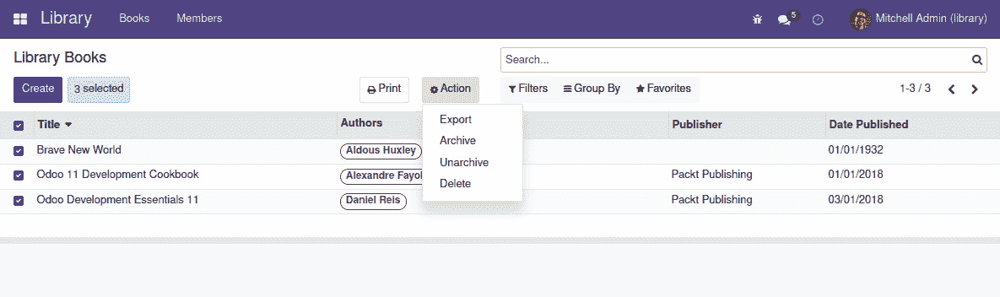

# *第十章*：后端视图 – 设计用户界面

本章描述了如何创建视图以实现业务应用的用户界面。Odoo 用户界面从菜单项和菜单点击时执行的各种动作开始，因此这些是我们首先将学习的组件。

最常用的视图类型是**表单视图**，我们需要了解一些元素，从组织视图中的元素布局到理解字段和按钮的所有可用选项。

一些其他常用的视图包括列表视图和搜索视图。最后，还有其他一些针对特定目的有用的视图类型，例如数据透视表视图和图形视图。这些视图类型将在本章末尾进行概述。

本章将涵盖以下主题：

+   添加菜单项

+   理解窗口动作

+   探索表单视图的结构

+   使用字段

+   使用按钮

+   添加动态视图元素

+   探索列表视图

+   探索搜索视图

+   理解其他可用的视图类型

到本章结束时，你应该熟悉所有 Odoo 视图类型，并拥有使用它们的资源。特别是，你将能够自信地设计非平凡的表单视图，并提供良好的用户体验。

# 技术要求

我们将继续使用`library_checkout`附加模块。它的模型层已经完成；现在，它需要用户界面的视图层。

本章中的代码基于我们在*第八章*中创建的代码，*业务逻辑 – 支持业务流程*。必要的代码可以在此书的 GitHub 仓库中找到，位于[`github.com/PacktPublishing/Odoo-15-Development-Essentials`](https://github.com/PacktPublishing/Odoo-15-Development-Essentials)的`ch10`目录下。

# 添加菜单项

菜单项是用户界面导航的起点。它们形成一个层次结构，其中顶级项代表应用程序，下一级是应用程序主菜单。可以添加更多子菜单级别。

没有子菜单的菜单项是**可操作的**，可以触发一个动作，告诉 Web 客户端要做什么，例如打开一个视图。

菜单项存储在`ir.ui.menu`模型中，可以通过**设置** | **技术** | **用户界面** | **菜单项**菜单进行浏览。

`library_app`附加模块为图书馆书籍创建了一个顶级菜单，而`library_checkout`附加模块添加了借阅和借阅阶段的菜单项。这两个模块都在`library_checkout/views/library_menu.xml`中实现。

这是借阅菜单项的 XML：

```py
    <menuitem id="menu_library_checkout"
              name="Checkout"
              action="action_library_checkout"
              parent="library_app.library_menu"
    />
```

上一段代码使用了`<menuitem>`快捷元素，这是一种创建菜单记录的简写方式，比`<record model="ir.ui.menu">`元素更方便。

最常用的 `<menuitem>` 属性如下：

+   `name` 是菜单项的标题，并在用户界面中显示。

+   `action` 是点击菜单项时运行的动作的 XML ID。

+   `parent` 是父菜单项的 XML ID。在这种情况下，父菜单项是在另一个模块中创建的，因此需要使用完整的 XML ID 进行引用；即 `<module>.<XML ID>`。

还有一些其他属性也是可用的：

+   `sequence` 设置一个数字以对菜单项的展示顺序进行排序；例如，`sequence="10"`。

+   `groups` 是具有访问菜单项的安全组 XML ID 的逗号分隔列表；例如，`groups="library_app.library_group_user,library_app.library_group_manager"`。

+   `web_icon` 是要使用的图标的路径。它仅适用于企业版的顶级菜单项。路径值应遵循 `web_icon="library_app,static/description/icon.png"` 格式。

菜单项可以运行由 `action` 属性标识的动作，在大多数情况下，这将是一个 **窗口动作**。下一节将解释如何创建动作以及它们能够做什么。

# 理解窗口动作

菜单上的 **窗口动作** 给予网络客户端执行指令，例如打开一个视图，并且可以在视图中的菜单项或按钮中使用。

窗口动作用于标识在用户界面中使用的模型和要展示的视图。它们还可以使用 `domain` 过滤器来过滤可用的记录，并可以使用 `context` 属性设置默认值和过滤器。

窗口动作存储在 `ir.actions.act_window` 模型中，可以通过转到 **设置** | **技术** | **动作** | **窗口动作** 菜单进行浏览。

`library_checkout/views/library_menu.xml` 文件包含用于结账菜单项的窗口动作定义：

```py
    <record id="action_library_checkout" 
            model="ir.actions.act_window">
        <field name="name">Checkouts</field>
        <field name="res_model">library.checkout</field>
        <field name="view_mode">tree,form</field>
    </record>
```

窗口动作是一个 `ir.actions.act_window` 记录。最重要的字段如下：

+   `name` 是通过动作打开的视图上显示的标题。

+   `res_model` 是目标模型的标识符。

+   `view_mode` 是要提供的视图类型的逗号分隔列表。列表中的第一个是默认打开的。

其他相关的窗口动作字段如下：

+   `target` 默认为 `current`，在主内容区域内联打开视图。如果设置为 `new`，则将在弹出对话框窗口中打开视图；例如，`target="new"`。

+   `context` 在目标视图中设置上下文信息，可以设置默认值或激活过滤器等；例如，`<field name="context">{'default_user_id': uid}</field>`。

+   `domain` 是一个域表达式，它强制对在打开的视图中可浏览的记录进行过滤；例如，`domain="[('user_id', '=', uid)]"`。

+   `limit` 是列表视图中每页的记录数；例如，`limit="80"`。

+   `view_id`是对要使用的特定视图的引用。它不能与`view_mode`一起使用。它通常与`target="new"`一起使用，以弹出方式打开特定表单。

    Odoo 13 中的更改

    直到 Odoo 12，可以使用`<act_window>`快捷元素来创建窗口操作。这在 Odoo 13 中被删除了。现在，必须使用`<record model="ir.actions.act_window">`元素来创建窗口操作。

在本章中，我们将为`library.checkout`模型添加视图类型。通过这样做，我们将展示除了表单和树/列表视图之外的其他可用视图类型。

要提供的视图类型必须由窗口操作指示。因此，让我们编辑`library_checkout/views/library_menu.xml`文件以添加新的视图类型，如下面的代码所示：

```py
    <record id="action_library_checkout" 
            model="ir.actions.act_window">
        <field name="name">Checkouts</field>
        <field name="res_model">library.checkout</field>
        <field name="view_mode"
            >tree,form,activity, calendar,graph,pivot</field>
    </record>
```

这些更改目前还不能进行。在将它们添加到窗口操作的`view_mode`之前，应该实现相应视图类型的定义。

除了菜单项或视图按钮之外，操作还可以在可用的**操作**上下文菜单中使用，该菜单位于搜索框附近。下一节将详细介绍这一点。

# 向操作上下文菜单添加选项

窗口操作也可以从位于表单视图顶部的**操作**菜单按钮使用，也可以在记录被选中时在列表视图中使用：



图 10.1 – 操作上下文菜单

此菜单是上下文相关的，因为操作将应用于当前选定的记录或记录。

要在**操作**菜单中提供操作，必须在窗口操作上设置两个更多字段：

+   `binding_model_id`是对要使用该操作的模型的引用；例如，`<field name="binding_model_id" ref="model_library_checkout" />`。

+   `binding_view_types`可用于限制选项的可见性，使其仅对特定视图类型可见，例如`form`或`list`；例如，`<field name="binding_view_types">form,list</field>`。

在`library_checkout`模块的`wizard/checkout_mass_message_wizard_view.xml`文件中已经实现了这个示例。这里复制出来供参考：

```py
  <record id="action_checkout_message"
          model="ir.actions.act_window">
    <field name="name">Send Messages</field>
    <field name="res_model">
      library.checkout.massmessage</field>
    <field name="view_mode">form</field>
    <field name="binding_model_id" 
      ref="model_library_checkout" />
    <field name="binding_view_types">form,list</field>
    <field name="target">new</field>
  </record>
```

与绑定到**操作**菜单相关的设置在上一段代码中被突出显示。

以下截图说明了相应的操作菜单项：


图 10.2 – 发送消息操作菜单选项

Odoo 13 中的更改

在 Odoo 13 中，操作绑定字段发生了变化。直到 Odoo 12，`src_model`设置绑定并使用模型标识符，例如`library.checkout`。它可以在表单视图中使用，也可以通过将`multi`设置为`true`使其在列表视图中可用。

一旦触发窗口操作，就会打开相应的视图。最常用的视图类型是表单和列表。下一节将详细介绍如何创建表单视图。

# 探索表单视图结构

表单视图是用户与数据记录交互的主要方式。表单视图可以采用简单的布局或业务文档布局，类似于纸质文档。在本节中，我们将学习如何设计这些业务文档视图以及如何使用可用的元素和组件。

在*第八章*，*业务逻辑 – 支持业务流程*中，我们创建了一个图书馆借阅模型并为其准备了一个基本表单。我们将在本节中重新访问并增强它。

以下截图显示了完成后的表单视图将看起来像什么：

![Figure 10.3 – 增强的结账表单视图

![img/Figure_10.3_B16119.jpg]

图 10.3 – 增强的结账表单视图

在我们逐渐在本章中添加不同元素的同时，您可以参考此截图。

## 使用业务文档视图

从历史上看，组织使用纸质表单来支持其内部流程。业务应用模型支持这些纸质表单的数字版本，在这个过程中，它们可以添加自动化并使操作更高效。

为了获得更直观的用户界面，表单视图可以模仿这些纸质文档，帮助用户可视化他们在纸质表单上习惯运行的过程。

例如，对于**图书馆**应用，图书借阅可能是一个需要填写纸质表单的过程。让结账表单具有类似纸质文档的布局可能是一个好主意。

一个业务文档包含两个元素：一个`<head>`部分和一个`<sheet>`部分。`head`包含控制文档业务工作流的按钮和组件，而`sheet`包含实际的文档内容。在`sheet`部分之后，我们还可以有消息和活动组件。

要将此结构添加到结账表单中，首先编辑`library_checkout/views/checkout_view.xml`文件，并将表单视图记录更改为以下基本框架：

```py
<record id="view_form_checkout" model="ir.ui.view"> 
  <field name="model">library.checkout</field> 
  <field name="arch" type="xml"> 
    <form> 
      <header>  
        <!-- To add buttons and status widget -->
      </header>
      <sheet> 
        <!-- To add form content -->
      </sheet> 
      <!-- Discuss widgets -->
      <div class="oe_chatter">  
        <field name="message_follower_ids"  
               widget="mail_followers" /> 
        <field name="activity_ids"
               widget="mail_activity" /> 
        <field name="message_ids"
               widget="mail_thread" /> 
      </div> 
    </form>
  </field> 
</record>
```

视图名称是可选的，如果缺失则自动生成。因此，为了简单起见，前一个视图记录中省略了`<field name="name">`元素。

`<head>`和`<sheet>`部分目前为空，将在下一部分中扩展。

底部的消息部分使用了由`mail`附加模块提供的组件，具体说明见*第八章*，*业务逻辑 – 支持业务流程*。

首先要检查的部分是表单标题。

## 添加标题部分

顶部的标题通常包含文档在其生命周期中将经过的步骤以及相关的操作按钮。这些操作按钮是常规的表单按钮，而用于前进的按钮通常会被突出显示，以帮助用户。

### 添加标题按钮

让我们从向当前空白的标题部分添加一个按钮开始。

在编辑表单视图中的`<header>`部分时，添加一个按钮将结账移动到`完成`状态：

```py
<header> 
  <field name="state" invisible="True" />
  <button name="button_done"
    type="object"
    string="Return Books"
    attrs="{'invisible':
      [('state', 'in', ['new', 'done', 'cancel'])]}"
    class="oe_highlight"
  />
</header>
```

通过使用前面的代码，将`Return Books`按钮添加到标题中，并设置`type="object"`，表示调用模型方法。`name="button_done"`声明了要调用的方法名称。

使用`class="oe_highlight"`来突出显示按钮。当我们有多个按钮可供选择时，可以突出显示主要或更常见的操作，以帮助用户。

使用`attrs`属性使按钮仅在有意义的状态下可见。它应在`open`状态下可见，因此应将`new`、`done`和`cancel`状态设置为不可见。

用于执行此操作的条件使用`state`字段，否则在表单上不使用。为了使`attrs`条件工作，需要将`state`字段加载到 Web 客户端。为此，它被添加为一个不可见字段。

在这个特定情况下，使用了特殊的`state`字段名，并且可以使用更简单的`states`属性来实现使用`attrs`实现的可见性条件。`states`属性列出了元素将可见的状态。

通过使用`states`而不是`attrs`，按钮仅在`open`状态下可见，看起来如下：

```py
  <button name="button_done" 
    type="object" 
    string="Return Books"
    states="open"
    class="oe_highlight"
  />
```

`attrs`和`states`元素可见性功能也可以用于其他视图元素，例如字段。我们将在本章后面更详细地探讨它们。

为了使此按钮工作，被调用的方法必须实现。为此，在`library_checkout/models/library_checkout.py`文件中，向`checkout`类添加以下代码：

```py
    def button_done(self):
        Stage = self.env["library.checkout.stage"]
        done_stage = Stage.search([("state", "=", "done")], 
          limit=1)
        for checkout in self:
            checkout.stage_id = done_stage
        return True
```

首先，代码查找`完成`状态。它将用于将记录设置为该阶段。

`self`记录集通常是一个单独的记录，但 API 允许它对多记录记录集进行调用，因此应该处理这种可能性。这可以通过对`self`上的`for`循环来完成。然后，对于`self`记录集中的每个记录，必须将`stage_id`字段设置为`完成`阶段。

除了按钮外，标题还可以包含状态栏小部件，以展示可用的**阶段**或**状态**。

### 添加状态栏管道

标题中另一个有用的元素是流程图，展示流程步骤以及当前文档的位置。这可以基于**阶段**或**状态**列表。此管道小部件可以是可点击的，也可以不是，以防我们只想通过按钮进行更改。

使用`statusbar`小部件通过`<field>`元素添加状态栏小部件。结账模型有`stage_id`字段，我们将使用它：

```py
<header>  
  <field name="state" invisible="True" />
  <button name="do_clear_done" type="object" 
    string="Clear Done"
    states="open,cancel"
    class="oe_highlight" />
  <field name="stage_id"
    widget="statusbar"
options="{'clickable': True, 'fold_field': 'fold'}" />
</header>
```

`statusbar`小部件可以使用**状态**选择字段或**阶段**多对一字段。这两种字段可以在多个 Odoo 核心模块中找到。

`clickable` 选项允许用户通过点击状态栏来更改文档阶段。启用它为用户提供灵活性。但也有一些情况下，我们需要对工作流程有更多的控制，并要求用户仅通过可用的操作按钮来通过阶段。

Odoo 12 的变化

直到 Odoo 11，可点击的选项是一个字段属性，`<field widget="statusbar" clickable="True" />`。在 Odoo 12 中，它被转换为一个小部件选项，`<field widget="statusbar" options="{'clickable': True}" />`。

`fold_field` 选项用于允许不太重要的阶段，如 *已取消*，在设置 `fold_field` 时被隐藏（折叠），该字段名用于此。在这种情况下，它被命名为 `fold`。

### 使用状态而不是阶段

**阶段**是一个多对一的字段，它使用支持模型来设置流程的步骤。它是灵活的，可以被最终用户配置以适应他们特定的业务流程，并且非常适合支持看板。图书馆借阅模型正在使用它。

**状态**是一个包含固定流程步骤的封闭选择列表，例如 **新建**、**进行中** 和 **完成**。由于可用的状态不能更改，因此可以在业务逻辑中使用它。但它不能由最终用户配置。

每种方法都有其优缺点。通过使用阶段并将每个阶段映射到状态，可以从中受益于两种选项的最佳之处。借阅模型实现了这一点，在借阅阶段模型中添加了一个状态字段，该字段也通过相关字段直接在借阅模型中可用。

如果一个模型只使用状态，则可以使用带有 `statusbar` 小部件的状态栏管道。然而，`fold_field` 选项不可用；相反，可以使用 `statusbar_visible` 属性，列出要显示的状态。

使用带有状态 `field` 的状态栏看起来是这样的：

```py
<field name="state"
  widget="statusbar"
  options="{'clickable': True}"
  statusbar_visible="draft,open,done"
/>
```

注意，之前的代码在 `library_checkout` 模块中没有使用。由于它支持更灵活的阶段，我们更愿意在用户界面中使用它们。

现在我们已经完成了标题部分，让我们来看看主要表单部分。

## 设计文档表格

表格画布是表单的主要区域，实际数据元素放置于此。它被设计得像实际的纸质文档。

通常，一个文档表格结构将包含以下区域：

+   顶部的一个文档标题

+   顶部右角的一个按钮框

+   文档标题数据字段

+   底部的一个笔记本，用于可以组织成标签或页面的附加字段

文档通常会包含详细的代码行。这些通常在笔记本的第一页上展示。

这里是预期的 XML 结构：

```py
      <sheet>
        <!-- Button box -->
        <div class="oe_button_box" name="button_box" />
        <!-- Header title -->
        <div class="oe_title" />
        <!-- Header fields -->
        <group />
        <!-- Notebook -->
        <notebook />
      </sheet>
```

在表格之后，我们通常会有聊天小部件，其中包含文档关注者、讨论消息和计划活动。

让我们逐一讨论这些区域。按钮框将在稍后讨论，所以接下来，我们将讨论标题头。

## 添加标题头

标题头通常会用大号字母显示文档的标题。它可能后面跟着一个副标题，也可能旁边有一个图像。

首先，需要向结账模型添加几个字段。需要一个字段用作标题，还需要一个图像来表示借阅者。编辑 `library_checkout/models/library_checkout.py` 文件并添加以下代码：

```py
    name = fields.Char(string="Title")
    member_image = fields.Binary(related=
      "member_id.image_128")
```

标题头位于 `<div class="oe_title">` 元素内。可以使用常规 HTML 元素，如 `div`、`span`、`h1` 和 `h3`。

在下面的代码中，`<sheet>` 元素已经扩展以包含标题，以及一些作为副标题的附加字段：

```py
<sheet> 
  <div name="button_box" class="oe_button_box" />
  <field name="member_image" widget="image" 
    class="oe_avatar" />
  <div class="oe_title"> 
    <label for="name" class="oe_edit_only"/> 
    <h1><field name="name"/></h1> 
    <h3> 
      <span class="oe_read_only">By </span> 
      <label for="member_id" class="oe_edit_only"/> 
      <field name="member_id" class="oe_inline" /> 
    </h3> 
  </div> 
  <!-- More elements will be added from here... --> 
</sheet>
```

前面的 XML 渲染包括以下内容：

+   一个按钮框 `<div>` 元素。现在它是空的，但可以用来添加智能按钮。

+   一个图像字段，用于 `member_image`，使用类似头像的图像小部件。

+   包含文档标题元素的 `<div>` 元素。在标题内，有如下内容：

    +   `name` 字段的 `<label>`，仅在编辑模式下可见。

    +   `name` 字段，它被渲染为 HTML `<h1>` 标题。

    +   一个包含 `member_id` 字段的 `<h3>` 副标题头。这仅在阅读模式下可见。`<field>` 标签使用 `oe_inline` 让 HTML 元素管理文本流。

`<group>` 元素之外的字段不会为其渲染标签。前面的 XML 没有包含 `<group>` 元素，因此需要显式添加标签。

标题元素之后，通常会有标题字段，组织成组。

## 使用组组织表单内容

表单的主要内容应该使用 `<group>` 标签组织。

`<group>` 标签在画布中插入两列。添加到组内的字段使用这些两列——第一列用于字段标签，第二列用于字段值小部件。向组中添加更多字段将按垂直堆叠，新字段添加在新的一行中。

一个常见的模式是拥有两列字段，并排排列。你可以通过在顶层组中添加两个嵌套的 `<group>` 标签来实现这一点。

继续我们的表单视图，我们将使用这个来添加主要内容，在标题的 `<div>` 部分之后：

```py
<!-- More elements will be added from here... --> 
<group name="group_top"> 
  <group name="group_col1"> 
    <field name="request_date" /> 
  </group> 
  <group name="group_col2"> 
    <field name="close_date" /> 
    <field name="user_id" /> 
  </group> 
</group>
```

顶部的 `<group>` 元素在画布中创建两列。每个嵌套的 `<group>` 元素使用这些列中的一列。第一个嵌套组使用左列，而第二个组使用右列。

`<group>` 元素被分配了一个 `name`。这不是必需的，但建议这样做，以便模块更容易扩展。

`<group>` 元素也可以有一个 `string` 属性，它用于显示其标题文本。

Odoo 11 的变化

`string` 属性不能再用作继承的锚点。这是因为相应的文本可以被翻译，这可能会破坏继承/扩展视图。应使用 `name` 属性代替。

可以使用以下元素来调整视图布局：

+   可以使用`<newline>`元素来强制换行，以便下一个元素在下一行的第一列中渲染。

+   可以添加`<separator>`元素来添加部分标题。可以使用`string`属性设置标题文本。

`col`和`colspan`属性提供了对网格布局的额外控制：

+   `col`属性用于`<group>`元素上，以自定义它包含的列数。默认情况下，一个`<group>`元素包含两列，但可以更改为任何其他数字。偶数更合适，因为默认情况下，添加的每个字段都占用两列——一列用于标签，一列用于值。

+   可以在组内元素上使用`colspan`属性来设置它们应该占据的特定列数。默认情况下，一个字段占用两列。

以下代码显示了顶部分组元素的另一种版本，并使用`col="4"`来在两列中展示四个字段：

```py
<group name="group_top" col="4"> 
  <field name="request_date" />
  <field name="user_id" /> 
  <span colspan="2" />
  <field name="close_date" /> 
</group>
```

注意到字段的顺序不同，因为字段是从左到右，然后从上到下放置的。使用了`<span colspan="2">`元素来占据第二行的前两列，以便`close_date`字段占据最后两列。

一些表单还包含笔记本部分，用于在不同页面上组织额外的字段。

## 添加标签页笔记本

笔记本元素是组织表单内容的另一种方式。它是一个包含多个标签页的容器。这些可以用来将不常用的数据隐藏起来，直到需要时才显示，或者按主题组织大量字段。

结账表单将包含一个笔记本元素，第一页将包含借阅书籍的列表。为此，在上一节中添加的`<group name="group_top">`元素之后，包含以下 XML：

```py
<notebook> 
  <page name="page_lines" string="Borrowed Books">
    <field name="line_ids" />
  </page>
</notebook>
```

这个笔记本只包含一个页面。要添加更多，只需在`<notebook>`元素内包含更多的`<page>`元素。默认情况下，页面画布不会渲染字段标签。为了实现这一点，字段应该放在一个`<group>`部分内，就像表单主画布一样。

在这种情况下，在页面内部添加了一个多对一`line_ids`字段，没有`<group>`元素，因此不会为其渲染标签。

`page`元素支持以下属性：

+   `string`，用于页面标题。这是必需的。

+   `attrs`是一个字典，用于将`invisible`和`required`属性值映射到域表达式的结果。

+   `accesskey`，一个 HTML 访问键。

本节讨论了表单视图的典型布局，以及使用此视图时最重要的元素。最重要的元素是数据字段。下一节将详细讨论它们。

# 使用字段

在表单或列表视图中，字段小部件是展示和编辑模型字段数据的方式。

视图字段有一些可用的属性。大多数这些属性值默认来自模型定义，但在视图中可以覆盖这些值。

这里是常见字段属性的快速参考：

+   `name` 是模型中的字段名称，并标识了由该元素渲染的字段。

+   `string` 是要使用的标签文本。它覆盖了模型定义。

+   `help` 提供了一些当鼠标悬停在字段上时显示的工具提示帮助文本。

+   `placeholder` 提供了在字段内显示的建议文本。

+   `widget` 设置用于渲染字段的特定小部件。可用的小部件将在本节后面讨论。

+   `options` 是一个 JSON 数据结构，用于向小部件传递额外的选项。要使用的值取决于所使用的小部件。

+   `Class` 是用于字段 HTML 渲染过程的 CSS 类的逗号分隔列表。

+   `nolabel="True"` 阻止自动字段标签的展示。这对于 `<group>` 元素内的字段是有意义的，并且经常与 `<label for="...">` 元素一起使用。

+   `invisible="True"` 使得字段不可见，但它的数据是从服务器获取的，并在表单上可用。请注意，表单不能在不可见字段上写入。

+   `readonly="True"` 使得表单上的字段为只读。

+   `required="True"` 使得字段在表单上为必填项。

以下特殊属性仅由特定字段类型支持：

+   `password="True"` 用于文本字段。它显示为密码字段，会隐藏输入的字符。

+   `filename` 用于二进制字段，是用于上传文件名称的模型字段名称。

有两个话题值得进一步讨论。一个是如何更好地控制字段标签的展示，另一个是关于使用不同的网页客户端小部件以获得更好的用户体验。

## 修改字段标签

字段不会自动渲染标签，除非它们在 `<group>` 元素内。在这种情况下，标签将使用 `nolabel="True"` 显式抑制。

可以使用 `<label for="..."/>` 元素显式添加标签。这使您能够更好地控制字段标签的显示位置。以下代码用于表单标题：

```py
<label for="name" class="oe_edit_only" />
```

`for` 属性标识了我们应该从其中获取标签文本的字段。可选的 `string` 属性可以设置标签的特定文本。也可以使用 CSS 类。之前的代码使用了以下内容：

+   `class="oe_edit_only"` 使得元素仅在编辑模式下可见。

+   `class="oe_read_only"` 使得元素仅在只读模式下可见。

这可以用来控制字段标签的展示方式。字段数据的展示也可以通过不同的小部件进行调整。

## 选择字段小部件

字段内容是通过网页客户端小部件展示的。这可能会影响数据向用户展示的方式，以及设置字段值时的交互。

每种字段类型都使用适当默认小部件显示。然而，可能还有其他可选小部件。

### 文本字段小部件

对于文本字段，可以使用以下小部件：

+   `email` 渲染为可操作的 `mailto` HTML 链接。

+   `phone` 渲染为可操作的电话 HTML 链接。

+   `url` 用于将文本格式化为可点击的 URL。

+   `html` 用于将文本渲染为 HTML 内容。在编辑模式下，它具有所见即所得的编辑器，允许您格式化内容而无需使用 HTML 语法。

### 数值字段小部件

对于数值字段，以下小部件可用：

+   `handle` 专门为列表视图中的序列字段设计，显示一个可拖动的手柄以重新组织行顺序。

+   `float_time` 将 `float` 字段格式化为小时和分钟。

+   `monetary` 将 `float` 字段显示为货币金额。它期望使用的货币在 `currency_id` 伴随字段中。如果 `currency` 字段有不同的名称，可以通过 `options="{'currency_field': '<field name>'}"` 设置。

+   `progressbar` 将 `float` 表示为百分比进度条，这对于表示完成率的字段很有用。

+   `percentage` 和 `percentpie` 是可以与浮点字段一起使用的其他小部件。

### 关联和选择字段小部件

对于关联和选择字段，以下小部件可用：

+   `many2many_tags` 将值显示为类似按钮的标签列表。

+   `many2many_checkboxes` 将可选择的值显示为复选框列表。

+   `selection` 使用 `selection` 字段小部件处理多对一字段。

+   `radio` 使用单选按钮显示 `selection` 字段选项。

+   `priority` 将 `selection` 字段表示为可点击的星级列表。选择选项通常是数字。

+   `state_selection` 显示交通灯按钮，通常用于看板状态选择列表。`normal` 状态为灰色，`done` 为绿色，任何其他状态均以红色表示。

    Odoo 11 的变化

    `state_selection` 小部件在 Odoo 11 中引入，并取代了之前的 `kanban_state_selection`，后者已被弃用。

### 二进制字段小部件

对于二进制字段，以下小部件可用：

+   `image` 将二进制数据呈现为图像。

+   `pdf_viewer` 以 PDF 预览小部件的形式呈现二进制数据（自 Odoo 12 引入）。

## 关联字段

关联字段小部件允许您搜索并选择相关记录。

它还允许您打开相关记录的表单或导航到相应的表单，并即时创建新记录，也称为 **快速创建**。

可以使用 `options` 字段属性禁用这些功能：

```py
options="{'no_open': True, 'no_create': True}"
```

`context` 和 `domain` 字段属性在关联字段中特别有用：

+   `context` 可以设置从字段创建的相关记录的默认值。

+   `domain` 限制可选择的记录。一个常见示例是字段的选项取决于表中的另一个字段的值。

多对多字段也可以使用 `mode` 属性来设置用于显示记录的视图类型。默认使用 `tree` 视图，但其他选项包括 `form`、`kanban` 和 `graph`。它可以是逗号分隔的视图模式列表。

关联字段可以包含内联特定视图定义以使用。这些定义在 `<field>` 元素内部作为嵌套视图定义。例如，`line_ids` 检查点可以定义特定列表和表单视图：

```py
<notebook> 
  <page name="page_lines" string="Borrowed Books" > 
    <field name="line_ids"> 
      <tree>
        <field name="book_id" />
      </tree>
      <form>
        <field name="book_id" />
      </form>
    </field>
  </page> 
</notebook>
```

行列表将使用内联 `<tree>` 定义。当您点击一行时，将出现一个表单对话框并使用内联 `<form>` 定义的结构。

我们已经看到了可以使用字段完成的所有事情。下一个最重要的视图元素是按钮，用于运行操作。

# 使用按钮

按钮允许用户触发操作，例如打开另一个视图或在服务器函数中运行业务逻辑。它们在讨论表头时被引入，但也可以在表单和列表视图的任何位置添加。

按钮支持以下属性：

+   `string` 是按钮文本标签，或当使用图标时 HTML 的 `alt` 文本。

+   `type` 是要执行的操作类型。可能的值包括 `object`，用于调用 Python 方法，或 `action`，用于运行窗口操作。

+   `name` 根据所选类型标识要执行的具体操作：要么是模型方法名称，要么是要运行的窗口操作的数据库 ID。可以使用 `%(<xmlid>)d` 公式在视图加载时将 XML ID 转换为必要的数据库 ID。

+   `args` 在 `type="object"` 时使用，用于将额外参数传递给方法调用。

+   `context` 设置上下文的值。这可以在调用的方法中使用或影响由窗口操作打开的视图。

+   `confirm` 是当按钮被点击时确认消息框的文本。这将在执行操作之前显示。

+   `special="cancel"` 在向导表单中使用，用于添加 **取消** 按钮，用于关闭表单而不执行任何操作。

+   `icon` 是要在按钮中显示的图标图像。可用的图标来自 Font Awesome 集合，应使用相应的 CSS 类指定，例如 `icon="fa-question"`。有关图标参考，请查看 [`fontawesome.com/`](https://fontawesome.com/)。

    Odoo 11 的变化

    在 Odoo 11 之前，按钮图标是从 GTK 客户端库中起源的图像，并且限于 `addons/web/static/src/img/icons` 中可用的那些。

    工作流引擎在 Odoo 11 中已被弃用并移除。在之前支持工作流的版本中，按钮可以使用 `type="workflow"` 触发工作流引擎信号。在这种情况下，`name` 属性应包含工作流信号名称。

在某些表单的右上角区域找到的一种特定类型的按钮称为 **智能按钮**。让我们更仔细地看看它。

## 使用智能按钮

文档表单在右上角区域有一个智能按钮区域是很常见的。智能按钮显示为带有统计指示器的矩形，点击时可以追踪。

Odoo UI 模式通常有一个用于智能按钮的不可见框。这个按钮框通常是 `<sheet>` 中的第一个元素，看起来像这样：

```py
<div name="button_box" class="oe_button_box">
 <!-- Smart buttons will go here... -->
</div>
```

按钮的容器只是一个具有 `oe_button_box` 类的 `div` 元素。在 Odoo 11.0 之前的版本中，可能还需要 `oe_right` 类来确保按钮框保持与表单右侧对齐。

对于图书馆借阅模块，将为该图书馆成员正在进行的未完成借阅添加一个智能按钮。按钮应显示这些借阅的统计信息，并且点击时应该打开一个包含这些项目的借阅列表。

对于按钮统计，需要在 `library.checkout` 模型中创建一个计算字段，在 `library_checkout/models/library_checkout.py` 文件中：

```py
    count_checkouts = fields.Integer(
        compute="_compute_count_checkouts")
    def _compute_count_checkouts(self):
        for checkout in self:
            domain = [
                ("member_id", "=", checkout.member_id.id),
                ("state", "not in", ["done", "cancel"]),
            ]
            checkout.count_checkouts = 
              self.search_count(domain)
```

前面的计算会遍历每个借阅记录来计算并运行该成员的搜索查询，统计未完成借阅的数量。

小贴士

前面的实现违反了一个性能原则：不要在循环中执行记录搜索操作。

为了性能优化，应该在循环之前批量执行搜索操作，并将结果用于循环内部。下面是一个这种实现示例。这涉及到一些非平凡的代码，所以如果你觉得现在理解起来太难，可以自由跳过。

`read_group()` 方法可以用来获取分组后的数据。它返回一个包含 `dict` 类型行的列表，例如 `[{'member_id_count': 1, 'member_id': (1, 'John Doe'), …), …]`。在这个数据结构中查找 `member_id` 是比较困难的。如果将行列表转换成一个将 `member_id` 映射到记录计数的字典，这个查找操作就可以变得非常简单。

这里是使用这些技术的替代实现：

```py
    def _compute_count_checkouts(self):
        members = self.mapped("member_id")
        domain = [
            ("member_id", "in", members.ids),
            ("state", "not in ", ["done", "cancel"]),
        ]
        raw = self.read_group(domain, ["id:count"], 
          ["member_id"])
        data = {
            x["member_id"][0]: x["member_id_count"] for 
              x in raw
        }
        for checkout in self:
            checkout.count_checkouts = data.get(
                checkout.member_id.id, 0)
```

现在有了计算显示数量的字段，智能按钮可以添加到视图中。在 `<sheet>` 部分的顶部，用以下代码替换我们之前添加的按钮框占位符：

```py
<div name="button_box" class="oe_button_box">
  <button type="action"
    name="%(action_library_checkout)d"
    class="oe_stat_button"
    icon="fa-book"
    domain="[('member_id', '=', member_id)]"
    context="{'default_member_id': member_id}"
  >
    <field name="count_checkouts"
      string="Checkouts" 
      widget="statinfo" />
  </button>
</div>
```

`button` 元素本身是一个容器，用于显示统计信息的字段应该添加到其中。这些统计信息是使用特定 `statinfo` 小部件的常规字段。未完成借阅的数量通过 `count_checkouts` 字段在按钮定义中展示。

智能按钮必须具有 `class="oe_stat_button"` CSS 样式，并且应该使用 `icon` 属性设置图标集。

在这种情况下，它包含 `type="action"`，这意味着按钮运行一个 *窗口操作*，如 `name` 属性所标识。`%(action_library_checkout)d` 表达式返回要运行的操作的数据库 ID。此 *窗口操作* 打开结账列表。为了确保只显示相关的记录，使用了 `domain` 属性。如果在那个视图中创建了一个新记录，将当前成员设置为默认值将非常方便。这可以通过在 `context` 属性中使用 `default_member_id` 键来完成。

作为参考，以下是可用于智能按钮的属性：

+   `class="oe_stat_button"` 将渲染一个矩形而不是常规按钮。

+   `icon` 设置要使用的图标，从 *Font Awesome* 集合中选择。访问 [`fontawesome.com`](http://fontawesome.com) 浏览可用的图标。

+   `type` 和 `name` 分别是按钮类型和要触发的操作的名称。对于智能按钮，类型通常为 `action` 用于 *窗口操作*，而 `name` 将是执行操作的 ID。可以使用 `"%(action-xmlid)d"` 将 XML ID 转换为所需的数据库 ID。

+   `string` 向按钮添加标签文本。在先前的代码示例中没有使用它，因为字段提供了文本标签。

+   `context` 可以用于在目标视图中设置默认值，对于从按钮导航的视图中创建的新记录。

+   `help` 添加了一个当鼠标指针悬停在按钮上时显示的帮助提示。

除了按钮和智能按钮之外，还可以将动态元素添加到视图中，以更改元素的值或可见性。这将在下一节中讨论。

# 添加动态视图元素

视图元素可以根据字段值动态更改其外观或行为。字段值可以通过 *onchange* 机制动态设置为其他表单字段上的域筛选器的值。这些功能将在下一节中讨论。

## 使用 onchange 事件

**onchange** 机制允许我们在用户在未保存的表单上修改数据时触发服务器逻辑。例如，当设置产品字段时，同一表单上的单价可以自动设置。

在较旧的 Odoo 版本中，onchange 事件在视图级别定义，但自 Odoo 8 以来，它们直接在模型层声明，无需任何特定的视图标记。这可以通过使用 `@api.onchange('field1', 'field2', ...)` 装饰器的方法来完成。它将 onchange 逻辑绑定到声明的字段。在第八章*第八章*中详细讨论了 onchange 模型方法，*业务逻辑 - 支持业务流程*，并在那里讨论了一个示例。

onchange 机制还会自动重新计算计算字段，立即响应用户输入。继续使用之前的例子，如果价格字段发生变化，包含总金额的计算字段也会自动使用新的价格信息进行更新。

## 使用动态属性

视图元素可以有一些属性对字段值的变化做出反应；例如，变为可见或必填。

以下属性可以用来控制视图元素的可见性：

+   `groups`根据当前用户所属的安全组使元素可见。只有指定组的成员才能看到它。它期望一个以逗号分隔的组 XML ID 列表。

+   `states`根据记录的`state`字段使元素可见。它期望一个以逗号分隔的状态值列表。当然，模型必须有一个`state`选择字段。

+   `attrs`可以根据某些条件设置不可见和必填属性。它使用一个字典，其中`invisible`、`readonly`和`required`是可能的键。这些键映射到评估为真或假的域表达式。

这里是使用`attrs`的一个示例。为了使`closed_date`字段仅在`done`状态下可见，可以使用以下代码：

```py
<field name="closed_date"
       attrs="{'invisible':[('state', 'not in', 
         ['done'])]}"
/>
```

`invisible`属性在任何元素中都可用，而不仅仅是字段。例如，它也可以用于笔记本页面和`group`元素。

`readonly`和`required`属性仅适用于数据字段，允许我们实现基本的客户端逻辑，例如，在依赖于其他记录值（如状态）的情况下使字段成为必填。

这结束了我们对表单视图的讨论。然而，还有几种视图类型需要探索。接下来，我们将讨论列表/树视图。

# 探索列表视图

列表视图可能是最常用的视图类型，紧随其后的是表单视图。列表视图将记录呈现为行，数据字段呈现为列。默认情况下，它们是只读的，但也可以设置为可编辑。

列表视图的基本定义很简单。它是一个包含在`<tree>`元素内的字段元素的序列。`library_checkout`已经在`views/checkout_view.xml`文件中包含了一个简单的列表视图，看起来是这样的：

```py
  <record id="view_tree_checkout" model="ir.ui.view">
    <field name="name">Checkout Tree</field>
    <field name="model">library.checkout</field>
    <field name="arch" type="xml">
      <tree>
        <field name="request_date" />
        <field name="member_id" />
      </tree>
    </field>
  </record>
```

列表视图可以包含字段和按钮，为表单描述的属性在列表视图中同样有效。

在了解基础知识之后，可以在列表视图中使用一些附加功能。在下一节中，我们将介绍新的列表标题部分。

## 添加列表视图标题部分

与表单视图类似，列表视图也可以有标题部分，其中可以添加按钮以在模型上执行操作。语法与视图相同。

例如，在**操作**菜单中有一个**发送消息**选项可用。这并不直接对用户可见，并且可以将其作为一个标题按钮使其更加可见。

编辑树视图以添加此按钮看起来是这样的：

```py
      <tree>
        <header>
          <button type="action"
            name="%(action_checkout_messag)d"
            string="Send Messages"
          />
        <header>
        <field name="request_date" />
        <field name="member_id" />
      </tree>
```

按钮操作与**操作**菜单选项类似。按钮仅在选中列表记录时可见。

新增于 Odoo 14

列表视图中的`<header>`元素是在 Odoo 14 中引入的。此功能在之前的版本中不可用。

在列表视图的内容方面，行可以使用不同的颜色来突出显示特定的条件，例如用红色突出显示延迟的活动。下一节将解释如何使用此类装饰。

## 使用行装饰

以下列表的扩展版本添加了一些额外的字段以及一些装饰属性到`<tree>`根元素：

```py
      <tree
        decoration-muted="state in ['done', 'cancel']"
        decoration-bf="state=='open'"
      >
        <header>
          <button type="action"
            name="%(action_checkout_messag)d"
            string="Send Messages"
          />
        <header>
        <field name="state" invisible="True" />
        <field name="name" />
        <field name="request_date" />
        <field name="member_id" />
        <field name="stage_id" />
      </tree>
```

树元素通过使用`state`字段的表达式来使用两个装饰属性。`decoration-muted`使用灰色线条来显示完成或取消状态。`decoration-bf`使用粗体线条突出显示打开状态。

在这些表达式中使用的字段必须在视图的`<field>`元素中声明，以确保从服务器检索到必要的数据。如果不需要显示，可以设置其`invisible="1"`属性。

行的文本颜色和字体可以根据 Python 表达式的评估而改变。这可以通过设置用于评估的表达式的`decoration–NAME`属性来完成。可用的属性如下：

+   `decoration-bf`将字体设置为粗体。

+   `decoration-it`将字体设置为斜体。

+   `decoration-muted`将文本颜色设置为灰色。

+   `decoration-primary`将文本颜色设置为深蓝色。

+   `decoration-success`将文本颜色设置为浅蓝色。

+   `decoration-warning`将文本颜色设置为黄色。

+   `decoration-danger`将文本颜色设置为红色。

上述装饰名称基于 Bootstrap 库。有关更多详细信息，请参阅[`getbootstrap.com/docs/3.3/css/#helper-classes`](https://getbootstrap.com/docs/3.3/css/#helper-classes)。

除了装饰属性之外，还有一些其他属性可用于控制列表视图的行为。

## 其他列表视图属性

树元素的一些其他相关属性如下：

+   `default_order`用于设置行的特定排序顺序。其值是一个以逗号分隔的字段名列表，与 SQL 的`ORDER BY`子句兼容。

+   `create`、`delete`和`edit`，如果设置为`false`（小写），将禁用在列表视图上的相应操作。

+   `editable`使记录可以直接在列表视图中编辑。可能的值包括`top`和`bottom`；即新记录将被添加的位置。

这些属性允许您控制默认行顺序以及记录是否可以直接在视图中编辑。

另一个相关功能是能够计算列表视图列的总计和子总计，如下一节所示。

## 添加列总计

列表视图也支持数值字段的列总计。可以使用可用的聚合属性之一显示汇总值——`sum`、`avg`、`min`或`max`。

应该使用标签文本设置用于摘要值的聚合属性。

例如，让我们考虑借出模型已添加一个表示借书数量的字段，`num_books`。为了在列表视图中查看相应的总金额，应添加以下字段元素：

```py
    <field name="num_books" sum="Num. Books" />
```

`num_books` 字段计算每个借出检查的借书数量。它是一个计算字段，我们需要将其添加到模型中：

```py
    num_books = fields.Integer(compute=
      "_compute_num_books")
    @api.depends("line_ids")
    def _compute_num_books(self):
        for book in self:
            book.num_books = len(book.line_ids)
```

累计小计仅适用于存储字段。因此，在之前的示例中，如果对图书馆应用程序用户来说累计小计是一个重要功能，则需要添加 `store=True`。

在表单和列表视图之后，下一个最重要的 UI 元素是搜索视图，它允许我们执行默认搜索并根据筛选器进行分组。

# 探索搜索视图

在视图的右上角有一个搜索框，下面有一些按钮，包括 **筛选** 和 **分组**。当你输入搜索框时，你会看到有关要搜索的字段的建议。

提出的搜索选项是在 **搜索视图** 中配置的。当前搜索视图可以通过开发者菜单并选择 **编辑 ControlPanelView** 选项来检查。

搜索视图是通过 `<search>` 视图类型定义的。它可以提供以下类型的元素：

+   `<field>`元素用于在搜索框中输入时添加筛选选项。

+   `<filter>` 元素用于在 **筛选** 和 **分组** 按钮下添加预定义的筛选器。

+   一个 `<searchpanel>` 元素，用于在用户界面的左侧包含一个导航树。

    Odoo 13 的变化

    列表和看板视图的 `<searchpanel>` 小部件是在 Odoo 13 中引入的，在早期版本中不可用。

要将这些搜索选项添加到 `library_checkout` 模块，编辑 `views/checkout_view.xml` 文件并添加以下记录：

```py
<record id="view_filter_checkout" model="ir.ui.view"> 
  <field name="model">library.checkout</field> 
  <field name="arch" type="xml"> 
    <search>
      <!-- Add content here -->
      <field name="name" />
    </search>
  </field>
</record>
```

现在，让我们逐一介绍可以添加的元素类型。接下来将解释 `<field>` 元素。

## 理解 `<field>` 元素

当在搜索框中输入时，用户将看到建议，使他们可以将此搜索应用于特定字段。这些选项是通过 `<field>` 元素定义的。

例如，在 `<search>` 元素内添加以下 XML 将会提出在附加字段中搜索文本：

```py
      <field name="name"/>
      <field name="member_id"/>
      <field name="user_id"/>
```

此代码为 `title`、`member` 和 `user` 字段添加搜索结果建议。

搜索 `<field>` 元素可以使用以下属性：

+   `name` 是要搜索的字段名称。

+   `string` 是要使用的文本标签。

+   `operator` 可以用作与默认值不同的比较运算符；即，对于数值字段是 `=`，对于其他字段类型是 `ilike`。

+   `filter_domain` 设置用于搜索的特定域表达式，提供对运算符属性的灵活替代方案。搜索的文本字符串在表达式中称为 `self`。一个简单的例子是 `filter_domain="[('name', 'ilike', self)]"`。

+   `groups` 使在字段上的搜索仅对属于某些安全组的用户可用。它期望一个以逗号分隔的 XML IDs 列表。

这些过滤器可以独立激活，并将通过 `OR` 逻辑运算符连接。用 `<separator/>` 元素分隔的过滤块将通过 `AND` 逻辑运算符连接。

本节提供了关于如何使用 `<field>` 元素的良好总结。现在，让我们了解可用的 `<filter>` 元素。

## 理解 `<filter>` 元素

点击搜索框下的 **过滤** 和 **按组** 按钮，可以获取预定义选项。用户可以点击这些选项来应用他们的过滤条件。

提示

过滤元素也可以通过窗口动作使用，通过添加 `search_default_<filter name>: True` 键到上下文中来激活它们。

可以通过 `<filter>` 元素添加过滤选项，并通过域过滤器设置特定搜索条件，通过域属性设置。以下是一个示例：

```py
      <filter name="filter_not_done"
              string="To Return"
              domain="[('state','=','open')]"/>
      <filter name="filter_my_checkouts"
              string="My Checkouts"
              domain="[('user_id','=',uid)]"/>
```

这添加了两个可选的过滤器。它们将在 `open` 状态下可供选择。第二个过滤器根据当前用户是负责的图书管理员来过滤借阅，通过当前用户过滤 `user_id`。这可以通过上下文 `uid` 键获得。

过滤元素还用于向 **按组** 按钮添加选项。以下是一个示例：

```py
      <filter name="group_user"
              string="By Member"
              context="{'group_by': 'member_id'}"/>
```

此过滤器设置一个以字段名称为键的 `group by` 上下文键，以进行分组。在这种情况下，它将按 `member_id` 进行分组。

对于 `<filter>` 元素，以下属性可用：

+   `name` 是一个标识符，用于后续的继承/扩展或使用窗口动作上下文键启用。这不是强制性的，但始终提供它是良好的实践。

+   `string` 是要显示的过滤器的标签文本。这是强制性的。

+   `domain` 是要添加到当前域的域表达式。

+   `context` 是要添加到当前上下文中的上下文字典。它通常用于设置 `group_by` 键，以指定要按字段名称分组的字段。

+   `groups` 使此元素字段仅对一组安全组（XML IDs）可用。

将前面的代码添加到 `library_checkout` 模块后，模块将被升级。这些过滤器和按组选项将在搜索框附近的按钮中可用。

另一个可用的搜索视图元素是搜索面板。我们将在下一节中查看它。

## 添加搜索面板

搜索视图还可以添加搜索面板，它将在所选视图的左侧可见。它列出了一个字段中的可用值。点击一个值将按该值过滤记录。默认情况下，此搜索面板仅在列表和看板视图中可见，尽管这可以更改。

以下代码将搜索面板添加到图书馆借阅视图中。在 `<search>` 视图元素内添加以下 XML：

```py
      <searchpanel>
        <field name="member_id" enable_counters="1" />
        <field name="stage_id" select="multi" />
      </searchpanel>
```

上一段代码向搜索面板添加了两个字段，称为成员和阶段。每个字段都列出了几个可用值，点击这些值将应用相应的过滤器。

`<searchpanel>` 元素有一个可用的属性 `view_type`，可以设置面板可见的视图类型。默认值是 `view_type="tree,kanban"`。

`<searchpanel>` 内部的 `<field>` 元素支持一些属性。以下是其中最重要的选择：

+   `string` 设置要使用的特定标签文本。

+   `icon` 设置要呈现的图标。

+   `color` 设置图标的颜色。它使用 HTML 十六进制代码，例如 `#8F3A84`。

+   `select="multi"` 添加选择复选框，允许用户选择多个值。这仅适用于多对一和多对多字段。

+   `groups` 设置可以查看搜索面板的安全组列表 XML ID。

+   `enable_counters="1"` 在每个值旁边添加记录编号计数器。请注意，这可能会对视图的性能产生影响。

+   `limit` 设置允许选择的值的数量。默认值为 200，可以设置为 0 以无限制。

    Odoo 13 的变化

    搜索面板元素是在 Odoo 13 中引入的，在之前的版本中不可用。

经过这些更改后，这是带有搜索面板的列表视图的样子：


图 10.4 – 带有搜索面板的列表视图

表单、列表和搜索视图是最常用的视图类型。但还有几种其他视图类型可用于设计我们的用户界面。我们将在下一节中查看这些内容。

# 理解其他可用的视图类型

表单视图和列表视图是基本用户界面组件，但除此之外，还可以使用一些其他特定的视图类型。

我们已经熟悉了三个基本视图：`form`、`tree` 和 `search`。在这些之外，Odoo 社区版还提供了以下视图类型：

+   `kanban` 以卡片的形式呈现记录，这些卡片可以组织在列中创建看板。

+   `activity` 呈现计划活动的摘要。

+   `calendar` 以日历格式呈现记录。

+   `graph` 以图表的形式呈现数据。

+   `pivot` 以交互式数据透视表的形式呈现数据。

+   `qweb` 用于声明在报告、看板视图或网页中使用的 QWeb 模板。然而，这并不是像表单和列表那样的受网络客户端支持的视图类型。

看板视图将在*第十一章*中详细介绍，*看板视图和客户端 QWeb*，因此这里不会涉及。

Odoo 14 的变化

`diagram` 视图类型，可用于展示记录之间的关系，在 Odoo 14 中已被移除。关于此的最后一部分文档，针对 Odoo 13，可以在 [`www.odoo.com/documentation/13.0/developer/reference/addons/views.html#diagram`](https://www.odoo.com/documentation/13.0/developer/reference/addons/views.html#diagram) 找到。

Odoo 企业版支持更多视图类型：

+   `dashboard` 通过子视图（如交叉表和图表）展示汇总数据。

+   `cohort` 用于显示数据在一定时期内的变化。

+   `map` 以地图形式展示记录，并可以显示它们之间的路线。

+   `Gantt` 以甘特图的形式展示日期调度信息。这在项目管理中常用。

+   `grid` 以行和列的形式展示组织好的数据。

官方文档提供了所有视图及其可用属性的良参考：https://www.odoo.com/documentation/15.0/developer/reference/backend/views.html#view-types。

提示

其他视图类型可以在社区扩展模块中找到。在 Odoo 社区协会的旗下，包括视图类型和小部件在内的网络客户端扩展可以在 [`github.com/OCA/web`](https://github.com/OCA/web) GitHub 仓库中找到。例如，`web_timeline` 扩展模块提供了一个 `timeline` 视图类型，它也能够以甘特图的形式展示调度信息。这是社区版对 `gantt` 视图类型的替代。

以下部分提供了 Odoo 社区版中可用的附加视图类型的简要说明。

## 探索活动视图

活动视图提供了预定活动的摘要。它由 `mail` 扩展模块提供，因此需要安装此视图类型才能可用。

可以通过将 `activity` 视图类型添加到窗口操作的 `view_mode` 字段中启用它。从 `action_library_checkout` 窗口操作：

```py
        <field name="view_mode">tree,form,activity</field>
```

如果没有视图定义存在，将自动生成一个。

这是一个简单的定义，等同于默认生成的定义：

```py
<record id="view_activity_checkout" model="ir.ui.view">
  <field name="model">library.checkout</field>
  <field name="arch" type="xml">
     <activity string="Checkouts">
       <templates>
         <div t-name="activity-box">
           <div>
             <field name="ntame" />
           </div>
</div>
       </templates>
     </activity>
  </field>
</record>
```

`<templates>` 元素中的 HTML 用于描述记录信息。

## 探索日历视图

此视图类型以日历形式展示记录，可以使用不同的时间段进行查看：按年、月、周或日。

这是一个图书馆借阅的日历视图，根据请求日期在日历上显示项目：

```py
<record id="view_calendar_checkout" model="ir.ui.view">
  <field name="model">library.checkout</field>
  <field name="arch" type="xml">
    <calendar date_start="request_date"
color="user_id">
      <field name="member_id" />
      <field name="stage_id" />
    </calendar>
  </field>
</record>
```

以下属性由日历视图支持：

+   `date_start` 是开始日期的字段（必需）。

+   `date_stop` 是结束日期的字段（可选）。

+   `date_delay` 在包含天数的字段中。它将替代 `date_end` 使用。

+   `all_day` 提供了一个布尔字段的名称，用于表示全天事件。在这些事件中，持续时间被忽略。

+   `color` 是用于为日历条目分组着色的字段。在此字段中的每个不同值都将分配一个颜色，并且所有条目都将具有相同的颜色。

+   `mode` 是日历的默认显示模式。它可以是 `day`、`week`、`month` 或 `year`。

+   `scales` 是可用模式的逗号分隔列表。默认情况下，它们都是可用的。

+   `form_view_id` 可以提供在从日历视图打开记录时要使用的特定表单视图的标识符。

+   `event_open_popup="True"` 将表单视图作为对话框窗口打开。

+   `quick_add` 允许您快速创建新记录。用户只需提供描述即可。

    Odoo 11 的变化

    在 Odoo 11 中已移除 `display` 日历属性。在之前的版本中，它可以用来自定义日历条目标题文本的格式；例如，`display="[name], Stage [stage_id]"`。

为了使此视图在具有 `action_library_checkout` 标识符的相应窗口的 `view_mode` 区域中可用：

```py
<field name="view_mode">tree,form,calendar</field>
```

在进行此模块升级并重新加载页面后，日历视图应该可用。

## 探索交叉视图

数据也可以在交叉表中看到；即，一个动态分析矩阵。为此，我们有了交叉视图。

`num_books` 字段将在交叉视图中用于添加借阅模型。数据聚合仅适用于数据库存储的字段；对于 `num_books` 字段则不是这样。因此，需要修改以添加 `store=True` 属性：

```py
    num_books = fields.Integer(
        compute="_compute_num_books",
        store=True)
```

要将交叉表添加到图书馆借阅中，请使用以下代码：

```py
<record id="view_pivot_checkout" model="ir.ui.view">
  <field name="model">library.checkout</field>
  <field name="arch" type="xml">
    <pivot>
      <field name="stage_id" type="col" />
      <field name="member_id" />
      <field name="request_date" interval="week" />
      <field name="num_books" type="measure" />
    </pivot>
  </field>
</record>
```

图表和交叉视图应包含描述要使用的轴和度量的字段元素。大多数可用的属性对两种视图类型都是通用的：

+   `name` 用于标识在图表中使用的字段，就像在其他视图中一样。

+   `type` 是字段将如何被使用；即，作为一个 `row` 分组（默认），`measure` 或 `col`（仅适用于交叉表；它用于列分组）。

+   `interval` 对于日期字段是有意义的，并且是用于按 `day`、`week`、`month`、`quarter` 或 `year` 分组时间数据的间隔。

除了这些基本属性之外，还有更多属性可用，并在 [`www.odoo.com/documentation/15.0/developer/reference/backend/views.html#pivot`](https://www.odoo.com/documentation/15.0/developer/reference/backend/views.html#pivot) 中进行了文档说明。

为了使此视图在 `action_library_checkout` 窗口操作的 `view_mode` 区域中可用：

```py
<field name="view_mode">tree,form,pivot</field>
```

在进行此模块升级并重新加载页面后，日历视图应该可用。

## 探索图表视图

图表视图展示了具有数据聚合的图表。可用的图表包括柱状图、折线图和饼图。

这是借阅模型的图表视图示例：

```py
<record id="view_graph_checkout" model="ir.ui.view">
  <field name="model">library.checkout</field>
  <field name="arch" type="xml">
    <graph type="bar">
      <field name="stage_id" />
      <field name="num_books" type="measure" />
    </graph>
  </field>
</record>
```

`graph` 视图元素可以有一个 `type` 属性，可以设置为 `bar`（默认），`pie` 或 `line`。在 `bar` 的情况下，可以使用额外的 `stacked="True"` 元素使其成为堆叠柱状图。

图表使用两种类型的字段：

+   `type="row"`是默认设置，用于设置聚合值的条件。

+   `type="measure"`用于用作度量标准的字段——即实际聚合的值。

大多数可用的图表视图属性与透视表视图类型相同。官方文档提供了良好的参考：[`www.odoo.com/documentation/15.0/developer/reference/backend/views.html#reference-views-graph`](https://www.odoo.com/documentation/15.0/developer/reference/backend/views.html#reference-views-graph)。

为了使此视图在`action_library_checkout`窗口操作的`view_mode`区域中可用：

```py
<field name="view_mode">tree,form,graph</field>
```

在进行此模块升级并重新加载页面后，应可使用日历视图。

# 摘要

设计良好的视图对于良好的用户体验至关重要。应用程序需要支持业务逻辑，但易于使用的用户界面也同样重要，以帮助用户高效地导航业务流程并最小化错误。

Odoo Web 客户端提供了一套丰富的工具来构建此类用户界面。这包括菜单系统、几种视图类型以及可供选择的不同的字段小部件。

添加菜单项是第一步，这些使用窗口操作让 Web 客户端知道应该展示哪些视图。

大多数用户交互将在表单视图中发生，了解那里可以使用的所有元素非常重要。我们首先介绍了表单视图预期遵循的一般结构，以及要添加到每个视图中的元素。

这包括标题部分、标题字段、其他表单字段、可能的笔记本部分及其页面，以及最后的消息区域。

记录数据通过字段元素进行展示和修改。详细介绍了如何使用它们以及可以用来调整其展示的几个选项。

我们讨论的下一个视图类型是列表视图。虽然比表单视图简单，但它是一个重要的记录导航工具。搜索视图也被讨论，并可用于向搜索框区域添加预定义的过滤和分组选项。这对于用户快速访问他们日常操作所需的数据非常重要。

最后，概述了其他可用的视图类型，如透视表、图表和日历视图。虽然使用频率较低，但它们在特定情况下仍然发挥着重要作用。

在下一章中，我们将学习本章未涉及的具体视图类型：看板视图及其使用的模板语法 QWeb。

# 进一步阅读

以下参考材料补充了本章中描述的主题：

+   官方 Odoo 文档：

    +   关于动作：[`www.odoo.com/documentation/15.0/developer/reference/backend/actions.html`](https://www.odoo.com/documentation/15.0/developer/reference/backend/actions.html)

    +   关于视图：[`www.odoo.com/documentation/15.0/developer/reference/backend/views.html`](https://www.odoo.com/documentation/15.0/developer/reference/backend/views.html)

+   Font Awesome 图标索引：[`fontawesome.com/v4.7.0/icons/`](https://fontawesome.com/v4.7.0/icons/)
