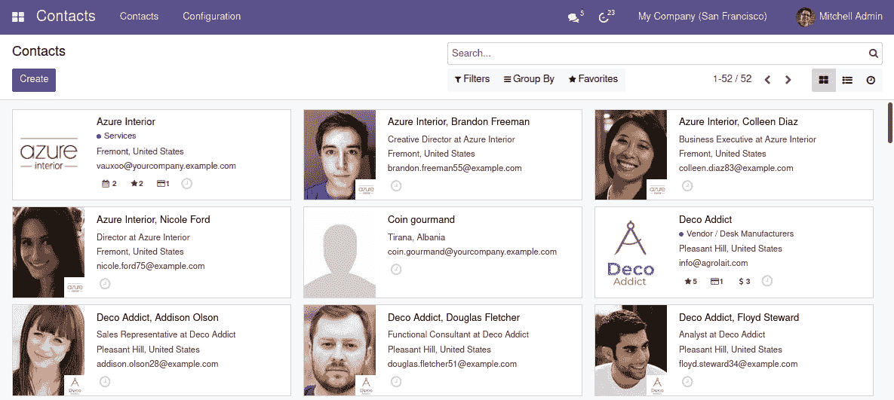

# *第十一章*：看板视图和客户端 QWeb

**看板视图**支持精益流程，提供工作进度和每个工作项状态的视觉表示。这可以是一个重要的工具，用于简化业务流程。

本章介绍了**看板板**的概念，以及它们如何通过使用看板视图类型、阶段列和看板状态在**Odoo**中实现。

看板视图由**QWeb**提供支持——Odoo 使用的模板引擎。它是基于**XML**的，用于生成**HTML**片段和页面。它还用于报告和网站页面，因此是 Odoo 的重要组成部分，开发者应该熟悉。

在本章中，我们将展示如何在多个区域组织看板视图，例如标题和主要内容，以及如何使用 QWeb 语法应用可用的小部件和效果。

将详细描述 QWeb 模板语言，以提供对其功能的完整理解。

后续章节将解释如何扩展看板视图中使用的 QWeb 模板，并介绍一些有用的技术。在这里，你将学习如何添加打算在这些视图中使用的网络资源，例如**CSS**和**JavaScript**。

本章将涵盖以下主题：

+   介绍看板板

+   设计看板视图

+   设计看板卡片

+   探索 QWeb 模板语言

+   扩展看板视图

+   添加 CSS 和 JavaScript 资源

到本章结束时，你将了解看板板，并能够设计自己的看板视图。

# 技术要求

本章将继续增强来自*第十章*的`library_checkout`附加模块，*后端视图 – 设计用户界面*。相应的代码可以在**GitHub**仓库的`ch11/`目录中找到，网址为[`github.com/PacktPublishing/Odoo-15-Development-Essentials.`](https://github.com/PacktPublishing/Odoo-15-Development-Essentials)

# 介绍看板板

**看板**是一个日本词汇，字面意思是**看板**，与精益制造相关。最近，随着**敏捷**方法的采用，**看板板**在软件行业中变得流行。

看板板提供了一个工作队列的视觉表示。板子组织成列，代表工作流程的**阶段**。工作项由放置在板子适当列上的**卡片**表示。新的工作项从最左边的列开始，穿过板子，直到达到最右边的列，代表已完成的工作。

看板板的简洁性和视觉冲击力使其成为支持简单业务流程的好工具。以下是一个基本的看板板示例，有三个列：*待办*、*进行中*和*完成*，如图所示：

`


图 11.1 – 看板看板的一个例子

在许多情况下，与更复杂的流程引擎相比，看板看板是管理流程的一种更有效的方式。

Odoo 支持看板视图 – 与经典列表和表单视图一起 – 以支持看板看板。现在我们知道了什么是看板看板，让我们学习如何使用它。

## 在 Odoo 中支持看板看板

浏览 Odoo 应用，我们可以看到两种不同的使用看板视图的方式。一种是一个简单的**卡片列表**，用于联系人、产品、员工和应用程序等地方。另一种是看板看板，它按流程步骤组织在列中。

对于简单的卡片列表，**联系人**看板视图是一个很好的例子。联系人卡片左侧有一个图片，主区域有一个粗体标题，后面跟着一系列值：



图 11.2 – 联系人看板视图

虽然这个联系人视图使用的是**看板视图**，但它不是一个**看板看板**。

看板看板的例子可以在**CRM**应用的**管道**页面或**项目任务**页面找到。**管道**页面的一个例子在*图 11.3*中展示：


图 11.3 – CRM 管道看板看板

与**联系人**看板视图相比，最重要的区别在于卡片在列中的组织方式。这是通过**分组**功能实现的，这与列表视图使用的类似。通常，分组是在**阶段**字段中进行的。看板视图的一个非常有用的功能是它们支持在列之间拖放卡片，这会自动将相应的值分配给视图分组的字段。

**CRM** **管道**页面的卡片结构稍微复杂一些。主要卡片区域也有一个标题，后面跟着相关信息列表，以及页脚区域。在这个页脚区域，我们可以看到左侧有一个优先级小部件，接着是一个活动指示器，右侧则可以看到负责用户的缩略图。

在本章展示的图中看不到，但卡片在右上角还有一个选项菜单，当鼠标悬停在其上时显示。此菜单允许我们更改卡片的颜色指示器，例如。

观察这两个例子中的卡片，我们可以看到一些差异。实际上，它们的设计非常灵活，没有一种设计看板卡片的方法。但这两个例子为您的设计提供了一个起点。

我们将使用更复杂的结构作为我们检查站看板卡片的标准。

## 理解看板状态

在看板板上，工作项从最左边的列开始，在工作进行过程中，它们会穿过各个列，直到到达最右边的列，这显示了已完成的项目。这暗示了一种**推策略**，这意味着当一个列的工作完成时，工作项会被**推**到下一个列。

推策略往往会引起进行中的工作项的积累，这可能会效率低下。精益方法建议使用**拉策略**代替。在这里，每个阶段会在准备好开始下一个工作项时，从上一个阶段**拉**取工作。

Odoo 通过使用看板状态支持拉策略。每个记录工作项都有一个看板状态字段，表示其流程状态：**进行中**（灰色）、**阻塞**（红色）或**就绪**（绿色）。

当一个阶段所需的工作完成时，不是将卡片移动到下一个列，而是将其标记为**Ready**。这提供了一个视觉指示，表明工作项已准备好被下一个阶段**拉**取。此外，如果有什么阻碍工作前进，它可以被标记为**Blocked**，这提供了一个视觉指示，表明需要帮助来解锁这个工作项。

例如，看板状态在**项目任务**看板视图中被使用。在下面的屏幕截图中，我们可以看到每个卡片右下角的看板状态**灰色-红色-绿色**指示器。还要注意每个列顶部的进度条，它提供了每个状态的项目的视觉指示：


图 11.4 – 带有看板状态的项目任务看板视图

看板状态在每个阶段都是有意义的，因此当项目移动到另一个阶段时，应该重置它。

现在，你已经了解了看板板上的不同视图及其外观。现在，我们将继续学习如何设计它们。

# 设计看板视图

书籍借阅流程可以使用看板视图来可视化进行中的工作。在这种情况下，看板板的列可以代表借阅阶段，每个借阅可以由一张卡片表示。

这就是图书馆借阅看板视图完成后的样子：


图 11.5 – 图书馆借阅看板视图

表单视图主要使用 Odoo 特定的 XML 元素，如`<field>`和`<group>`。它们还使用一些 HTML 元素，如`<h1>`或`<div>`，但它们的使用是有限的。看板视图则恰恰相反。它们基于 HTML，并且还支持两个 Odoo 特定的元素：`<field>`和`<button>`。

使用看板视图，最终在 Web 客户端呈现的 HTML 是动态从 QWeb 模板生成的。QWeb 引擎处理模板中的特殊 XML 标签和属性，以生成最终的 HTML。这允许对内容的渲染方式有更多的控制，但也使得视图设计更加复杂。

由于看板视图设计非常灵活，可以使用不同的设计结构。一个好的方法是找到一个与当前用例很好地匹配的现有看板视图，检查它，并用作参考。

## 创建一个最小可行看板视图

看板视图允许丰富的用户界面，但可能会迅速变得复杂。学习如何设计看板视图的第一步是创建一个最小可行视图。

要将看板视图添加到`library_checkout`模块，请按照以下步骤操作：

1.  在窗口操作的`view_mode`中添加`kanban`。为此，编辑`views/library_menu.xml`文件，并更新`view_mode`字段中的值以匹配以下：

    ```py
      <record id="action_library_checkout"
              model="ir.actions.act_window">
        <field name="name">Checkouts</field>
        <field name="res_model">library.checkout</field>
        <field name="view_mode">
          kanban was added at the beginning of the list to have it as the default view type.
    ```

1.  新的看板视图将添加到一个新的 XML 文件中，`views/checkout_kanban_view.xml`。因此，将此文件添加到`__manifest__.py`模块的`data`键中：

    ```py
        "data": [
            "security/ir.model.access.csv",
            "views/library_menu.xml",
            "views/checkout_view.xml",
            "views/checkout_kanban_view.xml",
            "wizard/checkout_mass_message_wizard_view.xml"
             ,
            "data/stage_data.xml",
        ],
    ```

1.  最后，通过以下代码在`views/checkout_kanban_view.xml`文件中添加一个最小看板视图的 XML 代码：

    ```py
    <odoo>
      <record id="library_checkout_kanban" 
        model="ir.ui.view">
        <field name="model">library.checkout</field>
        <field name="arch" type="xml">
    <kanban>
      <templates>
        <t t-name="kanban-box">
          <div>
            <field name="name" />
          </div>
        </t>
      </templates>
    </kanban>
        </field>
      </record>
    </odoo>
    ```

在前面的代码中，一个看板视图在`<kanban>`元素内部声明。看板视图使用 QWeb 模板语言描述。模板添加在`<templates>`子元素内部。

每个看板卡片的主模板在`<t t-name="kanban-box">`元素中描述。这是一个 QWeb 模板，是最小的。它是一个包含 Odoo 特定`<field>`小部件的 HTML`<div>`元素，该小部件也用于表单和树视图。

这提供了一个相当基本的看板视图 XML 结构，可以从它开始构建。要成为一个看板板，它需要包含每个流程阶段的列。

## 展示看板板列

看板板以列的形式呈现组织好的工作项，其中每个列是流程中的一个阶段。新的工作项从左侧列开始，然后通过列移动，直到到达右侧，完成。

看板视图在按字段分组时以列的形式呈现项目。对于看板板，视图应按阶段或状态字段分组 - 通常，使用`stage_id`。

`default_group_by`属性为看板视图设置默认列组。要有一个用于图书借阅的看板板，编辑`<kanban>`元素，使其看起来像这样：

```py
<kanban default_group_by="stage_id">
```

当打开此视图时，它将默认按阶段分组（类似于*图 11.4*）。用户仍然可以更改用于列表视图的`group_by`选项。

## 理解看板视图属性和元素

看板视图支持一些额外的属性来微调其行为。

`<kanban>`顶级元素支持以下属性：

+   `default_group_by`: 这将设置用于默认列分组的字段。

+   `default_order`: 这将设置用于看板项目的默认排序。

+   `quick_create="false"`: 这将禁用通过仅提供标题描述来创建新项目的`quick_create`选项，使用每个列标题右侧的加号。`false`值是一个 JavaScript 字面量，必须小写。

+   `quick_create_view`：可以可选地用于设置用于`quick_create`函数的特定表单视图。它应该使用表单视图的 XML ID 设置。

+   `class`: 这会给渲染的看板视图的根元素添加一个 CSS 类。一个相关的类是`o_kanban_small_column`，它使得列比默认值更紧凑。可能通过模块提供的 CSS 资产提供额外的类。

+   `group_create`、`group_edit`、`group_delete`和`quick_create_view`：这些可以设置为`false`以禁用在看板列上的相应操作。例如，`group_create="false"`将移除屏幕右侧的垂直**添加新列**栏。

+   `records_draggable="false"`: 这将禁用拖动记录在列之间的功能。

`<kanban>`元素可以包含以下元素：

+   `<field>`: 这用于声明需要从服务器检索的、由 QWeb 模板使用的字段。当这些字段用于 QWeb 评估表达式时，这是必要的。对于在模板 `<field>` 元素中使用的字段，则不需要。

+   `<progressbar>`: 此元素在组列标题上添加进度条小部件。

+   `<templates>`: 在声明看板卡片 QWeb 模板的地方需要此元素。

`<templates>`元素的一个示例可以在之前提供的最小看板视图中看到。下面提供了一个`<progressbar>`元素的示例。

## 向组列添加进度条

**进度条**可以显示列的总数以及表示列记录子状态的彩色条。CRM 流程页面使用它来提供从**计划**到**逾期**的潜在活动摘要。另一个例子是**项目任务**看板中使用的看板状态。

为了做到这一点，首先需要将`kanban_state`添加到模型中，然后可以在视图中使用它。为此，执行以下步骤：

1.  将字段添加到`library.checkout`模型中，按照以下方式编辑`models/library_checkout.py`文件：

    ```py
    # class Checkout(models.Model):
        kanban_state = fields.Selection(
            [("normal", "In Progress"),
             ("blocked", "Blocked"),
             ("done", "Ready for next stage")],
            "Kanban State",
            default="normal")
    ```

1.  当在`write()`方法的开头更改同一文件中的阶段时，添加以下业务逻辑以重置`kanban_state`：

    ```py
        def write(self, vals):
            # reset kanban state when changing stage
    if "stage_id" in vals and "kanban_state" 
    not in vals:
                vals["kanban_state"] = "normal"
            # Code before write ...
            # ...
            return True
    ```

这完成了目前所需的模型更改。在这里，我们专注于添加进度条 - 看板状态小部件将在稍后的部分添加。

`<progressbar>`元素是允许在`<kanban>`标签内使用的三种元素类型之一，与`<field>`和`<templates>`一起。

要将其添加到`<kanban>`视图定义中，编辑元素并添加以下高亮代码：

```py
<kanban>
<progressbar field="kanban_state" 
   colors='{
     "done": "success",
     "blocked": "danger",
     "normal": "muted"}'
sum_fields="num_books" 
  />
  <templates>
    <t t-name="kanban-box">
      <div>
        <field name="name" />
      </div>
    </t>
  </templates>
</kanban>
```

上述代码添加了进度条小部件。`field`属性设置了要使用的模型字段，而`colors`属性将字段值映射到`"danger"`、`"warning"`、`"success"`或`"muted"`颜色。

默认情况下，列总计指示器计算每个列中的项目数量。这可以更改为模型字段中值的总和。在之前的代码中，添加了可选的 `sum_fields` 属性以显示每个列请求中的书籍总数。

到目前为止，我们已经有一个功能齐全的看板视图。然而，看板卡片可以显示更丰富的功能。下一节将专注于这一点，我们将进一步扩展用于渲染看板卡片内容的模板。

# 设计看板卡片

看板卡片的布局相当灵活，并使用由 `<templates>` 元素中声明的 QWeb 模板生成的 HTML。

内容区域通常会包含几个其他区域。以 CRM 流程为蓝图，可以找到以下部分：

+   一个标题区域，包含潜在客户的简要概述

+   一个内容区域，包含数量、客户名称和潜在客户标签

+   一个左侧页脚区域，包含优先级和活动小部件

+   一个右侧页脚区域，包含销售人员头像

+   一个右上角菜单按钮，在这种情况下，在鼠标悬停时可见

这个部分实现了之前的看板卡片结构，并为每个部分填充内容以展示最重要的功能。设计看板卡片的第一个步骤是布局看板卡片框架，这将在下面描述。

注意

提出的看板框架以及使用的某些 CSS 类基于 CRM 流程看板视图。Odoo 模块可以提供特定的 CSS 类并在看板卡片设计中使用它们。因此，当检查来自不同模块的看板视图模板时，这些可能会有所不同。

## 组织看板卡片布局

看板卡片的最小设计现在将扩展到包括几个区域的框架，我们将现在描述这些。

看板卡片定义在 `<templates>` 部分的一个具有 `t-name="kanban-box"` 的元素中。这可以是一个 HTML 元素或一个 QWeb `t-` 指令。本章前面创建的定义使用了中性的 `<t>` QWeb 元素：`<t t-name="kanban-box">`。

继续前进，看板视图模板和 QWeb 模板应该被编辑以标记要工作的区域，如下面的代码所示：

```py
<kanban>
  <!-- Field list to ensure is loaded ... -->
  <templates>
    <t t-name="kanban-box">
      <div class="oe_kanban_global_click">
        <div class="o_dropdown_kanban dropdown">
          <!-- Top-right drop down menu ... -->
        </div>
        <div class="oe_kanban_content">
          <div class="o_kanban_record_title">
            <!-- Title area ... -->
            <field name="name" />
          </div>
          <div class="o_kanban_record_body">
            <!-- Other content area  ... -->
          </div>
          <div class="o_kanban_record_bottom">
            <div class="oe_kanban_bottom_left">
              <!-- Left side footer... -->
            </div>
            <div class="oe_kanban_bottom_right">
                <!-- Right side footer... -->
            </div>
          </div> <!-- o_kanban_record_bottom -->
          <div class="oe_clear"/>
        </div> <!-- oe_kanban_content -->
      </div> <!-- oe_kanban_global_click -->
</t>
```

之前的 QWeb 模板代码为看板卡片中通常看到的各个区域提供了一个框架。

当在 `<t>` 元素中使用 `t-name` QWeb 属性时，此元素只能有一个子元素。这在前面代码中就是这样，并且 `<div>` 子元素必须包含所有其他看板视图元素。

值得注意的是，这个总的 `<div>` 元素使用了 `class="oe_kanban_global_click"` 属性。这使得卡片可点击，当用户这样做时，相应的表单视图将以类似列表视图的方式打开。

下一个任务是专注于每个突出显示的区域，并向其中添加内容。

## 添加标题和其他内容字段

现在我们已经有一个基本的看板卡片框架，可以添加标题和附加数据。

这些将放在 `<div class="oe_kanban_content">` 元素内部。所使用的骨架为这些部分提供了区域：`<div class="o_kanban_record_title">` 和 `<div class="o_kanban_record_body">` 元素。

以下代码扩展了这个部分，以突出显示卡片标题并添加检查请求日期和请求的图书馆成员 ID：

```py
          <div class="o_kanban_record_title">
            <!-- Title area ... -->
            <strong><field name="name" /></strong>
          </div>
          <div class="o_kanban_record_body">
            <!-- Other content area ... -->
            <div><fields name="request_date" /></div>
            <div>
<field name="member_id" 
                widget="many2one_avatar"/>
            </div>
          </div>
```

在这种情况下，可以使用常规 HTML 元素。例如，使用 `<strong>` 元素来突出标题。此外，可以使用 `<field>` 元素来渲染字段值，这些值将以与表单视图类似的方式使用适当的格式进行渲染。在之前的代码中，`request_date` 使用了 `<field>` 元素，因此其内容将使用 Odoo 配置的日期格式进行渲染。它被包裹在一个 `<div>` 元素中，以便在多个字段之间有一个换行。

通过使用特定的小部件来添加 `member_id` 多对一对象，该小部件展示了相应的头像图像以及名称，`widget="many2one_avatar"`。

现在我们已经为卡片添加了一些基本数据元素，让我们看看下拉菜单区域。

## 添加下拉选项菜单

�看板卡片可以在右上角有一个选项菜单。常见选项包括能够编辑或删除记录、为卡片设置颜色或运行任何可以从按钮调用的操作。

以下是为 `oe_kanban_content` 元素顶部添加的选项菜单的基本 HTML 代码：

```py
        <div class="o_dropdown_kanban dropdown">
          <!-- Top-right drop down menu ... -->
          <a class="dropdown-toggle btn"
             role="button" data-toggle="dropdown"
             title="Dropdown menu" href="#">
            <span class="fa fa-ellipsis-v" />
          </a>
          <div class="dropdown-menu" role="menu">
            <!-- Edit menu option -->
            <t t-if="widget.editable">
              <a role="menuitem" type="edit"
                 class="dropdown-item">Edit</a>
            </t>
            <!-- Delete menu option -->
<t t-if="widget.deletable">
              <a role="menuitem" type="delete"
                 class="dropdown-item">Delete</a>
            </t>
            <!-- Separator line -->
            <div role="separator" class=
              "dropdown-divider"/>
            <!-- Color picker option: -->
<ul class="oe_kanban_colorpicker" 
data-field="color" />
            <!-- Set as Done menu option -->
<a t-if="record.state != 'done'" 
               role="menuitem" class="dropdown-item"
name="button_done" type="object">Set 
               as Done</a>
          </div>
        </div>
```

在这里，有一些使用可能未加载到视图中的字段的 QWeb 表达式。特别是，最后的 `t-if` 表达式使用了记录的 `state` 字段。为了确保这个字段在表单中可用，它应该紧接在 `<kanban>` 元素之后添加：

```py
<kanban>
  <!-- Field list to ensure is loaded ... -->
  <field name="state" />
```

让我们分解下拉菜单代码并查看添加的关键元素：

+   在 HTML 锚点 (`<a>`) 元素中的省略号图标，用于显示菜单按钮。

+   一个 `<div class="dropdown-menu" role="menu">` 元素，包含菜单选项。

+   带有 `type="edit"` 的 `<a>` 元素。

+   带有 `type="delete"` 的 `<a>` 元素。

+   使用 `<div role="separator" class="dropdown-divider"/>` 创建的分隔线。

+   使用 `<ul class="oe_kanban_colorpicker" />` 元素添加的颜色选择器菜单选项。`data-field` 属性设置了用于存储选择的颜色的字段。这个功能将在下一节中实现，所以现在它不会正常工作。

+   一个与按钮点击等效的菜单项，通过 `<a>` 元素添加，具有与常规按钮相同的 `name` 和 `type` 属性。这个特定的一个使用 `name="button_done" type="object"`。

一些菜单项，如 `t-if` QWeb 指令。这个和其他 QWeb 指令将在本章的 *探索 QWeb 模板语言* 部分中更详细地解释。

`widget` 全局变量代表一个 `KanbanRecord()` JavaScript 对象，它负责渲染当前看板卡片。两个特别有用的属性是 `widget.editable` 和 `widget.deletable`，这允许我们检查相应的操作是否可用。

可以通过添加类似 **设置为完成** 选项的额外 `<a>` 元素以类似的方式添加菜单项。

可以使用可以记录字段值的 JavaScript 表达式来显示或隐藏菜单项。例如，`state` 字段未设置为 `done`。

颜色选择器菜单选项使用一个特殊的 widget，该 widget 使用 `color` 模型字段来存储选择的颜色。虽然颜色选择器可用，但我们尚未添加设置卡片的功能。让我们在下节中完成这个操作。

## 添加看板卡片颜色指示器

看板卡片可以设置用户选择的颜色。这会在卡片左侧绘制一个条形，并且可以方便地定位项目。

要应用的颜色是通过卡片菜单上的颜色选择器选项选择的。这通过一个 `<ul class="oe_kanban_colorpicker" data-field="color"/>` 元素添加，如前节所示。`data-field` 属性设置了要使用的字段，在这种情况下是 `color`。

要添加看板颜色卡片指示器，完成以下步骤：

1.  通过编辑 `models/library_checkout.py` 文件，按以下方式在 `library.checkout` 模型中添加颜色字段：

    ```py
    # class Checkout(models.Model):
    # ...
        color = fields.Integer()
    ```

    这是一个常规的整数字段。颜色选择器 widget 将可选颜色映射到数字。

1.  现在，可以通过 QWeb 在看板卡片上使用颜色字段设置动态 CSS 样式。首先，通过添加以下代码将其添加到要加载的字段中：

    ```py
    <kanban>
      <!-- Field list to ensure is loaded ... -->
      <field name="color" />
      <field name="state" />
    ```

1.  最后，编辑看板卡片顶部的 `<div>` 元素以添加动态颜色样式，如下面的代码所示：

    ```py
        <t t-name="kanban-box">
          <div t-attf-class="oe_kanban_global_click
             {{!selection_mode ? 'oe_kanban_color_' +
    kanban_getcolor(record.color.raw_value) : 
            ''}}">
    ```

上述代码使用 `t-attf-class` 动态计算要应用的 CSS 类。在 `{{ }}` 块中声明了一个 JavaScript 表达式，用于评估并返回要使用样式，这取决于 `color` 字段值。这完成了添加看板颜色卡片指示器的步骤。

看板卡片还有更多小部件可供选择。接下来的几节将展示如何使用它们，我们将把它们添加到卡片页脚部分。

## 添加优先级和活动小部件

优先级小部件显示为可以点击以选择优先级级别的星号列表。这个小部件是一个 `widget="priority"` 的 `<field>` 元素。优先级字段是一个 `Selection` 字段，声明了可用的几个优先级级别。

需要修改 `library.checkout` 模型以添加优先级字段。为此，完成以下步骤：

1.  按以下方式编辑 `models/library_checkout.py` 文件：

    ```py
    # class Checkout(models.Model):
    # ...
    <field name="activity_ids">) with widget="kanban_activity".
    ```

1.  现在，需要在左侧的看板模板中添加相应的 `<field>` 元素。因此，插入优先级小部件：

    ```py
    <div class="oe_kanban_footer_left"> 
      <!-- Left side footer... --> 
    <field name="priority" widget="priority"/> 
    <field name="activity_ids" 
        widget="kanban_activity"/>
    </div>
    ```

看板卡片现在已在页脚左侧添加了优先级和活动小部件。接下来，我们将在右侧页脚添加更多小部件。

## 添加看板状态和小部件

看板状态小部件为项目呈现交通灯颜色。它是一个使用`widget="kanban_state_selection"`的`<field>`元素。

对于相关的用户记录，有一个特定的小部件可供使用：`widget="many2one_avatar_user"`。

这两个示例都将添加到看板卡片右下角，如下面的代码所示：

```py
<div class="oe_kanban_footer_right">
  <!-- Right side footer... -->
  <field name="kanban_state"
         widget="kanban_state_selection" />
  <field name="user_id"
         widget="many2one_avatar_user" />
</div>
```

使用`<field>`元素和`kanban_state_selection`小部件添加看板状态。

使用`user_id`字段和`widget="many2one_avatar_user"`小部件添加用户头像图像。

另一个重要的话题是在看板卡片上使用动作，我们将在下一节中讨论。

## 在看板视图元素中使用动作

在 QWeb 模板中，链接的`<a>`标签可以有一个`type`属性。这设置了链接将执行的动作类型，以便链接可以像常规表单中的按钮一样操作。因此，除了`<button>`元素外，`<a>`标签也可以用来运行 Odoo 动作。

就像表单视图一样，动作类型可以设置为`action`或`object`，并且应该有一个`name`属性来标识要执行的具体动作。此外，以下动作类型也是可用的：

+   `open`：这会打开相应的表单视图。

+   `edit`：这会直接以编辑模式打开相应的表单视图。

+   `delete`：这会删除记录并从看板视图中移除项目。

这完成了我们对设计看板视图的概述。看板视图使用 QWeb 模板语言，这里使用了几个示例。下一节将深入探讨 QWeb。

# 探索 QWeb 模板语言

QWeb 解析器在模板中寻找特殊指令，并用动态生成的 HTML 替换它们。这些指令是 XML 元素属性，可以在任何有效的标签或元素中使用——例如，`<div>`、`<span>`或`<field>`。

有时，需要使用 QWeb 指令，但我们不希望在模板中的任何 XML 元素中放置它。对于这些情况，可以使用`<t>`特殊元素。它可以有 QWeb 指令，如`t-if`或`t-foreach`，但它是无声的，并且不会对最终生成的 XML/HTML 产生任何影响。

QWeb 指令经常使用评估表达式来产生依赖于记录值的不同效果。用于评估这些表达式的语言取决于 QWeb 执行的环境。有两种不同的 QWeb 实现：**客户端** **JavaScript** 和 **服务器端** **Python**。报告和网站页面使用 QWeb 的服务器端 Python 实现。

�看板视图使用客户端 JavaScript 实现。这意味着看板视图中使用的 QWeb 表达式应该使用 JavaScript 语法编写，而不是 Python。

当显示看板视图时，内部步骤大致如下：

1.  获取用于渲染模板的 XML。

1.  调用服务器`read()`方法以获取模板中使用的字段数据。

1.  定位到`kanban-box`模板，并使用 QWeb 进行解析以输出最终的 HTML 片段。

1.  在浏览器显示中注入 HTML（**文档对象模型**（**DOM**））。

这并不是要精确的技术描述。它只是一个思维导图，有助于理解看板视图中事物的工作方式。

接下来，我们将学习 QWeb 表达式评估，并探索可用的 QWeb 指令，使用示例来增强结账看板卡片。

## 理解 QWeb JavaScript 评估上下文

许多 QWeb 指令使用的是用于产生某些结果的计算表达式。当在客户端使用（如看板视图的情况）时，这些表达式用 JavaScript 编写。它们在一个包含一些有用变量的上下文中进行评估。

可用`record`对象表示当前记录，包含从服务器请求的字段。字段值可以通过`raw_value`或`value`属性访问：

+   `raw_value`：这是`read()`服务器方法返回的值，因此更适合用于条件表达式。

+   `value`：这是根据用户设置格式化的，并旨在在用户界面中显示。这通常对日期、日期时间、浮点数、货币和关系字段很有用。

QWeb 评估上下文也可以引用 JavaScript 网络客户端实例。为了利用这一点，需要对网络客户端架构有良好的理解。在本章中，我们无法对此进行详细说明。然而，出于参考目的，以下标识符在 QWeb 表达式评估中可用：

+   `widget`：这是对当前`KanbanRecord()`小部件对象的引用，负责将当前记录渲染为看板卡片。它公开了一些我们可以使用的辅助函数。

+   `record`：这是`widget.record`的快捷方式，提供使用点符号访问可用字段。

+   `read_only_mode`：这表示当前视图是否处于只读模式（而不是编辑模式）。它是`widget.view.options.read_only_mode`的快捷方式。

+   `instance`：这是对完整网络客户端实例的引用。

由于 QWeb 模板是写在 XML 文件中的，因此对某些不被 XML 格式接受的字符（如小于号`<`）的使用有限制。当需要这些字符时——例如，用于描述 JavaScript 表达式——需要使用转义替代字符。

这些是可用于不等式操作的替代符号：

+   `&lt;`表示小于（`<`）。

+   `&lt;=`表示小于或等于（`<=`）。

+   `&gt;`表示大于（`>`）。

+   `&gt;=`表示大于或等于（`>=`）。

前面的比较符号不是 Odoo 特有的，而是 XML 格式标准的一部分。

之前的符号可以在 QWeb 评估表达式中使用，并且它们通常用于计算`t-out`指令要渲染的文本，我们将在下一节中描述。

## 使用`t-out`指令渲染值

`<field>`元素可用于渲染字段值，其优点是 Odoo 会为我们正确格式化输出。但这个限制是只能显示字段内容。

然而，`t-out`指令可以渲染代码表达式的结果作为 HTML 转义值：

```py
<t t-out="'Requested on ${record.request_date.value}'" />
```

之前的代码渲染了 JavaScript 表达式的结果。`record`代表从 Odoo 服务器检索的记录，并提供对字段的访问。`value`属性返回正确格式化的内容，就像`<field>`元素返回的那样。`raw_value`属性返回未格式化的原生值。

Odoo 15 的变化

`t-out`指令是在`t-esc`指令中引入的，直到`t-raw`指令也被弃用。它之前被用来渲染原始值而不进行 HTML 转义，使用它存在安全风险。

## 使用`t-set`指令为变量赋值

对于更复杂的逻辑，表达式的结果可以存储到变量中，以便在模板中稍后使用。这需要使用`t-set`指令来设置变量名称，然后使用`t-value`指令来计算要分配的值。

例如，以下代码在请求还没有行时将标题渲染为红色。它使用`red_or_black`变量作为要使用的 CSS 类，如下所示：

```py
<t t-set="red_or_black"
t-value="record.num_books == 0 ? '' : 
    'oe_kanban_text_red'"
/>
<strong t-att-class="red_or_black">
  <field name="name" />
</strong>
```

之前的示例中有一个使用`num_books`字段的代码表达式，因此我们需要确保它通过在`<kanban>`顶部元素内添加`<field name="num_books" />`元素来加载。

变量也可以分配 HTML 内容，如下例所示：

```py
<t t-set="calendar_sign">
  <i class="fa fa-calendar" title="Calendar" />
</t>
<t t-out="calendar_sign" />
```

之前的代码将 HTML 内容分配给`calendar_sign`变量，然后使用`t-out`指令进行渲染。

## 使用`t-attf-`进行动态属性字符串替换

我们的看板卡片使用`t-attf-` QWeb 指令在顶部的`<div>`元素中动态设置一个类，这样卡片颜色就取决于`color`字段值。为此，使用了`t-attf-` QWeb 指令。

`t-attf-`指令通过字符串替换动态生成标签属性。这允许动态生成较大字符串的部分，例如 URL 或 CSS 类名。

指令寻找将被评估并替换为结果的代码块。这些块由`{{`和`}}`或`#{`和`}`分隔。块的内容可以是任何有效的 JavaScript 表达式，并且可以使用 QWeb 表达式可用的任何变量，例如`record`和`widget`。

在这种情况下，使用了`kanban_color()` JavaScript 函数。这是专门提供的，用于将颜色索引数字映射到 CSS 类颜色名称。

作为详细示例，这个指令将被用来动态改变请求日期的颜色，如果优先级高，则显示为红色字母。为此，看板卡片中的`<field name="request_date"/>`元素应替换为以下内容：

```py
<div t-attf-class="oe_kanban_text_{{
  record.priority.raw_value &lt; '2'
  ? 'black' : 'red' }}">
  <field name="request_date"/>
</div>
```

这将导致`class="oe_kanban_text_red"`或`class="oe_kanban_text_black"`，具体取决于优先级值。这是动态评估的——这意味着当用户点击优先级小部件更改它时，日期颜色会立即改变。

## 使用 t-att-动态属性计算表达式

`t-att-` QWeb 指令可以从表达式评估中动态生成一个属性值。

例如，之前章节中使用的`t-attf-`属性产生的格式化效果，也可以使用`t-att-`来实现。以下代码展示了这种替代实现：

```py
<div t-att-class="record.priority.raw_value &lt; '2'
  ? 'oe_kanban_text_black' : 'oe_kanban_text_red'">
  <field name="request_date"/>
</div>
```

当表达式评估为假等价值时，属性根本不会渲染。这对于特殊的 HTML 属性，如`checked`输入字段非常重要。

## 使用 t-foreach 循环

遍历循环对于重复特定的 HTML 块很有用。为此，使用`t-foreach`指令与返回可迭代值的表达式一起使用。它需要伴随一个`t-as`指令，该指令设置迭代值的变量名。

这可以用来展示在结账时请求的书籍标题。这需要在`lines_ids`字段上循环。

注意，`line_ids`元素的可用值是数据库 ID，而不是记录对象。这可以通过在`<!-- 其他内容区域 -->`区域添加以下代码来确认：

```py
<div>
  <t t-foreach="record.line_ids.raw_value" t-as="line">
    <t t-out="line" />;
  </t>
</div>
```

`t-foreach`指令接受一个评估为集合的 JavaScript 表达式，用于迭代。`record.<field>.value`返回字段值的字符串表示，而`record.<field>.raw_value`返回数据库存储的值。对于多对多字段，这是一个 ID 列表：

+   `t-as`指令设置用于引用每个迭代值的变量名。

+   `t-out`指令评估提供的表达式——在这种情况下，只是`line`变量名——并安全地渲染转义后的 HTML。

展示记录 ID 并不很有趣。然而，我们有一个 JavaScript 函数可以用来获取 ID 的图片：`kanban_image()`。

要使用这个功能，首先，结账行需要支持图片。为此，需要编辑`models/library_checkout_line.py`文件，添加一个用于书封图片的字段：

```py
    book_cover = fields.Binary(related="book_id.image")
```

现在，这个字段可以在看板卡片中使用：

```py
<div>
  <t t-foreach="record.line_ids.raw_value" t-as="line">
    <t t-out="line" />;
     
  </t>
</div>
```

上述代码在每个结账行中渲染书籍标题的图片。

如果有很多行，这可能对于看板卡片来说内容太多。由于`t-foreach`对象是一个 JavaScript 表达式，它可以使用额外的语法来限制允许的封面缩略图的数目。JavaScript 数组有一个`slice()`方法来提取元素子集。

这可以通过以下 `for` 循环的变体来限制数量为前五个元素：

```py
<t t-foreach="record.line_ids.raw_value.slice(0, 5)" t-as="line>
```

`for` 循环有一些辅助变量可用。这些变量是自动生成的，并且以前面定义的变量名作为前缀。

如果使用 `t-as="rec"`，其中 `rec` 被设置为变量名，辅助变量如下：

+   `rec_index`：这是迭代索引，从零开始。

+   `rec_size`：这是集合中元素的数量。

+   `rec_first`：在迭代的第一个元素上为 `true`。

+   `rec_last`：在迭代的最后一个元素上为 `true`。

+   `rec_even`：在偶数索引上为 `true`。

+   `rec_odd`：在奇数索引上为 `true`。

+   `rec_parity`：这可以是 `odd` 或 `even`，具体取决于当前索引。

+   `rec_all`：这代表正在迭代的对象。

+   `rec_value`：在迭代 `{key:value}` 字典（`rec` 保留键名）时持有值。

例如，当呈现一个以逗号分隔的值列表时，我们希望避免在最后一个迭代中出现尾随逗号。借助 `_last` 循环变量，避免在最后一个迭代中渲染它很容易。以下是一个示例：

```py
<t t-foreach="record.line_ids.raw_value" t-as="rec">
  <t t-out="rec" />
  <t t-if="!rec_last">;</t>
</t>
```

`rec_last` 变量在最后一个记录上为 `true`。通过使用 `!rec_last` 取反，可以在除了最后一个迭代之外的所有迭代中打印逗号。

## 使用 t-if 应用条件

`t-if` 指令期望在客户端渲染看板视图时，在 JavaScript 中评估一个表达式。只有当条件评估为 `true` 时，标签及其内容才会被渲染。

在我们的示例中，它在结账看板视图中被用来根据某些条件提供菜单选项。

再举一个例子，我们可以显示借阅的书籍的结账编号，但仅当视图有任何行时。这可以通过在 `<!-- 其他内容区域 -->` 区域添加以下代码来确认：

```py
<div> t-if="record.num_books.raw_value &gt; 0"> 
  <field name="num_books"/> books 
</div>>
```

在这里，我们使用了一个 `t-if="<expression>">` 属性来渲染一个元素及其内容，仅当使用的表达式评估为 `true` 时。注意，条件表达式使用 `&gt;` 符号而不是 `>` 来表示大于操作。

`else if` 和 `else` 条件也支持使用 `t-elif` 和 `t-else` 指令。以下是一个使用示例：

```py
<div t-if="record.num_books.raw_value == 0">
  No books!
</div>
<div t-elif="record.num_books.raw_value == 1">
  One book
</div>
<div t-else="">
  <field name="num_books"/> books
</div>
```

这些条件对于在特定情况下渲染特定元素非常有用。

另一个有用的功能是能够将模板分解成更小的可重用片段，这些片段可以使用 `t-call` 包含。以下部分解释了这是如何工作的。

## 使用 t-call 调用和重用模板

而不是反复重复相同的 HTML 块，可以使用构建块来组合更复杂的用户界面视图。QWeb 模板可以用作可重用的 HTML 片段，这些片段可以插入到其他模板中。

可重用模板定义在 `<templates>` 标签内，并由具有 `t-name` 属性且不同于 `kanban-box` 的顶级元素标识。然后可以使用 `t-call` 指令包含这些其他模板。这适用于在同一看板视图中声明的模板，在同一插件模块的其他地方，甚至在不同的插件中。

例如，可以将封面列表隔离在可重用的片段中。为此，可以在 `<t t-name="kanban-box">` 节点之后在 `<templates>` 元素中添加另一个模板，如下面的示例所示：

```py
<t t-name="book_covers">
  <div>
    <t t-foreach="record.line_ids.raw_value" t-as="line">
      <t t-out="line" />;
      
    </t>
  </div>
</t>
```

然后，可以使用 `t-call` 指令在 `kanban-box` 主模板中调用此模板：

```py
<t t-call="book_covers" />
```

要调用在其他插件模块中定义的模板，必须使用 `module.name` 完整标识符，类似于其他视图发生的方式。例如，此片段可以使用 `library_checkout.book_covers` 完整标识符在其他模块中引用。

被调用的模板在相同的上下文中运行，因此调用者中可用的任何变量名在处理被调用的模板时也是可用的。

一个更优雅的替代方案是将参数传递给被调用的模板。这是通过在 `t-call` 标签内设置变量来完成的。这些变量将仅在子模板上下文中评估和可用，而在调用者上下文中不存在。

例如，`books_cover` 模板可以有一个参数来设置要显示的最大封面数，而不是在子模板中硬编码。首先，应该编辑 `book_covers` 模板，将固定限制替换为变量，例如 `limit`：

```py
<t t-name="book_covers">
  <div>
    <t t-foreach="record.line_ids.raw_value.slice(0, 
      limit)"
       t-as="line">
      <t t-out="line" />;
      
    </t>
  </div>
</t>
```

现在，`t-call` 必须使用嵌套的 `t-set` 指令来设置此变量，如下面的代码所示：

```py
<t t-call="book_covers"> 
  <t t-set="limit" t-value="3" /> 
</t>
```

`t-call` 元素内的整个内容也通过 `0` 魔术变量对子模板可用。而不是参数变量，可以在 `t-call` 元素内添加 HTML 代码片段，然后可以在被调用的模板中使用 `<t t-out="0" />` 来使用它。这对于构建布局以及以模块化方式组合/嵌套 QWeb 模板特别有用。

## 使用字典和列表动态设置属性

我们已经介绍了最重要的 QWeb 指令，但还有一些需要了解。现在，我们将简要解释它们。

在这里，引入了 `t-att-NAME` 和 `t-attf-NAME` 风格的动态标签属性。此外，还可以使用固定的 `t-att` 指令。它接受键值映射字典或一对（即，一个两元素列表）。

例如，考虑以下映射：

```py
<p t-att="{'class': 'oe_bold', 'name': 'Hello'}" />
```

上述代码产生以下结果：

```py
<p class="oe_bold" name="Hello" />
```

`t-att` 也可以与列表或值对一起工作。例如，考虑以下：

```py
<p t-att="['class', 'oe_bold']" />
```

上述代码产生以下结果：

```py
<p class="oe_bold" />
```

这些特殊方式为元素分配属性在存在一些服务器端处理的情况下可能很有用，并且可以使用结果字典或列表在单个 `t-att` 元素上应用模板元素。

这完成了对 QWeb 模板语言的合理概述，特别关注看板视图应用，尽管 QWeb 语言也用于服务器端 – 例如，它可以用于报告和网站页面。

毫不奇怪，QWeb 模板提供了一个扩展机制。我们将在下一节中探讨这一点。

# 扩展看板视图

用于看板视图和报告的模板可以像其他视图类型一样扩展：即声明要匹配的元素，可能使用 XPath 表达式，并使用位置属性设置扩展应该做什么（例如，在匹配元素之后或之前添加新元素）。这些技术将在*第四章* *扩展模块*中详细解释。

在实践中，看板视图和 QWeb 模板比常规表单视图更复杂，匹配要扩展的元素可能很棘手。

使用 `<field>` 元素作为选择器可能很困难。在看板视图中，相同的字段名可能被包含多次：在开始时，在要加载的字段列表中，然后在看板框模板内部再次出现。由于选择器将匹配找到的第一个字段元素，因此修改不会应用于模板内部，正如预期的那样。

例如，XPath 表达式 `//t[@t-name='kanban-box']//field[@name='name']` 定位到匹配 `<t t-name="kanban-box">` 的任何子元素，然后找到匹配 `<field name="name">` 的任何进一步子元素。

另一个挑战是频繁使用没有明确标识符的 HTML 元素，例如 `<div>` 或 `<span>`。在这些情况下，需要使用非平凡匹配条件的 XPath 表达式。例如，`//div/t/img` XPath 表达式匹配一个 `<div><t>` 嵌套元素序列。

以下是一个扩展 `Contacts` �看板视图的示例：

```py
<record id="res_partner_kanban_inherit" model="ir.ui.view"> 
  <field name="name">Contact Kanban modification</field> 
  <field name="model">res.partner</field> 
  <field name="inherit_id" 
    ref="base.res_partner_kanban_view" /> 
  <field name="arch" type="xml"> 
    <xpath
     expr="//t[@t-name=
       'kanban-box']//field[@name='display_name']" 
     position="before"> 
     <span>Name:</span> 
    </xpath> 
  </field> 
</record>
```

在上一个示例中，XPath 在 `<t t-name="kanban-box">` 元素内部查找 `<field name="display_name">` 元素。这排除了 `<templates>` 部分之外的相同字段元素。

对于复杂的 XPath 表达式，一些命令行工具可以帮助探索正确的语法。 

`xmllint` 命令行实用程序 – 来自 `libxml2-utils` 的 `--xpath` 选项，用于对 XML 文件进行查询。以下是如何使用它的示例：

```py
$ xmllint --xpath "//templates//field[@name='name']" library_checkout/views/checkout_view.xml
```

另一个选项是 `xpath` 命令，来自 Debian/Ubuntu 软件包的 `libxml-xpath-perl`。以下是如何使用它的示例：

```py
$ xpath -e "//templates//field[@name='name']" library_checkout/views/checkout_view.xml
```

这些工具可以用来快速尝试和测试 XML 文件上的 XPath 表达式。

到目前为止，你已经看到了如何创建和扩展看板视图。然而，这些可以利用额外的 JavaScript 和 CSS 资产来实现效果。下一节将解释如何添加这些组件。

# 添加 CSS 和 JavaScript 资产

看板视图主要是 HTML，并大量使用 CSS 类。在本章中，代码示例中介绍了一些标准 CSS 类，但模块也可以提供自己的 CSS。

通常使用的约定是将资产文件放在`/static/src`子目录中。

模块 Web 资源在`assets`键中的`manifest`文件中声明。此文件使用一个字典设置，将资产包映射到要扩展的资产和要添加到其中的资产列表。

这提供了向 Odoo 模块添加 Web 资产（如 CSS 和 JavaScript 资产）的工具。这些 Web 资产文件提供了一种结构化的方式，以更好地提供用户界面元素，从而提供更丰富的用户体验。

然后，它们可以在本章前几节讨论的模块的 QWeb 模板中使用。

这里是`library_checkout`附加模块的一个示例。编辑`__manifest__.py`文件，添加以下内容：

```py
    "assets": {
        "web.assets_backend": {
            "library_checkout/static/src/css/checkout.css",
            "library_checkout/static/src/js/checkout.js",
        }
    }
```

以下代码向`web.assets_backend`资产包添加了 CSS 和 JavaScript 文件。

可用的主要资产包如下：

+   `web.assets_common`：这包含 Web 客户端、网站以及销售点的通用资产。

+   `web.assets_backend`：这包含特定于后端 Web 客户端的资产。

+   `web.assets_frontend`：这包含可供公共网站使用的资产。

`assets`清单键是在 Odoo 15 中引入的。对于之前的 Odoo 版本，资产是通过 XML 模板继承声明的。我们将在下一节中解释这一点。

## 在 Odoo 15 之前添加资产

在之前的 Odoo 版本中，资产是通过扩展资产包的 XML 文件添加的。执行此操作的 XML 文件通常放置在`views/`模块子目录中。

以下示例向`library_checkout`模块添加了 CSS 和 JavaScript 文件。添加`views/assets.xml`文件，并包含以下代码：

```py
<odoo> 
  <template id="assets_backend" 
    inherit_id="web.assets_backend"
    name="Library Checkout Kanban Assets" >
    <xpath expr="." position="inside">
      <link rel="stylesheet"
       href="/library_checkout/static/src/css/checkout.css"
      />
      <script type="text/javascript"
       src="img/checkout.js">
      </script>
    </xpath>
  </template>
</odoo>
```

如同往常，此代码也应添加到`__manifest__.py`描述符文件的`data`键中。

# 摘要

本章涵盖了看板视图，并展示了它们如何作为强大的用户界面工具。到现在为止，你应该理解了看板板，并且你拥有了设计看板视图所需的技术。

在本章中，你还探索了驱动看板视图的 QWeb 模板语言。通过本章中的示例，你现在应该知道如何使用其功能。

如 Odoo 所预期，看板视图和 QWeb 模板也可以以与其他视图类型类似的方式由其他模块扩展。阅读完本章后，你应该知道如何使用此功能在看板视图中使用额外的技术。

最后，我们还讨论了在高级看板视图中使用 CSS 和 JavaScript 资产。我们还探讨了这些资产必须由模块提供，并且必须添加到后端资产中。你现在知道如何实现这一点。

下一章将继续探索 QWeb，但这次我们将关注服务器端，并了解如何设计可打印的报告。

# 进一步阅读

以下参考资料补充了本章讨论的主题：

+   关于 QWeb 的官方 Odoo 文档：https://www.odoo.com/documentation/15.0/developer/reference/frontend/qweb.html

+   **Bootstrap** CSS 文档：https://getbootstrap.com/docs/4.1/getting-started/introduction/

+   **Font Awesome** 图标索引：https://fontawesome.com/v4.7.0/icons/
