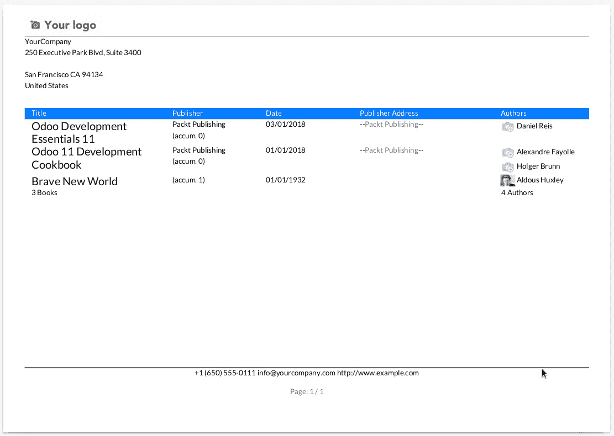

# *第十二章*：使用服务器端 QWeb 创建可打印的 PDF 报告

虽然常规视图可以为用户提供有价值的信息，但有时需要打印输出。可能是一个要发送给客户的 PDF 文档，或者是一个需要支持物理过程的纸质文档。为了解决这些问题，Odoo 应用程序支持打印业务报告。这些报告使用 QWeb 生成，然后导出为 PDF 文档，之后可以打印、发送电子邮件或简单地存储。

基于 QWeb 意味着可以重复使用用于看板视图和网页的相同技能来设计报告。除了 QWeb 之外，还使用特定的机制，例如报告操作、纸张格式以及可用于 QWeb 报告渲染的变量。

在本章中，将通过示例说明如何构建和向报告添加内容。通常的报告结构包括**页眉**、**详细信息**和**页脚**部分。可以添加的内容包括**字段数据**，包括图像等特定小部件。在报告中，通常还需要展示总计。所有这些内容将在本章中详细解释。

本章将涵盖以下主题：

+   安装 wkhtmltopdf

+   创建业务报告

+   设计报告内容

+   创建自定义报告

到本章结束时，您将熟悉创建 Odoo 报告所需的所有步骤，从报告操作到可以在 QWeb 模板上使用的特定技术。

# 技术要求

本章扩展了基于在*第三章*中首先创建的代码的现有`library_app`附加模块，即*您的第一个 Odoo 应用程序*。本章的代码可以在本书的 GitHub 存储库中找到，位于[`github.com/PacktPublishing/Odoo-15-Development-Essentials`](https://github.com/PacktPublishing/Odoo-15-Development-Essentials)的`ch12/`子目录中。

# 安装 wkhtmltopdf

Odoo 报告只是被转换为 PDF 文件的 HTML 页面。为此转换，使用了`wkhtmltopdf`命令行工具。其名称代表**Webkit HTML to PDF**。

为了正确生成报告，需要安装推荐的`wkhtmltopdf`实用程序版本。已知某些版本的`wkhtmltopdf`库存在问题，例如无法打印页面页眉和页脚，因此我们需要对我们使用的版本进行挑剔。

自 Odoo 10 以来，版本 0.12.5 是官方推荐的版本。有关`wkhtmltopdf`的最新 Odoo 信息，可以在[`github.com/odoo/odoo/wiki/Wkhtmltopdf`](https://github.com/odoo/odoo/wiki/Wkhtmltopdf)找到。

Debian 或 Ubuntu 提供的打包版本可能不合适。因此，建议直接下载并安装正确的包。下载链接可以在[`github.com/wkhtmltopdf/wkhtmltopdf/releases/tag/0.12.5`](https://github.com/wkhtmltopdf/wkhtmltopdf/releases/tag/0.12.5)找到。

要安装正确的`wkhtmltopdf`版本，请按照以下步骤操作：

1.  首先，确保系统上没有安装不正确的版本，请输入以下命令：

    ```py
    $ wkhtmltopdf --version
    ```

1.  如果前面的命令报告的版本不是推荐的版本，则应卸载它。要在 Debian/Ubuntu 系统上这样做，请输入以下命令：

    ```py
    $ sudo apt-get remove --purge wkhtmltopdf
    ```

1.  接下来，您需要下载适合您系统的适当包并安装它。检查发布页面以获取正确的下载链接。在 Odoo 15 发布时，Ubuntu 20.04 LTS *Focal Fossa* 是最新的长期支持版本。对于 64 位架构，安装`wkhtmltox_0.12.5-1.focal_amd64.deb`包。在这种情况下要使用的下载命令如下：

    ```py
    $ wget "https://github.com/wkhtmltopdf/wkhtmltopdf/releases/download/0.12.5/wkhtmltox_0.12.5-1.focal_amd64.deb" -O /tmp/wkhtml.deb
    ```

1.  接下来，使用以下命令安装下载的包：

    ```py
    $ sudo dpkg -i /tmp/wkhtml.deb
    ```

    这可能因为缺少依赖项而显示错误。在这种情况下，可以使用以下命令来修复：

    ```py
    $ sudo apt-get -f install
    ```

1.  最后，使用以下命令验证`wkhtmltopdf`库是否已正确安装并带有预期的版本号：

    ```py
    $ wkhtmltopdf --version
    wkhtmltopdf 0.12.5 (with patched qt)
    ```

通过这样，您已成功安装了正确的`wkhtmltopdf`版本，并且现在 Odoo 服务器日志在启动过程中不会显示**您需要 Wkhtmltopdf 以打印报告的 PDF 版本**的信息消息。

现在您已经知道了如何下载和安装适合的`wkhtmltopdf`工具版本，让我们看看如何创建商业报告。

# 创建商业报告

对于图书馆应用来说，打印包含图书目录的报告将非常有用。这份报告应列出书名，以及如**出版社**、**出版日期**和**作者**等详细信息。

我们将在本章中实现这一点，并在过程中展示实现 Odoo 报告所涉及的几种技术。报告将被添加到现有的`library_app`模块中。

习惯上，报告文件应放在`/reports`子目录中，因此将添加一个`reports/library_book_report.xml`数据文件。像往常一样，在添加数据文件时，请记住在`__manifest__.py`文件的`data`键中声明它们。

要运行报告，我们首先必须添加报告操作。

## 添加报告操作

`ir.actions.report` XML 模型，可以通过使用**设置** | **技术** | **操作** | **报告**菜单选项进行检查。

Odoo 14 中的变化

Odoo 14 已弃用用于报告操作的`<report>`快捷标签。应使用`<record model=""ir.actions.report">`元素代替。

要添加报告操作并触发报告的执行，请编辑`reports/library_book_report.xml`文件，如下所示：

```py
<odoo>
  <record id="action_library_book_report"
          model="ir.actions.report">
    <field name="name">Book Catalog</field>
    <field name="model">library.book</field>
    <field name="report_type">qweb-pdf</field>
    <field name="report_name">
      library_app.book_catalog</field>
    <field name="binding_model_id" 
      ref="model_library_book" />
    <field name="binding_type">report</field>
  </record>
</odoo>
```

此报告操作使此报告在 **图书馆书籍** 视图的顶部可用，在 **打印** 按钮旁边，紧挨着 **操作** 按钮：


图 12.1 – 打印上下文按钮

这标志着向用户提供报告的第一步。

在之前的代码中使用的必要字段如下：

+   `name` 是报告操作的标题。

+   `model` 是报告基础模型的名称。

+   `report_type` 是要生成的文档类型。选项有 `qweb-pdf`、`qweb-html` 或 `qweb-text`。

+   `report_name` 是用于生成报告内容的 QWeb 模板的 XML ID。与其他标识符引用不同，它必须是一个完整的引用，包括模块名称；即 `<module_name>.<identifier_name>`。

    小贴士

    在报告开发过程中，将 `report_type` 设置为 `qweb-html` 允许您检查由 QWeb 模板生成的 HTML 结果，并且它还使解决问题更容易。完成此操作后，可以将其更改为 `qweb-pdf`。

以下字段不是添加报告操作所必需的，但需要报告在 **打印** 菜单中显示，紧挨着 **操作** 菜单：

+   `binding_model_id` 是用于标识报告打印选项应可用的模型的单对多字段。

+   `binding_type` 应设置为 `report`。

其他可选字段如下：

+   `print_report_name` 是一个 Python 表达式，用于提供报告的标题和文件名。`object` 变量可用，代表当前记录。

+   `attachment` 是一个 Python 表达式，您必须生成附件文件名。`object` 变量可用，代表当前记录。当设置时，生成的报告将作为附件存储。

+   `attachment_use` 当设置为 `True` 时，表示新的报告生成将重新打开存储的原始报告而不是重新生成它。

+   `paperformat_id` 是用于纸张格式的多对一字段。纸张格式包括页面大小和纵向或横向方向。

+   `groups_id` 是一个多对多字段，与可以使用报告的安全组相关联。

+   `multi` 当设置为 `True` 时，表示报告在表单视图中不可用。

由于引用的 QWeb 模板缺失，以下操作现在无法正常工作。我们将在以下章节中处理这个问题。

## 使用 QWeb 报告模板为每条记录的文档

Odoo 报表使用 QWeb 模板生成。QWeb 生成 HTML，然后可以将其转换为 PDF 文档。QWeb 指令和流程控制可以像往常一样使用，但应使用特定的容器以确保正确的页面格式。

以下示例提供了一个 QWeb 报告的最小可行模板。将以下代码添加到 `reports/library_book_report.xml` 文件中，紧接在我们之前添加的报告操作元素之后：

```py
<template id="book_catalog"> 
  <t t-call="web.html_container">
    <t t-call="web.external_layout">
<t t-foreach="docs" t-as="o"> 
        <div class="page">
          <!-- Report content --> 
        </div>
      </t>
</t>
  </t>
</template>
```

这里最重要的元素是使用标准报告结构的`t-call`指令。`web.html_container`模板执行基本的设置以支持 HTML 文档。`web.external_layout`模板使用相应的公司设置处理报告的页眉和页脚。`web.internal_layout`模板可以作为替代使用，它只包含基本的页眉；更适合内部使用报告。

自 Odoo 11 以来的更改

在 Odoo 11 中，报告布局从`report`模块移动到了`web`模块。之前的 Odoo 版本使用`report.external_layout`或`report.internal_layout`引用。从 Odoo 11 开始，这些需要更改为`web.<...>`引用。

`docs`变量代表用于生成报告的基本记录集。报告通常使用`t-foreach` QWeb 指令遍历每个记录。之前的报告模板为每个记录生成报告页眉和页脚。

注意，由于报告只是 QWeb 模板，因此可以应用继承，就像在其他视图中一样。用于报告的 QWeb 模板可以使用常规模板继承进行扩展——即使用*XPath*表达式——我们将在下一节讨论。

## 使用 QWeb 报告模板进行记录列表

在图书目录的情况下，有一个单独的报告文档，包含页眉和页脚，每个记录都有一个行或部分。

因此，报告模板需要根据以下代码进行调整：

```py
<template id="book_catalog"> 
  <t t-call="web.html_container">
    <t t-call="web.external_layout">
      <div class="page">
        <!-- Report header content --> 
<t t-foreach="docs" t-as="o"> 
          <!-- Report row content --> 
        </t>
        <!-- Report footer content --> 
      </div> <!-- page -->
    </t>
  </t>
</template>
```

在之前的代码中，`<div class="page">`元素被移动到`<t t-foreach="docs">`之前，以便打印单个报告页眉和页脚，而单个记录将在同一文档内打印额外的内容。

现在我们有了基本的报告模板，我们可以自定义报告布局，这将在下一步进行。

## 选择报告布局

报告布局可以由用户自定义。只要它使用`external_layout`，这个设置就会应用于报告。

这些选项可以从**设置** | **常规设置**菜单中的**公司** | **文档布局**部分获得，如下面的截图所示：


图 12.2 – 文档布局配置选项

在这里，**配置文档布局**按钮打开报告模板配置器，提供一些布局选项，并允许您选择公司标志、颜色或文本字体。

所选布局可以在设置中的**布局**字段进行设置，**编辑布局**将打开相应的视图表单，允许您直接自定义布局的 QWeb XML 定义。

现在您已经知道了如何设置通用报告布局，让我们看看如何处理页面格式。

## 设置纸张格式

Odoo 默认提供了一些页面格式，包括欧洲*A4*和*US Letter*。还可以添加额外的页面格式，包括特定页面方向的格式。

纸张格式存储在 `report.paperformat` 模型中。可以使用 **设置** | **技术** | **报告** | **纸张格式** 菜单选项检查现有格式。

对于图书目录报告，将使用**横版**方向，并为此添加新的页面格式。

要添加 `reports/library_book_report.xml` 文件：

```py
<record id="paperformat_euro_landscape" model="report.paperformat">
  <field name="name">A4 Landscape</field>
  <field name="format">A4</field>
  <field name="orientation">Landscape</field>
  <field name="margin_top">40</field>
  <field name="margin_bottom">32</field>
  <field name="margin_left">7</field>
  <field name="margin_right">7</field>
  <field name="header_line" eval="False" />
  <field name="header_spacing">35</field>
  <field name="dpi">90</field>
</record> 
```

这是欧洲 A4 格式的副本，由 `base` 模块定义，在 `data/report_paperformat_data.xml` 文件中，方向已从纵向改为横版。

现在可以使用此纸张格式进行报告。默认纸张格式在公司设置中定义，但报告可以设置特定的纸张格式以使用。这可以通过报告操作中的 `paperfomat_id` 字段来完成。

可以编辑报告操作以添加此字段：

```py
  <record id="action_library_book_report"
          model="ir.actions.report">
    <field name="name">Book Catalog</field>
    <field name="model">library.book</field>
    <field name="report_type">qweb-pdf</field>
    <field name="report_name">
      library_app.book_catalog</field>
<field name="paperformat_id" 
      ref="paperformat_euro_landscape" />
  </record>
```

在报告的基本框架就绪后，现在是时候开始设计报告内容了。

# 设计报告内容

报告内容是用 HTML 编写的，并使用 Bootstrap 4 来帮助设计报告的布局。Bootstrap 在网络开发中被广泛使用。

小贴士

完整的参考可以在 [`getbootstrap.com`](http://getbootstrap.com) 找到。

与看板视图不同，报告 QWeb 模板在服务器端渲染，并使用 Python QWeb 实现。因此，与 JavaScript QWeb 实现相比，有一些需要注意的差异。QWeb 表达式使用 Python 语法而不是 JavaScript 语法进行评估。

## 理解报告渲染上下文

表达式评估的服务端上下文与用于看板视图的客户端上下文不同。在报告模板中，以下变量可用：

+   `docs` 是一个可迭代的记录集合，用于渲染报告。

+   `doc_ids` 是要渲染报告的记录的 ID 列表。

+   `doc_model` 识别记录的模型；例如，`library.book`。

+   `user` 是运行报告的用户记录。

+   `res_company` 是当前用户公司的记录。

+   `website` 是当前网站（如果有）的记录。这可能为 `None`。

+   `web_base_url` 是 Odoo 服务器的基址。

+   `time` 是对 Python 的 `time` 库的引用。

+   `context_timestamp` 是一个函数，它接受一个 UTC 中的 datetime 对象并将其转换为用户的时区。

+   这些值和 Python 库可以在模板内的代码表达式中使用。例如，要打印当前用户，我们可以使用以下命令：

    ```py
    <span t-out="user.name" />
    ```

`docs` 值特别重要，因为它包含用于报告的数据。

现在你已经知道了如何访问报告的数据，下一步是添加报告内容。

## 添加报告内容

在基本 QWeb 模板就绪后，包括其标题、细节和页脚，你现在可以向其中添加内容。

这是渲染报告标题必须使用的 XML。它应该放在 `<div class="page">` 节点内，并在 `<t t-foreach=...>` 元素之前：

```py
<div class="page">
  <!-- Report header content -->
  <div class="container">
    <div class="row bg-primary">
      <div class="col-3">Title</div>
      <div class="col-2">Publisher</div>
      <div class="col-2">Date</div>
      <div class="col-3">Publisher Address</div>
      <div class="col-2">Authors</div>
</div>
    <t t-foreach="docs" t-as="o">
      <div class="row">
        <!-- Report row content -->
      </div>
    </t>
    <!-- Report footer content -->
  </div> <!-- container -->
</div> <!-- page -->
```

此内容布局使用 Bootstrap 4 网格系统，它是通过`<div class="container">`元素添加的。Bootstrap 有一个 12 列可用的网格布局。更多关于 Bootstrap 的详细信息可以在[`getbootstrap.com/docs/4.1/layout/grid`](https://getbootstrap.com/docs/4.1/layout/grid)找到。

Odoo 12 中的更改

Odoo 在 Odoo 11 之前使用 Bootstrap 3，并从 Odoo 12 开始使用 Bootstrap 4。Bootstrap 4 与 Bootstrap 3 不向后兼容。有关从 Bootstrap 3 到 Bootstrap 4 的更改提示，请参阅 Odoo 关于此主题的 wiki 页面：[`github.com/odoo/odoo/wiki/Tips-and-tricks:-BS3-to-BS4`](https://github.com/odoo/odoo/wiki/Tips-and-tricks:-BS3-to-BS4)。

之前的代码添加了一个带有列标题的表头行。之后，有一个`t-foreach`循环来遍历每条记录并为每条记录渲染一行。

接下来，重点将放在为每条记录渲染行上——在这种情况下，为目录中的每本书渲染一行。

使用`<div class="row">`元素添加行。行包含单元格，每个单元格可以跨越多个列，使行占据 12 列。每个单元格使用`<div class="col-N">`元素添加，其中`N`是它跨越的列数。例如，`<div class="col-3">标题</div>`是一个跨越三列的单元格。

QWeb 模板的渲染是在服务器端完成的，并使用记录集对象。因此，`o.name`从`o`记录的`name`字段获取值。并且很容易跟踪关系字段以访问其数据。例如，`o.publisher_id.email`从由`publisher_id`字段引用的合作伙伴记录中获取`email`字段。请注意，在客户端渲染的 QWeb 视图中，例如 Web 客户端看板视图，这是不可能的。

要为每条记录行添加内容，请在`<div class="row">`元素内添加以下 XML：

```py
<!-- Report Row Content -->
<div class="row">
  <div class="col-3">
    <h4><span t-field="o.name" /></h4>
  </div>
  <div class="col-2">
    <span t-field="o.publisher_id" />
  </div>
  <div class="col-2">
    <span t-field="o.date_published"
          t-options="{'widget': 'date'}" />
  </div>
  <div class="col-3">
    <div t-field="o.publisher_id"
         t-options='{
           "widget": "contact",
           "fields": ["address", "email", "phone", 
             "website"], "no_marker": true}' />
  </div>
  <div class="col-2">
    <!-- Render Authors -->
  </div>
</div>
```

在前面的代码中，`t-field`属性被用来渲染字段数据。

`t-options`属性也可以用来为字段渲染提供额外的选项，例如要使用的小部件。

让我们更详细地看看字段小部件及其选项。

## 使用字段小部件

在模板中，字段值使用`t-field`属性进行渲染。这可以通过`t-options`属性来补充，以便您可以使用特定的小部件来渲染字段内容。

`t-options`使用类似于字典的数据结构设置。小部件键可以用来表示字段数据。

在前面的示例代码中，`"widget": "contact"`用于展示地址。它被用来渲染出版公司的地址`o.publisher_id`。`no_marker="true"`选项被用来禁用一些默认显示的图标和`contact`小部件。

Odoo 11 中的更改

`t-options`属性是在 Odoo 11 中引入的，取代了之前 Odoo 版本中使用的`t-field-options`属性。

例如，假设`doc`代表一个特定的记录，渲染日期字段值看起来像这样：

```py
<span t-field="doc.date_published" t-options="{'widget': 'date'}" />
```

支持的控件和选项的参考文档可以在[`www.odoo.com/documentation/15.0/developer/reference/frontend/javascript_reference.html#field-widgets`](https://www.odoo.com/documentation/15.0/developer/reference/frontend/javascript_reference.html#field-widgets)找到。

小贴士

文档并不总是最新的，有关相应的源代码的更多详细信息可能可以在[`github.com/odoo/odoo/blob/15.0/odoo/addons/base/models/ir_qweb_fields.py`](https://github.com/odoo/odoo/blob/15.0/odoo/addons/base/models/ir_qweb_fields.py)找到。寻找继承自`ir.qweb.field`的类。`get_available_options()`方法提供了对支持选项的见解。

这样，我们已经添加了 QWeb XML 代码来渲染每本书的行。然而，`authors`列缺失。下一节将添加作者姓名，以及他们的图像，展示如何向报告中添加图像内容。

## 渲染图像

报告特征的最后一列应展示作者列表，以及他们的头像。头像图像可以使用`t-field`属性和`image`小部件来展示。

在最后一列中，添加以下代码：

```py
<!-- Render authors -->
<ul class="list-unstyled">
  <t t-foreach="o.author_ids" t-as="author">
    <span t-field="author.image_128"
      t-options="{'widget': 'image', 
        'style': 'max-width: 32px'}" />
    <span t-field="author.name" />
  </t>
</ul>
```

在前面的代码中，有一个循环遍历`author_ids`多对多字段中的值。对于每个作者，你必须使用`image`小部件在`image_128`合作伙伴字段中渲染图像。

这样，你已经添加了标题和详情行。接下来的几节将处理报告页脚，它位于报告的末尾，在这个过程中将介绍报告总计。

## 计算总计

报告中常见的需求是提供**总计**。在某些情况下，模型中有字段计算这些总计，报告只需使用它们。在其他情况下，总计可能需要由报告来计算。

以为例，图书目录报告将在最后一行展示图书和作者的总数。

为了实现这一点，应在`<t t-foreach="docs">`元素的结束标签之后添加最后一行，以展示报告总计。

要做到这一点，请使用以下 XML 添加页脚内容：

```py
<!-- Report footer content -->
<div class="row">
  <div class="col-3">
    <t t-out="len(docs)" /> Books
  </div>
  <div class="col-7" />
  <div class="col-2">
    <t t-out="len(docs.mapped('author_ids'))" /> Authors
  <div>
</div>
```

Python 函数`len()`用于计算集合中元素的数量。同样，总计也可以通过在值列表上使用`sum()`来计算。例如，以下列表推导式计算了一个总计金额：

```py
<t t-out="sum([x.amount for x in docs])" />
```

这个列表推导式是对`docs`变量的循环，并返回一个包含每个记录的`amount`值的值列表。

你已经创建了报告的最后一个总计行。然而，在某些情况下，总计数不足以满足需求，需要累计总计。下一节将展示如何累计这些累计总计的值。

## 计算累计总计

在某些情况下，报告需要在迭代过程中执行计算——例如，为了保持**累计总和**，累计总和达到当前记录的总数。这种逻辑可以使用 QWeb 中的变量在每条记录迭代中累积值来实现。

为了说明这一点，您可以计算累积的作者数量。首先，在 `docs` 记录集的 `t-foreach` 循环之前初始化变量，使用以下代码：

```py
<!-- Running total: initialize variable -->
<t t-set="missing_count" t-value="0" />
```

然后，在循环内部，将记录的作者数量添加到变量中。在展示作者列表之后立即这样做，并在每一行打印出当前的总数：

```py
<!-- Running total: increment and present -->
<t t-set="missing_count"
   t-value=" missing_count + int(not o.publisher_id)" />
<p>(accum. <t t-out="missing_count"/>)</p>
```

上述代码可以添加到任何报告单元格中——例如，在*出版社*列单元格中。

这样，您已经添加了所有报告内容，包括报告总计。您还可以在报告中使用的一个功能是**多语言支持**。Odoo 支持此功能，下一节将解释如何使用它。

## 在报告中启用语言翻译

Odoo 用户界面使用当前用户选择的语言。在某些情况下，报告可能需要将其更改为特定语言。例如，使用客户语言打印文档可能比使用用户选择的语言更好。

在 QWeb 中，用于渲染模板的 `t-call` 指令后面可以跟一个 `t-lang` 属性，该属性对要使用的语言进行表达式评估。它应该评估为一个语言代码，例如 `es` 或 `en_US`，通常是一个字段的表达式，其中可以找到要使用的语言。

为了展示这一点，*图书馆*应用将包括一个使用图书馆基础语言的*图书目录*报告版本，而不是用户语言。图书馆语言将是设置在公司合作伙伴记录上的语言。

对于这一点，现有的 `book_catalog` 模板可以被重用。它应该从另一个模板中调用，并且这个调用可以设置用于渲染过程的语言。

在 `reports/library_book_report.xml` 文件中，添加以下两个记录元素：

```py
<record id="action_library_book_report_native"
        model="ir.actions.report">
  <field name="name">Native Language Book Catalog</field>
  <field name="model">library.book</field>
  <field name="report_type">qweb-pdf</field>
  <field name="report_name">
    library_app.book_catalog_native</field>
  <field name="binding_model_id" 
    ref="model_library_book" />
  <field name="binding_type">report</field>
  <field name="paperformat_id" 
    ref="paperformat_euro_landscape" />
</record>
<template id="book_catalog_native">
  <t t-call="library_app.book_catalog"
     t-lang="res_company.parter_id.lang" />
</template>
```

第一个记录添加了*原生语言图书目录*报告操作，该操作使用 `library_app.book_catalog_native` 模板来渲染报告。

第二个记录添加了报告模板。它是一个使用 `t-call` 渲染 `book_catalog` 模板并使用 `t-lang` 设置要使用语言的单一 QWeb 元素。

用于查找语言值的表达式是 `res_company.parter_id.lang`。`res_company` 变量是任何报告中可用的许多变量之一，是活动公司。公司有一个相关的合作伙伴记录 `partner_id`，合作伙伴有一个字段来存储语言，称为 `lang`。

正在处理的报告基于一个记录集，例如 `Books`。但在某些情况下，需要使用的数据需要进行特定的计算。下一节将描述处理这些情况的选择。

完成此步骤后，最终的图书目录报告示例应如下所示：



图 12.3 – 最终的图书目录报告

本节涵盖了在 Odoo 中构建可打印报告的基本元素。进一步来说，高级报告可以使用特定逻辑来构建报告中使用的数据。下一节将讨论如何做到这一点。

# 创建自定义报告

默认情况下，将为所选记录生成报告，并通过`docs`变量在渲染上下文中可用。在某些情况下，准备任意数据结构以供报告使用是有用的。这可以通过**自定义报告**来实现。

自定义报告可以将所需的数据添加到报告渲染上下文中。这是通过一个具有特定名称的抽象模型来完成的，遵循`report.<module>.<report-name>`的命名约定。

此模型应实现一个`_get_report_values()`方法，该方法返回一个字典，其中包含要添加到渲染上下文中的变量。

例如，将一个*按出版商的图书*自定义报告添加到*图书馆*应用中。它将显示每个出版商出版的书籍。下面的截图显示了报告输出的示例：


图 12.4 – 按出版商的图书自定义报告示例

报告将在*联系人*列表中可用。可以选择一个或多个合作伙伴，如果有的话，报告将展示他们出版的标题。它也可以从出版者表单中运行，如下面的截图所示：


图 12.5 – 图书按出版商报告的打印菜单选项

此报告实现可以分为两个步骤。第一步是为报告准备数据的业务逻辑，第二步是报告布局的 QWeb 模板。

下一节将解释如何准备报告数据。

## 准备自定义报告数据

自定义报告可以使用由特定业务逻辑准备的数据，而不是简单地使用用户选择的记录集。

这可以通过使用抽象模型并遵循特定的命名约定来完成，该约定实现了一个`_get_report_values()`方法，用于返回一个包含报告模板将使用的变量的字典。

要将其实现为自定义报告，请添加`reports/library_publisher_report.py`文件，并包含以下代码：

```py
from odoo import api, models
class PublisherReport(models.AbstractModel):
    _name = "report.library_app.publisher_report"
    @api.model
    def _get_report_values(self, docids, data=None):
        domain = [("publisher_id", "in", docids)]
        books = self.env["library.book"].search(domain)
        publishers = books.mapped("publisher_id")
        publisher_books = [
            (pub,
             books.filtered(lambda book: 
               book.publisher_id == pub))
            for pub in publishers
        ]
        docargs = {
            "publisher_books": publisher_books,
        }
        return docargs
```

为了使此文件被模块加载，还必须执行以下操作：

+   添加`reports/__init__.py`文件，并包含`from . import library_publisher_report`行。

+   在`__init__.py`文件的顶部添加`from . import reports`行。

该模型是一个`AbstractModel`，这意味着它没有数据库表示，也不存储数据。用于渲染的数据将由特定的业务逻辑计算得出。

报告模板标识名称将是`publisher_report`，因此模型名称应该是`report.library_app.publisher_report`。

模型有一个名为`_get_report_values`的`@api.model`装饰方法。`docids`参数是要打印报告的所选数字 ID 的列表。运行报告的基本模型是`res.partner`，因此这些将是合作伙伴 ID。

此方法使用特定的业务逻辑从所选的出版商中查找书籍并将它们按出版商分组。结果存储在`publisher_books`变量中，这是一个包含出版商记录和书籍记录集的成对列表；即`[(res.partner(1), library.book(1, 2, 3))]`。

`_get_report_values`返回一个包含`publisher_books`键的字典，该键返回此数据结构。此键将在报告模板中作为变量可用，并可以在循环中进行迭代。

现在已经准备好了自定义报告数据，下一步是添加 QWeb 报告模板。

## 添加报告模板

下一步是创建用于渲染报告的 QWeb 模板。此模板与常规报告所做的工作类似。需要一个 XML 文件，以及报告操作和报告 QWeb 模板。唯一的不同是，此模板将使用`_get_report_values`方法返回的键/值对作为上下文变量，而不是使用`docs`上下文变量。

要实现报告操作和模板，请添加包含以下代码的`reports/library_publisher_report.xml`文件：

```py
<odoo>
  <record id="action_publisher_report" model=
    "ir.actions.report">
    <field name="name">Books by Publisher</field>
    <field name="model">res.partner</field>
    <field name="report_type">qweb-pdf</field>
    <field name="report_name">
      library_app.publisher_report</field>
    <field name="binding_model_id" 
      ref="base.model_res_partner" />
    <field name="binding_type">report</field>
  </record>
  <template id="publisher_report">
    <t t-call="web.html_container">
      <t t-call="web.external_layout">
        <div class="page">
          <div class="container">
            <h1>Books by Publisher</h1>
            <t t-out="res_company" />
            <t t-foreach="publisher_books" t-as="group">
                <h2 t-field="group[0].name" />
                <ul>
                  <t t-foreach="group[1]" t-as="book">
                    <li>
                      <b><span t-field="book.name" /></b>
                      <span t-field="book.author_ids" />
                    </li>
                  </t>
                </ul>
            </t>
          </div>
        </div>
      </t>
    </t>
  </template>
</odoo>
```

之前的 XML 包括两个记录 - 一个用于添加“按出版商书籍”报告操作，另一个用于添加`publisher_report`报告模板。

当运行此报告时，报告引擎将尝试查找`report.library_app.` `publisher_report`模型。如果存在，就像这里的情况一样，将使用`_get_report_values()`方法向渲染上下文添加变量。

然后，QWeb 模板可以使用`publisher_books`变量来访问添加的数据。它是一个包含`group[0]`的列表，是用于组标题的出版商记录，而第二个元组元素`group[1]`是包含已发布书籍的记录集，使用第二个 for 循环展示。

记得还要在`__manifest__.py`模块中引用此 XML 文件。完成此操作后，一旦`library_app`模块已升级并且 Odoo 网络浏览器页面已重新加载，你将在`打印`上下文菜单中找到“按出版商书籍”报告，当在“联系人”列表中选择记录时。

摘要

在本章中，你学习了创建和添加自定义 Odoo 报告的基本技术。安装推荐的`wkhtmltopdf`实用程序版本对于确保报告正确渲染非常重要。你了解到报告是通过报告操作运行的，这些操作提供了渲染它们所需的基本信息。这可能包括要使用的纸张格式，你现在知道如何做到这一点。

你接下来学习的是报告设计，这可以通过 QWeb 模板来实现。正如你所意识到的，为此需要了解 QWeb、HTML 和 Bootstrap。在某些情况下，报告需要特定的业务逻辑来准备使用的数据。为此，你学习了如何创建自定义报告模型，以及如何使用它们的技巧。

打印报告可以作为商业应用的重要部分，因为它们通常需要作为向外部发送信息或支持仓库或商店地面上的物理流程的简单方式。本章为你提供了实现此类要求所需的工具和技术。现在，你可以确保你的商业应用不会辜负用户的需求。

在下一章中，我们将继续使用 QWeb，这次是用来构建网站页面。同时，也会解释 Web 控制器，它允许在 Odoo 网页上使用更丰富的功能。

# 进一步阅读

这额外的参考资料补充了本章中描述的主题。

相关的 Odoo 官方文档：

+   QWeb 报告：[`www.odoo.com/documentation/15.0/developer/reference/backend/reports.html`](https://www.odoo.com/documentation/15.0/developer/reference/backend/reports.html)

+   QWeb 模板：[`www.odoo.com/documentation/15.0/developer/reference/frontend/qweb.html`](https://www.odoo.com/documentation/15.0/developer/reference/frontend/qweb.html)

+   Bootstrap 4 官方文档：[`getbootstrap.com/docs/4.1`](https://getbootstrap.com/docs/4.1)

其他相关资源：

+   Odoo 社区协会在 https://github.com/OCA/reporting-engine 处托管了一个致力于增强报告功能的专案。

+   Packt Publishing 提供的 Bootstrap 额外学习资源可以在[`www.packtpub.com/tech/bootstrap`](https://www.packtpub.com/tech/bootstrap)找到。
