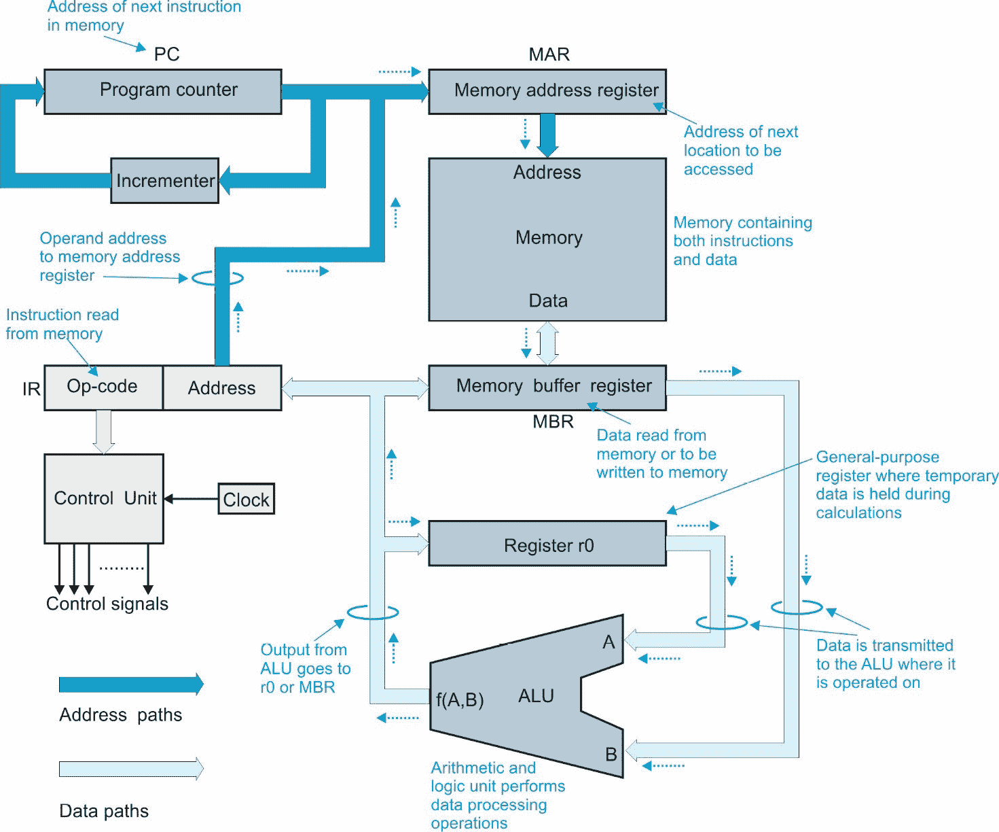
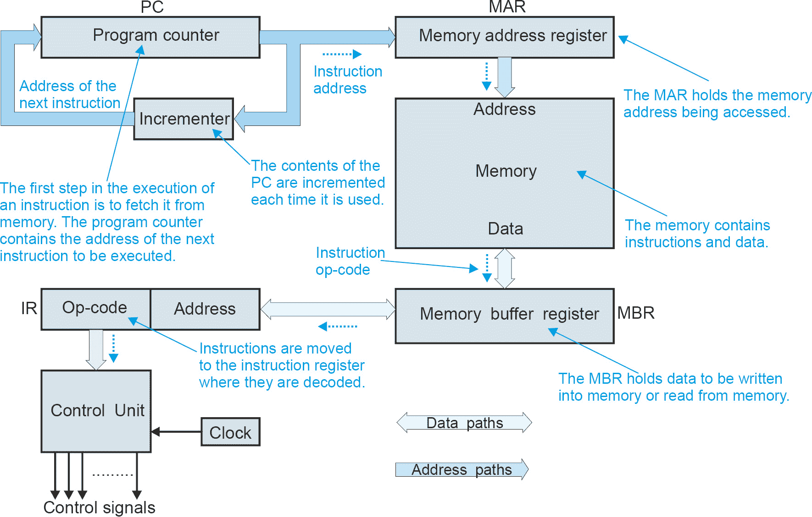
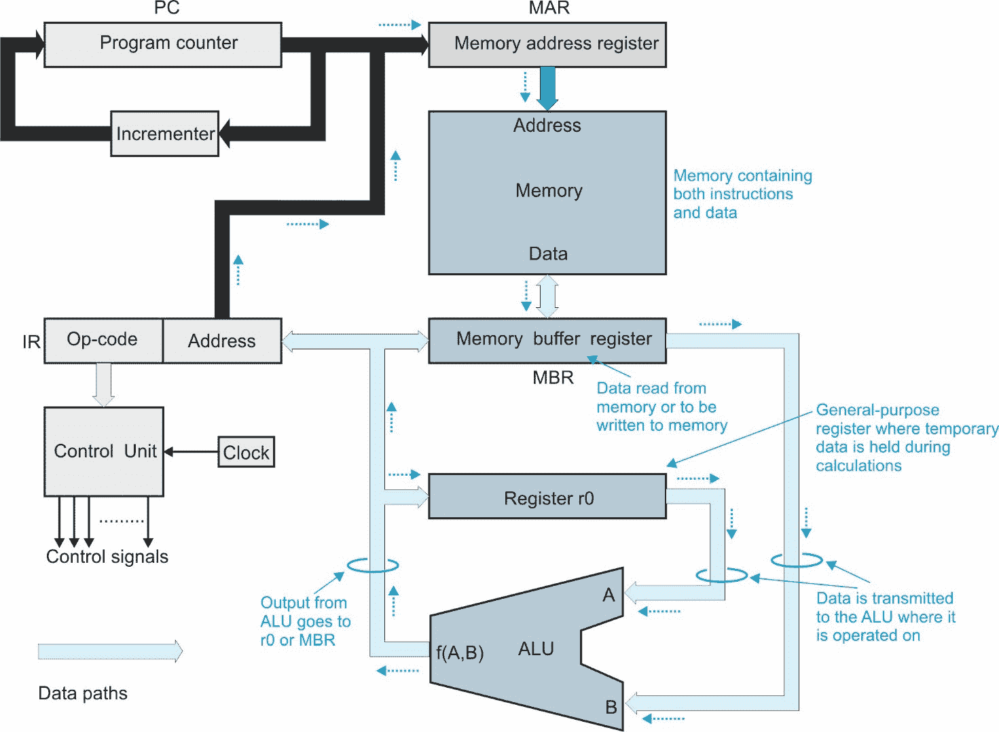
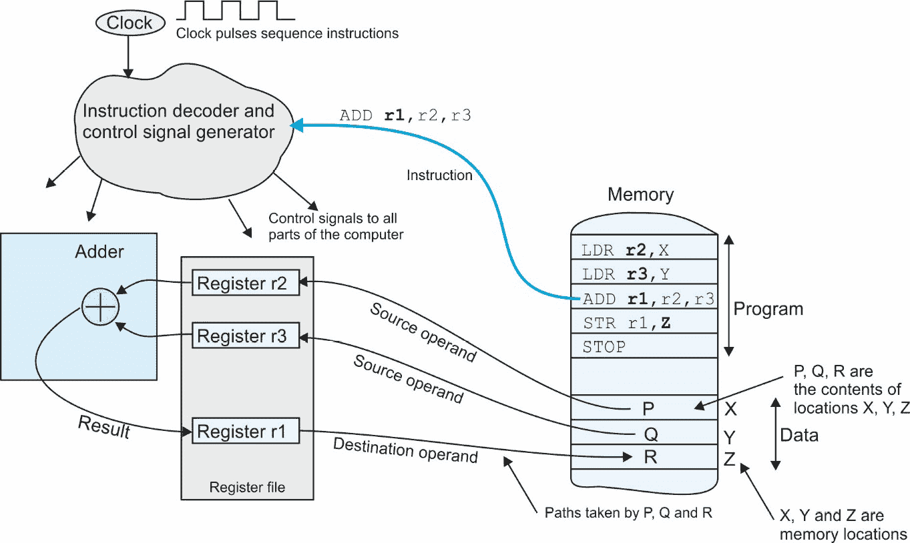
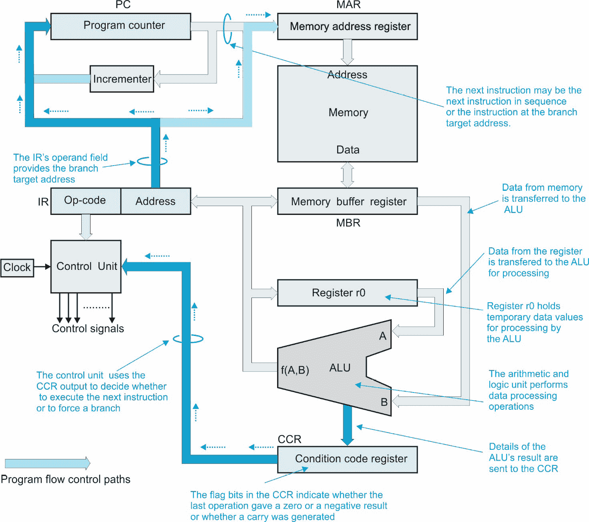
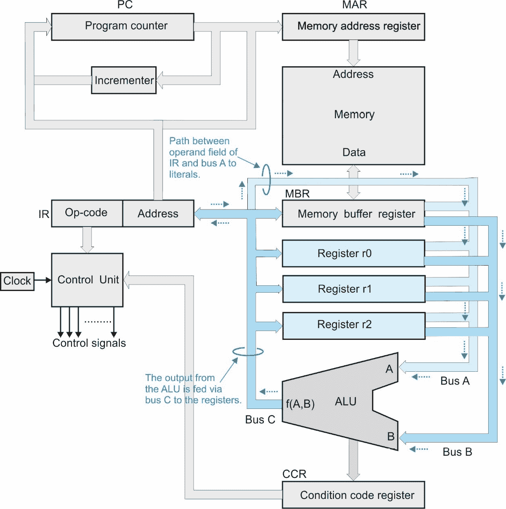

# 第三章：计算机中的数据流

在本章中，我们将学习计算机如何执行指令。在我们能够在 Python 中模拟计算机的行为之前，我们必须理解计算机的内部运作方式。我们还将介绍计算机指令（它可以被命令执行的最小操作）的概念，并展示计算机指令的外观。

什么是计算机？它是如何工作的？它能做什么？我们将通过演示如何使用 Python 设计计算机，以及如何在模拟计算机上运行程序来回答这些问题。在这里，我们只对计算机在机器级别上的行为感兴趣——也就是说，它执行的操作类型。我们不关心计算机的内部设计或计算机是如何电子实现的（即用于构建计算机的电路）。

本章我们将涵盖以下主题：

+   指令集架构（ISA）

+   冯·诺伊曼架构

+   汇编级程序

+   机器级指令

# 技术要求

你可以在 GitHub 上找到本章使用的程序，链接为 [`github.com/PacktPublishing/Practical-Computer-Architecture-with-Python-and-ARM/tree/main/Chapter03`](https://github.com/PacktPublishing/Practical-Computer-Architecture-with-Python-and-ARM/tree/main/Chapter03)。

# 指令架构级别（ISA）

在本节中，我们将展示如何以不同的方式描述计算机，并解释本书是从计算机的指令集和能力角度来探讨计算机的。

“计算机”这个词对不同的人意味着不同的事情。对一个工程师来说，计算机是一组执行特定功能的电路集合；对一个飞行员来说，它是一架能够将飞机从一个机场飞到另一个机场并在浓雾中降落的机器。

*表 3.1* 展示了计算机语言和结构的层次结构。在最顶层，你有计算机实际使用的应用程序。在这个级别，应用程序可能是一个用户选择的程序（例如飞行模拟器），或者它可能是在嵌入式系统上运行的程序（例如自动柜员机）。与该应用程序的通信是通用的，并且独立于运行应用程序的实际计算机。

| **级别** | **实现** | **通用性** |
| --- | --- | --- |
| 1\. 应用 | Word、Excel、Photoshop 和飞行模拟器 | 通用 |
| 2\. 高级语言 | Python、Java、C++ | 通用 |
| 3\. 汇编语言 | ADD r1,r2, and r3 | 计算机家族 |
| 4\. 二进制（机器代码） | `00111010111100001010101110001010` 二进制 | 计算机家族 |
| 5\. 电路（微处理器） | 逻辑门、加法器、计数器和内存 | 特定家族成员 |
| 6\. 硅 | 物理硅芯片 | 特定芯片 |

表 3.1 – 计算机语言和系统的层次结构

在应用层之下，是用于构建应用程序的高级语言。这种语言可能是 Python、Java、C++等等。高级语言被设计成允许程序员构建能在不同类型的计算机上运行的应用程序。例如，用 Python 编写的程序可以在任何有 Python 解释器或编译器的机器上运行。在高级语言引入之前，你必须为每台特定的计算机设计应用程序。

目前，大多数计算机无法直接执行高级语言。每台计算机都有自己的本地语言，这种语言被计算机家族（例如，英特尔酷睿、摩托罗拉 68K、ARMv4 和 MIPS）所理解。这些语言与计算机的结构及其硬件有关，这由计算机的 ISA 表达。这个层级在*表 3.1*中由两层表示，即汇编语言和机器码。

高级语言之下的层级是汇编语言级别，这是计算机的二进制机器码的人类表示形式。人们无法记住或轻易操作由 1 和 0 组成的字符串。汇编语言是机器码的文本版本。例如，汇编语言操作`ADD A`,B,C`表示将`B`加到`C`上，并将结果放入`A`（即，A = B + C），在机器码中可能表示为`00110101011100111100001010101010`。

*机器码*层是计算机实际执行的二进制代码。在 PC 世界中，机器码程序具有`.exe`文件扩展名，因为它们可以被计算机执行。所有计算机都执行二进制代码，尽管这个层对于每种类型的计算机都是不同的——例如，英特尔酷睿、ARM 和 MIPS 是三种计算机家族，每个都有自己的机器码。

虽然汇编语言层是机器码层的表示，但这两个层级之间存在差异。汇编语言层包括帮助程序员编写程序的设施，例如定义变量名和将独立编写的模块链接到单个机器码程序的能力。

在机器码层之下是电子电路，通常被称为微处理器，或者简称为芯片。这是英特尔等公司制造的硬件，它从内存中读取程序并执行它们。一般来说，这个层级不能编程或修改，就像你不能改变你汽车引擎的气缸数量一样。

今天，一些数字系统确实有可以电子修改的电路——也就是说，通过改变通过称为**现场可编程门阵列（FPGA）**的电路的信号路由，可以重新配置计算机的电路。FPGA 包含大量门和专用电路块，可以通过编程相互连接。FPGA 可以被编程以执行专用应用，例如在医疗或航空航天系统中的信号处理。

在电子电路层面，同一组电路可能有不同的版本。例如，微处理器可以使用 7 纳米或 14 纳米的器件技术来实现（这些数字表示芯片上组件的基本尺寸，尺寸越小越好）。这两个电路在各个方面可能都是操作上相同的，但一个版本可能比另一个版本更快、更便宜、更可靠或功耗更低。

本书是关于汇编语言和机器代码层的，*表 3.1*中的层允许我们编写由计算机执行的程序。到本书结束时，你将能够设计自己的机器代码、自己的汇编语言以及自己的计算机。

在 20 世纪 40 年代和 50 年代，所有的编程都是在汇编语言（甚至机器代码）中完成的。现在不是这样了。编写汇编语言程序是繁琐且极具挑战性的。计算机科学家创建了 C++、Java、Python 和 Fortran 等高级语言。这些语言是为了允许程序员用接近英语的语言编写程序而开发的，这种语言比汇编语言能表达更强大的思想。例如，在 Python 中，你可以使用`print("Hello World.")`指令在屏幕上打印文本`"Hello World"`。如果你想在汇编语言中做到这一点，你将不得不编写大约 100 个单独的机器级指令。此外，Python 版本将在所有计算机上运行，但机器级版本必须为每种特定的计算机类型编写。

高级语言的秘密在于*编译器*。你用高级语言编写程序，然后将其编译成你想要运行的特定计算机的机器代码。你可能会遇到*解释器*这个术语，它执行的功能与编译器相同。编译器将整个高级语言程序翻译成机器代码，而解释器则是逐行进行翻译，并在解释的同时执行每一行。

在今天（除学术界外），用汇编语言编写代码并不流行。然而，它有一个优点，即（原则上）你可以编写比编译代码运行更快的优化代码。

本书的一个主要主题是*实践学习*。我们将解释什么是计算机，介绍它执行的指令，然后展示如何用高级语言构建（即模拟）它。我们将要构建的程序称为**TC1（教学计算机 1）**。这个程序将执行一个假设计算机的汇编语言。你将能够用汇编语言编写程序，TC1 程序将读取指令并像在真实的 TC1 计算机上运行一样执行它们。

当你运行程序时，你可以逐条执行指令并观察它们的输出结果 v – 也就是说，你可以在程序运行时读取寄存器和内存中数据的值。这台计算机的目的不是执行有用的计算功能，而是展示指令的外观以及它们的执行方式。

这台计算机演示了指令的执行方式和如何使用汇编语言。此外，你可以修改计算机的指令集以创建你自己的专用指令。你可以删除指令、添加新指令、扩展指令，甚至改变指令的格式。TC1 被设计用来使学习计算机体系结构的学生能够理解指令格式、指令解码和指令复杂性。它也有助于理解寻址模式（即数据在内存中的定位方式），例如基于指针的寻址。我们将在稍后更详细地讨论这些主题。

TC1 有几个在传统计算机指令集中不存在的有用功能。例如，你可以直接从键盘将数据输入到计算机中，你还可以将随机数加载到内存中。这允许你为测试目的创建数据。

首先，我们需要介绍原型计算机，即所谓的冯·诺伊曼机，它在 20 世纪 40 年代和 50 年代被创造出来，并成为大多数现代计算机的模板。实际上，已经相当偏离了纯冯·诺伊曼架构，但我们仍然倾向于使用这个术语来区分其他类别的计算机（例如，模拟计算机、神经网络和量子计算机）。

## ISAs – 部件命名

在我们介绍计算机的结构之前，我们需要介绍一些你必须了解的术语：

+   `0`或`1`。你可以将位设置为`0`，设置为`1`，或者切换它（翻转它）。

+   `8`、`16`、`32`或`64`。一般来说，字是计算机操作的基本数据单位。在 64 位计算机上执行`ADD a,b,c`这样的指令会将字`b`的 64 位与字`c`的 64 位相加，并将 64 位的结果放入字`a`中。变量`a`、`b`和`c`指的是内存或寄存器中的存储位置。

+   **指令**：机器级指令是程序员可以指定的最基本操作，它定义了计算机执行的单个动作。在硅片上可能存在更原始的操作级别，但程序员无法直接访问这些。指令主要分为三类——数据移动，将数据从一个地方复制到另一个地方，算术和逻辑操作，处理数据，以及指令序列命令，确定指令执行的顺序（这是实现形式为 *如果这个，那么* *做那个* 的决策所必需的）。

+   **立即访问内存**：这通常被许多程序员称为内存或 RAM 或 DRAM。这是程序执行期间程序和数据的存储位置。今天，术语 *随机访问内存* 意味着相同的东西。然而，严格来说，术语 *随机* 指的是随机选择的一个内存元素访问时间对每个元素都是相同的（与磁带不同，磁带的访问时间取决于数据在磁带上的位置）。

+   在芯片上，`8` 到 `64` 个寄存器，指定一个特定的寄存器只需要 `3` 到 `6` 位，而不是通常用来访问内存位置的 `32` 或 `64` 位。大多数计算机操作都是作用于寄存器的内容，而不是主内存。寄存器的命名没有通用的约定。在本章中，我们将一般使用以下命名方式——例如，`INC r3` 表示将寄存器 `r3` 的内容增加 `1`。

+   `32` 位或 `64` 位长。然而，8 位和 16 位计算机在嵌入式控制应用中经常被使用（例如，玩具、电视、洗衣机和汽车）。

+   `ADD a,b,5` 其中 `5` 是一个字面量，那么它的意思就是，将整数 `5` 加到 `b` 上。一些计算机使用 `#` 来表示字面量——例如，`ADD a,b,#12` 的意思是，将数字 `12` 加到内存位置 `b` 的内容上。

+   从 `A` 移动到 `B`——简单至极。在计算机科学中，术语 *move* 表示原本在 `A` 的东西最终到了 `B`，也就是说，它现在既在 `A` 也在 `B`。换句话说，程序员使用 *move* 来表示 *copy*。如果你将数据从寄存器移动到内存，数据仍然保留在寄存器中，并复制到内存。我们将在下一节介绍原型计算机。

下一步是介绍冯·诺依曼计算机的概念，它可以被认为是大多数现代计算机的祖先。数学家冯·诺依曼是 1945 年 *EDVAC 第一草案报告* 的作者之一，该报告描述了数字计算机的结构。

# 冯·诺依曼架构

原型计算机通常被称为存储程序冯·诺伊曼机。它有一个存储在内存中的程序，按指令顺序逐条执行。此外，程序存储在与计算机操作的数据相同的内存中。这种结构以计算先驱之一约翰·冯·诺伊曼的名字命名。一旦你理解了冯·诺伊曼机，你就理解了所有计算机。

*图 3.1*展示了包含三个基本元素的简化冯·诺伊曼机：

+   一个存储程序和程序使用的任何数据的内存

+   一组寄存器，每个寄存器存储一个数据字（在*图 3.1*中有一个寄存器，`r0`）

+   一个**算术逻辑单元（ALU**），执行所有数据处理



图 3.1 – 冯·诺伊曼架构

内存包含要执行的指令。数据和指令都以二进制形式存储，尽管我们经常以汇编语言形式展示操作，以便于阅读。每个指令都是从内存中读取、解码和解释（即执行）。*图 3.1*的主要简化是没有执行条件操作（即`if…then`）的手段。我们将在稍后解决这个问题。

*图 3.1*看起来很复杂。其实并不复杂。我们将一步一步地解释其操作。一旦我们了解了计算机在原理上的工作方式，我们就可以看看它如何在软件中实现。我们描述了一个非常简单的、所谓的*一又二分之一地址*机的操作，其指令有两个操作数——一个在内存中，一个在寄存器中。指令的形式为`ADD B,A`，它将`A`加到`B`上，并将结果放入`B`。`A`或`B`必须在一个寄存器中。两个操作数都可以在寄存器中。*一又二分之一地址*机的术语是对事实的评论，即内存地址是 16 到 32 位，选择数百万个内存位置中的一个，而寄存器地址通常是 2 到 6 位，只选择少数几个寄存器中的一个。

我们不会一次性引入计算机，而是逐步构建 CPU。这种方法有助于展示指令是如何被执行的，因为计算机的发展大体上遵循了指令执行过程中发生的事件顺序。现实中的计算机不会从开始到结束执行一个指令。今天的计算机*重叠*指令的执行。一旦一条指令从内存中取出，下一条指令就会在上一条指令完成执行之前被取出。这种机制称为*流水线*，是现代计算机组织的一个重要方面。流水线类似于汽车生产线，计算机指令在各个阶段被执行，以便同时执行多个指令。我们将从用于定位将要执行的下一个指令的地址路径开始。在这本书中，我们不会涉及流水线，因为它是一个实现因素，而不是指令集设计。

## 地址路径

地址是一个表示内存中数据项位置的数字。*图 3**.2* 仅显示了读取内存中指令所需的地址路径。



图 3.2 – CPU 的地址路径

地址路径是 CPU 和内存之间移动地址的数据高速公路。地址告诉内存我们想要从哪里读取数据，或者我们想要存储在哪里。例如，指令 `ADD r0`,234` 表示操作*从内存位置 234 读取内容，将它们加到寄存器 r0 的内容上，然后将结果放入 r0*。*图 3**.2* 省略了执行指令所需的数据路径，以避免混乱。

计算机中有三种类型的信息流——地址、数据和控制。数据包括存储在内存和寄存器中的指令、常量和变量。控制路径包括触发事件、提供时钟以及确定数据流和地址在计算机中流动的信号。

## 读取指令

在 CPU 执行指令之前，必须将指令从计算机的内存中取出。我们开始描述程序是如何被执行的，从 CPU 的*程序计数器*（也称为*指令指针*或*位置计数器*）开始。*程序计数器*这个名称是不准确的。程序计数器并不计算程序或其他任何东西，而是包含内存中将要执行的下一个指令的地址。

程序计数器*指向*将要执行的下一个指令。例如，如果 `[PC] = 1234`（即，`PC` 包含数字 `1234`），则将要执行的下一个指令将在内存位置 `1234` 中找到。

获取指令的过程始于程序计数器的内容被移动到内存地址寄存器（即 `[MAR]` ← `[PC]`）。一旦程序计数器的内容已转移到内存地址寄存器，程序计数器的内容会增加并重新移动回程序计数器，如下所示：

`[PC]` ← `[PC] +` 1.

PC 增量为 `1` 因为下一个指令位于一个位置之后。现实中的计算机通常是按字节寻址的——也就是说，字节按顺序编号 `0, 1, 2, 3 …` 现代计算机有 32 位或 64 位数据字——即 4 字节或 8 字节字。因此，现实中的计算机在每条指令之后将 PC 增加 4 或 8。

在此操作之后，程序计数器指向 *下一个* 指令，而当前指令正在执行。

**内存地址寄存器（MAR）** 存储了在写周期中写入数据到内存中的位置地址，或在读周期中从该地址读取数据。

当执行 *内存读周期* 时，由 MAR 指定的内存位置的内容从内存中读取并传输到 **内存缓冲寄存器（MBR）**。我们可以用 RTL 术语表示这个读操作如下：

```py
[MBR] ← [[MAR]]   @ A read operation (example of indirect addressing)
```

我们将 `[[MAR]]` 表达式解释为 *由 MAR 内容指定的内存的内容*。内存缓冲寄存器是读取周期中从内存接收数据的临时存储位置，或写入周期中要传输到内存的数据的临时存储位置。一些文本将 MBR 称为 **内存数据寄存器（MDR）**。在执行指令的这个阶段，MBR 包含要执行的指令的位模式。

接下来，指令从 MBR 移动到 **指令寄存器（IR）**，在那里它被分为两个字段。一个 *字段* 是一个字的一部分，其中位被分组成一个逻辑实体——例如，一个人的名字可以分为两个字段，即名字和姓氏。IR 中的一个字段包含 *操作码*（opcode），它告诉 CPU 要执行什么操作。另一个字段，称为 *操作数字段*，包含指令要使用的数据的地址。操作数字段还可以提供操作码在立即或直接寻址时使用的常数——也就是说，当操作数是一个实际（即文字）值而不是地址时。就我们当前的目的而言，寄存器地址被认为是指令的一部分。稍后，我们将介绍具有多个寄存器的计算机。现实中的计算机将指令分为超过两个字段——例如，可能有两个或三个寄存器选择字段。

**控制单元（CU）**从指令寄存器中获取操作码，以及一系列时钟脉冲，并生成控制 CPU 所有部分的信号。单个时钟脉冲之间的时间通常在 0.3 ns 到 100 ns（即 3 x 10^-10 到 10^-7 s）的范围内，对应于 3.3 GHz 到 10 MHz 的频率。CU 负责将程序计数器的内容移动到 MAR，执行读周期，并将 MBR 的内容移动到 IR。

指令在两阶段的*fetch-execute cycle*中执行。在*fetch phase*阶段，指令从内存中读取并由控制单元解码。fetch phase 阶段之后是*execute phase*阶段，在这个阶段，控制单元生成执行指令所需的所有信号。以下 RTL 符号描述了 fetch phase 中发生的操作序列。`FETCH`是一个标签，用于指示操作序列中的特定行。符号 IRopcode 表示指令寄存器的操作码字段。我们使用`#`来表示 Python 中的注释，并在汇编语言中使用`@`以符合 ARM 的约定。一些汇编器使用分号来表示注释字段：

```py

FETCH [MAR] ← [PC]        @ Copy contents of the PC to the MAR
      [PC]  ← [PC] + 1    @ Increment the contents of the PC to point to next instruction
      [MBR] ← [[MAR]]     @ Read the instruction from memory
      [IR]  ← [MBR]       @ Move the instruction to the instruction register for processing
```

```py
      CU    ← [IRopcode]  @ Transmit the opcode to the control unit
```

以下是如何将 fetch cycle 编码为 Python 中的函数的示例，以及测试它的所需代码。我们定义了一个 12 位指令，其中包含 4 位操作码和 8 位地址。内存有 16 个位置，我们加载前两个位置以测试程序。Python 表达式 p >> q 表示将二进制值 p 右移 q 位，`&`执行逻辑`AND`操作。我们将在稍后详细讨论这个问题。例如，`0110`00001010 >> 8`变为`0110`。这提取了操作码。同样，`0b011011111010 & 0b111111111111 = 0b000000001010`以提取地址：

```py

                                # Testing the fetch cycle
mem = [0] * 16                  # Set up 16 locations in memory
pc = 0                          # Initialize pc to 0
mem[0] = 0b011000001010         # Dummy first instruction (opcode in bold) 0b indicates binary value
mem[1] = 0b100011111111         # Dummy second instruction
def fetch(memory):              # Fetch cycle implemented using a function
    global pc                   # Make pc global because we change it
    mar = pc                    # Copy pc to mar
    pc = pc + 1                 # Increment the pc ready for next instruction
    mbr = memory[mar]           # Read instruction from memory
    ir = mbr                    # Copy instruction to instruction register
    cu = ir >> 8                # Shift instruction 8 places right to get the operation code
    address = ir & 0xFF         # Mask opcode to 8-bit address
    return(cu, address)         # Return instruction and address
opCode,address = fetch(mem)     # Do a fetch cycle
print('pc =', pc - 1, 'opcode =', opCode, ' Operand =', address)
opCode,address = fetch(mem)     # Do a fetch cycle
print('pc =', pc - 1, 'opcode =', opCode, ' Operand =', address)
```

在前面的代码中，数值`0b011000001010`通过`0b`前缀以二进制形式表示。同样，`0xFF`表示法表示十六进制形式的数字——即十进制中的`255`或二进制形式中的`11111111`。

通过两次调用`opCode,address = fetch(mem)`来测试函数。Python 允许我们在一行中接收两个返回的参数，即操作码和地址。注意 Python 代码如何紧密地遵循 RTL。在实际应用中，你不会编写这样的代码。我们不需要 MAR 和 MBR 寄存器。我包括它们是为了帮助模拟硬件。我们可以简单地编写以下代码：

```py

    ir  = mem[pc]               # Read current instruction into ir
    pc = pc + 1                 # Increment program counter ready for next cycle
    cu = ir >> 8                # Extract the opcode
    address = ir & 0xFF         # Extract the operand address
```

## CPU 的数据路径

在解决了 fetch phase 之后，让我们看看还需要什么来执行指令。*图 3**.3*将数据路径添加到*图 3**.2*的 CPU 中，以及从指令寄存器的地址字段到内存地址寄存器的地址路径。其他添加包括数据寄存器`r0`和一个执行实际计算的 ALU。它执行的运算通常是算术运算（加、减、乘、除）和逻辑运算（`AND`、`OR`、`EOR`以及左移或右移）。



图 3.3 – CPU 的地址和数据路径

数据寄存器`r0`在计算过程中持有临时结果。你需要一个数据寄存器（即累加器），因为像`ADD`这样的二进制操作需要两个操作数，一个由指令指定，另一个是数据寄存器的内容。`ADD`,P`将内存位置`P`的内容加到通用寄存器`r0`的内容上，并将和存入数据寄存器，破坏了原始的一个操作数。*图 3.3**.3*的安排有一个我们称之为`r0`的通用数据寄存器。一个真实的处理器，如 ARM，有 16 个寄存器，从`r0`到`r15`（尽管并非所有这些都是通用数据寄存器）。

## 典型的数据移动指令

所有计算机都有数据移动指令，用于将数据从一个地方传输（即复制）到另一个地方。这些是最简单的指令，因为它们不涉及数据处理。数据移动指令因计算机而异。在这里，我们将提供一些典型的例子，以帮助您理解本章中的示例。请注意，我们将在此文本中使用不同的约定。例如，我们有时会在字面量前加`#`（例如，`ADD` `,#6`），有时会在指令后加后缀`L`（例如，`ADDL` `r1,6`）。这是因为计算机中有几个标准/约定在使用中，并且它们因计算机而异。以下是一些通用的代码示例。注意加载字面量的重复。一些处理器使用`move`，而另一些使用`load`：

| **助记符** | **示例** | **名称** | **RTL** | **注释** |
| --- | --- | --- | --- | --- |
| `MOV` | `MOV`  `r1,r4` | 移动寄存器 | [r1] ← [r4] | 将寄存器 r4 复制到寄存器 r1 |
| `MOVL` | `MOVL` `r1,5` | 移动字面量 | [r1] ← 5 | 将整数 5 复制到寄存器 r1 |
| `LDR` | `LDR`  `r3,12` | 加载寄存器 | [r3] ← [12] | 将内存位置 12 的内容加载到 r3 |
| `LDRL` | `LDRL` `r0,13` | 加载字面量 | [r0] ← 13 | 将整数 13 加载到寄存器 r0 |
| `STR` | `STR`  `r4,8` | 存储寄存器 | [8] ← [r4] | 将 r4 的内容存储在内存位置 8 |

表 3.2 – 典型的数据移动指令

## 数据处理指令

让我们看看一个典型的数据处理操作。我们可以用一个`ADD` `r0,X`指令用 RTL 表达式表示：

```py

[r0] ← [r0] + [X]       @ Add the contents of the memory
                         location X to register r0
```

ALU（算术逻辑单元）是 CPU 的“工作马”，因为它执行所有计算。算术和逻辑运算应用于数据寄存器的内容以及数据寄存器或 MBR 的内容。ALU 的输出被反馈到数据寄存器或 MBR。

算术和逻辑操作之间的基本区别是，当对`A`字的位 ai 和`B`字的位 bi 进行操作时，逻辑操作不会产生进位。*表 3.2*提供了典型算术和逻辑操作的例子。

| **操作** | **类别** | **典型助记符** |
| --- | --- | --- |
| 加法 | 算术 | ADD (a = b + c) |
| 减法 | 算术 | SUB (a = b - c) |
| 取反 | 算术 | NEG (a = -b) |
| 乘法 | 算术 | MUL (a = b * c) |
| 除法 | 算术 | DIV (a = b / c) |
| 除以 2 | 算术 | ASR (a = b / 2) |
| 乘以 2 | 算术 | ASL (a = b * 2) |
| AND | 逻辑 | AND (a = b & c) |
| OR | 逻辑 | OR (a = b ∨ c) |
| NOT | 逻辑 | NOT (a = !b) |
| EOR | 逻辑 | EOR (a = b ⊕ c) |
| 左移 | 逻辑 | LSL (将所有位左移 a = b << 1) |
| 右移 | 逻辑 | LSR (将所有位右移 a = b >> 1) |

表 3.3 – 典型的算术和逻辑运算

逻辑移位将操作数视为一个位串，这些位向左或向右移动。算术移位将数字视为一个有符号的 2 的补码值，并在右移时传播符号位（即符号位被复制和重复）。这些操作中的大多数都由 68K、Intel Core 和 ARM 等计算机实现。

## 再次看看数据流

让我们再次看看计算机中的数据流，以巩固基本概念。在 *图 3*.*4* 中，我们有一个支持涉及三个寄存器（如 ARM 计算机的特点）的操作的计算机。在这里，我们有三个寄存器，`r1`、`r2` 和 `r3`。标记为 *加法器* 的块是 ALU 的一部分，用于将两个数字相加以产生和。指令 `LDR r2,X` 将内存地址 `X` 的内容加载到寄存器 `r2`。指令 `STR r1,Z` 将寄存器 `r1` 的内容存储在内存地址 `Z`。

指令 `ADD r1,r2,r3` 读取寄存器 `r2` 和 `r3` 的内容，将它们相加，并将结果存入寄存器 `r1`。由于不清楚哪个寄存器是目标寄存器（即结果），我们使用粗体字来突出目标操作数，这通常是左边的操作数。

*图 3*.*4* 展示了计算机的几个基本组件。这本质上与我们在演示取指/执行周期时使用的更详细的结构相同。在这里，我们关注的是数据流向内存以及从内存中流出。



图 3.4 – 冯·诺依曼机的细节

以下是我们感兴趣的部分：

+   产生定时脉冲的时钟。所有操作都在时钟触发时进行。

+   一个解释器或控制单元，它接受一条指令，以及一系列时钟脉冲，并将其转换为执行所需操作所需的动作。在 *图 3*.*4* 中，解释器将寄存器 `r2` 和 `r3` 的内容路由到加法器，使加法器将两个值相加，然后将结果从加法器路由到目标寄存器。

+   存储器中的程序。数据从存储器加载到寄存器 `r2` 和 `r2`。然后，`r2` 和 `r3` 相加，结果存入 `r3`。最后，将 `r3` 的内容移动到存储器中。

现在我们已经介绍了计算机的基本结构和一些指令，下一步是查看一个执行特定功能的完整程序。

# 汇编级程序

在进一步开发我们的计算机之后，在本节中，我们将展示如何执行一个简单的程序。假设这台计算机不提供三地址指令（即，你不能指定三个寄存器和/或内存地址的操作），我们想要实现高级语言操作 `Z = X + Y`。在这里，`+` 符号表示算术加法。执行此操作的汇编语言程序如下所示。记住，`X`、`Y` 和 `Z` 是指代内存中变量位置的符号名称。从逻辑上讲，存储操作应该写成 `STR Z,r2`，目标操作数在左边，就像其他指令一样。按照惯例，它被写成 `STR r2,Z`，源寄存器在左边。这是编程历史的一个怪癖：

`LDR`,X``r2` 从内存位置 `X` 获取内容

`ADD`,Y``Y` 将数据寄存器 `r2` 的内容加到 `Y`

`STR`,r2,`Z` 将 `r2` 存入内存位置 `Z`

八位计算机有一个单地址机，仅为了执行加法这样简单的操作，就需要一个相当繁琐的操作序列。如果我们有一个三地址格式的计算机，我们可以写出以下内容：

`ADD`,X,Y` 将 X 的内容加到 Y 的内容上，并将结果存入 Z

三地址机相对于单地址机来说**可能**更快，因为它们可以在一个指令中完成其他机器需要三个操作才能完成的事情。不幸的是，这是技术发展的一个因素，片上寄存器比 DRAM 快，计算机设计者试图尽可能地将数据保持在片上寄存器中。

事实是更复杂的。与访问寄存器相比，访问内存要慢。这是硬件的一个特性。因此，将数据保持在寄存器中更有效率。

通过检查例如 `ADD r2,Y` 的执行，可以最好地了解 CPU 的工作方式。在以下代码块中，我们描述了 `ADD r2,Y` 指令的取指和执行阶段所执行的操作：

```py

FETCH [MAR] ← [PC]        Move the contents of the PC to the MAR
      [PC]  ← [PC] + 1    Increment the contents of the PC
      [MBR] ← [[MAR]]      Read the current instruction from the memory
      [IR]  ← [MBR]       Move the contents of the MBR to the IR
      CU    ← [IRopcode]      Move the opcode from the IR to the CU
ADD   [MAR] ← [IRaddress]             Move the operand address to the MAR
[MBR] ← [[MAR]]Read the data from memory
      ALU← [MBR], ALU ← [r2] Perform the addition
      [r2]  ← ALUMove the output of ALU to the data register
```

同一行上的操作是同时执行的。

在取指阶段，操作码通过 CU ← [IRopcode] 传送到控制单元，并用于生成放置 ALU 在加法模式所需的所有内部信号。当 ALU 被编程为加法时，它将两个输入端的数据相加，在输出端产生一个和。

形式为 `[PC]` ← `[MAR]` 或 `[r2]` ← `[r2] + [MBR]` 的操作通常被称为 *微指令*。每个汇编级指令（例如，`MOV, ADD`）都作为一系列微指令执行。微指令是计算机设计者的领域。在 20 世纪 70 年代，一些机器是用户可微编程的——也就是说，你可以定义自己的指令集。

我们可以通过扩展取指阶段代码来测试执行阶段。以下 Python 代码提供了三条指令——将字面量加载到寄存器中，将内存内容加到寄存器中，以及停止。我们还使 Python 代码更加紧凑——例如，你可以在函数的返回语句中放置表达式。在这个例子中，我们返回两个值：`ir >> 8` 和 `ir & 0xFF`。操作`x >> y`将`x`的二进制值右移`y`位；例如，`0b0011010110 >> 2`给出`0b0000110101`。代码的阴影部分是我们执行的机器级程序：

```py

# Implement fetch cycle and execute cycle: include three test instructions
mem = [0] * 12                     # Set up 12-location memory
pc = 0                             # Initialize pc to 0
mem[0] = 0b000100001100            # First instruction load r0 with 12
mem[1] = 0b001000000111            # Second instruction add mem[7] to r0
mem[2] = 0b111100000000            # Third instruction is stop
mem[7] = 8                         # Initial data inlocation 7 is 8
def fetch(memory):                 # Function for fetch phase
    global pc                      # Make pc a global variable
    ir = memory[pc]                # Read instruction and move to IR
    pc = pc + 1                    # Increment program counter for next cycle
    return(ir >> 8, ir & 0xFF)     # Returns opCode and operand
run = 1                            # run = 1 to continue
while run == 1:                    # REPEAT: The program execution loop
    opCode, address = fetch(mem)   # Call fetch to perform fetch phase
    if   opCode == 0b1111: run = 0 # Execute phase for  stop (set run to 0 on stop)
    elif opCode == 0b0001:         # Execute phase for load number
         r0 = address              # Load r0 with contents of address field
    elif opCode == 0b0010:         # Execute phase for add
         mar = address             # Copy address in opCode to MAR
         mbr = mem[mar]            # Read the number to be dded
         r0 = mbr + r0             # Do the addition
    print('pc = ',pc - 1, 'opCode =', opCode, 'Register r0 =',r0)
                                   # We print pc – 1 because the pc is incremented
```

此代码的输出如下：

```py

pc =  0 opCode = 1  Register r0 = 12
pc =  1 opCode = 2  Register r0 = 20
```

```py
pc =  2 opCode = 15 Register r0 = 20
```

注意，Python 术语`elif`是*else if*的缩写。前面的情况说明，“*操作码是否为停止。如果不是，操作码是否为加载。如果不是，操作码是否为加法。*”这允许进行一系列测试。我们将在稍后更详细地讨论`elif`。

## 执行条件指令

到目前为止，我们已查看了一种能够以纯**顺序**模式执行程序的 CPU 结构——也就是说，计算机只能按严格顺序逐个执行指令流。我们在上一章中介绍了条件行为，现在我们将扩展 CPU，使其能够执行诸如`BEQ Target`（在零标志设置为`Target`时的分支）之类的指令，这些指令能够执行非顺序指令。

**图 3.1**中的计算机缺乏做出选择或重复一组指令的机制。为此，CPU 必须能够执行**条件分支**或**跳转**。**图 3.5**的框图显示了 CPU 实现条件分支所需的新地址和数据路径。



**图 3.5**——CPU 中的信息路径和条件指令

在**图 3.5**中，我们向我们的计算机添加了三项内容。这些内容被突出显示：

+   **条件码** **寄存器 (CCR)**

+   CCR 和控制单元之间的路径

+   指令寄存器的地址字段和程序计数器之间的路径。

**条件码寄存器**或**处理器状态寄存器**记录了每个指令执行后的 ALU 状态，并更新进位、负数、零和溢出标志位。条件分支指令会查询 CCR 的标志。CU 随后要么按顺序执行下一条指令，要么跳转到另一条指令。让我们看看条件分支的细节。以下是对 CCR 位功能的提醒：

+   C = 进位：  当 n 位操作产生 n+1 位结果时发生进位（例如，当你的汽车里程表从 999...9 滚动到 000...0 时）。在 8 位计算机术语中，这是当 11111111 + 1 = 0000000 carry 1。

+   Z = 零：   如果最后操作生成了零结果，则设置此位。

+   N = 负数：如果最后的结果在 2 的补码算术中生成了负数，则设置此位——也就是说，如果字的最重要位为 1（例如，当数字被视为 2 的补码值时，00101010 是正数，10101010 是负数）。

+   V = 溢出：如果最后操作导致算术溢出，则设置此位，在 2 的补码算术中，如果结果超出了其允许的范围，则发生溢出。在此文本中，为了简单起见，我们通常不实现 V 标志。

条件代码寄存器连接到控制单元，使得指令可以查询它。例如，一些指令测试操作是否产生了正结果，进位位是否被设置，或者是否发生了算术溢出。我们需要一个机制，如果测试结果为`true`则执行一项操作，如果测试结果为`false`则执行另一项操作。

包含在*图 3**.5*中的最终修改是在指令寄存器的操作数字段（即目标地址）和程序计数器之间添加了一条路径。正是这个特性使得计算机能够对其对 CCR 的查询结果做出响应。

条件分支指令，例如**带进位设置分支（BCS**），测试 CCR 的进位位，如果测试的位是清除的，则按正常方式从内存中获取下一条指令。如果测试的位是设置的，则从指令寄存器中目标地址的位置获取下一条指令。在先前的描述中，我们说如果 CCR 的位被设置则进行分支；同样，如果位被清除，也可以进行分支（分支也可以基于多个 CCR 位的组合状态）。

分支操作可以用以下形式在寄存器传输语言中表达：

```py
IF condition THEN action
```

在 RTL 中表达的传统机器级条件操作如下：

1.  清除进位分支（如果 CCR 中的进位位为 0，则跳转到目标地址）

**BCC target: IF [C] = 0 THEN [PC]** **←** **[IR**address**]**

1.  等于分支（如果 CCR 中的 Z 位为 1，则跳转到目标地址）

**BEQ target: IF [Z] = 1 THEN [PC]** **←** **[IR**address**]**

这两个动作都有一个`ELSE`条件，默认为`[PC]` ← `[PC] +` `1`。

以下是一个汇编语言中条件分支的例子：

```py

     SUB  r0,x    @ Subtract the contents of memory location x from register r0
     BEQ  Last    @ If the result was zero, then branch to Last; otherwise, continue
     .            @ Execute here if branch not taken
     .
Last              @ Target address of branch (if taken)
```

扩展计算机体系结构的最后一步是引入数据路径，允许将字面量加载到寄存器中——也就是说，将一个数字加载到寄存器中，这个数字在指令中而不是从内存中。z 位可能会令人困惑。如果结果为零，则 z 位设置为 1，如果结果不为零，则设置为 0。

## 处理字面量操作数

如 `ADD r0,`abc`` 这样的计算机指令指的是 CPU 内存中的某个操作数。有时，我们想要使用像 `ADD r0,#12` 这样的指令，其中源操作数提供了指令操作码部分所引用数据的 *实际值*——在这种情况下，12。尽管当这个指令以助记符形式编写时，符号 `#` 出现在操作数部分，但汇编器使用不同的操作码代码。

`ADD r0,#literal` 和 `ADD r0,address`。

指令 `ADD r0,#12` 在 `RTL` 中定义为 [r0] ← [r0] + 12.

注意，我们使用两种字面量的约定。一种是 `ADD r0,#12`，另一种是 `ADDL r0,12`。这符合典型的指令集。

*图 3.6* 显示，在 IR 的操作数字段和数据寄存器以及 ALU 之间需要额外的数据路径来处理字面量操作数。*图 3.6* 包含三个通用寄存器，`r0`、`r1` 和 `r2`。原则上，我们无法添加任何数量的寄存器。然而，内部寄存器的数量受指令中指定寄存器所需位数的限制。正如你所看到的，三个数据总线 `A`、`B` 和 `C` 用于在寄存器和 ALU 之间传输数据。

*图 3.6* 的结构可以实现比我们迄今为止使用的简单直接（绝对）寻址更复杂的寻址模式。考虑 `MOV r1,[r0]`，它复制了地址在 `r0` 中的内存位置的值。在这里，`r0` 是实际数据的指针。这个指令可以通过以下微操作序列来实现：

```py

MOV   [MAR] ← [r0]        Move the source operand address to the MAR
      [MBR] ← [[MAR]]     Read the actual operand from memory
      [MAR] ← [MBR]       Copy the address back to the MAR
      [r1]  ← [[MAR]]     Copy the data from memory to r1
```

这个序列已经被简化，因为，正如你从 *图 3.6* 中看到的，寄存器 `r0` 和 MBR 之间没有直接路径。你将不得不将 r0 的内容放到总线 A 上，通过 ALU 将总线 A 的内容传递到总线 C，然后将总线 C 复制到 MAR。



图 3.6 – 修改 CPU 以处理字面量操作数

让我们扩展我们的 Python 代码，包括字面量操作和条件操作。以下 Python 代码实现了一个加载寄存器的字面量指令、加/减操作、零条件分支和停止。在这里，我们使用 `LDRL` 来表示字面量，而不是在字面量前加 #。要执行的程序如下：

| **地址** | **助记符** | **指令** | **二进制代码** | **备注** |
| --- | --- | --- | --- | --- |
| 0 | `LDRL` r0`,9` | 将字面量`9`加载到`r0` | 0001`00001001` | `[r0]` ← `9` |
| 1 | `SUB` r0`,7` | 从`r0`中减去内存`[7]` | `0`011`00000111` | `[r0]` ← `[r0] –` `mem[7]` |
| 2 | `BEQ` 6 | 如果为零则跳转到 6 | `0`100`00000110` | 如果`z = 1 [PC] ← 6` |
| 3 | `STOP` | top execution | 1111`00000000` |  |
| 4 |  |  |  |  |
| 5 |  |  |  |  |
| 6 | `STOP` | top execution | 1111`00000000` |  |

表 3.4 – 图注

为了实现加载寄存器，我们只需将指令中的字面量移动到寄存器中。减法测试结果并设置零状态位`z`，如果结果是`0`则设置为`1`，如果不是则设置为`0`。条件分支测试 z 位，如果`z = 1`则将指令中的字面量加载到 pc 中。

```py

                             # Simple program to test a branch instruction
mem = [0] * 12               # Set up a 12-location memory
pc = 0                       # Initialize program counter to 0
mem[0] = 0b000100001001      # First instruction loads r0 with 9 (i.e., 1001)
mem[1] = 0b001100000111      # Second instruction subtracts mem[7] from r0
mem[2] = 0b010000000110      # Third instruction is BEQ 6 (branch on zero to 6)
mem[3] = 0b111100000000      # Fourth instruction is stop
mem[6] = 0b111100000000      # Seventh instruction is stop
mem[7] = 9                   # Initial data in location 7 is 9
                             # Fetch returns opcode and address
def fetch(memory):           # This function, fetch, gets the instruction from memory
    global pc                # Declare pc as global because we modify it in the function
    ir = memory[pc]          # Read the instruction from memory
    pc = pc + 1              # Now point to the next instruction
    return(ir>>8, ir&0xFF)   # Return the opcode and address
z = 0                                             # Clear z bit initially
run = 1                                           # run = 1 to continue
while run == 1:                                   # Main loop REPEAT until stop found
    pcOld = pc                                    # Save current pc for display
    opCode, address = fetch(mem)                  # Perform fetch to get opcode
    if   opCode == 0b1111: run = 0                # Test for stop
    elif opCode == 0b0001: r0 = address           # Test for load literal
    elif opCode == 0b0010: r0 = r0 + mem[address] # Test for add
    elif opCode == 0b0011:                        # Test for subtract
        r0 = r0 - mem[address]                    # Do subtraction
        if r0 == 0: z = 1                         # Update z flag on subtract
        else:       z = 0
    elif opCode == 0b0100:                        # Test for branch on zero
        if z == 1: pc = address                   # If BEQ, load PC on zero flag
    print('pc = ',pcOld,'opCode =',opCode,'\tRegister r0 =',r0,'z = ',z)
                                                  # The '\t' performs a tab operation
```

此 Python 代码的输出如下：

```py

pc =  0 opCode = 1  Register r0 = 9 z =  0
pc =  1 opCode = 3  Register r0 = 0 z =  1
pc =  2 opCode = 4  Register r0 = 0 z =  1        z = 1 so branch taken
pc =  6 opCode = 15 Register r0 = 0 z =  1
```

我们将字面量`9`加载到`r0`中，从内存位置`7`（包含`9`）的内容中减去，然后如果结果是`0`则跳转到位置`6`。这就是发生的事情。

描述了计算机的结构后，下一步是看看计算机执行的指令。

# 机器级指令

描述了计算机的工作原理后，我们现在更深入地看看计算机。我们感兴趣的是一条指令做了什么以及它需要什么资源（即数据位置或常量）。低级计算机操作（即机器代码或汇编语言）在内存或寄存器中操作二进制数据。尽管几十年来计算机的速度提高了数百万倍，但低级指令的本质几乎没有改变。

20 世纪 70 年代和 80 年代的第一代微处理器（例如 8080、6800、Z80 和 6502）使用了 8 位指令，这些指令必须连接起来以创建更实用的指令——例如，8 位微处理器通过连接两个连续的 8 位指令提供 16 位指令。

第二代微处理器，如英特尔（Intel）的 8086 和摩托罗拉（Motorola）的 68000，具有 16 位指令。这些指令也被连接起来，以创建足够长的指令来执行所有必要的操作。实际上，68000 实际上将五个连续的 16 位字连接起来，创建了一个巨大的 80 位指令。现代高性能微处理器（例如 ARM、MIPS 和 RISC-V）具有 32 位或 64 位指令，提供完整的指令集，无需连接连续的指令。当时将指令连接起来以增加操作码数量的 CISC 方法是一个很好的想法。然而，它通过使并行执行指令变得困难来降低性能，因为计算机不知道指令之间的边界在哪里，直到它们被解码。

在本书的后面部分，我们将简要地看看多长度指令集的概念。

## 指令类型和格式

现在，我们将描述计算机执行的基本操作类型。首先，一个惊喜。计算机需要多少种不同的指令？我的意思是，它需要多少种来解决问题，这些问题今天、明天以及未来任何时刻都可以通过计算机解决？惊人的答案是只有一个。是的，你可以通过一个单一指令的排列来解决任何问题。

根据维基百科，`SBNZ a,b,c,d` 指令（“如果非零则减去并分支”）从地址 `a` 的内容减去地址 `b` 的内容，将结果存储在地址 `c`，然后，如果结果不是 `0`，则将控制权转移到地址 `d`（如果结果是零，则执行顺序中的下一个指令）。用 RTL 表达，`SBNZ` 指令如下：

```py

[c] ← [b] – [a]
if [c] != 0: [pc] ← d
else: [pc] ← [pc] + 1
```

所有的计算都可以使用这个单一指令来完成。实际上，这样的计算机将是不可能的低效和不切实际的。然而，它暗示了一个庞大而复杂的指令集并不是构建计算机的必要条件。今天的大多数计算机都有相对有限的指令数量。然而，一些计算机设计师现在为特定应用（例如，图形、信号处理和人工智能）创建优化的专用指令集增强。

从第一台计算机到今天拥有超过 1000 亿个晶体管的芯片，计算机的指令集包括以下三个操作类别。*表 3.3* 给出了指令组的名称、Python 中的操作示例以及典型的汇编语言指令。

| **指令组** | **典型** **Python 代码** | **汇编语言** |
| --- | --- | --- |
| 算术和逻辑 | `c = (a + b) * c` | `ADD` `,r2,r3` |
| 数据移动 | `x = y` | `MOV` `,r2` |
| 条件 | `if x == 4: y = 7` | `BEQ next` |

表 3.5 – 指令类别

我们将要设计的 TC1 有 32 位指令，可以提供高达 2³² = 4,294,967,296 个独特的指令。实际上，指令提供内存地址、数值常数（即，字面量）和寄存器编号，这意味着你可以定义的独特指令的数量要小得多。

TC1 有 32 位指令，但只有 16 位数据字。这种配置使得设计和理解计算机更容易，你可以用单个 32 位指令加载一个 16 位数据字。具有 32 位指令和数据的计算机必须使用复杂的加载方法来加载 32 位数据字，正如我们将在介绍 ARM 时看到的那样。

看起来可能有些奇怪，我允许二进制数以`0b1101`或`%1101`的形式指定，也允许十六进制数以`0x1AC`或`$1AC`的格式表示。我这样做有两个原因。第一个原因是我在摩托罗拉的世界长大，那里使用`%`和`$`前缀，但现在我生活在 C 的世界，那里使用`0b`和`0x`前缀。习惯使我更自然地使用`%`和`$`。第二个原因是我想向你展示你可以选择自己的格式和约定。

TC1 的指令集是为了简单而不是计算上的优雅而设计的。从涉及的概念来看，指令集是现实的，但在实现上并不现实。就我们的目的而言，我们已将所有指令以相同的格式给出。在真实的计算机中，通常有几种指令类别，每种都有自己的格式。通过使用单一格式，我们可以简化指令解码和执行。

许多高性能微处理器使用 32 位指令集，这对于演示和教学目的来说非常理想。通常，计算机使用与指令相同大小的数据元素。TC1 使用 32 位指令但 16 位数据元素，因为学生比 32 位值更容易阅读和操作 16 位值（将 TC1 计算机修改为使用 32 位数据将是一个非常简单的任务）。

为了为 TC1 编写机器级程序，你必须手动将每个指令编码到一个 32 位的二进制序列中。这很容易做到，但非常繁琐。我们还设计了一个简单的汇编器，允许你以汇编语言的形式编写指令。TC1 汇编器将形式为`ADD r7,r2,r3`的指令翻译成一个二进制字符串，例如`000000111101001100000000000000000`。

通常，汇编器是模拟器之外的一个独立代码片段。你为汇编器提供一个*源文件*（文本格式），汇编器创建一个*二进制代码文件*，模拟器执行该文件。TC1 汇编器是模拟器的一部分，所以你不必担心为模拟器创建二进制文件。

我们使 TC1 汇编器尽可能简单，以降低复杂性并保持最终的 Python 程序相对简短。编写一个全面的汇编器需要更多的高级语言代码。这个汇编器不对源程序进行错误检查（即，当你输入错误时不会检测到错误）。它支持使用符号值表示变量和地址——也就是说，你可以写`BEQ loop`而不是`BEQ 7`，其中符号名`loop`标记行号`7`。

TC1 汇编器允许你以十进制、二进制或十六进制格式输入数字——例如，你可以写`LDRL r0,255`、`LDRL r0,0xFF`或`LDRL r0,%11111111`。操作`LDRL`的意思是，“*将一个字面值（即实际值）加载到寄存器中*。”在每种情况下，指令都将`255`的二进制值放入寄存器`r0`中。

所有计算机都基于内存或芯片上几个寄存器中的数据运行。通常，计算机有`2`到`32`个芯片寄存器。TC1 计算机有八个寄存器，`r0`到`r7`。

计算机指令有许多不同的格式，这取决于计算机的架构。以下是最基本的两种格式：

+   CISC 风格操作允许一般指令访问内存（例如，`ADD` `r3`, `1200` 表示，将内存位置 1,200 的内容加到寄存器 3）

+   RISC 风格：所有数据处理操作都在寄存器之间（例如，`ADD` `r1`, `r2`, `r3`），唯一的内存访问是*从内存中加载寄存器并存储寄存器到内存* *中*

我们在第一台计算机中使用的典型汇编语言指令格式如下：

| **格式** | **助记符** | **操作** |
| --- | --- | --- |
| 双地址 | `MOV` `r0`, `r1` | 将寄存器`r1`的内容复制到寄存器`r0` |
| 三地址 | `ADD` `r0`, `r1`, `r2` | 将寄存器`r1`的内容加到`r2`上，结果存入`r0` |
| 文字 | `ADDL` `r0`, `r1`, `24` | 将文字`24`加到`r1`上，并将结果存入`r0` |
| 分支 | `BEQ` `5` | 如果 z 位设置，则跳转到地址`5`的指令 |
| 间接加载寄存器 | `LDRI` `r0`, `[r1,10]` | 将地址`r1 + 10`的内存内容加载到`r0` |

没有一种通用的汇编语言格式，不同的汇编器之间（即使是同一台机器）的约定也有所不同。例如，一种汇编语言可能使用`MOV` `r1`, `r2`的格式来将`r2`加载到`r1`，而另一种汇编语言可能使用它来将`r1`加载到`r2`——也就是说，目标可以在左边或右边。我把操作数的目标放在左边，这似乎是更常见的约定。我还将目标以粗体字显示，以作为提醒。

下面是一个示例程序，它将前 10 个整数相加，这是在一种假设的汇编语言中的代码片段。这不是编写此代码片段最有效的方法；它只是作为一个演示。我们在这里设计的 TC1 汇编器版本接受大写或小写字母，并且可以使用空格或逗号作为分隔符——例如，你可以愉快地写出以下内容：

`lOOp aDdL r1` `R2,r3 or`

`Loop` `ADDL` `R1`, `r2`, `R3`.`

考虑以下 TC1 汇编语言示例。请注意，我使用`@`来表示注释字段，因为这是 ARM 汇编语言的标准，我们将在后面介绍。我们将继续在 Python 中使用`#`符号作为注释。

```py

        LDRL r0,0          @ Load register r0 with 0 (the sum)
        LDRL r1,0          @ Load register r1 with 0 (the counter)
Loop    ADDL r1,r1,1       @ Increment the counter in r1
        ADD  r0,r0,r1      @ Add the count to the sum in r0
        CMPL r1,10         @ Compare the count with 10
```

```py
        BNE  Loop          @ Branch back to Loop until all numbers added
```

## CISC 和 RISC

在这本书中，我们反复使用 RISC 和 CISC 这两个术语。这两个术语对于理解现代计算机至关重要。它们描述了两种不同的计算机实现方法。20 世纪 80 年代初，CISC 与 RISC 之战见证了两种不同架构在计算市场中的竞争。术语**复杂指令集计算机（CISC**）与术语*模拟手表*类似。当数字手表被发明时，带有移动指针的手表突然变成了模拟手表，以区别于数字手表。同样，术语*复杂指令集计算机*直到它被创造出来以与新的**精简指令集****计算机（RISC**）对比之前并不存在。

从计算机被发明的那一刻起，它们就一直在增长。随着技术的进步，新特性只是被附加到现有的计算机上。有人曾经说过，如果飞机的发展像计算机一样，每架巨型喷气式飞机的核心都会有一个 1903 年的莱特兄弟飞机。这种方法并不经济，因为技术发生了如此巨大的变化，计算机的设计需要重新考虑。特别是，内存容量呈指数增长，每位的成本急剧下降。同样，8 位和 16 位字长被 32 位和 64 位指令集所取代。用老方法做事并不高效。

第一代和第二代微处理器是基于*累加器*的。它们在处理器的累加器和内存位置上执行操作。由于只有少数累加器，指令被称为*一个半地址*，因为它们有一个内存地址和一个累加器地址（由于只有少数累加器，它们被戏称为有“*半个地址*”）。要执行`C = A + B`（其中`A`、`B`和`C`是内存地址），你必须编写以下代码：

```py

LDA A            @ Load accumulator with A
ADD B            @ Add B to the accumulator
STA C            @ Store the accumulator in C
```

通过累加器传递所有数据会形成瓶颈。由于计算机速度增长速度快于内存速度，程序员希望尽可能多地将数据保持在芯片上。

RISC 解决方案采用了*寄存器到寄存器*架构。在内存上允许的唯一操作是在寄存器和内存之间传输数据。RISC 处理器没有一或两个累加器，而是有 16 或 32 个寄存器。在 RISC 处理器上的前述代码通常可以表示为以下内容：

```py

LDR r0,[r1]      @ Load r0 with data pointed at by r1
LDR r2,[r3]      @ Load r2 with data pointed at by r3
ADD r4,r0,r2     @ Add r0 and r2, result in r4
STR r4,[r5]      @ Store r4 in memory pointed at by r5
```

所有数据移动都是在内存和寄存器之间进行的，数据处理操作仅适用于寄存器。指令有三个操作数。

RISC 计算机引入了其他增强功能，例如重叠指令执行（称为*流水线*）。20 世纪 80 年代许多人预期英特尔的 CISC 计算机会消失。但它们并没有。英特尔巧妙地将 RISC 特性融入其 CISC 处理器中。AMD 设计了一种 RISC 架构，它将英特尔的 CISC 指令转换成一系列 RISC 命令，然后再执行。

总结来说，CISC 处理器的指令集在内存中的操作数和寄存器中的操作数之间执行操作。所有 RISC 数据处理操作都在寄存器中的操作数之间进行。RISC 处理器允许的唯一内存操作是*从内存中加载寄存器和将寄存器存储在内存中*。

## 表示字面量的两种方式

由于汇编器在竞争激烈的行业中迅速发展，汇编器在表示指令方面有所不同。每个制造商都为其自己的微处理器设计了一个汇编器。一些采用了从左到右的惯例，其中目标操作数在右边，而另一些则采用了从右到左的惯例，其中目标操作数也在右边。因此，一个制造商的`mov a,b`意味着`a ← b`，而另一个的则意味着`b ← a`。同样，助记符也没有标准化——例如，`MOVE, MOV`和`LDA`都定义了一个复制操作。

由于汇编器只是机器代码的人类可读版本，我们如何表示指令实际上并不重要。真正执行的是二进制代码，而不论我们在文本形式中如何表示它。然而，从教学和学习的角度来看，这些惯例的变化是一种麻烦。考虑指令中字面值的表示。

一些汇编器通过使用特殊的指令来表示字面量，例如，对于三个寄存器的加法，使用`ADDr1`,r2,r3`，而对于字面操作数，使用`ADDL r1,r2,24`。其他汇编器在两种情况下都使用相同的助记符，但通过一个符号来前缀字面量以表示这是一个字面量操作，例如，`ADD r1,r2,#25`。有些汇编器使用`#`来表示字面量，而有些则使用`%`。

在本文中，我们在一些模拟器的设计中使用了`ADDL`惯例，但当我们介绍 ARM 处理器时，我们将使用`#`惯例，因为 ARM 汇编器就是这样使用的。回顾起来，如果我现在再写这本书，我可能会倾向于只使用一种表示，即`#`符号。然而，通过使用`ADD`和`ADDL`，我能够简化 Python 代码，因为寄存器和字面操作数之间的*决策点*是在检查助记符时做出的，而不是在检查字面量时。

# 总结

在本章的关键部分，我们介绍了冯·诺伊曼计算机及其`fetch-execute`周期，其中指令从内存中读取，解码，并在两个阶段操作中执行。正是这些动作，我们将在后面的章节中学习来模拟，以便在软件中构建计算机。我们已经研究了指令执行时的信息流。我们在这里介绍的计算机模型是传统模型，它没有考虑到当前在流水线中执行多个指令的技术。

我们还研究了指令格式，并描述了它包含几个字段——例如，定义操作的指令码以及操作所需的数据（例如，地址、字面量和寄存器编号）。你最终将能够设计自己的指令（从而定义计算机的指令集架构）并创建一个能够执行这些指令的计算机。

在描述冯·诺伊曼计算机的操作时，我们引入了足够的 Python 代码来展示我们的方向，并暗示了如何进行模拟。

在下一章中，我们将开始更仔细地研究解释器的概念，它读取机器级指令并执行其预期操作。
