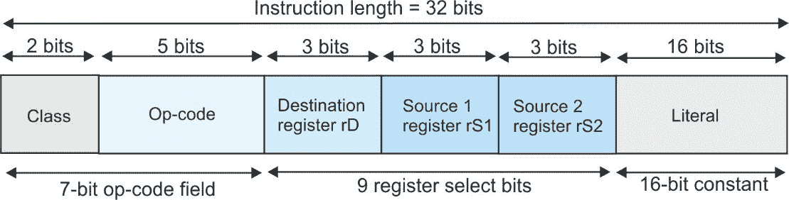
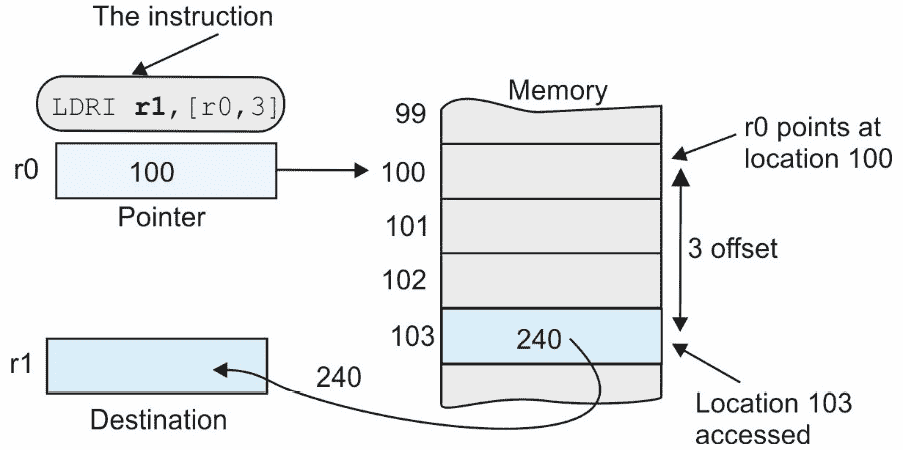

# 第四章：编译解释器 – 第一步

在本章中，我们将通过构建一个只能执行单个指令的非常原始的模拟器来迈出构建计算机模拟器的第一步。一旦我们迈出这一步，我们就可以通过逐步增强这个模拟器来继续前进。

本章我们将涵盖的关键主题如下：

+   使用一条指令设计最小计算机

+   设计一个可以解码和执行多个指令的简单模拟器

+   被称为 TC1 的通用计算机指令集

+   在 Python 中处理位（布尔运算）

+   将二进制形式的指令解码为其组成部分

+   解码后执行指令

+   计算机中的算术运算

+   在 Python 中设计函数

+   计算机指令集中的分支和流程控制指令

这些主题共同涵盖了三个领域。一些主题扩展了我们对 Python 的了解，帮助我们构建模拟器。一些主题介绍了典型数字计算机的指令集，我们称之为 TC1（TC1 简单意味着*教学计算机 1*）。一些主题涵盖了 TC1 在 Python 中的实际设计。

本章将介绍计算机模拟器并查看一些基本构建块。实际的模拟器将在*第六章*中介绍。

# 技术要求

您可以在 GitHub 上找到本章使用的程序，链接为[`github.com/PacktPublishing/Practical-Computer-Architecture-with-Python-and-ARM/tree/main/Chapter04`](https://github.com/PacktPublishing/Practical-Computer-Architecture-with-Python-and-ARM/tree/main/Chapter04)。

### 一个超原始的单指令计算机

我们的第一个*单指令解释器*演示了指令解码和执行，这是所有模拟器的关键。这台计算机有一个九个位置的内存，`mem[0]`到`mem[8]`，排列成一个整数列表。内存的内容预设为`mem = [4,6,1,2,7,8,4,4,5]`。内存位置为 0 到 8，在列表中从左到右读取；例如，内存位置 0 包含值为 4，位置 1 包含值为 6，位置 8 包含值为 5。

计算机有一个包含八个寄存器的数组，`r[0]`到`r[7]`。这些在 Python 中通过以下方式指定：

```py

 r = [0,0,0,0,0,0,0,0]                  #. Define a list of 8 registers and set them all to 0.
```

我们将要执行的单一指令是`add r[4],mem[3],mem[7]`。这条指令将内存位置 3 的内容与内存位置 7 的内容相加，并将和放入寄存器 4。我们选择从单指令计算机开始，因为它可以用几行 Python 代码表达，同时它执行了许多真实计算机模拟器所需的操作。

我们将这种内存到内存的操作定义为演示。它不是任何真实计算机语言的一部分。有趣的是，它比大多数真实计算机指令更复杂，因为它使用内存到内存操作而不是寄存器到寄存器操作。

我们将编写必要的 Python 代码来以文本形式读取这个指令并执行它定义的操作。下面代码中的两条阴影行将这个指令分割成一个可以处理的标记列表。标记是指令中的一个元素（就像英语中的句子可以被分割成我们称之为单词的标记一样）。这里的标记是 `'add'`、`'r[4]'`、`'mem[3]'` 和 `'mem[7]'`。

这个指令读取 `mem[3]` 的内容，它是 2；读取 `mem[7]` 的内容，它是 4；将它们相加得到 2 + 4 = 6；然后将值 6 存储在寄存器 4 中。执行此指令后，寄存器 `r[4]` 的值应该是 6：

```py

mem = [4,6,1,2,7,8,4,4,5]            # Create a 9-location memory. Fill with some data
r =   [0,0,0,0,0,0,0,0]                 # Create a set of 8 registers, all initialized to 0
inst   = 'add r[4],mem[3],mem[7]'       # inst is our solitary instruction, stored as a string
inst1  = inst.replace(' ',',')          # Step 1: Replace any space with a comma
inst2  = inst1.split(',')               # Step 2: Split instruction into tokens at each comma
token0 = inst2[0]                       # Step 3: Get token0 via the 'add' instruction
token1 = inst2[1]                       # Step 4: Get token1, register 'r[4]'
token2 = inst2[2]                       # Step 5: Get token2, 'mem[3]'
token3 = inst2[3]                       # Step 6: Get token3, 'mem[7]'
value1 = int(token1[2])                 # Step 7: Get the register number as an integer
value2 = int(token2[4])                 # Step 8: Get the first memory number as an integer
value3 = int(token3[4])                 # Step 9: Get the second memory number as an integer
if token0 == ‹add›:                     # Step 10: Test for an 'add' instruction
  r[value1] = mem[value2] + mem[value3]# Step 11: If ADD, then add the contents of the memory
print('Registers: ',r)
```

`inst1 = inst.replace(' ',',')` 操作将指令中的空格替换为逗号，得到 `'add r[4],mem[3],mem[7]'`。现在这是一个由逗号分隔的标记字符串。

下一步是创建一个标记列表，以便我们可以访问指令的各个组成部分。`inst2 = inst1.split(',')` 的效果是创建一个字符串列表：

```py

inst2 = ['add', 'r[4]', 'mem[3]', 'mem[7]']
```

`split()` 方法接受一个字符串，并使用指定的分隔符创建一个字符串列表。如果 `y = x.split('!')`，则 `y` 的值是一个字符串列表，分隔符是 `!`。下面展示了 `split()` 的一个使用示例：

```py

>>> x = 'asssfg! !   !,!!rr'
>>> x
'asssfg! !   !,!!rr'
>>> y = x.split('!')
>>> y
['asssfg', ' ', '   ', ',', '', 'rr']
```

`token2 = inst2[2]` 这一行给出 `token2 = 'mem[3]'`；即第四个标记。

`value2 = int(token2[4])` 这一行给出 `value2 = 3`，因为第二个切片是 `'mem[3]'` 字符串中的 3。注意我们使用 `int()` 函数将字符 4、3 和 7 转换为整数值。当从字符串到数值操作时，你必须记住在字符和整数字符类型之间进行转换。

如果我们执行这个程序，我们会得到以下输出：

```py

Registers:  [0, 0, 0, 0, 6, 0, 0, 0]    Output from the program. The correct value is in r4
```

现在我们已经介绍了模拟器的基本组件，下一步是构建一个可以处理更多指令的计算机，尽管这只是典型操作的微小子集。然而，这个子集包括了所有真实计算机操作类别。

# 在 Python 中构建一个简单的计算机解释器

我们可以将模拟器的概念进一步发展，并使用我们刚刚开发的概念执行包含多个指令的程序。连续的指令通过从程序内存中逐个读取它们来执行，并使用程序计数器来跟踪我们在程序中的位置。

请注意，当我们提到一个 *程序* 时可能存在的一个混淆来源。我们正在用高级语言 Python 编写程序来模拟计算机。那个模拟计算机运行的是汇编语言编写的程序。因此，程序这个术语可以指两个不同的实体。应该从上下文中清楚我们指的是哪一个。

注意，伪代码不是一种计算机语言，而是一种用几乎纯英语表达计算机算法的方法。因此，一段伪代码可以代表高级语言（如 Python）或汇编语言。

在以下示例中，汇编语言指令的源程序以 Python 列表的形式表达，其中每个指令都是一个字符串：

```py

prog=['LDRL r0 0','LDRL r1 0','ADDL r1 r1 1','ADD r0 r0 r1','CMPL r1 10', \
     'BNE 2','STOP']
```

这些指令的效果如下：

```py

LDRL r0 0           Load r0 with literal 0
ADDL r1 r1 1        Add 1 to r1 and put the result in r1
ADD  r0 r0 r1       Add r1 to r0 and put the result in r0
CMPL r1 10          Compare the contents of r1 with literal 10
BNE  2              Branch to instruction 2 if the last result is not 0
STOP                Stop
```

为了简化 Python 代码，我们使用了空格作为分隔符——例如，`LDRL r0,0` 被写成 `LDRL` `r0 0`。

真实计算机将汇编语言指令存储为 32 位或 64 位二进制数字的字符串。我们将直接从文本字符串中执行汇编语言指令，以避免将文本转换为二进制，然后再将二进制作为指令进行解释。在这里，我们有一个目标：展示程序是如何执行的。

在运行上述汇编级代码的计算机上，尽管添加额外指令非常容易，但只有少数指令。在整个文本中，术语 *opcode* 或操作码表示汇编语言指令（如 `ADD` 或 `BNE`）的二元代码（或文本版本）。模拟器程序的伪代码结构如下：

```py

prog=['LDRL r0 0','LDRL r1 0','ADDL r1 r1 1','ADD r0 r0 r1', \
      'CMPL r1 10','BNE 2','STOP']
Define and initialize variables (PC, registers, memory)
while run == True:
   read instruction from prog
   point to next instruction (increment program counter)
   split instruction into fields (opcode plus operands)
   if   first field = op-code1 get operands and execute
   elif first field = op-code2 get operands and execute
   elif first field = op-code3 . . .
   . . .
```

```py
   else declare an error if no instruction matches.
```

这个汇编语言程序，`prog`（在模拟器代码中作为列表提供），使用条件分支 `BNE 2`，如果前一个操作结果不是 0，则跳回指令 2。在下一段 Python 程序中的汇编语言版本使用符号名 `Loop` 来指示分支的目标，但实际上代码使用的是字面量 2。我们将在稍后查看如何处理像 `Loop` 这样的符号名。

## 原始模拟器的 Python 代码

下面的代码是此模拟器的 Python 代码。从第 0 行到第 6 行的初始注释显示了汇编语言程序：

```py

#                                 @ Test fetch/execute cycle
#0       LDRL r0 0                @ Load register r0 with 0 (the sum)
#1       LDRL r1 0                @ Load register r1 with 0 (the counter)
#2 Loop  ADDL r1 r1 1             @ REPEAT Increment counter in r1\. Loop address = 2
#3       ADD  r0 r0 r1            @ Add the count to the sum in r0
#4       CMPL r1 10               @ Compare the count with 10
#5       BNE  Loop                @ Branch back to Loop until all numbers added (BNE 2)
#6       STOP                     @ Terminate execution
prog=['LDRL r0 0','LDRL r1 0','ADDL r1 r1 1','ADD r0 r0 r1','CMPL r1 10', \
      'BNE 2','STOP']
r = [0] * 8                       # Initialize r[0], r[1], ... r[7] and initialize to 0
z = 0                             # Z is zero flag: if a compare result is 0, z = 1
run = True                        # Run flag True to execute
pc = 0                            # Pc is program counter, initially 0
while run == True:                # The fetch/execute loop
    inst = prog[pc]               # Read next instruction from memory
    oldPC = pc                    # Save the old value of the the pc (program counter)
    pc = pc + 1                   # Point to the next instruction
    inst = inst.split(' ')        # Split divides the instruction into tokens (separate fields)
    if inst[0] == 'ADD':          # Test for ADD rd,rS1,rS2 instruction
        rd  = int(inst[1][1])     # Get dest, source 1 and source 2
        rS1 = int(inst[2][1])
        rS2 = int(inst[3][1])
        r[rd] = r[rS1] + r[rS2]   # Add reg 1 and 2 sum in destination register
    elif inst[0] == 'ADDL':       # Test for ADD literal instruction, ADDL
        rd  = int(inst[1][1])     # If found, get destination register
        rS1 = int(inst[2][1])     # Now get source 1 register
        literal =  int(inst[3])   # Now get the literal
        r[rd] = r[rS1] + literal  # Add reg 1 and literal
    elif inst[0] == 'BNE':        # Test for branch on not zero
        if z == 0:                # If z is 0 (last register not zero)
           pc = int(inst[1])      # Get branch destination from operation
    elif inst[0] == 'CMPL':       # Test register for equality with a literal
        z = 0                     # Set z flag to 0 (assume not equal)
        rVal = r[int(inst[1][1])] # Register value
        intVal = int(inst[2])     # Literal value
        if rVal == intVal: z = 1  # If reg value =s literal, z=1
    elif inst[0] == 'LDRL':       # Test for load literal into register operation
        rd = int(inst[1][1])      # Get destination register
        data = int(inst[2])       # Test literal value
        r[rd] = data              # Store literal in destination register
    elif inst[0] == 'STOP':       # Test for STOP instruction
        run = False               # If STOP found, then set run flag to False
        print('End of program reached')
    else:                         # If we end up here, not a valid instruction
        run = False               # So set run flag to False and stop
        print('Error: illegal instruction ',inst)
    print('PC = ',oldPC,'r0 = ',r[0],'r1 = ',r[1],'z = ',z)  # Print results
                                  # Repeat loop until Run = False
```

代码的有趣部分是从指令中提取操作数。考虑 `ADDL r1 r2 3` 指令，这意味着将一个字面量加到源寄存器上，并将和放入目标寄存器。目标寄存器是 `r1`，源寄存器是 `r2`，字面量是 `3`。

Python 的 `inst = inst.split(' ')` 操作使用空格作为分隔符将字符串转换为子字符串列表。因此，`inst` 的新值是以下列表：

```py

inst =  ['ADDL', 'r1', 'r2', '3'] # An instruction converted into a list of substrings
```

我们现在可以检查这个列表的四个字段；例如，`inst[0] = 'ADDL'` 给我们实际的指令助记符。

假设我们想要获取源寄存器的内容，`r2`。源寄存器在列表的第三个位置，`['ADDL', 'r1', 'r2', '3']`；即 `inst[2]`。让我们写下 `rS1 = inst[2]`。`rS1` 的值是 `'r2'`。

我们希望将寄存器号（即 2）作为整数，因此我们必须获取 r2 的第二个字符并将其转换为整数。我们可以用以下方式做到这一点：

```py

rS1 = int(rS1[1])              # get second character of the rS1 string and convert it into an integer
```

我们可以将这两个表达式合并为一个，如下所示。

```py

rS1 = int(inst[2][1])        # inst[2][1], which gets character 1 of substring 2.
```

我们创建的小型计算机只执行了五种不同的指令，但它包括了真实计算机中的许多重要组件。这台计算机直接从汇编语言形式执行指令，而不是从二进制代码执行。下一步是在我们能够构建一个更真实的机器之前，更仔细地看看指令集。

构建了模拟器之后，下一步是看看计算机可以执行哪种类型的指令。

在下一节中，我们将为 TC1 计算机开发一套指令集。除了提供一个指令集设计的实际例子外，我们还将展示指令是如何被分成多个字段，并且每个字段都提供了关于当前指令的一些信息。

## TC1 指令集

在本节中，我们将介绍我们演示计算机的关键组件：其指令集。这个计算机，TC1，具有许多真实计算机的功能，易于理解和修改。我们将首先介绍 TC1 指令集编码。

为了简化，我们可以使用单独的程序和数据内存。这种与传统冯·诺伊曼模型的偏离使我们能够拥有 32 位的程序内存和 16 位的数据内存。此外，我们不必担心不小心将数据放在程序区域的中间。

典型的指令有几个字段；例如，操作码、寄存器和字面量（即常数）。然而，每个字段中的位数总和必须等于指令的总长度。

现代计算机通常为每类指令采用不同的格式。这优化了操作码到位的分配；例如，一个分支指令可能有一个 4 位的操作码和一个 28 位的字面量字段，而一个数据处理指令可能有一个 17 位的操作码和三个 5 位的寄存器选择字段。

为了简化起见，TC1 计算机有一个单一、固定的格式。所有指令的字段数量相同，并且每个指令的字段大小相同。如图*图 4**.1*所示，一条指令由操作*类别*加上操作码、三个寄存器字段和一个字面量字段组成。*图 4**.1*显示了操作码字段为 7 位，其中包含 2 位的操作码类别和 5 位的实际操作码。

这种指令格式的结构效率低下，因为如果一个指令不访问寄存器，那么三个寄存器选择字段就浪费了。在一个如 ADD rd,rS1,rS2 的三寄存器指令中，rd 寄存器是目的寄存器，rS1 是源寄存器 1，rS2 是源寄存器 2：



图 4.1 – TC1 指令格式（RISC 风格）

我们将 16 位分配给字面量字段，以便我们可以用一条指令将常数加载到内存中。这留下了 32 - 16 = 16 位可以分配给所有其他字段。

TC1 具有三寄存器格式，这是 ARM 和 MIPS 等加载和存储计算机的典型特征。如果我们有八个寄存器，则需要 3 x 3 = 9 位来指定所有三个寄存器。在为立即数分配 16 位和为寄存器选择分配 9 位之后，我们剩下 32 - (16 + 9) = 7 位来指定多达 128 种不同的可能指令（2⁷ = 128）。

操作码字段本身分为四个类别或类别，占用两位，为每个类别的指令留下 7 - 2 = 5 位。*表 4.1*定义了指令的类别（类别）：

| **班级** | **组** | **注释** |
| --- | --- | --- |
| 0 0 | 特殊操作 | 执行如`STOP`或读取键盘等功能的操作 |
| 0 1 | 数据传输 | 将数据从一个地方复制到另一个地方的操作 |
| 1 0 | 数据处理 | 算术和逻辑数据处理操作 |
| 1 1 | 流控制 | 控制指令序列的操作，如`BEQ` |

表 4.1 – TC1 指令类别

*表 4.2*展示了 TC1 指令集。第一列(`01 00001`)将内存位置的值加载到寄存器中。最左边的两位分开表示指令组：

| **二进制代码** | **操作** | **助记符** | **指令格式****rrr = Rd, aaa = rS1, bbb =** **rS2** | **代码格式** |
| --- | --- | --- | --- | --- |
| `00 00000` | 停止操作 | STOP | 00 00000 000 000 000 0 | 0 0 0 0 |
| `00 00001` | 无操作 | NOP | 00 00001 000 000 000 0 | 0 0 0 0 |
| `00` `00 010` | 从键盘获取字符 | GET r0 | 00 00010 rrr 000 000 0 | 1 0 0 0 |
| `00 00011` | 获取随机字符 | RND r0 | 00 00011 rrr 000 000 L | 1 0 0 1 |
| `00 00100` | 在寄存器中交换字节 | SWAP r0 | 00 00100 rrr 000 000 0 | 1 0 0 0 |
| `00 01000` | 在寄存器中打印十六进制值 | PRT r0 | 00 01000 rrr 000 000 0 | 1 0 0 0 |
| `00 11111` | 终止程序 | END | 00 11111 000 000 000 0 | 0 0 0 0 |
| `01 00000` | 从寄存器加载寄存器 | MOV r0,r1 | 01 00000 rrr aaa 000 0 | 1 1 0 0 |
| `01 00001` | 从内存加载寄存器 | LDRM r0,L | 01 00001 rrr 000 000 L | 1 0 0 1 |
| `01 00010` | 用立即数加载寄存器 | LDRL r0,L | 01 00010 rrr 000 000 L | 1 0 0 1 |
| `01 00011` | 间接加载寄存器 | LDRI r0,[r1,L] | 01 00011 rrr aaa 000 L | 1 1 0 1 |
| `01 00100` | 将寄存器存储到内存 | STRM r0,L | 01 00100 rrr 000 000 L | 1 0 0 1 |
| `01 00101` | 间接存储寄存器 | STRI r0,[r1,L] | 01 00101 rrr aaa 000 L | 1 1 0 1 |
| `10 00000` | 寄存器加寄存器 | ADD r0,r1,r2 | 10 00000 rrr aaa bbb 0 | 1 1 1 0 |
| `10 00001` | 将寄存器加到立即数 | ADDL r0,r1,L | 10 00001 rrr aaa 000 L | 1 1 0 1 |
| `10 00010` | 从寄存器减去寄存器 | SUB r0,r1,r2 | 10 00010 rrr aaa bbb 0 | 1 1 1 0 |
| `10 00011` | 从寄存器减去立即数 | SUBL r0,r1,L | 10 00011 rrr aaa 000 L | 1 1 0 1 |
| `10 00100` | 寄存器乘寄存器 | MUL r0,r1,r2 | 10 00100 rrr aaa bbb 0 | 1 1 1 0 |
| `10 00101` | 立即数乘以寄存器 | MULL r0,r1,L | 10 00101 rrr aaa 000 L | 1 1 0 1 |
| `10 00110` | 寄存器除以寄存器 | DIV r0,r1,r2 | 10 00110 rrr aaa bbb 0 | 1 1 1 0 |
| `10 00111` | 寄存器除以立即数 | DIVL r0,r1,L | 10 00111 rrr aaa 000 L | 1 1 0 1 |
| `10 01000` | 寄存器模寄存器 | MOD r0,r1,r2 | 10 01000 rrr aaa bbb 0 | 1 1 1 0 |
| `10 01001` | 寄存器模立即数 | MOD r0,r1,L | 10 01001 rrr aaa 000 L | 1 1 0 1 |
| `10 01010` | 与寄存器到寄存器 | AND r0,r1,r2 | 10 01000 rrr aaa bbb 0 | 1 1 1 0 |
| `10 01011` | 与寄存器到立即数 | ANDL r0,r1,L | 10 01001 rrr aaa 000 L | 1 1 0 1 |
| `10 01100` | 或寄存器到寄存器 | OR r0,r1,r2 | 10 01010 rrr aaa bbb 0 | 1 1 1 0 |
| `10 01101` | 或寄存器到立即数 | ORL r0,r1,L | 10 01011 rrr aaa 000 L | 1 1 0 1 |
| `10 01110` | 异或寄存器到寄存器 | EOR r0,r1,r2 | 10 01010 rrr aaa bbb 0 | 1 1 1 0 |
| `10 01111` | 异或寄存器到立即数 | EORL r0,r1,L | 10 01011 rrr aaa 000 L | 1 1 0 1 |
| `10 10000` | 非寄存器 | NOT r0 | 10 10000 rrr 000 000 0 | 1 0 0 0 |
| `10 10010` | 增加寄存器 | INC r0 | 10 10010 rrr 000 000 0 | 1 0 0 0 |
| `10 10011` | 减少寄存器 | DEC r0 | 10 10011 rrr 000 000 0 | 1 0 0 0 |
| `10 10100` | 寄存器比较寄存器 | CMP r0,r1 | 10 10100 rrr aaa 000 0 | 1 1 0 0 |
| `10 10101` | 比较寄存器与立即数 | CMPL r0,L | 10 10101 rrr 000 000 L | 1 0 0 1 |
| `10 10110` | 带进位加 | ADC r0,r1,r2 | 10 10110 rrr aaa bbb 0 | 1 1 1 0 |
| `10 10111` | 带借位减 | SBC r0,r1,r2 | 10 10111 rrr aaa bbb 0 | 1 1 1 0 |
| `10 11000` | 逻辑左移 | LSL r0,L | 10 10000 rrr 000 000 0 | 1 0 0 1 |
| `10 11001` | 逻辑左移立即数 | LSLL r0,L | 10 10000 rrr 000 000 L | 1 0 0 1 |
| `10 11010` | 逻辑右移 | LSR r0,L | 10 10001 rrr 000 000 0 | 1 0 0 1 |
| `10 11011` | 逻辑右移立即数 | LSRL r0,L | 10 10001 rrr 000 000 L | 1 0 0 1 |
| `10 11100` | 左旋转 | ROL r0,L | 10 10010 rrr 000 000 0 | 1 0 0 1 |
| `10 11101` | 左旋转立即数 | ROLL r0,L | 10 10010 rrr 000 000 L | 1 0 0 1 |
| `10 11110` | 右旋转 | ROR r0,L | 10 10010 rrr 000 000 0 | 1 0 0 1 |
| `10 11111` | 右旋转立即数 | RORL r0,L | 10 10010 rrr 000 000 L | 1 0 0 1 |
| `11 00000` | 无条件分支 | BRA L | 11 00000 000 000 000 L | 0 0 0 1 |
| `11 00001` | 零条件分支 | BEQ L | 11 00001 000 000 000 L | 0 0 0 1 |
| `11 00010` | 非零条件分支 | BNE L | 11 00010 000 000 000 L | 0 0 0 1 |
| `11 00011` | 负条件分支 | BMI L | 11 00011 000 000 000 L | 0 0 0 1 |
| `11 00100` | 跳转到子程序 | BSR L | 11 00100 000 000 000 L | 0 0 0 1 |
| `11 00101` | 从子程序返回 | RTS | 11 00101 000 000 000 0 | 0 0 0 0 |
| `11 00110` | 减少且非零分支 | DBNE r0,L | 11 00110 rrr 000 000 L | 1 0 0 1 |
| `11 00111` | 减少且零分支 | DBEQ r0,L | 11 00111 rrr 000 000 L | 1 0 0 1 |
| `11 01000` | 将寄存器推入堆栈 | PUSH r0 | 11 01000 rrr 000 000 0 | 1 0 0 0 |
| `11 01001` | 从堆栈中拉取寄存器 | PULL r0 | 11 01001 rrr 000 000 0 | 1 0 0 0 |

表 4.2 – TC1 指令编码（4 个代码格式位不是操作码的一部分）

最右侧的列称为`1001`，告诉汇编器该指令需要目标寄存器和 16 位字面值。代码`0000`告诉我们该指令不包含任何操作数。

我们选择这些指令来展示一系列操作。许多这些指令是 RISC 计算机（如 ARM）的典型代表（即我们不包含对内存中数据的操作）。注意，稍后我们将介绍一个内存到寄存器指令集的模拟器，它允许执行如`ADD r1,12`这样的操作，其中`12`是一个内存位置。

表 4.2 中的一些指令在真实计算机上不存在；例如，从键盘读取字符。我们添加这些指令是为了简化调试和实验。同样，TC1 可以生成随机数，这是大多数计算机指令集中没有的特性。然而，它对于生成随机测试数据很有用。一些指令，如子程序调用和返回，实现了更复杂的操作，我们将在后面遇到。

标有`L`的列表示字面值（即 16 位常数）。

第四列（`rrr`、`aaa`和`bbb`）显示了三个寄存器选择字段的位置。最右侧的字段（`0`或`L`）表示字面值的 16 位。如果所有位都是 0，我们显示`0`；如果指令需要 16 位字面值，则显示`L`。如果一个寄存器字段不是必需的，相应的字段将用零填充（尽管这些位是什么值并不重要，因为指令不会使用这些位）。

记住，最右侧列中的四个位不是操作码或指令本身的一部分。这些位显示了当前指令所需的字段：目标寄存器（`rrr`）、源 1 寄存器（`aaa`）、源 2 寄存器（`bb`）和字面值`L`。例如，代码`1100`表示该指令有一个目标寄存器和单个源寄存器。

### 解释一些指令

表 4.2 中的一些指令是真实处理器的典型代表。包括了一些指令以提供有用的功能，例如生成随机数以供测试使用。本节描述了表 4.2 中的一些指令。

`STOP`终止指令处理。大多数现代计算机没有显式的`STOP`操作。

`NOP`除了推进程序计数器外不做任何事情。它是一个有用的占位符操作，可以作为代码中的标记、未来代码的占位符或测试的辅助。

`GET`从键盘读取数据，并提供了一种简单的方法将键盘输入传送到寄存器。这在测试程序时很有用，但它不是一个正常的计算机指令。

`RND` 生成随机数。它不在计算机指令集中，但在测试代码时提供了一种生成内部数据的优秀手段。

`SWAP` 交换高字节和低字节 – 例如，`0x1234` 变为 `0x3412`。

加载和存储指令在内存和寄存器之间移动数据。这类指令成员之间的区别在于方向（存储是从计算机到内存，而加载是从内存到计算机），大小（某些计算机允许字节、16 位或 32 位传输），以及寻址模式（使用字面值、绝对地址或寄存器地址）。

`MOV` 将一个寄存器的内容复制到另一个寄存器 – 例如，`MOV r3,r1` 将 `r1` 的内容复制到 `r3`。`MOV` 实质上是一个加载寄存器与寄存器（LDRR）指令。

`LDRL` 将寄存器加载为字面值 – 例如，`LDRL r3,20` 将寄存器 `r3` 加载为 `20`。

`LDRM` 将寄存器的内容加载到由字面值地址指定的内存位置。`LDRM r1,42` 将 `r1` 加载为内存位置 `42` 的内容。这个指令在现代 RISC 处理器上不存在。大多数现代处理器不允许你访问绝对内存地址，

`LDRI` 是加载寄存器索引（或加载寄存器间接）指令，将寄存器的内容加载到由寄存器内容加字面值地址指定的内存位置。`LDRM r2,[r3,10]` 将 `r2` 加载为地址由 `r3` 内容加 `10` 给定的内存位置的内容。这个指令是标准的 RISC 加载操作。

`STRM` 是存储寄存器内存指令，将寄存器存储在由字面值地址指定的位置。`STRM r2,15` 将寄存器 `r2` 存储在内存位置 `15`。RISC 处理器不实现这个指令。

`STRI` 是存储寄存器索引指令，将寄存器存储在由寄存器加字面值指定的位置。`STRI r2,[r6,8]` 将 `r2` 存储在地址为 `r6` 加 `8` 的内存位置。

`STR`、`STRM` 和 `STRI` 指令是异常的，因为它们将源操作数和目标操作数写入的顺序与 `LDR`（以及所有其他处理器操作）相反；也就是说，如果你写 `LDR r0,PQR`，你应该写 `STR PQR,r0` 来表示反向数据流。但是，按照惯例和实践，我们并不这样做。

`DBNE` 我们添加了递减且非零分支指令是为了好玩，因为这让我想起了我的老摩托罗拉时代。68000 是一个强大的微处理器（在当时）具有 32 位架构。它有一个递减和分支指令，用于循环的末尾。在循环的每次迭代中，指定的寄存器都会递减，如果计数器不是-1，则返回到标签。`DBNE r0,L` 递减 `r0`，如果计数器不为零，则跳转到编号为 `L` 的行。

### 寄存器间接寻址

有两条指令需要特别提及，因为它们不是关于数据操作，而是关于在内存中访问数据。这些是 `LDRI` 和 `STRI`，它们都使用寄存器间接寻址。在 *表 4.2* 中，`0b0100011` 操作码对应于 `LDRI`（即，加载寄存器 *间接*）。这条指令并不给出操作数的实际地址；它告诉你地址在哪里可以找到。寄存器间接寻址模式也称为基于指针或索引寻址。内存中的操作数地址由寄存器的内容加上偏移量给出；即，`r[rD]=mem[r[rS1]+lit]`。如果我们使用粗体和阴影，可以使它的解释更容易一些：

```py

r[rD] = mem[r[rS1]+lit]
```

*图 4**.2* 展示了 `LDRI r1,[r0,3]` TC1 指令的效果，其中指针寄存器 `r0` 包含 100，操作数在内存地址 100 + 3 = 103 处访问：



图 4.2 – 寄存器间接寻址

这种寻址模式允许你在程序运行时修改地址（因为你可以更改指针的内容，`r0`）。基于指针的寻址使得能够逐个元素地遍历项目列表，只需递增指针即可。以下是一个例子：

```py

LDRI  r1,[r2,0]    @ Get the element pointed at by r2\. Here the offset is 0
INC   r2           @ Increment r2 to point to the next element
```

我们访问由 `r2` 指向的元素（在这种情况下，偏移量是 `0`）。下一行将 `r2` 递增以指向下一个元素。如果这个序列在循环中执行，数据将被逐个元素访问。

计算机实现算术和布尔（逻辑）操作。在下一节中，我们将简要介绍 Python 如何在汇编语言级别模拟逻辑操作。

## Python 中的位处理

在本节中，我们将探讨 Python 如何处理所有计算机数据的基本组成部分：位。因为模拟计算机在位级别上操作，我们必须在构建能够执行 `AND` 和 `OR` 等逻辑操作的模拟器之前，查看 Python 中位是如何被操作的。

计算机可以作为一个整体操作整个字，或者操作字中的单个位。因此，我们必须能够执行位操作和字操作来模拟计算机。

Python 允许你输入数据并将其显示为位字符串的二进制表示。你可以使用布尔运算符操作字符串的各个位，并且可以左右移位。Python 中有你需要的一切工具。我们现在将探讨 Python，它允许你操作整数的各个位。

因为模拟器将在二进制数字上操作，我们必须利用几个 Python 功能；例如，二进制值通过在其前面加上 `0b` 来表示。如果你想使用 15 的二进制等效值，你必须写成 `0b1111` 并像十进制数字一样使用它。以下两个操作具有相同的效果：

```py

x = y + 0b111      # Addition using a binary integer
```

```py
x = y + 15         # Addition using a decimal integer
```

两个重要的二进制运算符是 `>>`（右移）和 `<<`（左移）。移位表达式写作 `p >> q` 或 `p << q`，其中 `p` 是要操作的数，`q` 是移位的位数。考虑以下示例：

```py

x = 0b1110110
x = x << 2
```

这将 `x` 左移两位，得到新值 `0b111011000`。所有位都向左移动了两位，并在右手端输入 0 来填充新空出的位置。`x` 的移位版本现在有九位，而不是七位。然而，当我们模拟计算机时，我们必须确保无论我们做什么，字中的位数都保持不变。如果一个寄存器有 16 位，那么你对它进行的任何操作都必须产生 16 位。

我们可以对两个字执行布尔（位运算）操作；例如，C = A & B 通过计算 ci = ai · bi 对字中的每个位（即，对于 i = 0 到 7）进行操作来将字 A 和 B 连接在一起。考虑以下示例：

```py

x = 0b11101101 & 0b00001111
```

| **AND 运算的真值表** |
| --- |
| x | y | z=x & y |
| 0 | 0 | 0 |
| 0 | 1 | 0 |
| 1 | 0 | 0 |
| 1 | 1 | 1 |

这将 `x` 设置为 `0b000001101`，因为位与 0 进行 AND 运算会得到 0 结果，而位 x 与 1 进行 AND 运算会得到 x，因为 1 & 0 = 0 和 1 & 1 = 1，正如真值表所示。

在 Python 中，十六进制数以 `0x` 开头；例如，`0x2F1A`。我们在 Python 程序中使用十六进制数，因为它们比二进制数短。以下是一个示例：

```py

0x1234 = 0b0001001000110100
0xA0C2 = 0b1010000011000010
0xFFFF = 0b1111111111111111
```

考虑以下 Python 代码片段：

```py

x = 0b0011100101010011   # A 16-bit binary string we are going to process
y = (x >> 8) & 0xF       # Shift x right 8 places and mask it to 4 bits
print('y is ',bin(y))    # Print the result in binary form using bin()
```

此代码的输出是 `y` `is 0b1001`。

Python 使用超过 16 位来表示数字。为了在 TC1 中模拟二进制算术，我们必须将 Python 的数字限制在 16 位。我们必须使用 Python 提供的较长的字，并在必要时将它们截断到 16 或 32 位。考虑以下示例：

```py

x = 0xF009       # Set up 16-bit number       1111000000001001
y = x << 2       # Shift left twice to get      111100000000100100 = 0x3C024 (18 bits)
y = y & 0xFFFF   # Constrain to 16 bits to get     1100000000100100 = 0xC024
```

将 16 位字左移两位使其成为 18 位字。与二进制值 `0b1111111111111111` 进行 AND 运算强制其变为 16 位有效位。

## Python 的运算符优先级

现在，我们必须重新学习我们在高中算术中学到的某些知识：运算符优先级。当你在表达式中使用多个运算符时，你必须注意运算符优先级；也就是说，哪些操作先于其他操作执行。例如，4 * 5 + 3 等于 23 还是 32？所有计算机语言都有运算符优先级的层次结构。Python 的运算符优先级部分列表如下，优先级最高的排在前面。我们经常使用括号来使表达式的含义更清晰，即使这不是必需的——例如，`(xxx << 4) & (yyy <<` `2)`：

```py

()                          Parentheses               Highest precedence
~                           Negation
*,/, %                      Multiplication, division, modulus
+,-                         Addition, subtraction
<<, >>                      Bitwise shift left, right
&                           Logical (bitwise) AND
^                           Logical (bitwise) XOR
|                           Logical (bitwise) OR
<, <+, >, >+, <>, !=, ==    Boolean comparisons         Lowest precedence
```

在下一节中，我们将探讨如何解码一条指令，该指令是一串 1 和 0，以及执行适当的操作。

接下来，我们将构建模拟器迈出重大一步——即解码机器级二进制指令以提取它将要模拟的操作信息。

# 解码和执行指令

在本节中，我们将探讨一些指令编码和解码的例子。考虑`ADD r1,r2,r3`操作（其中寄存器`rD`、`rS1`和`rS2`的代码被阴影覆盖），它在 RTL 中的定义如下：

`[r1]` `←` `[r2] + [``r3]`

*表 4.2* 显示了`ADD r1,r2,r3`的编码是`10 00000 001 010 011 0000000000000000`。定义要使用的寄存器的 4 位格式代码是`1110`，因为我们使用了三个寄存器而没有文字字段（记住，这个 4 位格式代码不是操作码的一部分，而是由汇编器用来解释指令的）。

以下 Python 代码展示了我们如何解码指令以提取五个变量：操作码（`binOp`）；三个寄存器，`rD`、`rS1`和`rS2`；以及一个文字。解码是通过将指令的位右移以将所需字段移动到最低有效位，然后与掩码进行与操作以移除任何其他字段来执行的。考虑`xxxxxxx xxx 010 xxx xxxxxxxxxxxxxxxx`。如果我们将其右移 19 位，我们得到`0000000000000000000xxxxxxxxxx010`。零已经被移位，我们感兴趣的三个位现在在最低有效位中右对齐。如果我们用`0b111`与它进行与操作以只选择三个最低有效位，我们得到`0000000000000000000000000000010`——也就是说，所需的寄存器值现在右对齐，我们可以使用它：

```py

binOp = binCode >> 25             # Extract the 7-bit opcode binOp by shifting 25 bits right
rD    = binCode >> 22 & 0b111     # Extract the destination register as rD. 0b111 is a mask
rS1   = binCode >> 19 & 0b111     # Extract source register 1 as rS1
rS2   = binCode >> 16 & 0b111     # Extract the source register 2 as rS2
lit   = binCode & 0xFFFF          # Extract the low-order 16 bits (the literal) as lit
op0 = r[rD]                       # Read contents of destination register operand 0 as op0
op1 = r[rS1]                      # Read contents of source 1 register as op1
op2 = r[rS2]                      # Read contents of source 2 register as op2
```

Python 中的右移操作符是`>>`，位逻辑与操作符是`&`。掩码以位串的形式表示（而不是十进制数），因为与二进制 111 进行与操作比与十进制 7 进行与操作更清晰。在 Python 中，二进制值前面有一个 0b，所以 7 表示为`0b111`。文字与 16 个 1 进行与操作，表示为`0xFFFF`。我们使用二进制表示短字段，使用十六进制值表示长字段。这只是一种个人偏好。

`binCode >> 22 & 0b111`表达式将`binCode`的位右移 22 位，然后将结果与`000…000111`进行位与操作。由于操作符优先级，先进行移位操作。否则，我们会写成`(binCode >> 22) & 0b111`。我们经常使用括号，即使不是严格必要的，也要强调操作符优先级。

注意，我们提取了所有字段，即使它们可能不是每个指令所必需的。同样，我们读取了三个寄存器的所有内容。这种方法简化了 Python 代码，但以效率为代价。

考虑提取目标寄存器字段，`rrr`。假设指令是`ADD r1,r2,r3`，操作码是`10`00000001010`011`0000000000000000`。我们已经用粗体字和阴影表示了交替字段，目标字段被阴影覆盖以使其更容易阅读。执行 22 位右移将目标寄存器移动到最低有效位，并留下

```py
00000000000000000000001000000001   (after shifting 22 places right).
```

现在，如果我们用 111（所有左边的位都是零）进行与操作，我们得到以下结果：

```py

00000000000000000000001000000001      (after shifting 22 places right)
00000000000000000000000000000111      (the three-bit mask)
00000000000000000000000000000001      (The result; the 1 in bit position 9 has been removed)
```

我们现在已将第一个寄存器字段隔离出来以获得 `001`，这对应于寄存器 `r1`。解码指令的程序的最后三行如下：

```py

op0 = r[rD]    # Operand 0 is the contents of the destination register
op1 = r[rS1]   # Operand 1 is the contents of source register 1
op2 = r[rS2]   # Operand 2 is the contents of source register 2
```

这些指令使用寄存器地址（`rD`、`rS1` 和 `rS2`）来访问寄存器；即指令指定了要使用的寄存器。例如，如果 `op0 = r[5]`，寄存器 `r5` 是操作数零，目标寄存器。如果指令没有指定寄存器，则未使用字段被设置为零。

一旦指令被解码，它就可以被执行。幸运的是，执行大多数指令非常简单。考虑以下示例：

```py

if   opCode == 0b0100010: r[rD] = lit               # Load register with literal
elif opCode == 0b0100001: r[rD] = mem[lit]          # Load register from memory
elif opCode == 0b0100011: r[rD] = mem[op1 + lit]    # Load register indirect
elif opCode == 0b0100100: mem[lit] = r[rD]          # Store register in memory
```

这段代码片段展示了从加载和存储（即内存访问）组执行四个指令的过程。Python 的 `if … elif` 结构依次测试每个操作码。第一行将 7 位操作码与二进制值 `0100010` 进行比较，这对应于 `LDRL`（使用立即数加载寄存器）指令。顺便提一下，在 TC1 的最终版本中，我们通过将操作与实际助记符进行比较来使代码更容易阅读；例如，`'LDRL'` 比其代码 `0b100010` 更容易阅读。

如果匹配成功，冒号后面的代码将被执行，`(r[rD] = lit)`。如果不匹配，下一行使用 `elif` 命令将操作码与 `010001` 进行比较。如果匹配，则执行冒号后面的代码。这样，操作码将与所有可能的值进行比较，直到找到匹配项。

假设指令的操作码是 `0100010`，并且执行了 `r[rD] = lit` 行。这个 Python 操作将指令中提供的 16 位立即数的值转移到指令中指定的目标寄存器。在 RTL 术语中，它执行 `r[rD] ← lit` 并被程序员用来将整数加载到寄存器中。假设指令代码的二进制模式如下：

```py

01 00010 110 000 000 0000000011000001,
```

在这里，16 位立即数被加载到寄存器 `r6` 中以实现 `LDRL r6,193`。

## 算术和逻辑操作

算术和逻辑操作组在一个程序中执行所有的工作（数据处理）。它们包括算术操作（加法、减法和乘法），以及逻辑操作（`AND`、`OR`、`EOR` 和 `NOT`）。这些是三操作数指令，除了 `NOT`；例如，`AND r3,r0,r5` 在 `r0` 和 `r5` 的位之间执行位运算 `AND`，并将结果放入 `r3`。

以下 Python 代码片段展示了 TC1 如何解释这一组中的四个指令。有两个指令对：加法和减法。每一对包括一个寄存器到寄存器的操作和一个寄存器到立即数的操作；例如，`ADD r1,r2,r3` 将寄存器 `r2` 和 `r3` 的内容相加，而 `ADDL r1,r2,L` 将 16 位立即数的内容加到寄存器 `r2` 的内容上。这里我们不进行算术运算。相反，我们调用一个名为 `alu(f,a,b)` 的函数来执行所需操作。下一节将展示如何创建自己的函数：

```py

elif opCode==0b1000000: reg[dest]=alu(1,reg[src1],reg[src2]) # Add register to register
elif opCode==0b1000001: reg[dest]=alu(1,reg[src1],literal)   # Add literal to register
elif opCode==0b1000010: reg[dest]=alu(2,reg[src1],reg[src2]) # Subtract register from register
elif opCode==0b1000011: reg[dest]=alu(2,reg[src1],literal)   # Subtract literal from register
```

如果要编写执行每个运算所需的完整 Python 代码，每条指令可能需要几行代码。例如，加法运算 `reg[dest] = reg[src1] + reg[src2]` 看起来很简单，但算术运算中还有更多内容。

为了解释原因，我们需要讨论条件标志位的作用。回想一下，计算机在决定是否按顺序执行下一条指令，或者是否跳转到代码中的不同位置（即 `if…then…else` 结构）时做出决策。是否采取 `if` 分支或 `else` 分支的决定取决于算术或逻辑运算的结果（这包括比较运算）。

算术或逻辑运算的结果会被测试并用于设置或清除条件代码标志。这些标志通常是负数标志、零标志、进位标志和溢出标志，分别表示为 `n`、`z`、`c` 和 `v`。例如，如果运算表达式是 x = p – q，且结果为 x = 0，那么零位（零位）会被设置为 1。同样，如果运算结果无法用 16 位表示，进位位 c 会被设置。由于大多数计算机使用二进制补码算术，如果结果在二进制补码中表示为负数（即其最高位为 1），则负数标志 n 会被设置。v 位表示算术溢出，如果结果超出范围，则该位会被设置。这意味着两个正数相加的结果为负数，或者两个负数相加的结果为正数。

*表 4.3* 展示了如何将 4 位分配给数字 0 到 15（无符号）或 -8 到 7（有符号二进制补码）。程序员需要选择约定。然而，两种约定下的算术运算都是相同的。

考虑 0110 + 1100，结果是 10010（或 4 位中的 0010）。如果我们将这些数字解释为无符号数，计算结果为 6 + 12 = 2，这是不正确的，因为结果 18 无法用 4 位表示。如果我们将这些数字解释为有符号值，计算为 6 + -4 = 2，结果是正确的：

| **8** | **4** | **2** | **1** | **无符号值** | **有符号值** |
| --- | --- | --- | --- | --- | --- |
| 0 | 0 | 0 | 0 | 0 | 0 |
| 0 | 0 | 0 | 1 | 1 | 1 |
| 0 | 0 | 1 | 0 | 2 | 2 |
| 0 | 0 | 1 | 1 | 3 | 3 |
| 0 | 1 | 0 | 0 | 4 | 4 |
| 0 | 1 | 0 | 1 | 5 | 5 |
| 0 | 1 | 1 | 0 | 6 | 6 |
| 0 | 1 | 1 | 1 | 7 | 7 |
| 8 | 4 | 2 | 1 |  |  |
| 1 | 0 | 0 | 0 | 8 | -8 |
| 1 | 0 | 0 | 1 | 9 | -7 |
| 1 | 0 | 1 | 0 | 10 | -6 |
| 1 | 0 | 1 | 1 | 11 | -5 |
| 1 | 1 | 0 | 0 | 12 | -4 |
| 1 | 1 | 0 | 1 | 13 | -3 |
| 1 | 1 | 1 | 0 | 14 | -2 |
| 1 | 1 | 1 | 1 | 15 | -1 |

表 4.3——4 位数值的有符号和无符号表示

#### 二进制补码算术——注意事项

在二进制算术中表示负数有几种方式。其中最古老的一种称为符号和数值，其中如果数值为正，则前面加 0；如果为负，则加 1。这种方法今天在二进制算术中不再使用（除了浮点数之外）。

几乎所有现代计算机都使用二进制补码表示有符号整数。在二进制补码算术中，如果 N 是 n 位中的正数，则-N 的值由 2^n – 1 给出。N 的二进制补码可以通过反转位并加 1 来轻松计算。例如，如果 N = `000110`在六位中，-6 的值由`111010`表示。

二进制补码算术的优势在于加法和减法以相同的方式进行。如果你将一个二进制补码值加到另一个数上，结果会被正确计算。例如，如果我们把 9（即`001001`）加到-6 的前一个值上，我们得到`001001` + `111010` = `1000011`，这是六位中的+3。进位（粗体字体）被舍弃。

#### 零、进位和符号位

进位位和符号位用于确定结果是否在范围内或超出范围。在有符号算术中，如果 S = A+B 的二进制补码加法的结果中，A 和 B 的符号位都是 0 而 S 的符号位是 1，或者 A 和 B 的符号位都是 1 而 S 的符号位是 0，则结果超出范围。考虑使用四位进行加法和减法。使用二进制补码算术，最左边的位是符号位。在每种情况下，我们都对有符号数进行了二进制补码加法。结果给出了标志位的状态：

```py

 +0101                               +5 + -5 = 0
 +1011
 10000 Z = 1, N = 0, C = 1, V = 0   
                            The result is zero and the Z-bit is set. The C bit is 1, and N, V bits are clear
 +1101                               -3 + -3 = -6
 +1101
 11010 Z = 0, N = 1, C = 1, V = 0    The result is negative, N = 1, and a carry is generated, C = 1
 +1101                               -3 + +5 = +2
 +0101
 10010 Z = 0, N = 0, C = 1, V = 0    The result is positive and the carry bit is set
 +0101                               +5 + 6 = -5
 +0110
  1011 Z = 0, N = 1, C = 0, V = 1
                                 Two positive numbers are added and the result is negative. V is set
  1010                               -6 + -4 = +7
 +1100
 10111 Z = 0, N = 0, C = 1, V = 1
                                 Two negative numbers are added and the result is positive. V is set
```

我们如何知道一个数是有符号的还是无符号的？我们不知道！没有区别。如果你使用有符号数，你必须将结果解释为有符号值。如果你使用无符号数，你必须将结果解释为无符号值。例如，在四位中，1110 既可以表示-2 也可以表示+14，这取决于你如何看待它。

下一个主题将讨论我们如何处理重复操作组。如果程序中将要多次使用相同的操作序列，将它们组合成一个组并在需要时调用该组是有意义的。在 Python 中，这个动作组被称为函数。

# Python 中的函数

我们现在将描述 Python 的函数。我们已经使用了语言的一部分函数，如`len()`。在本节中，我们将做以下几件事：

+   解释为什么函数是有用的

+   提供一个实现 ALU 功能的示例

+   解释变量如何对函数是私有的或函数间共享的（作用域）

+   描述如何将参数传递给函数

+   描述函数如何返回结果

编写处理由模拟器实现的每个算术或逻辑操作的 Python 代码将会很繁琐，因为大量的代码会被单个指令重复。相反，我们可以创建一个 Python 函数（即子程序或过程），它执行算术/逻辑操作以及适当的标志位设置。

考虑一个名为 `alu(f,p,q)` 的 Python 函数，它返回一个整数，该整数是 `f`、`p` 和 `q` 参数的函数。要执行的操作以整数 `f` 的形式传递给过程。该函数还更新 z 和 n 标志位。这是我们将使用的实际函数的简化版本，它将提供两个操作，加法和减法，并只更新两个标志位：

```py

def alu(f,p,q):                  # Define the alu function with the f, p, and q input parameters
    global z,n                   # Declare flags as global
    if f == 1: r = p + q         # If f (the operation) is 1, do an addition
    if f == 2: r = p – q         # If f is 2, do a subtraction
    z, n = 0, 0                  # Clear zero and negative flags
    if r & 0xFFFF == 0: z = 1    # If the result is 0 in 16 bits, then z = 1
    if r & 0x8000 != 0: n = 1    # If result is negative (msb = 1), then n = 1
    return (0xFFFF & r)          # Ensure result is restricted to 16 bits
```

函数通过 `def`、其名称和任何参数后跟冒号来引入。函数体是缩进的。第一个参数 `f` 选择我们希望执行的操作（`f` = 1 表示加法，2 表示减法）。接下来的两个输入参数 `p` 和 `q` 是函数使用的数据值。函数的最后一行将结果返回到函数的调用点。这个函数可以通过例如 `opVal = alu(2,s1,s2)` 来调用。在这种情况下，结果 `opVal` 将是 `s1 – s2` 的值。

我们还更新了两个标志位，`z` 和 `n`。最初，`z` 和 `n` 都通过 `z, n = 0, 0` 被设置为零。（Python 允许在同一行进行多个赋值；例如，`a,b,c = 1,5,0` 将 `a`、`b` 和 `c` 分别设置为 1、5 和 0。）

你可以通过参数将数据传递给函数，并通过 `return()` 接收结果。然而，你可以在函数中声明变量为 `global`，这意味着它们可以像调用程序的一部分一样被访问和修改。

`return()` 不是强制的，因为有些函数不返回值。一个函数中可以有多个 `return()` 语句，因为你可以从函数的多个点返回。返回可以传递多个值，因为 Python 允许一行中的多个赋值；例如，参见以下：

```py

this, that  = myFunction(f,g)  # Assign f to this and g to that
```

通过比较结果 `r` 与 0 来测试零结果可以很容易地完成。测试负结果则更困难。在二进制补码算术中，如果一个有符号值的最高位是 1，则该值是负数。我们使用 16 位算术，因此这对应于位 15。我们可以通过将结果 `r` 与二进制值 1000000000000000 进行 AND 操作来提取位 15，即通过编写 `r&0x8000`（字面量以十六进制形式表示为 0x8000，这比二进制版本要短得多）。

要调用函数，我们可以编写以下代码：

```py

 if opCode == 0b1000000: r[rD] = alu(1,r[rS1],r[rS2])
```

我们测试操作码 1000000，如果它对应于`ADD`，则调用`alu`函数。该函数使用`f = 1`参数进行加法；要加的数字是两个源寄存器的内容。结果被加载到`r[rD]`寄存器中。在 TC1 的当前版本中，我们使用操作码查找助记符，然后如果`mnemonic == 'ADD'`则应用测试。这种方法更容易阅读，并且在跟踪输出时可以使用助记符。

我们已经将`z`和`n`变量设置为全局变量（即，它们可以被函数更改并从外部访问）。如果我们没有将它们设置为全局变量，我们就必须使它们作为返回参数。一般来说，将变量作为参数传递而不是使它们成为全局变量是一种更好的做法。

### 函数和作用域

变量与*作用域*或*可见性*相关联。如果你编写一个没有函数的程序，变量可以在程序中的任何地方访问。如果你使用函数，生活就变得相当复杂。

如果你将变量声明在主体中，该变量将在函数中可见（即，你可以使用它）。然而，你无法在函数中更改它并在函数外部访问新值。函数内部发生的事情就留在函数内部。如果你希望从函数外部访问它，你必须将其声明为*全局*。如果你编写`global temp3`，那么`temp3`变量在函数内外是同一个变量。

如果你在一个函数中创建了一个变量，该变量不能在函数外部访问，因为它对函数是私有的（一个局部变量）。你可以在另一个函数或程序体中创建具有相同名称的变量，但这个函数中的变量对函数外具有相同名称的变量没有影响。

如果你在一个函数中创建了一个你希望在外部可见的变量，你必须在函数中将其声明为全局变量。考虑以下代码：

```py

def fun_1():                      # A dummy function
    p = 3                         # p is local to fun_1 and set to 3
    global q                      # q is global and visible everywhere
    print('In fun_1 p =',p)       # Print p in fun_1
    print('In fun_1 q =',q)       # Print q in fun_1
    q = q + 1                     # q is changed in this function
    p = p + 1                     # p is changed in this function
    r = 5                         # set local variable r to 5
    return()                      # You don't need a return
p = 5                             # p is defined in the body
q = 10                            # q is defined in the body
print('In body: p =',p, 'q =',q ) # Print current values of p and q
fun_1()                           # Call fun_1 and see what happens to p and q
print('In body after fun_1 q =',q, 'after fun_1 p = ',p)
```

运行此代码后，我们得到以下结果。正如你所见，函数因为它是全局的而改变了`q`，而`p`没有改变，因为它在函数中是一个局部变量：

```py

In body: p = 5 q = 10
In fun_1 p = 3
In fun_1 q = 10
In body after fun_1 q = 11 after fun_1 p =  5
```

这里是规则的总结：

+   如果你不在函数中更改它，你可以在任何地方使用它

+   如果你在一个函数中声明它，它就属于你，并且对函数是私有的

+   如果你希望在函数中更改它并使用它在外部，那么在函数中将其声明为全局变量

这意味着像`z`和`n`这样的条件码标志变量可以在函数中访问。如果你希望在函数中更改它们，你必须使用以下命令将它们声明为全局变量：

```py

global z,n
```

如果一个函数返回一个值，它以`return(whatever)`结束。如果你从函数中不返回值，则不需要`return`语句。然而，我们通常包括一个返回空值的`return()`，然后我们明确标记函数的结束。

虽然 Python 支持全局变量的使用，但一些程序员避免使用它们，因为全局变量使得在函数中意外更改变量并没注意到它变得过于容易，导致在调试有缺陷的程序时头疼。他们认为所有变量都应该作为参数传递给函数。

在下一节中，我们将描述使计算机成为计算机的真正原因——它根据操作的结果采取两种不同行动的能力。

## 分支和流程控制

所有微处理器都有流程控制指令；例如，无条件分支 `BRA XYZ` 表示在地址 `XYZ` 执行下一个指令。一个典型的条件指令是 `BNE XYZ`，它实现如果且仅当 z 标志未设置时，跳转到位置 `XYZ` 的指令。`BNE` 的助记符意味着“不等时分支”，因为 z 位是通过使用减法比较两个值来评估的。考虑以下使用 TC1 汇编语言的示例：

```py

     LDRL r2,0        @ Load r2 (the sum) with 0
     LDRL r0,5        @ Load r0 (the loop counter) with 5
     LDRL r1,1        @ Load r1 (the register added to the sum) with 1
Loop ADD  r2,r2,r1    @ Repeat: add r1 to r2
     INC  r1          @ Increment r1 so that we add 1, 2, 3 … as we go round the loop
     DEC  r0          @ Decrement the loop counter in r0
     BNE  Loop        @ Until loop counter = 0
     STOP             @ Program completed
```

使用文数字段加载寄存器（`LDRL`）三次，将 `r2` 加载为 0，`r0` 加载为 5，`r1` 加载为 1。在标记为 `Loop` 的行中，我们将 `r2` 加到 `r1` 上，并将结果放入 `r2`。在其第一次执行时，`r2` 变为 0 + 1 = 1。

下两条指令增加 `r1` 的值并减少 `r0` 的值，使得 `r1` 变为 2 而 `r0` 变为 4。当我们减少 `r0` 的值时，如果结果是零，则设置 z 标志。由于 r2 初始包含 5，然后减量后变为 4，所以结果不是零，z 标志没有被设置。

当执行 `BNE` 时，会测试 z 标志。如果它不是零，则会从标记为 `Loop` 的行进行分支，并再次执行相同的四条指令。当第二次遇到 `BNE` 时，z 位仍然是零，因为这次减量是从 4 到 3。最终，`r0` 包含 1 并减量到 0。然后设置 z 位。当 `BNE` 下次执行时，不会执行跳转到循环，而是执行序列中的下一个指令 `STOP`。循环重复 5 次。这个程序计算 1 + 2 + 3 + 4 + 5 = 15，这是 `r2` 中的结果。

分支地址可能有点复杂。你可以提供一个绝对地址；例如，`BRA 24` 跳转到内存地址 24 的指令。大多数计算机使用相对地址，它是相对于当前指令的。例如，在这种情况下，我们会从当前位置（即 `BNE` 指令）回跳三个指令。所以，你可能认为相对地址是 -3。这是一个负地址，因为它是从当前地址往回的。由于程序计数器已经增加以指向下一个指令，所以回跳是 -4。因此，`BNE` 循环的文数字段将是 -4。

以下代码片段演示了测试四个分支指令及其实现。在这个例子中，我们使用相对寻址来表示分支；也就是说，目标地址是相对于程序计数器指定的。第一个分支`BRA`是无条件分支，计算下一个`pc`的值。其余的都是条件分支，只有当满足所需条件时，`pc`才会改变。请注意，最后一个操作是`BMI`，表示基于负数的分支，尽管有些人称之为基于负数的分支（意思相同）：

```py

if   opCode == 0b1100000:            pc = 0xFFFF & (pc + literal) # Branch always
elif opCode == 0b1100001 and z == 1: pc = 0xFFFF & (pc + literal) # Branch on zero
elif opCode == 0b1100010 and z == 0: pc = 0xFFFF & (pc + literal) # Branch on not zero
elif opCode == 0b1100011 and n == 1: pc = 0xFFFF & (pc + literal) # Branch on minus
```

`The pc`是通过`pc + literal`来增加的。然而，由于向后分支以二进制补码形式表示，因此需要将结果与 0xFFFF 进行`AND`操作，以确保它为 16 位并生成正确的值。这是因为我们正在使用表示超过 16 位数字的计算机语言 Python 来模拟 16 位算术。这仅仅是计算机算术的一个不幸后果，当你模拟二进制算术时必须注意。

在下一章中，我们将回到 Python，并扩展我们处理数据结构和使用 Python 函数的能力。

# 摘要

我们从设计计算机模拟器开始本章。然而，我们还没有创建最终产品。相反，我们研究了涉及的一些问题，例如指令集的性质和操作码的结构。

我们研究了指令的解码和执行方式。我们还趁机扩展了我们对 Python 的了解，并介绍了 Python 的位操作功能，这些功能使我们能够实现操作位级的机器指令。

我们还介绍了一个重要的 Python 组件，称为函数，它允许程序员创建一个自包含的代码单元，可以从程序中的多个点调用以执行特定任务。函数对现代编程至关重要，因为它们通过将复杂操作序列捆绑成一个单元来促进优雅的设计，你可以调用该单元来执行任务。

在*第五章*中，我们将回到 Python，并更深入地探讨一些主题——特别是列表。列表可能是 Python 最有趣和最重要的特性。
