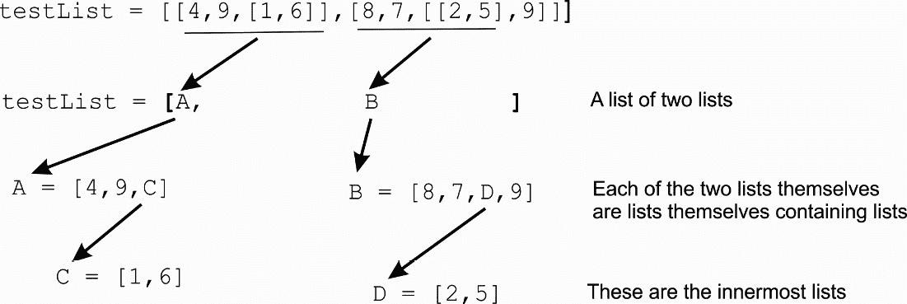

# 第五章：更多 Python 知识

我们已经介绍了 Python，并且一直在使用它。在本章中，我们扩展了 Python 的知识，并扩展了一些我们遇到的概念，还介绍了新特性。特别是，我们检查了数据结构，从处理元素列表或字符字符串的方式开始。本章为*第六章***铺平了道路，其中我们完成了计算机模拟器的设计。但在那之前，我们提供了一些关于我们在讨论 Python 特性时使用的术语的说明。

我们将讨论以下主题：

+   语句和表达式

+   更多字符串特性

+   列表推导式

+   字符串处理

+   重复和循环

+   字典

+   函数

+   列表中的列表

+   导入

+   Python 中的缩进

# 技术要求

你可以在 GitHub 上找到本章使用的程序[`github.com/PacktPublishing/Practical-Computer-Architecture-with-Python-and-ARM/tree/main/Chapter05`](https://github.com/PacktPublishing/Practical-Computer-Architecture-with-Python-and-ARM/tree/main/Chapter05)。

本章不需要比前几章更多的资源。所需的一切仅是一个带有 Python IDE 的计算机。所有章节都是如此，直到我们达到*第九章*，该章节涉及树莓派。

语句和表达式

一个*表达式*是值和运算符的组合，可以评估为提供结果；例如`(p+q)*7 - r`。布尔表达式是值和逻辑运算符的组合，产生`True`或`False`的值；例如，`p >` `q`。

一个*语句*是 Python 操作，必须由解释器评估；也就是说，它是一个动作。典型的 Python 语句涉及`if`… `for`…动作。这两个术语常用于正式定义中；例如，`if`语句的定义如下：

`if <expr>:`

`<``statement>`

在语言描述中使用尖括号表示*将被其实际值替换的内容*；例如，一个有效的`if`语句如下：

`if x >` `y:`

`p = p + q`

在这种情况下，*表达式*是`x > y`，而*语句*是`p = p +` `q`。

# 更多字符串特性

现在我们将扩展我们操作字符串的能力。字符串是 Python 最重要的数据结构之一，也是我们在这本书中编写的所有程序的核心。Python 的字符串处理功能使其成为最强大、最易用的文本处理语言之一。字符串由引号表示，可以是单引号或双引号；例如，`x = "Two"`和`y = 'One'`是 Python 字符串。Python 使用两种字符串终止符的能力意味着我们可以创建像“Alan 的书”这样的字符串（即，将撇号用作正常的语法元素）。

在执行 Python 程序的过程中，你可以从键盘读取一个字符串，也可以以下面的方式提供提示。

`x = input('请输入' `一些内容`)`

执行此命令将在屏幕上显示"`请输入一些内容`"，等待您的输入，然后将您输入的字符串分配给变量`x`。这种机制在模拟程序时非常有用，因为您可以在程序运行时提供输入。请注意，输入字符串必须通过按*Enter*键来终止。

# 字符串处理

您可以使用`replace`方法在字符串中更改（替换）字符。例如，假设我们希望将字符串`price`中所有`'$'`的实例替换为`'£'`：

```py

price =  'eggs $2, cheese $4'
```

```py
price = price.replace('$', '£')      # Replace $ by £ in the string price
```

如果我们打印`price`，现在我们得到`'eggs £2,` `cheese £4'`。

其他字符串方法包括`upper()`（将文本转换为大写）、`lstrip()`（删除前导字符）和`rstrip()`（删除尾随字符）。设`x ='###this Is A test???'`。考虑以下序列：

```py

x = x.lstrip('#')      # Remove left-hand leading '#' characters to get x = 'this Is A test???'
x = x.rstrip('?')      # Remove right-hand trailing '?' characters to get x = 'this Is A test'
x = x.lower()          # Convert to lower-case to get x = 'this is a test'
```

这个序列产生`x` = '`this is is` `a test'`。

字符串是不可变的。一旦定义了字符串，就无法更改它们。在先前的代码中，看起来我们通过删除前导和尾随字符以及将大写转换为小写来修改了 x。不！在每种情况下，我们都创建了一个与旧字符串具有相同名称的*新*字符串（即，x）。

如果您输入`y =` '`Allen`'并尝试通过将`'e'`改为`'a'`来编辑它以读取`'Allan'`，您将得到一个错误，因为您尝试更改一个不可变的字符串。然而，您可以合法地写出`y = y[0:3] + 'a' + y[4]`来创建一个具有值`'Allan'`的新字符串`y`。

加号符号`+`在算术中执行加法，在字符串处理中执行*连接*；例如，`x = 4 + 5`给出`9`，而`x = '4' + '5'`给出`'45'`。这个动作被称为*操作符重载*，表示函数的扩展，例如，当函数应用于不同的对象时。

TC1 汇编器使用以下字符串方法来删除指令前的空格，使用户能够使用大写或小写，并允许使用空格或逗号作为分隔符。例如，此代码片段允许您以相同的意义编写`r0,[r1]`或`R0,R1`。下面的代码显示了 TC1 如何将输入行（即汇编指令）简化以便稍后转换为二进制：

```py

    line = line.replace(',',' ')     # Allow use of a space or comma to separate operands
    line = line.replace('[','')      # Allow LDRI r0,[r2] or LDRI r0,r2 First remove '['
    line = line.replace(']','')      # Replace ']' by null string.
    line = line.upper()              # Let's force lower- to upper-case
    line = line.lstrip(' ')          # Remove leading spaces
    line = line.rstrip('\n')         # Remove end of line chars. End-of-line is \n
```

假设一条指令以字符串形式输入为 ' `ADD r0,R1,r3`'。这包含前导空格、大小写文本和逗号，并且通过上述操作序列转换为 `'ADD R0 R1 R3'`。下一步是将字符串转换为汇编器分析的单独*标记*。我们可以使用`split()`方法来完成此操作。它将字符串转换为由括号中的字符分隔的字符串列表。请注意，默认参数是空格。如果`s = 'ADD R0 R1 R2'`，则`s.split()`或`s.split(' ')`的结果如下：

`s = ['ADD', 'R1', 'R2', 'R3']`      # 四个标记的列表，每个标记都是一个字符串

现在我们有一个包含四个单独字符串的列表；也就是说，一个命令后跟三个参数。我们可以使用索引符号访问这些字符串：

```py

T1 = s[0]                       # This is the mnemonic 'ADD'
T2 = s[1]                       # This is the destination register 'R1'
T3 = s[2]                       # This is the first source register 'R2'
T4 = s[3]                       # This is the second source register 'R3'
```

我们现在可以对标记进行操作：

```py

if T1 == 'STOP': then run = 0   # If the instruction is stop then halt processing
firstReg = int(T2[1:])          # Get the register number as an integer
```

第二个语句使用 `T2[1:]` 将字符串 `'R2'` 转换为新的字符串 `'2'`，通过删除第一个字符。切片符号 `[1:]` 被解释为“第一个字符之后的所有字符”。这使我们能够处理像 R2 或 R23\ 这样的单或双位数值。由于只有 8 个寄存器，我们本来可以写 `[1:2]`。使用 `[1:]` 允许在 TC1 的未来版本中扩展到 16 个寄存器，而无需更改代码。

我们必须使用整数函数 `int` 将寄存器号从字符串转换为整数值。在学习 Python 时，一个常见的错误是忘记将字符串转换为整数：

```py

regNum = input('Please enter register number >>>')
contents = reg[regNum]
```

这段代码会生成错误。因为 `regNum` 是作为一个字符串创建的，它包含了你输入的值。然而，在第二行，程序期望一个整数作为列表索引。你必须写 `reg[int(regNum)]` 来将数字字符串转换为整数值。

## 示例 – 文本输入

这里有一个使用 Python 和简单 `.txt` 文件进行文本输入的简单示例。源文件如下：

```py

@ This is text
NOP
 NOP
NOP
NOP
```

```py
END
```

此文件是用 Python 处理的。我使用它在我的电脑上的地址。这是读取到变量 `sFile` 中的内容：

```py

myFile = 'E:\\ArchitectureWithPython\\testText.txt'
with open(myFile,'r') as sFile:
    sFile = sFile.readlines()           # Open the source program
print (sFile)
```

这段代码的输出如下：

```py

['@ This is text\n', 'NOP\n', ' NOP\n', ' \n', 'NOP\n', '\n', 'NOP\n', 'END']
```

现在我们有一个与源文本每一行对应的 Python 字符串列表。请注意，每一行都以换行符（即，\n）结束，并且文本中的任何空格都被包含在内。例如，有一个完全空的行和一个带有空格的空行。在处理输入时，我们必须考虑到这些。

在增强了我们操作文本字符串的能力之后，在下一节中，我们将探讨 Python 最有趣的功能之一：使用列表推导式在单行代码中执行对字符串或列表的一系列操作。

# 列表推导式

现在我们介绍 Python 的一个非常强大的功能，即列表推导式。它的强大之处不在于它能做什么，而在于它的简洁性。列表推导式允许你在单行中处理列表。我们来看看列表推导式，因为它们在处理文本时非常有用；例如，你可以使用列表推导式将一行文本中的所有双空格替换为单空格，或者将所有小写字符转换为大写字符。

列表推导式可以应用于任何可迭代对象。可迭代对象是一种你可以遍历的结构，例如列表、字符串或元组。列表推导式的最简单形式如下：

`x =` [`i` for `i` in `y`]

在这里，`x`和`y`是字符串（或列表）。粗体的文本代表 Python 保留字和标点符号。变量`i`是一个用户选择的变量，用于遍历列表。我们可以用任何名字代替*i*；这根本不重要。考虑以下示例：

`lettersList = [i for i in 'Tuesday']`

正在处理的可迭代对象是字符串`'Tuesday'`，它逐个字符复制到`lettersList`中。这返回`lettersList`作为字符列表`['T','u','e','s','d','a','y']`。我们已经将一个字符串转换成了字符列表。

我们可以创建一个更复杂的列表推导式版本，如下所示：

```py

x = [expression for i in y if condition]
```

其中`expression`是一个 Python 表达式，`condition`是一个布尔条件。我们遍历可迭代对象`y`，查看每个元素，并根据条件选择它，根据表达式处理它，然后将它放入一个新的列表中。这在一行中做了很多工作。考虑以下内容：

```py

y = 'this$is$a$test'
x = [i for i in y if i != '$']
```

条件是*如果 y 中的项目 i 不等于`'$'`*。这个列表推导式表示，“将字符串 y 中的字符逐个复制到字符串 x 中，只要字符不是`'$'`字符。”结果是这个：

```py

x =['t', 'h', 'i', 's', 'i', 's', 'a', 't', 'e', 's', 't'].
```

原始字符串已被替换为单字符字符串的列表，但去除了每个`'$'`。

让我们看看列表推导式的三个示例：

1.  第一个示例演示了如何从输入中移除空行（即''）。我们可以通过以下方式复制所有不等于空或空字符串" "的行：

    ```py
    sFile = [i for i in sFile if i != '']   # Remove blank lines
    ```

我们将新列表重命名为与旧列表相同的名称。我们没有理由不能这样做，这可以节省为每个列表推导式发明新名字的需要。

1.  第二个示例是这样的：

    ```py
    sFile = [i.upper() for i in sFile]      # Convert to upper-case
    ```

我们将函数`.upper()`应用于每个元素`i`。这个表达式将小写字符转换为其大写等效字符；也就是说，它将所有字符串转换为大写。最后的列表推导式是这样的：

```py

sFile = [i.split() for i in sFile if i != '']
```

表达式`i.split()`将源字符串在每个空格处分割成单独的标记（字符串）。这意味着我们可以将行作为标记序列进行处理。条件`if i != ''`用于通过不复制它们来删除空字符串。

1.  第三个示例移除了空行。

我们创建了一个包含空行的三个指令列表，用' '表示。当我们执行这个列表推导式时，我们将每个字符串转换成子列表，并移除空行：

```py

sFile = ['ADD R1 R2 R3', 'BEQ LOOP', '', 'LDRL R2 4','']
sFile = [i.split() for i in sFile if i != '']
```

```py
print(sFile)
```

此代码的输出如下：

```py

[['ADD', 'R1', 'R2', 'R3'], ['BEQ', 'LOOP'], ['LDRL', 'R2', '4']]
```

## 元组

现在我们为了完整性引入了元组，尽管在这篇文本中我们很少使用它。列表是由方括号包围的元素序列；例如，`P = [1,4,8,9]`。元组是由圆括号分隔的元素序列；例如，`Q = (1,4,8,9)`。

元组和列表之间的区别很小；它们都是包含元素序列的数据结构。然而，*元组是不可变的*，不能被修改，与列表不同。元组是一个只读列表，用于存储不更改的数据。尽管这里不相关，但元组在实现和性能上比列表有优势；也就是说，如果你有一个固定的列表，最好使用元组。

之后，我们将使用元组在字典结构中，如下所示：

```py

opCodes = {'add':(2,34), 'inc':(4,37)}
```

在这种情况下，加粗的值是每个两个组件的元组。我们本来可以用列表，但元组表示一个不能改变的结构。如果你要用列表代替元组，你会这样写：

```py

opCodes = {'add':[2,34], 'inc':[4,37]}
```

## 重复和循环

现在我们扩展我们对 Python 重复机制的认知，这是所有高级过程式语言共有的特性。在本节中，我们学习如何做以下事情：

+   重复执行操作多次

+   每次执行操作时使用不同的数据和参数

+   遍历列表中的元素

+   使用 `enumerate` 函数

假设我们想要测试一个列表是否包含特定的项目。我们可以创建一个 `for` 循环来完成这个任务：

```py

fruit1 = ['apples', 'oranges', 'grapes', 'bananas', 'peaches']
size = len(fruit1)               # Get length of the list
inList = False                   # inList is False until we find item
for i in range (0,size):         # Repeat for each item in list
    if fruit1[i] == 'grapes':
```

```py
        inList = True            # Set flag to True if we find the item
```

此代码首先将 `inList` 设置为 `False` 以指示元素 `'grapes'` 未被找到。`for` 循环遍历列表中的所有元素，测试每个元素是否是我们正在寻找的项目。如果找到了，`inList` 被设置为 `True`。这段代码是有效的，但它并不好。如果列表中有百万个元素，而 `'grapes'` 是第一个，代码仍然会遍历剩余的 999,999 个元素。这是效率极低的。

在以下示例中，我们比较连续的元素与一个值，并在找到它时停止。在每次循环中，如果未找到项目，我们继续。如果我们找到我们想要的项目，我们跳出循环而不是通过测试每个单独的项目来继续到痛苦的结尾。当我们进行比较时，如果当前项目不等于 '`grapes'`，我们将 `inList` 设置为 `False`，然后循环继续到下一个元素。

如果我们找到 `'grapes'`，`if` 语句的 `else` 部分将 `inList` 设置为 `True`，然后使用 `break` 语句退出循环，避免进一步的无效循环。在 `for` 或 `while` 循环中的 `break` 告诉 Python 立即退出循环并继续执行循环后的下一个指令：

```py

listSize = len(fruit1)
for i in range (0,listSize):
    if fruit1[i] != 'grapes': inList = False   # Is the item here?"
    else:                                      # If it is, drop out of the loop
        inList = True                          # Set flag on finding it
        break                                  # Jump out of the loop
```

变量 `inList` 只是一个我们可以在程序中稍后使用的标志；例如，我们可以这样写：

```py

if inList == False: print('Yes, we have no grapes')
if inList == True:  print('Grapes --- we got lots')
```

另一种方法是使用列表操作符 `in`。如果我们有一个列表，我们可以通过以下结构来检查一个项目是否是该列表的成员：

```py

if    'grapes' in fruit1:
      inList = True
else: inList = False
```

第一行如果 `'grapes'` 在列表 `fruit1` 中返回 `True`，否则返回 `False`。`in` 结构在测试一个项目是否属于作为列表排列的其他项目组时非常有用；例如，如果所有员工都在列表 `staff` 中，那么

如果 `Smith` 是有效的员工姓名，则将 `worksHere` 设置为 `True`，否则为 `False`。

```py

if 'Smith' in staff:  worksHere = True
else:                 worksHere = False
```

之后我们将使用`in`运算符来测试一个指令是否是集合的成员，就像这样：

```py

arithOps = ['ADD','SUB','MUL','DIV']       # Define list of arithmetic operations
.
.
if 'mnemonic' in arithOps:                 # Test whether instruction is arithmetic
    .
    .
else:
```

## 重复和可迭代对象

`for`循环的另一种版本如下遍历列表的元素：

```py

for i in anyList:                          # Operate on each element of the list one-by-one
    <body of loop>
```

粗体的单词是 Python 的保留字；其他单词是用户定义的变量。在这里，`i`不是像在之前使用`range()`的例子中那样的序列计数整数。它是列表中每个元素（或可迭代对象）按顺序取的值。考虑以下使用颜色列表的例子：

```py

car = ['red', 'white', 'green' ,'silver', 'teal']
for color in car: print(color)             # Color is a loop variable; we could have used i.
```

这段代码遍历列表`car`的每个元素，并按如下方式打印其值。

```py

red
white
green
silver
teal
```

考虑使用计算机操作列表的一个例子。在这种情况下，我们取了一个元组的列表，每个元组对应四个操作码。这个元组由一个操作码字符串、一个指令类型和所需的操作数数量组成。这只是一个演示。我们本来可以用列表，但选择元组来强调元组值不会改变：

```py

opCodes = [('NOP','misc',0),('BEQ','flow',1),('LDR','move',2), \
          ('ADD', 'arith',3)]
for instruction in opCodes:                # Step through the op-codes
    print(instruction)                     # Print the current op-code
    op     = instruction[0]                # Extract the three tuple members
    group  = instruction[1]
    params = instruction[2]
    print(op, group, params)               # Print the three tuple values
```

```py
    if op == 'BEQ': print('beq found')     # Demo! Print BEQ when we find it
```

这段代码的输出如下：

```py

('NOP', 'misc', 0)
NOP misc 0
('BEQ', 'flow', 1)
BEQ flow 1
beq found
('LDR', 'move', 2)
LDR move 2
('ADD', 'arith', 3)
ADD arith 3
```

我们现在已经证明，在 Python 中你可以迭代任何类型的列表。

Python 的一个特别有趣的特征是使用*双重索引*进行循环。你可以通过数字索引或对象名称遍历列表。当你想按对象名称遍历但还想知道它在列表中的位置时，这很有用。Python 函数`enumerate`允许这种形式的循环。演示`enumerate`的作用比解释它更容易。考虑之前关于列表`car`的例子：

```py

car = [ 'red', 'white', 'green', 'silver', 'teal']
for color in enumerate(car):
    print (color)
```

这段代码的输出如下：

```py

(0, 'red')
(1, 'white')
(2, 'green')
(3, 'silver')
(4, 'teal')
```

迭代器`color`已经变成了一个包含元素索引和列表中相应值的元组序列。记住，元组就像列表一样，除了它的元素是不可变的，不能被更改。这里是一个我会使用像`color`这样的迭代器名称而不是`i`的情况，因为它更明确/描述性，并且与整数的混淆更少。

另一种枚举形式使用两个索引，一个是显式的整数计数，另一个是元素计数。在以下例子中，`count`是显式的整数索引，而`color`是枚举索引。因此，`count`步进`0`、`1`、`2`等，而`color`步进`red`、`white`、`green`…：

```py

for count, color in enumerate(car):
```

```py
    print ('count = ', count, 'Color =', color)
```

这会产生以下输出：

```py

count =  0 Color = red
count =  1 Color = white
count =  2 Color = green
count =  3 Color = silver
count =  4 Color = teal
```

## 列表的列表

在这里，我们扩展了 Python 最重要的数据结构列表的使用。首先，我们演示了列表可以包含列表本身。Python 允许你用任何类型的项构建列表；例如，`x = [1,2,'test',v,True]`定义了一个包含两个整数、一个字符串、一个变量和一个布尔常量的列表。由于你可以在列表中使用任何合法的元素，你可以创建一个*列表的列表*。考虑以下例子：

```py

fruit = [['apple',2.35,150], ['orange',4.10,200], ['banana',3.65,70]]
```

这是一个包含三个项目的列表，每个项目本身也是一个列表（阴影部分）；例如，这个列表中的第一个项目是列表`['apple',2.35,150]`。每个子列表由一个命名水果的字符串、水果的价格和当前库存水平组成。

假设我们想知道橙子的价格；我们可以写点像这样的事情：

```py

for i in range (0,len(fruit)):     # Step through the list of fruit.  len(fruit) is 3
    if fruit[i][0] == 'orange':    # If the first element in the current item is 'orange',
        price = fruit[i][1]        # then get the second element in that item
        break                      # If we do find 'orange' we can break out of the loop
```

我们使用`for`循环遍历水果列表。然后，当我们找到我们想要的项（它是一个列表）时，我们读取那个列表的第二个项。正如你所看到的，我们使用了两个下标，首先是[i]，然后是[1]。

考虑以下列表的列表的例子：

```py

testList = [[4,9,[1,6]],[8,7,[0,9]]]
```

这对眼睛来说并不容易！让我们使用粗体和阴影来强调字符串的组成部分：

```py

testList = [[4,9,[1,6]], [8,7,[0,9]]]  # Each element in the list is itself a list
```

这是一个包含两个项的列表：[4,9,[1,6]]和[8,7`4`, `9`以及列表[1,6]。

如果我写`x = testList[1][2][1]`，`x`的值会是什么？

它会是`9`，因为`testList`[1]是`[8,7,[0,9]]`，`testList[1]`[2]是`[0,9]`，而`testList[1][2]`[1]是`9`。想象这是一个有分支的树！第一个分支是`testList`的元素`[1]`。第二个分支是那个分支的元素`[2]`，第三个（最后的）分支是第二个分支上的元素`[1]`。*图 5**.1*以图形方式说明了嵌套列表的概念。



图 5.1 - 嵌套列表的说明

考虑第二个例子：

```py

x = ['this', 'that', 'then']
```

`x[2][3]`是什么意思？这个表达式返回`'n'`，因为`x[2]`是`'then'`，而那个元素中的第 3 个是`'n'`。

## Python 中的缩进

自从我们引入 Python 以来，我们就开始缩进代码。现在我们再次强调 Python 中缩进的使用，因为它对正确的编程至关重要。大多数计算机语言允许你将语句组合在一起，作为一个块，用于特定目的。通常，一组中的指令会作为一个批次，一个接一个地执行。这样的组通常与条件语句和循环相关联。

一些语言通过将指令包围在花括号`{}`中来表示指令块。考虑以下内容。这不是真正的代码；它只是用于说明程序布局的纯文本：

```py

{some operations}
{main loop
{some other operations}
if x == 1 {Do this batch of operations}
repeat
{do these operations}
}
```

这里，你有几个操作块，包括嵌套块（即一个块在另一个块内）。块被当作一个单一的操作来执行；也就是说，它们是计算机中的分包等效。尽管这不是编程要求，但通常使用缩进来作为阅读辅助，使代码对人们来说更容易理解，如下所示：

```py

{some operations}
{main loop
     {some operations}
     if x == 1
        {do this batch of operations}
     repeat
        {do these operations}
}
```

Python 不使用括号来表示连续操作的块。它要求代码块必须缩进（并且每个块成员使用相同的缩进）。如果缩进不正确，可能会导致程序无法编译，或者程序的行为不符合你的预期。缩进错误是新手程序员遇到的第一件事之一。缩进错误很容易忽略。例如，如果你在编辑程序时意外地创建或删除了缩进，你可能会很容易地得到一个难以定位的错误。

下面给出了 Python 中使用块和缩进的简单示例。虽然任何数量的缩进都是合法的，但按照惯例，缩进通常是四个空格。每个缩进级别都有阴影。注意，最后一行的 `else` 属于第一个 `if`。如果我们进一步缩进它，它将属于第二个 `if`：

```py

x = 1
y = 2
if z == 4:
    s = 1
    b = 2
    if b == 3:
        g = 1
else: p = 7
```

## 字典

在本节中，我们介绍了 Python 的字典机制，这使得编写模拟器变得非常容易。在这里，你将学习如何创建一个将一个事物转换成另一个事物的字典，例如，将指令的名称转换成其二进制代码。在这里，我们学习以下内容：

+   字典的本质

+   字典相对于列表的优点

+   字典键和字典值之间的区别

+   在字典中插入项目

+   从字典中提取项目

+   使用字典解决问题

字典是 Python 最有用的特性之一，这个特性使得设计模拟器变得容易得多。Python 字典是一个令人印象深刻的通过 *键* 访问的数据结构，而不是通过数据结构内的位置。你不需要提供像 `myList[5]` 这样的位置，你可以在字典中查找一个项目，就像你在日常生活中使用字典一样。你向字典提供一个名称（我们称之为 *键*），然后就会弹出与该名称 *相关联* 的信息。键是唯一的；同一个键在字典中不能出现多次（就像社会保险号码是唯一的）。

Python 字典的形式是 `{key1:value1, key2:value2, key3:value3}`；例如，`{'UK':44, 'USA':1, 'Germany':49, 'France':33}` 可以用来查找一个国家的国际电话区号。字典被括号包围，`key:value` 对之间用冒号分隔。字典中对的顺序不重要，因为项目是通过其 *键* 而不是其在字典中的位置来访问的。

键通常是字符串，但这不是必需的。在我们的计算机模拟器中，键通常是计算机语言的助记码。与键相关联的值可以是任何合法的 Python 数据结构。在我们创建的一些模拟器中，我们经常指定值为一个元组，它是一个有序列表。例如，字典条目 `'INC':(8,16)` 有键 `'INC'` 和值 `(8,16)`。使用键 `'INC'` 搜索字典，返回元组 `(8,16)`。在这种情况下，值是指令的格式（即，8），以及它的操作码（即，16）。

你可以用列表代替元组作为值，即 `'INC':[8,16]`。唯一的显著区别是，一旦定义了元组，就不能更改它。

你可以通过编写 `if key in dictionary` 来检查一个项目是否在字典中，如下所示：

```py

if 'INC' in opCodes:       # This returns True if 'INC' is in opCodes
```

要获取特定助记符的信息，我们可以使用 `get` 方法来读取与键关联的值。例如，`opData = opCodes.get('INC')` 返回 `(8,16)`。

然后，我们可以按照以下方式访问与 `'INC'` 关联的元组的两个字段：

```py

binaryCode  = opData[0]
formatStyle = opData[1]
```

如果请求的键不在字典中，`get` 方法返回 `None`。`None` 是 Python 的保留字，表示空值。请注意，`None` 既不是零也不是空字符串，它有自己的类型 `None`。考虑以下情况：

```py

if opCodes.get(thisInstruction) == None: # Ensure that the instruction is valid
```

```py
   print("Error. Illegal operation")
```

以下代码使用我们上面描述的电话前缀目录来演示如何使用 `None` 来处理错误。请注意，这使用了一个无限循环，并在错误发生时终止。当检测到 `None` 时，`break` 强制退出无限循环：

```py

prefixes = {'UK':44, 'USA':1, 'Germany':49, 'France':33}
while True:                              # Infinite loop
    x = input('Country? ')               # Ask for the country
    y = prefixes.get(x)                  # Look up the prefix
    if y == None:                        # If None print error message
        print('Prefix not found')
        break                            # And exit the loop
    else: print('Prefix = ',y)
print('Program terminated')
```

Python 的字典使得实现标签和变量的符号名称变得非常容易。只需创建一个包含 `name: value` 对的字典，并使用名称来获取与标签关联的值；例如，你可能想将 Hastings 与值 1066 关联。典型的汇编器使用 `directives` 来表达这一点：

```py

Hastings EQU 1066      @ Equate the Name "Hastings" to the value 1066
```

在你的程序稍后，你可能会写 `LDRL r0`,Hastings` 以将 `r0` 装载为 `1066`。假设你有一个包含名称和值的表 `namSub`，它被设置为一个字典：

```py

namSub = {'Hastings':1066, 'Agincourt':1415, 'Trafalgar':1805}
```

如果我们想获取与 Hastings 关联的值，我们可以写下以下内容：

```py

x = namSub.get('Hastings')
```

名称将被转换为它的值。

在接下来的内容中，我们编写了几个 Python 代码片段，以展示如何使用字典。这些示例演示了如何设置字典、向其中添加信息以及访问它。当汇编语言程序运行时，一些字典在执行之前就已经设置好了，例如，合法指令列表。一些目录，如汇编语言程序中出现的符号表，将在程序运行时构建。

示例中的第一个目录将寄存器名称转换为它的寄存器号；例如，寄存器名称 `x` 可以通过 `y = regs.get(x)` 转换为其寄存器号 `y`。当然，你不需要使用字典。我们可以简单地写 `y = int(x[1:])` 来通过字符串处理将字符串 `'r6'` 转换为整数 6。然而，字典方法更为优雅且易于理解。此外，它还更灵活：

```py

regs = {'r0':0, 'r1':1, 'r2':2, 'r3':3, 'r4':4}   # Register name-to-number translation
symTab = {'start':0,'time':24,'stackP':'sp','next':0xF2} 
                                            # Symbol table converts symbolic name to value
x0 = 'add r1,r2,r4'                # An example of an instruction in text form
x1 = x0.split(' ')                 # Split instruction into op-code and predicate
x2 = x1[1].split(',')              # Split the predicate into tokens
x3 = x2[0]                         # Get the first token of x2
if x3 in regs:                     # Is this a valid register?
    x4 = regs.get(x3)              # Use get() to read its value
print ('x0 = ',x0, '\nx1 = ',x1, '\nx2 = ',x2, '\nx3 = ',x3, '\nx4 = ',x4)
y0 = 'beq next'                    # Another example: instruction with a label
y1 = y0.split(' ')                 # Split into op-code and predicate on the space
y2 = y1[1]                         # Read the predicate (i.e.,'next')
y3 = symTab.get(y2)                # Get its value from the symbol table (i.e., 0xF2)
print('beq ',y3)                   # Print the instruction with the actual address
z = symTab.get('beq next'.split(' ')[1])  # We've done it all in one line. Not so easy to follow.
print('beq ',z)
print('Symbol table ', symTab)            # Print the symbol table using a print
symTab['nextOne'] = 1234                  # This is how we add a new key and value
print('Symbol table ', symTab)            # Here's the augmented symbol table
opCode = {'add':('Arith',0b0001,3),'ldr':('Move',0b1100,2), \
       'nop':('Miscellaneous',1111,0)}    # New directory. Each key has three values in a tuple
thisInst = 'ldr'                          # Let's look up an instruction
if thisInst in opCode:                    # First test if it's valid and in the dictionary
    if thisInst == 'ldr':                 # If it is:
        instClass = opCode.get('ldr')[0]  # Get first element of the instruction
        binaryVal = opCode.get('ldr')[1]  # Get the second element
        operands  = opCode.get('ldr')[2]  # Get the third element
print('\nFor opCode: ',thisInst, '\nClass = ', instClass, \
      '\nBinary code = ', bin(binaryVal), '\nNumber of operands = ',operands)
print('\nThis is how to print a directory')
                                   # Now print a formatted dictionary (key and value on each line)
for key,value in opCode.items():
    print(key, ':', value)
print()
for i,j in opCode.items():         # Note that key and value can be any two variables
    print(i, ':', j)
theKeys = opCode.keys()            # The function .keys() returns the keys in a dictionary
print('The keys are: ',theKeys)
test = {'a':0,'b':0,'c':0,'d':0}   # A new directory. The values are just integers
test['a'] = test['a'] + 1          # You can change a value! Use the key to locate it
test['d'] = test['d'] + 7
test1 = {'e':0, 'f':0}             # Here's a second dictionary.
test.update(test1)                 # Append it to test using .update()
print('Updated dictionary test is: ',test)   # Not convinced? Here it is then.
```

以下是在执行上述代码片段后的输出：

```py

x0 =  add r1,r2,r4
x1 =  ['add', 'r1,r2,r4']
x2 =  ['r1', 'r2', 'r3']
x3 =  r1
x4 =  1
beq  242
beq  242
Symbol table  {'start': 0, 'time': 24, 'stackPointer': 'sp', 'next': 242}
Symbol table  {'start': 0, 'time': 24, 'stackPointer': 'sp', 'next': 242,
               'nextOne': 1234}
For opCode:  ldr
Class =  Move
Binary code =  0b1100
Number of operands =  2
This is how to print a directory
add : ('Arith', 1, 3)
ldr : ('Move', 12, 2)
nop : ('Miscellaneous', 1111, 0)
add : ('Arith', 1, 3)
ldr : ('Move', 12, 2)
nop : ('Miscellaneous', 1111, 0)
The keys are:  dict_keys(['add', 'ldr', 'nop'])
Updated dictionary test is:  {'a': 1, 'b': 0, 'c': 0, 'd': 7, 'e': 0, 'f': 0}
```

让我们通过另一个示例更详细地看看字典。使用 Python 的字典使得实现标签和变量的符号名称变得容易。我们只需创建一个包含 `name: value` 对的字典，并使用名称来获取其关联的值。假设我们已经读取了一条指令，比如说 `'ADD r4,r2,r3'`，并将其标记化如下：

```py
predicate = ['r4','r2','r3']  # The list of parameters for the op-code
```

我们可以通过切片的艰难方式获取寄存器的整数值：

```py

rD = int([predicate[0]][1:])
```

让我们简化表达式，以便更容易解释。假设我们写下以下内容：

```py

rD = predicate[0]
```

`rD` 的值是字符串 `'r4'`。我们需要做的是从 `'r4'` 中隔离 `'4'`，然后将字符 `'4'` 转换为整数 `4`。

我们可以写 `rD = rD[1:]` 来返回字符串中除了初始 `'r'` 之外的所有字符。最后一步是将它转换为整数，我们可以用 `rD = int(rD)` 来完成。

`[1:]` 表示第一个字符 `r` 之后的所有字符，如果寄存器是 `'r4'`，则返回 `'4'`。我们本来可以写 `[1:2]` 而不是 `[1:]`。然而，通过使用 `[1:]`，我们可以在不更改程序的情况下增加寄存器的数量超过 9。将这三个步骤结合起来，我们得到以下内容：

```py

rD = int([predicate[0]][1:])
```

让我们使用字典执行相同的操作。假设我们已为寄存器设置了一个目录：

```py

regs = {'r0':0, 'r1':1, 'r2':2, 'r3':3, 'r4':4}   # Register names and values
```

在处理寄存器名称之前，我们可以使用以下方法测试有效的寄存器符号名称：

```py

if predicate[0] in regs:
      <deal with valid name>
else: <deal with error>
```

提取寄存器的实际整数编号很简单：

```py

rD = regs.get(predicate[0])
```

最后，请注意，您可以通过两种方式访问字典。考虑以下内容：

```py

regs = {'r0':0, 'r1':1, 'r2':2, 'r3':3, 'r4':4}
aaa  = regs.get('r3')
bbb  = regs['r3']
print('Test aaa = ',aaa, 'bbb =',bbb)
```

这给我们以下内容：

```py

Test aaa =  3 bbb = 3
```

`get` 的优点是，如果找不到键，则返回 `None`，而另一种方法会创建一个运行时错误，称为 `KeyError`。

## 函数回顾

本节将更详细地探讨函数，并演示如何使用`global`语句使参数在函数外部可访问。

参数可以通过函数调用中的括号传递给函数，并通过 `return()` 语句检索结果。回想一下，在函数中创建的变量是函数本地的，除非它们被声明为全局变量；也就是说，如果您在函数中写 `x = 5`，您已经创建了一个值为 `5` 的局部变量 `x`。如果函数外部有一个 `x`，它是一个不同的 `x`。在函数内部可以访问在函数外部声明的值，前提是它没有被在函数内部声明为局部变量。

函数体从初始的 `def` 语句开始缩进。函数不需要显式终止，因为 *缩进* 会处理这一点。考虑以下内容：

```py

def adder(P,Q):                    # Adder function
   R = P + Q
   return (R)                      # Return the sum R
def subtractor(P,Q):               # Subtractor function
   global R                        # Make R global
   R = P – Q                       # No need to return a value
A, B = 7, 2                        # Note Python's multiple assignment
C = adder(A,B)                     # Do addition
subtractor(A,B)                    # Do subtraction (just call the function)
print('Sum =', C, 'Diff = ',R)
```

如果我们运行此程序，我们会得到以下内容：

```py

Sum = 9 Diff =  5
```

如您所见，我们可以在返回语句中作为参数返回一个值，或者我们可以将其设置为全局变量。当我们使用全局变量时，我们不需要将参数传递到或从函数中。

## 导入

本节展示了如何访问不属于 Python 语言本身的操作。这些函数对于编写模拟器并非至关重要，但它们确实提供了一些非常有用的功能。我们包括这个简短的部分来演示如何访问这些功能。

Python 的一个优点是它包含几个函数库，您可以通过它们来方便地设计程序，例如图形。我们不需要很多外部函数来完成我们的工作。在这里，我们将演示两个：`random` 和 `sys`。

当模拟计算机时，你通常需要测试数据。手动输入它很耗时。幸运的是，Python 有一个生成随机数的函数库。为了使用库，你首先必须导入它。考虑以下内容：

```py

import random                   # Get the library (usually at the start of the program)
.
.
X = random.randint(0,256)       # Generate a random integer in the range 0 to 255
```

函数调用通常的形式是`library.action`。在这种情况下，库是`random`，操作是`randomint(a,b)`。参数`a`和`b`给出了随机整数的范围。

另一个有用的库是`sys`，它提供了操作系统功能，如`exit()`，该功能终止 Python 程序并返回其调用级别。例如，请参阅以下内容：

```py

import sys                      # Get the system library
.
.
if run == 0: sys.exit()         # If run is 0 then go home (exit the Python program)
```

我们现在已经涵盖了足够的 Python 主题，可以开始设计一个真正的计算机模拟器了。

# 摘要

在本章中，我们扩展了我们对 Python 的了解，并介绍或扩展了一些展示其强大和多功能性的特性。例如，我们研究了列表和字符串，这两个对我们来说最重要的数据结构。我们还扩展了循环和其他重复结构的使用。

我们介绍了字典，这是一个令人愉快优雅的数据结构，使我们能够通过描述它的键来定位信息，而不是它在目录中的位置。例如，如果我们想将指令名称转换为二进制操作码，我们可以创建一个字典，并只需查找任何助记符的适当代码。这个特性确实简化了解释器和汇编器的开发。

我们还研究了 Python 的一个不太常见的特性：列表推导。这些需要一点时间来适应，但它们可以使通过清理输入（例如，通过删除空格或修改标点符号和语法）来处理汇编语言指令的文本变得更加容易。

在*第六章*中，我们将关于计算机操作的知识整合起来，并为一个名为 TC1 的假设计算机设计了一个汇编器和模拟器。
