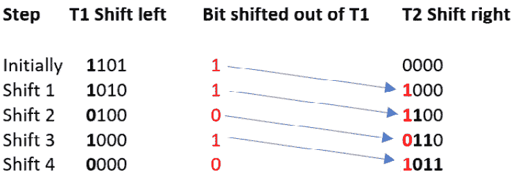
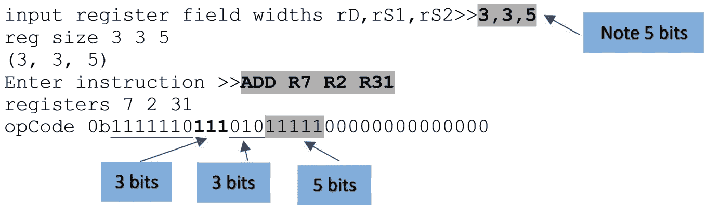
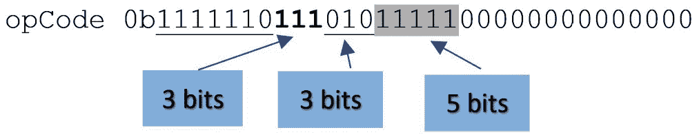

# 7

# 扩展 TC1

在本章中，你将学习如何扩展我们在*第六章*中设计的 TC1 模拟器的功能。我们还探讨了一些模拟器设计元素，包括输入/输出技术和数据验证，并描述了模拟器如何显示处理器在执行指令时的状态。

TC1 是一个折衷方案。最初，它被设计用来支持教授计算机架构的基础知识。它是理解指令编码、指令格式权衡、指令执行、寻址模式和设计并实现指令集的辅助工具。

在这里，我们探讨通过讨论如何添加新指令等方式来扩展 TC1 的方法。最后，我们处理一个迄今为止我们尚未涉及的话题：如何创建具有可变长度指令的计算机架构。也就是说，单个指令可以是基本字长的一个整数倍。

TC1 CPU 模拟器逐条执行指令，并在每条指令执行后打印寄存器、程序计数器和状态标志的内容。你可以使用这些信息来调试汇编级程序。通常，当你查看数据时，你会发现结果并不是你所预期的；例如，你可能想执行循环 9 次，但执行了 10 次，因为你测试循环结束时的错误。

我们有三个问题要处理。第一个是显示数据。我们如何显示数据以及如何格式化它？寄存器的内容应该显示为十进制值、由 1 和 0 组成的二进制字符串，还是以十六进制字符的形式显示？

另一个设计问题是是否存储历史数据。也就是说，我们在每条指令执行后在数组中存储寄存器和标志，以便我们可以查看先前操作中的值？

最后，我们如何进行？TC1 模拟器每次按下*Enter*键时都会执行一条指令。这为逐步执行程序提供了一个很好的方法，但当循环需要执行 1000 条指令才能到达你感兴趣的程序部分时，这变得不可行。我们将演示如何退出单步模式，执行一批指令，然后返回单步模式。

# 技术要求

你可以在 GitHub 上找到本章使用的程序：[`github.com/PacktPublishing/Practical-Computer-Architecture-with-Python-and-ARM/tree/main/Chapter07`](https://github.com/PacktPublishing/Practical-Computer-Architecture-with-Python-and-ARM/tree/main/Chapter07)。

# 再次审视 Python 的输入和输出

在这里，我们更详细地讨论数据输入和输出机制，因为这些主题在模拟器设计中非常重要，因为数据的格式化对于数据的解释至关重要。

让我们再次看看 Python 中的输入。从键盘输入数据非常简单。要输入文本，你写下 `x = input()`，就这样。当遇到这个语句时，Python 会等待你的输入。你输入文本并使用回车（*Enter* 键）结束。如果你只是输入一个回车而没有文本，`x` 的值将是一个空字符串——即 ' '。你输入的数据以文本形式存储。

Python 允许你在接收输入之前显示一个提示；例如，你可以写下以下内容：

```py

x = input('Please enter your age')
```

因为输入是字符形式，所以在使用之前必须将数值转换为整数形式。像以下示例所示，转换为十进制、二进制或十六进制很容易。你只需将数字基数作为 `int()` 函数的第二个参数添加即可：

```py

x = input('Enter the constant ')
y = int(x)                        # For a decimal constant
y = int(x,2)                      # For a binary constant
y = int(x,16)                     # For a hexadecimal constant
```

让我们考虑一个更复杂的例子。我们将输入一个指令，例如 `ADD R3,R7`,`$12FA` 并提取三个整数 `3`, `7`, 和 `0x12FA`。在这个例子中，一个 $ 前缀表示十六进制值（Motorola 使用的约定）。

以下代码执行此操作。输入使用 `replace` 函数将所有逗号转换为空格。我们将替换操作与输入操作结合起来以创建紧凑的代码。输入后面跟着一个 `split` 函数，将字符串转换为标记：

```py

inst        = input('Enter operation: >>').replace(',',' ')
p           = inst.split(' ')
t1,t2,t3,t4 = p[0],int(p[1][1:]),int(p[2][1:]),int(p[3][1:],16)
```

最后，我们依次检查四个标记，并将参数作为整数提取出来（`t1`，`t2`，`t3` 和 `t4`）。考虑 `t4`。`p[3]` 表达式提取了 `"$12FA"` 字符串。第二个索引 `[1:]` 提取第一个字符之后的所有字符，给出 `"12FA"`。这仍然是一个字符串。最后的操作 `int(p[3][1:],'16')` 将十六进制形式的参数字符串转换为整数 `4858`。第二个示例 `ADD r3,r7,$1102` 的输出是 `ADD 3 7 4354`。

正如我们已经看到的，Python 允许你在一行上放置多个等式——例如，`a,b,c = p,q,r`。这会导致以下结果：

```py
a = p
```

```py
b = q
```

```py
c = r
```

这种简写在与简单等式（通常在初始化过程中）打交道时很有用。一些程序员不喜欢使用这种技术，因为它可能会降低程序的可读性。让我们测试前面代码片段。我们在操作之间添加了一些 `print` 语句，这样我们就可以在代码执行时跟踪正在发生的事情：

```py

inst = input('Enter operation: >>').replace(',',' ')
print('inst',inst)
p = inst.split(' ')
print ('p',p)
t1,t2,t3,t4 = p[0],int(p[1][1:]),int(p[2][1:]),int(p[3][1:],16)
print(‚t1,t2,t3,t4',t1,t2,t3,t4)
```

接下来是输出。注意，当我们打印 `t1` 到 `t4` 时，十六进制操作数的数值以十进制形式给出：

```py

Enter operation: >>add r1,r2,$FACE
inst add r1 r2 $FACE
p ['add', 'r1', 'r2', '$FACE']
t1,t2,t3,t4 add 1 2 64206
```

下一节将探讨如何格式化数据，例如数字，以便使读者更容易理解；例如，有时你可能希望将十进制的 42 表示为 `101010`，有时作为 `00101010` 或 `002A`。

## 显示数据

现在，我们更深入地探讨在 Python 中显示数据的方式。当你观察程序执行时，你希望看到在每条指令执行后发生了什么变化。计算机的状态由其寄存器和内存的内容、程序计数器和其状态位以及其内存决定。

我们如何显示数据？由于数据可以代表任何你想要它代表的东西，寄存器中的数据没有固有的意义。按照惯例，CPU 模拟器以十六进制形式表示数据。这部分的理由是每个 16 位寄存器包含 4 个十六进制字符，这为人类处理数据提供了一个相当方便的方式（尝试记住 16 位的 1 和 0 的字符串）。一些模拟器允许以二进制、十六进制或十进制显示，而其他模拟器允许将数据以字符形式显示（即，数据假定是 ASCII 编码的）。

除了选择我们显示数字的基数外，我们还必须选择格式以便于阅读（例如，对齐字符组）。像所有高级计算机语言一样，Python 提供了格式化打印数据的方法。而且，就像大多数其他语言的格式化一样，我倾向于将 Python 的格式化描述为有点不够优雅。

我们没有足够的空间来公正地介绍 Python 的格式化。我们只是提供了一些示例和足够的信息，以便你可以修改它们。

在模拟器中我们需要打印的是指令。这很简单，因为它是一个字符串。所以，我们可以写出以下代码：

```py

print(listing[pcOld])          # Listing contains a list of string instructions
```

这在`pcOld`地址查找字符串项（指令）并打印它。由于`pc`在指令周期中会被修改，所以我们打印当前周期开始时的旧值。

但每个指令的长度都不同（取决于操作数的数量），这意味着在同一行上打印的下一个项目将不会垂直对齐。我们经常需要在预定义的框架内打印指令。我们可以用以下方法做到这一点：

```py

print("{:<23}".format(listing[pcOld]))
```

我们使用`.format()`方法。`"{:<23}"`表达式控制格式。整数`23`是文本的字符宽度。<符号表示字符串是左对齐的。如果我们想让它右对齐，我们会使用>。`format()`后面的值是要打印的字符串。

假设我们想在同一行上显示八个寄存器，每个寄存器作为一个六字符的十六进制值。首先，考虑以下 Python 代码：

```py

z = 0x4ace          # The hex data to print
print("%06x" %z)    # Printing it in 6 chars with leading zeros
```

当代码执行时，它会打印以下内容：

```py
004ace
```

我们为`0x4ace`十六进制值设置了一个变量`z`，并使用`print("%06x" %z)`来以十六进制字符显示它。打印的值是`004ace`，因为插入了两个前导零。格式化机制是`"%06x" %z`。第一个组件`"`%`06x"`指定了后续六位十六进制值的格式。第一个%表示格式化。`%z`表示要打印的值。

### 转义字符

Python 的`print`机制易于使用；例如，`print('Answer =',a)`将引号内的任何内容显示为字面量，并在`print`语句中出现的任何变量的值。你可以有任意多的引号项和变量。

`print`语句还允许使用转义字符进行格式化，该转义字符给以下字符赋予特殊含义。在 Python 中，转义字符是`\'`。如果转义符后面跟着`'n'`，它相当于换行；如果转义符后面跟着`'t'`，它相当于制表符。考虑以下：

```py

a = 42
b = 'Test'
```

```py
print('a is the integer\t',a,'\nb is the string','\t',b)
```

此代码的输出如下：

```py
a is the integer              42
```

```py
b is the string               Test
```

注意这是如何因为`'\n'`和两个由`'\t'`制表符分隔的值而打印在两行的。你可以控制制表符的大小，如下例所示。`expandtabs()`方法将制表符宽度（空格数）设置为提供的参数。在这种情况下，我们将制表符嵌入到字符串中，并将制表符宽度设置为`6`：

```py

print('This is a\ttab\ttest'.expandtabs(6))
This is a   tab   test
```

其他一些转义序列如下：

+   `\’`     单引号

+   `\\`     反斜杠

+   `\r`     回车（返回）

+   `\b`     退格

+   `\f`     换页（移动到下一行的相同位置）

+   `\xhh`   十六进制字符值（例如，`\x41`会打印`A`，因为`0x41`是字母 A 的 ASCII 值）

### 转义转义

有时候你希望转义转义字符，并使用反斜杠作为可打印字符。在这种情况下，你需要在要打印的字符串之前加上`r`或`R`。注意`r`字母位于字符串引号之外，如下例所示：

```py

print(R'test\n one', 'test\n two')
```

这会导致以下结果：

```py

test\n one test
 two
```

在这个例子中，我们使用`R`来抑制`\n`作为换行命令，并打印实际的`\n`。第二个`\n`没有以`R`开头，因此它作为换行命令。

### 从 ASCII 到 ASCII

我很幸运能见证微处理器的诞生，并从单个芯片（包括显示器）构建了一个 Motorola 6000 微处理器系统。当时，我没有任何商业软件，我必须自己将 ASCII 字符和它们的数值进行转换。今天的生活更容易。Python 提供了两个函数，允许你在数值和 ASCII 值之间进行转换。这些是`ord()`和`chr()`。如果你写`x = ord('B')`，`x`的值将是它的 ASCII 等效值，`0x42`或二进制的`01000010`。同样，如果你写`y = chr(0x41)`，`y`的值将是`'A'`。

#### 二进制和十六进制字符串

在我们详细查看格式化字符串之前，考虑以下使用 Python 解释器的控制台输入的简单示例。粗体的文本是输出：

```py

>>> x = 12345
>>> y = hex(x)
>>> print(y)
0x3039
>>> z = y + 1
TypeError: can only concatenate str (not "int") to str
>>> z = int(y,16) + 1
>>> print (z)
12346
>>> print(hex(z))
0x303a
```

我们创建一个`x`变量，其值为`12345`，并创建一个新的`y`值，它是`x`的十六进制版本。然后，我们打印它，得到预期的`0x3039`结果。接下来，我们创建一个新的变量`z`，其中`z = y + 1`。这会生成一个错误信息，因为`y`是一个文本字符串，我们不能将其与整数`1`相加。在下一行，我们再次执行加法操作，但这次，我们使用`int(y,16)`将十六进制字符串转换为整数形式。现在，我们可以使用`print(hex(z))`将`z`打印为十进制整数或十六进制字符串。简而言之，Python 使得处理十进制、十六进制和二进制值变得容易，但你必须非常小心，确保在必要时在字符串和整数形式之间进行转换。

由于我们处理的是二进制数，因此以二进制或十六进制格式显示 TC1 的输出是有意义的。假设我们希望将十进制整数值转换为*二进制*字符串。考虑以下内容，我们将整数`p`转换为二进制字符串，然后打印它：

```py

p = 1022
q = "{0:b}".format(p)
print('p in decimal is',p, "and in binary, it's",q)
```

`"{0:b}"`表达式是格式化的关键。它是一个用大括号括起来的字符串。`0`告诉它从字符串的第一个字符开始打印，`b`表示二进制。这会产生以下输出：

```py
p in decimal is 1022 and in binary, it's 1111111110
```

到目前为止，一切顺利。但如果我们希望输出以固定数量的字符对齐——例如，16 个字符？以下展示了将 26 和`2033`转换为二进制格式时的这种格式化：

```py

p1, p2 = 26, 2033
q1 = "{0:16b}".format(p1)
q2 = "{0:16b}".format(p2)
```

```py
print('p1 is',q1, '\nand p2 is',q2)
```

格式字符串的唯一更改是从`"{0:b}"`到`"{0:16b}"`。也就是说，我们在`b`之前插入了 16 个字符的字段宽度。`16`的效果是为字符串定义一个 16 位的宽度。字符串在左侧用空格填充。此代码的输出如下：

```py
p1 is            11010
```

```py
p2 is      11111110001
```

在许多计算机文本中，通常会在二进制和十进制值的前面填充前导零，而不是空格。我们可以通过格式的小幅改动来实现这一点。我们在字段宽度之前插入`0`——即`"{0:0`16`b}"`。现在考虑以下内容：

```py

p1, p2 = 26, 2033
q1 = "{0:016b}".format(p1)
q2 = "{0:016b}".format(p2)
print('p1 is',q1, '\nand p2 is',q2)
```

这将产生一个输出，其中数字以 16 位显示，并使用前导零填充，如下所示：

```py
p1 is 0000000000011010
```

```py
p2 is 0000011111110001
```

十六进制值通过在`format`语句中将`x`替换为`b`以相同的方式处理：

```py

p1, p2 = 30, 64123
q1 = "{0:8x}".format(p1)
q2 = "{0:8x}".format(p2)
q3 = "{0:08x}".format(p1)
q4 = "{0:08x}".format(p2)
print('\n', q1, '\n', q3, '\n', q2, '\n', q4)
```

这给出了以下输出。如您所见，它与二进制版本类似：

```py
       1e
```

```py
 0000001e
```

```py
     fa7b
```

```py
 0000fa7b
```

当然，我们可以结合两种打印格式（即二进制和十六进制），如下例所示：

```py

x, y = 1037, 325
xBin = "{0:016b}".format(x)
yHex = "{0:04x}".format(y)
print("x is",xBin,"y is",yHex)
```

```py
print("x is","0b" + xBin,"y is","0x" + yHex)
```

我们打印了两个数字，一个以二进制格式，一个以十六进制格式。在第一种情况下，数字被填充到 16 位，并带有前导零，而在第二种情况下，它被填充到 4 个字符，并带有前导零。

我们打印了两次结果。在第二种情况下，添加了前缀到值以指示基数。如果第一个数字`xBin`是二进制，我们可以通过使用“+”符号简单地将“`0b`”添加到二进制字符串之前来连接“`0b`”。此代码的输出如下：

```py
x is 0000010000001101 y is 0145
```

```py
x is 0b0000010000001101 y is 0x0145
```

我们可以将字符串方法格式概括为 `"someString".format(<参数列表>)`。这个字符串方法将字符串插入到参数列表中出现的参数。您必须在字符串中插入 *占位符* 的形式 `{a:b}`，当字符串打印时，这些占位符将接收参数。

假设您正在打印整数幂的表格，形式为 x，x²，x³，x⁴。我们可以写出以下内容：

```py

for x in range (1,7):
    print("Table of powers {0:2d}{1:3d}{2:4d}{3:6d}".format(x,x**2,x**3,x**4))
```

每个参数占位符的形式为 `{`a`:b}`，其中第一个元素 a 是参数在格式参数列表中的位置。第二个元素 `b` 决定了参数的打印方式。在这种情况下，它是一个数字和字母 `d`。数字定义了参数的宽度，而 `d` 表示它是十进制；例如，最后一个参数指定为 `{`3`:6d}`，表示第四个参数是一个十进制整数，占六位。以下展示了这段代码的输出：

```py
Table of powers  1   1    1      1
```

```py
Table of powers  2   4    8     16
```

```py
Table of powers  3   9   27     81
```

```py
Table of powers  4  16   64    256
```

```py
Table of powers  5  25  125    625
```

```py
Table of powers  6  36  216   1296
```

为了展示这种方法的通用性，下一个示例将打印相同的幂表，但使用不同的格式。除了十进制，我们还使用了二进制和十六进制。请注意，您只需将 `{`a`:b}` 中的 b 改为 b 即可更改基数；例如，`{`6`:x}` 告诉 `print` 语句以十六进制格式打印第七个参数：

```py

for x in range (1,10):
    print('Table of powers {0:2d} binary {1:10b} {2:4d} \
    hex {3:6x}'.format(x, x*x, x*x*x, x*x*x*x))
```

注意您可以写 x*x*x，或者 `x**3`。

下面的输出展示了这种格式化技术的结果：

```py

Table of powers  1 binary          1    1 hex      1
Table of powers  2 binary        100    8 hex     10
Table of powers  3 binary       1001   27 hex     51
Table of powers  4 binary      10000   64 hex    100
Table of powers  5 binary      11001  125 hex    271
Table of powers  6 binary     100100  216 hex    510
Table of powers  7 binary     110001  343 hex    961
Table of powers  8 binary    1000000  512 hex   1000
Table of powers  9 binary    1010001  729 hex   19a1
```

我们对示例进行了一些修改。如果参数要按顺序打印，则不需要给出参数的顺序；例如，第一个参数规范可以写成 `{:2d}` 而不是 `{0:2d}`。我们还更改了间距以展示宽度参数如何操作：

```py

for x in range (1,10):
    print('Powers {:2d} binary {:8b}{:4d} hex{:6x}'.format(x,x**2, x**3, x**4))
Powers  1 binary        1    1 hex      1
Powers  2 binary      100    8 hex     10
Powers  3 binary     1001   27 hex     51
Powers  4 binary    10000   64 hex    100
Powers  5 binary    11001  125 hex    271
Powers  6 binary   100100  216 hex    510
Powers  7 binary   110001  343 hex    961
Powers  8 binary  1000000  512 hex   1000
Powers  9 binary  1010001  729 hex   19a1
```

考虑以下 `format` 机制的示例。在这里，我们使用符号“`<`, `>`, `^`”来控制格式化。依次，这些符号强制左对齐、右对齐和在指定的宽度内居中对齐。

以下代码首先以十进制形式打印十进制整数 `123`，使用三个修饰符，然后以二进制形式使用相同的三个修饰符。在每种情况下，我们都指定了 10 个字符的宽度：

```py

x = 123
print('{:<10d}'.format(x))
print('{:>10d}'.format(x))
print('{:¹⁰d}'.format(x))
print('{:<10b}'.format(x))
print('{:>10b}'.format(x))
```

```py
print('{:¹⁰b}'.format(x))
```

由这段代码生成的输出如下：

```py
123                                   Left-justified
```

```py
       123                            Right-justified
```

```py
   123                                Centered
```

```py
1111011                               Left-justified
```

```py
   1111011                            Right-justified
```

```py
 1111011                              Centered
```

现在我们将提供三个示例，说明表示数字的字符串如何打印。第一个示例演示了以整数、十六进制、二进制和实数形式格式化单个数字。第二个示例展示了我们可以如何将寄存器列表合并为一个字符串，并打印它们的值。这在模拟中逐步执行指令时显示数据非常有用。第三个示例演示了将十六进制值处理成所需格式的连续步骤。

### 示例 1 – 格式化数字

以下演示了这种格式化机制，其中我们打印了几个变量和一个字符串。这使用了一个格式说明符，例如 `%05d`，它表示带有前导零的五个十进制数字，以及一个占位符，例如 `%x`，它表示按照 %05d 指定的格式打印 `x` 的值：

```py

x = 123
y = 0xABCD
p = 13.141592
q ='This is a test'
print("Hex example: %03x" %y, "%05d" %x, 'Alan', "%12.3f" %p, '%-20.14s' %q)
```

这个 `print` 语句显示了以下内容（注意十六进制以小写形式出现）：

```py
Hex example: abcd 00123 Alan       13.142 This is a test
```

### 示例 2 – 以十六进制形式打印寄存器值列表

考虑以下表达式，其中有一个包含各种格式数据的 8 寄存器数组：

```py

R = [0xabcd,2,3,0x123,5,0x11010,7,124]
print('Registers ='," ".join("%04x" % b for b in R))
```

这个表达式打印了字符串‘`寄存器 =`’`,`，然后是一个包含八个四字符十六进制值的第二个字符串。为了创建第二个字符串，我们使用了字符串 `join()` 方法。字符串推导式遍历寄存器，将格式化结构应用于每个元素。也就是说，它读取 `r[0]`，将其转换为字符串格式，然后将其与其左侧邻居（最初是一个空字符串）连接起来。这重复了八次，然后按照以下方式打印该字符串：

```py
Registers = abcd 0002 0003 0123 0005 11010 0007 007c
```

### 示例 3 – 依次将十进制值处理成所需的十六进制格式

考虑以下序列，我们依次处理十进制值 44,350，直到它以大写形式显示为没有 `0x` 指示前缀的十六进制格式：

```py

>>> x = 44350                              Here's a decimal number
>>> print(hex(x))                          Can I see that in hex?
0xad3e                                     Thanks. But I like uppercase hex
>>> print(hex(x).upper())                  OK. We just use the .upper() method on the string.
0XAD3E                                     Nice one. But I don't like 0X at the front.
>>> print(hex(x).upper()[2:])              OK, OK, just use slice notation [2:] to strip 0X.
AD3E                                       Great. Can I have that with fries?
```

我们简要地描述了如何格式化数字。如果打印的输出要由人类阅读，特别是如果你正在模拟一个其中 1 和 0 的模式很重要的计算机，格式化是必要的。有几种格式化数据的方法，本节仅提供了这个主题的介绍。

# 输入验证

在本节中，我将介绍数据验证的概念。历史上，一些涉及计算机的主要错误是由未能检查输入数据造成的。TC1 不执行源数据检查；你可以编写 `ADDL R1,R2,10` 或 `ADDL z1,z2,10`，结果相同。为什么？因为当汇编器看到 `ADDL` 时，它会寻找三个参数。它取第一个参数，让我们称它为 `p1`，并通过 `regnum = int(`p1[1:]`)` 读取寄存器号。只有 `p1` 的第二个和后续字符被记录下来，“R”被忽略。你可以写 `R1` 或甚至 `?1`。这使得汇编语言编程更容易；你可以使用任何字母来表示寄存器。另一方面，它鼓励了不良的编程技术，并增加了与输入错误相关的危险。

## 验证数据

由于 TC1 汇编器不对输入进行错误检查，如果你犯了错误，程序很可能会崩溃，让你自己进行调试。好的软件会进行错误检查，这从简单的无效指令检测到精确地定位所有错误。

在这里，我们展示了如何读取一行代码并检查几种常见的错误类型——例如，无效的操作码、无效的指令格式（操作数过多或过少）、拼写错误（将 `T6` 键入为 `R6`）以及超出范围的寄存器（输入 `R9`）。

本节的目的在于展示如何向 TC1 添加自己的修改。处理问题的正式方法是为汇编语言构造一个语法，然后构建一个解析器以确定输入是否符合该语法。我们将采取更简单、更具体的方法。

如果当前指令是 `x =` '`ADD r1 r2 r3`'，则 `y = x.split(`' '`)` 操作将其转换为一系列标记的列表：`y = [`'`ADD`'`,` '`R1`'`,` '`R2`'`,` '`R3`'`]`。我们可以使用 `jj = y[0]` 提取第一个标记，它应该是一个有效的助记符（在这个例子中，我们忽略任何标签）。

首先要进行的测试是检查指令的有效性。假设所有助记符都已定义在名为 `codes` 的列表或目录中。我们只需使用以下方法在 `codes` 目录中查找它：

```py

if jj not in codes: error = 1
```

Python 关键字被阴影显示。此表达式将 `error` 变量设置为 `1`，如果此指令不在字典中。然后，我们可以测试 `error` 并采取必要的行动。

下一步是使用指令的名称来查找其详细信息，然后检查该指令是否需要参数。请记住，我们的字典条目是一个包含两个元素的元组，第一个元素是指令的格式（即所需的操作数数量），第二个是实际的操作码：

```py

form = codes.get(y[0])   # Read the 4-bit format code
```

它在字典中查找指令（即 `y[0]`），并返回其值，该值是一个元组，例如 `(8:12)`。元组的第一个元素 `form[0]` 描述了指令的操作数，第二个是操作码（在这里不感兴趣）。指令所需的参数由 `form[0]` 确定。考虑以下代码：

```py

opType = form[0]                                           # Get operand info
if   opType == 0:                  totalOperands = 1       # Just a mnemonic
elif opType == 8  or opType == 1:  totalOperands = 2       # Mnemonic + 1 operand
elif opType == 12 or opType == 9:  totalOperands = 3       # Mnemonic + 2 operands
elif opType == 14 or opType == 13: totalOperands = 4       # Mnemonic + 3
elif opType == 15:                 totalOperands = 5       # Mnemonic + 4 (not used)
```

格式代码的四位表示 `rD`、`rS1`、`rs2` 和一个字面量。TC1 指令有几种有效的格式；例如，如果 `opType = 0b`1`00`1 `= 9`，则该格式定义了一个具有目标寄存器和字面量（如 `LDRL` R3 25）的指令。我们使用粗体和阴影来展示格式代码的位与实际指令之间的关系。

之前的代码使用 `if…else` 来获取每个指令的长度（包括操作码的标记数）。我们接下来只需计算当前指令的标记数，并查看它是否与预期值（即总长度）相同。下面的代码执行此检查：

```py

    totalTokens = len(y)                     # Get the number of tokens in this instruction y
    if totalTokens < totalOperands:          # Are there enough tokens?
        error = 2                            # Error 2: Too few operands
        continue
    if totalTokens > totalOperands:          # Are there too many tokens?
        error = 3                            # Error 3: Too many operands 
```

```py
        continue
```

如果令牌的数量与预期值不匹配，我们将错误号设置为`2`或`3`。在两次测试之后，有一个`continue`语句。`continue`的效果是跳到当前块的末尾并放弃进一步的错误测试（因为我们知道当前指令是错误的）。

一旦我们确定了一个有效的指令和正确的操作数数量，下一步就是检查每个操作数。操作数必须是`R0`到`R7`（或字面量）的形式。

我们使用格式信息依次测试每个操作数。在这里，我们只处理第一个操作数，`rD`（目标寄存器）：

```py

    if opType & 0b1000 == 0b1000:             # If the destination register bit is set
        rDname = y[1]                         # Get the register name (second item in string)
        error,q = syntaxTest(rDname)          # Call syntax test to look for errors
```

此代码的第一行通过将格式代码与`0b1000`进行 AND 操作并测试`0b1000`来检查`format`的最左位是 1 还是 0。如果结果是`true`，则需要检查第一个寄存器操作数，即第二个令牌——即`y[1]`。

由于我们要测试三个操作数，我们创建了一个`syntaxText`函数，该函数接受令牌作为参数并返回两个参数：`error`和`q`。`error`的值是返回的错误代码（无错误时为`0`，`q`是寄存器的编号）。`syntaxTest`函数的 Python 代码如下：

```py

def syntaxTest(token):                         # Test register for validity (R0 to R7)
    if token[0] != 'R': return(4,0)            # Fail on missing initial R. Return error 4
    if not token[1:].isnumeric(): return(5,0)  # Fail on missing register number. Return 5
    if int(token[1:]) > 7: return(6,0)         # Fail on register number not in 0-7\. Return 6
    return(0,int(token[1:]))                   # OK so return with error 0 and reg number
```

执行了三次测试，针对我们寻找的每种错误类型。第一次测试是检查令牌的第一个字符是否为`'R'`。如果不是`'R'`，则返回错误代码`4`，并将虚拟或默认寄存器号设置为`0`。第二次测试寻找寄存器的数值（`'R'`后面的字符，即`token[1:]`）。第三次测试检查该数字是否大于`7`，如果是，则返回错误代码。最后，当到达最后一行时，返回错误代码`0`和适当的寄存器号。请注意，我们不需要使用`elif`，因为如果`if`返回`True`，代码将通过`return()`退出。

如果指令的格式代码为`0b1110`，则此例程会被调用多达三次，这对应于寄存器到寄存器的操作，如`ADD R1 R2 R3`。在此练习中，我们不检查字面量。如果您想添加此检查，则需要检查范围在 0 到 65,535 或-32,766 到 32,755 之间的整数（如果是二进制，则以`%`开头；如果是十六进制，则以`0x`开头）。

### 使用`continue`语句

在测试错误时，你是逐个测试语句中的每个错误，还是一旦找到错误就停止？

当发现错误时，代码使用 `continue` 语句来跳过进一步的测试。不幸的是，`continue` 会让你跳过循环的末尾并开始下一次迭代；也就是说，你无法打印出错误的性质。解决方案是在循环开始时打印出上一次迭代中发现的任何错误。当然，这会在第一次迭代中引起问题，因为没有先前的错误值。这可以通过在开始循环之前将 `error` 设置为零来轻松解决。以下代码演示了这种方法：

```py

run = 1
error = 0
while run == 1:
    if error != 0: printError(error)
       .
       .
       <test for error 1>
    if error != 0: continue
        <test for error 2>
    if error != 0: continue
       .
       <test for error n>
    if error != 0: continue
```

在此代码片段中，`error` 被测试以确定前一个周期是否发生了错误。如果 `error` 不是 `0`，则调用 `printError` 函数来打印错误编号和类型。使用函数代码进行打印增强了程序的可读性。

下一个给出的是错误测试例程的代码。这不是一个完整的程序，而是演示了如何将错误测试扩展到输入数据中的方法：

```py

# Testing Python parsing # 22 Aug 2020 Version of 29 July 2021
import sys                                    # System library used to exit program
codes = {'NOP':(0,0), 'STOP': (0,1),'BEQ':(1,4), 'INC':(8,2), \
         'MOVE':(12,23), 'LDRL':(9,13), 'ADD':(14,12),'ADDL':(13,12)}
def syntaxTest(token):               # Test the format of a register operand for validity (R0 to R7)
    if token[0] != 'R': return(4,0)           # Fail on missing initial R. Return error 2
    if not token[1:].isnumeric(): return(5,0) # Fail on missing register number. Return error 3
    if int(token[1:]) > 7: return(6,0)  # Fail on register number not in range 0-7\. Return error 4
    return(0,int(token[1:]))            # Success return with error code 0 and register number
def printError(error):
    if error != 0:
        if error == 1: print("Error 1: Non-valid operation")
        if error == 2: print("Error 2: Too few operands")
        if error == 3: print("Error 3: Too many operands")
        if error == 4: print("Error 4: Register operand error- no 'R'")
        if error == 5: print("Error 5: Register operand error - no valid num")
        if error == 6: print("Error 6: Register operand error - not in range")
run = 1
error = 0
while run == 1:
    if error != 0: printError(error)    # if error not zero, print message
    x = input("\nEnter instruction >> ")# Type an instruction (for testing)
    x =  x.upper()                      # Convert lowercase into uppercase
    x = x.replace(',',' ')              # Replace comma with space to allow add r1,r2 or add r1 r2
    y = x.split(' ')                    # Split into tokens. y is the tokenized instruction
    if len(y) > 0:                      # z is the predicate (or null if no operands)
        z = y[1:]
    else: z  = ''
    print("Inst =",y, 'First token',y[0])
    if y[0] not in codes:               # Check for valid opcode
        error = 1                       # Error 1: instruction not valid
        print("Illegal instruction", y[0])
        continue
    form = codes.get(y[0])              # Get the code's format information
    print('Format', form)
    if form[1] == 1:                    # Detect STOP, opcode value 1,and terminate
        print("\nProgram terminated on STOP")  # Say "Goodbye"
        sys.exit()                      # Call OS function to leave
    opType = form[0]
    if   opType == 0:                                  totalOperands = 1
    elif opType == 8  or opType == 4  or opType == 1:  totalOperands = 2
    elif opType == 12 or opType == 9:                  totalOperands = 3
    elif opType == 14 or opType == 13:                 totalOperands = 4
    totalTokens = len(y)                # Compare tokens we have with those we need
    if totalTokens < totalOperands:
        error = 2                       # Error 2: Too few operands
        continue
    if totalTokens > totalOperands:
        error = 3                       # Error 3: Too many operands
        continue
    if opType & 0b1000 == 0b1000:
        rDname = y[1]
        error,q = syntaxTest(rDname)
        if error != 0: continue
    if opType & 0b0100 == 0b0100:
        rS1name = y[2]
        error,q = syntaxTest(rS1name)
        if error != 0: continue
    if opType & 0b0010 == 0b0010:
        rS2name = y[3]
        error,q = syntaxTest(rS2name)
        if error != 0: continue
    if opType & 0b0001 == 0b0001:
        if not y[-1].isnumeric():
            error == 7
            print("Error 7: Literal error")
    if error == 0:
       print("Instruction", x, "Total operands", totalOperands,"Predicate", z)
```

### 检查参数——使用字典

下一个示例提供了对参数检查的另一种看法。它检查每条指令的助记符和谓词，并检查它是否代表一个有效的操作。它会在找到错误后停止。换句话说，它将在 `INC R9,R2` 中检测到两个错误（即操作数过多且第一个操作数超出范围），即使只有一个错误。

我们还扩展了 Python 字典的使用。以前，我们通过检查初始字符是否为 'R' 以及其后是否跟有 0 到 7 范围内的数字来测试有效的寄存器操作数。由于只有八个寄存器名称（R0 到 R7），在错误检查中采用字典是很容易的：

```py

regSet = {'R0':0, 'R1':1, 'R2':2, 'R3':3, 'R4':4, 'R5':5, 'R6':6, 'R7':7}
```

词典 `regSet` 包含寄存器名称（键）及其对应的值。由于我们进行了大量的寄存器检查，因此创建一个名为 `regTest` 的函数来执行检查是方便的。此函数接受两个参数。第一个参数是一个字符串 `tokNam`，它为寄存器赋予一个名称，第二个参数是要测试的令牌——例如，`regTest('rD',predicate[0])`。将名称传递给函数的原因是使函数能够打印出错误操作数的名称。

函数返回两个值：一个错误代码和寄存器的编号。如果检测到错误，则默认返回寄存器值 `0`。此函数如下所示：

```py

def regTest(tokNam,token):           # Test format of a register operand for validity (R0 to R7)
    if token in regSet:              # Is it in the register set?
        return (0,regSet.get(token)) # If it's there, return 0 and token value
    else:                            # If not there, return error code 4 and the token's name
        print("Error in register ",tokNam)
        return (4,0)
```

检查有效性很容易。`if token in regSet:` 条件检查此参数是否在寄存器集中。如果是，我们从字典中读取寄存器的值并返回其值。如果令牌不在寄存器集中，则打印错误消息（使用 `tokNam` 显示错误值），并返回错误消息编号 `4`。

使用`regSet.get(token)`有点过于直接。我们实际上不需要读取寄存器值。如果它在有效寄存器集中，我们可以使用`int(token[1])`从名称中提取寄存器号。使用字典机制的优势在于，如果我们想添加新的寄存器，如`SP`、`PC`等，我们可以修改代码。我们可以重命名寄存器或甚至使用别名；例如，如果我们使用`R7`寄存器作为临时寄存器，我们可以输入`{'. . . 'R6':6, 'R7':7, 'T':7}`，然后可以写`INC R7`或`INC T`。

我们还尝试了一个新的指令字典。字典中的一些信息是冗余的，因为可以从其他信息中推导出来（例如，长度可以从格式中推导出来）。然而，我们采用了以下系统，因为我们可能在以后改变程序。

在汇编器的上一个版本中，我们使用了一个字典，其中每个条目都有一个键，该键是一个助记符和一个两个元素的元组——例如，`'INC':(8,12)`。元组的第一个元素是一个格式代码，表示助记符所需的操作数，第二个元素是指令的指令码。

在这个例子中，我们使用一个四个元素的元组来提供以下信息：

+   `rD, rS1, rS2, literal`（如前所述）。

+   **风格**：风格描述了指令的类型——例如，仅助记符、助记符加文字、助记符加寄存器加文字等。格式和风格之间存在直接关系。

+   **长度**：长度给出指令中的标记数——即助记符及其操作数。这相当于格式中 1 的数量加 1。

+   指令的指令码。

指令的初始处理如下所示。在第一部分（浅色阴影）中，从输入标记字符串（即第一个元素）读取助记符。可能或可能不跟有其他参数。

助记符用于访问`codes`字典以检查其是否有效。错误代码设置为`1`（无效操作），并且`continue`语句强制跳转到循环的末尾（由于指令无效，不需要进一步输入测试）。

背景为浅灰色的代码读取与助记符相关的四个数据元素并提取单个参数。

以“`if opCode == 1:`”开头的三行读取操作以确定指令是否是“`STOP`”。如果是`STOP`，则`sys.exit()`操作终止程序。请注意，我们必须在程序开始时使用`import sys`导入系统函数库：

```py

    mnemonic = y[0]                    # Get the mnemonic
    if mnemonic not in codes:          # Check for a valid opcode
        error = 1                      # If none found, set error code
        continue                       # and jump to the end of the loop
    opData  = codes.get(mnemonic)      # Read codes to get the data for this instruction
    opForm  =  opData[0]               # Get each of this instruction's parameters
    opStyle =  opData[1]
    opCode  =  opData[2]
    opLen   =  opData[3]
    if opCode == 1:                    # If the op_Code is 1, then it's "STOP", so exit the program
        print("\nProgram terminated on STOP")
        sys.exit()
    totalTokens = len(y)               # How many tokens do we have?
    if totalTokens < opLen:            # Compare with the expected number
        error = 2                      # Error 2: Too few operands
        continue
    if totalTokens > opLen:
        error = 3                      # Error 3: Too many operands
        continue
```

在前面的代码片段中，有两个带有深灰色背景的最终代码块执行错误检测操作。它们都从指令中获取令牌数量，然后将其与这个指令的值进行比较。在第一种情况下，错误`2`表示令牌太少，而在第二种情况下，错误`3`表示令牌太多。

在这个阶段，我们已经确定指令是有效的，并且具有正确的操作数数量。下一个阶段是检查操作数。检查是根据指令的风格进行的。有七种风格。风格 1 没有进一步的检查，因为没有操作数（例如，对于`NOP`）。我们只看一下风格 6 的检查，它对应于具有助记符、`rD1`、`rS1`和类似`ADD R1,R2,25`的常量的指令。

我们首先使用`regTest`函数的`'rD'`参数来告诉它我们正在测试目标寄存器，以及`predicate[0]`令牌，这是第一个参数。这返回一个错误标志和寄存器的值。

因为我们执行了两个测试（寄存器`rD`和`rS1`），我们必须使用两个错误名称：第一个测试使用`e1`，第二个测试使用`e2`。如果我们在这两种情况下都使用`error`作为变量，非错误第二个结果将清除第一个错误。`if (e1 != 0) or (e2 != 0): error = 4`这一行返回`error`，带有适当的错误状态，与哪个寄存器出错无关。在这个代码块末尾的`continue`跳过对这个指令的进一步错误检查：

```py

# Input error checking - using dictionaries Modified 30 July 2021
# Instruction dictionary 'mnemonic':(format, style, op_code, length)
# Style definition and example of the instruction format
# 0 NOP            mnemonic only
# 1 BEQ L          mnemonic + literal
# 2 INC R1         mnemonic + rD
# 3 MOVE R1,R2     mnemonic + rD1 + rS1
# 4 LDRL R1,L      mnemonic + rD1 + literal
# 5 ADD R1 R2 R3   mnemonic + rD + rS1 + rS2
# 6 ADDL R1 R2 L   mnemonic + rD + rS1 + literal
# 7 LDRI R1 (R2 L) mnemonic + rD + rS1 + literal (same as 6)
import sys                                     # System library used to exit program
             # Dictionary of instructions (format, style, op_code, length)
codes = {'NOP': (0b0000,0,0,1),'STOP':(0b0000,0,1,1),'BEQ': (0b0001,1,2,2), \
         'INC': (0b1000,2,3,2),'MOVE':(0b1100,3,4,3),'LDRL':(0b1001,4,6,3), \
         'LDRI':(0b1101,7,7,4),'ADD': (0b1110,5,8,4),'ADDL':(0b1101,6,9,4)}
regSet = {'R0':0,'R1':1,'R2':2,'R3':3,'R4':4,'R5':5,'R6':6,'R7':7} # Registers
def regTest(token):                            # Test register operand for R0 to R7
    if token in regSet: return (0)             # Return with error 0 if legal name
    else:               return (4)             # Return with error 4 if illegal register name
def printError(error):                         # This function prints the error message
    if error != 0:
        if error == 1: print("Error 1: Non-valid operation")
        if error == 2: print("Error 2: Too few operands")
        if error == 3: print("Error 3: Too many operands")
        if error == 4: print("Error 4: Register name error")
        if error == 5: print("Error 5: Failure in pointer-based expression")
        if error == 6: print("Error 6: Invalid literal")
def litCheck(n):                          # Check for invalid literal format (this is just a demo)
    if n.isnumeric():    error = 0             # Decimal numeric OK
    elif n[0] == '-':    error = 0             # Negative number OK
    elif n[0] == '%':    error = 0             # Binary number OK
    elif n[0:2] == '0X': error = 0             # Hex number OK
    else:                error = 6             # Anything else is an error
    return(error)                              # Return with error number
```

这是主循环。输入一条指令，然后检查错误。与早期示例一样，首先处理指令的有效性，然后检查助记符是否在代码中：

```py

error = 0
while True:             # Infinite loop
    if error != 0: printError(error)
    error = 0
    x = input(">> ").upper()             # Read instruction and provide limited processing
    if len(x) == 0: continue             # Ignore empty lines and continue
    x = x.replace(',',' ')               # remove commas
    x = x.replace('(','')                # remove (
    x = x.replace(')','')                # remove )
    y = x.split(' ')                     # Create list of tokens (mnemonic + predicate)
    mnemonic = y[0]                      # Get the mnemonic (first token)
    if mnemonic not in codes:            # Check for validity
        error = 1                        # If not valid, set error code and drop out
        continue
    opData = codes.get(mnemonic)         # Read the four parameters for this instruction
    opForm  =  opData[0]                 # opcode format (rDS,rS1,rS2,L)
    opStyle =  opData[1]                 # Instruction style (0 to 7)
    opCode  =  opData[2]                 # Numeric opcode
    opLen   =  opData[3]                 # Length (total mnemonic + operands in range 1 to 4)
    if opLen > 1: predicate = y[1:]      # Get predicate if this is one
    else:         predicate = ''         # If single token, return null
    print("Mnemonic =",mnemonic, "Predicate", predicate, \
          "Format =", bin(opForm),"Style =",opStyle,"Code =",opCode, \
          "Length =",opLen)
    if opCode == 1:                      # Used to terminate this program
        print("\nProgram ends on STOP")
        sys.exit()
    totalTokens = len(y)
    if totalTokens < opLen:
        error = 2                        # Error 2: Too few operands
        continue
    if totalTokens > opLen:
        error = 3                        # Error 3: Too many operands
        continue
    if opStyle == 0:                     # e.g., NOP or STOP so nothing else to do
        continue
    elif opStyle == 1:                   # e.g., BEQ 5 just check for literal
        literal = predicate[0]
        error = litCheck(literal)
        continue
    elif opStyle == 2:                   # e.g., INC r6 check for single register
        error = regTest(predicate[0])
        continue
    elif opStyle == 3:                   # e.g., MOVE r1,r2 check for two registers
        e1 = regTest(predicate[0])
        e2 = regTest(predicate[1])
        if e1 != 0 or e2 != 0:
            error = 4
        continue
    elif opStyle == 4:                   # e.g., LDRL r1,12 Check register then literal
        error = regTest(predicate[0])
        if error != 0: continue
        literal = predicate[1]
        error = litCheck(literal)
        continue
    elif opStyle == 5:                   # e.g., ADD r1,r2,r3 Check for three register names
        e1 = regTest(predicate[0])
        e2 = regTest(predicate[1])
        e3 = regTest(predicate[2])
        if e1 != 0 or e2 != 0 or e3 !=0:
            error = 4
        continue
    elif opStyle == 6:                   # e.g., ADDL R1,R2,4 Check for two registers and literal
        e1 = regTest(predicate[0])
        e2 = regTest(predicate[1])
        literal = predicate[2]
        e3 = litCheck(literal)
        if e1 != 0 or e2 != 0:
            error = 4
        if e1==0 and e2==0 and e3 !=0:   # If registers are OK but not literal
            error = 6                    # report literal error
        continue
    elif opStyle == 7:                   # e.g., LDRI r4,r0,23 or LDRI r4,(r0,23)
        e1 = regTest(predicate[0])
        e2 = regTest(predicate[1])
        literal = predicate[2]
        e3 = litCheck(literal)
        if e1 != 0 or e2 != 0:
            error = 4
        if e1==0 and e2==0 and e3 !=0:   # If registers are OK but not literal
            error = 6                    # report literal error
        continue
```

在查看输入验证之后，我们现在来看看我们如何在模拟期间控制显示*有用*的信息。

#### 跟踪和断点

当你模拟计算机时，你必须展示模拟过程中发生的事情。因此，你必须回答以下三个问题：

+   你何时显示数据？

+   你如何显示数据？

+   你显示什么？

当你完成这一部分后，你将能够构建自己的指令跟踪功能。

CPU 模拟器一次执行一条指令。在指令结束时，计算机的状态（即其寄存器、状态标志和内存）可以显示。这种模式称为*单步执行*。每次你按下*Enter*键，就会执行一条指令，并在屏幕上显示机器的状态。

逐条顺序执行指令有局限性。如果有一个 3 条指令的循环，比如清除数组中的 1,000 个位置，你会期望有人按 3,000 次*Enter*键来跟踪这个操作吗？我们需要一种方法来跳过程序中无聊的部分，直接跳到有趣的部分——也就是说，一种机制，允许我们将一些指令作为一个批次执行，而无需在每条指令执行后按*return*键或打印执行结果。

假设我们创建一个变量，`trace`，然后在`execute`循环的末尾，如果`trace`是`1`，则打印适当的数据；如果`trace =` `0`，则跳到下一条指令而不打印数据：

```py

trace = 1                                    # Trace mode active when trace = 1
run = 1# run = 1 to execute program
pc = 0# Initialize program counter
while run == 1:# Main program loop
    read instruction
    execute instruction
    if trace == 1: displayData()             # When in trace mode, print results
```

只有当`trace = 1`时，CPU 状态才会在每条指令后打印。我们如何开启和关闭`trace`？关闭`trace`很简单；你只需要在单步执行时读取键盘输入，如果输入了特定的字符或字符串，就关闭`trace`。然而，一旦`trace`是`0`，我们就失去了控制，指令会一直执行，直到程序终止。

一种解决方案是设置一个跟踪计数，即再次开启跟踪之前要执行的指令数量；例如，输入`T 10`，将关闭跟踪，执行 10 条指令而不显示任何内容，然后再次开启跟踪。定义一个固定的指令数量来执行并不总是有帮助，因为它要求程序员在到达感兴趣的点之前计算要执行的指令数量。程序员可能并不总是知道这一点。

一个更好的解决方案是在达到汇编语言程序中的特定点时开启跟踪，这个点被称为*断点*。断点可以是程序计数器的值、标签或特定的指令。通常，你希望在显示机器状态时程序计数器的值存储在断点表中。执行将继续（没有任何显示），直到遇到断点并显示 CPU 状态。

以下 Python 代码片段展示了这种方法。它不是一个计算机模拟器，只有三条指令（`nop`、`test`和`test1`），它们什么都不做，加上`stop`。该程序旨在展示实现单步执行和断点的可能方法。在每个指令周期结束时，有几种选择：

+   显示执行此指令后的机器状态

+   在执行下一个周期之前等待键盘输入

+   在特定的断点（地址或指令）打印机器状态

以下代码使用不同的字体和背景阴影来突出显示代码的不同功能部分。前两个部分是变量设置和初始化，以及（阴影部分）主程序执行循环。这个循环除了遍历`nop`（无操作）指令外不做任何事情；`test`和`test1`仅用作标记。`stop`指令用于终止执行。

注意，在跟踪时，我们需要第二个程序计数器`pcOld`，因为`pc`在`fetch`周期中会增加，我们需要在它被修改之前显示它：

```py

def display():                                   # Display processor status
    if oldPC in breakTab: print('Breakpoint at %03x' %oldPC)   # if pc in the table
    print("PC = %03x" %oldPC,  ' Op-code = %s' %instruction)
    return()
opCodes = ['nop', 'test', 'test1', 'stop']       # Op-code set
traceCodes = []                                  # List of codes to be traced (initially empty)
mem = ['nop'] * 32                               # Initialize memory to NOPs
mem[10] = 'test'                                 # Dummy operation at 10
mem[20] = 'test'                                 # Dummy operation at 20
mem[25] = 'test1'                                # Dummy operation at 25
r = [0] * 4                                      # Set up 4 registers (not used)
pc = 0                                           # Initialize program counter
oldPC = 0                                        # Initialize previous program counter
run = 1                                          # Set run to 1 to go
trace = 1                                        # Set trace to 1 to single-step
count = 0                                     # Count is the number of cycles not displayed
breakTab = []                                    # Create table for breakpoints
while run == 1:                                  # PROGRAM LOOP
    instruction = mem[pc]                        # read instruction
    oldPC = pc                                   # Save current PC for display
    pc = pc + 1                                  # Increment PC
    # Do processing here                         # For experimentation (add stuff here)
    if pc == 32 or instruction == 'stop': run = 0 # End on stop instruction or max PC
    if trace == 0 and count != 0:                # Test for single-step mode
        count = count - 1                        # If not single-step, decrement counter
        if count == 0:                           # If count zero, return to single step mode
            trace = 1                            # Exit silent mode
            continue                             # Now drop to bottom of the loop
    if trace == 0 and pc in breakTab:            # If not single-step, check for breakpoint
        print('Breakpoint\n')                    # Print status at the breakpoint
        display()
    if trace == 0 and instruction in traceCodes: # If not single-step and opcode in table
        print('Trace Code')                      # Print status info
        display()
    if trace == 1:# If single-step with trace on
        display()                                # Display the status
        c = input('>> ')                         # Wait for keyboard input
        if c == '': continue                     # If it's just a return, continue
        elif c[0]== 't' and len(c) > 2 and c[2:].isdigit():
                                                 # Test for 't' and number
            count = int(c[2:])                   # Set the count for silent mode
            trace = 0                            # Turn off single-step
        elif c[0] == 'b' and len(c) > 2 and c[2:].isdigit():
                                                 # Test for b (set breakpoint)
            breakPoint = int(c[2:])              # Get breakpoint address and add to table
            breakTab.append(breakPoint)
        elif c == 'd':                           # Test for d to display breakpoint info
            print('Display status: breakpoints =', breakTab, \
                  'traced codes =',traceCodes)
        elif c in opCodes: traceCodes.append(c)  # Test for a valid opcode and add to list
print('\nProgram terminated')
```

初始时，`trace`被设置为`1`，表示我们处于单步模式。在显示程序计数器和指令后，程序等待键盘输入。执行此操作的代码如下：

```py

    if trace == 1:                               # If single-step with trace on
        display()                                # Display the status
        c = input('>> ')                         # Wait for input from user
        if c == '': continue                     # If it's just a return, continue
```

如果输入是回车（即`enter`），则通过`continue`终止循环并执行下一个指令周期。如果你输入`t`后跟一个整数（例如，`t 13`），则整数会被转移到`count`变量，而`t`被设置为`0`。将`t`设置为`0`会关闭单步机制，指令将在不打印机器状态或等待每个周期末的键盘输入的情况下执行。在每个周期末，`count`变量会递减。当`count`变为`0`时，`trace`被设置为`1`，并重新进入单步模式。

如果你输入`b`后跟一个整数（例如，`b 21`），则在断点表中（一个字典）记录地址`21`的断点。你可以输入多个断点，并且它们将被保存在字典中。每个断点都是正在执行的程序中的地址。当程序计数器达到该地址时，会显示系统状态。例如，如果你输入序列`b 12`、`b 30`、`t 50`（每行一个），模拟器会在地址`12`和`30`设置断点，然后执行 50 个周期而不显示任何数据。然而，如果在这一期间程序计数器变为`12`或`30`，则会打印机器状态。

类似地，你可以输入一个将被加载到`traceCodes`表中的指令。这的行为与 PC 断点完全相同。当遇到`traceCodes`表中的指令时，会显示机器状态。因此，模拟器提供了四种模式：

+   逐条执行指令

+   执行*n*条指令而不显示系统状态（静默模式）

+   在静默模式下执行指令，但在遇到断点地址时停止并显示

+   在静默模式下执行指令，但在遇到特定操作码时停止并显示

当然，程序可以扩展到考虑寄存器数据、内存数据或任何事件组合的更奇特形式的断点。例如，你可以允许以下形式的断点：

```py

If PC > 200 or PC < 300 and instruction = 'ADD'
```

一些模拟器允许你在指令流改变时设置断点——即在任何跳转、分支或子程序调用之后。这对于跟踪复杂程序的执行非常有用。

下面的输出是使用此程序片段的简短会话的结果。请记住，它的目的是展示涉及的原则，而不是一个实际工作的系统：

```py

PC = 000  Op-code = nop           # Hit enter key and trace first instruction
>>
PC = 001  Op-code = nop
>>
PC = 002  Op-code = nop
>> t 4                            # Type t 4 to execute but skip printing 4 instructions
PC = 007  Op-code = nop           # Note how PC jumps from 2 to 7
>>
PC = 008  Op-code = nop
>>
PC = 009  Op-code = nop
>> b 12                           # Type b 12 to insert breakpoint at PC = 12
PC = 00a  Op-code = nop
>> t 6                            # Type t 6 to execute 6 instructions without display
Breakpoint
Breakpoint at 00c                 # No display continues until PC = 12 (0xC)
PC = 00c  Op-code = nop           # Processor printed for PC = 12
PC = 011  Op-code = nop           # Execution continues until PC = 17 (0x11)
>> test1                          # Type 'test1' to make instruction test1 a breakpoint
PC = 012  Op-code = nop
>> t 15                           # Type t 15 to execute but skip printing 15 instructions
Trace Code
PC = 019  Op-code = test1         # Execution continues until 'test1' encountered at PC = 25 (0x19)
Program terminated
```

下一步是演示如何通过添加新指令来扩展模拟计算机。我们演示了哪些代码部分需要修改，以及如何创建任意复杂性的新指令。例如，如果你正在开发主要用于下棋的计算机，你可以创建一个指令`ROOK R1,R2`，该指令获取寄存器`R2`中罗克的位置，并计算它可以移动到且合法的位置，并将它们放入`R1`。

# 添加新指令

到目前为止，我们已经为 TC1 提供了一套基本的指令。在本节中，我们展示了如何向 TC1 的指令集中添加一条新指令，以便了解扩展指令集所涉及的内容。实际上，这是一个非常直接的任务。

第一步是选择一个助记符和唯一的操作码，并将它们插入到代码表中。我们已经安排了指令集，留出一些未分配的代码（例如，以`11`开头的代码）。第二步是编写解释新指令的代码。

## 第一个示例——将两个内存位置按升序排列

让我们创建一条指令，该指令从内存中的两个连续位置获取内容，并将较大的数字放在较低地址的第一个位置（即，对它们进行排序）。这条指令接受一个参数，即指针寄存器，并读取寄存器所指向的数值。我们假设寄存器是`r[i]`。该指令将这个数字与地址`r[i] + 1`存储的值进行比较，如果第二个数字比`r[i]`位置的数字大，则交换它们。在伪代码中，如下所示：

```py

temp ← mem[r[i]]                    # Save first number. Assume ri is the pointer register
if mem[r[i] + 1] > temp             # If the second number is greater than the first
   mem[r[i]]   ← mem[r[i]+1]        # then put the second number in the first location
   mem[r[i]+1] ← temp               # and the first number in the second location
```

我们将把这个指令命名为`ORD`（排序数字），并写成`ORD r0`。二进制代码是`1110000 rrr 00…0`（其中`rrr`是 3 位寄存器字段）并分配给这个指令。`'ORD':(8,112)`被输入到 Python 指令字典中。操作码是`112`，二进制参数分配代码是`1000`（即 8），因为只需要一个参数`Rd`。

新指令在程序的执行部分被检测到：

```py
 elif opCode == 0b1110000:           # Test for 'ORD' ( 112 in decimal and in 1110000 binary)
```

这随后是前面伪代码的 Python 版本。我们可以写出以下内容：

```py

temp = mem[r[dest]]                          # dest is the destination register
if mem[r[dest] + 1] > temp:
    mem[r[dest]] = mem[r[dest]+1]
    mem[r[dest] + 1] = temp
```

这能有多简单？以下代码提供了一个指令的测试平台。我们用随机数填充内存，然后请求一个内存地址。该地址的数据与下一个地址的数据交换，以创建一个有序对。请注意，此示例不使用全局变量：寄存器和内存作为参数传递给函数。为了简化测试，假设内存地址在 `r[0]` 寄存器中：

```py

import random                                # System library to generate random numbers
mem = [0] * 32                               # Set up memory
r   = [0] * 8                                # Set up registers
for i in range(32): mem[i] = random.randint(0,256) # Fill memory with random numbers
for i in range(32): print(i, mem[i])
def ord(reg,rD,memory):                      # Pass registers, memory, and register number
    temp = memory[reg[rD]]                   # rD is the destination register
    if memory[reg[rD] + 1] > temp:
        memory[reg[rD]] = memory[reg[rD]+1]
        memory[reg[rD] + 1] = temp
    return()
go = True
r  = [0] * 8
rD = 0
while go:
    x = input('Type address of first: ')
    r[rD] = int(x)
    if r[rD] > 30:                           # Exit on memory address 31 or higher
        print('End of run')
        break
    else:
        print('Before: mem[x] = ',mem[r[rD]], 'next = ',mem[r[rD] + 1])
        ord(r,0,mem)
```

```py
        print('After:  mem[x] = ',mem[r[rD]], 'next = ',mem[r[rD] + 1])
```

## 第二个示例 – 添加位反转指令

让我们在 TC1 指令集中添加一个更复杂的指令。假设你想要反转寄存器中位的顺序，使得 `r0` 中的二进制代码 `1100111000101001` 变为 `1001010001110011`。假设新的指令是 `REV r0`，它反转 `r0` 中的 16 位，并将结果返回到 `r0`。

我们如何反转位？考虑四个位 1101，并假设它们在 T1 中（*见图 7.1*）。假设我们将位向左移动一位，这样离开 T1 左端的位就进入 T2 的右端，然后我们将 T2 向右移动一位。我们重复这个操作四次。*图 7**.1*显示了我们会得到什么：



图 7.1 – 将一个寄存器的输出移入第二个寄存器的输入以反转字符串

我们已经反转了位序。如果需要移位的寄存器是 `op1`，那么我们可以将 Python 代码编写如下。这段代码是一个函数，可以从指令解释器中调用：

```py

def reverseBits(op1):                      # Reverse the bits of register op1
    reversed = 0                           # The reversed value is initialized
    toShift  = r[op1]                      # Read the register contents
    for i in range(0,16):                  # Repeat for all 16 bits
        bitOut   = toShift & 0x8000        # Get msb of word to reverse
        toShift  = toShift << 1            # Shift source word one place left
        reversed = reversed >> 1           # Shift result one place right
        reversed = reversed | bitOut       # Use OR to insert bit in lsb of result
    return(reversed)
```

我们现在可以修改 TC1 的代码以包含这个功能。这里有三个步骤：

1.  `'REV':(8,113)`，到 `codes` 字典中。8 表示二进制的 `1000`，并通知计算机反向指令需要通过指令指定目标 `rD` 寄存器。113 是操作码，二进制表示为 `0b1110001`。

1.  **步骤 2**：在操作码解释列表中插入新的条目：

    ```py
    elif 'code ' == 0b1110001: r[op0] = reverseBits(op0)
    ```

这检查当前指令是否为 `0b1110001`（即十进制的 161）并调用 `reverseBits()` 函数来执行所需的操作。

1.  将 `reverseBits` 函数添加到 Python 代码中。此指令用反转的位替换 `rD` 寄存器中的数据。

假设我们想要一个非破坏性指令，该指令不会覆盖包含要反转的位的寄存器 – 即 `REV r0,r1`。我们需要进行哪些更改？

首先，我们需要一个新的指令格式代码。我们必须指定两个寄存器：源寄存器和目标寄存器。现在目录中的代码将是 `'REV': (12,113)`，因为操作码参数值将是二进制的 `1100` 或十进制的 `12`。其他更改将是针对指令解释器的：

```py
elif 'code' == 0b1110010: R[dest] = reverseBits(op1)
```

注意，我们已经为了最小化代码更改而更改了指令格式（在这种情况下，只是将源寄存器从 `op0` 更改为 `op1`）。

# 一个新的比较操作

假设你正在对一个字符串进行操作，需要找到字符串的*中间位置*。你可以通过从两端逐步接近中间位置来完成这个操作。但是有两种类型的中间位置。字符数量为奇数的字符串在其中间有一个字符。字符数量为偶数的字符串没有中间字符；它有两个相邻的字符。考虑以下两个例子：

`String 1: 12`34`567`字符数量为奇数

`String 2: 123`45`678`字符数量为偶数

String 1 有奇数个字符，4 是中心。String 2 有偶数个字符，4 和 5 位于中间的两侧。

假设我们正在使用两个指针遍历一个字符串，每个指针位于一端。当我们从两端逐步接近时，一个指针向上移动，另一个指针向下移动。当我们到达中间时，指针要么相同（奇数长度），要么相差一个（偶数长度）。

如果有一个比较操作可以比较两个值，并在它们相同或第二个值比第一个值大 1 时返回相等，那将会很方便。新的指令`CMPT`（*比较一起*）就是这样做的。例如，`CMPT` `r4,r6`会将`z`位设置为`1`，如果`r4`和`r6`的内容相同，或者如果`r4`的内容比`r6`的内容少 1。执行此操作的代码如下：

```py

    if mnemonic == "CMPT":
        z = 0
        if (r[rD] == r[rS1]) or (r[rD] == r[rS1] + 1): z = 1
```

如你所见，这执行了两个指针测试，一个是等于测试，另一个是加 1 的测试，并使用布尔`or`运算符组合测试结果；也就是说，如果指针是`x`和`y`，那么测试为真当`x = y`为真或者`x + 1 = y`为真。

这个指令在真实处理器中并未实现。为什么一个很好的想法没有被实现呢？首先，它只会在需要这种特定操作的少数程序中使用。它占据了芯片上几乎从未使用的硅空间，这是一种资源的浪费。其次，机器代码主要是由编译器生成的，设计出能够有效使用这种特殊操作（如本例所示）的编译器并不容易。第三，这个指令执行了三个操作：比较`p`和`q`，将`q`加 1，比较`p`和`q+1`。因此，它的执行时间比单操作指令长。这降低了计算机的效率。

在下一节中，你将了解到具有可变长度字段的指令的概念。真实机器并不具备这种功能。包含这一节的原因是为了展示指令解码和位处理。

# 可变长度指令

这一小节提供了关于实验指令及其格式的想法，并扩展了你对于指令、其结构和在创建指令集时涉及的权衡的理解。它并不是为了展示一个真实的计算机。

与许多计算机一样，TC1 的指令码中有*固定长度的字段*；也就是说，每个字段分配的位数是固定的，并且不会随指令而变化。字面量字段始终有 16 位，即使当前指令不需要字面量也是如此。确实很浪费。由于 TC1 的目的是实验，我们展示了如何使寄存器的数量可变（即用户定义）。增加更多的寄存器可以通过减少内存访问次数来加速计算。然而，这也有代价；你从哪里获得指定寄存器所需的额外位？你是从指令码字段中取出额外的寄存器位（减少不同指令的数量），还是从字面量字段中取出（减少单条指令中可以加载的最大字面量大小）？或者你实现多个寄存器组，并临时切换到新的寄存器集（称为*分页*）？

在这里，我们提供了一些用于实验可变寄存器大小的代码。这不是一个完整的程序。它所做的只是让你输入寄存器字段的尺寸，然后通过创建一个*虚拟*指令来运行测试。这是一个虚拟指令，因为指令码被设置为 `1111110`，字面量字段全部为零。它只是测试了在指令中适当位置放置寄存器字段并自动调整字面量字段长度的能力。

*图 7.2* 提供了该程序单次运行的输出。输入项以粗体显示。你可以看到寄存器字段已被选为 3 位、3 位和 5 位宽。指令是 `ADD R7,R2,R31`（注意，我们只提取了 `7`、`2` 和 `31`，因为我们对实际的指令不感兴趣）：



图 7.2 – 变长字段演示

最终的二进制指令以不同的样式给出，以便于清晰。你可以看到寄存器字段已放置在指令的正确位置，而剩余的位（字面量字段）用零填充。

似乎拥有不同宽度的寄存器字段有些奇怪。这意味着指令中的某些参数可以访问比其他参数更多的寄存器。这种功能可能很有用；例如，你可以将一些寄存器用作专用寄存器（例如，栈指针），或者它们可以用来存储频繁访问的常量（例如 `0`、`1` 或 `2`）：

```py

# 31 Aug 2020 TESTING a variable format instruction set V1
x = input("Enter three width for: rD,rS1,rS2 (e.g., 2,2,3) >> ")
x = x.replace(' ',',')
x = x.split(",")                          # Get register sizes and convert list into tokens
x1 = int(x[0])                            # First register size rD
x2 = int(x[1])                            # Second register size rS1
x3 = int(x[2])                            # Third register size rS2
y = (x1,x2,x3)                            # Convert data size elements into a tuple
z = input("Enter three register operands for: rD,rS1,rS2 (e.g. R1,R3,R2)>> ")
opCode = 0b1111110                        # Dummy 7-bit binary opcode
z = z.replace(' ',',')
z = z.split(",")
t1,t2,t3 = 0,0,0                          # t1,t2,t3 are up to three tokens in the predicate
t1 = int(z[0][1:])                        # Extract three parameters
t2 = int(z[1][1:])
t3 = int(z[2][1:])
print ('Register widths: rD = ',t1, 'rS1 = ',t2,'rS2 = ',t3)   # Print the registers
opCode = opCode << x1 | t1                # Insert the rD field
opCode = opCode << x2 | t2                # Insert the rS1 field
opCode = opCode << x3 | t3                # Insert the rS2 field
intLen = 32 - 7 - x1 - x2 - x3            # Calculate the length of the literal field
opCode = opCode << intLen                 # Shift left by literal size to create 16-bit instruction
```

```py
print("opCode",bin(opCode))               # Print the result
```

使用一些示例值运行此代码会得到以下输出（*图 7.3*）。正如你所见，寄存器文件已被插入到指令码中：

```py

Enter three width for: rD,rS1,rS2 (e.g., 2,2,3) >> 3,4,5
Enter register operands for: rD,rS1,rS2 (e.g.,R1,R3,R2)>> R4,R6,R30
Register widths: rD =  4 rS1 =  6 rS2 =  30
opCode 0b1111110 1000110111100000000000000
```



图 7.3 – 变长操作数字段演示

## 变长指令机器

在本文中，我们已经展示了具有固定长度指令字的机器。基于这种范例的计算机通常属于 RISC 类别。然而，经典的 CISC 机器（从朴素的 8080 和 6800 到不那么朴素的 8086 和 68000 微处理器）具有可变长度的指令，正如我们之前已经指出的。考虑以下可变长度指令流的示例，其中`1`代表 1 个字长的指令，`2`代表 2 个字长的指令，依此类推（*图 7.4*）：


图 7.4 – 指令流的可变长度操作码

当指令执行时，它们必须被解码，并将适当数量的字节附加到当前指令。这种方法的一个问题是它使得前瞻处理变得困难，因为你不知道未来的指令从哪里开始和结束，直到你解码了当前指令。

在这里，我们将演示一个非常简单的使用 8 位字和指令长度可以是 8、16、24 或 32 位的可变长度机器。例如，`nop`指令是 8 位，`branch`指令是 16 位，`move`指令是 24 位，`add`指令是 32 位。指令本身是 8 位（在演示中，我们为了简单起见只使用了 5 位）。指令被读取，并且两个最高有效位确定该指令所需的字节数。

此机器使用的寄存器数量……没有！为了简单和有趣，我们决定使所有指令基于内存。

因此，我们需要两个计数器：一个用于计数指令，另一个用于计数字节。例如，*表 7.1*中的指令序列演示了*指令地址*（顺序）和指令第一个字节的*内存地址*。在这里，指令从 1 字节（`stop`）到 4 字节（`add`）不等：

| **代码** | **指令地址** | **内存地址** |
| --- | --- | --- |
| `ld``28,7` | `0` | 0 |
| `ld``27,2` | `1` | 3 |
| `ld``26,1` | `2` | 6 |
| `add 28,28,26` | `3` | 9 |
| `dec 26` | `4` | 13 |
| `bne 3` | `5` | 15 |
| `stop` | `6` | 17 |
| 下一个空闲空间 | `7` | `18` |

表 7.1 – 可变长度代码的指令和内存地址

在这里，我们使用了简单的数字地址。一些地址是字面字节；例如，`ld 28,7`表示将内存位置`28`加载为数字`7`。

以下代码提供了一个实现此类计算机的程序。请注意，实际程序以列表形式提供。此程序没有 TC1 的文本灵活性；它是一个简单的演示。指令以小写文本输入，参数之间用逗号分隔。所有值均为十进制。然而，允许有限的符号名称；例如，`abc: equ 12`将数字`12`绑定到符号名称`abc:`。注意名称后面需要冒号。

所有数据要么是数字，要么是内存地址；例如，`add 12,13,20`将内存位置`13`的内容加到内存位置`20`的内容上，并将和放入内存位置`12`。

一个分支需要一个实际的地址。分支是绝对的（直接）的，而不是程序计数器相关的。要分支到地址`16`开始的指令，你写下`bra 16`。然而，支持符号名称，你可以写`bra abc:`，前提是目标被标记为`abc:`。

在这个模拟器中，每当读取一个新的指令时，指令计数器增加一。然而，每当向这个指令添加一个新的字节时，内存计数器就会增加。添加的字节可能是 1、2、3 或 4。

由于你必须给出一个字节分支地址，你不仅必须计算分支的指令数量，还要计算分支的字节数。为此，我们创建一个映射表，将指令地址映射到字节地址。这个表被称为`map[]`：

```py

print ('Demonstrating multiple length instructions. Version 3 December 8 2022 \n')
```

```py
mem     = [0] * 128
```

`lookUp{}`字典使用二进制键和由助记符组成的值来描述每个指令。`allOps{}`字典由一个键（助记符）和一个包含指令长度和操作码的元组组成：

```py

lookUp  = {0b00001:'nop',0b00010:'stop',0b01000:'inc',0b01001:'dec',  \
           0b01010:'bra',0b01011:'beq',0b01100:'bne',0b10000:'mov',   \
           0b10001:'cmpl',0b10010:'cmp',0b10011:'ld',0b10100:'st',    \
           0b11000:'add',0b11001:'sub'}
allOps  = {'nop':(1,1),'stop':(1,2),'inc':(2,8),'dec':(2,9),'bra':(2,10),   \
           'beq':(2,11),'bne':(2,12),'mov':(3,16),'ld':(3,19),              \
           'cmpl':(3,17),'cmp':(3,18),'add':(4,24),'sub':(4,25),'test':(0,0)}
# NOTE that progS is the actual program to be executed. It is embedded into the program
progS   = ['this: equ 26','ld this:,7','that: equ 28','ld 27,2', \
           'ld that:,1','loop: add 28,28,26', 'dec 26','bne loop:','stop']
symTab  = {}                                          # Label symbol table
prog    = []                                          # progS is prog without equates
for i in range (0,len(progS)):                        # Process source code for equates
    thisLine = progS[i].split()                       # Split source code on spaces
    if len(thisLine) > 1 and thisLine[1] == 'equ':    # Is this line an equate?
         symTab.update({thisLine[0][0:]:thisLine[2]}) # Store label in symbol table. 
    else: prog.append(progS[i])                  # Append line to prog unless it's an equate
```

在移除等价项之后的下一步是清理源代码并处理标签：

```py

for i in range (0,len(prog)):             # Process source code (now without equates)
    prog[i] = prog[i].replace(',',' ')    # Remove commas
    prog[i] = prog[i].split(' ')          # Tokenize
    token1 = prog[i][0]                   # Get first token of instruction
    if token1[-1] == ':':                 # If it ends in :, it's a label
        j = str(i)                        # Note: we have to store i as a string not an integer
        symTab.update({token1:j})         # Add label and instruction number to symbol table
        prog[i].pop(0)                    # Remove label from this line. NOTE "pop"
print('Symbol table: ', symTab)
map = [0] * 64                            # Map instruction number to byte address
```

我们现在遍历代码，但不是在执行模式下。我们创建一个内存计数器，mc，它作用类似于程序计数器，但用于跟踪内存中的指令：

```py

mC  = 0                                 # Memory counter (store code from 0)
for iC in range (0,len(prog)):          # Step through the program
    instruction = prog[iC]              # Read an instruction. iC = instruction counter
    mCold = mC                          # Remember old memory counter (address of first byte)
    map[iC] = mC                        # Map byte address to instruction address
    mnemonic = instruction[0]           # The first token is the mnemonic
    mem[mC] = allOps[mnemonic][1]       # Store opcode in memory
```

```py
    mC = mC + 1                         # Point to next free memory location
    numOperands = allOps[mnemonic][0] - 1    # Get the number of operands from dictionary
    if numOperands > 0:                 # If one or more operands
        if instruction[1] in symTab:    # See if operand is in symbol table
            instruction[1] = symTab[instruction[1]]   # If it is, convert into as string
        mem[mC] = int(instruction[1])   # Store address in memory as integer
        mC = mC + 1                     # Bump up byte counter
    if numOperands > 1:                 # Do the same for two operands
        if instruction[2] in symTab:    # See if operand is in symbol table
            instruction[2] = symTab[instruction[2]]    # Convert to address as string
        mem[mC] = int(instruction[2])
        mC = mC + 1
    if numOperands > 2:                 # Now deal with 3-operand instructions
        if instruction[3] in symTab:    # See if operand is in symbol table
            instruction[3] = symTab[instruction[3]]   # If it is, convert to string
        mem[mC] = int(instruction[3])
        mC = mC + 1
    instPrint =  ' {0:<15}'.format( (' ').join(instruction)) # reformat instruction
    print('iC=', iC,'\t', 'Op =', mnemonic, '\tNumber of operands =',  \
           numOperands, '\t mC =', mCold, '\tInstruction =',           \
           instPrint, 'memory =', mem[mCold:mC])
print('Memory (in bytes) =', mem[0:40], '\n')
                                               # EXECUTE THE CODE
print('\nCode execution: press enter \n')
pc, iC, z = 0, 0, 0                            # Initialize program and instruction counters
```

现在我们可以通过使用程序计数器逐步通过内存中的指令来执行代码。然而，程序计数器是在读取当前指令之后根据每个指令的长度增加的：

```py

run = True
while run:                                       # Instruction execution loop
    pcOld  = pc                                  # Remember pc at start of this cycle
    opCode = mem[pc]                             # Read opcode
    opLen  = (opCode >> 3) + 1                   # Get instruction length from opcode
    if opCode == 0b00010:                        # Test for stop
        run = False                              # Terminate on stop instruction
        print('Execution terminated on stop')    # Say 'Goodbye'
        break                                    # and exit the loop
    operand1, operand2, operand3 = '', '', ''    # Dummy operands (null strings)
    if opLen > 1: operand1 = mem[pc + 1]
    if opLen > 2: operand2 = mem[pc + 2]
    if opLen > 3: operand3 = mem[pc + 3]
    pc = pc + opLen
    iC = iC + 1
```

```py
    mnemonic = lookUp[opCode]
```

在查找操作码之后，我们使用`if...elif`结构来检查后续的助记符，以确定当前操作。注意，通过 Python 的 pass 实现的空操作被实现为不执行任何操作：

```py

    if   mnemonic == 'nop': pass
    elif mnemonic == 'inc': mem[operand1] = mem[operand1] + 1
    elif mnemonic == 'dec':
        z = 0
        mem[operand1] = mem[operand1] - 1
        if mem[operand1] == 0: z = 1
    elif mnemonic == 'bra':  pc = map[operand1] # Map instruction address to byte address
    elif mnemonic == 'beq' and z == 1: pc = map[operand1]
                                                 # Map instruction address to byte address
    elif mnemonic == 'bne' and z == 0: pc = map[operand1]
                                                 # Map instruction address to byte address
    elif mnemonic == 'ld':  mem[operand1] = operand2
    elif mnemonic == 'mov': mem[operand1] = mem[operand2]
```

`cmp`比较操作从两个操作数中减去，如果结果是零，则将 z 位设置为`1`。否则，`z`被设置为`0`：

```py

    elif mnemonic == 'cmp':
        diff = mem[operand1] - mem[operand2]
        z = 0
        if diff == 0: z = 1
    elif mnemonic == 'cmpl':
        diff = mem[operand1] - operand2
        z = 0
        if diff == 0: z = 1
    elif mnemonic == 'add': mem[operand1] = mem[operand2] + mem[operand3]
    elif mnemonic == 'sub':
        mem[operand1] = mem[operand2] - mem[operand3]
        z = 0
        if mem[operand1] == 0: z = 1
```

在`execute`循环结束时，我们从键盘获取输入。这只是在执行下一个指令之前引入一个等待，直到按下*Enter*/*return*键。剩余的 Python 代码格式化输出：

```py

    x = input('... ')
    xxxx =  mnemonic + ' ' + str(operand1) + ' ' + str(operand2) \
    + ' ' + str(operand3)
    instPrint =  ' {0:<15}'.format(xxxx)                   # re-format the instruction
    print ('iC=',iC-1,'\tpc=',pcOld,'\tOp=',mnemonic,'z=',z,      \
```

```py
           '\tmem 24-35=',mem[24:36],'\tInstruction = ', instPrint)
```

我们只是简要地触及了可变长度指令的主题。原则上，这是一个非常简单的想法。指令被读取、解码和执行。随着每个指令被装入计算机，它必须被解码，程序计数器必须根据当前指令占用的字数前进。在实践中，这会产生问题，因为分支地址不再只是从分支到指令的数量，还包括这些指令占用的内存位置数量。

# 摘要

上一章介绍了 TC1，这是一个基于 Python 的计算机模拟器，可用于开发和测试指令集架构。在这一章中，我们更深入地探讨了模拟器设计方面的内容。

我们研究了如何创建新的指令并将它们添加到 TC1 的指令集中。执行大量专用计算的先进指令曾经是经典 CISC 处理器的领域，例如摩托罗拉 68K 系列。然后，随着 RISC 架构的兴起及其对简单性和单周期指令的强调，CISC 处理器似乎即将过时。然而，许多现代计算机已经集成了用于特殊应用（如数据编码、图像处理和人工智能应用）的复杂指令。

我们更深入地研究了如何检查模拟器的输入并确保可以检测到数据和指令中的错误。

我们还探讨了 Python 编程的各个主题，例如数据格式化。原则上，以你想要的方式打印数据是很容易的。实际上，这要复杂一些（至少因为存在几种数据格式化的方法）。

本章扩展了在程序执行时跟踪程序的概念，并演示了在模拟器运行期间打印所需查看的数据所涉及的一些技术。

除了查看新的指令外，我们还探讨了可变长度指令的概念。我们从演示如何通过在运行时更改每个寄存器地址字段中的位数来改变可寻址寄存器的数量开始。这在指令集设计中（目前）不是一个现实的因素，但曾经有一段时间寄存器窗口变得流行，你确实可以扩展寄存器的数量。

当每条指令都可以是计算机字长整数倍时，我们引入了可变长度指令的概念。这种方法允许指令具有无限复杂的级别，但代价是更复杂的解码机制。我们演示了一种原始的可变指令长度机器的设计，它可以很容易地扩展到具有 TC1 完整复杂性的模拟器。

下一章回到模拟器，探讨了不同类型架构的几个模拟器。
