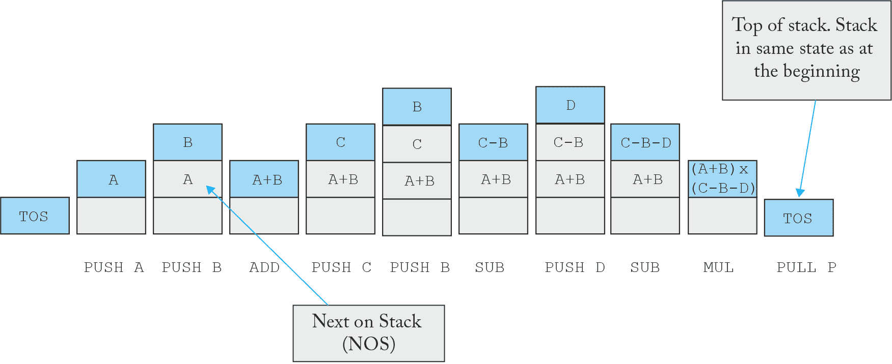
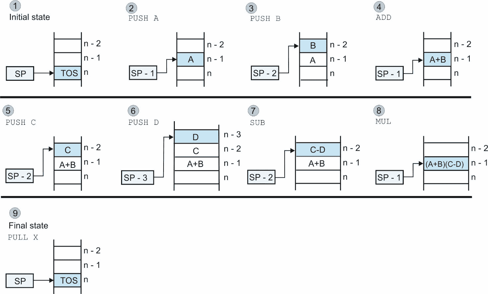
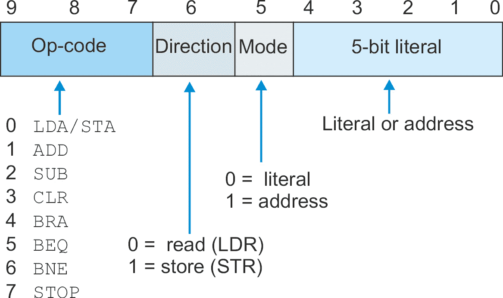
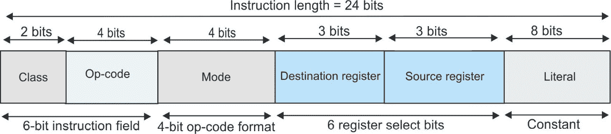

# 第八章：其他架构的模拟器

在本章中，您将学习如何创建不同指令集架构的模拟器，例如基于栈的计算机和经典的 CISC。

在描述了一个简单的基于栈的计算器 TC0 之后，我们将介绍一个单地址格式的模拟器。大多数操作发生在累加器（即寄存器）和内存位置的内容之间；例如，`ADD Y`意味着*将内存位置 Y 的内容加到累加器中*。术语*累加器*表示加法结果*累积*的位置。早期的微处理器在硅芯片上缺乏多个寄存器的空间，所有数据都必须通过一个或两个累加器。

之后，我们将模拟一个 CISC 架构，它是基于累加器的机器的扩展，其中可以在内存内容和片上寄存器的存储内容上执行操作。

最后，我们将展示 TC4 的代码。这是一个非冯·诺依曼机器的模拟器，具有独立的地址和数据存储器，并且地址和数据字长度不同。

本章我们将涵盖以下主题：

+   TC0：基于栈的计算器

+   TC2：单地址累加器机器

+   TC3：具有寄存器到内存架构的 CISC 机器

+   完整的 TC3 代码

+   算术逻辑单元（ALU）

+   最后一个示例：TC4

# 技术要求

您可以在 GitHub 上找到本章使用的程序，网址为[`github.com/PacktPublishing/Practical-Computer-Architecture-with-Python-and-ARM/tree/main/Chapter08`](https://github.com/PacktPublishing/Practical-Computer-Architecture-with-Python-and-ARM/tree/main/Chapter08)。

# TC0：基于栈的计算器

我们将从一个非常简单的*基于栈的计算器*开始。在这里，我们将介绍一种零地址机器，它通过在栈上存储数据来避免显式操作数地址。我们包含基于栈的计算机的概念有两个原因。首先，它是许多经典计算器、编程语言（FORTH）和经典计算机（Burroughs B5000）设计的基础。其次，构建基于栈的计算机非常简单，您可以实验这类计算机。实际上，基于栈处理器的元素可以轻松地集成到任何计算机中。在传统计算机中，两个元素通过如`ADD A,B,C`这样的操作相加。在基于栈的计算机中，两个元素通过`ADD`相加。不需要操作数地址，因为要相加的元素是栈顶的两个元素。

我们在这里描述的计算机被称为 TC0，以表明它是一个原型模拟器，而不是完整的模拟器（它无法执行条件操作）。

栈是一种以队列形式存在的数据结构。项目从顶部进入队列，并以相反的顺序离开队列，即它们进入的顺序。它被称为*栈*，因为它表现得就像一叠纸张。

栈提供了两种操作：*push*，即将项目添加到栈中，和 *pull*（或 *pop*），即将项目从栈中移除。

对单个元素的操作（例如，取反）应用于栈的 *顶部* 元素。对两个操作数进行操作的操作应用于栈的 **顶部元素（TOS**）；例如，通过从栈中拉出两个操作数，执行加法，然后将结果推回栈中来实现加法。*图 8**.1* 展示了在评估 P = (A + B)×(C – B – D) 时栈的行为。



图 8.1 – 评估 (A + B)×(C – B – D) 时发生的操作序列

*表 8.1* 展示了如何使用 `PUSH`、`PULL`、`ADD`、`SUB` 和 `MUL` 栈操作来执行 P = (A + B)×(C – B – D) 的计算。除了算术操作外，还有两种常见的栈操作 `DUP`（复制）和 `SWAP`。`DUP` 操作会复制 TOS 上的项目并将其推入栈中（即，栈顶被复制）。`SWAP` 操作交换 TOS 和 **Next on Stack (NOS**) 的值。

```py

Operation        The stack as a Python list (bold is top of stack)
PUSH A           stack = [x,x,x,x,x,x,x,A]
PUSH B           stack = [x,x,x,x,x,x,B,A]
ADD              stack = [x,x,x,x,x,x,x,A+B]
PUSH C           stack = [x,x,x,x,x,x,C,A+B]
PUSH B           stack = [x,x,x,x,x,B,C,A+B]
SUBTRACT         stack = [x,x,x,x,x,x,C-B,A+B]
PUSH D           stack = [x,x,x,x,x,D,C-B,A+B]
SUBTRACT         stack = [x,x,x,x,x,x,D-C-B,A+B]
MULTIPLY         stack = [x,x,x,x,x,x,x,(D-C-B)(A+B)]
PULL result      stack = [x,x,x,x,x,x,x,x]
```

表 8.1 – 评估 (A + B)×(C – B – D) 的代码

为了简化模拟器，每个指令都存储在一个包含操作和内存地址（对于 `PUSH` 和 `PULL`）的 Python 列表中。这不是一个实用的模拟器；它是一个使用栈来处理算术操作的演示，也是对后续章节中栈的介绍。

一个名为 `1231` 的寄存器，将一个元素压入栈中会将其存储在地址 `1230`，因为栈是向低地址增长的。

在某些实现中，栈指针指向栈顶之上的 *下一个空闲位置*。我们将使用 Python 中的列表 `stack[]` 来表示栈。栈指针是 sp，将项目 A 压入栈的操作如下：

```py

sp = sp – 1       # Decrement the stack pointer. Point to the next free location above TOS
stack[sp] = A     # Load the new value, A, on the stack in this location
```

记住，栈指针是递减的，因为栈是向低地址增长的。如果从栈中弹出一个项目，则逆操作如下：

```py

A = stack[sp]     # Retrieve the item at the top of the stack
```

```py
sp = sp + 1       # Move the stack pointer down
```

这些是互补操作。一个 pull 操作取消一个 push。考虑评估一个表达式。*图 8**.2* 展示了在评估 `X = (A + B)×(C –` `D)` 时栈的状态。



图 8.2 – 评估 X = (A + B)×(C – D) 时发生的操作序列

下一步是演示如何实现一个简单的计算器，TC0，它基于栈。

## TC0：Python 栈机器

我们可以在 Python 的栈机器上表示加法 `y3 = y1 + y2` 如下：

```py

y1 = stack[sp]        # Retrieve the item at the top of the stack (y1 and y2 are on the stack)
sp = sp + 1           # Move the stack pointer down
y2 = stack[sp]        # Retrieve the item at the top of the stack
y3 = y1 + y2          # Add the two values
stack[sp] = y3        # Store the result on the stack
```

我们采取了一个捷径。我们本可以从栈中取出两个元素，将它们相加，然后将结果压入栈中。相反，我们将结果放回到第二个操作数的位置，并节省了两个栈指针的移动。以下 Python 代码演示了一个非常简单的栈机解释器。它不实现分支操作，因此它不是一个现实的计算机器。由于栈机通常在栈顶及其下面的元素上操作，第二个元素通常被称为 NOS。请注意，程序存储为列表的列表，每个指令由一个包含两个元素的列表（例如，`['push', '2'])`）或一个包含单个元素的列表（例如，`['``mul']`）组成：

```py

                                       # Stack machine simulator
prog = [['push',0],['push',1],['add'],   ['push',2],['push',1],           \
        ['sub'],   ['push',3],['sub'],   ['mul'],   ['push',4],           \
        ['swap'],  ['dup'],['pull',4],   ['stop']]
stack = [0] * 8                        # 8-location stack. Stack grows to lower addresses
mem   = [3,2,7,4,6,0]                  # Data memory (first locations are preloaded 3, 2,7, 4, 6)
run = True                             # Execution continues while run is true
pc = 0                                 # Program counter - initialize
sp = 8                                 # Initialize stack pointer to 1 past end of stack
while run:                             # Execute MAIN LOOP until run is false (STOP command)
    inst = prog[pc]                    # Read the next instruction
    pc = pc + 1                        # Increment program counter
    if   inst[0] == 'push':            # Test for push operation
         sp = sp - 1                   # Pre-decrement stack pointer
         address = int(inst[1])        # Get data from memory
         stack[sp] = mem[address]      # Store it on the stack
    elif inst[0] == 'pull':            # Test for a pull instruction
         address = int(inst[1])        # Get destination address
         mem[address] = stack[sp]      # Store the item in memory
         sp = sp + 1                   # Increment stack pointer
    elif inst[0] == 'add':             # If operation add TOS to NOS and push result
         p = stack[sp]
         sp = sp + 1
         q = stack[sp]
         stack[sp] = p + q
    elif inst[0] == 'sub':             # sub
         p = stack[sp]
         sp = sp + 1
         q = stack[sp]
         stack[sp] = q - p
    elif inst[0] == 'mul':             # mul
         p = stack[sp]
         sp = sp + 1
         q = stack[sp]
         stack[sp] = p * q
    elif inst[0] == 'div':             # div (note floor division with integer result)
         p = stack[sp]
         sp = sp + 1
         q = stack[sp]
         stack[sp] = p//q
    elif inst[0] == 'dup':             # dup (duplicate top item on stack)
         p = stack[sp]                 # get current TOS
         sp = sp - 1                   # and push it on the stack to duplicate
         stack[sp] = p
    elif inst[0] == 'swap':            # swap (exchange top of stack and next on stack)
         p = stack[sp]
         q = stack[sp+1]
         stack[sp] = q
         stack[sp+1]=p
    elif inst[0] == 'stop':            # stop
         run = False
    if sp == 8: TOS = 'empty'          # Stack elements 0 to 7\. Element 8 is before the TOS
    else: TOS = stack[sp]
    print('pc =', pc-1,'sp =',sp,'TOS =',TOS,'Stack',stack,'Mem',mem,'op',inst)
```

以下是从该程序输出的结果，显示了程序计数器、栈顶、NOS、栈本身、数据和正在执行的指令码。在周期之间发生变化的值以粗体显示：

```py

pc=0 sp=7  TOS=3 Stack [0,0,0,0,0,0,0,3] Mem [3,2,7,4,6,0] op ['push',0]
pc=1 sp=6  TOS=2 Stack [0,0,0,0,0,0,2,3] Mem [3,2,7,4,6,0] op ['push',1]
pc=2 sp=7  TOS=5 Stack [0,0,0,0,0,0,2,5] Mem [3,2,7,4,6,0] op ['add']
pc=3 sp=6  TOS=7 Stack [0,0,0,0,0,0,7,5] Mem [3,2,7,4,6,0] op ['push',2]
pc=4 sp=5  TOS=2 Stack [0,0,0,0,0,2,7,5] Mem [3,2,7,4,6,0] op ['push',1]
pc=5 sp=6  TOS=5 Stack [0,0,0,0,0,2,5,5] Mem [3,2,7,4,6,0] op ['sub']
pc=6 sp=5  TOS=4 Stack [0,0,0,0,0,4,5,5] Mem [3,2,7,4,6,0] op ['push',3]
pc=7 sp=6  TOS=1 Stack [0,0,0,0,0,4,1,5] Mem [3,2,7,4,6,0] op ['sub']
pc=8 sp=7  TOS=5 Stack [0,0,0,0,0,4,1,5] Mem [3,2,7,4,6,0] op ['mul']
pc=9 sp=6  TOS=6 Stack [0,0,0,0,0,4,6,5] Mem [3,2,7,4,6,0] op ['push',4]
pc=10 sp=6 TOS=5 Stack [0,0,0,0,0,4,5,6] Mem [3,2,7,4,6,0] op ['swap']
pc=11 sp=5 TOS=5 Stack [0,0,0,0,0,5,5,6] Mem [3,2,7,4,6,0] op ['dup']
pc=12 sp=6 TOS=5 Stack [0,0,0,0,0,5,5,6] Mem [3,2,7,4,6,5] op ['pull',5]
```

```py
pc=13 sp=6 TOS=5 Stack [0,0,0,0,0,5,5,6] Mem [3,2,7,4,6,5] op ['stop']
```

在下一节中，我们将查看一个更现实的机器，该机器实现了早期 8 位微处理器时代的简单累加器机器。

# TC2：一个单地址累加器机器

在本节中，你将了解一种实现内存到寄存器架构的计算机。这是一台非常简单的机器，实现了单地址指令格式（类似于 20 世纪 70 年代的 8 位 CISC 微处理器）。

TC2 模型可以用来模拟在低成本计算机系统中发现的经典 8 位微处理器（例如，机械设备的控制器）。它还教会你关于计算机的简单性（计算机的）和由原始架构限制的软件的复杂性之间的权衡。

与现代 RISC 架构不同，这种计算机在累加器中的一个操作数和另一个操作数（可以是文字或内存内容）之间实现二元操作；例如，`ADD M`将内存位置`M`的内容加到累加器中，而`ADD #5`将一个文字加到累加器的内容中。这台计算机没有大量的一般用途寄存器。

单地址机器允许在累加器中的数据和内存中的数据之间进行操作。这与只允许在寄存器之间进行数据处理操作的 RISC 架构形成对比。加载和存储是 RISC 架构允许的唯一内存操作。这台计算机 TC2 实现了一个最小的指令集，以展示其操作。表 8.2 描述了指令集：

| 指令 | 操作 | 内存形式 | 文字形式 | 指令码 |
| --- | --- | --- | --- | --- |
| `LDA` | 加载累加器 | `[A]` ← `[``M]` | `[A]` ← `L` | `0` |
| `STA` | 存储累加器 | `[M]` ← `[``A]` | `[M]` ← `L` | `0` |
| `ADD` | 向累加器中加 | `[A]` ← `[A] + [``M]` | `[A]` ← `[A] + L` | `1` |
| `SUB` | 从累加器中减去 | `[A]` ← `[A] - [``M]` | `[A]` ← `[A] – L` | `2` |
| `CLR` | 将累加器/内存加载为零 | `[A]` ← `0` | `[M]` ← `0` | `3` |
| `BRA` | 无条件分支到 L | `[PC]` ← `L` |  | `4` |
| `BEQ` | 零分支到 L | `如果 Z = 1，则[PC]` ← `L` |  | `5` |
| `BNE` | 非零分支到 L | `如果 Z = 0，则[PC]` ← `L` |  | `6` |
| `STOP` | 停止 |  |  | `7` |

表 8.2 – 寄存器到内存计算机的典型操作

在这里，`[A]`是累加器的内容，`[M]`是内存位置*M*的内容，*L*是一个立即数，如果减法的结果为零，则设置 Z 位。*M*和*L*代表指令的立即数字段，它们是互斥的。你不能有一个同时包含*M*和*L*操作数的指令。

模拟计算机教给我们很多关于将指令分割成各种字段以及如何实现指令的知识。在这个例子中，我们使用一个 3 位操作码，一个 1 位*方向*标志（用于`LDA`和`STA`），它定义了数据移动的方向（向或从内存），以及一个 1 位*模式*标志，它选择是直接内存访问还是立即数。一个 5 位数字字段提供一个 0 到 31 范围内的整数，或一个内存地址。指令大小为 10 位，格式为`CCC D M LLLLL`，其中*CCC*是操作码字段，*D*是方向位，*M*是模式位，*LLLLL*是立即数或内存地址（*图 8**.3*）。这种极端的简单性使得编写一个微型的模拟器变得容易，同时也给用户留下了很多将代码扩展成更真实机器的机会。



图 8.3 – TC2 指令格式

TC2 模拟了一个存储程序计算机，它有一个单一内存，既可以存储程序也可以存储数据。32 位位置内存通过`memory = [``0]*32`初始化。

TC2 代码有一个设置部分和一个包含取指令和执行指令部分的`while`循环。代码中`while`循环部分的（指令取/执行周期）结构如下：

```py
while run == True:
   operation         # Body of while loop operation
   .
   .
statement            # Next operation after the while loop
```

在`while`循环中，我们有一个`fetch`阶段，随后是执行阶段。`fetch`阶段与我们已经描述的 CPU 相同。指令解码包含在这个阶段。指令解码通过移位和位掩码操作将 OpCode、Dir（即向或从内存的方向）、Mode 和 Immediate 分开：

```py

    MAR = PC                     # PC to Memory Address Register
    PC = PC + 1                  # Increment PC
    MBR = Memory[MAR]            # Read instruction, copy to Memory Buffer register
    IR = MBR                     # Copy instruction to Instruction Register
    OpCode = IR >> 7             # Extract Op-Code frominstruction (bits 7 to 10)
    Dir  = (IR >> 6) & 1         # Extract data direction from instruction (0 = read, 1 = write)
    Mode = (IR >> 5) & 1         # Extract address mode from instruction (0 = literal, 1 = memory)
    Lit = IR & 0x1F              # Extract the literal/address field from the instruction
```

右移和 AND 操作从指令中提取字段；例如，从 10 位的`CCCDMLLLLL`指令中提取 3 位操作码，通过左移七位得到`0000000CCC`。方向位，Dir，通过执行六次左移得到`000000CCCD`，然后与 1 进行 AND 操作得到`000000000D`。这两个操作可以合并并写成如下：

`(IR >> 6) & 1`      # 使用>>进行 6 位右移，并使用 AND 操作符&与 1 进行 AND 操作

同样，我们通过执行`Mode = (IR >> 5) & 1`来提取模式位。最后，立即数已经就位，所以我们只需通过 AND 操作与`0b0000011111`（即`IR & 0x1F`）进行 AND 操作来清除其他位。

在`execute`阶段，三个操作码位`OpCode`选择八种可能指令之一。当然，使用`if … elif`会更合适：

```py

if   OpCode == 0:
     Code for case 0
elif OpCode == 1:
     Code for case 1
.
.
elif OpCode == 7:
     Code for case 7
```

每个操作码都由一个`if`语句保护。以下是加载和存储累加器指令的代码。我们将这视为一个操作，并使用方向标志`Dir`来选择`LDA`（从内存到累加器的方向）和`STA`（从累加器到内存的方向）：

```py

    if OpCode == 0:              # Test for Load A or Store A instruction
      if Dir  == 0:              # If direction bit is 0, then it's a load accumulator
         if Mode == 0:           # Test for literal or direct memory operand
            Acc  = Lit           # If mode is 0, then it's a literal operand
         else:                   #If mode is 1, then it's a memory access
            MAR = Lit            #Copy field (address) to MAR
            MBR = Memory[MAR]    #Do a read to get the operand in MBR
            Acc  = MBR           #and send it to the accumulator
      else:
          MAR = Lit              # If direction is 1 then it's a store accumulator
          MBR = Acc              # Copy accumulator to MBR
          Memory[MAR] = MBR      # and write MBR to memory
```

为了使代码更容易阅读，我们将其分为两个块（一个深灰色阴影，一个浅灰色阴影），由`if `Dir == 0`语句保护。当方向标志为 0 时，指令是*加载累加器*，地址被复制到`MAR`，执行读取操作，然后将数据复制到`MBR`和累加器。如果方向标志为 1，指令是*存储累加器*，累加器被复制到`MBR`并执行写入操作。

注意`Mode`标志的使用。当从内存加载累加器`LDA`时，模式标志用于将累加器加载为字面量或内存内容。当执行`STA`（存储累加器）时，模式标志被忽略，因为只能进行内存存储。

我们不需要描述`ADD`和`SUB`操作，因为它们仅仅是加载和存储操作的扩展。我们包含了一个清晰的操作`CLR`，它根据`Mode`标志将累加器设置为 0 或将内存内容设置为 0。

现在我们将展示完整的模拟器代码。`Memory[MAR]`表示法意味着地址在`MAR`中的内存内容，并且方便地与我们所使用的 RTL 相同。在执行指令块中，交替的操作码以灰色和蓝色阴影显示，以方便阅读。

我们在内存中包含了一个小程序，包括测试几个指令的数据，包括加载和存储、加法、减法和分支。

TC2 有一个清除操作`CLR`，根据模式标志将累加器或内存内容设置为 0。这个简化的计算机只有一个 Z 位（没有 N 和 C 位）。

指令组（`BRA`、`BEQ`和`BNE`）将一个字面量加载到程序计数器中，以强制跳转。`BRA`执行无条件分支，而`BEQ`/`BNE`则根据 Z 位的状态（由加法和减法操作设置/清除）执行。分支目标地址是由字面量字段提供的绝对地址。

我们已经预留了最后一个指令操作码`111`作为停止（暂停）指令，它会跳出`while`循环并终止执行。一般来说，实际的 CPU 不需要暂停指令，尽管暂停指令可以用来强制将其置于待机模式，直到被外部事件（如键盘/鼠标输入或屏幕触摸）唤醒：

```py
                                # The TC2: A primitive accumulator machine
mnemonics = {0:'LDA/STR', 1:'ADD', 2:'SUB', 3:'CLR', 4:'BRA', 5: \
               'BEQ', 6:'BNE', 7:'STOP'}
def progSet():
    global mem
    mem = [0] * 32              # The memory holds both instructions and data
  # Format  CCCDMLLLLL          # 000 LDA/STR, 001 ADD, 010 SUB, 011 CLR, 100 BRA, \
                                  101 BEQ, 110 BNE, 111 STOP
    mem[0]  =  0b0000110000     # LDA 16  [A]   = M[16]
    mem[1]  =  0b0010110001     # ADD 17  [A]   = [A] + M[17] 
    mem[2]  =  0b0001110010     # STA 18  M[18] = [A]
    mem[3]  =  0b0100000011     # SUB #3  [A]   = [A] - 3
    mem[4]  =  0b1010001000     # BEQ 8
    mem[5]  =  0b0000010010     # LDA #18 [A]   = 18
    mem[6]  =  0b0001110010     # STA 18  M[18] = [A]
    mem[7]  =  0b0110000000     # CLR     [A]   = 0  
    mem[8]  =  0b0000000010     # LDA #2  [A]   = 2  
    mem[9]  =  0b0100000010     # SUB #2  [A]   = [A] - 3
    mem[10] =  0b1010001101     # BEQ 12
    mem[11] =  0b0000001111     # LDA #15 LDA #18 [A] = 18 Dummy not executed  
    mem[12] =  0b1110000000     # STOP
    mem[16] =  0b0000000100     # 4 Data for test
    mem[17] =  0b0000000101     # 5 Data for test  
    mem[31] =  0b1110000000     # Ensure STOP operation
    return(mem)
run = True                  # run is True for code execution. Setting run to False stops the computer
PC  = 0                     # The program counter points to the next instruction to execute. Initially 0
z = 0                       # Initialize z-bit (note no n and c bits implemented)
mem = progSet()
```

现在我们已经将程序加载到内存中并设置了一些变量，我们可以进入`fetch` `execute`循环：

```py

                                 # MAIN LOOP – FETCH/EXECUTE
while run:                   # This is the fetch/execute cycle loop that continues until run is False
    MAR    = PC                  # FETCH PC to mem Address Register
    pcOld  = PC                  # Keep a copy of the PC for display
    PC     = PC + 1              # Increment PC
    MBR    = mem[MAR]            # Read the instruction, copy it to the mem Buffer Register
    IR     = MBR                 # Copy instruction to Instruction Register – prior to decoding it
    OpCode = (IR >> 7) & 0x7     # Extract Op-Code from instruction bits 7 to 10 by shifting masking
    Dir    = (IR >> 6) & 1       # Extract data direction from instruction (0 = read, 1 = write)
    Mode   = (IR >> 5) & 1       # Extract address mode from instruction (0 = literal, 1 = mem)
    Lit     = IR & 0x1F          # Extract literal/address field (0 = address, 1= literal)
                             # EXECUTE The EXECUTE block is an if statement, one for each opcode
    if OpCode == 0:          # Test for LDA and STA (Dir is 0 for load acc and 1 for store in mem)
        if Dir == 0:             # If Direction is 0, then it's a load accumulator, LDA
            if Mode == 0:        # Test for Mode bit to select literal or direct mem operand
                Acc = Lit        # If mode is 0, then the accumulator is loaded with L
            else:                # If mode is 1, then read mem to get operand
                MAR = Lit        # Literal (address) to MAR
                MBR = mem[MAR]   # Do a read to get operand in MBR
                Acc = MBR        # and send it to the accumulator
        else:
            MAR = Lit            # If Direction is 1, then it's a store accumulator
            MBR = Acc            # Copy accumulator to MBR
            mem[MAR] = MBR       # and write MBR to mem
    elif OpCode == 1:              # Test for ADD to accumulator
        if Mode == 0:              # Test for literal or direct mem operand
            total = Acc + Lit      # If mode is 0, then it's a literal operand
            if total == 0: z = 1   # Deal with z flag
            else: z = 0
        else:                      # If mode is 1, then it's a direct mem access
            MAR = Lit              # Literal (address) to MAR
            MBR = mem[MAR]         # Do a read to get operand in MBR
            total = MBR + Acc      # And send it to the accumulator
        if Dir == 0: Acc = total   # Test for destination (accumulator)
        else: mem[MAR] = total     # Or mem
    elif OpCode == 2:              # Test for SUB from accumulator
        if Mode == 0:              # Test for literal or direct mem operand
            total = Acc – Lit      # If mode is 0 then it's a literal operand
        else:                      # If mode is 1 then it's a direct mem access
            MAR = Lit              # Literal (address) to MAR
            MBR = mem[MAR]         # Do a read to get operand in MBR
            total = Lit – MBR      # and send it to the accumulator
        if total == 0: z = 1       # Now update z bit (in all cases)
        if Dir == 0: Acc = total   # Test for destination (accumulator)
        else: mem[MAR] = total     # Or mem
```

以下块（深色阴影）实现了清除操作。这个指令不是严格必要的，因为你可以始终加载零或从 X 中减去 x。因此，一些计算机不包含清除指令。一些计算机允许你写入`CLR`然后替换为操作，如`SUB X,X`：

```py
    elif OpCode == 3:              # Test for CLR (clear Accumulator or clear mem location)
        if Mode == 0:              # If Mode = 0 Then clear accumulator
            Acc = 0
        else:
            MAR = Lit              # If Mode = 1
            mem[MAR] = 0           # Then clear mem location mem[Literal]
    elif OpCode == 4:              # Test for BRA Branch unconditionally
        PC = Lit - 1          # Calculate new branch target address (-1 because PC auto increment)
    elif OpCode == 5:              # Test for BEQ Branch on zero
        if z == 1: PC = Lit - 1    # If z bit = 1 then calculate new branch target address
    elif OpCode == 6:              # Test for BNE Branch on not zero
        if z == 0: PC = Lit - 1    # If z bit = 0 calculate new branch target address
    elif OpCode == 7:               # Test for STOP
        run = False                 # If STOP then clear run flag to exit while loop and stop
```

你可以争论说我们应该在这里插入一个中断或退出，因为如果我们没有在`execute`循环结束时遇到有效的操作码，源代码必须是无效的：

```py

# End of main fetch-execute loop
    mnemon = mnemonics.get(OpCode)  # Get the mnemonic for printing
    print('PC',pcOld, 'Op ',OpCode, 'Mode = ', Mode, 'Dir = ',Dir, \
          'mem', mem[16:19], 'z',z, 'Acc', Acc, mnemon)
```

我们现在运行这个程序。运行此程序时的输出如下：

```py

PC 0  OpCode  0 Mode =  1 Dir =  0 mem [4, 5, 0]  z 0 Acc 4  LDA/STR
PC 1  OpCode  1 Mode =  1 Dir =  0 mem [4, 5, 0]  z 0 Acc 9  ADD
PC 2  OpCode  0 Mode =  1 Dir =  1 mem [4, 5, 9]  z 0 Acc 9  LDA/STR
PC 3  OpCode  2 Mode =  0 Dir =  0 mem [4, 5, 9]  z 0 Acc 6  SUB
PC 4  OpCode  5 Mode =  0 Dir =  0 mem [4, 5, 9]  z 0 Acc 6  BEQ
PC 5  OpCode  0 Mode =  0 Dir =  0 mem [4, 5, 9]  z 0 Acc 18 LDA/STR
PC 6  OpCode  0 Mode =  1 Dir =  1 mem [4, 5, 18] z 0 Acc 18 LDA/STR
PC 7  OpCode  3 Mode =  0 Dir =  0 mem [4, 5, 18] z 0 Acc 0  CLR
PC 8  OpCode  0 Mode =  0 Dir =  0 mem [4, 5, 18] z 0 Acc 2  LDA/STR
PC 9  OpCode  2 Mode =  0 Dir =  0 mem [4, 5, 18] z 1 Acc 0  SUB
PC 10 OpCode  5 Mode =  0 Dir =  0 mem [4, 5, 18] z 1 Acc 0  BEQ
PC 12 OpCode  7 Mode =  0 Dir =  0 mem [4, 5, 18] z 1 Acc 0  STOP
```

## 增强 TC2 模拟器

累加器基础机器的简单示例说明了指令实现、指令集设计和位分配的几个方面。TC2 有一个 3 位操作码，给我们提供了八个操作。或者不是吗？

方向位，Dir，仅由`LDA`/`STA`指令使用。如果我们从操作码字段中移除此位，我们将有一个 4 位操作码，提供 16 条指令。由于`LDA`和`STA`现在将是独立的指令，我们的 8 条指令计算机将拥有 9 条指令，留下 16 - 9 = 7 个新的（即未分配的）操作码。我们还可以使用方向标志与`ADD`和`SUB`指令一起使用，允许目标为累加器或内存。考虑以下示例。当前的 TC2 模拟器可以使用以下代码增加变量*x*和*y*：

```py

      LDA  x
      ADD  #1
      STA  x
      LDA  y
      ADD  #1
      STA  y
```

通过扩展加法操作（`ADDA`用于累加器加和`ADDM`用于内存加和），我们现在可以编写以下代码：

```py

      LDAA #1   ; Load accumulator with 1
      ADDM x    ; Add accumulator to memory location x
      ADDM y    ; Add accumulator to memory location y
```

这个增强将指令数量减半，因为我们只将累加器加载为文字一次，然后将其添加到两个不同的内存位置。`ADD`操作的新代码如下：

```py
 if OpCode == 1:                 # Test for ADDA or ADDM instruction
    if Dir == 0:                 # Test for add to accumulator (Dir=0) or add to memory (Dir =1)
       if Mode == 0:             # Test for ADDA literal or direct memory operand
          Acc = Acc + Lit        # If mode is 0, then it's a literal operand
       else:                     # If mode is 1, then it's a direct memory access
          MAR = Lit              # Literal (address) to MAR
          MBR = Memory[MAR]      # Do a read to get operand in MBR
          Acc = MBR + Acc        # and send it to the accumulator
    if Dir == 1:                 # ADDM: add to memory version of ADD
       MAR = Lit                 # Set up the memory address
       MBR = Memory[MAR]         # Read memory contents
       MBR = MBR + Acc           # Add accumulator to memory
       Memory[MAR] = MBR         # And write back the result
```

我们还能做什么来扩展指令集？我们为分支组分配了*三个*操作码。这非常浪费。由于这些分支指令的方向位和模式位都是未使用的，我们可以将这些位投入使用（即重新定义它们的含义）。考虑*表 8.3*的排列：

| 操作 | 方向 | 模式 |
| --- | --- | --- |
| `BRA` | 0 | 0 |
| 未定义 | 0 | 1 |
| `BEQ` | 1 | 0 |
| `BNE` | 1 | 1 |

表 8.3 – 重新利用方向和模式位

我们已经使用了`Dir`和`Mode`指令位来选择分支类型。作为额外的好处，我们有一个标记为*未定义*的备用操作。分支组的代码如下。我们使用了阴影来帮助识别块。注意，在这个例子中，我们展示了如何使分支程序计数器相关：

```py

if OpCode == 3:                                # Test for the branch group
   if Dir == 0:                                # Direction 0 for unconditional
      if Mode == 0: PC = PC + Lit - 1          # If Mode is zero then unconditional branch
      else: run = 0                            # If Mode is 1 then this is undefined so stop
   else:
      if Dir == 1:                             # If direction is 1, it's a conditional branch
         if Mode == 0:                         # If mode is 0 then we have a BNE
            if Z == 0: PC = PC + Lit - 1       # Branch on Z = 0 (not zero)
         else:                                 # If Mode is 1 we have a BEQ
            if Z == 1: PC = PC + Lit - 1       # Branch on Z = 1 (zero)
```

这段代码看起来比实际要复杂，因为我们测试操作码、方向、模式和 Z 位时嵌套了四个`if`语句。然而，这个例子展示了如何通过重用指令位来增加指令数量，但代价是解码复杂度增加。

在指令集中仍有空间进行操作和提取更多功能。看看`CLR`指令。我们使用模式位来清除内存或累加器。为什么不稍微发挥一下创意，使用*方向*位来提供另一种操作呢？增加寄存器或内存是一个常见的操作，所以让我们提供这个功能。我们可以使用`Dir == 0`来表示`CLR`，`Dir == 1`来表示内存/累加器的`INC`操作。灰色阴影的部分是原始的清除操作，蓝色阴影的部分是新的增加操作：

```py

if OpCode == 6:                    # Test for clear mem/Acc or increment mem/Acc
    if Dir == 0:                   # Direction = 0 for clear operation
        if Mode == 0:              # If Mode = 0
           Acc = 0                 # Then clear accumulator
        else:
           MAR = Lit               # If Mode = 1
           Memory[MAR] = 0         # Then clear memory location
    else:                          # Direction = 1 for increment
        if Mode == 0:              # If Mode = 0
           Acc = Acc + 1           # Then increment accumulator
        else:
           MAR = Lit               # If Mode = 1
           MBR = Memory[MAR]       # Then increment memory location
           MBR = MBR + 1           # Increment memory in MBR
           Memory[MAR] = MBR       # Write back incremented memory value
```

最后，考虑带有`111DMLLLLL`操作码的`STOP`（停止）指令。在这里，我们有 7 位没有做任何事情。这是\(2⁷ = 128\)种组合。如果我们为停止操作保留一个代码，比如`1110000000`，那么我们可以将代码`1110000001`到`1111111111`分配给新的指令。下一节将扩展这个架构以创建一个更逼真的模拟器。

# TC3：具有寄存器到内存架构的 CISC 机器

在本节中，你将了解一个模拟器的结构设计，该模拟器实现了 CISC 风格的指令集架构，提供寄存器到寄存器和寄存器到内存的操作。TC3 是 TC2 的一个更复杂的版本，具有更实用的架构。

TC3 支持寄存器直接、寄存器间接、内存直接和立即数寻址模式。例如，`AND [R2], #129`执行的是寄存器`R2`指向的内存位置的值与二进制值`10000001`的逻辑`AND`操作。

我们包括了内存直接操作。这些操作旨在展示计算机的特性，而不是实用性。早期的 8 位微处理器，如摩托罗拉 6800，允许你直接操作内存。大多数现代处理器都不支持这一点。TC3 可以通过`MOV R2,`M:12`来访问，例如，内存位置 12 的内容。注意语法。TC3 指令提供了一个单一的立即数字段，它可以作为立即数或内存地址，但不能同时作为两者。我使用`#`来表示立即数，`M:`来表示内存地址；考虑`MOV R2,`M:12`和`MOV R2,`#12`。前者将内存位置`12`的内容加载到寄存器`R2`中，后者将整数`12`加载到`R2`中。由于指令中只有一个立即数字段，TC3 不能支持像`MOV M:12,#127`这样的指令。

## TC3 指令集架构

TC3 模拟器是一个具有 24 位指令和 8 位数据字长的一个半地址 CISC 处理器。这使得它成为一个哈佛机器，因为它有独立的数据和程序内存。我们采取这种方法的两个原因是：首先，从教育角度来看，8 位数据字容易处理；其次，24 位指令提供了功能，既没有使用大的 32 位字，也没有采用像某些 CISC 处理器那样的可变长度指令。

*图 8**.4*描述了 TC3 的指令格式，它包含一个指令类别字段和一个操作码字段、一个寻址模式字段、两个寄存器字段和一个立即数字段。所有指令的格式都是相同的。



图 8.4 – TC3 指令格式

我们使用 8 位寄存器、8 位地址和 8 位立即数来简化设计。数据空间限制在 2⁸ = 256 个位置，因为立即数只能访问 256 个位置。将指令宽度改为 32 位并将立即数扩展到 16 位将提供 65,536 个位置的数据空间。

TC3 拥有八个通用寄存器，`R0`到`R7`。它需要 6 位来提供源寄存器和目标寄存器字段。指令字段宽度为 6 位，分为一个 2 位的指令类别字段和一个 4 位的操作码字段。这允许最多有 64 条指令，每个类别最多 16 条。我们采用这种（指令类别和操作码）方法来简化设计。从指令空间使用效率的角度来看，这是一个相当低效的方法，因为大多数指令都位于一个类别中，而其他类别几乎是空的。

4 位模式字段定义了指令的属性（例如，寻址模式）。TC3 支持*表 8.4*中定义的寻址模式，即无操作数指令、单寄存器指令、带立即数的指令和双操作数指令。尽管 TC3 只支持两个操作数（寄存器+寄存器和寄存器+立即数），但指令中有三个字段。因此，计算机可以很容易地修改以提供三操作数指令。我们选择这种方法来简化指令编码和解码。另一种方法是为两个操作数字段提供两个字段——一个寄存器字段和一个寄存器或立即数字段：

| **模式** | **地址** | **示例** | **RTL** | **类别** |
| --- | --- | --- | --- | --- |
| 0 | 无操作数 | `STOP` |  | `0` |
| 1 | 单个寄存器 | `INC R1` | `[R1]` ← `[R1] + 1` | `1` |
| 2 | 立即数偏移量 | `BEQ 123` | `[pc]` ← `123` | `2` |
| 3 | 保留 |  |  |  |
| 4 | 立即数到寄存器 | `MOV R1,#M` | `[R1]` ← `M` | `3` |
| 5 | 寄存器到寄存器 | `MOV R1,R2` | `[R1]` ← `[``R2]` | `3` |
| 6 | 寄存器间接到寄存器 | `MOV R1,[R2]` | `[R1]` ← `[[``R2]]` | `3` |
| 7 | 寄存器到寄存器间接寻址 | `MOV [R1],R2` | `[[R1]]` ← `[``R2]` | `3` |
| 8 | 寄存器间接到寄存器间接 | `MOV [R1],[R2]` | `[[R1]]` ← `[[``R2]]` | `3` |
| 9 | 寄存器到内存 | `MOV M:123,R2` | `M[123] ← [``R2]` | `3` |
| 10 | 寄存器间接到内存 | `MOV M:123,[R2]` | `M[123]` ← `[[``R2]]` | `3` |
| 11 | 内存到寄存器 | `MOV R1,M:123` | `[R1]` ← `M[123]` | `3` |
| 12 | 内存到寄存器间接 | `MOV [R1],M:123` | `[[R1]]` ← `M[123]` | `3` |
| 13-15 | 保留 |  |  |  |

表 8.4 – TC3 处理器寻址模式

考虑以下在此计算机上运行的汇编语言程序。我们希望将两个向量加上一个整数相加，即*z*i = xi + yi + 5，其中*i* = 0 到 3。以下代码应该大部分是自解释的。立即数前面加有#，指令中的标签以冒号结束。代码的前一部分使用`RND R5`指令用随机数填充向量`X`和`Y`，以帮助测试。

```py

      Code          @ Comment                        Instruction encoding
      MOV  R0,#     @ Point to memory location 8
Next: RND  R5       @ REPEAT: generate random value in r5
      MOV  [R0],R5  @ store r5 at location pointed at by r0
      DEC  R0       @ decrement r0 pointer
      BNE  Next     @ UNTIL zero
      EQU  X,#1     @ Vector X memory 1 to 4
      EQU  Y,#5     @ Vector Y memory 5 to 8
      EQU  Z,#9     @ Vector Z memory 9 to 12
      MOV  R0,#X    @ r0 points to array X                    00 0000 0010 000 000 00000001
      MOV  R1,#Y    @ r1 points to array Y                   00 0000 0010 001 000 00000101
      MOV  R2,#Z    @ r2 points to array Z                      00 0000 0010 010 000 00001001
      MOV  R3,#4    @ r3 number of elements to add in r3        00 0000 0010 011 000 00000100
Loop: MOV  R4,[R0]  @ Get xi                            00 0000 0000 100 000 00000000
      ADD  R4,#5    @ Add 5 to xi                         00 0001 0010 100 000 00000101
      ADD  R4,[R1]  @ Add xi + 5 to yi Memory to reg operation    00 0001 0001 100 001 00000000
      MOV  [R2],R4  @ Store result in array Z                 00 0000 0100 010 100 00000000
      INC  R0       @ Increment pointer to array X             00 1100 0000 000 000 00000000
      INC  R1       @ Increment pointer to array Y               00 1100 0000 001 000 00000000
      INC  R2       @ Increment pointer to array Z             00 1100 0000 010 000 00000000
      DEC  R3       @ Decrement loop counter                00 1101 0000 011 000 00000000
      BNE  Loop     @ Continue until counter 0              01 0011 0000 000 000 00000100
```

本例使用了直接寻址、寄存器直接寻址和寄存器间接寻址（基于指针）的寻址方式。我们为每个指令提供了二进制代码，包括类别、操作码、寻址模式、寄存器和立即数字段。

初始时，我们没有为这个模拟器构建汇编器。然而，手动编写指令非常痛苦，因此加入了汇编器。汇编器和模拟器的关键是指令的`mode`字段，它指示寻址模式。

当以助记符形式读取指令时，会对其进行检查，并使用其寻址模式和操作数来确定指令所需的四个模式位。当执行指令时，执行相反的操作，并使用模式位来实现适当的寻址模式。例如，如果指令是`LDR R6,#5`，则模式为`4`，汇编器将`6`存储在第一个寄存器字段中，将`5`存储在立即数字段中。当执行指令时，模拟器使用模式位`0100`来确定目标寄存器为`110`，立即数为`00000101`。

TC3 模拟器的第一部分如下。我们创建两个列表：一个用于程序存储器，一个用于数据存储器（pMem 和 dMem）。程序存储器中的指令是从文件导入的。数据存储器设置为 16 个位置，初始化为 0。包含源程序的文本文件是 src，处理以重新格式化指令和删除汇编指令。

代码的阴影部分是为了检测源代码中的`'END'`指令，它终止汇编处理，并在代码执行时作为`STOP`指令。我添加它是为了方便。有时我想测试一两个指令，但不想编写新的源代码程序。我可以将测试的代码放在现有程序的最上面，然后跟随着`END`。`END`之后的所有代码都将被忽略。稍后，我可以删除新的代码和`END`。

```py

sTab = {}                             # Symbol table for equates and labels name:integerValue
pMem = []                             # Program memory (initially empty)
dMem = [0]*16                         # Data memory. Initialized and 16 locations
reg  = [0]*8                          # Register set
z,c,n = 0,0,0                         # Define and status flags: zero, carry, negative
testCode = "E:\\AwPW\\TC3_NEW_1.txt"  # Source filename on my computer
with open(testCode) as src:           # Open the source file containing the assembly program
    lines = src.readlines()           # Read the program into lines
src = [i[0:-1].lstrip() for i in lines ]
                                      # Remove the /n newline from each line of the source code
src = [i.split("@")[0] for i in src]           # Remove comments in the code
src = [i for i in src if i != '']     # Remove empty lines
for i in range(0,len(src)):           # Scan source code line-by-line
    src[i] = src[i].replace(',',' ')  # Replace commas by a space
    src[i] = src[i].upper()           # Convert to upper-case
    src[i] = src[i].split()           # Split into tokens (label, mnemonic, operands)
src1 = []                             # Set up dummy source file, initially empty
for i in range (0,len(src)):          # Read source and stop on first END instruction
    src1.append(src[i])               # Append each line to dummy source file
    if src[i][0] == 'END': break      # Stop on 'END' token
src = src1                            # Copy dummy file to source (having stopped on 'END')
for i in range (0,len(src)):          # Deal with equates of the form EQU PQR 25
    if src[i][0] == 'EQU':            # If the line is 3 or more tokens and first token is EQU
        sTab[src[i][1]] = getL(src[i][2])      # Put token in symbol table as integer
src = [i for i in src if i.count('EQU') == 0]  # Remove lines with "EQU" from source code
```

以下代码将汇编语言形式的指令进行标记化，并将其转换为指令的位模式。在以下代码中，我们使用 ic 作为指令计数器，它逐行遍历源程序。

我们必须处理的一个问题是标签。一些指令有一个标签，而另一些则没有。这意味着，对于没有标签的指令，助记符是令牌 `0`，如果有标签，则是令牌 `1`。Python 代码检查标签（以冒号结尾）。如果找到标签，`j` 被设置为 `1`，如果没有找到，`j` 被设置为 `0`。然后我们使用 `j` 来计算指令中令牌的位置。tLen 变量是一个指令中令牌的数量：

```py

for ic in range(0,len(src)):           # ASSEMBLY LOOP (ic = instruction counter)
    t0,t1,t2 = '', '', ''              # Prepare to assign tokens. Initialize to null string
    if src[ic][0][-1] != ':':          # If the first token doesn't end in colon, it's an instruction
        j = 0                          # j = 0 forline starting with mnemonic
    else:                              # If the first token ends in a colon it's a label
        j = 1                          # j = 1 if mnemonic is second token
    t0 = src[ic][j]                    # Set t0 to mnemonic j selects first or second token
    if len(src[ic]) > 1+j: t1 = src[ic][j+1]  # Set t1 to ingle operand
    if len(src[ic]) > 2+j: t2 = src[ic][j+2]  # Set t2 to second operand
    tLen = len(src[ic]) - j - 1         # tLen is the number of tokens (adjusted for any label)
```

汇编器的下一部分做所有的工作。在这里，我们生成二进制代码。与我们所开发的其它模拟器不同，我们使用目录和列表来检测寄存器，如下（部分）代码所示：

```py

rName   = {'R0':0,'R1':1,'R2':2,'R3':3}  # Relate register name to numeric value (lookup table)
rNamInd = {'[R0]':0,'[R1]':1,'[R2]':2,'[R3]':3}
                                         # Look for register indirect addressing (lookup table)
iClass0 = ['STOP', 'NOP', 'END']         # Instruction class 00 mnemonic with no operands
iClass1 = ['BRA',  'BEQ', 'BNE','CZN' ]  # Instruction class 01 mnemonic with literal operand
```

现在，我们可以取一个令牌并询问它是否在 `rName` 中以检测 `R0` 到 `R7`，或者是否在 `rNamInd` 中以检测它是否是 `[R0]` 到 `[R7]`。此外，我们可以使用指令中的助记符并依次询问它是否在每个类别中，以确定指令的两个类别位；例如，如果 `t0` 是第一个令牌（对应于助记符），我们可以写出以下内容：

```py

if t0 in iClass0: mode = 0.
```

同样，我们可以使用 `if t1 in `rNamInd`` 来判断第二个标记是否是一个用作指针的寄存器（例如，`[R4]`）。

指令中最复杂的类别是 `iClass3`，它处理双操作数指令，例如 `ADD [R3],R4`。在这种情况下，令牌 `t0` 将是 `'ADD'`，令牌 `t1` 将是 `'``[r3]'`，而令牌 `t2` 将是 `'R4'`。为了识别这个指令的类别，我们寻找第一个操作数，它是一个间接寄存器，以及第二个操作数，它是一个寄存器，如下所示：

```py
 if (t1 in rNamInd) and (t2 in rName): mode = 7
```

决定指令模式的代码如下：

```py

binC = 0                                  # Initialize binary code for this instruction to all zeros
opCode = mnemon[t0]                       # Look up op-code in table mnemon using token t0
iClass = opCode >> 4                      # Get two most significant bits of op-code (i.e., class)
if   t0 in iClass0:                       # If in iClass0 it's a single instruction, no operands
    mode = 0                              # The mode is 0 for everything in this class
    binC = (mnemon[t0] << 18)             # All fields zero except op_code
elif t0 in iClass1:                       # If in iClass1 it's an 0p-code plus offset (e.g., branch)
    mode = 1                              # All class 1 instruction are mode 1 (op-code plus literal)
    binC = (mnemon[t0] << 18)+(mode << 14)+getL(t1)
                                          # Create binary code for Class1 instruction
elif t0 in iClass2:                       # If in iClass2 it's an op-code plus register number
    mode = 2                              # All iClass2 instructions are mode 2
    binC = (mnemon[t0] << 18)+(mode << 14)+(rName[t1] << 11
                                          # Construct binary code of instruction
elif t0 in iClass3:                       # All data-processing and movement ops in iClass3
    if   (t1 in rName) and (t2[0] == '#'): # Look for register name and literal for mode 4
        mode = 4
    elif (t1 in rName) and (t2 in rName): # Look for register name and register name for mode 5
        mode = 5
    elif (t1 in rName) and (t2 in rNamInd):   # Look for R0,[R2]) format
        mode = 6
    elif (t1 in rNamInd) and (t2 in rName):   # Look for instruction format [R1],R2
        mode = 7
    elif (t1 in rNamInd) and (t2 in rNamInd): # Look for two register indirect names [R1],[R2]
        mode = 8
    elif (t1[0:2] == 'M:') and (t2 in rName):
                                      # Look for memory address M: and reg name M:12,r4
        mode = 9
    elif (t1[0:2] == 'M:') and (t2 in rNamInd): # Look for M:12,[R4] format
        mode = 10
    elif (t1 in rName) and (t2[0:2] == 'M:'): # Look for register name and literal prefixed by M:
        mode = 11
    elif (t1 in rNamInd) and (t2[0:2] == 'M:'):
                                      # Look for register indirect name and literal prefixed by M:
        mode = 12
```

在提取指令类别、操作码和模式之后，最后一步是获取实际的寄存器编号和任何字面量。在以下代码片段中，我们分别定义了两个寄存器字段和字面量字段。这些是 `rField1`、`rField2` 和 `lField`，并且它们都被初始化为 `0`，因为不带三个字段的指令对应的位被设置为 `0`。

在这里，我们使用列表作为提取字段的一个非常方便的方法，而不是使用组合的 if 和 or 操作符。例如，寄存器字段 `1` 被模式 `4`、`5`、`6` 和 `11` 使用。我们可以写出以下内容：

```py

 if (mode == 4) or (mode == 5) or (mode == 6) or (mode == 11):
```

然而，我们可以用以下更易读的方式来写：

```py

 if mode in [4,5,6,11]:
```

以下代码显示了如何评估三个寄存器/字面量字段：

```py

binC = (mnemon[t0] << 18) + (mode << 14)  # Insert op_Code and mode fields in instruction
rField1, rField2, lField = 0, 0, 0        # Calculate register and literal fields. Initialize to zero
if mode in [4,5,6,11]: rField1 = rName[t1] # Convert register names into register numbers
if mode in [7,8,12]:   rField1 = rNamInd[t1]
if mode in [5,7,9]:    rField2 = rName[t2] # rField2 is second register field
if mode in [6,8,10]:   rField2 = rNamInd[t2]
if mode in [4,11,12]:  lField  = getL(t2)
                                  # if (mode==4) or (mode==11) or (mode==12): lField = getL(t2)
if mode in [9,10]:     lField  = getL(t1)
                                  # if (mode == 9) or (mode == 10): lField = getL(t1) Literal field
```

以下两行代码生成逻辑通过移位和执行位或操作来插入寄存器/字面量字段，并将当前二进制指令 binC 添加到程序内存 pMem 中：

```py

binC = binC + (rField1 << 11) + rField2 << 8) + lField
                                  # Binary code with register and literal fields
pMem.append(binC)                 # Append instruction to program memory
```

## 模拟器的特点

TC3 的模拟器部分相对简单。在这里，我将简单地提供一些关于其特性的注释，以帮助理解代码。

**1.** 打印数据

在模拟器开发过程中，要显示的项目数量增加了。因此，我们创建了一个字符串列表，每个要打印的项目一个，然后将这些项目连接起来。例如，这是我在汇编过程中显示数据的打印机制：

```py

### Display assembly details of each instruction for diagnostics
pcF  = "{0:<20}".format(" ".join(src[ic]))    # 1\. instruction
icF  = 'pc = ' + "{:<3}".format(ic)           # 2\. pc
binF = format(binC, "024b")                   # 3\. Binary encoding
iClF = 'Class = '+ str(iClass)                # 4\. instruction class
modF = 'mode = ' + str(mode)                  # 5\. instruction mode. Convert mode to string
t0F  = "{:<5}".format(t0)                     # 6\. token 0 (mnemonic)
t1F  = "{:<5}".format(t1)                     # 7\. token 1 (register field 1)
t2F  = "{:<10}".format(t2)                    # 8\. token 2 (register field 2 or literal)
print(pcF,icF,binF,iClF,modF,t0F,'t1 =',t1F,t2F)   # Print these fields
```

`displayLevel`参数包括确定在汇编过程中打印了什么信息。例如，我们可以编写以下内容：

```py

if displayLevel > 4: print('Binary code =', xyz)
```

这将在需要调试时（将变量设置为`5`或更大）仅打印二进制代码。

**2. 实现带进位的加法**

当我实现带有编号功能的 ALU 时，我最初忘记了包括`ADC`，带进位的加法。而不是重新编号函数，我通过首先执行加法将`ADD`转换为双重`ADD`/`ADC`操作。然后，如果操作码是`ADC`，则添加进位位：

```py

elif fun == 1:                             # ADD:
        res = (op1 + op2)                  # Perform addition of operands
        if thisOp == 'ADC': res = res + c  # If operation ADC then add carry bit
```

**3. 处理简单的指令类**

这里是处理第 1 类指令的代码。我们不必担心解码模式，因为此类只有一个模式。当然，该类可以通过添加其他模式（在未来）进行扩展。

```py

elif opClass == 1:                         # Class 1 operation instructions with literal operand
    if    thisOp == 'BRA': pc = lit        # BRA Branch unconditionally PC = L
    elif (thisOp == 'BEQ') and (z == 1): pc = lit    # BEQ Branch on zero
    elif (thisOp == 'BNE') and (z == 0): pc = lit    # BNE Branch on not zero
    elif  thisOp == 'CZN':                 # Set/clear c, z, and n flags
        c = (lit & 0b100) >> 2             # Bit 2 of literal is c
        z = (lit & 0b010) >> 1             # Bit 1 of literal is z
        n = (lit & 0b001)                  # Bit 0 of literal is n
```

第 1 类指令包含操作码和字面量，通常用于实现分支操作。请注意，我们比较当前指令与一个名称（例如，`'BRA'`）而不是操作码，就像我们在其他模拟器中所做的那样。使用反向操作码到助记符翻译表使得生活变得更加容易。

我们添加了一个`CZN`（进位零负）指令，允许我们预设条件码；例如，`CZN #%101`将`c`和`n`设置为`1`，将`z`设置为`0`。计算机通常有一个操作，允许你测试条件码、清除它们、设置它们，以及切换（翻转）它们。

**4. 处理字面量**

TC3 的数值可以用几种格式表示，例如二进制，其中我们用`%1000`表示`8`。TC3 中的字面量处理还必须处理特殊格式，例如 M:12，它表示一个内存地址。以下函数执行所有字面量处理并处理几种格式。它还可以处理必须是符号名称的字面量，这些名称必须在符号表中查找：

```py

def getL(lit8):                               # Convert string to integer
    lit8v = 9999                              # Dummy default
    if lit8[0:2]   == 'M:': lit8  = lit8[2:]  # Strip M: prefix from memory literal addresses
    if lit8[0:1]   == '#':  lit8  = lit8[1:]  # Strip # prefix from literal addresses
    if   type(lit8) == int: lit8v = lit8      # If integer, return it
    elif lit8.isnumeric():  lit8v = int(lit8) # If decimal in text form convert to integer
    elif lit8 in sTab:      lit8v = sTab[lit8]       # If in symbol table, retrieve it
    elif lit8[0]   == '%':  lit8v = int(lit8[1:],2)  # If binary string convert to int
    elif lit8[0:2] == '0X': lit8v = int(lit8[2:],16) # If hex string convert it to int
    elif lit8[0]   == '-':  lit8v = -int(lit8[1:]) & 0xFF
                                               # If decimal negative convert to signed int
    return(lit8v)                              # Return integer corresponding to text string
```

**5. 结果写回**

执行 ALU 操作或数据移动后，必须将结果操作数写回计算机。然而，因为我们指定了双操作数 CISC 风格格式，计算结果可以写入寄存器（就像任何 RISC 操作一样），可以写入由寄存器指向的内存位置，或者可以写入由其地址指定的内存操作。以下代码片段演示了 TC3 的写回操作：

```py

op3 = alu(fun,op1,op2)                          # Call ALU to perform the function
if mode in [4,5,6,11]: reg[reg1] = op3          # Writeback ALU result in op3 to a register
elif mode in [7,8,12]: dMem[reg[reg1]] = op3    # Writeback result to mem pointed at by reg
elif mode in [9,10]:   dMem[lit]       = op3    # Writeback result to memory
```

### 样本输出

以下是从模拟器输出的示例，展示了整数处理。我们编写了一个程序，有六种不同的输入字面量的方式。在每种情况下，我们将字面量加载到寄存器`r0`中。源程序如下：

```py

 EQU www,#42
 MOV r0,#12
 MOV r0,#%11010
 MOV r0,#0xAF
 MOV r0,#-5
 MOV r0,M:7
 MOV r0,#www
 NOP
 STOP
 END
```

在以下代码块中，我们有 TC3 的输出。这个输出是为了开发和测试模拟器（例如，在汇编过程之后）而设计的：

```py

Source code                     This is the tokenized source code
['MOV', 'R0', '#12']
['MOV', 'R0', '#%11010']
['MOV', 'R0', '#0XAF']
['MOV', 'R0', '#-5']
['MOV', 'R0', 'M:7']
['MOV', 'R0', '#WWW']
['NOP']
['STOP']
['END']
Equate and branch table          This is the symbol table. Only one entry
WWW      42
```

以下是在汇编和分析阶段的输出：

```py

Assembly loop
MOV R0 #12     pc=0 110000010000000000001100 Class=3 mode=4 MOV   t1=R0 #12
MOV R0 #%11010   pc=1 1110000010000000000011010   Class=3  mode=4   MOV   t1=R0 #%11010
MOV R0 #0XAF   pc=2 110000010000000010101111 Class=3 mode=4  MOV  t1=R0 #0XAF
MOV R0 #-5     pc=3 110000010000000011111011 Class=3 mode=4  MOV  t1=R0 #-5
MOV R0 M:7     pc=4 110000101100000000000111 Class=3 mode=11 MOV  t1=R0 M:7
MOV R0 #WWW    pc=5 110000010000000000101010 Class=3 mode=4  MOV  t1=R0 #WWW
NOP            pc=6 000000000000000000000000 Class=0 mode=0  NOP  t1 =
STOP           pc=7 001110000000000000000000 Class=0 mode=0  STOP t1 =
END            pc=8 001111000000000000000000 Class=0 mode=0  END  t1 =
110000010000000000001100      This is the program in binary form
110000010000000000011010
110000010000000010101111
110000010000000011111011
110000101100000000000111
110000010000000000101010
000000000000000000000000
001110000000000000000000
```

```py
001111000000000000000000
```

在以下代码块中，我们有单步执行输出。为了帮助适应页面，我们已编辑它。我们只为每一行打印了两个内存位置。指令中的文字和其在`r0`中的值以粗体显示：

```py

EXECUTE
MOV R0 #12     pc=0  110000010000000000001100 Class=3 mode=4  
Reg=0c 00 00 00 00 00 00 00 Mem=00 C=0 Z=0 N=0
MOV R0 #%11010 pc=1  110000010000000000011010 Class=3 mode=4  
Reg=1a 00 00 00 00 00 00 00 Mem=00 C=0 Z=0 N=0
MOV R0 #0XAF   pc=2  110000010000000010101111 Class=3 mode=4  
Reg=af 00 00 00 00 00 00 00 Mem=00 C=0 Z=0 N=1
MOV R0 #-5     pc=3  110000010000000011111011 Class=3 mode=4  
Reg=fb 00 00 00 00 00 00 00 Mem=00 C=0 Z=0 N=1
MOV R0 M:7     pc=4  110000101100000000000111 Class=3 mode=11 
Reg=07 00 00 00 00 00 00 00 Mem=00 C=0 Z=0 N=0
MOV R0 #WWW    pc=5  110000010000000000101010 Class=3 mode=4  
Reg=2a 00 00 00 00 00 00 00 Mem=00 C=0 Z=0 N=0
NOP            pc=6  000000000000000000000000 Class=0 mode=0  
Reg=2a 00 00 00 00 00 00 00 Mem=00 C=0 Z=0 N=0
STOP           pc=7  001110000000000000000000 Class=0 mode=0  
Reg=2a 00 00 00 00 00 00 00 Mem=00 C=0 Z=0 N=0
```

# 完整的 TC3 代码

我们已经讨论了 TC3 的设计。在这里，我们展示了完整模拟器的代码。与我们之前章节中描述的代码描述片段相比，这个更完整的模拟器有一些细微的差异。随后是一个模拟器样本运行的示例。代码的第一部分定义了指令模式，并提供了将执行的简单源程序：

```py

### TC3 CISC machine
### Demonstration register-to-memory architecture Designed 22 January 2022.
### Instruction formats and addressing modes
### Mode 0:  NOP, STOP        No operand length 1
### Mode 1:  INC R1           Single register operand
### Mode 2:  BEQ XXX          Literal operand
### Mode 3:  Reserved
### Mode 4:  MOV r1,literal   Two-operand, register and literal
### Mode 5:  MOV r1,r2        Two-operand, register to register
### Mode 6:  MOV r1,[r2]      Two-operand, register indirect to register
### Mode 7:  MOV [r1],r2      Two-operand, register to register indirect
### Mode 8:  MOV [r1],[r2]    Two-operand, register indirect to register indirect
### Mode 9:  MOV M,r2         Two-operand, register to memory address
### Mode 10: MOV M,[r2]       Two-operand, register indirect to memory address
### Mode 11: MOV r1,M         Two-operand, memory address to register
### Mode 12: MOV [r1],M       Two-operand, memory address to register indirect
### The sample test code
###       MOV  r0,#8      @ Memory locations 1 to 8 with random numbers
### Next: RND  r5
###       MOV  [r0],r5
###       DEC  r0
###       BNE  Next
###       EQU   X,#1      @ Vector 1
###       EQU   Y,#5      @ Vector 5
###       EQU   Z,#9      @ Vector 9
###       MOV   r1,#X     @ r0 points to array X              11 0000 0100 000 000 00000001
###       MOV   r2,#Y     @ r1 points to array Y              11 0000 0100 001 000 00000101
###       MOV   r3,#Z     @ r2 points to array Z               11 0000 0100 010 000 00001001
###       MOV   r4,#6     @ r4 number of elements to add      11 0000 0100 011 000 00000100
### Loop: MOV   r5,[r1]   @ REPEAT: Get xi                 11 0000 0110 100 000 00000000
###       ADD   r5,#6     @ Add 6 to xi                   11 0001 0100 100 000 00000101
###       ADD   r5,[r2]   @ Add xi + 5 to yi                 11 0001 0110 100 001 00000000
###       MOV   [r3],r5   @ Store result in array Z            11 0000 0111 010 100 00000000
###       INC   r1        @ Increment pointer to array X        10 0000 0010 000 000 00000000
###       INC   r2        @ Increment pointer to array Y        10 0000 0010 001 000 00000000
###       INC   r3        @ Increment pointer to array Z          10 0000 0010 010 000 00000000
###       DEC   r4        @ Decrement loop counter           10 0001 0010 011 000 00000000
###       BNE   Loop      @ Continue until counter zero         01 0010 0001 000 000 00000100
###       STOP                                        00 1111 0000 000 000 00000000
```

以下块包含指令解码和寄存器查找的字典。我们提供了反向查找，以便你可以通过查找助记符来获取其代码，或者通过查找代码来获取助记符。同样，我们提供了对寄存器（如`R0`和`R2`）和间接寄存器（如`[R0]`和`[R1]`）的查找：

```py

import random                                 # Get library of random number operations
### Dictionaries and variables
mnemon  = {'MOV':48,'MOVE':48,'ADD':49,'SUB':50,'CMP':51,'NOT':52,'AND':53, \
           'OR':54,'EOR':55,'ONES':56, 'MRG':57,'FFO':58,'LSL':59,'LSR':60, \
           'ADC':61,'INC':32,'DEC':33,'RND':34,'CZN':19,'TST':36,'NOP':0,   \
           'BRA':16,'BEQ':17,'BNE':18,'STOP':14,'END':15}
mnemonR = {48:'MOV',49:'ADD',50:'SUB',51:'CMP',52:'NOT',53:'AND',54:'OR',   \
           55:'EOR',56:'ONES',57:'MRG',58:'FFO',59:'LSL',60:'LSR',61:'ADC', \
           32:'INC',33:'DEC', 34:'RND',19:'CZN',36:'TST',0:'NOP',16:'BRA',  \
           17:'BEQ',18:'BNE',14:'STOP',15:'END'}
rName   = {'R0':0,'R1':1,'R2':2,'R3':3,'R4':4,'R5':5,'R6':6,'R7':7} # Register tab
rNamInd = {'[R0]':0,'[R1]':1,'[R2]':2,'[R3]':3,'[R4]':4,' \
           '[R5]':5,'[R6]':6,'[R7]':7}                       # Indirect registers
iClass0 = ['STOP', 'NOP','END']         # class 00 mnemonic with no operands
iClass1 = ['BRA','BEQ','BNE','CZN']     # class 01 mnemonic with literal operand
iClass2 = ['INC','DEC','RND','TST']     # class 10 mnemonic with register operand
iClass3 = ['MOV','MOVE','ADD','ADC','SUB','CMP', 'NOT','AND','OR', \
           'EOR','ONES','MRG','FFO','LSL','LSR']   # class 11 mnemonic two operands
sTab = {}                              # Symbol table for equates and labels name:integerValue
pMem = []                              # Program memory (initially empty)
dMem = [0]*16                          # Data memory
reg  = [0]*8                           # Register set
z,c,n = 0,0,0                          # Define and clear flags zero, carry, negative
```

以下两个函数提供了以各种格式读取整数操作数的能力，以及执行算术和逻辑运算的 ALU。这两个函数都可以扩展以提供额外的功能：

```py

def getL(lit8):                                # Convert string to integer
    lit8v = 9999                               # Dummy default
    if lit8[0:2]   == 'M:': lit8  = lit8[2:]  # Strip M: prefix from memory literal addresses
    if lit8[0:1]   == '#':  lit8  = lit8[1:]   # Strip # prefix from literal addresses
    if   type(lit8) == int: lit8v = lit8       # If integer, return it
    elif lit8.isnumeric():  lit8v = int(lit8)  # If decimal in text from convert to integer
    elif lit8 in sTab:      lit8v = sTab[lit8] # If in symbol table, retrieve it
    elif lit8[0]   == '%':  lit8v = int(lit8[1:],2)  # If binary string convert to int
    elif lit8[0:2] == '0X': lit8v = int(lit8[2:],16) # If hex string convert to int
    elif lit8[0]   == '-':  lit8v = -int(lit8[1:]) & 0xFF
                                               # If decimal negative convert to signed int
    return(lit8v)                              # Return integer corresponding to text string
def alu(fun,op1,op2):             # Perform arithmetic and logical operations on operands 1 and 2
    global z,n,c                               # Make flags global
    z,n,c = 0,0,0                              # Clear status flags initially
    if   fun == 0: res = op2             # MOV: Perform data copy from source to destination
    elif fun == 1:                       # ADD: Perform addition - and ensure 8 bits plus carry
        res = (op1 + op2)                      # Do addition of operands
        if thisOp == 'ADC': res = res + c      # If operation ADC then add carry bit
    elif fun == 2: res = (op1 - op2)           # SUB: Perform subtraction
    elif fun == 3: res = op1 - op2        # CMP: Same as subtract without writeback
    elif fun == 4: res = op1 & op2        # AND: Perform bitwise AND
    elif fun == 5: res = op1 | op2        # OR
    elif fun == 6: res = ~op2             # NOT
    elif fun == 7: res = op1 ^ op2        # XOR
    elif fun == 8:
        res = op2 << 1                    # LSL: Perform single logical shift left
    elif fun == 9:
        res = op2 >> 1                    # LSR: Perform single logical shift right
    elif fun == 10:                       # ONES (Count number of 1s in register)
       onesCount = 0                      # Clear the 1s counter
       for i in range (0,8):        # For i = 0 to 7 (test each bit) AND with 10000000 to get msb
           if op2 & 0x80 == 0x80:         # If msb is set
               onesCount = onesCount + 1  # increment the 1s counter
           op2 = op2 << 1                 # shift the operand one place left
       res = onesCount                    # Destination operand is 1s count
    elif fun == 11:                       # MRG (merge alternate bits of two registers)
         t1 = op1 & 0b10101010            # Get even source operand bits
         t2 = op2 & 0b01010101            # Get odd destination operand bits
         res = t1 | t2                    # Merge them using an OR
    elif fun == 12:                       # FFO (Find position of leading 1)
        res = 8                           # Set default position 8 (i.e., leading 1 not found)
        for i  in range (0,8):            # Examine the bits one by one
          temp = op2 & 0x80               # AND with 10000000 to get leading bit and save
          op2 = op2 << 1                  # Shift operand left
          res = res - 1                   # Decrement place counter
          if temp == 128: break           # If the last tested bit was 1 then jump out of loop
    if res & 0xFF == 0:        z = 1      # TEST FLAGS z = 1 if bits 0 to 7 all 0
    if res & 0x80 == 0x80:     n = 1      # If bit 7 is one, set the carry bit
    if res & 0x100 == 0x100:   c = 1      # carry bit set if bit 8 set
    if (thisOp == 'LSR') and (op2 & 1 == 1): c = 1
                                          # Deal with special case of shift right (carry out is lsb)
    return(res & 0xFF)                    # Return and ensure value eight bits
```

`trace()`函数在程序执行时打印处理器的状态。这可以修改以改变数据量、布局和格式：

```py

def trace():                                          # Function to print execution data
    cF   = "{0:<20}".format(" ".join(src[pcOld]))     # 1\. instruction
    icF  = 'pc = ' + "{:<3}".format(pcOld)            # 2\. pc
    binF = format(inst, "024b")                       # 3\. binary code
    iClF = 'Class = '+ str(iClass)                    # 4\. instruction class
    modF = 'mode = ' + str(mode)   # 5\. instruction mode NOTE we have to convert mode to string
    t0F  = "{:<5}".format(t0)                        # 6\. token 0 (mnemonic)
    t1F  = "{:<5}".format(t1)                        # 7\. token 1 (register field 1)
    t2F  = "{:<10}".format(t2)                       # 8\. token 2 (register field 2 or literal)
    rF   = 'Reg = '+ ' '.join('%02x' % b for b in reg)  # 9\. Registers in hex format
    m    = dMem[0:11]                                # 10\. First 10 memory locations
    mF   = 'Mem = '+ " ".join("%02x" % b for b in m) # 11\. Hex-formatted memory values
    ccrF = 'C = '+ str(c) + ' Z = ' + str(z) +' N = ' + str(n) # 12\. Condition codes
    x = input('>>> ')                               # 13\. Wait for keyboard input (return)
    print(cF,icF,binF,iClF, modF, rF, mF,ccrF)      # 14\. Print the computer status data
    return()
testCode = "E:\\AwPW\\TC3_NEW_1.txt"  # Source filename on my computer
with open(testCode) as src:           # Open source file with assembly language program
    lines = src.readlines()           # Read the program into lines
src.close()                           # Close the source file
src = [i[0:-1].lstrip()  for i in lines ]
                                      # Remove the /n newline from each line of the source code
src = [i.split("@")[0] for i in src]  # Remove comments in the code
src = [i for i in src if i != '']     # Remove empty lines
for i in range(0,len(src)):           # Scan source code line by line
    src[i] = src[i].replace(',',' ')  # Replace commas by a space
    src[i] = src[i].upper()           # Convert to upper-case
    src[i] = src[i].split()           # Split into tokens (label, mnemonic, operands)
src1 = []                             # Set up dummy source file, initially empty
for i in range (0,len(src)):          # Read source and stop on first END operation
    src1.append(src[i])               # Append line to dummy source file
    if src[i][0] == 'END': break      # Stop on 'END' token
src = src1                            # Copy dummy file to source (having stopped on 'END')
for i in range (0,len(src)):          # Deal with equates of the form EQU PQR 25
    if src[i][0] == 'EQU':            # If the line is 3 or more tokens and first token is EQU
        sTab[src[i][1]] = getL(src[i][2])
                                      # Put token in symbol table as integer
src = [i for i in src if i.count("EQU") == 0]
                            # Remove lines with 'EQU' from source code (these are not instructions)
for i in range(0,len(src)):           # Add label addresses to symbol table
    if src[i][0][-1] == ':':          # If first token is a label with : terminator
        sTab.update({src[i][0][0:-1]:i}) # add it to the symbol table.
xLm = 0                               # Length of maximum instruction (for printing)
for i in range (0,len(src)):          # Step through source array
    xL = len(' '.join(src[i]))       # Get the length of each line after joining tokens
    if xL > xLm: xLm = xL            # If xL > xLm  NOTE: This facility is not used in this version
print('Source code')                 # Display tokenized source code
for i in range(0,len(src)): print(src[i])
print("\nEquate and branch table\n") # Display the symbol table
for x,y in sTab.items():             # Step through the symbol table dictionary structure
    print("{:<8}".format(x),y)       # Display each line as label and value
print('\nAssembly loop \n')
for ic in range(0,len(src)):         # ASSEMBLY LOOP (ic = instruction counter)
    t0,t1,t2 = '','',''              # Prepare to assign tokens. Initialize to null string
    if src[ic][0][-1] != ':':        # If the first token doesn't end in colon, its an instruction
        j = 0                        # j = 0 for line starting with mnemonic
    else:                            # If the first token ends in a colon it's a label
        j = 1                        # j = 1 if mnemonic is second token
    t0 = src[ic][j]                  # Set t0 to mnemonic
    if len(src[ic]) > 1+j: t1 = src[ic][j+1]   # Set t1 to single operand
    if len(src[ic]) > 2+j: t2 = src[ic][j+2]   # Set t2 to second operand
    tLen = len(src[ic]) - j - 1      # tLen is the number of tokens (adjusted for any label)
    binC = 0                         # Initialize binary code for this instruction to all zeros
    opCode = mnemon[t0]              # Look up op-code in table mnemon using token t0
    iClass = opCode >> 4             # Get two most significant bits of op-code (i.e., class)
    if   t0 in iClass0:              # If in iClass0 it's a single instruction, no operands
        mode = 0                     # The mode is 0 for everything in this class
        binC = (mnemon[t0] << 18)    # All fields zero except op_code
    elif t0 in iClass1:              # If in iClass1 it's an op-code plus offset (e.g., branch)
        mode = 1                     # All class 1 instruction are mode 1 (op-code plus literal)
        binC = (mnemon[t0] << 18) + (mode << 14)  + getL(t1)
                                     # Create binary code with operation plus address (literal)
    elif t0 in iClass2:              # If in iClass2 it's an op-code plus register number
        mode = 2                     # All instruction are mode 2
        binC = (mnemon[t0] << 18) + (mode << 14)  + (rName[t1] << 11)
                                     # Create binary code
    elif t0 in iClass3:        # Two-operand inst. All data-processing and movement ops in iClass3
        if   (t1 in rName) and (t2[0] == '#'):
                               # Look for register name and literal for mode 4
            mode = 4
        elif (t1 in rName) and (t2 in rName):
                               # Look for register name and register name for mode 5
            mode = 5
        elif (t1 in rName) and (t2 in rNamInd):
                               # Look for register name and register indirect name (r1,[r2])
            mode = 6
        elif (t1 in rNamInd) and (t2 in rName):
                                     # Look for register indirect name and register ([r1],r2)
            mode = 7
        elif (t1 in rNamInd) and (t2 in rNamInd):
                                     # Look for two register indirect names ([r1],[r2])
            mode = 8
        elif (t1[0:2] == 'M:') and (t2 in rName):
                                     # Look for literal prefixed by M: and register name (M:12,r4)
            mode = 9
        elif (t1[0:2] == 'M:') and (t2 in rNamInd):
                               # Look for literal prefixed by M: and register indirect name (M:12,[r4])
            mode = 10
        elif (t1 in rName) and (t2[0:2] == 'M:'):
                                     # Look for register name and literal prefixed by M:
            mode = 11
        elif (t1 in rNamInd) and (t2[0:2] == 'M:'):
                                     # Look for register indirect name and literal prefixed by M:
            mode = 12
        binC = (mnemon[t0] << 18) + (mode << 14)
                                     # Insert op_Code and mode fields in the instruction
        rField1, rField2, lField = 0, 0, 0  # Calculate register and literal fields. Initialize to zero
        if mode in [4,5,6,11]: rField1 = rName[t1]
                               # Convert register names into register numbers rField1is first register
        if mode in [7,8,12]:   rField1 = rNamInd[t1]
        if mode in [5,7,9]:    rField2 = rName[t2]   # rField2 is second register field
        if mode in [6,8,10]:   rField2 = rNamInd[t2]
        if mode in [4,11,12]:  lField  = getL(t2)
                                  # if (mode == 4) or (mode == 11) or (mode == 12): Get literal
        if mode in [9,10]:     lField  = getL(t1)
                                  # if (mode == 9) or (mode == 10):  lField = getL(t1) Literal field
        binC = binC+(rField1 << 11)+(rField2 << 8)+lField
                                     # Binary code with register and literal fields added
    pMem.append(binC)                # Append instruction to program memory in pMem
### Display the assembly details of each instruction (this is for diagnostics)
    pcF  = '{0:<20}'.format(' '.join(src[ic])) # 1\. instruction
    icF  = 'pc = ' + '{:<3}'.format(ic)        # 2\. pc
    binF = format(binC, '024b')                # 3\. binary code
    iClF = 'Class = '+ str(iClass)             # 4\. instruction class
    modF = 'mode = ' + str(mode)           # 5\. instruction mode NOTE convert mode to string
    t0F  = '{:<5}'.format(t0)              # 6\. token 0 (mnemonic)
    t1F  = '{:<5}'.format(t1)              # 7\. token 1 (register field 1)
    t2F  = '{:<10}'.format(t2)             # 8\. token 2 (register field 2 or literal)
    print(pcF,icF,binF,iClF,modF,t0F,'t1 =',t1F,t2F) # Print these fields
print('\nEXECUTE \n')
### EXECUTE LOOP   # reverse assemble the binary instruction to recover the fields and execute the instruction
pc = 0                                     # Reset the program counter to 0
run = True                         # run flag: True to execute, False to stop (stop on END or STOP)
while run == True:                         # MAIN LOOP
    op1, op2, op3 = 0,0,0                  # Initialize data operands
    inst = pMem[pc]        # Fetch current instruction. inst is the binary op-code executed in this cycle
    pcOld = pc                             # Remember current pc for printing/display
    pc = pc + 1                            # Increment program counter for next cycle
    iClass = inst >> 22                    # Extract operation class 0 to 3 (top two bits)
    opCode = (inst >> 18)   & 0b111111     # Extract the current op-code
    mode   = (inst >> 14)   & 0b1111       # Extract the addressing mode
    reg1   = (inst >> 11)   & 0b0111       # Extract register 1 number
    reg2   = (inst >>  8)   & 0b0111       # Extract register 2 number
    lit    = inst           & 0b11111111   # Extract the 8-bit literal in the least significant bits
```

以下是程序中的指令执行部分。请注意，指令按其类别顺序执行：

```py

### EXECUTE THE CODE
    thisOp = mnemonR[opCode]               # Reverse assemble. Get mnemonic from op-code
    if iClass == 0:                        # Class 0 no-operand instructions
        if thisOp == 'END' or thisOp == 'STOP': run = False
                                           # If END or STOP clear run flag to stop execution
        if opCode == 'NOP': pass           # If NOP then do nothing and "pass"
    elif iClass == 1:                      # Class 1 operation 
                                           # Class 1 branch and instr with literal operands
        if    thisOp == 'BRA': pc = lit    # BRA Branch unconditionally PC = L
        elif (thisOp == 'BEQ') and (z == 1): pc = lit  # BEQ Branch on zero
        elif (thisOp == 'BNE') and (z == 0): pc = lit  # BNE Branch on not zero
        elif thisOp == 'CZN':                          # Set/clear c, z, and n flags
            c = (lit & 0b100) >> 2                     # Bit 2 of literal is c
            z = (lit & 0b010) >> 1                     # Bit 1 of literal is z
            n = (lit & 0b001)              # Bit 0 of literal is c
    elif iClass == 2:                      # Class 0 single-register operand
        if   thisOp == 'INC': reg[reg1] = alu(1,reg[reg1],1)
                                           # Call ALU with second operand 1 to do increment
        elif thisOp == 'DEC': reg[reg1] = alu(2,reg[reg1],1)   # Decrement register
        elif thisOp == 'RND': reg[reg1] = random.randint(0,0xFF)
                                           # Generate random number in range 0 to 0xFF
        elif thisOp == 'TST':              # Test a register: return z and n flags. Set c to 0
            z, n, c = 0, 0, 0                      # Set all flags to 0
            if reg[reg1] == 0:           z = 1     # If operand 0 set z flag
            if reg[reg1] & 0x80 == 0x80: n = 1     # If operand ms bit 1 set n bit
    elif iClass == 3:                      # Class 3 operation: Two operands.
        if   mode in [4,5,6,11]: op1 = reg[reg1]
                                           # Register, literal e.g. MOVE r1,#5 or ADD r3,#0xF2
        elif mode in [7,8,12]:   op1 = dMem[reg[reg1]]
                                           # Register, literal e.g. MOVE r1,#5 or ADD r3,#0xF2
        elif mode in [9,10]:     op1 = lit # MOV M:12,r3 moves register to memory
        if   mode in [4,11,12]:  op2 = lit # Mode second operand literal
        elif mode in [5,7,9]:    op2 = reg[reg2]
                                           # Modes with second operand contents of register
        elif mode in [6,8,10]:   op2 = dMem[reg[reg2]]
                                           # Second operand pointed at by register
        if thisOp == 'MOV' : fun = 0       # Use mnemonic to get function required by ALU
        if thisOp == 'ADD' : fun = 1       # ADD and ADC use same function
        if thisOp == 'ADC' : fun = 1
        if thisOp == 'SUB' : fun = 2
        if thisOp == 'AND' : fun = 4
        if thisOp == 'OR'  : fun = 5
        if thisOp == 'NOT' : fun = 6
        if thisOp == 'EOR' : fun = 7
        if thisOp == 'LSL' : fun = 8
        if thisOp == 'LSR' : fun = 9
        if thisOp == 'ONES': fun = 10
        if thisOp == 'MRG' : fun = 11
        if thisOp == 'FFO' : fun = 12
        op3 = alu(fun,op1,op2)             # Call ALU to perform the function
        if   mode in [4,5,6,11]: reg[reg1]       = op3
                                           # Writeback ALU result in op3 result to a register
        elif mode in [7,8,12]:   dMem[reg[reg1]] = op3
                                            # Writeback result to mem pointed at by reg
        elif mode in [9,10]:     dMem[lit]       = op3
                                            # Writeback the result to memory
    trace()                                 # Display the results line by line
```

## TC3 的样本运行

以下是 TC3 样本运行的输出。我们提供了执行的源代码、等式和分支表、汇编代码，以及运行输出：

1.  源代码

```py

['MOV', 'R0', '#8']
['NEXT:', 'RND', 'R5']
['MOV', '[R0]', 'R5']
['DEC', 'R0']
['BNE', 'NEXT']
['MOV', 'R1', '#X']
['MOV', 'R2', '#Y']
['MOV', 'R3', '#Z']
['MOV', 'R4', '#6']
['LOOP:', 'MOV', 'R5', '[R1]']
['ADD', 'R5', '#6']
['ADD', 'R5', '[R2]']
['MOV', '[R3]', 'R5']
['INC', 'R1']
['INC', 'R2']
['INC', 'R3']
['DEC', 'R4']
['BNE', 'LOOP']
['STOP', '00', '1111', '0']
```

1.  等式和分支表

```py

X        1
Y        5
Z        9
NEXT     1
```

```py
LOOP     9
```

1.  汇编循环

```py

MOV R0 #8    pc=0   110000010000000000001000 Class=3 mode=4 MOV t1=R0 #8
NEXT: RND R5 pc=1   100010001010100000000000 Class=2 mode=2 RND   t1=R5
MOV [R0] R5  pc=2   110000011100010100000000 Class=3 mode=7 MOV   t1=[R0]  R5
DEC R0       pc=3   100001001000000000000000 Class=2 mode=2 DEC   t1=R0
BNE NEXT     pc=4   010010000100000000000001 Class=1 mode=1 BNE   t1=NEXT
MOV R1 #X    pc=5   110000010000100000000001 Class=3 mode=4 MOV   t1=R1    #X
MOV R2 #Y    pc=6   110000010001000000000101 Class=3 mode=4 MOV   t1=R2    #Y
MOV R3 #Z    pc=7   110000010001100000001001 Class=3 mode=4 MOV   t1=R3    #Z
MOV R4 #6    pc=8   110000010010000000000110 Class=3 mode=4 MOV   t1=R4   #6
LOOP: MOV R5 [R1]  pc=9   110000011010100100000000 Class=3 mode=6 MOV   t1=R5    [R1]
ADD R5 #6    pc=10  110001010010100000000110 Class=3 mode=4 ADD   t1=R5   #6
ADD R5 [R2]  pc=11  110001011010101000000000 Class=3 mode=6 ADD   t1=R5   R2]
MOV [R3] R5  pc=12  110000011101110100000000 Class=3 mode=7 MOV   t1=[R3]  R5
INC R1       pc=13  100000001000100000000000 Class=2 mode=2 INC   t1=R1
INC R2       pc=14  100000001001000000000000 Class=2 mode=2 INC   t1=R2
INC R3       pc=15  100000001001100000000000 Class=2 mode=2 INC   t1=R3
DEC R4       pc=16  100001001010000000000000 Class=2 mode=2 DEC   t1=R4
BNE LOOP     pc=17  010010000100000000001001 Class=1 mode=1 BNE   t1=LOOP
STOP 00 1111 0  pc=18  001110000000000000000000 Class=0 mode=0 STOP  t1=00    1111
```

1.  执行

我们只提供了追踪输出的几行，并将它们重新格式化以适应页面。

```py

>>> 
MOV R0 #8            pc = 0   110000010000000000001000 
Class = 3 mode = 4 
Reg = 08 00 00 00 00 00 00 00 
Mem = 00 00 00 00 00 00 00 00 00 00 00 
C = 0 Z = 0 N = 0
NEXT: RND R5         pc = 1   100010001010100000000000 
Class = 2 mode = 2 
Reg = 08 00 00 00 00 8f 00 00 
Mem = 00 00 00 00 00 00 00 00 00 00 00 
C = 0 Z = 0 N = 0
MOV [R0] R5         pc = 2   110000011100010100000000 
Class = 3 mode = 7 
Reg = 08 00 00 00 00 8f 00 00 
Mem = 00 00 00 00 00 00 00 00 8f 00 00 
C = 0 Z = 0 N = 1
DEC R0             pc = 3   100001001000000000000000 
Class = 2 mode = 2 
Reg = 07 00 00 00 00 8f 00 00 
Mem = 00 00 00 00 00 00 00 00 8f 00 00 
C = 0 Z = 0 N = 0
BNE NEXT             pc = 4   010010000100000000000001 
Class = 1 mode = 1 
Reg = 07 00 00 00 00 8f 00 00 
Mem = 00 00 00 00 00 00 00 00 8f 00 00 
C = 0 Z = 0 N = 0
NEXT: RND R5         pc = 1   100010001010100000000000 
Class = 2 mode = 2 
Reg = 07 00 00 00 00 35 00 00 
Mem = 00 00 00 00 00 00 00 00 8f 00 00 
C = 0 Z = 0 N = 0
```

注意

为了节省空间，未显示输出

在下一节中，我们将更详细地研究模拟器的一个组件，即 ALU。

# 算术逻辑单元 (ALU)

现在让我们来点不同的。我们已经在所有模拟器中使用了 ALU。在这里，你将更详细地了解 ALU 及其测试。

下面的 Python 代码演示了一个 8 位、16 功能的 ALU 的实现。我们添加了一些计算机提供的**当代操作**，例如取模、最小值和最大值。`alu`函数通过`op`、`a`、`b`、`cIn`和`display`参数调用。`op`参数的范围是 0 到 15，定义了函数。`a`和`b`参数是范围在 0 到 255 之间的两个 8 位整数，`cin`是进位输入，`display`是一个标志。当`display`为`0`时，不打印任何数据。当`display`为`1`时，函数会打印输入和结果。这个特性用于调试。

此代码演示了使用 Python 的 if...elif 结构来解码算术操作。我们还包含了一个**字典结构**，使我们能够通过名称打印出操作码。在这种情况下，字典是`allOps`，如下所示：

```py
AllOps = {0:'clr', 1:'add',2:'sub',3:'mul'}    # just four entries to make easy reading.
```

另一个特点是，我们可以轻松地以二进制形式打印数据。`print(bin(c))`操作以二进制形式打印`c`。然而，因为我们使用 8 位算术并且希望看到前导零，我们可以通过使用`zfill`强制 8 位输出；即`print(bin(c).zfill(8))`方法。

或者，我们可以使用`print('Result', format(c,'08b'))`来以 8 位二进制字符串的形式打印`c`变量。

Python 函数可以返回多个值作为**元组**。元组是 Python 不可变值的列表，不能更改；例如，如果你写`return (c, z, n, v, cOut)`，你正在返回一个由我们计算出的函数和`z`、`n`、`v`和`cOut`标志组成的元组。这些不能更改，但可以在调用程序中分配给变量；以下是一个示例：

```py

result,Zero,Neg,oVerflow,carry = alu(0,A,B,0,1)
```

注意溢出的计算。如果两个操作数的符号位相同且结果的符号位不同，则设置`v-bit`。溢出仅对加法和减法有效。如果输入参数在二进制补码中为负值，则取模函数返回正值。我们通过翻转位并加 1 来实现这一点。

```py

# This function simulates an 8-bit ALU and provides 16 operations
# It is called by alu(op,a,b,cIn,display). Op defines the ALU function
# a,b and cIn are the two inputs and the carry in
# If display is 1, the function prints all input and output on the terminal
# Return values: q, z, n, v, cOut) q is the result
def alu(op,a,b,cIn,display):
    allOps = {0:'clr', 1:'add',2:'sub',3:'mul',4:'div',5:'and',6:'or', \
              7:'not', 8:'eor', 9:'lsl',10:'lsr', 11:'adc',12:'sbc',   \
              13:'min',14:'max',15:'mod'}
    a, b = a & 0xFF, b & 0xFF             # Ensure the input is 8 bits
    cOut,z,n,v = 0,0,0,0                  # Clear all status flags
    if   op == 0:   q = 0                 # Code 0000 clear
    elif op == 1:   q = a + b             # Code 0001 add
    elif op == 2:   q = a - b             # Code 0010 subtract
    elif op == 3:   q = a * b             # Code 0011 multiply
    elif op == 4:   q = a // b            # Code 0100 divide
    elif op == 5:   q = a & b             # Code 0100 bitwise AND
    elif op == 6:   q = a | b             # Code 0100bitwise OR
    elif op == 7:   q = ~a                # Code 0111 bitwise negate (logical complement)
    elif op == 8:   q = a ^ b             # Code 0100 bitwise EOR
    elif op == 9:   q = a << b            # Code 0100 bitwise logical shift left b places
    elif op == 10:  q = a >> b            # Code 0100 bitwise logical shift right b places
    elif op == 11:  q = a + b + cIn       # Code 0100 add with carry in
    elif op == 12:  q = a - b - cIn       # Code 0100 subtract with borrow in
    elif op == 13:                        # Code 1101 q = minimum(a,b)
       if a > b: q = b
       else:     q = a
    elif op == 14:                        # Code 1110 q = maximum(a,b)
       if a > b: q = a                    # Note: in unsigned terms
       else:     q = b
    elif op == 15:                        # Code 1111 q = mod(a)
       if a > 0b01111111: q = (~a+1)&0xFF # if a is negative q = -a (2s comp)
       else:     q = a                    # if a is positive q =  a
# Prepare to exit: Setup flags
    cOut = (q&0x100)>>8                   # Carry out is bit 8
    q    =  q & 0xFF                      # Constrain result to 8 bits
    n    = (q & 0x80)>>7                  # AND q with 10000000 and shift right 7 times
    if q == 0: z = 1                      # Set z bit if result zero
    p1 = ( (a&0x80)>>7)& ((b&0x80)>>7)&~((q&0x80)>>7)
    p2 = (~(a&0x80)>>7)&~((b&0x80)>>7)& ((q&0x80)>>7)
    if p1 | p2 == True: v = 1             # Calculate v-bit (overflow)
    if display == 1:                      # Display parameters and results
       a,b = a&0xFF, b&0xFF               # Force both inputs to 8 bits
       print('Op =',allOps[op],'Decimals: a =',a,' b =',b, \
             'cIn =',cIn,'Result =',q)
       print('Flags: Z =',z, 'N =',n, 'V =',v, 'C =',cOut)
       print('Binaries A =',format(a,'08b'), 'B =',format(b,'08b'), \
             'Carry in =',format(cIn,'01b'), 'Result =',format(q,'08b'))
       print ()
    return (q, z, n, v, cOut)             # Return c (result), and flags as a tuple
```

## 测试 ALU

我们现在将演示测试 ALU 的过程。创建了一个`while`循环，并使用 Python 的键盘输入函数和`.split()`方法将输入字符串分割成子字符串，输入两个整数。例如，你可以输入`add 3 5`来执行 3 和 5 的加法操作。空输入（即回车）将结束序列。

我已经安排了代码，以便你只能看到操作所需输入的参数，例如，`add 3,7`、`mod 5`或`sbc 3 4 1`。为了更容易测试逻辑函数，你可以以二进制`(%10110)`或十六进制`($3B)`格式输入参数。

测试代码的一个特点是，我使用了一个反向字典。这允许你通过名称而不是数字来输入一个函数。

下面是我用来测试 ALU 的代码：

```py

#### MAIN BODY
def literal(lit):
    if   lit.isnumeric(): lit =  int(lit)        # If decimal convert to integer
    elif lit[0]  == '%': lit =  int(lit[1:],2)   # If binary string convert to int
    elif lit[0:1]== '$': lit =  int(lit[1:],16)  # If hex string convert to int
    elif lit[0]  == '-': lit = -int(lit[1:])&0xFF # If negative convert to signed int
    return(lit)
opsRev = {'clr':0,'add':1,'sub':2,'mul':3,'div':4,'and':5,'or':6,     \
          'not':7,'eor':8,'lsl':9,'lsr':10,'adc':11,'sbc':12,         \
          'min':13,'max':14,'mod':15}
x,y,op1,op2,cIn = 0,0,0,0,0                      # Dummy value prior to test in while loop
while True:
    x = input('Enter operation and values ')
    if x == '': break                            # Exit on return
    y = x.split()                                # Divide into tokens
    print (y)                                    # Show the input
    fun = opsRev[y[0]]                           # Convert function name into number
    if len(y) > 1: op1 = literal(y[1])           # One parameter
    if len(y) > 2: op2 = literal(y[2])           # Two parameters
    if len(y) > 3: cIn = literal(y[3])           # Three parameters
    q, z, n, v, cOut  = alu(fun,op1,op2,cIn,1)   # Call the ALU function
                                                 # Repeat until return entered
```

下面是一些测试运行中的示例输出：

```py

Enter operation and values add 25 $1F
['add', '25', '$1F']
Operation =  add Decimals: a = 25  b = 31 cIn = 0 Result = 56
Flags: Z = 0 N = 0 V = 0 C = 0
Binaries A = 00011001 B = 00011111 Carry in = 0 Result = 00111000
Enter operation and values add %11111111 1
['add', '%11111111', '1']
Operation =  add Decimals: a = 255  b = 1 cIn = 0 Result = 0
Flags: Z = 1 N = 0 V = 0 C = 1
Binaries A = 11111111 B = 00000001 Carry in = 0 Result = 00000000
Enter operation and values add 126 2
['add', '126', '2']
Operation =  add Decimals: a = 126  b = 2 cIn = 0 Result = 128
Flags: Z = 0 N = 1 V = 1 C = 0
Binaries A = 01111110 B = 00000010 Carry in = 0 Result = 10000000
Enter operation and values add 7 -2
['add', '7', '-2']
Operation =  add Decimals: a = 7  b = 254 cIn = 0 Result = 5
Flags: Z = 0 N = 0 V = 0 C = 1
Binaries A = 00000111 B = 11111110 Carry in = 0 Result = 00000101
Enter operation and values add 128 -2
['add', '128', '-2']
Operation =  add Decimals: a = 128  b = 254 cIn = 0 Result = 126
Flags: Z = 0 N = 0 V = 1 C = 1
Binaries A = 10000000 B = 11111110 Carry in = 0 Result = 01111110
Enter operation and values and $A7 %11110001
['and', '$A7', '%11110001']
Operation =  and Decimals: a = 167  b = 241 cIn = 0 Result = 161
Flags: Z = 0 N = 1 V = 0 C = 0
Binaries A = 10100111 B = 11110001 Carry in = 0 Result = 10100001
Enter operation and values lsl %11100011 2
['lsl', '%11100011', '2']
Operation =  lsl Decimals: a = 227  b = 2 cIn = 0 Result = 140
Flags: Z = 0 N = 1 V = 0 C = 1
Binaries A = 11100011 B = 00000010 Carry in = 0 Result = 10001100
Enter operation and values
```

# 最后一个示例：TC4

在这个例子中，我们提供了一个新的模拟器，它介绍了 Python 的一些新元素，例如包含日期和时间的能力。这个计算机模拟器的最终例子将我们讨论的一些内容结合起来，创建了一个具有 32 位指令内存和 16 位数据内存的模拟器。因此，这不是冯·诺依曼机器，因为它有不同的程序和数据内存。TC4 包含了一些修改，以展示简化和添加。

我们首先展示代码，然后通过标签添加一些注释，这些标签指示感兴趣的点。代码的阴影部分后面跟着代码的注释：

```py
import re                          # Library for regular expressions for removing spaces  (See 1)
from random import  *              # Random number library
import sys                         # Operating system call library
from datetime import date          # Import date function                      (See 2)
bPt = []                           # Breakpoint table (labels and PC values)
bActive = 0
today = date.today()               # Get today's date                         (See 2)
print('Simulator', today, '\n')
deBug, trace, bActive  = 0, 0, 0   # Turn off debug, trace and breakpoint modes       (See 3)
x1 = input('D for debug >>> ')     # Get command input
if x1.upper() == 'D': deBug = 1    # Turn on debug mode if 'D' or 'd' entered
x2 = input('T or B')               # Get command input
x2 = x2.upper()                    # Convert to upper-case
if x2 == 'T': trace = 1            # Turn on trace mode if 'T' or 't' entered
elif x2 == 'B':                    # If 'B' or 'b' get breakpoints until 'Q' input          (See 4)
    next = True
    bActive = 1                    # Set breakpoint active mode
    while next == True:            # Get breakpoint as either label or PC value
        y = input('Breakpoint ')
        y = y.upper()
        bPt.append(y)              # Put breakpoint (upper-case) in table
        if y == 'Q': next = False
    if deBug == 1:                 # Display breakpoint table if in debug mode
        print ('\nBreakpoint table')
        for i in range (0,len(bPt)): print(bPt[i])
        print()
print()
```

`memProc()`函数处理数据内存，并允许你在内存中存储数据，甚至 ASCII 代码。这个函数处理汇编指令：

```py

def memProc(src):                                # Memory processing   
    global memPoint, memD                        # Deal with directives
    for i in range(len(src)):                    # and remove directives from source code
        if src[i][0] == '.WORD':                 # Test for .word directive
            lit = get_lit(src[i],2)              # Get the literal value
            sTab.update({src[i][1]:memPoint})    # Bind literal name to the memory address
            memD[memPoint] = lit                 # Store the literal in memory
            memPoint = memPoint + 1              # Move the memory pointer on one word
        if src[i][0] == '.ASCII':                # .ASCII: test for an ASCII character
            sTab.update({src[i][1]:memPoint})    # Bind name to memory address
            character = ord(src[i][2])           # Convert character to numeric form
            memD[memPoint] = character        # Store the character in memory as ASCII code
            memPoint = memPoint + 1           # Move the memory pointer on
        if src[i][0] == '.DSW':               # Test for .DSW to reserve locations in memory
            sTab.update({src[i][1]:memPoint}) # Save name in table and bind to memory address
            memPoint = memPoint + int(src[i][2]) # Move memory pointer by space required
    src = [i  for i in src if i[0] != '.WORD']   # Remove .word from source
    src = [i  for i in src if i[0] != '.ASCII']  # Remove .ASCII from source
    src = [i  for i in src if i[0] != '.DSW']    # Remove .DSW from source
    memD[memPoint] = 'END'                    # Add terminator to data memory (for display)
```

```py
    return(src)
```

`get_reg()`函数确定寄存器的编号。它首先在符号表中查找以确定名称是否为符号。如果不是，它从谓词中提取寄存器编号：

```py

def get_reg(pred,p):                     # Extract a register number from predicate
    reg = pred[p]                        # Read token p is the predicate
    if reg in sTab:                      # Check if this is a symbolic name
        reg = sTab.get(reg)              # If symbolic name read it from symbol table
        reg = int(reg[1:])               # Convert register name into number
    else: reg = int(reg[1:])             # If not symbolic name convert name into number
    return(reg)                          # Otherwise return the register number
```

`get_lit()`函数从谓词中提取一个字面量。与寄存器名称的情况一样，它能够通过首先在符号表中查找名称来处理符号值。如果没有符号名称，文本将被转换为适当的整数，通过观察和处理任何前缀来完成：

```py

def get_lit(pred,p):                              # Extract literal from place p in predicate
    global sTab                                   # We need the symbol table
    lit = pred[p]                                 # Read the literal from the predicate
    if lit in sTab:                               # If literal is in symbol table, look it up
        lit = int(sTab.get(lit))
    else:                                         # Convert literal format to an integer
        if   lit[0]   == "%": lit = int(pred[-1][1:],2)   # If prefix % then binary
        elif lit[0:2] == "0X": lit = int(pred[-1][2:],16)
                                                     # If prefix 0X then hexadecimal
        elif lit[0].isnumeric(): lit = int(pred[-1]) # If numeric get it
        elif lit[0].isalpha(): lit = ord(lit)        # Convert ASCII character to integer
        elif lit[0:2] == "0X": lit = int(pred[-1][2:],16)
                                                     # If prefix 0X then hexadecimal
        else:  lit = 0                               # Default (error) value 0
    return(lit)
```

`display()`函数负责在每条指令执行后显示数据。在这种情况下，数据值被转换为十六进制格式并转换为字符串：

```py

def display():                                # Print the state after each instruction
    thisOp = ' '.join(src[pcOld])             # Join this op-code's tokens into a string
    a =[format(x,'04x') for x in r]           # Format registers into hex strings
    b = (' ').join(a)                         # Join the hex strings with a space
    f1 = f'{pcOld:<4}'                        # Format the PC as a string
    f2 = f'{thisOp:<18}'                      # Format the instruction to fixed width
    print('PC =',f1,'Reg =',b,'Z =',z,'N =',n,'C =',c,f2)       # Print the data
```

```py
    return()
```

`alu()`函数执行算术运算。这个例子非常基础，只提供了基本操作。因为我们已经在其他地方介绍了 ALU，所以没有必要全面介绍。你可以轻松地添加新功能：

```py

def alu(a,b,f):    # ALU for addition/subtraction and flag calculation                    (See 6)
# a and b are the numbers to add/subtract and f the function
    global z,c,n                      # Make flags global
    z,c,n = 0,0,0                     # Clear flags initially
    if f == 1: s = a + b              # f = 1 for add
    if f == 2: s = a - b              # f = 2 for subtract
    s = s & 0x1FFFF                   # Constrain result to 17 bits
    if s > 0xFFFF: c = 1              # Carry set if 17th bit 1
    if 0x8000 & s == 0x8000 : n = 1   # Bit 15 set to 1 for negative
    if s & 0xFFFF == 0: z = 1         # Zero flag set to 1 if bits 0-15 all 0
    s = 0xFFFF & s                    # Ensure 16-bit result
    return(s)
codes = {"STOP":(0,0),"NOP":(0,1),"RND":(1,4),"BRA":(2,5),"BEQ":(2,6),      \
         "BNE":(2,7),"MOV":(3,8),"LDRM":(4,9),"LDRL":(4,10),"LDRI":(7,11),  \
         "LDRI+":(7,12),"STRM":(4,13),"STRI":(7,14),"STRI+":(7,15),         \
         "ADD":(5,16),"ADDL":(6,17),"SUB":(5,18),"SUBL":(6,19),             \
         "AND":(5,20),"ANDL":(6,21),"OR":(5,22),"ORL":(6,23), "EOR":(5,24), \
         "EORL":(6,25),"CMP":(3,26),"CMPL":(4,27),"LSL":(3,28),             \
         "LSR":(3,29),"ROL":(3,30),"ROR": (3,31), "BSR":(2,32),             \
         "RTS":(0,33),"PUSH":(1,34),"POP":(1,35),"BL":(2,36),"RL":(0,37),   \
         "INC":(1,48), "DEC":(1,49), "PRT":(1,3), "BHS": (2,71)}
# Style Code Format (a,b) where a is the instruction style and b is the actual op-code
# 0     Zero operand               STOP
# 1     Destination register operand    INC  R0
# 2     Literal operand              BEQ  5
# 3     Two registers: Rd, Rs1          MOV  R2,R4
# 4     Register and literal Rd L         LDR  R6,23
# 5     Three registers: Rd, Rs1, Rs2       ADD  R1,R2,R3
# 6     Two registers, literal Rs, Rd1, L    ADDL R1,R2,9
# 7     Indexed, Rd, Rs, L            LDRI R4,(R6,8)
# 8     UNDEFINED
testFile = 'E:/ArchitectureWithPython/TC4_test.txt'  # Source filename on my computer
with open(testFile) as myFile:        # Open source file with assembly language program
    lines = myFile.readlines()        # Read the program into lines
myFile.close()                        # Close the source file (not actually needed)
lines = [i[0:-1]  for i in lines ]    # Remove the /n newline from each line of the source code
src = lines                        # Copy lines to variable scr (i.e., source code)
if deBug == 1:                     # If in debug mode print the source file           (See 3)
    print('Debug mode: original source file')
    for i in range(0,len(src)): print(i, src[i])    # Listing file
```

在这里，我们执行汇编语言文件中源文本的常规清理工作，并为后续的解析和分析准备文本。请注意，我们使用正则表达式来删除多个空格。这是一个我们在这本书中不使用的功能，但如果你在进行大量的文本处理，那么调查它是值得的：

```py

for i in range(0,len(src)):              # Remove comments from source
   src[i] = src[i].split('@',1)[0]       # Split line on first occurrence of @ and keep first item
src = [i.strip(' ') for i in src ]          # Remove leading and trailing spaces
src = [i for i in src if i != '']           # Remove blank lines
src = [i.upper() for i in src]              # Convert lower- to upper-case
src = [re.sub('+', ' ',i) for i in src ]    # Remove multiple spaces     1
src = [i.replace(', ',' ') for i in src]    # Replace commas space by single space
src = [i.replace('[','') for i in src]      # Remove [ in register indirect mode
src = [i.replace(']','') for i in src]      # Remove [
src = [i.replace(',',' ') for i in src]     # Replace commas by spaces
src = [i for i in src if i[0] != '@']       # Remove lines with just a comment
src = [i.split(' ')  for i in src]          # Tokenize
if deBug == 1:                              # If in debug mode print the source file
    print('\nProcessed source file\n')
    [print(i) for i in src]
# Initialize key variables
# memP program memory, memD data memory
sTab = {}                                   # Set up symbol table for labels and equates
memP = [0] * 64                             # Define program memory
memD = [0] * 64                             # Define data memory
memPoint = 0                                # memPoint points to next free  location
[sTab.update({i[1]:i[2]}) for i in src if i[0] == '.EQU']
                                            # Scan source file and deal with equates
src = [i  for i in src if i[0] != '.EQU']   # Remove equates from source
src = memProc(src)                          # Deal with memory-related directives
for i in range (0,len(src)):                # Insert labels in symbol table
    if src[i][0][-1]== ':': sTab.update({src[i][0][0:-1]:i})
                                            # Remove the colon from labels
print('\nSymbol table\n')
for x,y in sTab.items(): print("{:<8}".format(x),y)    # Display symbol table
if deBug == 1:
    print("\nListing with assembly directives removed\n")
    for i in range(0,len(src)):             # Step through each line of code
        z = ''                              # Create empty string for non-labels
        if src[i][0][-1] != ':': z = '        '
                                            # Create 8-char empty first spaced
        for j in range(0,len(src[i])):      # Scan all tokens of instruction
            y = src[i][j]                   # Get a token
            y = y.ljust(8)                  # Pad it with spaces with a width of 8 characters
            z = z + y                       # Add it to the line
        print(str(i).ljust(3),z)            # Print line number and instruction
if deBug == 1:                              # Display data memory for debugging
    print("\nData memory")
    [print(memD[i]) for i in range(0,memPoint+1)]  # print pre-loaded data in memory
    print()
#### MAIN ASSEMBLY LOOP
if deBug == 1: print('Assembled instruction\n')    # If in debug mode print heading 4
```

现在，我们执行代码。程序计数器首先初始化为 0。当然，我们可以在任何任意点开始，甚至提供汇编语言指令来预置 pc。在设置 pc 之后，我们读取一条指令并解析它。

```py

pc = 0
for pc in range(0,len(src)):
    rD,rS1,rS2,lit = 0,0,0,0                      # Initialize operand fields
    if src[pc][0][-1] != ':':                     # Extract mnemonic and predicate
        mnem  = src[pc][0]
        if len(src[pc]) > 1: pred = src[pc][1:]   # Check for single mnemonic only
        else: pred = '[]'                         # If only mnemonic with no predicate
    else:
        mnem  = src[pc][1]                        # For lines with a label
        if len(src[pc]) > 2: pred = src[pc][2:]   # Get predicate if one exists
        else: pred = '[]'                         # If only mnemonic, no pred
    if mnem in codes:
       opFormat = codes.get(mnem)                 # Read of op-code format of mnemonic
```

```py
    else: print('Illegal opcode ERROR, mnem')     # Display error message
```

现在，我们可以使用`opFormat`从谓词中提取所需的参数：

```py

# OP-CODE FORMATS
    if opFormat[0] == 1:            # Type 1 single register rD: inc r0
        rD = get_reg(pred,0)
    if opFormat[0] == 2:            # Type 2 literal operand: BEQ 24
        lit = get_lit(pred,-1)
    if opFormat[0] == 3:            # Type 3 two registers dD, rS1: MOV r3,R0
        rD  = get_reg(pred,0)
        rS1 = get_reg(pred,1)
    if opFormat[0] == 4:            # Type 4 register and literal Rd, lit: LDRL R1,34
        rD  = get_reg(pred,0)
        lit = get_lit(pred,-1)
    if opFormat[0] == 5:            # Type 5 three registers Rd, Rs1 Rs2: ADD  R1,R2,R3
        rD  = get_reg(pred,0)
        rS1 = get_reg(pred,1)
        rS2 = get_reg(pred,2)
    if opFormat[0] == 6:            # Type 6 two registers and lit Rd, Rs1 lit: ADD  R1,R2,lit
        rD  = get_reg(pred,0)
        rS1 = get_reg(pred,1)
        lit = get_lit(pred,-1)
    if opFormat[0] == 7:            # Type 7 two registers and lit Rd, Rs1 lit: LDR  R1,(R2,lit)
        rD  = get_reg(pred,0)
        pred[1] = pred[1].replace('(','')    # Remove brackets
        pred[2] = pred[2].replace(')','')
        rS1 = get_reg(pred,1)
        lit = get_lit(pred,-1)
    if opFormat[0] == 8:                     # Type 8 UNDEFINED
        pass
```

在这个模拟器的例子中，我们创建要执行的二进制代码。从谓词中提取的各种参数必须移动到适当的位置以创建最终的二进制代码`binCode`：

```py

    opCd     = opFormat[1] << 25    # Move op-code to left-most 7 bits
    rDs      = rD          << 22    # Move destination reg into place
    rS1s     = rS1         << 19    # Move source reg 1 in place
    rS2s     = rS2         << 16    # Move source reg 2 in place
    binCode=opCd|rDs|rS1s|rS2s|lit  # Assemble the instruction by combining fields
    memP[pc] = binCode              # Store 32-bit binary code in program memory
    if deBug == 1:                  # If in debug mode show the binary output of the assembler
        a1 = f'{pc:<4}'             # Format for the PC (4 chars wide)
        a2 = format(binCode,'032b') # Create 32-bit binary string for op-code
        a3 = f'{mnem:<5}'           # Format the mnemonic to 5 places
        a4 = f'{rD:<4}'             # Format source register to 4 places
        a5 = f'{rS1:<4}'
        a6 = f'{rS2:<4}'
        a7 = f'{lit:<6}'
        print('PC =',a1,a2,a3,a4,a5,a6,a7,src[pc]) # Assemble items and print them
# CODE EXECUTE LOOP
print('\nExecute code\n')
```

在我们进入代码执行循环之前，这个块初始化变量、寄存器、内存和栈指针。注意我们创建了一个包含 16 个条目的栈。栈指针被设置为 `16`，这是栈底以下的一个位置。当第一个项目被推入时，栈指针预先递减到 `15`，这是可用栈区域的底部：

```py

r = [0] * 8                                   # Register set
stack = [0] * 16                              # stack with 16 locations           See 7
sp = 16                                       # stack pointer initialize to bottom of stack + 1
lr = 0                                        # link register initialize to 0
run = 1                                       # run = 1 to execute code
pc = 0                                        # Initialize program counter
z,c,n = 0,0,0                                 # Clear flag bits. Only z-bit is used
while run == 1:                               # Main loop
    instN = memP[pc]                          # Read instruction
    pcOld = pc                                # Remember the pc (for printing)
    pc = pc + 1                               # Point to the next instruction
    op  = (instN >> 25) & 0b1111111           # Extract the op-code (7 most-significant bits)
    rD  = (instN >> 22) & 0b111               # Extract the destination register
    rS1 = (instN >> 19) & 0b111               # Extract source register 1
    rS2 = (instN >> 16) & 0b111               # Extract source register 2
    lit = (instN      ) & 0xFFFF              # Extract literal in least-significant 16 bits
    rDc = r[rD]                               # Read destination register contents)
    rS1c = r[rS1]                             # Read source register 1 contents
    rS2c = r[rS2]                             # Read source register 2 contents
```

在这里，执行指令。注意我们为每个指令使用了一个 `if` 语句。这在初始开发阶段被使用过。在实践中，一个 if...elif 结构会更合适：

```py

# Instruction execution
    if op == 0b0000001:           # NOP   Nothing to see here ... it's NOP so just drop out
        pass
    if op == 0b0000100:           # RND     # RND r0 generates random number in r0
       r[rD] = randint(0,0xFFFF)
    if op == 0b0000101:           # BRA     # Branch to the label or literal. Absolute address
        pc = lit
    if op == 0b0000110:           # BEQ     # Branch on zero flag
        if z == 1: pc = lit
    if op == 0b0000111:           # BNE     # Branch on not zero
        if z != 1: pc = lit
    if op == 0b1000111:           # BHS    # Branch on unsigned higher or same     (See 8)
        if c == 0 : pc = lit
    if op == 0b0001000:           # MOV    # Copy one register to another
        r[rD] = rS1c
    if op == 0b0001001:           # LDRM    # Load register from address in memory
        r[rD] = memD[lit]
    if op == 0b0001010:           # LDRL    # Load register with a literal
        r[rD] = lit
    if op == 0b0001011:           # LDRI    # Load register indirect with offset; LDRI r1,[r2,4]
        r[rD] = memD[rS1c + lit]
    if op == 0b0001100:           # LDRI+   # Auto-indexed. Increment pointer after use (See 9)
        r[rD] = memD[rS1c + lit]
        r[rS1] = rS1c + 1
    if op == 0b0001101:           # STRM    #
        memD[lit] = rDc
    if op == 0b0001110:           # STRI     # Store register indexed
        memD[rS1c + lit] = rDc
    if op == 0b0001111:           # STRI+    # Auto indexed
        memD[rS1c + lit] = rDc
        r[rS1] = rS1c + 1
    if op == 0b0010000:           # ADD     # r1 = r2 + r3
        r[rD] = alu(rS1c,rS2c,1)
    if op == 0b0010001:           # ADDL    # r1 = r2 + literal
        r[rD] = alu(rS1c,lit,1)
    if op == 0b0010010:                    # SUB
        r[rD] = alu(rS1c,rS2c,2)
    if op == 0b0010011:                    # SUBL
        r[rD] = alu(rS1c,lit,2)
    if op == 0b0010100:                    # AND
        r[rD] = (rS1c & rS2c) & 0xFFFF
    if op == 0b0010101:                    # ANDL
        r[rD] = (rS1c & lit) & 0xFFFF
    if op == 0b0010110:                    # OR
        r[rD] = (rS1c | rS2c) & 0xFFFF
    if op == 0b0010111:                    # ORL
        r[rD] = (rS1c | lit) & 0xFFFF
    if op == 0b0011000:                    # EOR (XOR)
        r[rD] = (rS1c ^ rS2c) & 0xFFFF
    if op == 0b0011001:                    # EORL (XORL)
        r[rD] = (rS1c ^ lit) & 0xFFFF
    if op == 0b0011010:                    # CMP
        diff = alu(rDc,rS1c,2)
    if op == 0b0011011:                    # CMPL
        diff = alu(rDc,lit,2)
    if op == 0b0011100:                    # LSL
        r[rD] = (rS1c << 1) & 0xFFFF
    if op == 0b0011101:                    # LSR
        r[rD] = (rS1c >> 1) & 0xFFFF
    if op == 0b0011110:                    # ROL
        bitLost = (rS1c & 0x8000) >> 16
        rS1c = (rS1c << 1) & 0xFFFF
        r[rD] = rS1c | bitLost
    if op == 0b0011111:                    # ROR
        bitLost = (rS1c & 0x0001)
        rS1c = (rS1c >> 1) & 0xFFFF
        r[rD] = rS1c | (bitLost << 16)
```

在下面的代码中，我们包括基于栈的操作是为了演示栈的使用和多功能性：

```py

    if op == 0b0100000:    # BSR
        sp = sp - 1
        stack[sp] = pc
        pc = lit
    if op == 0b0100001:                    # RTS
        pc = stack[sp]
        sp = sp + 1
    if op == 0b0100010:                    # PUSH                       (See 7)
        sp = sp - 1
        stack[sp] = rDc
    if op == 0b0100011:                    # POP                        (See 7)
        r[rD] = stack[sp]
        sp = sp + 1
    if op == 0b0100100:                    # BL branch with link               (See 10)
        lr = pc
        pc = lit
    if op == 0b0100101:                    # RL return from link
        pc = lr
    if op == 0b0110000:                    # INC
        r[rD] = alu(rDc,1,1)
    if op == 0b0110001:                    # DEC
        r[rD] = alu(rDc,1,2)
    if op == 0b0000011:    # PRT r0 displays the ASCII character in register r0             See 11
        character = chr(r[rD])
        print(character)
    if op == 0b0000000:                    # STOP
        run = 0
# END OF CODE EXECUTION Deal with display
    if bActive ==1:                        # Are breakpoints active?
        if src[pcOld][0] in bPt:           # If the current label or mnemonic is in the table
            display()                      # display the data
        if str(pcOld) in bPt:              # If the current PC (i.e., pcOld) is in the table display
            display()
    if trace == 1:                         # If in trace mode, display registers
        x = input('<< ')                   # Wait for keyboard entry (any key will do)
        display()                          # then display current operation
    elif bActive != 1: display()           # If not trace and not breakpoints, display registers
    if run == 0:                           # Test for end of program             See 12
        print('End of program')            # If end, say 'Goodbye'
        sys.exit()                         # and return
```

## 关于 TC4 的注释

我们没有对这个程序提供详细的讨论，因为它遵循了早期模拟器相同的模式。然而，我们已经突出了一些其主要特性。以下数字对应于代码中阴影行的注释字段末尾的数字：

1.  调用正则表达式库。这是一个处理正则表达式的库，提供了非常强大的文本处理手段。在这个例子中，我们只使用了一个简单的正则文本处理示例。

1.  `src = [re.sub(' +', ' ',i) for i in src ]` 这个 Python 表达式使用正则表达式从一个文本字符串中移除多个空格。我们包括这个例子是为了指导你了解正则表达式在更复杂的文本操作中的应用。

1.  `from datetime import date` 操作导入了一个来自 datetime 的 date 方法，可以用来显示日期和时间。这在运行过程中标记输出时非常有用。

1.  TC4 有一个可选的调试功能。我们可以选择三个选项。输入‘D’通过打印正在处理的源程序来提供调试功能。我们可以看到原始源代码、不带注释和汇编指令的源代码，以及经过处理的版本，包括汇编后的二进制输出。‘T’选项提供了一个按行跟踪功能，每次按下 *Enter* 键时执行一行代码。‘B’选项支持断点，只有当输出在断点处时才会打印。断点可能是一个标签、助记符或 PC 值。注意，在断点模式下，只显示断点行。

1.  在提示符处输入 `T` 或 `B` 可以用来设置跟踪模式或输入指令或 PC 值到断点表中。不寻常的是，这仅在程序开始时执行，而不是在执行阶段。

1.  该函数处理源代码并处理与设置数据内存相关的汇编指令，例如，使用 `.WORD` 指令加载数据值。它还支持在内存中存储 ASCII 字符并为数据保留一个命名的内存位置。

1.  最重要的指令是`.WORD`，它在内存中存储一个数值，并给该地址一个符号值。例如，如果下一个空闲的数据内存位置是`20`，那么`.WORD TIME 100`表达式会将数字`100`存储在内存位置`20`，并将名称`time`绑定到`100`。`.DSW`（定义存储字）指令简单地为未来的数据访问预留内存位置，并命名第一个位置的地址；例如，如果当前内存位置是`10`，那么`.DSW XYZ 5`会释放五个内存位置（`10`、`11`、`12`、`13`和`14`），并将名称`XYZ`绑定到`10`。内存指针移动到`15`，下一个空闲位置。`memPoint`变量是内存指针，在汇编阶段跟踪数据在数据内存中的存储位置。`.ASCII`指令是为了演示目的而存在的。`.ASCII PQR`指令会在内存中存储字符`'T'`的 ASCII 代码。

1.  这些指令在其任务完成后从源代码中移除。

1.  我们创建了一个非常简单的 ALU，仅实现加法和减法。这样做是为了保持程序小巧，并专注于在这个最终示例中更有趣的指令。简单的逻辑操作直接在程序的代码执行中实现，风格如下

`if thisOpcode == 'AND': result = a & b`。

1.  TC4 提供了几种栈操作（压栈和出栈）。我们最初创建了一个单独的栈。TC4 的栈不使用数据内存。这个特性是为了演示，可以扩展。

1.  实际的计算机通常包含比我们在这本书中展示的更广泛的条件分支。在这里，我们演示了一种这样的分支操作，`BHS`，表示如果更高或相同则分支。这个操作在比较两个值时强制分支，如果`x` > `y`或`x` = `y`。请注意，这适用于无符号数（即，不是二进制补码）。如果比较后的进位位`c`为`0`，则满足此条件。`BHS`和`BCC`（在进位为 0 时分支）是同义词。例如，如果`x = 1000`和`y = 0100`，则无符号数时`x` > `y`（4 > -8），如果是有符号数则`y` > `x`（8 > 4）。

1.  `LDRI+`操作执行基于指针的加载寄存器操作，然后增加指针寄存器。

1.  我们提供了一个类似于 ARM 的带链接的分支和返回操作。`BL`操作跳转到目标地址，并将返回地址保存在一个称为链接寄存器`rl`的特殊寄存器中。在子例程结束时，`RL`（从链接返回）指令返回到调用之后的指令。这种机制只允许一个调用，因为第二个调用会覆盖链接寄存器中的返回地址。

1.  为了演示直接打印，`PRT`操作显示寄存器中 ASCII 代码对应的字符；例如，如果 R1 包含 0x42，则`PRT R2`操作会在控制台上显示`B`。

1.  当程序执行完毕后，`sys.exit()`库函数将退出程序。

1.  这里是一个可以被 TC4 执行的代码示例。它被错误地设置，以便测试 TC4 处理文本的能力：

    ```py

    @ TC4_test
    @ 31 Oct 2021
          .equ abc 4
    .word aaa abc
    .word bbb 5
    .dsw   dataA 6             @ data area to store numbers
    .word  end 0xFFFF
     ldrl r0,0xF
     addl r1,r7,2
     bl lk
    back: rnd r0
           ldrl r3,dataA       @ r3 points at data area
           ldrm r4,bbb         @ r4 contains value to store
     ldrl r5,4                 @number of words to store
    loop: nop                  @
          bsr sub1
          dec r5
     bne loop
     stop
    sub1: stri r4,[r3,0]
       inc r3
       addl r4,r4,2
       cmpl r4,9
       bne skip
       addl r4,r4,6
    skip:  rts
    lk: ldrl r6,%11100101
            andl r7,r6,0xF0
     rl
    ```

这个例子结束了本书关于在 Python 中设计模拟器这一部分。在下一部分，我们将研究一台真正的计算机。

# 摘要

在本章中，我们扩展了我们关于模拟器设计的概述。我们从所有中最简单的模拟器之一开始，即*零地址机*；也就是说，*堆栈计算机*，TC0。这个模拟器不是一个真正的计算机，因为它不包括条件和分支操作。然而，它展示了使用堆栈作为执行链式计算的手段。

我们接着研究了经典 8 位计算机的指令集架构（IAS），它具有简单的单地址指令格式，其中所有操作都应用于单个累加器（即寄存器）和内存位置的内容或一个字面量。

单地址机之后是模拟一个多寄存器 CISC 指令集架构（ISA），它允许在两个寄存器之间或寄存器与内存位置的内容之间进行操作。我们开发的模拟器有一个 22 位的地址，只是为了演示你可以有任意宽度的指令。

我们还研究了 ALU 的模拟，以进一步展示算术操作是如何被模拟的。

最后，我们展示了一个具有独立的数据和指令存储器的寄存器到寄存器机。

在下一章中，我们将改变方向，介绍基于 ARM 的 Raspberry Pi 微处理器，它可以用来编写 Python 程序，并学习如何用汇编语言编程一个真正的 32 位 ARM 微处理器。
