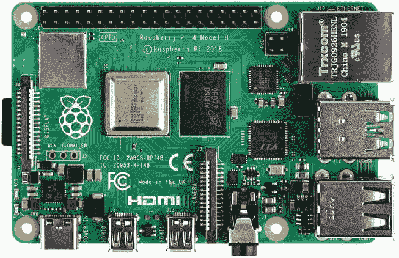
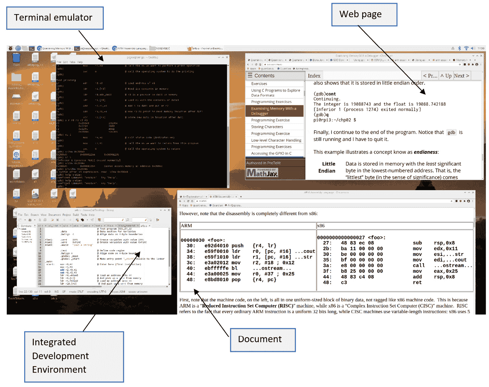
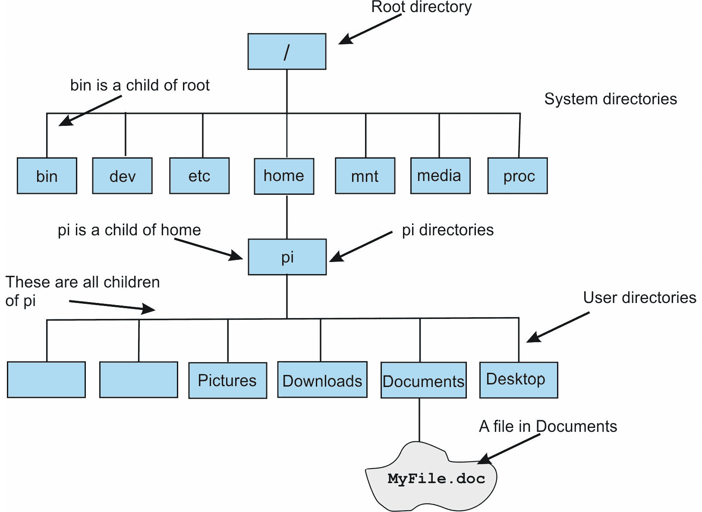
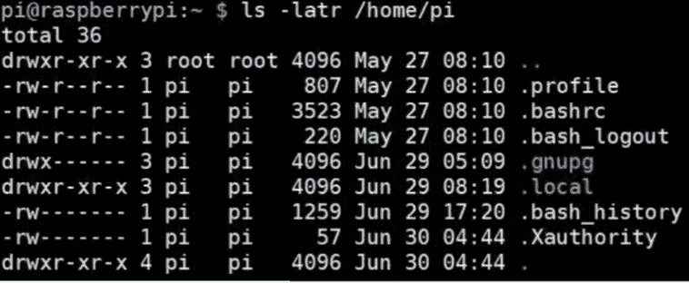
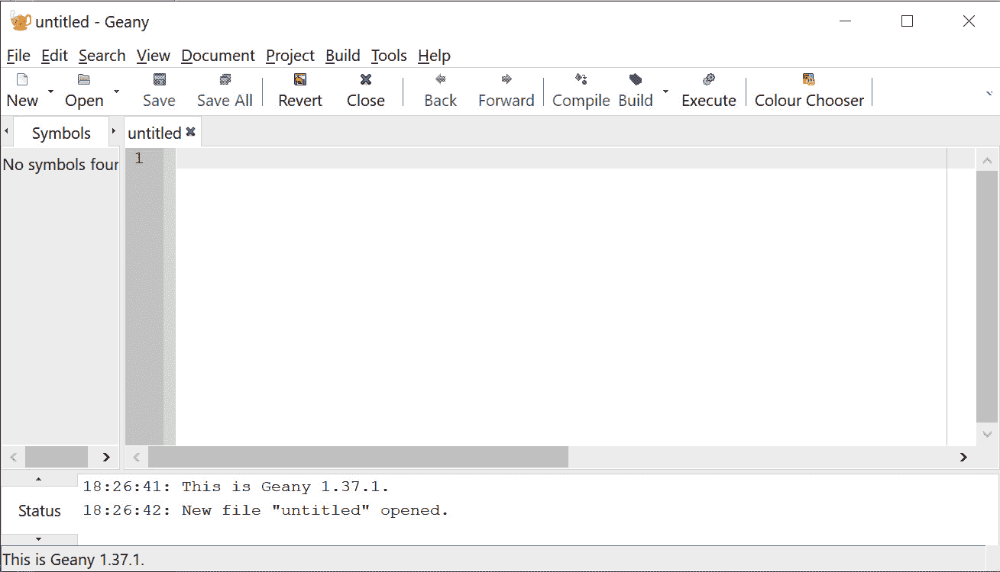
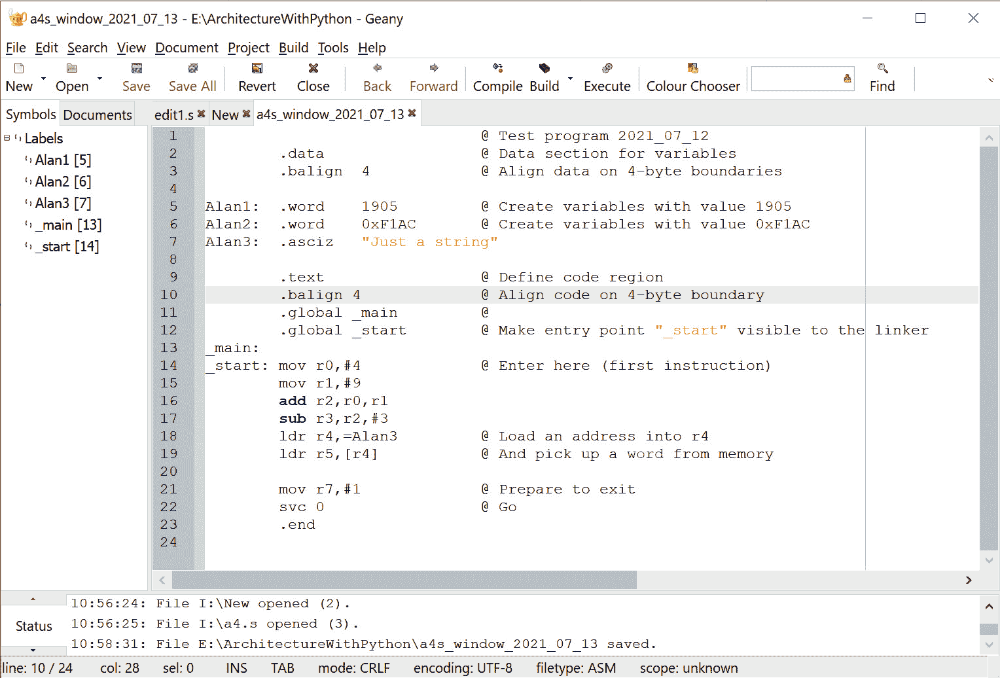
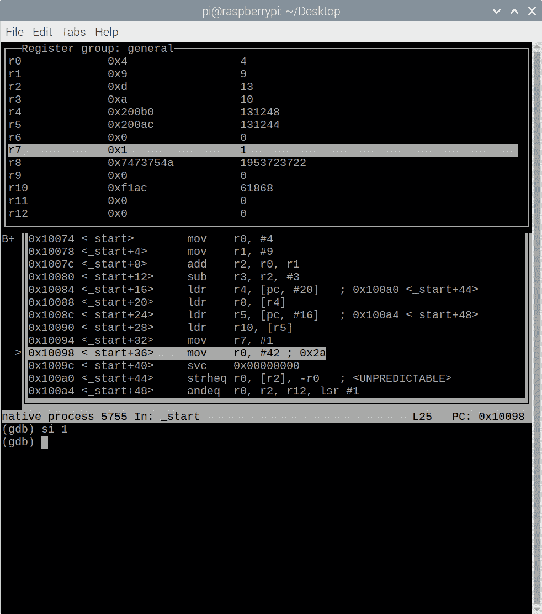
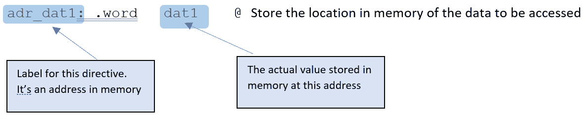
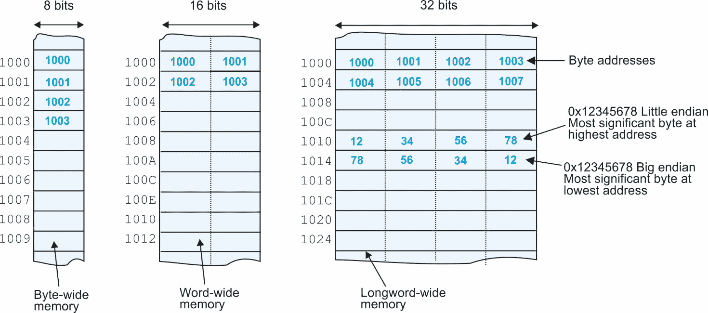

# 第九章：Raspberry Pi：简介

在前面的章节中，我们介绍了数字计算机并解释了其在指令集级别的操作。现在你将了解一个为教育目的而设计的真实、低成本计算机。

在本章中，我们介绍基于流行的 ARM 微处理器的 Raspberry Pi。我们描述了其指令集架构，并演示了如何使用它以调试模式运行汇编语言程序。本章的亮点如下：

+   Raspberry Pi 操作系统简介

+   使用 GCC ARM 汇编器和链接器

+   调试 ARM 汇编语言程序

这不是一本 Raspberry Pi 的手册。我们只对用它来编写汇编语言程序、运行它们并观察它们的行为感兴趣。我们不涵盖 Raspberry Pi 的 Windows 风格 GUI，因为它与相应的 PC 和 macOS 用户界面非常相似。此外，Raspberry Pi 操作系统包括实用程序和网页浏览器。

# 技术要求

本章基于 Raspberry Pi 4。我们使用的软件也应与早期的 3B 型号兼容。为了使用 Raspberry Pi，你需要以下设备：

+   Raspberry Pi 4（提供 2 GB、4 GB 和 8 GB DRAM）

+   Raspberry Pi 5V 3A 电源

+   USB 鼠标

+   USB 键盘

+   Wi-Fi 互联网连接

+   带有微型 HDMI 线的视频显示器

+   预装 NOOBS（32 GB Class 10 micro SD 卡）（见本节末尾的注释）

所有这些物品都可以在 Amazon 或 Raspberry Pi 供应商处购买。你可以将操作系统预装到微型 SD 卡上，或者下载操作系统并将其预装到自己的卡上，使用 PC 或 Mac。Raspberry Pi 网页 [`www.raspberrypi.org/`](https://www.raspberrypi.org/) 提供了关于此计算机的详细信息，包括入门、设置和将操作系统加载到自己的卡上。

文本是用 **NOOBS**（**新开箱即用软件**）编写的。Raspberry Pi 基金会不再支持 NOOBS，并建议你使用运行在 macOS、Windows 和 Ubuntu 下的 Raspberry Pi Imager 下载操作系统的最新版本。你可以在 [`www.raspberrypi.org/`](https://www.raspberrypi.org/) 找到必要的信息。

本书所使用的 ARM 代码是为在配备 32 位操作系统的 Raspberry Pi 上运行而设计的。

# Raspberry Pi 基础

微型计算机自 20 世纪 70 年代以来一直存在。在 20 世纪 70 年代，基于 Z80、6502 和 6809 8 位微处理器的几个针对爱好者的系统出现了。当时还没有操作系统、应用程序和互联网。

然后，在 20 世纪 70 年代末，Intel 推出了 8086，Motorola 推出了其 68000 16 位 CPU（实际上，68000 微处理器具有 32 位指令集架构，但 Motorola 最初将其作为 16 位机器进行营销。在我看来，这是一个灾难性的营销错误。16 位计算机相对于它们的 8 位前辈是一个巨大的飞跃，原因有两个。首先，技术进步，使得设计师能够在芯片上放置更多的电路（即，更多的寄存器、更强大的指令集等），其次，由于特征尺寸的减小（即，更小的晶体管），处理器速度更快。最后，内存成本的下降意味着人们可以运行更大、更复杂的程序。

在 20 世纪 60 年代，IBM 这家大型企业以其大规模数据处理机而闻名。然而，IBM 希望改变方向，IBM 的工程师决定围绕 Motorola 的 68000 处理器构建一台 PC。不幸的是，那个芯片的版本尚未投产。Intel 发布了 8088，这是其 16 位 8086 处理器的 8 位版本，具有 8 位数据总线，这使得使用 8 位外围设备和内存组件创建低成本微机变得容易。8088 仍然具有 16 位架构，但能够与 8 位内存和 I/O 设备接口。

IBM 与 Intel 建立了合作关系，并在 1981 年推出了所有米色系列的 IBM PC。与 Apple 不同，IBM 创建了一个开放架构，任何人都可以使用而不必支付版税。随后，数百万台 PC 克隆机应运而生。其余的都是历史。然而，PC 和 Apple 的 Mac 在市场上留下了一个空缺：一种超低成本的电脑，年轻人、学生、实验者和爱好者都可以玩。树莓派填补了这一空缺。

低成本计算已经存在很长时间了。只需几美元，你就可以买到一张当你打开时播放“生日快乐”的贺卡。高性能计算更昂贵。电脑的成本往往不在于处理器，而在于将微处理器转换为电脑系统所需的辅助组件和系统——特别是图形和显示接口、内存接口和通信接口（输入/输出）。这就是为什么树莓派如此成功的原因。在一块小巧、低成本的板上，你拥有创建一个与 PC 相当（尽管在性能方面不相上下）的完整系统所需的所有外围设备和接口。

要将板子变成一个功能齐全的微型计算机，你只需要一个低成本电源和与 PC 相同的鼠标和键盘。事实上，许多人使用从 PC 和其他他们放在那里的计算机中遗留的周边设备。我购买了一个 2 到 1 的 HDMI 切换器，将我的 4K 显示器连接到我的 PC 和 Raspberry Pi。你只需按下一个按钮，显示屏就会从 PC 切换到 Raspberry Pi。Raspberry Pi 使用开源操作系统，拥有大量的免费软件。不再需要为 Office 或 Photoshop 贷款。

Raspberry Pi 取得了卓越的成功，并迅速创造了一个庞大而热情的追随者群体。它在从幼儿园到博士的所有教育层次上都有应用。多年来，推出了 Raspberry Pi 的改进版本，以及真正最小化的版本，可以用几美元的价格作为专用嵌入式处理器使用。

*图 9.1* 展示了在撰写本书时使用的 Raspberry Pi 4。第一个 Raspberry Pi Model B 于 2012 年出现，具有 256 MB 的 DRAM、USB 端口和以太网，但没有无线通信。到 2019 年，Raspberry Pi 4 配备了 2 个 USB 2.0 和 2 个 USB 3.0 端口，板载 Wi-Fi 802.11ac、蓝牙 5 和千兆以太网，以及通过 2 个支持 4K 显示的 micro HDMI 端口的双显示器支持。RPi 4 的主要特点如下：

+   强大的 ARM CPU（四核 Cortex-A72 64 位架构）

+   音频（声音处理系统）

+   视频显示和图形逻辑系统（你只需将卡插入显示器）

+   DRAM 主存储器（2、4 或 8 GB）

+   带操作系统的非易失性闪存（通常不包括）

+   鼠标和键盘 USB 端口

+   Wi-Fi（2.4 和 5.0 GHz 频段）

+   蓝牙 5.0

+   以太网端口

+   一个通用 I/O 端口，可以直接与外部硬件接口



图 9.1 – Raspberry Pi 4（图片由 Laserlicht / Wikimedia Commons / CC BY-SA 4.0 提供）

Raspberry Pi 板通常不附带操作系统。它有一个微 SD 端口，你必须插入一个包含合适操作系统的内存卡。你可以购买一个已经安装了操作系统的卡，或者从网上下载一个免费可用的变体（使用你的 PC 或 Mac）并将其加载到卡上，然后插入 Raspberry Pi。

学术界计算机科学家使用的经典操作系统是 Unix，该系统于 20 世纪 60 年代末在 AT&T 的贝尔实验室开发，由包括 Ken Thomson 和 Dennis Ritchie（计算机科学史上两位最杰出的玩家）在内的团队开发。Unix 是第一个成为可移植的操作系统之一——也就是说，可以在不同类型的计算机上运行。

计算机科学史上的一个强有力线索是开源软件——即由一个个人社区开发的免费软件，如 Python 编程语言和 LibreOffice 应用程序包，后者提供了微软 Office 套件的大部分功能。

在 20 世纪 80 年代，由理查德·斯蒂尔曼领导的自由软件基金会推动了 GNU 操作系统的开发，该系统旨在提供 Unix 的开源版本。1991 年，林纳斯·托瓦兹发布了 GNU 的一个开源组件，即其内核，称为 Linux。

今天，Linux 内核加上 GNU 工具和编译器已成为 Windows 等专有操作系统的免费、开源替代品。GNU/Linux 有不同的风味（由不同组编写的具有相同基本结构但不同功能的发行版）。原始官方树莓派操作系统被称为*Raspbian*，基于为树莓派优化的 Debian Linux 版本。

Unix 和 Linux 以*命令行模式*运行——即操作系统指令以文本形式输入（就像微软的 DOS 一样）。现在，Unix、Linux 和 DOS 都有用户友好的图形输入，利用鼠标作为主要输入设备。其中最著名的是微软的 Windows 操作系统。

树莓派现在包括基于 Windows 的 Linux 版本和基于文本的命令行界面，用于调用汇编和执行 ARM 汇编语言程序所需的工具。本章提供了对树莓派 Linux 操作系统的简要介绍。

树莓派操作系统包括几个与本书非常相关的软件包。例如，Thonny Python IDE 为 Python 提供了一个**集成开发环境**（**IDE**），以及用于编辑、汇编、调试和运行 Python 程序的软件。

另一个有用的软件包是 Geany 编辑器，它内置了对 50 多种编程语言的支持。您可以在[`www.geany.org/`](https://www.geany.org/)获取 Geany。

还有一个终端模拟器窗口，允许您在 Linux 命令行模式下操作——当使用 ARM 汇编语言工具时，这是一个有用的功能。*图 9.2*显示了在 4K 显示器上打开多个窗口的树莓派屏幕。



图 9.2 – 树莓派多个窗口的截图

在编写这本书的过程中，我还接触到了 Visual Studio Code，这是一个编辑和调试平台。Visual Studio Code 是免费的，可在 Linux、macOS 和 Windows 平台上使用。*图 9.3*显示了使用 Visual Studio Code 编写 Python 程序的一个示例会话。


图 9.3 – 开发 Python 程序时的 VS Code 会话

我必须感谢 Graeme Harker 鼓励我使用 VS Code。如果我能早点发现 VS Code，我可能就会坚持使用它。

现在我们已经介绍了无处不在的 Raspberry Pi，它可以与鼠标、键盘和显示器一起组成一个计算机系统的基础，我们将介绍其操作系统。

然而，我们不会深入探讨。为了使用 Raspberry Pi 进入、运行和调试 ARM 汇编语言，您只需要了解操作系统的一些基本元素。此外，尽管 Raspberry Pi 有一个基于 Unix 的命令行操作系统，但它包括一个与 Windows 或 macOS 非常相似的图形界面。

# Raspberry Pi 操作系统基础

在本节中，您将学习如何使用 Raspberry Pi 创建 ARM 汇编语言程序，将其汇编成可执行的代码，然后在 Raspberry Pi 上运行它。在下一章中，我们将更深入地探讨 ARM 架构。

我们不会花太多时间讨论 RPi 的操作系统，因为世界上充满了专注于 Linux 的网站。我们将涵盖绝对最小内容，以帮助您使用一些可能有用的命令。大多数读者将使用图形界面进行编辑、网络搜索和运行 Python 等程序。我们将介绍 Linux 文件系统的基本概念以及用于组装和运行用 ARM 汇编语言编写的源文件的命令行指令。不幸的是，Unix/Linux 命令的名称并不直观。

*图 9**.4* 展示了 Linux 分层操作系统的基本概念，每个级别都有一个节点可以支持较低级别的*子节点*；例如，`Desktop`是`pi`节点的子节点。



图 9.4 – Raspberry Pi 文件结构

最高级文件夹是`/`，称为*根文件夹*。`/`反斜杠用于在文件系统中导航，与 Windows 的等效方式非常相似。Linux 和 Windows 之间的一大区别是，在 Linux 中，您不需要指定文件所在的磁盘（例如，Windows 始终使用`c:/`作为操作系统文件）。在*图 9**.4*中，`MyFile.doc`文件是一个文本文件，其位置是`/home/pi/Documents/MyFile.doc.`

## 目录导航

如果您按下回车键，Raspberry Pi 会响应一个“*我在这里*”提示，如本例所示：

`pi@raspberrypi:/var/log/apt $`

此提示显示了设备名称和当前目录的路径（在本例中以粗体字体显示）。您可以使用`cd`（*更改目录*）命令更改活动目录，如本例所示：

```py

cd ..         # This means change directory to parent (the node above)
cd home
cd pi
cd Desktop
```

要列出当前目录中的文件和子目录，您可以使用`ls`命令（*列出文件*）。

`ls -l /home/pi` 命令生成以下输出，显示权限（你可以做什么），大小和创建日期。*图 9*.*5* 展示了这个命令。



图 9.5 – Raspberry Pi 文件结构

`ls` 命令有多个选项；例如，`ls ~` 表示列出主目录中的内容。在 Linux 中，波浪号 `~` 表示主目录。同样，`ls –t` 表示按日期和时间创建的文件列表。

## 文件操作

现在我们介绍一些 Linux 的基本文件命令。`pwd` 命令看起来像应该意味着 *密码*。实际上，它意味着 *打印工作目录* 并显示当前目录的内容。这是一个“*我在哪里？*”命令。输入 `pwd` 将生成类似 `/home/pi` 的响应。

要创建一个新的子目录，你使用 `mkdir` 命令。输入 `mkdir newFolder` 将在当前目录下创建一个名为 `newFolder` 的子目录。

如果你输入 `mkdir /home/pi/newFolder`，它将在 `pi` 目录下创建一个子目录。

Linux 中比较容易混淆的命令名之一是 `cat`，它列出文件的内容。`cat` 的意思是 `catalog`；例如，`cat /home/pi/firstExample.txt` 将在控制台上以文本文件的形式显示 `firstExample.txt` 文件的内容。

要删除或*移除*一个文件，你使用 `rm`；例如，`rm tempData.py` 删除当前子目录中的 `tempData.py` 文件。你可以使用 `rm -r` 删除整个目录。这将删除当前目录且不可逆。这是一个危险的命令。另一种选择是 `rm –d`，它仅当目录为空时（即，你必须首先删除其内容）才会删除当前目录。

Linux 有一个帮助命令 `man`（即手册），它提供另一个命令的详细信息；例如，`man ls` 将提供 `ls` 命令的详细信息。

通常，当使用 Raspberry Pi 时，大多数用户都会使用图形界面。然而，我们将使用命令行输入来设置 Raspberry Pi 并组装、调试和执行汇编语言程序。

## 安装和更新程序和软件包

设置好 RPi 后，你需要维护它（即安装和更新软件）。以下两个命令检索新软件包并更新你的软件。偶尔运行它们以获取新更新是个好主意。注意，`sudo` 代表 *超级用户执行*，对于可能仅限于管理员操作的操作是必需的，因为如果不当使用可能会损害系统。术语 `aptget` 获取并安装软件包（`apt = Advanced Package Tool`）：

```py

sudo apt-get update        # Downloads the packages you have in your configuration source files
sudo apt-get upgrade       # Updates the packages
```

注意

`sudo apt-get update` 更新软件包但不安装它们。

要在 Raspberry Pi 上安装新软件包，你使用 `apt-get install` 命令；例如，

`sudo apt-get install vim` 安装 `vim` 编辑器软件包。

Linux 提供了一个关机命令，可以有序地结束会话：

`sudo shutdown -h now` 停止并进入挂起状态

`-h`参数表示*进入停止状态*，而`now`参数表示立即停止。关闭系统的命令是`sudo shutdown -r now`。要重启 Raspberry Pi，你可以输入以下两个命令中的任意一个。这些命令在单用户系统上具有相同的效果。在多用户系统上，你会使用`shutdown -r`：

```py

sudo shutdown -r now
```

```py
sudo reboot
```

然而，大多数 Raspberry Pi 用户将使用鼠标从其 GUI 关闭 Raspberry Pi。确实，只有在汇编、链接和调试汇编语言程序时才需要使用基于文本的输入模式。

你可以应用延迟关闭；例如，`sudo shutdown -h 30`将在 30 分钟后关闭 RPi。你可以使用，例如，`sudo shutdown -h 22:30`在特定时钟时间关闭，这将在大约晚上 10:30 关闭。可以通过`sudo shutdown -c`撤销（取消）延迟关闭命令。

## 创建和编辑汇编语言程序

在我们更详细地查看 ARM 处理器之前，让我们通过在 Raspberry Pi 上创建并执行 ARM 程序所需的步骤来了解一下。尽管我们还没有介绍 ARM 汇编语言，但我们使用的指令的动作是显而易见的。

首先，你必须以文本形式创建一个`.s`文件类型的汇编语言程序。有许多文本编辑器，你选择的编辑器是个人喜好。我最初使用 Geany，它是一个用于 C 语言等语言的 IDE。后来我在我的台式 PC 上使用了 Thonny。Geany 和 Thonny 都是优秀的工具。如果你在台式 PC（或任何其他设备）上创建一个文本文件，你只需将`.txt`扩展名更改为`.s`，使其与 RPi 的汇编器兼容。

*图 9**.6* 展示了初始的 Geany 屏幕：



图 9.6 – Geany 文本编辑器窗口

*图 9**.7* 展示了创建 ARM 汇编语言程序后的 Geany 窗口：


图 9.7 – Geany 窗口 – 注意到`add r3,r0,r1`是将`r0`加到`r1`上，并将和存储在`r0`中

在以下程序中，粗体字体的文本表示一个汇编器指令，它告诉汇编器有关程序的环境以及如何处理内存空间的分配：

```py

.section .text       @ .text indicates a region of code (not data)
.global _start       @ .global indicates that this label is visible to external objects
_start:              @ _start is the entry point to this program
   mov r0,#1         @ Load r0 with 1\. mov copies an 8-bit value into a register
   mov r1,#2         @ Load r1 with 2
   add r3,r0,r1      @ Add r0 and r1 and put result in r3
.end                 @ .end indicates the end of the program. It is optional
```

注意到 ARM 使用`mov`来加载一个字面量，而不是`ldr`（正如你可能预期的）。

## 汇编 ARM 代码

在我们能够深入查看 ARM 架构之前，我们将演示如何编写程序并运行它。基于 Debian 的 Raspberry Pi 操作系统包括 GCC，即*GNU 编译器集合*，它可以编译 C 程序和汇编语言程序。我们在这里不处理 C。

我们需要使用以下两个 GCC 命令来汇编源文件`myProg.s`文本：

```py

as –o myProg.o myProg.s
ld –o myProg myProg.o
```

第一个命令 `as` 会将汇编语言源文件 `myProg.s` 转换为目标代码文件 `myProg.o`。第二个命令 `ld` 会调用一个链接器，该链接器使用目标文件创建一个可执行的二进制代码文件 `myProg`，它可以被执行。`-o` 选项是构建输出文件所必需的。然后你可以通过输入 `./myProg` 来运行汇编的二进制代码程序。

虽然单个汇编语言程序可以被汇编成二进制代码，但程序通常是以模块（文件）的形式编写的，这些模块被组合在一起。这些文件可能由不同的程序员编写，甚至可能是库程序。它们被单独汇编成文件，然后链接器将这些文件组合起来创建最终的二进制代码，该代码可以被执行。在本文本中，我们没有充分利用链接器的功能；所有汇编语言程序都是单个文件。

在链接操作之后，会创建一个可执行的二进制程序。现在让我们输入以下内容：

`./myProg ;` `echo $?`

`myProg` 二进制代码被执行，并显示一条消息。在 Linux 中，分号允许将两个命令放在同一行上；这两个操作是 *执行程序* 和 *显示消息*。

`echo $?` 命令会打印出执行程序的输出信息。打印命令是 `echo`，而 `$?` 表示要打印的实际信息。在这种情况下，`$?` 命令返回的是上一个命令的退出状态。你也可以打印其他信息；例如，`$3` 会打印寄存器 `r3` 的内容。

注意，如果程序崩溃或进入无限循环（无响应），你可以输入 `control-C` 来退出并返回到操作系统级别。

## 汇编语言调试

我们现在将介绍 ARM 调试器，它允许你监控程序的执行并跟踪代码，就像我们在 *第六章* 和 *第七章* 的模拟器中所做的那样。

我们想要的是监控汇编语言程序执行的能力，这项任务我们在运行 Python 计算机模拟器时已经完成。我们可以使用一个名为 `gdb` 的调试器来完成这项任务，它是 GCC 编译器套件的一部分。考虑以下示例：

```py

as -g –o myProg.o myProg.s       # Assemble myProg.s Note the -g parameter
ld –o myProg myProg.o            # Link myProg.o to create source code myProg
```

```py
gdb myProg                       # Run the debugger
```

汇编器部分的 `-g` 参数会生成供后续 `gdb` 调试器使用的调试信息。

`gdb`是一个功能强大的工具，具有调试程序所需的设施。我们将只查看这些允许我们运行 ARM 汇编语言程序并逐行观察其执行的设施。我们首先列出一些`gdb`的命令。这些命令可以缩写；例如，`quit`命令可以输入为 q。在*表 9.1*中，我们将命令的必要部分用粗体表示，可以省略的部分用灰色表示，例如 quit。注意`next`和`step`之间的区别。这两个命令除了遇到*函数*时外是相同的。Step 跟踪函数中的所有操作，而 next 将函数视为一条单独的指令，并且不跟踪它。

当你将程序加载到`gdb`中时，似乎没有任何事情发生。如果你尝试查看你的汇编语言代码或寄存器，你会得到一个错误信息。你必须首先明确地运行程序。

| **命令** | **效果** |
| --- | --- |
| quit | 退出：离开 gdb 调试器并返回到 shell。Ctrl + D 也可以退出 gdb。 |
| list | 列出：列出正在调试的程序。 |
| run | 运行：执行程序。程序将运行至完成或遇到断点。 |
| break | 断点：执行遇到断点时停止。断点可以是行号、地址或标签。 |
| info r | 信息：显示寄存器。此命令显示寄存器内容。 |
| info b | 信息：显示断点。此显示断点。 |
| continue | 继续：在断点后恢复执行。 |
| delete | 删除：移除断点。输入`d <number>`以移除特定的断点。 |
| next | 单步执行（执行一条指令）。这不会跟踪函数。 |
| step | 单步执行包括函数中的所有操作。 |
| file <name> | 将二进制代码文件加载到 gdb 中进行调试。 |

表 9.1 – 基本 gdb 命令

让我们在树莓派上编写和调试一个 ARM 程序。我们还没有介绍 ARM 架构。你不需要对 ARM 了解很多，因为示例与我们在*第六章*中模拟的 RISC 架构相似。ARM 是一个 32 位计算机，具有 RSIC 架构；也就是说，它是一个加载/存储计算机，允许的唯一内存访问是加载和存储。数据操作使用三个操作数在寄存器之间进行——例如，`add r1, r2, r3`。ARM 有 16 个寄存器，`r0`到`r15`。寄存器`r0`到`r12`可以被视为通用寄存器（即，它们的行为方式相同）。寄存器`r13`、`r14`和`r15`具有特定的功能。

### 伪指令——一个关键概念

ARM 汇编器包括不是 ARM 的`clr` `r0`指令的一部分的**伪指令**，该指令将`r0`加载为`0`。可以设计一个伪指令`clr r0`，汇编器可以自动将其替换为`sub r0, r0`操作，它具有相同的效果。

伪指令使程序员的编程生活更轻松；例如，ARM 的`adr` r0,`abc`伪指令将 32 位地址 ABC 加载到`r0`。这样的指令并不存在；汇编器将 adr 替换为适当的 ARM 指令。

#### 一个 ARM 程序的示例

假设我们希望生成从 1 到 10 的数的立方和。以下 ARM 代码实现了这个算法。它还使用了 ARM 的四操作数*乘法和累加*指令`mla`：

```py

       mov   r0,#0           @ Clear the total in r0
       mov   r1,#4           @ FOR i = 1 to 4 (count down)
Next:  mul   r2,r1,r1        /* Square a number */
       mla   r0,r2,r1,r0     @ Cube the number and add to total
       subs  r1,r1,#1        @ Decrement counter (and set condition flags)
       bne   Next            @ END FOR (branch back on count not zero)
```

标签字段从第一列开始（如前述代码中加粗所示），提供用户定义的标签，必须以冒号结束。标签字段后面是包含操作和任何所需操作数的指令。在参数列表中逗号后面的空格数量无关紧要。`@`符号后面的文本是注释字段，由汇编器忽略。GCC 编译器还支持 C 语言风格的注释：由`/* */`字符分隔的文本，如本例所示。

*表 9.2*描述了 ARM 的一些指令。这里只有一个惊喜；`mla` *乘法和加法指令*指定了*四个*寄存器。它将两个寄存器相乘，然后加上第三个寄存器，并将和放入第四个寄存器中；也就是说，它可以计算`A = B +` `C.D`：

| **指令** | **ARM 助记符** | **定义** |
| --- | --- | --- |
| 加法 | `add` r0`,r1,r2` | [r0] ← [r1] + [r2] |
| 减法 | `sub` r0`,r1,r2` | [r0] ← [r1] - [r2] |
| AND | `and` r0`,r1,r2` | [r0] ← [r1] ∧ [r2] |
| OR | `orr` r0`,r1,r2` | [r0] ← [r1] ∨ [r2] |
| 独异或 | `eor` r0`,r1,r2` | [r0] ← [r1] ⊕ [r2] |
| 乘法 | `mul` r0`,r1,r2` | [r0] ← [r1] × [r2] |
| 寄存器到寄存器移动 | `mov` r0`,r1``mov` r0`,#0xAB` | [r0] ← [r1][r0] ← 0xAB 移动 8 位立即数 |
| 比较 | `cmp` r1`,r2` | [r1] – [r2] |
| 零分支到标签 | `beq label` | [PC] ← label (如果 z = 1 则跳转到标签) |
| 非零分支到标签 | `bne label` | [PC] ← label (如果 z = 0 则跳转到标签) |
| 乘法和加法 | `mla` r0`,r1,r2,r3` | [r0] ← [r1] x [r2] + [r3] |
| 从内存加载寄存器 | `ldr` r0`,[r1]` | [r0] ← [[r1]] |
| 将寄存器存储到内存 | `str r0,`[r1] | [[r1]] ← [r0] |
| 调用操作系统 | `svc 0` | 从操作系统请求操作 |

表 9.2 – ARM 数据处理、数据传输和比较指令

一些计算机在操作后总是更新条件码。ARM 在操作后不会自动更新其状态标志；您必须通过在适当的助记符后附加 s 来命令状态更新。例如，`add` r1`,r2,r3`执行加法而不更新状态标志，而`add`sr1`,r2,r3`则更新状态标志。这还不是程序。以下提供了在 Raspberry Pi 上运行所需的代码和汇编语言指令：

```py

        .global _start        @ Provide entry point
_start: mov   r0,#0           @ Clear the total in r0
        mov   r1,#10          @ FOR i = 1 to 10 (count down)
Next:   mul   r2,r1,r1        /* Square a number. Note the C style comment */
        mla   r0,r2,r1,r0     @ Cube the number and add to total
        subs  r1,r1,#1        @ Decrement counter (set condition flags)
        bne   Next            @ END FOR (branch back on count not zero)
        mov   r7,#1           @ r7 contains 1 to indicate a leave request
        svc   #0              @ Call operating system to exit this code
```

我们添加了一个汇编语言指令 `.global`，它将 `_start` 标签声明为在此代码片段外部是 *可见的*。GCC 链接过程将分别汇编的模块链接在一起，并在代码中插入标签的适当地址。

通过将标签声明为全局的，你是在告诉链接器这个标签对其他模块是可见的，它们可以引用它。没有全局指令的标签是当前模块的局部变量，对其他所有模块不可见；也就是说，你可以在两个模块中使用相同的标签，而不会发生冲突。

`_start` 标签表示执行开始的点。链接器和操作系统处理将程序存储在内存中的问题；也就是说，你不必担心它将在计算机的物理内存中实际存储在哪里。

最后，最后两个操作（阴影部分）提供了一种在代码执行后返回操作系统级别的手段。ARM 有一个 `svc` 指令，代表 *服务调用* 并用于调用操作系统。大多数计算机都有一个类似于 `svc` 的操作，并且它有许多名称——例如，*软件中断*。这个指令调用操作系统并传递一个或多个参数。参数可以是指令本身的一部分，也可以被加载到寄存器中。当操作系统检测到服务调用时，会读取参数并执行适当的操作。这一行为完全取决于系统；也就是说，它是操作系统的一部分，而不是计算机架构的一部分。

在这种情况下，服务调用所需的具体函数已预先加载到 `r7` 寄存器中。这种机制是 Raspberry Pi 操作系统的一部分。

关于汇编语言程序需要注意的关键点如下：

+   注释由 `@` 符号（或 C 语言的 `/* */` 书签）开头

+   汇编指令由点号开头

+   标签从第一列开始，并以冒号结束

+   可以使用 `.end` 指令来终止汇编语言（这是可选的）

+   `.global` 指令提供了一个表示程序入口点的标签

## 使用 Raspberry Pi 调试器

我们现在可以运行一个 ARM 汇编语言程序，并使用 gdb 逐行观察其执行。当你将程序加载到 gdb 中时，似乎没有发生任何事情。如果你尝试查看你的汇编语言代码或寄存器，你会得到一个错误消息。你必须首先明确运行程序。

考虑到 *图 9**.8* 中的代码片段。这是程序加载到 Geany 编辑器后的截图。它只是一组指令和指令，旨在演示创建和测试汇编语言程序所涉及的步骤。在这里，我们使用 Geany 编辑器。该程序演示了以下汇编语言指令：

+   `.data`    定义了一个存储变量和常数的内存区域。

+   `.text` 定义了一个代码区域（即汇编语言）。

+   `.word` 允许你在内存中存储一个数字，并给该位置一个符号地址。

+   `.balign` 在 4 字节边界上对齐代码和文本。由于指令是 32 位，因此是必需的。

+   `.asciz` 在内存中创建一个以零终止的 ASCII 文本字符串，并给它一个名称。

+   `.global` 使标签对链接器可见。否则，它是此模块的私有标签。

`balign` 操作是必需的，因为内存是按字节寻址的，ARM 指令是 4 字节长。因此，指令地址必须是 0、4、8、12、16、20 等等。如果你在指令之间放置不是 4 字节（32 位）倍数的内存数据元素，程序将会崩溃。`balign` 指令用零填充你存储的任何数据，以确保下一个空闲地址在 4 字节边界上。

注意，*图 9**.8* 中的代码使用了*伪指令*。指令 `ldr r4`,=Alan3` 将 32 位文字 `Alan3` 装载到 `r4` 中。汇编器将自动替换执行此操作所需的 ARM 代码。

下一步是汇编和链接代码，我们称之为 a4.s（我厌倦了输入长名称，将源程序命名为 a4.s）。我们可以用以下方式完成：

```py

pi@raspberrypi:~ $ cd Desktop                     # Change to Desktop directory
pi@raspberrypi:~/Desktop $ as -g -o a4.o a4.s     # Assemble the program a4.s
pi@raspberrypi:~/Desktop $ ld -o a4 a4.o          # Now link it to create executable
pi@raspberrypi:~/Desktop $ ./a4 ; echo $?         # Run the executable program a4
```

粗体文本是我的输入。这些行将工作目录更改为桌面，我的源程序就在那里，然后汇编和链接源程序。最后一行，`./a4 ; echo $?` 运行程序并打印其返回值（通过打印 `4`，即 `r0` 中的值）来显示它已被成功执行。



图 9.8 – Geany 编辑器中的演示程序

以下四行演示了如何调用 gdb 调试器并设置断点。粗体字体的文本表示从键盘输入的行。其他文本是调试器的输出：

```py

pi@raspberrypi:~/Desktop $ gdb a4
Reading symbols from a4...done.
(gdb) b _start
Breakpoint 1 at 0x10074: file a4.s, line 14.
```

通过输入 b <breakpoint> 来设置断点，其中断点是行号或标签。这里，它是 _start。如果我们运行代码，它将执行到断点为止的指令。接下来的几行如下：

```py

(gdb) run
Starting program: /home/pi/Desktop/a4
Breakpoint 1, _start () at a4.s:14
14    _start: mov r0,#4             @ Enter here (first instruction)
```

注意，你可以通过输入 `c`（即继续）从断点继续执行，执行将继续到下一个断点。

输入运行命令后，调试器开始执行并打印下一行要执行的指令 – 即，由 _start 标记的行。gdb 指令 i r（寄存器信息）显示 ARM 寄存器如下：

```py

(gdb) i r
r0             0x0                 0
r1             0x0                 0
r2             0x0                 0
r3             0x0                 0
r4             0x0                 0
r5             0x0                 0
r6             0x0                 0
r7             0x0                 0
r8             0x0                 0
r9             0x0                 0
r10            0x0                 0
r11            0x0                 0
r12            0x0                 0
sp             0xbefff390          0xbefff390
lr             0x0                 0
pc             0x10074             0x10074 <_start>
cpsr           0x10                16
```

```py
fpscr          0x0                 0
```

`cpsr` 和 `fpscr` 都是状态寄存器，包含有关处理器状态的信息。

所有寄存器都由系统软件自动初始化为零，除了 r13、r15（`sp, pc`）和两个状态寄存器。我们现在可以开始跟踪代码，使用 `s 1` 步进命令逐条执行指令。您可以简单地按 `enter` 键来跟踪下一个指令，如下面的输出所示。如果您输入 si 2（或 s 2），则会执行两条指令：

```py

(gdb) si 1
15            mov r1,#9
(gdb)
16            add r2,r0,r1
(gdb)
17            sub r3,r2,#3
(gdb)
18            ldr r4,=Alan3         @ Load an address into r4
(gdb)
19            ldr r5,[r4]           @ And pick up a word from memory
```

让我们使用 `i r` 命令查看寄存器。我们已从列表中删除了未更改的寄存器，以使其更容易阅读。寄存器内容以十六进制和十进制格式给出：

```py

(gdb) i r
r0             0x4                 4
r1             0x9                 9
r2             0xd                 13 Note: r2 is expressed in hex and decimal
r3             0xa                 10
r4             0x200a0             131232
r5             0x0                 0
pc             0x10088             0x10088 <_start+20> Note: 20 bytes from start
```

最后，我们将继续逐步执行，直到代码执行完毕。您只需在第一个 `si 1` 命令之后使用 *enter* 键即可逐步执行：

```py

(gdb) si 1
21            mov r7,#1             @ Prepare to exit
(gdb)
22            svc 0                 @ Go
(gdb)
```

```py
[Inferior 1 (process 1163) exited with code 04]
```

gdb 执行了移动和系统调用指令并退出了模拟。我们学到了什么？这个例子演示了以下内容：

+   如何创建 ARM 汇编语言程序

+   如何汇编和链接

+   如何将其加载到 gdb 调试器中

+   如何设置断点并运行代码，直到达到断点

+   如何在任何程序点显示寄存器的内容

+   如何逐行执行代码

### 跟踪执行和显示内存

调试器的一个重要功能是能够在执行程序时逐步执行代码并显示寄存器。这允许您跟踪程序的执行并检测错误。gdb 调试器通过其 `layout regs` 功能实现这一功能。

*图 9**.9* 展示了具有三个面板的 TUI 示例。上面的窗口是寄存器窗口（已更改的寄存器被突出显示；在这种情况下，是 `r7`）。中间面板显示程序代码，下一个要执行的指令被突出显示。每一行都包括代码的内存地址，以十六进制形式表示，以及从 `start` 标签的距离。

注意，代码在我的最后一条指令 `svc` 之后继续执行。这是因为反汇编器读取一块内存并将其显示为代码（即使它不是您的程序的一部分）。在这种情况下，我们使用 `.word` 指令在内存中输入的数据被读取并显示为相应的 ARM 指令。请记住，调试器不知道内存中的二进制值是指令还是用户数据。如果它读取与指令操作码相对应的数据值，它会打印出该操作码。

反汇编的指令以十六进制形式显示其在内存中的地址；例如，第一条指令位于 `0x10074`。这个地址由 Raspberry Pi 的操作系统确定。如您所见，每个指令的地址比前一个指令大 4 个字节，因为 ARM 是一个 32 位机器，具有 32 位或 4 字节的指令；因此需要对齐指令，强制下一个指令或数据放置在特定的边界上。

最低面板包含您输入的命令。在这种情况下，我使用了 `si 1` 来逐步执行指令。



图 9.9 – 显示寄存器和内存内容的 TUI

让我们看看汇编语言程序及其调试的另一个示例。这个例子仅用于演示目的。它没有任何有用的功能。我们的目的是演示在 GCC 汇编器和 gdb 调试器下运行的 ARM 汇编语言程序的功能。*表 9.3*给出了 GCC 的一些最常见汇编指令。

| **GCC** **汇编指令** | **操作** |
| --- | --- |
| .text | 指示包含代码的程序段 |
| .data | 指示包含数据的程序段 |
| .global `label` | 使标签对链接器可见 |
| .extern `label` | 使标签在文件外部可见 |
| .byte`byte1,byte2, …` | 定义 1 个或多个字节的数据并将其存储在内存中 |
| .hword`hw1,hw2, …` | 定义 1 个或多个 16 位半字并将其存储在内存中 |
| .word`w1,w2, …` | 定义 1 个或多个 32 位字并将其存储在内存中 |
| .space `bytes,fill` | 使用给定的值填充内存块（例如，`.fill` `64`,`0xFF`） |
| `.`balign 4 | 将下一个地址对齐到 4 字节边界（也可以使用 2、4、8 和 16） |
| .ascii `"``any string"` | 在内存中存储 ASCII 字符串 |
| .asciz `"``any string"` | 在内存中存储一个以 0 结尾的 ASCII 字符串 |
| .equ`symbol, value` | 将符号名称与其值等价（例如，`.equ` `hours 24`） |
| .end | 标记程序的结束 |

表 9.3 – GCC ARM 汇编器指令

我们对程序的一些功能进行了更详细的解释；这些功能的形式为`@ PRINT` `STRING @`：

```py

                                @ Test function calls and memory access
         .text                  @ Program (code) area
         .global  _start        @ Provide entry point and make it known to linker
         .equ     v1,0xAB       @ Test equate directive
_start:   mov     r0,#23        @ Just three dummy operations for debugging
          mov     r1,#v1        @ ARM assembler uses # to indicate a literal
          add     r2,r0,r1
```

#### @ 在控制台上打印字符串 @

```py

          ldr     r1, =banner   @ Test display function (this is a pseudo-instruction)
          mov     r2,#15        @ Number of characters to print 13 plus two newlines)
          mov     r0,#1         @ Tell the OS we want to print on console display
          mov     r7,#4         @ Tell the OS we want to perform a print operation
```

```py
          svc     0             @ Call the operating system to do the printing
```

#### @ 使用地址 @

```py

          adr     r3,v3              @ Load address of v3 into register r3 (a pseudo-instruction)
          ldr     r4,[r3]            @ Read contents of v3 in memory
                                     @ Read from memory, increment and store in next location
          ldr     r0,adr_dat1        @ r0 is a pointer to dat1 in memory
          ldr     r1,[r0]            @ Load r1 with the contents of dat1
          add     r2,r1,#1           @ Add 1 to dat1 and put in r2
          add     r3,r0,#4           @ Use r3 to point to next memory location after dat1
          str     r2,[r3]            @ Store new data in location after dat1
```

#### @ 程序退出 @

```py

          mov     r0,#0              @ Exit status code (0 indicates OK)
          mov     r7,#1              @ Tell the OS we want to return from this program
          svc     0                  @ Call the operating system to return
```

#### @ 地址向量 @

```py

adr_dat1: .word   dat1               @ Generate an address for dat1 in the memory area
v2:       .word   0xFACE             @ Dummy data
banner:   .ascii "\nTest printing\n" @ String to print. Note newlines "\n"
                                     @ This string has 15 characters (13 ASCII two newlines)
          .balign 4                  @ Align data (0 inserted because the string is 15 chars)
v3:       .word   0x1111             @ Dummy test data
          .space  4,0xAB             @ Reserve 8 bytes of storage and fill with 0xAB
          .word   0x2222
          .data                      @ Data segment
test:     .word 0xbbbb
dat1:     .word 0x1234
          .end                       @ End of this program
```

这段代码说明了几个要点——例如，使用汇编指令如`.equ`，将符号名称绑定到值。我已经用阴影标记了有趣的代码块，以便我们可以讨论它们。

我们使用了 ARM 的伪指令。这些是`adr r3`,v3`和`ldr r1`,=banner`。这两个指令都将 32 位地址加载到寄存器中。这样的指令并不存在。ARM 汇编器选择实际的指令来执行所需操作。

#### @ 打印字符串 @

第一个示例演示了如何从汇编程序中打印数据。实际上，我们无法打印数据，但我们可以请求操作系统为我们完成。大多数处理器都有一个名为*软件中断*（或系统调用、陷阱、异常或*额外代码*）的指令。所有这些术语都指同一件事：程序员插入的指令，用于调用操作系统。在 ARM 的情况下，它是 svc 指令（以前称为 swi）。当 Linux 使用时，这个指令使用参数`0`——即`svc 0`。

系统调用完全依赖于操作系统，并通过在寄存器中传递参数来告诉操作系统它需要什么。我们将打印一串字符到显示设备。Raspberry Pi OS 需要将字符串在内存中的位置传递到寄存器 r1，打印的字符数传递到寄存器`r2`，显示类型传递到`r0`，以及要执行的操作（打印）传递到`r7`。

需要打印的文本地址`banner`通过`ldr r1,=banner`指令加载到寄存器`r1`中。这个伪指令通过`=<address>`指定一个地址。在程序中，我们使用了`.ascii`指令将打印的字符串存储在内存中。字符串以`\n`结尾，对应于换行符。请注意，换行符的代码是 1 字节，虽然在程序中用`\n`表示。除非内存中存储的字符串或其他数据项是 4 字节的倍数，否则你必须跟一个`.balign 4`来确保下一个指令落在字边界上。

#### @ 使用 ADR @

第二个示例演示了使用`adr`伪指令与`adr r3,v3`。我们将把一个名为`v3`的变量的地址加载到寄存器`r3`中，并通过`.word`指令将其加载到内存中。一个实际考虑是，当你反汇编代码时，你将看不到`adr`；你将看到 ARM 汇编器将其转换成的实际代码。

将`v3`变量的地址放入寄存器意味着我们可以使用该寄存器作为指针，并通过加载指令使用它；例如，`ldr r4,[r3]`将变量的值（即`0x1111`）加载到`r4`中。如果你希望修改该变量，你可能认为可以用`str r5,[r3]`将其存储回内存。遗憾的是不行！`adr`指令生成的代码只允许你访问程序的当前段。该段是只读的，因为它包含代码。你无法更改该段中的内存。如果你希望修改内存，你必须使用不同的技术，正如我们很快将看到的。

#### @ 程序退出 @

在汇编语言程序执行完成后，需要返回到操作系统级别。将退出代码`1`加载到寄存器`r7`中，并执行`svc 0`指令来调用操作系统。按照惯例，程序员在退出之前将他们的退出代码加载到寄存器 r0 中。退出代码`0`通常用来表示一切顺利，而退出代码`1`表示出现了问题。

#### @ 地址向量 @

你不能使用 `adr` 伪指令将数据写入与程序代码部分位于不同段的读写内存。这种困境存在于所有代码开发系统中，并不仅限于 ARM GCC 环境。ARM 处理器将允许你在逻辑地址空间内的任何位置读取内存和写入内存。然而，ARM *操作系统* 不允许你写入只读内存区域或其他禁止区域。技巧是创建一个指向变量的指针，并将该指针存储在代码段中。

考虑以下汇编指令。这个指令将 32 位的 `dat1` 值存储在内存中的 `adr_dat1` 位置。按照惯例，一些程序员通过在其名称前加上标记（通常是 `adr`）来表示一个项是一个指针（即地址）。这并不是一个规则，而是一种惯例：



图 9.10 - 创建指向数据值的指针

我们创建了一个名为 `adr_dat1` 的名称，它是我们目标变量的 *地址* 的地址。存储的值是实际变量的地址，`dat1`。因此，当我们写入指令 `ldr r0,adr_dat1` 时，`dat1` 的 *地址* 被加载到寄存器 `r0` 中。也就是说，寄存器 `r0` 现在指向 `dat1`。

在以 `.data` 为标题的数据部分，我们有以下内容：

```py

dat1:     .word 0x1234   @ The value 0x1234 is stored in memory at address dat1
```

这将 `0x1234` 值存储在内存中，并给它命名为 `dat1`。正如我们所见，该名称用于通过以下方式在代码部分创建变量的地址：

```py

adr_dat1: .word   dat1
```

下一步是运行代码。我们已经这样做，并在 *列表 9.1* 中提供了一个会话的编辑输出（删除操作之间的空提示行和一些文本）：

```py

pi@raspberrypi:~ $ cd Desktop
pi@raspberrypi:~/Desktop $ as -g -o t1a.o t1a.s
pi@raspberrypi:~/Desktop $ ld -o t1a t1a.o
pi@raspberrypi:~/Desktop $ gdb
GNU gdb (Raspbian 8.2.1-2) 8.2.1
(gdb) file t1a
Reading symbols from t1a...done.
(gdb) b _start
Breakpoint 1 at 0x10074: file t1a.s, line 7.
(gdb) r 1
Starting program: /home/pi/Desktop/t1a 1
Breakpoint 1, _start () at t1a.s:7
7    _start: mov     r0,#23        @ Just three dummy operations for debugging
(gdb) si 1
8            mov     r1,#v1
9            add     r2,r0,r1
11           ldr     r1,=banner   @ Test display function (r1 has address of a string)
12           mov     r2,#15        @ Number of characters to print 13 plus two newlines)
13           mov     r0,#1         @ Tell the OS we want to print on console display
14           mov     r7,#4         @ Tell the OS we want to perform a print operation
15           svc     0             @ Call the operating system to do the printing
Test printing
17           adr     r3,v3         @ Load address of v3
18           ldr     r4,[r3]       @ Read its contents in memory
21           ldr     r0,adr_dat1   @ r0 is a pointer to dat1 in memory
22           ldr     r1,[r0]       @ Load r1 with the contents of data1
23           add     r2,r1,#1      @ Add 1 to dat1 and put in r2
24           add     r3,r0,#4      @ Use r3 to point to next memory location after dat1
25           str     r2,[r3]       @ Store new data in location after dat1
(gdb) i r r0 r1 r2 r3
r0           0x200e8             131304
r1           0x1234              4660
r2           0x1235              4661
r3           0x200ec             131308
(gdb) si 1
28          mov    r0,#0           @ Exit status code (indicates OK)
29          mov    r7,#1           @ Tell the OS we want to return from this program
30          svc    0               @ Call the operating system to return
(gdb) x/2xw 0x200e8
0x200e8:    0x00001234    0x00001235
(gdb) si 1
[Inferior 1 (process 7601) exited normally]
```

列表 9.1 – 调试会话

## 访问内存

我们已经展示了如何逐条执行程序并显示寄存器的内容。例如，gdb 允许你使用 `i r r0 r1 r2 r3` 命令显示寄存器 `r0` 到 `r3` 的内容。现在我们将演示如何显示内存位置的内容。

在 *列表 9.1* 中，我们逐条执行代码的前几条指令（内存访问和存储操作），然后在第 25 行之后，我们可以看到 `dat3` 变量的地址是 `0x200e8`。假设我们想检查其值是否为 `0x1234`，以及下一个字位置 4 字节之后的 `0x2008c` 包含 `0x1235` 值。

你可能会合理地期望读取内存位置的 `gdb` 命令是 `m` `0x200c`。如 *列表 9.1* 所示，命令相当难以记忆：

```py

x/2xw 0x2208    Read the contents of two memory locations
```

内存访问命令是 `x/`，并且需要三个参数：2xw。这些如下：

+   `2`   要显示的内存位置数量。

+   `x`   数据的格式。`x` 表示十六进制。

+   `w`   数据的宽度（字节数）。`w` 表示 4 字节的 32 位字。

可用的格式如下：

+   `o`   八进制

+   `d`   十进制

+   `x`   十六进制

+   `u`   无符号整数

+   `s`   字符串

+   `b`   字节

数据显示大小如下：

+   `b`   字节

+   `h`   半字（16 位）

+   `w`   字（32 位）

+   `g`   双字（8 字节或 64 位的大字）

考虑以下示例：

+   `x/1xw 0x1234`   在地址 `0x1234` 以十六进制形式打印一个 4 字节字

+   `x/6xh 0x1234`   在地址 `0x1234` 以十六进制形式打印六个 2 字节值

+   `x/3db 0x1234`   在地址 `0x1234` 以十进制形式打印三个单字节值

+   `x/9sb 0x1234`   在地址 `0x1234` 以字符串形式打印九个单字节字符

在下一节中，我们将更详细地探讨 ARM GCC 汇编器。例如，我们将介绍控制程序内存分配的 ARM 汇编指令。

# GCC ARM 汇编器的特性

我们将从这个部分开始，看看如何为常量和变量保留内存空间。我们已经看到，ARM 汇编语言中的字面量前面有一个 `#` 符号。数字默认为十进制，除非前面有 `0x` 前缀，表示十六进制——例如，`mov r0,#0x2C`。ASCII 字符使用单引号表示，如下例所示：

```py

      cmp   r0,#'A'            @ Was it a letter 'A'?
```

两个重要的汇编指令是 `.equ`，它将一个名称绑定到一个值，以及 `.word`，它允许你在程序运行之前预加载内存中的数据。`.equ` 指令非常容易理解；它将一个数值绑定到一个名称。考虑以下示例：

```py

      .equ  Tuesday, 2
```

这个汇编指令将名称 `Tuesday` 绑定到值 `2`。每次你写入 `Tuesday`，汇编器都会将其替换为 `2`。GCC ARM `.word` 汇编指令为常量和变量保留内存空间；也就是说，它声明了一个变量（或常量）并初始化它。考虑以下示例：

```py

      .equ    Value1,12        @ Associate name Value1 with 12
      .equ    Value2,45        @ Associate name Value2 with 45
      .word   Table,Value1     @ Store the 32-bit word 12 in memory at address Table
      .word   Value2           @ Store the word 45 in memory
      .word   Value2 + 14      @ Store  45 + 14 = 59 in memory (you can use expressions)
```

`.word` 指令在内存中保留一个 32 位字（即 4 字节）的存储空间，并将 `.word` 右侧的表达式得到的值加载到该位置。在这种情况下，我们将 `Value1` 绑定到数字 `12`，因此二进制值 `00000000000000000000000000001100` 将存储在这个位置。下一个使用的内存位置是下一个空闲位置（即存储指令按顺序存储数据在内存中）。

*位置计数器* 前进了四个字节，以便下一个 `.word` 或指令将放置在内存中的下一个字。*位置计数器* 指的是程序汇编时内存中下一个位置的指针，在概念上与程序计数器相似。

你不必在 ARM 程序中使用 32 位值。`.byte` 和 `.hword` 汇编指令分别将一个字节和一个 16 位半字存储在内存中，如下例所示：

```py

Q1:    .byte        25                  @ Store the byte 25 in memory
Q2:    .byte        42                  @ Store the byte 42 in memory
Tx2:   .hword       12342               @ Store the 16-bit halfword 12,342 in memory
```

虽然你可以使用 `.byte` 在内存中存储文本字符串，但这会很笨拙，因为你必须查找每个字符的 ASCII 值。GCC ARM 汇编器提供了一个更简单的机制。`.ascii` 指令接受一个字符串，并将每个字符作为连续内存位置中的 8 位 ASCII 编码的字节存储。`.asciz` 命令执行相同的功能，但插入一个全零的 8 位二进制字节作为终止符：

```py

Mess1: .ascii    "This is message 1"    @ Store string memory
Mess2: .asciz    "This is message 2"    @ Store string followed by 0
       .balign  4                       @ Align code on word boundary
```

因为 ARM 将所有指令对齐到 32 位单词边界，所以需要 `.balign 4` 指令来对齐下一个单词边界（4 表示 4 字节边界）。换句话说，如果你在内存中存储三个 8 位字符，`.balign 4` 命令会跳过一个字节，迫使下一个地址达到 32 位边界。请注意，`.balign 2` 强制对齐到半字边界（你可以使用 `.balign 16` 或任何其他 2 的幂，以强制下一次内存访问适当地对齐）。

下面的 ARM 代码演示了存储分配和 `.balign 4` 指令的使用：

```py

        .global  _start                 @ Tell the linker where we start from
        .text                           @ This is a text (code) segment
_start: mov     r0,#XX                  @ Load r0 with 5 (i.e., XX)
        mov     r1,#P1                  @ Load r1 with P1 which is equated to 0x12 or 18 decimal
        add     r2,r0,r1                @ Just a dummy instruction
        add     r3,r2,#YY               @ Test equate to ASCII byte (should be 0x42 for 'B')
        adr     r4,test                 @ Let's load an address (i.e., location of variable test)
        ldr     r5,[r4]                 @ Now, access that variable which should be 0xBB)
Again:  b       Again                   @ Eternal endless loop (terminate here)
       .equ     XX,5                    @ Equate XX to 5
       .equ     P1,0x12                 @ Equate P1 to 0x12
       .equ     YY,'B'                  @ Equate YY to the ASCII value for 'B'
       .ascii   "Hello"                 @ Store the ASCII byte string "Hello"
       .balign  4                       @ Ensure code is on a 32-bit word boundary
       .ascii   "Hello"                 @ Store the ASCII byte string "Hello"
       .byte    0xAA                    @ Store the byte 0xAA in memory
test:  .byte    0xBB                    @ Store the byte 0xBB in memory
       .balign  2                       @ Ensure code is on a 16-bit halfword boundary
       .hword   0xABCD                  @ Store the 16-bit halfword 0xABCD in memory
last:  .word    0x12345678              @ Store a 32-bit hex value in memory
       .end
```

让我们在 Raspberry Pi 上使用 gdb 汇编、链接和运行此代码。终端窗口的前几行显示了程序的加载、设置断点和单步执行模式：

```py

pi@raspberrypi:~ $ cd Desktop
pi@raspberrypi:~/Desktop $ as -g -o labels.o labels.s
pi@raspberrypi:~/Desktop $ ld -o labels labels.o
pi@raspberrypi:~/Desktop $ gdb labels
GNU gdb (Raspbian 8.2.1-2) 8.2.1
Reading symbols from labels...done.
(gdb) b _start
Breakpoint 1 at 0x10054: file labels.s, line 3.
(gdb) run 1
Starting program: /home/pi/Desktop/labels 1
Breakpoint 1, _start () at labels.s:3
3    _start: mov     r0,#XX             @ Load r0 with 5 (i.e., XX)
(gdb) si 1
4            mov     r1,#P1             @ Load r1 with 0x12 (i.e., P1)
5            add     r2,r0,r1           @ Dummy instruction (r2 is 5+0x12=0x17)
6            add     r3,r2,#YY          @ Dummy instruction (r3 is 0x17+0x42=0x59)
7            adr     r4,test
8            ldr     r5,[r4]
Again () at labels.s:9
9    Again:  b       Again              @ Eternal endless loop (enter control-C to exit)
```

到目前为止，一切顺利。让我们看看寄存器中有什么。我们删除了不感兴趣的寄存器行，以使输出更易于阅读：

```py

(gdb) i r
r0             0x5                 5
r1             0x12                18
r2             0x17                23
r3             0x59                89 Note 0x59 = 0x17 + 0x42
r4             0x1007e             65662
r5             0xabcd00bb          2882339003
pc             0x1006c Current pc     0x1006c <Again>
```

寄存器 `r0` 到 `r3` 包含我们预期的内容（`r3` 中的 `0x17` 加上 `'B'` 的 `0x42` 代码，即 `0x59`）。

寄存器 r4 包含 `0x1007e`，这是名为 `test` 的数据的地址（即，`0xBB`）在内存中。该地址用于将 `0xBB` 常量加载到 `r5` 中，现在 `r5` 包含 `0xABCD00BB`，而不是我们预期的 `0x000000BB`。出了什么问题？

问题在于 `ldr` 从内存中将 32 位值加载到寄存器中。`0xABCD00` 是 `0xBB` 后面的单词加上由于 `.balign 2` 语句引起的空字节。我们应该使用特殊的 *“加载一个字节”* 指令，加载四个字节并将三个字节清零，或者在内存中正确对齐字节。计算机的巨大优势在于它会按照你的指示去做。唉，它的巨大弱点是……它 *完全* 按照你的指示去做。

接下来，我们使用 `x/7xw 0x1006c` 命令查看内存中存储的数据，该命令以十六进制形式显示从地址 `0x1006c` 开始的 `7` 个单词的内存（我们从寄存器转储中的 `pc` 获取了该地址）。记住，是 ARM 的操作系统最初设置了程序计数器：

```py

(gdb) x/7xw 0x1006c
0x1006c <Again>:    0xeafffffe 0x6c6c6548 0x0000006f 0x6c6c6548
0x1007c <Again+16>: 0x00bbaa6f 0x5678abcd 0x00001234
```

我们也可以使用 `x/28xb 0x1006c` 来查看存储在内存中的数据，它以十六进制形式显示从地址 `0x1006c` 开始的 `7` 个单词（4 x 7 = 28 字节）的内存：

```py

(gdb) x/28xb 0x1006c
0x1006c <Again>:      0xfe   0xff   0xff   0xea   0x48   0x65   0x6c   0x6c
0x10074 <Again+8>:    0x6f   0x00   0x00   0x00   0x48   0x65   0x6c   0x6c
0x1007c <Again+16>:   0x6f   0xaa   0xbb   0x00   0xcd   0xab   0x78   0x56
0x10084 <last+2>:     0x34   0x12   0x00   0x00
```

*图 9**.10* 提供了一个内存映射，展示了内存的分配情况。粗体的十六进制地址是 4 字节单词边界。你可以看到 `.balign` 指令如何在内存中插入零作为填充，以形成所需的边界。

在下一节中，我们将探讨现代计算机设计的关键方面之一——如何将 32 位值加载到 32 位字长的计算机寄存器中：

```py

000000010070     48             ASCII H start of the sequence Hello
000000000071     65             ASCII e
000000000072     6C             ASCII l
000000000073     6C             ASCII l
000000000074     6F             ASCII o
000000000075     00             Padded zero due to align
000000000076     00             Padded zero due to align
000000000077     0              Padded zero due to align
000000010078     48             ASCII H
000000000079     65             ASCII e
00000000007A     6C             ASCII l
00000000007B     6C             ASCII l
00000000007C     6C             ASCII o
00000000007D     0xAA           Byte 0xAA
00000000007E     0xBB           Byte 0xBB
00000000007F     00             Padded zero due to align
000000000080     0xAB           First byte of 0xABCD
000000000081     0xCD           Second byte of 0xABCD
```

图 9.10 – 分配数据到内存 – 内存映射

接下来，我们将探讨影响所有计算机的一个困境：如何加载与指令字大小相同的常量（立即数）？

# 处理 32 位立即数

在这里，你将学习 ARM 如何使用 32 位指令加载 32 位立即数。立即数不能与操作码组合，就像我们在模拟器中所做的那样。我们将演示 ARM 如何使用几种技术使用 32 位指令来访问 32 位立即数。

ARM 有 32 位数据字和指令。你无法在一个指令中将 32 位立即数加载到 ARM 寄存器中，因为你无法在一个指令中同时指定操作和数据。CISC 处理器将两个或更多指令链接在一起；例如，一个 16 位机器可能需要 2 个指令字来创建一个包含 16 位操作和 16 位立即数的 32 位指令。一些处理器使用一个指令加载 16 位立即数（加载高位），然后使用第二个指令加载第二个 16 位立即数（加载低位）。然后计算机将高位和低位 16 位值连接成一个 32 位立即数。

ARM 有两种伪指令可以将 32 位值加载到寄存器中，允许汇编器生成执行此操作所需的实际代码。伪指令`adr`（加载地址）的格式为`adr rdestination,label`，其中`label`表示程序中的一行（地址）。`adr`允许汇编器生成适当的机器代码，并减轻程序员的某些*家务*。`adr`使用 ARM 的`add`或`sub`指令与*PC 相对寻址*来生成所需的地址。程序计数器相对寻址通过其与当前指令的距离来指定地址。以下代码片段演示了`adr`的使用：

```py

          adr    r0,someData    @ Setup r1 to point to someData in memory
          ldr    r1,[r0]        @ Read someData using the pointer in r0
          .        .
someData: .word  0x12345678     @ Here's the data
```

伪指令`adr` r0,`someData`使用汇编器生成的适当代码将 32 位地址`someData`加载到寄存器`r0`中。通常你不需要知道汇编器如何生成实现`adr`的实际代码。 

另一个有用的 ARM 伪指令是`ldr r1`,=value`。在这种情况下，编译器生成的代码允许寄存器 r1 加载指定的值，如下例所示：

```py

      ldr r2, =0x12345678       @ Load a 32-bit literal into r2
```

这将 1234567816 加载到 r2 中。如果汇编器能够做到，它将使用`mov`或`mvn`指令。ARM 的异常*移动*`not`指令接受一个 8 位立即数，反转位，并将其移动到寄存器。例如`MVN r1,#0xF0`将`0x0F`复制到 r1。或者，汇编器使用`ldr r2,[pc,#offset]`指令来访问存储在内存中某个所谓的*立即数池*或*常量池*中的适当常量 1234567816。立即数池是嵌入在代码中的一或多个数据项。

让我们看看 GCC 汇编器开发系统如何处理伪指令。考虑以下代码片段：

```py

        .text
        .global _start
_start: ldr    r0,=0x12345678   @ Load r0 with a 32-bit constant
        adr    r1,Table1        @ Load r1 with the address of Table1
        adr    r2,Table2        @ Load r2 with the address of Table2
        ldr    r3,[r1]          @ Load r3 with data in Table1
        ldr    r4,[r2]          @ Load r4 with data in Table2
        ldr    r5, =0xAAAAAAAA  @ Load r5 with a 32-bit constant
wait:   mov    r0,#0            @ Goodbye message
        mov    r7,#1            @ Goodbye command in r7
        svc    0                @ Call operating system to return
Table1: .word  0xABCDDCBA       @ Dummy data
Table2: .word  0xFFFFFFFF
```

以下是一个 gdb 调试会话的编辑输出。代码已执行完成，寄存器内容如下。右侧列显示十进制形式的数据：

```py

r0             0x0                 0
r1             0x10078             65656
r2             0x1007c             65660
r3             0xabcddcba          2882395322
r4             0xffffffff          4294967295
r5             0xaaaaaaaa          2863311530
pc             0x10074             0x10074 <wait+8>
```

指针寄存器 `r1` 和 `r2` 已加载了内存中两个数据元素的地址（即，Table1 和 Table2）。这些指针已被用来检索这两个元素，你可以从调试器中看到操作是成功的。

以下调试输出提供了代码的反汇编。这不是所写的代码。汇编器已将三个伪操作转换为实际的 ARM 代码（粗体字体）：

```py

Dump of assembler code from 0x10054 to 0x10086:
   0x00010054 <_start+0>:    ldr    r0, [pc, #36]    ; 0x10080 <Table2+4>
   0x00010058 <_start+4>:    add    r1, pc, #24
   0x0001005c <_start+8>:    add    r2, pc, #24
   0x00010060 <_start+12>:   ldr    r3, [r1]
   0x00010064 <_start+16>:   ldr    r4, [r2]
```

```py
   0x00010068 <_start+20>:   ldr    r5, [pc, #20]    ; 0x10084 <Table2+8>
```

第一次加载指令将寄存器 `r0` 从当前程序计数器内存的 36 个字节处加载数据。在那个位置，汇编器存储了要加载的 `0x12345678` 常量。

两个 `adr` 操作通过添加 pc 和内存中数据之间的距离来生成一个地址。这被称为 *程序计数器相对寻址*，我们将在稍后更详细地探讨它。

让我们看看内存中的数据。我们使用 `x/6xw 0x10080` gdb 命令从地址 `0x10080` 显示六个字的内存：

```py

(gdb) x/6xw 0x10080
0x10080 <Table2+4>:    0x12345678    0xaaaaaaaa    0x00001141    0x61656100
0x10090:               0x01006962    0x00000007
```

这显示了在程序之后加载到内存中的 `0x12345678` 常量，以及我们加载的其他常量。

## 关于字节序的说明

我们还没有提到一个主题 - *字节序*。这个术语是从 *格列佛游记* 中借用的，在那里世界被分为那些从大端吃煮鸡蛋的人和那些从小端吃鸡蛋的人。这把世界分成了相互敌对的大端序者和小端序者（当然，这是讽刺）。

计算机做类似的事情。假设你在内存中存储了 32 位的十六进制值 `0x12345678`。如果你在字内存中存储它，其中每个字的地址相差 1，那么生活就会很简单。但是因为计算机内存是 *字节组织* 的，每个内存位置都有一个独立的字节地址，所以连续的字节地址是 `0,1,2,3,4,5,6…`，而连续的字地址是 `0,4,8,12,16,20,24…`。

字节寻址的一个后果是，字 0 占据字节地址 0,1,2,3。假设我们在地址 0 存储了 `0x12345678`。我们首先放哪个数字的端？它是存储在字节 0 到 3 作为 `12 34 56 78`，还是作为 `78 56` `34 12`？

*图 9**.4* 展示了三个内存系统。在所有三种情况下，内存都是字节寻址的。在 32 位版本中，我们在地址 c 和 `0x1014` 存储了代表 `0x12345678` 的两个 32 位值。注意存储的字的各个字节有不同的字节地址。小端序数字的安排使得最高有效字节 `0x12` 存储在字的最低地址 `0x1010`。大端序数字存储时，最高有效字节存储在最低地址 `0x1013`。



图 9.11 – 内存组织

有些计算机是大端字节序，有些是小端字节序。摩托罗拉微处理器是大端字节序，英特尔是小端字节序。ARM 最初是小端字节序，但现在它在 CPSR 状态寄存器中有一个位可以用来选择所需的字节序版本。默认情况下，ARM 是小端字节序。

字节序重要吗？有两种方式很重要。如果你正在构建系统或与具有混合字节序的系统进行接口，那么它很重要，因为当你将字节从一个系统传递到另一个系统时，你必须确保字节顺序是正确的。例如，TCP/IP 协议是大端字节序。同样，如果你在对数据进行字节和字操作，你必须意识到字节地址和字地址之间的关系。如果你将 ASCII 字符串“Mike”存储在字地址 `0x1000`，并且你想要“e”，在大端系统中它将是 `0x1000`，而在小端系统中它将是 `0x1003`。

## 将一切组合在一起 – 一个最终示例

为了结束本章，我们提供了一个使用 Raspberry Pi 进入 ARM 汇编语言并使用 gdb 在调试模式下运行的最终示例。与之前一样，此示例不执行有用的功能。其目的是演示寻址模式、使用汇编指令在内存中加载数据、字节序的性质以及声明变量并在内存中修改它们的能力。

此示例还演示了如何显示内存数据以及如何使用内存显示功能来读取数据。我们在调试过程中使用了 gdb 并复制了各种屏幕。以下将这些内容组合在一起。我们删除了一些材料（例如，状态寄存器和未访问的寄存器），并对格式进行了轻微编辑以提高可读性。

### 源程序

源程序在内存中设置数据并访问它。我们在演示中使用了 ASCII 文本和数字文本。请注意，使用 GCC 汇编器，ASCII 字符串或字符需要双引号。我们还使用 ldrb 读取字节，使用 ldrh 读取半字（16 位）。

程序使用 `ldrb r5,[r3,#1]` 来演示从 r5 的字基址开始的 32 位字中读取字节。

程序包含存储在内存中的虚拟数据，例如 `0xAAAAAAAA`。我们这样做是为了演示数据是如何存储的，但主要是为了帮助调试。当你显示内存中的数据内容时，这些虚拟值提供了很好的标记，帮助你读取内存数据。

注意，我们在读写内存中访问的字 testRW 位于 .data 部分。它被初始化为 `0xFFFFFFFF`，后来被修改：

```py

        .global _start
_start: adr     r0,mike        @ r0 points to ASCII string "Mike"
        ldr     r1,[r0]        @ Read the string into r1
        ldrb    r2,[r0,#3]     @ Read byte 3 of "Mike"
        adr     r3,test        @ Point to data value 0x2468FACE in memory
        ldrb    r4,[r3]        @ Read single byte of test. Pointer in r0
        ldrb    r5,[r3,#1]     @ Read single byte 1 offset
        ldrh    r6,[r3]        @ Read halfword of test
        ldr     r7,a_adr       @ r7 points at address of testRW
        ldr     r8,=0x12345678 @ r8 loaded with 32-bit literal 0x12345678
        str     r8,[r7]        @ Store r8 in read/write memory at testRW
        ldrh    r9,[r7]        @ Read halfword of testRW
        mvn     r10,r9         @ Logically negate r9
        strh    r10,[r7,#4]    @ Store halfword in next word after testRW
        nop                    @ Just a place to stop
        mov     r0,#1          @ Raspberry Pi exit sequence
        mov     r7,#7
        svc     0
mike:   .ascii  "Mike"         @ Store string as 4 ASCII characters
test:   .word   0x2468FACE     @ Save a word in memory
a_adr:  .word   testRW         @ Pointer to data in read/write memory
        .data                  @ Data section in read/write memory
nines:  .word   0x99999999     @ 0x99999999 Just dummy data
testRW: .word   0xFFFFFFFF     @
        .word   0x77777777     @ More dummy data
        .word   0xBBBBBBBB     @ More dummy data
```

```py
        .end
```

第一步是汇编和加载程序（称为 endian）并调用 gdb 调试器。我们使用粗体字来表示来自键盘的输入：

```py

alan@raspberrypi:~/Desktop $ as g o endian.o endian.s
alan@raspberrypi:~/Desktop $ ld o endian endian.o
alan@raspberrypi:~/Desktop $ gdb endian
GNU gdb (Raspbian 10.11.7) 10.1.90.20210103git
```

我们可以使用 gdb 在 `_start` 处设置断点，然后运行程序到该断点：

```py

(gdb) b _start
Breakpoint 1 at 0x10074: file endian.s, line 2.
(gdb) r
Starting program: /home/alan/Desktop/endian
Breakpoint 1, _start () at endian.s:2
2    _start: adr     r0,mike   @ r0 points to ASCII string "Mike"
```

让我们看看实际加载到内存中的程序。它与我们所写的程序略有不同，因为伪操作已被实际代码所取代。请注意，`adr` 被翻译成 `add` 指令，通过将程序计数器与所需变量的距离相加，以生成其地址。

`ldr r8,=0x12345678` 被翻译成一条加载程序计数器相对指令，因为所需的常量已在程序结束之后加载到内存中：

```py

(gdb) disassemble
Dump of assembler code for function _start:
=> 0x00010074 <+0>:     add    r0, pc, #60    ; 0x3c
   0x00010078 <+4>:     ldr    r1, [r0]
   0x0001007c <+8>:     ldrb   r2, [r0, #3]
   0x00010080 <+12>:    add    r3, pc, #52    ; 0x34
   0x00010084 <+16>:    ldrb   r4, [r3]
   0x00010088 <+20>:    ldrb   r5, [r3, #1]
   0x0001008c <+24>:    ldrh   r6, [r3]
   0x00010090 <+28>:    ldr    r7, [pc, #40]   ; 0x100c0 <a_adr>
   0x00010094 <+32>:    ldr    r8, [pc, #40]   ; 0x100c4 <a_adr+4>
   0x00010098 <+36>:    str    r8, [r7]
   0x0001009c <+40>:    ldrh   r9, [r7]
   0x000100a0 <+44>:    mvn    r10, r9
   0x000100a4 <+48>:    strh   r10, [r7, #4]
   0x000100a8 <+52>:    nop                    ; (mov r0, r0)
   0x000100ac <+56>:    mov    r0, #1
   0x000100b0 <+60>:    mov    r7, #7
   0x000100b4 <+64>:    svc    0x00000000
```

```py
End of assembler dump.
```

这与我们所写的代码不同，因为伪操作已被实际的 ARM 代码所取代。请注意，`adr` 被翻译成 `add` 指令，通过将程序计数器与所需变量的距离相加，以生成其地址。

`ldr r8,=0x12345678` 被翻译成一条加载程序计数器相对指令，因为所需的常量已在程序结束之后加载到内存中。

让我们看看内存。以下显示了从 `0x100b4` 开始的 8 个连续字的内存内容，这是 `svc 0` 指令的地址。

在继续执行程序之前，我们将查看程序设置的内存内容。这些数据在哪里？它遵循最后一个可执行指令 `svc 0`，该指令的地址为 `0x000100B4`。我们以十六进制格式显示 `svc` 指令中的八个字：

```py

(gdb) x/8wx 0x100b4
0x100b4 <_start+64>:    0xef000000    0x656b694d    0x2468face    0x000200cc
0x100c4 <a_adr+4>:      0x12345678    0x99999999    0xffffffff    0x77777777
```

您可以看到汇编器加载的 `0x12345678` 常量和一些标记。

我们将逐步执行前几条指令：

```py

(gdb) si 1
3          ldr   r1,[r0]       @ Read the string into r1
4          ldrb  r2,[r0,#3]    @ Read byte 3 of "Mike"
6          adr   r3,test       @ Point to data value 0x2468FACE in memory
```

下一步是查看程序运行完成之前的寄存器状态。我们使用 gdb 的 `i r` 命令来完成此操作。目前没有太多可看的内容（这是一个部分列表），因为我们只执行了前几条指令。然而，`r0` 现在包含指向地址 `0x100B8` 的 ASCII 文本字符串 *“Mike”* 的指针。如果您查看该地址，您会看到它包含 `0x656b694d`，这是 `ekiM`。这就是小端序的作用！

```py

(gdb) i r
r0             0x100b8             65720
r1             0x656b694d          1701538125
r2             0x65                101
r3             0x0                 0
r4             0x0                 0
sp             0x7efff360          0x7efff360
lr             0x0                 0
```

```py
pc             0x10080             0x10080 <_start+12>
```

继续单步执行：

```py

(gdb) si 1
7          ldrb    r4,[r3]          @ Read byte of test Pointer in r0
8          ldrb    r5,[r3,#1]       @ Read single byte 1 offset
9          ldrh    r6,[r3]          @ Read halfword of test
11         ldr     r7,a_adr         @ r7 points at address of testRW
12         ldr     r8,=0x12345678   @ r8 loaded with 32-bit 0x12345678
(gdb) i r
r0             0x100b8             65720
r1             0x656b694d          1701538125
r2             0x65                101
r3             0x100bc             65724
r4             0xce                206
r5             0xfa                250
r6             0xface              64206
r7             0x200cc             131276
sp             0x7efff360          0x7efff360
lr             0x0                 0
pc             0x10094             0x10094 <_start+32>
```

让我们看看数据段的内存。寄存器 `r7` 指向读写数据区域。它位于 `testRW` 指针之前 4 个字节处，在 `r7` 中；即 `0x200CC - 4 = 0x200C8`。从该地址开始的四个字如下：

```py

(gdb) x/4xw 0x200c8
0x200c8:    0x99999999    0xffffffff    0x77777777    0xbbbbbbbb
```

最后，我们逐步执行指令，直到遇到最后的 `nop` 指令：

```py

(gdb) si 1
13          str    r8,[r7]       @ Store r8 in read/write memory at testRW
14          ldrh   r9,[r7]       @ Read halfword of testRW
15          mvn    r10,r9        @ Logically negate r9
16          strh   r10,[r7,#4]   @ Store halfword in next word after testRW
```

```py
17          nop                  @ Just a place to stop
```

让我们最后看看寄存器的状态：

```py

(gdb) i r
r0             0x100b8             65720
r1             0x656b694d          1701538125
r2             0x65                101
r3             0x100bc             65724
r4             0xce                206
r5             0xfa                250
r6             0xface              64206
r7             0x200cc             131276
r8             0x12345678          305419896
r9             0x5678              22136
r10            0xffffa987          4294945159
sp             0x7efff360          0x7efff360
lr             0x0                 0
pc             0x100a8             0x100a8 <_start+52>
```

这里是我们对数据内存的最终查看。注意，`0xFFFFFFFF` 已被替换为我们写入内存的值 `0x12345678`。这展示了如何使用 ARM 访问数据内存。

还要注意 `0x200D0` 处的数据值；即 `0x7777a987`。我们使用半字加载更改了半个字：

```py

(gdb) x/4xw 0x200c8
0x200c8:    0x99999999    0x12345678    0x7777a987    0xbbbbbbbb
```

# 摘要

在本章中，我们介绍了一台真正的计算机，树莓派。我们不是设计自己的计算机指令集，而是查看树莓派和大多数智能手机核心中的 ARM 微处理器。

我们介绍了 Raspberry Pi 的基础知识，并展示了如何编写可以在其上运行的 ARM 汇编语言程序。这需要理解 ARM 汇编器和链接器的使用。我们演示了如何使用 gdb 调试器逐条指令运行您的 ARM 程序。

我们遇到的一个重要的 Raspberry Pi 架构特点是内存中数据修改的方式。您不能使用 str（存储）指令来修改内存中的数据。您必须通过指向您想要更改的内存地址的指针间接地完成。以下简短的程序演示了这一关键点。内存中的数据项直接使用 `ldr` 读取，但在内存中使用指向指针来修改。关键操作以粗体显示：

```py

         .text           @ Code section
         .global _start
_start:  ldr r1,=xxx     @ Point to data xxx
         ldr r2,[r1]     @ Read the data
         adr r3,adr_xxx  @ Point to the address of the address of xxx
         ldr r4,[r3]     @ Point to the data xxx
         ldr r5,[r4]     @ Read the value of xxx
         add r5,r5,#1    @ Increment the data
         str r5,[r4]     @ Change xxx in memory
         mov r0,#0       @ Exit procedure
         mov r7,#1
         svc 0
adr_xxx: .word           @ Pointer to data xxx
         .data           @ Data section
xxx:     .word  0xABCD   @ Initialize variable xxx
         .end
```

为了演示 ARM 程序，我们介绍了 ARM 的汇编语言。幸运的是，这并不太远离一些模拟器所采用的编程语言。实际上，ARM 的汇编语言并不难学，尽管它确实包含了一些非常有趣的特点，这些特点我们将在后面的章节中描述。

在下一章中，我们将回到 ARM 架构及其最重要的方面之一：寻址以及数据如何从内存中传输到和从内存中传输出来。
