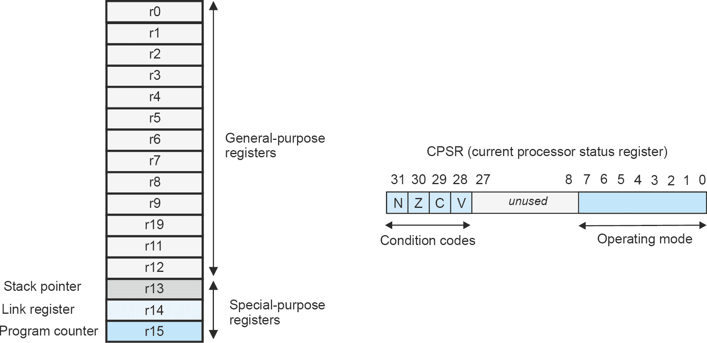
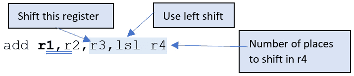
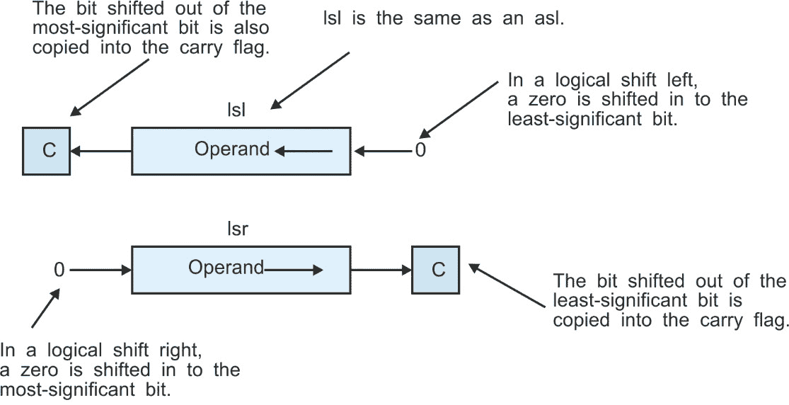
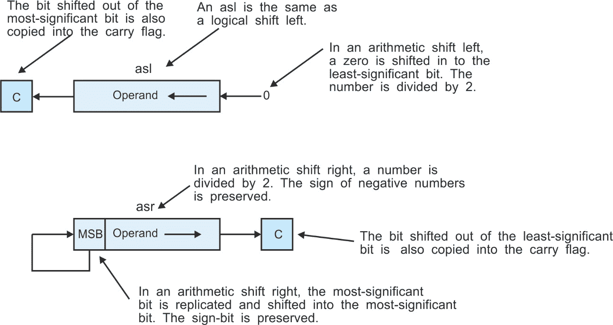
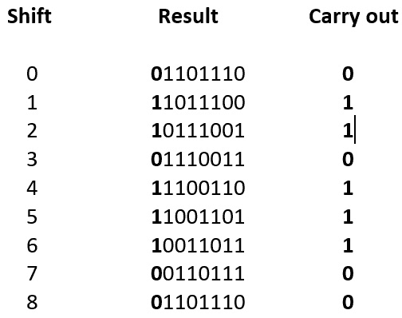
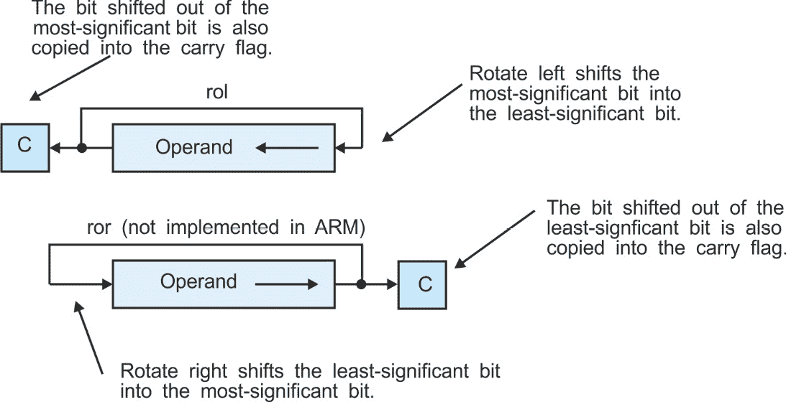
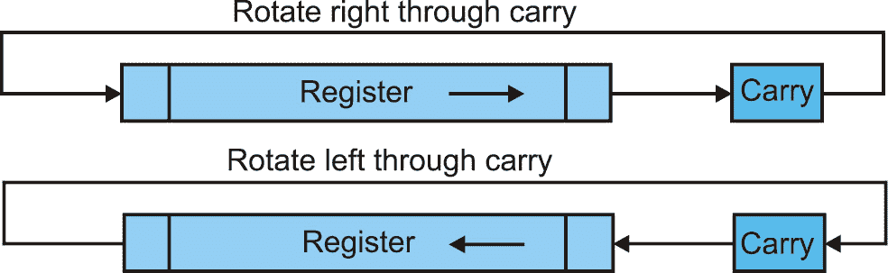

# 10

# 深入了解 ARM

我们已经介绍了 ARM 处理器。现在，我们将更深入地研究它。ARM 处理器系列可能是教授计算机架构的最佳工具。特别是，由于它的指令集精简和与许多其他微处理器相比的简单寄存器模型，它非常容易学习。此外，ARM 还有一些非常有趣的功能，例如，当一条指令可以根据处理器状态执行或忽略时，预测执行。计算机教育中引入树莓派恰逢其时，因为它使学生能够亲身体验引人注目的 ARM 架构。

在本章中，我们将做以下几件事：

+   介绍 ARM

+   描述其寄存器集

+   检查加法和减法操作的变化

+   涵盖 ARM 的乘法指令

+   介绍逻辑操作和移位操作

+   解释流程控制和 ARM 的条件执行

# 技术要求

因为这一章节是前一章的扩展，所以不需要新的硬件或软件。你只需要配置为通用计算机的树莓派。所需的唯一软件是一个文本编辑器来创建汇编语言程序，以及 GCC 汇编器和加载器。

# 介绍 ARM

ARM 处理器系列是一个引人注目的成功故事，不仅仅是因为许多其他微处理器在几年内变得流行，然后又逐渐消失在人们的视野中（例如，6502、Cyrix 486 和安腾）。在其发布时，摩托罗拉的 68K 被认为比英特尔 8086 更加优雅和强大。事实上，68K 在 8086 还是 16 位机器的时候，就已经是一个真正的 32 位机器了。68K 被苹果的 Mac、雅达利和 Amiga 电脑所采用——它们都是家用电脑市场的主要玩家。那么英特尔的 8086 如何可能与之竞争呢？好吧，IBM 选择了 8086 系列作为其新型个人电脑，其余的就是历史了。后来，摩托罗拉退出了半导体业务。

在 20 世纪 80 年代末，一家名为 Advanced RISC Machines 的新公司成立，旨在创建高性能微处理器。它们的机器架构遵循 RISC 架构的寄存器到寄存器范式，而不是英特尔和摩托罗拉更复杂的 CISC 指令集。ARM 应运而生。

ARM 不仅在与许多早期微处理器失败时幸存下来，而且还繁荣发展，并成功地将目标对准了移动设备的世界，如上网本、平板电脑和手机。ARM 集成了许多有趣的架构特性，使其在竞争对手中具有竞争优势。

事实上，ARM 是一家无晶圆厂公司——也就是说，它开发计算机架构，并允许其他公司制造这些计算机。术语“无晶圆厂”来源于“fab”（制造的首字母缩写）。

在我们描述 ARM 指令之前，我们将讨论其寄存器集，因为所有 ARM 数据处理指令都操作于其寄存器的内容（RISC 计算机的一个主要特性）。

由于 ARM 的架构在多年中不断发展，并且因为正在使用不同版本的 ARM 架构，因此 ARM 的教师面临一个问题。应该使用哪个版本来展示计算机架构课程？在本章中，我们将使用具有 32 位指令的 ARMv4 32 位架构。一些 ARM 处理器可以在 32 位和 16 位指令状态之间切换（16 位状态称为 *Thumb* 状态）。Thumb 状态旨在在嵌入式控制系统中运行非常紧凑的代码。我们在这里不会介绍 Thumb 状态。

Raspberry Pi 4 中的 ARM 拥有与早期 32 位 ARM 非常不同的 64 位架构。然而，由于 32 位 ARM 架构被大多数教学文本所采用，并且 Raspberry Pi 4 支持 32 位架构，因此我们在这里将使用 32 位架构。为了与其他使用 ARM 来说明计算机架构的书籍保持一致，这里的大部分材料都是基于 ARMv4T 32 位架构。ARM 的 32 位架构现在被称为 AArch32，以区别于 ARM 的新 64 位架构，AArch64。

# ARM 架构概述

ARM 的架构很有趣，因为它结合了传统的 CISC 架构（如摩托罗拉的 68K 和英特尔 32/64 位架构）的元素，以及像 MIPS 和 RISC-V 这样的处理器更激进的精简 RISC 架构。

在这里，我们将检查以下内容：

+   ARM 的寄存器集

+   算术指令

+   特殊加法和减法指令

+   乘法和 ARM 的乘法与加法指令

+   位操作指令

+   移位操作

我们在这里不详细覆盖数据移动操作。我们已经遇到了可以用来将立即数加载到寄存器的 `mov` 操作，例如，`mov r1,#12`。同样，`str` 和 `ldr` 指令分别从内存中加载寄存器和将寄存器存储到内存中。一个典型的例子是 `ldr r4,[r5]` 和 `str r0,[r9]`。这两个指令使用 *寄存器间接寻址*，我们将在下一章中详细介绍。

## ARM 寄存器集

与拥有 32 个通用寄存器的流行 MIPS 处理器不同，ARM 只有 16 个寄存器，`r0` 到 `r15`，以及一个 *状态寄存器*。值得注意的是，ARM 的寄存器并不完全相同——也就是说，有些是专用寄存器。*图 10**.1* 展示了 ARM 的寄存器集。



图 10.1 – ARM 的寄存器集

四个寄存器，`r0` 到 `r13`，在真正意义上是通用的，因为它们都以相同的方式工作——例如，你可以用 `r5` 做的事情，用 `r10` 也可以做。寄存器 `r13`、`r14` 和 `r15` 不是通用的，因为它们有额外的功能。

严格来说，`r13` 是一个通用寄存器，但按照惯例，它被保留用作堆栈指针。如果你在一个团队项目中工作，你应该遵守这个惯例。否则，你不必遵循这个惯例，你可以按你希望的方式使用 `r13`。

寄存器 `r14` 由硬件强制赋予了一个额外的功能。它是一个 *链接寄存器*，在汇编程序中可以写作 `lr` 或 `r14`。ARM 有一个指令，带链接的分支 (`bl`)，允许你跳转到程序中的某个点（即分支）并将后续指令的地址保存到链接寄存器中。换句话说，该指令将下一个 `pc` 地址保存到 `r14` 中，然后跳转到指定的目标。稍后，你可以通过将链接寄存器中的地址复制到 `pc` 来返回，使用 `mov pc,lr` 或 `mov 15,r14`。这是一个比传统的使用堆栈存储返回地址的 `bsr` 和 `rts` 指令对更快的子程序调用和返回机制。

寄存器 `r15` 是一个真正与其他寄存器不同的寄存器，永远不能用作通用寄存器（即使你可以应用一些指令到它，就像它是通用寄存器一样）。寄存器 `r15` 是 *程序计数器*，包含下一个要执行的指令的地址，在 ARM 代码中通常写作 `pc` 而不是 `r15`。在计算机体系结构的世界中，将程序计数器放入通用寄存器是非常罕见的。请注意，在实际中，由于 ARM 内部的组织方式，`pc` 包含一个比当前 `pc` 高 8 字节的地址。

我们将首先查看 ARM 的数据处理指令，而不是数据移动操作。我们采取这种方法是因为数据移动指令更复杂，因为它们涉及到复杂的寻址模式。

## 算术指令

让我们从 ARM 的算术指令开始，这些指令对表示 *数值* 的数据进行操作：

+   加法          `add`

+   减法        `sub`

+   比较操作   `cmp`（技术上讲，“比较”不是一个数据处理操作）

+   乘法              `mul`

+   移位            `lsl, lsr, asl, asr,` `ror, rrx`

### 加法、减法和比较

加法是一个简单的操作，它将两个操作数相加生成一个和和一个进位。在十进制算术中，4 + 5 得到 9。4 + 9 得到 13；也就是说，结果是 3，进位是 1。计算机通过将进位存储在进位位中来处理这种情况。ARM 指令要求你在操作后更新条件码标志时添加后缀 `s`——也就是说，你需要写 `add`s `r1,r2,r3`。

ARM 是一个 32 位机器。你如何加 64 位数字？假设有两个 64 位数字`A`和`B`，其中 AL 是`A`的低位 32 位，AU 是`A`的高 32 位。同样，BL 是`B`的低位 32 位，BU 是`B`的高 32 位。

我们首先将 AL 加到 BL 上，并记录进位。然后我们将 AU 和 BU 相加，加上从低位对加法产生的任何进位。在 ARM 汇编语言中，这如下所示：

```py

adds CL,AL,BL         @ CL,AL,BL are registers, each holding the 32 lower-order bits of a word
adc  CU,AU,BU         @ Add the two upper-order 32-bit registers together with the carry bit
```

第二次加法操作`adc`意味着*带进位加法*，并添加前一次加法产生的任何进位。我们使用 CL、AL、BL 等，而不是`r1`、`r2`和`r3`来演示这些是分布在两个寄存器之间的数字的高位和低位部分。我们可以将这个原则扩展到执行任意长度的整数的扩展精度算术。

ARM 还提供了一个简单的减法操作`sub`，以及一个`sbc`或*带进位减法*指令来支持扩展精度减法，它们的工作方式与相应的`adc`类似。

除了`sub`和`sbc`，ARM 还有一条*反向减法*操作，其中`rsc r1, r2, r3`执行从`r3`减去`r2`的操作。这条指令可能看起来很奇怪且不必要，因为你完全可以简单地颠倒后两个寄存器的顺序，对吧？然而，ARM 缺少一条*取反*指令，该指令从零减去一个数；例如，`r0`的负数是`0 – [r0]`。反向减法操作可以用来完成这个任务，因为`rsb r1, r1, #0`等价于`neg r1`。

比较操作通过从另一个值中减去一个值来比较两个值——例如，我们可以比较 3 和 5。假设正在比较的两个元素是`A`和`B`。如果你执行`A – B`，并且结果是零，那么`A`和`B`是相等的。如果结果是正数，则`A > B`，如果是负数，则`A < B`。比较是一种减法，你不在乎结果；只关心它的符号，是否为零，是否产生了进位。考虑以下情况：

```py

mov r1,#6                @ Load r1 with 6
mov r2,#8                @ Load r2 with 8
cmp r1,r2                @ Compare r1 and r2
```

操作`cmp r1, r2`评估`[r1] – [r2]`并更新`Z`、`C`、`N`和`V`位。然后我们可以执行如`beq next`之类的操作，如果`r1`和`r2`相等，则跳转到标签`next`。我们说过你需要追加`s`来更新条件码。比较操作是例外，因为设置条件码正是它们所做的事情。如果你想写`cmps`也可以，因为它和`cmp`是相同的。

有两种整数比较类型。考虑（在 8 位中）`A = 00000001` 和 `B = 11111111` 的二进制值。哪个更大？你可能认为它是 `B`，因为 `B = 255` 而 `A = 1`。这是真的。然而，如果这些被分配为 `2`s 补码数，`A` 将是 `1` 而 `B` 将是 `-1`；因此，`A` 是更大的。像所有处理器一样，ARM 提供了两套分支操作，一套用于无符号算术，一套用于有符号算术。程序员必须根据他们是否使用有符号或无符号算术来选择适当的分支。我们之前构建的模拟器都只提供了无符号分支。

### 乘法

ARM 的乘法指令 `mul` Rd`,Rm,Rs` 生成 64 位乘积 `Rm` `x Rs` 的低阶 32 位。当使用 `mul` 时，你应该确保结果不会超出范围，因为两个 m 位数的乘积会产生一个 `2m`-位结果。此指令不允许你将寄存器的内容乘以一个常数——也就是说，你不能执行 `mul` r9`,r4,#14`。此外，你不能使用**相同的**寄存器来指定 Rd 目的和 `Rm` 操作数。这些限制是由于该指令在硬件中的实现。以下代码演示了使用 ARM 的乘法来乘以 23 和 25：

```py

       mov   r4,#23      @ Load register r4 with 23
       mov   r7,#25      @ Load register r7 with 25
```

```py
       mul   r9,r4,r7    @ r9 is loaded with the low-order 32-bit product of r4 and r7
```

我们已经看到 ARM 有一个**乘累加指令**，`mla`，具有**四操作数**格式 `mla` Rd,`Rm`,`Rs`,`Rn`，其 RTL 定义为 `[Rd]` ← `[Rm]` x `[Rs]` + `[Rn]`。32 位乘以 32 位的乘法被截断为低阶 32 位。像乘法一样，`Rd` 不能与 `Rm` 相同（尽管在 ARMv6 及以后的架构中取消了此限制）。

ARM 的**乘累加**指令通过每条指令执行一次乘法和加法来支持**内积**的计算。内积用于多媒体应用——例如，如果向量 a 由 *n* 个组件 a1, a2, … an 组成，而向量 b 由 *n* 个组件 b1, b2, ... , bn 组成，那么 a 和 b 的**内积**是标量值 s = **a·b** = a1·b1 + a2·b2 + … + an·bn。

我们现在将演示乘累加操作的用途。尽管我们还没有介绍 ARM 的寻址模式，但以下示例包括指令 `ldr r0`,[r5],#4`，该指令将寄存器 `r0` 加载为数组中由寄存器 `r5` 指向的元素，然后更新 `r5` 以指向下一个元素（4 字节）：

```py

       mov   r4,#n        @ r4 is the counter
       mov   r3,#0        @ Clear the inner product
       adr   r5,V1        @ r5 points to v1
       adr   r6,V2        @ r6 points to v2
Loop:  ldr   r0,[r5],#4   @ REPEAT read a component of v1 and update the pointer
       ldr   r1,[r6],#4   @ Get the second element in the pair from v2
       mla   r3,r0,r1,r3  @ Add new product term to the total (r3 = r3 + r0·r1)
       subs  r4,r4,#1     @ Decrement  the counter and set the (CCR)
       bne   Loop         @ UNTIL all done
```

关于除法？ARMv4 架构作为其基本架构的一部分缺少除法指令（一些 ARM 的变体，如 ARMv7 架构，则包含除法指令）。如果你想在 ARM 上进行除法，你必须编写一个短程序，该程序使用涉及移位和减法的迭代循环来执行除法（类似于纸和笔的长除法）。

### 位运算逻辑

ARM 提供了大多数处理器支持的`AND`、`OR`、`NOT`和`EOR`（异或）基本位逻辑操作。这些操作用于设置、清除和切换字中的单个位，就像我们在汇编指令时已经看到的那样。还有一个不寻常的*位清除*操作`bic`，它将第一个操作数与第二个操作数的*对应位的补码*进行`AND`操作——即 ci = ai ∧ bi。

ARM 的 NOT 操作写为`mvn rd, rs`。这个移动指令否定、反转源寄存器的位，并将它们复制到目标寄存器。

以下示例说明了在 r1 = 11001010 和 r0 = 00001111 上的逻辑操作：

| **逻辑指令** | **操作** | **r2 中的最终值** |
| --- | --- | --- |
| `and r2, r1, r0` | 11001010 ∧ 00001111 | 00001010 |
| `or r2, r1, r0` | 11001010 + 00001111 | 11001111 |
| `mvn r2, r1` | īōōīōīō | 00110101 |
| `eor r2, r1, r0` | 11001010 ⊕ 00001111 | 11000101 |
| `bic r2, r1, r0` | 11001010 ∧ ōōōōīīīīī | 11000000 |

当你设计指令集时，主要任务之一是为指令构造二进制代码。这些操作使得位操作变得容易实现。例如，假设变量`sR1`指定源寄存器 1，`sR2`指定源寄存器 2，我们必须构造一个 16 位的二进制代码`C`，其格式为`xxxxxaaa`xx`bbb`xxx`。源位`a`在`sR1`中，源位`b`在`sR2`的低位三位中。

我们必须在适当的位置插入`sR1`和`sR2`的位，而不改变`C`的任何其他位。在 Python 中，我们可以这样做：

```py

C = C & 0b1111100011000111       # Clear the two fields for sR1 and sR2
sR1 = sR1 << 8                   # Move sR1 into position by shifting left 8 times
C = C | sR1                      # Insert sR1
sR2 = sR2 << 3                   # Move sR2 into position by shifting left 3 times
C = C | sR2                      # Insert sR2
```

我们可以使用`AND`、`OR`和移位操作轻松地将这个操作翻译成 ARM 汇编语言。假设`sR1`在`r1`中，`sR2`在`r2`中，`C`在寄存器`r0`中。此外，假设寄存器位已经在其各自的寄存器中就位：

```py

   ldr r3,=0b1111100011000111    @ Load r3 with 1111100011000111 mask
   and r0,r0,r3                  @ Mask r0 to get xxxxx000xx000xxx
   or  r0,r0,r1                  @ Insert r1 to get xxxxxaaaxx000xxx
   or  r0,r0,r2                  @ Insert r2 to get xxxxxaaaxxbbbxxx
```

### 移位操作

Python 可以使用`<<`运算符向左移位，或使用`>>`运算符向右移位。ARM 的汇编语言缺少像`LSR`或`LSL`这样的显式指令，这些指令可以右移或左移位。然而，它确实有一些伪指令，如`lsl r1, r3, #4`，可以将`r3`的内容左移四位，并将结果转移到`r1`。ARM 的*实际*移位方法相当不寻常、复杂且*多功能*。

ARM 将移位操作作为常规数据操作的一部分。考虑`add r1, r2, r3`，它将`r3`加到`r2`上，并将结果放入`r1`。ARM 允许你在数据操作中使用第二个操作数之前对其进行移位。你可以写`add r1, r2, r3, lsl r4`（见*图 10*.2 解释第二个目标字段）。



图 10.2 – 动态移位操作的结构

此指令将第二个源操作数 r3 进行逻辑左移。左移的位数由 r4 的内容确定。您也可以使用以下常数实现固定移位：

```py

add r1,r2,r3,lsl #3
```

在这种情况下，寄存器 r3 在加到`r2`之前左移了三位。如果移位的位数由寄存器指定，则称为*动态*移位，因为您可以通过更改移位计数在运行时更改移位次数。如果移位的位数由文字（常数）给出，则无法在运行时更改。这是一个*静态*移位。

ARM 的移位将数据处理操作与移位（加速数据处理）结合起来，并允许您在一个指令中指定四个寄存器。如果您需要不带数据处理指令的普通移位，可以使用`MOV`指令，如下所示：

```py

mov r1,r1,lsr #1         @ Shift contents of register r1 a single bit place right before moving
```

今天，ARM 汇编器允许您编写伪指令`lsl r1,r3,#4`并自动替换为移位操作指令`mov r1,r1,lsr #4`，使用移位后的第二个操作数。

#### 位移类型

所有移位从位串的中间看起来都一样 – 即，位向左或向右移动一个（或多个）位置。然而，位在末尾会发生什么？当位在寄存器中移位时，在一边，一个位会掉落。这个位可以消失在虚无中，进入进位位，或者以循环方式移动到另一边。在位被腾出的末端，新位可以设置为`0`、`1`、与进位位相同，或者从另一端掉落的位。

计算机处理移入位的方式的变化对应于特定的移位类型 – *逻辑*、*算术*、*循环*和*带进位循环*。让我们看看一些移位操作（*表 10.1*）：

| **源字符串** | **方向** | **移位** **数** | **目标字符串** |
| --- | --- | --- | --- |
| 0`110011111010111` | 左移 | 1 | `110011111010111`*0* |
| 01`10011111010111` | 左移 | 2 | `10011111010111`*00* |
| 011`0011111010111` | 左移 | 3 | `0011111010111`*000* |
| `011001111101011`1 | 右移 | 1 | *0*`011001111101011` |
| `01100111110101`11 | 右移 | 2 | *00*`01100111110101` |
| `0110011111010`111 | 右移 | 3 | *000*`0110011111010` |

表 10.1 – ARM 的逻辑移位操作

在斜体中的目标字符串中的位是移入的位，而在粗体中的源字符串中的位是在移位后丢失（丢弃）的位。这种移位是一种*逻辑*移位：

+   **逻辑移位**：移位位移动一个或多个位置向左或向右。位在一边掉落，另一边进入零。最后移出的位被复制到进位标志。*图 10**.3*说明了逻辑左移和逻辑右移。



图 10.3 – 逻辑移位

+   **算术移位**：这种算术移位将正在移位的数视为有符号的二进制补码值。算术左移与逻辑左移相同。对于右移，最高有效位向右传播。这种移位将操作数视为有符号值，要么除以二（右移一位），要么乘以二（左移一位），如*图* *10**.4*所示。

算术移位的目的在于在表示除以 2 的幂的移位操作中，保留二进制补码数的符号。例如，8 位值`10001111`在逻辑右移时变为`01000111`，但在算术右移时变为`11000111`。

*图 10.4*展示了算术左移和右移。ARM 有`asr`操作但没有`asl`，因为`asl`与`LSL`相同——也就是说，你使用逻辑左移，因为它与`asl`完全相同。



图 10.4 – 算术移位

+   `01101110`逐位左旋转：



图 10.5 – 连续旋转操作示例

旋转操作是非破坏性的——也就是说，操作过程中没有位丢失或改变。它在诸如计算位串中`1`的个数等操作中非常有用。*图 10.6*展示了旋转操作。请注意，ARM 没有实现右旋转指令——也就是说，没有`ror`。由于旋转是一个循环操作，将*m*位字右移*p*位可以通过左移`32-p`位来实现；因此，`ror r0,r1,#4`可以通过`rol r0,r1,#28`来实现。



图 10.6 – 旋转操作（ARM 不实现 ROL）

旋转操作的变体是*带进位的旋转*，其中进位位被视为要移位的字的一部分——也就是说，*n*位字变成了*n+1*位字。*图 10.7*演示了带进位的旋转操作，其中移出的进位被复制到进位位，而进位位的旧值成为新移入的位。这种操作用于链式算术（它是*带进位加法和带借位减法*操作的类似物）。



图 10.7 – 带进位的旋转

ARM 仅实现了以下五种移位操作（程序员可以合成其余的操作）：

```py

lsl     logical shift left
lsr     logical shift right
asr     arithmetic shift right
ror     rotate right
```

```py
rrx     rotate right through carry (1-bit shift only)
```

`rrx`，它通过带进位右旋转位（*图 10.7*），与其他移位操作表现不同。首先，只允许一个方向的移位；没有带进位的左移位。其次，ARM 支持所有其他移位操作的所有*静态*和*动态*移位，而`rrx`只允许一次移位。

虽然没有左旋操作，但你可以通过右旋操作轻松实现它。以下示例演示了 4 位值的左旋和右旋。经过四次旋转后，数字保持不变。正如你所见，左旋和右旋之间存在对称性。对于 32 位值，n 位左移等同于 32-n 位右移：

| 右旋 | 左旋 |
| --- | --- |
| 1101 | 开始 | 1101 | 开始 |
| 1110 | 右旋 1 | 1011 | 左旋 1 |
| 0111 | 右旋 2 | 0111 | 左旋 2 |
| 1011 | 右旋 3 | 1110 | 左旋 3 |
| 1101 | 右旋 4 | 1101 | 左旋 4 |

表 10.2 - 比较连续的左旋和右旋

考虑 `adcs` r0,`r0`,`r0`（带进位加并设置状态标志）。这会将 `r0` 的内容加上 `r0` 的内容，再加上进位位，生成 `2 x [r0] + C`。左移等同于乘以 2。将进位位移入最低有效位置等同于加上进位位以得到 `2 x [r0] + C`。在指令后添加 `S` 强制更新 `CCR`，这确保任何进位都加载到 C 位。因此，`adcs` r0,`r0`,`r0` 和 `rlx` r0 是等效的。

#### 使用移位操作合并数据

在以下示例中，我们从每个三个寄存器中提取最低有效字节，并将它们组合成一个新的字。字面量以十六进制格式表示。假设寄存器最初如下所示：

+   `r1` = `XXXXXX`AA   `r1` 是源 1，Xs 代表无关紧要的值

+   `r2` = `XXXXXX`BB   `r2` 是源 2

+   `r3` = `XXXXXX`CC   `r3` 是源 3

+   `r4` = `00`CCBBAA   `r4` 是最终结果

```py

      mov r4,#0                @ Clear r4
      and r1,r1,#0x000000FF    @ Clear r1 except least-significant byte
      and r2,r2,#0x0000FF00    @ Clear r2 except second byte
      and r3,r2,#0x00FF0000    @ Clear r3 except third byte
      or  r4,r4,r1             @ Copy r1 to r4\. No shifting
      or  r4,r4,r2 lsl #8      @ Copy r2 to r4\. Shifting to second byte
```

```py
      or  r4,r4,r3 lsl #16     @ Copy r3 to r4\. Shifting to third byte
```

前面的代码是一个暴力方法。一个更好的替代方案如下：

```py

      and r4,r1,#0x000000FF    @ Clear r4 and insert r1 0x000000AA
      or  r4,r4,r2 lsl #8      @ Insert r2, shifting left into place 0xXXXXBBAA
      or  r4,r4,r3 lsl #16     @ Insert r3, shifting left into place 0xXXCCBBAA
      and r4,r4,#0x00FFFFFF    @ Insert most-significant byte 0x00CCBBAA
```

现在，考虑 `r0 = 0x0000`AA, `r1 = 0x000000`BB, 和 `r2 = 0x12345678`。我们希望合并这四个寄存器以得到 `0x`AABB`5678`。我们可以用三条指令来完成这个操作：

```py

add r2,r1,r2,lsl #16           @ r2 = 567800BB
add r2,r2,r0,lsl #8            @ r2 = 5678AABB,
mov r2,r2,ror #16              @ r2 = AABB5678
```

`add r2,r1,r2,lsl #16` 在 `r2` 左移 16 次后将 `r1` 添加到 `r2`。16 位的左移将 `r2` 的低阶 16 位移动到高阶 16 位，并通过移入零来清除低阶 16 位。我们保留了 `r2` 的旧的低阶半部分，并清除了新的低阶 16 位，以便插入来自 `r0` 和 `r1` 的字节。`add r2`,r2,r0,lsl #8` 将 `r0` 的低阶字节插入到 `r2` 的第 8 位到第 15 位，因为 `r0` 首先左移 8 位。由于 `r0` 中移入了零，这个操作不会影响 `r2` 的第 0 位到第 7 位。执行 `mov` r2`,r2,ror #16` 执行 16 位的旋转。

下一个移位示例演示了如何实现 `if x < 0: x = 0`。这个结构在 `x` 为负数（即，`msb` 为 `1`）时将 `x` 变量设置为零；否则，`x` 保持不变。ARM 代码如下：

```py

bic r0,r0,r0,asr #31
```

算术右移将符号位 31 次，对于正数留下`0x00000000`，对于负数留下`0xFFFFFFFF`。`bic`操作将第一个操作数与第二个操作数的补码进行`AND`操作。如果`r0`是正数，所有位都会进行`AND`操作，1 留下`r0`不变。如果`r0`是负数，位会进行`AND`操作，0 留下`0`。因此，正数`x`保持不变，负数`x`被设置为`0`。

下一节将探讨一类不移动数据或处理数据的指令；它确定下一个要执行的指令。

# 流控制指令

计算机按顺序执行指令，除非分支导致跳转到非顺序指令，或者当调用子程序时中断指令流。当发生中断时，指令流也会改变（我们这里不处理中断）。

在本节中，我们将查看以下内容：

+   无条件分支

+   条件分支

## 无条件分支

ARM 的无条件分支表示为`b target`，其中`target`表示*分支目标地址*（即将执行的下一条指令的地址）。无条件分支强制从程序的一个点跳转到另一个点。这与我们之前介绍的无条件分支完全相同。以下 ARM 代码演示了如何使用无条件分支：

```py

      ..   do this       @ Some code
      ..   then that     @ Some other code
      b    Next          @ Now skip past the next instructions and jump to Next:
      ..                 @ …the code being skipped past
      ..                 @ …the code being skipped past
Next: ..                 @ Target address for the branch, denoted by label Next
```

ARM 的分支指令使用一个 24 位的立即数来提供一个二进制补码相对偏移。这个偏移量左移两次以创建一个 26 位的*字节*偏移量，然后将其加到当前程序计数器上以获得 32 位的目标地址。分支范围是从当前 PC（任一方向）的 32MB。记住，连续的指令地址相差四。

## 条件分支

ARM 的条件分支由一个助记符 Bcc 和一个目标地址组成。下标定义了必须满足的 16 个条件之一，以便分支被执行。如果条件为`true`，则执行继续在分支目标地址。如果条件不为`true`，则执行序列中的下一条指令。考虑以下 ARM 汇编语言示例，它实现了以下内容：

```py

if x == y: y = y + 1
else:      y = y + 2
       cmp r1,r2         @ Compare x and y (r1 contains y and r2 contains x)
       bne plus2         @ If not equal, then branch to the else part
       add r1,r1,#1      @ If equal, fall through to here and add one to y
       b   leave         @ Now, skip past the else part
plus2: add r1,r1,#2      @ ELSE add 2 to y
leave:  …                @ Continue from here
```

*条件分支*指令检查处理器条件码寄存器中的标志位，然后如果测试条件为真则执行分支。由于条件码寄存器包括一个零位（`Z`）、负位（`N`）、进位位（`C`）和溢出位（`V`），因此基于单个位的状态有八个条件分支（四个在`true`时分支，四个在`false`时分支）。*表 10.3*定义了所有 ARM 的条件分支。注意，有一个*总是*分支和一个*从不*分支指令。

分支指令可以应用于*有符号*或*无符号*数据。考虑四位值 `x = 0011` 和 `y = 1001`。我们希望如果 `y` 大于 `x` 则分支。使用无符号算术，`x = 3` 而 `y` 是 `9`，所以 `y > x`。然而，如果我们认为这些是有符号值，那么 `x = 3` 而 `y = -7`，所以 `y < x`。显然，我们必须为无符号算术选择无符号比较，为有符号算术选择有符号比较。

| **编码** | **助记符** | **基于** **标志状态** **执行** **条件** |
| --- | --- | --- | --- |
| 0000 | EQ | Z set | 等于（即零） |
| 0001 | NE | Z clear | 不相等（即非零） |
| 0010 | CS or HS | C set | 无符号更高或相同 |
| 0011 | CC or LO | C clear | 无符号更低 |
| 0100 | MI | N set | 负 |
| 0101 | PL | N clear | 正或零 |
| 0110 | VS | V set | 溢出 |
| 0111 | VC | V clear | 无溢出 |
| 1000 | HI | C set and Z clear | 无符号更高 |
| 1001 | LS | C clear or Z set | 无符号更低或相同 |
| 1010 | GE | N set and V set, or N clear and V clear | 签名大于或等于 |
| 1011 | LT | N set and V clear, or N clear and V set | 有符号小于 |
| 1100 | GT | Z clear, and either N set and V set, or N clear and V clear | 有符号大于 |
| 1101 | LE | Z set, or N set and V clear, or N clear and V set | 有符号小于或等于 |
| 1110 | AL | 无条件 | 总是（默认） |
| 1111 | NV |  | 从不（保留） |

表 10.3 - ARM 的条件执行和分支控制助记符

一些微处理器有条件分支操作的*同义词*——也就是说，一个分支条件有两个助记符。例如，带进位设置的分支（`bcs`）可以写成带更高或相同（`bhs`）的分支，因为 `C = 1` 在无符号算术中实现了（`>`）操作。同样，`bcc` 可以写成带更低（`blo`），因为进位清除实现了无符号比较，即更低。

条件分支的使用最好的例子之一是在重复结构中。考虑 `while` 循环：

```py

Loop:       cmp   r0,#0         @ Perform test at start of loop (exit on zero)
            beq   whileExit     @ Exit on test true
            Code  ...           @ Body of the loop
            b     Loop          @ Repeat WHILE true
whileExit:  Post-loop code...   @ Exit
```

本章的最后部分将探讨 ARM 的 *条件执行机制*，该机制提供了一种取消或*取消*指令的方法——也就是说，您可以在运行时选择是否执行指令。这是一个在非常非常少的处理器上发现的特性。然而，这种机制通过创建紧凑的代码为 ARM 提供了一种非常有趣的加速执行的方法。

# 条件执行

在这里，我们将只处理一个主题，即条件执行，我们将展示如何忽略不满足指定标准（与条件控制状态位相关）的指令。这种机制使程序员能够编写更紧凑的代码。

考虑`add`指令。当计算机从内存中读取它时，它会执行，就像几乎每台计算机一样。ARM 不同；它的每条指令都是*条件执行*的——也就是说，只有当满足特定条件时，指令才会执行；否则，它会被绕过（取消或压扁）。每个 ARM 指令都与一个逻辑条件相关联（*表 10.3*中的 16 个之一）。如果声明的条件为真，则执行该指令。

后缀通过附加`condition`来表示条件执行，例如，`add eq r1, r2, r3`指定只有在 CCR 中的 Z 位被设置时才执行加法。这个操作的 RTL 形式如下：

```py

IF Z = 1 THEN [r1] ← [r2] + [r3]
```

当然，没有任何东西阻止你结合条件执行和移位，因为指令的分支和移位字段是独立的。你可以写出以下代码：

```py

addcc  r1,r2,r3, lsl r4
```

这被解释如下：

```py

 IF C = 0 THEN [r1] ← [r2] + [r3] x 2[r4].
```

为了展示条件执行的力量，考虑以下 Python 语句：

```py

if A == B: C = D – E;
```

使用条件执行将以下代码翻译成 ARM 代码，我们可以写出以下代码：

```py

      cmp    r1,r2         @ Compare A == B
      subeq  r3,r1,r4      @ If (A== B) then C = D - E
```

测试之后，操作要么执行，要么不执行，这取决于测试的结果。现在，考虑一个复合谓词的结构：

```py

if ((a == b)AND(c == d)): e = e + 1
      cmp    r0,r1         @ Compare a == b
      cmpeq  r2,r3         @ If a == b then test c == d
      addeq  r4,r4,#1      @ If a == b AND c == d THEN increment e
```

第一行，`cmp r0, r1`，比较`a`和`b`。下一行，`cmp eq r2, r3`，仅在第一行的结果为真时（即`a == b`）执行条件比较。第三行，`add eq r4, r4, #1`，仅在上一行结果为真时（即`c == d`）执行，以实现`e = e + 1`。没有条件执行，我们可能会写出以下代码：

```py

      cmp    r0,r1           @ Compare a == b
      bne    Exit            @ Exit if a =! b
      cmp    r2,r3           @ Compare c == d
      bne    Exit            @ Exit if c =! d
      add    r4,r4,#1        @ Else increment e
Exit
```

这种传统的复合逻辑条件方法需要五条指令。你也可以用多个条件处理一些测试。考虑以下：

```py

if (a == b) e = e + 4;
if (a < b)  e = e + 7;
if (a > b)  e = e + 12;
```

使用与之前相同的寄存器分配，我们可以使用条件执行如下实现：

```py

      cmp    r0,r1           @ Compare a == b
      addeq  r4,r4,#4        @ If a == b then e = e + 4
      addle  r4,r4,#7        @ If a < b  then e = e + 7
      addgt  r4,r4,#12       @ If a > b  then e = e + 12
```

使用传统的非条件执行，我们需要编写以下代码来实现这个算法。这比之前的版本要简陋得多：

```py

        cmp    r0,r1         @ Compare a == b
        bne    Test1         @ Not equal try next test
        add    r4,r4,#4      @ a == b so e = e+4
        b      ExitAll       @ Now leave
Test1:  blt    Test2         @ If a < b then
        add    r4,r4,#12     @ If we are here a > b so e = e + 12
        b      ExitAll       @ Now leave
Test2:  add    r4,r4,#7      @ If we are here a < b so e = e + 7
ExitAll:
```

在下一个例子中，我们使用条件执行来获取有符号整数的绝对值——也就是说，如果整数是负数，它会被转换成相应的正数。例如（在 8 位中），-2 是`11111110`，这将转换成`00000010`（即+2）。

我们可以使用 ARM 的`teq`指令。`teq`与`CMP`类似，但`teq`在测试期间不设置`V`和`C`标志。`teq`在测试负数时很有用，因为如果测试的数字是负数，N 位会被设置为 1：

```py

       teq    r0,#0          @ Compare r0 with zero
```

```py
       rsbmi  r0,r0,#0       @ If negative then 0 - [r0]
```

在这里，`r0`中的操作数被测试，如果它是负数，N 位被设置，如果是正数，N 位被清除。条件指令`rsb mi`在测试的操作数为正数时（不需要更改）不执行。如果数字是负数，反向减法执行`0 – r0`，这会反转它的符号并使其变为正数。

## 顺序条件执行

由于比较或算术操作会更新`C`、`N`、`V`和`Z`位，我们可以在一次比较之后执行多达四个条件操作。以下示例将大写 ASCII 编码字符转换为小写字符——例如，'M'将被转换为'm'。ASCII 字符的位 5 对于大写字母为零，对于小写字母为一。考虑以下代码，它首先检查一个字符是否在'A'到'Z'的范围内，如果是，则将其转换为小写：

```py

      cmp    r0,#'A'         @ Compare character with letter "A"
      rsbges r1,r0,#'Z'      @ Check less than Z if greater than A  Update flags
      orrge  r0,r0,#0x20     @ If in "A" to "Z," then set bit 5 to force lowercase
```

第一条指令，`cmp`，通过减去字符'A'的 ASCII 码来检查字符是否大于或等于'A'。如果是，`rsb`ges 会检查字符是否小于'Z'。这个测试仅在`r0`中的字符大于或等于'A'时执行。我们使用反向减法，因为我们想测试 Z 的 ASCII 码减去字符的 ASCII 码是否为正。如果我们处于范围内，则执行条件`orr`，并通过设置位 5 来执行大写转小写的转换。

在下一章中，我们将探讨如何指定操作数——也就是说，我们将探讨寻址方式。

# 摘要

在本章中，我们扩展了我们对 ARM 的了解，超出了我们在上一章中遇到的基本数据处理指令。

我们从 ARM 的寄存器集开始，这与几乎所有其他处理器都不同。RISC 处理器通常有 32 个通用寄存器。ARM 只有 16 个寄存器。

ARM 的两个寄存器具有特殊用途。寄存器`r14`被称为*链接寄存器*，用于带有链接的分支指令来恢复返回地址。否则，它是一个通用寄存器。寄存器`r15`是程序计数器，这确实非常不寻常。这使得 ARM 成为一个非常有趣的设备，因为你可以通过操作`r15`来更改程序计数器。

我们还研究了移位操作。移位只是涉及位向左或向右移动一个或多个位置。然而，由于位位于寄存器或内存位置中，移位涉及位从一个位置移动到另一个位置，并从另一个位置掉落。不同类型的移位取决于在数字两端移入或移出的位发生了什么。

我们发现 ARM 还有一个不寻常的特性，因为它不提供纯移位指令。相反，它可以在传统的数据处理操作中将移位应用于第二个操作数。ARM 可以执行`add r0, r1, r2, lsl r3`指令，该指令将寄存器`r2`的内容左移`r3`中的值。然后，移位值被加到`r1`上，结果被转移到`r0`。这种机制提供了一种*免费移位*，因为你可以进行移位而无需为执行它支付任何代价。

可能 ARM 最引人入胜的特性是其执行条件指令的能力——也就是说，在执行指令之前，会检查条件码位。例如，`add`eq `r0,r1,r2` 仅当 z 位设置为 `1` 时才执行加法操作。这是一个非常强大的操作，你可以用它来编写紧凑的代码。

可惜的是，条件执行似乎是一种聪明的技术，但其时代已经过去。如今，它不是一个成本效益高的操作。条件执行减少了程序中的分支数量和执行程序所需的时钟周期数。计算机技术的进步使得条件执行在新 CPU 设计中变得多余。

在下一章中，我们将探讨 ARM 的寻址模式——这是这款处理器的一个亮点。
