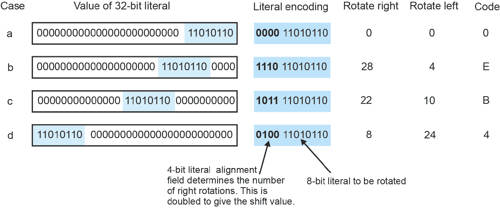
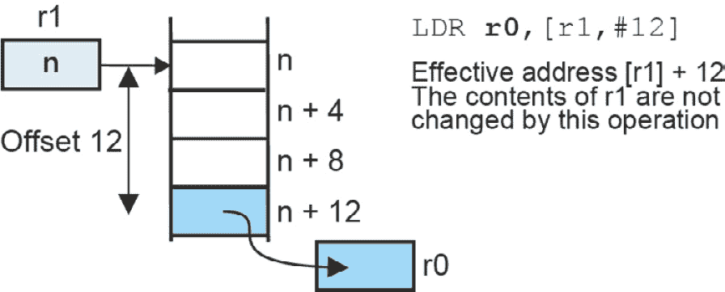
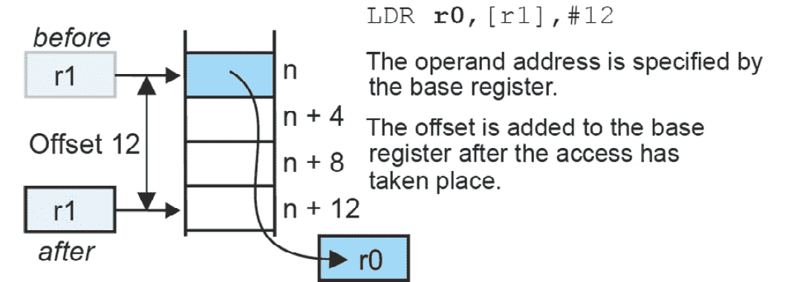
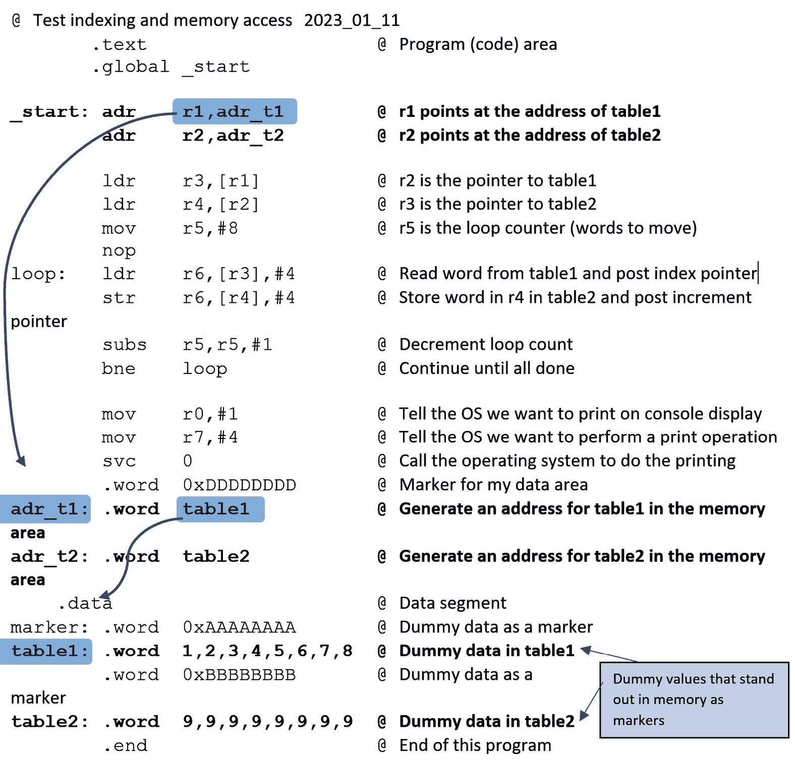
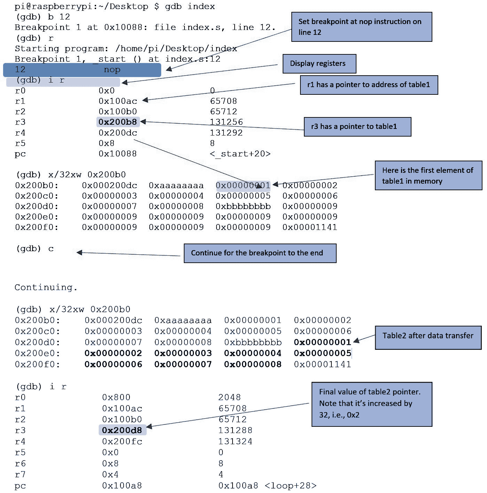
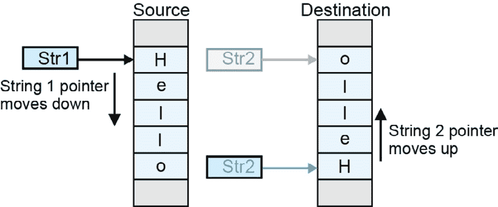
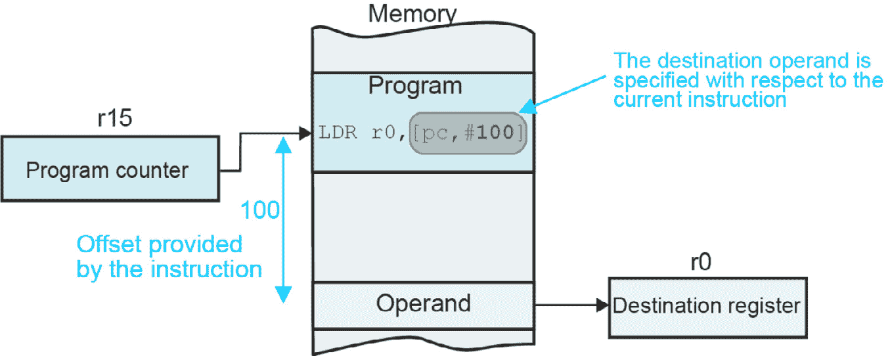

# 第十一章：ARM 寻址模式

寻址模式是计算机体系结构的基本部分，它关注的是你如何表达操作数的位置。我们在前面的章节中介绍了寻址模式。现在，我们将研究 ARM 相当复杂的寻址模式集。

将讨论的主题如下：

+   字面量寻址

+   缩放字面量

+   寄存器间接寻址

+   使用双指针寄存器

+   自动递增指针

# 字面量寻址

最简单的寻址模式是*字面量寻址*。你不需要说操作数在内存中的位置，而是在指令中提供操作数（即这实际上是值）。其他寻址模式要求你指定操作数在内存中的位置。考虑以下 Python 表达式，它有两个字面量，30 和 12：

`if A > 30: B =` `12`

我们可以将以下 Python 代码片段表示为 ARM 汇编语言，如下所示：

```py

                         @ Register r0 is A and r1 is B
      cmp    r0,#30      @ Compare A with 30
      ble    Exit        @ If A ≤ 30, skip the next operation
      mov    r1,#12      @ else B = 12
```

```py
Exit:
```

我们可以通过使用条件执行来简化此代码，如下所示：

```py

      cmp    r0,#30      @ Compare A with 30
      movgt  r1,#12      @ If A > 30, then B = 12
```

## 缩放字面量

ARM 以非传统方式实现了 12 位字面量，借鉴了浮点数领域的技巧。字面量的 12 位中有 4 位用于缩放一个 8 位常数。也就是说，8 位常数通过 4 位缩放字段中的数字进行两次右旋转。字面量字段中最显著的 4 位指定了字面量在 32 位字中的对齐方式。如果 8 位立即值是`N`，4 位对齐是`n`，则字面量的值由`N`右旋转`2n`位得到。例如，如果 8 位字面量是`0xAB`且`n`是`4`，则生成的 32 位字面量是`0xAB000000`，因为进行了八位的右旋转（2 x 4）。记住，八个右旋转位置相当于 32 - 8 = 24 位左移。*图 11**.1*展示了某些 32 位字面量和生成它们的 12 位字面量代码。



图 11.1 – ARM 的字面量操作数编码

你可能会觉得这相当奇怪。为什么 ARM 没有使用 12 位字面量字段来提供一个 0 到 4,095 范围内的数字，而不是一个 0 到 255 范围内通过 2 的幂缩放的数字？答案是 ARM 的设计者认为缩放字面量在现实世界的应用中比未缩放数字更有用。例如，假设你想清除 32 位字中除了 8 到 15 位之外的所有位。你需要用字面量`0b00000000000000001111111100000000`或十六进制的`0x0000FF00`进行`AND`操作。使用缩放机制，我们可以取 8 位`0x11111111`并将它们左移 8 位（即右移 24 位）以得到所需的常数。然而，缩放因子`n`需要两倍的旋转次数才能实现这一点。即(32 – 8)/2，这是 12。因此，存储在 12 位指令字段中的字面量是 12,255，或十六进制的 CFF。

幸运的是，计算缩放因子是程序员不必总是担心的事情。ARM 编译器会自动生成生成所需的最佳指令（或指令集）。

# 寄存器间接寻址

我们已经遇到了这种寻址模式，其中操作数的位置存储在寄存器中。它被称为寄存器 *间接寻址*，因为指令指定了可以找到指向实际操作数指针的寄存器。在 ARM 文献中，这种寻址模式被称为 *索引寻址*。有些人称之为 *基址寻址*。

寄存器间接寻址模式需要三个读取操作来访问操作数：

+   读取指令以找到指针寄存器

+   读取指针寄存器以找到操作数地址

+   在操作数地址读取内存以找到操作数

寄存器间接寻址很重要，因为包含指向实际操作数指针的寄存器的内容可以在运行时修改，因此地址是变量。因此，我们可以通过改变指针来遍历诸如表格之类的数据结构。

![图 11.2 – 寄存器间接寻址 – 执行 ldr r1,[r0]](img/Figure_11.02_B19624.jpg)

图 11.2 – 寄存器间接寻址 – 执行 ldr r1,[r0]

*图 11.2* 展示了 `ldr r1,[r0]` 的效果，其中 `r0` 是指针，包含值 `n`。

`ldr r1,[r0]` 将寄存器 `r0` 指向的内存位置的内容加载到寄存器 `r1` 中。

执行 `add r0,r0,#4` 将指针寄存器 `r0` 的内容增加 4，以便指向下一个字位置（记住，连续的字地址相差 4）。

考虑以下内容：

```py

   ldr r1,[r0]                   @ Get data pointed at by r0
   add r0,r0,#4                  @ Advance pointer to next word location
```

第一条指令将 `r1` 寄存器加载为 `r0` 指向的 32 位字。第二条指令将 `r0` 寄存器增加 4，以便指向内存中的下一个字节。重复执行这对指令将允许你逐个元素地遍历值表。我们很快就会看到 ARM 包含一个自动增加或减少指针的机制。

下一个代码片段演示了如何将表格的元素相加。假设你有一个包含四周内每日支出的表格。每个条目都连续存储在包含 4 x 7 = 28 个条目的表格中：

```py

      adr r0,table               @ r0 points to the table of data (pseudo-instruction)
      add r3,r0,#28 * 4          @ r3 points to the end of the table (28 x 4 bytes)
      mov r1,#0                  @ Clear the sum in r1
loop: ldr r2,[r0]                @ REPEAT: Get the next value in r2
      add r1,r1,r2               @ Add the new value to the running total
      add r0,r0,#4               @ Point to the next location in the table (4 bytes increment)
      cmp r0,r3                  @ Are we at the end of the table?
      bne loop                   @ UNTIL all elements added
table: .word 123                 @ Data for day 1
       .word 456                 @ Data for day 2
       .word 20                  @ Data for day 28
```

在这个简单的例子中，我们设置了一个循环，并从第一个元素遍历到最后一个元素。在每次循环中，我们读取一个元素并将其加到总数中。阴影线表示动作发生的地方——获取一个元素并指向下一个元素。

下一个示例演示了基于指针的间接寻址和字节操作（即，对 8 位值而不是整个字的操作）。假设我们想在字符串中找到一个特定的字符。以下代码使用 *字节加载指令*，`ldrb`，它将 8 位加载到目标寄存器。我们通过遍历字符串时指针增加 1，而不是 4，因为值位于单字节边界上：

```py

      ldr       r0,=String        @ r0 points at the string (using a pseudo-instruction)
loop: ldrb      r1,[r0]          @ REPEAT Read a byte character
      add       r0,r0,#1          @ Update character pointer by 1 (not by 4)
      cmp       r1,#Term          @ UNTIL terminator found
```

```py
      bne      loop
```

## 带偏移的基于指针的寻址

假设有人问你，“药店在哪里？”你可能会回答，“它在银行左边两个街区。”这就是日常生活中的基于指针的偏移寻址。我们通过给出相对于其他事物的位置来指向银行。

ARM 允许你使用指针寄存器加上一个提供偏移的 12 位立即数来指定地址。请注意，这是一个真正的 12 位立即数，而不是用作立即操作数的 8 位缩放值。立即数可以是正数或负数（表示它是要加到或从基指针中减去的）。考虑 `ldr` r5`,[r2,#160]`，其中加载到 `r5` 的操作数地址是 `r1` 的内容加上 160。

假设你想要将一个 24 个字的块移动到内存中比当前位置再远 128 字节的地方。假设要移动的块的地址在 `0x400`。我们可以编写以下代码：

```py

      mov  r0,#0x400         @ r0 points to the block of data
      ldr  r1,#24            @ r1 contains the number of words to move
next: ldr  r2,[r0]           @ REPEAT: Read word and put in r2
      add  r0,r0,#4          @ Point to next word
      str  r2,[r0,#128]      @ Store the word 128 bytes on
      subs r1,#1             @ Decrement the counter and set the status bits
      bne  next              @ UNTIL all elements added
```

不幸的是，你无法直接在如我们描述的基于 ARM 的 Raspberry Pi 上运行此代码，因为你不允许在代码段中修改内存。这是一个操作系统限制。为了避免这个问题，你必须使用指针，正如我们在*第九章*中演示的那样。我们将回到这一点。

## 两个指针比一个好

寄存器间接寻址模式允许你访问线性数据结构中的元素，例如一列表。有时，你将有一个更复杂的多维数据结构，例如具有行和列的矩阵。在这种情况下，两个指针可以简化编程——一个指针用于行，一个用于列。

ARM 提供了一种基于指针的寻址模式，允许你指定两个指针寄存器的和的地址，如下所示：

```py

ldr r7,[r0,r1]               @ Load r7 with the contents of the location pointed at by r0 plus r1
```

你可以对第二个操作数应用位移，如下所示：

```py

ldr r2,[r0,r1,lsl #3]        @ Load r7 with the contents of the location pointed at by r0 plus r1 x 8
```

在这种情况下，寄存器 `r1` 被缩放 8 倍。缩放因子必须是 2 的幂（即，2、4、8、16...）。

*图 11**.3* 展示了使用两个索引寄存器的基于指针的寻址。

![图 11.3 – 使用寄存器偏移的索引寻址 – ldr r0,[r1,r2]](img/Figure_11.03_B19624.jpg)

图 11.3 – 使用寄存器偏移的索引寻址 – ldr r0,[r1,r2]

这是一种概念性的表示，因为我们已经展示了其中一个寄存器指向内存（`r1`）和另一个寄存器提供从 `r1` 的偏移（即，`r2`）。然而，由于最终地址是 `r1` 加 `r2`，我们也可以反过来画。

## 指针寄存器的自动索引

当使用指针寄存器时，它们通常用于遍历数据结构，并在每次内存访问后经常增加或减少。因此，将此动作作为指令的一部分是有意义的。

事实上，CISC 处理器通常包括自动索引。当 RISC 处理器以每时钟周期一条指令的目标出现时，自动索引被从指令集中删除。然而，这种机制已被纳入 ARM 架构。

ARM 的自动索引有四种变体。您可以在使用指针之前或之后执行它。您可以向上索引到更高地址或向下索引到更低地址。考虑以下涉及索引寄存器 `r0` 和增量 4（在字节寻址机器上为一个字）的操作。每个选项由一个内存访问和一个指针调整动作组成；在前两种情况下，指针首先调整（预索引），在其他两种情况下，首先访问内存（后索引）。内存访问以粗体表示：

| **索引类型** | **第一个动作** | **第二个动作** |
| --- | --- | --- |
| 预索引上升 | `[r1]` `←` `[r1] + 4` | [r0] ← [[r1]] |
| 预索引下降 | `[r1]` `←` `[r1] - 4` | [r0] ← [[r1]] |
| 后索引上升 | [r0] ← [[r1]] | `[r1]` `←` `[r1] + 4` |
| 后索引下降 | [r0] ← [[r1]] | `[r1]` `←` `[r1] – 4` |

ARM 通过在方括号内包含偏移量并在其后附加感叹号来表示预索引，如下所示：

```py

    str r4,[r0,#4]!   @ Store r4 at the address given by [r0] + 4 and then increment r0 by 4
```

指针 `r0` 的值在使用之前改变。假设我们希望使用后索引并在使用后增加指针。在这种情况下，格式如下：

```py

    str r4,[r0],#4    @ Store  r4 at the address given by [r0] and then increment r0 by 4.
```

在这里，指针 `r0` 的值在使用作为偏移量之后改变。

*图 11.4* 至 *11.6* 展示了 ARM 在索引寻址上的变体。在每种情况下，基址寄存器是 `r1`，偏移量是 `12`，目标寄存器是 `r0`。这些图在此总结：

| **图** | **类型** | **格式** | **基址** **前** | **基址** **后** | **操作数地址** |
| --- | --- | --- | --- | --- | --- |
| 11.4 | 寄存器间接 | ldr r0,[r1,#12] | [r1] | [r1] | [r1] + 12 |
| 11.5 | 预索引 | ldr r0,[r1,#12]! | [r1] | [r1] + 12 | [r1] + 12 |
| 11.6 | 后索引 | ldr r0,[r1],#12 | [r1] | [r1] + 12 | [r1] |



图 11.4 – 带偏移的寄存器间接寻址


图 11.5 – 带预索引的寄存器间接寻址



图 11.6 – 带后索引的寄存器间接寻址

考虑以下示例，我们使用后索引将数据块从一个内存区域移动到另一个内存区域。在这种情况下，我们通过后索引四个字节，因为我们移动的是 4 字节字：

```py

       adr  r0,table1       @ Source array pointer in r0\. Use pseudo instruction
       adr  r1,table2       @ Destination array pointer in r1
       mov  r2,#8           @ Eight elements (words) to move
loop:  ldr  r3,[r0],#4      @ REPEAT: Get element from table 1 (post-indexing by 4)
       str  r3,[r1],#4      @ Store in table 2 (post-indexing 4)
       subs r2,r2,#1        @ Decrement counter
       bne  loop            @ UNTIL all done
```

该程序的两大关键行是加载和存储指令（阴影部分），其中数据从源读取并复制到目标。正如我们所言，由于变量分配内存空间的方式，你无法在不修改的情况下直接在 Raspberry Pi 上运行此代码。以下代码演示了适用于 Raspberry Pi 的可运行版本。

这基本上是相同的代码。除了处理内存问题外，我们还添加了汇编指令和虚拟数据（包括允许你更容易观察内存中数据的标记）。还有一个`nop`指令。请注意，ARM 的一些版本有真正的`nop`指令，而另一些则使用伪指令。我在测试时添加了这个虚拟指令以“定位”到某个位置。记住，实际数据的地址存储在程序区域，然后使用该地址加载一个指针：



图 11.7 – 访问读写内存时使用指针

我们使用`gbd`作为调试工具运行了前面的程序，以下输出展示了这一点。为了压缩文本，我们已从显示中删除了不必要的数据——例如，未访问或修改的寄存器。



图 11.8 – 使用 gdb 跟踪图 11.7 的程序

## 字符串复制的示例

下一个示例，*图 11.9*，使用后索引将字符串从一处复制到另一处，并按反向顺序移动一个指针向下，另一个指针向上。目标指针通过`len-1`递增，最初指向字符串的末尾。以下代码包括汇编语言指令，使其能够在 RPi 上运行：

```py

         .equ    len,5            @ Length of string to reverse
         .text                    @ Program (code) area
         .global _start
_start:  mov    r0,#len           @ Number of characters to move
         adr    r1,adr_st1        @ r1 points at source address 1
         adr    r2,adr_st2        @ r2 points at source address 2
         ldr    r1,[r1]           @ Register r1 points to source
         ldr    r2,[r2]           @ Register r2 points to destination
         add    r2,r2,#len-1      @ r2 points to bottom of destination
Loop:    ldrb   r3,[r1],#1        @ Get char from source, increment pointer (note ldbr)
         strb   r3,[r2],#-1       @ Store char in destination, decrement pointer
         subs   r0,r0,#1          @ Decrement char count
         bne    Loop              @ REPEAT until all done
         nop                      @ Stop here
adr_st1: .word  str1
adr_st2: .word  str2
         .data
str1:    .ascii "Hello"           @ Source string
str2:    .byte  0,0,0,0,0         @ Destination string
         .end
```



图 11.9 – 反转字符串

下一节将探讨一种基于指针寻址的变体，其中指针本身是程序计数器。因此，所有数据和程序都参照当前程序的地址进行引用。

# 程序计数器相对寻址

ARM 处理器在许多方面都是不寻常的。你可以使用任何寄存器（即，`r0`到`r15`）作为指针寄存器。然而，`r15`是 ARM 的程序计数器。如果你使用`r15`作为带索引的指针寄存器，你就是在说，“操作数距离我这里有多远。”这里的“我这里”指的是指令本身。*图 11.10*说明了程序计数器相对寻址。

想想看。你给出的是数据相对于使用它的程序地址，而不是内存中的绝对地址。如果你在内存中移动程序，数据与访问它的指令的距离仍然是相同的，使用程序计数器相对寻址。程序计数器相对寻址的引入是计算机架构中的一个重大进步。顺便说一句，大多数分支指令都使用程序计数器相对寻址，因为分支的目标是相对于当前指令指定的。

ARM 使用程序计数器相对寻址来加载 32 位常量。回想一下，你只能使用`ldr`指令加载 12 位常量。然而，汇编器可以在内存中预先加载一个 32 位常量，然后使用程序计数器相对寻址来访问它。换句话说，你将一个 32 位值存储在程序附近（或其中）的内存中，然后使用程序计数器相对寻址来访问它。这就是伪指令存在的原因。如果没有伪指令，你将不得不计算当前`pc`和所需操作数之间的相对地址。伪指令会这样做，并且使地址对程序员不可见。

执行`ldr r0`,[r15,#0x100]`指令将一个 32 位操作数加载到`r0`寄存器中，该操作数位于程序计数器`r15`的内容`0x100`字节（0x40 或 64 个字）处。加载到`r0`的操作数距离程序计数器`pc`为`0x108`字节。为什么是`0x108`而不是指令中指定的`0x100`，这是为什么呢？额外的 8 个字节存在是因为程序计数器在每条指令执行后增加 8 个字节，因此它比当前地址领先 8 个字节。

那么程序计数器相对存储指令呢？这些指令不能使用。在 ARM 中，不支持使用程序计数器寻址模式的存储操作。这种限制可能是因为（a）大量代码位于只读内存中且无法更改，以及（b）它将允许修改运行时程序。



图 11.10 – 程序计数器相对寻址

## 程序计数器相对寻址演示

考虑以下文本，其中我们使用了两种类型的伪指令，这两种伪指令都是为了将 32 位值加载到寄存器中。一个是`adr`（加载地址）和另一个`ldr`（加载 32 位立即数）：

```py

        .text
        .global   _start
_start: ldr r0,=pqr
        ldr r1,=abc                @ Note the special format of the pseudo ldr
        adr r2,pqr
        ldr r3,=0x11111111
        nop
        mov r0,#0
        mov r7,#1
        svc 0
abc:   .word 0x22222222
pqr:   .word 0x33333333
       .end
```

有三个`ldr`指令。两个将地址加载到寄存器中，第三个`ldr`指令加载一个 32 位立即数`0x11111111`。还有一个`adr`指令将 32 位地址加载到寄存器`r2`中。当这些代码执行时会发生什么？

首先，让我们看看在`gdb`中查看的源代码：

```py
0x10054 <_start>      ldr r0, [pc, #32]   ; 0x1007c <pqr+4>
0x10058 <_start+4>    ldr r1, [pc, #32]   ; 0x10080 <pqr+8>
0x1005c <_start+8>
0x10060 <_start+12>   ldr r3, [pc, #28]   ; 0x10084 <pqr+12>
```

注意，这些与源代码不同。这是因为源代码使用的是翻译后的伪指令。例如，`ldr r0,=pqr` 被翻译成 `ldr r0,[pc,#32]`。源代码不能指定 32 位指令。然而，翻译版本使用常规加载来指定实际操作数的 32 位位置，这是程序计数器当前值的 32 位。

`add r2,pc,#20` 的处理方式不同。在这里，32 位立即数是通过将 20 加到当前 pc 的值来生成的，因为要定位的地址距离当前 PC 值 20 字节。

让我们使用 `gdb` 来查看代码执行到 `nop` 时的寄存器。我们将检查程序结束时的寄存器内容，然后查看内存位置。你可以看到存储在内存中的数据以及通过程序计数器相对寻址访问的常量：

```py

r0             0x00010078
r1             0x00010074
r2             0x00010078
r3             0x11111111
(gdb) x/8xw 0x10074
0x10074 <abc>:          0x22222222    0x33333333    0x00010078      0x00010074
0x10084 <pqr+12>:       0x11111111    0x00001141    0x61656100      0x00010069
```

在下一章中，我们将继续探讨寻址的主题，看看 ARM 如何实现子程序，以及你如何使用堆栈来跟踪子程序返回地址。

# 摘要

寻址模式包括表示内存中项目位置的所有方式。寻址模式在汇编语言编程中既是最容易的也是最难的主题。概念很简单，但使用指针的间接寻址模式可能需要一些努力来可视化。

在本章中，我们学习了立即寻址或直接寻址，其中操作数是一个实际值（它是事物本身，而不是位置）。立即值用于指定常量——例如，在 x + 5 中，数字 5 是一个立即值。这是最简单的寻址模式，因为数据是指令的一部分，所以不访问任何内存位置。

我们还研究了 ARM 指定立即数的一种相当不寻常的方式，即提供一个 0 到 255 范围内的值和一个可以将其乘以 2 的偶数次幂的乘数。你可以指定 5 并存储 5、20、80 等等。

本章的大部分内容都是关于寄存器间接寻址，它有许多其他名称（索引和基于指针的）。在这种情况下，地址由寄存器的内容给出。指令指定的是操作数的实际地址，而不是指向它的寄存器。因为你可以操作寄存器中的数据，所以你可以操作地址并访问数组、表格等数据结构。

ARM 提供了 RISC 风格的自动增量和减量。这意味着你可以使用指针并在之前（或之后使用）对其进行增减。

我们还研究了寄存器间接寻址的一种特殊形式，即相对寻址，其中指针是程序计数器本身——也就是说，操作数的地址是相对于访问它的指令来指定的。这意味着使用程序计数器相对寻址的代码可以在内存中移动，而无需重新计算任何地址。

在下一章中，我们将探讨编程基础中的一个主题——子程序和栈。这个主题也与寻址模式密切相关。
