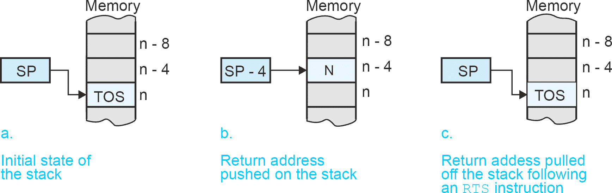
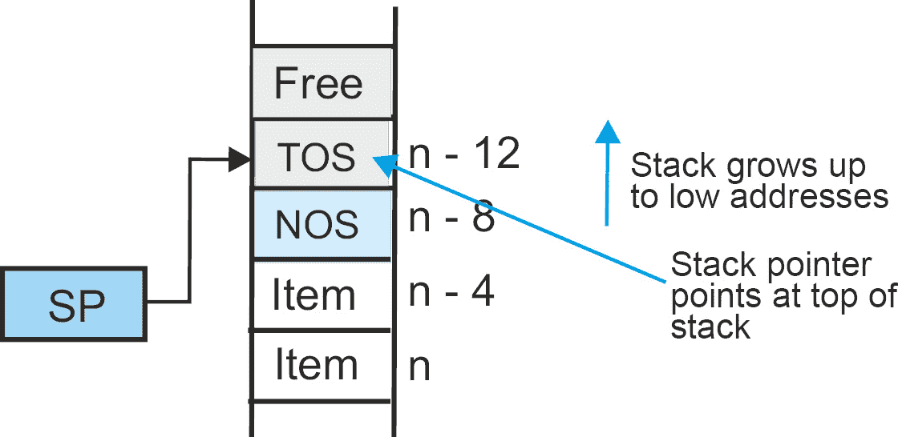
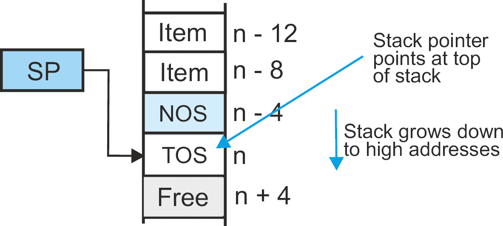
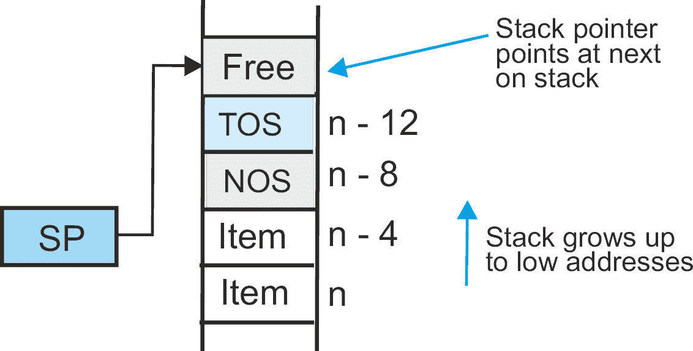
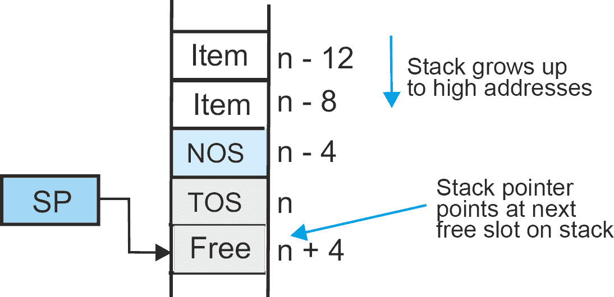

# 12

# 子程序和栈

子程序是一段从程序中的某个点调用并执行的代码，然后返回到调用点之后的指令。所有计算机都使用子程序，但有些计算机为程序员提供了比其他计算机更多的实现子程序的功能。

在本章中，我们将探讨 ARM 的子程序处理机制——特别是以下内容：

+   特殊的分支和链接指令

+   栈

+   子程序调用和返回

+   块移动指令

# 带链接指令的分支

首先，我们讨论 ARM 的`branch and link`（分支和链接）指令，`bl`，它提供了一种快速简单的方法来调用子程序，而不使用栈机制。

实现子程序调用和返回有两种基本方法。经典的 CISC 方法是`BSR`（跳转到子程序）和`RTS`（从子程序返回）。典型的代码可能如下所示：

```py

      bsr abc    @ Call the subroutine on the line labeled abc
      . . .
      . . .
abc:  . . .      @ Subroutine abc entry point
      . . .
      rts        @ Subroutine abc return to calling point
```

这就是简单在行动中的体现。你调用一段代码，执行它，然后返回到调用点之后的指令。大多数 RISC 处理器拒绝这种机制，因为子程序调用和返回是复杂的指令，在调用期间将返回地址保存在栈上，然后在返回时从栈中取出返回地址。这对程序员来说非常方便，但需要几个 CPU 时钟周期来执行，并且不符合 RISC 处理器每条指令一周期的工作模式。

基于栈的子程序调用/返回的巨大优势在于，你可以嵌套子程序，并从其他子程序中调用子程序，而栈机制会自动处理返回地址。

你很快就会看到你可以在 ARM 上实现这种机制，但不是通过使用两个专用指令。你必须编写自己的代码。

如果你想要一个简单的子程序调用和返回（子程序被称为*叶子*），你所需要做的只是将返回地址保存在一个寄存器中（不需要外部内存或栈）。然后，要返回，你只需将返回地址放入程序计数器——简单快捷。然而，一旦你进入子程序，你就不能再做同样的事情并调用另一个子程序。这样做会破坏你现有的已保存的返回地址。

ARM 的子程序机制称为`branch with link`，其助记符为`bl target`，其中`target`是子程序的符号地址。实际地址是程序计数器相对的，是一个 24 位有符号字，提供了从当前 PC 开始的 223 个字的分支范围。范围是从 PC 的任意方向 223 个字（即向前分支和向后分支）。

带有链接指令的分支行为类似于分支指令，但它还会复制返回地址（即返回后要执行的下一个指令的地址到链接寄存器 `r14`。假设你执行以下操作：

```py

        bl     sub_A          @ Branch to sub_A with link and save return address in r14
```

ARM 执行一个跳转到由标签 `sub_A` 指定的目标地址的分支。它还将程序计数器（保存在寄存器 `r15` 中）复制到链接寄存器 `r14` 以保留返回地址。在子程序结束时，您通过将 `r14` 中的返回地址转移到程序计数器来返回。您不需要特殊的返回指令；您只需写下以下内容：

```py

        mov    pc,lr          @ We can also write this as mov r15,r14
```

让我们看看子程序使用的一个简单例子。假设您需要在程序中多次评估 `if x > 0 then` `x = 16x + 1 else x = 32x` 函数。假设 x 参数在寄存器 `r0` 中，我们可以编写以下子程序：

```py

Func1:  cmp    r0,#0          @ Test for x > 0
        movgt  r0,r0, lsl #4  @ If x > 0 then x = 16x
        addgt  r0,r0,#1       @ If x > 0 then x = 16x + 1
        movle  r0,r0, lsl #5  @ ELSE if x < 0 THEN x = 32x
        mov    pc,lr          @ Return by restoring saved PC
```

创建子程序所需的一切只是一个入口点（标签 `Func1`）和一个返回点，该返回点通过在链接寄存器中 bl 恢复保存的地址。

## 栈

我们已经描述了栈。我们在这里再次讨论它，因为它可能是计算中最重要的数据结构。栈是一个堆，您在顶部添加东西，也从顶部取出东西。如果您从栈中取出东西，它就是最后添加到栈中的东西。因此，栈被称为 **后进先出队列**（**LIFO**），其中项目从一端进入，以相反的顺序离开。

计算机通过使用指针寄存器来指向栈顶来实现栈。ARM 使用 `r13` 作为栈指针，或者更准确地说，ARM *强制* 使用 `r13` 作为栈指针。如果您愿意，可以使用 `r0` 到 `r13` 作为栈指针。使用 `r13` 是一种 *约定*，旨在使代码更易于阅读和共享。

栈有四种变体。它们都做同样的事情，但实现方式不同。ARM 支持所有四种变体，但为了简单起见，我们在这里只使用一种。栈存储在内存中，在正常的人类意义上没有上下之分。当项目添加到栈中时，它们可以添加到具有较低地址的下一个位置或具有较高地址的下一个位置。按照惯例，大多数栈都是这样实现的，即下一个项目存储在 *较低地址*。我们说栈向 *较低* 地址 *增长*（这是因为我们按从上到下的顺序给书的行编号，第一行在顶部）。

栈排列的其他变体是栈指针可以指向栈顶的项目，TOS，或者指向该栈上的下一个空闲项目。我将介绍栈指针指向栈顶的项目（再次强调，这是最常见的约定）。

*图 12**.1* 展示了一个用于保存子程序返回地址的栈。



图 12.1 – 使用栈保存返回地址，N

栈指针指向栈顶元素，当向栈中添加一个项目（推送）时，栈指针首先减少。当从栈中移除一个项目时，它是在栈指针指示的位置取出的，然后栈指针增加（即向下移动）。我们可以根据 **栈指针**（**SP**）定义推送和拉取（弹出）操作如下：

```py

PUSH:    [SP]   ← [SP] – 4    @ Move stack pointer up one word (up toward lower addresses)
         [[SP]] ← data        @ Push data onto the stack. Push uses pre-decrementing.
PULL:    data  ← [[SP]]       @ Pull data off the stack by reading TOS
```

```py
         [SP]  ← [SP] + 4     @ Move stack pointer down one word (pull uses post-incrementing)
```

栈指针以四的倍数减少和增加，因为我们遵循 ARM 习惯，即内存是字节寻址的，栈项是一字长（四个字节）。下一节将更详细地探讨子程序的调用和有序返回到调用点。

# 子程序调用和返回

要调用子程序，你需要将返回地址压入栈中。CISC 处理器使用 `bsr target` 实现子程序调用。因为 ARM 缺少子程序调用指令，你可以编写以下 ARM 代码。记住，我们处理的是 32 位字推送和拉取，栈必须以四的倍数增加或减少。记住，在 ARM 文献中 `r15` 和 `SP` 以及 `r13` 和 `lr` 是可以互换的术语：

```py

      sub  r13,r13,#4       @ Pre-decrement the stack pointer (r13 is used as the SP)
      str  r15,[r13]        @ Push the return address in r15 on the stack
      b    Target           @ Jump to the target address
        ...                 @ Return here
```

ARM 没有子程序返回指令，所以你可以用以下方式实现：

```py

      ldr  r12,[r13],#+4    @ Get saved PC from stack and post-increment the stack pointer
      mov  r15,r12          @ Load PC with return address
```

以下是一个简单的程序，使用此机制设置调用和返回。注意，我们没有设置初始的栈指针。ARM 的操作系统会做这件事：

```py

.section .text
.global _start
_start: mov  r0,#9          @ Dummy operation
        sub  sp,sp,#4       @ Decrement stack
        str  pc,[sp]        @ Save pc on stack
        b    target         @ Branch to subroutine "target"
        mov  r2,#0xFFFFFFFF @ Return here ... this is a marker
        nop                 @ Dummy operation
        mov  r7,#1          @ Set up exit code
        svc  0              @ Leave program
target: mov  r1,#0xFF       @ Subroutine ... dummy operation
        ldr  r12,[sp],#+4   @ Pull pc off the stack
        mov  r15,r12        @ Return
```

```py
        .end
```

*图 12.2* 展示了运行此代码后 ARM 模拟器的输出。我们包括了反汇编窗口和寄存器窗口。注意 `mov r2`,#0xFFFFFFFF` 指令已被转换为 `mvn r2`,#0` 操作。回想一下 `MVN` 和 `ldr r12,[sp],#+` 已被重命名为 `pop {r12}`。这相当于弹出栈操作（从栈顶移除一个项目）。

执行代码后的寄存器：

```py

Register group: general
r0             0x9                 9
r1             0xff                255
r2             0xffffffff          4294967295
r12            0x10064             65636
sp             0xbefff380          0xbefff380
lr             0x0                 0
pc             0x1006c             0x1006c <_start+24>
```

以下是对代码的逐步执行。这是一个子程序调用和返回的示例：

```py

B+ 0x10054 <_start>        mov    r0, #9
   0x10058 <_start+4>      sub    sp, sp, #4
   0x1005c <_start+8>      str    pc, [sp]
   0x10060 <_start+12>     b      0x10074 <target>
   0x10064 <_start+16>     mvn    r2, #0
   0x10068 <_start+20>     nop                    ; (mov r0, r0)
  ⁰x1006c <_start+24>     mov    r7, #1
   0x10070 <_start+28>     svc    0x00000000
   0x10074 <target>        mov    r1, #255        ; 0xff
   0x10078 <target+4>      pop    {r12}           ; (ldr r12, [sp], #4)
   0x1007c <target+8>      mov    pc, r12
```

在下一节中，我们将探讨 ARM 最强大且最不 RISC 式的操作之一——在内存和多个寄存器之间移动数据块的能力。

# 块移动指令

在本节中，我们将学习如何移动多个寄存器。基本概念如下：

+   如何指定一组寄存器

+   如何寻址内存

+   如何对寄存器的存储进行排序

+   不同类型的块移动

一些 CISC 处理器的一个伟大特性是你可以用一条指令将一组寄存器推入栈中。RISC 处理器通常没有这样的指令，因为它与 RISC 理念核心的每周期一次操作的设计约束相冲突。令人惊讶的是，ARM 实现了一个块移动指令，允许你在一次操作（即一条指令）中将一组寄存器复制到或从内存中。以下 ARM 代码演示了如何从内存中加载寄存器 `r1`、`r2`、`r3`、`r5`：

```py

    adr  r0,DataToGo    @ Load r0 with the address of the data area
    ldr  r1,[r0],#4     @ Load r1 with the word pointed at by r0 and update the pointer
    ldr  r2,[r0],#4     @ Load r2 with the word pointed at by r0 and update the pointer
    ldr  r3,[r0],#4     @ and so forth for the remaining registers r3 and r5…
    ldr  r5,[r0],#4
```

ARM 有一个 *块移动到内存* 指令 `stm` 和一个 *块移动从内存* 指令 `ldm`，用于将寄存器组从内存中复制到和从内存中复制。块移动指令需要一个两位后缀来描述数据是如何访问的（例如，`stm`ia 或 `ldm`db），我们将看到。

从概念上讲，块移动很容易理解，因为它仅仅是 *将这些寄存器的内容复制到内存中* 的操作，或者相反。在实践中，它更为复杂。ARM 提供了一套完整的选项，用于确定移动的方式 – 例如，寄存器是从高地址到低地址还是从低地址到高地址移动，或者内存指针是在传输前后更新（就像堆栈结构一样）。实际上，块移动就像在其他计算机上找到的推和拉堆栈操作一样。

让我们将寄存器 `r1`、`r2`、`r3` 和 `r5` 的内容移动到连续的内存位置，使用 `stm` 指令：

```py

stmia  r0!,{r1-r3,r5}   @ Note block move syntax. The register list is in braces
                        @ r0! is the destination register with auto indexing
                        @ The register list is {r1-r3,r5} r1,r2,r3,r5
```

此指令将寄存器 `r1` 复制到 `r3`，并将 `r5` 移动到连续的内存位置，使用 `r0` 作为指针寄存器并自动索引（由 `!` 后缀表示）。ia 后缀表示索引寄存器 `r0` 在每次传输后增加，数据传输按照 *递增* 地址顺序进行。我们还将看到，此指令可以写成 `stm`fd（这是相同的操作，但 ARM 在其文档中为同一事物提供了两种命名约定）。

虽然 ARM 的块移动模式指令有多种变化，但编号最低的寄存器总是存储在最低的地址，其次是下一个编号最低的寄存器在下一个更高的地址，依此类推（例如，前一个示例中的 `r1`，然后是 `r2`、`r3` 和 `r5`）。

考虑以下块移动的示例。因为它比我们遇到的一些指令要复杂一些，我们将演示其执行。我包括了几个不是严格属于演示但包括我在实验中使用的功能。特别是，我在寄存器和内存中使用标记，以便我可以更容易地跟踪调试。例如，在内存块中，我存储了数据字 `0xFFFFFFFF` 和 `0xAAAAAAAA`。这些数据除了让我一眼就能看到我在调试内存时数据区域开始和结束的位置外，没有其他功能。同样，我使用类似 `0x11111111` 的值作为从寄存器移动的字，因为我可以在调试时轻松跟踪它们：

```py

           .text                       @ This is a code section
           .global _start              @ Define entry point for code execution
 _start:    nop                        @ nop = no operation and is a dummy instruction
           ldr    r0,=0xFFFFFFFF       @ Dummy values for testing
           ldr    r1,=0x11111111
           ldr    r2,=0x22222222
           ldr    r3,=0x33333333
           ldr    r4,=0x44444444
           ldr    r5,=0x55555555
           ldr    r0,adr_mem           @ Load pointer r0 with memory
           stmia  r0!,{r1-r3,r5}       @ Do a multiple load to memory
           mov    r10,r0               @ Save r0 in r10 (for debugging)
           ldmdb  r0!,{r6-r9}          @ Now load data from memory
           mov    r11,r0
           mov    r1,#1                @ Terminate command
           svc    0                    @ Call OS to leave
           .word  0xFFFFFFFF           @ A dummy value for testing
           .word  0xAAAAAAAA           @ Another dummy value
adr_mem:   .word  memory               @ The address of the memory for storing data
           .data                       @ Declare a memory segment for the data
memory:    .word  0xBBBBBBBB           @ Yet another memory marker
           .space 32                   @ Reserve space for storage (8 words)
           .word  0xCCCCCCCC           @ Final memory marker
           .end
```

此代码设置了五个寄存器，其数据在检查内存时很容易看到。程序末尾的两个字标记之间保存了 32 个字节的内存，使用 `.space` 指令。此块的开始被标记为 `memory`，`r0` 指向它。然后这五个寄存器被存储在内存中。执行块存储的指令以浅灰色表示，数据区域以深灰色表示。

我们最初感兴趣的代码是为五个寄存器加载而编写的，分别用`0x11111111`到`0x55555555`预设寄存器`r1`到`r5`。寄存器`r0`最初被设置为`0xFFFFFFFF`，仅作为调试的标记。关键指令是`stmia r0!,{r1-r3,r5}`，其目的是将寄存器`r1`、`r2`、`r3`和`r5`的内容存储在由`r0`指向的连续内存位置。

下面的树莓派输出来自`gdb`调试器。源代码是`blockMove1.s`。我们省略了一些寄存器值，以便在寄存器未更改或未使用时使列表更易于阅读。同样，重复的命令行也被省略了：

```py

pi@raspberrypi:~/Desktop $ as -g -o blockMove1.o blockMove1.s
pi@raspberrypi:~/Desktop $ ld -o blockMove1 blockMove1.o
pi@raspberrypi:~/Desktop $ gdb blockMove1
(gdb) b 1
Breakpoint 1 at 0x10078: file blockMove1.s, line 6.
(gdb) r
Starting program: /home/pi/Desktop/blockMove1
Breakpoint 1, _start () at blockMove1.s:6
6               ldr    r0,=0xFFFFFFFF         @ Dummy value for testing
(gdb) i r
r0             0x0                 0          # These are the initial registers before we start
r1             0x0                 0
r2             0x0                 0
r3             0x0                 0
r4             0x0                 0
r5             0x0                 0
r6             0x0                 0
r7             0x0                 0
r8             0x0                 0
r9             0x0                 0
r10            0x0                 0
r11            0x0                 0
r12            0x0                 0
sp             0xbefff380          0xbefff380 # The OS sets up the stack pointer
lr             0x0                 0
pc             0x10078             0x10078 <_start+4>  # The OS sets up stack pointer
```

在查看寄存器之后，我们现在将执行一系列指令。请注意，我们需要一次输入`si 1`，然后简单地按*Return*来重复操作：

```py

(gdb) si 1
7              ldr    r1,=0x11111111          # Here we trace seven instructions
8              ldr    r2,=0x22222222
9              ldr    r3,=0x33333333
10             ldr    r4,=0x44444444
11             ldr    r5,=0x55555555
12             ldr    r0,adr_mem              @ Load pointer r0 with memory
13             stmia  r0!,{r1-r3,r5}          @ Multiple load to memory
(gdb) i r
r0             0x200cc             131276
```

现在，让我们看看我们设置的寄存器。只显示了感兴趣的寄存器。请注意，`r0`指向`0x200CC`处的数据。系统软件负责这个地址：

```py

r1             0x11111111          286331153
r2             0x22222222          572662306
r3             0x33333333          858993459
r4             0x44444444          1145324612
r5             0x55555555          1431655765
r6             0x0                 0
```

到目前为止，我们已经将寄存器`r0`设置为指针，其值为`0x200cc`。这个值是由汇编器和加载器确定的。如果您参考源代码，我们使用了`ldr r0,adr_mem`通过指向实际存储在内存中的数据的指针来加载`r0`。这是因为软件不允许我们直接加载内存地址。

您可以看到，寄存器已经设置为易于追踪的值。下一步是使用`x/16xw gdb`命令检查内存，以显示 16 个十六进制数据字：

```py

pc             0x10094             0x10094 <_start+32>
(gdb) x/16xw 0x200cc
0x200cc:    0xbbbbbbbb    0x00000000    0x00000000    0x00000000
0x200dc:    0x00000000    0x00000000    0x00000000    0x00000000
0x200ec:    0x00000000    0xcccccccc    0x00001141    0x61656100
0x200fc:    0x01006962    0x00000007    0x00000108    0x0000001c
```

我们存储在内存中的两个标记以粗体显示。现在，让我们执行存储的多个寄存器。在此之前，我们将指针复制到`r10`（这只是为了我的调试目的）以便我们可以看到移动之前它的值。在块移动指令之后，我们显示感兴趣的寄存器：

```py

(gdb) si 1
14               mov    r10,r0
15               ldmdb  r0!,{r6-r9}             @ Now load data from memory
(gdb) i r
r0             0x200dc             131292
r1             0x11111111          286331153
r2             0x22222222          572662306
r3             0x33333333          858993459
r4             0x44444444          1145324612
r5             0x55555555          1431655765
r6             0x0                 0
r10            0x200dc             131292
pc             0x1009c             0x1009c <_start+40>
```

现在是检验成果的时候了。这是`x/16xw`显示命令之后的内存。请注意，四个寄存器的内存储存在连续递增的内存位置：

```py

(gdb) x/16xw 0x200cc
0x200cc:    0x11111111    0x22222222    0x33333333    0x55555555
0x200dc:    0x00000000    0x00000000    0x00000000    0x00000000
0x200ec:    0x00000000    0xcccccccc    0x00001141    0x61656100
```

```py
0x200fc:    0x01006962    0x00000007    0x00000108    0x0000001c
```

最后，我们将执行最后两个命令并显示寄存器内容：

```py

(gdb) si 1
16               mov    r11,r0
18               mov    r1,#1      @ Terminate command
(gdb) i r
r0             0x200cc             131276
r1             0x11111111          286331153
r2             0x22222222          572662306
r3             0x33333333          858993459
r4             0x44444444          1145324612
r5             0x55555555          1431655765
r6             0x11111111          286331153       Data copied to registers r6 - r9
r7             0x22222222          572662306
r8             0x33333333          858993459
r9             0x55555555          1431655765
r10            0x200dc             131292
```

您可以看到，从`ldmdb r0!,{r6-r9}`内存操作中，四个寄存器从内存中复制到寄存器`r7`到`r9`。

考虑`ldm`的后缀为`db`。为什么是`ldmdb`？当我们向内存传输数据时，我们使用了`*increment after*`后缀，其中指针寄存器用于将数据移动到内存位置，然后移动后增加。当我们检索数据时，我们最初指向最后一个值移动后的位置。因此，为了移除我们存储在内存中的项目，我们必须在每次移动之前递减指针——这就是`*decrement before*`（`db`）后缀的原因。因此，指令对`stmia`和`ldmdb`分别对应堆栈的压入和弹出操作。

## 拆解代码

以下是对该程序代码的反汇编。它已被编辑和重新格式化，以便更容易查看。一些指令有两行。一行是 *原始* 指令，如程序中所示。下一行是汇编器解释的指令。这展示了伪指令如 `ldr` r1`,=0x111111` 是如何处理的。

粗体线需要进一步解释，如下所示：

```py

(gdb) disassemble /m
Dump of assembler code for function _start:
5 _start:            nop
   0x00010074 <+0>:  nop ;  (mov r0, r0)
6                    ldr     r0,=0xFFFFFFFF  @ Dummy value for testing
=> 0x00010078 <+4>:  mvn     r0, #0
7                    ldr     r1,=0x11111111
   0x0001007c <+8>:  ldr     r1, [pc, #52]   ; 0x100b8 <adr_mem+4>
8                    ldr     r2,=0x22222222
0x00010080 <+12>: ldr     r2, [pc, #52]   ; 0x100bc <adr_mem+8>
9                    ldr     r3,=0x33333333
   0x00010084 <+16>: ldr     r3, [pc, #52]   ; 0x100c0 <adr_m
10                   ldr     r4,=0x44444444
   0x00010088 <+20>: ldr     r4, [pc, #52]   ; 0x100c4 <adr_mem+16>
11                   ldr     r5,=0x55555555      
   0x0001008c <+24>: ldr     r5, [pc, #52]   ; 0x100c8 <adr_mem+20>
12                   ldr     r0,adr_mem      @ Load pointer r0 with memory
   0x00010090 <+28>: ldr     r0, [pc, #28]   ; 0x100b4 <adr_mem>
13                   stmia   r0!,{r1-r3,r5}  @ Do a multiple load to memory
   0x00010094 <+32>: stmia   r0!, {r1,r2,r3,r5}
14                   mov     r10,r0
   0x00010098 <+36>: mov     r10, r0
15                   ldmdb   r0!,{r6-r9}     @ Now load data from memory
   0x0001009c <+40>: ldmdb   r0!, {r6,r7,r8,r9}
16                   mov     r11,r0
   0x000100a0 <+44>: mov     r11, r0
18                   mov     r1,#1           @ Terminate command
   0x000100a4 <+48>: mov     r1, #1
19                   svc     0               @ Call OS to leave  
   0x000100a8 <+52>: svc 0x00000000
   0x000100ac <+56>: ; <UNDEFINED> instruction: 0xffffffff
   0x000100b0 <+60>: bge 0xfeabab60
   0x000100b4 <+0>:  andeq r0, r2, r12, asr #1
```

以下命令使用 x/32xw 以十六进制形式显示 32 个连续的字节，以便我们可以观察内存中发生了什么。这就是我们使用标记如 0xAAAAAAAA 使得识别内存中的位置变得容易的地方。

```py

(gdb) x/32xw 0x100a8                         This displays 32 words of memory
0x100a8 <_start+52>:  0xef000000 0xffffffff 0xaaaaaaaa 0x000200cc
0x100b8 <adr_mem+4>:  0x11111111 0x22222222 0x33333333 0x44444444
0x100c8 <adr_mem+20>: 0x55555555 0xbbbbbbbb 0x00000000 0x00000000
0x100d8:              0x00000000 0x00000000 0x00000000 0x00000000
0x100e8:              0x00000000 0x00000000 0xcccccccc 0x00001141
0x100f8:              0x61656100 0x01006962 0x00000007 0x00000108
0x10108:              0x0000001c 0x00000002 0x00040000 0x00000000
```

```py
0x10118:              0x00010074 0x00000058 0x00000000 0x00000000
```

*第 5 行* 包含一个 `nop` 指令，它什么都不做（除了将 PC 移动到下一个指令）。它可以提供一个占位符供后续代码使用，或者作为调试辅助。在这里，它为第一个指令提供了一个着陆空间。ARM 缺少 `nop`，汇编器将 `nop` 翻译为 `mov r0,r0`。像 `nop` 一样，这条指令什么也不做！

`ldr` r0`,=0xFFFFFFFF` 很有趣。汇编器使用 ARM 的 `mvn` 在移动之前反转操作数的位。如果操作数是 `0`，则移动的位将是全部 `1`s，这正是我们想要的。

指令 7 展示了另一个伪操作：

```py

7                      ldr      r1,=0x11111111
   0x0001007c <+8>:    ldr     r1, [pc, #52]   ; 0x100b8 <adr_mem+4>
```

指令需要一个 32 位立即数，`0x11111111`，并且不能以这种方式加载。编译器将指令转换为程序计数器相关的内存加载。地址是当前程序计数器，`0x0001007c`，加上偏移量 `52` 或 `0x44`，加上 ARM PC 的 8 字节前缀。在那个目标地址，你会找到存储的 `0x11111111` 常量。

*指令 12* 使用了一个类似的伪指令。在这种情况下，它是为了获取内存中的地址，以便用于存储多个寄存器：

```py

12                   ldr     r0,adr_mem      @ Load pointer r0 with memory
   0x00010090 <+28>: ldr     r0, [pc, #28]   @ 0x100b4 <adr_mem>
```

代码以 `svc` 结尾，后面跟着注释“*未定义*。”这是因为反汇编器试图反汇编内存中的数据，但它不适用于有效的指令。

## 块移动和栈操作

*图 12**.2* 到 *图 12**.5* 展示了根据栈类型的不同，块移动指令的四种变化。回想一下，在这篇文章中，我只使用了一种 *完全下降* 的全栈模式，其中栈指针指向栈顶，并在添加新项目之前递减。这些模式之间的区别在于栈增长的方向（向上或上升和向下或下降），并且取决于栈指针是否指向栈顶的项目或其上的下一个空闲项目。ARM 的文献使用四个术语来描述栈：

+   FD    完全下降      *图 12**.2*

+   FA     完全上升      *图 12**.3*

+   ED    空下降   *图 12**.4*

+   EA    空上升    *图 12**.5*

块移动通过一条指令加载或存储多个寄存器来提高代码的性能。它们也常用于在调用子程序之前保存寄存器，并在从子程序返回后恢复它们，如下例所示。在以下内容中，SP 是栈指针——即`r13`（在 ARM 汇编语言中，你可以写`r13`或 sp）。

当用于加载操作时，后缀是*之后增加*。当用于存储操作时，后缀是*之前减少*。



图 12.2 – ARM 的四种栈模式之一——满下降（FD，IA 加载和 DB 存储）

在一个满下降栈中，栈指针指向栈顶的项目（满），当向栈中添加一个项目时，栈指针*之前减少*，当移除一个项目时，栈*之后增加*。

因此，我们得到以下结果：

```py

Push r0 to r3 on the stack    stmfd sp!,{r0-r3}     or    stmdb sp!,{r0-r3}
Pull r0 to r3 off the stack      ldmfd sp!,{r0-r3}     or    ldmia sp!,{r0-r3}
```

如您所见，我们可以通过它所执行的操作（`db`或`ia`）或栈的类型（`fd`）来描述指令。对于汇编语言设计者来说，提供这样的选项相当不寻常，这最初可能会有些令人困惑。



图 12.3 – ARM 的四种栈模式之一——满上升（FA，DA 加载和 IB 存储）

在一个满上升栈中，栈指针指向栈顶的项目（满），当向栈中添加一个项目时，栈指针*之前增加*。当移除一个项目时，栈*之后减少*。

因此，我们得到以下结果：

```py

Push r0 to r3 on the stack    stmfa sp!,{r0-r3}     or    stmib sp!,{r0-r3}
Pull r0 to r3 off the stack      ldmfa sp!,{r0-r3}     or    ldmda sp!,{r0-r3}
```



图 12.4 – ARM 的四种栈模式之一——空下降（ED，IB 加载和 DA 存储）

在一个空的下降栈中，栈指针指向栈顶之上的项目（空），当向栈中添加一个项目时，栈指针随后增加。当移除一个项目时，栈在之前减少。因此，我们得到以下结果：

```py

Push r0 to r3 on the stack    stmea sp!,{r0-r3}     or    stmia sp!,{r0-r3}
Pull r0 to r3 off the stack      ldmea sp!,{r0-r3}     or    ldmdb sp!,{r0-r3}
```



图 12.5 – ARM 的四种栈模式之一——空上升（EA，DB 加载和 IA 存储）

我们使用`fd`块移动后缀来表示*满下降*。ARM 允许你为块移动指令使用两种不同的命名约定。你可以写`stmia`和`ldmdb`的配对，或者`stmfd`和`ldmfd`的配对；它们是相同的。是的，这很令人困惑：

```py

                                   @ Call abc and save some registers
       bl     abc                  @ Call subroutine abc, save return address in lr (r14)
       .
abc:   stmfd  sp!,{r0-r3,r8}       @ Subroutine abc. Block move saves registers on the stack
       .
       .                           @ Body of code
       .
       ldmfd  sp!,{r0-r3,r8}       @ Subroutine complete. Now restore the registers
       mov    pc,lr                @ Copy the return address in lr to the PC
```

由于程序计数器也是一个用户可见的寄存器，我们可以通过将 PC 作为我们保存的寄存器之一来简化代码：

```py

abc:   stmfd  sp!,{r0-r3,r8,lr}    @ Save registers plus address in link register
        :
       ldmfd  sp!,{r0-r3,r8,pc}    @ Restore registers and transfer lr to PC
```

带有返回地址的链接寄存器被推入栈中，然后在最后，我们拉取保存的寄存器，包括放置在 PC 中的返回地址值，以返回。

块移动提供了一种方便的方法，可以在内存区域之间复制数据。在下一个示例中，我们将从`pqr`复制 256 个单词到`xyz`。块移动指令允许我们一次移动八个寄存器，如下面的代码所示：

```py

       adr    r0,pqr               @ r0 points to source (note the pseudo-op adr)
       adr    r1,xyz               @ r1 points to the destination
       mov    r2,#32               @ 32 blocks of eight words to move (256 words total)
Loop:  ldrfd  r0!,{r3-r10}         @ REPEAT Load 8 registers in r3 to r10
       strfd  r1!,{r3-r10          @ Store the registers (moving 8 words at once)
       subs   r2,r2,#1             @ Decrement loop counter
       bne    Loop                 @ Loop back until zero
```

这结束了关于树莓派和 ARM 汇编语言的章节。在这本书中，你学习了计算机的工作原理及其功能。我们检查了指令集、它们的编码和执行。在最后四章中，我们探讨了具有创新设计的高性能架构。

现在，你应该能够编写自己的程序了。

# 摘要

计算机中的关键数据结构之一是栈，或后进先出队列。栈是一个只有一端的队列——也就是说，新项从与项离开相同的端进入。这个单一端被称为**栈顶**（**TOS**）。

栈之所以重要，是因为它使得许多计算过程实现机械化成为可能，从处理算术表达式到翻译语言。在这里，我们关注栈作为一种确保子程序以一致、高效和万无一失的方式被调用和返回的手段。

子程序是一段可以从程序中的任何位置调用（调用）并从调用点返回的代码。这一动作需要管理返回地址，而栈非常适合，因为返回地址的序列是调用地址的逆序列——也就是说，与从栈中推入和拉出项的顺序相同。

我们已经研究了 ARM 的分支和链接指令`bl`，它可以用来调用子程序而不需要栈的开销。然而，使用带有链接的分支第二次会覆盖链接寄存器中的返回地址，然后你必须使用栈来保存之前的地址。

RISC 计算机在原则上实现简单、单周期操作。ARM 有一组非常非 RISC 的块移动指令，允许你在单个操作中移动整个指令组。你可以在一个操作中将多达 16 个寄存器传输到或从内存。块移动让你可以通过栈将参数传递到和从子程序。

有四种标准的栈实现。栈指针可以指向栈顶的项，或者指向该项之上的空闲空间。同样，栈可以朝向低地址或高地址增长（随着项的添加）。这提供了四种可能的排列。然而，大多数计算机实现的是指向其顶部项且朝向低地址增长的栈。

ARM 文献的一个不寻常的特点是它对栈组织的命名约定有两种。一种约定使用栈的类型（指向顶部或下一个空闲项）和栈的方向，而另一种约定描述了在操作之前或之后栈是增加还是减少——例如，`stm`ia `r0!,{r2-r6}`和`stm`ea `r0!,{r2-r6}`是相同的操作。

在这本书中，我们介绍了计算机，并演示了如何使用 Python 进行模拟。到*第八章*结束时，你应该能够设计和模拟一个符合你自定义规范的计算机指令集。

按照一个假设的教学计算机的设计，我们考察了树莓派及其核心的 ARM 微处理器。这为真实计算机的介绍提供了基础。我们描述了 ARM 的指令集架构，解释了其工作原理，并说明了如何在树莓派上编写 ARM 汇编语言程序以及如何调试它们。

在结束这本书之后，你可能想考虑设计你自己的 ARM 模拟器。

最后，我们将提供一些附录，以便你能够找到你最常需要的一些信息片段。
