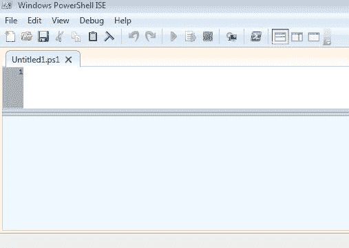
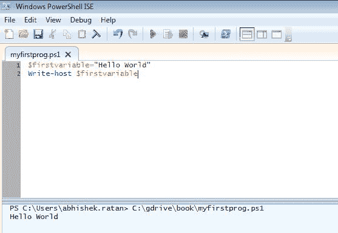
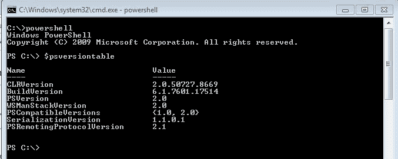
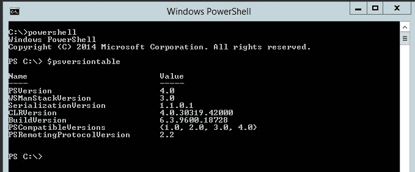
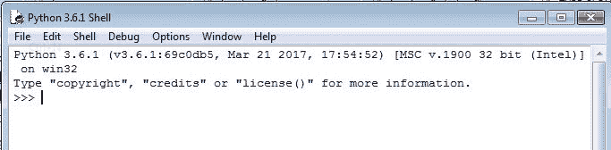
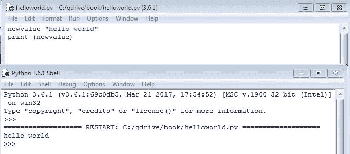
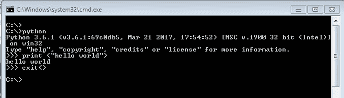
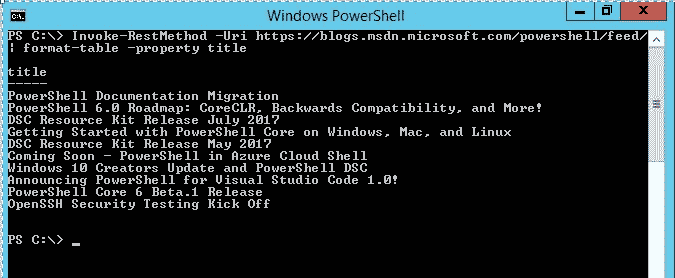
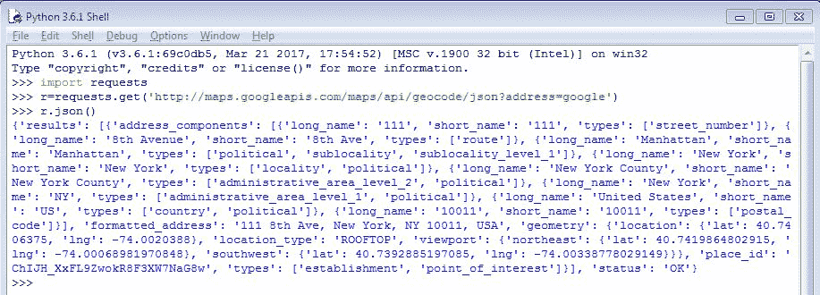

# 第一章：基本概念

本章介绍了网络自动化的概念，并使您熟悉自动化框架中的关键词。在我们深入探讨网络自动化的细节之前，了解为什么我们需要网络自动化以及如果我们接受自动化概念和框架，我们可以实现什么，这一点非常重要。本章还提供了对传统工程师和支持运营模式的洞察，并展示了网络自动化如何帮助缩小这一差距，以实现更高的效率和可靠性。

本章涵盖的一些主题包括以下内容：

+   什么是网络自动化？

+   DevOps

+   软件定义网络

+   OpenFlow 基础知识

+   基本编程概念

+   自动化编程语言选择

+   REST 框架简介

# 网络自动化

自动化，正如其词义所示，是通过理解、解释和创建逻辑来自动化特定任务的框架。这包括增强手动执行的任务的当前能力，同时降低这些任务的错误率，并专注于以减少的努力来扩展任务。

例如，假设我们需要升级一台思科路由器的 IOS 映像。这可能涉及多个任务，例如在路由器上加载映像、验证映像的校验和、（如果它是生产路由器）卸载流量、修改引导变量，最后，使用新映像重新加载路由器。

如果我们只需要升级一台路由器，所有这些都是可行的。现在，将类似的场景应用于大约 1,000 台路由器。

假设我们花费 30 分钟让每个路由器执行上述任务。这是一个简单的计算，1000*30=30,000 分钟的手动工作。

此外，如果我们手动在每个路由器上执行任务，想想可能出现的错误。

在这种情况下，网络自动化将非常有帮助，因为它可以处理所有上述方面，并并行执行任务。因此，如果手动对一个路由器进行 30 分钟的努力，在最坏的情况下自动化执行相同任务也需要 30 分钟，那么并行执行将导致所有 1,000 台路由器在相同的 30 分钟内升级完成。

因此，最终所需的时间将仅为 30 分钟，无论您向自动化框架投入多少台路由器。这也极大地减少了手动工作的需求，工程师可以专注于 1,000 台网络设备中的任何故障。

在接下来的章节中，我将向您介绍一些概念、工具和示例，这些将帮助您开始构建自动化框架，并在网络场景中有效地使用它们来执行网络相关活动。

这也假设您对网络概念和在网络中使用的常用术语有所了解。

我将提供的某些示例假设您熟悉 syslog、TACACS、基本路由器配置（如主机名）、iOS 镜像加载、基本路由和交换概念，以及**简单网络管理协议**（**SNMP**）。

# DevOps

从历史上看，每个网络部门都有两个特定的团队。其中一个团队是工程团队，负责构思新想法以改进网络，并设计、部署和优化当前的基础设施。这个团队主要负责从头开始执行配置和布线等任务。

另一个团队是支持团队。这个团队也被称为运维团队，确保当前部署的基础设施正常运行，并专注于执行日常活动，如升级、快速修复和对该网络基础设施的任何消费者的支持。在传统模型中，工程团队到运维团队之间会有交接和知识转移，以支持当前部署的基础设施。由于两个团队的分离，工程师团队成员可能不会专注于编写清晰的文档，有时甚至不会向运维团队成员提供足够的信息，导致故障排除和问题修复延迟。这甚至可能导致一个简单的解决方案因为与运维团队成员相比，工程团队成员采取的不同方法而扩大成更大的问题。

现在，为了解决这个问题，提出了 DevOps 模型，它结合了两个团队的最佳之处。DevOps 模型不仅仅是一个花哨的称号，它是一种需要在现有团队中培养的文化。在 DevOps 模型中，任何团队的工程师都对特定项目的完整生命周期负责。这包括创建部分基础设施并自行支持它。这个模型的一个大优点是，由于一个人创建了一部分系统并支持它，他们了解该部分的各个方面，并可以通过理解客户或用户体验中出现的挑战来再次工作，使其变得更好。DevOps 工程师应该了解他们创建的基础设施部分的工程和运维。通过将自动化技能集添加到 DevOps 经验中，工程师可以轻松管理复杂任务，并以比传统模型中分散在不同领域的工程师更好的方式关注可靠性和可扩展性。

# 软件定义网络

如你所知，存在多种专有网络设备，如防火墙、交换机和路由器，由不同的网络供应商制造。然而，由于每个不同供应商的专有信息，多个网络设备可能不会存在于单一的网络基础设施环境中。即使它们共同存在，网络工程师也必须专注于确保每个供应商设备可以在网络路径中无缝存在。有时，在多供应商环境中，一个路由协议可能不与所有网络设备兼容，这会导致大量时间被浪费在确保移除该协议或移除不支持该协议的供应商上。这可能会浪费努力和时间，而这些时间和努力本可以更好地用于改善基础设施。

为了解决这类问题，**软件定义网络**（**SDN**）已被引入。在 SDN 场景中，数据包流是从一个中央控制器定义的，该控制器随后与多供应商设备交互，根据所需的流量定义/创建规则。这完全将网络工程师的焦点转移到如何流量流动，数据包采取哪条路径，甚至通过在控制器上配置一些规则或策略来自动路由数据包以响应链路故障情况。SDN 的另一个优点是，多供应商设备现在不再是基础设施的核心。焦点转移到如何最优地执行路由和流量整形（识别流量流最优路径的过程）。作为软件驱动任务的一部分，有一些代码专门编写来控制特定任务或目标（类似于编程中的函数或方法）。这段代码由控制器决策或规则触发，进而向多供应商设备添加、修改或删除配置，以确保控制器上的规则集得到遵守。SDN 甚至有能力通过识别物理链路故障或设备完全故障来完全隔离故障域，而不会影响实时流量。例如，如果交换机收到一个目的地为它所不知道的网络的数据包，它会向控制器发出请求。在传统网络模型中，这将是数据包丢失或找不到路由，但通过 SDN，这是控制器的任务，为交换机提供目的地或路径信息，以正确路由数据包。

这确保了故障排除变得更加容易，因为网络工程师现在可以完全控制每条路径/数据包流，无论特定的供应商协议或技术支持如何。此外，由于我们现在遵循一套标准协议，我们甚至可以通过移除更昂贵的专有网络设备并用开放标准网络设备替换它们来降低成本。

# OpenFlow

OpenFlow 是一种通信协议，用于在不同厂商的设备之间进行数据包流的通信。该标准由一个名为 **开放网络基金会** （**ONF**） 的团体维护。正如其名所示，OpenFlow 通过结合 **访问控制列表** （**ACLs**） 和路由协议来控制网络层中数据包的流动。

OpenFlow 主要有两个组件——控制器和交换机。控制器用于在创建数据包在不同连接设备间流动的路径方面做出决策，而交换机（或网络设备）则根据数据包需要采取的路径从控制器动态配置。

深入一点，OpenFlow 控制器通过修改、添加或删除控制器决定的数据包匹配规则来控制 OpenFlow 交换机转发表中的数据包路由。

由于 OpenFlow 是另一种协议，它运行在 TCP 上，并在控制器上工作于端口 `6653`。在撰写本文时，OpenFlow 标准版本 1.4 正在活跃并广泛用于 SDN 框架中。OpenFlow 是专有网络厂商在其定制软件旁边运行的一项附加服务。通常，这确保了数据转发或数据包处理仍然是专有交换机的一部分，但数据流或控制平面任务现在由 OpenFlow 控制器接管。作为 SDN 框架的一部分，如果一个参与交换机收到一个数据包但不知道该将其发送到哪里，它会与 OpenFlow 控制器通信以获得答案。控制器根据其预先配置的逻辑决定对该未知数据包采取什么行动，并可以指示其控制的交换机为该数据包创建一个单独的或特定的路径以在网络中流动。正因为这种行为，这是目前在所有引入 SDN 的部署中正在部署的协议。

# 程序概念

现在，当我们开始着手于我们的自动化实践方法时，我们需要了解程序的基本概念以及如何编写程序。

简单来说，程序是一组传递给系统以执行特定任务的指令。这组指令基于现实生活中的挑战和需要以自动化方式完成的任务。小批次的程序可以组合起来创建一个应用程序，该应用程序可以安装、部署和配置以满足个人或组织的需求。从现在开始，我们将讨论的一些关键概念和编程技术包括 PowerShell 和 Python。这些是最受欢迎的脚本语言，用于创建快速、有效且结果导向的自动化。

这些是在创建程序时我想介绍的一些关键概念：

+   变量

+   数据类型

+   决策者

+   循环

+   数组

+   函数

+   最佳实践

# 变量

这些是预定义的、可读的、可理解的单词或字母，用于存储一些值。在编写程序的基础中，我们需要一个变量来存储数据或信息，并且基于变量，我们可以进一步增强编程逻辑。正如我们可以在第一行看到的那样，创建变量的一个重要部分是它应该是可读的和可理解的。

让我们举一个例子：假设我想将数字 `2` 存储在一个变量中。我们可以为变量选择任何名称并定义它：

```py
Option 1: x=2
Option 2: number=2
```

正确的答案将是 `选项 2`，因为我们通过变量名（`number`）知道这个变量包含一个特定的数字。正如先前的例子所示，如果我们继续以创建大型程序时的方式定义变量，由于变量的含义不明确，复杂性将会显著增加。

不同的编程语言有不同的定义变量的方式，但确保变量可读性的基本概念应该是程序员或程序作者的优先考虑。

# 数据类型

正如其名所示，这些是我们传递给变量的值的分类。一个变量可以被定义为存储特定类型的值，该值可以根据数据类型进行声明。

有多种数据类型，但就我们最初的讨论而言，有四种主要的数据类型需要理解：

+   **字符串**：这是一个通用的数据类型。任何定义为字符串的值就像说这个值是纯英文，包含字符、字母、特殊字符等。我将其称为通用数据类型，因为几乎所有其他数据类型都可以转换为字符串格式，在转换为字符串的过程中保持相同的值。

考虑以下示例：

```py
number=2
```

这定义了一个名为 `number` 的变量具有 `2` 的值。

同样地，如果我们声明：

```py
string_value="2"
```

这等同于说，值 `2` 现在已定义为字符串，并存储在名为 `string_value` 的变量中。

+   **整数**：这指定了任何数值都需要用这种数据类型来定义。这里要注意的关键点是整数值将包含一个整数，而不是小数值：

考虑以下示例：

```py
integernumber=2
```

这定义了一个名为 `integernumber` 的变量具有数字 `2` 的值。

这里的一个错误赋值可能如下所示：

```py
integernumber=2.4
```

在某些编程语言中，这会导致错误，因为整数需要被解释为整数，而不是小数值。

+   **浮点数**：这种数据类型消除了我们之前在整数中看到的限制。这意味着我们可以有一个小数，并且可以执行数学计算和在浮点数中存储小数值。

+   **日期时间**：这是在许多现代脚本语言中找到的一种扩展数据类型。这种数据类型确保存储或检索的值是以日期格式。如果我们需要创建一个使用一些时间或日期计算的程序，这通常非常有用。例如，我们可能需要找出在过去七天中由路由器生成的系统日志数量。最后七天将通过这种数据类型进行存储。

# 决策者

这些是程序中非常关键的部分，它们可以定义程序的流程。正如其名所示，决策者根据某个条件决定采取某种行动。

简而言之，如果你想买冰淇淋，你会去冰淇淋店，但如果你想喝咖啡，你会去咖啡店。在这种情况下，条件是你想买冰淇淋还是咖啡。行动是基于条件的结果的：你去了那个特定的商店。

这些决策者，也称为**条件**，在不同的脚本语言中以不同的方式定义，但每个条件的最终结果决定了程序的后续流程。

通常，在条件中，两个或多个值被比较，并返回真或假。根据返回的值，执行一组特定的指令。

考虑以下例子：

```py
Condition:
if (2 is greater than 3), then
Proceed to perform Option 1
else
Proceed to perform Option 2
```

正如前一个例子所示，一个条件被评估，如果`2 大于 3`，则程序流程将根据`选项 1`执行，如果为假（这意味着 2 不大于 3），则选择`选项 2`。

如果我们想要更多的复杂性，我们可以添加多个决策语句或条件，以细化程序的流程。

让我们举一个例子：

```py
if (Car is of red color), then
  if (Car is Automatic), then
    if (Car is a sedan), then
      Option 1 (Purchase the car)
    else (Option 2, ask for a sedan car from dealer)
  else (Option 3, ask for an Automatic car from dealer)
else (Option 4, ask for a red car from dealer)
```

正如我们可以看到这个复杂条件，我们可以很容易地根据额外的检查来决定程序的流程。在这种情况下，我只想要一辆`红色`、`自动`和`轿车`的`汽车`。如果这些条件中的任何一个不满足，那么我会要求经销商满足那个具体条件。

在前一个例子中，还有一个需要注意的事情是，条件彼此嵌套，因此它们被显示为通过空格嵌套，以决定子条件与其父条件。这通常在括号内或根据使用的脚本语言进行简单缩进来表示。

有时候，有必要将一个值与多个条件进行比较，并在它匹配任何条件时执行一个动作。这在编程中称为**switch case**。

考虑以下例子：

```py
Carcolor="Red" (Here we define a variable if the value of string as Red)
switch (Carcolor)
Case (Red) (Perform Option 1)
Case (Blue) (Perform Option 2)
Case (Green) (Perform Option 3)
```

在这里，我们可以看到，根据变量的值，可以执行某种类型的动作。在这种情况下，将执行选项 1。如果我们更改`Carcolor`变量的值为`蓝色`，则将执行选项 2。

条件的一个重要组成部分是比较运算符，我们使用它们来比较两个值以获得结果。一些示例运算符包括等于、大于、小于和不等。根据我们使用的比较运算符，结果可能会有所不同。

让我们举一个例子：

```py
greaternumber=5
lessernumber=6

if (greaternumber 'greater than' lessernumber)
Perform Option 1
else
Perform Option 2
```

我们声明了两个名为`greaternumber`和`lessernumber`的变量，并在条件中比较它们。我们使用的条件运算符是`大于`，如果条件为真（`greaternumber`大于`lessernumber`），则结果为选项 1，如果条件为假（`greaternumber`不大于`lessernumber`），则结果为选项 2。

此外，我们还有被称为逻辑运算符的运算符，如`AND`、`OR`或`NOT`。我们可以通过使用这些逻辑运算符来组合多个条件。它们在英语中有相似的意义，这意味着如果我们使用`AND`运算符，我们希望在执行动作之前，条件 1 和条件 2 都必须为真。

考虑一个例子：我想在`car`是`red`、`automatic`和`sedan`的情况下才购买一辆车：

```py
if (car is 'red') AND (car is 'automatic') AND (car is 'sedan')
Perform action 'buy car'
else
Perform action 'do not buy'
```

这仅仅意味着我会评估所有三个条件，并且只有当所有这些条件都为真时，我才会执行`buy car`动作。在这种情况下，如果任何条件不符合值，比如车是蓝色的，那么就会执行`do not buy`动作。

# 循环

如我们通常在日常生活中所知，循环就是一遍又一遍地重复相同的路径。换句话说，如果我被要求从冰淇淋店买五份冰淇淋，而我一次只能拿一份，我会重复去冰淇淋店购买冰淇淋五次的过程。将这一点与编程联系起来，如果需要多次执行相同的指令集，那么我们就将这些指令放在循环中。

一个非常基础的循环通常被描述为根据我们希望执行指令的次数来迭代一个变量的过程。

让我们举一个例子：

```py
Start the loop from one, until the loop has been repeated sixty times, adding a value of 1 to the loop:
Perform action
```

如果你看到指令被传递，在循环中有三个独立的段落被描绘出来：

1.  `从 1 开始循环`：这意味着循环应该从 1 的值开始。

1.  `直到循环重复六十次`：这意味着执行相同的任务集，直到循环完成六十次执行。

1.  `在循环中添加 1 的值`：这意味着我们规定在每次循环完成之后，循环计数增加 1。

结果将是执行相同动作六十次，直到循环计数达到六十。此外，循环可以用来遍历存储在变量中的多个值，无论它是整数、字符串还是任何其他数据类型。

# 数组

数组（或在某些脚本语言中称为列表）用于在单个变量中存储相似的多组值。这有助于确保所有具有相似意义的类型数据都存储在单个变量中，并且我们可以轻松地遍历这些数组对象以获取存储在数组中的值。

考虑以下示例：

```py
countries=["India","China","USA","UK"]
for specific country in countries 
 Perform action
```

正如我们在变量声明中可以看到的，现在我们通过将它们分组并分配给单个变量，以相似的数据类型和上下文或意义来声明。在我们的例子中，是将所有国家名称分配给一个名为`countries`的数组变量。在下一行，我们现在使用循环方法进行迭代，对于`countries`列表或数组中的每个`特定国家`，我们将执行操作。在这种情况下，循环将执行以对每个国家执行操作，从国家名称`India`到国家名称`UK`的末尾。

存储在数组中的每个值都被称为数组的元素。此外，数组可以很容易地进行排序，这意味着无论数组中元素的顺序如何，我们都可以通过调用一些额外的编程任务来获取排序后的列表或数组。

让我们考虑一个示例：

```py
countries=["India", "China", "USA","UK"]
Sort (countries)
```

结果将如下所示：

```py
countries=["China","India","UK",USA"]
```

排序功能确保数组内部的所有元素都按字母顺序排序并按排序顺序存储。

# 函数

函数或方法是一组预先编写的指令，当它们被调用时，会执行特定的任务。函数也可以定义为完成共同任务的一组编程指令的单一名称。

以驾驶作为一个函数的例子来考虑。在驾驶中，有许多事情需要关注，比如理解交通信号、驾驶汽车以及在交通和道路上驾驶汽车。

所有这些任务都被分组在一个名为`driving`的函数中。现在，假设我们有两个想要学习驾驶的人，示例 1 和示例 2。从编程的角度来看，一旦我们定义了一个函数，我们每次想要执行相同的一组任务时都需要调用它。因此，我们会调用`driving(example 1)`然后调用`driving (example 2)`，这将确保这两个人在经过`driving`函数中的指令集后都会成为驾驶员。

让我们再来看一个示例：

```py
countries=["India","China","USA","UK"]

function hellocountry(countryname)
 Return "hello " countryname

for each country in countries:
     hellocountry(each country)
```

在第一行，我们声明了一个包含国家名称作为元素的数组。接下来，我们定义了一个名为`hellocountry`的函数，它接受`countryname`作为输入。在函数本身中，我们简单地返回传递给函数作为输入的`countryname`的值，并在其前面加上`hello`这个词。

现在剩下的就是遍历所有国家的元素，并将每个`countryname`作为输入传递给`hellocountry`函数。正如我们所看到的，我们对每个元素调用了相同的函数，根据函数内部声明的指令，现在为数组中的每个元素执行了特定任务。

# 最佳实践

既然我们已经了解了程序一些关键组件的基础知识，那么我们还将考虑编写良好程序的一个重要方面。

从机器的角度来看，只要程序中给出的指令格式或语法正确，并且机器能够正确解释每条指令，那么程序是如何编写的就没有理解。对于最终用户来说，只要最终用户得到期望的结果，程序是如何编写的可能并不重要。关注程序编写方式的人是编写自己程序的程序员，或者需要解释其他程序员程序的程序员或开发者。

可能存在多个原因，使得程序员需要解释他们没有编写的程序。可能是因为在编写程序的程序员不可用时支持该程序，或者通过添加自己的代码或编程指令来增强程序。代码可读性的另一个原因是修复错误。任何程序或指令集都可能由于输入错误或不正确的逻辑而出现故障，这可能导致意外的行为或结果。这被称为错误，需要修复以确保程序按照最初编写的方式运行。

每个程序员都有自己的最佳实践，但程序的一些关键方面是可读性、支持信息和缩进。

# 程序的可读性

这是编写良好程序最重要的方面之一。程序需要以这种方式编写，即使是非专业人士或程序的第一位读者也应该能够理解正在发生的基本情况。

变量需要正确声明，以便每个变量都清楚地表明它存储的内容：

```py
x="India"
y="France"
```

可以写成这样：

```py
asiancountry="India"
europecountry="France"
```

这里还有一个例子：

```py
x=5
y=2
```

它可以写成这样：

```py
biggernumber=5
smallernumber=2
```

如前例所示，如果我们编写一个两行或三行的程序，我们可以很容易地以随机方式声明变量，但当这些随机变量在更长的程序中使用时，即使是编写自己程序的程序员，事情也会变得复杂得多。想象一下，如果你已经将变量声明为`a`、`b`、`c`等，然后在使用了 10 个或 15 个更多变量之后，你需要回到程序的每一行来理解`a`、`b`或`c`中声明了什么值。

编写良好程序的一个方面是注释。不同的脚本语言提供了不同的注释程序的方式。注释是必要的，以确保我们将每个程序分解为部分，每个部分都有一个注释解释该部分的使用。一个非常好的例子是如果你声明一个函数。例如，一个名为`Cooking`的函数和另一个名为`CookingPractice`的函数可能因为它们的名称而令人困惑。现在，如果我们对`Cooking`方法添加注释说“这个函数是在你学会了如何烹饪后掌握烹饪艺术”，并对`CookingPractice`添加注释说“这个方法是为了学习烹饪”，这可以使阅读程序的人更容易理解。

现在程序员可以轻松理解，当他想学习烹饪时，他必须调用`CookingPractice`而不是`Cooking`方法。注释在任何编程语言中都没有特殊含义，当机器试图将编程语言转换为机器指令时，它们会被忽略。因此，注释仅针对程序员，并让读者了解程序中的情况。每个复杂的条件、循环等也应该放置注释，以阐明该特定条件或循环的使用。

# 支持信息

如其名所示，这是附加信息，最好以注释的形式添加，包含有关程序和作者的信息。建议至少一个程序应包含作者信息（即创建程序的人）、联系电话和电子邮件地址、程序的基本使用或程序的目的以及程序的版本。

版本号是特定的，例如从 1.0 开始，随着我们增强程序或添加新功能，我们可以将其更改为 1.1 版本（用于小改动）或更新的版本，如 2.0 版本（用于重大更改）。

考虑一个例子：

```py
Program start
Comment: Author: Myself
Comment: Contact: myemail@emailaddress.com
Comment: Phone: 12345
Comment: Version: 1.0
Comment: Purpose: This program is to demo the comments for support info
Comment: Execution method: Open the Command Prompt and run this program by calling this program.
Comment: Any extra additional info (if needed)

Program end
```

这种方法确保每个人都知道脚本的最新版本以及如何执行程序或脚本。此外，这里还包含作者的联系方式，如果生产过程中出现任何问题，作者可以轻松地被联系以纠正或修复生产中的脚本。

# 缩进

这与我们用普通英语写作时所做的类似。在某些脚本语言中，缩进是强制性的，但作为最佳实践，我们应该遵循任何编程语言中编写的任何程序。缩进可以提高程序的可读性，因为它有助于程序员或阅读程序的其他人快速理解程序的流程。

让我们看看一个例子，其中我们有一个嵌套条件，检查一辆`Car`是否是`Red`，是否是`Sedan`，以及是否是`Automatic`。

写得不好的方式可能是如下所示：

```py
if (Car is 'Red')
if (Car is 'Sedan')
if (Car is 'Automatic')
do something
```

现在，想象一下将多行代码添加到长程序中，当你阅读时，程序流程会让你容易感到困惑。

更好且推荐的做法如下：

```py
if (Car is 'Red')
    if (Car is 'Sedan')
        if (Car is 'Automatic')
           do something
```

这提供了程序清晰的流程。只有当`Car`是`Red`时，才检查其他条件；否则，不要检查其他条件。这就是我们所说的条件嵌套，也称为**嵌套条件**。

这在调试复杂程序时也消除了很多困惑。我们可以通过快速解析程序并理解每个程序段的流程，轻松地识别出有问题的代码或指令。

# 样本最佳实践示例

此示例通过创建一个基本程序，总结了迄今为止我们所学到的所有最佳实践。

**问题陈述**：解析数组中声明的所有国家，并只打印那些名称中包含字母`I`或字母`U`的国家：

```py

Program begin:

Comment: This is a sample program to explain best practice
Comment: Author name: Programmer
Comment: Email: Programmer@programming.com
Version: 1.0

Comment: The following section declares the list of countries in array countrylist
countrylist=['India','US','UK','France','China','Japan']

function validatecountryname(countryname)
   Comment: This function takes the input of countryname, checks if it contains I or U and returns value based upon the result.
   if ((countryname contains 'I') OR (countryname contains 'U')
         return "Countryname contains I or U"
   else
       return "Countryname does not contain I our U"

Comment: This is a loop that parses each countryname from the countrylist one by one and sends the variable 'countryname' as input to function validatecoutryname

foreach countryname in countrylist
     validatecountryname (countryname)

Comment: Program ends here

```

程序是自我解释的，但值得注意的是支持注释，如作者、电子邮件等。缩进确保任何读者都能清楚地了解程序的流程。

此外，还有一个需要注意的事情是使用清楚地描述变量或名称用途的名称。每个变量和函数名称都清楚地说明了它的用途。中间的附加注释行增加了对每个段做什么以及语句或函数目的的清晰度。

# 语言选择（Python/PowerShell）

前进，掌握了编写程序和理解最佳实践的知识，我们现在将探讨一些适合我们自动化脚本的脚本语言。脚本语言和编程语言（如 C 和 C++）之间的基本区别在于，脚本语言不是编译的，而是通过它执行的底层环境进行解释（换句话说，需要一个转换器将人类可读格式的命令转换为机器格式，一次解析一行），而编程语言主要是编译的，因此可以在多个环境中执行，而无需使用任何特定的底层环境或要求。

这意味着如果我用 Python、PowerShell 或甚至 Perl 编写脚本，我需要安装那种特定的语言才能运行我编写的程序。C 或 C++代码可以编译成可执行文件（`.exe`），可以独立运行，无需安装任何语言。此外，脚本语言代码密集度较低，这意味着它可以自动解释程序中的一些代码，具体取决于如何调用。

让我们考虑一个例子。以下是我们在脚本语言中声明变量的方式：

```py
x=5
```

OR

```py
x="author"
```

OR

```py
x=3.5
```

而在编程语言中，声明的方式可能是这样的：

```py
integer x=5
String x="author"
Float x=3.5
```

这表示，根据我们分配给变量的值，脚本语言中会自动识别变量类型，而在编程语言中，声明是严格控制的。在这种情况下，如果我们声明一个变量为 `String` 类型，这清楚地意味着除非我们明确更改该变量的数据类型，否则我们不能在该变量中声明任何其他类型的值。

我们主要使用三种类型的脚本语言来创建程序，这些语言主要用于自动化脚本或编程。这些是 Perl、Python 和 PowerShell。

随着 Perl 这种最古老的语言的支持减少，现在的焦点转向了 Python，因为它具有开源支持，以及 PowerShell，因为它具有微软或 .NET 环境。比较这两种语言并不理想，因为读者可以根据自己的喜好选择使用哪种编程语言来编写程序。由于我们超过 70% 的计算机运行 Windows，并且随着微软 Azure 作为微软的云操作系统市场的增长，PowerShell 由于其底层的 .NET 环境而成为首选语言。在我们用 PowerShell 创建程序时，很容易将该程序移植到运行 Windows 的另一台机器上并执行，而无需任何特殊设置。

另一方面，Python 由于其开源方法而越来越受欢迎。有成千上万的开发者通过添加特定任务的特殊功能来增强 Python。例如，有一个名为 `Paramiko` 的函数或子程序，用于登录网络路由器。另一个是 `Netmiko`，它是 `Paramiko` 的增强版本，用于根据网络硬件供应商和操作系统（如 Cisco iOS 或 Cisco NXOS）登录网络设备。在编写并成功执行 Python 程序之前，需要安装 Python。

今后，我们的重点将是 Python，同时还会提供一些额外的技巧和窍门，介绍如何使用 PowerShell 而不是 Python 来执行相同的任务。

# 编写您的第一个程序

现在，因为我们是从零开始，我们需要了解如何编写我们的第一个程序并执行它。PowerShell 预装在 Windows 机器上。但我们需要从网上（[`www.python.org`](https://www.python.org)）下载 Python 并选择适合您操作系统的正确版本。下载后，它可以像在 Windows 机器上安装任何其他应用程序一样安装。

在 Linux 机器上，情况也是如此，但由于 .NET 的要求，PowerShell 不会在 Linux 或 Unix 环境中得到支持。因此，如果我们使用 Unix 或 Linux 环境，Python 或 Perl 仍然是我们的首选脚本语言。

对于 Python 和 PowerShell 都有多种 **集成开发环境**（**IDEs**），但这些语言自带的一些默认 IDE 也相当有帮助。

正在使用多个版本的 PowerShell 和 Python。当在更高版本中编写程序时，通常向后兼容性不是很好，所以在选择版本之前请确保注意用户和环境。

在我们的情况下，我们将使用 PowerShell 4 和 Python 3 及以上版本来编写程序。一些命令可能在 PowerShell 和 Python 的旧版本中无法运行，并且一些语法或命令在旧版本中是不同的。

# PowerShell IDE

这可以通过点击开始按钮并搜索 Windows PowerShell ISE 来调用。一旦调用，初始屏幕将看起来像这样：



如前述截图所示，PowerShell 脚本以`.ps1`扩展名保存。一旦我们在 IDE（或称为 PowerShell 的 ISE）中编写了一些内容，它需要保存为`somefilename.ps1`然后执行以查看结果。

让我们编写一个名为`Hello World`的程序：



+   如我们可以在我们的第一个程序中看到，我们写入两行来打印`Hello World`。在 ISE 中，我们通过传递命令来声明一个变量（在 PowerShell 中，变量通过在变量前加美元符号`$`来表示），将值`Hello World`赋给它。下一行是简单地通过调用一个名为`Write-host`的方法或函数来打印这个变量，这个方法或函数用于在 PowerShell 中屏幕上打印值。

+   一旦我们编写了程序并保存，下一步就是执行以查看我们的结果。

+   ISE 顶部的绿色按钮用于执行脚本，脚本的结果显示在屏幕底部。在这种情况下，它是一个简单的`Hello World`输出。

PowerShell 脚本也可以通过命令行直接调用。由于 PowerShell 是一种脚本语言并且需要在机器上安装，我们可以直接从 Windows 命令提示符调用 PowerShell 并从 PowerShell 控制台本身执行脚本和单个脚本命令。

这就是我们如何找出 PowerShell 的版本：



如前述截图所示，PowerShell 是通过在 Windows 的命令提示符中直接调用`powershell`来调用的。当 PowerShell 被调用时，我们在命令行前看到`PS`，这确认我们现在在 PowerShell 控制台中。要查看版本，我们调用系统变量`$psversiontable`，它显示了 PowerShell 的版本。

我们可以看到这是 2.x 版本（如`CLRVersion`所示）。系统变量是具有基于安装类型的预定义值的特殊变量。这些特殊变量可以在我们的脚本中的任何时候调用以获取它们的值并基于返回值执行操作。

以下示例显示我们正在使用 PowerShell 的更高版本：



如我们所见，相同的变量现在为`PSVersion`返回值为`4.0`，这证实了这是 PowerShell 的 4 版本。

PowerShell 4.0 是从 Windows 8.1 开始作为客户端操作系统的默认安装，在服务器环境中是 Windows Server 2012 R2。

# Python IDE

与 PowerShell 类似，一旦安装了 Python，它就有自己的 IDE。可以通过在开始菜单中键入或调用 IDLE（Python）来调用它：



当打开时，Python IDE，称为 IDLE，看起来与前面的截图相似。标题栏显示了 Python 的版本（在这个例子中是 3.6.1）和三个大于号（`>>>`）显示了命令行，它已准备好接受 Python 命令并执行它们。要编写程序，我们点击文件 | 新建文件，这将在记事本中打开，我们可以在这里编写程序。

让我们看看 Python 中的类似`hello world`程序：



当我们编写一个新的程序时，所使用的变量是`newvalue`，分配给它的值是`hello world`。下一行仅仅是调用 Python 的`print`函数来在脚本执行期间打印变量内的值。

一旦我们编写了程序，我们就在编写程序的窗口中点击文件 | 另存为，并将脚本保存。脚本以`filename.py`保存，其中`.py`扩展名表示 Python 脚本。一旦保存，我们可以在键盘上按*F5*按钮或在脚本窗口中选择运行 | 运行模块来运行该特定脚本。以下窗口是我们第一次从开始菜单调用 IDLE 应用程序时调用的同一窗口，但现在它有我们编写的脚本的输出。

`hello world`的输出现在在 IDLE 窗口中可见。一旦我们完成了编写脚本或 Python 命令，我们只需简单地关闭打开的命令窗口来关闭应用程序或 Python 解释器。

与 PowerShell 类似，我们也可以从命令行调用`python`，如下所示：



这里还有一个需要注意的额外事项是，要退出 Python 解释器，我们调用`exit()`函数。这告诉 Python 停止执行并退出到 Windows 的命令提示符。

# 表征状态转移（REST）框架

网络自动化最重要的方面之一是理解和利用目前可用于特定任务的工具。例如，这可能是用于数据挖掘的 Splunk，用于网络监控的 SolarWinds，syslog 服务器，或者任何用于执行各种任务的定制应用程序。

编写应用程序的另一个重要方面是如何在不更改应用程序本身的情况下利用同一应用程序执行额外任务。换句话说，假设我们为了个人使用买了一辆汽车，但这个增强功能是使用同一辆车作为出租车或扮演其他角色。

这是我们介绍 **应用程序编程接口** **(API**)。APIs 用于暴露已编写应用程序的一些方面，以便与我们所编写的程序合并，这样我们就可以通过特定的 API 轻松调用特定的任务。例如，由于 SolarWinds 是一种用于网络监控和其他目的的专业应用程序，我们可以通过 SolarWinds 的 API 在我们的脚本中获取网络设备列表。因此，我们将发现网络设备的专门任务留给 SolarWinds，但通过该应用程序的 API 在我们的脚本中利用其专业知识。

深入一点，API 仅仅是一个函数（类似于我们在脚本中编写的函数）；唯一的区别是这些函数返回的值。API 函数通常以 **扩展标记语言 (XML**) 或 **JavaScript 对象表示法 (JSON**) 格式返回值，这些是跨环境和跨机器信息交换的行业标准。想象一下，这就像我们使用英语作为通用语言进行交流一样。尽管我们可能出生在不同的文化、不同的国家，但我们可以使用英语有效地进行交流，因为英语是人际互动的行业标准。同样，无论程序是用什么语言编写的（例如 C、C++、Java、VB、C# 等），每个程序都可以通过调用其 API 与另一个程序进行通信，结果以 XML 或 JSON 格式返回。

XML 是一种标准的编码方式，用于将结果发送给请求者，并且使用相同的标准，请求者可以解码这些结果。JSON 是另一种数据交互可以在应用程序之间发生的方式。

下面是一个示例 XML：

```py
<?xml version="1.0" encoding="UTF-8"?> 
<note>
  <to>Readers</to>
  <from>JAuthor</from>
  <heading>Reminder</heading>
  <body>Read this for more knowledge</body>
 </note>
```

前面的内容的第一行表明，该行之后的内容是以 XML 格式。XML 文件以 `.xml` 扩展名保存。

现在我们可以看到，如果我们计算从 XML 结果返回的字符数，如果我们加上像 `<heading>Reminder</heading>` 这样的字符，它返回的结果在 `<heading>` 的起始标签和结束标签之间。这意味着由于额外的关闭标签的字符计数开销，XML 文件的大小大大增加。

下面是相同的示例以 JSON 格式呈现：

```py
{
 "note": {
 "to": "Tove",
 "from": "Jani",
 "heading": "Reminder",
 "body": "Don't forget me this weekend!"
 }
 }
```

正如我们所看到的，我们已经摆脱了之前在 XML 中看到的那些额外的庞大开标签和闭标签。这意味着，如果我们调用 API 以 XML 格式返回大量数据，那么从应用程序获取这些数据肯定需要更长的时间，并且需要更多资源（如内存和存储）来临时或永久存储这些数据。为了克服这种情况，现在更倾向于使用 JSON 格式而不是 XML 通过 API 交换数据。由于数据返回方式的不同，JSON 相比 XML 轻量级且资源消耗较少。JSON 文件以 `.json` 扩展名保存。

这种与 API、后端方法和特定编程语言编写的函数（称为 API）以及返回 XML 或 JSON 格式值的函数一起工作的功能，所有这些都在 HTTP 或 HTTPS 等网络协议上运行，统称为 REST 框架。REST 框架是之前提到的使用 XML 或 JSON 进行交互的行业标准，增加了通过网络协议（如 GET、POST 等）发生的交互。API 的 HTTP 请求可以是 REST 框架识别的 GET 或 POST 请求，类似于 HTTP GET 和 POST 请求，与底层应用程序交互以执行请求的操作。

脚本语言严重依赖于 API 调用，需要提供 API 功能的应用程序必须遵守 REST 框架的要求，以确保它们能够扩展其功能，以便调用脚本以获取或保存数据。这种做法的一个重大好处是，现在跨平台通信正在发生，双方（API 的调用者或提供 API 功能的应用程序）都不知道对方正在运行哪种语言或环境。因此，Windows 应用程序可以轻松地与 Unix 环境协同工作，反之亦然，使用这种方法，HTTP 是调用 API 的标准通信语言，并使用行业标准 XML 或 JSON 格式解析结果。

PowerShell 中的示例 API REST 调用如下：



如前一张截图所示，我们在 PowerShell 中调用 `Invoke-RestMethod` 函数，该函数用于使用默认的通信和交互方式通过 JSON 调用应用程序的 API 方法。

被调用的应用程序位于 REST 框架中，可以通过 URL [`blogs.msdn.microsoft.com/powershell/feed/`](https://blogs.msdn.microsoft.com/powershell/feed/) 访问 API。这使用 HTTPS 协议与应用程序进行通信。

`format-table` 是 PowerShell 中的一个函数，它指定无论结果如何，都显示从 API 调用返回的每个记录/结果的 `title` 属性。如果我们没有使用该命令，显示将显示每个记录返回的所有属性。

下面是一个 Python 中的示例 REST 调用：



在这个例子中，我们调用一个名为 `requests` 的标准函数。第一行 `import requests` 表示我们在 Python 脚本中引用了 `requests` 函数或库。在下一行，我们使用 `requests.get` 方法通过 JSON 调用 Google Map API。换句话说，我们确保对 Google API URL 进行 HTTP GET 调用。一旦我们得到结果，我们调用 `json()` 方法将值存储在变量 `r` 中。

有时候，当我们使用`import`调用 Python 的自定义函数或库时，可能会出现一个错误，表明找不到该模块。这意味着它不包括在标准的 Python 安装中，需要单独安装。为了解决这个问题，我们可以使用`pip`或`easy_install`命令手动安装模块，这些内容我们将在接下来的章节中详细讨论。

# 摘要

本章涵盖了我们在执行网络自动化时将使用的各种术语的基础知识。本章还向读者介绍了编程的一些基本方面，以帮助构建程序的逻辑。

本章还解释了为什么要编写一个好的程序以及如何编写一个程序，并附带了一些关于脚本语言的参考点。还简要讨论了当前脚本语言的基本用法，以及在两种最受欢迎的脚本语言（Python 和 PowerShell）中编写一个非常基础的程序。

最后，我们通过介绍 REST 框架来总结所有内容，其中包括了关于 API 的讨论、如何调用它们，以及 XML 和 JSON 作为跨平台数据交换语言的解释。

下一章将更深入地探讨如何使用 Python 编写脚本，并附带 PowerShell 的相关示例，以确保读者熟悉 Python 和 PowerShell。还将提供一些技巧和最佳实践。
