# 网络工程师的 Python

既然我们已经熟悉了如何使用编程语言中的概念以及最佳实践来编写程序，现在让我们深入探讨编写实际的 Python 程序或脚本。主要关注如何在 Python 中编写程序，我们还将看到如何用 PowerShell 编写相同的程序，因为在某些时候我们可能需要使用 PowerShell 来实现我们想要的结果。我们将涵盖创建程序的各种方面，并对每个语句进行一些解释，并提供一些技巧和窍门来应对那些棘手的情况。

在本章中，我们将涵盖以下主题：

+   Python 解释器和数据类型

+   使用条件循环编写 Python 脚本

+   函数

+   安装新的模块/库

+   为脚本从命令行传递参数

+   使用 Netmiko 与网络设备交互

+   多线程

# Python 解释器和数据类型

如同其名，解释器用于解释指令，以便其他人可以理解。在我们的情况下，它用于将我们的 Python 语言转换为机器可理解的格式，该格式控制了我们给机器的指令流。

它也被用来将机器给出的值和消息转换成人类可读的格式，以便让我们了解我们的程序是如何执行的。

如 第一章 中所述，*基本概念*，我们关注的解释器是 Python 3.6。我将在 Windows 平台上使用它，但网站上提供了如何在 Unix 或 Linux 机器上下载和安装的明确说明。一旦我们从 Python 社区下载并安装它，可以在 URL [`www.python.org/downloads`](https://www.python.org/downloads) 上找到，我们只需单击安装文件即可安装。从安装目录中，我们只需调用 `python.exe`，这将调用 Python 解释器。

为了在您的命令提示符的任何位置调用 Python，只需将 Python 安装文件夹添加到您的 PATH 变量中。

以下是一个示例：`set path=%path%;C:\python36`。这将向当前路径添加 Python36 路径。一旦完成，就可以在任何命令提示符下调用 `python.exe`。

一旦我们调用解释器，首先要做的步骤是创建一个变量并给它赋值。

Python，就像任何其他编程语言一样，支持各种数据类型用于变量。数据类型通常定义了可以存储在变量中的值的类型，但 Python 和 PowerShell 有能力根据值自动评估变量的类型。Python 支持大量数据类型，但在我们日常使用中，我们通常多次引用原生数据类型。

Python 数据类型支持：

+   **数字**：这些是整数类型，例如 1、2、100 和 1,000。

+   **字符串**：这些是单个或多个字符，可能是 ASCII 中的每个字母，例如 Python、network、age123 和 India。此外，字符串需要存储在双引号（`"`）或单引号（`'`）内，以指定值是一个字符串。因此，`1` 和 `'1'` 在 Python 中会被解释为不同的值。

+   **布尔值**：这可以是真或假值。

+   **字节**：这些通常是二进制值。

+   **列表**：这些是有序值序列。

+   **元组**：这些与列表类似，但值或长度不能更改。

+   **集合**：这些与列表类似，但不排序。

+   **字典**或**哈希**值：这些是键值对，类似于电话簿，其中一个主要值（名称）与电话号码和地址相关联。

数据类型的示例如下：

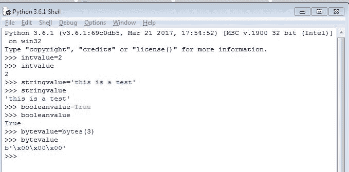

如前例所示，我们声明了具有各种值的变量，Python 根据值自动解释特定的数据类型。如果我们再次输入变量名，它将根据其数据类型打印出存储在变量中的值。

类似地，以下示例指定了其他原生数据类型：

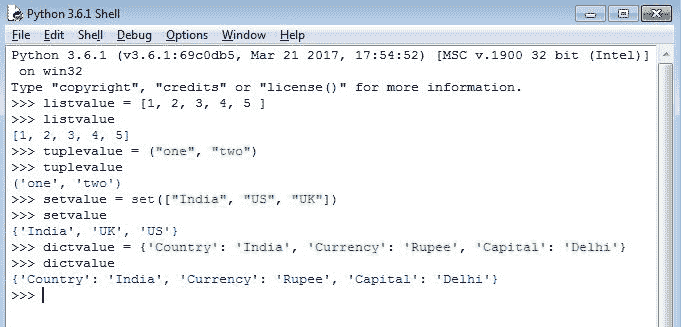

此外，要查看数据类型，我们可以使用 `type()` 函数，该函数根据我们给出的值返回变量的类型。变量作为参数传递给 `type()` 函数以获取数据类型值：

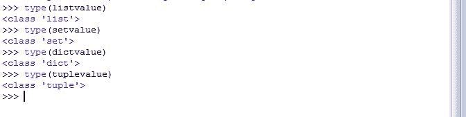

PowerShell 中的相同 Python 代码示例如下：

```py
#PowerShell code
$value=5
$value="hello"
write-host $value
write-host $value.gettype()
#This is remark
#A variable in powershell is declared with '$' sign in front.
# The gettype() function in powershell is used to get the type of variable.

```

对于特定数据类型的变量，存在一些操作，例如加法（`+`）。我们必须确保我们正在添加的变量类型。如果我们有一个不兼容的数据类型变量被添加到另一个变量中，Python 会抛出一个错误，说明原因。

在以下代码中，我们看到两个字符串变量相加的结果：

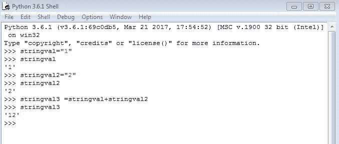

类似地，观察如果我们对整型变量使用相同的加法操作时的差异：

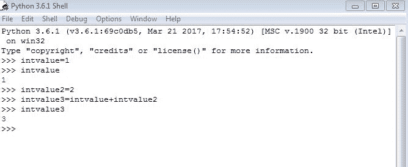

如前所述，让我们看看当我们尝试将字符串和整型变量相加时会发生什么：

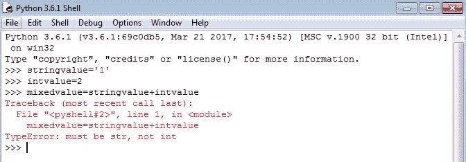

错误清楚地指出，我们不能添加两个不同的数据类型，因为解释器无法识别需要分配给混合值变量的数据类型。

有时，如果需要，我们可以通过调用将数据类型转换为另一个数据类型的特定函数来将值从一个数据类型转换为另一个数据类型。例如，`int("1")` 将字符串值 1 转换为整数值 1，或者 `str(1)` 将整数值 1 转换为字符串值 1。

我们将根据脚本的逻辑和需求广泛使用各种数据类型，并在必要时将一种数据类型转换为另一种数据类型以实现某些结果。

# 条件和循环

条件是通过左右值比较来检查的。评估返回 true 或 false，并根据结果执行特定操作。

有一些条件运算符用于评估左右值的比较：

| **运算符** | **含义** |
| --- | --- |
| `==` | 如果两个值相等 |
| `!=` | 如果两个值不相等 |
| `>` | 如果左值大于右值 |
| `<` | 如果左值小于右值 |
| `>=` | 如果左值大于或等于右值 |
| `<=` | 如果左值小于或等于右值 |
| `in` | 如果左值是右值的一部分 |

条件评估的一个例子如下：

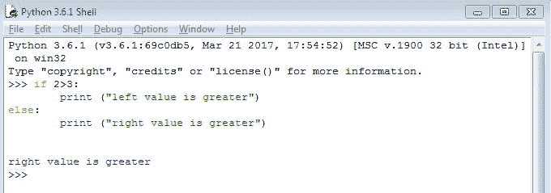

如我们所见，我们正在检查 `2>3`（2 大于 3）。当然，这将导致错误，因此 `else` 部分的操作将被执行。如果我们反转检查，`3>2`，那么输出将是 `left value is greater`。

在前面的示例中，我们使用了 `if` 条件块，它由以下内容组成：

```py
if <condition>:     
perform action
else:   
perform action2
```

注意缩进，这在 Python 中是强制性的。如果我们没有打算这样做，Python 就不会解释在哪个条件下执行哪个操作，因此会抛出缩进错误。

# 嵌套和多个条件

有时我们需要在单个 `if` 条件中检查多个条件。

让我们看看一个例子：

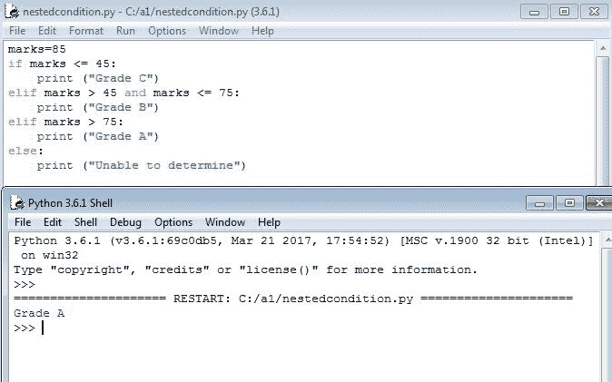

在这里，我们正在检查分数的范围。程序的流程如下：

将 `85` 的值分配给 `marks` 变量。如果 `marks` 小于或等于 `45`，则打印 `Grade C`，否则如果 `marks` 大于 `45` 且小于等于 `75`，则打印 `Grade B`，否则如果 `marks` 大于 `75`，则打印 `Grade A`，否则如果前面的所有条件都不匹配，则打印 `Unable to determine`。

PowerShell 之前 Python 任务的示例代码如下：

```py
#PowerShell sample code:
$marks=85
if ($marks -le 45)
{
    write-host "Grade C"
}
elseif (($marks -gt 45) -and ($marks -le 75))
{
    write-host "Grade B"
}
elseif ($marks -gt 75)
{
    write-host "Grade A"
}
else
{
    write-host "Unable to determine"
}
```

同样，这里是一个嵌套条件的示例（注意缩进，它将此与多个条件的早期示例区分开来）：

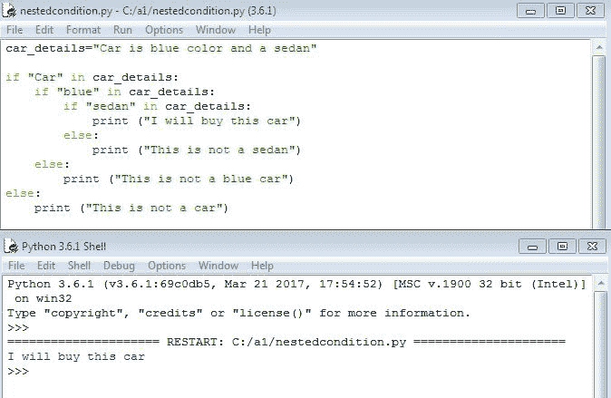

如我们所见，在条件中，只有当父条件评估为 true 时，内部条件才会执行。如果有 false，则执行相应的 `else` 操作。在示例中，如果 `car_details` 变量包含 `Car`，包含 `blue`，并且包含 `sedan`，那么才会执行操作 `I will buy this car`。如果这些条件中的任何一个不满足，则执行相关的 `else` 操作。

# 循环

循环用于重复一组指令，直到满足特定条件。Python 中创建循环有两种常见方式，如下所述：

# 用于下一个循环

这种循环检查条件并在条件满足之前重复循环内的指令：

```py
for <incremental variable> in final value:
  statements
```

下面是一个在`for`循环中打印 1 到 10 的数字的例子：

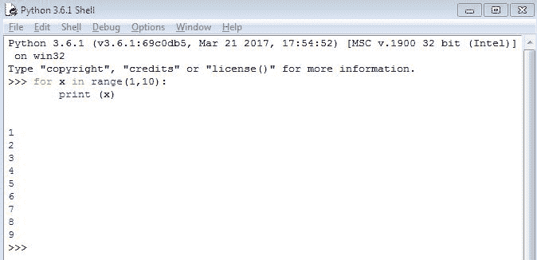

如我们所见，我们使用了一个内置的`range(starting value, max value)`函数，该函数指定循环从起始值开始重复，直到增量值达到最大值。在这种情况下，变量`x`增加 1，并在每个循环中打印出值。这会一直重复，直到`x`的值达到`10`，此时`for`循环结束。

以类似的方式，我们也可以遍历给定列表中的项：

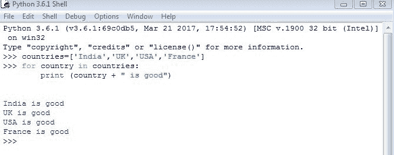

以下是对应 Python 代码的 PowerShell 示例：

```py
#PowerShell sample code:
$countries="India","UK","USA","France"
foreach ($country in $countries)
{
    write-host ($country+" is good")
}
```

在这里，我们可以看到值被分配给`countries`变量作为一个列表。`for`循环现在遍历列表中的每个项，打印语句将字符串值添加到另一个字符串值中并打印结果。这个循环会一直重复，直到列表中的所有项都被打印出来。

有时候我们可能不想遍历整个`for`循环。为了在循环迭代时跳出循环，我们使用`break`语句。以下是一个例子，我们希望在`country`列表中的`UK`之后停止打印：

```py
 for country in countries:
     if 'UK' in country:
         break
     else:
         print (country)
```

# `While`循环

`While`循环与`for`循环不同，因为这个循环中不需要新的变量，任何当前变量都可以用来执行`while`循环内的任务。以下是一个例子：

```py
while True:
     perform instructions
     if condition():
       break
```

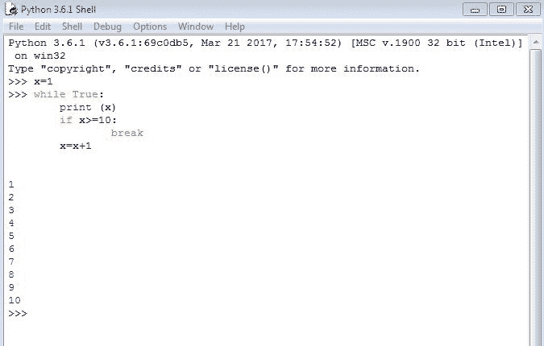

这与`for`循环类似，但在这个情况下，操作首先执行，然后检查条件。在上面的例子中，首先打印`x`的值，然后重复相同的指令集，直到`x`的值达到`10`或更大。一旦满足`if`条件，我们就跳出循环。如果我们没有指定`break`条件，我们将进入一个无限循环，每次`x`的值增加 1。

# 编写 Python 脚本

现在，我们已经熟悉了 Python 的基本概念。接下来，我们将编写一个实际的 Python 程序或脚本。

请求输入一个国家名称，并检查该国家的最后一个字符是否为元音：

```py
countryname=input("Enter country name:")
countryname=countryname.lower()
lastcharacter=countryname.strip()[-1]
if 'a' in lastcharacter:
    print ("Vowel found")
elif 'e' in lastcharacter:
    print ("Vowel found")
elif 'i' in lastcharacter:
    print ("Vowel found")
elif 'o' in lastcharacter:
    print ("Vowel found")
elif 'u' in lastcharacter:
    print ("Vowel found")
else:
    print ("No vowel found")
```

上述代码的输出如下：

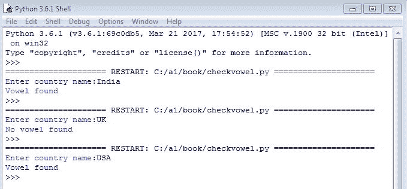

1.  我们请求输入一个国家名称。`input()`方法用于从用户获取输入。输入的值是字符串格式，在我们的例子中，`countryname`变量已被分配了输入值。

1.  在下一行，`countryname.lower()`指定我们接收到的输入需要转换为全小写并存储在相同的`countryname`变量中。这实际上将具有与我们之前输入相同的值，但为小写。

1.  在下一行，`countryname.strip()[-1]`在一个语句中指定了两个操作：

+   +   `countryname.strip()`确保变量移除了所有前导和尾随的额外值，例如换行符或制表符。

    +   一旦我们得到干净的变量，就移除字符串的最后一个字符，在我们的例子中是国名最后一个字符。`-1`表示从右到左或从结束到开始的位置，而`+1`则表示从左到右。

1.  一旦我们将最后一个字符存储在`lastcharacter`变量中，所需的就是嵌套条件检查，并根据结果打印值。

要保存此程序，我们需要将此文件保存为`somename.py`，这将指定此程序需要用 Python 执行：

以下是为前面 Python 任务提供的 PowerShell 示例代码：

```py
#PowerShell sample code
$countryname=read-host "Enter country name" 
$countryname=$countryname.tolower()
$lastcharacter=$countryname[-1]
if ($lastcharacter -contains 'a')
{
    write-host "Vowel found"
}
elseif ($lastcharacter -contains 'e')
{
    write-host "Vowel found"
}
elseif ($lastcharacter -contains 'i')
{
    write-host "Vowel found"
}
elseif ($lastcharacter -contains '0')
{
    write-host "Vowel found"
}
elseif ($lastcharacter -contains 'u')
{
    write-host "Vowel found"
}
else
{
write-host "No vowel found"
}
```

Python 在缩进方面非常严格。正如我们可以在示例中看到的那样，如果我们改变缩进或制表符，即使是一个空格，Python 也会抛出一个错误，指出缩进不正确，编译将失败。这将导致错误，除非缩进被修复，否则执行将不会进行。

# 函数

对于任何重复的指令集，我们可以定义一个函数。换句话说，一个函数是一组封闭的指令，用于执行特定的逻辑或任务。根据提供的输入，函数能够返回结果或使用特定的指令解析输入以获取结果，而不返回任何值。

函数是通过`def`关键字定义的，它指定我们需要定义一个函数并提供与该函数相关的指令集。

在这个任务中，我们将打印两个输入数字中较大的一个：

```py
def checkgreaternumber(number1,number2):
    if number1 > number2:
      print ("Greater number is ",number1)
    else:
     print ("Greater number is",number2)
checkgreaternumber(2,4)
checkgreaternumber(3,1)
```

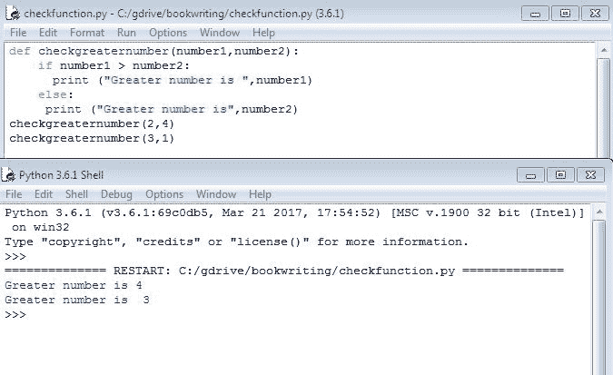

正如我们在前面的输出中可以看到的那样，第一次我们调用`checkgreaternumber(2,4)`函数时，函数打印出较大的值为`4`，而第二次我们用不同的数字调用该函数时，函数打印出较大的值为`3`。

以下是为前面任务提供的 PowerShell 示例代码：

```py
#PowerShell sample code
function checkgreaternumber($number1,$number2)
{
    if ($number1 -gt $number2)
    {
        write-host ("Greater number is "+$number1)
    }
    else
    {
        write-host ("Greater number is "+$number2)
    }
}

checkgreaternumber 2 4
checkgreaternumber 3 1
```

我们可以重写同一个函数，但不是在函数内部打印值，而是应该返回较大的数字：

```py
def checkgreaternumber(number1,number2):
    if number1 > number2:
      return number1
    else:
     return number2

print ("My greater number in 2 and 4 is ",checkgreaternumber(2,4))
print ("My greater number in 3 and 1 is ",checkgreaternumber(3,1))
```

在这种情况下，正如我们所看到的，函数返回值，结果是在函数被调用的行返回的。在这种情况下，因为它是在`print`函数内部被调用的，它评估输入并返回值，该值也在同一个`print`函数内部打印出来。

```py
#PowerShell sample code
function checkgreaternumber($number1,$number2)
{
    if ($number1 -gt $number2)
    {
        return $number1
    }
    else
    {
        return $number2
    }
}

write-host ("My greater number in 2 and 4 is ",(checkgreaternumber 2 4))
write-host ("My greater number in 3 and 1 is ",(checkgreaternumber 3 1))
```

函数的另一个重要方面是我们可以在函数中提供的默认值。有时我们需要编写可能接受多个值作为输入的函数，比如 4、5 或更多。由于很难知道我们需要什么值以及它们的顺序，我们可以确保在调用该特定函数时，如果未提供任何值，则考虑默认值：

```py
def checkgreaternumber(number1,number2=5):
    if number1 > number2:
      return number1
    else:
     return number2
print ("Greater value is",checkgreaternumber(3))
print ("Greater value is",checkgreaternumber(6))
print ("Greater value is",checkgreaternumber(1,4))
```

代码执行的输出如下：

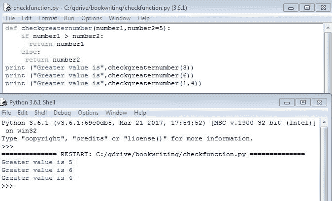

1.  如前所述的输出所示，我们指定了`number2`的默认值为`5`。现在，正如我们可以在函数的第一次调用中看到的那样，我们只提供了值`3`。现在，由于函数需要两个输入或参数，但我们只提供了一个，所以函数的第二个值取自默认值，在这个例子中是`5`。因此，将`3`和`5`进行比较以获取较大的数字。

1.  在函数的第二次调用中，使用`6`进行了类似的调用，并且由于没有提供其他值，比较是在`6`和`5`之间进行的，返回的是较大的值，即`6`。

1.  在第三次调用中，我们提供了两个值，这覆盖了任何默认值，因此进行了`1`和`4`的比较。结果被评估，并返回了`4`的输出。

另一个重要的考虑因素是函数中变量的本地化：

```py
globalval=6

def checkglobalvalue():
    return globalval

def localvariablevalue():
    globalval=8
    return globalval

print ("This is global value",checkglobalvalue())
print ("This is global value",globalval)
print ("This is local value",localvariablevalue())
print ("This is global value",globalval)
```

前述代码的输出如下：

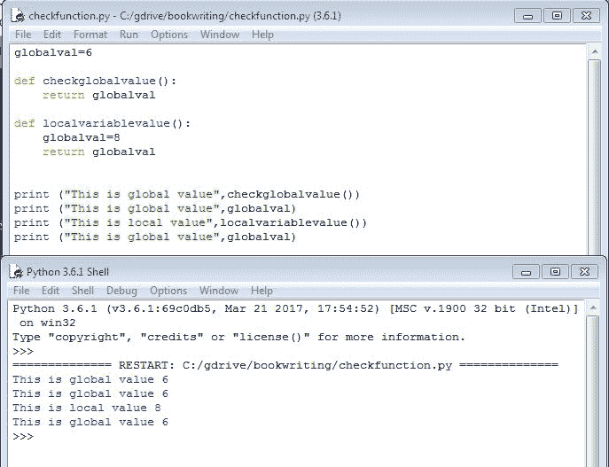

1.  在前述输出中，我们定义了一个名为`globalval`的变量，其值为`6`。在`checkglobalvalue`函数中，我们只是返回`globalvalvariable`的值，当我们调用第一个`print`函数时，它打印了一个值为`6`。

1.  第二个`print`函数只是打印相同变量的值，也打印了`6`。

1.  现在，在第三个`print`函数`localvariablevalue`中，我们调用相同的`globalval`，但给它赋值为`8`并返回`globalval`的值。在打印局部值时，它打印的结果是值 8。并不假设`globalval`变量现在的值是`8`。但是，正如我们在最后的`print`函数中看到的那样，当我们调用`print`函数来打印`globalval`的值时，它仍然打印了一个值为`6`的值。

这清楚地表明，函数内的任何变量都是局部有效的，或者说本地化的，但它不会对函数外的任何变量产生影响。我们需要使用`global`命令来引用全局变量并消除其本地化影响。

在使用`global`命令之前，这里是相同的示例：

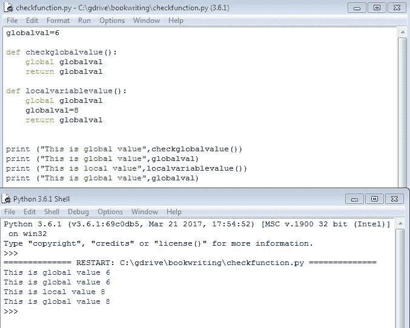

如前所述的输出所示，如果我们更改`localvariablevalue`函数内部的全局变量`globalval`的值，我们会看到全局变量以新的值`8`产生的影响。

# 从命令行传递参数

有时候需要从命令行向脚本传递参数。这通常在我们需要在脚本中执行一些快速操作时需要，而不是脚本要求我们输入。

考虑以下代码行，我们将两个数字作为参数传递给脚本，并打印它们的和：

```py
import sys
print ("Total output is ")
print (int(sys.argv[1])+int(sys.argv[2]))
```

当我们运行这个脚本时，比如说它保存为`checkargs.py`，并按照以下方式执行：

```py
python checkargs.py 5 6
```

返回的输出如下：

```py
Total output is
11
```

这里关键是导入`sys`模块，这是 Python 中预定义的模块，用于处理任何与 Python 系统相关的任务。我们作为参数传递的值存储在`sys.argv[1]`及之后，因为`sys.argv[0]`是正在运行的脚本的实际名称。在这种情况下，`sys.argv[0]`将是`checkargs.py`，`sys.argv[1]`将是`5`，而`sys.argv[2]`将是`6`。

以下任务是 PowerShell 代码：

```py
#PowerShell sample code
$myvalue=$args[0]
write-host ("Argument passed to PowerShell is "+$myvalue)
```

在 Python 脚本中传递的参数是以字符串格式存在的，因此我们需要明确地将它们转换为预期的输出类型。在先前的脚本中，如果我们没有使用`int()`函数将其转换为整数类型，那么输出将是`56`而不是`int(5)` + `int(6)` = `11`。

# Python 模块和包

因为 Python 是最受欢迎的开源编程语言，有许多开发者通过创建特定的模块并与其他人共享来贡献他们的专业知识。这些模块是一组特定的函数或指令，用于执行特定任务，并且可以在我们的程序中轻松调用。我们可以通过在脚本中使用`import`命令轻松调用这些模块。Python 有许多内置模块，可以直接使用`import`调用，但对于特定模块，需要外部安装。幸运的是，Python 提供了一个非常简单的方式来下载和安装这些模块。

例如，让我们安装一个名为`Netmiko`的模块，它可以帮助我们更有效地登录网络设备。Python 为每个模块提供了详细的参考文档，对于我们的模块，文档可以在[`pypi.python.org/pypi/netmiko`](https://pypi.python.org/pypi/netmiko)找到。对于安装，我们只需进入命令行中`python.exe`安装或存在的文件夹。在该位置有一个名为`scripts`的子文件夹。

在那个文件夹中，我们有两种选项可以用来安装模块，`easy_install.exe`或`pip.exe`。

安装 Python 库可以通过两种方式完成：

+   `easy_install`的语法如下：

```py
easy_install <name of module>
```

例如：

```py
easy_install netmiko
```

+   `pip install`的语法如下：

```py
pip install <name of module>
```

例如：

```py
pip install netmiko
```

一旦安装了所需的模块，我们需要通过关闭所有打开的会话并再次调用 IDLE 来重启 Python，以便模块可以被加载。有关模块的更多信息，可以从[`docs.python.org/2/tutorial/modules.html`](https://docs.python.org/2/tutorial/modules.html)获取。

# 并行处理的多线程

由于我们现在专注于高效编写脚本，这个过程中的一个重要方面是如何高效、快速和正确地获取信息。当我们使用`for`循环时，我们会逐个解析每个项目，如果我们能快速得到结果，这是可以的。

现在，如果我们在一个 `for` 循环中的每个项目都是一个需要获取 show 版本输出的路由器，并且如果每个路由器需要大约 10 秒来登录、收集输出和登出，而我们大约有 30 个路由器需要获取这些信息，那么程序完成执行将需要 10*30 = 300 秒。如果我们对每个输出进行更高级或复杂的计算，这可能需要长达一分钟的时间，那么仅对 30 个路由器进行计算就需要 30 分钟。

当我们的复杂性和可扩展性增长时，这开始变得非常低效。为了帮助解决这个问题，我们需要在我们的程序中添加并行性。这简单意味着，我们同时登录到所有 30 个路由器，并执行相同的任务以同时获取输出。实际上，这意味着我们现在可以在 10 秒内获取所有 30 个路由器的输出，因为我们有 30 个并行线程被调用。

线程不过是同一函数的另一个实例，调用它 30 次意味着我们同时调用 30 个线程来执行相同的任务。

这里有一个例子：

```py
import datetime
from threading import Thread

def checksequential():
    for x in range(1,10):
        print (datetime.datetime.now().time())

def checkparallel():
    print (str(datetime.datetime.now().time())+"\n")

checksequential()
print ("\nNow printing parallel threads\n")
threads = []
for x in range(1,10):
    t = Thread(target=checkparallel)
    t.start()
    threads.append(t)

for t in threads:
    t.join()
```

多线程代码的输出如下：

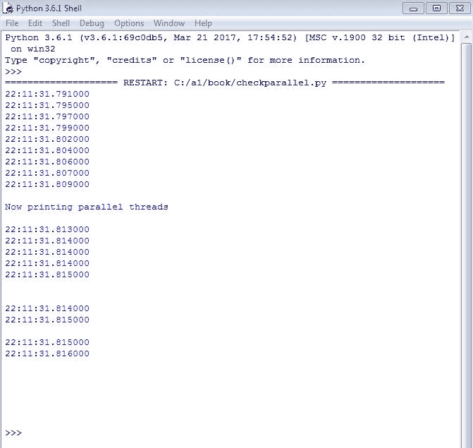

1.  如前例所示，我们创建了两个函数，分别命名为 `checksequential` 和 `checkparallel`，用于打印系统的日期时间。在这种情况下，使用 `datetime` 模块获取系统的日期时间。在 `for` 循环中，执行了顺序运行，当函数被调用时，输出显示了增量时间。

1.  对于线程，我们使用一个名为 `threads` 的空数组。每次 `checkparallel` 方法被创建时，每个实例都会有一个唯一的线程编号或值，这个编号或引用存储在这个空线程数组中。这个唯一的编号或引用标识每个线程，无论何时执行。

1.  线程中的最后一个循环很重要。它表示程序将在所有线程完成之前等待。`join()` 方法指定，直到所有线程都完成，程序将不会进行到下一步。

现在，正如我们在线程输出中看到的那样，一些时间戳是相同的，这意味着所有这些实例都是并行而不是顺序地在同一时间被调用和执行的。

程序中的输出对于并行线程来说不是有序的，因为一旦任何线程完成，就会打印输出，而不考虑顺序。这与顺序执行不同，因为并行线程在执行另一个线程之前不会等待任何之前的线程完成。因此，任何完成的线程都会打印其值并结束。

以下是为前一个任务编写的 PowerShell 示例代码：

```py
#PowerShell sample code
Get-Job  #This get the current running threads or Jobs in PowerShell
Remove-Job -Force * # This commands closes forcible all the previous threads

$Scriptblock = {
      Param (
         [string]$ipaddress
      )
    if (Test-Connection $ipaddress -quiet)
    { 
        return ("Ping for "+$ipaddress+" is successful")
     }
    else
    {
       return ("Ping for "+$ipaddress+" FAILED") 
    }
   }

$iplist="4.4.4.4","8.8.8.8","10.10.10.10","20.20.20.20","4.2.2.2"

foreach ($ip in $iplist)
{
    Start-Job -ScriptBlock $Scriptblock -ArgumentList $ip | Out-Null
    #The above command is used to invoke the $scriptblock in a multithread
}

#Following logic waits for all the threads or Jobs to get completed
While (@(Get-Job | Where { $_.State -eq "Running" }).Count -ne 0)
  { # Write-Host "Waiting for background jobs..."
     Start-Sleep -Seconds 1
  }

#Following logic is used to print all the values that are returned by each thread and then remove the thread # #or job from memory
ForEach ($Job in (Get-Job)) {
  Receive-Job $Job
  Remove-Job $Job
  }
```

# 使用 Netmiko 进行 SSH 和网络设备交互

Netmiko ([`github.com/ktbyers/netmiko`](https://github.com/ktbyers/netmiko)) 是一个 Python 库，广泛用于与网络设备交互。这是一个多厂商库，支持 Cisco IOS、NXOS、防火墙和其他许多设备。其底层库是 Paramiko，它再次被广泛用于各种设备的 SSH 连接。

Netmiko 扩展了 Paramiko 的 SSH 能力，增加了增强功能，例如进入网络路由器的配置模式，发送命令，根据命令接收输出，增加等待特定命令执行完成的增强功能，并在命令执行期间处理是/否提示。

下面是一个简单的脚本示例，用于登录到路由器并显示版本：

```py
from netmiko import ConnectHandler

device = ConnectHandler(device_type='cisco_ios', ip='192.168.255.249', username='cisco', password='cisco')
output = device.send_command("show version")
print (output)
device.disconnect()
```

对路由器执行代码的输出如下：

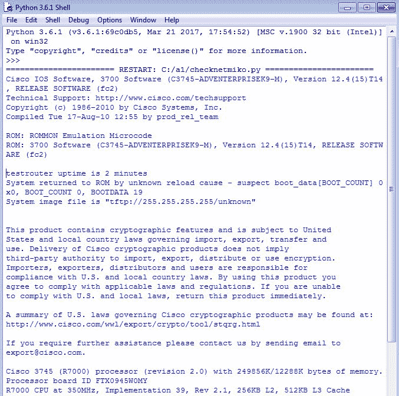

如我们在示例代码中所见，我们调用 Netmiko 库中的`ConnectHandler`函数，它接受四个输入（`平台类型`、`设备的 IP 地址`、`用户名`和`密码`）：

Netmiko 支持多种厂商。一些受支持的平台类型及其缩写，在 Netmiko 中调用时使用如下：

'a10': A10SSH,

'accedian': AccedianSSH,

'alcatel_aos': AlcatelAosSSH,

'alcatel_sros': AlcatelSrosSSH,

'arista_eos': AristaSSH,

'aruba_os': ArubaSSH,

'avaya_ers': AvayaErsSSH,

'avaya_vsp': AvayaVspSSH,

'brocade_fastiron': BrocadeFastironSSH,

'brocade_netiron': BrocadeNetironSSH,

'brocade_nos': BrocadeNosSSH,

'brocade_vdx': BrocadeNosSSH,

'brocade_vyos': VyOSSSH,

'checkpoint_gaia': CheckPointGaiaSSH,

'ciena_saos': CienaSaosSSH,

'cisco_asa': CiscoAsaSSH,

**'cisco_ios': CiscoIosBase**，

'cisco_nxos': CiscoNxosSSH,

'cisco_s300': CiscoS300SSH,

'cisco_tp': CiscoTpTcCeSSH,

'cisco_wlc': CiscoWlcSSH,

'cisco_xe': CiscoIosBase,

'cisco_xr': CiscoXrSSH,

'dell_force10': DellForce10SSH,

'dell_powerconnect': DellPowerConnectSSH,

'eltex': EltexSSH,

'enterasys': EnterasysSSH,

'extreme': ExtremeSSH,

'extreme_wing': ExtremeWingSSH,

'f5_ltm': F5LtmSSH,

'fortinet': FortinetSSH,

'generic_termserver': TerminalServerSSH,

'hp_comware': HPComwareSSH,

'hp_procurve': HPProcurveSSH,

'huawei': HuaweiSSH,

'juniper': JuniperSSH,

'juniper_junos': JuniperSSH,

'linux': LinuxSSH,

'mellanox_ssh': MellanoxSSH,

'mrv_optiswitch': MrvOptiswitchSSH,

'ovs_linux': OvsLinuxSSH,

'paloalto_panos': PaloAltoPanosSSH,

'pluribus': PluribusSSH,

'quanta_mesh': QuantaMeshSSH,

'ubiquiti_edge': UbiquitiEdgeSSH,

'vyatta_vyos': VyOSSSH,

'vyos': VyOSSSH,

根据平台类型的选取，Netmiko 可以理解返回的提示信息以及正确的方式 SSH 到特定设备。一旦建立连接，我们可以使用`send`方法向设备发送命令。

一旦我们获取到返回值，存储在`output`变量中的值就会被显示出来，这是我们发送给设备的命令的字符串输出。最后一行，使用`disconnect`函数，确保我们在完成任务后干净地终止连接。

对于配置（例如：我们需要为路由器接口`FastEthernet 0/0`提供描述），我们可以像以下示例中那样使用 Netmiko：

```py
from netmiko import ConnectHandler

print ("Before config push")
device = ConnectHandler(device_type='cisco_ios', ip='192.168.255.249', username='cisco', password='cisco')
output = device.send_command("show running-config interface fastEthernet 0/0")
print (output)

configcmds=["interface fastEthernet 0/0", "description my test"]
device.send_config_set(configcmds)

print ("After config push")
output = device.send_command("show running-config interface fastEthernet 0/0")
print (output)

device.disconnect()
```

以下代码执行的结果如下：

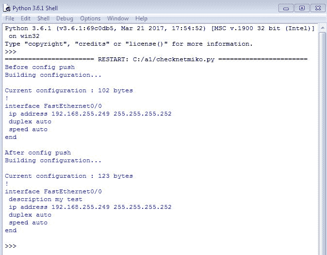

+   如我们所见，对于`config push`，我们不需要执行任何额外的配置，只需按照我们将手动发送给路由器的顺序指定命令，并将该列表作为`send_config_set`函数的参数传递。

+   在`Before config push`中的输出是`FastEthernet0/0`接口的简单输出，但在`After config push`下的输出现在包含了我们使用命令列表配置的描述。

以类似的方式，我们可以将多个命令传递给路由器，Netmiko 将进入配置模式，将这些命令写入路由器，然后退出配置模式。

如果我们想要保存配置，请在`send_config_set`命令之后使用以下命令：

```py
device.send_command("write memory")
```

这确保了路由器将新推送的配置写入内存。

# 网络自动化用例

由于我们现在已经与 Python 和设备交互的多个部分进行了交互，让我们创建一个用例来整合我们迄今为止所学到的内容。该用例如下**：

登录到路由器并获取一些信息：

1.  `task1()`: 显示版本，简要显示 IP，显示时钟，并显示路由器上配置的用户名。

1.  `task2()`: 在`test`路由器上创建另一个用户名为`test`的账户，并检查我们是否可以使用新创建的用户名成功登录。

1.  `task3()`: 使用新创建的用户名`test`登录，并从`running-config`中删除所有其他用户名。一旦完成，返回路由器上配置的所有当前用户名，以确认是否只有`test`用户名被配置在路由器上。

让我们编写一个脚本来逐一处理这些任务：

```py
from netmiko import ConnectHandler

device = ConnectHandler(device_type='cisco_ios', ip='192.168.255.249', username='cisco', password='cisco')

def task1():
    output = device.send_command("show version")
    print (output)
    output= device.send_command("show ip int brief")
    print (output)
    output= device.send_command("show clock")
    print (output)
    output= device.send_command("show running-config | in username")
    output=output.splitlines()
    for item in output:
        if ("username" in item):
            item=item.split(" ")
            print ("username configured: ",item[1])

def task2():
    global device
    configcmds=["username test privilege 15 secret test"]
    device.send_config_set(configcmds)
    output= device.send_command("show running-config | in username")
    output=output.splitlines()
    for item in output:
        if ("username" in item):
            item=item.split(" ")
            print ("username configured: ",item[1])
    device.disconnect()
    try:
        device = ConnectHandler(device_type='cisco_ios', ip='192.168.255.249', username='test', password='test')
        print ("Authenticated successfully with username test")
        device.disconnect()
    except:
        print ("Unable to authenticate with username test")

def task3():
    device = ConnectHandler(device_type='cisco_ios', ip='192.168.255.249', username='test', password='test')
    output= device.send_command("show running-config | in username")
    output=output.splitlines()
    for item in output:
        if ("username" in item):
            if ("test" not in item):
                item=item.split(" ")
                cmd="no username "+item[1]
                outputnew=device.send_config_set(cmd)
    output= device.send_command("show running-config | in username")
    output=output.splitlines()
    for item in output:
        if ("username" in item):
            item=item.split(" ")
            print ("username configured: ",item[1])

    device.disconnect()

#Call task1 by writing task1()
#task1()
#Call task2 by writing task2()
#task2()
#Call task3 by writing task3()
#task3()
```

如我们所见，给出的三个任务被定义为三个不同的函数：

1.  第一行表示我们已经导入了 Netmiko 库，而在第二行中，我们正在使用 Cisco 凭据连接到我们的`test`路由器。

1.  在`task1()`函数中，我们正在获取所有显示命令的输出。此外，由于我们不希望暴露当前用户名的密码，我们添加了额外的逻辑，即对于`show running-config | in username`的返回输出，将按每行和每个用户名进行解析，并且每行将按空格字符`" "`分割。另外，由于思科设备在输出中的第二个位置返回实际用户名（例如，用户名`test`权限 15 密码 5 *），我们在分割输出字符串后打印第二个项目的值，这就是我们的实际用户名。

这是`task1()`方法的输出：

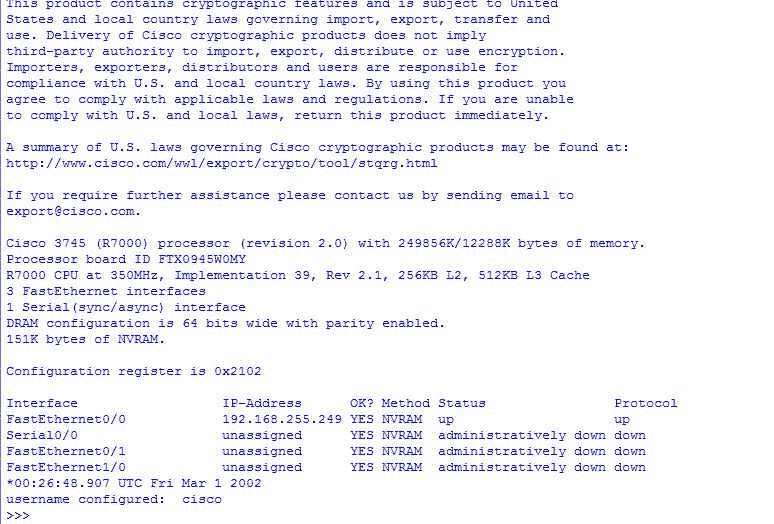

1.  在`task2()`方法中，我们将创建一个用户名`test`并设置密码为`test`，然后使用新用户名进行认证。我们在该方法中添加了一个`try:`异常块，该块检查`try:`部分中所有语句的错误/异常，如果有任何异常，而不是中断脚本，它将运行在`except:`关键字下的异常部分中的代码。如果没有错误，它将继续执行`try:`部分中的语句。

这是`task2()`函数的输出：

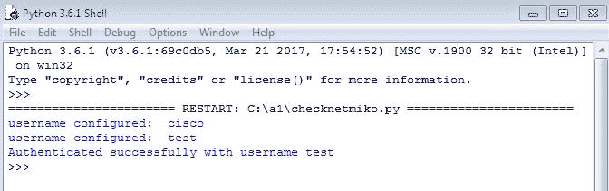

我们可以看到现在已经配置了两个用户名，并且路由器现在也成功响应了使用`test`用户名的认证。

1.  在`task3()`函数中，这首先将获取`running-config`中所有的用户名，如果有任何用户名不是`test`，它将创建一个没有用户名`<username>`的动态命令并发送到路由器。一旦处理完所有用户名，它将继续重新检查并列出不在路由器上的所有用户名。成功标准是只有配置的用户名`test`应该存在于路由器上。

这是`task3()`函数的输出：

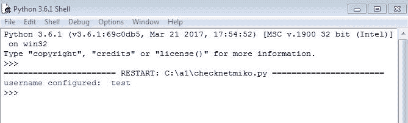

`task3()`的结果是所有配置的用户名的结果，在这种情况下现在只有`test`。

# 摘要

在本章中，我们通过使用函数、条件和循环等高级技术学习了编写脚本的方法；我们介绍了多线程脚本以实现更快和并行执行，熟悉了使用 Netmiko 与网络设备交互，并查看了一个使用单个脚本完成一组实际任务的示例。

下一章将重点介绍使用 Web 进行自动化任务。我们还将讨论如何从 Web 调用 Python 脚本并使用 Web 框架执行任务。

此外，还将简要介绍如何创建自己的 API，以便他人可以使用它执行特定任务。
