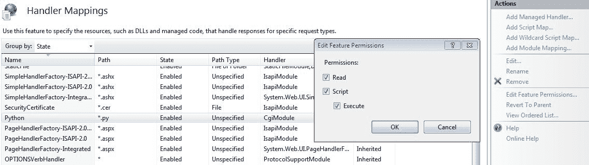

# 用于自动化触发的 Web 框架

随着我们继续前进并提高对编码技术和 Python 的理解，下一步是确保脚本在没有最终用户实际在本地运行代码的情况下执行，并确保代码执行的平台或操作系统独立的方法。本章重点是将我们的脚本放在 Web 平台上。我们将涵盖以下主题：

+   创建可访问 Web 的脚本示例

+   从 HTML/动态 HTML 访问脚本

+   使用 IIS 理解和配置 Web 框架的环境

+   API 的基本原理以及使用 C# 创建示例 API

+   在 Python 中使用 API

+   创建任务以理解 Web 框架的完整端到端功能

# 为什么创建基于 Web 的脚本/框架？

**Web 框架** 是一组脚本集合，托管在 Web 平台（如 **Internet Information Services**（IIS）**（在 Windows 上）或 Apache（在 Linux 上））上，并使用前端基于 Web 的语言（如 HTML）调用相同的脚本。

有时候人们会问为什么我们要迁移我们当前的脚本或创建 Web 框架上的脚本。答案非常简单。Web 框架确保我们的脚本仅通过浏览器就能被多个最终用户使用。这给了程序员在他们的首选平台（如 Windows 或 Linux）上编写脚本的独立性，人们可以在他们选择的浏览器上使用这些脚本。他们不需要理解你如何编写代码，或者你在后端调用或使用什么，当然，这也确保了你的代码不会被最终用户直接看到。

假设你已经编写了一个调用四个或五个库以执行特定任务的脚本。虽然有一些通用库，但正如我们在前面的章节中看到的，某些特定库需要安装以执行这些任务。在这种情况下，如果你想确保最终用户能够执行你的脚本，他们需要在他们的机器上安装相同的库。此外，他们需要在他们的机器上运行 Python 环境，没有这个环境脚本将无法运行。因此，为了运行一个五行的简单脚本，用户需要通过安装 Python、安装库等方式来定制他们的环境。

由于机器上的限制（例如不允许安装），这可能对许多用户来说并不可行，因此尽管有运行这些脚本的需求，但用户将无法使用这些脚本，这实际上会降低效率。但是，如果给这些用户提供选择，他们可以轻松地打开他们选择的浏览器并像打开任何其他网页一样使用这些脚本，这将确保我们的脚本为任务带来更高的效率。

# 理解和配置 IIS 以用于 Web 框架

在这里，我们将关注 IIS 是什么以及如何配置它，以确保我们的 Python 脚本能够通过利用 Web 服务器框架的力量来执行。

# 理解 IIS

IIS 是 Windows 上可用的一个工具，用于托管网络服务。换句话说，如果我们安装了 IIS，我们确保安装了它的机器现在正在充当网络服务器。IIS 是一个完全功能的程序，可在 Windows 的“添加或删除程序”中找到。它支持机器成为网络服务器、FTP 服务器以及其他一些功能。

以下截图显示了在 Windows 中使用 IIS 图标安装并打开 IIS 后出现的第一个屏幕：


如截图所示，应用程序的左侧表示服务器名称，右侧显示我们可以为不同目的配置的属性。

在安装 IIS 时选择 **通用网关接口**（**CGI**）支持是很重要的。在 Windows 的“添加或删除程序”中安装 IIS 后，Windows 会给我们选择 IIS 中特定子项的选项，其中 CGI 和 CGI 支持是一个选项。如果在安装过程中没有选择此选项，Python 脚本将无法从网络服务器上运行。

# 配置 IIS 以支持 Python 脚本

现在，让我们配置 IIS，以确保它支持在 Web 服务器本身上执行 Python 脚本，并允许最终用户通过从 Web 服务器调用 Web URL 来直接运行 Python 脚本。以下是要执行此操作的步骤：

1.  当我们展开左侧的属性时，我们看到默认网站选项。如果你右键单击它，有一个名为添加应用程序的章节。点击它以查看以下截图：


在这个屏幕上，我们必须输入两个特定的值：

+   +   别名：这是我们 Web URL 的一部分值。例如，如果我们的选择别名是 `test`，则 `http://<servername>/test` 将是 URL。

    +   物理路径：这是我们脚本实际物理目录映射的位置。例如，我们的脚本 `testscript.py` 的路径如下。要从 URL 调用它，我们将在浏览器中输入以下内容：

```py
http://<server IP>/test/testscript.py
```

一旦我们有了这些值，我们点击“确定”，我们的网站引用就创建完成了。

1.  现在我们需要将我们的 Python 脚本映射到在执行时使用 Python 解释器。一旦我们创建了网站，我们会在右侧面板看到一个名为处理器映射（Handler Mappings）的选项。点击它并打开如下截图所示的章节。要添加 Python 引用，请点击截图右侧的“添加脚本映射...”：


在这个部分，我们需要填写三个值：

+   +   请求路径：这始终是 `*.py`，因为我们调用的任何脚本都将具有 `.py` 扩展名。

    +   可执行文件：这是一个重要的部分，其中我们引用了`python.exe`的实际位置。需要`python.exe`的完整路径。除了路径之外，我们还需要在可执行文件路径后添加两次`%s`，因为这被解释为从 IIS 传递的参数。例如，如果我们的 Python 路径是`C:\Python`，那么我们会添加以下内容：

```py
C:\Python:\python.exe %s %s
```

+   +   名称：这是对当前配置的简单引用名称。可以是任何你喜欢的名称。

1.  在“添加脚本映射”部分中有一个名为“请求限制”的按钮。我们需要点击该按钮，然后在“访问”下选择“执行”选项并点击确定：


1.  一旦我们点击确定，IIS 会弹出一个提示，允许扩展。我们需要选择是，以便设置生效：


1.  作为最后一步，我们选择新创建的脚本映射（在我们的例子中是`Python`），然后在右侧点击“编辑功能权限...”。在对话框中，选择“执行”选项并点击确定：



一旦遵循所有前面的步骤，我们就有一个运行环境，支持从 Web 浏览器执行 Python 脚本。

一旦 Web 服务器启动，你可以通过在 Web 服务器本身调用默认页面来测试以确保其配置正确。这可以通过浏览器中的`http://localhost` URL 来完成，它应该显示欢迎 IIS 页面。如果它没有显示出来，那么我们需要回到并验证 Web 服务器的安装，因为这意味着 Web 服务器没有启动和运行。

# 创建特定于 Web 的脚本

现在我们有一个运行环境，可以运行我们的脚本，让我们创建一个非常基本的脚本来看看它是如何工作的：

```py
print('Content-Type: text/plain')
print('')
print('Hello, world!')
```

在 IDLE 中，我们输入前面的代码并将其保存为 Python 文件（例如`testscript.py`）。现在，正如我们之前讨论的，对于我们的 Web 引用，我们在 IIS 中映射了一个物理目录或位置。新创建的`testscript.py`需要在该文件夹中才能从 Web 访问。

基于 Web 的 URL 调用 Python 脚本的输出如下：


+   如前述截图所示，脚本现在是通过浏览器使用 localhost URL 调用的。输出是一个简单的`Hello, world !`，这是在脚本代码中调用来打印的。

+   此外，值`Content-Type: text/plain`指定 Python 的返回值将是简单的文本，浏览器将其解释为纯文本而不是 HTML。

现在让我们看看如何将其修改为 HTML 的示例：

```py
print('Content-Type: text/html')
print('')
print("<font color='red'>Hello, <b>world!</b></font>")
```

修改值后的 URL 输出如下：


如我们所见，代码的第一行已被修改为`Content-Type: text/html`**。** 这确保了现在从脚本返回的文本是 HTML，因此最后的打印语句，带有`font color`为`red`和`world!`在粗体 HTML 标签中的内容，现在在浏览器中被正确解释。在现实场景中，如果我们想从我们的脚本中打印通过、失败或其他任何特定的消息或输出，我们应该以 HTML 颜色编码和粗体格式返回值，以便在浏览器中清晰可读。

让我们看看在 HTML 中以表格格式打印 5 的示例：

```py
print('Content-Type: text/html')
print('')
value=5
xval=0
tval="<table border='1' style='border-collapse: collapse'><tr><th>Table for "+str(value)+"</th></tr>"
for xval in range(1,11):
    mval=value*xval
    tval=tval+"<tr><td>"+str(value)+"</td><td>*</td><td>"+str(xval)+"</td><td>=</td><td><font color='blue'><b>"+str(mval)+"</b></font></td></tr>"

tval=tval+"</table>"

print(tval)
```

上述代码的输出如下：


+   如我们所见，第一行指示返回类型为 HTML。在接下来的几行中，我们使用名为`value`的变量，其值为`5`。使用`for`循环，我们在`tval`变量中创建 HTML 表格及其值（对于每一行和单元格）。

+   最后一条语句将`tval`变量的值返回到调用脚本的浏览器。

深入这个示例，现在让我们创建相同的表格，但数字需要由 Web 用户在 URL 中提供。换句话说，而不是在我们的示例中坚持静态值`5`，表格需要为用户在 URL 中输入的值生成：

```py
import cgi

form = cgi.FieldStorage()
value=int(form.getvalue('number'))

print('Content-Type: text/html')
print('')
xval=0
tval="<table border='1' style='border-collapse: collapse'><tr><th>Table for "+str(value)+"</th></tr>"
for xval in range(1,11):
    mval=value*xval
    tval=tval+"<tr><td>"+str(value)+"</td><td>*</td><td>"+str(xval)+"</td><td>=</td><td><font color='blue'><b>"+str(mval)+"</b></font></td></tr>"

tval=tval+"</table>"

print(tval)
```

上述代码的输出如下：


+   如我们在 URL 变化中看到的那样，我们使用增强的 URL `http://localhost/test/testscript.py?number=8`传递数字。问号后面的指定值，即作为传递给参数`number`的值，现在被作为脚本中的输入。代码现在导入一个特定的内置库`cgi`，以读取从浏览器传递给自身的参数。

+   接下来是这两行：

```py
form = cgi.FieldStorage()
value=int(form.getvalue('number'))
```

它们用于获取从浏览器返回的表单的引用，并且从表单中获取名为`number`的特定参数**。** 返回的参数始终以字符串格式，因此我们需要确保将其转换为我们的特定数据类型，具体取决于我们的使用。

+   `value`变量现在有了我们从浏览器传递的数字，其余的脚本以与前面示例中给出相同的方式进行执行。

如前述示例所示，最终用户现在只根据他们的需求调用脚本，而不关心后端逻辑或程序。对于开发者来说，如果在脚本中发现了错误，一旦最终用户开始获得正确的结果，就可以在主 Web 服务器上立即修复。与用户从他们的机器上的特定位置下载新的修复脚本然后自行运行相比，这也节省了大量精力。有时，甚至从浏览器中调用带有参数的脚本也变得有点困难。在这种情况下，我们使用 HTML 中的表单标签将值传递给脚本以获取输出。

例如，要求用户输入他们的名字，需要生成表格的数字，并以友好的方式输出生成的表格，其中包含呼叫者的名字。以下是 HTML 代码：

```py
<html>
<form action="testscript.py" method="get">
 Enter your name: <br>
  <input type="text" name="name">
  <br>
  Enter your number:<br>
  <input type="text" name="number">
  <br><br>
  <input type="submit" value="Submit">
</form>
</html>    
```

这是 Python 代码：

```py
import cgi

form = cgi.FieldStorage()
value=int(form.getvalue('number'))
callername=form.getvalue('name')

print('Content-Type: text/html')
print('')
xval=0
tval="<h2>Hello <font color='red'>"+callername+"</font><h2><br><h3>Your requested output is below:</h3>"
tval=tval+"<table border='1' style='border-collapse: collapse'><tr><th>Table for "+str(value)+"</th></tr>"
for xval in range(1,11):
    mval=value*xval
    tval=tval+"<tr><td>"+str(value)+"</td><td>*</td><td>"+str(xval)+"</td><td>=</td><td><font color='blue'><b>"+str(mval)+"</b></font></td></tr>"

tval=tval+"</table>"

print(tval)
```

上述代码的输出如下：


HTML 页面

使用 HTML 代码，我们创建了一个表单，该表单需要我们脚本所需的输入。在这种情况下，它要求输入一个名字和需要生成表格的数字。一旦用户输入这些信息，就需要点击提交按钮，以便将值传递到脚本中：


脚本输出

当用户点击提交按钮时，值会被传递到脚本中。在代码中，我们使用相同的 `form.getvalue()` 方法获取每个 HTML 元素的值。一旦脚本从浏览器中获取了值，脚本逻辑就会处理需要返回的内容。在我们的例子中，正如我们所看到的，用户名已经在浏览器中显示，同时还有用户想要看到的输出表格。

让我们以一个例子来说明，我们输入设备的 IP 地址和我们想从设备中看到的命令，使用表单和浏览器输出。以下是 HTML 代码：

```py
<html>
<form action="getweboutput.py" method="get">
 Enter device IP address: <br>
  <input type="text" name="ipaddress">
  <br>
  Enter command:<br>
  <input type="text" name="cmd">
  <br><br>
  <input type="submit" value="Submit">
</form>
</html>    
```

在此代码中，唯一的区别是我们现在正在调用 `getweboutput.py` 脚本，我们将设备 IP 地址（我们想要输出信息的设备）和实际命令作为参数发送到该脚本。以下是 Python 代码：

```py
import cgi
from netmiko import ConnectHandler
import time

form = cgi.FieldStorage()
ipvalue=form.getvalue('ipaddress')
cmd=form.getvalue('cmd')

def getoutput(cmd):
    global ipvalue
    uname="cisco"
    passwd="cisco"
    device = ConnectHandler(device_type='cisco_ios', ip=ipvalue, username=uname, password=passwd)
    output=device.send_command(cmd)
    return (output)

print('Content-Type: text/plain')
print('')
print ("Device queried for ",ipvalue)
print ("\nCommand:",cmd)
print ("\nOutput:")
print (getoutput(cmd))

```

现在的 Python 代码正在获取设备的 IP 地址的输入参数 `ipaddress`，以及需要发送到路由器的实际命令 `cmd`。它再次使用 Netmiko，正如在第二章中提到的，*《网络工程师的 Python》*，来获取信息并使用 `getoutput()` 函数返回信息：

**示例 1**：**我们提供 IP 地址和 show clock 命令**：


登录页面

点击提交按钮：


**示例 2**：**对于提供不同参数的相同脚本**：


登录页面

这是点击提交按钮时的输出：


正如我们所见，我们可以创建一个基于 Web 的查询工具，用于从具有指定命令的设备中获取信息，这可以作为设备验证的快速参考。此外，使用这种方法，我们还隐藏了用户名和密码（在这个例子中是 `cisco`:`cisco`），而没有将设备凭据暴露给最终用户。最终用户只需在网页上提供输入，而不会意识到后端正在执行的代码，该代码包含设备凭据。

我们甚至可以进行额外的检查，以确保用户只能运行`show`命令，并根据用户尝试在网页上调用的各种命令显示适当的消息。

# 从动态 HTML 访问脚本

有时我们运行 Python 脚本来创建动态 HTML 页面（这些页面基于我们在脚本中设置的某些触发器）。这些页面可以增强，以添加额外的 URL，当我们点击这些页面时，可以调用其他脚本。

例如，假设我们需要找出我们网络中有多少种设备型号。为此，我们创建一个脚本，使用任务计划程序将其安排为每小时运行一次，并在每次运行后创建一个动态 HTML 页面来显示更新的统计数据或库存。在 BYOD 场景中，这也扮演着重要的角色，因为每小时我们都可以监控我们的网络上有哪些设备，如果我们点击任何发现的设备，我们可以获取额外的信息，例如详细的 show 版本。

这是创建动态 HTML 的 Python 代码：

```py
from pysnmp.hlapi import *

print('Content-Type: text/html')
print('')

def finddevices(ip):
    errorIndication, errorStatus, errorIndex, varBinds = next(
        getCmd(SnmpEngine(),
               CommunityData('public', mpModel=0),
               UdpTransportTarget((ip, 161)),
               ContextData(),
               ObjectType(ObjectIdentity('SNMPv2-MIB', 'sysDescr', 0)))
    )

    if errorIndication:
        print(errorIndication)
    elif errorStatus:
        print('%s at %s' % (errorStatus.prettyPrint(),
                            errorIndex and varBinds[int(errorIndex) - 1][0] or '?'))
    else:
        for varBind in varBinds:
            xval=(' = '.join([x.prettyPrint() for x in varBind]))
            xval=xval.replace("SNMPv2-MIB::sysDescr.0 = ","")
            xval=xval.split(",")
            return (xval[1])

ipaddress="192.168.255.248,192.168.255.249"
ipaddress=ipaddress.split(",")
tval="<table border='1'><tr><td>IP address</td><td>Model</td></tr>"
for ip in ipaddress:
    version=finddevices(ip)
    version=version.strip()
    ahref="http://localhost/test/showversion.py?ipaddress="+ip
    tval=tval+"<tr><td><a href='"+ahref+"' target='_blank'>"+ip+"</a></td>"

    tval=tval+"<td>"+version+"</td></tr>"

tval=tval+"</table>"
print (tval)   
```

上述代码的输出如下：


上述代码创建了之前截图所示的动态 HTML。它从 SNMP 查询给定的 IP 地址的供应商，并根据这些值创建表格。IP 地址中的蓝色表示超链接，点击后会产生如下所示的输出：


这是 show 版本输出的 Python 代码：

```py
import cgi
from netmiko import ConnectHandler
import time

form = cgi.FieldStorage()
ipvalue=form.getvalue('ipaddress')

def getoutput(cmd):
    global ipvalue
    uname="cisco"
    passwd="cisco"
    device = ConnectHandler(device_type='cisco_ios', ip=ipvalue, username=uname, password=passwd)
    output=device.send_command(cmd)
    return (output)

print('Content-Type: text/plain')
print('')
print ("Device queried for ",ipvalue)
print ("\nOutput:")
print (getoutput("show version"))
```

正如我们在 URL 中看到的，当用户点击主动态 HTML 页面时，它调用了另一个脚本（之前列出的那个），该脚本从 URL 中获取 IP 地址的输入参数，并使用 Netmiko 获取设备的版本。

同样，我们可以使用 Web 框架方法快速收集其他统计数据，例如 CPU、内存、路由摘要以及其他每个设备的任务。

# 在 C#中创建后端 API

随着我们继续前进，有时作为开发者，我们不仅需要消费 API，还需要为他人创建自己的 API。即使我们发现某些函数有重复的使用，考虑到 Web 框架策略，我们仍需要确保，而不是简单地创建用于该任务的函数，我们需要将它们转换为 API。这样做的重大优势是，我们的函数或任务的使用将不再仅限于 Python，它可以在任何脚本语言或 Web 语言中使用。

在这里，我们将看到创建一个功能性的 C# `Hello World` API 的非常基本的方法。作为先决条件，我们需要 IIS 来运行 Web 服务，以及 Visual Studio（社区版免费使用）来创建我们自己的 API。稍后，我们将看到如何使用 Python 来消费该 API。

此外，我们还将确保返回值是 JSON 格式，这是 API 通信的行业标准，取代了 XML。

1.  在 Visual Studio 中调用 C# Web 项目：


1.  在下一个屏幕上选择 Web API 复选框，如下所示：


1.  添加控制器（这是确保 API 框架激活的主要组件）：


1.  给控制器一个有意义的名称。注意，名称后面必须跟有单词`Controller`（例如`testController`），否则控制器将无法工作，API 框架将损坏：


1.  控制器添加后，在`WebApiConfig.cs`文件中添加新的`JsonMediaTypeFormatter()`配置，如下所示。这确保了 API 返回的每个输出都将以 JSON 格式呈现：


1.  在主`apitestController.cs`程序中，一旦调用`Get`方法，返回值`Hello World`：


1.  完成后，点击 Visual Studio 应用程序中可用的`运行`按钮。将打开一个类似于以下屏幕截图的窗口，这确保了本地 IIS 服务器正在被调用，并且应用程序已初始化以进行测试：


1.  一旦应用程序加载，将出现类似于以下 URL 的链接，以确认我们的 API 运行正常。请注意，此时正在使用本地的 IIS Express，API 尚未对外发布：


1.  验证完成后，现在我们需要将此发布到我们的 IIS 中。类似于我们之前所做的那样，我们在 IIS 中创建一个新的应用程序（在我们的例子中命名为`apitest`）：


1.  一旦完成 IIS 映射，我们使用 Visual Studio 将我们的 API 项目发布到这个 Web 文件夹：


1.  我们创建一个 Web 发布配置文件，并将其发布到我们映射到 IIS 的本地文件夹：


1.  我们的 API 已准备好使用。我们可以通过在浏览器中访问`http://localhost`来验证它：


# 在 Python 中消费 API

现在，既然我们已经创建了 API，让我们看看如何在 Python 中消费 API。

代码如下：

```py
import requests
r = requests.get('http://localhost/apitest/api/apitest/5')
print (r.json())
```

上述代码的输出如下：


对于 API 交互，我们在 Python 中使用`requests`库。当我们对 API 进行调用时，API 以 JSON 格式返回字符串。`r.json()`方法将返回的 JSON 转换为提取文本值，并将输出显示为`Hello World`。

以类似的方式，我们可以使用 requests 库从各种基于 Web 的 API 调用中获取 API 结果。结果通常是 XML 或 JSON 格式，其中 JSON 是 API 调用的首选返回方法。

让我们再举一个例子，从 GitHub 获取更多 JSON 数据：

```py
import requests
r = requests.get('https://github.com/timeline.json')
jsonvalue=r.json()
print (jsonvalue)
print ("\nNow printing value of message"+"\n")
print (jsonvalue['message']+"\n")

```

上述代码的输出如下：


现在我们调用 GitHub API，我们得到了之前显示的 JSON 值。正如我们所见，返回值类似于 API 调用 JSON 返回数据中的字典，因此我们可以明确地获取`message`字典键内的文本。在前面的输出中，第一个输出是原始的 JSON 返回值，下一个输出是从`message`键中提取的文本。

除了调用标准 API 之外，有时我们需要将凭据传递给 API 以获取信息。换句话说，API 需要有一个认证机制来响应请求的数据。在我们的 API 中，现在让我们从 IIS 中启用基本认证：

1.  在 IIS 中，选择你的网站（在我们的例子中是`apitest`），然后在认证部分选择基本认证：


这确保了任何调用此 API 的请求都需要基本认证（用户名和密码）来访问内容。此外，我们在 Windows 机器上的用户应用程序中创建了一个简单的用户`testuser`，密码为`testpassword`。

1.  由于现在已启用认证，让我们看看如果没有传递凭据我们会得到什么：

```py
import requests

r = requests.get('http://localhost/apitest/api/apitest/5')
print (r)
```

上述代码的输出如下：


我们得到了一个响应[401]，这意味着 HTTP 调用中的*未授权*访问。换句话说，API 调用未授权，因此不会返回任何输出。

1.  接下来，我们看到相同的调用，但这次带有认证：

```py
import requests
from requests.auth import HTTPBasicAuth
r = requests.get('http://localhost/apitest/api/apitest/5', auth=('testuser', 'testpassword'))
print (r)
print (r.json())
```

上述代码的输出如下：


在这种情况下，我们调用认证方法`HTTPBasicAuth`，并在`requests.get`调用中传递用户名和密码。因为我们提供了正确的凭据，所以我们得到了一个响应[200]，这在 HTTP 中是 OK 的，在最后一行我们打印了返回值的输出，在我们的例子中是`Hello World`。

# 样本总结任务

既然我们已经熟悉了 Web 框架，让我们执行一个涵盖我们之前看到的所有方面的任务：

1.  我们编写一个 HTML 页面，要求用户输入用户名和密码。这些值将被传递到一个 Python 脚本中，该脚本将调用我们之前创建的 API 进行认证。如果返回值是授权的，那么我们将显示我们想要在另一个网页上查看额外信息的设备的 IP 地址。

1.  接下来，用户可以点击任何 IP 地址来查看`show ip int brief`的输出。如果授权失败，脚本将返回“未授权”的消息，并且不会显示 IP 地址。以下为参考（有效的用户名和密码）：

    +   **用户名**：`Abhishek`

    +   **密码**：`password`

HTML 代码如下：

```py
<html>
<form action="validatecreds.py" method="post">
 Enter your name: <br>
  <input type="text" name="name">
  <br>
  Enter your password:<br>
  <input type="password" name="password">
  <br><br>
  <input type="submit" value="Submit">
</form>
</html>    
```

在这种情况下，我们使用了`POST`方法，因为如果我们使用默认的`GET`方法，密码将在浏览器 URL 中以明文形式显示。在`POST`方法中，后端会建立单独的连接，并且 URL 不会显示传递给脚本的值。

Python 代码如下：

```py
import cgi, cgitb
import requests
from requests.auth import HTTPBasicAuth

form = cgi.FieldStorage()
uname=form.getvalue('name')
password=form.getvalue('password')

r = requests.get('http://localhost/apitest/api/apitest/5', auth=(uname, password))

print('Content-Type: text/HTML')
print('')
print ("<h2>Hello "+uname+"</h2>")

htmlform="<form action='showoutput.py' method='post'>"
htmlform=htmlform+"<br><input type='radio' name='ipaddress' value='192.168.255.248' /> 192.168.255.248"
htmlform=htmlform+"<br><input type='radio' name='ipaddress' value='192.168.255.249' /> 192.168.255.249"
htmlform=htmlform+"<br><input type='submit' value='Select IPaddress' /></form>"

if (r.status_code != 200):
    print ("<h3><font color='red'>Not Authorized.</font> Try again!!!!</h3>")
else:
    print ("<h3><font color='lime'>Authorized.</font> Please select from list below:</h3>")
    print (htmlform)
```

1.  如果提供的凭证不正确（无效的凭证，如示例凭证）：


当我们点击“提交”按钮时，它将显示如下截图所示的消息：


1.  如果凭证正确（在 Web 服务器上正确且成功认证）：


当我们点击“提交”按钮：


1.  接下来，我们看到 IP 地址，我们现在可以使用这些地址来获取输出。我们选择我们想要使用的 IP 地址，然后点击“选择 IP 地址”：


一旦我们点击“提交”（或“选择 IP 地址”按钮），我们将得到以下输出：


再次，如果我们查看前面的输出 URL，由于我们为这个选择使用了`POST`方法，所以我们只看到脚本，而没有看到在 URL 中传递的参数。这确保了人们需要从着陆页（在我们的案例中是`main.html`）开始，不能直接调用任何可能使用`GET`方法给出的带有参数的 URL。

通过这样做，我们还确保了执行此操作的最终用户遵循逐步选择，而不是在不执行顺序步骤的情况下从一个 URL 跳转到另一个 URL。

以类似的方式，最终用户可以创建他们自己的 API 来获取诸如大量设备名称和 IP 地址等信息，并可以在他们的脚本中使用这些信息来快速创建前端、后端或 Web 启用场景，无需任何最终用户安装。

# 摘要

我们现在已经了解了 Web 框架，以及相关的示例，API 的使用。这包括如何创建 API、访问 API，甚至在与 API 进行认证。使用这些知识，我们现在将能够为最终用户开发基于 Web 的工具。IIS 功能也已介绍，这有助于开发者自定义各种基于 Web 的设置，如认证、授权和创建网站。

此外，通过一个给定场景的完整功能示例，读者可以快速构建基于 Web 的 Python 脚本，这消除了对 Python 和定制库的任何最终用户安装的需求。由于只需在一台机器上进行修复，这使得支持和错误修复变得更加容易。在服务器上进行的修复将确保所有最终用户现在都将使用修复或增强的脚本功能，而不是在自己的机器上下载本地副本以获取修复或增强的脚本。

在下一章中，我们将介绍 Ansible 的使用，它是一个流行的开源自动化平台。
