# Ansible 用于网络自动化

在本章中，我们将看到使用一个流行的网络自动化工具**Ansible**。本章将指导您了解 Ansible 的基础知识，包括安装和基本配置，并给出如何从 Ansible 执行与网络自动化相关的任务的示例。

这将涵盖 Ansible 中使用的各种术语和概念，例如示例、使用 Ansible 的执行，以及如何使用 Ansible 模板为各种设备创建配置，以及如何从 Ansible 获取有关受管理节点的某些信息。

本章将向读者介绍：

+   Ansible 的概述和安装

+   理解 Ansible 的编程概念

+   Playbooks

+   Ansible 的使用场景

# Ansible 概述和术语

Ansible 是一个自动化工具或平台，它作为开源软件提供，用于配置诸如路由器、交换机和各种类型的服务器等设备。Ansible 的主要目的是配置三种主要类型的任务：

+   **配置管理**：这用于从我们称为 Ansible 中的清单的各种设备中获取和推送配置。根据清单的类型，Ansible 能够批量推送特定的或完整的配置。

+   **应用部署**：在服务器场景中，很多时候我们需要批量部署一些特定的应用程序或补丁。Ansible 也负责在服务器上批量上传补丁或应用程序，安装它们，甚至配置特定任务的程序。Ansible 还可以根据清单中的设备自定义设置。

+   **任务自动化**：这是 Ansible 的一个功能，它在单个设备或一组设备上执行某些书写的任务。这些任务可以编写，并且 Ansible 可以配置为一次性或定期运行这些任务。

Ansible 的另一个强大功能是 IT 或基础设施编排。为了详细解释这一点，让我们假设我们需要升级某些路由器或网络设备。Ansible 可以执行一系列步骤来隔离特定的路由器，推送代码，更新代码，然后根据前一个结果或任务的返回值移动到下一个路由器。

# Ansible 的基本要求

Ansible 非常易于安装和设置。它基于控制器和受管理节点模型工作。在这个模型中，Ansible 安装在控制器上，控制器是一个 Linux 服务器，可以访问我们想要管理的所有清单或节点。正如我们所看到的，Ansible 支持 Linux（目前有一个 Windows 控制器的 beta 版本，但尚未完全支持），它依赖于 SSH 协议与节点通信。因此，除了控制器的配置之外，我们还需要确保将要管理的节点具有 SSH 能力。

在托管节点上安装 Python 是一个额外的要求，因为多个 Ansible 模块是用 Python 编写的，并且 Ansible 会将模块本地复制到客户端并在节点本身上执行它。在运行 Linux 的服务器上，这已经满足，然而，在网络设备如 Cisco IOS 上，这可能不是一个可能性，因为 Cisco 节点上没有 Python。

为了克服这种限制，有一种称为**原始模块**的东西可以执行原始命令，例如 `show version` 从 Cisco 设备获取输出。这可能帮助不大，但还有一种方法可以使 Ansible 在服务器本身上运行其模块，而不是在客户端（或托管节点）上执行这些模块。这确保了模块使用 Ansible 服务器的资源（包括 Python），并且它们可以调用 Cisco 供应商的 SSH 或 HTTP API 来执行在服务器上本地配置的任务。甚至对于没有良好 API 集的设备（如 Cisco IOS），也可以使用 SNMP 来执行我们的任务。

如我们之前所见，SNMP 可以在读取和写入模式下使用，因此使用 Ansible 并在本地运行模块，我们甚至可以使用 SNMP 协议的帮助来配置旧的 IOS 设备。

# 安装 Ansible

Ansible 控制器（管理节点的主要组件）支持多种 Linux 版本，但不能安装在 Windows 上。

对于托管节点，核心要求是任何具有 Python 2.6 及以上版本的东西。此外，由于 Ansible 使用 SSH 与托管节点通信，节点必须能够通过 SSH 访问。对于任何文件传输，默认是**SSH 文件传输协议**（**SFTP**），但始终有使用 `scp` 作为默认文件传输协议的选项。话虽如此，如前所述，如果无法安装 Python，那么我们将使用从服务器本身运行的 Ansible 的原始模块。

回到控制器机器的安装，需要安装 Python 2（2.6 或更高版本）。在我们的案例中，我们使用 Ubuntu 作为我们的操作系统，因此我们的重点将放在使用 Ubuntu 作为底层操作系统的情况下与 Ansible 一起工作。安装 Ansible 的方法之一是使用 Ubuntu 中的**高级打包工具**（**APT**）。以下命令将配置**个人软件包存档**（**PPA**）并安装 Ansible。

这里是基本命令，按照它们在安装 Ansible 时所需的顺序：

```py
$ sudo apt-get update $ sudo apt-get install software-properties-common $ sudo apt-add-repository ppa:ansible/ansible $ sudo apt-get update $ sudo apt-get install ansible
```

在我们的案例中，Ansible 已经安装。以下是我们再次运行命令 `sudo apt-get install ansible` 时得到的示例输出。在这种情况下，如果有一个新的更新可用，Ansible 将升级到最新版本，否则它将退出命令，表示我们已经有最新版本，如下面的截图所示）：

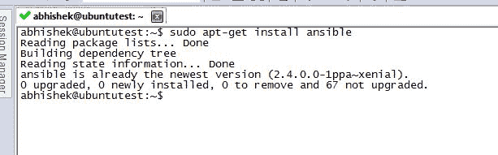

安装 Ansible 的另一种方式是使用我们熟知的 Python 库安装命令 `pip`。这个命令将是：

```py
pip install --user ansible
```

安装完成后，以下是文件夹的信息：

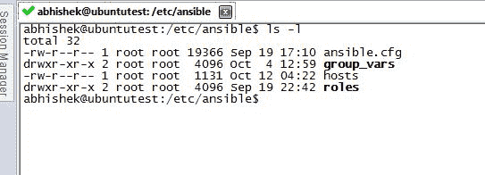

`hosts` 文件是我们添加要由 Ansible 控制的受管理节点的清单文件。`ansible.cfg` 是实际用于调整 Ansible 参数的配置文件。一旦安装完成，我们需要在 `hosts` 文件中添加一些节点。在我们的例子中，作为一个全新的安装，我们需要添加我们的本地主机（`127.0.0.1`）。此节点可以通过 SSH 使用用户名 `abhishek` 和密码 `abhishek` 访问。

下面是我们 `/etc/hosts` 文件的示例输出：

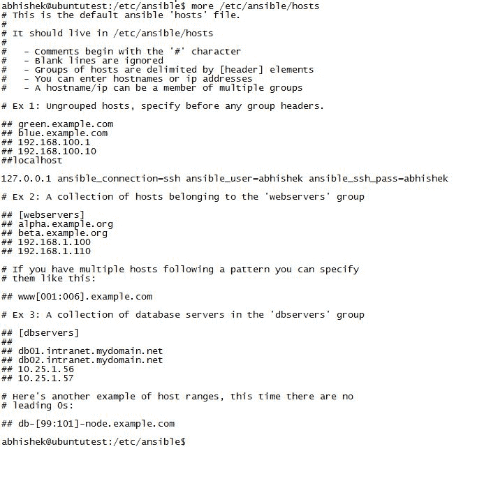

这行 `127.0.0.1 ansible_connection=ssh ansible_user=abhishek ansible_ssh_pass=abhishek` 是我们指定访问此系统所需参数的地方。

我们可以使用任何文本编辑器（在我们的例子中我们使用 nano 或 vi 编辑器）来添加或修改这些文件的更改。要修改 `hosts` 文件，我们使用以下命令：

```py
$ sudo nano /etc/ansible/hosts
```

下一步是验证我们添加到 `hosts` 文件中的节点的可访问性/可达性，可以使用 `ansible all -m ping` 命令来完成，如下截图所示：

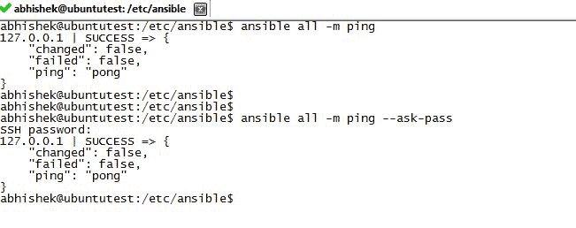

如前一个截图所示，命令 `ansible all -m ping` 对 `hosts` 文件中配置的所有节点进行 ping 操作，并响应 ping。此外，在相同的输出中，如果我们使用命令 `ansible all -m ping --ask-pass`，这将要求输入密码以访问该特定节点。在我们的例子中，我们输入密码，然后得到响应。现在，你可能会问：*我正在执行一个简单的 ping，那么在这种情况下为什么还需要 SSH 呢？*

让我们在 `hosts` 文件中添加全局 DNS 服务器（`4.2.2.2`），然后按照以下截图所示进行测试。如前所述，我们使用 `sudo nano /etc/ansible/hosts` 来调用 nano 编辑器：

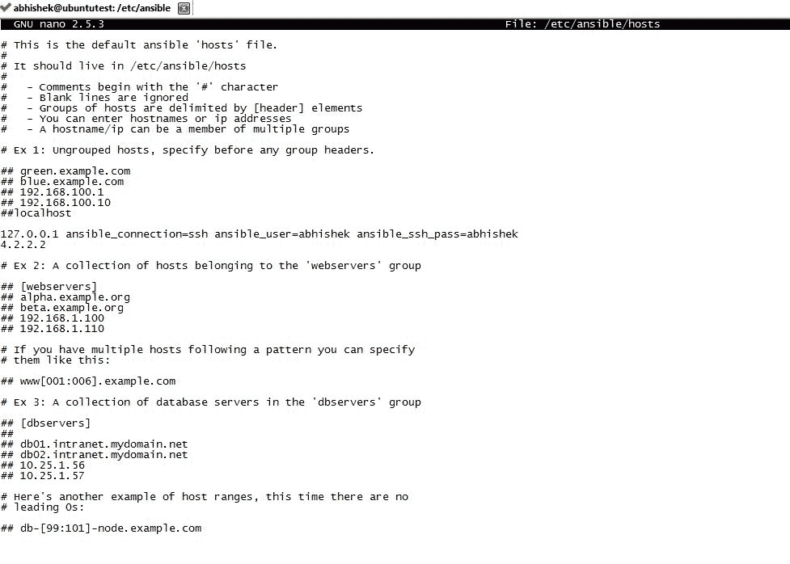

完成后，我们再次尝试执行相同的 ping 测试：

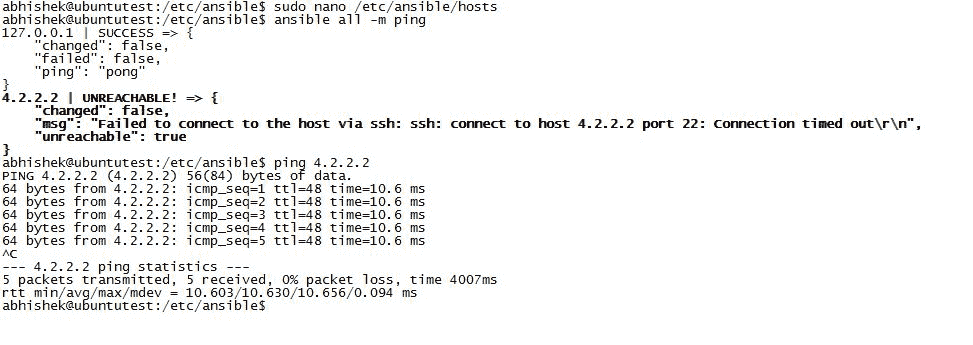

我们现在看到了什么？尽管我可以轻松地从我的机器上 ping `4.2.2.2`，但 Ansible 返回 `false` 的值，因为 Ansible 首先尝试使用 SSH 登录到设备，然后尝试 ping IP。在这种情况下，`4.2.2.2` 的 SSH 没有打开，我们从 Ansible 那里得到一个针对该特定 IP 地址的失败消息。此外，我们可以在 `hosts` 文件中按特定名称分组受管理的对象，例如 `routers`、`switches`、`servers` 或我们喜欢的任何名称。

考虑以下示例：

我们将当前的 IP（本地主机和 `4.2.2.2`）分组到一个新的组中，`myrouters`。我们返回并修改 `/etc/ansible/hosts` 文件：

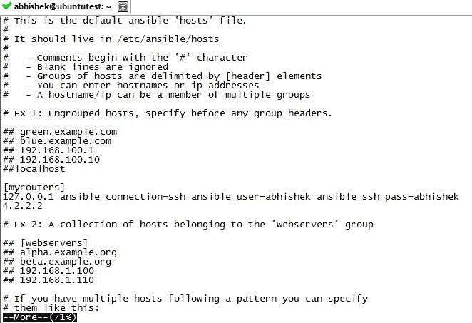

注意文件中添加了 `myrouters` 组。一旦我们保存它，现在让我们使用这个组来执行 ping 任务：

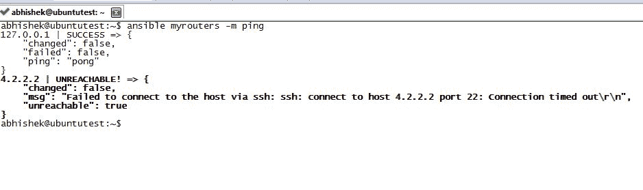

如我们所见，我们不再 ping 所有设备，而是 ping `myrouters` 组，在我们的例子中是环回 IP 和 `4.2.2.2`。

当然，结果将与之前相同，但现在我们增加了灵活性，确保我们根据单个节点或特定名称下的节点组执行任务。

# 临时命令简介

**临时**命令在 Ansible 中用于执行基于临时需求或仅一次需求的任务。换句话说，这些是用户希望即时执行但不想保存以供以后使用的任务。一个 Ansible 临时命令的快速用例可能是快速获取一组受管理节点的版本信息，作为一次性任务用于其他用途。由于这是一个快速的信息需求且不需要重复，我们会使用临时任务来执行此请求。

随着本章的进行，将会有一些额外的开关（我们传递给 Ansible 命令的额外选项），这些开关将根据需求引入。仅调用 `ansible` 命令将产生所有可以作为选项或参数传递的值：

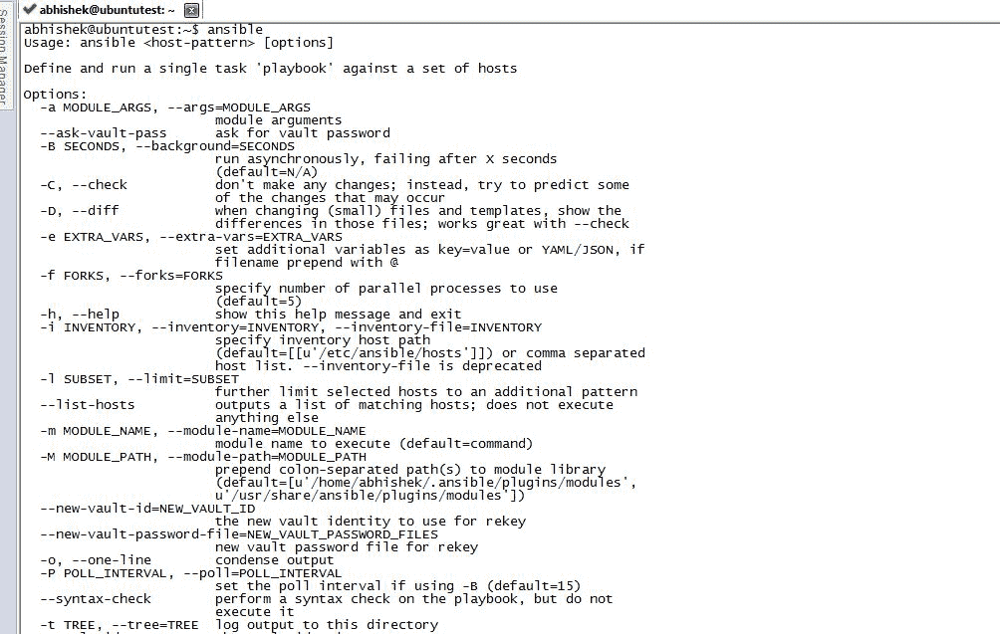

一些临时命令的示例如下：

1.  假设我们需要 ping 同一组设备，但现在是在并行方式下（默认是顺序执行，但为了使任务更快，我们会使用并行方法）：

```py
ansible myrouters -m ping -f 5
```

1.  如果我们想要使用一个单独的 `username` 而不是默认配置的用户：

```py
ansible myrouters -m ping -f 5 -u <username>
```

1.  如果我们想要增强会话（或使用 `sudo` 或 `root`）：

```py
ansible myrouters -m ping -f 5 -u username --become -k (-k will ask for password)
```

对于单独的用户名，我们使用 `--become-user` 开关。

1.  对于执行特定的命令，我们使用 `-a` 选项（假设我们想要以并行方式获取 `myrouters` 列表中路由器的 `show version` 信息）：

```py
ansible myrouters -a "show version" -f 5 
```

`5` 是并行线程数的默认值，但为了再次更改此值，我们可以在 Ansible 配置文件中修改它。

1.  另一个例子是将文件从源复制到目标。假设我们需要将文件从当前源复制到多个服务器，这些服务器属于，比如说，`servers` 组：

```py
ansible servers -m copy -a "src=/home/user1/myfile.txt dest=/tmp/myfile.txt"
```

1.  我们想要在 Web 服务器上启动 `httpd`：

```py
ansible mywebservers -m service -a "name=httpd state=started"
```

反过来，如果我们想要停止 `httpd`：

```py
ansible mywebservers -m service -a "name=httpd state=stopped"
```

1.  作为另一个重要的例子，让我们假设我们想要运行一个长时间运行的命令，例如 `show tech-support`，但我们不想在前台等待。我们可以为这个命令指定一个超时时间（在我们的例子中是 600 秒）：

```py
ansible servers -B 600 -m -a "show tech-support"
```

这将返回一个 `jobid`，稍后可以用来更新。一旦我们有了 `jobid`，我们可以使用以下命令检查该特定 `jobid` 的状态：

```py
ansible servers -m async_status -a "jobid"
```

1.  有一个额外的命令可以提供 Ansible 可以获取并工作的特定节点的所有信息：

```py
ansible localhost -m setup |more 
```

查看本地机器（localhost）上事实的输出如下：

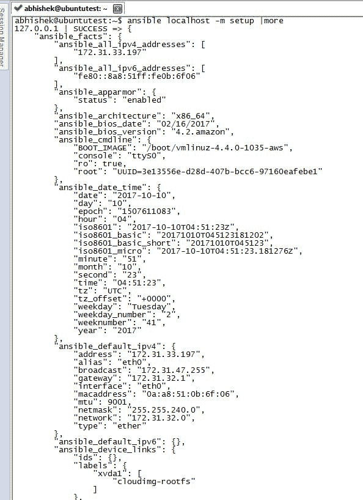

1.  另一个常用的 ad hoc 命令是`shell`命令。它用于控制整体操作系统、shell 或 root 场景。让我们看一个示例来重启`servers`组中的受管理节点：

```py
ansible servers -m shell -a "reboot"
```

如果我们想要关闭同一组服务器而不是重启：

```py
ansible servers -m shell -a "shutdown"
```

这样，我们可以确保使用 ad hoc 任务，我们可以快速对单个或多个受管理节点执行基本任务，以快速获得结果。

# Ansible playbooks

Playbooks 是我们为 Ansible 创建的一组指令，用于配置、部署和管理节点。这些作为指南，使用 Ansible 在个人或组上执行一组特定任务。将 Ansible 视为你的画册，playbooks 视为你的颜色，受管理节点视为图片。以这个例子为例，playbooks 确保需要将哪种颜色添加到图片的哪个部分，而 Ansible 框架执行为受管理节点执行 playbook 的任务。

Playbooks 是用一种称为**YAML Ain't Markup Language**（**YAML**）的基本文本语言编写的。Playbooks 包含执行在受管理节点上特定任务的配置。此外，playbooks 还用于定义一个工作流程，其中根据条件（如不同类型的设备或不同类型的操作系统），可以执行特定任务，并根据从任务执行中检索到的结果进行验证。它还结合了多个任务（以及每个任务中的配置步骤），可以按顺序执行这些任务，或者针对选定的或所有受管理节点并行执行。

关于 YAML 的良好信息可以在此处参考：

[`learn.getgrav.org/advanced/yaml`](https://learn.getgrav.org/advanced/yaml)

在基本层面上，playbook 由列表中的多个**plays**组成。每个 play 都是为了在特定的受管理节点组上执行某些 Ansible 任务（或要执行的命令集合）而编写的（例如`myrouters`或`servers`）。

从 Ansible 网站，以下是一个示例 playbook：

```py
- hosts: webservers
  vars:
    http_port: 80
    max_clients: 200
  remote_user: root
  tasks:
  - name: test connection
    ping:
```

在这个例子中，有一些部分我们需要理解：

1.  `hosts`：此列表包含组或受管理节点（在本例中为`webservers`），或由空格分隔的单独节点。

1.  `vars`：这是声明部分，我们可以在此处定义变量，类似于我们在任何其他编程语言中定义它们的方式。在这种情况下`http_port: 80`表示将`80`的值分配给`http_port`变量。

1.  `tasks`：这是实际声明部分，用于在`- hosts`部分定义的组（或受管理节点）上执行的任务。

1.  `name`：这表示用于识别特定任务的注释行。

使用此示例，让我们创建我们的 playbook 来 ping 早期示例中的受管理节点：

```py
- hosts: myrouters
  vars:
    http_port: 80
    max_clients: 200
  remote_user: root
  tasks:
  - name: test connection
    ping:
```

要创建配置，我们输入：

```py
nano checkme.yml
```

在编辑器中，我们复制并粘贴之前的代码，并保存它。对于执行，我们可以使用 `--check` 参数。这确保在远程系统上，如果要在 playbook 中执行更改，它将在本地模拟而不是在远程系统上实际执行：

```py
ansible-playbook checkme.yml --check 
```

执行前述给定命令的输出如下：

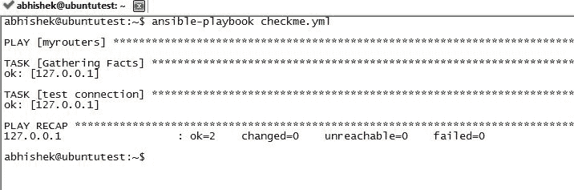

正如前一个输出所示，我们的 playbook `checkme.yml` 的模拟执行完成，并在 `PLAY RECAP` 部分显示了结果。

另一个例子是如果我们想根据我们的初始结果调用特定的任务。在 Ansible 中，我们使用 `handlers` 来执行该任务。在一个 play 中，我们创建一个可以基于任何从该任务中产生的变化执行 `notify` 动作的任务。这些动作在所有任务通过处理程序完成后被触发。换句话说，只有在 play 中的所有任务都完成后，`handlers` 条件才会被触发（例如，如果所有配置任务都已完成，则重新启动服务器）。

处理程序只是另一种类型的任务，但通过全局唯一名称引用，并且仅在由 `notify` 调用时执行：

```py
- hosts: myrouters
tasks:
 - name: show uptime
   command: echo "this task will show uptime of all hosts"
   notify: "show device uptime"
handlers:
 - name: show variables
   shell: uptime
   listen: "show device uptime"
```

正如前一个示例中所示，任务是在 `myrouters` 上执行的，它调用 `notify` 来执行处理程序任务。`handlers` 中的 `-name` 描述了任务将要调用的处理程序名称。

Ansible 是区分大小写的（例如：两个名为 `x` 和 `X` 的变量将是不同的）。

一旦调用通知处理程序，`shell: uptime` 命令将在远程 shell 上运行 `uptime` 命令并获取要显示的输出。在 `handlers` 部分下的 `listen` 命令也是一个调用特定处理程序的替代或更通用的方式。在这种情况下，`notify` 部分可以调用 `handlers` 下的特定处理程序，这与 `listen` 声明与 `notify` 声明相匹配（例如，在我们的案例中 `notify : "show device uptime"` 将调用监听 `show device uptime` 命令的特定处理程序，在这种情况下是由 `-name` 作为显示变量定义的），而不是调用我们在配置中目前看到的 `handlers` 下的 `-name` 声明。

Ansible playbook（在本例中为 `showenv.yml`）需要使用 `-v` 开关来调用以查看 `verbose` 输出，其中 verbose 输出是一种输出，我们可以通过执行看到所有活动，而不仅仅是显示最终结果）。

+   没有使用 `-v` 命令（verbose 输出未启用）的输出如下：

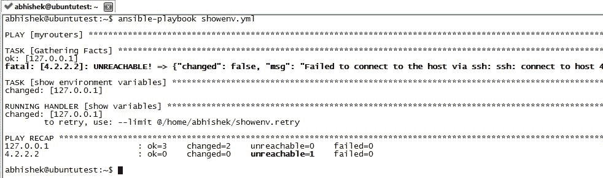

+   使用 `-v` 命令（verbose 输出已启用）的输出如下：

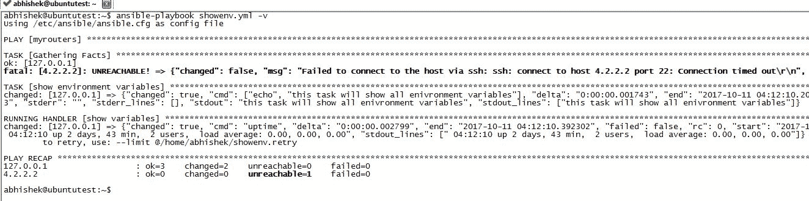

在前面的屏幕截图中，注意 playbook 执行中 `uptime` 命令的输出（从前面的屏幕截图中，`changed: [127.0.0.1] => {"changed": true, "cmd": "uptime", "delta":"`)。详细的输出显示了执行命令（在这种情况下为 `uptime`）以及从管理节点获取的值。

在许多情况下，如果我们创建了多个 playbook 并想在主 playbook 中运行它们，我们可以导入创建的 playbook：

```py
#example
- import_playbook: myroutercheck.yml
- import_playbook: myserver.yml

```

如果我们明确从 `.yml` 文件中导入某些任务：

```py
# mytask.yml
---
- name: uptime
  shell: uptime
```

查看内部 `main.yml` 的配置：

```py
tasks:
- import_tasks: mytask.yml
# or
- include_tasks: mytask.yml
```

同样，我们可以从另一个 `.yml` 文件中调用处理器：

```py
# extrahandler.yml
---
- name: show uptime
  shell: uptime    
```

在 `main.yml` 的配置中：

```py
handlers:
- include_tasks: extrahandler.yml
# or 
- import_tasks: extrahandler.yml
```

此外，当我们定义 Ansible 变量时，有一些考虑因素我们需要记住。变量不能包含特殊字符（除了下划线）或两个字符或单词之间的空格，并且不应以数字或特殊字符开头。

例如：

+   `check_me` 和 `check123` 是有效的变量

+   `check-me`、`check me` 和 `check.me` 是无效变量

在 YAML 中，我们可以使用冒号方法创建字典：

```py
myname:
  name: checkme
  age: 30
```

要引用或检索由名称 `myname` 创建的字典中的任何值，我们可以指定如下命令：`myname['name']` 或 `myname.name`**。**

# 使用 Ansible 事实

如我们之前所见，我们可以使用以下命令收集关于管理节点的事实：

```py
ansible <hostname> -m setup
```

例如：

```py
ansible localhost -m setup
```

现在，当我们获取回值（称为 **事实**）时，我们可以引用这些系统变量。每个系统变量将根据在 `hosts` 部分下调用的每个管理节点持有唯一值：

```py
- hosts: myrouters
  vars:
      mypath: "{{ base_path }}/etc"
```

可以使用 `{{variable name}}` 调用系统变量，但在 playbook 中需要用双引号引用。

让我们看看一个示例，其中我们在 playbook 中获取 `hostname` 的值：

```py
- hosts: myrouters
  tasks: 
   - debug:
       msg: "System {{ inventory_hostname }} has hostname as {{ ansible_nodename }}"
```

获取主机名的 playbook 输出：

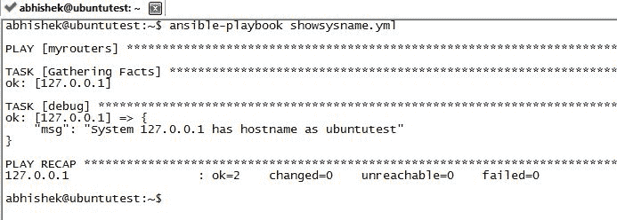

如我们所见，在 playbook（在前面代码中），我们引用了 `{{inventory_hostname}}` 和 `{{ansible_nodename}}` 变量，这导致在 `msg` 部分的输出：`System 127.0.0.1 has host hostname as ubuntutest`。使用相同的 playbook 配置，我们可以使用所有或任何其他通过替换配置中的系统变量检索到的事实。

如果我们想从事实中获取更多信息，我们可以引用方括号内的特定值：

`{{ ansible_eth0.ipv4.address }}` 或 `{{ ansible_eth0["ipv4"]["address"] }}`。

我们还可以通过命令行将变量传递给 playbook，如下例所示：

```py
- hosts: "{{hosts}}"
  tasks: 
   - debug:
       msg: "Hello {{user}}, System {{ inventory_hostname }} has hostname as {{ ansible_nodename }}"
```

执行包含变量的 playbook 的命令：

```py
ansible-playbook gethosts.yml --extra-vars "hosts=myrouters user=Abhishek"
```

在命令行执行期间提供变量时命令的输出：

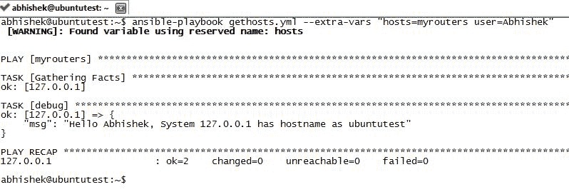

正如我们所见，`myrouters`的值被传递给`hosts`，`Abhishek`的值被传递给`user`变量。正如我们在 playbook 执行的输出中看到的，`msg`变量输出包含`user`变量的值和配置在`myrouters`组中的主机（在本例中，单个主机是这个组的一部分，IP 地址为`127.0.0.1`）。

# Ansible 条件

有时候，我们想要根据条件执行某些任务。`when`语句用于确定这些条件，如果条件评估为真，则执行指定的任务。让我们用一个例子来执行`uptime`命令，如果我们传递参数`clock`到变量`clock`：

```py
- hosts: myrouters
 tasks: 
 - shell: uptime
 - debug:
 msg: "This is clock condition" 
 when: clock == "clock"

 - debug: 
 msg: "This is NOT a clock condition"
 when: clock != "clock"

```

**从命令行执行**：将错误的值`clock123`传递给`clock`变量：

```py
ansible-playbook checkif.yml --extra-vars "clock=clock123"
```

提供错误值后的执行输出：

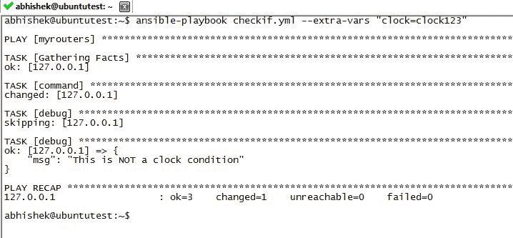

正如我们在前面的输出中看到的，消息`This is NOT a clock condition`是根据我们传递的值执行的。同样，如果我们传递如下所示的时钟变量：

```py
ansible-playbook checkif.yml --extra-vars "clock=clock"
```

从命令行传递正确变量值后的输出：

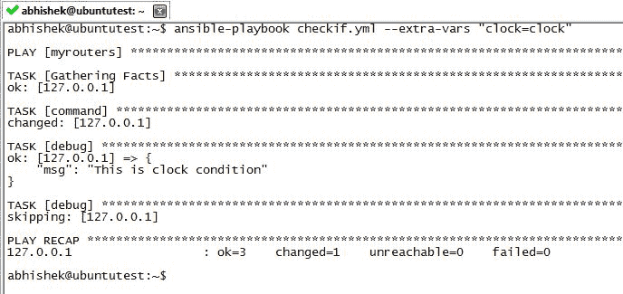

消息`This is clock condition`现在是根据传递的参数执行的。看另一个例子，以类似的方式，我们可以确保根据某个事实采取某些行动：

```py
- hosts: myrouters
  tasks: 
   - shell: uptime
   - debug:
       msg: "This is clock condition on Ubuntu" 
     when: 
      - clock == "clock"
      - ansible_distribution == "Ubuntu"

   - debug: 
       msg: "This is clock condition on Red HAT"
     when: 
      - clock = "clock" 
      - ansible_distribution == "Red Hat"

```

正如我们所见，条件是在`ansible_distribution`事实上触发的。如果响应是 Ubuntu，则执行第一个条件，否则，根据`Red Hat`执行其他条件。此外，我们还在从命令行使用`clock`作为传递给 playbook 的变量调用 playbook 时验证时钟值是否为`clock`。在前面的代码中，如果我们要得到那个特定的结果，两个条件都需要评估为真。

# Ansible 循环

我们可以使用`with_items`循环进行重复操作。让我们看看一个解析列表并打印值的例子：

```py
---
- hosts : all
 vars:
 - test: Server
tasks:
 - debug: 
 msg: "{{ test }} {{ item }}" 
 with_items: [ 0, 2, 4, 6, 8, 10 ]
```

使用前面代码执行 playbook 的输出：

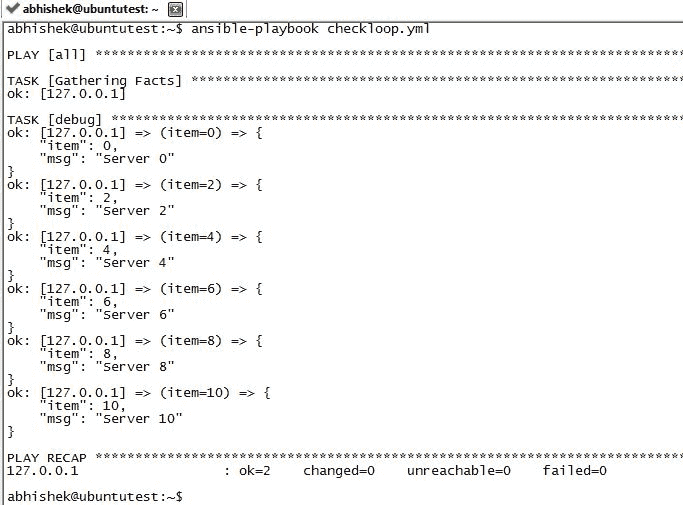

正如我们在前面的屏幕截图中所见，迭代打印了`Server`的值加上列表中每个项目的值。同样，对于整数迭代，我们可以使用`with_sequence`命令执行循环：

```py
---
- hosts : all
 vars:
 - test: Server
tasks:
 - debug: 
 msg: "{{ test }} {{ item }}" 
 with_sequence: count=10
```

此外，假设我们想要打印跳过 2（从 0 到 10 的偶数）的值，相同的`with_sequence`命令将写成：

```py
with_sequence: start=0 end=10 stride=2
```

有时候，我们也需要为执行特定任务随机选择任何值。以下示例代码从 4 个可用的选项中（在我们的案例中，从`Choice Random 1`到`Choice Random 4`）随机选择一个值，并使用`msg`变量显示它：

```py
---
- hosts : all
 vars:
 - test: Server
tasks:
 - debug: 
 msg: "{{ test }} {{ item }}" 
 with_random_choice:
    - "Choice Random 1"
    - "Choice Random 2"
    - "Choice Random 3"
    - "Choice Random 4"
```

这将从`with_random_choice`声明下的给定选项列表中随机选择任何值。

# Python API 与 Ansible

可以使用 Python 调用 Ansible 代码，使用 Ansible API。Ansible 已发布其 API 的 2.0 版本，以更好地与编程语言集成。需要注意的是，Ansible 已扩展其功能以支持使用 Python 进行开发，但它在网站上也建议，根据其自己的判断，它也可以停止支持 API（创建甚至修复其当前 API 版本的）框架。

让我们看看一个创建 play 的例子，该 play 的任务是从我们之前`myrouters`的清单中查看用户名：

```py
#call libraries
import json
from collections import namedtuple
from ansible.parsing.dataloader import DataLoader
from ansible.vars.manager import VariableManager
from ansible.inventory.manager import InventoryManager
from ansible.playbook.play import Play
from ansible.executor.task_queue_manager import TaskQueueManager
from ansible.plugins.callback import CallbackBase

Options = namedtuple('Options', ['connection', 'module_path', 'forks', 'become', 'become_method', 'become_user', 'check', 'diff'])

# initialize objects
loader = DataLoader()
options = Options(connection='local', module_path='', forks=100, become=None, become_method=None, become_user=None, check=False,
                  diff=False)
passwords = dict(vault_pass='secret')

# create inventory
inventory = InventoryManager(loader=loader, sources=['/etc/ansible/hosts'])
variable_manager = VariableManager(loader=loader, inventory=inventory)

# create play with task
play_source = dict(
        name = "mypythoncheck",
        hosts = 'myrouters',
        gather_facts = 'no',
        tasks = [
            dict(action=dict(module='shell', args='hostname'), register='shell_out'),
            dict(action=dict(module='debug', args=dict(msg='{{shell_out.stdout}}')))
         ]
    )
play = Play().load(play_source, variable_manager=variable_manager, loader=loader)

# execution
task = None
try:
    task = TaskQueueManager(
              inventory=inventory,
              variable_manager=variable_manager,
              loader=loader,
              options=options,
              passwords=passwords,
              stdout_callback='default'
          )
    result = task.run(play)
finally:
    if task is not None:
        task.cleanup()
```

在显示从受管理节点用户名的先前代码中：

1.  `'#call libraries'`：这些用于初始化可用的 Ansible API 库。其中一些重要的库有：

    +   `from ansible.parsing.dataloader import DataLoader`：此用于加载或解析 YAML 或 JSON 格式的文件或值，如果被调用

    +   `from ansible.vars import VariableManager`：此用于清单文件位置

    +   `from ansible.inventory.manager import InventoryManager`：此用于清单初始化

    +   `from ansible.playbook.play import Play`：此用于配置 play

    +   `from ansible.executor.task_queue_manager import TaskQueueManager`：此用于配置的 play 的实际执行

1.  `# initialize objects`：此部分初始化各种组件，如 root 用户、`become_user`（如果有）和其他运行 play 所需的参数。

1.  `# create inventory`：这是指定实际清单位置并初始化它的地方。

1.  `# create play with task`：这是我们在类似创建`.yml`文件的方式中创建任务的地方。在这种情况下，是为了显示清单中`myrouters`部分所有节点的主机名。

1.  `# execution`：这是使用任务的`run()`方法创建的 play 的执行。

上述代码的输出如下：

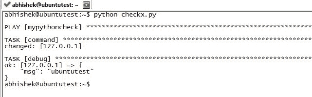

如我们所见，在调用 Python 文件后，我们得到了在`hosts`文件（`/etc/ansible/hosts`）中定义的`myrouters`清单部分下 localhost 的主机名。

# 创建网络配置模板

由于我们现在已经熟悉了 Ansible 的基础知识，让我们看看一个例子，其中我们为一些路由器生成准备部署的配置。首先，我们需要了解 Ansible 中的角色。**角色**用于为 Ansible playbooks 创建文件结构。基于角色，我们可以分组相似的数据。与他人共享角色意味着我们共享整个定义的文件结构，以共享一组常见内容。一个典型的角色文件结构将包含主文件夹和内容文件夹，在内容文件夹下，我们将有`templates`、`vars`和`tasks`文件夹。

在我们的情况下，层次结构如下：

+   主目录

    +   - 角色

        +   - 路由器

            +   - 模板

            +   - 变量

            +   - 任务

在每个模板、变量或任务文件夹下，如果我们调用该特定角色，将自动搜索名为`main.yml`的文件，并考虑该特定角色的该文件中的任何配置。使用之前提到的层次结构细节，在我们的测试机器（运行 Ubuntu）上，以下是我们的文件结构示例：

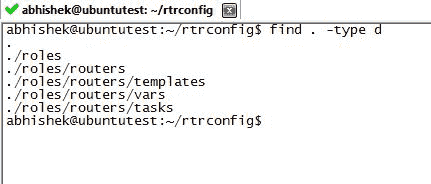

如我们所见，在`rtrconfig`文件夹下，我们根据 Ansible 标准定义了文件夹。一旦我们创建了文件夹层次结构，下一步就是在每个部分下根据我们的需求配置/创建文件。

首先，由于我们将使用路由器模板来生成配置，我们创建一个模板并将其放入`roles/routers/templates`文件夹中。

路由器配置模板如下（用作通用路由器模板以生成路由器配置）：

```py
no service pad
 service tcp-keepalives-in
 service tcp-keepalives-out
 service password-encryption
 username test password test
 !
 hostname {{item.hostname}}
 logging server {{logging_server}}
 !
 logging buffered 32000
 no logging console
 !
 ip domain-lookup enable
 !
 exit
```

如我们在模板中所见，`{{item.hostname}}`和`{{logging_server}}`是我们创建实际配置时需要替换的两个值。由于这是一个 Jinja 模板，我们将把这个模板保存为`somename.j2`（在我们的例子中，`routers.j2`）。下一步是定义变量值。

如我们之前所见，我们需要确保`logging_server`变量已经定义了一个值。这将在`roles/routers/vars`文件夹中：

```py
---
logging_server: 10.10.10.10
```

我们将此文件保存为`vars`文件夹中的`main.yml`，这将默认在执行 playbook 时用于变量值声明。一旦我们有了定义和模板，下一步就是定义实际需要执行的任务。

这将在`roles/routers/tasks`文件夹中完成，并再次保存为`main.yml`，以便在执行该特定角色时进行自动发现。

让我们看看这个配置：

```py
---
- name: Generate configuration files
  template: src=routers.j2 dest=/home/abhishek/{{item.hostname}}.txt
  with_items: 
  - { hostname: myrouter1 }
  - { hostname: myrouter2 }
```

在任务的配置中，我们调用我们创建的模板（在这种情况下，`routers.j2`），并提供一个配置文件将保存到的目标文件夹（在这种情况下，`/home/abhishek/{{item.hostname}}.txt`）。

这里需要特别注意的一个点是`{{item.hostname}}`将解析为我们使用`with_items`循环提供的每个主机名。因此，将生成的文件名将是`with_items`循环中定义的每个项（在我们的例子中，`myrouter1.txt`和`myrouter2.txt`）。

如前所述，`with_items`将循环每个值，其中主机变量值在每个迭代中都会改变。一旦我们有了模板、变量和任务，我们将在主 playbook 中调用该角色并执行它。

主 playbook 配置如下：

```py
---
- name: Generate router configuration files
  hosts: localhost

  roles:
    - routers
```

在这里，我们只是调用主机（在我们的例子中是 localhost，因为我们想在本地上执行），并调用在 playbook 中需要执行的角色（在我们的例子中，`routers`）。我们将其保存为任何带有`.yml`扩展名的名称（在我们的例子中，`makeconfig.yml`）。

确保所有`.yml`文件都创建在相应文件夹中的最终验证如下：

1.  回顾一下，以下是详细的文件结构，正如我们现在在`rtrconfig`文件夹下看到的文件：

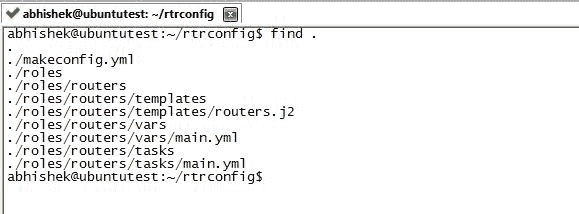

1.  要为路由器生成配置，我们执行`makeconfig.yml`剧本：

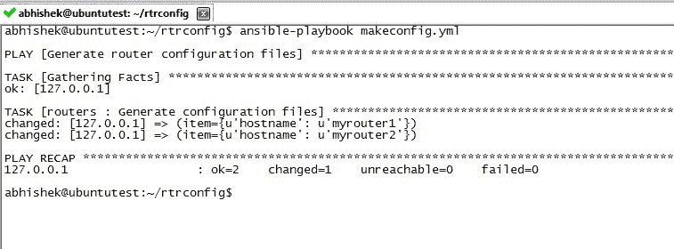

1.  一旦成功执行，我们应该在`/home/abhishek`文件夹中有两个文件（`myrouter1.txt`和`myrouter2.txt`），其中包含生成的配置：


1.  这里是从生成的文件中提取的内容：

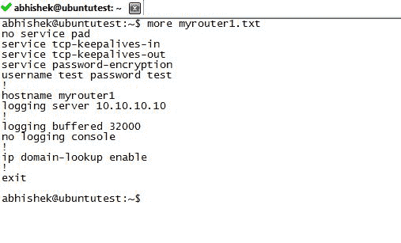

1.  如我们所见，现在我们有了生成的配置，使用模板，并替换了主机名和`logging_server`部分的值。

配置现在已生成并准备好推送到那些特定的路由器（它们位于`roles/routers/tasks`下的`main.yml`中），以类似的方式，我们可以为具有各种角色和每个角色中多个设备的配置生成配置，例如交换机、路由器、负载均衡器等，每个角色都包含与该角色相关的特定信息，如变量、模板和任务。

# 摘要

在本章中，我们学习了 Ansible 是什么，它的安装以及 Ansible 的基本使用。本章还介绍了 Ansible 中使用的概念和术语，包括如何创建剧本、任务和其他基本功能。我们还熟悉了 ad-hoc 命令，并理解了事实的概念及其在 Ansible 中的使用。

最后，通过使用 Jinja 模板，我们了解了如何使用模板创建完整的配置，并参考设备/角色特定信息使用 Ansible 中的角色。

在下一章中，我们将看到如何调用自动化的一些其他方面，例如使用 Splunk 进行 syslog 收集和从 Python 获取信息，在 BGP 上进行基本自动化，UC 集成示例以及其他相关示例，这些示例在创建自动化脚本时可以作为参考资料。
