# 网络工程师的持续集成

如前几章所述，现在我们已具备使用各种技术创建自动化、使用 Ansible 以及理解最佳实践的知识或相当的了解，我们继续我们的旅程，了解如何进行自动化项目的基本规划。

在本章中，我们将看到一些帮助我们规划自动化项目的工具，以及一些与各种设备或网络技术相关的日益复杂的场景的交互示例。

我们将工作的某些方面包括：

+   与 Splunk 的交互

+   BGP 和路由表

+   无线客户端到 AP 到交换端口

+   电话到交换端口

+   WLAN 和 IPAM

+   有用的最佳实践和用例

# 与 Splunk 的交互

**Splunk** 是最广泛使用的数据挖掘工具之一。凭借其数据挖掘和挖掘能力，工程师可以根据决策采取行动。虽然它在各个方面都很有用，但在这里我们将看到一个 Splunk 作为 Syslog 服务器使用的例子，我们的测试路由器向该服务器发送消息（作为 syslog），以及我们如何从自动化中查询 Splunk 的这些 syslogs 并采取行动。

这是自动化过程中的一个重要部分，因为基于某些事件（警报和 syslogs），工程师需要执行自动化任务，如自我修复，甚至触发电子邮件或使用第三方工具为各个团队创建工单。

在这里，我们将看到 Splunk 作为 Syslog 服务器的基本实现和配置：

1.  下载并安装 Splunk 后，可以通过以下 URL 访问它：`http://localhost:8000/en-US/account/login?return_to=%2Fen-US%2F`，如下截图所示：


1.  登录后，我们创建一个监听 syslogs 的监听器（在我们的案例中我们使用`TCP`协议并保持默认端口`514`开放）：

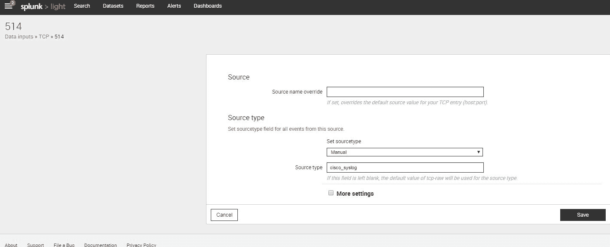

在 Splunk 上完成 TCP 端口`514`的配置（监听 syslog 消息）后，确保服务器上的任何本地防火墙都允许 TCP 端口`514`的入站数据包，并且我们的机器已准备好从网络设备通过 TCP 端口`514`访问 syslogs。

1.  配置路由器发送 syslogs。我们在路由器上应用以下命令以启用日志记录（在我们的案例中，Syslog 服务器的 IP 地址为`192.168.255.250`）：

```py
config t
logging host 192.168.255.250 transport tcp port 514
logging buffered informational
exit
```

这配置了路由器将 syslogs 发送到指定 IP 地址，通过 TCP 协议在端口`514`上。此外，我们还在路由器上声明仅记录信息 syslog 消息。

1.  完成后，为了确认，我们可以尝试执行任何接口（在我们的案例中是`Loopback0`）的关闭和非关闭操作，并使用路由器上的`show logging`命令查看日志：

```py
R2#show logging
Syslog logging: enabled (11 messages dropped, 0 messages rate-limited,
 0 flushes, 0 overruns, xml disabled, filtering disabled)
 Console logging: level debugging, 26 messages logged, xml disabled,
 filtering disabled
 Monitor logging: level debugging, 0 messages logged, xml disabled,
 filtering disabled
 Buffer logging: level informational, 7 messages logged, xml disabled,
 filtering disabled
 Logging Exception size (4096 bytes)
 Count and timestamp logging messages: disabled
No active filter modules.
 Trap logging: level informational, 30 message lines logged
 Logging to 192.168.255.250(global) (tcp port 514,audit disabled, link up), 30 message lines logged, xml disabled,
 filtering disabled
Log Buffer (4096 bytes):
*Mar  1 01:02:04.223: %SYS-5-CONFIG_I: Configured from console by console
*Mar  1 01:02:10.275: %SYS-6-LOGGINGHOST_STARTSTOP: Logging to host 192.168.255.250 started - reconnection
*Mar  1 01:02:32.179: %LINK-5-CHANGED: Interface Loopback0, changed state to administratively down
*Mar  1 01:02:33.179: %LINEPROTO-5-UPDOWN: Line protocol on Interface Loopback0, changed state to down
*Mar  1 01:02:39.303: %SYS-5-CONFIG_I: Configured from console by console
*Mar  1 01:02:39.647: %LINK-3-UPDOWN: Interface Loopback0, changed state to up
*Mar  1 01:02:40.647: %LINEPROTO-5-UPDOWN: Line protocol on Interface Loopback0, changed state to up

```

确认路由器是否发送 syslogs 的一个重要方面是行`tcp port 514, audit disabled, link up`，这确认了路由器正在向 Syslog 服务器发送 syslog 流量。

1.  这是 Splunk 上生成的 syslog 的原始输出：

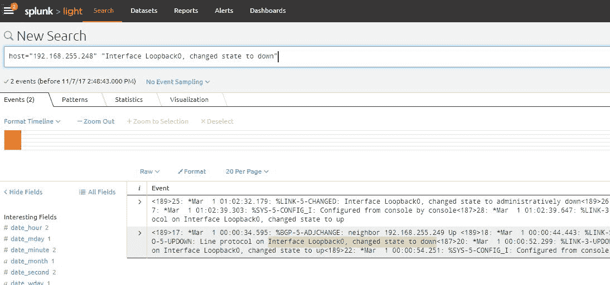

正如我们在“新搜索”部分所看到的那样，我们可以编写查询来获取我们想要的确切数据。在我们的例子中，我们只想看到来自我们的路由器且带有`Interface Loopback0`下线消息的日志，因此我们编写了以下查询：

```py
host="192.168.255.248" "Interface Loopback0, changed state to down"
```

1.  现在让我们看看我们可以用 Python 编写的代码来使用脚本获取相同的信息：

```py
import requests
import json
from xml.dom import minidom

username="admin"
password="admin"

### For generating the session key ####
url = 'https://localhost:8089/services/auth/login'
headers = {'Content-Type': 'application/json'}
data={"username":username,"password":password}
requests.packages.urllib3.disable_warnings()
r = requests.get(url, auth=(username, password), data=data, headers=headers,verify=False)
sessionkey = minidom.parseString(r.text).getElementsByTagName('sessionKey')[0].childNodes[0].nodeValue

#### For executing the query using the generated sessionkey
headers={"Authorization":"Splunk "+sessionkey}
data={"search":'search host="192.168.255.248" "Interface Loopback0, changed state to down"',"output_mode":"json"}
r=requests.post('https://localhost:8089/servicesNS/admin/search/search/jobs/export',data=data , headers=headers,verify=False);
print (r.text)
```

在第一部分，我们查询 Splunk 的 API 以获取运行查询和获取结果的认证会话密钥（或令牌）。一旦我们有了会话密钥（从 XML 输出中提取），我们创建一个头文件，并使用`requests.post`执行我们的查询。数据变量包含以下格式的我们的查询：

```py
{"search":'search host="192.168.255.248" "Interface Loopback0, changed state to down"'}
```

换句话说，如果我们把这个作为一个变量（命名为`Search`），并将结果作为值提供给这个变量，它看起来会像下面这样：

```py
Search='search host="192.168.255.248" "Interface Loopback0, changed state to down"'
```

此外，我们还提供了另一个`output_mode`选项，因为我们希望输出为 JSON 格式（其他值可以是 CSV 或 XML）。

执行相同的操作将得到以下输出：

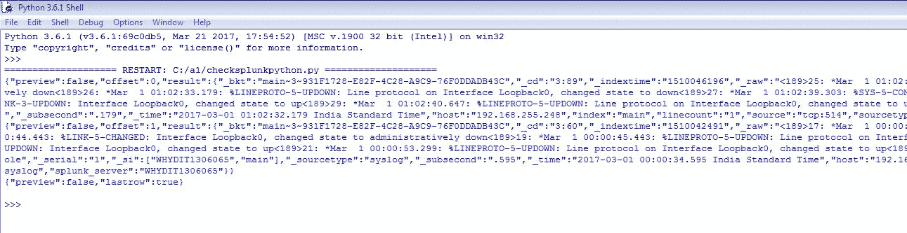

正如我们在前面的输出中所看到的那样，我们现在正在以 JSON 格式检索和显示值。

我们在这里停止我们的例子，但为了增强这个脚本，这个结果现在可以成为一个触发器，我们可以添加额外的方法或逻辑来决定触发进一步的动作。通过这种逻辑，我们可以有自我修复的脚本，这些脚本可以找出数据（作为触发器），评估触发器（识别其可操作性），并根据进一步的逻辑采取行动。

# 在各种技术领域上的自动化示例

通过对自动化与设备、API、控制器交互的熟悉和理解，让我们看看一些如何与其他网络域设备交互以及使用自动化框架处理一些复杂场景的例子。

其中一些示例将是一个小项目本身，但将帮助你深入了解执行自动化任务的方式。

# BGP 和路由表

让我们举一个例子，我们需要配置 BGP，验证会话是否启动，并报告相同细节。在我们的例子中，我们会选择两个路由器（作为先决条件，两个路由器都能互相 ping 通）如下：

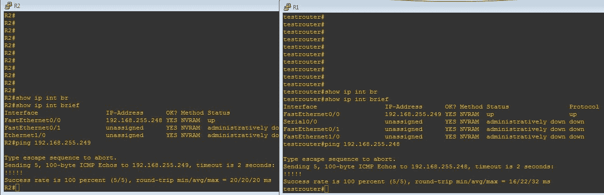

正如我们所见，`R2`和`testrouter`能够使用彼此的`FastEthernet0/0`接口的 IP 地址互相 ping 通。

下一步是一个非常基本的 BGP 配置（在我们的案例中，我们使用**自治系统**（**AS**）号`200`）。代码如下：

```py
from netmiko import ConnectHandler
import time

def pushbgpconfig(routerip,remoteip,localas,remoteas,newconfig="false"):
    uname="cisco"
    passwd="cisco"
    device = ConnectHandler(device_type='cisco_ios', ip=routerip, username=uname, password=passwd)
    cmds=""
    cmds="router bgp "+localas
    cmds=cmds+"\n neighbor "+remoteip+" remote-as "+remoteas
    xcheck=device.send_config_set(cmds)
    print (xcheck)
    outputx=device.send_command("wr mem")
    print (outputx)
    device.disconnect()

def validatebgp(routerip,remoteip):
    uname="cisco"
    passwd="cisco"
    device = ConnectHandler(device_type='cisco_ios', ip=routerip, username=uname, password=passwd)
    cmds="show ip bgp neighbors "+remoteip+" | include BGP state"
    outputx=device.send_command(cmds)
    if ("Established" in outputx):
        print ("Remote IP "+remoteip+" on local router "+routerip+" is in ESTABLISHED state")
    else:
        print ("Remote IP "+remoteip+" on local router "+routerip+" is NOT IN ESTABLISHED state")
    device.disconnect()

pushbgpconfig("192.168.255.249","192.168.255.248","200","200")
### we give some time for bgp to establish
print ("Now sleeping for 5 seconds....")
time.sleep(5) # 5 seconds
validatebgp("192.168.255.249","192.168.255.248")
```

输出如下：

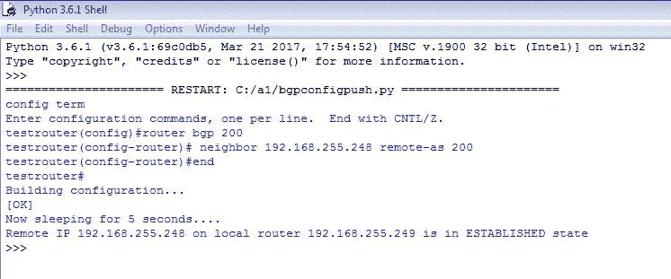

正如我们所见，我们将邻居配置（BGP 配置）推送到路由器。一旦配置被推送，脚本等待 5 秒钟并验证 BGP 的状态是否处于`ESTABLISHED`状态。这种验证确认了我们推送的配置中所有新配置的会话都已建立。

让我们推送一个不正确的配置如下：

```py
from netmiko import ConnectHandler
import time
def pushbgpconfig(routerip,remoteip,localas,remoteas,newconfig="false"):
 uname="cisco"
 passwd="cisco"
 device = ConnectHandler(device_type='cisco_ios', ip=routerip, username=uname, password=passwd)
 cmds=""
 cmds="router bgp "+localas
 cmds=cmds+"\n neighbor "+remoteip+" remote-as "+remoteas
 xcheck=device.send_config_set(cmds)
 print (xcheck)
 outputx=device.send_command("wr mem")
 print (outputx)
 device.disconnect()
def validatebgp(routerip,remoteip):
 uname="cisco"
 passwd="cisco"
 device = ConnectHandler(device_type='cisco_ios', ip=routerip, username=uname, password=passwd)
 cmds="show ip bgp neighbors "+remoteip+" | include BGP state"
 outputx=device.send_command(cmds)
 if ("Established" in outputx):
 print ("Remote IP "+remoteip+" on local router "+routerip+" is in ESTABLISHED state")
 else:
 print ("Remote IP "+remoteip+" on local router "+routerip+" is NOT IN ESTABLISHED state")
 device.disconnect()

pushbgpconfig("192.168.255.249","192.168.255.248","200","400")
### we give some time for bgp to establish
print ("Now sleeping for 5 seconds....")
time.sleep(5) # 5 seconds
validatebgp("192.168.255.249","192.168.255.248")
```

前面代码的输出如下：

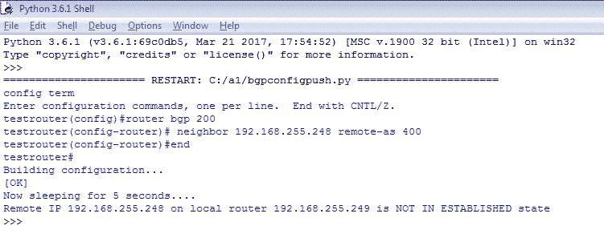

正如我们在前面的输出中看到的，现在我们正在使用一个错误的远程配置（在这种情况下是`400`）。当然，由于配置不正确，我们得到了一个未建立的消息，这证实了我们推送的配置是不正确的。以类似的方式，我们可以通过为每个要配置的远程邻居调用方法多次来推送大量配置。此外，有时我们需要从运行配置的某些配置部分获取特定信息。

例如，以下代码将为运行配置的每个部分输出一个列表：

```py
from netmiko import ConnectHandler
import itertools

class linecheck:
    def __init__(self):
        self.state = 0
    def __call__(self, line):
        if line and not line[0].isspace():
            self.state += 1
        return self.state

def getbgpipaddress(routerip):
    uname="cisco"
    passwd="cisco"
    device = ConnectHandler(device_type='cisco_ios', ip=routerip, username=uname, password=passwd)
    cmds="show running-config"
    outputx=device.send_command(cmds)
    device.disconnect()
    for _, group in itertools.groupby(outputx.splitlines(), key=linecheck()):
        templist=list(group)
        if (len(templist) == 1):
            if "!" in str(templist):
                continue 
        print(templist)

getbgpipaddress("192.168.255.249")
```

输出如下：

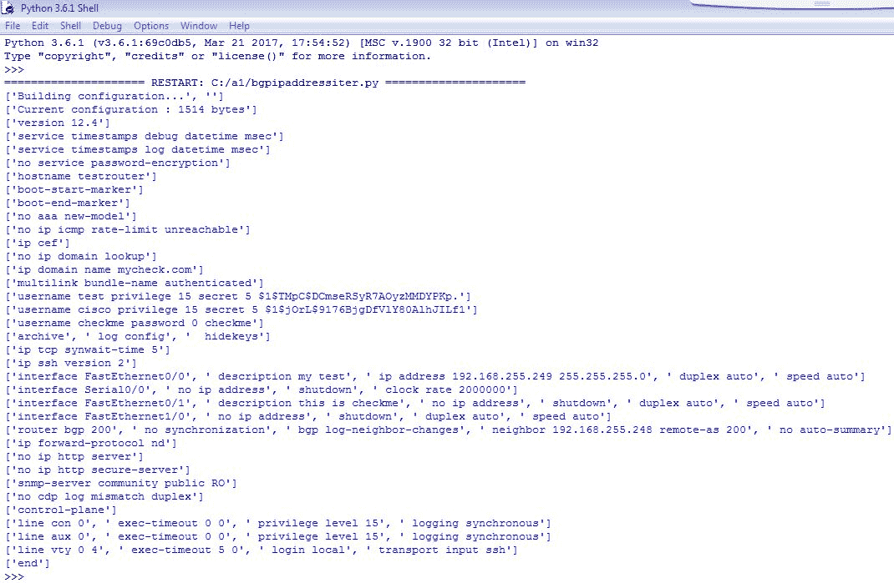

正如我们在前面的输出中看到的，我们得到了运行配置的所有部分，除了在运行配置中看到的感叹号`!`（在路由器上执行`show running-config`命令时）。这个输出的重点是，我们现在解析了运行配置中的每个部分，或者换句话说，一个特定的配置集（如接口或 BGP）被组合在一个单独的列表中。

让我们增强这段代码。例如，我们只想看到在路由器中配置了哪些 BGP 远程 IP：

```py
from netmiko import ConnectHandler
import itertools
import re

class linecheck:
    def __init__(self):
        self.state = 0
    def __call__(self, line):
        if line and not line[0].isspace():
            self.state += 1
        return self.state

def getbgpipaddress(routerip):
    uname="cisco"
    passwd="cisco"
    device = ConnectHandler(device_type='cisco_ios', ip=routerip, username=uname, password=passwd)
    cmds="show running-config"
    outputx=device.send_command(cmds)
    device.disconnect()
    for _, group in itertools.groupby(outputx.splitlines(), key=linecheck()):
        templist=list(group)
        if (len(templist) == 1):
            if "!" in str(templist):
                continue 
        if "router bgp" in str(templist):
            for line in templist:
                if ("neighbor " in line):
                    remoteip=re.search("\d+.\d+.\d+.\d+",line)
                    print ("Remote ip: "+remoteip.group(0))

getbgpipaddress("192.168.255.249")
```

输出如下：

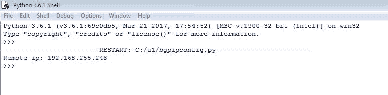

在这种情况下，首先我们解析运行配置，并关注包含`router bgp`配置的部分。一旦到达那个特定的列表，我们就解析列表并使用正则表达式在包含字符串`neighbor`的特定命令中获取远程 IP。结果值将是 BGP 部分下的远程 IP。

由于我们正在处理 BGP，AS 号码作为 BGP 的一个组成部分，需要被解析或验证。使用前面的策略，我们可以获取 BGP 路由/前缀的 AS 号码，但除此之外，还有一个名为`pyasn`的 Python 库，可以轻松地查找给定公网 IP 地址的 AS 号码信息。

再次，如前所述，在代码中调用它之前，我们需要安装以下库：

```py
pip install cymruwhois
```

代码如下：

```py
import socket

def getfromhostname(hostname):
    print ("AS info for hostname :"+hostname)
    ip = socket.gethostbyname(hostname)
    from cymruwhois import Client
    c=Client()
    r=c.lookup(ip)
    print (r.asn)
    print (r.owner)

def getfromip(ip):
    print ("AS info for IP : "+ip)
    from cymruwhois import Client
    c=Client()
    r=c.lookup(ip)
    print (r.asn)
    print (r.owner)

getfromhostname("google.com")
getfromip("107.155.8.0")
```

输出如下：

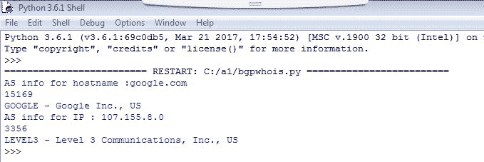

正如我们所见，第一个方法`getfromhostname`用于获取给定主机名的信息。另一个方法`getfromip`用于通过 IP 地址而不是任何主机名来获取相同的信息。

# 配置思科交换机端口为接入点

当在多设备环境中工作时，除了路由器和交换机外，我们还需要与其他网络设备（如无线设备）交互。本例将展示如何配置交换机，使其特定端口连接到**接入点**（**AP**）作为 trunk。

在我们的测试案例中，假设在 AP 上配置的 VLAN 为`vlan 100`和`vlan 200`用于用户，而原生 VLAN 为`vlan 10`，代码如下：

```py
from netmiko import ConnectHandler
import time

def apvlanpush(routerip,switchport):
    uname="cisco"
    passwd="cisco"
    device = ConnectHandler(device_type='cisco_ios', ip=routerip, username=uname, password=passwd)
    cmds="interface "+switchport
    cmds=cmds+"\nswitchport mode trunk\nswitchport trunk encapsulation dot1q\n"
    cmds=cmds+ "switchport trunk native vlan 10\nswitchport trunk allowed vlan add 10,100,200\nno shut\n"
    xcheck=device.send_config_set(cmds)
    print (xcheck)
    device.disconnect()

def validateswitchport(routerip,switchport):
    uname="cisco"
    passwd="cisco"
    device = ConnectHandler(device_type='cisco_ios', ip=routerip, username=uname, password=passwd)
    cmds="show interface "+switchport+" switchport "
    outputx=device.send_command(cmds)
    print (outputx)
    device.disconnect()

apvlanpush("192.168.255.245","FastEthernet2/0")
time.sleep(5) # 5 seconds
validateswitchport("192.168.255.245","FastEthernet2/0")

```

输出如下：

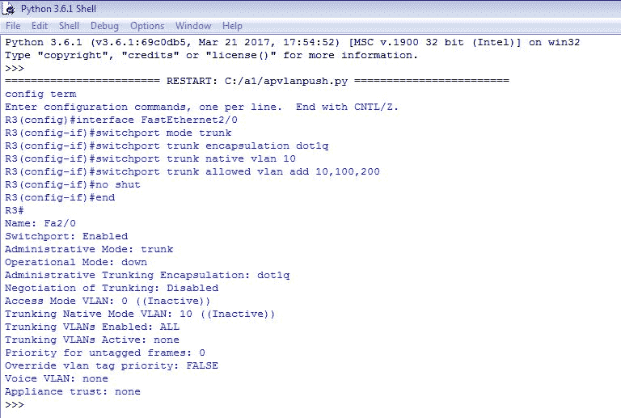

如我们所见，AP 需要连接到我们的交换机端口，该端口需要是一个 trunk，并允许某些访问 VLAN；因此我们创建了两个方法，第一个方法传递路由器/交换机名称和需要配置的接口。

一旦配置成功推送到交换机，我们执行`validateswitchport`方法来验证该端口是否现在处于 trunk 模式。`validateswitchport`方法的输出将输出命令的输出，我们可以进一步介绍正则表达式和分割来从该输出中获取我们想要的任何特定信息（如`Administrative Mode`或`Operational Mode`）。

作为一种增强，我们还可以使用验证方法的结果来调用其他方法，这些方法将执行一些额外的配置（如果需要），基于我们之前得到的结果。（例如，将`Trunking Native Mode VLAN`更改为`20`）。

让我们看看带有将原生 VLAN 更改为`20`的额外增强功能的新代码。代码如下**：**

```py
from netmiko import ConnectHandler
import time

def apvlanpush(routerip,switchport):
    uname="cisco"
    passwd="cisco"
    device = ConnectHandler(device_type='cisco_ios', ip=routerip, username=uname, password=passwd)
    cmds="interface "+switchport
    cmds=cmds+"\nswitchport mode trunk\nswitchport trunk encapsulation dot1q\n"
    cmds=cmds+ "switchport trunk native vlan 10\nswitchport trunk allowed vlan add 10,100,200\nno shut\n"
    xcheck=device.send_config_set(cmds)
    print (xcheck)
    device.disconnect()

def validateswitchport(routerip,switchport):
    print ("\nValidating switchport...."+switchport)
    uname="cisco"
    passwd="cisco"
    device = ConnectHandler(device_type='cisco_ios', ip=routerip, username=uname, password=passwd)
    cmds="show interface "+switchport+" switchport "
    outputx=device.send_command(cmds)
    print (outputx)
    outputx=outputx.split("\n")
    for line in outputx:
        if ("Trunking Native Mode VLAN: 10" in line):
            changenativevlan(routerip,switchport,"20")
    device.disconnect()

def changenativevlan(routerip,switchport,nativevlan):
    print ("\nNow changing native VLAN on switchport",switchport)
    uname="cisco"
    passwd="cisco"
    device = ConnectHandler(device_type='cisco_ios', ip=routerip, username=uname, password=passwd)
    cmds="interface "+switchport
    cmds=cmds+"\nswitchport trunk native vlan "+nativevlan+"\n"
    xcheck=device.send_config_set(cmds)
    print (xcheck)
    validateswitchport(routerip,switchport)
    device.disconnect()

apvlanpush("192.168.255.245","FastEthernet2/0")
time.sleep(5) # 5 seconds
validateswitchport("192.168.255.245","FastEthernet2/0")
```

输出如下：

+   验证并更改原生 VLAN 为`20`：

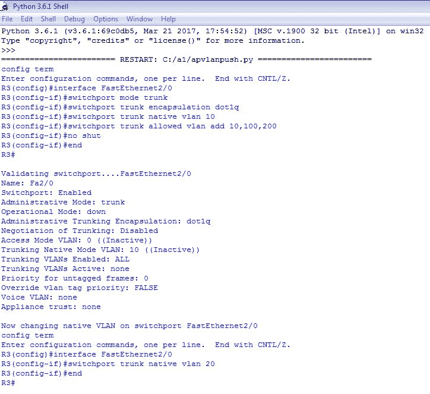

+   使用新的原生 VLAN 号重新验证：

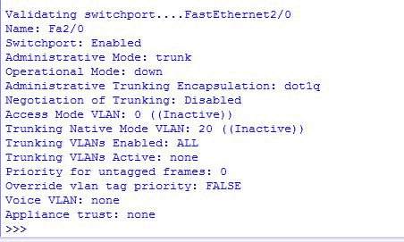

如我们在最终验证中看到的，现在我们有原生 VLAN 20，而不是之前的`10`。这也是一种良好的故障排除技术，因为在多种场景中，存在对**假设分析**（基于对某种条件的评估做出决策）的需求，在这种情况下，我们需要根据收到的动态结果采取一些行动。由于，在这里我们的代码验证了原生 VLAN 需要是`20`，因此我们执行了另一个操作来纠正之前的配置。

# 配置思科交换机端口以用于 IP 电话

与之前的场景类似，我们希望交换机端口作为 AP 的 trunk 端口，我们可以配置交换机端口与 IP 电话一起工作。配置端口用作 IP 电话的附加任务之一是，另一端机器或数据机器可以连接到 IP 电话进行数据传输。换句话说，当与 IP 电话一起使用时，思科路由器的一个单独的交换机端口可以同时作为语音和数据端口。

让我们看看配置交换机端口作为 IP 电话端口的示例：

```py
from netmiko import ConnectHandler
import time

def ipphoneconfig(routerip,switchport):
    uname="cisco"
    passwd="cisco"
    device = ConnectHandler(device_type='cisco_ios', ip=routerip, username=uname, password=passwd)
    cmds="interface "+switchport
    cmds=cmds+"\nswitchport mode access\nswitchport access vlan 100\n"
    cmds=cmds+ "switchport voice vlan 200\nspanning-tree portfast\nno shut\n"
    xcheck=device.send_config_set(cmds)
    print (xcheck)
    device.disconnect()

def validateswitchport(routerip,switchport):
    print ("\nValidating switchport...."+switchport)
    uname="cisco"
    passwd="cisco"
    device = ConnectHandler(device_type='cisco_ios', ip=routerip, username=uname, password=passwd)
    cmds="show interface "+switchport+" switchport "
    outputx=device.send_command(cmds)
    print (outputx)
    outputx=outputx.split("\n")
    for line in outputx:
        if ("Trunking Native Mode VLAN: 10" in line):
            changenativevlan(routerip,switchport,"20")
    device.disconnect()

ipphoneconfig("192.168.255.245","FastEthernet2/5")
time.sleep(5) # 5 seconds
validateswitchport("192.168.255.245","FastEthernet2/5")

```

输出如下：

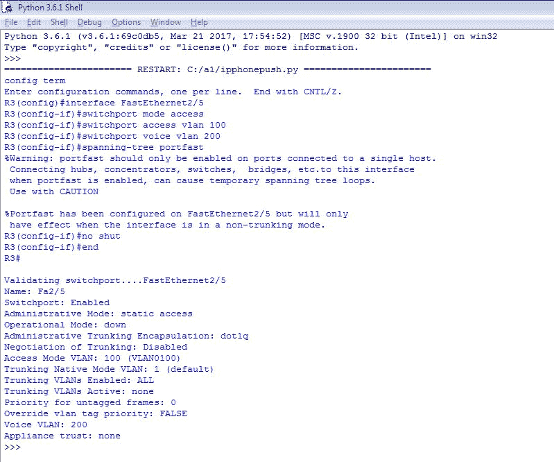

正如我们现在所看到的，配置的端口（`FastEthernet 2/5`）已被分配了一个`Voice VLAN`为`200`和一个数据/访问 VLAN 为`100`（从前面的输出中，注意`Access Mode VLAN: 100 (VLAN0100)`这一行。任何连接到此端口的 IP 电话都将能够访问其语音和数据使用的两个 VLAN。再次根据前面的示例，我们可以对端口进行额外的验证和检查，并在配置不正确或缺失的情况下触发一些操作）。

# 无线局域网（WLAN）

有许多厂商提供了后端 API，可以使用 Python 来控制或调用以执行某些无线任务。在无线领域，`Netgear`是一个常用的厂商。Python 有一个名为`pynetgear`的库，可以帮助我们实现一些自动化，以控制我们本地连接的设备。

让我们看看一个示例，如何在我们的网络中获取当前连接到本地无线 Netgear 路由器的网络设备：

```py
>>> from pynetgear import Netgear, Device
>>> netgear = Netgear("myrouterpassword", "192.168.100.1","admin","80")
>>> for i in netgear.get_attached_devices():
  print (i)
```

`Netgear`方法接受以下顺序的四个参数（`routerpassword`、`routerip`、`routerusername`和`routerport`）。正如当前示例所示，路由器可以通过`http://192.168.100.1`使用用户名`admin`和密码`myrouterpassword`访问。因此，我们使用这些参数调用该方法。

输出如下：

```py
>>> netgear.get_attached_devices()
[Device(signal=3, ip='192.168.100.4', name='ANDROID-12345', mac='xx:xx:xx:xx:xx:xx', type='wireless', link_rate=72), Device(signal=None, ip='192.168.100.55', name='ANDROID-678910', mac='yy:yy:yy:yy:yy:yy', type='wireless', link_rate=72), Device(signal=None, ip='192.168.100.10', name='mylaptop', mac='zz:zz:zz:zz:zz:zz', type='wireless', link_rate=520)]
```

正如我们所见，`get_attached_devices()`方法返回了一个包含所有 IP 地址、它们的 MAC 地址（在本例中隐藏）、信号（或正在使用的无线频段）以及连接的链路速率（以 Mbps 为单位）的列表。

我们可以使用类似的方法来操纵带宽、阻止任何用户或执行特定硬件制造商 API 公开的其他任务。

# IP 地址管理（IPAM）访问

网络中的另一个要求是使用 IPAM 数据库进行 IPAM。它由不同的厂商提供，在此例中，我们将参考 SolarWind 的 IPAM。SolarWinds 再次是网络监控和执行各种功能的行业标准工具，它有一套良好的 API，可以使用其 ORION SDK 工具包与之交互。

在 Python 中，我们可以安装`orionsdk`库以实现与 SolarWinds 的交互。让我们看看一个示例，其中我们从 SolarWinds 的 IPAM 模块中获取下一个可用的 IP 地址：

```py
from orionsdk import SwisClient

npm_server = 'mysolarwindsserver'
username = "test"
password = "test"

verify = False
if not verify:
    from requests.packages.urllib3.exceptions import InsecureRequestWarning
    requests.packages.urllib3.disable_warnings(InsecureRequestWarning)

swis = SwisClient(npm_server, username, password)

print("My IPAM test:")
results=swis.query("SELECT TOP 1 Status, DisplayName FROM IPAM.IPNode WHERE Status=2")
print (results)

### for a formatted printing
for row in results['results']:
 print("Avaliable: {DisplayName}".format(**row))

```

输出如下：

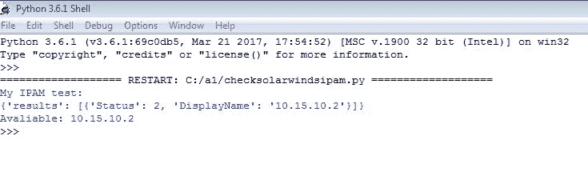

正如我们在前面的代码中所看到的，我们使用`orionsdk`库从`mysolarwindsserver`服务器调用 SolarWinds 的 API。SolarWinds 所需的用户名和密码在脚本中传递，我们使用一个简单的 SQL 查询（SolarWinds 可以理解），如下所示：

```py
 SELECT TOP 1 Status, DisplayName FROM IPAM.IPNode  WHERE Status=2 
```

此查询获取下一个可用的 IP 地址（在 SolarWinds 中表示为`Status=2`）并打印出来。第一个打印是原始打印，在`for`循环中的打印；它以更好的可理解格式打印出值，如前面的输出所示。

# 示例和用例

在这里，我们将看到一个对大多数网络工程师都常见的详细示例，以及如何使用 Python 自动化它。我们还将创建一个基于 Web 的工具，使其能够从任何环境或机器上运行，仅使用浏览器。

# 创建基于 Web 的预和后检查验证工具

在以下示例中，我们将看到我们如何对任何网络维护活动进行预检查和后检查。这通常是每个网络工程师在生产设备上执行活动时所需，以确保一旦维护活动完成，工程师没有遗漏任何可能导致后续问题的内容。这也需要验证我们的更改和维护是否成功完成，或者如果验证失败，我们需要执行额外的修复和回滚。

以下是如何创建和执行工具的步骤：

# 第 1 步 – 创建主 HTML 文件

我们将设计一个基于 Web 的表单来选择我们将用于执行检查的某些显示命令。这些命令在执行时将作为预检查；一旦我们的维护活动完成，我们将再次作为后检查执行。

在预检查或后检查场景中，相同命令输出的任何差异都将被突出显示，工程师将能够根据输出决定将维护活动称为成功或失败。

HTML 代码（`prepostcheck.html`）如下：

```py
<!DOCTYPE html>

<html >
<head>
         <script>
             function checkme() {
        var a=document.forms["search"]["cmds"].value;
        var b=document.forms["search"]["searchbox"].value;
        var c=document.forms["search"]["prepost"].value;
        var d=document.forms["search"]["changeid"].value;
        if (a==null || a=="")
        {
          alert("Please Fill All Fields");
          return false;
        }
        if (b==null || b=="")
        {
          alert("Please Fill All Fields");
          return false;
        }
        if (c==null || c=="")
        {
          alert("Please Fill All Fields");
          return false;
        }
        if (d==null || d=="")
        {
          alert("Please Fill All Fields");
          return false;
        }
                 document.getElementById("mypoint").style.display = "inline";
             }
</script>
</head>
<body>
<h2> Pre/Post check selection </h2>
<form name="search" action="checks.py" method="post" onsubmit="return checkme()">
Host IP: (Multiple IPs seperated by comma)<br><input type="text" name="searchbox" size='80' required>
<p></p>
Commands (Select):
<br>
<select name="cmds" multiple style="width:200px;height:200px;" required>
  <option value="show version">show version</option>
  <option value="show ip int brief">show ip int brief</option>
  <option value="show interface description">show interface description</option>
  <option value="show clock">show clock</option>
  <option value="show log">show log (last 100)</option>
  <option value="show run">show run</option>
  <option value="show ip bgp summary">show ip bgp summary</option>
  <option value="show ip route">show ip route</option>
  <option value="show ip route summary">show ip route summary</option>
  <option value="show ip ospf">show ip ospf</option>
  <option value="show interfaces status">show interfaces status</option>

</select>
<p></p>
Mantainence ID: <input type="text" name="changeid" required>
<p></p>
Pre/Post: <br>
<input type="radio" name="prepost" value="pre" checked> Precheck<br>
<input type="radio" name="prepost" value="post"> Postcheck<br>
<p></p>
<input type="submit" value="Submit">
<br><br><br>
</form> 
<p><label id="mypoint" style="display: none;background-color: yellow;"><b>Please be Patient.... Gathering results!!!</b></label></p>
</body>
</html>
```

这将创建一个主页面，我们在其中选择初始选项（命令集以及是否需要执行预检查或后检查）。输出如下：

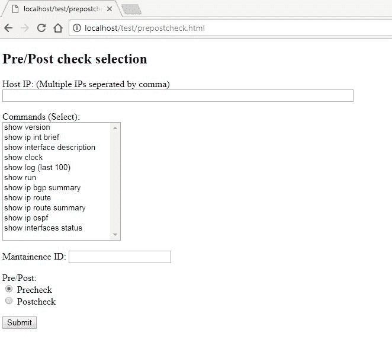

主页面

HTML 中的附加 JavaScript 代码确保在所有选择都完成之前，`提交`按钮不会发送任何数据。发送未完成的数据没有意义；例如，如果我们没有填写完整字段，`提交`选项将不会进行，显示我们在以下截图中所见到的消息：

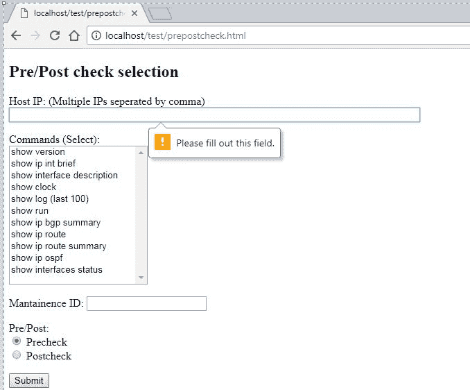

除非所有字段都已填写，否则点击“提交”按钮将显示此消息，代码将不会继续执行。此外，正如我们在代码中所见，`提交`按钮与 Python 脚本相关联，`checks.py`作为 POST 方法。换句话说，我们将做出的选择将以 POST 方法发送到`checks.py`。

# 第 2 步 – 创建后端 Python 代码

现在，让我们看看后端 Python 代码（`checks.py`），它将接受来自 HTML 表单的输入并执行其任务。代码如下：

```py
#!/usr/bin/env python
import cgi
import paramiko
import time
import re
import sys
import os
import requests
import urllib
import datetime
from datetime import datetime
from threading import Thread
from random import randrange

form = cgi.FieldStorage()
searchterm = form.getvalue('searchbox')
cmds = form.getvalue('cmds')
changeid = form.getvalue('changeid')
prepost=form.getvalue('prepost')
searchterm=searchterm.split(",")
xval=""
xval=datetime.now().strftime("%Y-%m-%d_%H_%M_%S")

returns = {}
def getoutput(devip,cmd):
    try:
        output=""
        mpath="C:/iistest/logs/"
        fname=changeid+"_"+devip+"_"+prepost+"_"+xval+".txt"
        fopen=open(mpath+fname,"w")
        remote_conn_pre = paramiko.SSHClient()
        remote_conn_pre.set_missing_host_key_policy(paramiko.AutoAddPolicy())
        remote_conn_pre.connect(devip, username='cisco', password='cisco', look_for_keys=False, allow_agent=False)
        remote_conn = remote_conn_pre.invoke_shell()
        remote_conn.settimeout(60)
        command=cmd
        remote_conn.send(command+"\n")
        time.sleep(15)
        output=(remote_conn.recv(250000)).decode()
        fopen.write(output)
        remote_conn.close()
        fopen.close()
        returns[devip]=("Success: <a href='http://localhost/test/logs/"+fname+"' target='_blank'>"+fname +"</a> Created")
    except:
        returns[devip]="Error. Unable to fetch details"

try:
    xtmp=""
    cmdval="terminal length 0\n"
    if (str(cmds).count("show") > 1):
        for cmdvalue in cmds:
            if ("show" in cmdvalue):
                if ("show log" in cmdvalue):
                    cmdvalue="terminal shell\nshow log | tail 100"
                cmdval=cmdval+cmdvalue+"\n\n"
    else:
        if ("show" in cmds):
            if ("show log" in cmds):
                cmds="terminal shell\nshow log | tail 100"
            cmdval=cmdval+cmds+"\n\n"
    threads_imagex= []
    for devip in searchterm:
        devip=devip.strip()
        t = Thread(target=getoutput, args=(devip,cmdval,))
        t.start()
        time.sleep(randrange(1,2,1)/20)
        threads_imagex.append(t)

    for t in threads_imagex:
        t.join()

    print("Content-type: text/html")
    print()
    xval=""
    for key in returns:
        print ("<b>"+key+"</b>:"+returns[key]+"<br>")

    print ("<br>Next step: <a href='http://localhost/test/selectfiles.aspx'> Click here to compare files </a>")
    print ("<br>Next step: <a href='http://localhost/test/prepostcheck.html'> Click here to perform pre/post check </a>")

except:
    print("Content-type: text/html")
    print()
    print("Error fetching details. Need manual validation")
    print ("<br>Next step: <a href='http://localhost/test/selectfiles.aspx'> Click here to compare files </a>")
    print ("<br>Next step: <a href='http://localhost/test/prepostcheck.html'> Click here to perform pre/post check </a>")
```

此代码使用 CGI 参数从网页接收输入。网页的各种值使用以下代码片段解析到变量中：

```py
form = cgi.FieldStorage()
searchterm = form.getvalue('searchbox')
cmds = form.getvalue('cmds')
changeid = form.getvalue('changeid')
prepost=form.getvalue('prepost')
```

一旦我们有了这些值，附加的逻辑就是使用`paramiko`库登录到指定的设备，获取`show`命令的输出，并将其保存在`logs`文件夹下的文件中。这里需要注意的一个重要方面是我们构建文件名的方式：

```py
#xval=datetime.now().strftime("%Y-%m-%d_%H_%M_%S")
#and
#fname=changeid+"_"+devip+"_"+prepost+"_"+xval+".txt"
```

`fname`是我们将要写入输出的文件名，但文件名是根据维护 ID、设备 IP、预/后状态以及文件创建的时间动态构建的。这是为了确保我们知道我们正在执行预检查或后检查的设备，以及文件是在什么时间创建的，以确保我们有一个正确的预检查和后检查组合。

`getoutput()`函数从线程（在多线程函数调用中）调用以获取输出并将其存储在新建的文件中。调用多线程过程是因为如果我们想在多个设备上执行预检查或后检查，我们可以在 Web 中提供一个以逗号分隔的 IP 地址列表，Python 脚本将并行地在所有设备上调用`show`命令，并根据主机名创建多个预检查或后检查文件。

让我们在示例中为一些命令创建一个`precheck`文件，其中我们填写一些值并点击`提交`按钮：

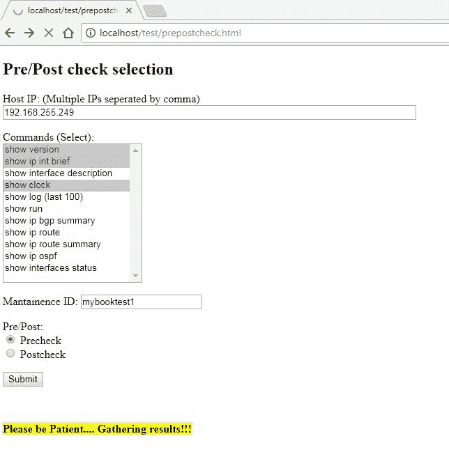

当数据收集正在进行时，黄色消息将显示以确认后端工作正在进行。

任务完成后，我们看到的是（如 Python 代码返回的）：

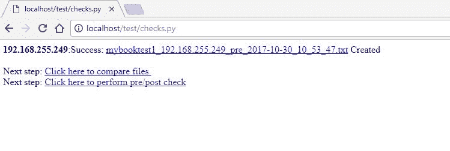

如我们所见，代码返回成功，这意味着它能够获取我们想要验证的命令的输出。文件名是根据我们在主页上的选择动态创建的。

点击生成的可点击 URL（.txt 文件名，可以用来重新确认我们是否得到了之前选择的命令的正确输出），显示以下输出：

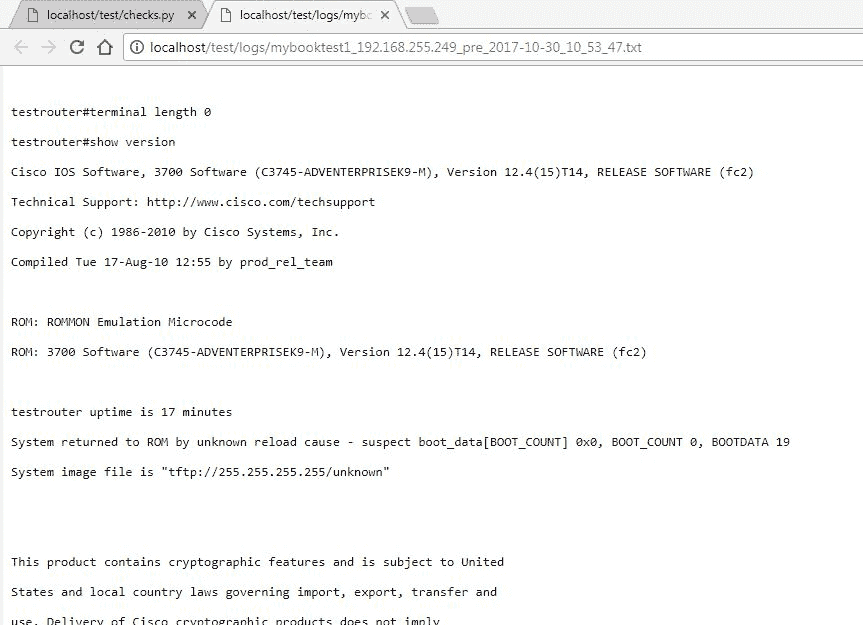

现在，让我们执行相同的步骤并创建一个`postcheck`文件。

我们回到主页，保持其他值不变，只是选择单选按钮从`Precheck`改为`Postcheck`。请确保我们选择相同的命令集，因为只有当我们有相同的数据来工作的时候，预检查和后检查才有意义：

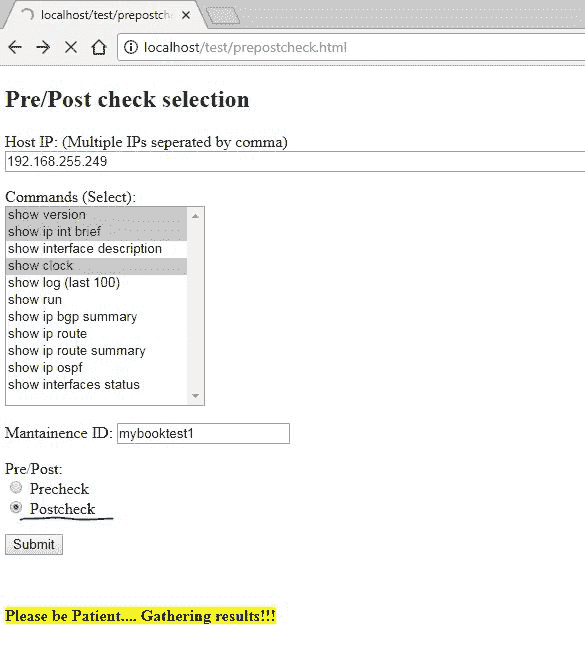

以类似的方式，一旦后端执行完成，我们将创建一个如下所示的`postcheck`文件：

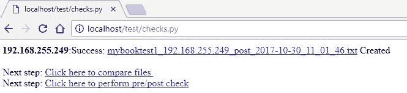

注意文件名、时间戳以及根据我们的选择`post`字样会发生变化。

# 第 3 步 – 为工具创建基于 Web 服务器的文件

现在已经创建了前后检查文件，让我们创建一个用于执行基于网络的文件前后检查的 Web 框架。我们需要创建一个网页，其中我们的当前日志文件作为前后文件可见，并且我们可以选择`precheck`文件及其相关的`postcheck`文件进行比较。正如我们所知，我们不能使用 HTML 或浏览器语言从服务器获取任何文件的信息，因此我们需要使用某种后端 Web 语言来为我们执行此功能。我们利用 ASP 和 VB.NET 创建网页，以显示已创建的日志文件以供选择和比较。

`selectfiles.aspx`的后端代码如下（这是在浏览器上显示日志目录中的文件）：

```py
<%@ Page Language="VB" AutoEventWireup="false" CodeFile="selectfiles.aspx.vb" Inherits="selectfiles" %>

<!DOCTYPE html>

<html >
<head runat="server">
    <title></title>
</head>
<body>
    <form id="form1" method="post" action="comparefiles.aspx" >
    <div>
    <%response.write(xmystring.tostring())%>
    </div>
         <input type="submit" value="Submit">
    </form>
  <br><br><br>
</body>
</html>
```

用于在前面提到的`.aspx`页面`selectfiles.aspx.vb`上填写值的 VB.NET 后端代码如下：

```py
Imports System.IO
Partial Class selectfiles
    Inherits System.Web.UI.Page
    Public xmystring As New StringBuilder()
  Public tableval As New Hashtable
    Protected Sub Page_Load(sender As Object, e As EventArgs) Handles Me.Load
        Dim precheck As New List(Of String)
        Dim postcheck As New List(Of String)
        Dim prename = New SortedList
        Dim postname = New SortedList
        Dim infoReader As System.IO.FileInfo
    Dim rval as Integer
    rval=0

        xmystring.Clear()
        Dim xval As String
    Dim di As New DirectoryInfo("C:\iistest\logs\")
    Dim lFiles As FileInfo() = di.GetFiles("*.txt")
    Dim fi As System.IO.FileSystemInfo
    Dim files() As String = IO.Directory.GetFiles("C:\iistest\logs\", "*.txt", SearchOption.TopDirectoryOnly)
    xmystring.Append("<head><style type='text/css'>a:hover{background:blue;color:yellow;}</style></head>")
        xmystring.Append("<fieldset style='float: left;width: 49%;display: inline-block;box-sizing: border-box;'>")
        xmystring.Append("<legend>Pre check files (Sorted by Last Modified Date)</legend>")

         For Each fi In lFiles
      rval=rval+1
      tableval.add(fi.LastWriteTime.ToString()+rval.tostring(),fi.Name)
            'infoReader = My.Computer.FileSystem.GetFileInfo(file)
            If (fi.Name.Contains("pre")) Then
                precheck.Add(fi.LastWriteTime.ToString()+rval.tostring()) 
            Else
                postcheck.Add(fi.LastWriteTime.ToString()+rval.tostring())
            End If
        Next
        precheck.Sort()
        postcheck.Sort()

        xval = ""
        Dim prekey As ICollection = prename.Keys
        Dim postkey As ICollection = postname.Keys
        Dim dev As String
    Dim fnameval as String
        For Each dev In precheck
            infoReader = My.Computer.FileSystem.GetFileInfo(tableval(dev))
      fnameval="http://localhost/test/logs/"+Path.GetFileName(tableval(dev))
            xval = "<input type = 'radio' name='prechecklist' value='C:\iistest\logs\" + tableval(dev) + "' required><a href='" & fnameval & "' target='blank'>" & tableval(dev) & "</a> ( <b>" & dev.Substring(0,dev.LastIndexOf("M")).Trim() + "M</b>)<br>"

      xmystring.Append(xval)
        Next
    xmystring.Append("</fieldset>")
           xmystring.Append("<fieldset style='float: right;width: 49%;display: inline-block;box-sizing: border-box;'>")
        xmystring.Append("<legend>Post check files (Sorted by Last Modified Date)</legend>")
              For Each dev In postcheck
      fnameval="http://localhost/test/logs/"+tableval(dev)
            xval = "<input type = 'radio' name='postchecklist' value='C:\iistest\logs\" + tableval(dev) + "' required><a href='" & fnameval & "' target='blank'>" & tableval(dev) & "</a> ( <b>" & dev.Substring(0,dev.LastIndexOf("M")).Trim() + "M</b>)<br>"
            xmystring.Append(xval)
        Next
        xmystring.Append("</fieldset>")

    End Sub
End Class
```

此代码用于从日志目录获取文件，并根据它们的文件名，将它们分为`precheck`文件或`postcheck`文件。此外，文件按时间顺序排列，以便在比较过程中易于选择。

现在让我们看看这个页面的输出：

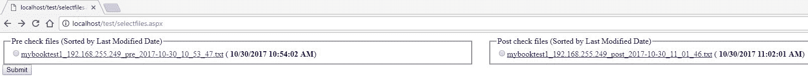

# 第 4 步 – 创建用于前后文件比较的服务器端文件

最后一步是创建一个网页，它检索这些文件中的文本，并提供前端（或基于 Web 的工具）以便于比较。为了我们的目的，我们使用一个名为`diffview`的 JScript 库**。**要调用此依赖项，我们需要下载`diffview.js`、`difflib.js`和`diffview.css`，这些文件可在以下位置找到：[`github.com/cemerick/jsdifflib`](https://github.com/cemerick/jsdifflib)，并将文件复制到我们的 Web 服务器文件夹中。一旦完成，我们就会像访问文件一样再次创建一个`.aspx`页面来获取所选文件的内容，并将其显示以进行比较。

下面的代码是主页面`comparefiles.aspx`的代码：

```py
<%@ Page Language="VB" AutoEventWireup="false" CodeFile="comparefiles.aspx.vb" Inherits="comparefiles" %>

<!DOCTYPE html>

<html >
<head>
  <meta charset="utf-8"/>
  <meta http-equiv="X-UA-Compatible" content="IE=Edge,chrome=1"/>
  <link rel="stylesheet" type="text/css" href="diffview.css"/>
  <script type="text/javascript" src="img/diffview.js"></script>
  <script type="text/javascript" src="img/difflib.js"></script>
<style type="text/css">
body {
  font-size: 12px;
  font-family: Sans-Serif;
}
h2 {
  margin: 0.5em 0 0.1em;
  text-align: center;
}
.top {
  text-align: center;
}
.textInput {
  display: block;
  width: 49%;
  float: left;
}
textarea {
  width:100%;
  height:300px;
}
label:hover {
  text-decoration: underline;
  cursor: pointer;
}
.spacer {
  margin-left: 10px;
}
.viewType {
  font-size: 16px;
  clear: both;
  text-align: center;
  padding: 1em;
}
#diffoutput {
  width: 100%;
}
</style>

<script type="text/javascript">

function diffUsingJS(viewType) {
  "use strict";
  var byId = function (id) { return document.getElementById(id); },
    base = difflib.stringAsLines(byId("baseText").value),
    newtxt = difflib.stringAsLines(byId("newText").value),
    sm = new difflib.SequenceMatcher(base, newtxt),
    opcodes = sm.get_opcodes(),
    diffoutputdiv = byId("diffoutput"),
    contextSize = byId("contextSize").value;

  diffoutputdiv.innerHTML = "";
  contextSize = contextSize || null;

  diffoutputdiv.appendChild(diffview.buildView({
    baseTextLines: base,
    newTextLines: newtxt,
    opcodes: opcodes,
    baseTextName: "Base Text",
    newTextName: "New Text",
    contextSize: contextSize,
    viewType: viewType
  }));
}

</script>
</head>
<body>
  <div class="top">
    <strong>Context size (optional):</strong> <input type="text" id="contextSize" value="" />
  </div>
  <div class="textInput">
    <h2>Pre check</h2>
    <textarea id="baseText" runat="server" readonly></textarea>
  </div>
  <div class="textInput spacer">
    <h2>Post check</h2>
    <textarea id="newText" runat="server" readonly></textarea>
  </div>
    <% Response.Write(xmystring.ToString()) %>
  <div class="viewType">
    <input type="radio" name="_viewtype" id="sidebyside" onclick="diffUsingJS(0);" /> <label for="sidebyside">Side by Side Diff</label>
    &nbsp; &amp;amp;amp;nbsp;
    <input type="radio" name="_viewtype" id="inline" onclick="diffUsingJS(1);" /> <label for="inline">Inline Diff</label>
  </div>
  <div id="diffoutput"> </div>

</body>
</html>
```

用于获取文件内容（`comparefiles.aspx.vb`）的主页后端代码如下：

```py
Imports System.IO

Partial Class comparefiles
    Inherits System.Web.UI.Page
    Public xmystring As New StringBuilder()

    Protected Sub Page_Load(sender As Object, e As EventArgs) Handles Me.Load
        Dim fp As StreamReader
        Dim precheck As New List(Of String)
        Dim postcheck As New List(Of String)
        xmystring.Clear()
        Dim prefile As String
        Dim postfile As String
        prefile = Request.Form("prechecklist")
        postfile = Request.Form("postchecklist")
        fp = File.OpenText(prefile)
        baseText.InnerText = fp.ReadToEnd()
        fp = File.OpenText(postfile)
        newText.InnerText = fp.ReadToEnd()
        fp.Close()

    End Sub

End Class
```

准备就绪后，让我们比较文件并查看结果。我们选择前后检查文件，然后点击`提交`：

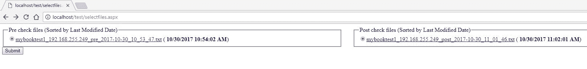

下一页带我们到内容和比较：

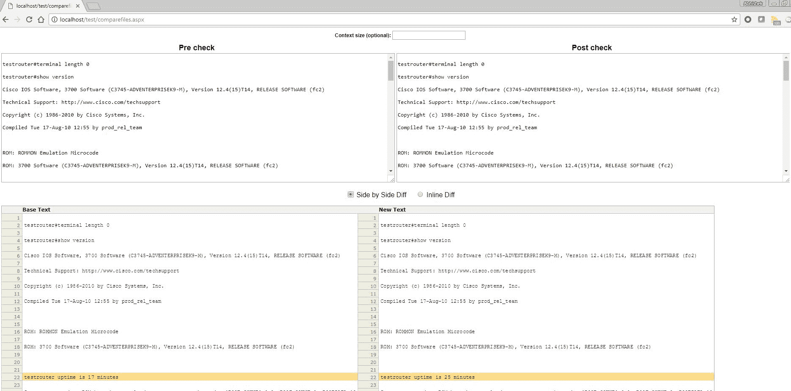

如前述截图所示，在左侧，我们有`precheck`文件，在右侧，我们有`postcheck`文件。两者都可以通过两个窗口上的幻灯片在页面上本身读取。当选择`Side by Side Diff`或`Inline Diff`时，底部窗口会出现。

在`Side by Side Diff`中，任何不同之处都会被突出显示。在我们的案例中，是运行时间不同。对于其他所有共同点，没有颜色突出显示，工程师可以安全地假设非突出显示颜色的相同状态。

让我们用`Inline Diff`比较选择来查看相同的示例：

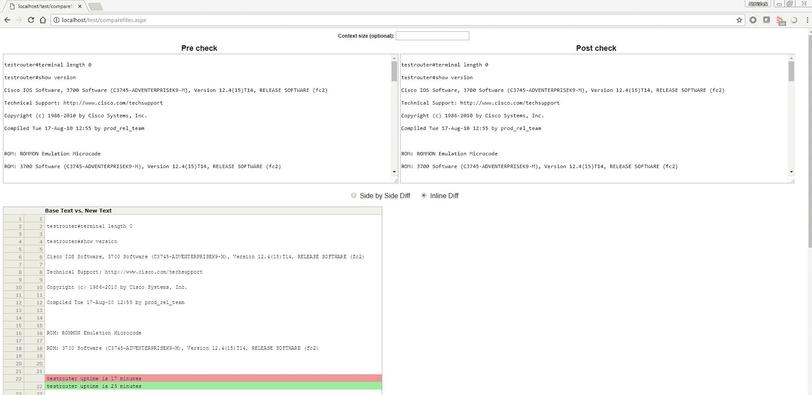

结果是一样的；不同的行用不同的颜色突出显示，以确认前后检查的差异。有了这个工具，工程师现在可以快速解析整个日志文件，并根据突出显示的差异（`precheck`文件内容和`postcheck`文件内容之间的不匹配），决定将任务标记为成功或失败。

# 摘要

在本章中，我们看到了与日常网络场景中自动化使用相关的各种概念。我们熟悉了执行与无线 AP 和 IP 电话等附加设备相关的各种任务的例子。此外，我们还介绍了 SolarWinds 的 IPAM 以及如何使用 Python 操作 API。

我们还看到了一个创建前后验证工具的真实世界例子，以帮助工程师快速做出维护验证决策，并且将该工具移植到网络上，这样工具就可以在任何地方使用，而不是在安装了 Python 的单独机器上运行。

最后，在我们的结论章节中，我们将探讨 SDN 的一些附加方面，以更好地理解使用方法以及如何在 SDN 场景中自动化。
