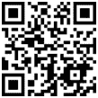
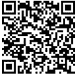

### 本书使用的约定

下面是本书中使用的约定的一些解释。“约定”指的是文本中某些部分显示的标准方式。

Python 语句

本书使用了大量用 Python 语言编写的示例。Python 语句以如下字体显示。

这是一个 Python 语句

段落文本中的关键字、变量、函数/方法和参数

关键字、变量、函数/方法和参数有时会显示在段落文本中。当它们这样做时，特殊文本将以与段落其余部分不同的字体显示。例如，firstName = 5 是段落文本中 Python 语句的一个示例。

斜体字

你可能会注意到一些特殊文本也以斜体显示。在这本书中，斜体字是通用类型，必须替换为适合你数据的特定名称。例如，Python 语句的通用形式可能表示为

def name(arg1, arg2):

为了完成语句，必须将关键字 name、arg1 和 arg2 替换为有意义的名称。当你在程序中使用此语句时，你可能使用以下形式

def displayRectangle(width, height):

三点（…）：省略号

在语句的通用形式中，你可能会注意到在示例中的列表后面有三个点（…），也称为“省略号”。它们不是语句的一部分。省略号表示你可以有任意多的项目在列表中。例如，语句通用形式中的省略号

displayMessages(arg1, arg2, … )

表示列表可能包含超过两个参数。当你使用此语句在程序中时，你的语句可能如下所示。

displayMessages(message1, "Hello", message2, "Hi!")

斜体字中的方括号

一些语句或子程序的通用形式可能包含斜体字中的“方括号”[]，表示包含的部分是可选的。例如，语句的通用形式

range(initial_value, final_value [, step])

表示该部分[步骤]可以省略。

例如，以下两个语句产生不同的结果，但它们都是语法正确的。

range(0, 10)

range(0, 10, 2)

暗色标题

本书的大部分示例都显示为如下字体。

 file_29.2-3

a = 2

b = 3

c = a + b

print(c)

顶部的标题  file_29.2-3 表示必须打开以测试程序的文件名。包含此标题的所有示例都可以从我的网站上免费下载。

注意事项

很经常这本书使用注意事项来帮助你更好地理解概念的含义。注意事项看起来像这样。

这种字体表示一个注释。

已知或需要记住的内容

非常常见的是，这本书可以帮助你回忆起你已经学过的内容（可能是在前面的章节或部分）。有时，它还会引起你注意应该记住的内容。提醒看起来像这样。

这种字体表示需要回忆或应该记住的内容。

### 如何报告错误

尽管我已经非常小心地确保本书内容的准确性，但错误仍然可能发生。如果你在文本或代码中遇到任何错误，我强烈鼓励你向我发送报告。通过这样做，你不仅会帮助其他读者避免潜在的困惑和挫折，还会为提高下一版的质量做出贡献。如果你发现任何错误，请通过访问以下地址之一来报告：

[`tinyurl.com/28nwh2nf`](https://tinyurl.com/28nwh2nf)

[`www.bouraspage.com/report-errata`](https://www.bouraspage.com/report-errata)

.

一旦我验证了你报告的错误，你的提交将被接受。错误列表随后将被上传到我的网站，并添加到任何现有的更正列表中。

### 下载本书材料的地点

关于这本书的材料，例如：

►已验证的错误列表（如果有）；

►解决方案伴侣，提供所有复习问题的答案和练习题的解答；以及

►所有具有此类标题的本书示例  file_29.2-3 在顶部

可以从以下地址免费下载：

[`tinyurl.com/3ynuw7ca`](https://tinyurl.com/3ynuw7ca)

[`www.bouraspage.com/books/python-and-algorithmic-thinking-for-the-complete-beginner-third-edition`](https://www.bouraspage.com/books/python-and-algorithmic-thinking-for-the-complete-beginner-third-edition)

.

### 如果你喜欢这本书

如果你认为这本书很有价值，请考虑访问你购买它的网络商店，以及[goodreads.com](https://www.goodreads.com)，通过撰写正面评论并给予你认为合适的星级来表示你的感激。这样做不仅会激励我继续写作，当然，你也会帮助其他读者发现我的作品。
