## 第四章

基本算法概念简介

### 4.1 什么是算法？

技术上讲，算法^([[1]](footnotes.html#Endnote_1))是一个严格定义的有限序列，由定义良好的语句（通常称为指令或命令）组成，为任何可接受的输入值集（如果有输入）提供问题的解决方案或特定类问题的解决方案。换句话说，算法是解决给定问题的逐步过程。有限意味着算法必须达到终点，不能无限期地运行。

在您的现实生活中，您可以在任何地方找到算法，而不仅仅是计算机科学中。例如，准备吐司或一杯茶的过程可以用算法来表示。为了达到目标，必须遵循特定顺序的某些步骤。

### 4.2 制作一杯茶的算法

以下是一个制作一杯茶的算法。

1)在杯子中放入一袋茶叶。

2)往壶里加水。

3)在壶中烧开水。

4)将一些沸水倒入杯子中。

5)向杯子中加入牛奶。

6)向杯子中加入糖。

7)搅拌茶。

8)喝茶。

如您所见，必须遵循某些步骤。这些步骤有特定的顺序，尽管某些步骤可以重新排列。例如，步骤 5 和 6 可以颠倒。您可以先加糖，然后加牛奶。

请记住，某些步骤的顺序可能可以改变，但您不能将它们移得太远。例如，您不能将步骤 3（“在壶中烧开水。”）移到算法的末尾，因为您最终会喝到一杯冰茶（而不是一杯热茶），这与您的初始目标完全不同！

### 4.3 算法的性质

在他的书《计算机程序设计艺术》第一卷《基本算法》中，Donald E. Knuth^([[3]](footnotes.html#Endnote_3))断言，一个算法必须满足以下五个属性：

►输入：算法必须从指定的一组输入值中获取。

►输出：算法必须从指定的一组输入值产生输出值。输出值是问题的解决方案。

►有限性：对于任何输入，算法必须在有限步骤后终止。

►确定性：算法的所有步骤都必须精确定义。算法中的每条指令都应该是清晰且无歧义的。算法必须明确描述如何执行计算。确定性的属性确保执行指令的代理将始终知道下一步要执行哪个命令。以下是一些不满足确定性属性的算法示例：

►一个涉及除以零的算法，没有任何检查或保护措施。除以零在数学上是未定义的，而未处理此场景的算法可能导致计算中出现意外的结果或错误。

►一个试图计算负数平方根而不考虑复数的算法。负数的平方根不是一个实数，而是一个复数。如果算法没有正确处理这个问题，它可能会产生无效或不合逻辑的结果。

►效率：它指的是算法在有限的时间内，对于所有可能的合法输入（包括边缘情况）持续且准确地产生有意义且正确结果的能力。算法的步骤必须足够基本，以便例如，使用铅笔和纸的人可以精确地执行它们。

### 4.4 关于算法，我们可以说得很好。但计算机程序究竟是什么呢？

计算机程序不过是用计算机可以理解的语言（如 Python、Java、C++或 C#）编写的算法。

计算机程序实际上不能帮你泡一杯茶或做一顿饭，尽管算法可以指导你完成这些步骤。然而，程序可以（例如）用来计算一组数字的平均值，或者找出其中的最大值。人工智能程序甚至可以下棋或解决逻辑谜题。

### 4.5 三方当事人！

在算法中总是涉及三方当事人——编写算法的一方、执行算法的一方以及使用或享受算法的一方。

以准备餐点的算法为例。有人编写算法（食谱书的作者），有人执行它（可能是你的母亲，她根据食谱书的步骤准备餐点），有人使用它（可能是你，你享受着这顿饭）。

现在考虑一个真实的计算机程序。以视频游戏为例。有人用计算机语言编写算法（程序员），有人执行它（通常是笔记本电脑或计算机），有人使用它或与之互动（用户）。

请注意，有时“程序员”和“用户”这两个术语可能会引起歧义。当你编写计算机程序时，你暂时扮演“程序员”的角色，但当你使用自己的程序时，你则扮演“用户”的角色。

### 4.6 创建算法涉及到的三个主要阶段

一个算法应该由三个阶段组成：数据输入、数据处理和结果输出。这个顺序是特定的，不能改变。

考虑一个寻找三个数字平均值的计算机程序。首先，程序必须提示（询问）用户输入数字（数据输入阶段）。接下来，程序必须计算数字的平均值（数据处理阶段）。最后，程序必须在计算机屏幕上显示结果（结果输出阶段）。

让我们更详细地看看这些阶段。

第一阶段 – 数据输入

1)提示用户输入一个数字。

2)提示用户输入第二个数字。

3)提示用户输入第三个数字。

第二阶段 – 数据处理

4)计算三个数字的和。

5)将和除以 3。

第三阶段 – 结果输出

6)在屏幕上显示结果。

在一些罕见的情况下，输入阶段可能不存在，计算机程序可能只包含两个阶段。例如，考虑一个编写来计算以下和的计算机程序。

1 + 2 + 3 + 4 + 5

在这个例子中，用户必须输入没有任何值，因为计算机程序知道确切要做什么。它必须计算从 1 到 5 的数字之和，然后在用户的屏幕上显示 15 的值。这里显示了两个必需的阶段（数据处理和结果输出）。

第一阶段 – 数据输入

没有事情要做

第二阶段 – 数据处理

1)计算 1 + 2 + 3 + 4 + 5 的和。

第三阶段 – 结果输出

2)在屏幕上显示结果。

然而，如果你想让用户决定那个和的上限呢？如果你想让用户决定是计算 1 到 5 的数字之和还是 1 到 20 的数字之和呢？在这种情况下，程序必须在程序开始时包含一个输入阶段，让用户输入那个上限。一旦用户输入了那个上限，计算机就可以计算出结果。这里显示了三个必需的阶段。

第一阶段 – 数据输入

1)提示用户输入一个数字。

第二阶段 – 数据处理

2)计算和 1 + 2 + …（直到用户输入的上限，包括上限）。

第三阶段 – 结果输出

3)在屏幕上显示结果。

例如，如果用户将数字 6 作为上限输入，计算机将找到 1 + 2 + 3 + 4 + 5 + 6 的结果。

### 4.7 流程图

流程图是一种图形化展示算法的方法，通常在纸上进行。它是算法执行流程的视觉表示。换句话说，它以视觉方式表示执行流程如何从一个语句继续到下一个语句，直到算法结束。流程图使用的基本符号如表 4-1 所示。

| 流程图符号 | 描述 |
| --- | --- |
| . | 开始/结束：表示算法的开始或结束。开始符号有一个出口，结束符号有一个入口。 |
| .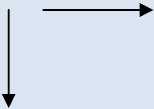 | 箭头：显示执行流程。从一个符号开始并结束在另一个符号上的箭头表示控制传递到箭头指向的符号。箭头总是以直线形式向上、向下或横向绘制（永远不会以角度绘制）。 |
| .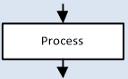 | 处理：表示一个过程或数学（公式）计算。处理符号有一个入口和一个出口。 |
| .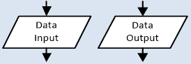 | 数据输入/输出：表示数据输入或结果输出。在大多数情况下，数据来自键盘，结果显示在屏幕上。数据输入/输出符号有一个入口和一个出口。 |
| 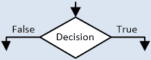 | 决策：表示做出决策的点。基于给定的条件（可以是真或假），算法将遵循右或左的路径。决策符号有一个入口和两个（并且始终只有两个）出口。 |
| 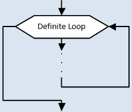 | 确定循环：表示一个语句或语句块重复预定义的次数。确定循环符号有一个入口和一个出口。 |
| 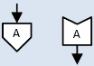 | 离页连接符：表示流程图在另一页的延续。当流程图太大而无法适应一张纸时，它们用于连接多页上的段。离页连接符符号有一个入口，而进入页连接符符号有一个出口。 |

表 4-1 流程图符号及其功能

图 4–1 展示了流程图的示例。算法提示用户输入三个数字，然后计算它们的平均值并在计算机屏幕上显示。

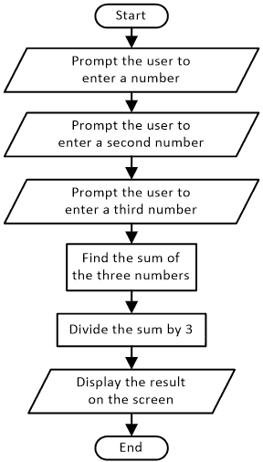

图 4–1 计算并显示三个数字平均值的算法流程图

流程图始终以 Start/End 符号开始和结束！

#### 练习 4.7-1 找到三个数字的平均值

设计一个算法，用于计算三个数字的平均值。每当平均值低于 10 时，必须显示消息“Fail!”。否则，如果平均值是 10 或以上，必须显示消息“Pass!”。

解决方案

在这个问题中，必须显示两个不同的消息，但每次算法执行时只能出现一个；消息的措辞取决于平均值。算法的流程图在此展示。

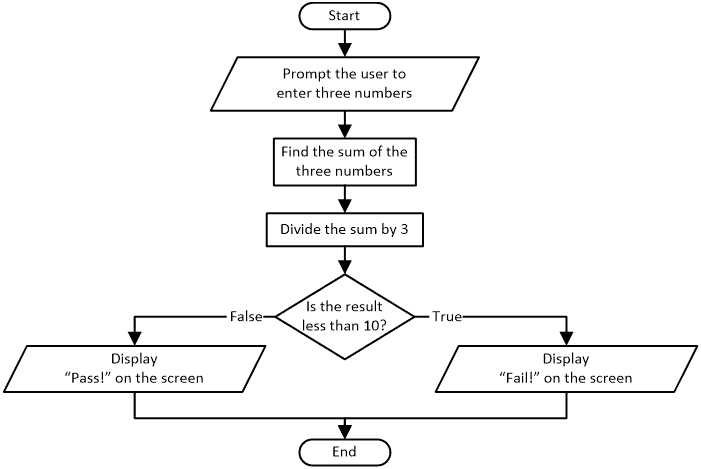

为了节省纸张，你可以提示用户使用一个单独的斜平行四边形输入所有三个数字。

决策符号始终有一个入口和两个出口路径！

当然，很快你就可以开始创建自己的算法了。这个特定的练习相当简单，在本章中作为例外，仅用于演示目的。在开始创建自己的算法或甚至 Python 程序之前，你需要学习更多。只需耐心等待！在接下来的几章中，重大时刻将会到来！

### 4.8 什么是“保留字”？

在计算机语言中，保留字（或关键字）是一个具有严格预定义意义的词——它被保留用于特殊用途，不能用于其他任何目的。例如，流程图中的 Start、End、Read 和 Write 这些词具有预定义的意义。它们分别用于表示开始、结束、数据输入和结果输出。

所有高级计算机语言都存在保留字。在 Python 中，有诸如 if、while、else 和 for 等许多保留字。然而，每种语言都有自己的保留字集合。例如，C++中的保留字 else if 在 Python 中写作 elif。

### 4.9 陈述和命令的区别是什么？

关于是否存在陈述和命令之间的区别，互联网上存在很大的讨论。有些人喜欢使用“陈述”这个词，而有些人则使用“命令”。对于初学者程序员来说，两者没有区别；两者都是对计算机的指令！

### 4.10 什么是结构化编程？

结构化编程的概念于 1966 年由 Corrado Böhm^([[4]](footnotes.html#Endnote_4))和 Giuseppe Jacopini^([[5]](footnotes.html#Endnote_5))正式化。他们通过序列、决策和迭代展示了理论计算机程序设计。

### 4.11 三种基本控制结构

结构化编程中有三种基本控制结构。

►顺序控制结构：这指的是逐行执行，其中语句按其在程序中出现的顺序依次执行，不跳过任何一条。它也被称为顺序控制结构。

►决策控制结构：根据条件是真是假，决策控制结构可能会跳过执行整个语句块，甚至执行一个语句块而不是另一个。它也被称为选择控制结构。

►循环控制结构：这是一种允许执行一个语句块多次，直到满足指定条件为止的控制结构。它也被称为迭代控制结构或重复控制结构。

世界上所有的计算机程序都是基于这三种控制结构编写的！

#### 练习 4.11-1 使用流程图理解控制结构

使用流程图，为每种控制结构提供一个示例。

解答

顺序控制结构示例

.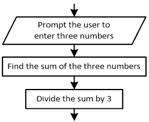

决策控制结构示例

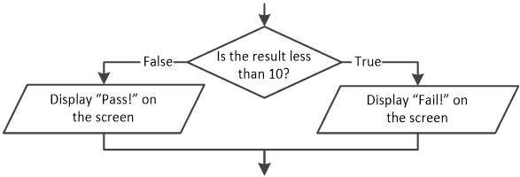

循环控制结构示例

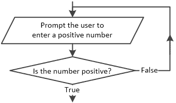

如果你没有完全理解这三种控制结构的深层含义，不要担心，因为接下来的章节将非常彻底地分析它们。耐心是一种美德。你现在需要做的就是等待！

### 4.12 你的第一个 Python 程序

将流程图转换为如 Python 这样的计算机语言将产生一个 Python 程序。Python 程序不过是一个包含 Python 语句的文本文件。你甚至可以在你的文本编辑器应用程序中编写 Python 程序！不过，请记住，使用 IDLE 或 Visual Studio Code 编写 Python 程序是一个更好的解决方案，因为它们包含的所有功能都可以使你的生活变得更轻松。

Python 源代码以默认的.py 文件扩展名保存在您的硬盘上。

这里有一个非常简单的算法，它在屏幕上显示三条消息。

.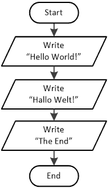

这里是同样的算法，以 Python 程序的形式编写。

print("Hello World!")

print("Hallo Welt!")

print("The End")

### 4.13 语法错误、逻辑错误和运行时错误之间的区别是什么？

当编写或执行高级语言代码时，可能会发生三种类型的错误：语法错误、逻辑错误和运行时错误。

语法错误是拼写错误、缺少标点符号或缺少闭合括号等错误。语法错误由编译器或解释器检测。如果你尝试执行包含语法错误的 Python 程序，你会在屏幕上收到错误消息，程序将不会执行。你必须纠正任何错误，然后再次尝试执行程序。

一些 IDE，如 Visual Studio Code，会在你输入时检测这些错误，并用波浪形红线下划线标记错误的语句。

逻辑错误是阻止你的程序执行你期望它执行的操作的错误。在逻辑错误中，你根本不会收到任何警告。你的代码可以编译并运行，但结果并不是预期的。逻辑错误很难检测。你必须彻底审查你的程序，以找出错误所在。例如，考虑一个 Python 程序，该程序提示用户输入三个数字，然后计算并显示它们的平均值。然而，在这个程序中，程序员犯了一个打字错误（一个“typo”）；他们的一个语句将三个数字的总和除以 5，而不是应该的 3。当然，Python 程序会像往常一样执行，没有任何错误消息，提示用户输入三个数字并显示一个结果，但显然不是正确的结果！找出并纠正错误编写的 Python 语句是程序员的职责，而不是计算机、解释器或编译器！毕竟，计算机并不那么聪明！

运行时错误是在程序执行过程中发生的错误。运行时错误可能导致程序突然终止，甚至导致系统关闭。这类错误是最难检测的。在执行程序之前，无法确定是否会发生此类错误。尽管如此，你可以怀疑它可能会发生！例如，内存不足或除以零会导致运行时错误。

逻辑错误可能是运行时错误的原因！

逻辑错误和运行时错误通常被称为“bug”，通常在软件发布前的调试过程中被发现。当软件发布后发现问题，程序员通常会发布补丁或小更新来修复错误。

### 4.14 “调试”是什么意思

调试是寻找和减少计算机程序中缺陷（错误）的过程，以便使其按预期运行。

关于“调试”一词起源有一个神话。1940 年，当 Grace Hopper^([[6]](footnotes.html#Endnote_6))在哈佛大学研究 Mark II 计算机时，她的同事发现了一只虫子（一只蛾）卡在继电器（一个电动开关）中。这个虫子阻碍了 Mark II 计算机的正常运行。因此，当她的同事试图移除虫子时，Grace Hopper 评论说他们正在“调试”系统！

### 4.15 注释你的代码

当你编写一个简单易懂的程序时，任何人都可以通过逐行阅读来理解它是如何工作的。然而，长程序很难理解，有时即使是编写程序的人也难以理解。

注释是可以在程序中包含的额外信息，可以使程序更容易阅读和理解。使用注释，你可以添加解释和其他信息，包括：

►谁编写了程序

►程序创建或最后修改的时间

►程序做什么

►程序是如何工作的

注释是为了方便人类读者阅读。编译器和解释器会忽略你程序中添加的任何注释。

然而，你不应该过度注释。没有必要解释程序中的每一行。只有当程序中的某个特定部分难以理解时，才添加注释。

在 Python 中，你可以使用哈希字符（#）添加注释，如下所示。

#由 Aristides S. Bouras 创建

#创建日期：2003 年 12 月 25 日

#修改日期：2008 年 4 月 3 日

#描述：此程序在屏幕上显示一些信息

print("Hello Zeus!")  #它在屏幕上显示一条信息

#在屏幕上显示第二条信息

print("Hello Hera!")

#这是一个注释 print("The End")

正如你在前面的程序中看到的，你可以在语句上方或语句末尾添加注释，但不能在语句前方添加。看看最后一个语句，它本应显示信息“结束”。这个语句永远不会被执行，因为它被认为是注释的一部分。

当程序运行时，注释对程序的用户是不可见的。

### 4.16 用户友好的程序

什么是用户友好的程序？它是用户认为它是朋友而不是敌人的程序，对新手用户来说很容易使用。

如果你想要编写用户友好的程序，你必须站在用户的角度思考。用户希望电脑按照他们的方式工作，以最小的努力完成工作。隐藏的菜单、不清晰的标签和指示，以及误导性的错误信息都可能使程序变得不友好！

最佳定义用户友好设计的定律是“最小惊讶定律”：程序应该以最不令用户惊讶的方式行事。这个定律也通常被称为最小惊讶原则（POLA）。

### 4.17 复习问题：对/错

对以下每个陈述选择对或错。

1)一份食谱实际上是一个算法。

2)算法仅在计算机科学中使用。

3)一个算法可以无限期地运行。

4)在算法中，你可以将任何步骤移动到任何你希望的位置。

5)算法必须为至少一组输入值产生正确的输出值。

6)计算机可以下棋。

7)一个算法总能成为一个计算机程序。

8)编程是创建计算机程序的过程。

9)在计算机程序中，总是涉及三方：程序员、计算机和用户。

10)程序员和用户有时可以是同一个人。

11)计算机程序可能不会输出任何结果。

12)流程图是一种计算机程序。

13)流程图由一组几何形状组成。

14)流程图是表示算法的一种方法。

15)为了表示一个算法，你可以设计一个流程图而不使用任何开始/结束符号。

16)你可以设计一个流程图而不使用任何流程符号。

17)你可以设计一个流程图而不使用任何数据输入/输出符号。

18)流程图必须始终包含至少一个决策符号。

19)在流程图中，决策符号可以有一个、两个或三个出口路径，具体取决于给定的问题。

20)保留字是所有具有严格预定义意义的单词。

21)结构化编程包括结构化设计。

22)Python 是一种结构化计算机语言。

23)结构化编程的基本原则是它只包括四种基本控制结构。

24)一条写十遍的语句被认为是循环控制结构。

25)决策控制结构指的是逐行执行。

26)拼写错误的密钥词被视为逻辑错误。

27)即使 Python 程序包含逻辑错误，它也可以执行。

28)如果你在 Python 语句的末尾留下感叹号，它被视为语法错误。

29)如果你在 Python 语句的末尾留下感叹号，它不能阻止整个 Python 程序执行。

30)结构化编程的一个优点是在编写计算机程序时不会出错。

31)逻辑错误在编译期间被捕获。

32)运行时错误在编译期间被捕获。

33)语法错误是最难检测的错误。

34)一个计算三角形面积但输出错误结果的程序包含逻辑错误。

35)当程序不包含输出语句时，它包含语法错误。

36)一个程序必须始终包含注释。

37)如果你在程序中添加注释，计算机可以更容易地理解它。

38)你无法在语句上方添加注释。

39)注释对程序的用户是不可见的。

40)如果一个程序可以被新手用户轻松使用，那么它被称为用户友好型。

41)缩写词 POLA 代表“最小娱乐原则”。

### 4.18 复习题：多项选择题

选择以下每个陈述的正确答案。

1)算法是一系列严格定义的有限序列的明确陈述，它提供了

a)一个问题。

b)一类特定的问题。

c)以上两者都是正确的。

2)以下哪项不是算法必须满足的特性？

a)有效性

b)适宜性

c)确定性

d)输入

3)计算机程序是

a)一个算法。

b)一系列指令。

c)以上两者都是

4)当有人编写一个食谱时，他们是

a)“程序员”

b)“用户”

c)以上都不是

5)以下哪项不属于创建算法涉及到的三个主要阶段之一？

a)数据保护

b)数据输入

c)结果输出

d)数据处理

6)流程图可以是

a)展示在一张纸上。

b)直接输入到计算机中。

c)以上两者都是

7)流程图中的矩形表示

a)输入/输出操作。

b)处理操作。

c)一个决策。

d)以上都不是

8)以下哪项是/是控制结构？

a)一个决策

b)一个序列

c)一个循环

d)以上所有都是控制结构。

9)以下哪个 Python 语句包含语法错误？

a)print(Hello Poseidon)

b)print("It's me! I contain a syntax error!!!")

c)print("Hello Athena")

d)以上都不是

10)以下哪个打印语句实际上被执行了？

a)print("Hello Apollo)

b)#print("Hello Artemis")

c)#This will be executed  print("Hello Ares")

d)print("Hello Aphrodite") #This will be executed

e)以上都不是
