## 第七章

运算符

### 7.1 值赋值运算符

Python 中最常用的运算符是值赋值运算符（=）。例如，以下 Python 语句将值 5 赋给变量 x。

x = 5

正如你在第五章中读到的，这相当于流程图中使用的左箭头。

.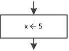

可能流程图中使用的左箭头比（=）符号更方便、更清晰，因为它直观地说明了右侧表达式或结果的值被赋值给左侧的变量。

重要的是要注意，（=）符号在数学中并不等同于 Python 中的使用。在数学中，表达式 x = 5 读作“x 等于 5”。然而，在 Python 中，表达式 x = 5 读作“将值 5 赋给 x”或“将 x 设置为 5”。它们看起来一样，但作用不同！

例如，在数学中，以下两行是等价的。第一行可以读作“x 等于 y 和 z 的和”，第二行可以读作“y 和 z 的和等于 x”。

x = y + z

y + z = x

另一方面，在 Python 中，这两个语句绝对不等价。第一个语句是一个有效的 Python 语句，表示“将 y 和 z 的和赋值给 x”。然而，第二个语句是无效的，因为它试图将 x 的值赋给 y + z，这在 Python 中是不允许的！

在 Python 中，（=）符号左侧的变量代表主内存（RAM）中的一个区域，可以存储值。

在（=）符号的左侧只能存在变量，而在右侧则可以是数字、变量、字符串，甚至是复杂的数学表达式。

在表 7-1 中，你可以找到一些值赋值的例子。

| 示例 | 描述 |
| --- | --- |
| a = 9 | 将值 9 赋给变量 a。 |
| b = c | 将变量 c 的内容赋值给变量 b。 |
| d = "Hello Zeus" | 将字符串 Hello Zeus 赋值给变量 d。 |
| d = a + b | 计算变量 a 和 b 的内容之和，并将结果赋值给变量 d。 |
| b = x + 1 | 计算变量 x 的内容和 1 的和，并将结果赋值给变量 b。请注意，变量 x 的内容没有被改变。 |
| x = x + 1 | 计算变量 x 的内容和 1 的和，并将结果重新赋值给变量 x。换句话说，将变量 x 增加 1。 |

表 7-1 值赋值例子

对于最后一个例子感到困惑吗？你现在在想你的数学老师吗？如果你在黑板上写下 x = x + 1，他们会怎么反应？你能想象一个等于自己加一的数字吗？这个语句暗示 5 等于 6，10 等于 11，这当然是错误的！

显然，在计算机科学中事情是不同的。语句 x = x + 1 是完全有效的！它指示 CPU 从主存（RAM）中检索变量 x 的值，将 1 加到该值上，并将结果重新赋值给变量 x。变量 x 的旧值被新值所取代。

仍然不明白？让我们看看 CPU 和主存（RAM）是如何相互协作以执行语句 x = x + 1 的。

假设内存中有一个名为 x 的区域，它包含数字 13。

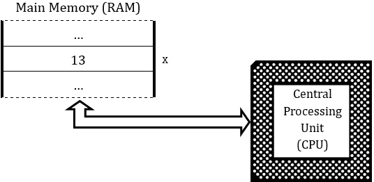

当一个程序指示 CPU 执行以下语句时：

x = x + 1

以下程序被执行：

►数字 13 从 RAM 中名为 x 的区域传输到 CPU；

►CPU 计算 13 和 1 的和；并且

►结果，14，从 CPU 传输到 RAM 的 x 区域，替换现有的数字 13。

执行后，RAM 看起来是这样的。

.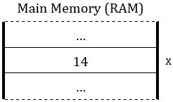

现在你已经理解了一切，让我们深入探讨一些最终细节。在 Python 中，你可以用一条语句将单个值赋给多个变量。以下语句：

a = b = c = 4

将 4 的值赋给所有三个变量 a、b 和 c。

在 Python 中，你还可以用一条语句将多个值赋给多个变量。这被称为同时赋值。以下语句将 2 的值赋给变量 a，10 的值赋给变量 b，3 的值赋给变量 c。

a, b, c = 2, 10, 3

### 7.2 算术运算符

就像每种高级编程语言一样，Python 支持几乎所有类型的算术运算符，如下表所示。

| 算术运算符 | 描述 |
| --- | --- |
| + | 加法 |
| − | 减法 |
| * | 乘法 |
| / | 除法 |
| // | 整数除法后的商 |
| % | 整数除法后的余数（模数） |
| ** | 幂运算 |

前两个运算符很简单，不需要进一步解释。

如果你需要乘以两个数字或两个变量的内容，你必须使用星号（*）符号。例如，如果你想乘以 2 乘以 y，你必须写 2 * y。

在数学中，可以省略乘法运算符并写 3x，表示“3 乘以 x”。然而，在 Python 中，你必须始终在任何存在乘法操作的地方使用星号（*）。这是新手程序员在 Python 中编写数学表达式时最常见的错误之一。

进行除法时，必须使用斜杠（/）符号。例如，如果你想将 10 除以 2，你必须写 10 / 2。

整数除法运算符（//）返回整数除法的商，这意味着

a = 13 // 3

将 4 的值赋给变量 a。

（//）运算符也可以用于浮点数。例如，操作

b = 14.4 // 3

将 4 的值赋给变量 b。

相应地，取模运算符（%）返回整数除法的余数，这意味着

c = 13 % 3

将值 1 赋给变量 c。

取模运算符（%）也可以与浮点数一起使用，但结果是实数（float）。例如，操作

d = 14.4 % 3

将 2.4（而不是您可能错误地期望的 2）的值赋给变量 d。

请记住，流程图是用来表示算法的一种松散方法。尽管在流程图中允许使用整数商（//）和整数余数（%）运算符，但本书使用的是普遍接受的 DIV 和 MOD 运算符！例如，Python 语句 x = 13 // 3 和 y = 13 % 3 在流程图中表示为

.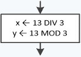

指数运算符（**）将运算符左侧的数提升到运算符右侧的数的幂。例如，操作

f = 2 ** 3

计算 2 的 3 次幂（2³）并将值 8 赋给变量 f。

指数运算符（**）具有双重作用。除了用于计算一个值被另一个值提升的幂之外，它还用于使用已知的数学公式 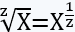 计算一个数的任何根。例如，您可以编写 y = x ** (1 / 2)来计算 x 的平方根或 y = x ** (1 / 3)来计算 x 的立方根。

在数学中，如您可能已经知道的，您可以使用括号（圆括号）以及花括号（花括号）和方括号，如下面的表达式所示。

.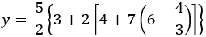

然而，在 Python 中，没有括号和方括号这样的东西。只有括号；因此，必须使用括号而不是花括号或方括号来编写相同的表达式。

y = 5 / 2 * (3 + 2 * (4 + 7 * (6 − 4 / 3)))

### 7.3 算术运算符的优先级是什么？

算术运算符遵循与数学中相同的优先级规则，这些规则是：首先执行指数运算，然后执行乘法和除法，最后执行加法和减法。

| 高优先级 

优先级较低 | 算术运算符 |

| ** |
| --- |
| *, /, //, % |
| +, − |

当乘法和除法存在于同一个表达式中，并且由于它们具有相同的优先级，它们将按从左到右的顺序执行（与阅读方式相同），这意味着表达式

y = 6 / 3 * 2

等价于 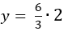，并将值 4 赋给变量 y，（除法在乘法之前执行）。

如果您希望乘法在除法之前执行，则可以使用括号来改变优先级。这意味着

y = 6 / (3 * 2)

等价于 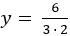，并将值 1 赋给变量 y（乘法在除法之前执行）。

请记住，在 Python 中无法以 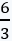 或 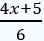 的形式写入分数。别想了！Visual Studio Code 或任何 IDE 中都没有方程式编辑器。所有分数都必须写在一行上。例如， 必须写成 6 / 3，而  必须写成 (4 * x + 5) / 6。

运算顺序可以总结如下：

1)首先执行括号内的任何运算。

2)接下来执行任何指数运算。

3)然后，从左到右执行任何乘法和除法运算。

4)最后，任何加法和减法运算都是从左到右执行的。

因此，在下一个示例中

y = 12 + (20 + 3) - 2 ** 3 / 4 * 3

操作的执行顺序如下：

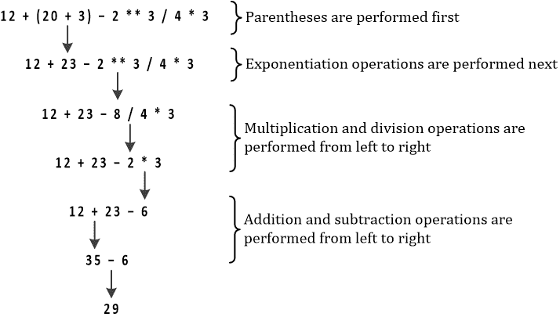

### 7.4 复合赋值运算符

Python 提供了一组称为复合赋值运算符的特殊运算符，这可以帮助你更快地编写代码。这些运算符在下面的表格中进行了全面详细的说明。每个运算符都提供了一个示例，而“等价于”列显示了不使用复合赋值运算符的相应语句。

| 运算符 | 描述 | 示例 | 等价于 |
| --- | --- | --- | --- |
| += | 加法赋值 | a += b | a = a + b |
| −= | 减法赋值 | a ‑= b | a = a ‑ b |
| *= | 乘法赋值 | a *= b | a = a * b |
| /= | 除法赋值 | a /= b | a = a / b |
| //= | 整数除法赋值 | a //= b | a = a // b |
| %= | 取模赋值 | a %= b | a = a % b |
| **= | 幂赋值 | a **= b | a = a ** b |

请注意，在流程图中，本书只使用了“等价于”列中显示的普遍接受的运算符。例如，Python 语句 a += b 在流程图中表示为

.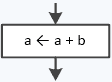

#### 练习 7.4-1 哪些 Python 语句在语法上是正确的？

以下哪个 Python 赋值语句在语法上是正确的？

i) a = −10

ii)10 = b

iii)aB = aB + 1

iv)a = "COWS"

v)a = COWS

vi)a + b = 40

vii) a = 3 b

viii)a = "True"

ix)a = True

x)a //= 2

xi)a += 1

xii)a =* 2

解答

i) 正确。它将整数值 −10 赋值给变量 a。

ii) 错误。在值赋值运算符的左侧只能存在变量。

iii) 正确。它将变量 aB 的值增加一。

iv) 正确。它将字符串“COWS”（不带双引号）赋值给变量 a。

v) 正确。它将变量 COWS 的内容赋值给变量 a。

vi) 错误。在值赋值运算符的左侧只能存在变量（不是表达式）。

vii) 错误。它应该写成 a = 3 * b。

viii) 正确。它将字符串“True”（不带双引号）赋值给变量 a。

ix) 正确。它将值 True 赋值给变量 a。

x) 正确。这相当于 a = a // 2。

xi) 正确。这相当于 a = a + 1。

xii)错误。它应该写成 a *= 2（等价于 a = a * 2）。

#### 练习 7.4-2 查找变量类型

以下每个变量的类型是什么？

i)a = 15

ii)width = "10 meters"

iii)b = "15"

iv)temp = 13.5

v)b = True

vi)b = "True"

解答

i)值 15 属于整数的集合，因此变量 a 是整数。

ii)值“10 meters”是文本，因此宽度变量是字符串。

iii)值“15”是一个文本，因此变量 b 是一个字符串。

iv)值 13.5 属于实数集合，因此变量 temp 是实数（浮点数）。

v)值 True 是布尔值，因此变量 b 是布尔值。

vi)值“True”是文本，因此变量 b 是字符串。

### 7.5 字符串运算符

将两个独立的字符串连接成一个字符串称为连接。你可以使用以下表格中显示的两个运算符来连接（连接）字符串。

| 运算符 | 描述 | 示例 | 等价于 |
| --- | --- | --- | --- |
| + | 连接 | a = "Hi" + " there" |   |
| += | 连接赋值 | a += "Hello" | a = a + "Hello" |

以下示例显示“What's up, dude？”

a = "What's "

b = "up, "

c = a + b

c += "dude?"

print(c)

最后但同样重要的是，还有两个可以用于字符串重复的字符串运算符，如下表所示。

| 运算符 | 描述 | 示例 | 等价于 |
| --- | --- | --- | --- |
| * | 重复 | a = "Hi" * 3 | a = "HiHiHi" |
| *= | 重复赋值 | a *= 5 | a = a * 5 |

以下示例首先显示“catcat”，然后显示“catcatcatcat”。

a = "cat" * 2

print(a)   #它显示：catcat

a *= 2

print(a)   #它显示：catcatcatcat

#### 练习 7.5-1 连接名字

编写一个 Python 程序，提示用户输入他们的名字（分配给两个不同的变量）。然后它们将它们连接成一个字符串（连接）并在用户的屏幕上显示。

解答

Python 程序如下所示。

firstName = input("Enter first name: ")

lastName = input("Enter last name: ")

fullName = firstName + " " + lastName

print(fullName)

注意在名字的首尾之间添加了额外的空格字符。

### 7.6 复习问题：正确/错误

对以下每个陈述选择正确或错误。

1)语句 x = 5 可以读作“变量 x 等于 5”。

2)值赋值运算符将表达式的结果赋给变量。

3)只能通过使用 input()语句将字符串赋值给变量。

4)语句 5 = y 将值 5 赋给变量 y。

5)在值赋值运算符的右边必须始终存在算术运算符。

6)在 Python 中，值赋值运算符的右边只能存在变量。

7)在值赋值运算符的两边不能使用相同的变量。

8)语句 a = a + 1 减少了变量 a 的值。

9)语句 a = a + (−1) 减少了变量 a 的值。

10)在 Python 中，单词 DIV 是一个保留字。

11)语句 x = 0 % 5 将值 5 赋给变量 x。

12)操作 5 % 0 是不可能的。

13)加法和减法在算术运算符中具有更高的优先级。

14)当表达式中存在除法和乘法运算符时，乘法运算先于除法运算执行。

15)语句 2 ** 3 返回结果 6。

16)语句 2 ** 3 返回结果 9。

17)表达式 8 / 4 * 2 等于 1。

18)表达式 4 + 6 / 6 + 4 等于 9。

19)表达式 a + b + c / 3.0 计算三个数的平均值。

20)语句 a += 1 等价于 a = a + 1

21)语句 a = "True"将布尔值赋给变量 a。

22)语句 a = 2·a 使变量 a 的内容加倍。

23)语句 a += 2 和 a = a − (−2)不等价。

24)语句 a −= a + 1 总是将变量 a 的值赋为-1。

25)语句 a = "George" + " Malkovich"将值“GeorgeMalkovich”（不带双引号）赋给变量 a。

26)以下 Python 程序满足确定性的性质。

a = float(input())

b = float(input())

x = a / (b - 7)

print(x)

### 7.7 复习题：多项选择题

为以下每个陈述选择正确的答案。

1)以下哪个 Python 赋值语句将 10.0 的值赋给变量 a？

a)10.0 = a

b)a ← 10.0

c)a = 100.0 / 10.0

d)以上皆非

2)以下语句可以读作

a)将变量 a 的内容赋给变量 b。

b)变量 b 等于变量 a。

c)将变量 b 的内容赋给变量 a。

d)以上皆非

3)以下哪个计算变量 a 的平方？

a)y = a * a

b)y = a ** 2

c)y = a * a / a * a

d)全部正确

4)表达式 0 % 10 + 2 等于

a)7.

b)2.

c)12.

d)以上皆非

5)以下哪个 Python 语句是语法正确的？

a)a = 4 * 2y − 8 / (4 * q)

b)a = 4 * 2 * y − 8 /> 4 * q)

c)a = 4 * 2 * y − 8 /> 4 * q)

d)以上皆非

6)以下哪个 Python 语句是语法正确的？

a)a ** 5 = b

b)b = a ** 5

c)a =** 5

d)以上皆非

7)以下哪个 Python 语句将值“George Malkovich”（不带双引号）赋给变量 a？

a)a = "George" + " " + "Malkovich"

b)a = "George" + " Malkovich"

c)a = "George " + "Malkovich"

d)以上皆非

8)以下代码片段

x = 2

x += 1

不满足

a)确定性。

b)确定性。

c)有效性。

d)以上皆非

9)以下代码片段

a = float(input())

x = 1 / a

不满足

a)确定性。

b)输入。

c)确定性。

d)以上皆非

### 7.8 复习题

完成以下练习。

1)以下哪个 Python 赋值语句是语法正确的？

i)a ← a + 1

ii)a += b

iii)a  b = a  b + 1

iv)a = a + 1

v)a = hello

vi)a = 40"

vii)a = b · 5

viii)a =+ "True"

ix)fdadstwsdgfgw = 1

x)a = a ** 5

2)以下每个变量的类型是什么？

i)a = "False"

ii)w = False

iii)b = "15 meters"

iv)weight = "40"

v)b = 13.0

vi)b = 13

3)将第一列的每个元素与第二列的每个元素匹配。

| 操作 | 结果 |
| --- | --- |
| i) 1 / 2.0 | a) 100 |
| ii) 1.0 / 2 * 2 | b) 0.25 |
| iii) 0 % 10 * 10 | c) 0 |
| iv) 10 % 2 + 7 | d) 0.5 |
|   | e) 7 |
|   | f) 1.0 |

4)执行以下代码片段后，屏幕上显示什么？

i)

a = 5

b = a * a + 1

打印(b)

b += 1

ii)

a = 9

b = a / 3 * a

打印(b + 1)

5)执行以下代码片段后，屏幕上显示什么？

i)

a = 5

a += a - 5

打印(a)

ii)

a = 5

a = a + 1

打印(a)

6)以下每个操作的运算结果是什么？

i)21 % 5

ii)10 % 2

iii)11 % 2

iv)10 % 6 % 3

v)0 % 3

vi)100 / 10 % 3

7)执行以下代码片段后，屏幕上显示什么？

i)

a = 5

b = 2

c = a % (b + 1)

d = (b + 1) % (a + b)

打印(c, "*", d)

ii)

a = 4

b = 8

a += 1

c = a * b / 10 % b

打印(c)

8)计算以下情况下 a % b 的结果。

i)a = 20, b = 3

ii)a = 15, b = 3

iii)a = 22, b = 3

iv)a = 0, b = 3

v)a = 3, b = 1

vi)a = 2, b = 2

9)计算以下表达式的结果

b * (a % b) + a / b

对以下每种情况。

i)a = 10, b = 5

ii)a = 10, b = 2

10)执行以下代码片段后，屏幕上显示什么？

a = "My name is"

a += " "

a = a + "George Malkovich"

打印(a)

11)在以下代码片段中填入空缺，以便它们都显示值为 5。

i)

a = 2

a = a - ……

打印(a)

ii)

a = 4

b = a * 0.5

b += a

a = b - ……

打印(a)

12)执行以下代码片段后，屏幕上显示什么？

city = "California"

California = city

打印(city, California, "California")
