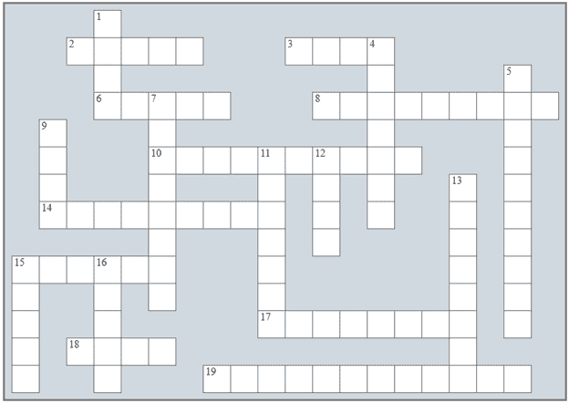
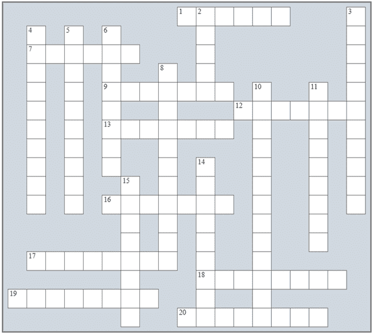

## Review in “Getting Started with Python”

### Review Crossword Puzzles

1) 解决以下填字游戏。

Across

2) 这些错误很难检测。

3) 一个控制结构。

6) 它显示了流程图中的执行流程。

8) 展示算法的一种图形方法。

10) _______________ 编程是一种使用模块化和结构化设计的软件开发方法。

14) 严格定义的有限序列的明确语句，提供了解决问题的方案。

15) 术语 ________ 意味着算法必须达到一个终点，不能无限期运行。

17) 这个流程图符号有一个入口和两个出口。

18) 逻辑错误和运行时错误通常被称为 _______。

19) 必须能够在有限的时间内正确执行算法的每个步骤。这是算法必须满足的一个属性，被称为 ________。

Down

1) 最佳定义用户友好设计的原则。

4) 这代表流程图中的数学（公式）计算。

5) 数据 _______________ 是创建算法涉及的三个主要阶段之一。

7) 在计算机语言中有严格预定义意义的单词。

9) 一种编程语言。

11) 语句。

12) 使用程序的人。

13) 一个控制结构。

15) Real.

16) 算法必须满足的一个属性。

2) 解决以下填字游戏。

Across

1) 一个字母数字值。

7) 拼写错误的关键字是一个 _________ 错误。

9) 一个没有分数部分的正数或负数。

12) 可以包含在程序中以使其更容易阅读和理解的信息。

13) 这种类型的变量只能持有两个值之一。

16) 在程序执行过程中发生的一个错误。

17) 这种控制结构也被称为选择控制结构。

18) 这是一个消耗 CPU 时间的算术操作。

19) 在程序运行期间不能改变的值。

20) 一个用户-________ 程序是一个对新手用户来说很容易的程序。

Down

2) 一个 _________ 表是用于测试算法或计算机程序在执行过程中发生的逻辑错误的技术。

3) 任何包含在 ___________ 中的算术运算首先执行。

4) 流程图中的左箭头被称为值 _____________ 操作符。

5) 允许在变量名称中使用的符号字符。

6) 它代表计算机主内存（RAM）中的一个位置，程序可以在此处存储一个值。

8) 在主内存（RAM）中为存储变量内容保留部分的过程。

10) 将两个独立的字符串合并成一个。

11) 在计算机程序中寻找和减少逻辑错误数量的过程。

14) 模运算符返回整数除法的 ___________。

15) 运算符（//）返回整数除法的 ___________。

### Review Questions

答以下问题。

1) 什么是算法？

2)给出制作咖啡的算法。

3)一个算法必须满足哪五个属性？

4)算法能否无限执行？

5)什么是计算机程序？

6)算法中涉及的三方是什么？

7)组成计算机程序的三个阶段是什么？

8)一个计算机程序能否由两个阶段组成？

9)什么是流程图？

10)流程图使用的基本符号有哪些？

11)“保留字”这个术语是什么意思？

12)什么是结构化编程？

13)结构化程序设计的三个基本控制结构是什么？

14)使用流程图给出每个控制结构的例子。

15)程序员能否在文本编辑器中编写 Python 程序？

16)什么是语法错误？给出一个例子。

17)什么是逻辑错误？给出一个例子。

18)什么是运行时错误？给出一个例子。

19)拼写错误的保留字会导致什么类型的错误？

20)“调试”这个术语是什么意思？

21)为什么程序员应该在他们的代码中添加注释？

22)为什么程序员应该编写用户友好的程序？

23)缩写 POLA 代表什么？

24)什么是变量？

25)在流程图的左箭头的左侧可以存在多少个变量？

26)变量的值存储在计算机的哪个部分？

27)什么是常量？

28)如何使用常量来帮助程序员？

29)为什么程序员应尽可能避免除法和乘法运算？

30)至少列出三种变量的数据类型。

31）“声明一个变量”这个短语是什么意思？

32)如何在 Python 中声明一个变量？给出一个例子。

33)在流程图中用来显示消息的符号是什么？

34)Python 中“换行”和“制表符”的特殊字符序列是什么？

35)在流程图中用来让用户输入数据的符号是什么？

36)Python 中用作值赋值运算符的字符是什么，在流程图中如何表示？

37)Python 支持哪些算术运算符？

38)什么是取模运算符？

39)总结算术运算符优先级的规则。

40)Python 支持哪些复合赋值运算符？

41)Python 支持哪些字符串运算符？

42)什么是跟踪表？

43)使用跟踪表有什么好处？

44)描述交换两个变量（无论是数字还是字母数字）内容所涉及的步骤。

45)本书提出了三种交换两个变量值的方法。哪一种更好，为什么？

46)描述 IDLE 如何帮助你找到语法错误。

47)描述 IDLE 如何帮助你找到逻辑错误。

48)描述 Visual Studio Code 如何帮助你找到语法错误。

49)描述 Visual Studio Code 如何帮助你找到逻辑错误。
