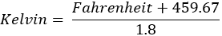
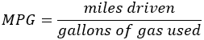
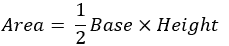
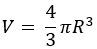
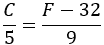

## 第十章

序列控制结构简介

### 10.1 什么是序列控制结构？

序列控制结构指的是按行执行的语句按其在程序中出现的顺序依次执行，不跳过任何一条。例如，它们可能执行一系列的读写操作、算术运算或变量的赋值。

以下程序展示了 Python 语句按顺序执行的示例。

 file_10.1

#提示用户输入 num 的值

num = int(input("Enter a number: "))

#计算 num 的平方

result = num ** 2

#在用户的屏幕上显示结果

print("The square of", num, "is", result)

序列控制结构是你在第 4.11 节中学习到的三个基本控制结构中最简单的一个。其他两个结构是“决策结构”和“循环结构”。计算机编程中的所有问题都可以仅使用这三个结构来解决！

在 Python 中，你可以使用井号字符（#）添加注释。注释是为了人类读者。编译器和解释器会忽略它们。

#### 练习 10.1-1 计算矩形的面积

编写一个 Python 程序，提示用户输入矩形的底边长和高度，然后计算并显示其面积。

解答

你可能从学校就知道，你可以使用以下公式计算矩形的面积：

面积 = 底 × 高

在第 4.6 节中，你学习了创建算法涉及到的三个主要阶段：数据输入、数据处理和结果输出。

在这个练习中，这三个主要阶段如下：

►数据输入 – 用户必须输入底边长和高度的值

►数据处理 – 程序必须计算矩形的面积

►结果输出 – 程序必须显示上一阶段计算出的矩形面积。

这个问题的解答如下。

 file_10.1-1

#数据输入 - 提示用户输入底边长和高度的值

b = float(input("Enter the length of base: "))

h = float(input("Enter the length of height: "))

#数据处理 - 计算矩形的面积

area = b * h

#结果输出 - 在用户的屏幕上显示结果

print("The area of the rectangle is", area)

#### 练习 10.1-2 计算圆的面积

编写一个 Python 程序，计算并显示圆的面积。

解答

你可以使用以下公式计算圆的面积：

面积 = π × 半径²

π的值是一个已知量，大约为 3.14159。因此，用户必须输入的唯一值是半径的值。

在这个练习中，你在第 4.6 节中学到的三个主要阶段如下：

►数据输入 – 用户必须输入半径的值

►数据处理 - 程序必须计算圆的面积

►结果输出 – 程序必须显示上一阶段计算出的圆面积。

这个问题的解决方案如下所示。

 file_10.1-2a

#数据输入 - 提示用户输入半径值

radius = float(input("请输入半径长度："))

#数据处理 - 计算圆的面积

area = 3.14159 * radius ** 2

#结果输出 - 在用户屏幕上显示结果

print("圆的面积是", area)

使用一个常数，PI，会是一个更好的方法。

 file_10.1-2b

PI = 3.14159

#数据输入 - 提示用户输入半径值

radius = float(input("请输入半径长度："))

#数据处理 - 计算圆的面积

area = PI * radius ** 2

#结果输出 - 在用户屏幕上显示结果

print("圆的面积是", area)

指数运算的优先级更高，会在乘法运算之前执行。

#### 练习 10.1-3 汽车在哪里？计算行驶距离

汽车从静止开始，沿直线水平道路以恒定加速度行驶指定时间。编写一个 Python 程序，提示用户输入加速度和汽车行驶的时间，然后计算并显示行驶的距离。所需的公式是

.

其中

►S 是汽车行驶的距离，以米（m）为单位

►u[o] 是汽车的初始速度（速度），以每秒米（m/sec）为单位

►t 是汽车行驶的时间，以秒（sec）为单位

►a 是加速度，以每秒每秒²（m/sec²）为单位

解答

由于汽车是从静止开始的，初始速度（速度）u[0] 为零。因此，公式变为

并且 Python 程序是

 file_10.1-3

a = float(input("请输入加速度："))

t = float(input("请输入行驶时间："))

S = 0.5 * a * t ** 2

print("你的车行驶了", S, "米")

指数运算的优先级更高，会在乘法运算之前执行。

#### 练习 10.1-4 开氏度到华氏度

编写一个 Python 程序，将温度值从华氏度转换为开尔文等效值。所需的公式是

1.8 × 开尔文 = 华氏度 + 459.67

解答

给定的公式不能直接用于你的程序中。在像 Python 这样的计算机语言中，不允许直接写入

1.8 * kelvin = fahrenheit + 459.67

在等号（=）左侧的位置，只能存在一个变量。这个变量实际上是在 RAM 中可以存储值的区域。

根据这个练习的措辞，程序必须将华氏度转换为开尔文度。华氏度的值是一个已知值，由用户提供，而开尔文度的值是 Python 程序必须计算的。因此，你需要解出开尔文。经过一些工作，公式变为

.

Python 程序如下所示。

 file_10.1-4

fahrenheit = float(input("输入华氏温度: "))

kelvin = (fahrenheit + 459.67) / 1.8

print("开尔文温度是:", kelvin)

#### 练习 10.1-5 计算销售税

员工需要一个程序来输入产品的不含税价格并计算其最终价格。假设增值税（VAT）率为 19%。

解决方案

销售税可以很容易地计算。你必须将产品的不含税价格乘以 VAT 率。注意——销售税不是最终价格，只是税额。

通过将初始不含税价格和之前计算的销售税相加，可以计算出含税价格。

在这个程序中，你可以使用一个名为 VAT 的常量来表示销售税率（VAT 税率）。

 file_10.1-5

VAT = 0.19

priceBeforeTax = float(input("输入不含税价格: "))

salesTax = priceBeforeTax * VAT

priceAfterTax = priceBeforeTax + salesTax

print("含税价格是:", priceAfterTax)

#### 练习 10.1-6 计算销售折扣

编写一个 Python 程序，提示用户输入商品的价格和提供的折扣率（在 0 到 100 的范围内）。然后程序必须计算并显示新的价格。

解决方案

折扣金额可以很容易地计算。你必须将产品的原价乘以折扣值，然后除以 100。除法是必要的，因为用户在 0 到 100 的范围内输入折扣值。注意——结果不是最终价格，只是折扣金额。

最终的折扣后价格可以通过从初始不含折扣价格中减去之前计算的折扣金额来计算。

 file_10.1-6

priceBeforeDiscount = float(input("输入产品的价格: "))

discount = int(input("输入提供的折扣（0 - 100）: "))

discountAmount = priceBeforeDiscount * discount / 100

priceAfterDiscount = priceBeforeDiscount - discountAmount

print("折扣后的价格是:", priceAfterDiscount)

#### 练习 10.1-7 计算销售折扣和税

编写一个 Python 程序，提示用户输入商品的不含税价格和提供的折扣率（在 0 到 100 的范围内）。然后程序必须计算并显示新的价格。假设销售税率为 19%。

解决方案

这个练习只是前两个练习的组合！

 file_10.1-7

VAT = 0.19

priceBeforeDiscount = float(input("输入产品的价格: "))

discount = int(input("输入提供的折扣（0 - 100）："))

discountAmount = priceBeforeDiscount * discount / 100

priceAfterDiscount = priceBeforeDiscount - discountAmount

salesTax = priceAfterDiscount * VAT

priceAfterTax = priceAfterDiscount + salesTax

print("折扣后的税后价格是：", priceAfterTax)

### 10.2 复习练习

完成以下练习。

1)在美国，汽车的燃油经济是以每加仑英里数（MPG）来衡量的。汽车的 MPG 可以使用以下公式计算：

.

编写一个 Python 程序，提示用户输入他们已行驶的总英里数和使用的汽油加仑数。然后程序必须计算并显示汽车的每加仑英里数（MPG）。

2)编写一个 Python 程序，提示用户输入底边和高的值，然后计算并显示三角形的面积。所需的公式是

.

3)编写一个 Python 程序，提示用户输入三角形的两个角度，然后计算并显示第三个角度。

提示：任何三角形的内角和为 180 度

4)编写一个 Python 程序，允许学生输入他们的四次考试成绩，然后计算并显示平均成绩。

5)编写一个 Python 程序，提示用户输入半径的值，然后计算并显示圆的周长。所需的公式是

周长 = 2πR

6)编写一个 Python 程序，提示用户输入直径的值（以米为单位），然后计算并显示球体的体积。所需的公式是

.

其中 R 是球体的半径。

7)关于前面的练习，以下哪些结果输出语句是正确的？你会选择哪一个来在用户的屏幕上显示球体的体积，为什么？

a)print(V)

b)print(V 立方米)

c)print(V, 立方米)

d)print("球体的体积是：" V)

e)print("球体的体积是：", V)

f)print("球体的体积是：" V, 立方米)

g)print("球体的体积是：", V, "立方米")

8)编写一个 Python 程序，提示用户输入他们的名字、中间名、姓氏和他们的首选头衔（先生、夫人、女士、博士等），并以以下所有方式格式化显示它们。

标题：FirstName MiddleName LastName

FirstName MiddleName LastName

LastName, FirstName

LastName, FirstName MiddleName

LastName, FirstName MiddleName, Title

FirstName LastName

例如，假设用户输入以下内容：

名字：Aphrodite

中间名：Maria

姓氏：Boura

标题：Ms.

程序必须以以下所有方式格式化显示用户的名字：

Ms. Aphrodite Maria Boura

Aphrodite Maria Boura

Boura, Aphrodite

Boura, Aphrodite Maria

Boura, Aphrodite Maria, Ms.

Aphrodite Boura

9)编写一个 Python 程序，提示用户输入直径的值，然后计算并显示圆的半径、周长和面积。对于相同的直径，它还必须显示球体的体积。

10)编写一个 Python 程序，提示用户输入餐厅餐费的金额，然后计算并显示 10% 小费、7% 销售税和所有三项金额的总计。

11)一辆汽车从静止开始，沿直线水平道路以恒定加速度行驶指定时间。编写一个 Python 程序，提示用户输入行驶的距离以及行驶的分钟和秒，然后计算加速度。所需的公式是

.

其中

►S 是汽车行驶的距离，以米（m）为单位

►u[o] 是汽车的初始速度（速度），以每秒米（m/sec）为单位

►t 是汽车行驶的时间，以秒（sec）为单位

►a 是加速度，以每秒平方米（m/sec²）为单位

12)编写一个 Python 程序，提示用户输入华氏温度，然后将其转换为摄氏度^([[10]](footnotes.html#Endnote_10)) 等效值。所需的公式是

13)身体质量指数（BMI）常用于确定一个人是否因为身高而超重或体重不足。计算 BMI 所使用的公式是

.

编写一个 Python 程序，提示用户输入他们的体重（以磅为单位）和身高（以英寸为单位），然后计算并显示用户的 BMI。

14)编写一个 Python 程序，提示用户输入小计和消费税率（0 到 100 的范围内），然后计算小费和总计。例如，如果用户输入 30 和 10，Python 程序必须显示“小费是 $3.00，总计是 $33.00”。

15)一名员工需要一个程序来输入三个产品的税前价格，然后计算每个产品的最终税后价格以及它们的平均价值。假设增值税（VAT）率为 20%。

16)一名员工需要一个程序来输入产品的税后价格，然后计算其税前价格。假设增值税（VAT）率为 20%。

17)编写一个 Python 程序，提示用户输入商品的初始价格和提供的折扣率（0 到 100 的范围内），然后计算并显示最终价格和节省的金额。

18)编写一个 Python 程序，提示用户输入一个月开始和结束时的电表读数（千瓦时 kWh）。程序必须根据每千瓦时 $0.06 的成本和 20% 的增值税（VAT）率计算并显示消耗的千瓦时数和必须支付的金额。

19)游艇工厂经理需要一个程序来计算工厂在一年期间获得的利润或亏损。以下是一些信息：

►建造一艘游艇的成本是工厂 1,000,000 美元。

►每艘游艇售价为 150 万美元。

►该工厂每月支付 25 万美元的保险费。

编写一个 Python 程序，提示用户输入售出的游艇数量，然后计算并显示相应的总收入或亏损，以正数或负数表示。

20)编写一个 Python 程序，提示用户输入当前月份和当前月内的日期，然后计算并显示从年初至今已过去的天数。假设每个月有 30 天。

21)编写一个 Python 程序，提示用户输入当前月份和当前月内的日期，然后计算并显示到年底的天数。假设每个月有 30 天。
