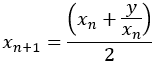
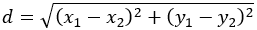
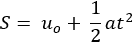
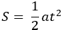
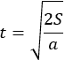
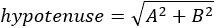
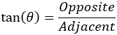

## Chapter 11

操作数字

### 11.1 简介

就像每种高级编程语言一样，Python 提供了许多随时可用且可在任何地方使用的函数和方法（称为子程序）。

where

►y 是你想要找到平方根的数字

►x[n] 是 y 的平方根的第 n 次迭代值

你现在可能感到有些沮丧。你可能认为你应该编写一个程序来计算海伦公式以找到数字的平方根，但事实并非如此！目前，没有人这样计算数字的平方根。幸运的是，Python 包含了一个用于此目的的函数！这个函数实际上是一个小的子程序，被命名为 sqrt，你只需要通过它的名字来调用它，它就会为你完成工作。sqrt 函数可能使用海伦迭代公式，或者可能是来自古代或现代数学家的公式。事实是，你并不真的关心！真正重要的是 sqrt 给你正确的结果！这里有一个示例。

from math import sqrt

x = float(input())

y = sqrt(x)

print(y)

函数 sqrt() 定义在 math 模块中。在 Python 中不能直接访问，所以你需要从 math 模块中导入它。

在 Python 中，“模块”不过是一个包含许多随时可用函数（或方法）的文件。Python 集成了相当多的这样的模块，但如果你希望使用这些模块中的一个包含的函数，你需要将其从该模块导入到你的程序中。

尽管 Python 支持许多数学函数（和方法），但本章仅涵盖本书目的绝对必要的那些。然而，如果你需要更多信息，你可以访问以下地址之一：

[`tinyurl.com/4s8y2frk`](https://tinyurl.com/4s8y2frk)

[`docs.python.org/3.13/library/math.html`](https://docs.python.org/3.13/library/math.html)

数学子程序在需要执行数学计算时使用，例如求平方根、正弦、余弦、绝对值等。

### 11.2 有用的数学函数（子程序），以及更多

绝对值

abs(数字)

这个函数返回数字的绝对值。

示例

 file_11.2a

a = -5

b = abs(a)

print(abs(a))            #它显示：5

print(b)                #它显示：5

print(abs(-5.2))        #它显示：5.2

print(abs(5.2))         #它显示：5.2

π

pi

这包含了 π 的值。

示例

 file_11.2b

from math import pi

print(pi)                  #它显示：3.141592653589793

注意，pi 既不是函数也不是方法。因此，您不能在末尾放置括号。

定义在 math 模块中。在 Python 中不能直接访问，所以需要从 math 模块中导入。

正弦

sin(number)

此函数返回数字的正弦值。数字的值必须以弧度表示。您可以通过乘以 pi / 180 将度转换为弧度。

示例

 file_11.2c

from math import sin, pi

a = sin(3 * pi / 2)        #3π/2 弧度的正弦值

b = sin(270 * pi / 180)    #270 度的正弦值

print(a, b)                #它显示：-1.0  -1.0

函数 sin()定义在 math 模块中。在 Python 中不能直接访问，所以需要从 math 模块中导入。

余弦

cos(number)

此函数返回数字的余弦值。数字的值必须以弧度表示。您可以通过乘以 pi / 180 将度转换为弧度。

示例

 file_11.2d

from math import cos, pi

a = cos(2 * pi)            #2π弧度的余弦值

b = cos(360 * pi / 180)    #360 度的余弦值

print(a, b)                #它显示：1.0  1.0

函数 cos()定义在 math 模块中。在 Python 中不能直接访问，所以需要从 math 模块中导入。

正切

tan(number)

此函数返回数字的正切值。数字的值必须以弧度表示。您可以通过乘以 pi / 180 将度转换为弧度。

示例

 file_11.2e

from math import tan ,pi

a = tan(10 * pi / 180)     #10 度的正切值

print(a)                   #它显示：0.176326980708

函数 tan()定义在 math 模块中。在 Python 中不能直接访问，所以需要从 math 模块中导入。

整数除法的商和余数

divmod(number1, number2)

此函数返回两个值，这些值是：

►number1 和 number2 整数除法的商；以及

►number1 和 number2 整数除法的余数

示例

 file_11.2f

c, d = divmod(13, 4)

print(c, d, sep = ", ")    #它显示：3, 1

在 Python 中，一个函数或方法可以返回两个或更多值。

整数值

int(value)

此函数返回数值作为整数，即值的整数部分。如果值包含小数部分，则在转换过程中该部分将丢失。

如果值包含整数的字符串表示，则返回其数值等效。

示例

 file_11.2g

a = 5.4

print(int(a))              #它显示：5

print(int(34))             #它显示：34

print(int(34.9))           #它显示：34

print(int(-34.999))        #它显示：-34

s1 = "5"

s2 = "3"

k = int(s1)

print(k)                   #它显示：5

print(int(s2))           #显示：3

print(s1 + s2)           #显示：53

print(k + int(s2))       #显示：8

实数值

float(值)

此函数将值作为浮点数（实数）返回。

如果值包含整数的字符串表示或浮点数（实数），则返回其数值等效。

示例

 file_11.2h

a = 5

print(float(a))          #显示：5.0

print(float(34))         #显示：34.0

print(float(-34))        #显示：-34.0

print(float(34.9))       #显示：34.9

s1 = "6"

s2 = "3.4"

x = float(s1)

print(x)                  #显示：6.0

print(float(s2))          #显示：3.4

print(s1 + s2)            #显示：63.4

print(x + float(s2))      #显示：9.4

范围

range([初始值,] 最终值 [, 步长])

此函数返回从初始值到最终值 - 1 之间的整数序列。初始值参数是可选的。如果省略，则默认值为 0。步长参数是序列中每个数字之间的差值。此参数也是可选的。如果省略，则默认值为 1。

请注意，初始值、最终值和步长必须是整数。也允许负值！

示例

 file_11.2i

#将序列 1, 2, 3, 4, 5 赋值给 x

x = range(1, 6)

#将序列 0, 1, 2, 3, 4, 5 赋值给 y

y = range(6)

#将序列 0, 10, 20, 30, 40 赋值给 w

w = range(0, 50, 10)

#将序列 100, 95, 90, 85 赋值给 z

z = range(100, 80, -5)

随机数

randrange([最小值,] 最大值 [, 步长])

此函数返回给定范围内的随机整数。randrange() 函数的参数与 range() 函数的参数逻辑相同。

示例

 file_11.2j

from random import randrange

#显示 10 到 100 之间的随机整数

print(randrange(10, 101))

#将 0 到 10 之间的随机整数赋值给变量 y 并显示它

y = randrange(11)

print(y)

#显示 -20 到 20 之间的随机整数

print(randrange(-20, 21))

#显示 1 和 99 之间的随机奇数

print(randrange(1, 99, 2))

#显示 0 到 100 之间的随机偶数

print(randrange(0, 100, 2))

随机数在计算机游戏中被广泛使用。例如，“敌人”可能在随机时间出现或随机移动。此外，随机数还用于模拟程序、统计程序、计算机安全中的数据加密等。

randrange() 函数定义在 random 模块中。在 Python 中无法直接访问，因此您需要从 random 模块中导入它。

四舍五入

round(数字)

此函数返回数字的最接近整数。

示例

 file_11.2k

a = 5.9

print(round(a))                     #显示：6

print(round(5.4))                   #显示：5

如果您需要将数字四舍五入到指定的精度，可以使用以下公式：

round(number * 10 ** precision) / 10 ** precision

示例

 file_11.2l

a = 5.312

y = round(a * 10 ** 2) / 10 ** 2

print(y)                            #它显示：5.31

a = 5.315

y = round(a * 10 ** 2) / 10 ** 2

print(y)                            #它显示：5.32

print(round(2.3447 * 10 ** 3) / 10 * 10 ** 3)  #它显示：2.345

print(round(2.3447 * 1000) / 1000)  #它显示：2.345

平方根

sqrt(number)

此函数返回数字的平方根，其中数字可以是正数或零。

示例

 file_11.2m

from math import sqrt

print(sqrt(9))             #它显示：3.0

print(sqrt(2))             #它显示：1.4142135623730951

x = sqrt(8)

print(x)                   #它显示：2.8284271247461903

y = round(sqrt(8))

print(y)                   #它显示：3

sqrt() 函数定义在 math 模块中。它不能直接在 Python 中访问，因此你需要从 math 模块中导入它。

注意函数 sqrt() 如何嵌套在函数 round() 中。内部（嵌套）函数（或函数）的结果用作外部函数的参数。这是大多数程序员更喜欢遵循的写作风格，因为它有助于节省大量的代码行。当然，如果你嵌套太多的函数，没有人会理解你的代码。最多嵌套四层是相当可接受的。

总和

fsum(sequence)

此函数返回序列中元素的总和。

示例

 file_11.2n

from math import fsum

seq = [5.5, 6.3, 2]      #将一组数字赋值给 seq

print(fsum(seq))         #它显示：13.8

fsum() 函数定义在 math 模块中。它不能直接在 Python 中访问，因此你需要从 math 模块中导入它。

#### 练习 11.2-1 计算两点之间的距离

编写一个 Python 程序，提示用户输入两个点的坐标 (x, y)，然后计算它们之间的直线距离。所需的公式是

.

解答

在这个练习中，你需要使用函数 sqrt()，它返回一个数的平方根。

为了简化问题，将 (x[1] - x[2])² 和 (y[1] - y[2])² 分别计算，并将结果分配给两个临时变量。Python 程序如下所示。

 file_11.2-1a

from math import sqrt

print("输入点 A 的坐标：")

x1, y1 = float(input()), float(input())

print("输入点 B 的坐标：")

x2, y2 = float(input()), float(input())

xTemp = (x1 - x2) ** 2

yTemp = (y1 - y2) ** 2

d = sqrt(xTemp + yTemp)

print("两点之间的距离:", d)

现在，让我们看看另一种方法。实际上，可以在函数调用内执行所有操作。这样做，操作的结果将被用作函数的参数。这种写作风格是大多数程序员更喜欢遵循的，因为它可以节省很多变量和代码行。Python 程序如下所示。

 file_11.2-1b

from math import sqrt

输入点 A 的坐标：

x1, y1 = float(input()), float(input())

print("输入点 B 的坐标：")

x2, y2 = float(input()), float(input())

d = sqrt((x1 - x2) ** 2 + (y1 - y2) ** 2)

print("两点之间的距离：", d)

#### 练习 11.2-2 汽车行驶了多远？

一辆汽车从静止开始，以恒定加速度沿直线水平道路行驶一段指定距离。编写一个 Python 程序，提示用户输入加速度和汽车行驶的距离，然后计算行驶时间。所需的公式是

.

其中

►S 是汽车行驶的距离，以米（m）为单位

►u[0] 是汽车的初始速度（速度），以每秒米（m/sec）为单位

t 是汽车行驶的时间，以秒（sec）为单位

►a 是加速度，以每秒平方米（m/sec²）为单位

解答

由于汽车是从静止开始的，初始速度（速度）u[0] 是零。因此，公式变为

.

现在，如果你求解时间，最终公式变为

.

在 Python 中，你可以使用 sqrt() 函数，它返回一个数字的平方根。

 file_11.2-2

from math import sqrt

a = float(input("输入加速度: "))

S = float(input("输入行驶距离: "))

t = sqrt(2 * S / a)

print("汽车行驶了", t, "秒")

### 11.3 复习问题：正确/错误

对以下每个语句选择正确或错误。

1)一般来说，函数是解决小问题的小程序。

2)每个程序员都必须使用赫伦迭代公式来计算正数的平方根。

3)abs() 函数返回一个项目的绝对位置。

4)语句 int(3.59) 返回的结果是 3.6。

5)语句 y = int("two") 是一个有效的 Python 语句。

6)语句 y = int("2") 是一个有效的 Python 语句。

7)语句 int(3) 返回的结果是 3.0。

8)语句 float(3) 返回的结果是 3.0。

9)语句 y = float("3.14") 不是一个有效的 Python 语句。

10)math 模块中 pi 的值等于 3.14。

11)randrange() 函数可以返回负随机数。

12)语句 y = randrange(0, 2) 有 50% 的可能性将值 1 赋给变量 y。

13)语句 round(3.59) 返回的结果是 4。

14)要计算 90 度的正弦值，你必须编写 y = sin(pi / 2)

15)语句 y = sqrt(−2) 是有效的。

16)以下代码片段满足确定性的性质。

from math import sqrt

a, b = float(input()), float(input())

x = a * sqrt(b)

print(x)

### 11.4 复习问题：多项选择题

选择以下每个陈述的正确答案。

1)当执行语句 y = abs(+5.2) 时，变量 y 的值是多少？

a)−5.2

b)−5

c)0.2

d)5.2

e)以上皆非

2)以下哪个计算了 180 度的正弦值？

a)sin(180)

b)sin(pi)

c)所有上述选项

d)以上皆非

3)当执行语句 y = int(5 / 2) 时，变量 y 的值是多少？

a)2.5

b)3

c)2

d)0.5

4)当执行语句 y = sqrt(4) ** 2 时，变量 y 的值是多少？

a)4

b)2

c)8

d)16

5)当执行语句 y = round(5.2) / 2 时，变量 y 的值是多少？

a)2

b)2.5

c)2.6

d)以上皆非

### 11.5 复习练习

完成以下练习。

1)创建一个跟踪表，以确定 Python 程序在两次不同执行中每一步的变量值。

两次执行的输入值分别是：(i) 9，和 (ii) 4.

from math import sqrt

a = float(input())

a += 6 / sqrt(a) * 2 + 20.4

b = round(a) % 4

c = b % 3

print(a, ",", b, ",", c)

2)创建一个跟踪表，以确定 Python 程序在两次不同执行中每一步的变量值。

两次执行的输入值分别是：(i) −2，和 (ii) −3

a = int(input())

b = abs(a) % 4 + a ** 4

c = b % 5

print(b, ",", c)

3)编写一个 Python 程序，提示用户输入以弧度表示的角 θ，然后计算并显示该角度的度数。已知 2π = 360°。

4)编写一个 Python 程序，提示用户输入直角三角形的两个直角边 A 和 B，然后计算其斜边。根据勾股定理（[[12]](footnotes.html#Endnote_12)），已知

.

5)编写一个 Python 程序，提示用户输入直角三角形的角 θ（以度为单位）和相邻边的长度，然后计算对边的长度。已知

.
