## 第十二章

复杂的数学表达式

### 12.1 编写复杂的数学表达式

在 第 7.2 节 中，你学习了所有关于算术运算符的内容，但很少了解如何使用它们以及如何编写自己的复杂数学表达式。在本章中，你将了解到将数学表达式转换为 Python 语句是多么容易。

算术运算符遵循与数学中相同的优先级规则，这意味着指数运算首先执行，然后是乘法和除法，最后是加法和减法。此外，当同一个表达式中存在乘法和除法时，由于它们的优先级相同，这些运算从左到右执行。

指数运算符（**）具有双重作用。除了用于计算一个值被提升到另一个值的幂之外，它还用于使用已知的数学公式 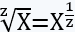 计算一个数的任何根。例如，你可以写 y = x ** (1 / 3) 来计算 x 的立方根，或者 y = x ** (1 / 5) 来计算 x 的五次根。

#### 练习 12.1-1 在 Python 中表示数学表达式

以下哪个 Python 语句正确地表示了以下数学表达式？

.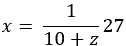

i)x = 1 * 27 / 10 + z

ii)x = 1 · 27 / (10 + z)

iii)x = 27 / 10 + z

iv)x = 27 / (10 + z)

v)x = (1 / 10 + z) * 27

vi)x = 1 / ((10 + z) * 27)

vii)x = 1 / (10 + z) * 27

viii)x = 1 / (10 + z) / 27

解决方案

i) 错误。由于乘法和除法在加法之前执行，这相当于 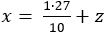。

ii) 错误。必须使用星号进行乘法。

iii) 错误。由于除法在加法之前执行，这相当于 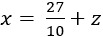。

iv) 正确。这相当于 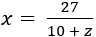。

v) 错误。在括号内，除法在加法之前执行。这相当于 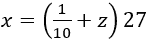。

vi) 错误。括号内的运算首先执行，这相当于 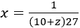

vii) 正确。除法在乘法之前执行（从左到右）。首先计算 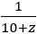，然后，将结果乘以 27。

viii) 错误。这相当于 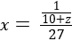

#### 练习 12.1-2 在 Python 中编写数学表达式

编写一个 Python 程序来计算数学表达式

.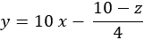

解决方案

首先，你必须区分数据输入和输出结果。显然，输出结果分配给 y，用户必须输入 x 和 z 的值。这个练习的解决方案如下所示。

 file_12.1-2

x = float(input())

z = float(input())

y = 10 * x - (10 - z) / 4

print("结果是:", y)

#### 练习 12.1-3 在 Python 中编写复杂的数学表达式

编写一个 Python 程序，计算以下数学表达式

.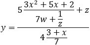

假设用户只为 x、w 和 z 输入正值。

解答

哎呀！现在表达式更复杂了！实际上，它要复杂得多！所以，让我们看看一个相当不同的方法。主要思想是将复杂表达式分解成更小、更简单的表达式，并将每个子结果分配给临时变量。最后，你可以用所有这些临时变量构建原始表达式！这种方法将在下面介绍。

 file_12.1-3a

x = float(input())

w = float(input())

z = float(input())

temp1 = 3 * x ** 2 + 5 * x + 2

temp2 = 7 * w + 1 / z

temp3 = (3 + x) / 7

分子 = 5 * temp1 / temp2 + z

分母 = 4 * temp3

y = 分子 / 分母

print("结果是:", y)

你可能会说，“好吧，但我浪费了这么多变量，而且众所周知，每个变量都是主内存的一部分。我如何将原始表达式写在一行中并浪费更少的内存？”

这项工作可能对高级程序员来说是小菜一碟，但对你呢？对于一个新手程序员呢？

下一种方法将帮助您编写即使是最复杂的数学表达式也不会出现任何语法或逻辑错误！规则非常简单。“在将复杂表达式分解成更小、更简单的表达式并将每个子结果分配给临时变量之后，从后往前开始，用分配的表达式替换每个变量。但要注意！当你用分配的表达式替换一个变量时，你必须始终将表达式放在括号内！”

感到困惑吗？不要！实际上操作起来更容易。让我们尝试重写之前的 Python 程序。从后往前，用分配的表达式替换变量分子和分母。结果是

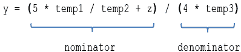

注意添加的额外括号。

现在，你必须将变量 temp1、temp2 和 temp3 替换为它们分配的表达式，这样一行表达式就完成了！

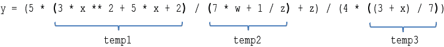

虽然最后看起来可能很吓人，但其实并不难，不是吗？

现在可以将 Python 程序重写为

 file_12.1-3b

x = float(input())

w = float(input())

z = float(input())

y = (5 * (3 * x ** 2 + 5 * x + 2) / (7 * w + 1 / z) + z) / (4 * ((3 + x) / 7))

print("结果是:", y)

### 12.2 复习练习

完成以下练习。

1)将第一个表中的每个元素与第二个表中的一个或多个元素匹配。

| 表达式 | 表达式 |
| --- | --- |
| i) 5 / x ** 2 * y + x ** 3 | a) 5 * y / x ** 2 + x ** 3 |
| ii) 5 / (x ** 3 * y) + x ** 2 | b) 5 * y / x * x + x ** 3 |
|   | c) 5 / (x * x * x * y) + x * x |
|   | d) 5 / (x * x * x) * y + x * x |
|   | e) 5 * y / (x * x) + x * x * x |
|   | f) 1 / (x * x * x * y) * 5 + x * x |
|   | g) y / (x * x) * 5 + x ** 3 |
|   | h) 1 / (x * x) * 5 * y + x / 1 * x * x |

2)使用一行代码将以下数学表达式在 Python 中编写出来。

i)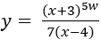

ii)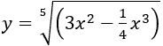

iii)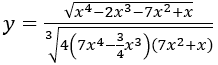

iv)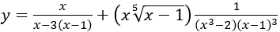

v)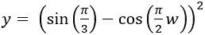

vi)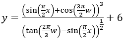

3)编写一个 Python 程序，提示用户输入 x 的值，然后计算并显示以下数学表达式的结果。

.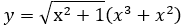

4)编写一个 Python 程序，提示用户输入 x 的值，然后计算并显示以下数学表达式的结果。

.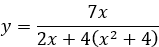

建议：尝试将表达式写在一行代码中。

5)编写一个 Python 程序，提示用户输入 x 和 w 的正值，然后计算并显示以下数学表达式的结果。

.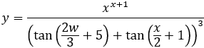

建议：尝试将表达式写在一行代码

6)编写一个 Python 程序，提示用户输入 x 和 w 的正值，然后计算并显示以下数学表达式的结果。

.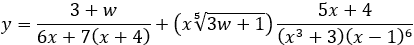

建议：尝试将表达式写在一行代码。

7)编写一个 Python 程序，提示用户输入 x 和 w 的正值，然后计算并显示以下数学表达式的结果。

.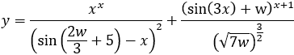

建议：尝试将表达式写在一行代码

8)编写一个 Python 程序，提示用户输入三角形的三边长度 A、B 和 C，然后计算并显示三角形的面积。你可以使用近 2000 年前就为人所知的海伦公式！

.

其中 S 是半周长 
