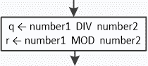

## 第十三章

带有商和余数的练习

### 13.1 简介

在整数除法中，可能需要使用商和余数的哪些类型的问题？虽然这个问题可能没有简单的答案，但商和余数可以用来：

►将一个数字拆分为单独的数字

►检查一个整数是奇数还是偶数

►检查一个数是否是另一个数的倍数

►将经过的时间（以秒为单位）转换为小时、分钟和秒

►将金额（以美元为单位）转换为 100 美元纸币、50 美元纸币、20 美元纸币等数量

►计算最大公约数

►确定一个数是否是回文数

►计算一个数字中数字的数量

►确定一个特定数字在数字中出现的次数

当然，这些只是一些用途，你肯定可以找到更多。接下来，你将看到一些利用整数除法商和余数的练习。

#### 练习 13.1-1 计算整数除法的商和余数

编写一个 Python 程序，提示用户输入两个整数，然后计算整数除法的商和余数。

解答

你可以使用 Python 的 ( // ) 和 ( % ) 运算符。前者执行整数除法并返回整数商，而后者执行整数除法并返回整数余数。解决方案在此处展示。

 file_13.1-1a

number1 = int(input("Enter first number: "))

number2 = int(input("Enter second number: "))

q = number1 // number2

r = number1 % number2

print("Integer Quotient:", q, "\nInteger Remainder:", r)

在流程图中，为了计算整数除法的商和余数，你可以使用流行的 DIV 和 MOD 运算符。以下是一个示例。

.

更“Pythonic”的方法是使用 divmod() 函数，如下面的示例所示。

 file_13.1-1b

number1 = int(input("Enter first number: "))

number2 = int(input("Enter second number: "))

q, r = divmod(number1, number2)

print("Integer Quotient:", q, "\nInteger Remainder:", r)

#### 练习 13.1-2 求数字之和

编写一个 Python 程序，提示用户输入一个四位数，然后计算其数字之和。

解答

在这里你应该记住的是，像这样的语句

number = int(input("Enter a four-digit integer: "))

将用户提供的四位数分配给一个单独的变量，number，而不是分配给四个单独的变量。因此，在用户输入四位数后，程序必须将整数拆分为其四个数字，并将每个数字分配给一个单独的变量。然后它可以计算这些四个变量的和，得到所需的结果。有两种方法可用。

第一种方法

让我们尝试通过一个算术示例来理解第一种方法。以数字 6753 为例。

| 第一位数字 = 6 | 如果使用 ( // ) 运算符将用户提供的数字除以 1000，则可以隔离第一位数字 digit1 = 6753 // 1000 |
| --- | --- |
| 剩余数字 = 753 | 如果再次将用户提供的数字除以 1000，这次使用 ( % ) 运算符来获取整数余数 r = 6753 % 1000，则可以隔离剩余的数字 |
| 第二位数字 = 7 | 如果使用 ( // ) 运算符将剩余的数字除以 100，则可以隔离第二位数字 digit2 = 753 // 100 |
| 剩余数字 = 53 | 现在的剩余数字是 r = 753 % 100 |
| 第三位数字 = 5 | 如果使用 ( // ) 运算符将剩余的数字除以 10，则可以隔离第三位数字 digit3 = 53 // 10 |
| 第四位数字 = 3 | 最后剩下的数字，恰好是第四位数字，是 digit4 = 53 % 10 |

解决此算法的 Python 程序如下所示。

 file_13.1-2a

number = int(input("输入一个四位整数："))

digit1 = number // 1000

r = number % 1000

digit2 = r // 100

r = r % 100

digit3 = r // 10

digit4 = r % 10

total = digit1 + digit2 + digit3 + digit4

print(total)

你刚才看到的程序的跟踪表如下所示。

| 步骤 | 语句 | 备注 | number | digit1 | digit2 | digit3 | digit4 | r | total |
| --- | --- | --- | --- | --- | --- | --- | --- | --- | --- |
| 1 | number = int(input("Enter … | 用户输入 6753 | 6753 | ? | ? | ? | ? | ? | ? |
| 2 | digit1 = number // 1000 |   | 6753 | 6 | ? | ? | ? | ? | ? |
| 3 | r = number % 1000 |   | 6753 | 6 | ? | ? | ? | 753 | ? |
| 4 | digit2 = r // 100 |   | 6753 | 6 | 7 | ? | ? | 753 | ? |
| 5 | r = r % 100 |   | 6753 | 6 | 7 | ? | ? | 53 | ? |
| 6 | digit3 = r // 10 |   | 6753 | 6 | 7 | 5 | ? | 53 | ? |
| 7 | digit4 = r % 10 |   | 6753 | 6 | 7 | 5 | 3 | 53 | ? |
| 8 | total = digit1 + digit2 + digit3 + digit4 |   | 6753 | 6 | 7 | 5 | 3 | 53 | 21 |
| 9 | print(total) | 它显示：21 |

为了进一步帮助你，下面是一个通用的 Python 程序，可以用来分割任何给定的整数。由于程序长度取决于数字的个数 N，你只需要编写 N-1 对语句。

number = int(input("Enter an N-digit integer: "))

digit1 = number // 10^(N-1)

r = number % 10^(N-1)

digit2 = r // 10^(N-2)

r = r % 10^(N-2)

.

.

digit(N-2) = r // 100

r = r % 100

digit(N-1) = r // 10

digit(N) = r % 10

例如，如果你想分割一个六位整数，你需要编写五对如程序中所示的状态语句。

 file_13.1-2b

number = int(input("输入一个六位整数："))

digit1 = number // 100000

r = number % 100000

digit2 = r // 10000

r = r % 10000

digit3 = r // 1000

r = r % 1000

digit4 = r // 100

r = r % 100

digit5 = r // 10

digit6 = r % 10

print(digit1, digit2, digit3, digit4, digit5, digit6)

这种方法，然而，可以通过使用 divmod() 函数进行一点改进。

 file_13.1-2c

number = int(input("请输入一个六位数整数："))

digit1, r = divmod(number, 100000)

digit2, r = divmod(r, 10000)

digit3, r = divmod(r, 1000)

digit4, r = divmod(r, 100)

digit5, digit6 = divmod(r, 10)

print(digit1, digit2, digit3, digit4, digit5, digit6)

第二种方法

对于一个四位数的给定整数，第一种方法执行了三对除法——首先除以 1000，然后除以 100，最后除以 10——从左到右隔离数字。相比之下，第二种方法中的三对除法都是除以 10，从右到左隔离数字。再次深入探讨这种方法，让我们用一个算术例子来说明。考虑相同的用户提供的数字：6753。

| 第四位数字 = 3 | 如果您使用(%)运算符将用户提供的数字除以 10，以获取整数余数 digit4 = 6753 % 10，可以隔离第四位数字 |
| --- | --- |
| 剩余数字 = 675 | 如果您再次将用户提供的数字除以 10，这次使用(//)运算符来获取整数商 r = 6753 // 10，可以隔离剩余的数字 |
| 第三位数字 = 5 | 如果您使用(%)运算符将剩余的数字除以 10，以获取整数余数 digit3 = 675 % 10，可以隔离第三位数字 |
| 剩余数字 = 67 | 现在的剩余数字是 r = 675 // 10 |
| 第二位数字 = 7 | 如果您使用(%)运算符将剩余的数字除以 10，以获取整数余数 digit2 = 67 % 10，可以隔离第二位数字 |
| 第一位数字 = 6 | 最后剩下的数字，恰好是第一位数字，是 digit1 = 67 // 10 |

这里展示了该算法的 Python 程序。

 file_13.1-2d

number = int(input("请输入一个四位数整数："))

digit4 = number % 10

r = number // 10

digit3 = r % 10

r = r // 10

digit2 = r % 10

digit1 = r // 10

total = digit1 + digit2 + digit3 + digit4

print(total)

为了进一步帮助您，下面是一个通用的 Python 程序，可以用来分割任何给定的整数。这个程序使用第二种方法。同样，由于您程序的长度取决于数字的个数 N，您只需编写 N-1 对语句。

number = int(input("请输入一个 N 位数整数："))

digit(N) = number % 10

r = number // 10

digit(N-1) = r % 10

r = r // 10

.

.

.

digit3 = r % 10

r = r // 10

digit2 = r % 10

digit1 = r // 10

例如，如果您想分割一个五位数整数，您必须使用程序中显示的四对语句。

 file_13.1-2e

number = int(input("请输入一个五位数整数："))

digit5 = number % 10

r = number // 10

digit4 = r % 10

r = r // 10

digit3 = r % 10

r = r // 10

digit2 = r % 10

digit1 = r // 10

print(digit1, digit2, digit3, digit4, digit5)

与前面的例子一样，这种方法可以稍微改进，使用 divmod()函数。

 file_13.1-2f

number = int(input("请输入一个五位数整数："))

r, digit5 = divmod(number, 10)

r, digit4 = divmod(r, 10)

r, digit3 = divmod(r, 10)

digit1, digit2 = divmod(r, 10)

print(digit1, digit2, digit3, digit4, digit5)

#### 练习 13.1-3 显示经过的时间

编写一个 Python 程序，提示用户输入一个表示经过时间的整数（以秒为单位），然后以“DD 天 HH 小时 MM 分钟和 SS 秒”的格式显示它。例如，如果用户输入数字 700005，则必须显示消息“8 天 2 小时 26 分钟和 45 秒”。

解答

如您可能已经知道，一分钟有 60 秒，一小时有 3600 秒（60 × 60），一天有 86400 秒（3600 × 24）。让我们尝试使用您在之前练习中学到的第一种方法来分析数字 700005。

| 天数 = 8 | 如果您使用整数除法运算符（//）将用户提供的整数除以 86400，可以得到天数 days = 700005 // 86400，从而可以单独计算出天数 |
| --- | --- |
| 剩余秒数 = 8805 | 如果您再次将用户提供的整数除以 86400，这次使用取模运算符（%），可以得到余数 r = 700005 % 86400，从而可以单独计算出剩余秒数 |
| 小时数 = 2 | 如果您使用整数除法运算符（//）将剩余秒数除以 3600，可以得到小时数 hours = 8805 // 3600 |
| 剩余秒数 = 1605 | 现在的剩余秒数是 r = 8805 % 3600 |
| 分钟数 = 26 | 如果您使用整数除法运算符（//）将剩余秒数除以 60，可以得到分钟数 minutes = 1605 // 60 |
| 秒数 = 45 | 最后的余数，恰好是剩余的秒数，是 seconds = 1605 % 60 |

此算法的 Python 程序如下。

 file_13.1-3a

number = int(input("Enter a period of time in seconds: "))

days, r = divmod(number, 86400)   # 60 * 60 * 24 = 86400

hours, r = divmod(r, 3600)      # 60 * 60 = 3600

minutes, seconds = divmod(r, 60)

print(days, "day(s)", hours, "hour(s)")

print(minutes, "minute(s) and", seconds, "second(s)")

您也可以使用之前练习中的第二种方法来解决此题。您只需首先除以 60，然后再次除以 60，最后除以 24，如下所示。

 file_13.1-3b

number = int(input("Enter a period of time in seconds: "))

r, seconds = divmod(number, 60)

r, minutes = divmod(r, 60)

days, hours = divmod(r, 24)

print(days, "day(s)", hours, "hour(s)")

print(minutes, "minute(s) and", seconds, "second(s)")

#### 练习 13.1-4 反转一个数字

编写一个 Python 程序，提示用户输入一个三位整数，然后构建并显示其反转。例如，如果用户输入数字 875，则程序必须显示 578。

解答

要单独计算出用户提供的整数的三个数字，您可以使用第一种或第二种方法。之后，此练习中的唯一困难是构建反转的数字。

以数字 875 为例。隔离后的三位数字将是：

digit1 = 8

digit2 = 7

digit3 = 5

然后你可以通过简单地计算乘积的和来构建反转的数字：

digit3 × 100 + digit2 × 10 + digit1 × 1 = 5 × 100 + 7 × 10 + 8 × 1 = 578

为了改变一下，让我们使用第二种方法来分割用户提供的数字。Python 程序将如下所示。

 file_13.1-4

number = int(input("请输入一个三位整数："))

digit3 = number % 10    # 这是右边的数字

r = number // 10

digit2 = r % 10         # 这是中间的数字

digit1 = r // 10        # 这是左边的数字

reversedNumber = digit3 * 100 + digit2 * 10 + digit1

print(reversedNumber)

### 13.2 复习练习

完成以下练习。

1)编写一个 Python 程序，提示用户输入任何整数，然后将其最后一位数字乘以 8 并显示结果。

提示：没有必要知道确切的数字位数。你可以使用取模 10 操作来隔离任何整数的最后一位数字。

2)编写一个 Python 程序，提示用户输入一个五位数整数。程序必须然后找到并显示原始数字和其反转的和。例如，如果用户输入数字 32675，程序必须显示消息“32675 + 57623 = 90298”。

3)编写一个 Python 程序，提示用户输入一个整数，然后当数字是奇数时显示 1；否则显示 0。尽量不使用任何决策控制结构，因为你还没有学习过它们！

4)编写一个 Python 程序，提示用户输入一个整数，然后当数字是偶数时显示 1；否则显示 0。尽量不使用任何决策控制结构，因为你还没有学习过它们！

5)编写一个 Python 程序，提示用户输入表示已过时间的秒数的整数，然后以“WW 周（s）DD 天（s）HH 小时（s）MM 分钟（s）和 SS 秒（s）”的格式显示它。例如，如果用户输入数字 2000000，必须显示消息“3 周（s）2 天（s）3 小时（s）33 分钟（s）和 20 秒（s）”。

6)在自动柜员机（ATM）银行机器中，有$20、$10、$5 和$1 的纸币。编写一个 Python 程序，提示用户输入他们想要取出的金额（使用整数值），然后显示 ATM 必须给出的最少纸币数量。例如，如果用户输入$76，程序必须显示消息“3 张$20 的纸币，1 张$10 的纸币，1 张$5 的纸币和 1 张$1 的纸币”。

7)一个机器人到达月球以执行一些实验。机器人的每一步长为 25 英寸。编写一个 Python 程序，提示用户输入机器人迈出的步数，然后计算并显示机器人行走的距离（以英里、英尺、码和英寸为单位）。例如，如果行走的距离是 100000 英寸，程序必须显示消息“1 英里(s)，1017 码(s)，2 英尺/feet，和 4 英寸(es)”。

已知

►1 英里 = 63360 英寸

►1 码 = 36 英寸

►1 英尺 = 12 英寸
