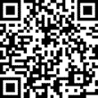
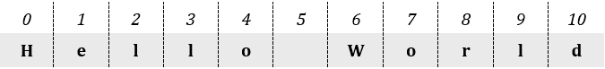
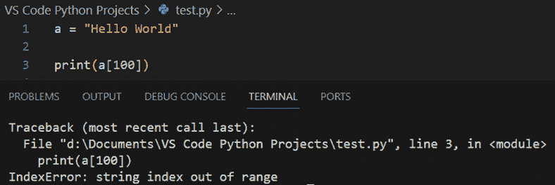
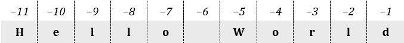
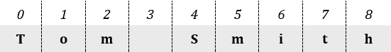

## 第十四章

操作字符串

### 14.1 简介

通常来说，字符串是你可以用键盘输入的任何内容，包括字母、符号（如 &、* 和 @）和数字。在 Python 中，字符串总是用单引号或双引号括起来。

下面是一个使用字符串的 Python 程序。

a = "双引号括起来的任何内容都是字符串，即使是数字："

b = "3, 54, 731"

print(a, b)

print("你甚至可以像这样混合字母、符号和数字：")

print("3 + 4 等于 7")

许多程序处理的数据都是以字符串（文本）的形式出现的。字符串无处不在——从文字处理器到网页浏览器，再到短信程序。本书中的许多练习实际上大量使用了字符串。尽管 Python 支持许多用于操作字符串的有用函数和方法，但本章仅涵盖本书目的所需的那些函数和方法。然而，如果你需要更多信息，你可以访问以下地址之一：

[`tinyurl.com/ybzmkpu3`](https://tinyurl.com/ybzmkpu3)

[`docs.python.org/3.13/library/stdtypes.html#string-methods`](https://docs.python.org/3.13/library/stdtypes.html#string-methods)

.

当需要操作字符串时，可以使用 Python 字符串函数和方法，例如，从字符串中隔离一些字符，移除可能存在于其开头处的空格，或将所有字符转换为大写。

函数和方法不过是解决小问题的小程序。

### 14.2 字符串中字符的位置

让我们在下面的例子中使用文本“Hello World”。这个字符串由 11 个字符组成（包括两个单词之间的空格字符）。Python 假设第一个字符位于位置 0，第二个字符位于位置 1，以此类推。每个字符的位置如下所示。

空格和其他字符一样，是一个字符。只是因为没有人能看到它，并不意味着它不存在！

### 14.3 有用的字符串函数/方法（子程序）以及更多

修剪

修剪是从字符串的开始或结束处移除空白字符的过程。

在修剪过程中移除的一些空白字符包括：

►一个普通空格

►一个制表符

►一个新行（换行符）

►一个回车符

例如，你可以修剪用户错误地输入在字符串开头或结尾的任何空格。

你可以使用以下方法来修剪字符串

subject.strip()

此方法返回一个副本，其中从主题字符串的开始和结束处移除了任何空白字符。

示例

 file_14.3a

a = "      Hello      "

b = a.strip()

print(b, "Poseidon!")    #它显示：Hello Poseidon!

print(a, "Poseidon!")    #它显示：       Hello       Poseidon!

注意，变量 a 的内容未更改。如果您确实需要更改其内容，可以使用语句 a = a.strip()

字符串替换

subject.replace(search, replace)

此方法在 subject 中搜索并返回一个副本，其中所有搜索字符串的实例都被替换字符串替换。

示例

 file_14.3b

a = "I am newbie in Java. Java rocks!"

b = a.replace("Java", "Python")

print(b)            #它显示：I am newbie in Python. Python rocks

print(a)            #它显示：I am newbie in Java. Java rocks

注意，变量 a 的内容未更改。如果您确实需要更改其内容，可以使用语句 a = a.replace("Java", "Python")

计算字符数

len(subject)

此函数返回 subject 的长度，换句话说，subject 由多少个字符组成。

示例

 file_14.3c

a = "Hello Olympians!"

print(len(a))           #它显示：16

b = "I am newbie in Python"

k = len(b)

print(k)                #它显示：21

一个字符包括您可以使用键盘输入的任何内容，例如字母、符号、数字和空格字符。

查找字符串位置

subject.find(search)

此方法返回搜索在 subject 中的首次出现的数值位置，如果未找到搜索项，则返回-1。

示例

 file_14.3d

a = "I am newbie in Python. Python rocks!"

i = a.find("newbie")

print(i)                #它显示：5

print(a.find("Python")) #它显示：15

print(a.find("Java"))   #它显示：-1

第一个字符位于位置 0。

转换为小写

subject.lower()

此方法返回一个副本，其中字符串 subject 的所有字母都被转换为小写。

示例

 file_14.3e

a = "My NaMe is JohN"

b = a.lower()

print(b)            #它显示：my name is john

print(a)            #它显示：My NaMe is JohN

注意，变量 a 的内容未更改。如果您确实需要更改其内容，可以使用语句 a = a.lower()

转换为大写

subject.upper()

此方法返回一个副本，其中字符串 subject 的所有字母都被转换为大写。

示例

 file_14.3f

a = "My NaMe is JohN"

b = a.upper()

print(b)            #它显示：MY NAME IS JOHN

print(a)            #它显示：My NaMe is JohN

注意，变量 a 的内容未更改。如果您确实需要更改其内容，可以使用语句 a = a.upper()

示例

 file_14.3g

a = "I am newbie in Java. Java rocks!"

b = a.replace("Java", "Python").upper()

print(b)            #它显示：I AM NEWBIE IN PYTHON. PYTHON ROCKS

注意方法 replace() 是链接到方法 upper() 的。第一个方法的结果被用作第二个方法的主题。这种写作风格是大多数程序员更喜欢遵循的，因为它有助于节省大量的代码行。当然，你可以链接任意多的方法，但如果链接太多，没有人会理解你的代码。

从字符串中检索单个字符

subject[index]

这返回位于 subject 指定索引处的字符。如前所述，字符串索引从 0 开始。你可以使用索引 0 来访问第一个字符，索引 1 来访问第二个字符，依此类推。最后一个字符的索引是字符串长度减 1。

表示法 subject[index] 被称为“子串表示法”。子串表示法允许你引用字符串中的单个字符。

示例

 file_14.3h

a = "Hello World"

print(a[0])         #它显示第一个字母：H

print(a[6])         #它显示：W

print(a[10])        #它显示：d

注意，“Hello”和“World”之间的空格也被视为一个字符。因此，字母 W 存在于位置 6，而不是位置 5。

如果你尝试使用无效的索引，例如大于字符串长度的索引，Python 会抛出一个错误信息，如图 14–1 所示。

图 14–1 表示无效索引的错误信息

字符串索引必须在 0 到字符串长度减 1 的范围内。

如果你想从字符串的末尾开始计数（而不是从开头），你可以使用负索引。例如，索引为 −1 指的是最右边的字符。

在文本“Hello World”中，每个字符的位置（使用负索引）在此显示。

示例

 file_14.3i

a = "Hello World"

print(a[-1])      #它显示最后一个字母：d

print(a[-3])      #它显示：r

print(a[-11])     #它显示：H

在 Python 中从字符串中提取单个字符的另一种方法是解包到单独的变量中。

示例

 file_14.3j

name = "Zeus"

a, b, c, d = name

print(a)     #它显示：Z

print(b)     #它显示：e

print(c)     #它显示：u

print(d)     #它显示：s

这种最后的方法要求你事先知道字符串中有多少个字符。如果你提供的变量数量与字符串中的字符数量不匹配，Python 会抛出一个错误。

获取字符串的一部分（切片表示法）

subject[[beginIndex] : [endIndex] [: step]]

这种表示法返回主题的一部分。具体来说，它返回从位置 beginIndex 开始，直到但不包括 endIndex 的子字符串，或者直到主题的末尾，以先到者为准。两个参数 beginIndex 和 endIndex 都是可选的。如果省略 beginIndex，则返回从位置 0 开始，直到但不包括 endIndex 的子字符串。如果省略 endIndex，则返回从位置 beginIndex 开始直到主题末尾的子字符串。

最后一个参数 step 也是可选的。如果省略，则默认值为 1。如果提供，则定义每次从原始字符串中检索字符后要前进的字符数。

"Python 中的“切片”是一种选择序列（此处为字符串）中一系列元素（此处为字符）的机制。

示例

file_14.3k

a = "Hello World"

print(a[7:9])       #它显示：or

print(a[7:900])     #它显示：orld

print(a[4:10:2])    #步长设置为 2。它显示：oWr

print(a[7:])        #它显示：orld

print(a[:3])        #它显示：Hel

如果你想要从字符串的末尾开始计数（而不是从开头），请使用负索引。

示例

file_14.3l

a = "Hello World"

print(a[-4:-2])     #它显示：or

print(a[-3:])       #它显示：rld

print(a[:-3])       #它显示：Hello Wo

print(a[3:-2])      #它显示：lo Wor

将数字转换为字符串

str(number)

这个函数返回数字的字符串版本，换句话说，它将一个数字（实数或整数）转换为字符串。

示例

file_14.3m

age = int(input("请输入你的年龄："))

newAge = age + 10

message = "You 'll be " + str(newAge) + " years old in 10 years from now!"

print(message)

#### 练习 14.3-1 显示字符串的反向

编写一个 Python 程序，提示用户输入任何四个字母的字符串，然后显示其反向内容。例如，如果输入的字符串是“Zeus”，则程序必须显示“sueZ”。

解决方案

下面将介绍三种方法。

第一种方法

假设用户的输入被分配给变量 s。你可以使用 s[3] 访问第四个字符，使用 s[2] 访问第三个字符，以此类推。下面的 Python 程序展示了这一点。

file_14.3-1a

s = input("请输入一个四个字母的单词：")

sReversed = s[3] + s[2] + s[1] + s[0]

print(sReversed)

第二种方法

此方法将四个字母解包到四个单独的变量中，如下所示。

file_14.3-1b

s = input("请输入一个四个字母的单词：")

letter1, letter2, letter3, letter4 = s

sReversed = letter4 + letter3 + letter2 + letter1

print(sReversed)

第三种方法

此方法使用切片表示法和 step 参数的负值 -1。

file_14.3-1c

s = input("请输入一个四个字母的单词：")

sReversed = s[::-1]

print(sReversed)

这种方法的优点是用户可以输入任何字符串，无论多短或多长！

#### 练习 14.3-2：交换名字的顺序

编写一个 Python 程序，提示用户输入一个字符串，包含他们的名字和姓氏。最后，程序必须改变两个名字的顺序。

解决方案

这个练习与你在练习 8.1-3 和 8.1-4 中学到的练习不同，后者交换了两个变量的数值。在这个练习中，名字和姓氏都输入在一个单独的字符串中，因此程序必须首先分割字符串，并将每个名字分配给不同的变量。如果你能这样做，然后你就可以以不同的顺序重新连接它们。

让我们通过一个例子来尝试理解这个练习。必须分割的字符串及其各个字符的位置在这里显示。

将第一个名字和最后一个名字在视觉上分开的字符是它们之间的空格字符。问题是这个字符并不总是位于位置 3。有人可能有像“Tom”这样的短名字，而另一个人可能有像“Robert”这样的长名字。因此，你需要一种能够找到空格字符位置的方法，而不管字符串的内容如何。

方法 find()正是你所需要的！如果你用它来查找字符串“Tom Smith”中空格字符的位置，它返回值 3。但如果你用它来查找另一个字符串中的空格字符，比如“Angelina Brown”，它返回的值是 8。

数字 3 不仅仅表示空格字符所在的位置。它还代表单词“Tom”包含的字符数！同样的情况也适用于返回字符串“Angelina Brown”的值 8。它既表示空格字符所在的位置，也代表单词“Angelina”包含的字符数！

该算法的 Python 程序如下所示。

 file_14.3-2

fullName = input("Enter your full name: ")

#找到空格字符的位置。这也是第一个名字包含的字符数

#第一个名字包含的字符数

spacePos = fullName.find(" ")

#从 0 位置开始获取 spacePos 个字符

name1 = fullName[:spacePos]

#从 spacePos + 1 位置开始获取剩余的字符

name2 = fullName[spacePos + 1:]

fullName = name2 + " " + name1

print(fullName)

表示法 subject[beginIndex : endIndex]返回 subject 的一部分。具体来说，它返回从 beginIndex 位置开始的子串，直到但不包括 endIndex 位置。

请注意，这个程序不能应用于像“Maria Teresa García Ramírez de Arroyo”这样的西班牙名字。原因很明显！

#### 练习 14.3-3：创建登录 ID

编写一个 Python 程序，提示用户输入他们的姓氏，然后从名字的前四个字母（小写）和一个三位随机整数创建一个登录 ID。

解决方案

要创建一个随机整数，可以使用 randrange() 函数。由于你需要一个三位数的随机整数，范围必须在 100 到 999 之间。

该算法的 Python 程序如下所示。

 file_14.3-3

from random import randrange

lastName = input("Enter last name: ")

# 获取 100 到 999 之间的随机整数

randomInt = randrange(100, 1000)

print(lastName[:4].lower() + str(randomInt))

注意，表示法 lastName[:4] 返回从位置 0 开始，到但不包括位置 4 的子串。

#### 练习 14.3-4 创建随机单词

编写一个 Python 程序，显示一个由三个字母组成的随机单词。

解决方案

要创建一个随机单词，你需要一个包含所有 26 个英文字母的变量。然后你可以使用 randrange() 函数来选择一个介于位置 0 和 25 之间的随机字母。

该算法的 Python 程序如下所示。

 file_14.3-4a

from random import randrange

alphabet = "abcdefghijklmnopqrstuvwxyz"

randomWord = alphabet[randrange(26)] + alphabet[randrange(26)] + alphabet[randrange(26)]

print(randomWord)

注意，randrange(26) 函数被调用了三次，每次都可能返回一个介于 0 和 25 之间的不同随机整数。

你也可以使用 len() 函数来获取变量 alphabet 的长度，如下所示。

 file_14.3-4b

from random import randrange

alphabet = "abcdefghijklmnopqrstuvwxyz"

randomWord = alphabet[randrange(len(alphabet))] + \

> > alphabet[randrange(len(alphabet))] + \
> > 
> > alphabet[randrange(len(alphabet))]

print(randomWord)

你可以在一个子程序中嵌套另一个子程序。注意函数 len() 是嵌套在函数 randrange() 中的。内部（嵌套）函数的结果被用作外部函数的参数。

在 Python 中，你可以使用每个行尾的回车符（\）将长行拆分为多行（除了最后一行）。

#### 练习 14.3-5 求数字之和

编写一个 Python 程序，提示用户输入一个三位整数，然后计算其数字之和。在不使用整数商（//）和整数余数（%）运算符的情况下解决这个练习。

解决方案

现在你可能会想知道为什么这个练习被放在这个章节，这个章节主要关注字符串操作。你可能会争辩说，你已经知道如何将三位整数拆分为其三个数字，并将每个数字分配给一个单独的变量，就像你在第十三章学习的方法一样，使用了整数商（//）和整数余数（%）运算符。那么，为什么这个练习又在这里讨论呢？

原因是 Python 是一种非常强大的语言，你可以使用它的魔法力量以完全不同的方式解决这个练习。主要思想是将用户提供的整数转换为字符串类型。

第一种方法

在这种方法中，每个数字（每个字符）被分配给单独的变量。

 file_14.3-5a

number = int(input("输入一个三位整数："))

sNumber = str(number)

digit1 = sNumber[0]

digit2 = sNumber[1]

digit3 = sNumber[2]

total = int(digit1) + int(digit2) + int(digit3)

print(total)

由于变量 digit1、digit2 和 digit3 是字符串类型，在将它们的和找到变量 total 中之前，需要使用 int() 函数将它们转换为整数。

第二种方法

在这种方法中，每个数字（每个字符）都被解包到单独的变量中。

 file_14.3-5b

number = int(input("输入一个三位整数："))

digit1, digit2, digit3 = str(number)

total = int(digit1) + int(digit2) + int(digit3)

print(total)

### 14.4 复习问题：真/假

对以下每个陈述选择真或假。

1) 任何你可以用键盘输入的东西都是字符串。

2) 字符串必须用括号括起来。

3) 短语“Hi there!”包含 8 个字符。

4) 在短语“Hi there!”中，字母“t”位于位置 3。

5) 语句 `y = a[1]` 将变量 a 中包含的字符串的第二个字符赋给变量 y。

6) 以下代码片段满足确定性的属性。

a = "Hello"

y = a[5]

7) 去除空白是移除字符串开头或结尾的空白字符的过程。

8) 语句 `y = "Hello            Aphrodite".strip()` 将值“HelloAphrodite”赋给变量 y。

9) 语句 `print("Hi there!".replace("Hi", "Hello"))` 显示的消息是“Hello there!”。

10) 以下代码片段将值 4 赋予变量 index。

a = "Hi there"

index = a.find("the")

11) 语句 `print("hello there!".upper())` 显示的消息是“Hello There!”。

12) 以下代码片段显示消息“Hello there!”。

a = "Hello there!"

print(a[:])

13) 语句 `print(a[:len(a)])` 显示变量 a 的某些字母。

14) 语句 `print(a)` 等价于语句 `print(a[:len(a):])`。

15) 以下代码片段显示单词“HELLO”。

y = "hello there!"

print(y[:5].upper())

16) 语句 `print(a[len(a) - 1])` 等价于语句 `print(a[−1])`。

17) 以下代码片段显示值 23。

a = 2023

print(str(a)[2:4])

### 14.5 复习问题：多项选择题

对以下每个陈述选择正确答案。

1) 以下哪项不是字符串？

a)“Hello there!”

b)“13”

c)“13.5”

d) 以上所有都是字符串。

2) 在字符串“Hello Zeus!”中，空格字符存在于哪个位置？

a)6

b)5

c)空格不是一个字符。

d)以上都不是

3) 语句 `print(a[len(a) − 2])` 显示

a)变量 a 的最后一个字符。

b) 变量 a 的倒数第二个字符。

c) 该语句无效。

4) 以下语句

y = a.strip().replace("a", "b").replace("w", "y")

等价于以下语句

a) y = a.replace("a", "b").replace("w", "y").strip()

b) y = a.replace("a", "b").strip().replace("w", "y")

c) y = a.strip().replace("w", "y").replace("a", "b")

d) 以上都是

5) 语句 a.replace(" ", "")

a) 在变量 a 中的每个字母之间添加一个空格。

b) 从变量 a 中删除所有空格字符。

c) 清空变量 a。

6) 语句 "Hello ".replace(" ", "") 等价于以下语句

a) "Hello ".replace("", " ")

b) "Hello ".strip()

c) 以上都是

d) 以上都不是

7) 以下代码片段

a = ""

print(len(a))

显示

a) 什么也不做。

b) 1.

c) 0.

d) 该语句无效。

e) 以上都不是

8) 以下代码片段将哪个值赋给变量 Shakespeare？

toBeOrNotToBe = "2b Or Not 2b"

Shakespeare = toBeOrNotToBe.find("b")

a) 1

b) 2

c) 11

d) 以上都不是

9) 以下代码片段做什么？

a = "Hi there"

b = a[a.find(" ") + 1:]

a) 它将单词“Hi”赋给变量 b。

b) 它将一个空格字符赋给变量 b。

c) 它将单词“there”赋给变量 b。

d) 以上都不是

10) 以下代码片段

a = 15

b = 5

print(str(a) + str(b))

显示

a) 155.

b) 10.

c) 15 + 5

d) 以上都不是

### 14.6 复习练习

完成以下练习。

1) 编写一个 Python 程序，创建并显示一个由五个字母组成的随机单词。第一个字母必须是大写字母。

2) 编写一个 Python 程序，提示用户输入他们的名字，然后创建一个由从他们的名字中随机挑选的三个小写字母和一个随机四位数组成的秘密密码。例如，如果用户输入“Vassilis Bouras”，一个秘密密码可能是“sar1359”或“vbs7281”或“bor1459”。秘密密码中不允许有空格字符。

3) 编写一个 Python 程序，提示用户输入一个三位整数，然后将其反转。例如，如果用户输入数字 375，则必须显示数字 573。解决此练习时，不得使用整数商（//）和整数余数（%）运算符。

4) 编写一个 Python 程序，提示用户输入他们的名字、中间名和姓氏，并以以下所有方式显示格式化后的结果。

首字母 MiddleName 姓氏

首字母 M. 姓氏 (其中 M 是中间名首字母)

姓氏 F. (其中 F 是第一个名字的首字母)

此外，程序必须确保无论用户如何输入他们的名字，它都会始终以首字母大写，其余字母小写的方式显示。

例如，假设用户输入以下内容：

名字：Aphrodite

中间名：MARIA

姓氏：boura

程序必须以以下方式显示用户的名字格式：

Aphrodite Maria Boura

Aphrodite M. Boura

Boura A.

5)一些词如“革命性的”和“国际化”的长度非常长，反复书写它们会变得相当累人。在这种情况下，这些词可以用一个特殊的缩写来代替，其制作方法如下：你保留一个词的首字母和尾字母，并在它们之间插入字母的数量。例如，“革命性的”变为“r11y”，“国际化”变为“i18n”。

编写一个 Python 程序，让用户输入一个长词并显示其缩写。
