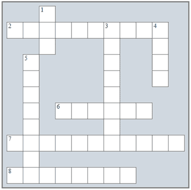

## 在“序列控制结构”中复习

### 复习填字游戏

1)解决以下填字游戏。

横向

2)len()函数返回字符串中的 _______ 数量。

6)你可以使用键盘输入的任何东西。

7)Python 提供了许多现成的 _________。

8)这种控制结构指的是按行执行，语句按顺序执行。

纵向

1)一个空白字符。

3)从字符串的开始或结束处删除空白字符的过程。

4)sin()函数返回一个数的 _______。

5)abs()函数返回一个数的 _________ 值。

### 复习问题

回答以下问题。

1)什么是序列控制结构？

2)序列控制结构可以执行哪些操作？

3)给出一些使用整数除法的商和余数的例子。

4)什么是函数或方法？

5)“链式调用方法”这个术语是什么意思？

6)“嵌套函数”这个术语是什么意思？

7)Python 中的“切片”是什么意思？
