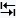
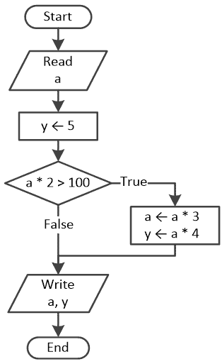
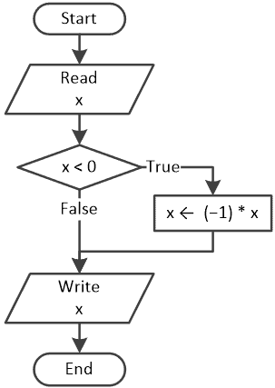

## 第十六章

单一选择决策结构

### 16.1 单一选择决策结构

这是最简单的决策控制结构。它只包括在“True”路径上的一个语句或语句块，如下面的流程图片段所示，以一般形式给出。

如果布尔表达式 Boolean_Expression 评估为 True，则执行结构中的语句或语句块；否则，跳过语句。

Python 语句的一般形式是

if Boolean_Expression:

语句或语句块

注意，语句或语句块缩进了 4 个空格。

在下一个示例中，当用户输入小于 18 的值时，会显示消息“您未成年！”。当用户输入大于或等于 18 的值时，不会显示任何内容。

 file_16.1a

age = int(input("Enter your age: "))

if age < 18:

print("You are underage!")

注意，print()语句缩进了 4 个空格。

在下一个示例中，当用户输入小于 18 的值时，会显示消息“您未成年！”和消息“您需要再等几年”。与之前一样，当用户输入大于或等于 18 的值时，不会显示任何消息。

 file_16.1b

age = int(input("Enter your age: "))

if age < 18:

print("You are underage!")

print("You have to wait for a few more years.")

注意，两个 print()语句都缩进了 4 个空格。

Python 是第一个强制执行缩进的编程语言之一。Python 通过缩进来指定多个语句属于一个组。缩进的组称为“语句块”或“代码块”。在 Python 中，缩进是强制性的。属于代码块的代码必须缩进。例如，所有出现在 if 语句内部的语句都必须向右缩进相同数量的空格；否则，它们不被视为 if 语句的一部分，您可能会收到错误消息。关于代码块语法的两个简单规则要记住：

► 代码块的第一行语句总是以冒号（:）字符结尾。

► 第一行下面的代码必须缩进。

Python 的官方网站建议每个缩进级别使用 4 个空格。如果您需要更多信息，可以访问：

[`tinyurl.com/5zfnzmc6`](https://tinyurl.com/5zfnzmc6)

[`www.python.org/dev/peps/pep-0008`](https://www.python.org/dev/peps/pep-0008)

.

为了缩进文本光标，您可以通过按一次“Tab ”键来代替输入空格字符！

为了缩进一个现有的语句或一组语句，选择它并按“Tab ”键！

为了取消缩进一个语句或一组语句，选择它并按“Shift ↑ + Tab ”键组合！

在 Python 以外的计算机语言中，如 C、C++、C#、Java 或 Visual Basic，缩进不是强制性的，但它对于使代码更容易阅读是非常必要的。它还有助于程序员更容易地学习和理解他人编写的代码。

在下一个例子中，当用户输入名字“宙斯”时，才会显示消息“你是众神之王！”。然而，无论用户输入什么名字，消息“你住在奥林匹斯山上”总是显示。

 file_16.1c

name = input("输入一个奥林匹克运动员的名字：")

if name == "Zeus":

print("你是众神之王！")

print("你住在奥林匹斯山上。")

请注意，最后的 print()语句没有缩进，因此它不属于单分支决策结构的语句块。

新手程序员在编写 Python 程序时，一个常见的错误是将赋值运算符与“等于”运算符混淆。他们经常犯的错误是在实际上想要说 if name == "Zeus"时写成 if name = "Zeus"。

当 if 语句中只使用一个语句时，你可以将其写在一行上，如下所示：

if Boolean_Expression: One_Single_Statement

以下两个例子是等价的。

if x == y: x += 1

print(x)

if x == y:

x += 1

print(x)

#### 练习 16.1-1 跟踪表和单分支决策结构

设计相应的流程图并创建跟踪表，以确定下一个 Python 程序在两次不同执行中的每个步骤中变量的值。

两次执行的输入值分别是（i）10 和（ii）51。

 file_16.1-1

a = int(input())

y = 5

if a * 2 > 100:

a = a * 3

y = a * 4

print(a, y)

解答

流程图如下所示。

每个输入的跟踪表如下所示。

i)对于输入值 10，跟踪表如下所示。

| 步骤 | 语句 | 备注 | a | y |
| --- | --- | --- | --- | --- |
| 1 | a = int(input()) | 用户输入值 10 | 10 | ? |
| 2 | y = 5 |   | 10 | 5 |
| 3 | if a * 2 > 100: | 这评估为 False |
| 4 | print(a, y) | 显示：10 5 |

ii)对于输入值 51，跟踪表如下所示。

| 步骤 | 语句 | 备注 | a | y |
| --- | --- | --- | --- | --- |
| 1 | a = int(input()) | 用户输入值 51 | 51 | ? |
| 2 | y = 5 |   | 51 | 5 |
| 3 | if a * 2 > 100: | 这评估为 True |
| 4 | a = a * 3 |   | 153 | 5 |
| 5 | y = a * 4 |   | 153 | 612 |
| 6 | print(a, y) | 显示：153 612 |

#### 练习 16.1-2 数字的绝对值

设计一个流程图并编写相应的 Python 程序，允许用户输入一个数字，然后显示其绝对值。

解决方案

实际上，有两种方法。第一种方法使用单分支决策结构，而第二种方法使用内置的 abs() 函数。

第一种方法 - 使用单分支决策结构

该方法很简单。如果用户输入一个负值，例如 -5，则该值会改变并显示为 +5。然而，正数或零保持不变。解决方案如下所示的流程图所示。

.

相应的 Python 程序如下所示。

 file_16.1-2a

x = float(input())

if x < 0:

x = (-1) * x

print(x)

第二种方法 - 使用 abs() 函数

在这种情况下，您只需要两行代码，无需任何决策控制结构！

 file_16.1-2b

x = float(input())

print(abs(x))

### 16.2 复习问题：判断题

选择以下每个语句的真或假。

1)当必须执行一系列语句时使用单分支决策结构。

2)您使用单分支决策结构，以便其他程序员更容易理解您的程序。

3)在单分支决策结构中，可能没有任何语句被执行。

4)在流程图中，决策符号代表算法的开始和结束。

5)以下代码在语法上是正确的。

if = 5

x = if + 5

print(x)

6)单分支决策结构使用保留关键字 else。

7)以下代码片段满足确定性的属性。

if b != 3:

x = a / (b - 3)

8)以下 Python 程序满足确定性的属性。

a = float(input())

b = float(input())

if b != 3:

x = a / (b - 3)

print(x)

9)包含决策控制结构且未使用代码缩进的 Python 程序无法由计算机执行。

### 16.3 复习问题：多项选择题

选择以下每个语句的正确答案。

1)当以下情况发生时使用单分支决策结构

a)语句一个接一个地执行。

b)在执行某些语句之前必须做出决定。

c)以上皆非

d)所有上述选项

2)单分支决策结构包括一个语句或语句块。

a)只有错误路径。

b)两条路径。

c)只有当变量 x 包含除 3 以外的值时。

3)在以下代码片段中，

if x == 3:

x = 5

y += 1

执行语句 y += 1

a)只有当变量 x 包含值为 3 的值时。

b)只有当变量 x 包含值为 5 的值时。

c)只有当变量 x 包含除 3 以外的值时。

d)总是。

4)在以下代码片段中，

if x % 2 == 0: y += 1

当执行语句 y += 1 时

a)变量 x 能被 2 整除。

b)变量 x 包含一个偶数。

c)变量 x 不包含一个奇数。

d)所有上述选项

e)以上皆非

5)在以下代码片段中，

x = 3 * y

if x > y: y += 1

语句 y += 1 是

a)总是执行。

b)从不执行。

c)仅在变量 y 包含正值时执行。

d)以上都不是

6)以下程序

x = int(input())

if x < 0:

x = (-1) * x

print(x)

cannot be executed by a computer because

a)它没有使用代码缩进。

b)它包含逻辑错误。

c)以上都不是

### 16.4 复习练习

完成以下练习。

1)识别以下 Python 程序中的语法错误：

x = float(input())

y ← - 5

if x * y / 2 > 20

y =* 1

x += 4 * x²

print(x  y)

2)创建一个跟踪表，以确定以下 Python 程序在两次不同执行中每一步的变量值。然后，设计相应的流程图。

两次执行输入的值分别是（i）10 和（ii）-10。

x = float(input())

y = -5

if x * y / 2 > 20:

y -= 1

x -= 4

if x > 0:

y += 30

x = x ** 2

print(x, ",", y)

3)创建一个跟踪表，以确定以下 Python 程序在两次不同执行中每一步的变量值。然后，设计相应的流程图。

两次执行输入的值分别是（i）-11 和（ii）11。

x = int(input())

y = 8

if abs(x) > 10:

y += x

x -= 1

if abs(x) > 10:

y *= 3

print(x, ",", y)

4)创建一个跟踪表，以确定以下 Python 程序在两次不同执行中每一步的变量值。然后，设计相应的流程图。

两次执行输入的值分别是（i）1，2，3 和（ii）4，2，1。

x = int(input())

y = int(input())

z = int(input())

if x + y > z: x = y + z

if x > y + z: y = x + z

if x > y - z: z = x - z % 2

print(x, ",", y, ",", z)

5)编写一个 Python 程序，提示用户输入一个数字，然后当用户提供的数字是正数时，显示消息“正数”。

6)编写一个 Python 程序，提示用户输入两个数字，然后当两个用户提供的数字都是正数时，显示消息“两个都是正数”。

7)编写一个 Python 程序，提示用户输入他们的年龄，然后当用户提供的年龄大于 14 岁时，显示消息“您可以在堪萨斯州（美国）开车”。

8)编写一个 Python 程序，提示用户输入一个字符串，然后当用户提供的字符串只包含大写字母时，显示消息“大写”。

提示：使用 upper()方法。

9)编写一个 Python 程序，提示用户输入一个字符串，然后当用户提供的字符串包含超过 20 个字符时，显示消息“许多字符”。

提示：使用 len()函数。

10)编写一个 Python 程序，提示用户输入四个数字，如果其中至少有一个是负数，则显示消息“在提供的数字中，有一个是负数！”

11) 编写一个 Python 程序，提示用户输入两个数字。如果第一个用户提供的数字大于第二个数字，程序必须交换它们的值。最后，程序必须以升序显示这两个数字。

12) 编写一个 Python 程序，提示用户输入纽约三个不同地点测量的三个温度值，如果平均值大于 60 华氏度，则显示消息“热浪”。
