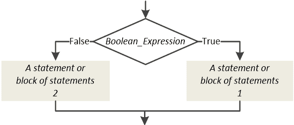
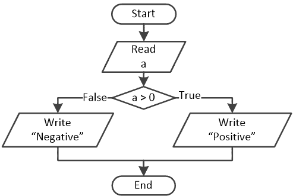
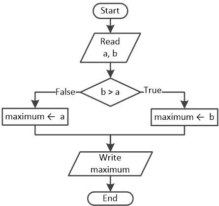
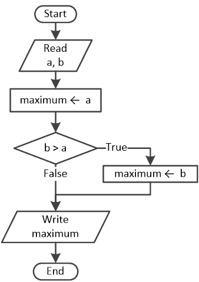
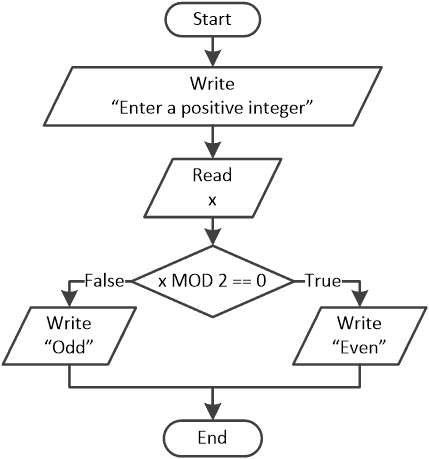
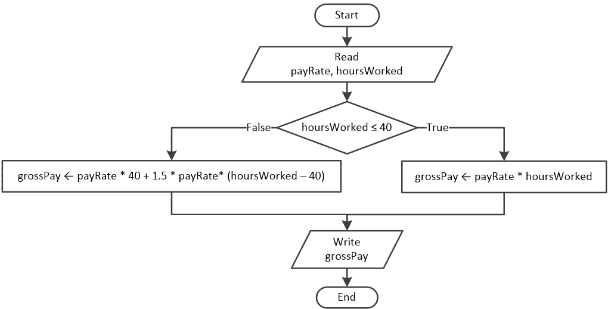
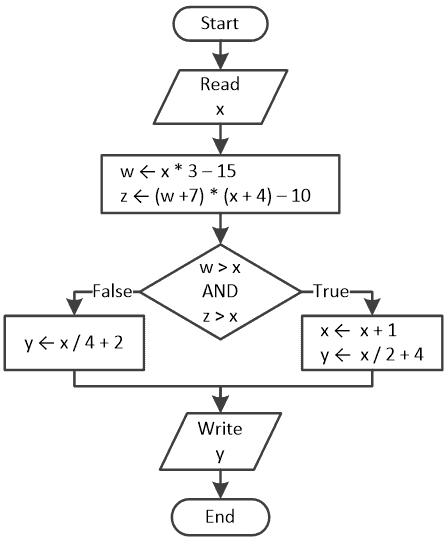

## 第十七章

双重选择决策结构

### 17.1 双重选择决策结构

与单选择决策结构相比，这种决策控制结构在两个路径上都包含一个语句或语句块。

如果布尔表达式 Boolean_Expression 评估为 True，则执行语句或语句块 1；否则，执行语句或语句块 2。

Python 语句的一般形式是

if Boolean_Expression:

一个语句或语句块 1

else:

一个语句或语句块 2

在下一个示例中，当用户输入大于或等于 18 的值时，会显示消息“您已成年”。否则，会显示消息“您未成年！”

 file_17.1

age = int(input("Enter your age: "))

if age >= 18:

print("You are an adult!")

else:

print("You are underage!")

#### 练习 17.1-1 寻找输出消息

对于以下流程图，确定三种不同执行中的输出消息。

三次执行输入的值分别是：(i) 3，(ii) −3，和 (iii) 0。

解答

i)当用户输入值 3 时，布尔表达式评估为 True。执行流程遵循正确路径，并显示消息“Positive”。

ii)当用户输入值 −3 时，布尔表达式评估为 False。执行流程遵循左侧路径，并显示消息“Negative”。

iii)你能预测当用户输入值 0 时会发生什么吗？如果你认为不会显示任何消息，那你就错了！双重选择决策结构必须始终遵循一个路径，要么是右侧，要么是左侧！它不能跳过执行两个语句块。至少必须执行一个语句或语句块。所以，在这种情况下，当用户输入值 0 时，布尔表达式评估为 False，执行流程遵循左侧路径，并显示消息“Negative”。

该算法目前的形式并不满足对所有可能输入的有效性属性。虽然它正确地识别了正数和负数，但它忽略了零的情况。零是一个有效的输入，算法的逻辑应该考虑到这一点，以确保对所有潜在的输入产生有意义的输出。在本书的后面部分（在练习 19.1-2 中），你将学习如何根据用户提供的值是大于、小于还是等于零来显示三条不同的消息。

决策符号有一个入口和两个出口路径！你不能有第三个出口！

#### 练习 17.1-2 跟踪表和双重选择决策结构

创建一个跟踪表，以确定在下一个 Python 程序的每个步骤中变量的值，针对两种不同的执行。

两次执行的输入值分别是 (i) 5 和 (ii) 10。

 file_17.1-2

a = float(input())

z = a * 10

w = (z - 4) * (a - 3) / 7 + 36

if a < z >= w:

y = 2 * a

else:

y = 4 * a

打印(y)

解答

i)对于输入值 5，跟踪表如下。

| 步骤 | 语句 | 备注 | a | z | w | y |
| --- | --- | --- | --- | --- | --- | --- |
| 1 | a = float(input()) | 用户输入值 5 | 5.0 | ? | ? | ? |
| 2 | z = a * 10 |   | 5.0 | 50.0 | ? | ? |
| 3 | w = (z - 4) * (a - 3) / 7 + 36 |   | 5.0 | 50.0 | 49.142 | ? |
| 4 | if a < z >= w: | 这将评估为 True |
| 5 | y = 2 * a |   | 5.0 | 50.0 | 49.142 | 10.0 |
| 6 | print(y) | 它显示：10.0 |

ii)对于输入值 10，跟踪表如下。

| 步骤 | 语句 | 备注 | a | z | w | y |
| --- | --- | --- | --- | --- | --- | --- |
| 1 | a = float(input()) | 用户输入值 10 | 10.0 | ? | ? | ? |
| 2 | z = a * 10 |   | 10.0 | 100.0 | ? | ? |
| 3 | w = (z - 4) * (a - 3) / 7 + 36 |   | 10.0 | 100.0 | 132.0 | ? |
| 4 | if a < z >= w: | 这将评估为 False |
| 5 | y = 4 * a |   | 10.0 | 100.0 | 132.0 | 40.0 |
| 6 | print(y) | 它显示：40.0 |

#### 练习 17.1-3 谁是最大的？

设计一个流程图并编写相应的 Python 程序，允许用户输入两个数字 A 和 B，然后确定并显示这两个数字中较大的一个。

解答

此练习可以使用双重或单选决策结构来解决。

第一种方法 - 使用双重决策结构

此方法测试数字 B 的值是否大于数字 A 的值。如果是这样，数字 B 是最大的；否则，数字 A 是最大的。使用此方法解决此练习的相应流程图如下所示

并且 Python 程序如下。

 file_17.1-3a

a = float(input())

b = float(input())

if b > a:

maximum = b

else:

maximum = a

打印("最大值:", maximum)

请注意，此练习试图确定最大值，而不是这个值实际分配给哪个变量（变量 A 或变量 B）。

第二种方法 - 使用单选决策结构

如下流程图所示，这种方法最初假设数字 A 可能是最大值（这就是为什么它将变量 a 的值赋给变量 maximum）。然而，如果结果证明数字 B 大于数字 A，则最大值将被更新；变量 maximum 将被赋予新的值——变量 b 的值。因此，无论数字 A 和 B 的值如何，最终变量 maximum 都将始终包含最大值！

此处的 Python 程序如下。

 file_17.1-3b

a = float(input())

b = float(input())

maximum = a

if b > a:

maximum = b

打印("最大值:", maximum)

#### 练习 17.1-4 查找奇数和偶数

设计一个流程图并编写相应的 Python 程序，提示用户输入一个正整数，然后显示一条消息，指出该数字是偶数；否则，显示“奇数”。

解决方案

接下来你可以找到各种奇数和偶数：

►奇数：1, 3, 5, 7, 9, 11, …

►偶数：0, 2, 4, 6, 8, 10, 12, …。

注意，零被认为是偶数。

在这个练习中，你需要找到一种方法来确定一个数字是奇数还是偶数。你需要找到所有偶数之间的共同属性，或者所有奇数之间的共同属性。实际上有一个！所有偶数都能被 2 整除。所以，当操作 x MOD 2 的结果等于 0 时，x 是偶数；否则，x 是奇数。

流程图如下所示。

并且 Python 程序如下。

 file_17.1-4

x = int(input("输入一个正整数："))

if x % 2 == 0:

打印("偶数")

else:

打印("奇数")

#### 练习 17.1-5 每周工资

总工资取决于工资率和每周工作的小时总数。然而，如果有人工作超过 40 小时，他们将获得超过 40 小时的工作时间工资。设计一个流程图并编写相应的 Python 程序，让用户输入工资率和工作时间，然后计算并显示总工资。

解决方案

这个练习可以使用双重选择决策结构来解决。当工作时间超过 40 小时时，总工资的计算如下：

总工资 = (工资率) × 40 + 1.5 × (工资率) × (超过 40 小时的工作小时数)

解决这个问题的流程图如下所示。

并且 Python 程序如下所示。

 file_17.1-5

payRate = float(input())

hoursWorked = int(input())

if hoursWorked <= 40:

grossPay = payRate * hoursWorked

else:

grossPay = payRate * 40 + 1.5 * payRate * (hoursWorked - 40)

打印("总工资：", grossPay)

### 17.2 复习问题：真/假

对以下每个陈述选择正确或错误。

1)在双重选择决策结构中，可能没有任何陈述被执行。

2)双重选择决策结构必须至少包含两个语句。

3)双重选择决策结构使用保留关键字 else。

4)以下陈述在语法上是正确的。

else = 5

5)在双重选择决策结构中，评估的布尔表达式可以返回超过两个值。

6)以下代码片段满足有效性的属性。

x = int(input())

y = int(input())

z = int(input())

if x > y and x > z:

打印("值", x, "是最大的一个")

else:

打印("值", y, "是最大的一个")

### 17.3 复习问题：多项选择题

对以下每个陈述选择正确答案。

1)双重选择决策结构包括一个语句或语句块。

a)仅错误路径。

b)两条路径。

c)仅真实路径。

2)在以下代码片段中，

if x % 2 == 0:

x = 0

else:

y += 1

the statement y += 1 is executed when

a)变量 x 正好能被 2 整除。

b)变量 x 包含一个偶数。

c)变量 x 包含一个奇数。

d)以上都不是

3)在以下代码片段中，

if x == 3:

x = 5

else:

x = 7

y += 1

执行语句 y += 1 的条件是

a)当变量 x 包含的值为 3 时。

b)当变量 x 包含的值不是 3 时。

c)以上都是

### 17.4 复习练习

完成以下练习。

1)为以下 Python 程序的每一步创建一个跟踪表以确定两次不同执行中变量的值。然后，设计相应的流程图。

两次执行的输入值分别是（i）3 和（ii）0.5。

a = float(input())

z = a * 3 - 2

if z >= 1:

y = 6 * a

else:

z += 1

y = 6 * a + z

print(z, ",", y)

2)为以下 Python 程序的每一步创建一个跟踪表以确定变量的值。然后，设计相应的流程图。

from math import sqrt

x = 3

y = x ** 3 + 9

z = 2 * x + y - 4

if x > y:

y = z % x

z = sqrt(x)

else:

x = z % y

z = sqrt(y)

print(x, ",", y, ",", z)

3)编写与以下流程图相对应的 Python 程序，然后创建一个跟踪表以确定两次不同执行中每一步的变量值。

两次执行的输入值分别是（i）10 和（ii）2。

4)使用双重选择结构，编写一个 Python 程序，提示用户输入一个数字，然后显示一条消息，指出用户提供的数字是否大于 100。如果不是，则显示“提供的数字小于或等于 100”。

5)使用双重选择结构，编写一个 Python 程序，提示用户输入一个数字，然后显示一条消息，指出用户提供的数字是否在 0 到 100 之间。如果不是，则显示“提供的数字不在 0 到 100 之间”。

6)两支足球队在欧洲冠军联赛中对战。使用双重选择结构，编写一个 Python 程序，提示用户输入两队的名称和每队得分，然后显示获胜队的名称。假设用户输入的是有效值，并且没有平局（平局）。

7)使用双重选择结构，编写一个 Python 程序，允许用户输入一个整数，然后显示一条消息，指出用户提供的数字是否是 6 的倍数；如果不是，则显示“NN 不是 6 的倍数”（其中 NN 是用户提供的数字）。假设用户输入的是一个非负值^([[14]](footnotes.html#Endnote_14))。

8) 使用双重选择决策结构，编写一个 Python 程序，允许用户输入一个整数，然后显示两种可能的消息之一。一条消息指示用户提供的数字是否是 6 的倍数或 7 的倍数；另一条消息指示用户提供的数字既不是 6 的倍数也不是 7 的倍数。假设用户输入的是一个非负值。

9) 使用双重选择决策结构，编写一个 Python 程序，允许用户输入一个整数。程序必须显示一条消息，指示用户提供的数字是否是 4 的倍数；如果不是，则显示“NN 不是 4 的倍数”（其中 NN 是用户提供的数字）。此外，程序必须以“NN = QQ x 4 + RR”的形式呈现用户提供的整数的结构，其中 QQ 是整数商，RR 是 NN 除以 4 时的整数余数。例如，如果用户提供的整数是 14，则必须显示消息“14 = 3 x 4 + 2”。假设用户输入的是一个非负值。

10) 使用双重选择决策结构，设计一个流程图并编写相应的 Python 程序，允许用户输入两个值，然后确定并显示两个值中的较小值。假设用户输入的是两个不同的值。

11) 使用双重选择决策结构，编写一个 Python 程序，允许用户输入三个数字，然后显示一条消息，指示用户提供的数字是否可以是三角形三边的长度；如果不是，则显示“提供的数字不能是三角形三边的长度”。假设用户输入的是有效值。

提示：在任何三角形中，每边的长度都小于其他两边长度的和。

12) 使用双重选择决策结构，编写一个 Python 程序，允许用户输入三个数字，然后显示一条消息，指示用户提供的数字是否可以是直角三角形（或直角三角形）的三边长度；如果不是，则显示“提供的数字不能是直角三角形的三边长度”。假设用户输入的是有效值。

提示 1：使用勾股定理。

提示 2：您可以使用长度为 3、4 和 5（这些可以是直角三角形的三边长度）来测试您的程序。

13) 2004 年雅典奥运会上跳远项目的运动员参加了三次不同的资格赛跳。为了获得资格，运动员必须达到至少 8 米的平均跳远距离。使用双重选择决策结构，编写一个 Python 程序，提示用户输入三次表现，当平均值为 8 米或以上时显示消息“合格”；否则显示“不合格”。假设用户输入的是有效值。

14)总工资取决于工资率和每周工作的小时总数。然而，如果有人工作超过 40 小时，他们将获得超过 40 小时工作时间的双倍工资。使用双重选择决策结构，设计一个流程图并编写相应的 Python 程序，允许用户输入工资率和工作时间，然后计算并显示净工资。净工资是在扣除任何扣除后的实际支付给员工的工资金额。扣除包括税收、健康保险、退休计划等。假设总扣除率为 30%。此外，假设用户输入了有效的值。

15)定期保养可以使您的车辆更加可靠，减少故障、不便和不必要的费用。一般来说，您需要执行两种类型的保养：

a)每行驶 6000 英里进行一次小保养

b)每行驶 12000 英里进行一次大保养

使用双重选择决策结构，编写一个 Python 程序，提示用户输入行驶的英里数，然后计算并显示距离下一次保养还有多少英里，以及下一次保养的类型。假设用户输入了有效的值。

16)两辆车从静止开始，沿直线水平道路以恒定加速度行驶指定的时间。使用双重选择决策结构，编写一个 Python 程序，提示用户输入两辆车行驶的时间（对两辆车都相同）以及每辆车的加速度，然后计算并显示它们之间的距离以及消息“车 A 领先”或“车 B 领先”，取决于哪辆车领先比赛。所需的公式是

.

在哪里

►S 是汽车行驶的距离，以米（m）为单位

►u[o]是汽车的初始速度（速度），以每秒米（m/sec）为单位

►t 是汽车行驶的时间，以秒（sec）为单位

►a 是加速度，以每秒平方米（m/sec²）为单位

假设用户提供的加速度值各不相同。此外，假设用户输入了有效的值。
