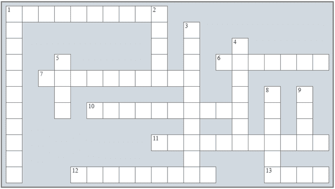

## 在“决策控制结构”中复习

### 复习填字游戏

1) 解决以下填字游戏。

横向

1) 非（not）运算符也称为逻辑 _________。

6) 这个布尔表达式可以由更简单的布尔表达式构建。

7) 此运算符评估一个操作数是否存在于指定的序列中。

10) 这个数字在反转其数字后保持不变。

11) 或运算符也称为逻辑 _________。

12) 一个正整数，其各位数字的立方和等于该数本身。

13) _______ 分支决策结构在两条路径上都包含一个语句或语句块。

纵向

1) 与运算符也称为逻辑 _________。

2) 此表显示了两个或多个布尔表达式之间逻辑运算的结果，以及它们所有可能值的组合。

3) （>）是一个 _____________ 运算符。

4) 这是一个结果为真或假的值的表达式。

5) 今年恰好能被 4 整除，但不能被 100 整除，或者恰好能被 400 整除。

8) 此控制结构是嵌套在另一个结构中的结构。

9) 这个数字被认为是一个偶数。

### 复习问题

回答以下问题。

1) 什么是布尔表达式？

2) Python 支持哪些比较运算符？

3) 哪个逻辑运算符执行逻辑合取？

4) 哪个逻辑运算符执行逻辑析取？

5) 逻辑运算符与何时返回 True 的结果？

6) 逻辑运算符或何时返回 True 的结果？

7) 说明逻辑运算符的优先级顺序。

8) 说明算术、比较、成员和逻辑运算符的优先级顺序。

9) 代码缩进是什么？

10) 设计流程图并编写一个单分支决策结构的相应 Python 语句（一般形式）。描述这种决策结构是如何工作的。

11) 设计流程图并编写一个双分支决策结构的相应 Python 语句（一般形式）。描述这种决策结构是如何工作的。

12) 设计流程图并编写一个多分支决策结构的相应 Python 语句（一般形式）。描述这种决策结构是如何工作的。

13) “嵌套决策结构”这个术语是什么意思？

14) 决策控制结构的嵌套可以有多深？有没有实际限制？

15) 创建一个图，显示解决线性方程的所有可能路径。

16) 创建一个图，显示解决二次方程的所有可能路径。

17) 何时一年被认为是闰年？

18) 什么是回文数？
