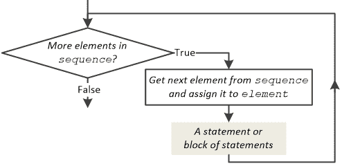
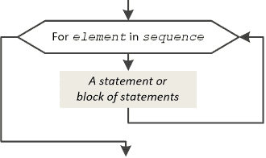
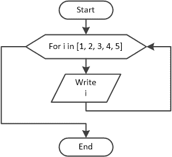
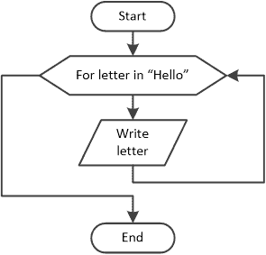

## 第二十五章

确定循环

### 25.1 for 语句

在第二十四章中，你肯定注意到了，while 语句被用来迭代已知次数和未知次数（在循环开始迭代时迭代次数未知的情况下）。换句话说，while 语句被用来创建确定性和非确定性循环。

由于确定循环在计算机编程中非常常用，几乎每种计算机语言，包括 Python，都包含一个比 while 语句更易读、更方便的特殊语句——这就是 for 语句。

for 语句的一般形式是

for element in sequence:

一个语句或语句块

其中 element 是一个变量，它被分配给序列的每个连续值，并且结构语句或语句块对每个值执行一次。

Python 的 for 语句的流程图如下所示。

然而，你会发现，这本书使用了一个简化的流程图，如下所示。

下面的示例显示了数字 1, 2, 3, 4 和 5。

 file_25.1a

for i in [1, 2, 3, 4, 5]:

print(i)

它对应的流程图如下所示

.

下面的示例显示了字母“H”，“e”，“l”，“l”，“o”（所有都不带双引号）。

 file_25.1b

for letter in "Hello":

print(letter)

它对应的流程图如下所示

.

如你在第 11.2 节中学到的，Python 的 range()函数可以用来创建整数序列。你可以使用此函数与 for 语句一起使用，以扩展 for 语句的可能性，如下所示

for counter in range([初始值,] 最终值 [, 步长]):

一个语句或语句块

其中

►counter 是一个整型变量。

►初始值是序列的起始值。此参数是可选的。如果省略，其默认值是 0。

►序列直到但不包括最终值。

►步长是序列中每个数字之间的差值。此参数是可选的。如果省略，其默认值是 1。

初始值、最终值和步长参数必须是整数。也允许使用负值。

下面的示例显示了数字 0 到 10。

 file_25.1c

for i in range(0, 11, 1):

print(i)

当步长为 1 时，可以省略第三个参数。上一个示例也可以写成

 file_25.1d

for i in range(0, 11):

print(i)

此外，当初始值为 0 时，可以省略第一个参数。上一个示例也可以写成

 file_25.1e

for i in range(11):

print(i)

下一个示例显示了数字 2, 4, 6, 8 和 10。

 file_25.1f

for i in range(2, 12, 2):

print(i)

以下示例显示从-2 到-10 的偶数，使用变量而不是常量值作为初始值、最终值和步长。

 file_25.1g

x1 = -2

x2 = -12

t = -2

for i in range(x1, x2, t):

print(i)

永远不要在循环内部更改计数器（此处为 i）的值！同样适用于初始值（此处为 x1）、最终值（此处为 x2）和步长（此处为 t）。这会使你的代码难以阅读，并可能导致结果错误。尽管如此，如果你坚持这样做，请使用 while 语句。

以下示例显示字母“H”，“e”，“l”，“l”，“o”（所有都不带双引号）。

 file_25.1h

message = "Hello"

for i in range(len(message)):

print(message[i])

len()函数返回变量 message 包含的字符数，而 message[i]表示法返回字符串变量 message 中指定位置（由变量 i 指示）的字符（参见第 14.3 节）。

就像 Python 的 while 语句一样，for 语句也可以与 else 关键字结合使用，如下所示。

for element in sequence:

一个语句或语句块 1

else:

一个语句或语句块 2

然而，这个不寻常的特性在实践中很少使用，所以本书中不会进一步讨论。

#### 练习 25.1-1 创建跟踪表

创建一个跟踪表以确定在输入值 1 时，下一个 Python 程序每一步中变量的值。

a = int(input())

for i in range(-3, 5, 2):

a = a * 3

print(i, a)

解答

range()函数返回序列-3, -1, 1, 3。for 循环将-3, -1, 1, 3 的值分别赋给变量 i，每个迭代一个值。相应的跟踪表如下所示。

| 步骤 | 语句 | 备注 | a | i |
| --- | --- | --- | --- | --- |
| 1 | a = int(input()) |   | 1 | ? |
| 2 | i = −3 |   | 1 | −3 | 1^(st) | 迭代 |
| 3 | a = a * 3 |   | 3 | −3 |
| 4 | i = −1 |   | 3 | −1 | 2^(nd) | 迭代 |
| 5 | a = a * 3 |   | 9 | −1 |
| 6 | i = 1 |   | 9 | 1 | 3^(rd) | 迭代 |
| 7 | a = a * 3 |   | 27 | 1 |
| 8 | i = 3 |   | 27 | 3 | 4^(th) | 迭代 |
| 9 | a = a * 3 |   | 81 | 3 |
| 10 | print(i, a) | 它显示：3  81 |

#### 练习 25.1-2 创建跟踪表

创建一个跟踪表以确定在输入值 4 时，下一个 Python 程序每一步中变量的值。

a = int(input())

for i in range(6, a - 1, -1):

print(i)

解答

range()函数返回序列 6, 5, 4。以下是用以确定每一步中变量值的跟踪表。

| 步骤 | 语句 | 备注 | a | i |
| --- | --- | --- | --- | --- |
| 1 | a = int(input()) |   | 4 | ? |
| 2 | i = 6 |   | 4 | 6 |
| 3 | print(i) | 它显示：6 |
| 4 | i = 5 |   | 4 | 5 |
| 5 | print(i) | 它显示：5 |
| 6 | i = 4 |   | 4 | 4 |
| 7 | print(i) | 它显示：4 |

#### 练习 25.1-3 计算迭代总数

计算以下代码片段在两次不同执行中的迭代总数。

两次执行的输入值分别为：(i) 6，和(ii) 5。

n = int(input())

for i in range(5, n + 1):

print(i)

解答

对于输入值 6，range()函数返回一个包含数字 5 和 6 的序列。因此，循环执行了两次迭代。

相应地，对于输入值 5，循环显然只执行了一次迭代。

#### 练习 25.1-4 找出四个数的和

编写一个 Python 程序，提示用户输入四个数，然后计算并显示它们的和。

解答

在练习 24.1-5 中，使用 while 语句提出的解决方案如下：

total = 0

i = 1

while i <= 4:

x = float(input())

total = total + x

i += 1

print(total)

现在用 for 语句重写这个程序非常容易，并在每次数据输入之前显示提示信息。

 file_25.1-4

total = 0

for i in range(4):

x = float(input("Enter a number: "))

total = total + x

print(total)

注意循环控制结构内部缺少 i += 1 语句。在 for 语句中，计数器（此处变量 i）在每次循环迭代开始时自动更新。

#### 练习 25.1-5 从 0 到 N 寻找平方根

编写一个 Python 程序，提示用户输入一个整数，然后计算并显示从 0 到该用户提供的整数的所有整数的平方根。

解答

这个练习很简单。用户输入一个整数，程序根据该整数迭代相应的次数。Python 程序如下。

 file_25.1-5

from math import sqrt

n = int(input("Enter an integer: "))

for i in range(n + 1):

print(sqrt(i))

#### 练习 25.1-6 找出 1 + 2 + 3 + … + 100 的和

编写一个 Python 程序，计算并显示以下求和：

S = 1 + 2 + 3 + … + 100

解答

如果使用序列控制结构来解决这个问题，代码片段可能如下所示。

s = 0

i = 1

s = s + i

i = 2

s = s + i

i = 3

s = s + i

…

…

i = 100

s = s + i

让我们使用跟踪表来更好地理解它。

| 步骤 | 语句 | 备注 | i | s |
| --- | --- | --- | --- | --- |
| 1 | s = 0 | 0 | ? | 0 |
| 2 | i = 1 |   | 1 | 0 |
| 3 | s = s + i | 0 + 1 = 1 | 1 | 1 |
| 4 | i = 2 |   | 2 | 1 |
| 5 | s = s + i | 0 + 1 + 2 = 3 | 2 | 3 |
| 6 | i = 3 |   | 3 | 3 |
| 7 | s = s + i | 0 +1 + 2 + 3 = 6 | 3 | 6 |
| 8 | i = 4 |   | 4 | 6 |
| ... | … |   | … | … |
| ... | … |   | … | … |
| 199 | i = 99 |   | 99 | 4851 |
| 200 | s = s + i |   | 99 | 4950 |
| 201 | i = 100 |   | 100 | 4950 |
| 202 | s = s + i | 0 + 1 + 2 + 3 + …+ 99 + 100 = 5050 | 100 | 5050 |

现在一切都已清楚，你可以这样做，这次使用 for 循环，在每次迭代中，将 1 到 100 的值赋给变量 i。

 file_25.1-6

s = 0

for i in range(1, 101):

s = s + i

print(s)

#### 练习 25.1-7 求 2 × 4 × 6 × 8 × 10 的乘积

编写一个 Python 程序，计算并显示以下乘积：

P = 2 × 4 × 6 × 8 × 10

解答

让我们使用以下序列控制结构来解决这个问题。变量 p 必须初始化为 1 而不是 0。这是为了确保 p = p * i 语句能够正确执行；否则，最终乘积将为零。

p = 1

i = 2

p = p * i

i = 4

p = p * i

i = 6

p = p * i

i = 8

p = p * i

i = 10

p = p * i

如前一个练习（练习 25.1-6）中所述，这个序列控制结构可以用 for 循环替换，如下所示。

 file_25.1-7

p = 1

for i in range(2, 12, 2):

p = p * i

print(p)

#### 练习 25.1-8 求 2² + 4² + 6² + … (2N)² 的和

编写一个 Python 程序，让用户输入一个整数 N，然后计算并显示以下求和：

S = 2² + 4² + 6² + … (2N)²

解答

在这个练习中，for 循环必须在每次迭代中将值 2、4、6、… 2N 分配给变量 i，并且这些值在累加到变量 s 之前必须被提升到平方。以下是一个最终的 Python 程序。

 file_25.1-8

N = int(input())

s = 0

for i in range(2, 2 * N + 2, 2):

s = s + i ** 2

print(s)

#### 练习 25.1-9 求 3³ + 6⁶ + 9⁹ + … (3N)^(3N) 的和

编写一个 Python 程序，让用户输入一个整数 N，然后计算并显示以下求和：

S = 3³ + 6⁶ + 9⁹ + …+ (3N)^(3N)

解答

这与上一个练习非常相似。唯一的区别是变量 i 在累加到变量 s 之前必须被提升到 i 次幂。使用 for 循环，最终的 Python 程序如下。

 file_25.1-9

N = int(input())

s = 0

for i in range(3, 3 * N + 3, 3):

s = s + i ** i

print(s)

#### 练习 25.1-10 求正数的平均值

编写一个 Python 程序，让用户输入 100 个数字，然后计算并显示正数的平均值。添加所有必要的检查，以确保程序满足确定性属性。

解答

由于你知道总的迭代次数，你可以使用一个 for 循环。然而，在循环内部，决策控制结构必须检查用户提供的数字是否为正数；如果是，它必须将用户提供的数字累加到变量 s 中。变量 count 计算输入的正数数量。当执行流程退出循环时，可以计算出平均值。以下是一个 Python 程序。

 file_25.1-10

s = 0

count = 0

for i in range(100):

x = float(input())

if x > 0:

> s = s + x
> 
> count += 1

if count != 0:

print(s / count)

else:

print("没有输入正数！")

if count != 0 语句是必要的，因为有可能用户只会输入负值（或零）。通过包含这个检查，程序防止了任何除以零的错误，并因此满足了确定性的属性。

#### 练习 25.1-11 计算元音字母

编写一个 Python 程序，提示用户输入一条消息，然后计算并显示该消息中包含的元音字母数量。

解决方案

以下 Python 程序计算英文消息中的元音字母。

 file_25.1-11

message = input("输入一条英文消息：")

vowels = "AEIOU"

count = 0

for character in message:

if character.upper() in vowels:

> count += 1

print("元音字母：", count)

注意这里操作符 in 的两种用法。在第一种情况下，它用于确定迭代次数，而在第二种情况下，它用于检查字母是否存在于字符串 vowels 中（见第 15.5 节）。

### 25.2 适用于 for 循环的规则

在编写带有 for 循环的程序时，你必须始终遵循某些规则，因为它们可以让你免受不良副作用的影响。

►规则 1：var/计数器变量可以出现在 for 循环内的语句中，但它们的值永远不应该被更改。如果它们是变量而不是常量值，则同样适用于 final_value 和 step。

►规则 2：步长永远不能为零。如果设置为零，Python 会抛出错误！

►规则 3：如果初始值小于最终值，则步长必须是正的。如果它是负的，循环执行零次迭代。以下示例在屏幕上什么也不打印

for i in range(5, 9, -1):

 file_25.2-1

然而，请记住，故意违反此规则在某些情况下可能是有用的。

►规则 4：如果初始值大于最终值，则步长必须是负的。如果它是正的，循环执行零次迭代。以下示例也在屏幕上什么也不打印

for i in range(10, 6):

print(i)

然而，请记住，故意违反此规则在某些情况下可能是有用的。

#### 练习 25.2-1 求 N 个数的和

编写一个 Python 程序，提示用户输入 N 个数字，然后计算并显示它们的和。N 的值必须在程序开始时由用户提供。

解决方案

解决方案在此处展示。

total += a  # 这相当于 total = total + a

n = int(input("输入要输入的数字数量："))

total = 0

for i in range(n):

a = float(input("输入第" + str(i + 1) + "个数字："))

print(i)

print("和：", total)

Even though it violates the fourth rule of for-loops, in this particular exercise this situation is very useful. If the user enters a non-positive value for variable n, the for statement performs zero iterations.

### 25.3 复习问题：对/错

对以下每个陈述选择对或错。

1)在 for 语句中，变量 element 在每次循环开始时自动分配序列的连续值。

2)当迭代次数已知时可以使用确定循环。

3)在确定循环中，循环的语句或语句块至少执行一次。

4)在 range()函数中，初始值不能大于最终值。

5)当执行流程退出 for 循环时，计数器的值不等于 final_value。

6)在 range()函数中，初始值、最终值和步长不能是浮点数。

7)在带有 range()函数的 for 语句中，当步长设置为 0 时，循环执行 0 次迭代。

8)在 for 语句中，计数变量可以出现在循环内的语句中，但其值不应被更改。

9)在带有 range()函数的 for 语句中，步长在特定情况下可以是 0。

10)在以下代码片段中，单词“Hello”被显示 10 次。

for i in range(1, 10):

打印("Hello")

11)以下代码片段总是可以执行的。

b = int(input())

for i in range(0, 9, b):

打印("Hello")

12)以下代码片段满足确定性的属性。

from math import sqrt

for i in range(-10, 10):

打印(sqrt(i))

### 25.4 复习问题：多项选择题

选择以下每个陈述的正确答案。

1)使用 for 语句的确定循环

a)执行比等效的先测试循环结构（使用 while 语句）多一次迭代。

b)执行比等效的先测试循环结构（使用 while 语句）少一次迭代。

c)以上都不是

2)可以使用 for 语句的确定循环来解决以下问题

a)用户反复输入数字，直到输入的值是-1。

b)用户反复输入数字，直到输入的值大于 final_value。

c)所有选项

d)以上都不是

3)在 for 循环中，初始值、最终值和步长可以是

a)一个常数。

b)一个变量。

c)一个表达式。

d)以上所有选项

4)在 for 循环中，当 final_value 和 step 是变量时，它们的值

a)在循环内不能更改。

b)在循环内不应更改。

c)以上都不是

5)在 for 循环中，当计数器增加时，步长是

a)大于零。

b)等于零。

c)小于零。

d)以上都不是

6)在 for 循环中，计数器的初始值

a)必须是 0。

b)可以是 0。

c)不能是负数。

d)以上都不是

7)在 for 循环中，变量 counter 自动分配序列的连续值

a)在每次迭代开始时。

b)在每次迭代结束时。

c)不是自动分配的。

d)以上都不是

8)在以下代码片段

i = 1

for i in range(5, 6):

打印("Hello Hera")

显示消息“Hello Hera”

a)5 次。

b)1 次。

c)0 次。

d)以上都不是

9)在以下代码片段

for i in range(5, 5):

i = 1

打印("Hello Artemis")

显示消息“Hello Artemis”

a)1 次。

b)无限次.

c)0 次.

d)以上皆非

10)在以下代码片段中

for i in range(5, 6):

i = 6

print("Hello Ares")

显示的消息是“Hello Ares”

a)无限次.

b)1 次.

c)0 次.

d)以上皆非

11)在以下代码片段中

for i in range(2, 9):

if i % 2 == 0:

> print("Hello Demeter")

显示的消息是“Hello Demeter”

a)8 次.

b)7 次.

c)5 次.

d)以上皆非

12)在以下代码片段中

for i in range(40, 51):

print("Hello Dionysus")

显示的消息是“Hello Dionysus”

a)1 次.

b)2 次.

c)10 次.

d)11 次.

13)在以下代码片段中

k = 0

for i in range(1, 7, 2):

k = k + i

print(k)

显示的值是

a)3.

b)6.

c)9.

d)以上皆非

14)在以下代码片段中

k = 0

for i in range(10, -15, -5):

k = k + i

print(i)

显示的值是

a)0

b)−15.

c)−10.

d)以上皆非

### 25.5 复习练习

完成以下练习。

1)创建一个跟踪表以确定下一个 Python 程序每一步中变量的值。这个 Python 程序执行了多少次迭代？

a = 0

b = 0

for j in range(0, 10, 2):

if j < 5:

> b += 1

else:

> a += j - 1

print(a, ",", b)

2)创建一个跟踪表以确定下一个 Python 程序对于两个不同执行的每一步中变量的值。

两次执行的输入值分别是：(i) 10，和(ii) 21。

a = int(input())

b = a

for j in range(a - 5, a + 1, 2):

if j % 2 != 0:

> b = a + j + 5

else:

> b = a - j

print(b)

3)创建一个跟踪表以确定下一个 Python 程序对于输入值 12 的每一步中变量的值。

a = int(input())

for j in range(2, a, 3):

x = j * 3 + 3

y = j * 2 + 10

if y - x > 0 or x > 30:

> y *= 2

x += 4

print(x, ",", y)

4)填写以下代码片段中的空白，以便所有循环都恰好执行五次迭代。

i)

for a in range(5, …… + 1):

print(b)

b += a

ii)

for a in range(0, …… + 1, 5):

print(b)

b += a

iii)

for a in range(……, -16, -2):

print(b)

b += a

iv)

for a in range(-11, -16, ……):

print(b)

b += a

5)不使用跟踪表，你能找出以下 Python 程序将显示什么？

word = "Zeus"

i = 1

s = ""

for letter in word:

s = s + i * letter

i += 1

print(s)

6)设计一个流程图并编写相应的 Python 程序，提示用户输入 20 个数，然后计算并显示它们的乘积和平均值。

7)编写一个 Python 程序，计算并显示从 0 到 360°的正弦值，步长为 0.5。已知 2π = 360°。

8)编写一个 Python 程序，提示用户输入一个度数，然后计算并显示从 0 到用户提供的数的余弦值，步长为 1。已知 2π = 360°。

9)编写一个 Python 程序，计算并显示以下数的和：

S = 1 + 3 + 5 + … + 99

10) 编写一个 Python 程序，允许用户输入一个整数 N，然后计算并显示以下乘积：

P = 2¹ × 4³ × 6⁵ × … × 2N^((2N−1))

11) 编写一个 Python 程序，计算并显示以下数列的和：

S = 1 + 2 + 4 + 7 + 11 + 16 + 22 + 29 + 37 + … + 191

12) 设计一个流程图并编写相应的 Python 程序，允许教师输入学生的总数以及他们的成绩，然后计算并显示那些获得“A”（即 90 到 100 分）的平均值。添加所有必要的检查，以确保程序满足确定性的属性。

13) 设计一个流程图并编写相应的 Python 程序，提示用户输入 30 个四位数整数，然后计算并显示那些首位为 5 且末位为 3 的整数的总和。例如，值 5003、5923 和 5553 都是此类整数。

14) 设计一个流程图并编写相应的 Python 程序，提示用户输入 N 个整数，然后显示其中偶数的总数。程序开始时必须由用户提供 N 的值。此外，如果用户提供的所有整数都是奇数，则必须显示消息“您没有输入任何偶数整数”。

15) 设计一个流程图并编写相应的 Python 程序，提示用户输入 50 个整数，然后计算并显示奇数的平均值和偶数的平均值。

16) 设计一个流程图并编写相应的 Python 程序，提示用户将两个整数分别输入到变量 start 和 finish 中，然后显示从 start 到 finish 的所有整数。然而，在程序开始时，必须检查变量 start 是否大于变量 finish。如果发生这种情况，程序必须交换它们的值，以确保它们始终处于正确的顺序。

17) 设计一个流程图并编写相应的 Python 程序，提示用户将两个整数分别输入到变量 start 和 finish 中，然后显示从 start 到 finish 的所有是 5 的倍数的整数。然而，在程序开始时，必须检查变量 start 是否大于变量 finish。如果发生这种情况，程序必须交换它们的值，以确保它们始终处于正确的顺序。

18) 编写一个 Python 程序，提示用户输入一个实数和一个整数，然后显示第一个数以第二个数为指数的结果，而不使用指数运算符（**）或 Python 的内置 pow() 函数。

19) 编写一个 Python 程序，提示用户输入一条消息，然后显示它包含的单词数量。例如，如果输入的字符串是“我的名字是比尔·博拉斯”，程序必须显示“输入的消息包含 5 个单词”。假设单词由单个空格字符分隔。

提示：使用 len() 函数获取用户提供的消息包含的字符数。

20) 编写一个 Python 程序，提示用户输入一条消息，然后显示每个单词的平均字母数。例如，如果输入的消息是“我的名字是阿芙罗狄忒·博拉”，程序必须显示“每个单词的平均字母数是 4.4”。空格字符不计入。

21) 编写一个 Python 程序，提示用户输入一条消息，然后计算并显示该消息中包含的辅音字母数量。

22) 编写一个 Python 程序，提示用户输入一条消息，然后计算并显示该消息中包含的元音字母数量、辅音字母数量以及算术字符数量。
