## 第二十七章

更多关于带有循环控制结构的流程图

### 27.1 简介

通过学习前面的章节，你已经熟悉了所有的循环控制结构。由于流程图是学习“算法思维”和帮助你更好地理解特定控制结构的理想方式，本章将教你如何将 Python 程序转换为流程图，以及如何将流程图转换为 Python 程序。

### 27.2 将 Python 程序转换为流程图

要将 Python 程序转换为流程图，你需要回忆所有循环控制结构及其相应的流程图。以下将总结它们。

前测试循环结构

while Boolean_Expression:

一个或多个语句

测试后循环结构

while True:

一个或多个语句

if Boolean_Expression: break

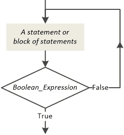

中间测试循环结构

while True:

一个或多个语句 1

if Boolean_Expression: break

一个或多个语句 2

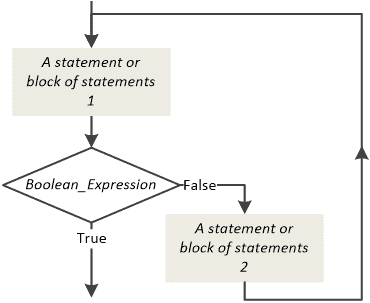

For 循环

for element in sequence:

一个或多个语句

接下来，你将找到许多练习，可以帮助你澄清你可能仍然需要帮助理解的事情。

#### 练习 27.2-1 设计流程图

设计与以下 Python 程序相对应的流程图。

i = 50

while i > 10:

if i % 2 == 1:

> print(i)

i -= 5

解决方案

这个 Python 程序包含一个前测试循环结构，嵌套了一个单选择决策结构。相应的流程图包括你迄今为止所学的所有内容。

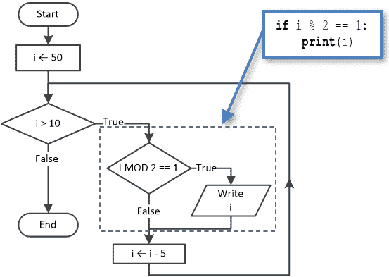

#### 练习 27.2-2 设计流程图

设计与以下代码片段相对应的流程图。

i = 30

while True:

if i % 8 == 0:

> print(i, "是 8 的倍数")

if i % 4 == 0:

> print(i, "是 4 的倍数")

if i % 2 == 0:

> print(i, "是 2 的倍数")

i -= 2

if i <= 0: break

解决方案

这段代码片段包含一个后测试循环结构，嵌套了三个单选择决策结构。相应的流程图片段如下。

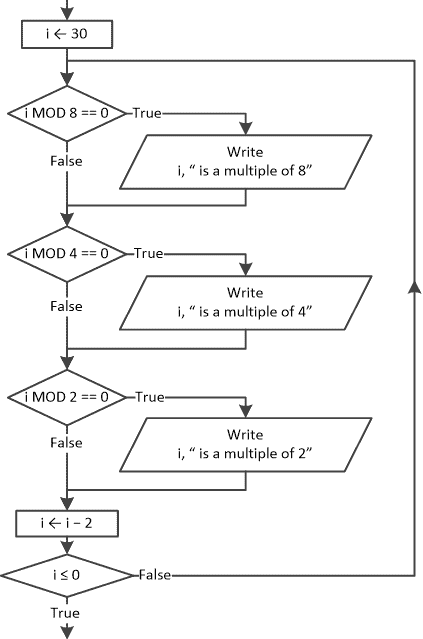

#### 练习 27.2-3 设计流程图

设计与以下 Python 程序相对应的流程图。

for 小时 in range(1, 25):

print("小时是", 小时, ":00。")

if 小时 >= 4 且 小时 < 12:

> print("早上好")

elif 小时 >= 12 且 小时 < 20:

> print("下午好")

elif 小时 >= 20 且 小时 < 24:

> print("晚上好")

else:

> print("晚上好")

解决方案

这个 Python 程序包含一个 for 循环，嵌套了多重选择决策结构。相应的流程图如下。

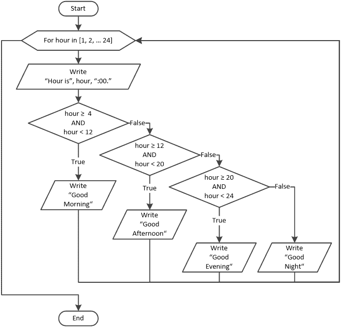

#### 练习 27.2-4 设计流程图

设计与以下 Python 程序相对应的流程图。

a = int(input())

if a == 1:

for i in range(1, 11, 2):

> print(i)

elif a == 2:

for i in range(9, -1, -2):

> print(i)

else:

print("没有事情要做！")

print("结束！")

解答

此 Python 程序包含一个嵌套两个 for 循环的多分支决策结构。相应的流程图如下。

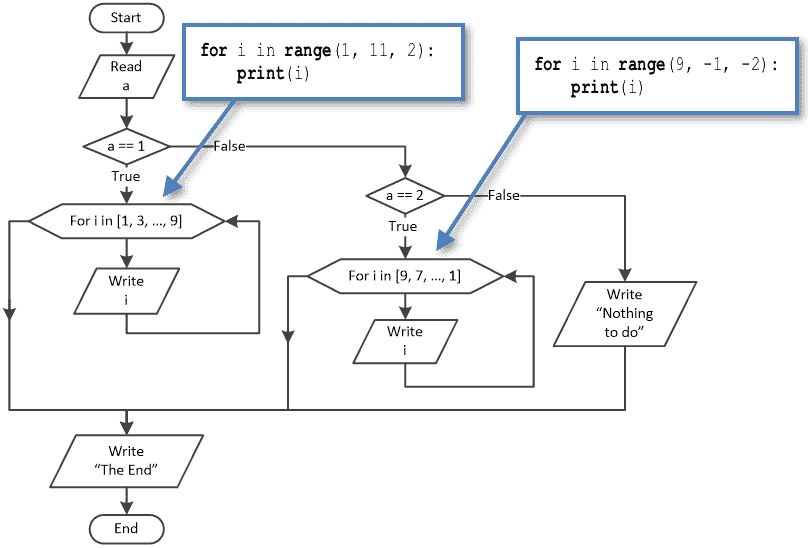

#### 练习 27.2-5 设计流程图

设计与以下 Python 程序相对应的流程图。

n = int(input())

m = int(input())

total = 0

for i in range(n):

for j in range(m):

> total += i * j + j

print(total)

解答

此 Python 程序包含嵌套的循环控制结构；一个 for 循环嵌套在另一个 for 循环中。相应的流程图如下。

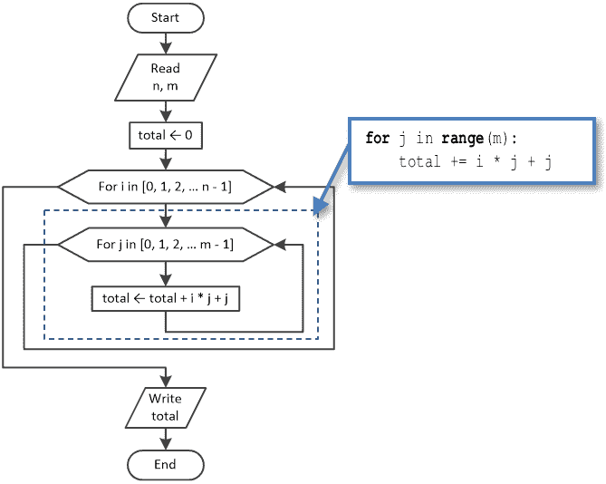

### 27.3 将流程图转换为 Python 程序

这种转换并不总是容易的。有些情况下，流程图设计者没有遵循特定的规则，因此初始流程图可能需要一些修改，才能将其转换为 Python 程序。以下是一个这样的例子。

如您所见，此流程图片段中包含的循环控制结构与您已经学习过的任何结构都不匹配，例如预测试、后测试、中测试，甚至是 for 循环控制结构。因此，您只有一个选择，那就是通过添加额外的语句或删除现有的语句来修改流程图，直到出现已知的循环控制结构。以下是一些练习，其中一些练习的初始流程图确实需要修改。

#### 练习 27.3-1 编写 Python 程序

编写与以下流程图片段相对应的 Python 程序。

.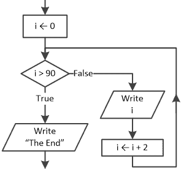

解答

这是一个简单的例子。你必须克服的唯一障碍是，真和假的路径并不完全在正确的位置。你需要真路径而不是假路径来实际迭代。正如你所知道的那样，你可以切换这两个路径，但你还需要否定布尔表达式。因此，相应的代码片段变为

i = 0

while i <= 90:

print(i)

i = i + 2

print("The End")

使用 for 循环，此代码片段可以等价地写成

for i in range(0, 92, 2):

print(i)

print("The End")

#### 练习 27.3-2 编写 Python 程序

编写与以下流程图相对应的 Python 程序。

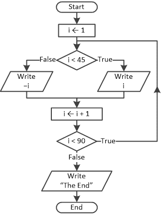

解答

此流程图包含一个后测试循环结构，嵌套一个双分支决策结构。相应的 Python 程序如下。

i = 1

while True:

if i < 45:     [[更多…]](more.html#more_27_3_2_1)

> print(i)

else:

> print(-i)

i += 1

if i >= 90: break

print("The End")

#### 练习 27.3-3 编写 Python 程序

编写与以下流程图相对应的 Python 程序。

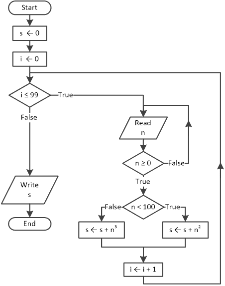

解答

哎呀！真乱！这里这么多菱形！不过，要小心，因为并非所有这些都是决策控制结构。实际上，有两个是循环控制结构，只有一个代表决策控制结构！你能找到后者吗？

到目前为止，你应该已经非常熟悉循环控制结构了。正如你所知，在循环控制结构中，菱形（菱形）的一个出口总是向上方向。因此，从初始流程图中提取的以下流程图片段显然是你正在寻找的决策控制结构。

.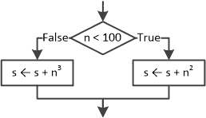

当然，这是一个双分支决策结构！

现在，让我们识别其余的结构。在双分支决策结构之前，有一个后测试循环结构。其流程图片段如下。

.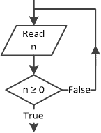

最后，前面提到的双分支决策结构和后测试循环结构都嵌套在下一个流程图片段中，

.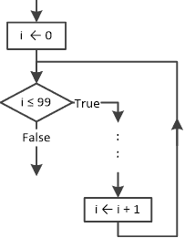

这恰好是一个预测试循环结构。相应的 Python 程序如下。

s = 0

i = 0

while i <= 99:

while True:           [[更多…]](more.html#more_27_3_3_1)

> n = float(input())
> 
> if n >= 0: break

if n < 100:        [[更多…]](more.html#more_27_3_3_2)

> s = s + n ** 2

else:

> s = s + n ** 3

i += 1

print(s)

或者，你甚至可以使用 for 循环来编写它，如下面的代码所示。

s = 0

for i in range(100):

while True:

> n = float(input())
> 
> if n >= 0: break

if n < 100:

> s = s + n ** 2

else:

> s = s + n ** 3

print(s)

毕竟，并没有那么困难，对吧？

#### 练习 27.3-4 编写 Python 程序

编写与以下流程图相对应的 Python 程序。

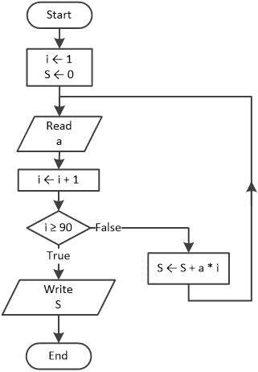

解决方案

这是一个中间测试循环结构。由于没有直接对应的 Python 语句，你可以使用 break 语句——或者你可以将流程图转换为更熟悉的形式，如以下两种方法所示。

第一种方法 – 使用 break 语句

主要思想是创建一个无限循环（while True），当两个语句或语句块之间的布尔表达式评估为真时退出循环（参见第 24.3 节）。

根据这种方法，初始流程图可以用 Python 编写如下。

i = 1

S = 0

while True:

a = float(input())     [[更多…]](more.html#more_27_3_4_1)

i += 1

if i >= 90: break

S = S + a * i     [[更多…]](more.html#more_27_3_4_2)

print(S)

请记住，尽管 break 语句有时可能很有用，但它也可能导致你编写难以阅读和理解的代码，尤其是在你大量使用它的时候。因此，请谨慎并适度地使用它！

第二种方法 – 转换流程图

中间测试循环结构和其等价的预测试循环结构如下。

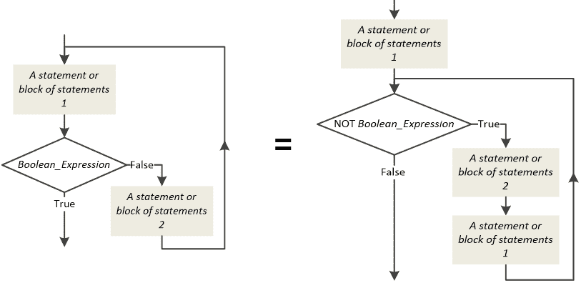

因此，初始流程图变为

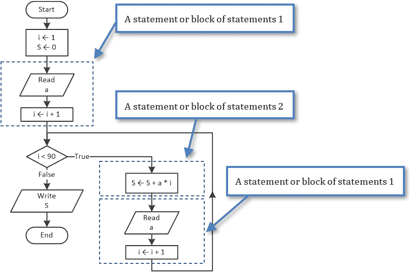

现在，编写相应的 Python 程序很容易。

i = 1

S = 0

a = float(input())     [[更多…]](more.html#more_27_3_4_3)

i += 1

while i < 90:

S = S + a * i     [[更多…]](more.html#more_27_3_4_4)

a = float(input())     [[更多…]](more.html#more_27_3_4_5)

i += 1

print(S)

### 27.4 复习练习

完成以下练习。

1)设计与以下 Python 程序对应的流程图。

i = 35

while i > -35:

if i % 2 == 0:

> print(2 * i)

else:

> print(3 * i)

i -= 1

2)设计与以下 Python 程序对应的流程图。

i = -20

while True:

x = int(input())

if x == 0:

> print("Zero")

elif x % 2 == 0:

> print(2 * i)

else:

> print(3 * i)

i += 1

if i > 20: break

3)设计与以下 Python 程序对应的流程图。

a = int(input())

if a > 0:

i = 0

while i <= a:

> print(i)
> 
> i += 5

else:

print("Non-Positive Entered!")

4)设计与以下 Python 程序对应的流程图。

a = int(input())

if a > 0:

i = 0

while i <= a:

> print(3 * i + i / 2)
> 
> i += 1

else:

i = 10

while True:

> print(2 * i - i / 3)
> 
> i -= 3
> 
> if i < a: break

5)设计与以下 Python 程序对应的流程图。

a = int(input())

if a > 0:

for i in range(a + 1):

> print(3 * i + i / 2)

elif a == 0:

b = int(input())

while b > 0:

> b = int(input())

print(2 * a + b)

else:

b = int(input())

while b < 0:

> b = int(input())

for i in range(a, b + 1):

> print(i)

6)设计与以下 Python 程序对应的流程图。

a = int(input())

b = int(input())

c = int(input())

d = int(input())

total = 0

for i in range(a, b):

for j in range(c, d + 1, 2):

> total += i + j

print(total)

7)设计与以下代码片段对应的流程图。

s = 0

for i in range(100):

n = float(input())

while n < 0:

> print("Error")
> 
> n = float(input())

s += sqrt(n)

print(s)

8)设计与以下 Python 程序对应的流程图。

from math import sqrt

s = 0

for i in range(1, 51):

while True:

> n = int(input())
> 
> if n >= 0: break

s += sqrt(n)

print(s)

9)设计与以下 Python 程序对应的流程图。

while True:

while True:

> a = int(input())
> 
> if a >= 0: break

while True:

> b = int(input())
> 
> if b >= 0: break

print(abs(a - b))

if abs(a − b) <= 100: break

10)设计与以下 Python 程序对应的流程图。

while True:

while True:

> a = int(input())
> 
> b = int(input())
> 
> if a >= 0 and b >= 0: break

if a > b:

> print(a - b)

else:

> print(a * b)

if abs(a − b) <= 100: break

11)编写与以下流程图对应的 Python 程序。

.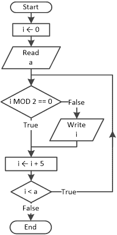

12)编写与以下流程图对应的 Python 程序。

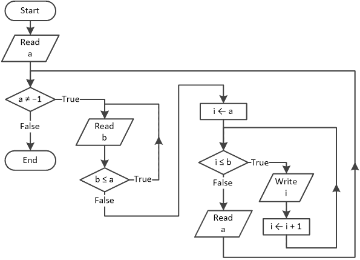

13)编写与以下流程图对应的 Python 程序。

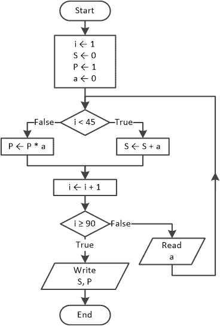
