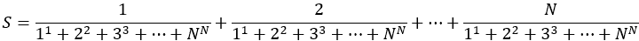
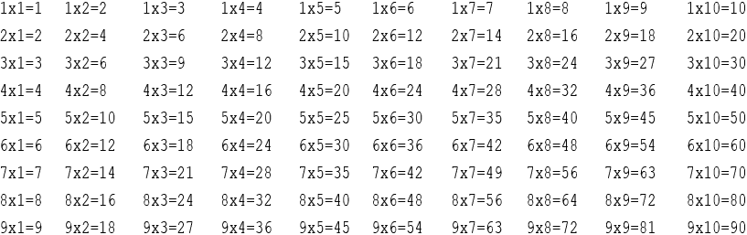
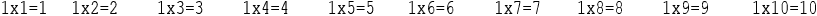
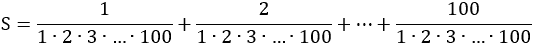
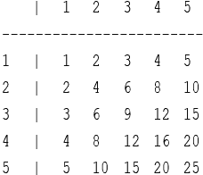

## 第二十八章

循环控制结构的技巧和窍门

### 28.1 简介

本章致力于向您介绍一些有用的技巧和窍门，这些技巧和窍门可以帮助您编写“更好”的代码。在设计自己的算法或甚至自己的 Python 程序时，您应始终牢记这些技巧。

这些技巧和窍门可以帮助您提高代码的可读性，帮助您选择在给定问题中哪种循环控制结构更好，并帮助使代码更短或甚至更快。当然，没有单一完美的方法，因为有时使用特定的技巧或窍门可能会有所帮助，但在另一种情况下，相同的技巧或窍门可能会有完全相反的结果。大多数时候，代码优化是编程经验的问题。

较小的算法并不总是解决特定问题的最佳方案。为了解决特定问题，您可能编写了一个简洁的算法，不幸的是，这个算法证明消耗了大量的 CPU 时间以及/或大量主内存（RAM）。另一方面，您可能使用另一个算法来解决相同的问题，该算法看起来更长，但计算结果更快以及/或使用更少的 RAM。

### 28.2 选择循环控制结构

以下图表可以帮助您根据迭代次数选择在给定问题中使用的最合适的循环控制结构。

此图推荐最佳选项，而非唯一选项。例如，当迭代次数已知时，使用预测试或后测试循环结构并非错误。然而，提出的 for 循环更为方便。

### 28.3 “终极”规则

当使用预测试或后测试循环结构时，程序员常常会问的一个问题是，如何确定哪些语句应该写入循环控制结构内部，哪些应该写入外部，以及它们的顺序。

有一个简单而强大的规则——“终极”规则！一旦您遵循它，逻辑错误的潜在风险就会降至零！

“终极”规则指出：

► 参与循环布尔表达式的变量或变量必须在进入循环之前初始化。

► 变量或参与循环布尔表达式的变量值必须在循环内更新（更改）。更具体地说，执行此更新/更改的语句必须是循环的最后一个语句之一。

例如，如果变量 x 是参与循环布尔表达式的变量，则预测试循环结构应采用以下形式，

初始化 x

while Boolean_Expression(x):

一个语句或语句块

更新/更改 x

以及后测试循环结构应采用以下形式，

初始化 x

while True:

一个语句或语句块

更新/更改 x

if Boolean_Expression(x): break

其中

►初始化 x 是任何为变量 x 分配初始值的语句。它可以是输入语句，如 input("输入一个数字：")，或者使用值赋值运算符（=）的赋值语句。然而，在后测试循环结构中，这个语句有时可能是多余的，可以省略，因为 x 的初始化可以直接在循环内部进行。

►布尔 _ 表达式(x)可以是任何从简单到复杂的布尔表达式，取决于变量 x。

►更新/修改 x 是任何改变 x 值的语句，例如另一个输入语句，使用值赋值运算符（=）的赋值语句，或者甚至是复合赋值运算符。重要的是，这个语句必须位于循环布尔表达式评估点之前。这意味着它应该是循环中最后的语句之一。

以下是一些使用“终极”规则的示例。

示例 1

a = int(input())  #a 的初始化

while a > 0:  #依赖于 a 的布尔表达式

print(a)

a = a – 1  #a 的更新/修改

示例 2

a = int(input())  #a 的初始化

b = int(input())  #b 的初始化

while a > b:  #依赖于 a 和 b 的布尔表达式

print(a, b)

a = int(input())  #a 的更新/修改

b = int(input())  #b 的更新/修改

示例 3

s = 0  #s 的初始化

while True:

y = int(input())

s = s + y  #s 的更新/修改

if s >= 1000: break  #依赖于 s 的布尔表达式

示例 4

y = 0  #y 的初始化

while True:

y = int(input())  #y 的更新/修改

if y >= 0: break  #依赖于 y 的布尔表达式

在这个例子中，尽管变量 y 在循环外部的初始化是多余的，可以省略，如下所示。

while True:

y = int(input())  #y 的初始化和更新/修改

if y >= 0: break  #依赖于 y 的布尔表达式

示例 5

odd = 0   #odd 的初始化

even = 0  #even 的初始化

while odd + even < 5:  #依赖于 odd 和 even 的布尔表达式

x = int(input())

if x % 2 == 0:

> even += 1  #even 的更新/修改

else:

> odd += 1   #odd 的更新/修改

print("奇数:", odd, "偶数:", even)

现在，你会意识到为什么你应该始终遵循“终极”规则！让我们看看以下练习：

编写一个代码片段，允许用户重复输入数字，直到总共输入了三个正数。

这个练习被给了一个班级，一个学生给出了以下代码片段作为答案。

positivesCount = 0

x = float(input())

while positivesCount != 3:

if x > 0:

> positivesCount += 1

x = float(input())

print("提供了三个正数！")

初看之下，这似乎是正确的。它允许用户输入一个数字，进入循环，检查用户提供的数字是否为正数，然后让用户输入第二个数字，以此类推。然而，这段代码中存在一个逻辑错误——而且不幸的是，这是一个棘手的错误。你能找到它吗？

通过尝试各种输入值（正数、负数或零）来遵循执行流程。当用户输入一个正数时，变量正数计数增加一个；而当他们输入一个负数或零时，它保持不变。一切看起来似乎运行得都很顺利，不是吗？——如此顺利，以至于你可能质疑这本书是否可靠，或者你是否应该扔掉它！

只有当用户尝试输入所有三个预期的正数值时，问题才会变得明显。下面的跟踪表可以帮助你确定问题所在。假设用户想要输入的值是 5、-10、-2、4 和 20。

| 步骤 | 说明 | 备注 | 正数计数 | x |
| --- | --- | --- | --- | --- |
| 1 | 正数计数 = 0 |  | 0 | ? |
| 2 | x = float(input()) |  | 0 | 5.0 |
| 3 | while 正数计数 != 3 | 这将评估为 True |
| 4 | if x > 0 | 这将评估为 True |
| 5 | 正数计数 += 1 |  | 1 | 5.0 |
| 6 | x = float(input()) |  | 1 | -10.0 |
| 7 | while 正数计数 != 3 | 这将评估为 True |
| 8 | if x > 0 | 这将评估为 False |
| 9 | x = float(input()) |  | 1 | -2.0 |
| 10 | while 正数计数 != 3 | 这将评估为 True |
| 11 | if x > 0 | 这将评估为 False |
| 12 | x = float(input()) |  | 1 | 4.0 |
| 13 | while 正数计数 != 3 | 这将评估为 True |
| 14 | if x > 0 | 这将评估为 True |
| 15 | 正数计数 += 1 |  | 2 | 4.0 |
| 16 | x = float(input()) |  | 2 | 20.0 |
| 17 | while 正数计数 != 3 | 这将评估为 True |
| 18 | if x > 0 | 这将评估为 True |
| 19 | 正数计数 += 1 |  | 3 | 20.0 |
| 20 | x = float(input()) |  | 3 | ??? |

这里就是逻辑错误！在第 20 步，尽管用户提供的正数总数是三个，你期望执行结束，但不幸的是，用户被要求再输入一个数字！但是，你需要一个代码片段让用户输入三个正数，而不是四个，对吧？

这就是为什么你应该始终按照书上的来做！让我们看看这个代码片段应该如何编写。

由于 while 循环的布尔表达式依赖于变量正数计数，因此这个变量必须在循环外部初始化。此变量还必须在循环内部更新/更改。执行此更新/更改的语句必须是循环中的最后一个语句，如下面的代码片段（以一般形式）所示。

正数计数 = 0  # 正数计数的初始化

while 正数计数 != 3: # 这依赖于正数计数

一个语句或语句块

if x > 0:

> 正数计数 += 1  # 正数计数的更新/更改

现在你可以添加任何必要的语句来完成代码。你只需要添加的语句是允许用户输入一个数字的语句（这必须在循环内部完成），以及显示最后信息的语句（这必须在循环完成所有迭代时完成）。因此，最终的代码片段变为

positivesCount = 0

当 positivesCount 不等于 3 时：

x = float(input())

如果 x 大于 0：

> positivesCount += 1

打印("提供了三个正数！")

### 28.4 从循环中退出

循环可能会消耗过多的 CPU 时间，所以当你使用它们时必须非常小心。有时在满足特定条件之前，你需要跳出或结束循环，通常是在满足特定条件时。

假设有一个隐藏的密码，你某种方式知道它由三个字符组成，只包含数字。下面的 for 循环通过暴力攻击尝试在 900 次迭代中找到那个隐藏的密码。

found = False

for i in range(100, 1000):

如果 i 等于 hiddenPassword：

> password = i
> 
> found = True

如果 found 等于 True：

打印("隐藏的密码是：", password)

暴力攻击是获取任何受密码保护的访问权限的最简单方法。攻击者尝试字母、数字和符号的组合，希望最终猜对。

现在，假设隐藏的密码是 123。正如你所知，for 循环会迭代指定的次数，在这种情况下，它并不关心是否找到了隐藏的密码。即使密码在 24 次迭代中被找到，循环仍然不幸地继续迭代，直到变量 i 达到 999 的值，从而浪费了 CPU 时间。

有人可能会说 800 – 900 次迭代并不是什么大问题，他们可能是对的。然而，在大规模数据处理中，每一次迭代都很重要。因此，在使用循环控制结构时，你应该非常小心，特别是那些迭代次数太多的结构。如果隐藏的密码是十位数长呢？这意味着 for 循环将不得不执行 9,000,000,000 次迭代！

有两种方法可以帮助你使像前面的程序一样运行得更快。这两种方法的主要思想都是在满足特定条件时跳出循环；在这种情况下，当找到隐藏的密码时。

第一种方法 - 使用 break 语句

你可以使用 break 语句在循环实际完成所有迭代之前跳出循环。

看看下面的 Python 程序。当隐藏的密码被找到时，执行流程立即退出（跳出）for 循环。

found = False

for i in range(100, 1000):

如果 i 等于 hiddenPassword：

> password = i
> 
> found = True
> 
> break

如果 found：

打印("隐藏的密码是：", password)

if found 等价于 if found == True

第二种方法 - 使用标志

break 语句并不是所有计算机语言都有的；由于这本书的目的是教你“算法思维”（而不仅仅是 Python 支持的特殊语句），让我们看看一种替代方法。

在下面的 Python 程序中，当隐藏的密码被找到时，布尔表达式 found == False 强制执行流程退出循环。

found = False

i = 100

while found == False and i <= 999:

if i == hiddenPassword:

> password = i
> 
> found = True

i += 1

if found:

print("隐藏的密码是:", password)

将找到的变量视为标志。最初，标志没有被“升起”（found = False）。执行流程进入循环，只要标志保持未升起状态（while found == False …），就会持续迭代。当循环内部发生使标志升起（将 True 赋值给变量 found）的事件时，执行流程将退出循环。

while found == False and i <= 999 可以改写为 while not found and i <= 999。

i <= 999 的布尔表达式仍然是必要的，以防隐藏的密码没有找到。

### 28.5 清理循环

如前所述，循环可能会消耗过多的 CPU 时间，所以你必须非常小心，并且要谨慎使用它们。尽管有时大量的迭代是不可避免的，但总有你可以做的事情来提高循环的性能。

下面的代码片段计算了数字 1, 2, 3, 4, 5, … 10000 的总和。

s = 0

i = 1

while True:

countOfNumbers = 10000

s = s + i

i += 1

if i > countOfNumbers : break

print(s)

在使用循环时，尤其是执行多次迭代的循环时，你应该始终牢记一点：避免在循环中放置任何在该循环中没有任何目的的语句。在上一个例子中，countOfNumbers = 10000 这条语句就是这样一条语句。不幸的是，只要它存在于循环中，计算机就会无理由地执行它 10000 次，这当然会影响计算机的性能。

为了解决这个问题，你可以简单地把这个语句移出循环，如下所示。

countOfNumbers = 10000

s = 0

i = 1

while True:

s = s + i

i += 1

if i > countOfNumbers: break

print(s)

#### 练习 28.5-1 清理循环

下面的代码片段计算了数字 1, 2, 3, 4, … 10000 的平均值。尽量将尽可能多的语句移出循环，以提高程序效率。

s = 0

for i in range(1, 10001):

s = s + i

average = s / 10000

print(average)

解决方案

初学者在计算平均值时犯的一个非常常见的错误是将将总和除以总和中的数字数量的语句（这里 average = s / 10000）放在循环中。想想看！想象一下你想计算你在学校的学习平均成绩。你的第一步是计算你正在上的 10 门课程的分数总和。然后，当所有分数都加起来后，你会将这个总和除以 10。这意味着你会执行 10 次加法运算和 1 次除法运算。

计算平均值是一个两步过程。

因此，在循环中计算平均值是没有意义的。你可以将这个语句移到循环外，紧接在循环之后，并让循环仅用于求和，如下所示。

s = 0

for i in range(1, 10001):

s = s + i

average = s / 10000

打印(average)

#### 练习 28.5-2 清理循环

下一个公式

.

使用以下 Python 程序解决，其中 N 由用户提供。

n = int(input("输入 N: "))

s = 0

for i in range(1, n + 1):

denom = 0

for j in range(1, n + 1):

> denom += j ** j

s += i / denom

打印(s)

尽量将尽可能多的语句移出循环，以提高程序效率。

解答

如公式所示，分母对所有分数都是共同的。因此，对每个分数重复计算它是没有意义的。您可以只计算一次分母，然后多次使用结果，如下所示。

n = int(input("输入 N: "))

denom = 0         [[更多…]](more.html#more_28_5_2_1)

for j in range(1, n + 1):

denom += j ** j

s = 0

for i in range(1, n + 1):

s += i / denom

打印(s)

### 28.6 无限循环及其停止方法

所有 while 循环都必须包含一些最终导致执行流程退出循环的内容。但错误确实会发生！例如，以下代码片段包含一个无限循环。不幸的是，程序员忘记在循环中增加变量 i；因此，变量 i 永远无法达到 10 的值。

i = 1

while i != 10:

打印("Hello there!")

如果一个循环无法停止迭代，它被称为无限循环或死循环。

程序员可能犯的另一个错误如下：

i = 1

while i != 10:

打印("Hello there!")

i += 2

尽管这个代码片段确实包含一个在循环中增加变量 i 的语句（i += 2），但不幸的是，执行流程永远不会退出循环，因为变量 i 永远不会被赋值为 10。

无限循环会永远迭代，唯一停止其迭代的方法是使用魔法力量！例如，当一个在 Windows 操作系统中的应用程序“挂起”（可能是因为执行流程进入了一个无限循环），用户必须使用键组合 ALT+CTRL+DEL 来强制结束应用程序。

在 IDLE 中，如果你执行一个进入无限循环的代码，你可以按 CTRL+C 键组合，Python 编译器将停止执行。

在 Visual Studio Code 中，当你意外编写并执行一个无限循环时，你可以简单地点击“停止”  工具栏图标，执行将停止。

在 Visual Studio Code 中，强制应用程序结束的另一种方法是，在终端窗口中使用键组合 CTRL+C。

### 28.7 从内到外的方法

从内到外是本书提出的一种方法，旨在帮助你从内部学习“算法思维”。这种方法首先操纵和设计内部（嵌套）控制结构，然后，随着算法（或程序）的发展，会添加越来越多的控制结构，将先前的结构嵌套其中。这种方法可以用于大型和复杂控制结构，因为它有助于你设计无错误的流程图或甚至 Python 程序。本书在似乎必要的地方都使用了这种方法。

让我们尝试以下示例。

编写一个 Python 程序，以如下所示的方式显示以下乘法表。

根据“从内到外”方法，你首先编写内部控制结构，然后，当一切测试并运行正常后，你可以添加外部控制结构（s）。

因此，让我们尝试只显示乘法表的第一行。如果你检查这一行，它会揭示在每次乘法中，乘数总是 1。让我们将乘数视为变量 i，其值为 1。显示乘法表第一行的循环控制结构如下。

 代码片段 1

for j in range(1, 11):

print(i, "x", j, "=", i * j, end = "\t")

如果你执行此代码片段，结果是

特殊字符序列\t“显示”在每个迭代后一个制表符。这确保了所有内容都正确对齐。

内部（嵌套）循环控制结构已就绪。你现在需要一种方法来执行这个控制结构九次，但每次变量 i 必须包含不同的值，从 1 到 9。这可以通过以下方式实现。

 主代码

for i in range(1, 10):

代码片段 1：显示乘法表的一行

print()

print()语句用于在行之间“显示”换行符。

将代码片段 1 嵌入主代码后，最终的 Python 程序变为

 file_28.7

for i in range(1, 10):

for j in range(1, 11):             [[更多…]](more.html#more_28_7_1)

> print(i, "x", j, "=", i * j, end = "\t")

print()

### 28.8 复习问题：正确/错误

对以下每个陈述选择正确或错误。

1)当迭代次数未知时，你可以使用确定循环。

2)当迭代次数已知时，你不能使用后测试循环结构。

3)根据“终极”规则，在预测试循环结构中，参与循环布尔表达式的变量的初始化必须在循环内部完成。

4)根据“终极”规则，在预测试循环结构中，更新/更改参与循环布尔表达式的变量值的语句必须是循环内的最后一个语句。

5)根据“终极”规则，在测试后的循环结构中，参与循环布尔表达式的变量的初始化有时可以在循环内部完成。

6)根据“终极”规则，在测试前的循环结构中，参与循环布尔表达式的变量的更新/修改必须是循环内的第一条语句。

7)在 Python 中，你可以使用 exit 语句在循环完成所有迭代之前跳出循环。

8)将常量值赋给变量的语句最好放在循环控制结构内部。

9)在以下代码片段中，至少有一个语句可以被移出 for 循环。

for i in range(30):

a = "Hello"

print(a)

10)在以下代码片段中，至少有一个语句可以被移出 while 循环。

s = 0

count = 1

while count < 100:

a = int(input())

s += a

average = s / count

count += 1

print(average)

11)在以下代码片段中，至少有一个语句可以被移出 while 循环。

s = 0

y = int(input())

while y != -99:

s = s + y

y = int(input())

12)以下代码片段满足有限性的属性。

i = 1

while i != 100:

print("Hello there!")

i += 5

13)当在测试前的循环结构的布尔表达式中使用不等于（!=）比较运算符时，循环总是无限迭代。

14)以下代码片段满足有限性的属性。

i = 0

while True:

print("Hello there!")

i += 5

if i >= 100: break

### 28.9 复习问题：多项选择题

选择以下每个陈述的正确答案。

1)当迭代次数未知时，你可以使用

a)测试前的循环结构。

b)测试后的循环结构。

c)所有上述选项

2)当迭代次数已知时，你可以使用

a)测试前的循环结构。

b)测试后的循环结构。

c)a for 循环。

d)所有上述选项。

3)根据“终极”规则，在测试前的循环结构中，参与循环布尔表达式的变量的初始化必须

a)循环内部。

b)循环外部。

c)所有上述选项。

4)根据“终极”规则，在测试前的循环结构中，参与循环布尔表达式的变量的更新/修改必须

a)循环内部。

b)循环外部。

c)所有上述选项。

5)根据“终极”规则，在测试后的循环结构中，参与循环布尔表达式的变量的初始化可以

a)循环内部。

b)循环外部。

c)所有上述选项。

6)在以下代码片段中

s = 0

for i in range(100):

s = s + i

x = 100.0

average = s / x

可以移出 for 循环的语句数量是

a)0。

b)1。

c)2。

d)3。

7)当这个比较运算符在测试后的循环结构的布尔表达式中使用时，循环将永远迭代。

a)==

b)!=

c)视情况而定

### 28.10 复习练习

完成以下练习。

1)以下程序旨在提示用户重复输入名字，直到输入“STOP”（用作名字）为止。最后，程序必须显示输入的总名字数以及其中有多少个不是“John”。

countNames = 0

countNotJohns = 0

name = ""

while name != "STOP":

name = input("输入一个名字：")

countNames += 1

if name != "John":

> countNotJohns += 1

print("输入的总名字数：", countNames)

打印("输入的除 John 以外的名字有：", countNotJohns)

然而，程序显示的结果是错误的！使用“终极”规则，尝试修改程序以显示正确的结果。

2)编写一个 Python 程序，提示用户输入一些文本。文本可以是单个单词或整个句子。然后，程序必须显示一条消息，说明用户提供的文本是单个单词还是完整的句子。

提示：搜索空格字符！如果找到空格字符，则意味着用户输入了一个句子。程序必须在找到至少一个空格字符时停止搜索。

3)编写一个 Python 程序，提示用户输入一个句子。然后，程序必须显示消息“句子中包含数字”如果句子中至少包含一个数字。程序必须在找到至少一个数字时停止搜索。

4)修正以下代码片段，使其不会无限循环。

print("打印 1 到 100 的所有整数")

i = 1

while i < 101:

print(i)

5)修正以下循环控制结构的布尔表达式，使其不会无限循环。

print("打印 1 到 99 的奇数")

i = 1

while not(i == 100):

print(i)

i += 2

6)以下代码片段计算用户输入的 100 个数的平均值。尽量将尽可能多的语句移出循环以提高效率。

s = 0

i = 1

while True:

count = 100

number = float(input())

s = s + number

average = s / count

i += 1

if i > count: break

print(average)

7)以下公式

.

is solved using the following Python program.

s = 0

for i in range(1, 101):

denom = 1

for j in range(1, 101):

> denom *= j

s += i / denom

print(s)

尽量将尽可能多的语句移出循环以提高效率。

8)编写一个 Python 程序，显示 1 到 4 之间整数对的所有组合以及它们的乘积。输出必须如下所示。

1 x 1 = 1

1 x 2 = 2

1 x 3 = 3

1 x 4 = 4

2 x 1 = 2

2 x 2 = 4

2 x 3 = 6

2 x 4 = 8

…

…

4 x 1 = 4

4 x 2 = 8

4 x 3 = 12

4 x 4 = 16

9)编写一个 Python 程序，显示 1 到 12 之间整数对的乘法表，如下所示。请注意，输出使用制表符对齐。

10) 编写一个 Python 程序，提示用户输入一个整数，然后显示从 1 到该整数之间的整数对乘法表。例如，如果用户输入的值是 5，输出必须像下面所示。请注意，输出是按制表符对齐的。

