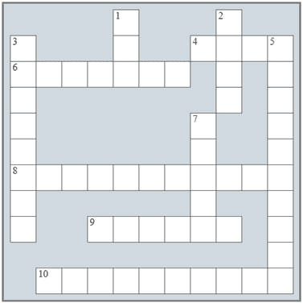

## 第三十七章：在“循环控制结构”复习

### 复习填字游戏

1)解决以下填字游戏。

横向

4)这个控制结构允许多次执行一个语句块。

6)一个无法停止迭代的循环。

8)“终极”规则指出，参与循环布尔表达式的变量必须在进入循环之前 _________。

9)一个循环在另一个循环内部。

10)在这个循环结构中，迭代次数在循环开始迭代之前是未知的。

纵向

1)在一个 _______-测试循环结构中，首先评估布尔表达式，然后执行结构中的语句或语句块。

2)_______-测试循环至少执行一次迭代。

3)在这个循环结构中，迭代次数在循环开始迭代之前是已知的。

5)一个读起来前后相同的单词或句子。

7)任何大于 1 的整数，除了 1 和它自己没有其他除数。

### 复习问题

回答以下问题。

1)什么是循环控制结构？

2)在流程图中，你如何区分决策控制结构和循环控制结构？

3)设计流程图并编写一个 pre-test 循环结构的 Python 语句（一般形式）。解释这个循环控制结构是如何工作的。

4)为什么预测试循环结构会这样命名，它可能执行的最少迭代次数是多少？

5)如果一个预测试循环结构的语句或语句块执行了 N 次，那么这个结构的布尔表达式被评估了多少次？

6)设计流程图并编写一个 post-test 循环结构的相应 Python 语句（一般形式）。解释这个循环控制结构是如何工作的。

7)为什么后测试循环结构会这样命名，它可能执行的最少迭代次数是多少？

8)如果一个 post-test 循环结构的语句或语句块执行了 N 次，那么这个结构的布尔表达式被评估了多少次？

9)设计流程图并编写一个 mid-test 循环结构的相应 Python 语句（一般形式）。解释这个循环控制结构是如何工作的。

10)设计流程图并编写一个 for 循环的相应 Python 语句（一般形式）。解释这个循环控制结构是如何工作的。

11)说明适用于 for 循环的规则。

12)嵌套循环是什么？

13)编写一个使用嵌套循环控制结构的示例程序，并解释它们是如何执行的。

14)说明适用于嵌套循环的规则。

15)设计一个图表，可以帮助人们根据给定问题决定选择哪种循环控制结构。

16)描述“终极”规则，并给出两个示例，使用预测试和后测试循环结构的一般形式。

17) 假设一个 Python 程序使用循环控制结构在电子英语词典中搜索一个给定的单词。为什么在找到给定单词时退出循环是至关重要的？

18) 清理循环为什么是至关重要的？

19) 什么是无限循环？
