## 第三十章

一维列表和字典

### 30.1 简介

变量是存储内存中的值的好方法，但它们有一个限制——一次只能存储一个值。然而，有许多情况下，程序需要将大量数据存储在内存中，而变量并不是最佳选择。

例如，考虑以下练习：

编写一个 Python 程序，让用户输入三个数字。然后按升序显示它们。

考虑以下代码片段。它允许用户输入三个数字。

for i in range(3):

number = float(input())

当循环最终完成迭代时，变量 number 只包含最后提供的那个数字。不幸的是，前两个数字已经丢失了！使用此代码片段，几乎不可能按升序显示它们。

一个可能的解决方案是使用三个单独的变量，如下所示。

num1 = float(input())

num2 = float(input())

num3 = float(input())

if num1 <= num2 <= num3:

print(num1, num2, num3)

elif num1 <= num3 <= num2:

print(num1, num3, num2)

elif num2 <= num1 <= num3:

print(num2, num1, num3)

elif num2 <= num3 <= num1:

print(num2, num3, num1)

elif num3 <= num1 <= num2:

print(num3, num1, num2)

else:

print(num3, num2, num1)

这不是一个完美的解决方案，但它有效！然而，如果这个练习的措辞要求用户输入 1000 个数字而不是三个呢？想想看！你能为所有这些数字编写类似的 Python 程序吗？当然不能！幸运的是，有数据结构！

在计算机科学中，数据结构是一组组织良好的数据，以便以最有效的方式对其执行操作。

Python 中有几种数据结构可用，如列表、元组、字典、集合、冻结集合和字符串。是的，你听对了！由于字符串是一组字母数字字符的集合，它被视为数据结构。

除了字符串（你已经学得足够多了）之外，列表和字典是 Python 中最常用的数据结构。以下章节将分析这两个。

### 30.2 列表是什么？

列表是一种数据结构类型，可以在一个共同的名称下存储多个值。它可以被视为一个元素集合，其中每个元素都分配了一个唯一的数字，称为索引位置，或简单地称为索引。列表是可变的（可更改的），这意味着一旦创建列表，其元素的值就可以更改，并且可以向列表中添加新元素或从列表中删除元素。

计算机科学中的列表类似于数学中使用的矩阵。数学矩阵是一组数字或其他数学对象，按行和列排列。

在许多计算机语言中，例如 Java、C++和 C#（仅举几个例子），没有列表。这些语言支持另一种称为“数组”的数据结构。然而，列表比数组更强大。

存在一维和多维列表。多维列表可以是二维的、三维的、四维的，等等。

一维列表

以下示例展示了一个一维列表，该列表包含了六个学生的成绩。列表的名称是 grades。为了方便起见，每个元素上对应着相应的索引。默认情况下，在 Python 中，索引编号总是从零开始。

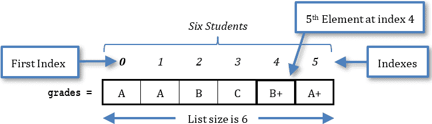

由于索引编号从零开始，列表中最后一个元素的索引比列表中元素的总数少 1。在 grades 列表中，最后一个元素的索引是 5，而元素总数是 6。

你可以将列表想象成六个单独的变量——grades0、grades1、grades2、... grades5，每个变量都保存一个学生的成绩。然而，列表的优势在于它可以在一个共同的名称下保存多个值。

二维列表

通常，多维列表适用于处理多组数据。例如，假设你想要保存加利福尼亚州 4 月四周的每日最高气温。一种方法就是使用四个一维列表，每个列表代表一周。此外，每个列表将包含七个元素，每个元素代表一周中的某一天，如下所示。

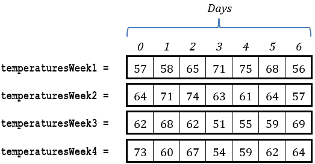

然而，这种方法有点笨拙，因为你必须分别处理每个列表。更好的方法是将一个二维列表使用四行（每行代表一周）和七列（每列代表一周中的某一天），如下所示。

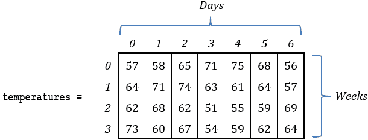

三维列表

下一个示例展示了一个三维列表，该列表包含了 2013 年和 2014 年 4 月四周内加利福尼亚州的每日最高气温。

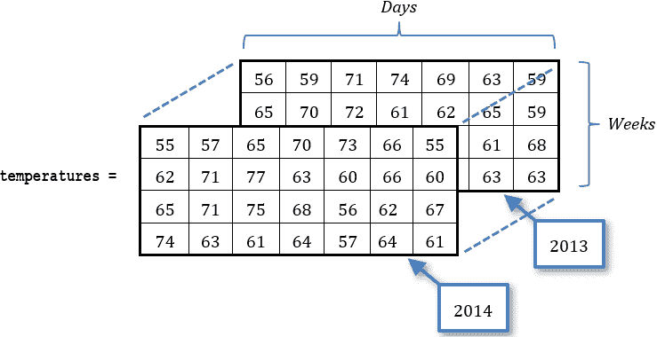

请注意，四维、五维甚至一百维的列表都可以存在。然而，经验表明，作为程序员，你一生中可能需要的最大列表维度可能是两维或三维。

#### 练习 30.2-1 设计列表

设计一个可以保存 8 个人年龄的列表，并向列表中添加一些典型值。

解答

这是一个简单的问题。你所要做的就是设计一个包含 8 个元素（索引 0 到 7）的列表。它可以是一个只有一行或一列的列表，如下所示。

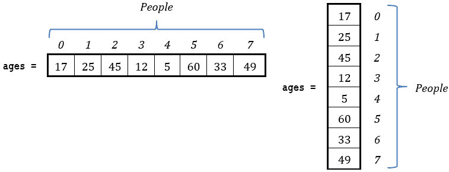

然而，请记住，Python 中没有一行或一列的列表。这些概念可能存在于数学矩阵中（或者在你的想象中！）但不在 Python 中。Python 中的列表是一维的——这就是全部！如果你想要可视化它们有一行或一列，那取决于你。

#### 练习 30.2-2 设计列表

设计必要的列表来存储七个人的姓名和年龄，然后向列表中添加一些典型值。

解答

这个练习可以用两个列表来实现。让我们设计它们，每个列表有一列。

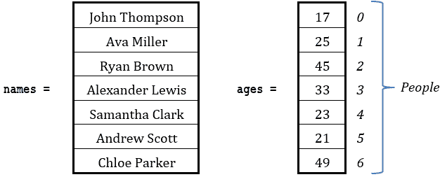

如您所见，列表名称中的元素与列表年龄中的元素之间存在一一对应关系。这七个人中的第一个是约翰·汤普森，他 17 岁。名称“约翰·汤普森”存储在列表名称的索引 0 处，而在列表年龄的相同索引处存储了他的年龄。下一个人的姓名（艾娃·米勒）和她的年龄（25 岁）分别存储在列表名称和年龄的索引 1 处，以此类推。

#### 练习 30.2-3 设计列表

设计必要的列表来存储十个人的姓名以及每个人一月份、二月份和三月份的平均体重（以磅为单位）。然后向列表中添加一些典型值。

解答

在这个练习中，你需要一个一维列表来存储姓名，以及一个二维列表来存储人们的体重，它们的元素之间存在一一对应关系。

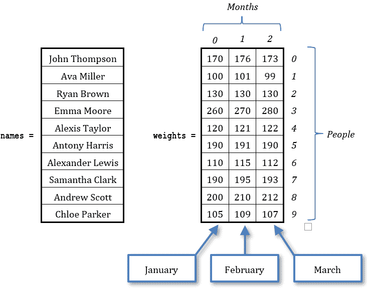

### 30.3 在 Python 中创建一维列表

Python 有许多创建列表并向其中添加元素（和值）的方法。根据给定的问题，取决于你选择哪一种。

让我们尝试使用最常见的方法来创建以下列表。

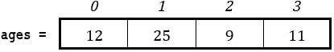

第一种方法

要创建一个列表并直接向其元素分配值，你可以使用以下 Python 语句，以通用形式给出。

list_name = [ value0, value1, value2, …, valueM ]

其中

►list_name 是列表的名称。

►value0, value1, value2, … , valueM 是列表元素的值。

对于这种方法，你可以使用以下语句来创建列表 ages：

ages = [12, 25, 9, 11]

索引是自动设置的。值 12 被分配给索引位置 0 的元素，值 25 被分配给索引位置 1 的元素，依此类推。默认情况下，索引编号总是从零开始。

在第 5.4 节中，你学习了在给变量命名时必须遵循的规则。给列表命名遵循完全相同的规则！

第二种方法

你可以使用以下通用形式的语句在 Python 中创建一个大小为空元素的列表：

list_name = [None] * size

其中 size 可以是任何正整数值，甚至可以是包含任何正整数值的变量。

下一个语句创建了包含 4 个空元素的列表 ages。

ages = [None] * 4

语句 ages = [None] * 4 在主内存（RAM）中保留了四个位置。

要将值赋给列表元素，你可以使用以下语句，以一般形式给出：

list_name[index] = value

其中 index 是列表中元素的索引位置。

以下代码片段创建列表 ages（在主内存中保留四个位置），然后为其元素赋值。

ages = [None] * 4

ages[0] = 12

ages[1] = 25

ages[2] = 9

ages[3] = 11

列表 ages 的大小是 4。

当然，除了使用常量值作为索引外，你还可以使用变量或表达式，如下所示。

ages = [None] * 4

k = 0

ages[k] = 12

ages[k + 1] = 25

ages[k + 2] = 9

ages[k + 3] = 11

第三种方法

在这种方法中，你可以创建一个完全空的列表（没有元素），然后使用 append()方法向其中添加元素（和值），如下面的 Python 语句所示，以一般形式给出。

list_name = []

list_name.append(value0)

list_name.append(value1)

list_name.append(value2)

…

list_name.append(valueM)

使用这种方法，你可以使用以下代码片段创建名为 ages 的列表：

ages = []

ages.append(12)

ages.append(25)

ages.append(9)

ages.append(11)

请注意，在这种方法中，默认情况下索引编号从零开始，这意味着值 12 存储在索引位置 0，值 25 存储在索引位置 1，依此类推。

语句 ages = []不会在主内存（RAM）中保留任何位置。它只是声明列表 ages 已准备好接受新元素。

### 30.4 如何从一个一维列表中获取值

从列表中获取值只是指向一个特定元素的问题。一维列表中的每个元素都可以使用索引唯一标识。以下代码片段创建了一个列表，并在屏幕上显示“A+”（不带双引号）。

grades = ["B+", "A+", "A", "C-"]

print(grades[1])

当然，除了使用常量值作为索引外，你还可以使用变量或表达式。以下示例创建了一个列表，并在屏幕上显示“Aphrodite and Hera”（不带双引号）。

gods = ["Zeus", "Ares", "Hera", "Aphrodite", "Hermes"]

k = 2

print(gods[k + 1], "and", gods[k])

一个负索引从列表的末尾开始计数，访问一个元素。在以下列表 grades 中，每个元素（使用负索引）的索引位置如下。

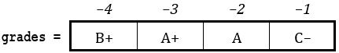

以下示例

grades = ["B+", "A+", "A", "C-"]

print(grades[-1] , "and", grades[-3])

在屏幕上显示“C− and A+”（不带双引号）。

如果你希望显示列表中的所有元素，你可以这样做

grades = ["B+", "A+", "A", "C-"]

print(grades) # 显示: ['B+', 'A+', 'A', 'C-']

在 Python 中，你可以使用单引号或双引号定义字符串。

就像在字符串中一样，你可以获取列表的子集，称为“切片”，如下所示。

grades = ["B+", "A+", "A", "C-"]

print(grades[1:3])        #It displays: ["A+", "A"]

Python 中的切片是一种从列表（或一般序列）中选择元素范围的机制。

切片机制还可以有一个第三个参数，称为步长，如下所示。

grades = ["B+", "A+", "A", "C-", "A-", "B-", "C", "B", "C+"]

print(grades[1:7:2])        #It displays: ['A+', 'C-', 'B-']

负步长返回列表的逆序子集

gods = ["Ares", "Hera", "Aphrodite", "Hermes"]

print(gods[2:0:-1])   #It displays: ['Aphrodite', 'Hera']

print(gods[::-1])     #It displays: ['Hermes', 'Aphrodite', 'Hera', 'Ares']

切片机制使用以下记法

list[[beginIndex] : [endIndex] [: step]]

and returns a portion of list. Specifically, it returns the sublist starting from position beginIndex and running up to, but not including, position endIndex or up to the end of list, whichever comes first. Both arguments beginIndex and endIndex are optional. If beginIndex is omitted, the sublist starting from position 0 and running up to, but not including, position endIndex is returned. If endIndex is omitted, the sublist starting from position beginIndex until the end of list is returned. The last argument step is optional as well. If omitted, its default value is 1\. If supplied, it defines the number of elements you want to move forward after each element is retrieved from the original list.

#### 练习 30.4-1 创建跟踪表

Create the trace table for the next code fragment.

a = [None] * 4

a[3] = 9

x = 0

a[x] = a[3] + 4

a[x + 1] = a[x] * 3

x += 1

a[x + 2] = a[x - 1]

a[2] = a[1] + 5

a[3] = a[3] + 1

Solution

不要忘记，你可以像操作变量一样操作列表中的每个元素。因此，当你为使用列表的 Python 程序创建跟踪表时，你可以为每个元素设置一列，如下所示。

| 步骤 | 语句 | 备注 | x | a[0] | a[1] | a[2] | a[3] |
| --- | --- | --- | --- | --- | --- | --- | --- |
| 1 | a = [None] * 4 | This creates list a with no values in it | ? | ? | ? | ? | ? |
| 2 | a[3] = 9 |   | ? | ? | ? | ? | 9 |
| 3 | x = 0 |   | 0 | ? | ? | ? | 9 |
| 4 | a[x] = a[3] + 4 |   | 0 | 13 | ? | ? | 9 |
| 5 | a[x + 1] = a[x] * 3 |   | 0 | 13 | 39 | ? | 9 |
| 6 | x += 1 |   | 1 | 13 | 39 | ? | 9 |
| 7 | a[x + 2] = a[x − 1] |   | 1 | 13 | 39 | ? | 13 |
| 8 | a[2] = a[1] + 5 |   | 1 | 13 | 39 | 44 | 13 |
| 9 | a[3] = a[3] + 1 |   | 1 | 13 | 39 | 44 | 14 |

#### 练习 30.4-2 使用不存在的索引

以下 Python 程序不满足算法的哪些属性？

grades = ["B+", "A+", "A", "C-"]

print(grades[100])

Solution

该 Python 程序不满足两个属性。第一个属性很明显：没有数据输入。第二个属性是确定性属性。你永远不要引用列表中不存在的元素。在这个练习中，由于索引位置 100 没有元素，最后一个语句抛出了运行时错误。

### 30.5 如何更改列表元素的值

修改现有列表元素的值轻而易举。你只需要使用适当的索引并将新值赋给该元素。下面的例子正好展示了这一点。

# 创建一个列表

tribes = ["Navajo", "Cherokee", "Sioux"]

print(tribes)    # 它显示：['Navajo', 'Cherokee', 'Sioux']

# 修改现有元素的值

tribes[1] = "Apache"

print(tribes)    # 它显示：['Navajo', 'Apache', 'Sioux']

### 30.6 如何遍历一维列表

现在是有趣的部分。一个程序可以使用循环控制结构（通常是 for 循环）遍历列表的元素。你可以使用两种方法遍历一维列表。

第一种方法

这种方法通过索引引用每个列表元素。以下是一个通用形式的代码片段

for index in range(size):

process structure_name[index]

在其中，process 是每次迭代处理列表结构 _name 的一个 Python 语句或语句块。

以下 Python 程序在每次迭代中显示列表 gods 的所有元素。

gods = ["Zeus", "Ares", "Hera", "Aphrodite", "Hermes"]

for i in range(5):

print(gods[i])

i 变量的名称不是绑定性的。你可以使用任何你想要的变量名，比如 index、ind、j 等等。

注意，由于列表 gods 包含五个元素，for 循环必须从 0 迭代到 4，而不是从 1 迭代到 5。这是因为四个元素的索引分别是 0、1、2、3 和 4。

由于列表是可变的，你可以使用循环控制结构来修改其所有或部分值。以下代码片段将列表 b 中某些元素的值翻倍。

b = [80, 65, 60, 72, 30, 40]

for i in range(3):

b[i] = b[i] * 2

第二种方法

这种方法很简单，但不如前一种灵活。在某些情况下，它不能使用，你将在下面看到。以下是一个通用形式的代码片段

for element in structure_name:

process element

在其中，process 是每次迭代处理列表结构 _name 的一个 Python 语句或语句块。

以下 Python 程序，在每次迭代中显示列表 grades 的所有元素。

grades = ["B+", "A+", "A", "C-"]

for grade in grades:

print(grade)

在第一次迭代中，第一个元素的值被赋给变量 grade。在第二次迭代中，第二个元素的值被赋给变量 grade，依此类推！

以下 Python 程序以逆序显示列表 gods 的每个元素。

gods = ["Hera", "Zeus", "Ares", "Aphrodite", "Hermes"]

for god in gods[::-1]:

print(god)

但是，请记住，这种方法不能用来修改列表中元素的值。例如，如果你想将列表 numbers 中所有元素的值翻倍，你不能这样做：

numbers = [5, 10, 3, 2]

for number in numbers:

number = number * 2

number 是一个简单的变量，在每次迭代中，列表 numbers 的后续值被分配给它。然而，情况相反！number 的值永远不会分配回任何元素！

如果你想改变列表中元素的价值，你应该使用第一种方法。

#### 练习 30.6-1 求和

编写一个 Python 程序，创建一个包含以下值的列表

56, 12, 33, 8, 3, 2, 98

然后计算并显示它们的总和。

解决方案

你学习了两种遍历列表元素的方法。让我们使用这两种方法并看看它们的区别。下面你会发现一个额外的第三种方法，这是计算一维列表元素总和的 Pythonic 方式。

第一种方法

解决方案如下。

 file_30.6-1a

values = [56, 12, 33, 8, 3, 2, 98]

total = 0

for i in range(7):

total += values[i]    #这相当于 total = total + values[i]

print(total)

第二种方法

解决方案如下。

 file_30.6-1b

values = [56, 12, 33, 8, 3, 2, 98]

total = 0

for value in values:

total += value

print(total)

第三种方法

这种方法不使用任何循环结构。它只是使用了 math 模块中的 fsum()函数。

 file_30.6-1c

from math import fsum

values = [56, 12, 33, 8, 3, 2, 98]

total = fsum(values)

print(total)

如果你对 fsum()函数没有任何印象，可以通过重新阅读第 11.2 节来刷新你的记忆。

### 30.7 如何将用户输入的值添加到一维列表中

这里没有什么新的内容。不是从键盘读取一个值并将其分配给一个变量，你可以直接将那个值分配给特定的列表元素。下一个代码片段提示用户输入四个人的姓名，并将它们分配给 names 列表的索引位置 0、1、2 和 3。

names = [None] * 4    #在主存（RAM）中预保留 4 个位置

names[0] = input("输入姓名编号 1: ")

names[1] = input("输入姓名编号 2: ")

names[2] = input("输入姓名编号 3: ")

names[3] = input("输入姓名编号 4: ")

使用 for 循环，这段代码可以等价地写成

ELEMENTS = 4

names = [None] * ELEMENTS    #在主存（RAM）中预保留 4 个位置

for i in range(ELEMENTS):

names[i] = input("输入姓名编号 " + str(i + 1) + ": ")

你当然也可以这样做，使用 append()方法代替，如下面的代码片段所示。

ELEMENTS = 4

names = []    #创建一个完全空的列表

for i in range(ELEMENTS):

name = input("输入姓名编号 " + str(i + 1) + ": ")

names.append(name)

当使用 append()方法时，元素会被添加到列表中（添加到列表的末尾）。

处理列表大小的一个非常好的策略是使用常量。然而，与一些其他编程语言（如 C#或 C++）不同，Python 本身不支持常量。相反，你可以使用变量来实现类似的结果。不过，建议只使用大写字母。这有助于你从视觉上区分用作常量的变量和普通变量。

#### 练习 30.7-1 以逆序显示单词

编写一个 Python 程序，让用户输入 20 个单词。程序必须然后以它们提供的顺序的逆序显示它们。

解决方案

列表非常适合这类问题。以下是一个合适的解决方案。

 file_30.7-1a

words = [None] * 20    #在主内存（RAM）中预保留 20 个位置

for i in range(20):

words[i] = input()

for i in range(19, -1, -1):

print(words[i])

由于索引编号从零开始，列表中最后一个元素的索引比列表中元素的总数少 1。

请记住，在 Python 中，你可以使用切片机制和步长为-1 来以逆序遍历列表元素。以下程序创建了一个完全空的列表，然后使用 append()方法向列表中添加元素。最后，使用切片机制以它们提供的顺序的相反顺序显示它们。

 file_30.7-1b

words = []    #创建一个完全空的列表

for i in range(20):

words.append(input())

for word in words[::-1]:

print(word)

有时练习的措辞可能没有提到使用数据结构。然而，这并不意味着你不能使用它。当你发现需要时，请使用数据结构（列表、元组、字典等）。

一个“元组”几乎与列表相同。主要区别是元组是不可变的（不可更改的）。

一个“不可变”的数据结构是在数据结构创建后其元素值不能改变的结构。显然，你无法向不可变数据结构中添加新元素或从其中删除现有元素。

#### 练习 30.7-2 以逆序显示正数

编写一个 Python 程序，让用户输入 100 个数字到一个列表中。然后，它只显示提供的顺序的逆序中的正数。

解决方案

在这个练习中，程序必须接受用户的所有值并将它们存储到一个列表中。然而，在负责显示列表元素的 for 循环中，一个嵌套的决策控制结构必须检查并显示仅有的正数。解决方案如下。

 file_30.7-2

ELEMENTS = 100

values = [None] * ELEMENTS

for i in range(ELEMENTS):

values[i] = float(input())

for value in values[::-1]:

if value > 0:

> print(value)

与一些其他编程语言（如 C#或 C++）不同，Python 本身不支持常量。相反，您可以使用变量来实现类似的结果。不过，建议只使用大写字母。这有助于您在视觉上区分用作常量的变量和普通变量。

#### 练习 30.7-3 查找平均值

编写一个 Python 程序，提示用户输入 20 个数字到一个列表中。然后，只有在它们的平均值小于 10 时才显示一条消息。

解答

为了找到用户提供的数字的平均值，程序必须首先找到它们的总和，然后将该总和除以 20。一旦找到平均值，程序必须检查是否显示相应的消息。

 file_30.7-3a

ELEMENTS = 20

values = [None] * ELEMENTS

for i in range(ELEMENTS):

values[i] = float(input("Enter a value: "))

#Accumulate values in total

total = 0

for i in range(ELEMENTS):

total += values[i]

average = total / ELEMENTS

if average < 10:

print("Average value is less than 10")

如果你想知道这个练习是否可以用一个循环解决，答案是“可以”。下面将提供一个替代解决方案。

 file_30.7-3b

ELEMENTS = 20

total = 0

values = [None] * ELEMENTS

for i in range(ELEMENTS):

values[i] = float(input("Enter a value: "))

total += values[i]

average = total / ELEMENTS

if average < 10:

print("Average value is less than 10")

但让我们澄清一下！尽管许多过程可以在一个循环中完成，但将每个单独的过程在一个单独的循环中执行会更简单。这可能不是那么高效，但既然你还是一个新手程序员，试着先采用这种编程风格。以后，当你有了经验并成为 Python 大师时，你将能够“合并”一个循环中的许多过程！

现在，让我们看看使用 fsum()函数的更 Pythonic 的方法。

 file_30.7-3c

from math import fsum

ELEMENTS = 20

values = []

for i in range(ELEMENTS):

values.append(float(input("Enter a value: ")))

if fsum(values) / ELEMENTS < 10:

print("Average value is less than 10")

#### 练习 30.7-4 仅显示实数

编写一个 Python 程序，提示用户输入 10 个数值到一个列表中。然后，程序必须显示包含实数的元素的索引。

解答

在练习 22.1-1 中，你学习了如何检查一个数是否为整数。相应地，要检查一个数是否为实数（浮点数），可以使用布尔表达式

number != int(number)

解决方案如下。

 file_30.7-4

ELEMENTS = 10

b = [None] * ELEMENTS

for i in range(ELEMENTS):

b[i] = float(input("Enter a value for element " + str(i) + ": "))

for i in range(ELEMENTS):

if b[i] != int(b[i]):

> print("A real found at index:", i)

#### 练习 30.7-5 显示奇数索引的元素

编写一个 Python 程序，提示用户将 8 个数值输入到一个列表中。然后程序必须显示奇数索引的元素（即索引 1、3、5 和 7）。

解答

以下是一个可能的解决方案。

 file_30.7-5a

ELEMENTS = 8

values = [None] * ELEMENTS

for i in range(ELEMENTS):

values[i] = float(input("请输入元素 " + str(i) + " 的值: "))

# 显示奇数索引的元素

for i in range(ELEMENTS):

if i % 2 != 0:

> print(values[i])

然而，你知道只有奇数索引位置的值需要显示。因此，负责显示列表元素的 for 循环，而不是从 0 开始计数并使用步长+1，可以从 1 开始计数并使用步长+2。这种修改将迭代次数减半。修改后的 Python 程序如下。

 file_30.7-5b

ELEMENTS = 8

values = [None] * ELEMENTS

for i in range(ELEMENTS):

values[i] = float(input("请输入元素 " + str(i) + " 的值: "))

# 显示奇数索引的元素

for i in range(1, ELEMENTS, 2):         # 从 1 开始，每次增加 2

print(values[i])

如前所述，在 Python 中，你可以使用切片机制遍历列表元素。在以下程序中，切片机制用于仅显示奇数索引的元素。

 file_30.7-5c

ELEMENTS = 8

values = [None] * ELEMENTS

for i in range(ELEMENTS):

values[i] = float(input("请输入元素 " + str(i) + " 的值: "))

# 显示奇数索引的元素

for value in values[1::2]:      # 从 1 开始，每次增加 2

print(value)

#### 练习 30.7-6 在奇数索引位置显示偶数

编写一个 Python 程序，允许用户输入 100 个整数到一个列表中，然后显示存储在奇数索引位置的任何偶数值。

解答

以下是一个可能的解决方案。

 file_30.7-6a

ELEMENTS = 100

values = [None] * ELEMENTS

for i in range(ELEMENTS):

values[i] = int(input())

for i in range(1, ELEMENTS, 2):      # 从 1 开始，每次增加 2

if values[i] % 2 == 0:

> print(values[i])

然而，一种更 Pythonic 的方法是使用此处所示的切片机制。

 file_30.7-6b

ELEMENTS = 100

values = []

for i in range(ELEMENTS):

values.append(int(input()))

for value in values[1::2]:

if value % 2 == 0:

> print(value)

### 30.8 关于连接和重复操作符的更多内容

在第 7.5 节中，你学习了如何使用字符串运算符（+）和（*）相应地连接和重复字符串。相同的运算符以及它们对应的赋值运算符（+=）和（*=）也可以用于列表。更具体地说，连接运算符（+）和连接赋值运算符（+=）可以用来连接两个（或更多）列表，而重复运算符（*）和重复赋值运算符（*=）可以用来重复相同的列表多次。让我们看一些例子。

以下代码片段创建列表 x，最终包含的值[1, 2, 3, 4, 5, 6]。

a = [1, 2]

b = [3, 4]

x = a + b   # 列表 x 包含的值[1, 2, 3, 4]

x += [5, 6]   # 列表 x 包含的值[1, 2, 3, 4, 5, 6]

你已经在第 30.3 节中使用了重复运算符（*）来创建一个使用以下一般形式给出的语句的空元素列表：

list_name = [None] * size

这个语句实际上所做的就是重复一个只有一个空元素（这是大小为[None]的列表）的列表大小次。例如，以下代码片段迭代列表[None] 3 次。

x = [None] * 3   # 列表 x 包含的值[None, None, None]

以下代码片段创建列表 x，最终包含的值[5, 6, 5, 6, 5, 6, 5, 6, 5, 6, 5, 6]。

x = [5, 6] * 2   # 列表 x 包含的值[5, 6, 5, 6]

x *= 3   # 列表 x 包含的值[5, 6, 5, 6, 5, 6, 5, 6, 5, 6, 5, 6]

### 30.9 什么是字典？

在计算机科学中，字典和列表之间的主要区别在于，字典元素可以通过键唯一标识，而不一定是整数值。字典的每个键都与一个元素相关联（或者如果你愿意，可以映射）。字典的键可以是字符串、整数、浮点数或元组。

以下示例展示了一个包含家庭成员名称的字典。字典的名称是 family，相应的键写在每个元素上方。

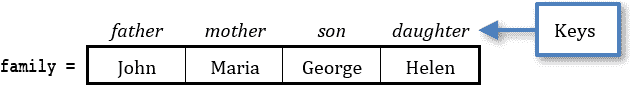

字典元素的键必须在字典内是唯一的。这意味着在字典家族中，例如，你不能有两个名为 father 的键。

字典元素的值可以是任何类型。

### 30.10 在 Python 中创建字典

让我们尝试使用最常见的方法来创建以下字典。

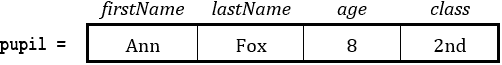

首次方法

要创建一个字典并直接为其元素赋值，可以使用以下 Python 语句，以一般形式给出。

dict_name = {key0: value0, key1: value1, key2: value2, …, keyM: valueM }

其中

►dict_name 是字典的名称。

►key0, key1, key2, … , keyM 是字典元素的键。

►value0, value1, value2, … , valueM 是字典元素的值。

使用这种方法，可以使用以下语句创建字典 pupil：

pupil = {"firstName": "Ann", "lastName": "Fox", "age": 8, "class": "2nd"}

每个键与其值之间由冒号（:）分隔，元素之间由逗号分隔，所有内容都包含在大括号（{}）内。

在第 5.4 节中，你学习了在给变量命名时必须遵循的规则。给字典命名遵循完全相同的规则！

第二种方法

在这种方法中，你可以使用以下语句创建一个完全空的字典，如一般形式所示。

dict_name = {}

然后在以下 Python 语句中添加一个元素（键值对），如所示，以一般形式给出。

dict_name[key] = value

使用这种方法，可以使用以下代码片段创建 pupil 字典：

pupil = {}

pupil["firstName"] = "Ann"

pupil["lastName"] = "Fox"

pupil["age"] = 8

pupil["class"] = "2nd"

### 30.11 如何从字典中获取值

要获取特定字典元素的值，你必须使用相应的键指向该元素。以下代码片段创建了一个字典，然后在屏幕上显示“Ares is the God of War”（不包含双引号）。

olympians = {

"Zeus": "King of the Gods",

"Hera": "Goddess of Marriage",

"Ares": "God of War",

"Poseidon": "God of the Sea",

"Demeter": "Goddess of the Harvest",

"Artemis": "Goddess of the Hunt",

"Apollo": "God of Music and Medicine",

"Aphrodite": "Goddess of Love and Beauty",

"Hermes": "Messenger of the Gods",

"Athena": "Goddess of Wisdom",

"Hephaistos": "God of Fire and the Forge",

"Dionysus": "God of the Wine"

}

print("Ares is the", olympians["Ares"])

只能使用键来访问元素。这意味着 olympians["Ares"]正确返回“God of War”，但 olympians["God of War"]无法返回“Ares”。

#### 练习 30.11-1 罗马数字转数字

罗马数字如下表所示。

| Number | Roman Numeral |
| --- | --- |
| 1 | I |
| 2 | II |
| 3 | III |
| 4 | IV |
| 5 | V |

编写一个 Python 程序，提示用户输入一个介于 I 和 V 之间的罗马数字，然后显示相应的数字。假设用户输入的是有效值。

解决方案

显然，解决方案将是使用类似于以下代码片段的多重选择决策结构。

if romanNumeral == "I"

number = 1

elif romanNumeral == "II"

number = 2

elif romanNumeral == "III"

number = 3

elif romanNumeral == "IV"

number = 4

elif romanNumeral == "V"

number = 5

然而，这种方法相当冗长，如果你想要扩展你的程序以处理更多的罗马数字，它可能会变得更加复杂。因此，掌握了关于字典的知识后，你可以采用更有效的方法，如下面的代码片段所示。

roman2number = {"I": 1, "II": 2, "III": 3, "IV": 4, "V": 5}

number = roman2number[romanNumeral]

本练习的解决方案如下。

 file_30.11-1

roman2number = {"I": 1, "II": 2, "III": 3, "IV": 4, "V": 5}

romanNumeral = input("Enter a Roman numeral: ")

number = roman2number[romanNumeral]

print(romanNumeral + ":", number)

#### 练习 30.11-2 在字典中使用不存在的键

以下 Python 程序有什么问题？

family = {"father": "John", "mother": "Maria", "son": "George"}

print(family["daughter"])

解决方案

与列表类似，这段代码不满足确定性属性。你永远不要引用一个不存在的字典元素。由于没有键“daughter”，最后一行会抛出一个运行时错误。

### 30.12 如何修改字典元素的值

要修改现有字典元素的值，你需要使用适当的关键字并将新值赋给该元素。下面的例子正好展示了这一点。

#创建一个字典

tribes = {"Indian": "Navajo", "African": "Zulu"}

print(tribes) #它显示: {'Indian': 'Navajo', 'African': 'Zulu'}

#修改现有元素的值

tribes["Indian"] = "Apache"

print(tribes) #它显示: {'Indian': 'Apache', 'African': 'Zulu'}

#### 练习 30.12-1 向不存在的键赋值

以下代码片段有什么问题？

tribes = {0: "Navajo", 1: "Cherokee", 2: "Sioux"}

tribes[3] = "Apache"

解决方案

不，这次代码片段中绝对没有任何错误。乍一看，你可能以为最后一行尝试修改一个不存在的键的值，这将引发错误。然而，对于 Python 字典来说并非如此。因为`tribes`是一个字典，键“3”不存在，所以最后一行向字典中添加了一个全新的第四个元素！

字典的键可以是字符串、整数、浮点数或元组。

虽然如此，但如果`tribes`实际上是一个列表，最后一行肯定会引发错误。看看下面的代码片段

tribes = ["Navajo", "Cherokee", "Sioux"]

tribes[3] = "Apache"

在这个例子中，由于`tribes`是一个列表，索引 3 不存在，所以最后一行尝试修改一个不存在的元素的值，显然会引发错误！

### 30.13 如何遍历字典

要遍历字典的元素，你可以使用 for 循环。实际上有两种方法。让我们研究一下这两种方法！

第一种方法

以下是一个通用形式的代码片段

for key in structure_name:

process structure_name[key]

在哪个过程中，任何 Python 语句或语句块都会在每次迭代中处理`structure_name`字典的一个元素。

以下 Python 程序显示了字母 A、B、C 和 D 及其对应的摩尔斯电码。

morseCode = {"A": ".-", "B": "-...", "C": "-.-.", "D": "-.."}

for letter in morseCode:

print(letter, morseCode[letter])

下一个示例给计算机软件公司的每位员工额外奖励$2000！

salaries = {

"项目经理": 83000,

"软件工程师": 81000,

"网络工程师": 64000,

"系统管理员": 61000,

"软件开发工程师": 70000

}

for title in salaries:

salaries[title] += 2000

第二种方法

以下是一个代码片段，以通用形式编写

for key, value in structure_name.items():

process key, value

在其中，任何 Python 语句或语句块都会在每次迭代中处理字典结构 structure_name 的一个元素。

以下 Python 程序显示字典 grades 的所有元素，每个迭代一个。

grades = {"John": "B+", "George": "A+", "Maria": "A", "Helen": "A-"}

for name, grade in grades.items():

print(name, "got", grade)

不幸的是，这种方法不能用来改变字典中元素值的值。例如，如果你想将字典 salaries 中所有元素的值加倍，你不能这样做：

salaries = {

"项目经理": 83000,

"软件工程师": 81000,

"网络工程师": 64000,

"系统管理员": 61000,

"软件开发工程师": 70000

}

for title, salary in salaries.items():

salary *= 2

salary 是一个简单的变量，在每次迭代中，字典 salaries 的后续值被分配给它。然而，相反的情况永远不会发生！salary 的值永远不会分配回任何元素！

如果你想改变字典中元素的值，你应该使用第一种方法。

### 30.14 关于成员运算符的更多内容

在第 15.5 节中，你学习了 Python 的成员运算符 in 和 not in。你同样可以使用这些运算符来评估操作数是否存在于指定的数据结构中。让我们看看一些示例。

以下示例显示“存在！”

x = [1, 2, 3, 4, 5, 6]

if 3 in x:

print("It exists!")

以下示例在列表 y 中查找“George”。

y = ["John", "Maria", "Anna", "George", "Tes"]

if "George" in y:

print("I found George!!!!")

注意，in 运算符检查操作数是否存在于数据结构中。它不能找到操作数被找到的索引位置！

以下示例提示用户输入一个名字，然后检查该名字是否不在列表 y 中。

y = ["John", "Maria", "Anna", "George", "Tes"]

name = input("Enter a name to search: ")

if name not in y:

print(name, "not found!!!!")

以下示例检查键“Son”是否存在于字典 family 中。

family = {"Father": "John", "Mother": "Maria", "Son": "George"}

if "Son" in family:

print("Key 'Son' found!")

### 30.15 复习问题：正确/错误

对以下每个陈述选择正确或错误。

1)列表是能够存储多个值的结构。

2)列表元素位于主存储器（RAM）中。

3)列表只能是单维或二维的。

4)不能有四维列表。

5)列表被称为“多维”是因为它可以包含不同类型的数据。

6)每个列表元素都有一个唯一的非负索引。

7)在字典中可以有重复的键。

8)在列表中，默认情况下索引编号从零开始。

9)最后一个列表元素的索引等于其元素的总数。

10)可以存在一个二维列表。

11)下一个语句包含语法错误。

studentNames = None * 10

12)在 Python 程序中，两个列表不能有相同的名称。

13)下一个语句在语法上是正确的。

student = {"firstName": "Ann" - "lastName": "Fox" - "age": 8}

14)在 Python 程序中，两个列表不能有相同数量的元素。

15)您不能在列表中使用变量作为索引。

16)您可以在列表中使用数学表达式作为索引。

17)您不能在字典中使用变量作为键。

18)以下代码片段不会抛出错误。

a = "a"

fruits = {"o": "Orange", "a": "Apple", "w": "Watermelon"}

print(fruits[a])

19)如果您在列表中使用变量作为索引，则此变量必须包含整数值。

20)为了计算 20 个用户提供的数值的总和，您必须使用列表。

21)您可以使用语句 b[k] = input()让用户将值输入到列表 b 中。

22)以下语句创建了一个包含两个空元素的二维列表。

names = [None] * 3

23)以下代码片段将值 10 赋给索引为 7 的元素。

values[5] = 7

values[values[5]] = 10

24)以下代码片段将值“Sally”赋给索引为 2 的元素，不使用双引号。

names = [None] * 3

names[2] = "John"

names[1] = "George"

names[0] = "Sally"

25)以下语句将值“Sally”赋给索引为 2 的元素，不使用双引号。

names = ["John", "George", "Sally"]

26)以下代码片段在屏幕上显示“Sally”，不使用双引号。

names = [None] * 3

k = 0

names[k] = "John"

k += 1

names[k] = "George"

k += 1

names[k] = "Sally"

k -= 1

print(names[k])

27)以下代码片段在语法上是正确的。

names = ["John", "George", "Sally"]

print(names[])

28)以下代码片段在屏幕上显示“Maria”，不使用双引号。

from math import pi

names = ["John", "George", "Sally", "Maria"]

print(names[int(pi)])

29)以下代码片段满足确定性的属性。

grades = ["B+", "A+", "A"]

print(grades[3])

30)以下代码片段满足确定性的属性。

v = [1, 3, 2, 9]

print(v[v[v[0]]])

31)以下代码片段在屏幕上显示值 1。

v = [1, 3, 2, 0]

print(v[v[v[v[0]]]])

32)以下代码片段显示列表 names 的所有元素。

names = ["John", "George", "Sally", "Maria"]

i = i

while i < 4:

print(names[i])

i += 1

33)以下代码片段满足确定性的属性。

names = ["John", "George", "Sally", "Maria"]

for i in range(2, 5):

print(names[i])

34)以下代码片段允许用户将 100 个值输入到列表 b 中。

for i in range(100):

b[i] = input()

35)如果列表 b 包含 30 个元素（算术值），以下代码片段加倍了所有元素的价值。

for i in range(29, -1, -1):

b[i] = b[i] * 2

36)可以使用 for 循环来加倍列表中某些元素的价值。

37)如果列表 b 包含 30 个元素，以下代码片段显示所有这些元素。

for element in b[0:29]:

print(element)

38)如果 b 是一个字典，以下代码片段显示其所有元素。

for key, element in b:

print(element)

39)以下代码片段会抛出错误。

fruits = {

"O": "Orange",

"A": "Apple",

"W": "Watermelon"

}

print(fruits["Orange"])

### 30.16 复习问题：多项选择题

选择以下每个陈述的正确答案。

1)以下语句

lastNames = [NONE] * 5

a)包含逻辑错误。

b)包含语法错误。

c)是一个正确的语句。

d)以上皆非

2)以下代码片段

x = 5

values[x / 2] = 10

a)不满足确定性的性质。

b)不满足有限性的性质。

c)不满足有效性的性质。

d)以上皆非

3)如果变量 x 包含值 4，以下语句

values[x + 1] = 5

a)将值 4 赋给索引为 5 的元素。

b)将值 5 赋给索引为 4 的元素。

c)将值 5 赋给索引为 5 的元素。

d)以上皆非

4)以下语句

values = []

values.append(5)

a)将值 5 赋给索引为 1 的元素。

b)将值 5 赋给索引为 0 的元素。

c)不满足确定性的性质。

d)以上皆非

5)以下代码片段

values[0] = 1

values[values[0]] = 2

values[values[1]] = 3

values[values[2]] = 4

a)将值 4 赋给索引为 3 的元素。

b)将值 3 赋给索引为 2 的元素。

c)将值 2 赋给索引为 1 的元素。

d)以上皆是

e)以上皆非

6)如果列表 values 包含数值，以下语句

print(values[values[1] − values[1 % 2]] − values[int(1/2)])

a)不满足确定性的性质。

b)总是显示 0。

c)总是显示 1。

d)以上皆非

7)你可以使用 for 循环迭代一维列表，该循环使用

a)变量 i 作为计数器。

b)变量 j 作为计数器。

c)使用变量 k 作为计数器。

d)任何变量作为计数器。

8)以下代码片段

names = ["George", "John", "Maria", "Sally"]

for i in range(3, 0, -1):

print(names[i])

a)按升序显示所有名称。

b)按升序显示一些名称。

c)按降序显示所有名称。

d)按降序显示一些名称。

e)以上皆非

9)以下代码片段

fruits = ["apple", "orange", "onion", "watermelon"]

print(fruits[1])

a)显示：“orange”

b)显示：“apple”

c)显示：“orange”

d)抛出错误，因为洋葱不是水果！

e)以上皆非

10)如果列表 b 包含 30 个元素（算术值），以下代码片段

for i in range(29, 0, -1):

b[i] = b[i] * 2

a)加倍了其某些元素的价值。

b)将其所有元素值加倍。

c)以上都不是

11)以下代码片段

struct = {"firstName": "George", "lastName": "Miles", "age": 28}

for a, b in struct.items():

print(b)

a)显示字典元素的键。

b)显示字典元素的值。

c)显示字典元素的键值对。

d)以上都不是

12)以下代码片段

struct = {"firstName": "George", "lastName": "Miles", "age": 28}

for x in struct:

print(x)

a)显示字典元素的键。

b)显示字典元素的值。

c)显示字典元素的键值对。

d)以上都不是

13)以下代码片段

tribes = {0: "Navajo", 1: "Cherokee", 2: "Sioux", 3: "Apache"}

for i in range(4):

print(tribes[i])

a)显示字典元素的键。

b)显示字典元素的值。

c)显示字典元素的键值对。

d)以上都不是

14)以下代码片段

tribes = {"tribeA": "Navajo", "tribeB": "Cherokee", "tribeC": "Sioux"}

for x in tribes:

tribes[x] = tribes[x].upper()

a)将字典元素的键全部转换为大写。

b)将字典元素的值全部转换为大写。

c)将字典元素的键值对全部转换为大写。

d)以上都不是

### 30.17 复习练习

完成以下练习。

1)设计一个数据结构来存储五个人的体重（以磅为单位），然后向结构中添加一些典型值。

2)设计必要的数据结构来存储七个人的姓名和体重（以磅为单位），然后向结构中添加一些典型值。

3)设计必要的数据结构来存储五个湖泊的名称以及六月份、七月份和八月份每个湖泊的平均面积（以平方英里为单位）。然后向结构中添加一些典型值。

4)设计一个数据结构来存储 10 个箱子的三个维度（宽度、高度和深度以英寸为单位）。然后向结构中添加一些典型值。

5)设计必要的数据结构来存储八个湖泊的名称以及每个湖泊的平均面积（以平方英里为单位）和最大深度（以英尺为单位）。然后向结构中添加一些典型值。

6)设计必要的数据结构来存储四个湖泊的名称以及它们在六月第一周、七月第一周和八月第一周的平均面积（以平方英里为单位）。

7)为以下代码片段创建跟踪表。

a = [None] * 3

a[2] = 1

x = 0

a[x + a[2]] = 4

a[x] = a[x + 1] * 4

8)为以下代码片段创建跟踪表。

a = [None] * 5

a[1] = 5

x = 0

a[x] = 4

a[a[0]] = a[x + 1] % 3

a[a[0] / 2] = 10

x += 2

a[x + 1] = a[x] + 9

9)为以下代码片段创建三个不同执行情况的跟踪表。

三次执行输入的值分别是：(i) 3, (ii) 4, 和 (iii) 1。

a = [None] * 4

a[1] = int(input())

x = 0

a[x] = 3

a[a[0]] = a[x + 1] % 2

a[a[0] % 2] = 10

x += 1

a[x + 1] = a[x] + 9

10)为以下代码片段创建跟踪表，针对三种不同的执行。

三次执行输入的值分别是：(i) 100，(ii) 108，和(iii) 1。

a = [None] * 4

a[1] = int(input())

x = 0

a[x] = 3

a[a[0]] = a[x + 1] % 10

if a[3] > 5:

a[a[0] % 2] = 9

x += 1

a[x + 1] = a[x] + 9

else:

a[2] = 3

11)在以下跟踪表中填写空缺。在第 6 步和第 7 步，填写一个变量的名称；对于所有其他情况，填写常量值、算术或比较运算符。

| 步骤 | 语句 | x | y | a[0] | a[1] | a[2] |
| --- | --- | --- | --- | --- | --- | --- |
| 1 | a = [None] * 3 | ? | ? | ? | ? | ? |
| 2 | x = …… | 4 | ? | ? | ? | ? |
| 3 | y = x ‑ …… | 4 | 3 | ? | ? | ? |

| 4, 5 | if x …… y:   a[0] = ……

else

a[0] = y | 4 | 3 | 1 | ? | ? |

| 6 | a[1] = …… + 3 | 4 | 3 | 1 | 7 | ? |
| --- | --- | --- | --- | --- | --- | --- |
| 7 | y = …… ‑ 1 | 4 | 2 | 1 | 7 | ? |
| 8 | a[y] = (x + 5) …… 2 | 4 | 2 | 1 | 7 | 1 |

12)为以下代码片段创建跟踪表。

a = [17, 12, 45, 12, 12, 49]

for i in range(6):

if a[i] == 12:

> a[i] -= 1

else:

> a[i] += 1

13)为以下代码片段创建跟踪表。

a = [10, 15, 12, 23, 22, 19]

for i in range(1, 5):

a[i] = a[i + 1] + a[i - 1]

14)在不使用跟踪表的情况下，尝试确定以下代码片段执行时显示的值。

tribes = {

"印度-1": "纳瓦霍",

"印度-2": "切罗基",

"印度-3" : "苏族",

"非洲-1": "祖鲁",

"非洲-2": "马赛人",

"非洲-3": "约鲁巴"

}

for x, y in tribes.items():

if x[:6] == "印度":

> print(y)

15)编写一个 Python 程序，允许用户输入 100 个数字到一个列表中，然后显示这些值的三次方。

16)编写一个 Python 程序，允许用户输入 80 个数字到一个列表中。然后，程序必须将列表中的值平方，并最终以与提供顺序相反的顺序显示它们。

17)编写一个 Python 程序，允许用户输入 90 个整数到一个列表中，然后显示那些正好能被 5 整除的数，并且以与提供顺序相反的顺序显示。

18)编写一个 Python 程序，允许用户输入 50 个整数到一个列表中，然后显示那些是偶数或大于 10 的数。

19)编写一个 Python 程序，允许用户输入 30 个数字到一个列表中，然后计算并显示那些是正数的总和。

20)编写一个 Python 程序，允许用户输入 50 个整数到一个列表中，然后计算并显示那些是两位数的总和。

提示：所有两位整数都在 10 到 99 之间。

21)编写一个 Python 程序，允许用户输入 40 个数字到一个列表中，然后计算并显示正数的总和以及负数的总和。

22)编写一个 Python 程序，允许用户输入 20 个数字到一个列表中，然后计算并显示它们的平均值。

23)编写一个 Python 程序，提示用户输入 50 个整数到列表中。然后显示包含小于 20 的值的元素的索引。

24)编写一个 Python 程序，提示用户输入 60 个数值到列表中。然后显示具有偶数索引的元素（即索引 0、2、4、6 等）。

25)编写一个 Python 程序，提示用户输入 20 个数值到列表中。然后计算并显示具有偶数索引的元素的总和。

26)编写一个 Python 代码片段，创建以下 100 个元素的列表。

.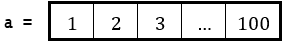

27)编写一个 Python 代码片段，创建以下 100 个元素的列表。

.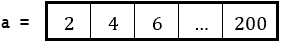

28)编写一个 Python 程序，提示用户输入一个整数 N，然后创建并显示以下 N 个元素的列表。使用循环控制结构，程序还必须验证数据输入，并在用户输入任何小于 1 的值时显示错误消息。

.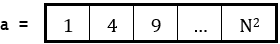

29)编写一个 Python 程序，提示用户输入 10 个数值到列表中，然后显示包含整数的元素的索引。

30)编写一个 Python 程序，提示用户输入 50 个数值到列表中，然后计算并显示负元素的总量。

31)编写一个 Python 程序，提示用户输入 50 个单词到列表中，然后显示那些至少包含 10 个字符的单词。

提示：使用 len()函数。

32)编写一个 Python 程序，允许用户输入 30 个单词到列表中。然后显示那些少于 5 个字符的单词，然后是少于 10 个字符的单词，最后是少于 20 个字符的单词。

提示：尝试使用两个嵌套的 for 循环来显示单词。

33)编写一个 Python 程序，提示用户输入 40 个单词到列表中，然后显示那些至少包含字母“w”两次的单词。

34)以下表格显示了罗马数字。

| 数字 | 罗马数字（十位数字） | 罗马数字（个位数字） |
| --- | --- | --- |
| 1 | X | I |
| 2 | XX | I |
| 3 | XXX | III |
| 4 | XL | IV |
| 5 | L | V |
| 6 | LX | VI |
| 7 | LXX | VII |
| 8 | LXXX | VIII |
| 9 | XC | IX |

每个罗马数字是十位和个位数字的组合。例如，数字 45 的罗马数字表示为 XLV（4 个十位由 XL 表示，5 个个位由 V 表示）。编写一个 Python 程序，提示用户输入一个介于 1 到 99 之间的整数，并显示相应的罗马数字。假设用户输入了一个有效的值。

提示：避免逐个检查每个整数，因为这需要 99 个备选决策结构的多个选择。尝试找到更有效和巧妙的方法！
