## 第三十三章

更多关于数据结构的内容

### 33.1 列表简单练习

#### 练习 33.1-1 创建包含相邻元素平均值的列表

编写一个 Python 程序，让用户输入 100 个正数值到一个列表中。然后，程序必须创建一个包含 98 个元素的新列表 newArr。这个新列表的每个位置必须包含用户提供的列表中当前和下两个位置的三个元素的平均值。

解决方案

让我们通过使用 10 个元素的示例来尝试理解这个练习。

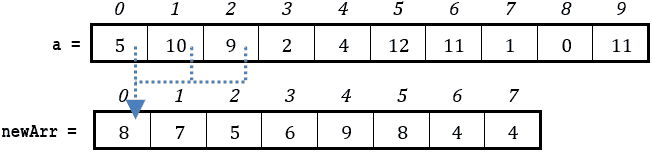

List newArr 是创建的新列表。在列表 newArr 中，位置 0 的元素是列表 a 中当前和下两个位置的元素的平均值；即 (5 + 10 + 9) / 3 = 8。位置 1 的元素是列表 a 中当前和下两个位置的元素的平均值；即 (10 + 9 + 2) / 3 = 7，以此类推。

Python 程序如下。

 file_33.1-1a

ELEMENTS_OF_A = 100

ELEMENTS_OF_NEW = ELEMENTS_OF_A - 2

a = [None] * ELEMENTS_OF_A

for i in range(ELEMENTS_OF_A):

a[i] = float(input())

newArr = [None] * ELEMENTS_OF_NEW

for i in range(ELEMENTS_OF_NEW):

newArr[i] = (a[i] + a[i + 1] + a[i + 2]) / 3

for i in range(ELEMENTS_OF_NEW):

print(newArr[i])

如果你更喜欢更 Pythonic 的方式，解决方案如下。

 file_33.1-1b

from math import fsum

ELEMENTS_OF_A = 100

a = []

for i in range(ELEMENTS_OF_A):

a.append(float(input()))

newArr = []

for i in range(ELEMENTS_OF_A - 2):

newArr.append(fsum(a[i:i + 3]) / 3)

for element in newArr:

print(element)

#### 练习 33.1-2 创建包含最大值的列表

编写一个 Python 程序，让用户输入到列表 a 和 b 中各 20 个数值。然后，程序必须创建一个包含 20 个元素的新列表 newArr。新列表的每个位置必须包含列表 a 和 b 对应位置的较大值。

解决方案

没有什么新的！你需要两个 for 循环来读取列表 a 和 b 的值，一个用于创建列表 newArr，另一个用于在屏幕上显示列表 newArr。

Python 程序如下所示。

 file_33.1-2

ELEMENTS = 20

#读取列表 a 和 b

a = [None] * ELEMENTS

b = [None] * ELEMENTS

for i in range(ELEMENTS):

a[i] = float(input())

for i in range(ELEMENTS):

b[i] = float(input())

#创建列表 newArr

newArr = [None] * ELEMENTS

for i in range(ELEMENTS):

if a[i] > b[i]:

> newArr[i] = a[i]

else:

> newArr[i] = b[i]

#显示列表 newArr

for i in range(ELEMENTS):

print(newArr[i])

#### 练习 33.1-3 合并一维列表

编写一个 Python 程序，对于两个分别包含 10 和 15 个元素的列表 a 和 b，创建一个包含 25 个元素的新列表 newArr。这个新列表的前 10 个位置必须包含列表 a 的元素，接下来的 15 个位置包含列表 b 的元素。

解决方案

由于并非所有计算机语言在数据结构领域都像 Python 那样强大，所以我们在这里研究三种方法。第一种方法可以应用于大多数计算机语言，而第二种和第三种方法则更具有 Python 风格！

第一种方法

正如你在下面的示例中可以看到的，列表 a 和列表 newArr 的元素索引位置之间存在直接的对应关系。具体来说，列表 a 的位置 0 的元素存储在列表 newArr 的位置 0，列表 a 的位置 1 的元素存储在列表 newArr 的位置 1，依此类推。然而，这种对应关系对于列表 b 不成立；它的元素需要在 newArr 中偏移 10 个位置。

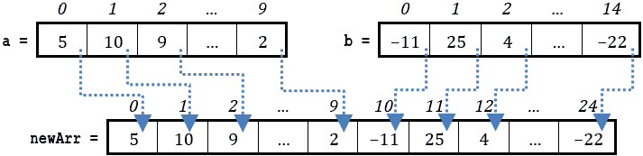

为了将列表 a 的值赋给列表 newArr，你可以使用以下代码片段。

for i in range(len(a)):

newArr[i] = a[i]

然而，为了将列表 b 的值赋给列表 newArr，你的代码片段应该略有不同，如下所示。

for i in range(len(b)):

newArr[len(a) + i] = b[i]

最终的 Python 程序如下。

 file_33.1-3a

#创建列表 a 和 b

a = [5, 10, 9, 6, 7, -6, 13, 12, 11, 2]

b = [-11, 25, 4, 45, 67, 87, 34, 23, 33, 55, 13, 15, -4, -2, -22]

#创建列表 newArr

newArr = [None] * (len(a) + len(b))

for i in range(len(a)):

newArr[i] = a[i]

for i in range(len(b)):

newArr[len(a) + i] = b[i]

#显示列表 newArr

for i in range(len(newArr)):

print(newArr[i], end = "\t")

第二种方法

这种方法使用了 Python 的 append()方法。

 file_33.1-3b

#创建列表 a 和 b

a = [5, 10, 9, 6, 7, -6, 13, 12, 11, 2]

b = [-11, 25, 4, 45, 67, 87, 34, 23, 33, 55, 13, 15, -4, -2, -22]

#创建列表 newArr

newArr = []

for element in a:

newArr.append(element)

for element in b:

newArr.append(element)

#显示列表 newArr

for i in range(len(newArr)):

print(newArr[i], end = "\t")

第三种方法

这种方法利用了 Python 的魔法力量。在 Python 中，为了合并两个列表，你可以简单地使用连接运算符（+）。Python 会为你完成剩下的工作！

 file_33.1-3c

#创建列表 a 和 b

a = [5, 10, 9, 6, 7, -6, 13, 12, 11, 2]

b = [-11, 25, 4, 45, 67, 87, 34, 23, 33, 55, 13, 15, -4, -2, -22]

#创建列表 newArr

newArr = a + b

#显示列表 newArr

for i in range(len(newArr)):

print(newArr[i], end = "\t")

#### 练习 33.1-4 创建两个列表 - 分离正负值

编写一个 Python 程序，让用户输入 100 个数值到列表中，然后创建两个新的列表，pos 和 neg。列表 pos 必须包含正数，而列表 neg 必须包含负数。值 0（如果有）不得添加到最终的列表 pos 或 neg 中。

解决方案

有两种方法！第一种可以应用于大多数计算机语言，而第二种则更具有 Python 风格！

第一种方法

让我们通过以下示例来分析这种方法。

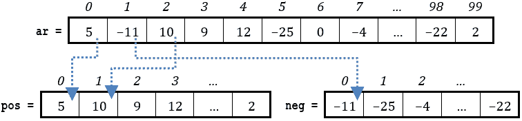

在这个练习中，列表 ar 的元素索引与列表 pos 和 neg 的索引位置之间没有一一对应的关系。例如，列表 ar 的位置 1 的元素不会存储在列表 neg 的位置 1，或者列表 ar 的位置 2 的元素不会存储在列表 pos 的位置 2。因此，你不能这样做，

for i in range(ELEMENTS):

if ar[i] > 0:

> pos[i] = ar[i]

elif ar[i] < 0:

> neg[i] = ar[i]

因为它将导致以下两个列表。

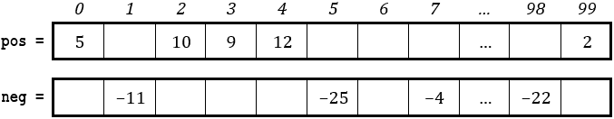

你在这里需要两个独立的索引变量：posIndex 用于列表 pos，negIndex 用于列表 neg。这些索引变量必须独立增加，并且只有在将元素添加到相应的列表时才增加。索引变量 posIndex 只有在将元素添加到列表 pos 时才增加，索引变量 negIndex 只有在将元素添加到列表 neg 时才增加，如下面的代码片段所示。

posIndex = 0

negIndex = 0

for i in range(ELEMENTS):

if ar[i] > 0:

> pos[posIndex] = ar[i]
> 
> posIndex += 1

elif ar[i] < 0:

> neg[negIndex] = ar[i]
> 
> negIndex += 1

注意，变量 posIndex 和 negIndex 具有双重角色。当循环迭代时，它们都指向必须放置新元素的下一位。但是当循环迭代完成后，变量 posIndex 和 negIndex 也包含了每个对应列表中的元素总数！

完整的解决方案将在下面展示。

 file_33.1-4a

ELEMENTS = 100

ar = [None] * ELEMENTS

for i in range(ELEMENTS):

ar[i] = float(input())

#创建列表 pos 和 neg

posIndex = 0

negIndex = 0

pos = [None] * ELEMENTS

neg = [None] * ELEMENTS

for i in range(ELEMENTS):

if ar[i] > 0:

> pos[posIndex] = ar[i]
> 
> posIndex += 1

elif ar[i] < 0:

> neg[negIndex] = ar[i]
> 
> negIndex += 1

for i in range(posIndex):

print(pos[i], end = "\t")

print()

for i in range(negIndex):

print(neg[i], end = "\t")

注意，列表 pos 和 neg 分别包含 posIndex 和 negIndex 个元素。这就是为什么两个最后的循环控制结构迭代直到变量 i 达到 posIndex - 1 和 negIndex - 1 的值，而不是像你可能错误预期的那样达到 ELEMENTS - 1。

第二种方法

第一种方法的主要缺点是！列表 pos 和 neg 必须初始化为 100 的大小，因为列表 ar 可能只包含正数，或者可能只包含负数。使用 append()方法，第二种方法比前一种方法更有效，因为它使用了最少的内存（RAM）。

 file_33.1-4b

ELEMENTS = 100

ar = []

for i in range(ELEMENTS):

ar.append(float(input()))

#创建列表 pos 和 neg

pos = []

neg = []

for element in ar:

if element > 0:

> pos.append(element)

elif element < 0:

> neg.append(element)

for element in pos:

print(element, end = "\t")

print()

for element in neg:

print(element, end = "\t")

显然，一个问题可以有多个解决方案。取决于你找到最优解！

小心！在 Python 中，尽管你可以做类似 x = y = 0 的事情，但这在列表中并不成立。写下 pos = neg = []是完全错误的，因为 pos 和 neg 都会指向同一个列表。你必须使用两个单独的语句，就像这个方法中展示的那样。

#### 练习 33.1-5 创建包含数字 5 的列表

编写一个 Python 程序，让用户输入 100 个两位整数到列表中，然后创建一个新列表，其中只包含包含至少一个数字 5 的整数。

解决方案

这个练习需要一些过去的知识。在练习 13.1-2 中，你学习了如何使用商和余数将整数分解为其各个位数。在这里，用户提供的整数有两位数；因此，你可以使用以下代码片段来分解变量 x 中包含的任何两位数整数。

lastDigit = x % 10

firstDigit = x // 10

或者更符合 Python 风格的方式是使用 divmod()函数。

firstDigit, lastDigit = divmod(x, 10)

有两种方法你可以用来解决这个练习！第一种方法可以应用于大多数计算机语言，而第二种方法则更符合 Python 风格！

第一种方法

这种方法使用一个额外的变量作为新列表的索引。当你想要使用旧列表的值创建一个新列表，并且它们的索引位置没有一一对应关系时，这是必要的。当然，这个变量只有在向新列表添加新元素时才增加 1。此外，当创建新列表的循环完成迭代后，这个变量的值也匹配新列表中的元素总数！最终的 Python 程序如下。

 file_33.1-5a

ELEMENTS = 100

a = [None] * ELEMENTS

for i in range(ELEMENTS):

a[i] = int(input())

k = 0

b = [None] * ELEMENTS

for i in range(ELEMENTS):

lastDigit = a[i] % 10

firstDigit = a[i] // 10

if firstDigit == 5 or lastDigit == 5:

> b[k] = a[i]
> 
> k += 1

for i in range(k):

print(b[i], end = "\t")

第二种方法

如前一个练习所示，第一种方法的主要缺点是它将列表 b 初始化为 100 的大小，而不管用户是否输入包含至少一个 5 的数字！使用 append()方法，第二种方法更高效，也更符合 Python 风格！

 file_33.1-5b

ELEMENTS = 100

a = []

for i in range(ELEMENTS):

a.append(int(input()))

b = []

for element in a:

firstDigit, lastDigit = divmod(element, 10)

if 5 in [firstDigit, lastDigit]:

> b.append(element)

for element in b:

print(element, end = "\t")

### 33.2 使用列表进行数据验证

如你已在 第 29.3 节 中所学，你可以使用三种方法来验证数据输入。你的方法将取决于你是否希望显示错误信息，以及你是否希望为每种输入错误显示不同的错误信息，或者只是显示通用的错误信息。

第一种方法 – 无错误信息验证数据输入

在 第 29.3 节 中，你学习了如何不显示任何错误信息来验证用户输入的单个值。为了方便起见，以下再次给出一般形式的代码片段。

while True:

输入数据 = input("提示信息")

if 输入数据测试 1 成功并

输入数据测试 2 成功并

…

输入数据测试 N 成功：break

你还记得它是如何工作的吗？如果用户输入一个有效的值，执行流程将简单地继续到程序的下一部分。然而，如果他们输入一个无效的值，主要目标是反复提示他们，直到他们最终提供一个有效的值。

当将数据输入列表时，你可以使用相同的原则。如果你使用 for 循环迭代列表的所有元素，代码片段将如下所示。

input_list = [None] * ELEMENTS

for i in range(ELEMENTS)

while True:

> 输入数据 = input("提示信息")
> 
> if 输入数据测试 1 成功并
> 
> 输入数据测试 2 成功并
> 
> > …
> > 
> 输入数据测试 N 成功：break

input_list[i] = 输入数据

如你所见，当执行流程退出嵌套的测试后循环结构时，变量 input_data 一定包含一个有效的值，该值随后被分配到列表 input_list 的一个元素中。然而，同样的过程可以更简单地实现，而不需要使用额外的变量 input_data，如下所示。

input_list = [None] * ELEMENTS

for i in range(ELEMENTS):

while True:

> input_list[i] = input("提示信息")
> 
> if input_list[i] 测试 1 成功并
> 
> input_list[i] 测试 2 成功并
> 
> …
> 
> input_list[i] 测试 N 成功：break

第二种方法 – 使用通用错误信息验证数据输入

如前所述，下一个代码片段取自 第 29.3 节 并调整为与列表一起工作。它验证数据输入并为任何类型的输入错误显示通用的错误信息（即，任何类型输入错误的相同错误信息）。

input_list = [None] * ELEMENTS

for i in range(ELEMENTS):

input_list[i] = input("提示信息")

当 input_list[i] 测试 1 失败或

> input_list[i] 测试 2 失败或
> 
> …
> 
> input_list[i] 测试 N 失败：
> 
> print("错误信息")
> 
> input_list[i] = input("提示信息")

第三种方法 – 使用不同错误信息验证数据输入

再次，下一个代码片段取自 第 29.3 节 并调整为与列表一起工作。它验证数据输入并为每种输入错误显示不同的错误信息。

input_list = [None] * ELEMENTS

for i in range(ELEMENTS):

while True:

> input_list[i] = input("提示消息")
> 
> failure = False
> 
> if input_list[i] test 1 fails:
> 
> > print("错误消息 1")
> > 
> > failure = True
> > 
> elif input_list[i] test 2 fails:
> 
> > print("错误消息 2")
> > 
> > failure = True
> > 
> elif …
> 
> …
> 
> elif input_list[i] test N fails:
> 
> > print("错误消息 N")
> > 
> > failure = True
> > 
> if not failure: break

#### 练习 33.2-1 以相反顺序显示奇数

编写一个 Python 程序，提示用户输入 20 个奇数正整数到一个列表中，然后以它们提供的顺序的相反顺序显示它们。程序必须验证数据输入，防止用户输入非正值、浮点数或偶数整数。以三种版本解决这个练习：

a)在没有显示任何错误消息的情况下验证数据输入。

b)验证数据输入并显示一个通用的错误消息。

c)验证数据输入并显示不同类型的输入错误的不同错误消息。

解决方案

在第 33.2 节中学习到的所有三种验证数据输入的方法都将在此处展示。让我们首先在不进行数据验证的情况下解决这个练习。

ELEMENTS = 20

odds = [None] * ELEMENTS

for i in range(ELEMENTS):

x = int(input("输入一个奇数正整数: "))   [[更多…]](more.html#more_33_2_1_1)

odds[i] = x

#以相反的顺序显示元素             # 或者你可以这样做

for i in range(ELEMENTS - 1, -1, -1):   # for element in odds[::-1]:

print(odds[i], end = "\t")          #     print(element, end = "\t")

无错误消息的验证

要在没有显示任何错误消息的情况下验证数据输入，请使用第 33.2 节中的第一种方法。只需将带有虚线矩形的语句替换为以下代码片段。

while True:

x = float(input("输入一个奇数正整数: "))

if x > 0 and x == int(x) and x % 2 != 0: break

odds[i] = int(x)

最终程序如下

 file_33.2-1a

ELEMENTS = 20

odds = [None] * ELEMENTS

for i in range(ELEMENTS):

while True:                                    [[更多…]](more.html#more_33_2_1_2)

> x = float(input("输入一个奇数正整数: "))
> 
> if x > 0 and x == int(x) and x % 2 != 0: break

odds[i] = int(x)

#以相反的顺序显示元素             # 或者你可以这样做

for i in range(ELEMENTS - 1, -1, -1):   # for element in odds[::-1]:

print(odds[i], end = "\t")          #     print(element, end = "\t")

变量 x 必须是浮点型。这是为了允许用户输入整数或浮点数（实数）。

带有通用错误消息的验证

要验证数据输入并显示一个通用的错误消息，请将带有虚线矩形的语句替换为第 33.2 节中第二种方法的基础代码片段。Python 程序如下。

 file_33.2-1b

ELEMENTS = 20

odds = [None] * ELEMENTS

for i in range(ELEMENTS):

x = float(input("请输入一个奇数正整数: "))   [[更多…]](more.html#more_33_2_1_3)

while x <= 0 or x != int(x) or x % 2 == 0:

> print("无效值！")
> 
> x = float(input("请输入一个奇数正整数: "))

odds[i] = int(x)

#反向显示元素

for element in odds[::-1]:

print(element, end = "\t")

使用不同的错误信息进行验证

这里，替换的代码片段基于第 33.2 节的第三种方法。为了验证数据输入并显示针对每种输入错误的错误信息，Python 程序如下。

 file_33.2-1c

ELEMENTS = 20

odds = [None] * ELEMENTS

for i in range(ELEMENTS):

while True:                                      [[更多…]](more.html#more_33_2_1_4)

> x = float(input("请输入一个奇数正整数: "))
> 
> failure = False
> 
> if x <= 0 :
> 
> > print("无效值：输入了非正数！")
> > 
> > failure = True
> > 
> elif x != int(x):
> 
> > print("无效值：输入了浮点数！")
> > 
> > failure = True
> > 
> elif x % 2 == 0:
> 
> > print("无效值：输入了偶数！")
> > 
> > failure = True
> > 
> if not failure: break

odds[i] = int(x)

#反向显示元素

for element in odds[::-1]:

print(element, end = "\t")

### 33.3 在列表中查找最小和最大值

这是本书中第三次也是最后一次讨论这个主题。第一次是在第 22.2 节中使用决策控制结构，第二次是在第 29.4 节中使用循环控制结构。所以，除了当你想要找到已包含一些值的数据结构的最小或最大值时，不需要担心变量最小或最大值的初始值，因为你可以直接将数据结构的第一个元素的值赋给它们之外，没有太多可讨论的。

#### 练习 33.3-1 哪个深度最大？

编写一个 Python 程序，允许用户输入 20 个湖泊的深度，然后显示最深的一个。

解决方案

在用户输入列表 depths 中 20 个湖泊的深度后，变量 maximum 的初始值可以设置为 depths[0]的值，即列表 depths 的第一个元素。然后程序可以搜索从索引 1 开始的任何后续值，只要这个值大于这个值。最终的解决方案非常直接，下面将不进行进一步解释。

 file_33.3-1a

LAKES = 20

depths = [None] * LAKES

for i in range(LAKES):

depths[i] = float(input())

maximum = depths[0]  #初始值

#从索引 1 开始搜索

for i in range(1, LAKES):

if depths[i] > maximum:

> maximum = depths[i]

print(maximum)

虽然从位置 0 开始迭代而不是 1 可能不会出错，但程序将执行一次无用的迭代。

将变量 maximum 分配一个“几乎任意”的初始值并没有错，但这样做没有理由。第一个元素的值就很好！如果你坚持的话，你可以分配一个初始值为 0，因为地球上没有湖泊的深度是负数。

但是，请注意，找到列表中最大值的更 Pythonic 方法是使用 max() 函数，如下所示。

 file_33.3-1b

LAKES = 20

depths = []

for i in range(LAKES):

depths.append(float(input()))

maximum = max(depths)

print(maximum)

相应地，如果你想找到列表中最小值，你可以使用 min() 函数。

#### 练习 33.3-2 哪个湖泊最深？

编写一个 Python 程序，让用户输入 20 个湖泊的名称和深度，然后显示最深湖泊的名称。

解决方案

如果你不知道如何找到最深湖泊的名称，你可能需要通过重新阅读 练习 29.4-2 来刷新你的记忆。

在这个练习中，你需要两个一维列表：一个用于存储湖泊的名称，另一个用于存储湖泊的深度。解决方案如下。

 file_33.3-2

LAKES = 20

names = [None] * LAKES

depths = [None] * LAKES

for i in range(LAKES):

names[i] = input()

depths[i] = float(input())

maximum = depths[0]

mName = names[0]

for i in range(1, LAKES):

if depths[i] > maximum:

> maximum = depths[i]
> 
> mName = names[i]

print(mName)

在这个练习中，你不能使用 max() 函数！它会返回最大的深度，而不是那个最深湖泊的名称！

#### 练习 33.3-3 哪个湖泊，在哪个国家，拥有哪个平均面积，是最深的？

编写一个 Python 程序，让用户输入 20 个湖泊的名称、深度以及它们所属的国家和平均面积。程序必须然后显示关于最深湖泊的所有可用信息。

解决方案

让我们看看下一个例子，六个湖泊的深度以英尺表示，平均面积以平方英里表示。

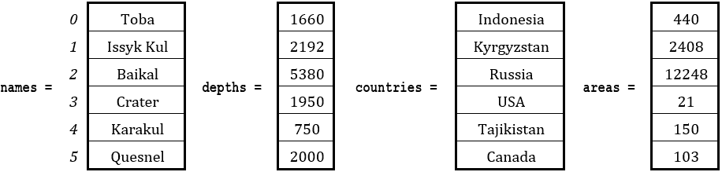

显然，贝加尔湖保持着最深湖泊的记录，位于索引 2。如果你要以类似于上一个练习（练习 33.3-2）的方式来做这个练习，你需要三个额外的变量来保存每次找到比之前存储的深度更大的深度时的名称、国家和面积。然而，下面提供的解决方案采用了一种更有效的方法，只使用一个变量（indexOfMax）来跟踪这些值所在的索引。

 file_33.3-3

LAKES = 20

names = [None] * LAKES

depths = [None] * LAKES

countries = [None] * LAKES

areas = [None] * LAKES

for i in range(LAKES):

names[i] = input()

depths[i] = float(input())

countries[i] = input()

areas[i] = float(input())

#找到最大深度及其索引

maximum = depths[0]

indexOfMax = 0

for i in range(1, LAKES):

if depths[i] > maximum:

> maximum = depths[i]
> 
> indexOfMax = i

#使用 indexOfMax 作为索引显示信息

print(depths[indexOfMax], names[indexOfMax], end = " ")

print(countries[indexOfMax], areas[indexOfMax])

将变量 indexOfMax 的初始值设置为 0 是必要的，因为总是有可能最大值确实存在于位置 0。

#### 练习 33.3-4 哪些学生获得了最高分？

编写一个 Python 程序，提示用户输入 200 名学生的姓名和成绩，然后显示所有那些共享一个最高分的学生姓名。使用循环控制结构，程序还必须验证数据输入，并在用户输入空姓名或任何负值或大于 100 的成绩时显示错误信息。

解决方案

在这个练习中，你需要验证姓名和成绩。一个以通用形式给出的代码片段显示了数据输入阶段。

STUDENTS = 200

names = [None] * STUDENTS

grades = [None] * STUDENTS

for i in range(STUDENTS):

提示用户输入一个姓名并验证它。它不能为空！

提示用户输入一个分数并验证它。它不能为负或大于 100。

在数据输入阶段之后，循环控制结构必须搜索最大值，然后，另一个循环控制结构必须搜索列表 grades 中所有等于该最大值的值。

下一个展示解决方案。

 file_33.3-4

STUDENTS = 200

names = [None] * STUDENTS

grades = [None] * STUDENTS

for i in range(STUDENTS):

#提示用户输入一个姓名并验证它。

names[i] = input("为第 " + str(i + 1) + " 号学生输入姓名：")

while names[i] == "":

> print("错误！姓名不能为空！")
> 
> names[i] = input("为第 " + str(i + 1) + " 号学生输入姓名：")

#提示用户输入一个分数并验证它。

grades[i] = int(input("输入他们的成绩："))

while grades[i] < 0 or grades[i] > 100:

> print("无效值！")                 # 
> 
> grades[i] = int(input("输入他们的成绩："))

#寻找最高分

maximum = grades[0]                 # 或者你也可以这样做：

for i in range(1, STUDENTS):        # maximum = max(grades)

if grades[i] > maximum:         #

> maximum = grades[i]                 # 

#显示所有共享一个最高分的学生姓名

print("以下学生获得了最高分：")

for i in range(STUDENTS):

if grades[i] == maximum:

> print(names[i])

请注意，没有使用列表，这个练习是无法解决的。

请注意，以下代码片段也是正确的，但非常低效。

print("以下学生获得了最高分：")

for i in range(STUDENTS):

if grades[i] == max(grades):

> print(names[i])

原因是，在这个例子中，函数 max() 在每次循环迭代时都会被调用——即 200 次！

#### 练习 33.3-5 寻找二维列表的最小值

编写一个 Python 程序，让用户输入一月份在 10 个不同城市记录的同一小时每天的温度（华氏度）。Python 程序必须显示最低温度。

解决方案

在这个练习中，你需要以下列表。

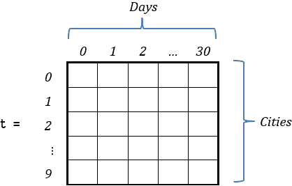

列表 t 有 31 列（0 到 30），与一月份的天数一样多。

这里没有什么新的内容。变量 minimum 的初始值可以是元素 t[0][0] 的值。然后，程序可以遍历行，甚至列，以查找最小值。解决方案将在下面展示。

 file_33.3-5a

CITIES = 10

DAYS = 31

#读取列表 t

t = [[None] * DAYS for i in range(CITIES)]

for i in range(CITIES):

for j in range(DAYS):

> t[i][j] = int(input())

#寻找最小值

minimum = t[0][0]

for i in range(CITIES):

for j in range(DAYS):

> if t[i][j] < minimum:
> 
> > minimum = t[i][j]

print(minimum)

在这个练习中，你不能这样做，因为如果你这样做，并且变量 j 从 1 开始，那么索引为 0 的整个列将不会被检查！

#寻找最小值

minimum = t[0][0]

for i in range(CITIES):

for j in range(1, DAYS):  #这是错误的！变量 j 必须从 0 开始

> if t[i][j] < minimum:
> 
> > minimum = t[i][j]

虽然如此，但更 Pythonic 的方法是通过 min() 函数找到列表 t 的最低值，如下所示。

 file_33.3-5b

CITIES = 10

DAYS = 31

#读取列表 t

t = []

for i in range(CITIES):

t.append([])

for j in range(DAYS):

> t[i].append(int(input()))

print(min(t))

#### 练习 33.3-6 寻找最冷的一天所在的城市

编写一个 Python 程序，让用户输入 10 个城市的名称以及这些城市一月份每天记录的同一小时温度（华氏度）。Python 程序必须显示温度最低的城市及其记录的日期。

解决方案

在这个练习中，需要以下两个列表。

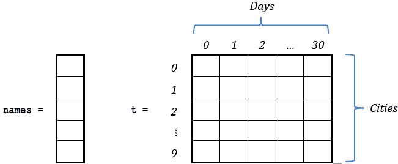

解决方案很简单。每次变量 minimum 更新其值时，两个变量 m_i 和 m_j 可以分别保存变量 i 和 j 的当前值。最后，这两个变量将包含最小值存在的位置的行索引和列索引。解决方案如下。

 file_33.3-6

CITIES = 10

DAYS = 31

names = [None] * CITIES

t = [[None] * DAYS for i in range(CITIES)]

for i in range(CITIES):

names[i] = input()

for j in range(DAYS):

> t[i][j] = int(input())

minimum = t[0][0]

m_i = 0

m_j = 0

for i in range(CITIES):

for j in range(DAYS):

> if t[i][j] < minimum:
> 
> > minimum = t[i][j]
> > 
> > m_i = i
> > 
> > m_j = j

print("最低温度：", minimum)

print("城市：", names[m_i])

print("日期：", m_j + 1)

将变量 m_i 和 m_j 的初始值设置为 0 是必要的，因为总是有可能最小值是元素 t[0][0] 的值。

#### 练习 33.3-7 查找每行的最小和最大值

编写一个 Python 程序，允许用户输入列表 b 的 20 × 30 元素值，然后查找并显示每行的最小和最大值。

解决方案

实际上，有三种方法。第一种方法创建两个辅助的一维列表，最小值和最大值，然后显示它们。列表最小值和最大值将分别包含每个位置上的每行的最小和最大值。另一方面，第二种和第三种方法查找并直接显示每行的最小和最大值。让我们研究一下它们。

第一种方法 – 创建辅助列表

为了更好地理解这种方法，让我们使用“从内到外”的方法。当以下代码片段完成迭代时，辅助的一维列表最小值和最大值将分别包含位置 0 上的列表 b 的第一行（行索引 0）的最小和最大值。假设变量 i 包含值 0。

minimum[i] = b[i][0]

maximum[i] = b[i][0]

for j in range(1, COLUMNS):

if b[i][j] < minimum[i]:

> minimum[i] = b[i][j]

if b[i][j] > maximum[i]:

> maximum[i] = b[i][j]

请注意，变量 j 从 1 开始。虽然程序会多执行一次无用的迭代，但从列索引 0 开始迭代也不会错。

现在一切都已阐明，为了处理整个列表 b，你只需将前面的代码片段嵌套在一个遍历所有行的 for 循环中，如下所示。

for i in range(ROWS):

minimum[i] = b[i][0]

maximum[i] = b[i][0]

for j in range(1, COLUMNS):

> if b[i][j] < minimum[i]:
> 
> > minimum[i] = b[i][j]
> > 
> if b[i][j] > maximum[i]:
> 
> > maximum[i] = b[i][j]

最终的 Python 程序如下。

 file_33.3-7a

ROWS = 30

COLUMNS = 20

b = [[None] * COLUMNS for i in range(ROWS)]

for i in range(ROWS):

for j in range(COLUMNS):

> b[i][j] = float(input())

minimum = [None] * ROWS

maximum = [None] * ROWS

for i in range(ROWS):

minimum[i] = b[i][0]

maximum[i] = b[i][0]

for j in range(1, COLUMNS):

> if b[i][j] < minimum[i]:
> 
> > minimum[i] = b[i][j]
> > 
> if b[i][j] > maximum[i]:
> 
> > maximum[i] = b[i][j]

for i in range(ROWS):

print(minimum[i], maximum[i])

第二种方法 – 查找并直接显示最小和最大值

让我们再次使用“从内到外”的方法。下面的代码片段查找并直接显示列表 b 的第一行（行索引 0）的最小和最大值。假设变量 i 包含值 0。

minimum = b[i][0]

maximum = b[i][0]

for j in range(1, COLUMNS):

if b[i][j] < minimum:

> minimum = b[i][j]

if b[i][j] > maximum:

> maximum = b[i][j]

print(minimum, maximum)

为了处理整个列表 b，你可以将此代码片段嵌套在一个遍历所有行的 for 循环中，如下所示。

for i in range(ROWS):

minimum = b[i][0]

maximum = b[i][0]

for j in range(1, COLUMNS):

> if b[i][j] < minimum:
> 
> > minimum = b[i][j]
> > 
> if b[i][j] > maximum:
> 
> > maximum = b[i][j]

print(minimum, maximum)

最终的 Python 程序如下。

 file_33.3-7b

ROWS = 30

COLUMNS = 20

b = [[None] * COLUMNS for i in range(ROWS)]

for i in range(ROWS):

for j in range(COLUMNS):

> b[i][j] = float(input())

for i in range(ROWS):

minimum = b[i][0]

maximum = b[i][0]

for j in range(1, COLUMNS):

> if b[i][j] < minimum:
> 
> > minimum = b[i][j]
> > 
> if b[i][j] > maximum:
> 
> > maximum = b[i][j]

print(minimum, maximum)

第三种方法 – Pythonic 方法

此方法使用 Python 的 min() 和 max() 函数。它找到并直接显示每行的最低和最高值。

 file_33.3-7c

ROWS = 30

COLUMNS = 20

b = []

for i in range(ROWS):

b.append([])

for j in range(COLUMNS):

> b[i].append(float(input()))

for row in b:

print(min(row), max(row))

### 33.4 排序列表

排序算法是计算机科学中的一个重要主题。排序算法是一种将列表中的元素按特定顺序排列的算法。有许多排序算法，每个算法都有其特定的优点和缺点。

大多数排序算法通过比较列表中的元素来工作。它们通常通过效率和内存需求来评估。

有许多排序算法。其中一些是：

►冒泡排序算法

►改进的冒泡排序算法

►选择排序算法

►插入排序算法

►堆排序算法

►归并排序算法

►快速排序算法

关于它们的效率，冒泡排序算法被认为是效率最低的，而列表中的每个后续算法都比前一个算法表现更好。快速排序算法被认为是最好的和最快的排序算法之一，尤其是在大规模数据处理方面。

排序算法不仅可以用于显示数据按升序或降序排列，还可以帮助从一组给定值中找到最小和最大值。例如，在一个升序排列的列表中，最小值存在于第一个索引位置，最大值存在于最后一个索引位置。仅为了找到最小和最大值而排序列表是非常低效的，但如果程序为了其他原因而排序列表，并且随后需要最小或最大值，你知道在哪里可以找到它们！

你可能需要排序算法的另一个场景是当你想要找到并显示列表中的三个最大（或最小）数字时。在这种情况下，你可以按降序排序列表，然后只显示位于索引位置 0、1 和 2 的前三个元素。

如你所知，Python 包含了用于列表排序的 sort()方法和 sorted()函数。然而，在某些情况下，需要实现自定义排序算法，尤其是在需要保留与第二个列表元素一对一对应关系的同时对列表进行排序时。

#### 练习 33.4-1 冒泡排序算法——使用数值对一维列表进行排序

编写一个 Python 程序，让用户输入 20 个数值到列表中，然后使用冒泡排序算法按升序排序它们。

解决方案

冒泡排序算法可能是效率最低的排序算法之一，但它广泛用于教学目的。主要思想（当要求按升序对列表进行排序时）是反复将列表中的最小元素移动到最低索引的位置。这个过程如下：算法遍历列表中的元素，比较每一对相邻元素，然后交换它们的内容（如果它们顺序错误）。这个过程会重复多次，直到列表被排序。

例如，让我们尝试按升序排序以下列表。

.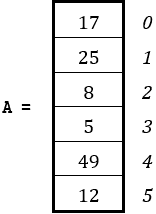

最低的值是 5。根据冒泡排序算法，这个值必须逐渐“冒泡”或“上升”到位置 0，就像可乐中的气泡上升一样。当值 5 被移动到位置 0 后，下一个最小的值是 8。现在，值 8 必须“冒泡”到位置 1。接下来是值 12，它必须“冒泡”到位置 2，以此类推。这个过程会重复进行，直到所有元素都放置到正确的位置。

但如何使用算法来实现这种“冒泡”呢？让我们更详细地看看整个过程。对于之前包含六个元素的列表 A，需要进行五次遍历。

第一次遍历

第 1 次比较

初始时，索引位置 4 和 5 的元素被比较。由于值 12 小于值 49，这两个元素交换了它们的内容。

第 2 次比较

索引位置 3 和 4 的元素被比较。由于值 12 不小于值 5，没有进行交换。

第 3 次比较

索引位置 2 和 3 的元素被比较。由于值 5 小于值 8，这两个元素交换了它们的内容。

第 4 次比较

索引位置 1 和 2 的元素被比较。由于值 5 小于值 25，这两个元素交换了它们的内容。

第 5 次比较

索引位置 0 和 1 的元素被比较。由于值 5 小于值 17，这两个元素交换了它们的内容。

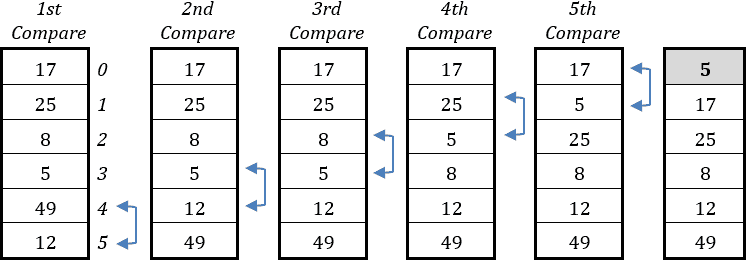

第一次遍历已经完成，但正如你所见，列表还没有被排序。唯一可以保证放置在正确位置的值是 5。然而，由于还有更多的遍历，所以没有必要让值 5 参与后续的比较。在接下来的遍历中，将执行更少的比较——即四个比较。

第二次遍历

第 1 次比较

索引位置 4 和 5 的元素被比较。由于数值 49 不小于数值 12，没有进行交换。

第二次比较

索引位置 3 和 4 的元素被比较。由于数值 12 不小于数值 8，没有进行交换。

第三次比较

索引位置 2 和 3 的元素被比较。由于数值 8 小于数值 25，这两个元素交换了它们的内容。

第四次比较

索引位置 1 和 2 的元素被比较。由于数值 8 小于数值 17，这两个元素交换了它们的内容。

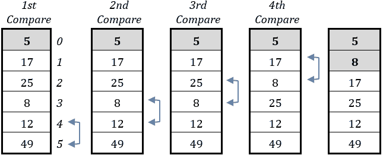

第二次遍历已完成，并且数值 8 已经确保被放置在正确的位置。然而，由于还有更多的遍历将跟随，数值 8（当然，还有 5）不需要参与后续的比较。在接下来的遍历中，将执行一个更少的比较——即三个比较。

第三次遍历

在这次遍历中，执行了三个比较（但只有两个交换），如下所示。

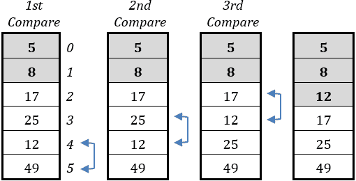

第三次遍历已完成，并且数值 12 已经确保被放置在正确的位置。正如之前所述，由于还有更多的遍历将跟随，数值 12（当然，还有数值 5 和 8）不需要参与后续的比较。在接下来的遍历中，将执行一个更少的比较——即两个比较。

第四次遍历

在这次遍历中，执行了两个比较（没有交换），如下所示。

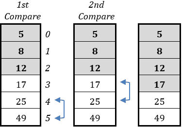

第四次遍历已完成，并且数值 17 已经确保被放置在正确的位置。正如之前所述，由于还有最后一次遍历将跟随，数值 17（当然，还有数值 5、8 和 12）不需要参与后续的比较。在接下来的最后一次遍历中，将执行一个更少的比较——即一个比较。

第五次遍历

在这次最后一次遍历中，只执行了一个比较。由于数值 49 不小于数值 25，没有进行交换。

.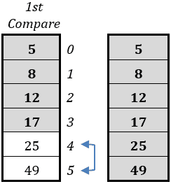

第五次遍历已完成，并且最终的两个数值（25 和 49）现在确保被放置在正确的位置。冒泡排序算法已完成，列表已按升序排序！

现在您需要一个可以完成整个先前过程的 Python 程序。让我们使用“从内到外”的方法。下面是仅执行第一次遍历的代码片段。请注意，这是一个内部（嵌套）循环控制结构。假设变量 m 包含值 0。

for n in range(ELEMENTS - 1, m, -1):

if a[n] < a[n - 1]:

> temp = a[n]
> 
> a[n] = a[n - 1]
> 
> a[n - 1] = temp

在第一次遍历中，变量 m 必须包含值 0。这确保了在最后一次迭代中，被比较的元素是索引位置 1 和 0 的元素。

交换两个元素的内容使用你已经学过的方法！请回忆一下两个橙汁和柠檬汁的例子。如果这让你感到困惑，你需要刷新你的记忆并重新阅读练习 8.1-3。

请记住，你可以像这里所示的那样以更 Pythonic 的方式交换 a[n]和 a[n − 1]的内容。

for n in range(ELEMENTS - 1, m, -1):

if a[n] < a[n - 1]:

> a[n], a[n - 1] = a[n - 1], a[n]

如果只是重新执行之前的代码片段，就可以进行第二次遍历。然而，变量 m 需要包含值 1，这将确保索引位置 0 的元素不会再次进行比较。同样，对于第三次遍历，可以重新执行之前的代码片段，但变量 m 需要包含值 2，原因相同。

因此，之前的代码片段需要执行五次（每次遍历一次），每次变量 m 必须增加 1。使用冒泡排序算法对列表 a 进行排序的最终代码片段如下。

for m in range(ELEMENTS - 1):

for n in range(ELEMENTS - 1, m, -1):

> if a[n] < a[n - 1]:
> 
> > a[n], a[n - 1] = a[n - 1], a[n]

对于 N 个元素，算法需要执行 N - 1 次遍历。例如，如果列表 a 包含 20 个元素，那么`for m in range(ELEMENTS - 1)`的语句将执行 19 次遍历。

完整的 Python 程序如下。

 file_33.4-1

ELEMENTS = 20

a = [None] * ELEMENTS

for i in range(ELEMENTS):

a[i] = float(input())

for m in range(ELEMENTS - 1):

for n in range(ELEMENTS - 1, m, -1):

> if a[n] < a[n - 1]:
> 
> > a[n], a[n - 1] = a[n - 1], a[n]

for i in range(ELEMENTS):

print(a[i], end = "\t")

冒泡排序算法非常低效。它执行的总比较次数是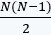，其中 N 是列表元素的总数。

交换的总次数取决于给定的列表。最坏的情况是你想要对一个已经按降序排序的列表进行升序排序，或者相反。

#### 练习 33.4-2 使用字母数字值对一维列表进行排序

编写一个代码片段，使用冒泡排序算法按降序对列表的字母数字值进行排序。

解答

将本练习的措辞与上一个练习进行比较，有两点不同。首先，冒泡排序算法需要排序字母数字值，例如人名或城市名；其次，它必须按降序排序。

为了对字母数字数据进行排序，你不需要在算法中做任何改变！Python 处理字母的方式与处理数字的方式相同。字母“A”被认为是“小于”字母“B”，“B”被认为是“小于”字母“C”，依此类推。当然，如果列表中包含以相同字母开头的单词，Python 会继续比较它们的第二个字母，也许还会比较第三个字母（如果需要的话）。例如，名字“Johathan”被认为是“小于”名字“Jone”，因为第四个字母“a”是“小于”第四个字母“e”。

考虑在英语词典中单词组织的情况下进行字母数字排序。

现在，让我们看看你需要如何修改算法，以便它能够按降序排序而不是升序。你还记得冒泡排序算法实际上是怎样工作的吗？元素逐渐“冒泡”到最低索引的位置，就像汽水中的气泡上升一样。在这个练习中，你想要的是让较大的（而不是较小的）元素“冒泡”到较低的索引位置。因此，你所需要做的就是简单地反转决策控制结构中的比较运算符！

排序字母数字值（当然也包括数值）的降序代码片段如下。

for m in range(ELEMENTS − 1)

for n in range(ELEMENTS - 1, m, -1):

> if a[n] > a[n - 1]:
> 
> > a[n], a[n - 1] = a[n - 1], a[n]

#### 练习 33.4-3 在保持与第二个列表关系的同时对一维列表进行排序

编写一个 Python 程序，让用户输入 20 个湖泊及其相应的平均面积。程序必须然后使用冒泡排序算法按平均面积升序排序它们。

解答

在这个练习中，你需要以下两个列表。

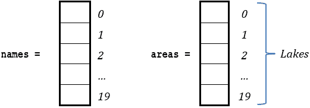

如果你想要在保持两个列表元素一对一对应关系的同时对列表 areas 进行排序，你必须重新排列列表 names 的元素。这意味着每当列表 areas 中的两个元素交换内容时，对应的列表 names 中的元素也必须交换内容。以下是一个 Python 程序。

 file_33.4-3

LAKES = 20

names = [None] * LAKES

areas = [None] * LAKES

for i in range(LAKES):

names[i] = input()

areas[i] = float(input())

for m in range(LAKES - 1):

for n in range(LAKES - 1, m, -1):

> if areas[n] < areas[n - 1]:
> 
> > areas[n], areas[n - 1] = areas[n - 1], areas[n]
> > 
> > names[n], names[n - 1] = names[n - 1], names[n]

for i in range(LAKES):

print(names[i], "\t", areas[i])

#### 练习 33.4-4 对姓氏和名字进行排序

编写一个 Python 程序，提示用户输入 100 个人的姓氏和名字。程序必须然后按姓氏的字母顺序显示这些名字。在两个或更多人姓氏相同的情况下，他们的名字应该按字母顺序显示。

解答

您已经知道如何在保持与第二个列表元素一对一对应的同时对列表进行排序。现在，您必须处理第一个列表中两个姓氏相等的情况。根据练习的描述，第二个列表中对应的名字也必须按字母顺序排序。例如，以下 lastNm 列表包含 100 个人的姓氏。它按字母顺序排序，并包含姓氏“Parker”三次。相应的名字列表 firstNm 中的“Andrew”、“Anna”和“Chloe”也必须按字母顺序排序，如下所示。

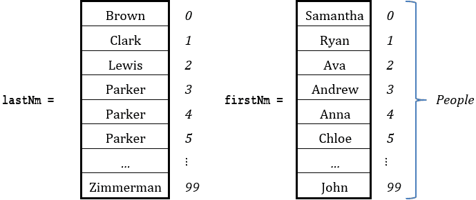

为了您的方便，这里再次呈现冒泡排序算法的基本版本。请注意，此算法保留了列表 lastNm 和 firstNm 中元素的一对一对应关系。

for m in range(PEOPLE - 1):

for n in range(PEOPLE - 1, m, -1):

> if lastNm[n] < lastNm[n - 1]:
> 
> > lastNm[n], lastNm[n - 1] = lastNm[n - 1], lastNm[n]
> > 
> > firstNm[n], firstNm[n - 1] = firstNm[n - 1], firstNm[n]

然而，为了解决这个练习，这个冒泡排序算法必须相应地进行调整。根据冒泡排序算法的基本版本，当位置 n 的姓氏“小于”位置 n-1 的姓氏时，算法会交换相应的内容。但是，如果这两个位置的姓氏相等，则算法必须验证对应的名字是否处于正确的顺序。如果不正确，则需要在 firstNm 列表中进行交换。调整后的冒泡排序算法在以下代码片段中展示。

for m in range(PEOPLE - 1):

for n in range(PEOPLE - 1, m, -1):

> if lastNm[n] < lastNm[n - 1]:
> 
> > lastNm[n], lastNm[n - 1] = lastNm[n - 1], lastNm[n]
> > 
> > firstNm[n], firstNm[n - 1] = firstNm[n - 1], firstNm[n]
> > 
> elif lastNm[n] == lastNm[n - 1]: # 如果姓氏相等
> 
> > if firstNm[n] < firstNm[n - 1]: # 检查对应的名字
> > 
> > > # 如果姓名顺序不正确，则交换第一个名字
> > > 
> > > firstNm[n], firstNm[n - 1] = firstNm[n - 1], firstNm[n]

下一个展示的是最终的 Python 程序。

 file_33.4-4

PEOPLE = 100

# 读取 firstNm 和 lastNm 列表

firstNm = [None] * PEOPLE

lastNm = [None] * PEOPLE

for i in range(PEOPLE):

firstNm[i] = input("为第" + str(i + 1) + "个人输入名字：")

lastNm[i] = input("为第" + str(i + 1) + "个人输入姓氏：")

# 对 lastNm 和 firstNm 列表进行排序

for m in range(PEOPLE - 1):

for n in range(PEOPLE - 1, m, -1):

> if lastNm[n] < lastNm[n - 1]:
> 
> > lastNm[n], lastNm[n - 1] = lastNm[n - 1], lastNm[n]
> > 
> > firstNm[n], firstNm[n - 1] = firstNm[n - 1], firstNm[n]
> > 
> elif lastNm[n] == lastNm[n - 1]:
> 
> > if firstNm[n] < firstNm[n - 1]:
> > 
> > > firstNm[n], firstNm[n - 1] = firstNm[n - 1], firstNm[n]

# 显示 lastNm 和 firstNm 列表

for i in range(PEOPLE):

print(lastNm[i], "\t", firstNm[i])

#### 练习 33.4-5 对二维列表进行排序

编写一个代码片段，以升序对二维列表的每一列进行排序。

Solution

一个二维列表的例子如下。

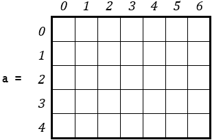

由于这个列表有七列，冒泡排序算法需要执行七次，每次对应一列。因此，整个冒泡排序算法应该嵌套在一个循环中，该循环迭代七次。

但让我们把事情放在正确的顺序上。使用“从内到外”的方法，接下来的代码片段只对二维列表 a 的第一列（列索引 0）进行排序。假设变量 j 包含值 0。

for m in range(ROWS - 1):

for n in range(ROWS - 1, m, -1):

> if a[n][j] < a[n - 1][j]:
> 
> > a[n][j], a[n - 1][j] = a[n - 1][j], a[n][j]

现在，为了对所有列进行排序，你可以将这个代码片段嵌套在一个循环中，该循环遍历所有列，如下所示。

for j in range(COLUMNS):

for m in range(ROWS - 1):

> for n in range(ROWS - 1, m, -1):
> 
> > if a[n][j] < a[n - 1][j]:
> > 
> > > a[n][j], a[n - 1][j] = a[n - 1][j], a[n][j]

这并不难，对吧？

#### 练习 33.4-6 修改后的冒泡排序算法 – 对一维列表进行排序

编写一个 Python 程序，允许用户输入 20 个人的体重，然后显示三个最重的体重和三个最轻的体重。使用修改后的冒泡排序算法。

Solution

为了解决这个练习，Python 程序可以对用户提供的数据进行升序排序，然后显示索引位置 17、18 和 19（对应三个最重的重量）以及索引位置 0、1 和 2（对应三个最轻的重量）。但这个修改后的冒泡排序算法是什么，它实际上是如何工作的呢？假设你有一个包含六个人体重的列表。

如果你仔细观察，你可以自己确认，唯一不在正确位置上的元素是索引位置 3 和 4 的元素。如果你交换它们的值，列表 w 立即变得有序！不幸的是，冒泡排序算法并不是这样操作的。对于这个包含六个元素的列表，它将进行五次遍历，总共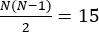次比较，其中 N 是列表元素的总数。对于更长的列表，冒泡排序算法执行的比较次数将以指数级增加！例如，对于一个包含 1000 个元素的列表，冒泡排序算法将执行 499,500 次比较！

当然，修改后的冒泡排序算法可以克服这种情况，如下所示：如果执行了完整的遍历且没有进行交换，则这表明列表现在已排序，无需进一步遍历。为了实现这一点，Python 程序可以使用一个标志变量来指示是否进行了交换。在遍历开始时，可以将 False 分配给标志变量；当进行交换时，将 True 分配。如果在遍历结束时标志仍然是 False，这表明没有进行交换，因此必须停止迭代。下面展示了修改后的冒泡排序。它使用 break 语句和 swaps 标志变量。

for m in range(ELEMENTS - 1):

#将 False 分配给变量 swaps

swaps = False

#执行新的遍历

for n in range(ELEMENTS - 1, m, -1):

> if w[n] < w[n - 1]:
> 
> > w[n], w[n - 1] = w[n - 1], w[n]
> > 
> > swaps = True

#如果变量 swaps 仍然是 False，则在此遍历中没有进行交换。停止迭代！

if not swaps: break

每次新的遍历开始时，必须将 False 分配给 swaps 变量。这就是为什么必须在两个 for 语句之间放置 swaps = False 语句的原因。

语句 if not swaps 等价于语句 if swaps == False

以下展示了最终的 Python 程序。

 file_33.4-6

ELEMENTS = 20

w = [None] * ELEMENTS

for i in range(ELEMENTS):

w[i] = float(input())

for m in range(ELEMENTS - 1):

swaps = False

for n in range(ELEMENTS - 1, m, -1):

> if w[n] < w[n - 1]:
> 
> > w[n], w[n - 1] = w[n - 1], w[n]
> > 
> > swaps = True

if not swaps: break

print("最重的三个重量是：")

print(w[-3], w[-2], w[-1])

print("最轻的三个重量是：")

print(w[0], w[1], w[2])

#### 练习 33.4-7 选择排序算法 – 对一维列表进行排序

编写一个使用选择排序算法对列表元素进行升序排序的代码片段。

解决方案

选择排序算法对于大规模数据来说效率不高，冒泡排序算法也是如此，但它通常比后者表现更好。它是所有排序算法中最简单的，在有限主内存（RAM）的计算机系统中表现良好。

算法找到列表中最小（或最大，取决于排序顺序）的元素，并将其内容与位置 0 的元素交换。然后对列表的其余部分重复此过程；找到下一个最小（或最大）元素并将其放入下一个位置，直到检查所有元素。

例如，让我们尝试按升序排序以下列表。

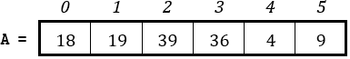

最低值是位置 4 的值 4。根据选择排序算法，此元素将其内容与位置 0 的元素交换。列表 A 变为

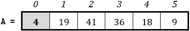

列表剩余部分（索引位置 1 到 5）中的最低值是 9，位于位置 5。此元素将其内容与位置 1 的元素交换。列表 A 变为

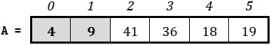

列表剩余部分（索引位置 2 到 5）中的最低值是 18，位于位置 4。此元素将其内容与位置 2 的元素交换。列表 A 变为

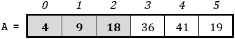

按照同样的方式，下一个最低的值是 19，位于位置 5。列表 A 变为

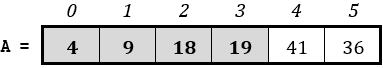

下一个最低的值是 36，位于位置 5。此元素将其内容与位置 4 的元素交换，列表 A 最终按升序排序！

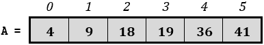

现在，让我们编写相应的 Python 程序。使用“从内到外”的方法，以便你更好地理解整个过程。下一个代码片段找到最小元素，然后将其内容与位置 0 的内容交换。请注意，这是一个内层（嵌套）循环控制结构。假设变量 m 包含值 0。

minimum = a[m]

indexOfMin = m

for n in range(m, ELEMENTS):

if a[n] < minimum:

> minimum = a[n]
> 
> indexOfMin = n

#找到最小值！现在，交换值。

a[m], a[indexOfMin] = a[indexOfMin], a[m]

现在，为了对所有列表元素重复这个过程，你可以在一个遍历所有元素的 for 循环中嵌套这个代码片段。按升序排序列表的选择排序算法如下。

for m in range(ELEMENTS):

minimum = a[m]

indexOfMin = m

for n in range(m, ELEMENTS):

> if a[n] < minimum:
> 
> > minimum = a[n]
> > 
> > indexOfMin = n

a[m], a[indexOfMin] = a[indexOfMin], a[m]

如果你希望按降序对列表进行排序，你只需要搜索最大值而不是最小值。

就像冒泡排序算法一样，在使用选择排序算法对字母数字数据进行排序时，你可以做一件简单的事情：保持算法原样！

#### 练习 33.4-8 在保持与第二个列表关系的同时对一维列表进行排序

编写一个 Python 程序，提示用户输入一年内每月消耗的总千瓦时数。然后显示三个月最高消耗的千瓦时数，以及相应的千瓦时数（按降序排列）。使用选择排序算法。

解决方案

在这个练习中，你需要以下两个一维列表。

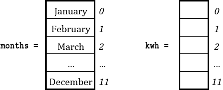

当选择排序算法对列表 kwh 的元素进行排序时，必须保持与列表 months 的元素的一对一对应关系。这意味着每次列表 kwh 的两个元素交换内容时，对应的列表 months 的元素也必须交换它们的内容。

然而，鉴于你只需要三个消耗 KWh 最高的月份，选择排序算法应该只排序前三个元素。Python 程序如下。

 file_33.4-8

months = ["一月", "二月", "三月", "四月", "五月", "六月",

> "七月", "八月", "九月", "十月", "十一月", "十二月"]

kwh = [None] * len(months)

for i in range(len(months)):

kwh[i] = float(input("Enter kWh for " + months[i] + ": "))

for m in range(3):     #只排序前三个元素

maximum = kwh[m]

indexOfMax = m

for n in range(m, len(months)):

> if kwh[n] > maximum:
> 
> > maximum = kwh[n]
> > 
> > indexOfMax = n

#交换 kwh 的值

kwh[m], kwh[indexOfMax] = kwh[indexOfMax], kwh[m]

#交换月份的值

months[m], months[indexOfMax] = months[indexOfMax], months[m]

for i in range(3):

print(months[i], ":", kwh[i])

如果这个练习需要使用冒泡排序而不是选择排序算法，你可以使用相同的“技巧”。算法可以执行 3 次遍历而不是 ELEMENTS – 1 次遍历。

#### 练习 33.4-9 插入排序算法 – 对一维列表进行排序

编写一个代码片段，使用插入排序算法按升序排序列表中的元素。

解决方案

插入排序算法对于大规模数据来说效率不高，选择排序和冒泡排序算法也是如此，但它通常比它们中的任何一个表现都要好。此外，当排序非常小的列表时，插入排序算法可以非常快——有时甚至比快速排序算法还要快。

插入排序算法类似于你可能用来排序扑克牌的方式。你开始时将所有扑克牌面朝下放在桌上。桌上的扑克牌代表未排序的“列表”。一开始你的左手是空的，但最后这只手将握有排序好的扑克牌。这个过程是这样的：你一次从桌上拿一张牌，并将其插入到左手正确的位置。为了找到一张牌的正确位置，你将其与手中已有的每张牌从右到左进行比较。最后，桌上必须没有牌，你的左手将握有所有已排序的牌。

例如，让我们尝试按升序排序以下列表。为了更好地理解这个例子，假设排序过程已经开始了，并且列表的前三个元素已经被排序。

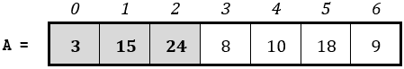

索引位置 0、1 和 2 的元素代表你左手中的牌，而列表的其余元素代表桌上未排序的牌。

位置 3（即 8）的元素从列表中移除，并且其左侧所有大于 8 的元素都向右移动。列表 A 变为

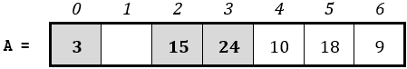

现在有一个位置被释放了，值 8 被插入其中。列表变为

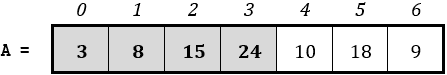

位置 4（值为 10）的元素从列表中移除，并且所有值大于 10 的左侧元素都向右移动。列表 A 变为

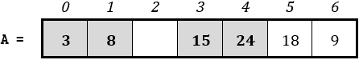

现在已经释放了一个位置，将 10 的值插入其中。列表变为

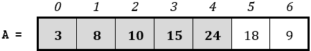

位置 5（值为 18）的元素从列表中移除，并且所有值大于 18 的左侧元素都向右移动。列表 A 变为

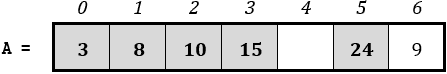

将 18 的值插入到释放的位置。列表变为

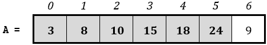

位置 6（值为 9）的元素从列表中移除，并且所有值大于 9 的左侧元素都向右移动。列表 A 变为

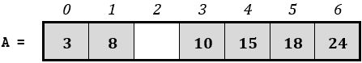

最后，将 9 的值插入到释放的位置，算法结束，列表现在已排序。

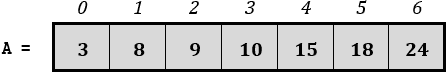

![img/notice.jpg]该算法实际上是对未排序的元素逐一进行检查，并将每个元素插入到已排序元素的正确位置。

使用插入排序算法按升序排序列表的代码片段如下。

for m in range(1, ELEMENTS):

#"移除"列表中索引位置为 m 的元素并将其保存在变量 element 中

element = a[m]

#将适当的元素向右移动

n = m

while n > 0 and a[n - 1] > element:

> a[n] = a[n - 1]
> 
> n -= 1

#将之前"移除"的元素插入到索引位置 n

a[n] = element

![img/notice.jpg]请注意，索引位置为 m 的元素实际上并没有从列表中移除，而是在向右移动时被覆盖。这就是为什么在移动元素之前需要将其值保存在变量 element 中的原因。

![img/notice.jpg]如果你希望按降序对列表进行排序，你只需要将 while 语句的布尔表达式更改为 n > 0 和 a[n - 1] < element。

![img/remember.jpg]正如前两个排序算法一样，为了对字母数字数据进行排序，你在这个算法中不需要做任何改变！

#### 练习 33.4-10 三次最长的耗时

十位赛车手在赛道上尽可能快地驾驶他们的赛车。每辆车跑 20 圈，每圈对应的时间（以秒为单位）被记录下来。编写一个 Python 程序，提示用户输入每位驾驶员的名字以及他们每圈的时间。然后程序必须显示每位驾驶员的名字以及他们的三次最长时间。使用插入排序算法。

解答

在这个练习中，你需要以下两个列表。

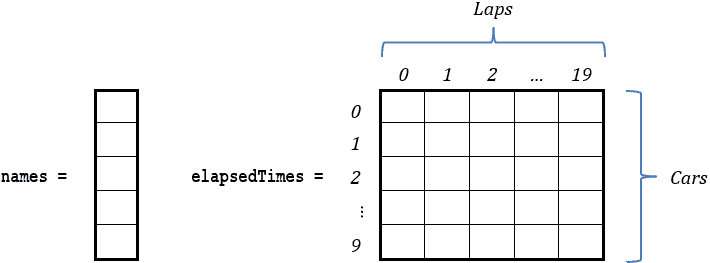

用户输入所有数据后，Python 程序必须按降序对列表中的每一行进行排序，但最终必须只显示前三个列。

使用“从内到外”的方法，下一个代码片段使用插入排序算法对二维列表 elapsedTimes 的第一行（行索引 0）进行降序排序。假设变量 i 包含值 0。

for m in range(1, LAPS):

element = elapsedTimes[i][m]

n = m

while n > 0 and elapsedTimes[i][n - 1] < element:

> elapsedTimes[i][n] = elapsedTimes[i][n - 1]
> 
> n -= 1

elapsedTimes[i][n] = element

现在，为了对所有行进行排序，你需要将此代码片段嵌套在一个 for 循环中，该循环遍历所有行，如下所示。

for i in range(CARS):

for m in range(1, LAPS):

> element = elapsedTimes[i][m]
> 
> n = m
> 
> while n > 0 and elapsedTimes[i][n - 1] < element:
> 
> > elapsedTimes[i][n] = elapsedTimes[i][n - 1]
> > 
> > n -= 1
> > 
> elapsedTimes[i][n] = element

现在，让我们专注于给定的练习。最终的 Python 程序如下所示。

 file_33.4-10

CARS = 10

LAPS = 20

#一起读取名字和时间

names = [None] * CARS

elapsedTimes = [[None] * LAPS for i in range(CARS)]

for i in range(CARS):

names[i] = input("请输入第" + str(i + 1) + "号司机的名字：" + str(input())))

for j in range(LAPS):

> elapsedTimes[i][j] = float(input("请输入第" + str(j + 1) + "圈的时间：" + str(float(input()))))

#对列表 elapsedTimes 进行排序

for i in range(CARS):

for m in range(1, LAPS):

> element = elapsedTimes[i][m]
> 
> n = m
> 
> while n > 0 and elapsedTimes[i][n - 1] < element:
> 
> > elapsedTimes[i][n] = elapsedTimes[i][n - 1]
> > 
> > n -= 1
> > 
> elapsedTimes[i][n] = element

#显示 3 个最慢的时间

for i in range(CARS):

print("最慢的时间为", names[i])

print("-------------------------------------")

for j in range(3):

> print(elapsedTimes[i][j])

### 33.5 在数据结构中搜索元素

在计算机科学中，搜索算法是一种在数据集中搜索具有特定特征的项的算法。在数据结构的情况下，搜索算法搜索数据结构以找到等于给定值的元素，或元素。

在数据结构中搜索时，可能会有两种情况。

►你想要在一个可能包含相同值多次的数据结构中搜索一个给定的值。因此，你需要找到所有等于该给定值的元素（或它们的对应索引）。

►你想要在一个每个值都是唯一的数据结构中搜索一个给定的值。因此，你需要找到只有一个元素（或其对应索引），即等于给定值的元素，然后停止进一步搜索！

最常用的搜索算法有：

►线性（或顺序）搜索算法

►二分搜索算法

线性和二分搜索算法都有优点和缺点。

#### 练习 33.5-1 线性搜索算法 – 在可能包含相同值多次的一维列表中进行搜索

编写一个代码片段，对一维列表进行搜索，以找到用户提供的值。假设列表包含数值，并且可能包含多个相同的值。使用线性搜索算法。

解决方案

线性（或顺序）搜索算法检查列表的第一个元素是否等于给定值，然后检查第二个元素，然后是第三个，依此类推，直到列表的末尾。由于逐个检查元素的过程相当慢，线性搜索算法适用于元素较少的列表。

下面的代码片段展示了如何查找用户提供的值 needle 在列表 haystack 中的位置！

needle = float(input("输入要搜索的值："))

found = False

for i in range(ELEMENTS):

if haystack[i] == needle:

> print(needle, "在位置：", i, "找到")
> 
> found = True

if not found:

print("未找到任何内容！")

#### 练习 33.5-2 显示具有相同姓氏的所有人的姓氏

编写一个 Python 程序，提示用户输入 20 个人的名字：将他们的名字分别输入到 firstNames 列表和 lastNames 列表中。然后程序必须询问用户输入一个名字，程序将搜索并显示所有名字与提供名字相同的人的姓氏。

解决方案

尽管练习的措辞并不明确，但确实列表 firstNames 可能包含多个相同的值。比如遇到两个名叫“John”的人有多罕见？

程序必须在列表 firstNames 中搜索用户提供的名字，并且每次找到它时，必须显示来自另一个列表的相应姓氏。

解决方案如下。

 file_33.5-2

PEOPLE = 20

firstNames = [None] * PEOPLE

lastNames = [None] * PEOPLE

for i in range(PEOPLE):

firstNames[i] = input("输入名字：")

lastNames[i] = input("输入姓氏：")

# 获取要搜索的名字并将其转换为大写

needle = input("输入要搜索的名字：").upper()

# 在列表 firstNames 中搜索用户提供的值

found = False

for i in range(PEOPLE):

if firstNames[i].upper() == needle:   # 转换为大写并比较

> print(lastNames[i])
> 
> found = True

if not found:

print("没有找到任何人！")

由于程序处理的是字母数字数据，需要使用 upper() 方法，以确保程序可以正确地处理任何用户提供的值。例如，如果值“John”存在于列表 firstNames 中，而用户想要搜索的值是“JOHN”，upper() 方法确保程序找到所有的“John”。

#### 练习 33.5-3 线性搜索算法 – 在可能包含多个相同值的二维列表中进行搜索

编写一个代码片段，对二维列表的每一行进行搜索，以找到用户提供的值。假设列表包含数值，并且可能包含多个相同的值。使用线性搜索算法。

解决方案

此代码片段必须在可能包含相同值多次出现的二维列表的每一行中搜索用户提供的数字。这意味着代码片段必须在第一行中搜索用户提供的数字，并显示找到该数字的所有列；否则，它必须显示一条消息，说明用户提供的数字在第一行中没有找到。然后，它必须在第二行中搜索，这个过程必须继续，直到检查完所有行。

为了更好地理解这个练习，使用了“由内到外”的方法。下面的代码片段仅搜索名为 haystack 的两个维列表的第一行中的给定值（变量 needle）。假设变量 i 包含值 0。

found = False

for j in range(COLUMNS):

if haystack[i][j] == needle:

> print("在列", j, "找到")
> 
> found = True

if not found:

print("在第", i, "行未找到任何内容")

现在，为了在所有行中进行搜索，你需要将此代码片段嵌套在一个遍历所有行的 for 循环中，如下所示。

needle = float(input("输入要搜索的值："))

for i in range(ROWS):

found = False

for j in range(COLUMNS):

> if haystack[i][j] == needle:
> 
> > print("在列", j, "找到")
> > 
> > found = True

if not found:

> print("在第", i, "行未找到任何内容")

#### 练习 33.5-4 线性搜索算法 - 在包含唯一值的单维列表中进行搜索

编写一个代码片段，在单维列表中执行搜索以找到用户提供的值。假设列表包含数值，并且列表中的每个值都是唯一的。使用线性搜索算法。

解决方案

这种情况与前面的情况有很大不同。由于列表中的每个值都是唯一的，当找到用户提供的值时，就没有必要无谓地迭代到列表的末尾，从而浪费 CPU 时间。实际上有三种方法！让我们分析一下所有的方法！

第一种方法 - 使用 break 语句

在这种方法中，当找到用户提供的值时，使用 break 语句跳出 for 循环。解决方案如下。

needle = float(input("输入要搜索的值："))

found = False

for i in range(ELEMENTS):

if haystack[i] == needle:

> print(needle, "在位置", i, "找到")
> 
> found = True
> 
> break

if not found:

print("未找到任何内容！")

或者，你也可以以稍微不同的方式做同样的事情。

needle = float(input("输入要搜索的值："))

indexPosition = -1

for i in range(ELEMENTS):

if haystack[i] == needle:

> indexPosition = i
> 
> break

if indexPosition == -1:

print("未找到任何内容！")

else:

print(needle, "在位置", indexPosition, "找到")

第二种方法 - 使用标志

break 语句并不是所有计算机语言都有的；由于本书的目的是教你“算法思维”（而不仅仅是 Python 支持的特殊语句），让我们看看另一种方法。

在下一个代码片段中，当用户提供的值在列表 haystack 中找到时，变量 found 强制执行流程立即退出循环。

needle = float(input("Enter a value to search: "))

found = False

i = 0

while i < ELEMENTS and not found:

if haystack[i] == needle:

> found = True
> 
> indexPosition = i

i += 1

if not found:

print("Nothing found!")

else:

print(needle, "found at position:", indexPosition)

第三种方法 – 仅使用预测试循环结构

这种方法可能是三种方法中最有效率的。while 循环遍历列表，将每个元素与针值进行比较。只要满足两个条件，循环就会继续：变量 i（表示索引）在列表 haystack 的有效范围内，并且列表当前索引处的值不等于针值。如果两个条件都为真，变量 i 就会增加以移动到下一个元素。这个过程会一直持续到找到匹配项或到达列表的末尾。

needle = float(input("Enter a value to search: "))

i = 0

while i < ELEMENTS - 1 and haystack[i] != needle:

i += 1

if haystack[i] != needle:

print("Nothing found!")

else:

print(needle, "found at position:", i)

#### 练习 33.5-5 搜索社会保障号码

在美国，社会保障号码（SSN）是一个九位身份号码，用于识别所有美国公民以进行社会保障目的。编写一个 Python 程序，提示用户输入 100 人的 SSN 和姓名。然后程序必须要求用户输入一个 SSN，程序将搜索并显示持有该 SSN 的人的姓名和姓氏。

解决方案

在美国，两个人或更多人拥有相同 SSN 的可能性为零。因此，尽管练习的措辞并不明确，但持有 SSN 的列表中的每个值都是唯一的！

根据你迄今为止所学的一切，本练习的解决方案如下。

 file_33.5-5

PEOPLE = 100

SSNs = [None] * PEOPLE

firstNames = [None] * PEOPLE

lastNames = [None] * PEOPLE

for i in range(PEOPLE):

SSNs[i] = input("Enter SSN: ")

firstNames[i] = input("Enter first name: ")

lastNames[i] = input("Enter last name: ")

needle = input("Enter an SSN to search: ")

# 在列表 SSNs 中搜索用户提供的值

i = 0

while i < PEOPLE - 1 and SSNs[i] != needle:

i += 1

if SSNs[i] != needle:

print("Nothing found!")

else:

print(firstNames[i], lastNames[i])

#### 练习 33.5-6 线性搜索算法 – 在包含唯一值的二维列表中进行搜索

一家民意调查公司在 10 个城市中进行电话调查，询问每个城市的 30 位公民是否锻炼。编写一个 Python 程序，提示用户输入每位公民的电话号码和他们的答案（Y 代表是，N 代表否，S 代表有时）。然后程序提示用户输入一个电话号码，并搜索并显示在此电话号码下提供的答案。程序还必须验证数据输入，并只接受 Y、N 或 S 作为答案。

解决方案

在这个练习中，你需要以下两个列表。

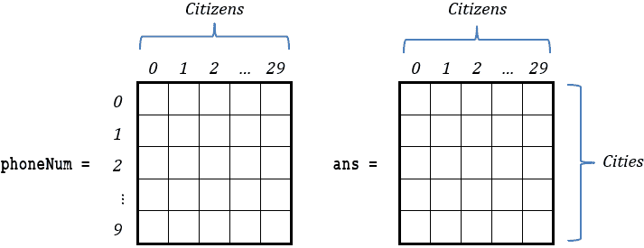

尽管练习的措辞并不明确，但列表 phoneNum 中的每个值都是唯一的！程序必须搜索用户提供的号码，如果找到，则停止搜索。解决方案如下。

 file_33.5-6

CITIES = 10

CITIZENS = 30

phoneNum = [[None] * CITIZENS for i in range(CITIES)]

ans = [[None] * CITIZENS for i in range(CITIES)]

for i in range(CITIES):

print("城市编号", i + 1)

for j in range(CITIZENS):

> phoneNum[i][j] = input("请输入第" + str(j + 1) + "号公民的电话号码：")
> 
> ans[i][j] = input("请输入第" + str(j + 1) + "号公民的答案：").upper()
> 
> while ans[i][j] not in ["Y", "N", "S"]:
> 
> > ans[i][j] = input("回答错误。请输入有效的答案：").upper()

needle = input("输入要搜索的电话号码：")

found = False

for i in range(CITIES):

for j in range(CITIZENS):

> if phoneNum[i][j] == needle: #如果找到了
> 
> > found = True
> > 
> > positionI = i  #保留找到针的位置的行索引
> > 
> > positionJ = j  #保留找到针的列索引
> > 
> > break  #退出内循环

if found:

> break   #如果找到了，也退出外循环

if not found:

print("电话号码未找到！")

else:

print("电话号码", phoneNum[positionI][positionJ], "给出了 '", end = "")

if ans[positionI][positionJ] == "Y":

> print("Yes", end = "")

elif ans[positionI][positionJ] == "N":

> print("No", end = "")

else:

> print("有时", end = "")

print("' 作为答案")

#### 练习 33.5-7 检查值是否存在于所有列中

编写一个 Python 程序，允许用户将数值输入到一个 20 × 30 的列表中。在所有数值都输入完毕后，程序接着让用户输入一个值。最后，如果用户提供的值至少在每个列表列中出现过一次，则显示一条消息。

解决方案

此练习可以使用线性搜索算法和计数变量 count 来解决。Python 程序将遍历第一列；如果找到用户提供的值，Python 程序必须在之后停止在第一列中搜索，并将变量 count 增加一。然后，程序将遍历第二列；如果再次找到用户提供的值，Python 程序必须在之后停止在第二列中搜索，并将变量 count 再次增加一。这个过程必须重复，直到检查完所有列。在过程结束时，如果 count 的值等于列的总数，这意味着用户提供的值至少在每个列表的列中存在一次。

让我们使用“从内到外”的方法。以下代码片段在列表的第一列（列索引 0）中搜索，如果找到用户提供的值，执行流程将退出 for 循环，变量 count 增加一。假设变量 j 包含值 0。

found = False

for i in range(ROWS):

if haystack[i][j] == needle:

> found = True
> 
> break

if found:

count += 1

现在您可以在一个遍历所有列的 for 循环中嵌套此代码片段。

for j in range(COLUMNS):

found = False

for i in range(ROWS):

> if haystack[i][j] == needle:
> 
> > found = True
> > 
> > break

if found:

> count += 1

您几乎准备好了——但考虑一下一个小细节！如果内层 for 循环在某一列中没有找到用户提供的值，外层 for 循环必须停止迭代。继续迭代是没有意义的，因为用户提供的值至少在一列中不存在。因此，更好的方法是在代码片段中显示使用 break 语句来对外层循环进行中断。

for j in range(COLUMNS):

found = False

for i in range(ROWS):

> if haystack[i][j] == needle:
> 
> > found = True
> > 
> > break

if found:

> count += 1

else:

> break

最终的 Python 程序如下。

 file_33.5-7

ROWS = 20

COLUMNS = 30

haystack = [[None] * COLUMNS for i in range(ROWS)]

for i in range(ROWS):

for j in range(COLUMNS):

> haystack[i][j] = float(input())

needle = float(input("请输入要搜索的值："))

count = 0

for j in range(COLUMNS):

found = False

for i in range(ROWS):

> if haystack[i][j] == needle:
> 
> > found = True
> > 
> > break

if found:

> count += 1

else:

> break

if count == COLUMNS:

print(needle, "在每一列中找到！")

如果您需要在每一行（而不是每一列）至少存在一次用户提供的值时显示一条消息，Python 程序可以遵循之前显示的程序，但在此情况下，它必须遍历行而不是列。

#### 练习 33.5-8 二分查找算法 – 在有序一维列表中进行搜索

编写一个代码片段，在有序一维列表中执行搜索以找到给定值。使用二分查找算法。

解决方案

二分查找算法被认为非常快，并且可以用于大规模数据。然而，其主要缺点是数据需要排序。

二分查找算法的主要思想是首先检查列表中间的元素。如果它不匹配你正在寻找的“针”，算法将确定目标是否小于或大于中间元素。这引导搜索到相应的列表一半。换句话说，如果你正在寻找的“针”小于中间元素的值，这意味着“针”可能在列表的前半部分；否则它可能在后半部分。这个过程继续，通过检查剩余一半列表中的中间元素来缩小搜索范围，直到找到“针”或正在检查的列表部分减少到单个元素。如果后者发生而没有找到“针”，这意味着“针”不在列表中。

感到困惑？让我们通过一个例子来尝试分析二分查找算法。以下列表包含按升序排列的数值。假设你正在寻找的“针”是值 44。

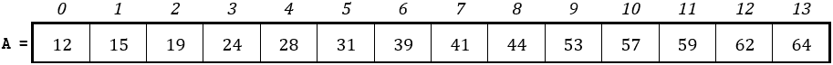

使用了三个变量。最初，变量 left 包含值 0（这是第一个元素的索引），变量 right 包含值 13（这是最后一个元素的索引），变量 middle 包含值 6（这是大约中间元素的索引）。

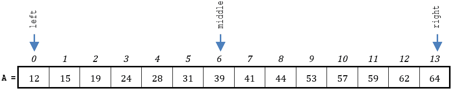

你正在寻找的“针”（值 44）比中间的值 39 大，因此你正在寻找的元素可能位于列表的后半部分。因此，变量 left 更新为指向索引位置 7，变量 middle 更新为指向 left（新的）和 right 之间的中间位置，如下所示。

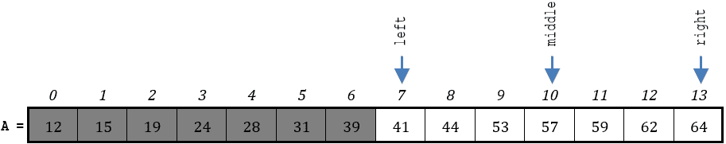

现在，你正在寻找的“针”（值 44）比中间的值 57 小，因此你正在寻找的元素可能位于正在检查的列表部分的前半部分。因此，变量 right 现在更新为指向索引位置 9，变量 middle 更新为指向 left 和 right（新的）之间的中间位置，如下所示 002E

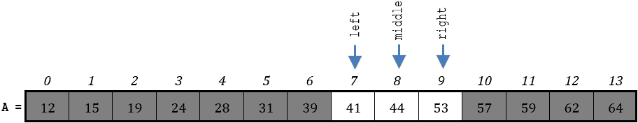

你完成了！“针”在索引位置 8 被找到，整个过程可以停止！

每次不成功的比较都会将需要检查的元素数量减半！

索引变量 left 和 right 每次分别指向正在检查的列表部分的开始和结束。

现在，让我们看看相应的代码片段。

left = 0

right = ELEMENTS - 1

found = False

当 left <= right 且未找到时：

middle = (left + right) // 2   # 这是一个除以 2 的操作

if needle < haystack[middle]:  #如果针在部分的前半部分，

> right = middle – 1            #正在检查的列表，更新右索引

elif needle > haystack[middle]:  #如果它在后半部分，

> left = middle + 1            #更新左索引

else:

> found = True

if not found:

print("Nothing found!")

else:

print(needle, "found at position:", middle)

二分查找算法非常高效，因为它在每次迭代中极大地减少了搜索空间，使其对排序列表非常有效。使用此算法在示例列表中，值 44 可以在仅三次迭代内找到。相比之下，线性搜索算法需要九次迭代来完成相同的数据！

如果列表包含多个相同的值，二分查找算法只能找到其中一个。

#### 练习 33.5-9 显示一个国家的所有历史事件

编写一个 Python 程序，提示用户按字母顺序输入 10 个国家的名称和每个国家 20 个重要历史事件（每个事件的简要描述）。然后 Python 程序必须提示用户输入一个国家，并将搜索并显示该国的所有事件。使用二分查找算法。

解决方案

在这个练习中，需要以下两个列表。

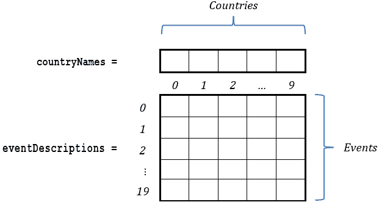

假设用户输入一个要搜索的国家，二分查找算法发现该国家位于列表 countryNames 的索引位置 2。然后程序可以使用这个 2 作为列表 eventDescriptions 的列索引，并显示第 2 列的所有事件描述。

The Python program is as follows.

 file_33.5-9

EVENTS = 20

COUNTRIES = 10

countryNames = [None] * COUNTRIES

eventDescriptions = [[None] * COUNTRIES for i in range(EVENTS)]

for j in range(COUNTRIES):

countryNames[j] = input("Enter Country No" + str(j + 1) + ": ")

for i in range(EVENTS):

> eventDescriptions[i][j] = input("Enter description for event No" + str(i + 1) + ": ")

needle = input("Enter a country to search: ").upper()

#国家名称按字母顺序输入。

#使用二分查找算法来搜索针

left = 0

right = EVENTS - 1

found = False

while left <= right and not found:

middle = (left + right) // 2

if needle < countryNames[middle].upper():

> right = middle - 1

elif needle > countryNames[middle].upper():

> left = middle + 1

else:

> found = True

if not found:

print("No country found!")

else:

for i in range(EVENTS):

> print(eventDescriptions[i][middle])

#### 练习 33.5-10 在二维列表的每一列中搜索

编写一个 Python 程序，提示用户输入 10 个国家的名称以及每个国家 20 个重要历史事件（每个事件的简要描述）以及每个事件的对应年份。Python 程序必须然后提示用户输入一个年份，并将搜索并显示每个国家在该年发生的事件。使用二分查找算法。假设每个国家每年只有一个事件，并且用户按年份升序输入事件。

Solution

在这个练习中，需要以下三个列表。

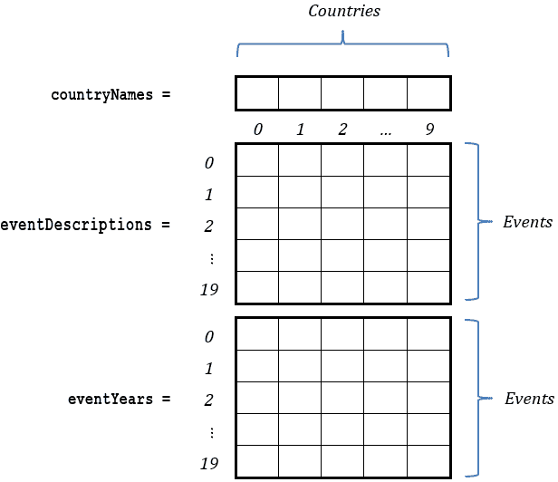

为了编写对列表 eventYears 的每一列进行搜索的代码片段，让我们使用“从内到外”的方法。接下来的二分查找算法在第一列（列索引 0）中搜索用户提供的年份。假设变量 j 包含值 0。由于搜索是垂直进行的，并且为了提高程序的可读性，二分查找算法的左右变量已被重命名为 top 和 bottom。

top = 0

bottom = EVENTS - 1

found = False

while top <= bottom and not found:

middle = (top + bottom) // 2

if needle < eventYears[middle][j]:

> bottom = middle - 1

elif needle > eventYears[middle][j]:

> top = middle + 1

else:

> found = True

if not found:

print("No event found for country", countryNames[j])

else:

print("Country:", countryNames[j])

print("Year:", eventYears[middle][j])

print("Event:", eventDescriptions[middle][j])

现在，将此代码片段嵌套在一个 for 循环中，该循环遍历所有列，结果如下。

for j in range(COUNTRIES):

top = 0

bottom = EVENTS - 1

found = False

while top <= bottom and not found:

> middle = (top + bottom) // 2
> 
> if needle < eventYears[middle][j]:
> 
> > bottom = middle - 1
> > 
> elif needle > eventYears[middle][j]:
> 
> > top = middle + 1
> > 
> else:
> 
> > found = True

if not found:

> print("No event found for country", countryNames[j])

else:

> print("Country:", countryNames[j])
> 
> print("Year:", eventYears[middle][j])
> 
> print("Event:", eventDescriptions[middle][j])

最终的 Python 程序如下。

 file_33.5-10

EVENTS = 20

COUNTRIES = 10

countryNames = [None] * COUNTRIES

eventDescriptions = [[None] * COUNTRIES for i in range(EVENTS)]

eventYears = [[None] * COUNTRIES for i in range(EVENTS)]

for j in range(COUNTRIES):

countryNames[j] = input("Enter Country No." + str(j + 1) + ": ")

for i in range(EVENTS):

> eventDescriptions[i][j] = input("Enter description for event No" + str(i + 1) + ": ")
> 
> eventYears[i][j] = int(input("Enter year for event No" + str(i + 1) + ": "))

needle = int(input("Enter a year to search: "))

for j in range(COUNTRIES):

top = 0

bottom = EVENTS - 1

found = False

while top <= bottom and not found:

> middle = (top + bottom) // 2
> 
> if needle < eventYears[middle][j]:
> 
> > bottom = middle - 1
> > 
> elif needle > eventYears[middle][j]:
> 
> > top = middle + 1
> > 
> else:
> 
> > found = True

if not found:

> print("在以下国家没有找到事件", countryNames[j])

else:

> print("国家:", countryNames[j])
> 
> print("年份:", eventYears[middle][j])
> 
> print("事件:", eventDescriptions[middle][j])

### 33.6 具有数据结构的通用练习

#### 练习 33.6-1 在哪些天有可能下雪？

编写一个 Python 程序，让用户输入 1 月份每天同一小时记录的温度（华氏度）。然后，Python 程序必须显示那些有可能下雪的日子（1，2，...，31），即温度低于 36 华氏度（约 2 摄氏度）的日子。

解决方案

这个练习的一维列表如下。

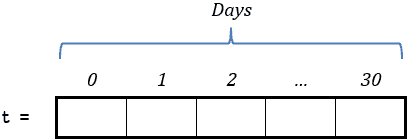

Python 程序如下。

 file_33.6-1

DAYS = 31

t = [None] * DAYS

for i in range(DAYS):

t[i] = int(input())

for i in range(DAYS):

if t[i] < 36:

> print(i + 1, end = "\t")

#### 练习 33.6-2 是否有可能下雪？

编写一个 Python 程序，让用户输入 1 月份每天同一小时记录的温度（华氏度）。然后，Python 程序必须显示是否有下雪的可能，即是否有温度低于 36 华氏度（约 2 摄氏度）。

解决方案

在这个练习中，你不能复制前一个练习中使用的方法。下面的代码片段将是错误的。

for i in range(DAYS):

if t[i] < 36:

> print("一月份有可能下雪！")

如果一月份有不止一天的温度低于 36 华氏度，同样的信息会被多次显示——显然你不想这样！你实际上只想显示一次信息，不管一月份有没有一天、两天，甚至更多天的温度低于 36 华氏度。

实际上，有两种方法。让我们研究一下这两种方法。

第一种方法 - 计算所有低于 36 华氏度的温度

在这种方法中，你可以使用程序中的一个变量来计算所有温度低于 36 华氏度的日子。在检查完所有这些日子之后，程序可以检查这个变量的值。如果这个值不是零，这意味着至少有一天有可能下雪。

 file_33.6-2a

DAYS = 31

t = [None] * DAYS

for i in range(DAYS):

t[i] = int(input())

count = 0

for i in range(DAYS):

if t[i] < 36:

> count += 1

if count != 0:

print("一月份有可能下雪！")

第二种方法 - 使用标志

在这种方法中，你不需要计算所有温度低于 36 华氏度的日子，你可以使用一个布尔变量（标志）。解决方案将在下面展示。

 file_33.6-2b

DAYS = 31

t = [None] * DAYS

for i in range(DAYS):

t[i] = int(input())

found = False

for i in range(DAYS):

if t[i] < 36:

> found = True
> 
> break

if found:

print("一月份有可能下雪！")

想象一下找到的变量就像一个真正的旗帜。最初，旗帜没有升起（found = False）。然而，在 for 循环中，当找到低于 36 华氏度的温度时，旗帜升起（将 True 的值赋给变量 found），并且它永远不会再次降下。

注意 break 语句！一旦找到低于 36 华氏度的温度，继续检查就变得没有意义了。

如果循环完成了所有的迭代并且没有找到低于 36 华氏度的温度，变量 found 仍然包含其初始值（False），因为执行流程从未进入决策控制结构。

#### 练习 33.6-3 在哪些城市有可能下雪？

编写一个 Python 程序，提示用户输入十个城市的名称和它们在一月份 31 天中每天同一小时记录的温度（华氏度）。Python 程序必须显示那些有可能下雪的城市名称，即温度低于 36 华氏度（约 2 摄氏度）的城市。

解决方案

与上一个练习一样，你需要显示每个城市的名称一次，无论它是否有一天、两天，甚至更多天的温度低于 36 华氏度。有两种方法。在第一种方法中，程序创建了一个辅助列表 count，如下所示，以统计每个城市温度低于 36 华氏度的总天数。然而，第二种方法不创建辅助列表 count。它只使用一个额外的布尔变量（一个旗帜）。显然，第二个更高效。但让我们研究一下两种方法。

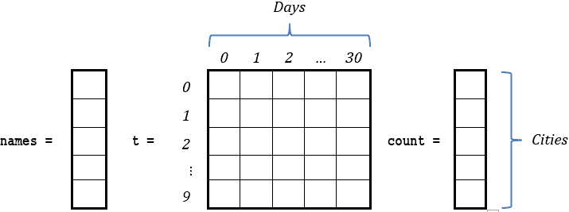

第一种方法 – 使用辅助列表

你在 第 32.2 节 学到了如何逐行处理。可以创建辅助列表 count 的嵌套循环控制结构如下。

count = [None] * CITIES

for i in range(CITIES):

count[i] = 0

for j in range(DAYS):

> if t[i][j] < 36:
> 
> > count[i] += 1

在创建列表 count 之后，你可以遍历它，当元素包含的值不是零时，这意味着相应的城市至少有一天温度低于 36 华氏度；因此程序必须显示该城市的名称。接下来的 Python 程序如下所示

 file_33.6-3a

CITIES = 10

DAYS = 31

names = [None] * CITIES

t = [[None] * DAYS for i in range(CITIES)]

for i in range(CITIES):

names[i] = input("输入第 " + str(i + 1) + " 个城市的名称: ")

for j in range(DAYS):

> t[i][j] = int(input("输入第 " + str(j + 1) + " 天的温度: "))

# 创建辅助列表 count

count = [None] * CITIES

for i in range(CITIES):

count[i] = 0

for j in range(DAYS):

> 如果 t[i][j] < 36:
> 
> > count[i] += 1

打印("一月份可能下雪的城市：")

for i in range(CITIES):

if count[i] != 0:

> print(names[i])

第二种方法 - 使用标志

这种方法不使用辅助列表。它直接处理列表 t，并显示任何温度低于 36 华氏度的城市名称。但是，如何在不显示城市名称两次或更多次的情况下做到这一点？这就是你需要一个标志，即一个额外的布尔变量。

为了更好地理解这种方法，让我们使用“从内到外”的方法。以下代码片段检查列表 t 的第一行（行索引 0）是否至少包含一个低于 36 华氏度的温度；如果是这样，它将显示位于列表 names 位置 0 的相应城市名称。假设变量 i 的值为 0。

found = False

for j in range(DAYS):

if t[i][j] < 36:

> found = True
> 
> break

if found:

print(names[i])

现在一切都已明确，为了处理整个列表 t，你只需将此代码片段嵌套在一个遍历所有城市的 for 循环中，如下所示。

for i in range(CITIES):

found = False

for j in range(DAYS):

> if t[i][j] < 36:
> 
> > found = True
> > 
> > break

if found:

> print(names[i])

最终的 Python 程序如下。

 file_33.6-3b

CITIES = 10

DAYS = 31

names = [None] * CITIES

t = [[None] * DAYS for i in range(CITIES)]

for i in range(CITIES):

names[i] = input("为城市编号：" + str(i + 1) + " 输入一个名称：")

for j in range(DAYS):

> t[i][j] = int(input("为第" + str(j + 1) + "天输入温度："))

打印("一月份可能下雪的城市：")

for i in range(CITIES):

found = False

for j in range(DAYS):

> if t[i][j] < 36:
> 
> > found = True
> > 
> > break

if found:

> print(names[i])

#### 练习 33.6-4 按学生平均成绩从高到低显示，并按字母顺序排列

有 10 名学生，他们每个人都已经完成了五节课的评分。编写一个 Python 程序，提示教师输入每个学生的姓名和所有课程的评分。然后程序必须计算每个学生的平均成绩，并按学生的平均成绩降序显示学生的姓名和平均成绩。此外，如果有两个或更多学生的平均成绩相同，他们的姓名必须按字母顺序显示。使用适当的冒泡排序算法。

解答

在这个练习中，你需要以下三个列表。列表 names 和 grades 的值将由用户输入，而辅助列表 average 将由 Python 程序创建。

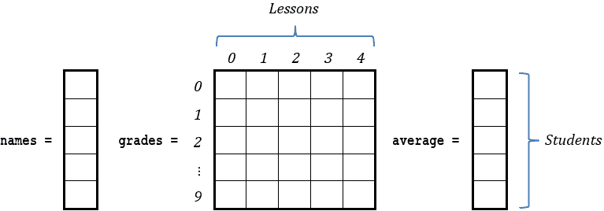

你已经熟悉这个练习的所有步骤。你可以创建辅助列表 average（见第 32.2 节），在保持与列表 names 中元素一对一对应的同时对其进行排序（如练习 33.4-3 所示），并处理以下场景：如果两个平均成绩相等，则相应的学生姓名应按字母顺序排序（如练习 33.4-4 所示）。以下是最终的 Python 程序。

 file_33.6-4

STUDENTS = 10

LESSONS = 5

#读取列表 names 和 grades

names = [None] * STUDENTS

grades = [[None] * LESSONS for i in range(STUDENTS)]

for i in range(STUDENTS):

names[i] = input("Enter name for student No." + str(i + 1) + ": ")

for j in range(LESSONS):

> grades[i][j] = int(input("Enter grade for lesson No." + str(j + 1) + ": "))

#创建列表 average

average = [None] * STUDENTS

for i in range(STUDENTS):

average[i] = 0

for j in range(LESSONS):

> average[i] += grades[i][j]

average[i] /= LESSONS

#对列表 average 和 names 进行排序

for m in range(STUDENTS - 1):

for n in range(STUDENTS - 1, m, -1):

> if average[n] > average[n - 1]:
> 
> > average[n], average[n - 1] = average[n - 1], average[n]
> > 
> > names[n], names[n - 1] = names[n - 1], names[n]
> > 
> elif average[n] == average[n - 1]:
> 
> > if names[n] < names[n - 1]:
> > 
> > > names[n], names[n - 1] = names[n - 1], names[n]

#显示列表 names 和 average

for i in range(STUDENTS):

print(names[i], "\t", average[i])

#### 练习 33.6-5 夏季奥运会的射箭比赛

在夏季奥运会的射箭比赛中，20 名运动员每人射六支箭。编写一个 Python 程序，提示用户输入每位运动员的姓名和每箭的得分。然后，程序必须显示获得金牌、银牌和铜牌的三位运动员的姓名，取决于哪位运动员获得了最高总分。假设没有两位运动员的总分相等。

解决方案

在这个练习中，你需要以下三个列表。列表 names 和 points 的值将由用户输入，而辅助列表 total 将由 Python 程序创建。

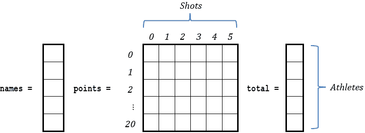

在创建辅助列表 total 之后，排序算法可以按降序对列表 total 进行排序（同时保持与列表 names 中元素的对应关系）。然后，Python 程序可以显示索引位置为 0、1 和 2 的运动员姓名（因为这些运动员应该分别获得金牌、银牌和铜牌）。

The following program uses the bubble sort algorithm to sort the list total. Since the algorithm must sort in descending order, bigger elements must gradually “bubble” to positions of lowest index, like bubbles rise in a glass of cola. However, instead of performing 19 passes (there are 20 athletes), given that only the three best athletes must be found, the algorithm can perform just 3 passes. Doing this, only the first three bigger elements will gradually “bubble” to the first three positions in the list.

The solution is presented next.

 file_33.6-5

from math import fsum

ATHLETES = 20

SHOTS = 6

#Read list names and points

names = [None] * ATHLETES

points = [[None] * SHOTS for i in range(ATHLETES)]

for i in range(ATHLETES):

names[i] = input("Enter name for athlete No." + str(i + 1) + ": ")

for j in range(SHOTS):

> points[i][j] = int(input("Enter points for shot No." + str(j + 1) + ": "))

#Create list total

total = []

for row in points:

total.append(fsum(row))

#Sort lists names and total. Perform only 3 passes

for m in range(3):

for n in range(ATHLETES - 1, m, -1):

> if total[n] > total[n - 1]:
> 
> > total[n], total[n - 1] = total[n - 1], total[n]
> > 
> > names[n], names[n - 1] = names[n - 1], names[n]

#Display gold, silver and bronze metal

for i in range(3):

print(names[i], "\t", total[i])

#### 练习 33.6-6 五大最佳射手

Write a Python program that prompts the user to enter the names of the 32 national teams of the FIFA World Cup, the names of the 24 players for each team, and the total number of goals each player scored. The program must then display the name of each team along with its five best scorers. Use the bubble sort algorithm.

Solution

In this exercise you need the following three lists.

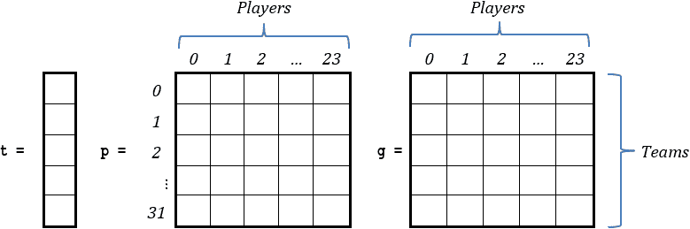

To save paper short list names are used, but it is more or less obvious that list t holds the names of the 32 national teams, list p holds the names of the 24 players of each team, and list g holds the total number of goals each player scored.

The Python program must sort each row of list g in descending order but it must also take care to preserve the one-to-one correspondence with the elements of list p. This means that, every time the bubble sort algorithm swaps the contents of two elements of list g, the corresponding elements of list p must be swapped as well. However, instead of performing 23 passes (there are 24 players), given that only the five best scorers must be found, the algorithm can perform just 5 passes. When sorting is completed, the five best scorers should appear in the first five columns.

再次使用“从内到外”的方法。以下代码片段对列表 g 的第一行（行索引 0）按降序排序，同时注意保持与列表 p 中元素的对应关系。假设变量 i 包含值 0。

for m in range(5):  #Perform 5 passes

for n in range(PLAYERS - 1, m, -1):

> if g[i][n] > g[i][n - 1]:
> 
> > g[i][n], g[i][n - 1] = g[i][n - 1], g[i][n]
> > 
> > p[i][n], p[i][n - 1] = p[i][n - 1], p[i][n]

现在为了对所有行进行排序，你需要将此代码片段嵌套在一个遍历所有行的 for 循环中，如下所示。

for i in range(TEAMS):

for m in range(5):  #执行 5 次遍历

> for n in range(PLAYERS - 1, m, -1):
> 
> > if g[i][n] > g[i][n - 1]:
> > 
> > > g[i][n], g[i][n - 1] = g[i][n - 1], g[i][n]
> > > 
> > > p[i][n], p[i][n - 1] = p[i][n - 1], p[i][n]

最终的 Python 程序如下。

 file_33.6-6

TEAMS = 32

PLAYERS = 24

#一次性读取队伍名称、球员名称和进球数

t = [None] * TEAMS

p = [[None] * PLAYERS for i in range(TEAMS)]

g = [[None] * PLAYERS for i in range(TEAMS)]

for i in range(TEAMS):

t[i] = input("输入队伍 No." + str(i + 1) + "的名称: ")

for j in range(PLAYERS):

> p[i][j] = input("输入球员 No." + str(j + 1) + "的名称: ")
> 
> g[i][j] = int(input("输入球员 No." + str(j + 1) + "的进球数: "))

#对列表 g 进行排序

for i in range(TEAMS):

for m in range(5):  #执行 5 次遍历

> for n in range(PLAYERS - 1, m, -1):
> 
> > if g[i][n] > g[i][n - 1]:
> > 
> > > g[i][n], g[i][n - 1] = g[i][n - 1], g[i][n]
> > > 
> > > p[i][n], p[i][n - 1] = p[i][n - 1], p[i][n]

#显示每个队伍的前 5 名得分手

for i in range(TEAMS):

print("队伍", t[i], "的最佳得分手")

print("----------------------------------")

for j in range(5):

> print(p[i][j], "得分", g[i][j], "球")

#### 练习 33.6-7 计算元音频率

编写一个 Python 程序，提示用户输入一个英文句子，并计算句子中每个元音的频率。使用字典来存储元音作为键和它们的频率作为值。

解决方案

在编程领域，文本数据的操作和分析起着至关重要的作用。一个常见的任务是在给定的文本中计数特定元素的频率，从而提供对其语言特征的洞察。元音是英语语言的基本组成部分，分析它们的频率可以揭示模式，有助于语言处理，甚至有助于某些加密算法。

在下面的解决方案中，程序首先创建一个名为 vowelsFrequency 的字典来存储和管理每个元音（A、E、I、O、U）的频率，初始频率都设置为 0。对于用户提供的句子中的每个字符，程序检查它是否是元音，如果是，则更新字典中相应的频率计数。

  file_33.6-7

#创建一个字典来存储每个元音的频率，初始频率都设置为 0。

#频率都设置为 0。

vowelsFrequency  = {"A": 0, "E": 0, "I": 0, "O": 0, "U": 0}

sentence = input("输入一个英文句子: ")

#遍历用户提供的句子中的字符，如果它是元音，

#在 vowelsFrequency 字典中更新（增加）相应的频率计数。

for character in sentence.upper():

if character in vowelsFrequency:

> vowelsFrequency[character] += 1

#显示每个元音的频率

for vowel in vowelsFrequency:

print(vowel + ":", vowelsFrequency[vowel])

### 33.7 复习问题：正确/错误

对以下每个陈述选择正确或错误。

1)冒泡排序算法（当按升序排序列表时）的主要思想是反复将列表中最小的元素移动到最低索引位置。

2)在一个升序排序的列表中，第一个元素是所有元素中最大的。

3)在使用冒泡排序算法时，总的交换次数取决于给定的列表。

4)冒泡排序算法执行最大次数交换的情况是在你想要对已经按升序排序的列表进行降序排序时。

5)在冒泡排序算法中，当决策控制结构测试布尔表达式 A[n] > A[n − 1]时，这意味着列表 A 的元素正在按降序排序。

6)在 Python 中，排序算法比较字母的方式与它们比较数字的方式相同。

7)如果你想对列表 A 进行排序但保留与列表 B 元素的逐一对应关系，你必须重新排列列表 B 的元素。

8)冒泡排序算法有时比改进的冒泡排序算法表现更好。

9)根据冒泡排序算法，在每次遍历（除了最后一次）中，只有一个元素保证被放置在正确的位置。

10)冒泡排序算法只能通过使用 for 循环来实现。

11)快速排序算法不能用于对二维列表的每一列进行排序。

12)插入排序算法可以按升序或降序排序。

13)修改的冒泡排序算法是速度最快的一种排序算法之一。

14)对于包含 N 个元素的线性列表，冒泡排序算法进行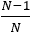次比较。

15)对于包含 N 个元素的线性列表，冒泡排序算法进行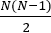次遍历。

16)在使用改进的冒泡排序算法时，如果完成了一次完整的遍历且没有进行任何交换，那么算法知道列表已经排序，不需要进一步的遍历。

17)在使用选择排序算法时，如果你希望按降序排序一个列表，你需要搜索最大值。

18)选择排序算法在内存有限的计算机系统上表现良好。

19)选择排序算法适用于大规模数据操作。

20)选择排序算法是一个非常复杂的算法。

21)插入排序算法通常比选择排序和冒泡排序算法表现更好。

22)插入排序算法有时甚至可能比快速排序算法更快。

23)快速排序算法被认为是最好的和最快的排序算法之一。

24)一个排序好的列表只包含彼此不同的元素。

25)搜索算法是一种在数据集中搜索具有特定特征的项的算法。

26)顺序查找算法只能用于包含算术值的列表。

27)最常用的搜索算法之一是快速搜索算法。

28)有一种搜索算法称为堆算法。

29)线性（或顺序）搜索算法可以如下工作：它可以检查列表的最后一个元素是否等于给定值，然后检查倒数第二个元素，依此类推，直到列表的开头或找到给定值。

30)在某些情况下，线性搜索算法可以比二分查找算法更快地找到元素。

31)线性搜索算法可以用于大规模数据操作。

32)线性搜索算法不能用于排序列表。

33)二分查找算法可以用于大规模数据操作。

34)如果一个列表中某个值出现多次，二分查找算法只能找到该值首次出现的顺序。

35)在使用搜索算法时，如果列表包含唯一值并且找到了你要查找的元素，就没有必要再进一步检查。

36)二分查找算法的主要缺点是需要对数据进行排序。

37)二分查找算法只能用于包含算术值的列表。

38)如果你要查找的元素位于列表的最后一个位置，一个从列表开头开始的线性搜索算法将检查列表中的所有元素。

39)线性搜索算法可以用于二维列表。

40)如果你使用二分查找算法查找的元素位于至少有三个元素的列表的第一个位置，它将在一次迭代中找到。

### 33.8 复习练习

完成以下练习。

1)编写与以下流程图片段相对应的 Python 程序。

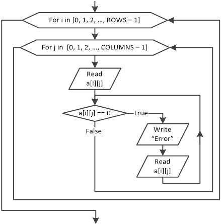

2)设计一个流程图并编写相应的 Python 程序，允许用户将 50 个正数值输入到一个列表中。然后，算法和相应的 Python 程序必须创建一个新的包含 47 个元素的列表。在这个新列表中，每个位置必须包含四个元素的平均值：用户提供的列表中当前位置及其后三个位置的值。

3)编写一个 Python 程序，允许用户将数值输入到 a、b 和 c 列表中，每个列表有 15 个元素。然后，程序必须创建一个新的包含 15 个元素的列表 newArr。在这个新列表中，每个位置必须包含列表 a、b 和 c 对应位置的最低值。

接下来，只为创建列表 newArr 的那部分程序设计相应的流程图片段。

4)编写一个 Python 程序，允许用户将数值输入到列表 a、b 和 c 中，分别包含 10、5 和 15 个元素。然后程序必须创建一个包含 30 个元素的新列表 newArr。在这个新列表中，前 15 个位置必须包含列表 c 的元素，接下来的五个位置必须包含列表 b 的元素，最后的十个位置必须包含列表 a 的元素。

接下来，设计相应的流程图片段，仅针对创建列表 newArr 的部分。

5)编写一个 Python 程序，对于两个给定的列表 a 和 b，分别包含 3×4 和 5×4 个元素，创建一个包含 8×4 个元素的新列表 newArr。在这个新列表中，前 3 行必须包含列表 a 的元素，接下来的 5 行必须包含列表 b 的元素。

6)编写一个 Python 程序，允许用户将数值输入到列表 a、b 和 c 中，分别包含 5×10、5×15 和 5×20 个元素。然后程序必须创建一个包含 5×45 个元素的新列表 newArr。在这个新列表中，前 10 列必须包含列表 a 的元素，接下来的 15 列必须包含列表 b 的元素，最后的 20 行必须包含列表 c 的元素。

7)编写一个 Python 程序，允许用户输入 50 个数值到列表中，然后创建两个新的列表，reals 和 integers。列表 reals 必须包含实数值，而列表 integers 必须包含整数值。值 0（如果有）不得添加到任何最终列表中，无论是 reals 还是 integers。

接下来，设计相应的流程图片段，仅针对创建列表 reals 和 integers 的部分。

8)编写一个 Python 程序，允许用户输入 50 个三位整数到列表中，然后创建一个新列表，只包含第一位数字小于第二位数字，第二位数字小于第三位数字的整数。例如，357、456 和 159 是这样的整数。

9)一家民意调查公司要求 200 位公民对 10 个消费品进行评分。编写一个 Python 程序，提示用户输入每个产品的名称和每位公民给出的评分（A、B、C 或 D）。然后程序必须计算并显示以下内容：

a)对于每个产品，产品的名称和给出“A”评分的公民数量

b)对于每位公民，他们给出的“B”回答的数量

c)哪些产品被认为是最棒的

此外，使用循环控制结构，当用户输入除 A、B、C 或 D 以外的任何评分时，程序必须验证数据输入并显示错误信息。

10)编写一个 Python 程序，提示用户输入 20 个美国城市和 20 个加拿大城市的名称，然后对于每个美国城市，从每个加拿大城市到该城市的距离（以英里为单位）。最后，程序必须显示每个美国城市最近的加拿大城市。

11) 设计一个流程图并编写相应的 Python 程序，允许用户输入 30 座山峰的名称和高度，以及每座山峰所属的国家。算法以及随之而来的 Python 程序必须显示有关最高和最低山峰的所有可用信息。

12) 设计一个算法的流程图片段，对于给定的 N × M 元素列表 A，找到并显示最大值以及该值所在的行和列。

13) 26 支球队参加足球锦标赛。每个队打 15 场比赛，每周一场。编写一个 Python 程序，允许用户输入每个队的名称以及每场比赛的“W”代表胜利、“L”代表失败和“T”代表平局（平局）。如果胜利得到 3 分，平局得到 1 分，Python 程序必须找到并显示根据哪个队获得的最大总分赢得冠军的队伍名称。假设没有两支队伍的得分相等。

14) 在地球上，自由落体物体的加速度为 9.81 m/s² 向下。这个值用 g 表示。一名学生想通过实验来计算这个值。她允许 10 个不同的物体从已知高度落下，并测量它们到达地面的时间。然而，由于她的计时器不够准确，她对每个物体都进行了 20 次测量。她需要一个 Python 程序，允许她输入物体从哪个高度落下以及它们到达地面的测量时间。程序必须然后

►计算 g 并将所有计算值存储在一个 10 × 20 列表中。

►找到并显示每个物体计算出的 g 的最小和最大值。

►找到并显示所有物体计算出的 g 的总体最小和最大值。

需要的公式是

.

其中

►S 是自由落体物体所经过的距离，单位为米（m）

►u[o] 是自由落体物体的初始速度（速度），单位为每秒米（m/sec）。然而，由于自由落体物体是从静止开始的，因此 u[0] 的值必须为零。

►t 是自由落体物体到达地面的时间，单位为秒（sec）

►g 是加速度，单位为每秒平方米（m/sec²）

15) 十个测量站，每个城市一个，记录一年内每天的 CO[2] 水平。编写一个 Python 程序，允许用户输入每个城市的名称以及每天同一小时记录的 CO[2] 水平。Python 程序然后显示平均大气最清新的城市名称。

16) 设计一个算法的流程图片段，对于给定的 N × M 元素列表 A，找到并显示每行的最小和最大值。

17) 编写一个 Python 程序，允许用户输入一个 20 × 30 列表中的值，然后找到并显示每列的最小和最大值。

18)20 支队伍参加足球锦标赛，每支队伍进行 10 场比赛，每周一场。编写一个 Python 程序，提示用户输入每支队伍的名字以及每场比赛的“W”（胜利）、“L”（失败）和“T”（平局）字母。如果胜利得到 3 分，平局得到 1 分，Python 程序必须根据哪个队伍获得的最大总分来找到并显示获得金牌、银牌和铜牌的队伍名称。使用修改后的冒泡排序算法。假设没有两支队伍的总分相同。

此外，使用循环控制结构，程序必须验证数据输入，并在用户输入除 W、L 或 T 以外的任何字母时显示错误信息。

提示：由于只需要找到前三名团队，而不是进行 19 次遍历（共有 20 支队伍），修改后的冒泡排序算法只需进行 3 次遍历。

19)编写一个 Python 程序，提示用户输入 50 个人的名字和身高。然后程序必须按身高降序显示这些信息。在两个或更多人身高相同的情况下，他们的名字必须按字母顺序显示。为了实现这一点，使用相应的冒泡排序算法。

20)编写一个 Python 程序，提示用户输入 50 个人的名、姓和父姓。然后程序必须按姓氏显示这些信息。在两个或更多人姓氏相同的情况下，他们的名字必须按字母顺序显示。另外，如果两个或更多人名字相同，他们的父姓必须按字母顺序显示。为了实现这一点，使用相应的冒泡排序算法。

21)在一场歌唱比赛中，有 10 位评委，每位评委为 12 位艺术家的表演打分。然而，根据这场比赛的规则，总分是在排除最高分和最低分之后计算的。编写一个 Python 程序，提示用户输入艺术家的名字和每位评委给出的分数。然后程序必须显示

a)对于每位艺术家，他们的名字和总分，在排除最高分和最低分之后。假设每位艺术家的最高分和最低分是唯一的，这意味着他们不会有相同值的多个分数。

b)最终的分类，从得分最高的艺术家开始。然而，如果有两个或更多艺术家的得分相同，他们的名字必须按字母顺序显示。使用相应的冒泡排序算法。

22)设计一个算法的流程图片段，该算法对于给定的 20 × 8 元素列表 A，使用冒泡排序算法按降序对每一行进行排序。

23)设计一个算法的流程图片段，该算法对于给定的 5 × 10 元素列表 A，使用冒泡排序算法按升序对每一列进行排序。

24)设计一个算法的流程图片段，该算法对于给定的 20 × 8 元素列表 A，使用插入排序算法按降序对每一行进行排序。

25)设计一个算法的流程图片段，该算法对于给定的 5 × 10 元素列表 A，使用选择排序算法按升序对每一列进行排序。

26)在一个数独比赛中，10 名参赛者竞争以尽可能快地解决八个不同的数独谜题。编写一个 Python 程序，让用户输入每位参赛者的姓名以及他们完成每个谜题的时间（以小时、分钟和秒为单位）。然后程序必须显示

a)对于每位参赛者，他们的姓名以及他们的三个最佳时间。假设每位参赛者的时间都不同。

b)根据平均时间最低的参赛者，获得金牌、银牌和铜牌的三位参赛者的姓名。假设没有两位参赛者的平均时间相同。

在必要时使用选择排序算法。

提示：鉴于只需找到三名最佳参赛者，选择排序算法只需对前三个元素进行排序。

27)五个测量站，每个大型城市的每个区域一个，每小时记录一次每日二氧化碳（CO[2]）水平。编写一个 Python 程序，让用户输入每个区域的名称以及每小时的 CO[2]水平（从 00:00 到 23:00），为期两天。然后 Python 程序必须计算并显示

a)对于每个区域，其名称及其平均 CO[2]水平

b)对于每个小时，城市的平均 CO[2]水平

c)城市大气污染最严重的时区（平均而言）

d)记录最高 CO[2]水平的时区和小时

e)使用插入排序算法对最脏的三个区域（平均而言）进行排序

28)设计线性搜索算法的流程图片段，该算法在包含 N 个元素的列表 a 上执行搜索以找到值针，并显示针找到的位置索引。如果针未找到，必须显示消息“未找到”。

29)设计二分搜索算法的流程图片段，该算法在包含 N 个元素的列表 a 上执行搜索以找到值针，并显示针找到的位置。如果针未找到，必须显示消息“未找到”。

30)十二支队伍参加足球锦标赛，每支队伍每周进行 20 场比赛。编写一个 Python 程序，提示用户输入每支队伍的名称以及每场比赛的“W”（胜利）、“L”（失败）或“T”（平局）字母。然后程序必须提示用户输入一个字母（W、L 或 T），并显示每个队伍赢得、输掉或平局的周数。例如，如果用户输入“L”，Python 程序必须搜索并显示每个队伍输掉比赛的周数（例如，第 3 周、第 14 周等）。

31) 10 支队伍参加足球锦标赛，每支队伍每周进行一场比赛，共 16 场比赛。编写一个 Python 程序，提示用户输入每支队伍的名称、每场比赛球队进球数和每场比赛球队失球数。胜利获得 3 分，平局获得 1 分。然后 Python 程序必须提示用户输入队伍名称，并最终计算并显示该队的总积分。如果用户提供的队伍名称不存在，必须显示消息“该队伍不存在”。

此外，使用循环控制结构，程序必须验证数据输入，并在用户输入任何负数进球数时显示错误消息。

假设没有两个队伍共享相同的名称。

32) 在一所高中，有两个班级，分别有 20 名和 25 名学生。编写一个 Python 程序，提示用户分别输入两个班级的学生姓名。然后程序以升序独立显示每个班级的姓名。之后，程序提示用户输入一个姓名，并在两个列表中搜索该用户提供的姓名。如果找到学生的姓名，程序必须显示消息“学生在第 N 班找到”，其中 N 可以是 1 或 2；否则，必须显示消息“学生未在任何班级中找到”。假设两个列表都包含唯一的姓名。

提示：由于列表已排序且名称是唯一的，请使用二分查找算法。

33) 假设有两个列表，分别是用户名和密码，它们包含一家公司 100 名员工的登录信息。编写一个代码片段，提示用户输入用户名和密码，当用户名和密码组合有效时，显示消息“登录成功！”；否则，必须显示消息“登录失败！”。用户名和密码都不区分大小写。假设用户名是唯一的，但密码不是。

34) 假设有两个列表，分别是姓名和 SSN（社会保险号），它们包含 1,000 名美国公民的姓名和 SSN。编写一个代码片段，提示用户输入一个值（可以是姓名或 SSN），然后搜索并显示所有具有该姓名或 SSN 的人的姓名。如果用户提供的值不存在，必须显示消息“此值不存在”。

35) 有 12 名学生，他们每个人都已经收到了六节课的成绩。编写一个 Python 程序，让用户输入所有课程的成绩，然后显示一条消息，指示是否至少有一名学生的平均成绩低于 70 分。此外，使用循环控制结构，程序必须验证数据输入，并在用户输入任何负值或大于 100 的值时，显示不同类型的错误消息。

36)编写一个 Python 程序，提示用户输入一个英文信息，然后，使用下面的表格，显示相应的摩尔斯电码，使用点和划。请注意，在翻译的信息中，空格字符必须显示为斜杠字符（/）。

| 摩尔斯电码 |
| --- |
| A | .‑ | N | ‑. |
| B | ‑... | O | ‑‑‑ |
| C | ‑.‑. | P | .‑‑. |
| D | ‑.. | Q | ‑‑.‑ |
| E | . | R | .‑. |
| F | ..‑. | S | ... |
| G | ‑‑. | T | ‑ |
| H | .... | U | ..‑ |
| 我 | .. | 五 | ...‑ |
| J | .‑‑‑ | W | .‑‑ |
| K | ‑.‑ | X | ‑..‑ |
| L | .‑.. | Y | ‑.‑‑ |
| M | ‑‑ | Z | ‑‑.. |

提示：使用字典来存储摩尔斯电码。

37)编写一个 Python 程序，提示用户输入一个英文句子。程序必须显示：

a)用户提供的句子中存在的所有字母及其频率计数

b)用户提供的句子中不存在的所有字母

c)与英语字母表中的字母相比，不存在字母的百分比

d)与用户提供的句子中的字符相比（不包括空格字符），非字母字符的百分比

提示：使用字典存储所有 26 个英语字母作为键，它们的频率作为值，但找到一种巧妙的方法来创建它。
