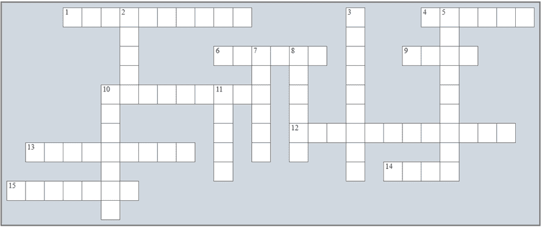

## 第四十二章：在“Python 中的数据结构”中进行复习

### 复习填字游戏

1) 解决以下填字游戏。

Across

1) 它的元素可以使用键唯一标识，而不一定是整数值。

4) 这些括号用于创建一个列表。

6) 排序算法。

9) 在这个对角线上，元素的行索引等于它们的列索引。

10) 这种排序算法在主内存（RAM）有限的计算机系统上表现良好。

12) 在方阵中，从右上角到左下角运行的元素集合是什么？

13) 数据 _________ 是一组组织良好的数据，以便您可以以最有效的方式对其执行操作。

14) Python 中的一个可变数据结构。

15) 将列表的元素放入特定顺序的过程。

Down

2) 一个 Python 数据结构。

3) 这种排序算法在排序非常小的列表时可以非常快，有时甚至比快速排序算法还要快。

5) 它被认为是最好的和最快的排序算法之一。

7) 搜索算法。

8) 另一个名称是顺序搜索算法。

10) 从列表中选择一系列元素的一种机制。

11) 每个列表元素被分配一个唯一的数字，称为 _________。

### 复习问题

回答以下问题。

1) 变量有什么限制，而列表没有？

2) 什么是数据结构？

3) 数据结构中的每个元素被称为什么？

4) 列出 Python 支持的六个已知数据结构。

5) Python 中的列表是什么？

6) Python 中的字典是什么？

7) 当我们说列表是“可变的”时，这意味着什么？

8) 当一个语句尝试显示一个不存在的列表元素的值时会发生什么？

9) 当一个语句尝试将值分配给一个不存在的字典元素时会发生什么？

10) 在一个包含 100 个元素的列表中，最后一个元素的索引是什么？

11) “遍历行”是什么意思？

12) “遍历列”是什么意思？

13) 什么是方阵？

14) 方阵的主对角线是什么？

15) 方阵的反对角线是什么？

16) 编写一个通用形式的代码片段，用于验证列表的数据输入而不显示任何错误信息。

17) 编写一个通用形式的代码片段，用于验证列表的数据输入并显示一个通用的错误信息（即，对于任何类型的输入错误显示相同的错误信息）。

18) 编写一个通用形式的代码片段，用于验证列表的数据输入并针对每种输入错误显示不同的错误信息。

19) 什么是排序算法？列出五种排序算法。

20) 哪种排序算法被认为是最不高效的？

21) 是否可以使用排序算法来找到列表的最小值或最大值？

22) 为什么排序算法不是找到列表最小值或最大值的最优选择？

23) 编写一个代码片段，使用冒泡排序算法按升序排序包含 N 个元素的列表 a。

24)对于给定包含 N 个元素的列表，冒泡排序算法执行了多少次比较？

25)冒泡排序算法在何时执行最大数量的交换操作？

26)使用冒泡排序算法，编写一个代码片段，对列表 a 进行排序，但保持与列表 b 中 N 个元素的升序一对一对应。

27)使用改进的冒泡排序算法，编写一个代码片段，将包含 N 个元素的列表 a 按升序排序。

28)使用选择排序算法，编写一个代码片段，用于将包含 N 个元素的列表 a 按升序排序。

29)使用插入排序算法，编写一个代码片段，将包含 N 个元素的列表 a 按升序排序。

30)什么是搜索算法？请列举两种最常用的搜索算法。

31)线性查找算法的优点和缺点是什么？

32)使用线性查找算法，编写一个代码片段，在列表 a 上执行搜索以找到值 needle。

33)二分查找算法的优点和缺点是什么？

34)使用二分查找算法，编写一个代码片段，在列表 a 上执行搜索以找到值 needle。假设列表已按升序排序。
