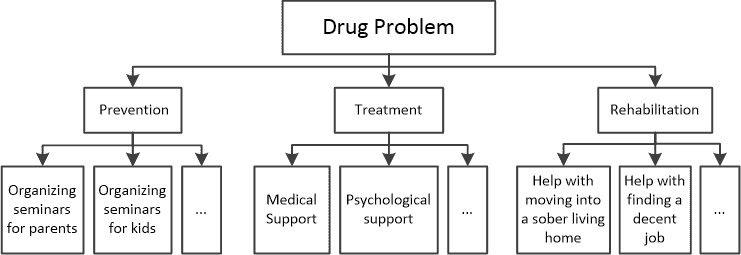

## 第三十四章

子程序简介

### 34.1 什么是子程序？

在计算机科学中，子程序是一块被封装成单元的语句块，执行特定的任务。子程序可以在程序中被调用多次，每当需要执行该特定任务时。

在 Python 中，内置函数就是一个这样的子程序示例。以众所周知的 abs()函数为例。它由一个名为“abs”的单元封装的语句块组成，并执行特定的任务——它返回一个数的绝对值。

如果你想知道函数 abs()内部可能存在哪些语句，这里是一个可能的语句块。

if number < 0:

返回数值 * (-1)

else:

返回数值

通常来说，有两种类型的子程序：函数和过程。函数和过程之间的区别在于函数返回一个结果，而过程不返回。然而，在某些计算机语言中，这种区别可能并不明显。有些语言中，函数也可以表现得像过程并且不返回结果，而有些语言中，过程可以返回一个或甚至多个结果。

根据所使用的计算机语言，术语“函数”和“过程”可能不同。例如，在 Visual Basic 中你可以找到它们作为“函数”和“子过程”，在 FORTRAN 中作为“函数”和“子例程”，而在 Python 中，通常首选的术语是“函数”和“void 函数”。

### 34.2 什么是过程式编程？

假设你被分配了一个项目来解决你所在地区的药物滥用问题。一个可能的方法（这可能非常困难甚至不可能）就是试图自己解决这个问题！

然而，更好的方法是将大问题细分为更小的子问题，如预防、治疗和康复，每个子问题都可以进一步细分为更小的子问题，如图 34–1 所示。

图 34–1 一个问题可以被细分为更小的问题

作为这个项目的管理者，你可以租用一栋楼并在其中建立三个部门：预防部门，包括其所有子部门；治疗部门，包括其所有子部门；以及康复部门，包括其所有子部门。最后，你会雇佣员工（来自各个领域的专家），你会组建团队并雇佣他们为你完成工作！

过程式编程正是如此。它将一个初始问题细分为更小的子问题，每个子问题进一步细分为更小的子问题。最后，为每个子问题编写一个小子程序，主程序（就像管理者一样），调用（雇佣）它们来完成不同的工作部分。

过程式编程提供了一些优点：

►它使程序员在必要时能够重用相同的代码，而无需重新编写或复制。

►它相对容易实现。

►它有助于程序员更容易地遵循执行流程，简化调试过程。

当一个非常大的程序全部集中在一块时，调试和维护可能会非常困难。因此，将其细分为更小的子程序通常更容易，每个子程序执行一个明确定义的过程。

### 34.3 什么是模块化编程？

在模块化编程中，具有共同功能的子程序可以组合成单独的模块，并且每个模块可以有自己的数据集。因此，一个程序可以由多个部分组成，而这些部分（模块）中的每一个都可以包含一个或多个更小的部分（子程序）。

数学模块就是这样一种例子。它包含与数学相关的共同功能子程序（如 fsum()、sqrt()、sin()、cos()、tan()等）。

如果在先前的药物问题示例中使用模块化编程，那么可以有三个独立的建筑——一个用于预防部门及其所有子部门，第二个用于治疗部门及其所有子部门，第三个用于康复部门及其所有子部门（如图 34-2 所示）。这三个建筑可以被视为模块化编程中的三个不同模块，每个模块都包含具有共同功能的子程序。

图 34-2 具有共同功能的子程序可以组合成单独的模块。

### 34.4 复习问题：正确/错误

对以下每个陈述选择正确或错误。

1)子程序是一块打包成单元的语句块，执行特定任务。

2)一般来说，有两种子程序：函数和过程。

3)一般来说，函数和过程的区别在于过程返回一个结果，而函数则不返回。

4)Python 只支持过程。

5)过程式编程将初始问题细分为更小的子问题。

6)过程式编程的一个优点是能够重用相同的代码，而无需重新编写或复制它。

7)过程式编程有助于程序员更容易地遵循执行流程。

8)模块化编程可以提高程序开发速度。

9)在模块化编程中，具有共同功能的子程序被组合成单独的模块。

10)在模块化编程中，每个模块可以有自己的数据集。

11)模块化编程使用与结构化编程不同的结构。

12)一个程序可以由多个模块组成。
