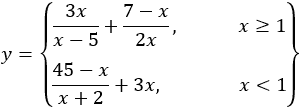
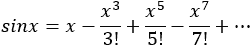

## 第三十七章

更多关于子程序的内容

### 37.1 使用子程序进行简单练习

#### 练习 37.1-1 简单货币转换器

执行以下操作：

i)编写一个名为 displayMenu 的子程序，显示以下菜单。

1)将美元 (USD) 转换为欧元 (EUR)

2)将欧元 (EUR) 转换为美元

3)退出

ii)使用上述子程序，编写一个 Python 程序，显示之前提到的菜单并提示用户输入选择（1、2 或 3）。如果选择 1 或 2，程序必须提示用户输入金额，然后必须计算并显示相应的转换值。此过程必须根据用户的意愿重复进行。

已知 1 美元 = 0.94 欧元 (€)。

解决方案

根据“终极”规则，主代码中的 while 循环必须如下，以一般形式给出。

displayMenu();

choice = int(input())     #choice 的初始化

while choice != 3:

提示用户输入金额，然后计算并显示所需的价值。

displayMenu();

choice = int(input()) #更新/修改选择

解决方案如下。

 file_37.1-1

def displayMenu():

print("----------------------------")

print("1. 将美元 (USD) 转换为欧元 (EUR)")

print("2. 将欧元 (EUR) 转换为美元")

print("3. 退出")

print("----------------------------")

print("输入选择: ", end = "")

#主代码从这里开始

displayMenu()

choice = int(input())

while choice != 3:

amount = float(input("输入金额: "))

if choice == 1:

> print(amount, "USD =", amount * 0.94, "Euro")

else:

> print(amount, "Euro =", amount / 0.94, "USD")

displayMenu()

choice = int(input())

#### 练习 37.1-2 查找正整数的平均值

执行以下操作：

i)编写一个名为 testInteger 的子程序，它通过其形式参数列表接受一个数字，当传递的数字是整数时返回 True；否则返回 False。

ii)使用上述子程序，编写一个 Python 程序，允许用户重复输入数值，直到输入一个实数。最后，程序必须显示输入的正整数的平均值。

解决方案

为了解决这个练习，将使用 while 语句。根据第 28.3 节中讨论的“终极”规则，解决此问题的预测试循环结构应如下所示。

x = float(input())   #x 的初始化

while testInteger(x):   #依赖于 x 的布尔表达式

一个语句或语句块

x = float(input())   #x 的更新/修改

语句 while testInteger(x) 等价于语句 while testInteger(x) == True。

最终解决方案将在下面展示。

 file_37.1-2

def testInteger(number):

returnValue = False

if number == int(number):

> returnValue = True

return returnValue

#主代码从这里开始

total = 0

count = 0

x = float(input())  #x 的初始化

while testInteger(x):  #依赖于 x 的布尔表达式

if x > 0:

> total += x
> 
> count += 1

x = float(input())  #更新/修改 x

if count > 0:

print(总和 / count)

注意最后的单分支决策结构，if count > 0\. 它对于程序满足确定性属性是必要的。想想看！如果用户一开始就输入一个实数，那么变量 count，最终将包含零的值。

以下函数可以作为之前函数的替代。它直接返回布尔表达式数字等于 int(数字)的结果（True 或 False）。

def test_integer(数字):

return 数字等于 int(数字)

#### 练习 37.1-3 求奇数正整数的和

执行以下操作：

i)编写一个名为 testInteger 的子程序，它通过其形式参数列表接受一个数字，当传入的数字是整数时返回 True；否则返回 False。

ii)编写一个名为 testOdd 的子程序，它通过其形式参数列表接受一个数字，当传入的数字是奇数时返回 True；否则返回 False。

iii)编写一个名为 testPositive 的子程序，它通过其形式参数列表接受一个数字，当传入的数字是正数时返回 True；否则返回 False。

iv)使用上述子程序，编写一个 Python 程序，允许用户重复输入数值，直到输入一个负数。最后，程序必须显示输入的奇数正整数的总和。

解决方案

这个练习基本上与上一个相同。每个子程序返回一个值（可以是 True 或 False）。解决方案在此处展示。

 file_37.1-3

def test_integer(数字):

return 数字等于 int(数字)

def testOdd(数字):

return 数字 % 2 != 0

def testPositive(数字):

return 数字 > 0

#主代码从这里开始

总和 = 0

x = float(input())

while testPositive(x):

if testInteger(x) and testOdd(x):

> 总和 += x

x = float(input())

print(总和)

语句 if testInteger(x) and testOdd(x) 等价于语句 if testInteger(x) == True and testOdd(x) == True

#### 练习 37.1-4 求解 y 的值

编写一个 Python 程序，找出并显示以下公式中 y 的值（如果可能）。

.

对于公式的每一部分，编写一个子程序，它通过其形式参数列表接受 x，然后计算并显示结果。当计算不可能时，子程序必须显示错误信息。

解决方案

每个子程序必须计算并显示相应公式的结果，或者在计算不可能时显示错误信息。由于这两个子程序不返回结果，它们都可以写成 void 函数。解决方案在此处展示。

 file_37.1-4

def formula1(x):

if x == 5:  #当 x >= 1 时，无需检查 x == 0

> print("错误！除以零")

else:

> y = 3 * x / (x - 5) + (7 - x) / (2 * x)
> 
> print(y)

def formula2(x):

if x == -2:

> print("错误！除以零")

else:

> y = (45 - x) / (x + 2) + 3 * x
> 
> print(y)

x = float(input("输入 x 的值: "))

i)编写一个名为 getAge 的子程序，提示用户输入他们的年龄并返回它。使用循环控制结构，子程序还必须验证数据输入，并在用户输入任何非正值时显示错误消息。

if x >= 1:

formula1(x)

else:

formula2(x)

### 37.2 具有子程序的一般性质练习

#### 练习 37.2-1 使用子程序验证数据输入

练习 37.2-2 使用子程序对列表进行排序

执行以下操作：

ii)编写一个名为 findMax 的子程序，它通过形式参数列表接受一个列表，并返回列表中最大值的索引位置。

iii)使用上述子程序编写一个 Python 程序，提示用户输入 50 人的名字、姓氏和年龄到三个列表中，然后显示最年长的人的名字。

解决方案

由于子程序 getAge()返回一个值，它可以写成函数。同样，对于也返回一个值的 findMax()子程序也是如此。主代码必须提示用户首先将 50 人的名字、姓氏和年龄分别输入到 firstNames、lastNames 和 ages 列表中。然后，借助 findMax()函数，它可以找到 ages 列表中最大值的索引位置。解决方案如下。

 file_37.2-1

PEOPLE = 50

def getAge():

age = int(input("输入年龄: "))

while age <= 0:

> print("错误：无效的年龄！")
> 
> age = int(input("输入一个正数: "))

return age

def findMax(a):

maximum = a[0]

maxI = 0

for i in range(1, PEOPLE):

> if a[i] > maximum:
> 
> > maximum = a[i]
> > 
> > maxI = i

return maxI

#主代码从这里开始

firstNames = [None] * PEOPLE

lastNames = [None] * PEOPLE

ages = [None] * PEOPLE

for i in range(PEOPLE):

firstNames[i] = input("第" + str(i + 1) + "个人的名字: ")

lastNames[i] = input("第" + str(i + 1) + "个人的姓氏: ")

ages[i] = getAge()

indexOfMax = findMax(ages)

print("最年长的人是:", firstNames[indexOfMax], lastNames[indexOfMax])

print("他们", ages[indexOfMax], "岁！")

#### #主代码从这里开始

执行以下操作：

i)编写一个名为 mySwap 的子程序，它通过形式参数列表接受一个列表，以及两个索引。然后，子程序交换相应索引位置的元素值。

ii)使用上面提到的 mySwap()子程序，编写一个名为 mySort 的子程序，它通过形式参数列表接受一个列表，然后使用冒泡排序算法对列表进行排序。它必须能够按升序或降序排序。为此，在形式参数列表中包含一个额外的布尔参数。

iii)编写一个名为 displayList 的子程序，它通过形式参数列表接受一个列表，然后显示它。

iv)使用上面引用的子程序 mySort() 和 displayList()，编写一个 Python 程序，提示用户输入 20 个人的名字，然后显示两次：一次按升序排序，一次按降序排序。

解答

如您在下面的 Python 程序中可以看到，void 函数 mySort() 使用了冒泡排序算法的改进版本。当将值 True 传递给参数 ascending 时，算法按升序对列表 a 进行排序。当传递值 False 时，算法按降序对列表 a 进行排序。

此外，void 函数 mySort() 在需要交换两个元素的内容时，每次都会调用 void 函数 mySwap()。

 file_37.2-2

PEOPLE = 20

def mySwap(a, index1, index2):

a[index1], a[index2] = a[index2] = a[index1]

def mySort(a, ascending = True):

for m in range(PEOPLE - 1):

> for n in range(PEOPLE - 1, m, -1):
> 
> > if ascending:
> > 
> > > if a[n] < a[n - 1]:
> > > 
> > > > mySwap(a, n, n - 1)
> > > > 
> > else:
> > 
> > > if a[n] > a[n - 1]:
> > > 
> > > > mySwap(a, n, n - 1)

def displayList(a):

for i in range(PEOPLE):

> print(a[i])

#主代码从这里开始

names = [None] * PEOPLE

for i in range(PEOPLE):

names[i] = input("Enter a name: ")

mySort(names)          #按升序排序 names

displayList(names)     #并显示它们

mySort(names, False)   #按降序排序 names

displayList(names)     #并显示它们。

注意，参数 ascending 是一个可选参数。这意味着如果没有为该参数传递值，则使用默认值 True。

在 Python 中，列表是通过引用传递的。这就是为什么在子程序 mySwap() 和 mySort() 中不需要包含返回语句。

#### 练习 37.2-3 递进费率和电力消耗

LAV 电力公司根据以下表格（家庭账户的月度费率）向用户收取电力消耗费用。

| 千瓦时 (kWh) | 每千瓦时美元 |
| --- | --- |
| kWh ≤ 400 | $0.08 |
| 401 ≤ kWh ≤ 1500 | $0.22 |
| 1501 ≤ kWh ≤ 2000 | $0.35 |
| 2001 ≤ kWh | $0.50 |

执行以下操作：

i)编写一个名为 getConsumption 的子程序，该子程序提示用户输入消耗的总千瓦时数，然后返回它。使用循环控制结构，该子程序还必须验证数据输入，并在用户输入任何负值时显示错误消息。

ii)编写一个名为 findAmount 的子程序，该子程序通过其形式参数列表接受消耗的 kWh，然后返回应付的总金额（根据上面的表格）。

iii)使用上述子程序编写一个 Python 程序，提示用户输入消耗的总千瓦时数，然后显示应付的总金额。程序必须根据用户的意愿进行迭代。每次计算结束后，程序必须询问用户是否希望为另一个消费者计算总金额。如果答案是“是”，程序必须重复；否则必须结束。程序必须接受所有可能的形式的答案，如“是”、“YES”、“Yes”或甚至“YeS”。

请注意，费率是递进的，并且传输服务和分配费用，以及联邦、州和地方税，总共为每张账单增加了 26%。

解答

这里没有什么新的内容。处理递进费率是你已经学过的东西！如果这让你感到困惑，你需要刷新你的记忆并回顾相应的练习 22.4-5。

Python 程序如下。

 file_37.2-3

def getConsumption():

consumption = int(input("输入消耗的千瓦时："))

while consumption < 0:

> print("错误：无效的数字！")
> 
> consumption = input("输入一个非负数：")

return consumption

def findAmount(kwh):

if kwh <= 400:

> amount = kwh * 0.08

elif kwh <= 1500:

> amount = 400 * 0.08 + (kwh - 400) * 0.22

elif kwh <= 2000:

> amount = 400 * 0.08 + 1100 * 0.22 + (kwh - 1500) * 0.35

else:

> amount = 400 * 0.08 + 1100 * 0.22 + 500 * 0.35 + (kwh - 2000) * 0.5

amount += 0.26 * amount

return amount

#主代码从这里开始

while True:

kwh = getConsumption()

print("你需要支付：", findAmount(kwh))

answer = input("你想重复吗？ ")

if answer.upper() != "YES": break

#### 练习 37.2-4 掷骰子！

做以下操作：

i)编写一个名为 dice 的子程序，它返回 1 到 6 之间的随机整数。

ii)编写一个名为 searchAndCount 的子程序，它通过形式参数列表接受一个整数和一个列表，并返回该整数在列表中存在的次数。

iii)使用上述子程序编写一个 Python 程序，用 100 个随机整数（1 到 6 之间）填充一个列表，然后让用户输入一个整数。程序必须显示用户提供的整数在列表中出现的次数。

解答

这两个子程序都可以写成函数，因为它们都返回一个值。函数 dice()返回 1 到 6 之间的随机整数，函数 searchAndCount()返回一个表示整数在列表中存在的次数的数字。解决方案在此处展示。

 file_37.2-4

from random import randrange

ELEMENTS = 100

def dice():

return randrange(1, 7)

def searchAndCount(x, a):

count = 0

for i in range(ELEMENTS):

> if a[i] == x:
> 
> > count += 1

return count

#主代码从这里开始

a = [None] * ELEMENTS

for i in range(ELEMENTS):

a[i] = dice()

x = int(input())

print("提供的值在列表中存在", searchAndCount(x, a), "次")

#### 练习 37.2-5：骰子中每个数字出现的次数是多少？

使用上一练习（练习 37.2-4）中引用的 dice()和 searchAndCount()函数，编写一个 Python 程序，用 100 个随机整数（介于 1 和 6 之间）填充一个列表，然后显示列表中每个数字出现的次数，以及哪个数字出现最频繁。

解决方案

如果你不使用循环控制结构来解决这个问题，你可以按照以下步骤进行。

#将值 1 在列表 a 中出现的次数赋值给 n1

n1 = searchAndCount(1, a)

#将值 2 在列表 a 中出现的次数赋值给 n2

n2 = searchAndCount(2, a)

.

.

.

#将值 6 在列表 a 中出现的次数赋值给 n6

n6 = searchAndCount(6, a)

#显示列表 a 中每个数字出现的次数

print(n1, n2, n3, n4, n5, n6)

#找到 n1、n2、… n6 的最大值

maximum = n1

maxI = 1

if n2 > maximum:

maximum = n2

maxI = 2

.

.

.

if n6 > maximum:

maximum = n6

maxI = 6

#显示列表中出现次数最多的数字。

print(maxI)

但现在你即将结束这本书的学习，当然，你可以做一些更有创意的事情。而不是将 searchAndCount()函数的每个结果分别赋值给 n1、n2、n3、n4、n5 和 n6 这些变量，你可以将这些结果赋值给名为 n 的列表的 0、1、2、3、4 和 5 位置，如下所示。

n = [None] * 6

for i in range(6):

n[i] = searchAndCount(i + 1, a)

在此之后，你可以使用你在第 33.3 节中学到的知识来找到列表 n 的最大值。

完整的解决方案如下所示。

 file_37.2-5

from random import randrange

ELEMENTS = 100

def dice():

return randrange(1, 7)

def searchAndCount(x, a):

count = 0

for i in range(ELEMENTS):

> if a[i] == x:
> 
> > count += 1

return count

#主代码从这里开始

#创建列表 a，包含 1 到 6 之间的随机整数

a = [None] * ELEMENTS

for i in range(ELEMENTS):

a[i] = dice()

#创建列表 n 并显示列表 a 中每个数字出现的次数

n = [None] * 6

for i in range(6):

n[i] = searchAndCount(i + 1, a)

print("Value", i + 1, "appears", n[i], "times")

#找到列表 n 的最大值

maximum = n[0]

maxI = 0

for i in range(1, 6):

if n[i] > maximum:

> maximum = n[i]
> 
> maxI = i

#显示列表中出现次数最多的数字。

print("Value", maxI + 1, "appears in the list", maximum, "times.")

### 37.3 复习练习

完成以下练习。

1)执行以下操作：

i)编写一个名为 displayMenu 的子程序，显示以下菜单。

1)将美元（USD）转换为欧元（EUR）

2)将美元（USD）转换为英镑（GBP）

3)将美元（USD）转换为日元（JPY）

4)将美元（USD）转换为加拿大元（CAD）

5)退出

ii)编写四个不同的子程序，分别命名为 USD_to_EU、USD_to_GBP、USD_to_JPY 和 USD_to_CAD，它们通过它们的正式参数列表接受货币，然后返回相应的转换值。

iii)使用上述子程序编写一个 Python 程序，显示之前提到的菜单，然后提示用户输入一个选择（1、2、3、4 或 5）。如果选择了 1、2、3 或 4，程序必须提示用户输入金额，然后计算并显示相应的转换值。该过程必须根据用户的意愿重复进行。

已知：

►1 美元($1) = 0.94 欧元(EUR) (€)

►1 美元($1) = 0.81 英镑(GBP) (£)

►1 美元($1) = 149.11 日元(JPY)

►1 美元($1) = 1.36 加拿大元(CAD) ($)

2)执行以下操作：

i)编写一个名为 displayMenu 的子程序，显示以下菜单。

1)将美元(USD)转换为欧元(EUR)

2)将美元(USD)转换为英镑(GBP)

3)将欧元(EUR)转换为美元(USD)

4)将欧元(EUR)转换为英镑(GBP)

5)将英镑(GBP)转换为美元(USD)

6)将英镑(GBP)转换为欧元(EUR)

7)退出

ii)编写两个不同的子程序，分别命名为 USD_to_EUR 和 USD_to_GBP，它们通过其形式参数列表接受货币，然后返回相应的转换值。

iii)使用上述子程序编写一个 Python 程序，显示之前提到的菜单，然后提示用户输入一个选择（1 到 7）和一个金额。然后程序必须显示所需的价值。该过程必须根据用户的意愿重复进行。已知

►1 美元($1) = 0.94 欧元(EUR) (€)

►1 美元($1) = 0.81 英镑(GBP) (£)

3)执行以下操作：

i)编写一个名为 factorial 的子程序，该子程序通过其形式参数列表接受一个整数，并返回其阶乘。

ii)使用上述提到的 factorial()子程序编写一个名为 mySin 的子程序，该子程序通过其形式参数列表接受一个值，并返回 x 的正弦值，使用泰勒级数（如下所示）以 0.0000000001 的精度计算。

.

提示：请记住 x 是以弧度为单位的，并且。

iii)编写一个名为 degreesToRad 的子程序，该子程序通过其形式参数列表接受一个角度（以度为单位），并返回其弧度等效值。已知 2π = 360°。

iv)使用上述提到的 mySin()和 degreesToRad()子程序编写一个 Python 程序，显示从 0°到 360°的所有整数的正弦值。

4)执行以下操作：

i)编写一个名为 isLeap 的子程序，该子程序通过其形式参数列表接受一个年份，并返回 True 或 False，取决于该年份是否为闰年。

ii)编写一个名为 numOfDays 的子程序，该子程序接受一个月份和年份，并返回该月份的天数。如果该月份是二月且年份是闰年，则子程序必须返回 29。

提示：使用上述提到的 isLeap()子程序。

iii)编写一个名为 checkDate 的子程序，该子程序接受一个日期（日、月、年）并返回 True 或 False，取决于该日期是否有效。

iv)使用上述子程序，编写一个 Python 程序，提示用户输入一个日期（日、月、年），然后计算并显示从用户提供的年份开始到用户提供的日期之间经过的天数。使用循环控制结构，程序必须验证数据输入，并在用户输入任何非有效日期时显示错误信息。

5)在电脑游戏中，玩家掷两个骰子。得分总和最高的玩家得一分。经过十次掷骰后，得分总和最高的玩家获胜。请执行以下操作：

i)编写一个名为 dice 的子程序，返回 1 到 6 之间的随机整数。

ii)使用上述子程序，编写一个 Python 程序，提示两位玩家输入他们的名字。然后，每位玩家连续“掷”两次骰子十次。获胜者是得分总和最高的玩家。

6)LAV 汽车租赁公司已租赁了 40 辆车，这些车分为三个类别：混合动力、汽油和柴油。公司根据以下表格对车辆进行收费。

| 天数 | 车型 |
| --- | --- |
| 汽油 | 柴油 | 混合动力 |
| 1-5 天 | 每日$24 | 每日$28 | 每日$30 |
| 6-8 天 | 每日$22 | 每日$25 | 每日$28 |
| 9 天及以上 | 每日$18 | 每日$21 | 每日$23 |

请执行以下操作：

i)编写一个名为 getChoice 的子程序，显示以下菜单。

1)汽油

2)柴油

3)混合动力

子程序随后提示用户输入汽车的类型（1、2 或 3），并将其返回给调用者。

ii)编写一个名为 getDays 的子程序，提示用户输入租赁的总天数，并将其返回给调用者。

iii)编写一个名为 getCharge 的子程序，接受通过形式参数列表传入的汽车类型（1、2 或 3）和总租赁天数，然后根据之前的表格返回应付款项。联邦、州和地方税费总计为每笔账单增加 10%。

iv)使用上述子程序，编写一个 Python 程序，提示用户输入关于租赁车辆的所有必要信息，然后显示以下信息：

a)每辆车的总费用（包括税费）

b)租赁的混合动力汽车总数

c)公司在扣除税费后的总净利润

请注意，这些费用是递增的。

7)TAM（电视观众测量）是媒体研究的一个专门分支，致力于量化电视观众信息。

LAV 电视观众测量公司统计了 10 个不同电视频道上主要新闻节目的观众人数。公司需要一个软件应用程序来获取一些有用的信息。请执行以下操作：

i)编写一个名为 getData 的子程序，提示用户输入每周每天（周一至周日）主要新闻节目的频道名称和观众人数，然后将这些列表返回给调用者。

ii) 编写一个名为 getAverage 的子程序，该子程序通过其形式参数列表接受一个一维列表，并返回前五个元素的平均值。

iii) 使用上述子程序编写一个 Python 程序，提示用户输入每个频道每天观众的名称和数量，然后显示以下内容：

a) 周末平均观众数量至少比一周中其他时间平均观众数量高出 20%的频道名称。

b) 每日观众数量持续增长的频道名称（如果有）。如果没有这样的频道，必须显示相应的消息。

8) 一家民意调查公司询问 300 名公民在新冠疫情期间是否被隔离治疗。请执行以下操作：

i) 编写一个名为 inputData 的子程序，提示用户输入公民的社会安全号码（SSN）和他们的答案（是，否），分别输入到 SSNs 和 answers 两个列表中。这两个列表必须返回给调用者。

ii) 编写一个名为 sortLists 的子程序，该子程序通过其形式参数列表接受 SSNs 和 answers 列表。然后使用选择排序算法按升序对 SSNs 列表进行排序。子程序必须保持两个列表元素的一对一对应关系。

iii) 编写一个名为 searchList 的子程序，该子程序通过其形式参数列表接受 SSNs 列表和一个 SSN，然后返回该 SSN 在列表中的索引位置。如果 SSN 未找到，必须显示消息“SSN not found”，并返回值-1。使用二分查找算法。

iv) 编写一个名为 countAnswers 的子程序，该子程序通过其形式参数列表接受答案列表和一个答案。然后返回该答案在列表中存在的次数。

v) 使用上述子程序编写一个 Python 程序，提示用户输入公民的 SSN 和答案。然后提示用户输入一个 SSN，显示具有该 SSN 的公民给出的答案，以及与公民总数相比给出相同答案的百分比。程序必须询问用户是否要搜索另一个 SSN。如果答案是“是”，则过程必须重复；否则必须结束。

9) 八支队伍参加足球锦标赛，每支队伍每周进行一场比赛，共进行 12 场比赛。请执行以下操作：

i) 编写一个名为 inputData 的子程序，提示用户输入每个队伍的名称以及每场比赛的“W”（胜利）、“L”（失败）或“T”（平局）字母，分别输入到 names 和 results 两个列表中。然后返回列表给调用者。

ii) 编写一个名为 displayResult 的子程序，它通过形式参数列表接受队伍名称和结果。然后，它提示用户输入一个字母（W、L 或 T），并为每个队伍显示它们分别赢得、输掉或平局的周数。例如，如果用户输入“L”，则子程序必须搜索并显示每个队伍输掉比赛的所有周数（例如，第 3 周、第 14 周，等等）。

iii) 编写一个名为 findTeam 的子程序，它通过形式参数列表接受队伍名称。然后，它提示用户输入一个队伍的名称，并返回该队伍在列表中的索引位置。如果用户提供的队伍名称不存在，则返回值 −1。

iv) 使用上述子程序，编写一个 Python 程序，提示用户输入每个队伍的名称以及每场比赛的“W”表示胜利、“L”表示失败或“T”表示平局（平局）。然后，它必须提示用户输入一个字母（W、L 或 T），并为每个队伍显示它们分别赢得、输掉或平局的周数。

最后，程序必须提示用户输入一个队伍的名称。如果找到用户提供的队伍，程序必须显示该队伍的总积分，然后提示用户输入另一个队伍的名称。只要用户输入现有的队伍名称，此过程必须重复进行。如果用户提供的队伍名称不存在，则显示消息“队伍未找到”，并且程序必须结束。

已知胜利获得 3 分，平局获得 1 分。

10) 执行以下操作：

i) 编写一个名为 hasDuplicateDigits 的子程序，它接受一个整数，当其任何一位数字重复出现时返回 True；否则返回 False。

提示：声明一个包含 10 个元素的列表来跟踪每个数字的出现次数。该列表必须初始化为全部为零。

ii) 使用上述子程序，编写一个 Python 程序，提示用户输入一个整数，并显示一条消息，指出该整数的任何一位数字是否重复出现。此外，使用循环控制结构，程序必须验证数据输入，并在用户输入任何小于 11 的值时显示错误消息。
